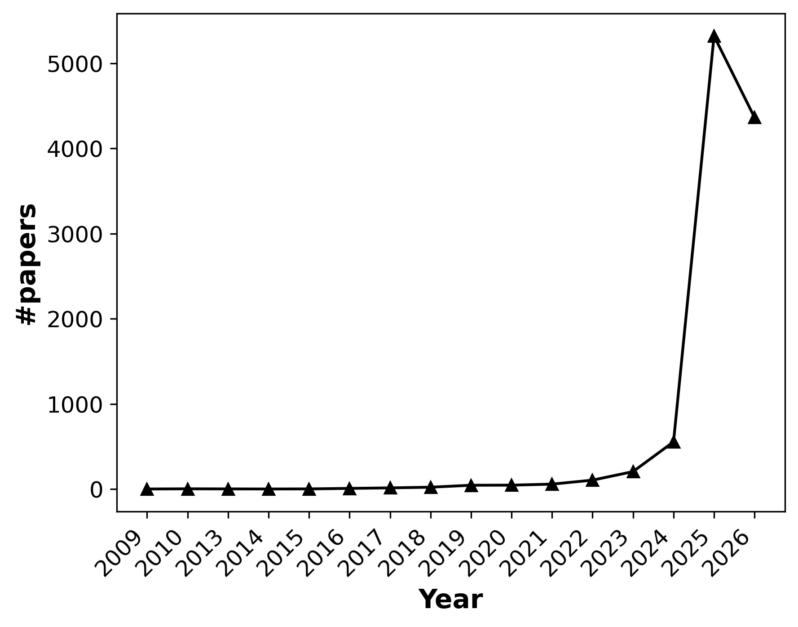

# Visual Reasoning Papers on Arxiv

This is a list of papers in the field of visual reasoning
and is automatically generated by [update_arxiv.py](./tool/update_arxiv.py).

Last update: 2023-09-01 08:02:47

___

## [Sparkles: Unlocking Chats Across Multiple Images for Multimodal Instruction-Following Models](https://arxiv.org/pdf/2308.16463) [New]

*Yupan Huang, Zaiqiao Meng, Fangyu Liu, Yixuan Su, Nigel Collier, Yutong Lu*

**Abstract:** Large language models exhibit enhanced zero-shot performance on various tasks
when fine-tuned with instruction-following data. Multimodal
instruction-following models extend these capabilities by integrating both text
and images. However, existing models such as MiniGPT-4 face challenges in
maintaining dialogue coherence in scenarios involving multiple images. A
primary reason is the lack of a specialized dataset for this critical
application. To bridge these gaps, we present SparklesChat, a multimodal
instruction-following model for open-ended dialogues across multiple images. To
support the training, we introduce SparklesDialogue, the first
machine-generated dialogue dataset tailored for word-level interleaved
multi-image and text interactions. Furthermore, we construct SparklesEval, a
GPT-assisted benchmark for quantitatively assessing a model's conversational
competence across multiple images and dialogue turns. Our experiments validate
the effectiveness of SparklesChat in understanding and reasoning across
multiple images and dialogue turns. Specifically, SparklesChat outperformed
MiniGPT-4 on established vision-and-language benchmarks, including the BISON
binary image selection task and the NLVR2 visual reasoning task. Moreover,
SparklesChat scored 8.56 out of 10 on SparklesEval, substantially exceeding
MiniGPT-4's score of 3.91 and nearing GPT-4's score of 9.26. Qualitative
evaluations further demonstrate SparklesChat's generality in handling
real-world applications. All resources will be available at
https://github.com/HYPJUDY/Sparkles.

**published:** *2023-08-31 05:15:27*, **updated:** *2023-08-31 05:15:27*

 

## [DALL-Eval: Probing the Reasoning Skills and Social Biases of Text-to-Image Generation Models](https://arxiv.org/pdf/2202.04053) [New]

*Jaemin Cho, Abhay Zala, Mohit Bansal*

**Abstract:** Recently, DALL-E, a multimodal transformer language model, and its variants,
including diffusion models, have shown high-quality text-to-image generation
capabilities. However, despite the realistic image generation results, there
has not been a detailed analysis of how to evaluate such models. In this work,
we investigate the visual reasoning capabilities and social biases of different
text-to-image models, covering both multimodal transformer language models and
diffusion models. First, we measure three visual reasoning skills: object
recognition, object counting, and spatial relation understanding. For this, we
propose PaintSkills, a compositional diagnostic evaluation dataset that
measures these skills. Despite the high-fidelity image generation capability, a
large gap exists between the performance of recent models and the upper bound
accuracy in object counting and spatial relation understanding skills. Second,
we assess the gender and skin tone biases by measuring the gender/skin tone
distribution of generated images across various professions and attributes. We
demonstrate that recent text-to-image generation models learn specific biases
about gender and skin tone from web image-text pairs. We hope our work will
help guide future progress in improving text-to-image generation models on
visual reasoning skills and learning socially unbiased representations. Code
and data: https://github.com/j-min/DallEval

**comment:** *ICCV 2023 (34 pages; see appendix for version changelog)*

**published:** *2022-02-08 18:36:52*, **updated:** *2023-08-30 18:41:01*

 

## [On the Potential of CLIP for Compositional Logical Reasoning](https://arxiv.org/pdf/2308.15887) [New]

*Justin Brody*

**Abstract:** In this paper we explore the possibility of using OpenAI's CLIP to perform
logically coherent grounded visual reasoning. To that end, we formalize our
terms and give a geometric analysis of how embeddings in CLIP's latent space
would need to be configured in order for the system to be logically coherent.
Our main conclusion is that, as usually configured, CLIP cannot perform such
reasoning.

**comment:** *In Proceedings ICLP 2023, arXiv:2308.14898*

**links:** http://dx.doi.org/10.4204/EPTCS.385.10

**published:** *2023-08-30 09:04:24*, **updated:** *2023-08-30 09:04:24*

 

## [Grammar-Based Grounded Lexicon Learning](https://arxiv.org/pdf/2202.08806) [New]

*Jiayuan Mao, Haoyue Shi, Jiajun Wu, Roger P. Levy, Joshua B. Tenenbaum*

**Abstract:** We present Grammar-Based Grounded Lexicon Learning (G2L2), a lexicalist
approach toward learning a compositional and grounded meaning representation of
language from grounded data, such as paired images and texts. At the core of
G2L2 is a collection of lexicon entries, which map each word to a tuple of a
syntactic type and a neuro-symbolic semantic program. For example, the word
shiny has a syntactic type of adjective; its neuro-symbolic semantic program
has the symbolic form {\lambda}x. filter(x, SHINY), where the concept SHINY is
associated with a neural network embedding, which will be used to classify
shiny objects. Given an input sentence, G2L2 first looks up the lexicon entries
associated with each token. It then derives the meaning of the sentence as an
executable neuro-symbolic program by composing lexical meanings based on
syntax. The recovered meaning programs can be executed on grounded inputs. To
facilitate learning in an exponentially-growing compositional space, we
introduce a joint parsing and expected execution algorithm, which does local
marginalization over derivations to reduce the training time. We evaluate G2L2
on two domains: visual reasoning and language-driven navigation. Results show
that G2L2 can generalize from small amounts of data to novel compositions of
words.

**comment:** *Minor typo fixes. NeurIPS 2021. Project page:
  https://g2l2.csail.mit.edu/*

**published:** *2022-02-17 18:19:53*, **updated:** *2023-08-24 17:46:12*

 

## [EVE: Efficient Vision-Language Pre-training with Masked Prediction and Modality-Aware MoE](https://arxiv.org/pdf/2308.11971) [New]

*Junyi Chen, Longteng Guo, Jia Sun, Shuai Shao, Zehuan Yuan, Liang Lin, Dongyu Zhang*

**Abstract:** Building scalable vision-language models to learn from diverse, multimodal
data remains an open challenge. In this paper, we introduce an Efficient
Vision-languagE foundation model, namely EVE, which is one unified multimodal
Transformer pre-trained solely by one unified pre-training task. Specifically,
EVE encodes both vision and language within a shared Transformer network
integrated with modality-aware sparse Mixture-of-Experts (MoE) modules, which
capture modality-specific information by selectively switching to different
experts. To unify pre-training tasks of vision and language, EVE performs
masked signal modeling on image-text pairs to reconstruct masked signals, i.e.,
image pixels and text tokens, given visible signals. This simple yet effective
pre-training objective accelerates training by 3.5x compared to the model
pre-trained with Image-Text Contrastive and Image-Text Matching losses. Owing
to the combination of the unified architecture and pre-training task, EVE is
easy to scale up, enabling better downstream performance with fewer resources
and faster training speed. Despite its simplicity, EVE achieves
state-of-the-art performance on various vision-language downstream tasks,
including visual question answering, visual reasoning, and image-text
retrieval.

**published:** *2023-08-23 07:36:30*, **updated:** *2023-08-23 07:36:30*

 

## [Tree-of-Mixed-Thought: Combining Fast and Slow Thinking for Multi-hop Visual Reasoning](https://arxiv.org/pdf/2308.09658) [New]

*Pengbo Hu, Ji Qi, Xingyu Li, Hong Li, Xinqi Wang, Bing Quan, Ruiyu Wang, Yi Zhou*

**Abstract:** There emerges a promising trend of using large language models (LLMs) to
generate code-like plans for complex inference tasks such as visual reasoning.
This paradigm, known as LLM-based planning, provides flexibility in problem
solving and endows better interpretability. However, current research is mostly
limited to basic scenarios of simple questions that can be straightforward
answered in a few inference steps. Planning for the more challenging multi-hop
visual reasoning tasks remains under-explored. Specifically, under multi-hop
reasoning situations, the trade-off between accuracy and the complexity of
plan-searching becomes prominent. The prevailing algorithms either address the
efficiency issue by employing the fast one-stop generation or adopt a complex
iterative generation method to improve accuracy. Both fail to balance the need
for efficiency and performance. Drawing inspiration from the dual system of
cognition in the human brain, the fast and the slow think processes, we propose
a hierarchical plan-searching algorithm that integrates the one-stop reasoning
(fast) and the Tree-of-thought (slow). Our approach succeeds in performance
while significantly saving inference steps. Moreover, we repurpose the PTR and
the CLEVER datasets, developing a systematic framework for evaluating the
performance and efficiency of LLMs-based plan-search algorithms under reasoning
tasks at different levels of difficulty. Extensive experiments demonstrate the
superiority of our proposed algorithm in terms of performance and efficiency.
The dataset and code will be release soon.

**comment:** *16 pages,1 figures, under review*

**published:** *2023-08-18 16:21:40*, **updated:** *2023-08-21 03:08:52*

 

## [BLIVA: A Simple Multimodal LLM for Better Handling of Text-Rich Visual Questions](https://arxiv.org/pdf/2308.09936) [New]

*Wenbo Hu, Yifan Xu, Yi Li, Weiyue Li, Zeyuan Chen, Zhuowen Tu*

**Abstract:** Vision Language Models (VLMs), which extend Large Language Models (LLM) by
incorporating visual understanding capability, have demonstrated significant
advancements in addressing open-ended visual question-answering (VQA) tasks.
However, these models cannot accurately interpret images infused with text, a
common occurrence in real-world scenarios. Standard procedures for extracting
information from images often involve learning a fixed set of query embeddings.
These embeddings are designed to encapsulate image contexts and are later used
as soft prompt inputs in LLMs. Yet, this process is limited to the token count,
potentially curtailing the recognition of scenes with text-rich context. To
improve upon them, the present study introduces BLIVA: an augmented version of
InstructBLIP with Visual Assistant. BLIVA incorporates the query embeddings
from InstructBLIP and also directly projects encoded patch embeddings into the
LLM, a technique inspired by LLaVA. This approach assists the model to capture
intricate details potentially missed during the query decoding process.
Empirical evidence demonstrates that our model, BLIVA, significantly enhances
performance in processing text-rich VQA benchmarks (up to 17.76\% in OCR-VQA
benchmark) and in undertaking typical VQA benchmarks (up to 7.9\% in Visual
Spatial Reasoning benchmark), comparing to our baseline InstructBLIP. BLIVA
demonstrates significant capability in decoding real-world images, irrespective
of text presence. To demonstrate the broad industry applications enabled by
BLIVA, we evaluate the model using a new dataset comprising YouTube thumbnails
paired with question-answer sets across 13 diverse categories. For researchers
interested in further exploration, our code and models are freely accessible at
https://github.com/mlpc-ucsd/BLIVA.git

**published:** *2023-08-19 07:53:43*, **updated:** *2023-08-19 07:53:43*

 

## [Towards Grounded Visual Spatial Reasoning in Multi-Modal Vision Language Models](https://arxiv.org/pdf/2308.09778) [New]

*Navid Rajabi, Jana Kosecka*

**Abstract:** With the advances in large scale vision-and-language models (VLMs) it is of
interest to assess their performance on various visual reasoning tasks such as
counting, referring expressions and general visual question answering. The
focus of this work is to study the ability of these models to understanding
spatial relations. Previously, this has been tackled using image-text matching
(Liu, Emerson, and Collier 2022) or visual question answering task, both
showing poor performance and a large gap compared to human performance. To
better understand the gap, we present fine-grained compositional grounding of
spatial relationships and propose a bottom up approach for ranking spatial
clauses and evaluating the performance of spatial relationship reasoning task.
We propose to combine the evidence from grounding noun phrases corresponding to
objects and their locations to compute the final rank of the spatial clause. We
demonstrate the approach on representative vision-language models (Tan and
Bansal 2019; Gupta et al. 2022; Kamath et al. 2021) and compare and highlight
their abilities to reason about spatial relationships.

**published:** *2023-08-18 18:58:54*, **updated:** *2023-08-18 18:58:54*

 

## [Uni-NLX: Unifying Textual Explanations for Vision and Vision-Language Tasks](https://arxiv.org/pdf/2308.09033) [New]

*Fawaz Sammani, Nikos Deligiannis*

**Abstract:** Natural Language Explanations (NLE) aim at supplementing the prediction of a
model with human-friendly natural text. Existing NLE approaches involve
training separate models for each downstream task. In this work, we propose
Uni-NLX, a unified framework that consolidates all NLE tasks into a single and
compact multi-task model using a unified training objective of text generation.
Additionally, we introduce two new NLE datasets: 1) ImageNetX, a dataset of
144K samples for explaining ImageNet categories, and 2) VQA-ParaX, a dataset of
123K samples for explaining the task of Visual Question Answering (VQA). Both
datasets are derived leveraging large language models (LLMs). By training on
the 1M combined NLE samples, our single unified framework is capable of
simultaneously performing seven NLE tasks including VQA, visual recognition and
visual reasoning tasks with 7X fewer parameters, demonstrating comparable
performance to the independent task-specific models in previous approaches, and
in certain tasks even outperforming them. Code is at
https://github.com/fawazsammani/uni-nlx

**comment:** *Accepted to ICCVW 2023*

**published:** *2023-08-17 15:15:55*, **updated:** *2023-08-17 15:15:55*

 

## [Learning Logic Programs by Discovering Higher-Order Abstractions](https://arxiv.org/pdf/2308.08334) [New]

*Céline Hocquette, Sebastijan Dumančić, Andrew Cropper*

**Abstract:** Discovering novel abstractions is important for human-level AI. We introduce
an approach to discover higher-order abstractions, such as map, filter, and
fold. We focus on inductive logic programming, which induces logic programs
from examples and background knowledge. We introduce the higher-order
refactoring problem, where the goal is to compress a logic program by
introducing higher-order abstractions. We implement our approach in STEVIE,
which formulates the higher-order refactoring problem as a constraint
optimisation problem. Our experimental results on multiple domains, including
program synthesis and visual reasoning, show that, compared to no refactoring,
STEVIE can improve predictive accuracies by 27% and reduce learning times by
47%. We also show that STEVIE can discover abstractions that transfer to
different domains

**published:** *2023-08-16 12:50:10*, **updated:** *2023-08-16 12:50:10*

 

## [Breaking Common Sense: WHOOPS! A Vision-and-Language Benchmark of Synthetic and Compositional Images](https://arxiv.org/pdf/2303.07274) [New]

*Nitzan Bitton-Guetta, Yonatan Bitton, Jack Hessel, Ludwig Schmidt, Yuval Elovici, Gabriel Stanovsky, Roy Schwartz*

**Abstract:** Weird, unusual, and uncanny images pique the curiosity of observers because
they challenge commonsense. For example, an image released during the 2022
world cup depicts the famous soccer stars Lionel Messi and Cristiano Ronaldo
playing chess, which playfully violates our expectation that their competition
should occur on the football field. Humans can easily recognize and interpret
these unconventional images, but can AI models do the same? We introduce
WHOOPS!, a new dataset and benchmark for visual commonsense. The dataset is
comprised of purposefully commonsense-defying images created by designers using
publicly-available image generation tools like Midjourney. We consider several
tasks posed over the dataset. In addition to image captioning, cross-modal
matching, and visual question answering, we introduce a difficult explanation
generation task, where models must identify and explain why a given image is
unusual. Our results show that state-of-the-art models such as GPT3 and BLIP2
still lag behind human performance on WHOOPS!. We hope our dataset will inspire
the development of AI models with stronger visual commonsense reasoning
abilities. Data, models and code are available at the project website:
whoops-benchmark.github.io

**comment:** *Accepted to ICCV 2023. Website: whoops-benchmark.github.io*

**published:** *2023-03-13 16:49:43*, **updated:** *2023-08-12 22:37:31*

 

## [Learning Abstract Visual Reasoning via Task Decomposition: A Case Study in Raven Progressive Matrices](https://arxiv.org/pdf/2308.06528) [New]

*Jakub Kwiatkowski, Krzysztof Krawiec*

**Abstract:** One of the challenges in learning to perform abstract reasoning is that
problems are often posed as monolithic tasks, with no intermediate subgoals. In
Raven Progressive Matrices (RPM), the task is to choose one of the available
answers given a context, where both contexts and answers are composite images
featuring multiple objects in various spatial arrangements. As this high-level
goal is the only guidance available, learning is challenging and most
contemporary solvers tend to be opaque. In this study, we propose a deep
learning architecture based on the transformer blueprint which, rather than
directly making the above choice, predicts the visual properties of individual
objects and their arrangements. The multidimensional predictions obtained in
this way are then directly juxtaposed to choose the answer. We consider a few
ways in which the model parses the visual input into tokens and several regimes
of masking parts of the input in self-supervised training. In experimental
assessment, the models not only outperform state-of-the-art methods but also
provide interesting insights and partial explanations about the inference. The
design of the method also makes it immune to biases that are known to exist in
some RPM benchmarks.

**comment:** *12 pages, 3 figures*

**published:** *2023-08-12 11:02:21*, **updated:** *2023-08-12 11:02:21*

 

## [Tiny LVLM-eHub: Early Multimodal Experiments with Bard](https://arxiv.org/pdf/2308.03729) [New]

*Wenqi Shao, Yutao Hu, Peng Gao, Meng Lei, Kaipeng Zhang, Fanqing Meng, Peng Xu, Siyuan Huang, Hongsheng Li, Yu Qiao, Ping Luo*

**Abstract:** Recent advancements in Large Vision-Language Models (LVLMs) have demonstrated
significant progress in tackling complex multimodal tasks. Among these
cutting-edge developments, Google's Bard stands out for its remarkable
multimodal capabilities, promoting comprehensive comprehension and reasoning
across various domains. This work presents an early and holistic evaluation of
LVLMs' multimodal abilities, with a particular focus on Bard, by proposing a
lightweight variant of LVLM-eHub, named Tiny LVLM-eHub. In comparison to the
vanilla version, Tiny LVLM-eHub possesses several appealing properties.
Firstly, it provides a systematic assessment of six categories of multimodal
capabilities, including visual perception, visual knowledge acquisition, visual
reasoning, visual commonsense, object hallucination, and embodied intelligence,
through quantitative evaluation of $42$ standard text-related visual
benchmarks. Secondly, it conducts an in-depth analysis of LVLMs' predictions
using the ChatGPT Ensemble Evaluation (CEE), which leads to a robust and
accurate evaluation and exhibits improved alignment with human evaluation
compared to the word matching approach. Thirdly, it comprises a mere $2.1$K
image-text pairs, facilitating ease of use for practitioners to evaluate their
own offline LVLMs. Through extensive experimental analysis, this study
demonstrates that Bard outperforms previous LVLMs in most multimodal
capabilities except object hallucination, to which Bard is still susceptible.
Tiny LVLM-eHub serves as a baseline evaluation for various LVLMs and encourages
innovative strategies aimed at advancing multimodal techniques. Our project is
publicly available at \url{https://github.com/OpenGVLab/Multi-Modality-Arena}.

**comment:** *24 pages, 24 figures, 7 Tables. Project Page:
  http://lvlm-ehub.opengvlab.com/*

**published:** *2023-08-07 17:17:05*, **updated:** *2023-08-07 17:17:05*

 

## [How is ChatGPT's behavior changing over time?](https://arxiv.org/pdf/2307.09009) [New]

*Lingjiao Chen, Matei Zaharia, James Zou*

**Abstract:** GPT-3.5 and GPT-4 are the two most widely used large language model (LLM)
services. However, when and how these models are updated over time is opaque.
Here, we evaluate the March 2023 and June 2023 versions of GPT-3.5 and GPT-4 on
several diverse tasks: 1) math problems, 2) sensitive/dangerous questions, 3)
opinion surveys, 4) multi-hop knowledge-intensive questions, 5) generating
code, 6) US Medical License tests, and 7) visual reasoning. We find that the
performance and behavior of both GPT-3.5 and GPT-4 can vary greatly over time.
For example, GPT-4 (March 2023) was reasonable at identifying prime vs.
composite numbers (84% accuracy) but GPT-4 (June 2023) was poor on these same
questions (51% accuracy). This is partly explained by a drop in GPT-4's amenity
to follow chain-of-thought prompting. Interestingly, GPT-3.5 was much better in
June than in March in this task. GPT-4 became less willing to answer sensitive
questions and opinion survey questions in June than in March. GPT-4 performed
better at multi-hop questions in June than in March, while GPT-3.5's
performance dropped on this task. Both GPT-4 and GPT-3.5 had more formatting
mistakes in code generation in June than in March. Overall, our findings show
that the behavior of the "same" LLM service can change substantially in a
relatively short amount of time, highlighting the need for continuous
monitoring of LLMs.

**comment:** *add more evaluations*

**published:** *2023-07-18 06:56:08*, **updated:** *2023-08-01 14:23:58*

 

## [Bridging the Gap: Exploring the Capabilities of Bridge-Architectures for Complex Visual Reasoning Tasks](https://arxiv.org/pdf/2307.16395)

*Kousik Rajesh, Mrigank Raman, Mohammed Asad Karim, Pranit Chawla*

**Abstract:** In recent times there has been a surge of multi-modal architectures based on
Large Language Models, which leverage the zero shot generation capabilities of
LLMs and project image embeddings into the text space and then use the
auto-regressive capacity to solve tasks such as VQA, captioning, and image
retrieval. We name these architectures as "bridge-architectures" as they
project from the image space to the text space. These models deviate from the
traditional recipe of training transformer based multi-modal models, which
involve using large-scale pre-training and complex multi-modal interactions
through co or cross attention. However, the capabilities of bridge
architectures have not been tested on complex visual reasoning tasks which
require fine grained analysis about the image. In this project, we investigate
the performance of these bridge-architectures on the NLVR2 dataset, and compare
it to state-of-the-art transformer based architectures. We first extend the
traditional bridge architectures for the NLVR2 dataset, by adding object level
features to faciliate fine-grained object reasoning. Our analysis shows that
adding object level features to bridge architectures does not help, and that
pre-training on multi-modal data is key for good performance on complex
reasoning tasks such as NLVR2. We also demonstrate some initial results on a
recently bridge-architecture, LLaVA, in the zero shot setting and analyze its
performance.

**published:** *2023-07-31 03:57:31*, **updated:** *2023-07-31 03:57:31*

 

## [LOIS: Looking Out of Instance Semantics for Visual Question Answering](https://arxiv.org/pdf/2307.14142)

*Siyu Zhang, Yeming Chen, Yaoru Sun, Fang Wang, Haibo Shi, Haoran Wang*

**Abstract:** Visual question answering (VQA) has been intensively studied as a multimodal
task that requires effort in bridging vision and language to infer answers
correctly. Recent attempts have developed various attention-based modules for
solving VQA tasks. However, the performance of model inference is largely
bottlenecked by visual processing for semantics understanding. Most existing
detection methods rely on bounding boxes, remaining a serious challenge for VQA
models to understand the causal nexus of object semantics in images and
correctly infer contextual information. To this end, we propose a finer model
framework without bounding boxes in this work, termed Looking Out of Instance
Semantics (LOIS) to tackle this important issue. LOIS enables more fine-grained
feature descriptions to produce visual facts. Furthermore, to overcome the
label ambiguity caused by instance masks, two types of relation attention
modules: 1) intra-modality and 2) inter-modality, are devised to infer the
correct answers from the different multi-view features. Specifically, we
implement a mutual relation attention module to model sophisticated and deeper
visual semantic relations between instance objects and background information.
In addition, our proposed attention model can further analyze salient image
regions by focusing on important word-related questions. Experimental results
on four benchmark VQA datasets prove that our proposed method has favorable
performance in improving visual reasoning capability.

**published:** *2023-07-26 12:13:00*, **updated:** *2023-07-26 12:13:00*

 

## [MAP: Multimodal Uncertainty-Aware Vision-Language Pre-training Model](https://arxiv.org/pdf/2210.05335)

*Yatai Ji, Junjie Wang, Yuan Gong, Lin Zhang, Yanru Zhu, Hongfa Wang, Jiaxing Zhang, Tetsuya Sakai, Yujiu Yang*

**Abstract:** Multimodal semantic understanding often has to deal with uncertainty, which
means the obtained messages tend to refer to multiple targets. Such uncertainty
is problematic for our interpretation, including inter- and intra-modal
uncertainty. Little effort has studied the modeling of this uncertainty,
particularly in pre-training on unlabeled datasets and fine-tuning in
task-specific downstream datasets. In this paper, we project the
representations of all modalities as probabilistic distributions via a
Probability Distribution Encoder (PDE) by utilizing sequence-level
interactions. Compared to the existing deterministic methods, such uncertainty
modeling can convey richer multimodal semantic information and more complex
relationships. Furthermore, we integrate uncertainty modeling with popular
pre-training frameworks and propose suitable pre-training tasks:
Distribution-based Vision-Language Contrastive learning (D-VLC),
Distribution-based Masked Language Modeling (D-MLM), and Distribution-based
Image-Text Matching (D-ITM). The fine-tuned models are applied to challenging
downstream tasks, including image-text retrieval, visual question answering,
visual reasoning, and visual entailment, and achieve state-of-the-art results.

**comment:** *CVPR 2023 Main Track Long Paper*

**published:** *2022-10-11 10:54:54*, **updated:** *2023-07-20 16:24:14*

 

## [Unsupervised Conditional Slot Attention for Object Centric Learning](https://arxiv.org/pdf/2307.09437)

*Avinash Kori, Francesco Locatello, Francesca Toni, Ben Glocker*

**Abstract:** Extracting object-level representations for downstream reasoning tasks is an
emerging area in AI. Learning object-centric representations in an unsupervised
setting presents multiple challenges, a key one being binding an arbitrary
number of object instances to a specialized object slot. Recent object-centric
representation methods like Slot Attention utilize iterative attention to learn
composable representations with dynamic inference level binding but fail to
achieve specialized slot level binding. To address this, in this paper we
propose Unsupervised Conditional Slot Attention using a novel Probabilistic
Slot Dictionary (PSD). We define PSD with (i) abstract object-level property
vectors as key and (ii) parametric Gaussian distribution as its corresponding
value. We demonstrate the benefits of the learnt specific object-level
conditioning distributions in multiple downstream tasks, namely object
discovery, compositional scene generation, and compositional visual reasoning.
We show that our method provides scene composition capabilities and a
significant boost in a few shot adaptability tasks of compositional visual
reasoning, while performing similarly or better than slot attention in object
discovery tasks

**published:** *2023-07-18 17:11:55*, **updated:** *2023-07-18 17:11:55*

 

## [Does Visual Pretraining Help End-to-End Reasoning?](https://arxiv.org/pdf/2307.08506)

*Chen Sun, Calvin Luo, Xingyi Zhou, Anurag Arnab, Cordelia Schmid*

**Abstract:** We aim to investigate whether end-to-end learning of visual reasoning can be
achieved with general-purpose neural networks, with the help of visual
pretraining. A positive result would refute the common belief that explicit
visual abstraction (e.g. object detection) is essential for compositional
generalization on visual reasoning, and confirm the feasibility of a neural
network "generalist" to solve visual recognition and reasoning tasks. We
propose a simple and general self-supervised framework which "compresses" each
video frame into a small set of tokens with a transformer network, and
reconstructs the remaining frames based on the compressed temporal context. To
minimize the reconstruction loss, the network must learn a compact
representation for each image, as well as capture temporal dynamics and object
permanence from temporal context. We perform evaluation on two visual reasoning
benchmarks, CATER and ACRE. We observe that pretraining is essential to achieve
compositional generalization for end-to-end visual reasoning. Our proposed
framework outperforms traditional supervised pretraining, including image
classification and explicit object detection, by large margins.

**published:** *2023-07-17 14:08:38*, **updated:** *2023-07-17 14:08:38*

 

## [Explicit3D: Graph Network with Spatial Inference for Single Image 3D Object Detection](https://arxiv.org/pdf/2302.06494)

*Yanjun Liu, Wenming Yang*

**Abstract:** Indoor 3D object detection is an essential task in single image scene
understanding, impacting spatial cognition fundamentally in visual reasoning.
Existing works on 3D object detection from a single image either pursue this
goal through independent predictions of each object or implicitly reason over
all possible objects, failing to harness relational geometric information
between objects. To address this problem, we propose a dynamic sparse graph
pipeline named Explicit3D based on object geometry and semantics features.
Taking the efficiency into consideration, we further define a relatedness score
and design a novel dynamic pruning algorithm followed by a cluster sampling
method for sparse scene graph generation and updating. Furthermore, our
Explicit3D introduces homogeneous matrices and defines new relative loss and
corner loss to model the spatial difference between target pairs explicitly.
Instead of using ground-truth labels as direct supervision, our relative and
corner loss are derived from the homogeneous transformation, which renders the
model to learn the geometric consistency between objects. The experimental
results on the SUN RGB-D dataset demonstrate that our Explicit3D achieves
better performance balance than the-state-of-the-art.

**published:** *2023-02-13 16:19:54*, **updated:** *2023-07-15 10:25:29*

 

## [Abstracting Concept-Changing Rules for Solving Raven's Progressive Matrix Problems](https://arxiv.org/pdf/2307.07734)

*Fan Shi, Bin Li, Xiangyang Xue*

**Abstract:** The abstract visual reasoning ability in human intelligence benefits
discovering underlying rules in the novel environment. Raven's Progressive
Matrix (RPM) is a classic test to realize such ability in machine intelligence
by selecting from candidates. Recent studies suggest that solving RPM in an
answer-generation way boosts a more in-depth understanding of rules. However,
existing generative solvers cannot discover the global concept-changing rules
without auxiliary supervision (e.g., rule annotations and distractors in
candidate sets). To this end, we propose a deep latent variable model for
Concept-changing Rule ABstraction (CRAB) by learning interpretable concepts and
parsing concept-changing rules in the latent space. With the iterative learning
process, CRAB can automatically abstract global rules shared on the dataset on
each concept and form the learnable prior knowledge of global rules. CRAB
outperforms the baselines trained without auxiliary supervision in the
arbitrary-position answer generation task and achieves comparable and even
higher accuracy than the compared models trained with auxiliary supervision.
Finally, we conduct experiments to illustrate the interpretability of CRAB in
concept learning, answer selection, and global rule abstraction.

**published:** *2023-07-15 07:16:38*, **updated:** *2023-07-15 07:16:38*

 

## [Learning Differentiable Logic Programs for Abstract Visual Reasoning](https://arxiv.org/pdf/2307.00928)

*Hikaru Shindo, Viktor Pfanschilling, Devendra Singh Dhami, Kristian Kersting*

**Abstract:** Visual reasoning is essential for building intelligent agents that understand
the world and perform problem-solving beyond perception. Differentiable forward
reasoning has been developed to integrate reasoning with gradient-based machine
learning paradigms. However, due to the memory intensity, most existing
approaches do not bring the best of the expressivity of first-order logic,
excluding a crucial ability to solve abstract visual reasoning, where agents
need to perform reasoning by using analogies on abstract concepts in different
scenarios. To overcome this problem, we propose NEUro-symbolic Message-pAssiNg
reasoNer (NEUMANN), which is a graph-based differentiable forward reasoner,
passing messages in a memory-efficient manner and handling structured programs
with functors. Moreover, we propose a computationally-efficient structure
learning algorithm to perform explanatory program induction on complex visual
scenes. To evaluate, in addition to conventional visual reasoning tasks, we
propose a new task, visual reasoning behind-the-scenes, where agents need to
learn abstract programs and then answer queries by imagining scenes that are
not observed. We empirically demonstrate that NEUMANN solves visual reasoning
tasks efficiently, outperforming neural, symbolic, and neuro-symbolic
baselines.

**comment:** *under review*

**published:** *2023-07-03 11:02:40*, **updated:** *2023-07-03 11:02:40*

 

## [V-LoL: A Diagnostic Dataset for Visual Logical Learning](https://arxiv.org/pdf/2306.07743)

*Lukas Helff, Wolfgang Stammer, Hikaru Shindo, Devendra Singh Dhami, Kristian Kersting*

**Abstract:** Despite the successes of recent developments in visual AI, different
shortcomings still exist; from missing exact logical reasoning, to abstract
generalization abilities, to understanding complex and noisy scenes.
Unfortunately, existing benchmarks, were not designed to capture more than a
few of these aspects. Whereas deep learning datasets focus on visually complex
data but simple visual reasoning tasks, inductive logic datasets involve
complex logical learning tasks, however, lack the visual component. To address
this, we propose the visual logical learning dataset, V-LoL, that seamlessly
combines visual and logical challenges. Notably, we introduce the first
instantiation of V-LoL, V-LoL-Trains, -- a visual rendition of a classic
benchmark in symbolic AI, the Michalski train problem. By incorporating
intricate visual scenes and flexible logical reasoning tasks within a versatile
framework, V-LoL-Trains provides a platform for investigating a wide range of
visual logical learning challenges. We evaluate a variety of AI systems
including traditional symbolic AI, neural AI, as well as neuro-symbolic AI. Our
evaluations demonstrate that even state-of-the-art AI faces difficulties in
dealing with visual logical learning challenges, highlighting unique advantages
and limitations specific to each methodology. Overall, V-LoL opens up new
avenues for understanding and enhancing current abilities in visual logical
learning for AI systems.

**published:** *2023-06-13 13:00:10*, **updated:** *2023-07-03 10:24:33*

 

## [Look, Remember and Reason: Visual Reasoning with Grounded Rationales](https://arxiv.org/pdf/2306.17778)

*Apratim Bhattacharyya, Sunny Panchal, Mingu Lee, Reza Pourreza, Pulkit Madan, Roland Memisevic*

**Abstract:** Large language models have recently shown human level performance on a
variety of reasoning tasks. However, the ability of these models to perform
complex visual reasoning has not been studied in detail yet. A key challenge in
many visual reasoning tasks is that the visual information needs to be tightly
integrated in the reasoning process. We propose to address this challenge by
drawing inspiration from human visual problem solving which depends on a
variety of low-level visual capabilities. It can often be cast as the three
step-process of ``Look, Remember, Reason'': visual information is incrementally
extracted using low-level visual routines in a step-by-step fashion until a
final answer is reached. We follow the same paradigm to enable existing large
language models, with minimal changes to the architecture, to solve visual
reasoning problems. To this end, we introduce rationales over the visual input
that allow us to integrate low-level visual capabilities, such as object
recognition and tracking, as surrogate tasks. We show competitive performance
on diverse visual reasoning tasks from the CLEVR, CATER, and ACRE datasets over
state-of-the-art models designed specifically for these tasks.

**published:** *2023-06-30 16:31:14*, **updated:** *2023-06-30 16:31:14*

 

## [Stop Pre-Training: Adapt Visual-Language Models to Unseen Languages](https://arxiv.org/pdf/2306.16774)

*Yasmine Karoui, Rémi Lebret, Negar Foroutan, Karl Aberer*

**Abstract:** Vision-Language Pre-training (VLP) has advanced the performance of many
vision-language tasks, such as image-text retrieval, visual entailment, and
visual reasoning. The pre-training mostly utilizes lexical databases and image
queries in English. Previous work has demonstrated that the pre-training in
English does not transfer well to other languages in a zero-shot setting.
However, multilingual pre-trained language models (MPLM) have excelled at a
variety of single-modal language tasks. In this paper, we propose a simple yet
efficient approach to adapt VLP to unseen languages using MPLM. We utilize a
cross-lingual contextualized token embeddings alignment approach to train text
encoders for non-English languages. Our approach does not require image input
and primarily uses machine translation, eliminating the need for target
language data. Our evaluation across three distinct tasks (image-text
retrieval, visual entailment, and natural language visual reasoning)
demonstrates that this approach outperforms the state-of-the-art multilingual
vision-language models without requiring large parallel corpora. Our code is
available at https://github.com/Yasminekaroui/CliCoTea.

**comment:** *Accepted to ACL 2023 as short paper*

**published:** *2023-06-29 08:20:57*, **updated:** *2023-06-29 08:20:57*

 

## [PhD Thesis: Exploring the role of (self-)attention in cognitive and computer vision architecture](https://arxiv.org/pdf/2306.14650)

*Mohit Vaishnav*

**Abstract:** We investigate the role of attention and memory in complex reasoning tasks.
We analyze Transformer-based self-attention as a model and extend it with
memory. By studying a synthetic visual reasoning test, we refine the taxonomy
of reasoning tasks. Incorporating self-attention with ResNet50, we enhance
feature maps using feature-based and spatial attention, achieving efficient
solving of challenging visual reasoning tasks. Our findings contribute to
understanding the attentional needs of SVRT tasks. Additionally, we propose
GAMR, a cognitive architecture combining attention and memory, inspired by
active vision theory. GAMR outperforms other architectures in sample
efficiency, robustness, and compositionality, and shows zero-shot
generalization on new reasoning tasks.

**comment:** *PhD Thesis, 152 pages, 32 figures, 6 tables*

**published:** *2023-06-26 12:40:12*, **updated:** *2023-06-28 08:22:14*

 

## [A Survey on Multimodal Large Language Models](https://arxiv.org/pdf/2306.13549)

*Shukang Yin, Chaoyou Fu, Sirui Zhao, Ke Li, Xing Sun, Tong Xu, Enhong Chen*

**Abstract:** Multimodal Large Language Model (MLLM) recently has been a new rising
research hotspot, which uses powerful Large Language Models (LLMs) as a brain
to perform multimodal tasks. The surprising emergent capabilities of MLLM, such
as writing stories based on images and OCR-free math reasoning, are rare in
traditional methods, suggesting a potential path to artificial general
intelligence. In this paper, we aim to trace and summarize the recent progress
of MLLM. First of all, we present the formulation of MLLM and delineate its
related concepts. Then, we discuss the key techniques and applications,
including Multimodal Instruction Tuning (M-IT), Multimodal In-Context Learning
(M-ICL), Multimodal Chain of Thought (M-CoT), and LLM-Aided Visual Reasoning
(LAVR). Finally, we discuss existing challenges and point out promising
research directions. In light of the fact that the era of MLLM has only just
begun, we will keep updating this survey and hope it can inspire more research.
An associated GitHub link collecting the latest papers is available at
https://github.com/BradyFU/Awesome-Multimodal-Large-Language-Models.

**comment:** *Project
  page:https://github.com/BradyFU/Awesome-Multimodal-Large-Language-Models*

**published:** *2023-06-23 15:21:52*, **updated:** *2023-06-23 15:21:52*

 

## [Abstract Visual Reasoning Enabled by Language](https://arxiv.org/pdf/2303.04091)

*Giacomo Camposampiero, Loic Houmard, Benjamin Estermann, Joël Mathys, Roger Wattenhofer*

**Abstract:** While artificial intelligence (AI) models have achieved human or even
superhuman performance in many well-defined applications, they still struggle
to show signs of broad and flexible intelligence. The Abstraction and Reasoning
Corpus (ARC), a visual intelligence benchmark introduced by Fran\c{c}ois
Chollet, aims to assess how close AI systems are to human-like cognitive
abilities. Most current approaches rely on carefully handcrafted
domain-specific program searches to brute-force solutions for the tasks present
in ARC. In this work, we propose a general learning-based framework for solving
ARC. It is centered on transforming tasks from the vision to the language
domain. This composition of language and vision allows for pre-trained models
to be leveraged at each stage, enabling a shift from handcrafted priors towards
the learned priors of the models. While not yet beating state-of-the-art models
on ARC, we demonstrate the potential of our approach, for instance, by solving
some ARC tasks that have not been solved previously.

**comment:** *The first two authors have contributed equally to this work. Accepted
  as regular paper at CVPR 2023 Workshop and Challenges for New Frontiers in
  Visual Language Reasoning: Compositionality, Prompts and Causality (NFVLR)*

**published:** *2023-03-07 17:52:46*, **updated:** *2023-06-22 10:41:41*

 

## [MAMO: Masked Multimodal Modeling for Fine-Grained Vision-Language Representation Learning](https://arxiv.org/pdf/2210.04183)

*Zijia Zhao, Longteng Guo, Xingjian He, Shuai Shao, Zehuan Yuan, Jing Liu*

**Abstract:** Multimodal representation learning has shown promising improvements on
various vision-language tasks. Most existing methods excel at building
global-level alignment between vision and language while lacking effective
fine-grained image-text interaction. In this paper, we propose a jointly masked
multimodal modeling method to learn fine-grained multimodal representations.
Our method performs joint masking on image-text input and integrates both
implicit and explicit targets for the masked signals to recover. The implicit
target provides a unified and debiased objective for vision and language, where
the model predicts latent multimodal representations of the unmasked input. The
explicit target further enriches the multimodal representations by recovering
high-level and semantically meaningful information: momentum visual features of
image patches and concepts of word tokens. Through such a masked modeling
process, our model not only learns fine-grained multimodal interaction, but
also avoids the semantic gap between high-level representations and low- or
mid-level prediction targets (e.g. image pixels), thus producing semantically
rich multimodal representations that perform well on both zero-shot and
fine-tuned settings. Our pre-trained model (named MAMO) achieves
state-of-the-art performance on various downstream vision-language tasks,
including image-text retrieval, visual question answering, visual reasoning,
and weakly-supervised visual grounding.

**comment:** *SIGIR 2023, 10 pages*

**links:** http://dx.doi.org/10.1145/3539618.3591721

**published:** *2022-10-09 06:31:15*, **updated:** *2023-06-14 07:26:20*

 

## [A Domain-Independent Agent Architecture for Adaptive Operation in Evolving Open Worlds](https://arxiv.org/pdf/2306.06272)

*Shiwali Mohan, Wiktor Piotrowski, Roni Stern, Sachin Grover, Sookyung Kim, Jacob Le, Johan De Kleer*

**Abstract:** Model-based reasoning agents are ill-equipped to act in novel situations in
which their model of the environment no longer sufficiently represents the
world. We propose HYDRA - a framework for designing model-based agents
operating in mixed discrete-continuous worlds, that can autonomously detect
when the environment has evolved from its canonical setup, understand how it
has evolved, and adapt the agents' models to perform effectively. HYDRA is
based upon PDDL+, a rich modeling language for planning in mixed,
discrete-continuous environments. It augments the planning module with visual
reasoning, task selection, and action execution modules for closed-loop
interaction with complex environments. HYDRA implements a novel meta-reasoning
process that enables the agent to monitor its own behavior from a variety of
aspects. The process employs a diverse set of computational methods to maintain
expectations about the agent's own behavior in an environment. Divergences from
those expectations are useful in detecting when the environment has evolved and
identifying opportunities to adapt the underlying models. HYDRA builds upon
ideas from diagnosis and repair and uses a heuristics-guided search over model
changes such that they become competent in novel conditions. The HYDRA
framework has been used to implement novelty-aware agents for three diverse
domains - CartPole++ (a higher dimension variant of a classic control problem),
Science Birds (an IJCAI competition problem), and PogoStick (a specific problem
domain in Minecraft). We report empirical observations from these domains to
demonstrate the efficacy of various components in the novelty meta-reasoning
process.

**comment:** *Under review in Artificial Intelligence Journal - Open World Learning
  track*

**published:** *2023-06-09 21:54:13*, **updated:** *2023-06-09 21:54:13*

 

## [Position-guided Text Prompt for Vision-Language Pre-training](https://arxiv.org/pdf/2212.09737)

*Alex Jinpeng Wang, Pan Zhou, Mike Zheng Shou, Shuicheng Yan*

**Abstract:** Vision-Language Pre-Training (VLP) has shown promising capabilities to align
image and text pairs, facilitating a broad variety of cross-modal learning
tasks. However, we observe that VLP models often lack the visual
grounding/localization capability which is critical for many downstream tasks
such as visual reasoning. In this work, we propose a novel Position-guided Text
Prompt (PTP) paradigm to enhance the visual grounding ability of cross-modal
models trained with VLP. Specifically, in the VLP phase, PTP divides the image
into $N\times N$ blocks, and identifies the objects in each block through the
widely used object detector in VLP. It then reformulates the visual grounding
task into a fill-in-the-blank problem given a PTP by encouraging the model to
predict the objects in the given blocks or regress the blocks of a given
object, e.g. filling `P" or ``O" in aPTP ``The block P has a O". This mechanism
improves the visual grounding capability of VLP models and thus helps them
better handle various downstream tasks. By introducing PTP into several
state-of-the-art VLP frameworks, we observe consistently significant
improvements across representative cross-modal learning model architectures and
several benchmarks, e.g. zero-shot Flickr30K Retrieval (+4.8 in average
recall@1) for ViLT \cite{vilt} baseline, and COCO Captioning (+5.3 in CIDEr)
for SOTA BLIP \cite{blip} baseline. Moreover, PTP achieves comparable results
with object-detector based methods, and much faster inference speed since PTP
discards its object detector for inference while the later cannot. Our code and
pre-trained weight will be released at \url{https://github.com/sail-sg/ptp}.

**comment:** *Camera-ready version, code is in https://github.com/sail-sg/ptp*

**published:** *2022-12-19 18:55:43*, **updated:** *2023-06-07 06:28:18*

 

## [Systematic Visual Reasoning through Object-Centric Relational Abstraction](https://arxiv.org/pdf/2306.02500)

*Taylor W. Webb, Shanka Subhra Mondal, Jonathan D. Cohen*

**Abstract:** Human visual reasoning is characterized by an ability to identify abstract
patterns from only a small number of examples, and to systematically generalize
those patterns to novel inputs. This capacity depends in large part on our
ability to represent complex visual inputs in terms of both objects and
relations. Recent work in computer vision has introduced models with the
capacity to extract object-centric representations, leading to the ability to
process multi-object visual inputs, but falling short of the systematic
generalization displayed by human reasoning. Other recent models have employed
inductive biases for relational abstraction to achieve systematic
generalization of learned abstract rules, but have generally assumed the
presence of object-focused inputs. Here, we combine these two approaches,
introducing Object-Centric Relational Abstraction (OCRA), a model that extracts
explicit representations of both objects and abstract relations, and achieves
strong systematic generalization in tasks involving complex visual displays.

**published:** *2023-06-04 22:47:17*, **updated:** *2023-06-04 22:47:17*

 

## [Super-CLEVR: A Virtual Benchmark to Diagnose Domain Robustness in Visual Reasoning](https://arxiv.org/pdf/2212.00259)

*Zhuowan Li, Xingrui Wang, Elias Stengel-Eskin, Adam Kortylewski, Wufei Ma, Benjamin Van Durme, Alan Yuille*

**Abstract:** Visual Question Answering (VQA) models often perform poorly on
out-of-distribution data and struggle on domain generalization. Due to the
multi-modal nature of this task, multiple factors of variation are intertwined,
making generalization difficult to analyze. This motivates us to introduce a
virtual benchmark, Super-CLEVR, where different factors in VQA domain shifts
can be isolated in order that their effects can be studied independently. Four
factors are considered: visual complexity, question redundancy, concept
distribution and concept compositionality. With controllably generated data,
Super-CLEVR enables us to test VQA methods in situations where the test data
differs from the training data along each of these axes. We study four existing
methods, including two neural symbolic methods NSCL and NSVQA, and two
non-symbolic methods FiLM and mDETR; and our proposed method, probabilistic
NSVQA (P-NSVQA), which extends NSVQA with uncertainty reasoning. P-NSVQA
outperforms other methods on three of the four domain shift factors. Our
results suggest that disentangling reasoning and perception, combined with
probabilistic uncertainty, form a strong VQA model that is more robust to
domain shifts. The dataset and code are released at
https://github.com/Lizw14/Super-CLEVR.

**comment:** *Published in CVPR 2023 as Highlight. Data and code are released at
  https://github.com/Lizw14/Super-CLEVR*

**published:** *2022-12-01 03:53:24*, **updated:** *2023-06-01 03:57:12*

 

## [lilGym: Natural Language Visual Reasoning with Reinforcement Learning](https://arxiv.org/pdf/2211.01994)

*Anne Wu, Kianté Brantley, Noriyuki Kojima, Yoav Artzi*

**Abstract:** We present lilGym, a new benchmark for language-conditioned reinforcement
learning in visual environments. lilGym is based on 2,661 highly-compositional
human-written natural language statements grounded in an interactive visual
environment. We introduce a new approach for exact reward computation in every
possible world state by annotating all statements with executable Python
programs. Each statement is paired with multiple start states and reward
functions to form thousands of distinct Markov Decision Processes of varying
difficulty. We experiment with lilGym with different models and learning
regimes. Our results and analysis show that while existing methods are able to
achieve non-trivial performance, lilGym forms a challenging open problem.
lilGym is available at https://lil.nlp.cornell.edu/lilgym/.

**comment:** *ACL 2023 Long Paper*

**published:** *2022-11-03 17:08:26*, **updated:** *2023-05-29 15:44:36*

 

## [Discovering Novel Actions in an Open World with Object-Grounded Visual Commonsense Reasoning](https://arxiv.org/pdf/2305.16602)

*Sathyanarayanan N. Aakur, Sanjoy Kundu, Shubham Trehan*

**Abstract:** Learning to infer labels in an open world, i.e., in an environment where the
target ``labels'' are unknown, is an important characteristic for achieving
autonomy. Foundation models pre-trained on enormous amounts of data have shown
remarkable generalization skills through prompting, particularly in zero-shot
inference. However, their performance is restricted to the correctness of the
target label's search space. In an open world where these labels are unknown,
the search space can be exceptionally large. It can require reasoning over
several combinations of elementary concepts to arrive at an inference, which
severely restricts the performance of such models. To tackle this challenging
problem, we propose a neuro-symbolic framework called ALGO - novel Action
Learning with Grounded Object recognition that can use symbolic knowledge
stored in large-scale knowledge bases to infer activities (verb-noun
combinations) in egocentric videos with limited supervision using two steps.
First, we propose a novel neuro-symbolic prompting approach that uses
object-centric vision-language foundation models as a noisy oracle to ground
objects in the video through evidence-based reasoning. Second, driven by prior
commonsense knowledge, we discover plausible activities through an energy-based
symbolic pattern theory framework and learn to ground knowledge-based action
(verb) concepts in the video. Extensive experiments on two publicly available
datasets (GTEA Gaze and GTEA Gaze Plus) demonstrate its performance on
open-world activity inference and its generalization to unseen actions in an
unknown search space. We show that ALGO can be extended to zero-shot settings
and demonstrate its competitive performance to multimodal foundation models.

**comment:** *13 Pages, 2 figures, 3 tables*

**published:** *2023-05-26 03:21:30*, **updated:** *2023-05-26 03:21:30*

 

## [GRILL: Grounded Vision-language Pre-training via Aligning Text and Image Regions](https://arxiv.org/pdf/2305.14676)

*Woojeong Jin, Subhabrata Mukherjee, Yu Cheng, Yelong Shen, Weizhu Chen, Ahmed Hassan Awadallah, Damien Jose, Xiang Ren*

**Abstract:** Generalization to unseen tasks is an important ability for few-shot learners
to achieve better zero-/few-shot performance on diverse tasks. However, such
generalization to vision-language tasks including grounding and generation
tasks has been under-explored; existing few-shot VL models struggle to handle
tasks that involve object grounding and multiple images such as visual
commonsense reasoning or NLVR2. In this paper, we introduce GRILL, GRounded
vIsion Language aLigning, a novel VL model that can be generalized to diverse
tasks including visual question answering, captioning, and grounding tasks with
no or very few training instances. Specifically, GRILL learns object grounding
and localization by exploiting object-text alignments, which enables it to
transfer to grounding tasks in a zero-/few-shot fashion. We evaluate our model
on various zero-/few-shot VL tasks and show that it consistently surpasses the
state-of-the-art few-shot methods.

**comment:** *Preprint*

**published:** *2023-05-24 03:33:21*, **updated:** *2023-05-24 03:33:21*

 

## [OR-NeRF: Object Removing from 3D Scenes Guided by Multiview Segmentation with Neural Radiance Fields](https://arxiv.org/pdf/2305.10503)

*Youtan Yin, Zhoujie Fu, Fan Yang, Guosheng Lin*

**Abstract:** The emergence of Neural Radiance Fields (NeRF) for novel view synthesis has
led to increased interest in 3D scene editing. One important task in editing is
removing objects from a scene while ensuring visual reasonability and multiview
consistency. However, current methods face challenges such as time-consuming
object labelling, limited capability to remove specific targets, and
compromised rendering quality after removal. This paper proposes a novel
object-removing pipeline, named OR-NeRF, that can remove objects from 3D scenes
with either point or text prompts on a single view, achieving better
performance in less time than previous works. Our method uses a points
projection strategy to rapidly spread user annotations to all views,
significantly reducing the processing burden. This algorithm allows us to
leverage the recent 2D segmentation model Segment-Anything (SAM) to predict
masks with improved precision and efficiency. Additionally, we obtain colour
and depth priors through 2D inpainting methods. Finally, our algorithm employs
depth supervision and perceptual loss for scene reconstruction to maintain
consistency in geometry and appearance after object removal. Experimental
results demonstrate that our method achieves better editing quality with less
time than previous works, considering both quality and quantity.

**comment:** *project site: https://ornerf.github.io/ (codes availabel)*

**published:** *2023-05-17 18:18:05*, **updated:** *2023-05-24 03:32:11*

 

## [Enhancing Interpretability and Interactivity in Robot Manipulation: A Neurosymbolic Approach](https://arxiv.org/pdf/2210.00858)

*Georgios Tziafas, Hamidreza Kasaei*

**Abstract:** In this paper we present a neurosymbolic architecture for coupling
language-guided visual reasoning with robot manipulation. A non-expert human
user can prompt the robot using unconstrained natural language, providing a
referring expression (REF), a question (VQA), or a grasp action instruction.
The system tackles all cases in a task-agnostic fashion through the utilization
of a shared library of primitive skills. Each primitive handles an independent
sub-task, such as reasoning about visual attributes, spatial relation
comprehension, logic and enumeration, as well as arm control. A language parser
maps the input query to an executable program composed of such primitives,
depending on the context. While some primitives are purely symbolic operations
(e.g. counting), others are trainable neural functions (e.g. visual grounding),
therefore marrying the interpretability and systematic generalization benefits
of discrete symbolic approaches with the scalability and representational power
of deep networks. We generate a 3D vision-and-language synthetic dataset of
tabletop scenes in a simulation environment to train our approach and perform
extensive evaluations in both synthetic and real-world scenes. Results showcase
the benefits of our approach in terms of accuracy, sample-efficiency, and
robustness to the user's vocabulary, while being transferable to real-world
scenes with few-shot visual fine-tuning. Finally, we integrate our method with
a robot framework and demonstrate how it can serve as an interpretable solution
for an interactive object-picking task, both in simulation and with a real
robot. We make our datasets available in
https://gtziafas.github.io/neurosymbolic-manipulation.

**comment:** *Submitted T-RO*

**published:** *2022-10-03 12:21:45*, **updated:** *2023-05-07 17:06:49*

 

## [Visual Transformation Telling](https://arxiv.org/pdf/2305.01928)

*Xin Hong, Yanyan Lan, Liang Pang, Jiafeng Guo, Xueqi Cheng*

**Abstract:** In this paper, we propose a new visual reasoning task, called Visual
Transformation Telling (VTT). This task requires a machine to describe the
transformation that occurred between every two adjacent states (i.e. images) in
a series. Unlike most existing visual reasoning tasks that focus on state
reasoning, VTT emphasizes transformation reasoning. We collected 13,547 samples
from two instructional video datasets, CrossTask and COIN, and extracted
desired states and transformation descriptions to create a suitable VTT
benchmark dataset. Humans can naturally reason from superficial states
differences (e.g. ground wetness) to transformations descriptions (e.g.
raining) according to their life experience but how to model this process to
bridge this semantic gap is challenging. We designed TTNet on top of existing
visual storytelling models by enhancing the model's state-difference
sensitivity and transformation-context awareness. TTNet significantly
outperforms other baseline models adapted from similar tasks, such as visual
storytelling and dense video captioning, demonstrating the effectiveness of our
modeling on transformations. Through comprehensive diagnostic analyses, we
found TTNet has strong context utilization abilities, but even with some
state-of-the-art techniques such as CLIP, there remain challenges in
generalization that need to be further explored.

**published:** *2023-05-03 07:02:57*, **updated:** *2023-05-03 07:02:57*

 

## [Visual Reasoning: from State to Transformation](https://arxiv.org/pdf/2305.01668)

*Xin Hong, Yanyan Lan, Liang Pang, Jiafeng Guo, Xueqi Cheng*

**Abstract:** Most existing visual reasoning tasks, such as CLEVR in VQA, ignore an
important factor, i.e.~transformation. They are solely defined to test how well
machines understand concepts and relations within static settings, like one
image. Such \textbf{state driven} visual reasoning has limitations in
reflecting the ability to infer the dynamics between different states, which
has shown to be equally important for human cognition in Piaget's theory. To
tackle this problem, we propose a novel \textbf{transformation driven} visual
reasoning (TVR) task. Given both the initial and final states, the target
becomes to infer the corresponding intermediate transformation. Following this
definition, a new synthetic dataset namely TRANCE is first constructed on the
basis of CLEVR, including three levels of settings, i.e.~Basic (single-step
transformation), Event (multi-step transformation), and View (multi-step
transformation with variant views). Next, we build another real dataset called
TRANCO based on COIN, to cover the loss of transformation diversity on TRANCE.
Inspired by human reasoning, we propose a three-staged reasoning framework
called TranNet, including observing, analyzing, and concluding, to test how
recent advanced techniques perform on TVR. Experimental results show that the
state-of-the-art visual reasoning models perform well on Basic, but are still
far from human-level intelligence on Event, View, and TRANCO. We believe the
proposed new paradigm will boost the development of machine visual reasoning.
More advanced methods and new problems need to be investigated in this
direction. The resource of TVR is available at
\url{https://hongxin2019.github.io/TVR/}.

**comment:** *Accepted by TPAMI. arXiv admin note: substantial text overlap with
  arXiv:2011.13160*

**links:** http://dx.doi.org/10.1109/TPAMI.2023.3268093

**published:** *2023-05-02 14:24:12*, **updated:** *2023-05-02 14:24:12*

 

## [Learning to Collocate Visual-Linguistic Neural Modules for Image Captioning](https://arxiv.org/pdf/2210.01338)

*Xu Yang, Hanwang Zhang, Chongyang Gao, Jianfei Cai*

**Abstract:** Humans tend to decompose a sentence into different parts like \textsc{sth do
sth at someplace} and then fill each part with certain content. Inspired by
this, we follow the \textit{principle of modular design} to propose a novel
image captioner: learning to Collocate Visual-Linguistic Neural Modules
(CVLNM). Unlike the \re{widely used} neural module networks in VQA, where the
language (\ie, question) is fully observable, \re{the task of collocating
visual-linguistic modules is more challenging.} This is because the language is
only partially observable, for which we need to dynamically collocate the
modules during the process of image captioning. To sum up, we make the
following technical contributions to design and train our CVLNM: 1)
\textit{distinguishable module design} -- \re{four modules in the encoder}
including one linguistic module for function words and three visual modules for
different content words (\ie, noun, adjective, and verb) and another linguistic
one in the decoder for commonsense reasoning, 2) a self-attention based
\textit{module controller} for robustifying the visual reasoning, 3) a
part-of-speech based \textit{syntax loss} imposed on the module controller for
further regularizing the training of our CVLNM. Extensive experiments on the
MS-COCO dataset show that our CVLNM is more effective, \eg, achieving a new
state-of-the-art 129.5 CIDEr-D, and more robust, \eg, being less likely to
overfit to dataset bias and suffering less when fewer training samples are
available. Codes are available at \url{https://github.com/GCYZSL/CVLMN}

**comment:** *Accepted to IJCV. Codes are available at
  https://github.com/GCYZSL/CVLMN*

**published:** *2022-10-04 03:09:50*, **updated:** *2023-04-24 02:27:07*

 

## [Fine-Grained Regional Prompt Tuning for Visual Abductive Reasoning](https://arxiv.org/pdf/2303.10428)

*Hao Zhang, Basura Fernando*

**Abstract:** Visual Abductive Reasoning (VAR) is an emerging vision-language (VL) topic
where the model needs to retrieve/generate a likely textual hypothesis from a
visual input (image or part of an image) using backward reasoning based on
prior knowledge or commonsense. Unlike in conventional VL retrieval or
captioning tasks, where entities of texts appear in the image, in abductive
inferences, the relevant facts about inferences are not directly visible in the
input images. Besides, the inferences are causally relevant to regional visual
hints and vary with the latter. Existing works highlight visual parts from a
global background with specific prompt tuning techniques (e.g., colorful prompt
tuning) on top of foundation models, like CLIP. However, these methods
uniformly patchify "regional hints" and "global context" at the same
granularity level and may lose fine-grained visual details significant for
abductive reasoning.
  To tackle this, we propose a simple yet effective Regional Prompt Tuning,
which encodes "regional visual hints" and "global contexts" separately at fine
and coarse-grained levels. Specifically, our model explicitly upsamples, then
patchify local hints to get fine-grained regional prompts. These prompts are
concatenated with coarse-grained contextual tokens from whole images. We also
equip our model with a new Dual-Contrastive Loss to regress the visual feature
simultaneously toward features of factual description (a.k.a. clue text) and
plausible hypothesis (abductive inference text) during training. Extensive
experiments on the Sherlock dataset demonstrate that our fully fine-tuned
RGP/RGPs with Dual-Contrastive Loss significantly outperforms previous SOTAs,
achieving the 1 rank on abductive reasoning leaderboards among all submissions,
under all metrics (e.g., P@1$_{i->t}$: RGPs 38.78 vs CPT-CLIP 33.44,
higher=better). We would open-source our codes for further research.

**comment:** *14 pages, 11 figures*

**published:** *2023-03-18 14:46:44*, **updated:** *2023-04-17 16:05:27*

 

## [The role of object-centric representations, guided attention, and external memory on generalizing visual relations](https://arxiv.org/pdf/2304.07091)

*Guillermo Puebla, Jeffrey S. Bowers*

**Abstract:** Visual reasoning is a long-term goal of vision research. In the last decade,
several works have attempted to apply deep neural networks (DNNs) to the task
of learning visual relations from images, with modest results in terms of the
generalization of the relations learned. In recent years, several innovations
in DNNs have been developed in order to enable learning abstract relation from
images. In this work, we systematically evaluate a series of DNNs that
integrate mechanism such as slot attention, recurrently guided attention, and
external memory, in the simplest possible visual reasoning task: deciding
whether two objects are the same or different. We found that, although some
models performed better than others in generalizing the same-different relation
to specific types of images, no model was able to generalize this relation
across the board. We conclude that abstract visual reasoning remains largely an
unresolved challenge for DNNs.

**published:** *2023-04-14 12:22:52*, **updated:** *2023-04-14 12:22:52*

 

## [Bongard-HOI: Benchmarking Few-Shot Visual Reasoning for Human-Object Interactions](https://arxiv.org/pdf/2205.13803)

*Huaizu Jiang, Xiaojian Ma, Weili Nie, Zhiding Yu, Yuke Zhu, Song-Chun Zhu, Anima Anandkumar*

**Abstract:** A significant gap remains between today's visual pattern recognition models
and human-level visual cognition especially when it comes to few-shot learning
and compositional reasoning of novel concepts. We introduce Bongard-HOI, a new
visual reasoning benchmark that focuses on compositional learning of
human-object interactions (HOIs) from natural images. It is inspired by two
desirable characteristics from the classical Bongard problems (BPs): 1)
few-shot concept learning, and 2) context-dependent reasoning. We carefully
curate the few-shot instances with hard negatives, where positive and negative
images only disagree on action labels, making mere recognition of object
categories insufficient to complete our benchmarks. We also design multiple
test sets to systematically study the generalization of visual learning models,
where we vary the overlap of the HOI concepts between the training and test
sets of few-shot instances, from partial to no overlaps. Bongard-HOI presents a
substantial challenge to today's visual recognition models. The
state-of-the-art HOI detection model achieves only 62% accuracy on few-shot
binary prediction while even amateur human testers on MTurk have 91% accuracy.
With the Bongard-HOI benchmark, we hope to further advance research efforts in
visual reasoning, especially in holistic perception-reasoning systems and
better representation learning.

**comment:** *CVPR 2022 (oral); First two authors contributed equally; Code:
  https://github.com/NVlabs/Bongard-HOI*

**published:** *2022-05-27 07:36:29*, **updated:** *2023-04-13 07:29:12*

 

## [Boosting Cross-task Transferability of Adversarial Patches with Visual Relations](https://arxiv.org/pdf/2304.05402)

*Tony Ma, Songze Li, Yisong Xiao, Shunchang Liu*

**Abstract:** The transferability of adversarial examples is a crucial aspect of evaluating
the robustness of deep learning systems, particularly in black-box scenarios.
Although several methods have been proposed to enhance cross-model
transferability, little attention has been paid to the transferability of
adversarial examples across different tasks. This issue has become increasingly
relevant with the emergence of foundational multi-task AI systems such as
Visual ChatGPT, rendering the utility of adversarial samples generated by a
single task relatively limited. Furthermore, these systems often entail
inferential functions beyond mere recognition-like tasks. To address this gap,
we propose a novel Visual Relation-based cross-task Adversarial Patch
generation method called VRAP, which aims to evaluate the robustness of various
visual tasks, especially those involving visual reasoning, such as Visual
Question Answering and Image Captioning. VRAP employs scene graphs to combine
object recognition-based deception with predicate-based relations elimination,
thereby disrupting the visual reasoning information shared among inferential
tasks. Our extensive experiments demonstrate that VRAP significantly surpasses
previous methods in terms of black-box transferability across diverse visual
reasoning tasks.

**published:** *2023-04-11 11:43:57*, **updated:** *2023-04-11 11:43:57*

 

## [Reason from Context with Self-supervised Learning](https://arxiv.org/pdf/2211.12817)

*Xiao Liu, Ankur Sikarwar, Gabriel Kreiman, Zenglin Shi, Mengmi Zhang*

**Abstract:** Self-supervised learning (SSL) learns to capture discriminative visual
features useful for knowledge transfers. To better accommodate the
object-centric nature of current downstream tasks such as object recognition
and detection, various methods have been proposed to suppress contextual biases
or disentangle objects from contexts. Nevertheless, these methods may prove
inadequate in situations where object identity needs to be reasoned from
associated context, such as recognizing or inferring tiny or obscured objects.
As an initial effort in the SSL literature, we investigate whether and how
contextual associations can be enhanced for visual reasoning within SSL
regimes, by (a) proposing a new Self-supervised method with external memories
for Context Reasoning (SeCo), and (b) introducing two new downstream tasks,
lift-the-flap and object priming, addressing the problems of "what" and "where"
in context reasoning. In both tasks, SeCo outperformed all state-of-the-art
(SOTA) SSL methods by a significant margin. Our network analysis revealed that
the proposed external memory in SeCo learns to store prior contextual
knowledge, facilitating target identity inference in the lift-the-flap task.
Moreover, we conducted psychophysics experiments and introduced a Human
benchmark in Object Priming dataset (HOP). Our results demonstrate that SeCo
exhibits human-like behaviors.

**published:** *2022-11-23 10:02:05*, **updated:** *2023-04-11 07:17:38*

 

## [CAVL: Learning Contrastive and Adaptive Representations of Vision and Language](https://arxiv.org/pdf/2304.04399)

*Shentong Mo, Jingfei Xia, Ihor Markevych*

**Abstract:** Visual and linguistic pre-training aims to learn vision and language
representations together, which can be transferred to visual-linguistic
downstream tasks. However, there exists semantic confusion between language and
vision during the pre-training stage. Moreover, current pre-trained models tend
to take lots of computation resources for fine-tuning when transferred to
downstream tasks. In this work, we present a simple but effective approach for
learning Contrastive and Adaptive representations of Vision and Language,
namely CAVL. Specifically, we introduce a pair-wise contrastive loss to learn
alignments between the whole sentence and each image in the same batch during
the pre-training process. At the fine-tuning stage, we introduce two
lightweight adaptation networks to reduce model parameters and increase
training speed for saving computation resources. We evaluate our CAVL on six
main downstream tasks, including Visual Question Answering (VQA), Visual
Commonsense Reasoning (VCR), Natural Language for Visual Reasoning (NLVR),
Region-to-Phrase Grounding (RPG), Text-to-Image Retrieval (TIR), and Zero-shot
Text-to-Image Retrieval (ZS-TIR). Compared to baselines, we achieve superior
performance and reduce the fine-tuning time by a large margin (in particular,
76.17%). Extensive experiments and ablation studies demonstrate the efficiency
of contrastive pre-training and adaptive fine-tuning proposed in our CAVL.

**published:** *2023-04-10 05:54:03*, **updated:** *2023-04-10 05:54:03*

 

## [Explainable AI And Visual Reasoning: Insights From Radiology](https://arxiv.org/pdf/2304.03318)

*Robert Kaufman, David Kirsh*

**Abstract:** Why do explainable AI (XAI) explanations in radiology, despite their promise
of transparency, still fail to gain human trust? Current XAI approaches provide
justification for predictions, however, these do not meet practitioners' needs.
These XAI explanations lack intuitive coverage of the evidentiary basis for a
given classification, posing a significant barrier to adoption. We posit that
XAI explanations that mirror human processes of reasoning and justification
with evidence may be more useful and trustworthy than traditional visual
explanations like heat maps. Using a radiology case study, we demonstrate how
radiology practitioners get other practitioners to see a diagnostic
conclusion's validity. Machine-learned classifications lack this evidentiary
grounding and consequently fail to elicit trust and adoption by potential
users. Insights from this study may generalize to guiding principles for
human-centered explanation design based on human reasoning and justification of
evidence.

**comment:** *Accepted to 2023 Conference on Computer-Human Interaction (CHI)
  Human-Centered Explainable AI Workshop, 8 pages*

**published:** *2023-04-06 18:30:27*, **updated:** *2023-04-06 18:30:27*

 

## [Navigating to Objects Specified by Images](https://arxiv.org/pdf/2304.01192)

*Jacob Krantz, Theophile Gervet, Karmesh Yadav, Austin Wang, Chris Paxton, Roozbeh Mottaghi, Dhruv Batra, Jitendra Malik, Stefan Lee, Devendra Singh Chaplot*

**Abstract:** Images are a convenient way to specify which particular object instance an
embodied agent should navigate to. Solving this task requires semantic visual
reasoning and exploration of unknown environments. We present a system that can
perform this task in both simulation and the real world. Our modular method
solves sub-tasks of exploration, goal instance re-identification, goal
localization, and local navigation. We re-identify the goal instance in
egocentric vision using feature-matching and localize the goal instance by
projecting matched features to a map. Each sub-task is solved using
off-the-shelf components requiring zero fine-tuning. On the HM3D
InstanceImageNav benchmark, this system outperforms a baseline end-to-end RL
policy 7x and a state-of-the-art ImageNav model 2.3x (56% vs 25% success). We
deploy this system to a mobile robot platform and demonstrate effective
real-world performance, achieving an 88% success rate across a home and an
office environment.

**published:** *2023-04-03 17:58:00*, **updated:** *2023-04-03 17:58:00*

 

## [Curriculum Learning for Compositional Visual Reasoning](https://arxiv.org/pdf/2303.15006)

*Wafa Aissa, Marin Ferecatu, Michel Crucianu*

**Abstract:** Visual Question Answering (VQA) is a complex task requiring large datasets
and expensive training. Neural Module Networks (NMN) first translate the
question to a reasoning path, then follow that path to analyze the image and
provide an answer. We propose an NMN method that relies on predefined
cross-modal embeddings to ``warm start'' learning on the GQA dataset, then
focus on Curriculum Learning (CL) as a way to improve training and make a
better use of the data. Several difficulty criteria are employed for defining
CL methods. We show that by an appropriate selection of the CL method the cost
of training and the amount of training data can be greatly reduced, with a
limited impact on the final VQA accuracy. Furthermore, we introduce
intermediate losses during training and find that this allows to simplify the
CL strategy.

**links:** http://dx.doi.org/10.5220/0011895400003417

**published:** *2023-03-27 08:47:18*, **updated:** *2023-03-27 08:47:18*

 

## [NS3D: Neuro-Symbolic Grounding of 3D Objects and Relations](https://arxiv.org/pdf/2303.13483)

*Joy Hsu, Jiayuan Mao, Jiajun Wu*

**Abstract:** Grounding object properties and relations in 3D scenes is a prerequisite for
a wide range of artificial intelligence tasks, such as visually grounded
dialogues and embodied manipulation. However, the variability of the 3D domain
induces two fundamental challenges: 1) the expense of labeling and 2) the
complexity of 3D grounded language. Hence, essential desiderata for models are
to be data-efficient, generalize to different data distributions and tasks with
unseen semantic forms, as well as ground complex language semantics (e.g.,
view-point anchoring and multi-object reference). To address these challenges,
we propose NS3D, a neuro-symbolic framework for 3D grounding. NS3D translates
language into programs with hierarchical structures by leveraging large
language-to-code models. Different functional modules in the programs are
implemented as neural networks. Notably, NS3D extends prior neuro-symbolic
visual reasoning methods by introducing functional modules that effectively
reason about high-arity relations (i.e., relations among more than two
objects), key in disambiguating objects in complex 3D scenes. Modular and
compositional architecture enables NS3D to achieve state-of-the-art results on
the ReferIt3D view-dependence task, a 3D referring expression comprehension
benchmark. Importantly, NS3D shows significantly improved performance on
settings of data-efficiency and generalization, and demonstrate zero-shot
transfer to an unseen 3D question-answering task.

**comment:** *In CVPR 2023*

**published:** *2023-03-23 17:50:40*, **updated:** *2023-03-23 17:50:40*

 

## [Visual Spatial Reasoning](https://arxiv.org/pdf/2205.00363)

*Fangyu Liu, Guy Emerson, Nigel Collier*

**Abstract:** Spatial relations are a basic part of human cognition. However, they are
expressed in natural language in a variety of ways, and previous work has
suggested that current vision-and-language models (VLMs) struggle to capture
relational information. In this paper, we present Visual Spatial Reasoning
(VSR), a dataset containing more than 10k natural text-image pairs with 66
types of spatial relations in English (such as: under, in front of, and
facing). While using a seemingly simple annotation format, we show how the
dataset includes challenging linguistic phenomena, such as varying reference
frames. We demonstrate a large gap between human and model performance: the
human ceiling is above 95%, while state-of-the-art models only achieve around
70%. We observe that VLMs' by-relation performances have little correlation
with the number of training examples and the tested models are in general
incapable of recognising relations concerning the orientations of objects.

**comment:** *TACL camera-ready version; code and data available at
  https://github.com/cambridgeltl/visual-spatial-reasoning*

**published:** *2022-04-30 23:03:49*, **updated:** *2023-03-22 15:42:50*

 

## [Is BERT Blind? Exploring the Effect of Vision-and-Language Pretraining on Visual Language Understanding](https://arxiv.org/pdf/2303.12513)

*Morris Alper, Michael Fiman, Hadar Averbuch-Elor*

**Abstract:** Most humans use visual imagination to understand and reason about language,
but models such as BERT reason about language using knowledge acquired during
text-only pretraining. In this work, we investigate whether vision-and-language
pretraining can improve performance on text-only tasks that involve implicit
visual reasoning, focusing primarily on zero-shot probing methods. We propose a
suite of visual language understanding (VLU) tasks for probing the visual
reasoning abilities of text encoder models, as well as various non-visual
natural language understanding (NLU) tasks for comparison. We also contribute a
novel zero-shot knowledge probing method, Stroop probing, for applying models
such as CLIP to text-only tasks without needing a prediction head such as the
masked language modelling head of models like BERT. We show that SOTA
multimodally trained text encoders outperform unimodally trained text encoders
on the VLU tasks while being underperformed by them on the NLU tasks, lending
new context to previously mixed results regarding the NLU capabilities of
multimodal models. We conclude that exposure to images during pretraining
affords inherent visual reasoning knowledge that is reflected in language-only
tasks that require implicit visual reasoning. Our findings bear importance in
the broader context of multimodal learning, providing principled guidelines for
the choice of text encoders used in such contexts.

**comment:** *To be presented in CVPR 2023. Project webpage:
  https://isbertblind.github.io/*

**published:** *2023-03-21 17:30:40*, **updated:** *2023-03-21 17:30:40*

 

## [GAMR: A Guided Attention Model for (visual) Reasoning](https://arxiv.org/pdf/2206.04928)

*Mohit Vaishnav, Thomas Serre*

**Abstract:** Humans continue to outperform modern AI systems in their ability to flexibly
parse and understand complex visual scenes. Here, we present a novel module for
visual reasoning, the Guided Attention Model for (visual) Reasoning (GAMR),
which instantiates an active vision theory -- positing that the brain solves
complex visual reasoning problems dynamically -- via sequences of attention
shifts to select and route task-relevant visual information into memory.
Experiments on an array of visual reasoning tasks and datasets demonstrate
GAMR's ability to learn visual routines in a robust and sample-efficient
manner. In addition, GAMR is shown to be capable of zero-shot generalization on
completely novel reasoning tasks. Overall, our work provides computational
support for cognitive theories that postulate the need for a critical interplay
between attention and memory to dynamically maintain and manipulate
task-relevant visual information to solve complex visual reasoning tasks.

**published:** *2022-06-10 07:52:06*, **updated:** *2023-03-21 15:35:50*

 

## [Abstract Visual Reasoning: An Algebraic Approach for Solving Raven's Progressive Matrices](https://arxiv.org/pdf/2303.11730)

*Jingyi Xu, Tushar Vaidya, Yufei Wu, Saket Chandra, Zhangsheng Lai, Kai Fong Ernest Chong*

**Abstract:** We introduce algebraic machine reasoning, a new reasoning framework that is
well-suited for abstract reasoning. Effectively, algebraic machine reasoning
reduces the difficult process of novel problem-solving to routine algebraic
computation. The fundamental algebraic objects of interest are the ideals of
some suitably initialized polynomial ring. We shall explain how solving Raven's
Progressive Matrices (RPMs) can be realized as computational problems in
algebra, which combine various well-known algebraic subroutines that include:
Computing the Gr\"obner basis of an ideal, checking for ideal containment, etc.
Crucially, the additional algebraic structure satisfied by ideals allows for
more operations on ideals beyond set-theoretic operations.
  Our algebraic machine reasoning framework is not only able to select the
correct answer from a given answer set, but also able to generate the correct
answer with only the question matrix given. Experiments on the I-RAVEN dataset
yield an overall $93.2\%$ accuracy, which significantly outperforms the current
state-of-the-art accuracy of $77.0\%$ and exceeds human performance at $84.4\%$
accuracy.

**comment:** *Accepted at IEEE/CVF Conference on Computer Vision and Pattern
  Recognition (CVPR) 2023. 30 pages, 7 figures (including supplementary
  material). First three authors contributed equally. Code is available at:
  https://github.com/Xu-Jingyi/AlgebraicMR*

**published:** *2023-03-21 10:34:39*, **updated:** *2023-03-21 10:34:39*

 

## [3D Concept Learning and Reasoning from Multi-View Images](https://arxiv.org/pdf/2303.11327)

*Yining Hong, Chunru Lin, Yilun Du, Zhenfang Chen, Joshua B. Tenenbaum, Chuang Gan*

**Abstract:** Humans are able to accurately reason in 3D by gathering multi-view
observations of the surrounding world. Inspired by this insight, we introduce a
new large-scale benchmark for 3D multi-view visual question answering
(3DMV-VQA). This dataset is collected by an embodied agent actively moving and
capturing RGB images in an environment using the Habitat simulator. In total,
it consists of approximately 5k scenes, 600k images, paired with 50k questions.
We evaluate various state-of-the-art models for visual reasoning on our
benchmark and find that they all perform poorly. We suggest that a principled
approach for 3D reasoning from multi-view images should be to infer a compact
3D representation of the world from the multi-view images, which is further
grounded on open-vocabulary semantic concepts, and then to execute reasoning on
these 3D representations. As the first step towards this approach, we propose a
novel 3D concept learning and reasoning (3D-CLR) framework that seamlessly
combines these components via neural fields, 2D pre-trained vision-language
models, and neural reasoning operators. Experimental results suggest that our
framework outperforms baseline models by a large margin, but the challenge
remains largely unsolved. We further perform an in-depth analysis of the
challenges and highlight potential future directions.

**comment:** *CVPR 2023. Project page: https://vis-www.cs.umass.edu/3d-clr/*

**published:** *2023-03-20 17:59:49*, **updated:** *2023-03-20 17:59:49*

 

## [Divide and Conquer: Answering Questions with Object Factorization and Compositional Reasoning](https://arxiv.org/pdf/2303.10482)

*Shi Chen, Qi Zhao*

**Abstract:** Humans have the innate capability to answer diverse questions, which is
rooted in the natural ability to correlate different concepts based on their
semantic relationships and decompose difficult problems into sub-tasks. On the
contrary, existing visual reasoning methods assume training samples that
capture every possible object and reasoning problem, and rely on black-boxed
models that commonly exploit statistical priors. They have yet to develop the
capability to address novel objects or spurious biases in real-world scenarios,
and also fall short of interpreting the rationales behind their decisions.
Inspired by humans' reasoning of the visual world, we tackle the aforementioned
challenges from a compositional perspective, and propose an integral framework
consisting of a principled object factorization method and a novel neural
module network. Our factorization method decomposes objects based on their key
characteristics, and automatically derives prototypes that represent a wide
range of objects. With these prototypes encoding important semantics, the
proposed network then correlates objects by measuring their similarity on a
common semantic space and makes decisions with a compositional reasoning
process. It is capable of answering questions with diverse objects regardless
of their availability during training, and overcoming the issues of biased
question-answer distributions. In addition to the enhanced generalizability,
our framework also provides an interpretable interface for understanding the
decision-making process of models. Our code is available at
https://github.com/szzexpoi/POEM.

**comment:** *To appear in CVPR 2023*

**published:** *2023-03-18 19:37:28*, **updated:** *2023-03-18 19:37:28*

 

## [Jointly Visual- and Semantic-Aware Graph Memory Networks for Temporal Sentence Localization in Videos](https://arxiv.org/pdf/2303.01046)

*Daizong Liu, Pan Zhou*

**Abstract:** Temporal sentence localization in videos (TSLV) aims to retrieve the most
interested segment in an untrimmed video according to a given sentence query.
However, almost of existing TSLV approaches suffer from the same limitations:
(1) They only focus on either frame-level or object-level visual representation
learning and corresponding correlation reasoning, but fail to integrate them
both; (2) They neglect to leverage the rich semantic contexts to further
benefit the query reasoning. To address these issues, in this paper, we propose
a novel Hierarchical Visual- and Semantic-Aware Reasoning Network (HVSARN),
which enables both visual- and semantic-aware query reasoning from object-level
to frame-level. Specifically, we present a new graph memory mechanism to
perform visual-semantic query reasoning: For visual reasoning, we design a
visual graph memory to leverage visual information of video; For semantic
reasoning, a semantic graph memory is also introduced to explicitly leverage
semantic knowledge contained in the classes and attributes of video objects,
and perform correlation reasoning in the semantic space. Experiments on three
datasets demonstrate that our HVSARN achieves a new state-of-the-art
performance.

**comment:** *Accepted by ICASSP2023*

**published:** *2023-03-02 08:00:22*, **updated:** *2023-03-15 03:10:39*

 

## [New Benchmarks for Accountable Text-based Visual Re-creation](https://arxiv.org/pdf/2303.05983)

*Zhiwei Zhang, Yuliang Liu*

**Abstract:** Given a command, humans can directly execute the action after thinking or
choose to reject it, with reasonable feedback at the same time. However, the
behavior of existing text-to-image generation methods are uncontrollable and
irresponsible. In this paper, we construct extensive experiments to verify
whether they can be accountable (say no and explain why) for those prohibited
instructions. To this end, we define a novel text-based visual re-creation task
and construct new synthetic CLEVR-NOT dataset (620K) and manually pictured
Fruit-NOT dataset (50K). In our method, one text-image pair as the query is fed
into the machine, and the model gives a yes or no answer after visual and
textual reasoning. If the answer is yes, the image auto-encoder and
auto-regressive transformer must complete the visual re-creation under the
premise of ensuring image quality, otherwise the system needs to explain why
the commands cannot be completed or prohibited. We provide a detailed analysis
of experimental results in image quality, answer accuracy, and model behavior
in the face of uncertainty and imperfect user queries. Our results demonstrate
the difficulty of a single model for both textual and visual reasoning. We also
hope our explorations and findings can bring valuable insights about the
accountability of text-based image generation models. Code and datasets can be
found at https://matrix-alpha.github.io.

**comment:** *13 pages, 9 figures*

**published:** *2023-03-10 15:35:11*, **updated:** *2023-03-10 15:35:11*

 

## [Understanding and Constructing Latent Modality Structures in Multi-modal Representation Learning](https://arxiv.org/pdf/2303.05952)

*Qian Jiang, Changyou Chen, Han Zhao, Liqun Chen, Qing Ping, Son Dinh Tran, Yi Xu, Belinda Zeng, Trishul Chilimbi*

**Abstract:** Contrastive loss has been increasingly used in learning representations from
multiple modalities. In the limit, the nature of the contrastive loss
encourages modalities to exactly match each other in the latent space. Yet it
remains an open question how the modality alignment affects the downstream task
performance. In this paper, based on an information-theoretic argument, we
first prove that exact modality alignment is sub-optimal in general for
downstream prediction tasks. Hence we advocate that the key of better
performance lies in meaningful latent modality structures instead of perfect
modality alignment. To this end, we propose three general approaches to
construct latent modality structures. Specifically, we design 1) a deep feature
separation loss for intra-modality regularization; 2) a Brownian-bridge loss
for inter-modality regularization; and 3) a geometric consistency loss for both
intra- and inter-modality regularization. Extensive experiments are conducted
on two popular multi-modal representation learning frameworks: the CLIP-based
two-tower model and the ALBEF-based fusion model. We test our model on a
variety of tasks including zero/few-shot image classification, image-text
retrieval, visual question answering, visual reasoning, and visual entailment.
Our method achieves consistent improvements over existing methods,
demonstrating the effectiveness and generalizability of our proposed approach
on latent modality structure regularization.

**comment:** *14 pages, 8 figure, CVPR 2023 accepted*

**published:** *2023-03-10 14:38:49*, **updated:** *2023-03-10 14:38:49*

 

## [Visual Analytics of Neuron Vulnerability to Adversarial Attacks on Convolutional Neural Networks](https://arxiv.org/pdf/2303.02814)

*Yiran Li, Junpeng Wang, Takanori Fujiwara, Kwan-Liu Ma*

**Abstract:** Adversarial attacks on a convolutional neural network (CNN) -- injecting
human-imperceptible perturbations into an input image -- could fool a
high-performance CNN into making incorrect predictions. The success of
adversarial attacks raises serious concerns about the robustness of CNNs, and
prevents them from being used in safety-critical applications, such as medical
diagnosis and autonomous driving. Our work introduces a visual analytics
approach to understanding adversarial attacks by answering two questions: (1)
which neurons are more vulnerable to attacks and (2) which image features do
these vulnerable neurons capture during the prediction? For the first question,
we introduce multiple perturbation-based measures to break down the attacking
magnitude into individual CNN neurons and rank the neurons by their
vulnerability levels. For the second, we identify image features (e.g., cat
ears) that highly stimulate a user-selected neuron to augment and validate the
neuron's responsibility. Furthermore, we support an interactive exploration of
a large number of neurons by aiding with hierarchical clustering based on the
neurons' roles in the prediction. To this end, a visual analytics system is
designed to incorporate visual reasoning for interpreting adversarial attacks.
We validate the effectiveness of our system through multiple case studies as
well as feedback from domain experts.

**comment:** *Accepted by the Special Issue on Human-Centered Explainable AI, ACM
  Transactions on Interactive Intelligent Systems*

**links:** http://dx.doi.org/10.1145/3587470

**published:** *2023-03-06 01:01:56*, **updated:** *2023-03-06 01:01:56*

 

## [Learning to reason over visual objects](https://arxiv.org/pdf/2303.02260)

*Shanka Subhra Mondal, Taylor Webb, Jonathan D. Cohen*

**Abstract:** A core component of human intelligence is the ability to identify abstract
patterns inherent in complex, high-dimensional perceptual data, as exemplified
by visual reasoning tasks such as Raven's Progressive Matrices (RPM). Motivated
by the goal of designing AI systems with this capacity, recent work has focused
on evaluating whether neural networks can learn to solve RPM-like problems.
Previous work has generally found that strong performance on these problems
requires the incorporation of inductive biases that are specific to the RPM
problem format, raising the question of whether such models might be more
broadly useful. Here, we investigated the extent to which a general-purpose
mechanism for processing visual scenes in terms of objects might help promote
abstract visual reasoning. We found that a simple model, consisting only of an
object-centric encoder and a transformer reasoning module, achieved
state-of-the-art results on both of two challenging RPM-like benchmarks (PGM
and I-RAVEN), as well as a novel benchmark with greater visual complexity
(CLEVR-Matrices). These results suggest that an inductive bias for
object-centric processing may be a key component of abstract visual reasoning,
obviating the need for problem-specific inductive biases.

**comment:** *ICLR 2023*

**published:** *2023-03-03 23:19:42*, **updated:** *2023-03-03 23:19:42*

 

## [Compositional Law Parsing with Latent Random Functions](https://arxiv.org/pdf/2209.09115)

*Fan Shi, Bin Li, Xiangyang Xue*

**Abstract:** Human cognition has compositionality. We understand a scene by decomposing
the scene into different concepts (e.g., shape and position of an object) and
learning the respective laws of these concepts, which may be either natural
(e.g., laws of motion) or man-made (e.g., laws of a game). The automatic
parsing of these laws indicates the model's ability to understand the scene,
which makes law parsing play a central role in many visual tasks. This paper
proposes a deep latent variable model for Compositional LAw Parsing (CLAP),
which achieves the human-like compositionality ability through an
encoding-decoding architecture to represent concepts in the scene as latent
variables. CLAP employs concept-specific latent random functions instantiated
with Neural Processes to capture the law of concepts. Our experimental results
demonstrate that CLAP outperforms the baseline methods in multiple visual tasks
such as intuitive physics, abstract visual reasoning, and scene representation.
The law manipulation experiments illustrate CLAP's interpretability by
modifying specific latent random functions on samples. For example, CLAP learns
the laws of position-changing and appearance constancy from the moving balls in
a scene, making it possible to exchange laws between samples or compose
existing laws into novel laws.

**published:** *2022-09-15 06:57:23*, **updated:** *2023-02-25 08:26:16*

 

## [Learning to Agree on Vision Attention for Visual Commonsense Reasoning](https://arxiv.org/pdf/2302.02117)

*Zhenyang Li, Yangyang Guo, Kejie Wang, Fan Liu, Liqiang Nie, Mohan Kankanhalli*

**Abstract:** Visual Commonsense Reasoning (VCR) remains a significant yet challenging
research problem in the realm of visual reasoning. A VCR model generally aims
at answering a textual question regarding an image, followed by the rationale
prediction for the preceding answering process. Though these two processes are
sequential and intertwined, existing methods always consider them as two
independent matching-based instances. They, therefore, ignore the pivotal
relationship between the two processes, leading to sub-optimal model
performance. This paper presents a novel visual attention alignment method to
efficaciously handle these two processes in a unified framework. To achieve
this, we first design a re-attention module for aggregating the vision
attention map produced in each process. Thereafter, the resultant two sets of
attention maps are carefully aligned to guide the two processes to make
decisions based on the same image regions. We apply this method to both
conventional attention and the recent Transformer models and carry out
extensive experiments on the VCR benchmark dataset. The results demonstrate
that with the attention alignment module, our method achieves a considerable
improvement over the baseline methods, evidently revealing the feasibility of
the coupling of the two processes as well as the effectiveness of the proposed
method.

**published:** *2023-02-04 07:02:29*, **updated:** *2023-02-19 06:44:39*

 

## [Raven's Progressive Matrices Completion with Latent Gaussian Process Priors](https://arxiv.org/pdf/2103.12045)

*Fan Shi, Bin Li, Xiangyang Xue*

**Abstract:** Abstract reasoning ability is fundamental to human intelligence. It enables
humans to uncover relations among abstract concepts and further deduce implicit
rules from the relations. As a well-known abstract visual reasoning task,
Raven's Progressive Matrices (RPM) are widely used in human IQ tests. Although
extensive research has been conducted on RPM solvers with machine intelligence,
few studies have considered further advancing the standard answer-selection
(classification) problem to a more challenging answer-painting (generating)
problem, which can verify whether the model has indeed understood the implicit
rules. In this paper we aim to solve the latter one by proposing a deep latent
variable model, in which multiple Gaussian processes are employed as priors of
latent variables to separately learn underlying abstract concepts from RPMs;
thus the proposed model is interpretable in terms of concept-specific latent
variables. The latent Gaussian process also provides an effective way of
extrapolation for answer painting based on the learned concept-changing rules.
We evaluate the proposed model on RPM-like datasets with multiple
continuously-changing visual concepts. Experimental results demonstrate that
our model requires only few training samples to paint high-quality answers,
generate novel RPM panels, and achieve interpretability through
concept-specific latent variables.

**published:** *2021-03-22 17:48:44*, **updated:** *2023-02-17 13:57:22*

 

## [Differentiable Outlier Detection Enable Robust Deep Multimodal Analysis](https://arxiv.org/pdf/2302.05608)

*Zhu Wang, Sourav Medya, Sathya N. Ravi*

**Abstract:** Often, deep network models are purely inductive during training and while
performing inference on unseen data. Thus, when such models are used for
predictions, it is well known that they often fail to capture the semantic
information and implicit dependencies that exist among objects (or concepts) on
a population level. Moreover, it is still unclear how domain or prior modal
knowledge can be specified in a backpropagation friendly manner, especially in
large-scale and noisy settings. In this work, we propose an end-to-end vision
and language model incorporating explicit knowledge graphs. We also introduce
an interactive out-of-distribution (OOD) layer using implicit network operator.
The layer is used to filter noise that is brought by external knowledge base.
In practice, we apply our model on several vision and language downstream tasks
including visual question answering, visual reasoning, and image-text retrieval
on different datasets. Our experiments show that it is possible to design
models that perform similarly to state-of-art results but with significantly
fewer samples and training time.

**published:** *2023-02-11 05:46:21*, **updated:** *2023-02-11 05:46:21*

 

## [Deep Non-Monotonic Reasoning for Visual Abstract Reasoning Tasks](https://arxiv.org/pdf/2302.07137)

*Yuan Yang, Deepayan Sanyal, Joel Michelson, James Ainooson, Maithilee Kunda*

**Abstract:** While achieving unmatched performance on many well-defined tasks, deep
learning models have also been used to solve visual abstract reasoning tasks,
which are relatively less well-defined, and have been widely used to measure
human intelligence. However, current deep models struggle to match human
abilities to solve such tasks with minimum data but maximum generalization. One
limitation is that current deep learning models work in a monotonic way, i.e.,
treating different parts of the input in essentially fixed orderings, whereas
people repeatedly observe and reason about the different parts of the visual
stimuli until the reasoning process converges to a consistent conclusion, i.e.,
non-monotonic reasoning. This paper proposes a non-monotonic computational
approach to solve visual abstract reasoning tasks. In particular, we
implemented a deep learning model using this approach and tested it on the
RAVEN dataset -- a dataset inspired by the Raven's Progressive Matrices test.
Results show that the proposed approach is more effective than existing
monotonic deep learning models, under strict experimental settings that
represent a difficult variant of the RAVEN dataset problem.

**published:** *2023-02-08 16:35:05*, **updated:** *2023-02-08 16:35:05*

 

## [Multimodality Representation Learning: A Survey on Evolution, Pretraining and Its Applications](https://arxiv.org/pdf/2302.00389)

*Muhammad Arslan Manzoor, Sarah Albarri, Ziting Xian, Zaiqiao Meng, Preslav Nakov, Shangsong Liang*

**Abstract:** Multimodality Representation Learning, as a technique of learning to embed
information from different modalities and their correlations, has achieved
remarkable success on a variety of applications, such as Visual Question
Answering (VQA), Natural Language for Visual Reasoning (NLVR), and Vision
Language Retrieval (VLR). Among these applications, cross-modal interaction and
complementary information from different modalities are crucial for advanced
models to perform any multimodal task, e.g., understand, recognize, retrieve,
or generate optimally. Researchers have proposed diverse methods to address
these tasks. The different variants of transformer-based architectures
performed extraordinarily on multiple modalities. This survey presents the
comprehensive literature on the evolution and enhancement of deep learning
multimodal architectures to deal with textual, visual and audio features for
diverse cross-modal and modern multimodal tasks. This study summarizes the (i)
recent task-specific deep learning methodologies, (ii) the pretraining types
and multimodal pretraining objectives, (iii) from state-of-the-art pretrained
multimodal approaches to unifying architectures, and (iv) multimodal task
categories and possible future improvements that can be devised for better
multimodal learning. Moreover, we prepare a dataset section for new researchers
that covers most of the benchmarks for pretraining and finetuning. Finally,
major challenges, gaps, and potential research topics are explored. A
constantly-updated paperlist related to our survey is maintained at
https://github.com/marslanm/multimodality-representation-learning.

**published:** *2023-02-01 11:48:34*, **updated:** *2023-02-01 11:48:34*

 

## [UPop: Unified and Progressive Pruning for Compressing Vision-Language Transformers](https://arxiv.org/pdf/2301.13741)

*Dachuan Shi, Chaofan Tao, Ying Jin, Zhendong Yang, Chun Yuan, Jiaqi Wang*

**Abstract:** Real-world data contains a vast amount of multimodal information, among which
vision and language are the two most representative modalities. Moreover,
increasingly heavier models, e.g., Transformers, have attracted the attention
of researchers to model compression. However, how to compress multimodal
models, especially vison-language Transformers, is still under-explored. This
paper proposes the \textbf{U}nified and \textbf{P}r\textbf{o}gressive
\textbf{P}runing (UPop) as a universal vison-language Transformer compression
framework, which incorporates 1) unifiedly searching multimodal subnets in a
continuous optimization space from the original model, which enables automatic
assignment of pruning ratios among compressible modalities and structures; 2)
progressively searching and retraining the subnet, which maintains convergence
between the search and retrain to attain higher compression ratios. Experiments
on multiple generative and discriminative vision-language tasks, including
Visual Reasoning, Image Caption, Visual Question Answer, Image-Text Retrieval,
Text-Image Retrieval, and Image Classification, demonstrate the effectiveness
and versatility of the proposed UPop framework.

**comment:** *16 pages, 5 figures, 13 tables*

**published:** *2023-01-31 16:18:52*, **updated:** *2023-01-31 16:18:52*

 

## [Pseudo 3D Perception Transformer with Multi-level Confidence Optimization for Visual Commonsense Reasoning](https://arxiv.org/pdf/2301.13335)

*Jian Zhu, Hanli Wang*

**Abstract:** A framework performing Visual Commonsense Reasoning(VCR) needs to choose an
answer and further provide a rationale justifying based on the given image and
question, where the image contains all the facts for reasoning and requires to
be sufficiently understood. Previous methods use a detector applied on the
image to obtain a set of visual objects without considering the exact positions
of them in the scene, which is inadequate for properly understanding spatial
and semantic relationships between objects. In addition, VCR samples are quite
diverse, and parameters of the framework tend to be trained suboptimally based
on mini-batches. To address above challenges, pseudo 3D perception Transformer
with multi-level confidence optimization named PPTMCO is proposed for VCR in
this paper. Specifically, image depth is introduced to represent pseudo
3-dimension(3D) positions of objects along with 2-dimension(2D) coordinates in
the image and further enhance visual features. Then, considering that
relationships between objects are influenced by depth, depth-aware Transformer
is proposed to do attention mechanism guided by depth differences from answer
words and objects to objects, where each word is tagged with pseudo depth value
according to related objects. To better optimize parameters of the framework, a
model parameter estimation method is further proposed to weightedly integrate
parameters optimized by mini-batches based on multi-level reasoning confidence.
Experiments on the benchmark VCR dataset demonstrate the proposed framework
performs better against the state-of-the-art approaches.

**published:** *2023-01-30 23:43:28*, **updated:** *2023-01-30 23:43:28*

 

## [Cognitive Visual Commonsense Reasoning Using Dynamic Working Memory](https://arxiv.org/pdf/2107.01671)

*Xuejiao Tang, Xin Huang, Wenbin Zhang, Travers B. Child, Qiong Hu, Zhen Liu, Ji Zhang*

**Abstract:** Visual Commonsense Reasoning (VCR) predicts an answer with corresponding
rationale, given a question-image input. VCR is a recently introduced visual
scene understanding task with a wide range of applications, including visual
question answering, automated vehicle systems, and clinical decision support.
Previous approaches to solving the VCR task generally rely on pre-training or
exploiting memory with long dependency relationship encoded models. However,
these approaches suffer from a lack of generalizability and prior knowledge. In
this paper we propose a dynamic working memory based cognitive VCR network,
which stores accumulated commonsense between sentences to provide prior
knowledge for inference. Extensive experiments show that the proposed model
yields significant improvements over existing methods on the benchmark VCR
dataset. Moreover, the proposed model provides intuitive interpretation into
visual commonsense reasoning. A Python implementation of our mechanism is
publicly available at https://github.com/tanjatang/DMVCR

**comment:** *DaWaK 2021*

**published:** *2021-07-04 15:58:31*, **updated:** *2023-01-29 02:34:20*

 

## [See, Think, Confirm: Interactive Prompting Between Vision and Language Models for Knowledge-based Visual Reasoning](https://arxiv.org/pdf/2301.05226)

*Zhenfang Chen, Qinhong Zhou, Yikang Shen, Yining Hong, Hao Zhang, Chuang Gan*

**Abstract:** Large pre-trained vision and language models have demonstrated remarkable
capacities for various tasks. However, solving the knowledge-based visual
reasoning tasks remains challenging, which requires a model to comprehensively
understand image content, connect the external world knowledge, and perform
step-by-step reasoning to answer the questions correctly. To this end, we
propose a novel framework named Interactive Prompting Visual Reasoner (IPVR)
for few-shot knowledge-based visual reasoning. IPVR contains three stages, see,
think and confirm. The see stage scans the image and grounds the visual concept
candidates with a visual perception model. The think stage adopts a pre-trained
large language model (LLM) to attend to the key concepts from candidates
adaptively. It then transforms them into text context for prompting with a
visual captioning model and adopts the LLM to generate the answer. The confirm
stage further uses the LLM to generate the supporting rationale to the answer,
verify the generated rationale with a cross-modality classifier and ensure that
the rationale can infer the predicted output consistently. We conduct
experiments on a range of knowledge-based visual reasoning datasets. We found
our IPVR enjoys several benefits, 1). it achieves better performance than the
previous few-shot learning baselines; 2). it enjoys the total transparency and
trustworthiness of the whole reasoning process by providing rationales for each
reasoning step; 3). it is computation-efficient compared with other fine-tuning
baselines.

**comment:** *The first two authors contributed equally to this work*

**published:** *2023-01-12 18:59:50*, **updated:** *2023-01-12 18:59:50*

 

## [Joint Answering and Explanation for Visual Commonsense Reasoning](https://arxiv.org/pdf/2202.12626)

*Zhenyang Li, Yangyang Guo, Kejie Wang, Yinwei Wei, Liqiang Nie, Mohan Kankanhalli*

**Abstract:** Visual Commonsense Reasoning (VCR), deemed as one challenging extension of
the Visual Question Answering (VQA), endeavors to pursue a more high-level
visual comprehension. It is composed of two indispensable processes: question
answering over a given image and rationale inference for answer explanation.
Over the years, a variety of methods tackling VCR have advanced the performance
on the benchmark dataset. Despite significant as these methods are, they often
treat the two processes in a separate manner and hence decompose the VCR into
two irrelevant VQA instances. As a result, the pivotal connection between
question answering and rationale inference is interrupted, rendering existing
efforts less faithful on visual reasoning. To empirically study this issue, we
perform some in-depth explorations in terms of both language shortcuts and
generalization capability to verify the pitfalls of this treatment. Based on
our findings, in this paper, we present a plug-and-play knowledge distillation
enhanced framework to couple the question answering and rationale inference
processes. The key contribution is the introduction of a novel branch, which
serves as the bridge to conduct processes connecting. Given that our framework
is model-agnostic, we apply it to the existing popular baselines and validate
its effectiveness on the benchmark dataset. As detailed in the experimental
results, when equipped with our framework, these baselines achieve consistent
and significant performance improvements, demonstrating the viability of
processes coupling, as well as the superiority of the proposed framework.

**published:** *2022-02-25 11:26:52*, **updated:** *2023-01-12 13:47:43*

 

## [MixGen: A New Multi-Modal Data Augmentation](https://arxiv.org/pdf/2206.08358)

*Xiaoshuai Hao, Yi Zhu, Srikar Appalaraju, Aston Zhang, Wanqian Zhang, Bo Li, Mu Li*

**Abstract:** Data augmentation is a necessity to enhance data efficiency in deep learning.
For vision-language pre-training, data is only augmented either for images or
for text in previous works. In this paper, we present MixGen: a joint data
augmentation for vision-language representation learning to further improve
data efficiency. It generates new image-text pairs with semantic relationships
preserved by interpolating images and concatenating text. It's simple, and can
be plug-and-played into existing pipelines. We evaluate MixGen on four
architectures, including CLIP, ViLT, ALBEF and TCL, across five downstream
vision-language tasks to show its versatility and effectiveness. For example,
adding MixGen in ALBEF pre-training leads to absolute performance improvements
on downstream tasks: image-text retrieval (+6.2% on COCO fine-tuned and +5.3%
on Flicker30K zero-shot), visual grounding (+0.9% on RefCOCO+), visual
reasoning (+$0.9% on NLVR2), visual question answering (+0.3% on VQA2.0), and
visual entailment (+0.4% on SNLI-VE).

**comment:** *First three authors contributed equally. Code are available at
  https://github.com/amazon-research/mix-generation. Oral presentation at WACV
  2023 Pretraining Large Vision and Multimodal Models Workshop*

**published:** *2022-06-16 17:58:09*, **updated:** *2023-01-09 22:26:06*

 

## [A Divide-Align-Conquer Strategy for Program Synthesis](https://arxiv.org/pdf/2301.03094)

*Jonas Witt, Stef Rasing, Sebastijan Dumančić, Tias Guns, Claus-Christian Carbon*

**Abstract:** A major bottleneck in search-based program synthesis is the exponentially
growing search space which makes learning large programs intractable. Humans
mitigate this problem by leveraging the compositional nature of the real world:
In structured domains, a logical specification can often be decomposed into
smaller, complementary solution programs. We show that compositional
segmentation can be applied in the programming by examples setting to divide
the search for large programs across multiple smaller program synthesis
problems. For each example, we search for a decomposition into smaller units
which maximizes the reconstruction accuracy in the output under a latent task
program. A structural alignment of the constituent parts in the input and
output leads to pairwise correspondences used to guide the program synthesis
search. In order to align the input/output structures, we make use of the
Structure-Mapping Theory (SMT), a formal model of human analogical reasoning
which originated in the cognitive sciences. We show that decomposition-driven
program synthesis with structural alignment outperforms Inductive Logic
Programming (ILP) baselines on string transformation tasks even with minimal
knowledge priors. Unlike existing methods, the predictive accuracy of our agent
monotonically increases for additional examples and achieves an average time
complexity of $\mathcal{O}(m)$ in the number $m$ of partial programs for highly
structured domains such as strings. We extend this method to the complex
setting of visual reasoning in the Abstraction and Reasoning Corpus (ARC) for
which ILP methods were previously infeasible.

**comment:** *11 pages, 9 figures*

**published:** *2023-01-08 19:10:55*, **updated:** *2023-01-08 19:10:55*

 

## [CLIP-TD: CLIP Targeted Distillation for Vision-Language Tasks](https://arxiv.org/pdf/2201.05729)

*Zhecan Wang, Noel Codella, Yen-Chun Chen, Luowei Zhou, Jianwei Yang, Xiyang Dai, Bin Xiao, Haoxuan You, Shih-Fu Chang, Lu Yuan*

**Abstract:** Contrastive language-image pretraining (CLIP) links vision and language
modalities into a unified embedding space, yielding the tremendous potential
for vision-language (VL) tasks. While early concurrent works have begun to
study this potential on a subset of tasks, important questions remain: 1) What
is the benefit of CLIP on unstudied VL tasks? 2) Does CLIP provide benefit in
low-shot or domain-shifted scenarios? 3) Can CLIP improve existing approaches
without impacting inference or pretraining complexity? In this work, we seek to
answer these questions through two key contributions. First, we introduce an
evaluation protocol that includes Visual Commonsense Reasoning (VCR), Visual
Entailment (SNLI-VE), and Visual Question Answering (VQA), across a variety of
data availability constraints and conditions of domain shift. Second, we
propose an approach, named CLIP Targeted Distillation (CLIP-TD), to
intelligently distill knowledge from CLIP into existing architectures using a
dynamically weighted objective applied to adaptively selected tokens per
instance. Experiments demonstrate that our proposed CLIP-TD leads to
exceptional gains in the low-shot (up to 51.9%) and domain-shifted (up to
71.3%) conditions of VCR, while simultaneously improving performance under
standard fully-supervised conditions (up to 2%), achieving state-of-art
performance on VCR compared to other single models that are pretrained with
image-text data only. On SNLI-VE, CLIP-TD produces significant gains in
low-shot conditions (up to 6.6%) as well as fully supervised (up to 3%). On
VQA, CLIP-TD provides improvement in low-shot (up to 9%), and in
fully-supervised (up to 1.3%). Finally, CLIP-TD outperforms concurrent works
utilizing CLIP for finetuning, as well as baseline naive distillation
approaches. Code will be made available.

**comment:** *This paper is greatly modified and updated to be re-submitted to
  another conference. The new paper is under the name "Multimodal Adaptive
  Distillation for Leveraging Unimodal Encoders for Vision-Language Tasks",
  https://doi.org/10.48550/arXiv.2204.10496*

**published:** *2022-01-15 01:54:01*, **updated:** *2022-12-28 20:07:58*

 

## [EuclidNet: Deep Visual Reasoning for Constructible Problems in Geometry](https://arxiv.org/pdf/2301.13007)

*Man Fai Wong, Xintong Qi, Chee Wei Tan*

**Abstract:** In this paper, we present a deep learning-based framework for solving
geometric construction problems through visual reasoning, which is useful for
automated geometry theorem proving. Constructible problems in geometry often
ask for the sequence of straightedge-and-compass constructions to construct a
given goal given some initial setup. Our EuclidNet framework leverages the
neural network architecture Mask R-CNN to extract the visual features from the
initial setup and goal configuration with extra points of intersection, and
then generate possible construction steps as intermediary data models that are
used as feedback in the training process for further refinement of the
construction step sequence. This process is repeated recursively until either a
solution is found, in which case we backtrack the path for a step-by-step
construction guide, or the problem is identified as unsolvable. Our EuclidNet
framework is validated on complex Japanese Sangaku geometry problems,
demonstrating its capacity to leverage backtracking for deep visual reasoning
of challenging problems.

**comment:** *Accepted by 2nd MATH-AI Workshop at NeurIPS'22*

**published:** *2022-12-27 18:32:40*, **updated:** *2022-12-27 18:32:40*

 

## [VQA and Visual Reasoning: An Overview of Recent Datasets, Methods and Challenges](https://arxiv.org/pdf/2212.13296)

*Rufai Yusuf Zakari, Jim Wilson Owusu, Hailin Wang, Ke Qin, Zaharaddeen Karami Lawal, Yuezhou Dong*

**Abstract:** Artificial Intelligence (AI) and its applications have sparked extraordinary
interest in recent years. This achievement can be ascribed in part to advances
in AI subfields including Machine Learning (ML), Computer Vision (CV), and
Natural Language Processing (NLP). Deep learning, a sub-field of machine
learning that employs artificial neural network concepts, has enabled the most
rapid growth in these domains. The integration of vision and language has
sparked a lot of attention as a result of this. The tasks have been created in
such a way that they properly exemplify the concepts of deep learning. In this
review paper, we provide a thorough and an extensive review of the state of the
arts approaches, key models design principles and discuss existing datasets,
methods, their problem formulation and evaluation measures for VQA and Visual
reasoning tasks to understand vision and language representation learning. We
also present some potential future paths in this field of research, with the
hope that our study may generate new ideas and novel approaches to handle
existing difficulties and develop new applications.

**published:** *2022-12-26 20:56:01*, **updated:** *2022-12-26 20:56:01*

 

## [Towards Unsupervised Visual Reasoning: Do Off-The-Shelf Features Know How to Reason?](https://arxiv.org/pdf/2212.10292)

*Monika Wysoczańska, Tom Monnier, Tomasz Trzciński, David Picard*

**Abstract:** Recent advances in visual representation learning allowed to build an
abundance of powerful off-the-shelf features that are ready-to-use for numerous
downstream tasks. This work aims to assess how well these features preserve
information about the objects, such as their spatial location, their visual
properties and their relative relationships. We propose to do so by evaluating
them in the context of visual reasoning, where multiple objects with complex
relationships and different attributes are at play. More specifically, we
introduce a protocol to evaluate visual representations for the task of Visual
Question Answering. In order to decouple visual feature extraction from
reasoning, we design a specific attention-based reasoning module which is
trained on the frozen visual representations to be evaluated, in a spirit
similar to standard feature evaluations relying on shallow networks. We compare
two types of visual representations, densely extracted local features and
object-centric ones, against the performances of a perfect image representation
using ground truth. Our main findings are two-fold. First, despite excellent
performances on classical proxy tasks, such representations fall short for
solving complex reasoning problem. Second, object-centric features better
preserve the critical information necessary to perform visual reasoning. In our
proposed framework we show how to methodologically approach this evaluation.

**published:** *2022-12-20 14:36:45*, **updated:** *2022-12-20 14:36:45*

 

## [MIST: Multi-modal Iterative Spatial-Temporal Transformer for Long-form Video Question Answering](https://arxiv.org/pdf/2212.09522)

*Difei Gao, Luowei Zhou, Lei Ji, Linchao Zhu, Yi Yang, Mike Zheng Shou*

**Abstract:** To build Video Question Answering (VideoQA) systems capable of assisting
humans in daily activities, seeking answers from long-form videos with diverse
and complex events is a must. Existing multi-modal VQA models achieve promising
performance on images or short video clips, especially with the recent success
of large-scale multi-modal pre-training. However, when extending these methods
to long-form videos, new challenges arise. On the one hand, using a dense video
sampling strategy is computationally prohibitive. On the other hand, methods
relying on sparse sampling struggle in scenarios where multi-event and
multi-granularity visual reasoning are required. In this work, we introduce a
new model named Multi-modal Iterative Spatial-temporal Transformer (MIST) to
better adapt pre-trained models for long-form VideoQA. Specifically, MIST
decomposes traditional dense spatial-temporal self-attention into cascaded
segment and region selection modules that adaptively select frames and image
regions that are closely relevant to the question itself. Visual concepts at
different granularities are then processed efficiently through an attention
module. In addition, MIST iteratively conducts selection and attention over
multiple layers to support reasoning over multiple events. The experimental
results on four VideoQA datasets, including AGQA, NExT-QA, STAR, and Env-QA,
show that MIST achieves state-of-the-art performance and is superior at
computation efficiency and interpretability.

**published:** *2022-12-19 15:05:40*, **updated:** *2022-12-19 15:05:40*

 

## [Are Multimodal Models Robust to Image and Text Perturbations?](https://arxiv.org/pdf/2212.08044)

*Jielin Qiu, Yi Zhu, Xingjian Shi, Florian Wenzel, Zhiqiang Tang, Ding Zhao, Bo Li, Mu Li*

**Abstract:** Multimodal image-text models have shown remarkable performance in the past
few years. However, evaluating their robustness against distribution shifts is
crucial before adopting them in real-world applications. In this paper, we
investigate the robustness of 9 popular open-sourced image-text models under
common perturbations on five tasks (image-text retrieval, visual reasoning,
visual entailment, image captioning, and text-to-image generation). In
particular, we propose several new multimodal robustness benchmarks by applying
17 image perturbation and 16 text perturbation techniques on top of existing
datasets. We observe that multimodal models are not robust to image and text
perturbations, especially to image perturbations. Among the tested perturbation
methods, character-level perturbations constitute the most severe distribution
shift for text, and zoom blur is the most severe shift for image data. We also
introduce two new robustness metrics (MMI and MOR) for proper evaluations of
multimodal models. We hope our extensive study sheds light on new directions
for the development of robust multimodal models.

**comment:** *The project webpage is at: https://mmrobustness.github.io/*

**published:** *2022-12-15 18:52:03*, **updated:** *2022-12-15 18:52:03*

 

## [Visual Question Answering From Another Perspective: CLEVR Mental Rotation Tests](https://arxiv.org/pdf/2212.01639)

*Christopher Beckham, Martin Weiss, Florian Golemo, Sina Honari, Derek Nowrouzezahrai, Christopher Pal*

**Abstract:** Different types of mental rotation tests have been used extensively in
psychology to understand human visual reasoning and perception. Understanding
what an object or visual scene would look like from another viewpoint is a
challenging problem that is made even harder if it must be performed from a
single image. We explore a controlled setting whereby questions are posed about
the properties of a scene if that scene was observed from another viewpoint. To
do this we have created a new version of the CLEVR dataset that we call CLEVR
Mental Rotation Tests (CLEVR-MRT). Using CLEVR-MRT we examine standard methods,
show how they fall short, then explore novel neural architectures that involve
inferring volumetric representations of a scene. These volumes can be
manipulated via camera-conditioned transformations to answer the question. We
examine the efficacy of different model variants through rigorous ablations and
demonstrate the efficacy of volumetric representations.

**comment:** *Accepted for publication to Pattern Recognition journal*

**published:** *2022-12-03 16:02:48*, **updated:** *2022-12-03 16:02:48*

 

## [Answer-Me: Multi-Task Open-Vocabulary Visual Question Answering](https://arxiv.org/pdf/2205.00949)

*AJ Piergiovanni, Wei Li, Weicheng Kuo, Mohammad Saffar, Fred Bertsch, Anelia Angelova*

**Abstract:** We present Answer-Me, a task-aware multi-task framework which unifies a
variety of question answering tasks, such as, visual question answering, visual
entailment, visual reasoning. In contrast to previous works using contrastive
or generative captioning training, we propose a novel and simple recipe to
pre-train a vision-language joint model, which is multi-task as well. The
pre-training uses only noisy image captioning data, and is formulated to use
the entire architecture end-to-end with both a strong language encoder and
decoder. Our results show state-of-the-art performance, zero-shot
generalization, robustness to forgetting, and competitive single-task results
across a variety of question answering tasks. Our multi-task mixture training
learns from tasks of various question intents and thus generalizes better,
including on zero-shot vision-language tasks. We conduct experiments in the
challenging multi-task and open-vocabulary settings and across a variety of
datasets and tasks, such as VQA2.0, SNLI-VE, NLVR2, GQA. We observe that the
proposed approach is able to generalize to unseen tasks and that more diverse
mixtures lead to higher accuracy in both known and novel tasks.

**published:** *2022-05-02 14:53:13*, **updated:** *2022-11-30 21:57:52*

 

## [Abstract Visual Reasoning with Tangram Shapes](https://arxiv.org/pdf/2211.16492)

*Anya Ji, Noriyuki Kojima, Noah Rush, Alane Suhr, Wai Keen Vong, Robert D. Hawkins, Yoav Artzi*

**Abstract:** We introduce KiloGram, a resource for studying abstract visual reasoning in
humans and machines. Drawing on the history of tangram puzzles as stimuli in
cognitive science, we build a richly annotated dataset that, with >1k distinct
stimuli, is orders of magnitude larger and more diverse than prior resources.
It is both visually and linguistically richer, moving beyond whole shape
descriptions to include segmentation maps and part labels. We use this resource
to evaluate the abstract visual reasoning capacities of recent multi-modal
models. We observe that pre-trained weights demonstrate limited abstract
reasoning, which dramatically improves with fine-tuning. We also observe that
explicitly describing parts aids abstract reasoning for both humans and models,
especially when jointly encoding the linguistic and visual inputs. KiloGram is
available at https://lil.nlp.cornell.edu/kilogram .

**comment:** *EMNLP 2022 long paper*

**published:** *2022-11-29 18:57:06*, **updated:** *2022-11-29 18:57:06*

 

## [Perceive, Ground, Reason, and Act: A Benchmark for General-purpose Visual Representation](https://arxiv.org/pdf/2211.15402)

*Jiangyong Huang, William Yicheng Zhu, Baoxiong Jia, Zan Wang, Xiaojian Ma, Qing Li, Siyuan Huang*

**Abstract:** Current computer vision models, unlike the human visual system, cannot yet
achieve general-purpose visual understanding. Existing efforts to create a
general vision model are limited in the scope of assessed tasks and offer no
overarching framework to perform them holistically. We present a new
comprehensive benchmark, General-purpose Visual Understanding Evaluation
(G-VUE), covering the full spectrum of visual cognitive abilities with four
functional domains $\unicode{x2014}$ Perceive, Ground, Reason, and Act. The
four domains are embodied in 11 carefully curated tasks, from 3D reconstruction
to visual reasoning and manipulation. Along with the benchmark, we provide a
general encoder-decoder framework to allow for the evaluation of arbitrary
visual representation on all 11 tasks. We evaluate various pre-trained visual
representations with our framework and observe that (1) Transformer-based
visual backbone generally outperforms CNN-based backbone on G-VUE, (2) visual
representations from vision-language pre-training are superior to those with
vision-only pre-training across visual tasks. With G-VUE, we provide a holistic
evaluation standard to motivate research toward building general-purpose visual
systems via obtaining more general-purpose visual representations.

**published:** *2022-11-28 15:06:07*, **updated:** *2022-11-28 15:06:07*

 

## [PEVL: Position-enhanced Pre-training and Prompt Tuning for Vision-language Models](https://arxiv.org/pdf/2205.11169)

*Yuan Yao, Qianyu Chen, Ao Zhang, Wei Ji, Zhiyuan Liu, Tat-Seng Chua, Maosong Sun*

**Abstract:** Vision-language pre-training (VLP) has shown impressive performance on a wide
range of cross-modal tasks, where VLP models without reliance on object
detectors are becoming the mainstream due to their superior computation
efficiency and competitive performance. However, the removal of object
detectors also deprives the capability of VLP models in explicit object
modeling, which is essential to various position-sensitive vision-language (VL)
tasks, such as referring expression comprehension and visual commonsense
reasoning. To address the challenge, we introduce PEVL that enhances the
pre-training and prompt tuning of VLP models with explicit object position
modeling. Specifically, PEVL reformulates discretized object positions and
language in a unified language modeling framework, which facilitates explicit
VL alignment during pre-training, and also enables flexible prompt tuning for
various downstream tasks. We show that PEVL enables state-of-the-art
performance of detector-free VLP models on position-sensitive tasks such as
referring expression comprehension and phrase grounding, and also improves the
performance on position-insensitive tasks with grounded inputs. We make the
data and code for this paper publicly available at
https://github.com/thunlp/PEVL.

**comment:** *Accepted by EMNLP 2022*

**published:** *2022-05-23 10:17:53*, **updated:** *2022-11-22 06:59:30*

 

## [Unifying Vision-Language Representation Space with Single-tower Transformer](https://arxiv.org/pdf/2211.11153)

*Jiho Jang, Chaerin Kong, Donghyeon Jeon, Seonhoon Kim, Nojun Kwak*

**Abstract:** Contrastive learning is a form of distance learning that aims to learn
invariant features from two related representations. In this paper, we explore
the bold hypothesis that an image and its caption can be simply regarded as two
different views of the underlying mutual information, and train a model to
learn a unified vision-language representation space that encodes both
modalities at once in a modality-agnostic manner. We first identify
difficulties in learning a generic one-tower model for vision-language
pretraining (VLP), and propose OneR as a simple yet effective framework for our
goal. We discover intriguing properties that distinguish OneR from the previous
works that learn modality-specific representation spaces such as zero-shot
object localization, text-guided visual reasoning and multi-modal retrieval,
and present analyses to provide insights into this new form of multi-modal
representation learning. Thorough evaluations demonstrate the potential of a
unified modality-agnostic VLP framework.

**comment:** *AAAI 2023, 11 pages*

**published:** *2022-11-21 02:34:21*, **updated:** *2022-11-21 02:34:21*

 

## [Visual Programming: Compositional visual reasoning without training](https://arxiv.org/pdf/2211.11559)

*Tanmay Gupta, Aniruddha Kembhavi*

**Abstract:** We present VISPROG, a neuro-symbolic approach to solving complex and
compositional visual tasks given natural language instructions. VISPROG avoids
the need for any task-specific training. Instead, it uses the in-context
learning ability of large language models to generate python-like modular
programs, which are then executed to get both the solution and a comprehensive
and interpretable rationale. Each line of the generated program may invoke one
of several off-the-shelf computer vision models, image processing routines, or
python functions to produce intermediate outputs that may be consumed by
subsequent parts of the program. We demonstrate the flexibility of VISPROG on 4
diverse tasks - compositional visual question answering, zero-shot reasoning on
image pairs, factual knowledge object tagging, and language-guided image
editing. We believe neuro-symbolic approaches like VISPROG are an exciting
avenue to easily and effectively expand the scope of AI systems to serve the
long tail of complex tasks that people may wish to perform.

**published:** *2022-11-18 18:50:09*, **updated:** *2022-11-18 18:50:09*

 

## [A Dual-Attention Learning Network with Word and Sentence Embedding for Medical Visual Question Answering](https://arxiv.org/pdf/2210.00220)

*Xiaofei Huang, Hongfang Gong*

**Abstract:** Research in medical visual question answering (MVQA) can contribute to the
development of computeraided diagnosis. MVQA is a task that aims to predict
accurate and convincing answers based on given medical images and associated
natural language questions. This task requires extracting medical
knowledge-rich feature content and making fine-grained understandings of them.
Therefore, constructing an effective feature extraction and understanding
scheme are keys to modeling. Existing MVQA question extraction schemes mainly
focus on word information, ignoring medical information in the text. Meanwhile,
some visual and textual feature understanding schemes cannot effectively
capture the correlation between regions and keywords for reasonable visual
reasoning. In this study, a dual-attention learning network with word and
sentence embedding (WSDAN) is proposed. We design a module, transformer with
sentence embedding (TSE), to extract a double embedding representation of
questions containing keywords and medical information. A dualattention learning
(DAL) module consisting of self-attention and guided attention is proposed to
model intensive intramodal and intermodal interactions. With multiple DAL
modules (DALs), learning visual and textual co-attention can increase the
granularity of understanding and improve visual reasoning. Experimental results
on the ImageCLEF 2019 VQA-MED (VQA-MED 2019) and VQA-RAD datasets demonstrate
that our proposed method outperforms previous state-of-the-art methods.
According to the ablation studies and Grad-CAM maps, WSDAN can extract rich
textual information and has strong visual reasoning ability.

**published:** *2022-10-01 08:32:40*, **updated:** *2022-11-12 01:21:33*

 

## [One for All: One-stage Referring Expression Comprehension with Dynamic Reasoning](https://arxiv.org/pdf/2208.00361)

*Zhipeng Zhang, Zhimin Wei, Zhongzhen Huang, Rui Niu, Peng Wang*

**Abstract:** Referring Expression Comprehension (REC) is one of the most important tasks
in visual reasoning that requires a model to detect the target object referred
by a natural language expression. Among the proposed pipelines, the one-stage
Referring Expression Comprehension (OSREC) has become the dominant trend since
it merges the region proposal and selection stages. Many state-of-the-art OSREC
models adopt a multi-hop reasoning strategy because a sequence of objects is
frequently mentioned in a single expression which needs multi-hop reasoning to
analyze the semantic relation. However, one unsolved issue of these models is
that the number of reasoning steps needs to be pre-defined and fixed before
inference, ignoring the varying complexity of expressions. In this paper, we
propose a Dynamic Multi-step Reasoning Network, which allows the reasoning
steps to be dynamically adjusted based on the reasoning state and expression
complexity. Specifically, we adopt a Transformer module to memorize & process
the reasoning state and a Reinforcement Learning strategy to dynamically infer
the reasoning steps. The work achieves the state-of-the-art performance or
significant improvements on several REC datasets, ranging from RefCOCO (+, g)
with short expressions, to Ref-Reasoning, a dataset with long and complex
compositional expressions.

**comment:** *27 pages, 6 figures*

**published:** *2022-07-31 04:51:27*, **updated:** *2022-10-27 11:30:23*

 

## [VisFIS: Visual Feature Importance Supervision with Right-for-the-Right-Reason Objectives](https://arxiv.org/pdf/2206.11212)

*Zhuofan Ying, Peter Hase, Mohit Bansal*

**Abstract:** Many past works aim to improve visual reasoning in models by supervising
feature importance (estimated by model explanation techniques) with human
annotations such as highlights of important image regions. However, recent work
has shown that performance gains from feature importance (FI) supervision for
Visual Question Answering (VQA) tasks persist even with random supervision,
suggesting that these methods do not meaningfully align model FI with human FI.
In this paper, we show that model FI supervision can meaningfully improve VQA
model accuracy as well as performance on several Right-for-the-Right-Reason
(RRR) metrics by optimizing for four key model objectives: (1) accurate
predictions given limited but sufficient information (Sufficiency); (2)
max-entropy predictions given no important information (Uncertainty); (3)
invariance of predictions to changes in unimportant features (Invariance); and
(4) alignment between model FI explanations and human FI explanations
(Plausibility). Our best performing method, Visual Feature Importance
Supervision (VisFIS), outperforms strong baselines on benchmark VQA datasets in
terms of both in-distribution and out-of-distribution accuracy. While past work
suggests that the mechanism for improved accuracy is through improved
explanation plausibility, we show that this relationship depends crucially on
explanation faithfulness (whether explanations truly represent the model's
internal reasoning). Predictions are more accurate when explanations are
plausible and faithful, and not when they are plausible but not faithful.
Lastly, we show that, surprisingly, RRR metrics are not predictive of
out-of-distribution model accuracy when controlling for a model's
in-distribution accuracy, which calls into question the value of these metrics
for evaluating model reasoning. All supporting code is available at
https://github.com/zfying/visfis

**comment:** *NeurIPS 2022 (first two authors contributed equally)*

**published:** *2022-06-22 17:02:01*, **updated:** *2022-10-25 19:25:54*

 

## [On Advances in Text Generation from Images Beyond Captioning: A Case Study in Self-Rationalization](https://arxiv.org/pdf/2205.11686)

*Shruti Palaskar, Akshita Bhagia, Yonatan Bisk, Florian Metze, Alan W Black, Ana Marasović*

**Abstract:** Combining the visual modality with pretrained language models has been
surprisingly effective for simple descriptive tasks such as image captioning.
More general text generation however remains elusive. We take a step back and
ask: How do these models work for more complex generative tasks, i.e.
conditioning on both text and images? Are multimodal models simply visually
adapted language models, or do they combine they reason jointly over
modalities?
  We investigate these questions in the context of self-rationalization
(jointly generating task labels/answers and free-text explanations) of three
tasks: (i) visual question answering in VQA-X, (ii) visual commonsense
reasoning in VCR, and (iii) visual-textual entailment in e-SNLI-VE. We show
that recent unimodal advances, CLIP image representations and scaling of
language models, do not consistently improve self-rationalization in multimodal
tasks. We find that no single model type works universally best across tasks,
datasets, and finetuning data sizes. Our findings motivate the need for novel
general backbones approach that move text generation from images and text
beyond image captioning.

**comment:** *v2: EMNLP Findings 2022 accepted paper camera-ready version. 9 pages
  main, 2 pages appendix*

**published:** *2022-05-24 00:52:40*, **updated:** *2022-10-22 19:54:28*

 

## [Distilled Dual-Encoder Model for Vision-Language Understanding](https://arxiv.org/pdf/2112.08723)

*Zekun Wang, Wenhui Wang, Haichao Zhu, Ming Liu, Bing Qin, Furu Wei*

**Abstract:** We propose a cross-modal attention distillation framework to train a
dual-encoder model for vision-language understanding tasks, such as visual
reasoning and visual question answering. Dual-encoder models have a faster
inference speed than fusion-encoder models and enable the pre-computation of
images and text during inference. However, the shallow interaction module used
in dual-encoder models is insufficient to handle complex vision-language
understanding tasks. In order to learn deep interactions of images and text, we
introduce cross-modal attention distillation, which uses the image-to-text and
text-to-image attention distributions of a fusion-encoder model to guide the
training of our dual-encoder model. In addition, we show that applying the
cross-modal attention distillation for both pre-training and fine-tuning stages
achieves further improvements. Experimental results demonstrate that the
distilled dual-encoder model achieves competitive performance for visual
reasoning, visual entailment and visual question answering tasks while enjoying
a much faster inference speed than fusion-encoder models. Our code and models
will be publicly available at https://github.com/kugwzk/Distilled-DualEncoder.

**comment:** *EMNLP 2022*

**published:** *2021-12-16 09:21:18*, **updated:** *2022-10-17 16:27:09*

 

## [Efficient Vision-Language Pretraining with Visual Concepts and Hierarchical Alignment](https://arxiv.org/pdf/2208.13628)

*Mustafa Shukor, Guillaume Couairon, Matthieu Cord*

**Abstract:** Vision and Language Pretraining has become the prevalent approach for
tackling multimodal downstream tasks. The current trend is to move towards ever
larger models and pretraining datasets. This computational headlong rush does
not seem reasonable in the long term to move toward sustainable solutions, and
de facto excludes academic laboratories with limited resources. In this work,
we propose a new framework, dubbed ViCHA, that efficiently exploits the input
data to boost the learning by: (a) a new hierarchical cross-modal alignment
loss, (b) new self-supervised scheme based on masked image modeling, (c)
leveraging image-level annotations, called Visual Concepts, obtained with
existing foundation models such as CLIP to boost the performance of the image
encoder. Although pretrained on four times less data, our ViCHA strategy
outperforms other approaches on several downstream tasks such as Image-Text
Retrieval, VQA, Visual Reasoning, Visual Entailment and Visual Grounding. The
code will be made publicly available here: https://github.com/mshukor/ViCHA

**comment:** *BMVC 2022*

**published:** *2022-08-29 14:24:08*, **updated:** *2022-10-05 11:35:46*

 

## [Zero-shot visual reasoning through probabilistic analogical mapping](https://arxiv.org/pdf/2209.15087)

*Taylor W. Webb, Shuhao Fu, Trevor Bihl, Keith J. Holyoak, Hongjing Lu*

**Abstract:** Human reasoning is grounded in an ability to identify highly abstract
commonalities governing superficially dissimilar visual inputs. Recent efforts
to develop algorithms with this capacity have largely focused on approaches
that require extensive direct training on visual reasoning tasks, and yield
limited generalization to problems with novel content. In contrast, a long
tradition of research in cognitive science has focused on elucidating the
computational principles underlying human analogical reasoning; however, this
work has generally relied on manually constructed representations. Here we
present visiPAM (visual Probabilistic Analogical Mapping), a model of visual
reasoning that synthesizes these two approaches. VisiPAM employs learned
representations derived directly from naturalistic visual inputs, coupled with
a similarity-based mapping operation derived from cognitive theories of human
reasoning. We show that without any direct training, visiPAM outperforms a
state-of-the-art deep learning model on an analogical mapping task. In
addition, visiPAM closely matches the pattern of human performance on a novel
task involving mapping of 3D objects across disparate categories.

**published:** *2022-09-29 20:29:26*, **updated:** *2022-09-29 20:29:26*

 

## [Deep Neural Networks for Visual Reasoning](https://arxiv.org/pdf/2209.11990)

*Thao Minh Le*

**Abstract:** Visual perception and language understanding are - fundamental components of
human intelligence, enabling them to understand and reason about objects and
their interactions. It is crucial for machines to have this capacity to reason
using these two modalities to invent new robot-human collaborative systems.
Recent advances in deep learning have built separate sophisticated
representations of both visual scenes and languages. However, understanding the
associations between the two modalities in a shared context for multimodal
reasoning remains a challenge. Focusing on language and vision modalities, this
thesis advances the understanding of how to exploit and use pivotal aspects of
vision-and-language tasks with neural networks to support reasoning. We derive
these understandings from a series of works, making a two-fold contribution:
(i) effective mechanisms for content selection and construction of temporal
relations from dynamic visual scenes in response to a linguistic query and
preparing adequate knowledge for the reasoning process (ii) new frameworks to
perform reasoning with neural networks by exploiting visual-linguistic
associations, deduced either directly from data or guided by external priors.

**comment:** *PhD thesis*

**published:** *2022-09-24 12:11:00*, **updated:** *2022-09-24 12:11:00*

 

## [VIPHY: Probing "Visible" Physical Commonsense Knowledge](https://arxiv.org/pdf/2209.07000)

*Shikhar Singh, Ehsan Qasemi, Muhao Chen*

**Abstract:** In recent years, vision-language models (VLMs) have shown remarkable
performance on visual reasoning tasks (e.g. attributes, location). While such
tasks measure the requisite knowledge to ground and reason over a given visual
instance, they do not, however, measure the ability of VLMs to retain and
generalize such knowledge. In this work, we evaluate their ability to acquire
"visible" physical knowledge -- the information that is easily accessible from
images of static scenes, particularly across the dimensions of object color,
size and space. We build an automatic pipeline to derive a comprehensive
knowledge resource for calibrating and probing these models. Our results
indicate a severe gap between model and human performance across all three
tasks. Furthermore, our caption pretrained baseline (CapBERT) significantly
outperforms VLMs on both size and spatial tasks -- highlighting that despite
sufficient access to ground language with visual modality, they struggle to
retain such knowledge. The dataset and code are available at
https://github.com/Axe--/ViPhy .

**comment:** *In Progress (under review)*

**published:** *2022-09-15 02:06:25*, **updated:** *2022-09-15 02:06:25*

 

## [VL-BEiT: Generative Vision-Language Pretraining](https://arxiv.org/pdf/2206.01127)

*Hangbo Bao, Wenhui Wang, Li Dong, Furu Wei*

**Abstract:** We introduce a vision-language foundation model called VL-BEiT, which is a
bidirectional multimodal Transformer learned by generative pretraining. Our
minimalist solution conducts masked prediction on both monomodal and multimodal
data with a shared Transformer. Specifically, we perform masked vision-language
modeling on image-text pairs, masked language modeling on texts, and masked
image modeling on images. VL-BEiT is learned from scratch with one unified
pretraining task, one shared backbone, and one-stage training. Our method is
conceptually simple and empirically effective. Experimental results show that
VL-BEiT obtains strong results on various vision-language benchmarks, such as
visual question answering, visual reasoning, and image-text retrieval.
Moreover, our method learns transferable visual features, achieving competitive
performance on image classification, and semantic segmentation.

**published:** *2022-06-02 16:14:19*, **updated:** *2022-09-03 14:18:55*

 

## [Kinova Gemini: Interactive Robot Grasping with Visual Reasoning and Conversational AI](https://arxiv.org/pdf/2209.01319)

*Hanxiao Chen, Jiankun Wang, Max Q. -H. Meng*

**Abstract:** To facilitate recent advances in robotics and AI for delicate collaboration
between humans and machines, we propose the Kinova Gemini, an original robotic
system that integrates conversational AI dialogue and visual reasoning to make
the Kinova Gen3 lite robot help people retrieve objects or complete
perception-based pick-and-place tasks. When a person walks up to Kinova Gen3
lite, our Kinova Gemini is able to fulfill the user's requests in three
different applications: (1) It can start a natural dialogue with people to
interact and assist humans to retrieve objects and hand them to the user one by
one. (2) It detects diverse objects with YOLO v3 and recognize color attributes
of the item to ask people if they want to grasp it via the dialogue or enable
the user to choose which specific one is required. (3) It applies YOLO v3 to
recognize multiple objects and let you choose two items for perception-based
pick-and-place tasks such as "Put the banana into the bowl" with visual
reasoning and conversational interaction.

**published:** *2022-09-03 03:52:07*, **updated:** *2022-09-03 03:52:07*

 

## [Image as a Foreign Language: BEiT Pretraining for All Vision and Vision-Language Tasks](https://arxiv.org/pdf/2208.10442)

*Wenhui Wang, Hangbo Bao, Li Dong, Johan Bjorck, Zhiliang Peng, Qiang Liu, Kriti Aggarwal, Owais Khan Mohammed, Saksham Singhal, Subhojit Som, Furu Wei*

**Abstract:** A big convergence of language, vision, and multimodal pretraining is
emerging. In this work, we introduce a general-purpose multimodal foundation
model BEiT-3, which achieves state-of-the-art transfer performance on both
vision and vision-language tasks. Specifically, we advance the big convergence
from three aspects: backbone architecture, pretraining task, and model scaling
up. We introduce Multiway Transformers for general-purpose modeling, where the
modular architecture enables both deep fusion and modality-specific encoding.
Based on the shared backbone, we perform masked "language" modeling on images
(Imglish), texts (English), and image-text pairs ("parallel sentences") in a
unified manner. Experimental results show that BEiT-3 obtains state-of-the-art
performance on object detection (COCO), semantic segmentation (ADE20K), image
classification (ImageNet), visual reasoning (NLVR2), visual question answering
(VQAv2), image captioning (COCO), and cross-modal retrieval (Flickr30K, COCO).

**comment:** *18 pages*

**published:** *2022-08-22 16:55:04*, **updated:** *2022-08-31 02:26:45*

 

## [VL-InterpreT: An Interactive Visualization Tool for Interpreting Vision-Language Transformers](https://arxiv.org/pdf/2203.17247)

*Estelle Aflalo, Meng Du, Shao-Yen Tseng, Yongfei Liu, Chenfei Wu, Nan Duan, Vasudev Lal*

**Abstract:** Breakthroughs in transformer-based models have revolutionized not only the
NLP field, but also vision and multimodal systems. However, although
visualization and interpretability tools have become available for NLP models,
internal mechanisms of vision and multimodal transformers remain largely
opaque. With the success of these transformers, it is increasingly critical to
understand their inner workings, as unraveling these black-boxes will lead to
more capable and trustworthy models. To contribute to this quest, we propose
VL-InterpreT, which provides novel interactive visualizations for interpreting
the attentions and hidden representations in multimodal transformers.
VL-InterpreT is a task agnostic and integrated tool that (1) tracks a variety
of statistics in attention heads throughout all layers for both vision and
language components, (2) visualizes cross-modal and intra-modal attentions
through easily readable heatmaps, and (3) plots the hidden representations of
vision and language tokens as they pass through the transformer layers. In this
paper, we demonstrate the functionalities of VL-InterpreT through the analysis
of KD-VLP, an end-to-end pretraining vision-language multimodal
transformer-based model, in the tasks of Visual Commonsense Reasoning (VCR) and
WebQA, two visual question answering benchmarks. Furthermore, we also present a
few interesting findings about multimodal transformer behaviors that were
learned through our tool.

**comment:** *Best Demo Award at CVPR 2022*

**published:** *2022-03-30 05:25:35*, **updated:** *2022-08-22 22:25:59*

 

## [The Abduction of Sherlock Holmes: A Dataset for Visual Abductive Reasoning](https://arxiv.org/pdf/2202.04800)

*Jack Hessel, Jena D. Hwang, Jae Sung Park, Rowan Zellers, Chandra Bhagavatula, Anna Rohrbach, Kate Saenko, Yejin Choi*

**Abstract:** Humans have remarkable capacity to reason abductively and hypothesize about
what lies beyond the literal content of an image. By identifying concrete
visual clues scattered throughout a scene, we almost can't help but draw
probable inferences beyond the literal scene based on our everyday experience
and knowledge about the world. For example, if we see a "20 mph" sign alongside
a road, we might assume the street sits in a residential area (rather than on a
highway), even if no houses are pictured. Can machines perform similar visual
reasoning?
  We present Sherlock, an annotated corpus of 103K images for testing machine
capacity for abductive reasoning beyond literal image contents. We adopt a
free-viewing paradigm: participants first observe and identify salient clues
within images (e.g., objects, actions) and then provide a plausible inference
about the scene, given the clue. In total, we collect 363K (clue, inference)
pairs, which form a first-of-its-kind abductive visual reasoning dataset. Using
our corpus, we test three complementary axes of abductive reasoning. We
evaluate the capacity of models to: i) retrieve relevant inferences from a
large candidate corpus; ii) localize evidence for inferences via bounding
boxes, and iii) compare plausible inferences to match human judgments on a
newly-collected diagnostic corpus of 19K Likert-scale judgments. While we find
that fine-tuning CLIP-RN50x64 with a multitask objective outperforms strong
baselines, significant headroom exists between model performance and human
agreement. Data, models, and leaderboard available at
http://visualabduction.com/

**comment:** *code, data, models at http://visualabduction.com/*

**published:** *2022-02-10 02:26:45*, **updated:** *2022-07-25 17:26:06*

 

## [3D Concept Grounding on Neural Fields](https://arxiv.org/pdf/2207.06403)

*Yining Hong, Yilun Du, Chunru Lin, Joshua B. Tenenbaum, Chuang Gan*

**Abstract:** In this paper, we address the challenging problem of 3D concept grounding
(i.e. segmenting and learning visual concepts) by looking at RGBD images and
reasoning about paired questions and answers. Existing visual reasoning
approaches typically utilize supervised methods to extract 2D segmentation
masks on which concepts are grounded. In contrast, humans are capable of
grounding concepts on the underlying 3D representation of images. However,
traditionally inferred 3D representations (e.g., point clouds, voxelgrids, and
meshes) cannot capture continuous 3D features flexibly, thus making it
challenging to ground concepts to 3D regions based on the language description
of the object being referred to. To address both issues, we propose to leverage
the continuous, differentiable nature of neural fields to segment and learn
concepts. Specifically, each 3D coordinate in a scene is represented as a
high-dimensional descriptor. Concept grounding can then be performed by
computing the similarity between the descriptor vector of a 3D coordinate and
the vector embedding of a language concept, which enables segmentations and
concept learning to be jointly learned on neural fields in a differentiable
fashion. As a result, both 3D semantic and instance segmentations can emerge
directly from question answering supervision using a set of defined neural
operators on top of neural fields (e.g., filtering and counting). Experimental
results show that our proposed framework outperforms
unsupervised/language-mediated segmentation models on semantic and instance
segmentation tasks, as well as outperforms existing models on the challenging
3D aware visual reasoning tasks. Furthermore, our framework can generalize well
to unseen shape categories and real scans.

**comment:** *Project page: http://3d-cg.csail.mit.edu*

**published:** *2022-07-13 17:59:33*, **updated:** *2022-07-13 17:59:33*

 

## [DAReN: A Collaborative Approach Towards Reasoning And Disentangling](https://arxiv.org/pdf/2109.13156)

*Pritish Sahu, Kalliopi Basioti, Vladimir Pavlovic*

**Abstract:** Computational learning approaches to solving visual reasoning tests, such as
Raven's Progressive Matrices (RPM), critically depend on the ability to
identify the visual concepts used in the test (i.e., the representation) as
well as the latent rules based on those concepts (i.e., the reasoning).
However, learning of representation and reasoning is a challenging and
ill-posed task, often approached in a stage-wise manner (first representation,
then reasoning). In this work, we propose an end-to-end joint
representation-reasoning learning framework, which leverages a weak form of
inductive bias to improve both tasks together. Specifically, we introduce a
general generative graphical model for RPMs, GM-RPM, and apply it to solve the
reasoning test. We accomplish this using a novel learning framework
Disentangling based Abstract Reasoning Network (DAReN) based on the principles
of GM-RPM. We perform an empirical evaluation of DAReN over several benchmark
datasets. DAReN shows consistent improvement over state-of-the-art (SOTA)
models on both the reasoning and the disentanglement tasks. This demonstrates
the strong correlation between disentangled latent representation and the
ability to solve abstract visual reasoning tasks.

**published:** *2021-09-27 16:10:30*, **updated:** *2022-06-30 01:14:40*

 

## [From Shallow to Deep: Compositional Reasoning over Graphs for Visual Question Answering](https://arxiv.org/pdf/2206.12533)

*Zihao Zhu*

**Abstract:** In order to achieve a general visual question answering (VQA) system, it is
essential to learn to answer deeper questions that require compositional
reasoning on the image and external knowledge. Meanwhile, the reasoning process
should be explicit and explainable to understand the working mechanism of the
model. It is effortless for human but challenging for machines. In this paper,
we propose a Hierarchical Graph Neural Module Network (HGNMN) that reasons over
multi-layer graphs with neural modules to address the above issues.
Specifically, we first encode the image by multi-layer graphs from the visual,
semantic and commonsense views since the clues that support the answer may
exist in different modalities. Our model consists of several well-designed
neural modules that perform specific functions over graphs, which can be used
to conduct multi-step reasoning within and between different graphs. Compared
to existing modular networks, we extend visual reasoning from one graph to more
graphs. We can explicitly trace the reasoning process according to module
weights and graph attentions. Experiments show that our model not only achieves
state-of-the-art performance on the CRIC dataset but also obtains explicit and
explainable reasoning procedures.

**published:** *2022-06-25 02:20:02*, **updated:** *2022-06-25 02:20:02*

 

## [SAViR-T: Spatially Attentive Visual Reasoning with Transformers](https://arxiv.org/pdf/2206.09265)

*Pritish Sahu, Kalliopi Basioti, Vladimir Pavlovic*

**Abstract:** We present a novel computational model, "SAViR-T", for the family of visual
reasoning problems embodied in the Raven's Progressive Matrices (RPM). Our
model considers explicit spatial semantics of visual elements within each image
in the puzzle, encoded as spatio-visual tokens, and learns the intra-image as
well as the inter-image token dependencies, highly relevant for the visual
reasoning task. Token-wise relationship, modeled through a transformer-based
SAViR-T architecture, extract group (row or column) driven representations by
leveraging the group-rule coherence and use this as the inductive bias to
extract the underlying rule representations in the top two row (or column) per
token in the RPM. We use this relation representations to locate the correct
choice image that completes the last row or column for the RPM. Extensive
experiments across both synthetic RPM benchmarks, including RAVEN, I-RAVEN,
RAVEN-FAIR, and PGM, and the natural image-based "V-PROM" demonstrate that
SAViR-T sets a new state-of-the-art for visual reasoning, exceeding prior
models' performance by a considerable margin.

**published:** *2022-06-18 18:26:20*, **updated:** *2022-06-22 02:00:11*

 

## [RelViT: Concept-guided Vision Transformer for Visual Relational Reasoning](https://arxiv.org/pdf/2204.11167)

*Xiaojian Ma, Weili Nie, Zhiding Yu, Huaizu Jiang, Chaowei Xiao, Yuke Zhu, Song-Chun Zhu, Anima Anandkumar*

**Abstract:** Reasoning about visual relationships is central to how humans interpret the
visual world. This task remains challenging for current deep learning
algorithms since it requires addressing three key technical problems jointly:
1) identifying object entities and their properties, 2) inferring semantic
relations between pairs of entities, and 3) generalizing to novel
object-relation combinations, i.e., systematic generalization. In this work, we
use vision transformers (ViTs) as our base model for visual reasoning and make
better use of concepts defined as object entities and their relations to
improve the reasoning ability of ViTs. Specifically, we introduce a novel
concept-feature dictionary to allow flexible image feature retrieval at
training time with concept keys. This dictionary enables two new concept-guided
auxiliary tasks: 1) a global task for promoting relational reasoning, and 2) a
local task for facilitating semantic object-centric correspondence learning. To
examine the systematic generalization of visual reasoning models, we introduce
systematic splits for the standard HICO and GQA benchmarks. We show the
resulting model, Concept-guided Vision Transformer (or RelViT for short)
significantly outperforms prior approaches on HICO and GQA by 16% and 13% in
the original split, and by 43% and 18% in the systematic split. Our ablation
analyses also reveal our model's compatibility with multiple ViT variants and
robustness to hyper-parameters.

**comment:** *ICLR 2022; Code: https://github.com/NVlabs/RelViT*

**published:** *2022-04-24 02:46:43*, **updated:** *2022-06-11 13:42:27*

 

## [A Benchmark for Compositional Visual Reasoning](https://arxiv.org/pdf/2206.05379)

*Aimen Zerroug, Mohit Vaishnav, Julien Colin, Sebastian Musslick, Thomas Serre*

**Abstract:** A fundamental component of human vision is our ability to parse complex
visual scenes and judge the relations between their constituent objects. AI
benchmarks for visual reasoning have driven rapid progress in recent years with
state-of-the-art systems now reaching human accuracy on some of these
benchmarks. Yet, a major gap remains in terms of the sample efficiency with
which humans and AI systems learn new visual reasoning tasks. Humans'
remarkable efficiency at learning has been at least partially attributed to
their ability to harness compositionality -- such that they can efficiently
take advantage of previously gained knowledge when learning new tasks. Here, we
introduce a novel visual reasoning benchmark, Compositional Visual Relations
(CVR), to drive progress towards the development of more data-efficient
learning algorithms. We take inspiration from fluidic intelligence and
non-verbal reasoning tests and describe a novel method for creating
compositions of abstract rules and associated image datasets at scale. Our
proposed benchmark includes measures of sample efficiency, generalization and
transfer across task rules, as well as the ability to leverage
compositionality. We systematically evaluate modern neural architectures and
find that, surprisingly, convolutional architectures surpass transformer-based
architectures across all performance measures in most data regimes. However,
all computational models are a lot less data efficient compared to humans even
after learning informative visual representations using self-supervision.
Overall, we hope that our challenge will spur interest in the development of
neural architectures that can learn to harness compositionality toward more
efficient learning.

**published:** *2022-06-11 00:04:49*, **updated:** *2022-06-11 00:04:49*

 

## [Stratified Rule-Aware Network for Abstract Visual Reasoning](https://arxiv.org/pdf/2002.06838)

*Sheng Hu, Yuqing Ma, Xianglong Liu, Yanlu Wei, Shihao Bai*

**Abstract:** Abstract reasoning refers to the ability to analyze information, discover
rules at an intangible level, and solve problems in innovative ways. Raven's
Progressive Matrices (RPM) test is typically used to examine the capability of
abstract reasoning. The subject is asked to identify the correct choice from
the answer set to fill the missing panel at the bottom right of RPM (e.g., a
3$\times$3 matrix), following the underlying rules inside the matrix. Recent
studies, taking advantage of Convolutional Neural Networks (CNNs), have
achieved encouraging progress to accomplish the RPM test. However, they partly
ignore necessary inductive biases of RPM solver, such as order sensitivity
within each row/column and incremental rule induction. To address this problem,
in this paper we propose a Stratified Rule-Aware Network (SRAN) to generate the
rule embeddings for two input sequences. Our SRAN learns multiple granularity
rule embeddings at different levels, and incrementally integrates the
stratified embedding flows through a gated fusion module. With the help of
embeddings, a rule similarity metric is applied to guarantee that SRAN can not
only be trained using a tuplet loss but also infer the best answer efficiently.
We further point out the severe defects existing in the popular RAVEN dataset
for RPM test, which prevent from the fair evaluation of the abstract reasoning
ability. To fix the defects, we propose an answer set generation algorithm
called Attribute Bisection Tree (ABT), forming an improved dataset named
Impartial-RAVEN (I-RAVEN for short). Extensive experiments are conducted on
both PGM and I-RAVEN datasets, showing that our SRAN outperforms the
state-of-the-art models by a considerable margin.

**comment:** *AAAI 2021 paper. Code: https://github.com/husheng12345/SRAN*

**published:** *2020-02-17 08:44:05*, **updated:** *2022-06-07 11:49:44*

 

## ['Just because you are right, doesn't mean I am wrong': Overcoming a Bottleneck in the Development and Evaluation of Open-Ended Visual Question Answering (VQA) Tasks](https://arxiv.org/pdf/2103.15022)

*Man Luo, Shailaja Keyur Sampat, Riley Tallman, Yankai Zeng, Manuha Vancha, Akarshan Sajja, Chitta Baral*

**Abstract:** GQA~\citep{hudson2019gqa} is a dataset for real-world visual reasoning and
compositional question answering. We found that many answers predicted by the
best vision-language models on the GQA dataset do not match the ground-truth
answer but still are semantically meaningful and correct in the given context.
In fact, this is the case with most existing visual question answering (VQA)
datasets where they assume only one ground-truth answer for each question. We
propose Alternative Answer Sets (AAS) of ground-truth answers to address this
limitation, which is created automatically using off-the-shelf NLP tools. We
introduce a semantic metric based on AAS and modify top VQA solvers to support
multiple plausible answers for a question. We implement this approach on the
GQA dataset and show the performance improvements. Code and data are available
in this link \url{https://github.com/luomancs/alternative_answer_set.git}.

**comment:** *accepted to EACL 2021*

**published:** *2021-03-28 00:07:08*, **updated:** *2022-05-31 18:05:49*

 

## [Few-shot Subgoal Planning with Language Models](https://arxiv.org/pdf/2205.14288)

*Lajanugen Logeswaran, Yao Fu, Moontae Lee, Honglak Lee*

**Abstract:** Pre-trained large language models have shown successful progress in many
language understanding benchmarks. This work explores the capability of these
models to predict actionable plans in real-world environments. Given a text
instruction, we show that language priors encoded in pre-trained language
models allow us to infer fine-grained subgoal sequences. In contrast to recent
methods which make strong assumptions about subgoal supervision, our
experiments show that language models can infer detailed subgoal sequences from
few training sequences without any fine-tuning. We further propose a simple
strategy to re-rank language model predictions based on interaction and
feedback from the environment. Combined with pre-trained navigation and visual
reasoning components, our approach demonstrates competitive performance on
subgoal prediction and task completion in the ALFRED benchmark compared to
prior methods that assume more subgoal supervision.

**comment:** *NAACL 2022*

**published:** *2022-05-28 01:03:30*, **updated:** *2022-05-28 01:03:30*

 

## [Guiding Visual Question Answering with Attention Priors](https://arxiv.org/pdf/2205.12616)

*Thao Minh Le, Vuong Le, Sunil Gupta, Svetha Venkatesh, Truyen Tran*

**Abstract:** The current success of modern visual reasoning systems is arguably attributed
to cross-modality attention mechanisms. However, in deliberative reasoning such
as in VQA, attention is unconstrained at each step, and thus may serve as a
statistical pooling mechanism rather than a semantic operation intended to
select information relevant to inference. This is because at training time,
attention is only guided by a very sparse signal (i.e. the answer label) at the
end of the inference chain. This causes the cross-modality attention weights to
deviate from the desired visual-language bindings. To rectify this deviation,
we propose to guide the attention mechanism using explicit linguistic-visual
grounding. This grounding is derived by connecting structured linguistic
concepts in the query to their referents among the visual objects. Here we
learn the grounding from the pairing of questions and images alone, without the
need for answer annotation or external grounding supervision. This grounding
guides the attention mechanism inside VQA models through a duality of
mechanisms: pre-training attention weight calculation and directly guiding the
weights at inference time on a case-by-case basis. The resultant algorithm is
capable of probing attention-based reasoning models, injecting relevant
associative knowledge, and regulating the core reasoning process. This scalable
enhancement improves the performance of VQA models, fortifies their robustness
to limited access to supervised data, and increases interpretability.

**comment:** *Preprint, 10 pages*

**published:** *2022-05-25 09:53:47*, **updated:** *2022-05-25 09:53:47*

 

## [Continual learning on 3D point clouds with random compressed rehearsal](https://arxiv.org/pdf/2205.08013)

*Maciej Zamorski, Michał Stypułkowski, Konrad Karanowski, Tomasz Trzciński, Maciej Zięba*

**Abstract:** Contemporary deep neural networks offer state-of-the-art results when applied
to visual reasoning, e.g., in the context of 3D point cloud data. Point clouds
are important datatype for precise modeling of three-dimensional environments,
but effective processing of this type of data proves to be challenging. In the
world of large, heavily-parameterized network architectures and
continuously-streamed data, there is an increasing need for machine learning
models that can be trained on additional data. Unfortunately, currently
available models cannot fully leverage training on additional data without
losing their past knowledge. Combating this phenomenon, called catastrophic
forgetting, is one of the main objectives of continual learning. Continual
learning for deep neural networks has been an active field of research,
primarily in 2D computer vision, natural language processing, reinforcement
learning, and robotics. However, in 3D computer vision, there are hardly any
continual learning solutions specifically designed to take advantage of point
cloud structure. This work proposes a novel neural network architecture capable
of continual learning on 3D point cloud data. We utilize point cloud structure
properties for preserving a heavily compressed set of past data. By using
rehearsal and reconstruction as regularization methods of the learning process,
our approach achieves a significant decrease of catastrophic forgetting
compared to the existing solutions on several most popular point cloud datasets
considering two continual learning settings: when a task is known beforehand,
and in the challenging scenario of when task information is unknown to the
model.

**comment:** *10 pages, 3 figures*

**published:** *2022-05-16 22:59:52*, **updated:** *2022-05-20 12:09:47*

 

## [MERLOT Reserve: Neural Script Knowledge through Vision and Language and Sound](https://arxiv.org/pdf/2201.02639)

*Rowan Zellers, Jiasen Lu, Ximing Lu, Youngjae Yu, Yanpeng Zhao, Mohammadreza Salehi, Aditya Kusupati, Jack Hessel, Ali Farhadi, Yejin Choi*

**Abstract:** As humans, we navigate a multimodal world, building a holistic understanding
from all our senses. We introduce MERLOT Reserve, a model that represents
videos jointly over time -- through a new training objective that learns from
audio, subtitles, and video frames. Given a video, we replace snippets of text
and audio with a MASK token; the model learns by choosing the correct
masked-out snippet. Our objective learns faster than alternatives, and performs
well at scale: we pretrain on 20 million YouTube videos.
  Empirical results show that MERLOT Reserve learns strong multimodal
representations. When finetuned, it sets state-of-the-art on Visual Commonsense
Reasoning (VCR), TVQA, and Kinetics-600; outperforming prior work by 5%, 7%,
and 1.5% respectively. Ablations show that these tasks benefit from audio
pretraining -- even VCR, a QA task centered around images (without sound).
Moreover, our objective enables out-of-the-box prediction, revealing strong
multimodal commonsense understanding. In a fully zero-shot setting, our model
obtains competitive results on four video tasks, even outperforming supervised
approaches on the recently proposed Situated Reasoning (STAR) benchmark.
  We analyze why audio enables better vision-language representations,
suggesting significant opportunities for future research. We conclude by
discussing ethical and societal implications of multimodal pretraining.

**comment:** *CVPR 2022. Project page at https://rowanzellers.com/merlotreserve*

**published:** *2022-01-07 19:00:21*, **updated:** *2022-05-13 14:25:04*

 

## [Multilevel Hierarchical Network with Multiscale Sampling for Video Question Answering](https://arxiv.org/pdf/2205.04061)

*Min Peng, Chongyang Wang, Yuan Gao, Yu Shi, Xiang-Dong Zhou*

**Abstract:** Video question answering (VideoQA) is challenging given its multimodal
combination of visual understanding and natural language processing. While most
existing approaches ignore the visual appearance-motion information at
different temporal scales, it is unknown how to incorporate the multilevel
processing capacity of a deep learning model with such multiscale information.
Targeting these issues, this paper proposes a novel Multilevel Hierarchical
Network (MHN) with multiscale sampling for VideoQA. MHN comprises two modules,
namely Recurrent Multimodal Interaction (RMI) and Parallel Visual Reasoning
(PVR). With a multiscale sampling, RMI iterates the interaction of
appearance-motion information at each scale and the question embeddings to
build the multilevel question-guided visual representations. Thereon, with a
shared transformer encoder, PVR infers the visual cues at each level in
parallel to fit with answering different question types that may rely on the
visual information at relevant levels. Through extensive experiments on three
VideoQA datasets, we demonstrate improved performances than previous
state-of-the-arts and justify the effectiveness of each part of our method.

**comment:** *Accepted by IJCAI 2022. arXiv admin note: text overlap with
  arXiv:2109.04735*

**published:** *2022-05-09 06:28:56*, **updated:** *2022-05-09 06:28:56*

 

## [Introduction to Soar](https://arxiv.org/pdf/2205.03854)

*John E. Laird*

**Abstract:** This paper is the recommended initial reading for a functional overview of
Soar, version 9.6. It includes an abstract overview of the architectural
structure of Soar including its processing, memories, learning modules, their
interfaces, and the representations of knowledge used by those modules. From
there it describes the processing supported by those modules, including
decision making, impasses and substates, procedure learning via chunking,
reinforcement learning, semantic memory, episodic memory, and spatial-visual
reasoning. It then reviews the levels of decision making and variety of
learning in Soar, and analysis of Soar as an architecture supporting general
human-level AI. Following the references is an appendix that contains short
descriptions of recent Soar agents and a glossary of the terminology we use in
describing Soar.

**comment:** *29 pages*

**published:** *2022-05-08 12:44:51*, **updated:** *2022-05-08 12:44:51*

 

## [QLEVR: A Diagnostic Dataset for Quantificational Language and Elementary Visual Reasoning](https://arxiv.org/pdf/2205.03075)

*Zechen Li, Anders Søgaard*

**Abstract:** Synthetic datasets have successfully been used to probe visual
question-answering datasets for their reasoning abilities. CLEVR
(johnson2017clevr), for example, tests a range of visual reasoning abilities.
The questions in CLEVR focus on comparisons of shapes, colors, and sizes,
numerical reasoning, and existence claims. This paper introduces a minimally
biased, diagnostic visual question-answering dataset, QLEVR, that goes beyond
existential and numerical quantification and focus on more complex quantifiers
and their combinations, e.g., asking whether there are more than two red balls
that are smaller than at least three blue balls in an image. We describe how
the dataset was created and present a first evaluation of state-of-the-art
visual question-answering models, showing that QLEVR presents a formidable
challenge to our current models. Code and Dataset are available at
https://github.com/zechenli03/QLEVR

**comment:** *To appear at Findings of NAACL 2022*

**published:** *2022-05-06 08:51:13*, **updated:** *2022-05-06 08:51:13*

 

## [Multimodal Adaptive Distillation for Leveraging Unimodal Encoders for Vision-Language Tasks](https://arxiv.org/pdf/2204.10496)

*Zhecan Wang, Noel Codella, Yen-Chun Chen, Luowei Zhou, Xiyang Dai, Bin Xiao, Jianwei Yang, Haoxuan You, Kai-Wei Chang, Shih-fu Chang, Lu Yuan*

**Abstract:** Cross-modal encoders for vision-language (VL) tasks are often pretrained with
carefully curated vision-language datasets. While these datasets reach an order
of 10 million samples, the labor cost is prohibitive to scale further.
Conversely, unimodal encoders are pretrained with simpler annotations that are
less cost-prohibitive, achieving scales of hundreds of millions to billions. As
a result, unimodal encoders have achieved state-of-art (SOTA) on many
downstream tasks. However, challenges remain when applying to VL tasks. The
pretraining data is not optimal for cross-modal architectures and requires
heavy computational resources. In addition, unimodal architectures lack
cross-modal interactions that have demonstrated significant benefits for VL
tasks. Therefore, how to best leverage pretrained unimodal encoders for VL
tasks is still an area of active research. In this work, we propose a method to
leverage unimodal vision and text encoders for VL tasks that augment existing
VL approaches while conserving computational complexity. Specifically, we
propose Multimodal Adaptive Distillation (MAD), which adaptively distills
useful knowledge from pretrained encoders to cross-modal VL encoders. Second,
to better capture nuanced impacts on VL task performance, we introduce an
evaluation protocol that includes Visual Commonsense Reasoning (VCR), Visual
Entailment (SNLI-VE), and Visual Question Answering (VQA), across a variety of
data constraints and conditions of domain shift. Experiments demonstrate that
MAD leads to consistent gains in the low-shot, domain-shifted, and
fully-supervised conditions on VCR, SNLI-VE, and VQA, achieving SOTA
performance on VCR compared to other single models pretrained with image-text
data. Finally, MAD outperforms concurrent works utilizing pretrained vision
encoder from CLIP. Code will be made available.

**comment:** *arXiv admin note: substantial text overlap with arXiv:2201.05729*

**published:** *2022-04-22 04:41:04*, **updated:** *2022-04-28 17:43:36*

 

## [Super-Prompting: Utilizing Model-Independent Contextual Data to Reduce Data Annotation Required in Visual Commonsense Tasks](https://arxiv.org/pdf/2204.11922)

*Navid Rezaei, Marek Z. Reformat*

**Abstract:** Pre-trained language models have shown excellent results in few-shot learning
scenarios using in-context learning. Although it is impressive, the size of
language models can be prohibitive to make them usable in on-device
applications, such as sensors or smartphones. With smaller language models,
task-specific data annotation is needed to fine-tune the language model for a
specific purpose. However, data annotation can have a substantial financial and
time burden for small research groups, startups, and even companies. In this
paper, we analyze different prompt-based fine-tuning techniques to improve
results on both language and multimodal causal transformer models. To evaluate
our results, we use a dataset focusing on visual commonsense reasoning in time.
Our results show that by simple model-agnostic prompt-based fine-tuning,
comparable results can be reached by only using 35%-40% of the fine-tuning
training dataset. The proposed approaches result in significant time and
financial savings. As the proposed methods make minimal architectural
assumptions, other researchers can use the results in their transformer models
with minimal adaptations. We plan to release the source code freely to make it
easier for the community to use and contribute to our work.

**published:** *2022-04-25 18:56:55*, **updated:** *2022-04-25 18:56:55*

 

## [Deep Learning Methods for Abstract Visual Reasoning: A Survey on Raven's Progressive Matrices](https://arxiv.org/pdf/2201.12382)

*Mikołaj Małkiński, Jacek Mańdziuk*

**Abstract:** Abstract visual reasoning (AVR) domain encompasses problems solving which
requires the ability to reason about relations among entities present in a
given scene. While humans, generally, solve AVR tasks in a "natural" way, even
without prior experience, this type of problems has proven difficult for
current machine learning systems. The paper summarises recent progress in
applying deep learning methods to solving AVR problems, as a proxy for studying
machine intelligence. We focus on the most common type of AVR tasks -- the
Raven's Progressive Matrices (RPMs) -- and provide a comprehensive review of
the learning methods and deep neural models applied to solve RPMs, as well as,
the RPM benchmark sets. Performance analysis of the state-of-the-art approaches
to solving RPMs leads to formulation of certain insights and remarks on the
current and future trends in this area. We conclude the paper by demonstrating
how real-world problems can benefit from the discoveries of RPM studies.

**published:** *2022-01-28 19:24:30*, **updated:** *2022-04-19 18:41:45*

 

## [Attention Mechanism based Cognition-level Scene Understanding](https://arxiv.org/pdf/2204.08027)

*Xuejiao Tang, Tai Le Quy, Eirini Ntoutsi, Kea Turner, Vasile Palade, Israat Haque, Peng Xu, Chris Brown, Wenbin Zhang*

**Abstract:** Given a question-image input, the Visual Commonsense Reasoning (VCR) model
can predict an answer with the corresponding rationale, which requires
inference ability from the real world. The VCR task, which calls for exploiting
the multi-source information as well as learning different levels of
understanding and extensive commonsense knowledge, is a cognition-level scene
understanding task. The VCR task has aroused researchers' interest due to its
wide range of applications, including visual question answering, automated
vehicle systems, and clinical decision support. Previous approaches to solving
the VCR task generally rely on pre-training or exploiting memory with long
dependency relationship encoded models. However, these approaches suffer from a
lack of generalizability and losing information in long sequences. In this
paper, we propose a parallel attention-based cognitive VCR network PAVCR, which
fuses visual-textual information efficiently and encodes semantic information
in parallel to enable the model to capture rich information for cognition-level
inference. Extensive experiments show that the proposed model yields
significant improvements over existing methods on the benchmark VCR dataset.
Moreover, the proposed model provides intuitive interpretation into visual
commonsense reasoning.

**comment:** *arXiv admin note: text overlap with arXiv:2108.02924,
  arXiv:2107.01671*

**published:** *2022-04-17 15:04:44*, **updated:** *2022-04-19 02:40:42*

 

## [Towards Reliable Image Outpainting: Learning Structure-Aware Multimodal Fusion with Depth Guidance](https://arxiv.org/pdf/2204.05543)

*Lei Zhang, Kang Liao, Chunyu Lin, Yao Zhao*

**Abstract:** Image outpainting technology generates visually reasonable content regardless
of authenticity, making it unreliable to serve for practical applications even
though introducing additional modalities eg. the sketch. Since sparse depth
maps are widely captured in robotics and autonomous systems, together with RGB
images, we combine the sparse depth in the image outpainting task to provide
more reliable performance. Concretely, we propose a Depth-Guided Outpainting
Network (DGONet) to model the feature representations of different modalities
differentially and learn the structure-aware cross-modal fusion. To this end,
two components are designed to implement: 1) The Multimodal Learning Module
produces unique depth and RGB feature representations from the perspectives of
different modal characteristics. 2) The Depth Guidance Fusion Module leverages
the complete depth modality to guide the establishment of RGB contents by
progressive multimodal feature fusion. Furthermore, we specially design an
additional constraint strategy consisting of Cross-modal Loss and Edge Loss to
enhance ambiguous contours and expedite reliable content generation. Extensive
experiments on KITTI demonstrate our superiority over the state-of-the-art
methods with more reliable content generation.

**published:** *2022-04-12 06:06:50*, **updated:** *2022-04-12 06:06:50*

 

## [CLEVR-X: A Visual Reasoning Dataset for Natural Language Explanations](https://arxiv.org/pdf/2204.02380)

*Leonard Salewski, A. Sophia Koepke, Hendrik P. A. Lensch, Zeynep Akata*

**Abstract:** Providing explanations in the context of Visual Question Answering (VQA)
presents a fundamental problem in machine learning. To obtain detailed insights
into the process of generating natural language explanations for VQA, we
introduce the large-scale CLEVR-X dataset that extends the CLEVR dataset with
natural language explanations. For each image-question pair in the CLEVR
dataset, CLEVR-X contains multiple structured textual explanations which are
derived from the original scene graphs. By construction, the CLEVR-X
explanations are correct and describe the reasoning and visual information that
is necessary to answer a given question. We conducted a user study to confirm
that the ground-truth explanations in our proposed dataset are indeed complete
and relevant. We present baseline results for generating natural language
explanations in the context of VQA using two state-of-the-art frameworks on the
CLEVR-X dataset. Furthermore, we provide a detailed analysis of the explanation
generation quality for different question and answer types. Additionally, we
study the influence of using different numbers of ground-truth explanations on
the convergence of natural language generation (NLG) metrics. The CLEVR-X
dataset is publicly available at
\url{https://explainableml.github.io/CLEVR-X/}.

**links:** http://dx.doi.org/10.1007/978-3-031-04083-2_5

**published:** *2022-04-05 17:38:04*, **updated:** *2022-04-05 17:38:04*

 

## [Co-VQA : Answering by Interactive Sub Question Sequence](https://arxiv.org/pdf/2204.00879)

*Ruonan Wang, Yuxi Qian, Fangxiang Feng, Xiaojie Wang, Huixing Jiang*

**Abstract:** Most existing approaches to Visual Question Answering (VQA) answer questions
directly, however, people usually decompose a complex question into a sequence
of simple sub questions and finally obtain the answer to the original question
after answering the sub question sequence(SQS). By simulating the process, this
paper proposes a conversation-based VQA (Co-VQA) framework, which consists of
three components: Questioner, Oracle, and Answerer. Questioner raises the sub
questions using an extending HRED model, and Oracle answers them one-by-one. An
Adaptive Chain Visual Reasoning Model (ACVRM) for Answerer is also proposed,
where the question-answer pair is used to update the visual representation
sequentially. To perform supervised learning for each model, we introduce a
well-designed method to build a SQS for each question on VQA 2.0 and VQA-CP v2
datasets. Experimental results show that our method achieves state-of-the-art
on VQA-CP v2. Further analyses show that SQSs help build direct semantic
connections between questions and images, provide question-adaptive
variable-length reasoning chains, and with explicit interpretability as well as
error traceability.

**comment:** *Accepted by Findings of ACL 2022*

**published:** *2022-04-02 15:09:16*, **updated:** *2022-04-02 15:09:16*

 

## [Visual Abductive Reasoning](https://arxiv.org/pdf/2203.14040)

*Chen Liang, Wenguan Wang, Tianfei Zhou, Yi Yang*

**Abstract:** Abductive reasoning seeks the likeliest possible explanation for partial
observations. Although abduction is frequently employed in human daily
reasoning, it is rarely explored in computer vision literature. In this paper,
we propose a new task and dataset, Visual Abductive Reasoning (VAR), for
examining abductive reasoning ability of machine intelligence in everyday
visual situations. Given an incomplete set of visual events, AI systems are
required to not only describe what is observed, but also infer the hypothesis
that can best explain the visual premise. Based on our large-scale VAR dataset,
we devise a strong baseline model, Reasoner (causal-and-cascaded reasoning
Transformer). First, to capture the causal structure of the observations, a
contextualized directional position embedding strategy is adopted in the
encoder, that yields discriminative representations for the premise and
hypothesis. Then, multiple decoders are cascaded to generate and progressively
refine the premise and hypothesis sentences. The prediction scores of the
sentences are used to guide cross-sentence information flow in the cascaded
reasoning procedure. Our VAR benchmarking results show that Reasoner surpasses
many famous video-language models, while still being far behind human
performance. This work is expected to foster future efforts in the
reasoning-beyond-observation paradigm.

**comment:** *CVPR2022; Code, data: https://github.com/leonnnop/VAR*

**published:** *2022-03-26 10:17:03*, **updated:** *2022-03-26 10:17:03*

 

## [Premise-based Multimodal Reasoning: Conditional Inference on Joint Textual and Visual Clues](https://arxiv.org/pdf/2105.07122)

*Qingxiu Dong, Ziwei Qin, Heming Xia, Tian Feng, Shoujie Tong, Haoran Meng, Lin Xu, Weidong Zhan, Sujian Li, Zhongyu Wei, Tianyu Liu, Zuifang Sui*

**Abstract:** It is a common practice for recent works in vision language cross-modal
reasoning to adopt a binary or multi-choice classification formulation taking
as input a set of source image(s) and textual query. In this work, we take a
sober look at such an unconditional formulation in the sense that no prior
knowledge is specified with respect to the source image(s). Inspired by the
designs of both visual commonsense reasoning and natural language inference
tasks, we propose a new task termed Premise-based Multi-modal Reasoning(PMR)
where a textual premise is the background presumption on each source image. The
PMR dataset contains 15,360 manually annotated samples which are created by a
multi-phase crowd-sourcing process. With selected high-quality movie
screenshots and human-curated premise templates from 6 pre-defined categories,
we ask crowd-source workers to write one true hypothesis and three distractors
(4 choices) given the premise and image through a cross-check procedure.
Besides, we generate adversarial samples to alleviate the annotation artifacts
and double the size of PMR. We benchmark various state-of-the-art (pretrained)
multi-modal inference models on PMR and conduct comprehensive experimental
analyses to showcase the utility of our dataset.

**comment:** *ACL 2022 Main conference (Long Paper)*

**published:** *2021-05-15 03:25:42*, **updated:** *2022-03-17 04:11:58*

 

## [All in One: Exploring Unified Video-Language Pre-training](https://arxiv.org/pdf/2203.07303)

*Alex Jinpeng Wang, Yixiao Ge, Rui Yan, Yuying Ge, Xudong Lin, Guanyu Cai, Jianping Wu, Ying Shan, Xiaohu Qie, Mike Zheng Shou*

**Abstract:** Mainstream Video-Language Pre-training models \cite{actbert,clipbert,violet}
consist of three parts, a video encoder, a text encoder, and a video-text
fusion Transformer. They pursue better performance via utilizing heavier
unimodal encoders or multimodal fusion Transformers, resulting in increased
parameters with lower efficiency in downstream tasks. In this work, we for the
first time introduce an end-to-end video-language model, namely
\textit{all-in-one Transformer}, that embeds raw video and textual signals into
joint representations using a unified backbone architecture. We argue that the
unique temporal information of video data turns out to be a key barrier
hindering the design of a modality-agnostic Transformer. To overcome the
challenge, we introduce a novel and effective token rolling operation to encode
temporal representations from video clips in a non-parametric manner. The
careful design enables the representation learning of both video-text
multimodal inputs and unimodal inputs using a unified backbone model. Our
pre-trained all-in-one Transformer is transferred to various downstream
video-text tasks after fine-tuning, including text-video retrieval,
video-question answering, multiple choice and visual commonsense reasoning.
State-of-the-art performances with the minimal model FLOPs on nine datasets
demonstrate the superiority of our method compared to the competitive
counterparts. The code and pretrained model have been released in
https://github.com/showlab/all-in-one.

**comment:** *18 pages. 11 figures. Code: https://github.com/showlab/all-in-one*

**published:** *2022-03-14 17:06:30*, **updated:** *2022-03-14 17:06:30*

 

## [REX: Reasoning-aware and Grounded Explanation](https://arxiv.org/pdf/2203.06107)

*Shi Chen, Qi Zhao*

**Abstract:** Effectiveness and interpretability are two essential properties for
trustworthy AI systems. Most recent studies in visual reasoning are dedicated
to improving the accuracy of predicted answers, and less attention is paid to
explaining the rationales behind the decisions. As a result, they commonly take
advantage of spurious biases instead of actually reasoning on the
visual-textual data, and have yet developed the capability to explain their
decision making by considering key information from both modalities. This paper
aims to close the gap from three distinct perspectives: first, we define a new
type of multi-modal explanations that explain the decisions by progressively
traversing the reasoning process and grounding keywords in the images. We
develop a functional program to sequentially execute different reasoning steps
and construct a new dataset with 1,040,830 multi-modal explanations. Second, we
identify the critical need to tightly couple important components across the
visual and textual modalities for explaining the decisions, and propose a novel
explanation generation method that explicitly models the pairwise
correspondence between words and regions of interest. It improves the visual
grounding capability by a considerable margin, resulting in enhanced
interpretability and reasoning performance. Finally, with our new data and
method, we perform extensive analyses to study the effectiveness of our
explanation under different settings, including multi-task learning and
transfer learning. Our code and data are available at
https://github.com/szzexpoi/rex.

**comment:** *To appear in CVPR2022*

**published:** *2022-03-11 17:28:42*, **updated:** *2022-03-11 17:28:42*

 

## [A Review of Emerging Research Directions in Abstract Visual Reasoning](https://arxiv.org/pdf/2202.10284)

*Mikołaj Małkiński, Jacek Mańdziuk*

**Abstract:** Abstract Visual Reasoning (AVR) problems are commonly used to approximate
human intelligence. They test the ability of applying previously gained
knowledge, experience and skills in a completely new setting, which makes them
particularly well-suited for this task. Recently, the AVR problems have become
popular as a proxy to study machine intelligence, which has led to emergence of
new distinct types of problems and multiple benchmark sets. In this work we
review this emerging AVR research and propose a taxonomy to categorise the AVR
tasks along 5 dimensions: input shapes, hidden rules, target task, cognitive
function, and main challenge. The perspective taken in this survey allows to
characterise AVR problems with respect to their shared and distinct properties,
provides a unified view on the existing approaches for solving AVR tasks, shows
how the AVR problems relate to practical applications, and outlines promising
directions for future work. One of them refers to the observation that in the
machine learning literature different tasks are considered in isolation, which
is in the stark contrast with the way the AVR tasks are used to measure human
intelligence, where multiple types of problems are combined within a single IQ
test.

**published:** *2022-02-21 14:58:02*, **updated:** *2022-03-07 09:56:09*

 

## [Measuring CLEVRness: Blackbox testing of Visual Reasoning Models](https://arxiv.org/pdf/2202.12162)

*Spyridon Mouselinos, Henryk Michalewski, Mateusz Malinowski*

**Abstract:** How can we measure the reasoning capabilities of intelligence systems? Visual
question answering provides a convenient framework for testing the model's
abilities by interrogating the model through questions about the scene.
However, despite scores of various visual QA datasets and architectures, which
sometimes yield even a super-human performance, the question of whether those
architectures can actually reason remains open to debate. To answer this, we
extend the visual question answering framework and propose the following
behavioral test in the form of a two-player game. We consider black-box neural
models of CLEVR. These models are trained on a diagnostic dataset benchmarking
reasoning. Next, we train an adversarial player that re-configures the scene to
fool the CLEVR model. We show that CLEVR models, which otherwise could perform
at a human level, can easily be fooled by our agent. Our results put in doubt
whether data-driven approaches can do reasoning without exploiting the numerous
biases that are often present in those datasets. Finally, we also propose a
controlled experiment measuring the efficiency of such models to learn and
perform reasoning.

**comment:** *ICLR 2022*

**published:** *2022-02-24 15:59:29*, **updated:** *2022-02-28 14:02:08*

 

## [Analysis of Visual Reasoning on One-Stage Object Detection](https://arxiv.org/pdf/2202.13115)

*Tolga Aksoy, Ugur Halici*

**Abstract:** Current state-of-the-art one-stage object detectors are limited by treating
each image region separately without considering possible relations of the
objects. This causes dependency solely on high-quality convolutional feature
representations for detecting objects successfully. However, this may not be
possible sometimes due to some challenging conditions. In this paper, the usage
of reasoning features on one-stage object detection is analyzed. We attempted
different architectures that reason the relations of the image regions by using
self-attention. YOLOv3-Reasoner2 model spatially and semantically enhances
features in the reasoning layer and fuses them with the original convolutional
features to improve performance. The YOLOv3-Reasoner2 model achieves around
2.5% absolute improvement with respect to baseline YOLOv3 on COCO in terms of
mAP while still running in real-time.

**comment:** *Submitted to IEEE International Conference on Image Processing (ICIP)
  2022*

**published:** *2022-02-26 11:11:59*, **updated:** *2022-02-26 11:11:59*

 

## [Adaptive Discrete Communication Bottlenecks with Dynamic Vector Quantization](https://arxiv.org/pdf/2202.01334)

*Dianbo Liu, Alex Lamb, Xu Ji, Pascal Notsawo, Mike Mozer, Yoshua Bengio, Kenji Kawaguchi*

**Abstract:** Vector Quantization (VQ) is a method for discretizing latent representations
and has become a major part of the deep learning toolkit. It has been
theoretically and empirically shown that discretization of representations
leads to improved generalization, including in reinforcement learning where
discretization can be used to bottleneck multi-agent communication to promote
agent specialization and robustness. The discretization tightness of most
VQ-based methods is defined by the number of discrete codes in the
representation vector and the codebook size, which are fixed as
hyperparameters. In this work, we propose learning to dynamically select
discretization tightness conditioned on inputs, based on the hypothesis that
data naturally contains variations in complexity that call for different levels
of representational coarseness. We show that dynamically varying tightness in
communication bottlenecks can improve model performance on visual reasoning and
reinforcement learning tasks.

**published:** *2022-02-02 23:54:26*, **updated:** *2022-02-02 23:54:26*

 

## [Transformers in Vision: A Survey](https://arxiv.org/pdf/2101.01169)

*Salman Khan, Muzammal Naseer, Munawar Hayat, Syed Waqas Zamir, Fahad Shahbaz Khan, Mubarak Shah*

**Abstract:** Astounding results from Transformer models on natural language tasks have
intrigued the vision community to study their application to computer vision
problems. Among their salient benefits, Transformers enable modeling long
dependencies between input sequence elements and support parallel processing of
sequence as compared to recurrent networks e.g., Long short-term memory (LSTM).
Different from convolutional networks, Transformers require minimal inductive
biases for their design and are naturally suited as set-functions. Furthermore,
the straightforward design of Transformers allows processing multiple
modalities (e.g., images, videos, text and speech) using similar processing
blocks and demonstrates excellent scalability to very large capacity networks
and huge datasets. These strengths have led to exciting progress on a number of
vision tasks using Transformer networks. This survey aims to provide a
comprehensive overview of the Transformer models in the computer vision
discipline. We start with an introduction to fundamental concepts behind the
success of Transformers i.e., self-attention, large-scale pre-training, and
bidirectional encoding. We then cover extensive applications of transformers in
vision including popular recognition tasks (e.g., image classification, object
detection, action recognition, and segmentation), generative modeling,
multi-modal tasks (e.g., visual-question answering, visual reasoning, and
visual grounding), video processing (e.g., activity recognition, video
forecasting), low-level vision (e.g., image super-resolution, image
enhancement, and colorization) and 3D analysis (e.g., point cloud
classification and segmentation). We compare the respective advantages and
limitations of popular techniques both in terms of architectural design and
their experimental value. Finally, we provide an analysis on open research
directions and possible future works.

**comment:** *30 pages (Accepted in ACM Computing Surveys December 2021)*

**links:** http://dx.doi.org/10.1145/3505244

**published:** *2021-01-04 18:57:24*, **updated:** *2022-01-19 05:49:50*

 

## [Two-stage Rule-induction Visual Reasoning on RPMs with an Application to Video Prediction](https://arxiv.org/pdf/2111.12301)

*Wentao He, Jianfeng Ren, Ruibin Bai, Xudong Jiang*

**Abstract:** Raven's Progressive Matrices (RPMs) are frequently used in evaluating human's
visual reasoning ability. Researchers have made considerable efforts in
developing systems to automatically solve the RPM problem, often through a
black-box end-to-end convolutional neural network for both visual recognition
and logical reasoning tasks. Based on the two intrinsic natures of RPM problem,
visual recognition and logical reasoning, we propose a Two-stage Rule-Induction
Visual Reasoner (TRIVR), which consists of a perception module and a reasoning
module, to tackle the challenges of real-world visual recognition and
subsequent logical reasoning tasks, respectively. For the reasoning module, we
further propose a "2+1" formulation that models human's thinking in solving
RPMs and significantly reduces the model complexity. It derives a reasoning
rule from each RPM sample, which is not feasible for existing methods. As a
result, the proposed reasoning module is capable of yielding a set of reasoning
rules modeling human in solving the RPM problems. To validate the proposed
method on real-world applications, an RPM-like Video Prediction (RVP) dataset
is constructed, where visual reasoning is conducted on RPMs constructed using
real-world video frames. Experimental results on various RPM-like datasets
demonstrate that the proposed TRIVR achieves a significant and consistent
performance gain compared with the state-of-the-art models.

**comment:** *Under review*

**published:** *2021-11-24 06:51:38*, **updated:** *2022-01-05 04:40:43*

 

## [CLEVR3D: Compositional Language and Elementary Visual Reasoning for Question Answering in 3D Real-World Scenes](https://arxiv.org/pdf/2112.11691)

*Xu Yan, Zhihao Yuan, Yuhao Du, Yinghong Liao, Yao Guo, Zhen Li, Shuguang Cui*

**Abstract:** 3D scene understanding is a relatively emerging research field. In this
paper, we introduce the Visual Question Answering task in 3D real-world scenes
(VQA-3D), which aims to answer all possible questions given a 3D scene. To
tackle this problem, the first VQA-3D dataset, namely CLEVR3D, is proposed,
which contains 60K questions in 1,129 real-world scenes. Specifically, we
develop a question engine leveraging 3D scene graph structures to generate
diverse reasoning questions, covering the questions of objects' attributes
(i.e., size, color, and material) and their spatial relationships. Built upon
this dataset, we further design the first VQA-3D baseline model, TransVQA3D.
The TransVQA3D model adopts well-designed Transformer architectures to achieve
superior VQA-3D performance, compared with the pure language baseline and
previous 3D reasoning methods directly applied to 3D scenarios. Experimental
results verify that taking VQA-3D as an auxiliary task can boost the
performance of 3D scene understanding, including scene graph analysis for the
node-wise classification and whole-graph recognition.

**published:** *2021-12-22 06:43:21*, **updated:** *2021-12-31 09:13:52*

 

## [Deconfounded Visual Grounding](https://arxiv.org/pdf/2112.15324)

*Jianqiang Huang, Yu Qin, Jiaxin Qi, Qianru Sun, Hanwang Zhang*

**Abstract:** We focus on the confounding bias between language and location in the visual
grounding pipeline, where we find that the bias is the major visual reasoning
bottleneck. For example, the grounding process is usually a trivial
language-location association without visual reasoning, e.g., grounding any
language query containing sheep to the nearly central regions, due to that most
queries about sheep have ground-truth locations at the image center. First, we
frame the visual grounding pipeline into a causal graph, which shows the
causalities among image, query, target location and underlying confounder.
Through the causal graph, we know how to break the grounding bottleneck:
deconfounded visual grounding. Second, to tackle the challenge that the
confounder is unobserved in general, we propose a confounder-agnostic approach
called: Referring Expression Deconfounder (RED), to remove the confounding
bias. Third, we implement RED as a simple language attention, which can be
applied in any grounding method. On popular benchmarks, RED improves various
state-of-the-art grounding methods by a significant margin. Code will soon be
available at: https://github.com/JianqiangH/Deconfounded_VG.

**comment:** *AAAI 2022 Accepted*

**published:** *2021-12-31 07:14:59*, **updated:** *2021-12-31 07:14:59*

 

## [SGEITL: Scene Graph Enhanced Image-Text Learning for Visual Commonsense Reasoning](https://arxiv.org/pdf/2112.08587)

*Zhecan Wang, Haoxuan You, Liunian Harold Li, Alireza Zareian, Suji Park, Yiqing Liang, Kai-Wei Chang, Shih-Fu Chang*

**Abstract:** Answering complex questions about images is an ambitious goal for machine
intelligence, which requires a joint understanding of images, text, and
commonsense knowledge, as well as a strong reasoning ability. Recently,
multimodal Transformers have made great progress in the task of Visual
Commonsense Reasoning (VCR), by jointly understanding visual objects and text
tokens through layers of cross-modality attention. However, these approaches do
not utilize the rich structure of the scene and the interactions between
objects which are essential in answering complex commonsense questions. We
propose a Scene Graph Enhanced Image-Text Learning (SGEITL) framework to
incorporate visual scene graphs in commonsense reasoning. To exploit the scene
graph structure, at the model structure level, we propose a multihop graph
transformer for regularizing attention interaction among hops. As for
pre-training, a scene-graph-aware pre-training method is proposed to leverage
structure knowledge extracted in the visual scene graph. Moreover, we introduce
a method to train and generate domain-relevant visual scene graphs using
textual annotations in a weakly-supervised manner. Extensive experiments on VCR
and other tasks show a significant performance boost compared with the
state-of-the-art methods and prove the efficacy of each proposed component.

**comment:** *AAAI 2022*

**published:** *2021-12-16 03:16:30*, **updated:** *2021-12-16 03:16:30*

 

## [Playing Lottery Tickets with Vision and Language](https://arxiv.org/pdf/2104.11832)

*Zhe Gan, Yen-Chun Chen, Linjie Li, Tianlong Chen, Yu Cheng, Shuohang Wang, Jingjing Liu, Lijuan Wang, Zicheng Liu*

**Abstract:** Large-scale pre-training has recently revolutionized vision-and-language (VL)
research. Models such as LXMERT and UNITER have significantly lifted the state
of the art over a wide range of VL tasks. However, the large number of
parameters in such models hinders their application in practice. In parallel,
work on the lottery ticket hypothesis (LTH) has shown that deep neural networks
contain small matching subnetworks that can achieve on par or even better
performance than the dense networks when trained in isolation. In this work, we
perform the first empirical study to assess whether such trainable subnetworks
also exist in pre-trained VL models. We use UNITER as the main testbed (also
test on LXMERT and ViLT), and consolidate 7 representative VL tasks for
experiments, including visual question answering, visual commonsense reasoning,
visual entailment, referring expression comprehension, image-text retrieval,
GQA, and NLVR$^2$. Through comprehensive analysis, we summarize our main
findings as follows. ($i$) It is difficult to find subnetworks that strictly
match the performance of the full model. However, we can find "relaxed" winning
tickets at 50%-70% sparsity that maintain 99% of the full accuracy. ($ii$)
Subnetworks found by task-specific pruning transfer reasonably well to the
other tasks, while those found on the pre-training tasks at 60%/70% sparsity
transfer universally, matching 98%/96% of the full accuracy on average over all
the tasks. ($iii$) Besides UNITER, other models such as LXMERT and ViLT can
also play lottery tickets. However, the highest sparsity we can achieve for
ViLT is far lower than LXMERT and UNITER (30% vs. 70%). ($iv$) LTH also remains
relevant when using other training methods (e.g., adversarial training).

**comment:** *Accepted to AAAI 2022*

**published:** *2021-04-23 22:24:33*, **updated:** *2021-12-14 23:04:45*

 

## [Logics in fungal mycelium networks](https://arxiv.org/pdf/2112.07236)

*Andrew Adamatzky, Phil Ayres, Alexander E. Beasley, Nic Roberts, Martin Tegelaar, Michail-Antisthenis Tsompanas, Han A. B. Wösten*

**Abstract:** The living mycelium networks are capable of efficient sensorial fusion over
very large areas and distributed decision making. The information processing in
the mycelium networks is implemented via propagation of electrical and chemical
signals en pair with morphological changes in the mycelium structure. These
information processing mechanisms are manifested in experimental laboratory
findings that show that the mycelium networks exhibit rich dynamics of
neuron-like spiking behaviour and a wide range of non-linear electrical
properties. On an example of a single real colony of \emph{Aspergillus niger},
we demonstrate that the non-linear transformation of electrical signals and
trains of extracellular voltage spikes can be used to implement logical gates
and circuits. The approaches adopted include numerical modelling of excitation
propagation on the mycelium network, representation of the mycelium network as
a resistive and capacitive (RC) network and an experimental laboratory study on
mining logical circuits in mycelium bound composites.

**comment:** *To be published in special issue of Logica Universalis --- "Logic,
  Spatial Algorithms and Visual Reasoning", edited by Andrew Schumann and Jerzy
  Kr\'{o}l, 2022*

**published:** *2021-12-14 08:58:40*, **updated:** *2021-12-14 08:58:40*

 

## [PTR: A Benchmark for Part-based Conceptual, Relational, and Physical Reasoning](https://arxiv.org/pdf/2112.05136)

*Yining Hong, Li Yi, Joshua B. Tenenbaum, Antonio Torralba, Chuang Gan*

**Abstract:** A critical aspect of human visual perception is the ability to parse visual
scenes into individual objects and further into object parts, forming
part-whole hierarchies. Such composite structures could induce a rich set of
semantic concepts and relations, thus playing an important role in the
interpretation and organization of visual signals as well as for the
generalization of visual perception and reasoning. However, existing visual
reasoning benchmarks mostly focus on objects rather than parts. Visual
reasoning based on the full part-whole hierarchy is much more challenging than
object-centric reasoning due to finer-grained concepts, richer geometry
relations, and more complex physics. Therefore, to better serve for part-based
conceptual, relational and physical reasoning, we introduce a new large-scale
diagnostic visual reasoning dataset named PTR. PTR contains around 70k RGBD
synthetic images with ground truth object and part level annotations regarding
semantic instance segmentation, color attributes, spatial and geometric
relationships, and certain physical properties such as stability. These images
are paired with 700k machine-generated questions covering various types of
reasoning types, making them a good testbed for visual reasoning models. We
examine several state-of-the-art visual reasoning models on this dataset and
observe that they still make many surprising mistakes in situations where
humans can easily infer the correct answer. We believe this dataset will open
up new opportunities for part-based reasoning.

**comment:** *NeurIPS 2021. Project page: http://ptr.csail.mit.edu/*

**published:** *2021-12-09 18:59:34*, **updated:** *2021-12-09 18:59:34*

 

## [Understanding the computational demands underlying visual reasoning](https://arxiv.org/pdf/2108.03603)

*Mohit Vaishnav, Remi Cadene, Andrea Alamia, Drew Linsley, Rufin VanRullen, Thomas Serre*

**Abstract:** Visual understanding requires comprehending complex visual relations between
objects within a scene. Here, we seek to characterize the computational demands
for abstract visual reasoning. We do this by systematically assessing the
ability of modern deep convolutional neural networks (CNNs) to learn to solve
the "Synthetic Visual Reasoning Test" (SVRT) challenge, a collection of
twenty-three visual reasoning problems. Our analysis reveals a novel taxonomy
of visual reasoning tasks, which can be primarily explained by both the type of
relations (same-different vs. spatial-relation judgments) and the number of
relations used to compose the underlying rules. Prior cognitive neuroscience
work suggests that attention plays a key role in humans' visual reasoning
ability. To test this hypothesis, we extended the CNNs with spatial and
feature-based attention mechanisms. In a second series of experiments, we
evaluated the ability of these attention networks to learn to solve the SVRT
challenge and found the resulting architectures to be much more efficient at
solving the hardest of these visual reasoning tasks. Most importantly, the
corresponding improvements on individual tasks partially explained our novel
taxonomy. Overall, this work provides an granular computational account of
visual reasoning and yields testable neuroscience predictions regarding the
differential need for feature-based vs. spatial attention depending on the type
of visual reasoning problem.

**comment:** *26 pages, 16 figures*

**links:** http://dx.doi.org/10.1162/neco_a_01485

**published:** *2021-08-08 10:46:53*, **updated:** *2021-12-09 04:57:02*

 

## [An in-depth experimental study of sensor usage and visual reasoning of robots navigating in real environments](https://arxiv.org/pdf/2111.14666)

*Assem Sadek, Guillaume Bono, Boris Chidlovskii, Christian Wolf*

**Abstract:** Visual navigation by mobile robots is classically tackled through SLAM plus
optimal planning, and more recently through end-to-end training of policies
implemented as deep networks. While the former are often limited to waypoint
planning, but have proven their efficiency even on real physical environments,
the latter solutions are most frequently employed in simulation, but have been
shown to be able learn more complex visual reasoning, involving complex
semantical regularities. Navigation by real robots in physical environments is
still an open problem. End-to-end training approaches have been thoroughly
tested in simulation only, with experiments involving real robots being
restricted to rare performance evaluations in simplified laboratory conditions.
In this work we present an in-depth study of the performance and reasoning
capacities of real physical agents, trained in simulation and deployed to two
different physical environments. Beyond benchmarking, we provide insights into
the generalization capabilities of different agents training in different
conditions. We visualize sensor usage and the importance of the different types
of signals. We show, that for the PointGoal task, an agent pre-trained on wide
variety of tasks and fine-tuned on a simulated version of the target
environment can reach competitive performance without modelling any sim2real
transfer, i.e. by deploying the trained agent directly from simulation to a
real physical robot.

**published:** *2021-11-29 16:27:29*, **updated:** *2021-11-29 16:27:29*

 

## [Recurrent Vision Transformer for Solving Visual Reasoning Problems](https://arxiv.org/pdf/2111.14576)

*Nicola Messina, Giuseppe Amato, Fabio Carrara, Claudio Gennaro, Fabrizio Falchi*

**Abstract:** Although convolutional neural networks (CNNs) showed remarkable results in
many vision tasks, they are still strained by simple yet challenging visual
reasoning problems. Inspired by the recent success of the Transformer network
in computer vision, in this paper, we introduce the Recurrent Vision
Transformer (RViT) model. Thanks to the impact of recurrent connections and
spatial attention in reasoning tasks, this network achieves competitive results
on the same-different visual reasoning problems from the SVRT dataset. The
weight-sharing both in spatial and depth dimensions regularizes the model,
allowing it to learn using far fewer free parameters, using only 28k training
samples. A comprehensive ablation study confirms the importance of a hybrid CNN
+ Transformer architecture and the role of the feedback connections, which
iteratively refine the internal representation until a stable prediction is
obtained. In the end, this study can lay the basis for a deeper understanding
of the role of attention and recurrent connections for solving visual abstract
reasoning tasks.

**published:** *2021-11-29 15:01:09*, **updated:** *2021-11-29 15:01:09*

 

## [Structured Multimodal Attentions for TextVQA](https://arxiv.org/pdf/2006.00753)

*Chenyu Gao, Qi Zhu, Peng Wang, Hui Li, Yuliang Liu, Anton van den Hengel, Qi Wu*

**Abstract:** In this paper, we propose an end-to-end structured multimodal attention (SMA)
neural network to mainly solve the first two issues above. SMA first uses a
structural graph representation to encode the object-object, object-text and
text-text relationships appearing in the image, and then designs a multimodal
graph attention network to reason over it. Finally, the outputs from the above
modules are processed by a global-local attentional answering module to produce
an answer splicing together tokens from both OCR and general vocabulary
iteratively by following M4C. Our proposed model outperforms the SoTA models on
TextVQA dataset and two tasks of ST-VQA dataset among all models except
pre-training based TAP. Demonstrating strong reasoning ability, it also won
first place in TextVQA Challenge 2020. We extensively test different OCR
methods on several reasoning models and investigate the impact of gradually
increased OCR performance on TextVQA benchmark. With better OCR results,
different models share dramatic improvement over the VQA accuracy, but our
model benefits most blessed by strong textual-visual reasoning ability. To
grant our method an upper bound and make a fair testing base available for
further works, we also provide human-annotated ground-truth OCR annotations for
the TextVQA dataset, which were not given in the original release. The code and
ground-truth OCR annotations for the TextVQA dataset are available at
https://github.com/ChenyuGAO-CS/SMA

**comment:** *winner of TextVQA Challenge 2020, Accepted by IEEE Transactions on
  Pattern Analysis and Machine Intelligence*

**published:** *2020-06-01 07:07:36*, **updated:** *2021-11-26 03:00:58*

 

## [Data augmentation by morphological mixup for solving Raven's Progressive Matrices](https://arxiv.org/pdf/2103.05222)

*Wentao He, Jianfeng Ren, Ruibin Bai*

**Abstract:** Raven's Progressive Matrices (RPMs) are frequently used in testing human's
visual reasoning ability. Recent advances of RPM-like datasets and solution
models partially address the challenges of visually understanding the RPM
questions and logically reasoning the missing answers. In view of the poor
generalization performance due to insufficient samples in RPM datasets, we
propose an effective scheme, namely Candidate Answer Morphological Mixup
(CAM-Mix). CAM-Mix serves as a data augmentation strategy by gray-scale image
morphological mixup, which regularizes various solution methods and overcomes
the model overfitting problem. By creating new negative candidate answers
semantically similar to the correct answers, a more accurate decision boundary
could be defined. By applying the proposed data augmentation method, a
significant and consistent performance improvement is achieved on various
RPM-like datasets compared with the state-of-the-art models.

**comment:** *Under review*

**published:** *2021-03-09 04:50:32*, **updated:** *2021-11-19 07:37:38*

 

## [A Distance-preserving Matrix Sketch](https://arxiv.org/pdf/2009.03979)

*Leland Wilkinson, Hengrui Luo*

**Abstract:** Visualizing very large matrices involves many formidable problems. Various
popular solutions to these problems involve sampling, clustering, projection,
or feature selection to reduce the size and complexity of the original task. An
important aspect of these methods is how to preserve relative distances between
points in the higher-dimensional space after reducing rows and columns to fit
in a lower dimensional space. This aspect is important because conclusions
based on faulty visual reasoning can be harmful. Judging dissimilar points as
similar or similar points as dissimilar on the basis of a visualization can
lead to false conclusions. To ameliorate this bias and to make visualizations
of very large datasets feasible, we introduce two new algorithms that
respectively select a subset of rows and columns of a rectangular matrix. This
selection is designed to preserve relative distances as closely as possible. We
compare our matrix sketch to more traditional alternatives on a variety of
artificial and real datasets.

**comment:** *38 pages, 13 figures*

**links:** http://dx.doi.org/10.1080/10618600.2022.2050246

**published:** *2020-09-08 20:15:14*, **updated:** *2021-11-19 06:39:11*

 

## [Probing Inter-modality: Visual Parsing with Self-Attention for Vision-Language Pre-training](https://arxiv.org/pdf/2106.13488)

*Hongwei Xue, Yupan Huang, Bei Liu, Houwen Peng, Jianlong Fu, Houqiang Li, Jiebo Luo*

**Abstract:** Vision-Language Pre-training (VLP) aims to learn multi-modal representations
from image-text pairs and serves for downstream vision-language tasks in a
fine-tuning fashion. The dominant VLP models adopt a CNN-Transformer
architecture, which embeds images with a CNN, and then aligns images and text
with a Transformer. Visual relationship between visual contents plays an
important role in image understanding and is the basic for inter-modal
alignment learning. However, CNNs have limitations in visual relation learning
due to local receptive field's weakness in modeling long-range dependencies.
Thus the two objectives of learning visual relation and inter-modal alignment
are encapsulated in the same Transformer network. Such design might restrict
the inter-modal alignment learning in the Transformer by ignoring the
specialized characteristic of each objective. To tackle this, we propose a
fully Transformer visual embedding for VLP to better learn visual relation and
further promote inter-modal alignment. Specifically, we propose a metric named
Inter-Modality Flow (IMF) to measure the interaction between vision and
language modalities (i.e., inter-modality). We also design a novel masking
optimization mechanism named Masked Feature Regression (MFR) in Transformer to
further promote the inter-modality learning. To the best of our knowledge, this
is the first study to explore the benefit of Transformer for visual feature
learning in VLP. We verify our method on a wide range of vision-language tasks,
including Image-Text Retrieval, Visual Question Answering (VQA), Visual
Entailment and Visual Reasoning. Our approach not only outperforms the
state-of-the-art VLP performance, but also shows benefits on the IMF metric.

**comment:** *Accepted by NeurIPS 2021*

**published:** *2021-06-25 08:04:25*, **updated:** *2021-11-09 06:27:44*

 

## [Answer Questions with Right Image Regions: A Visual Attention Regularization Approach](https://arxiv.org/pdf/2102.01916)

*Yibing Liu, Yangyang Guo, Jianhua Yin, Xuemeng Song, Weifeng Liu, Liqiang Nie*

**Abstract:** Visual attention in Visual Question Answering (VQA) targets at locating the
right image regions regarding the answer prediction, offering a powerful
technique to promote multi-modal understanding. However, recent studies have
pointed out that the highlighted image regions from the visual attention are
often irrelevant to the given question and answer, leading to model confusion
for correct visual reasoning. To tackle this problem, existing methods mostly
resort to aligning the visual attention weights with human attentions.
Nevertheless, gathering such human data is laborious and expensive, making it
burdensome to adapt well-developed models across datasets. To address this
issue, in this paper, we devise a novel visual attention regularization
approach, namely AttReg, for better visual grounding in VQA. Specifically,
AttReg firstly identifies the image regions which are essential for question
answering yet unexpectedly ignored (i.e., assigned with low attention weights)
by the backbone model. And then a mask-guided learning scheme is leveraged to
regularize the visual attention to focus more on these ignored key regions. The
proposed method is very flexible and model-agnostic, which can be integrated
into most visual attention-based VQA models and require no human attention
supervision. Extensive experiments over three benchmark datasets, i.e., VQA-CP
v2, VQA-CP v1, and VQA v2, have been conducted to evaluate the effectiveness of
AttReg. As a by-product, when incorporating AttReg into the strong baseline
LMH, our approach can achieve a new state-of-the-art accuracy of 60.00% with an
absolute performance gain of 7.01% on the VQA-CP v2 benchmark dataset...

**comment:** *ACM TOMM 2021*

**published:** *2021-02-03 07:33:30*, **updated:** *2021-11-08 08:28:36*

 

## [Dynamic Visual Reasoning by Learning Differentiable Physics Models from Video and Language](https://arxiv.org/pdf/2110.15358)

*Mingyu Ding, Zhenfang Chen, Tao Du, Ping Luo, Joshua B. Tenenbaum, Chuang Gan*

**Abstract:** In this work, we propose a unified framework, called Visual Reasoning with
Differ-entiable Physics (VRDP), that can jointly learn visual concepts and
infer physics models of objects and their interactions from videos and
language. This is achieved by seamlessly integrating three components: a visual
perception module, a concept learner, and a differentiable physics engine. The
visual perception module parses each video frame into object-centric
trajectories and represents them as latent scene representations. The concept
learner grounds visual concepts (e.g., color, shape, and material) from these
object-centric representations based on the language, thus providing prior
knowledge for the physics engine. The differentiable physics model, implemented
as an impulse-based differentiable rigid-body simulator, performs
differentiable physical simulation based on the grounded concepts to infer
physical properties, such as mass, restitution, and velocity, by fitting the
simulated trajectories into the video observations. Consequently, these learned
concepts and physical models can explain what we have seen and imagine what is
about to happen in future and counterfactual scenarios. Integrating
differentiable physics into the dynamic reasoning framework offers several
appealing benefits. More accurate dynamics prediction in learned physics models
enables state-of-the-art performance on both synthetic and real-world
benchmarks while still maintaining high transparency and interpretability; most
notably, VRDP improves the accuracy of predictive and counterfactual questions
by 4.5% and 11.5% compared to its best counterpart. VRDP is also highly
data-efficient: physical parameters can be optimized from very few videos, and
even a single video can be sufficient. Finally, with all physical parameters
inferred, VRDP can quickly learn new concepts from a few examples.

**comment:** *NeurIPS 2021. Project page: http://vrdp.csail.mit.edu/*

**published:** *2021-10-28 17:59:13*, **updated:** *2021-10-28 17:59:13*

 

## [Attention over learned object embeddings enables complex visual reasoning](https://arxiv.org/pdf/2012.08508)

*David Ding, Felix Hill, Adam Santoro, Malcolm Reynolds, Matt Botvinick*

**Abstract:** Neural networks have achieved success in a wide array of perceptual tasks but
often fail at tasks involving both perception and higher-level reasoning. On
these more challenging tasks, bespoke approaches (such as modular symbolic
components, independent dynamics models or semantic parsers) targeted towards
that specific type of task have typically performed better. The downside to
these targeted approaches, however, is that they can be more brittle than
general-purpose neural networks, requiring significant modification or even
redesign according to the particular task at hand. Here, we propose a more
general neural-network-based approach to dynamic visual reasoning problems that
obtains state-of-the-art performance on three different domains, in each case
outperforming bespoke modular approaches tailored specifically to the task. Our
method relies on learned object-centric representations, self-attention and
self-supervised dynamics learning, and all three elements together are required
for strong performance to emerge. The success of this combination suggests that
there may be no need to trade off flexibility for performance on problems
involving spatio-temporal or causal-style reasoning. With the right soft biases
and learning objectives in a neural network we may be able to attain the best
of both worlds.

**comment:** *22 pages, 5 figures*

**published:** *2020-12-15 18:57:40*, **updated:** *2021-10-26 15:55:56*

 

## [Neural-guided, Bidirectional Program Search for Abstraction and Reasoning](https://arxiv.org/pdf/2110.11536)

*Simon Alford, Anshula Gandhi, Akshay Rangamani, Andrzej Banburski, Tony Wang, Sylee Dandekar, John Chin, Tomaso Poggio, Peter Chin*

**Abstract:** One of the challenges facing artificial intelligence research today is
designing systems capable of utilizing systematic reasoning to generalize to
new tasks. The Abstraction and Reasoning Corpus (ARC) measures such a
capability through a set of visual reasoning tasks. In this paper we report
incremental progress on ARC and lay the foundations for two approaches to
abstraction and reasoning not based in brute-force search. We first apply an
existing program synthesis system called DreamCoder to create symbolic
abstractions out of tasks solved so far, and show how it enables solving of
progressively more challenging ARC tasks. Second, we design a reasoning
algorithm motivated by the way humans approach ARC. Our algorithm constructs a
search graph and reasons over this graph structure to discover task solutions.
More specifically, we extend existing execution-guided program synthesis
approaches with deductive reasoning based on function inverse semantics to
enable a neural-guided bidirectional search algorithm. We demonstrate the
effectiveness of the algorithm on three domains: ARC, 24-Game tasks, and a
'double-and-add' arithmetic puzzle.

**comment:** *Published as a conference paper at Complex Networks 2021*

**published:** *2021-10-22 00:41:47*, **updated:** *2021-10-26 15:26:31*

 

## [MERLOT: Multimodal Neural Script Knowledge Models](https://arxiv.org/pdf/2106.02636)

*Rowan Zellers, Ximing Lu, Jack Hessel, Youngjae Yu, Jae Sung Park, Jize Cao, Ali Farhadi, Yejin Choi*

**Abstract:** As humans, we understand events in the visual world contextually, performing
multimodal reasoning across time to make inferences about the past, present,
and future. We introduce MERLOT, a model that learns multimodal script
knowledge by watching millions of YouTube videos with transcribed speech -- in
an entirely label-free, self-supervised manner. By pretraining with a mix of
both frame-level (spatial) and video-level (temporal) objectives, our model not
only learns to match images to temporally corresponding words, but also to
contextualize what is happening globally over time. As a result, MERLOT
exhibits strong out-of-the-box representations of temporal commonsense, and
achieves state-of-the-art performance on 12 different video QA datasets when
finetuned. It also transfers well to the world of static images, allowing
models to reason about the dynamic context behind visual scenes. On Visual
Commonsense Reasoning, MERLOT answers questions correctly with 80.6% accuracy,
outperforming state-of-the-art models of similar size by over 3%, even those
that make heavy use of auxiliary supervised data (like object bounding boxes).
  Ablation analyses demonstrate the complementary importance of: 1) training on
videos versus static images; 2) scaling the magnitude and diversity of the
pretraining video corpus; and 3) using diverse objectives that encourage
full-stack multimodal reasoning, from the recognition to cognition level.

**comment:** *project page at https://rowanzellers.com/merlot; NeurIPS 2021 camera
  ready*

**published:** *2021-06-04 17:57:39*, **updated:** *2021-10-21 23:24:26*

 

## [ProTo: Program-Guided Transformer for Program-Guided Tasks](https://arxiv.org/pdf/2110.00804)

*Zelin Zhao, Karan Samel, Binghong Chen, Le Song*

**Abstract:** Programs, consisting of semantic and structural information, play an
important role in the communication between humans and agents. Towards learning
general program executors to unify perception, reasoning, and decision making,
we formulate program-guided tasks which require learning to execute a given
program on the observed task specification. Furthermore, we propose the
Program-guided Transformer (ProTo), which integrates both semantic and
structural guidance of a program by leveraging cross-attention and masked
self-attention to pass messages between the specification and routines in the
program. ProTo executes a program in a learned latent space and enjoys stronger
representation ability than previous neural-symbolic approaches. We demonstrate
that ProTo significantly outperforms the previous state-of-the-art methods on
GQA visual reasoning and 2D Minecraft policy learning datasets. Additionally,
ProTo demonstrates better generalization to unseen, complex, and human-written
programs.

**comment:** *Accepted in NeurIPS 2021*

**published:** *2021-10-02 13:46:32*, **updated:** *2021-10-16 02:14:06*

 

## [Dynamic Inference with Neural Interpreters](https://arxiv.org/pdf/2110.06399)

*Nasim Rahaman, Muhammad Waleed Gondal, Shruti Joshi, Peter Gehler, Yoshua Bengio, Francesco Locatello, Bernhard Schölkopf*

**Abstract:** Modern neural network architectures can leverage large amounts of data to
generalize well within the training distribution. However, they are less
capable of systematic generalization to data drawn from unseen but related
distributions, a feat that is hypothesized to require compositional reasoning
and reuse of knowledge. In this work, we present Neural Interpreters, an
architecture that factorizes inference in a self-attention network as a system
of modules, which we call \emph{functions}. Inputs to the model are routed
through a sequence of functions in a way that is end-to-end learned. The
proposed architecture can flexibly compose computation along width and depth,
and lends itself well to capacity extension after training. To demonstrate the
versatility of Neural Interpreters, we evaluate it in two distinct settings:
image classification and visual abstract reasoning on Raven Progressive
Matrices. In the former, we show that Neural Interpreters perform on par with
the vision transformer using fewer parameters, while being transferrable to a
new task in a sample efficient manner. In the latter, we find that Neural
Interpreters are competitive with respect to the state-of-the-art in terms of
systematic generalization

**comment:** *NeurIPS 2021*

**published:** *2021-10-12 23:22:45*, **updated:** *2021-10-12 23:22:45*

 

## [Semantically Robust Unpaired Image Translation for Data with Unmatched Semantics Statistics](https://arxiv.org/pdf/2012.04932)

*Zhiwei Jia, Bodi Yuan, Kangkang Wang, Hong Wu, David Clifford, Zhiqiang Yuan, Hao Su*

**Abstract:** Many applications of unpaired image-to-image translation require the input
contents to be preserved semantically during translations. Unaware of the
inherently unmatched semantics distributions between source and target domains,
existing distribution matching methods (i.e., GAN-based) can give undesired
solutions. In particular, although producing visually reasonable outputs, the
learned models usually flip the semantics of the inputs. To tackle this without
using extra supervision, we propose to enforce the translated outputs to be
semantically invariant w.r.t. small perceptual variations of the inputs, a
property we call "semantic robustness". By optimizing a robustness loss w.r.t.
multi-scale feature space perturbations of the inputs, our method effectively
reduces semantics flipping and produces translations that outperform existing
methods both quantitatively and qualitatively.

**comment:** *Accepted to ICCV 2021*

**published:** *2020-12-09 09:28:53*, **updated:** *2021-10-06 05:27:10*

 

## [Broaden the Vision: Geo-Diverse Visual Commonsense Reasoning](https://arxiv.org/pdf/2109.06860)

*Da Yin, Liunian Harold Li, Ziniu Hu, Nanyun Peng, Kai-Wei Chang*

**Abstract:** Commonsense is defined as the knowledge that is shared by everyone. However,
certain types of commonsense knowledge are correlated with culture and
geographic locations and they are only shared locally. For example, the
scenarios of wedding ceremonies vary across regions due to different customs
influenced by historical and religious factors. Such regional characteristics,
however, are generally omitted in prior work. In this paper, we construct a
Geo-Diverse Visual Commonsense Reasoning dataset (GD-VCR) to test
vision-and-language models' ability to understand cultural and
geo-location-specific commonsense. In particular, we study two state-of-the-art
Vision-and-Language models, VisualBERT and ViLBERT trained on VCR, a standard
multimodal commonsense benchmark with images primarily from Western regions. We
then evaluate how well the trained models can generalize to answering the
questions in GD-VCR. We find that the performance of both models for
non-Western regions including East Asia, South Asia, and Africa is
significantly lower than that for Western region. We analyze the reasons behind
the performance disparity and find that the performance gap is larger on QA
pairs that: 1) are concerned with culture-related scenarios, e.g., weddings,
religious activities, and festivals; 2) require high-level geo-diverse
commonsense reasoning rather than low-order perception and recognition. Dataset
and code are released at https://github.com/WadeYin9712/GD-VCR.

**comment:** *EMNLP 2021. Code and data are available at
  https://github.com/WadeYin9712/GD-VCR*

**published:** *2021-09-14 17:52:55*, **updated:** *2021-09-14 17:52:55*

 

## [Weakly Supervised Relative Spatial Reasoning for Visual Question Answering](https://arxiv.org/pdf/2109.01934)

*Pratyay Banerjee, Tejas Gokhale, Yezhou Yang, Chitta Baral*

**Abstract:** Vision-and-language (V\&L) reasoning necessitates perception of visual
concepts such as objects and actions, understanding semantics and language
grounding, and reasoning about the interplay between the two modalities. One
crucial aspect of visual reasoning is spatial understanding, which involves
understanding relative locations of objects, i.e.\ implicitly learning the
geometry of the scene. In this work, we evaluate the faithfulness of V\&L
models to such geometric understanding, by formulating the prediction of
pair-wise relative locations of objects as a classification as well as a
regression task. Our findings suggest that state-of-the-art transformer-based
V\&L models lack sufficient abilities to excel at this task. Motivated by this,
we design two objectives as proxies for 3D spatial reasoning (SR) -- object
centroid estimation, and relative position estimation, and train V\&L with weak
supervision from off-the-shelf depth estimators. This leads to considerable
improvements in accuracy for the "GQA" visual question answering challenge (in
fully supervised, few-shot, and O.O.D settings) as well as improvements in
relative spatial reasoning. Code and data will be released
\href{https://github.com/pratyay-banerjee/weak_sup_vqa}{here}.

**comment:** *Accepted to ICCV 2021. PaperId : ICCV2021-10857 Copyright transferred
  to IEEE ICCV. DOI will be updated later*

**published:** *2021-09-04 21:29:06*, **updated:** *2021-09-04 21:29:06*

 

## [Understanding and Evaluating Racial Biases in Image Captioning](https://arxiv.org/pdf/2106.08503)

*Dora Zhao, Angelina Wang, Olga Russakovsky*

**Abstract:** Image captioning is an important task for benchmarking visual reasoning and
for enabling accessibility for people with vision impairments. However, as in
many machine learning settings, social biases can influence image captioning in
undesirable ways. In this work, we study bias propagation pathways within image
captioning, focusing specifically on the COCO dataset. Prior work has analyzed
gender bias in captions using automatically-derived gender labels; here we
examine racial and intersectional biases using manual annotations. Our first
contribution is in annotating the perceived gender and skin color of 28,315 of
the depicted people after obtaining IRB approval. Using these annotations, we
compare racial biases present in both manual and automatically-generated image
captions. We demonstrate differences in caption performance, sentiment, and
word choice between images of lighter versus darker-skinned people. Further, we
find the magnitude of these differences to be greater in modern captioning
systems compared to older ones, thus leading to concerns that without proper
consideration and mitigation these differences will only become increasingly
prevalent. Code and data is available at
https://princetonvisualai.github.io/imagecaptioning-bias .

**comment:** *ICCV 2021*

**published:** *2021-06-16 01:07:24*, **updated:** *2021-08-30 15:07:38*

 

## [Interpretable Visual Reasoning via Induced Symbolic Space](https://arxiv.org/pdf/2011.11603)

*Zhonghao Wang, Kai Wang, Mo Yu, Jinjun Xiong, Wen-mei Hwu, Mark Hasegawa-Johnson, Humphrey Shi*

**Abstract:** We study the problem of concept induction in visual reasoning, i.e.,
identifying concepts and their hierarchical relationships from question-answer
pairs associated with images; and achieve an interpretable model via working on
the induced symbolic concept space. To this end, we first design a new
framework named object-centric compositional attention model (OCCAM) to perform
the visual reasoning task with object-level visual features. Then, we come up
with a method to induce concepts of objects and relations using clues from the
attention patterns between objects' visual features and question words.
Finally, we achieve a higher level of interpretability by imposing OCCAM on the
objects represented in the induced symbolic concept space. Our model design
makes this an easy adaption via first predicting the concepts of objects and
relations and then projecting the predicted concepts back to the visual feature
space so the compositional reasoning module can process normally. Experiments
on the CLEVR and GQA datasets demonstrate: 1) our OCCAM achieves a new state of
the art without human-annotated functional programs; 2) our induced concepts
are both accurate and sufficient as OCCAM achieves an on-par performance on
objects represented either in visual features or in the induced symbolic
concept space.

**comment:** *ICCV 2021*

**published:** *2020-11-23 18:21:49*, **updated:** *2021-08-24 13:55:14*

 

## [X-modaler: A Versatile and High-performance Codebase for Cross-modal Analytics](https://arxiv.org/pdf/2108.08217)

*Yehao Li, Yingwei Pan, Jingwen Chen, Ting Yao, Tao Mei*

**Abstract:** With the rise and development of deep learning over the past decade, there
has been a steady momentum of innovation and breakthroughs that convincingly
push the state-of-the-art of cross-modal analytics between vision and language
in multimedia field. Nevertheless, there has not been an open-source codebase
in support of training and deploying numerous neural network models for
cross-modal analytics in a unified and modular fashion. In this work, we
propose X-modaler -- a versatile and high-performance codebase that
encapsulates the state-of-the-art cross-modal analytics into several
general-purpose stages (e.g., pre-processing, encoder, cross-modal interaction,
decoder, and decode strategy). Each stage is empowered with the functionality
that covers a series of modules widely adopted in state-of-the-arts and allows
seamless switching in between. This way naturally enables a flexible
implementation of state-of-the-art algorithms for image captioning, video
captioning, and vision-language pre-training, aiming to facilitate the rapid
development of research community. Meanwhile, since the effective modular
designs in several stages (e.g., cross-modal interaction) are shared across
different vision-language tasks, X-modaler can be simply extended to power
startup prototypes for other tasks in cross-modal analytics, including visual
question answering, visual commonsense reasoning, and cross-modal retrieval.
X-modaler is an Apache-licensed codebase, and its source codes, sample projects
and pre-trained models are available on-line:
https://github.com/YehLi/xmodaler.

**comment:** *Accepted by 2021 ACMMM Open Source Software Competition. Source code:
  https://github.com/YehLi/xmodaler*

**published:** *2021-08-18 16:05:30*, **updated:** *2021-08-18 16:05:30*

 

## [Interpretable Visual Understanding with Cognitive Attention Network](https://arxiv.org/pdf/2108.02924)

*Xuejiao Tang, Wenbin Zhang, Yi Yu, Kea Turner, Tyler Derr, Mengyu Wang, Eirini Ntoutsi*

**Abstract:** While image understanding on recognition-level has achieved remarkable
advancements, reliable visual scene understanding requires comprehensive image
understanding on recognition-level but also cognition-level, which calls for
exploiting the multi-source information as well as learning different levels of
understanding and extensive commonsense knowledge. In this paper, we propose a
novel Cognitive Attention Network (CAN) for visual commonsense reasoning to
achieve interpretable visual understanding. Specifically, we first introduce an
image-text fusion module to fuse information from images and text collectively.
Second, a novel inference module is designed to encode commonsense among image,
query and response. Extensive experiments on large-scale Visual Commonsense
Reasoning (VCR) benchmark dataset demonstrate the effectiveness of our
approach. The implementation is publicly available at
https://github.com/tanjatang/CAN

**comment:** *ICANN21*

**published:** *2021-08-06 02:57:43*, **updated:** *2021-08-14 17:23:36*

 

## [Image Retrieval on Real-life Images with Pre-trained Vision-and-Language Models](https://arxiv.org/pdf/2108.04024)

*Zheyuan Liu, Cristian Rodriguez-Opazo, Damien Teney, Stephen Gould*

**Abstract:** We extend the task of composed image retrieval, where an input query consists
of an image and short textual description of how to modify the image. Existing
methods have only been applied to non-complex images within narrow domains,
such as fashion products, thereby limiting the scope of study on in-depth
visual reasoning in rich image and language contexts. To address this issue, we
collect the Compose Image Retrieval on Real-life images (CIRR) dataset, which
consists of over 36,000 pairs of crowd-sourced, open-domain images with
human-generated modifying text. To extend current methods to the open-domain,
we propose CIRPLANT, a transformer based model that leverages rich pre-trained
vision-and-language (V&L) knowledge for modifying visual features conditioned
on natural language. Retrieval is then done by nearest neighbor lookup on the
modified features. We demonstrate that with a relatively simple architecture,
CIRPLANT outperforms existing methods on open-domain images, while matching
state-of-the-art accuracy on the existing narrow datasets, such as fashion.
Together with the release of CIRR, we believe this work will inspire further
research on composed image retrieval.

**comment:** *ICCV 2021. Dataset, code, and pre-trained models are released at
  https://cuberick-orion.github.io/CIRR/*

**published:** *2021-08-09 13:25:06*, **updated:** *2021-08-09 13:25:06*

 

## [Effect of uncertainty visualizations on myopic loss aversion and equity premium puzzle in retirement investment decisions](https://arxiv.org/pdf/2107.02334)

*Ryan Wesslen, Alireza Karduni, Douglas Markant, Wenwen Dou*

**Abstract:** For many households, investing for retirement is one of the most significant
decisions and is fraught with uncertainty. In a classic study in behavioral
economics, Benartzi and Thaler (1999) found evidence using bar charts that
investors exhibit myopic loss aversion in retirement decisions: Investors
overly focus on the potential for short-term losses, leading them to invest
less in riskier assets and miss out on higher long-term returns. Recently,
advances in uncertainty visualizations have shown improvements in
decision-making under uncertainty in a variety of tasks. In this paper, we
conduct a controlled and incentivized crowdsourced experiment replicating
Benartzi and Thaler (1999) and extending it to measure the effect of different
uncertainty representations on myopic loss aversion. Consistent with the
original study, we find evidence of myopic loss aversion with bar charts and
find that participants make better investment decisions with longer evaluation
periods. We also find that common uncertainty representations such as interval
plots and bar charts achieve the highest mean expected returns while other
uncertainty visualizations lead to poorer long-term performance and strong
effects on the equity premium. Qualitative feedback further suggests that
different uncertainty representations lead to visual reasoning heuristics that
can either mitigate or encourage a focus on potential short-term losses. We
discuss implications of our results on using uncertainty visualizations for
retirement decisions in practice and possible extensions for future work.

**comment:** *To be published in TVCG Special Issue on the 2021 IEEE Visualization
  Conference (VIS)*

**published:** *2021-07-06 01:06:27*, **updated:** *2021-07-27 13:37:46*

 

## [Referring Transformer: A One-step Approach to Multi-task Visual Grounding](https://arxiv.org/pdf/2106.03089)

*Muchen Li, Leonid Sigal*

**Abstract:** As an important step towards visual reasoning, visual grounding (e.g., phrase
localization, referring expression comprehension/segmentation) has been widely
explored Previous approaches to referring expression comprehension (REC) or
segmentation (RES) either suffer from limited performance, due to a two-stage
setup, or require the designing of complex task-specific one-stage
architectures. In this paper, we propose a simple one-stage multi-task
framework for visual grounding tasks. Specifically, we leverage a transformer
architecture, where two modalities are fused in a visual-lingual encoder. In
the decoder, the model learns to generate contextualized lingual queries which
are then decoded and used to directly regress the bounding box and produce a
segmentation mask for the corresponding referred regions. With this simple but
highly contextualized model, we outperform state-of-the-arts methods by a large
margin on both REC and RES tasks. We also show that a simple pre-training
schedule (on an external dataset) further improves the performance. Extensive
experiments and ablations illustrate that our model benefits greatly from
contextualized information and multi-task training.

**published:** *2021-06-06 10:53:39*, **updated:** *2021-07-14 12:22:08*

 

## [Enforcing Consistency in Weakly Supervised Semantic Parsing](https://arxiv.org/pdf/2107.05833)

*Nitish Gupta, Sameer Singh, Matt Gardner*

**Abstract:** The predominant challenge in weakly supervised semantic parsing is that of
spurious programs that evaluate to correct answers for the wrong reasons. Prior
work uses elaborate search strategies to mitigate the prevalence of spurious
programs; however, they typically consider only one input at a time. In this
work we explore the use of consistency between the output programs for related
inputs to reduce the impact of spurious programs. We bias the program search
(and thus the model's training signal) towards programs that map the same
phrase in related inputs to the same sub-parts in their respective programs.
Additionally, we study the importance of designing logical formalisms that
facilitate this kind of consAistency-based training. We find that a more
consistent formalism leads to improved model performance even without
consistency-based training. When combined together, these two insights lead to
a 10% absolute improvement over the best prior result on the Natural Language
Visual Reasoning dataset.

**comment:** *Published in ACL 2021*

**published:** *2021-07-13 03:48:04*, **updated:** *2021-07-13 03:48:04*

 

## [Techniques for Symbol Grounding with SATNet](https://arxiv.org/pdf/2106.11072)

*Sever Topan, David Rolnick, Xujie Si*

**Abstract:** Many experts argue that the future of artificial intelligence is limited by
the field's ability to integrate symbolic logical reasoning into deep learning
architectures. The recently proposed differentiable MAXSAT solver, SATNet, was
a breakthrough in its capacity to integrate with a traditional neural network
and solve visual reasoning problems. For instance, it can learn the rules of
Sudoku purely from image examples. Despite its success, SATNet was shown to
succumb to a key challenge in neurosymbolic systems known as the Symbol
Grounding Problem: the inability to map visual inputs to symbolic variables
without explicit supervision ("label leakage"). In this work, we present a
self-supervised pre-training pipeline that enables SATNet to overcome this
limitation, thus broadening the class of problems that SATNet architectures can
solve to include datasets where no intermediary labels are available at all. We
demonstrate that our method allows SATNet to attain full accuracy even with a
harder problem setup that prevents any label leakage. We additionally introduce
a proofreading method that further improves the performance of SATNet
architectures, beating the state-of-the-art on Visual Sudoku.

**comment:** *Code available at https://github.com/SeverTopan/SATNet*

**published:** *2021-06-16 18:42:12*, **updated:** *2021-06-16 18:42:12*

 

## [Unifying Vision-and-Language Tasks via Text Generation](https://arxiv.org/pdf/2102.02779)

*Jaemin Cho, Jie Lei, Hao Tan, Mohit Bansal*

**Abstract:** Existing methods for vision-and-language learning typically require designing
task-specific architectures and objectives for each task. For example, a
multi-label answer classifier for visual question answering, a region scorer
for referring expression comprehension, and a language decoder for image
captioning, etc. To alleviate these hassles, in this work, we propose a unified
framework that learns different tasks in a single architecture with the same
language modeling objective, i.e., multimodal conditional text generation,
where our models learn to generate labels in text based on the visual and
textual inputs. On 7 popular vision-and-language benchmarks, including visual
question answering, referring expression comprehension, visual commonsense
reasoning, most of which have been previously modeled as discriminative tasks,
our generative approach (with a single unified architecture) reaches comparable
performance to recent task-specific state-of-the-art vision-and-language
models. Moreover, our generative approach shows better generalization ability
on questions that have rare answers. Also, we show that our framework allows
multi-task learning in a single architecture with a single set of parameters,
achieving similar performance to separately optimized single-task models. Our
code is publicly available at: https://github.com/j-min/VL-T5

**comment:** *ICML 2021 (15 pages, 4 figures, 14 tables)*

**published:** *2021-02-04 17:59:30*, **updated:** *2021-05-23 23:12:46*

 

## [Proposal-free One-stage Referring Expression via Grid-Word Cross-Attention](https://arxiv.org/pdf/2105.02061)

*Wei Suo, Mengyang Sun, Peng Wang, Qi Wu*

**Abstract:** Referring Expression Comprehension (REC) has become one of the most important
tasks in visual reasoning, since it is an essential step for many
vision-and-language tasks such as visual question answering. However, it has
not been widely used in many downstream tasks because it suffers 1) two-stage
methods exist heavy computation cost and inevitable error accumulation, and 2)
one-stage methods have to depend on lots of hyper-parameters (such as anchors)
to generate bounding box. In this paper, we present a proposal-free one-stage
(PFOS) model that is able to regress the region-of-interest from the image,
based on a textual query, in an end-to-end manner. Instead of using the
dominant anchor proposal fashion, we directly take the dense-grid of an image
as input for a cross-attention transformer that learns grid-word
correspondences. The final bounding box is predicted directly from the image
without the time-consuming anchor selection process that previous methods
suffer. Our model achieves the state-of-the-art performance on four referring
expression datasets with higher efficiency, comparing to previous best
one-stage and two-stage methods.

**comment:** *To be published in the 30th International Joint Conference on
  Artificial Intelligence (IJCAI-2021)*

**published:** *2021-05-05 13:53:53*, **updated:** *2021-05-05 13:53:53*

 

## [Chop Chop BERT: Visual Question Answering by Chopping VisualBERT's Heads](https://arxiv.org/pdf/2104.14741)

*Chenyu Gao, Qi Zhu, Peng Wang, Qi Wu*

**Abstract:** Vision-and-Language (VL) pre-training has shown great potential on many
related downstream tasks, such as Visual Question Answering (VQA), one of the
most popular problems in the VL field. All of these pre-trained models (such as
VisualBERT, ViLBERT, LXMERT and UNITER) are built with Transformer, which
extends the classical attention mechanism to multiple layers and heads. To
investigate why and how these models work on VQA so well, in this paper we
explore the roles of individual heads and layers in Transformer models when
handling $12$ different types of questions. Specifically, we manually remove
(chop) heads (or layers) from a pre-trained VisualBERT model at a time, and
test it on different levels of questions to record its performance. As shown in
the interesting echelon shape of the result matrices, experiments reveal
different heads and layers are responsible for different question types, with
higher-level layers activated by higher-level visual reasoning questions. Based
on this observation, we design a dynamic chopping module that can automatically
remove heads and layers of the VisualBERT at an instance level when dealing
with different questions. Our dynamic chopping module can effectively reduce
the parameters of the original model by 50%, while only damaging the accuracy
by less than 1% on the VQA task.

**comment:** *14 pages*

**published:** *2021-04-30 03:32:02*, **updated:** *2021-04-30 03:32:02*

 

## [Comparing Visual Reasoning in Humans and AI](https://arxiv.org/pdf/2104.14102)

*Shravan Murlidaran, William Yang Wang, Miguel P. Eckstein*

**Abstract:** Recent advances in natural language processing and computer vision have led
to AI models that interpret simple scenes at human levels. Yet, we do not have
a complete understanding of how humans and AI models differ in their
interpretation of more complex scenes. We created a dataset of complex scenes
that contained human behaviors and social interactions. AI and humans had to
describe the scenes with a sentence. We used a quantitative metric of
similarity between scene descriptions of the AI/human and ground truth of five
other human descriptions of each scene. Results show that the machine/human
agreement scene descriptions are much lower than human/human agreement for our
complex scenes. Using an experimental manipulation that occludes different
spatial regions of the scenes, we assessed how machines and humans vary in
utilizing regions of images to understand the scenes. Together, our results are
a first step toward understanding how machines fall short of human visual
reasoning with complex scenes depicting human behaviors.

**published:** *2021-04-29 04:44:13*, **updated:** *2021-04-29 04:44:13*

 

## [Five Points to Check when Comparing Visual Perception in Humans and Machines](https://arxiv.org/pdf/2004.09406)

*Christina M. Funke, Judy Borowski, Karolina Stosio, Wieland Brendel, Thomas S. A. Wallis, Matthias Bethge*

**Abstract:** With the rise of machines to human-level performance in complex recognition
tasks, a growing amount of work is directed towards comparing information
processing in humans and machines. These studies are an exciting chance to
learn about one system by studying the other. Here, we propose ideas on how to
design, conduct and interpret experiments such that they adequately support the
investigation of mechanisms when comparing human and machine perception. We
demonstrate and apply these ideas through three case studies. The first case
study shows how human bias can affect how we interpret results, and that
several analytic tools can help to overcome this human reference point. In the
second case study, we highlight the difference between necessary and sufficient
mechanisms in visual reasoning tasks. Thereby, we show that contrary to
previous suggestions, feedback mechanisms might not be necessary for the tasks
in question. The third case study highlights the importance of aligning
experimental conditions. We find that a previously-observed difference in
object recognition does not hold when adapting the experiment to make
conditions more equitable between humans and machines. In presenting a
checklist for comparative studies of visual reasoning in humans and machines,
we hope to highlight how to overcome potential pitfalls in design or inference.

**comment:** *V3: minor changes like in published JOV version
  (https://doi.org/10.1167/jov.21.3.16) V2: New title; added general section
  (checklist); manuscript restructured such that each case study is one
  chapter; adversarial examples in first study replaced by different analysis*

**links:** http://dx.doi.org/10.1167/jov.21.3.16

**published:** *2020-04-20 16:05:36*, **updated:** *2021-04-13 16:03:20*

 

## [Transformation Driven Visual Reasoning](https://arxiv.org/pdf/2011.13160)

*Xin Hong, Yanyan Lan, Liang Pang, Jiafeng Guo, Xueqi Cheng*

**Abstract:** This paper defines a new visual reasoning paradigm by introducing an
important factor, i.e.~transformation. The motivation comes from the fact that
most existing visual reasoning tasks, such as CLEVR in VQA, are solely defined
to test how well the machine understands the concepts and relations within
static settings, like one image. We argue that this kind of \textbf{state
driven visual reasoning} approach has limitations in reflecting whether the
machine has the ability to infer the dynamics between different states, which
has been shown as important as state-level reasoning for human cognition in
Piaget's theory. To tackle this problem, we propose a novel
\textbf{transformation driven visual reasoning} task. Given both the initial
and final states, the target is to infer the corresponding single-step or
multi-step transformation, represented as a triplet (object, attribute, value)
or a sequence of triplets, respectively. Following this definition, a new
dataset namely TRANCE is constructed on the basis of CLEVR, including three
levels of settings, i.e.~Basic (single-step transformation), Event (multi-step
transformation), and View (multi-step transformation with variant views).
Experimental results show that the state-of-the-art visual reasoning models
perform well on Basic, but are still far from human-level intelligence on Event
and View. We believe the proposed new paradigm will boost the development of
machine visual reasoning. More advanced methods and real data need to be
investigated in this direction. The resource of TVR is available at
https://hongxin2019.github.io/TVR.

**comment:** *Accepted to CVPR 2021. Resources including the TRANCE dataset and the
  code can be found at our homepage https://hongxin2019.github.io/TVR*

**published:** *2020-11-26 07:11:31*, **updated:** *2021-04-02 06:25:46*

 

## [Grounding Physical Concepts of Objects and Events Through Dynamic Visual Reasoning](https://arxiv.org/pdf/2103.16564)

*Zhenfang Chen, Jiayuan Mao, Jiajun Wu, Kwan-Yee Kenneth Wong, Joshua B. Tenenbaum, Chuang Gan*

**Abstract:** We study the problem of dynamic visual reasoning on raw videos. This is a
challenging problem; currently, state-of-the-art models often require dense
supervision on physical object properties and events from simulation, which are
impractical to obtain in real life. In this paper, we present the Dynamic
Concept Learner (DCL), a unified framework that grounds physical objects and
events from video and language. DCL first adopts a trajectory extractor to
track each object over time and to represent it as a latent, object-centric
feature vector. Building upon this object-centric representation, DCL learns to
approximate the dynamic interaction among objects using graph networks. DCL
further incorporates a semantic parser to parse questions into semantic
programs and, finally, a program executor to run the program to answer the
question, levering the learned dynamics model. After training, DCL can detect
and associate objects across the frames, ground visual properties, and physical
events, understand the causal relationship between events, make future and
counterfactual predictions, and leverage these extracted presentations for
answering queries. DCL achieves state-of-the-art performance on CLEVRER, a
challenging causal video reasoning dataset, even without using ground-truth
attributes and collision labels from simulations for training. We further test
DCL on a newly proposed video-retrieval and event localization dataset derived
from CLEVRER, showing its strong generalization capacity.

**comment:** *ICLR 2021. Project page: http://dcl.csail.mit.edu/*

**published:** *2021-03-30 17:59:48*, **updated:** *2021-03-30 17:59:48*

 

## [AGQA: A Benchmark for Compositional Spatio-Temporal Reasoning](https://arxiv.org/pdf/2103.16002)

*Madeleine Grunde-McLaughlin, Ranjay Krishna, Maneesh Agrawala*

**Abstract:** Visual events are a composition of temporal actions involving actors
spatially interacting with objects. When developing computer vision models that
can reason about compositional spatio-temporal events, we need benchmarks that
can analyze progress and uncover shortcomings. Existing video question
answering benchmarks are useful, but they often conflate multiple sources of
error into one accuracy metric and have strong biases that models can exploit,
making it difficult to pinpoint model weaknesses. We present Action Genome
Question Answering (AGQA), a new benchmark for compositional spatio-temporal
reasoning. AGQA contains $192M$ unbalanced question answer pairs for $9.6K$
videos. We also provide a balanced subset of $3.9M$ question answer pairs, $3$
orders of magnitude larger than existing benchmarks, that minimizes bias by
balancing the answer distributions and types of question structures. Although
human evaluators marked $86.02\%$ of our question-answer pairs as correct, the
best model achieves only $47.74\%$ accuracy. In addition, AGQA introduces
multiple training/test splits to test for various reasoning abilities,
including generalization to novel compositions, to indirect references, and to
more compositional steps. Using AGQA, we evaluate modern visual reasoning
systems, demonstrating that the best models barely perform better than
non-visual baselines exploiting linguistic biases and that none of the existing
models generalize to novel compositions unseen during training.

**comment:** *8 pages, 15 pages supplementary, 12 figures. To be published in CVPR
  2021*

**published:** *2021-03-30 00:24:01*, **updated:** *2021-03-30 00:24:01*

 

## [ACRE: Abstract Causal REasoning Beyond Covariation](https://arxiv.org/pdf/2103.14232)

*Chi Zhang, Baoxiong Jia, Mark Edmonds, Song-Chun Zhu, Yixin Zhu*

**Abstract:** Causal induction, i.e., identifying unobservable mechanisms that lead to the
observable relations among variables, has played a pivotal role in modern
scientific discovery, especially in scenarios with only sparse and limited
data. Humans, even young toddlers, can induce causal relationships surprisingly
well in various settings despite its notorious difficulty. However, in contrast
to the commonplace trait of human cognition is the lack of a diagnostic
benchmark to measure causal induction for modern Artificial Intelligence (AI)
systems. Therefore, in this work, we introduce the Abstract Causal REasoning
(ACRE) dataset for systematic evaluation of current vision systems in causal
induction. Motivated by the stream of research on causal discovery in Blicket
experiments, we query a visual reasoning system with the following four types
of questions in either an independent scenario or an interventional scenario:
direct, indirect, screening-off, and backward-blocking, intentionally going
beyond the simple strategy of inducing causal relationships by covariation. By
analyzing visual reasoning architectures on this testbed, we notice that pure
neural models tend towards an associative strategy under their chance-level
performance, whereas neuro-symbolic combinations struggle in backward-blocking
reasoning. These deficiencies call for future research in models with a more
comprehensive capability of causal induction.

**comment:** *CVPR 2021 paper. Supplementary:
  http://wellyzhang.github.io/attach/cvpr21zhang_acre_supp.pdf Project:
  http://wellyzhang.github.io/project/acre.html*

**published:** *2021-03-26 02:42:38*, **updated:** *2021-03-26 02:42:38*

 

## [Dynamic Language Binding in Relational Visual Reasoning](https://arxiv.org/pdf/2004.14603)

*Thao Minh Le, Vuong Le, Svetha Venkatesh, Truyen Tran*

**Abstract:** We present Language-binding Object Graph Network, the first neural reasoning
method with dynamic relational structures across both visual and textual
domains with applications in visual question answering. Relaxing the common
assumption made by current models that the object predicates pre-exist and stay
static, passive to the reasoning process, we propose that these dynamic
predicates expand across the domain borders to include pair-wise
visual-linguistic object binding. In our method, these contextualized object
links are actively found within each recurrent reasoning step without relying
on external predicative priors. These dynamic structures reflect the
conditional dual-domain object dependency given the evolving context of the
reasoning through co-attention. Such discovered dynamic graphs facilitate
multi-step knowledge combination and refinements that iteratively deduce the
compact representation of the final answer. The effectiveness of this model is
demonstrated on image question answering demonstrating favorable performance on
major VQA datasets. Our method outperforms other methods in sophisticated
question-answering tasks wherein multiple object relations are involved. The
graph structure effectively assists the progress of training, and therefore the
network learns efficiently compared to other reasoning models.

**comment:** *Early version accepted by IJCAI20, Code available at
  https://github.com/thaolmk54/LOGNet-VQA*

**published:** *2020-04-30 06:26:20*, **updated:** *2021-02-18 03:35:24*

 

## [Reasoning over Vision and Language: Exploring the Benefits of Supplemental Knowledge](https://arxiv.org/pdf/2101.06013)

*Violetta Shevchenko, Damien Teney, Anthony Dick, Anton van den Hengel*

**Abstract:** The limits of applicability of vision-and-language models are defined by the
coverage of their training data. Tasks like vision question answering (VQA)
often require commonsense and factual information beyond what can be learned
from task-specific datasets. This paper investigates the injection of knowledge
from general-purpose knowledge bases (KBs) into vision-and-language
transformers. We use an auxiliary training objective that encourages the
learned representations to align with graph embeddings of matching entities in
a KB. We empirically study the relevance of various KBs to multiple tasks and
benchmarks. The technique brings clear benefits to knowledge-demanding question
answering tasks (OK-VQA, FVQA) by capturing semantic and relational knowledge
absent from existing models. More surprisingly, the technique also benefits
visual reasoning tasks (NLVR2, SNLI-VE). We perform probing experiments and
show that the injection of additional knowledge regularizes the space of
embeddings, which improves the representation of lexical and semantic
similarities. The technique is model-agnostic and can expand the applicability
of any vision-and-language transformer with minimal computational overhead.

**published:** *2021-01-15 08:37:55*, **updated:** *2021-01-15 08:37:55*

 

## [Bongard-LOGO: A New Benchmark for Human-Level Concept Learning and Reasoning](https://arxiv.org/pdf/2010.00763)

*Weili Nie, Zhiding Yu, Lei Mao, Ankit B. Patel, Yuke Zhu, Animashree Anandkumar*

**Abstract:** Humans have an inherent ability to learn novel concepts from only a few
samples and generalize these concepts to different situations. Even though
today's machine learning models excel with a plethora of training data on
standard recognition tasks, a considerable gap exists between machine-level
pattern recognition and human-level concept learning. To narrow this gap, the
Bongard problems (BPs) were introduced as an inspirational challenge for visual
cognition in intelligent systems. Despite new advances in representation
learning and learning to learn, BPs remain a daunting challenge for modern AI.
Inspired by the original one hundred BPs, we propose a new benchmark
Bongard-LOGO for human-level concept learning and reasoning. We develop a
program-guided generation technique to produce a large set of
human-interpretable visual cognition problems in action-oriented LOGO language.
Our benchmark captures three core properties of human cognition: 1)
context-dependent perception, in which the same object may have disparate
interpretations given different contexts; 2) analogy-making perception, in
which some meaningful concepts are traded off for other meaningful concepts;
and 3) perception with a few samples but infinite vocabulary. In experiments,
we show that the state-of-the-art deep learning methods perform substantially
worse than human subjects, implying that they fail to capture core human
cognition properties. Finally, we discuss research directions towards a general
architecture for visual reasoning to tackle this benchmark.

**comment:** *22 pages, NeurIPS 2020*

**published:** *2020-10-02 03:19:46*, **updated:** *2021-01-04 21:50:06*

 

## [Learning from Lexical Perturbations for Consistent Visual Question Answering](https://arxiv.org/pdf/2011.13406)

*Spencer Whitehead, Hui Wu, Yi Ren Fung, Heng Ji, Rogerio Feris, Kate Saenko*

**Abstract:** Existing Visual Question Answering (VQA) models are often fragile and
sensitive to input variations. In this paper, we propose a novel approach to
address this issue based on modular networks, which creates two questions
related by linguistic perturbations and regularizes the visual reasoning
process between them to be consistent during training. We show that our
framework markedly improves consistency and generalization ability,
demonstrating the value of controlled linguistic perturbations as a useful and
currently underutilized training and regularization tool for VQA models. We
also present VQA Perturbed Pairings (VQA P2), a new, low-cost benchmark and
augmentation pipeline to create controllable linguistic variations of VQA
questions. Our benchmark uniquely draws from large-scale linguistic resources,
avoiding human annotation effort while maintaining data quality compared to
generative approaches. We benchmark existing VQA models using VQA P2 and
provide robustness analysis on each type of linguistic variation.

**comment:** *14 pages, 8 figures*

**published:** *2020-11-26 17:38:03*, **updated:** *2020-12-23 00:29:27*

 

## [Object-Centric Diagnosis of Visual Reasoning](https://arxiv.org/pdf/2012.11587)

*Jianwei Yang, Jiayuan Mao, Jiajun Wu, Devi Parikh, David D. Cox, Joshua B. Tenenbaum, Chuang Gan*

**Abstract:** When answering questions about an image, it not only needs knowing what --
understanding the fine-grained contents (e.g., objects, relationships) in the
image, but also telling why -- reasoning over grounding visual cues to derive
the answer for a question. Over the last few years, we have seen significant
progress on visual question answering. Though impressive as the accuracy grows,
it still lags behind to get knowing whether these models are undertaking
grounding visual reasoning or just leveraging spurious correlations in the
training data. Recently, a number of works have attempted to answer this
question from perspectives such as grounding and robustness. However, most of
them are either focusing on the language side or coarsely studying the
pixel-level attention maps. In this paper, by leveraging the step-wise object
grounding annotations provided in the GQA dataset, we first present a
systematical object-centric diagnosis of visual reasoning on grounding and
robustness, particularly on the vision side. According to the extensive
comparisons across different models, we find that even models with high
accuracy are not good at grounding objects precisely, nor robust to visual
content perturbations. In contrast, symbolic and modular models have a
relatively better grounding and robustness, though at the cost of accuracy. To
reconcile these different aspects, we further develop a diagnostic model,
namely Graph Reasoning Machine. Our model replaces purely symbolic visual
representation with probabilistic scene graph and then applies teacher-forcing
training for the visual reasoning module. The designed model improves the
performance on all three metrics over the vanilla neural-symbolic model while
inheriting the transparency. Further ablation studies suggest that this
improvement is mainly due to more accurate image understanding and proper
intermediate reasoning supervisions.

**published:** *2020-12-21 18:59:28*, **updated:** *2020-12-21 18:59:28*

 

## [Odd-One-Out Representation Learning](https://arxiv.org/pdf/2012.07966)

*Salman Mohammadi, Anders Kirk Uhrenholt, Bjørn Sand Jensen*

**Abstract:** The effective application of representation learning to real-world problems
requires both techniques for learning useful representations, and also robust
ways to evaluate properties of representations. Recent work in disentangled
representation learning has shown that unsupervised representation learning
approaches rely on fully supervised disentanglement metrics, which assume
access to labels for ground-truth factors of variation. In many real-world
cases ground-truth factors are expensive to collect, or difficult to model,
such as for perception. Here we empirically show that a weakly-supervised
downstream task based on odd-one-out observations is suitable for model
selection by observing high correlation on a difficult downstream abstract
visual reasoning task. We also show that a bespoke metric-learning VAE model
which performs highly on this task also out-performs other standard
unsupervised and a weakly-supervised disentanglement model across several
metrics.

**published:** *2020-12-14 22:01:15*, **updated:** *2020-12-14 22:01:15*

 

## [KVL-BERT: Knowledge Enhanced Visual-and-Linguistic BERT for Visual Commonsense Reasoning](https://arxiv.org/pdf/2012.07000)

*Dandan Song, Siyi Ma, Zhanchen Sun, Sicheng Yang, Lejian Liao*

**Abstract:** Reasoning is a critical ability towards complete visual understanding. To
develop machine with cognition-level visual understanding and reasoning
abilities, the visual commonsense reasoning (VCR) task has been introduced. In
VCR, given a challenging question about an image, a machine must answer
correctly and then provide a rationale justifying its answer. The methods
adopting the powerful BERT model as the backbone for learning joint
representation of image content and natural language have shown promising
improvements on VCR. However, none of the existing methods have utilized
commonsense knowledge in visual commonsense reasoning, which we believe will be
greatly helpful in this task. With the support of commonsense knowledge,
complex questions even if the required information is not depicted in the image
can be answered with cognitive reasoning. Therefore, we incorporate commonsense
knowledge into the cross-modal BERT, and propose a novel Knowledge Enhanced
Visual-and-Linguistic BERT (KVL-BERT for short) model. Besides taking visual
and linguistic contents as input, external commonsense knowledge extracted from
ConceptNet is integrated into the multi-layer Transformer. In order to reserve
the structural information and semantic representation of the original
sentence, we propose using relative position embedding and mask-self-attention
to weaken the effect between the injected commonsense knowledge and other
unrelated components in the input sequence. Compared to other task-specific
models and general task-agnostic pre-training models, our KVL-BERT outperforms
them by a large margin.

**published:** *2020-12-13 08:22:33*, **updated:** *2020-12-13 08:22:33*

 

## [Multi-Label Contrastive Learning for Abstract Visual Reasoning](https://arxiv.org/pdf/2012.01944)

*Mikołaj Małkiński, Jacek Mańdziuk*

**Abstract:** For a long time the ability to solve abstract reasoning tasks was considered
one of the hallmarks of human intelligence. Recent advances in application of
deep learning (DL) methods led, as in many other domains, to surpassing human
abstract reasoning performance, specifically in the most popular type of such
problems - the Raven's Progressive Matrices (RPMs). While the efficacy of DL
systems is indeed impressive, the way they approach the RPMs is very different
from that of humans. State-of-the-art systems solving RPMs rely on massive
pattern-based training and sometimes on exploiting biases in the dataset,
whereas humans concentrate on identification of the rules / concepts underlying
the RPM (or generally a visual reasoning task) to be solved. Motivated by this
cognitive difference, this work aims at combining DL with human way of solving
RPMs and getting the best of both worlds. Specifically, we cast the problem of
solving RPMs into multi-label classification framework where each RPM is viewed
as a multi-label data point, with labels determined by the set of abstract
rules underlying the RPM. For efficient training of the system we introduce a
generalisation of the Noise Contrastive Estimation algorithm to the case of
multi-label samples. Furthermore, we propose a new sparse rule encoding scheme
for RPMs which, besides the new training algorithm, is the key factor
contributing to the state-of-the-art performance. The proposed approach is
evaluated on two most popular benchmark datasets (Balanced-RAVEN and PGM) and
on both of them demonstrates an advantage over the current state-of-the-art
results. Contrary to applications of contrastive learning methods reported in
other domains, the state-of-the-art performance reported in the paper is
achieved with no need for large batch sizes or strong data augmentation.

**links:** http://dx.doi.org/10.1109/TNNLS.2022.3185949

**published:** *2020-12-03 14:18:15*, **updated:** *2020-12-03 14:18:15*

 

## [Long Range Arena: A Benchmark for Efficient Transformers](https://arxiv.org/pdf/2011.04006)

*Yi Tay, Mostafa Dehghani, Samira Abnar, Yikang Shen, Dara Bahri, Philip Pham, Jinfeng Rao, Liu Yang, Sebastian Ruder, Donald Metzler*

**Abstract:** Transformers do not scale very well to long sequence lengths largely because
of quadratic self-attention complexity. In the recent months, a wide spectrum
of efficient, fast Transformers have been proposed to tackle this problem, more
often than not claiming superior or comparable model quality to vanilla
Transformer models. To this date, there is no well-established consensus on how
to evaluate this class of models. Moreover, inconsistent benchmarking on a wide
spectrum of tasks and datasets makes it difficult to assess relative model
quality amongst many models. This paper proposes a systematic and unified
benchmark, LRA, specifically focused on evaluating model quality under
long-context scenarios. Our benchmark is a suite of tasks consisting of
sequences ranging from $1K$ to $16K$ tokens, encompassing a wide range of data
types and modalities such as text, natural, synthetic images, and mathematical
expressions requiring similarity, structural, and visual-spatial reasoning. We
systematically evaluate ten well-established long-range Transformer models
(Reformers, Linformers, Linear Transformers, Sinkhorn Transformers, Performers,
Synthesizers, Sparse Transformers, and Longformers) on our newly proposed
benchmark suite. LRA paves the way towards better understanding this class of
efficient Transformer models, facilitates more research in this direction, and
presents new challenging tasks to tackle. Our benchmark code will be released
at https://github.com/google-research/long-range-arena.

**published:** *2020-11-08 15:53:56*, **updated:** *2020-11-08 15:53:56*

 

## [Meta Module Network for Compositional Visual Reasoning](https://arxiv.org/pdf/1910.03230)

*Wenhu Chen, Zhe Gan, Linjie Li, Yu Cheng, William Wang, Jingjing Liu*

**Abstract:** Neural Module Network (NMN) exhibits strong interpretability and
compositionality thanks to its handcrafted neural modules with explicit
multi-hop reasoning capability. However, most NMNs suffer from two critical
drawbacks: 1) scalability: customized module for specific function renders it
impractical when scaling up to a larger set of functions in complex tasks; 2)
generalizability: rigid pre-defined module inventory makes it difficult to
generalize to unseen functions in new tasks/domains. To design a more powerful
NMN architecture for practical use, we propose Meta Module Network (MMN)
centered on a novel meta module, which can take in function recipes and morph
into diverse instance modules dynamically. The instance modules are then woven
into an execution graph for complex visual reasoning, inheriting the strong
explainability and compositionality of NMN. With such a flexible instantiation
mechanism, the parameters of instance modules are inherited from the central
meta module, retaining the same model complexity as the function set grows,
which promises better scalability. Meanwhile, as functions are encoded into the
embedding space, unseen functions can be readily represented based on its
structural similarity with previously observed ones, which ensures better
generalizability. Experiments on GQA and CLEVR datasets validate the
superiority of MMN over state-of-the-art NMN designs. Synthetic experiments on
held-out unseen functions from GQA dataset also demonstrate the strong
generalizability of MMN. Our code and model are released in Github
https://github.com/wenhuchen/Meta-Module-Network.

**comment:** *Accepted to WACV 21 (Oral)*

**published:** *2019-10-08 06:28:24*, **updated:** *2020-11-08 02:52:51*

 

## [Large-Scale Adversarial Training for Vision-and-Language Representation Learning](https://arxiv.org/pdf/2006.06195)

*Zhe Gan, Yen-Chun Chen, Linjie Li, Chen Zhu, Yu Cheng, Jingjing Liu*

**Abstract:** We present VILLA, the first known effort on large-scale adversarial training
for vision-and-language (V+L) representation learning. VILLA consists of two
training stages: (i) task-agnostic adversarial pre-training; followed by (ii)
task-specific adversarial finetuning. Instead of adding adversarial
perturbations on image pixels and textual tokens, we propose to perform
adversarial training in the embedding space of each modality. To enable
large-scale training, we adopt the "free" adversarial training strategy, and
combine it with KL-divergence-based regularization to promote higher invariance
in the embedding space. We apply VILLA to current best-performing V+L models,
and achieve new state of the art on a wide range of tasks, including Visual
Question Answering, Visual Commonsense Reasoning, Image-Text Retrieval,
Referring Expression Comprehension, Visual Entailment, and NLVR2.

**comment:** *NeurIPS 2020 Spotlight paper*

**published:** *2020-06-11 05:14:35*, **updated:** *2020-10-22 18:12:53*

 

## [Natural Language Rationales with Full-Stack Visual Reasoning: From Pixels to Semantic Frames to Commonsense Graphs](https://arxiv.org/pdf/2010.07526)

*Ana Marasović, Chandra Bhagavatula, Jae Sung Park, Ronan Le Bras, Noah A. Smith, Yejin Choi*

**Abstract:** Natural language rationales could provide intuitive, higher-level
explanations that are easily understandable by humans, complementing the more
broadly studied lower-level explanations based on gradients or attention
weights. We present the first study focused on generating natural language
rationales across several complex visual reasoning tasks: visual commonsense
reasoning, visual-textual entailment, and visual question answering. The key
challenge of accurate rationalization is comprehensive image understanding at
all levels: not just their explicit content at the pixel level, but their
contextual contents at the semantic and pragmatic levels. We present
Rationale^VT Transformer, an integrated model that learns to generate free-text
rationales by combining pretrained language models with object recognition,
grounded visual semantic frames, and visual commonsense graphs. Our experiments
show that the base pretrained language model benefits from visual adaptation
and that free-text rationalization is a promising research direction to
complement model interpretability for complex visual-textual reasoning tasks.

**comment:** *Accepted to Findings of EMNLP*

**published:** *2020-10-15 05:08:56*, **updated:** *2020-10-15 05:08:56*

 

## [Contextual Modulation for Relation-Level Metaphor Identification](https://arxiv.org/pdf/2010.05633)

*Omnia Zayed, John P. McCrae, Paul Buitelaar*

**Abstract:** Identifying metaphors in text is very challenging and requires comprehending
the underlying comparison. The automation of this cognitive process has gained
wide attention lately. However, the majority of existing approaches concentrate
on word-level identification by treating the task as either single-word
classification or sequential labelling without explicitly modelling the
interaction between the metaphor components. On the other hand, while existing
relation-level approaches implicitly model this interaction, they ignore the
context where the metaphor occurs. In this work, we address these limitations
by introducing a novel architecture for identifying relation-level metaphoric
expressions of certain grammatical relations based on contextual modulation. In
a methodology inspired by works in visual reasoning, our approach is based on
conditioning the neural network computation on the deep contextualised features
of the candidate expressions using feature-wise linear modulation. We
demonstrate that the proposed architecture achieves state-of-the-art results on
benchmark datasets. The proposed methodology is generic and could be applied to
other textual classification problems that benefit from contextual interaction.

**comment:** *accepted at Findings of EMNLP 2020*

**published:** *2020-10-12 12:07:02*, **updated:** *2020-10-12 12:07:02*

 

## [CLEVR Parser: A Graph Parser Library for Geometric Learning on Language Grounded Image Scenes](https://arxiv.org/pdf/2009.09154)

*Raeid Saqur, Ameet Deshpande*

**Abstract:** The CLEVR dataset has been used extensively in language grounded visual
reasoning in Machine Learning (ML) and Natural Language Processing (NLP)
domains. We present a graph parser library for CLEVR, that provides
functionalities for object-centric attributes and relationships extraction, and
construction of structural graph representations for dual modalities.
Structural order-invariant representations enable geometric learning and can
aid in downstream tasks like language grounding to vision, robotics,
compositionality, interpretability, and computational grammar construction. We
provide three extensible main components - parser, embedder, and visualizer
that can be tailored to suit specific learning setups. We also provide
out-of-the-box functionality for seamless integration with popular deep graph
neural network (GNN) libraries. Additionally, we discuss downstream usage and
applications of the library, and how it accelerates research for the NLP
research community.

**comment:** *Accepted at NLP-OSS, EMNLP 2020 (2nd Workshop for Natural Language
  Processing Open Source Software)*

**published:** *2020-09-19 03:32:37*, **updated:** *2020-10-01 22:56:35*

 

## [Visual Reasoning Strategies for Effect Size Judgments and Decisions](https://arxiv.org/pdf/2007.14516)

*Alex Kale, Matthew Kay, Jessica Hullman*

**Abstract:** Uncertainty visualizations often emphasize point estimates to support
magnitude estimates or decisions through visual comparison. However, when
design choices emphasize means, users may overlook uncertainty information and
misinterpret visual distance as a proxy for effect size. We present findings
from a mixed design experiment on Mechanical Turk which tests eight uncertainty
visualization designs: 95% containment intervals, hypothetical outcome plots,
densities, and quantile dotplots, each with and without means added. We find
that adding means to uncertainty visualizations has small biasing effects on
both magnitude estimation and decision-making, consistent with discounting
uncertainty. We also see that visualization designs that support the least
biased effect size estimation do not support the best decision-making,
suggesting that a chart user's sense of effect size may not necessarily be
identical when they use the same information for different tasks. In a
qualitative analysis of users' strategy descriptions, we find that many users
switch strategies and do not employ an optimal strategy when one exists.
Uncertainty visualizations which are optimally designed in theory may not be
the most effective in practice because of the ways that users satisfice with
heuristics, suggesting opportunities to better understand visualization
effectiveness by modeling sets of potential strategies.

**comment:** *Accepted for publication at IEEE VIS 2020*

**published:** *2020-07-28 22:56:32*, **updated:** *2020-09-12 20:21:47*

 

## [To Root Artificial Intelligence Deeply in Basic Science for a New Generation of AI](https://arxiv.org/pdf/2009.05678)

*Jingan Yang, Yang Peng*

**Abstract:** One of the ambitions of artificial intelligence is to root artificial
intelligence deeply in basic science while developing brain-inspired artificial
intelligence platforms that will promote new scientific discoveries. The
challenges are essential to push artificial intelligence theory and applied
technologies research forward. This paper presents the grand challenges of
artificial intelligence research for the next 20 years which include:~(i) to
explore the working mechanism of the human brain on the basis of understanding
brain science, neuroscience, cognitive science, psychology and data science;
(ii) how is the electrical signal transmitted by the human brain? What is the
coordination mechanism between brain neural electrical signals and human
activities? (iii)~to root brain-computer interface~(BCI) and brain-muscle
interface~(BMI) technologies deeply in science on human behaviour; (iv)~making
research on knowledge-driven visual commonsense reasoning~(VCR), develop a new
inference engine for cognitive network recognition~(CNR); (v)~to develop
high-precision, multi-modal intelligent perceptrons; (vi)~investigating
intelligent reasoning and fast decision-making systems based on knowledge
graph~(KG). We believe that the frontier theory innovation of AI,
knowledge-driven modeling methodologies for commonsense reasoning,
revolutionary innovation and breakthroughs of the novel algorithms and new
technologies in AI, and developing responsible AI should be the main research
strategies of AI scientists in the future.

**comment:** *13 pages; 7 figures; 23 references*

**published:** *2020-09-11 22:38:38*, **updated:** *2020-09-11 22:38:38*

 

## [Question Guided Modular Routing Networks for Visual Question Answering](https://arxiv.org/pdf/1904.08324)

*Yanze Wu, Qiang Sun, Jianqi Ma, Bin Li, Yanwei Fu, Yao Peng, Xiangyang Xue*

**Abstract:** This paper studies the task of Visual Question Answering (VQA), which is
topical in Multimedia community recently. Particularly, we explore two critical
research problems existed in VQA: (1) efficiently fusing the visual and textual
modalities; (2) enabling the visual reasoning ability of VQA models in
answering complex questions. To address these challenging problems, a novel
Question Guided Modular Routing Networks (QGMRN) has been proposed in this
paper. Particularly, The QGMRN is composed of visual, textual and routing
network. The visual and textual network serve as the backbones for the generic
feature extractors of visual and textual modalities. QGMRN can fuse the visual
and textual modalities at multiple semantic levels. Typically, the visual
reasoning is facilitated by the routing network in a discrete and stochastic
way by using Gumbel-Softmax trick for module selection. When the input reaches
a certain modular layer, routing network newly proposed in this paper,
dynamically selects a portion of modules from that layer to process the input
depending on the question features generated by the textual network. It can
also learn to reason by routing between the generic modules without additional
supervision information or expert knowledge. Benefiting from the dynamic
routing mechanism, QGMRN can outperform the previous classical VQA methods by a
large margin and achieve the competitive results against the state-of-the-art
methods. Furthermore, attention mechanism is integrated into our QGMRN model
and thus can further boost the model performance. Empirically, extensive
experiments on the CLEVR and CLEVR-Humans datasets validate the effectiveness
of our proposed model, and the state-of-the-art performance has been achieved.

**published:** *2019-04-17 15:45:13*, **updated:** *2020-09-04 17:21:28*

 

## [Video Captioning Using Weak Annotation](https://arxiv.org/pdf/2009.01067)

*Jingyi Hou, Yunde Jia, Xinxiao wu, Yayun Qi*

**Abstract:** Video captioning has shown impressive progress in recent years. One key
reason of the performance improvements made by existing methods lie in massive
paired video-sentence data, but collecting such strong annotation, i.e.,
high-quality sentences, is time-consuming and laborious. It is the fact that
there now exist an amazing number of videos with weak annotation that only
contains semantic concepts such as actions and objects. In this paper, we
investigate using weak annotation instead of strong annotation to train a video
captioning model. To this end, we propose a progressive visual reasoning method
that progressively generates fine sentences from weak annotations by inferring
more semantic concepts and their dependency relationships for video captioning.
To model concept relationships, we use dependency trees that are spanned by
exploiting external knowledge from large sentence corpora. Through traversing
the dependency trees, the sentences are generated to train the captioning
model. Accordingly, we develop an iterative refinement algorithm that refines
sentences via spanning dependency trees and fine-tunes the captioning model
using the refined sentences in an alternative training manner. Experimental
results demonstrate that our method using weak annotation is very competitive
to the state-of-the-art methods using strong annotation.

**published:** *2020-09-02 13:45:01*, **updated:** *2020-09-02 13:45:01*

 

## [Neuro-Symbolic Visual Reasoning: Disentangling "Visual" from "Reasoning"](https://arxiv.org/pdf/2006.11524)

*Saeed Amizadeh, Hamid Palangi, Oleksandr Polozov, Yichen Huang, Kazuhito Koishida*

**Abstract:** Visual reasoning tasks such as visual question answering (VQA) require an
interplay of visual perception with reasoning about the question semantics
grounded in perception. However, recent advances in this area are still
primarily driven by perception improvements (e.g. scene graph generation)
rather than reasoning. Neuro-symbolic models such as Neural Module Networks
bring the benefits of compositional reasoning to VQA, but they are still
entangled with visual representation learning, and thus neural reasoning is
hard to improve and assess on its own. To address this, we propose (1) a
framework to isolate and evaluate the reasoning aspect of VQA separately from
its perception, and (2) a novel top-down calibration technique that allows the
model to answer reasoning questions even with imperfect perception. To this
end, we introduce a differentiable first-order logic formalism for VQA that
explicitly decouples question answering from visual perception. On the
challenging GQA dataset, this framework is used to perform in-depth,
disentangled comparisons between well-known VQA models leading to informative
insights regarding the participating models as well as the task.

**comment:** *Published in Proceedings of the 37th International Conference on
  Machine Learning (ICML), Online, PMLR 119, 2020*

**published:** *2020-06-20 08:48:29*, **updated:** *2020-08-25 23:30:57*

 

## [TextCaps: a Dataset for Image Captioning with Reading Comprehension](https://arxiv.org/pdf/2003.12462)

*Oleksii Sidorov, Ronghang Hu, Marcus Rohrbach, Amanpreet Singh*

**Abstract:** Image descriptions can help visually impaired people to quickly understand
the image content. While we made significant progress in automatically
describing images and optical character recognition, current approaches are
unable to include written text in their descriptions, although text is
omnipresent in human environments and frequently critical to understand our
surroundings. To study how to comprehend text in the context of an image we
collect a novel dataset, TextCaps, with 145k captions for 28k images. Our
dataset challenges a model to recognize text, relate it to its visual context,
and decide what part of the text to copy or paraphrase, requiring spatial,
semantic, and visual reasoning between multiple text tokens and visual
entities, such as objects. We study baselines and adapt existing approaches to
this new task, which we refer to as image captioning with reading
comprehension. Our analysis with automatic and human studies shows that our new
TextCaps dataset provides many new technical challenges over previous datasets.

**comment:** *To appear in ECCV 2020 (oral) Project page:
  https://textvqa.org/textcaps*

**published:** *2020-03-24 02:38:35*, **updated:** *2020-08-04 04:08:02*

 

## [VisualCOMET: Reasoning about the Dynamic Context of a Still Image](https://arxiv.org/pdf/2004.10796)

*Jae Sung Park, Chandra Bhagavatula, Roozbeh Mottaghi, Ali Farhadi, Yejin Choi*

**Abstract:** Even from a single frame of a still image, people can reason about the
dynamic story of the image before, after, and beyond the frame. For example,
given an image of a man struggling to stay afloat in water, we can reason that
the man fell into the water sometime in the past, the intent of that man at the
moment is to stay alive, and he will need help in the near future or else he
will get washed away. We propose VisualComet, the novel framework of visual
commonsense reasoning tasks to predict events that might have happened before,
events that might happen next, and the intents of the people at present. To
support research toward visual commonsense reasoning, we introduce the first
large-scale repository of Visual Commonsense Graphs that consists of over 1.4
million textual descriptions of visual commonsense inferences carefully
annotated over a diverse set of 60,000 images, each paired with short video
summaries of before and after. In addition, we provide person-grounding (i.e.,
co-reference links) between people appearing in the image and people mentioned
in the textual commonsense descriptions, allowing for tighter integration
between images and text. We establish strong baseline performances on this task
and demonstrate that integration between visual and textual commonsense
reasoning is the key and wins over non-integrative alternatives.

**comment:** *Project Page: http://visualcomet.xyz (ECCV 2020 Spotlight)*

**published:** *2020-04-22 19:02:20*, **updated:** *2020-08-01 13:11:10*

 

## [Few-shot Visual Reasoning with Meta-analogical Contrastive Learning](https://arxiv.org/pdf/2007.12020)

*Youngsung Kim, Jinwoo Shin, Eunho Yang, Sung Ju Hwang*

**Abstract:** While humans can solve a visual puzzle that requires logical reasoning by
observing only few samples, it would require training over large amount of data
for state-of-the-art deep reasoning models to obtain similar performance on the
same task. In this work, we propose to solve such a few-shot (or low-shot)
visual reasoning problem, by resorting to analogical reasoning, which is a
unique human ability to identify structural or relational similarity between
two sets. Specifically, given training and test sets that contain the same type
of visual reasoning problems, we extract the structural relationships between
elements in both domains, and enforce them to be as similar as possible with
analogical learning. We repeatedly apply this process with slightly modified
queries of the same problem under the assumption that it does not affect the
relationship between a training and a test sample. This allows to learn the
relational similarity between the two samples in an effective manner even with
a single pair of samples. We validate our method on RAVEN dataset, on which it
outperforms state-of-the-art method, with larger gains when the training data
is scarce. We further meta-learn our analogical contrastive learning model over
the same tasks with diverse attributes, and show that it generalizes to the
same visual reasoning problem with unseen attributes.

**published:** *2020-07-23 14:00:34*, **updated:** *2020-07-23 14:00:34*

 

## [UNITER: UNiversal Image-TExt Representation Learning](https://arxiv.org/pdf/1909.11740)

*Yen-Chun Chen, Linjie Li, Licheng Yu, Ahmed El Kholy, Faisal Ahmed, Zhe Gan, Yu Cheng, Jingjing Liu*

**Abstract:** Joint image-text embedding is the bedrock for most Vision-and-Language (V+L)
tasks, where multimodality inputs are simultaneously processed for joint visual
and textual understanding. In this paper, we introduce UNITER, a UNiversal
Image-TExt Representation, learned through large-scale pre-training over four
image-text datasets (COCO, Visual Genome, Conceptual Captions, and SBU
Captions), which can power heterogeneous downstream V+L tasks with joint
multimodal embeddings. We design four pre-training tasks: Masked Language
Modeling (MLM), Masked Region Modeling (MRM, with three variants), Image-Text
Matching (ITM), and Word-Region Alignment (WRA). Different from previous work
that applies joint random masking to both modalities, we use conditional
masking on pre-training tasks (i.e., masked language/region modeling is
conditioned on full observation of image/text). In addition to ITM for global
image-text alignment, we also propose WRA via the use of Optimal Transport (OT)
to explicitly encourage fine-grained alignment between words and image regions
during pre-training. Comprehensive analysis shows that both conditional masking
and OT-based WRA contribute to better pre-training. We also conduct a thorough
ablation study to find an optimal combination of pre-training tasks. Extensive
experiments show that UNITER achieves new state of the art across six V+L tasks
(over nine datasets), including Visual Question Answering, Image-Text
Retrieval, Referring Expression Comprehension, Visual Commonsense Reasoning,
Visual Entailment, and NLVR$^2$. Code is available at
https://github.com/ChenRocks/UNITER.

**comment:** *ECCV 2020*

**published:** *2019-09-25 20:02:54*, **updated:** *2020-07-17 22:19:59*

 

## [Learning to Discretely Compose Reasoning Module Networks for Video Captioning](https://arxiv.org/pdf/2007.09049)

*Ganchao Tan, Daqing Liu, Meng Wang, Zheng-Jun Zha*

**Abstract:** Generating natural language descriptions for videos, i.e., video captioning,
essentially requires step-by-step reasoning along the generation process. For
example, to generate the sentence "a man is shooting a basketball", we need to
first locate and describe the subject "man", next reason out the man is
"shooting", then describe the object "basketball" of shooting. However,
existing visual reasoning methods designed for visual question answering are
not appropriate to video captioning, for it requires more complex visual
reasoning on videos over both space and time, and dynamic module composition
along the generation process. In this paper, we propose a novel visual
reasoning approach for video captioning, named Reasoning Module Networks (RMN),
to equip the existing encoder-decoder framework with the above reasoning
capacity. Specifically, our RMN employs 1) three sophisticated spatio-temporal
reasoning modules, and 2) a dynamic and discrete module selector trained by a
linguistic loss with a Gumbel approximation. Extensive experiments on MSVD and
MSR-VTT datasets demonstrate the proposed RMN outperforms the state-of-the-art
methods while providing an explicit and explainable generation process. Our
code is available at https://github.com/tgc1997/RMN.

**comment:** *Accepted at IJCAI 2020 Main Track. Sole copyright holder is IJCAI.
  Code is available at https://github.com/tgc1997/RMN*

**published:** *2020-07-17 15:27:37*, **updated:** *2020-07-17 15:27:37*

 

## [Multi-Granularity Modularized Network for Abstract Visual Reasoning](https://arxiv.org/pdf/2007.04670)

*Xiangru Tang, Haoyuan Wang, Xiang Pan, Jiyang Qi*

**Abstract:** Abstract visual reasoning connects mental abilities to the physical world,
which is a crucial factor in cognitive development. Most toddlers display
sensitivity to this skill, but it is not easy for machines. Aimed at it, we
focus on the Raven Progressive Matrices Test, designed to measure cognitive
reasoning. Recent work designed some black-boxes to solve it in an end-to-end
fashion, but they are incredibly complicated and difficult to explain. Inspired
by cognitive studies, we propose a Multi-Granularity Modularized Network (MMoN)
to bridge the gap between the processing of raw sensory information and
symbolic reasoning. Specifically, it learns modularized reasoning functions to
model the semantic rule from the visual grounding in a neuro-symbolic and
semi-supervision way. To comprehensively evaluate MMoN, our experiments are
conducted on the dataset of both seen and unseen reasoning rules. The result
shows that MMoN is well suited for abstract visual reasoning and also
explainable on the generalization test.

**published:** *2020-07-09 09:54:05*, **updated:** *2020-07-10 02:32:25*

 

## [Self-Segregating and Coordinated-Segregating Transformer for Focused Deep Multi-Modular Network for Visual Question Answering](https://arxiv.org/pdf/2006.14264)

*Chiranjib Sur*

**Abstract:** Attention mechanism has gained huge popularity due to its effectiveness in
achieving high accuracy in different domains. But attention is opportunistic
and is not justified by the content or usability of the content. Transformer
like structure creates all/any possible attention(s). We define segregating
strategies that can prioritize the contents for the applications for
enhancement of performance. We defined two strategies: Self-Segregating
Transformer (SST) and Coordinated-Segregating Transformer (CST) and used it to
solve visual question answering application. Self-segregation strategy for
attention contributes in better understanding and filtering the information
that can be most helpful for answering the question and create diversity of
visual-reasoning for attention. This work can easily be used in many other
applications that involve repetition and multiple frames of features and would
reduce the commonality of the attentions to a great extent. Visual Question
Answering (VQA) requires understanding and coordination of both images and
textual interpretations. Experiments demonstrate that segregation strategies
for cascaded multi-head transformer attention outperforms many previous works
and achieved considerable improvement for VQA-v2 dataset benchmark.

**published:** *2020-06-25 09:17:03*, **updated:** *2020-06-25 09:17:03*

 

## [Pixel-BERT: Aligning Image Pixels with Text by Deep Multi-Modal Transformers](https://arxiv.org/pdf/2004.00849)

*Zhicheng Huang, Zhaoyang Zeng, Bei Liu, Dongmei Fu, Jianlong Fu*

**Abstract:** We propose Pixel-BERT to align image pixels with text by deep multi-modal
transformers that jointly learn visual and language embedding in a unified
end-to-end framework. We aim to build a more accurate and thorough connection
between image pixels and language semantics directly from image and sentence
pairs instead of using region-based image features as the most recent vision
and language tasks. Our Pixel-BERT which aligns semantic connection in pixel
and text level solves the limitation of task-specific visual representation for
vision and language tasks. It also relieves the cost of bounding box
annotations and overcomes the unbalance between semantic labels in visual task
and language semantic. To provide a better representation for down-stream
tasks, we pre-train a universal end-to-end model with image and sentence pairs
from Visual Genome dataset and MS-COCO dataset. We propose to use a random
pixel sampling mechanism to enhance the robustness of visual representation and
to apply the Masked Language Model and Image-Text Matching as pre-training
tasks. Extensive experiments on downstream tasks with our pre-trained model
show that our approach makes the most state-of-the-arts in downstream tasks,
including Visual Question Answering (VQA), image-text retrieval, Natural
Language for Visual Reasoning for Real (NLVR). Particularly, we boost the
performance of a single model in VQA task by 2.17 points compared with SOTA
under fair comparison.

**published:** *2020-04-02 07:39:28*, **updated:** *2020-06-22 09:09:22*

 

## [Abstract Diagrammatic Reasoning with Multiplex Graph Networks](https://arxiv.org/pdf/2006.11197)

*Duo Wang, Mateja Jamnik, Pietro Lio*

**Abstract:** Abstract reasoning, particularly in the visual domain, is a complex human
ability, but it remains a challenging problem for artificial neural learning
systems. In this work we propose MXGNet, a multilayer graph neural network for
multi-panel diagrammatic reasoning tasks. MXGNet combines three powerful
concepts, namely, object-level representation, graph neural networks and
multiplex graphs, for solving visual reasoning tasks. MXGNet first extracts
object-level representations for each element in all panels of the diagrams,
and then forms a multi-layer multiplex graph capturing multiple relations
between objects across different diagram panels. MXGNet summarises the multiple
graphs extracted from the diagrams of the task, and uses this summarisation to
pick the most probable answer from the given candidates. We have tested MXGNet
on two types of diagrammatic reasoning tasks, namely Diagram Syllogisms and
Raven Progressive Matrices (RPM). For an Euler Diagram Syllogism task MXGNet
achieves state-of-the-art accuracy of 99.8%. For PGM and RAVEN, two
comprehensive datasets for RPM reasoning, MXGNet outperforms the
state-of-the-art models by a considerable margin.

**published:** *2020-06-19 15:50:25*, **updated:** *2020-06-19 15:50:25*

 

## [Deep Visual Reasoning: Learning to Predict Action Sequences for Task and Motion Planning from an Initial Scene Image](https://arxiv.org/pdf/2006.05398)

*Danny Driess, Jung-Su Ha, Marc Toussaint*

**Abstract:** In this paper, we propose a deep convolutional recurrent neural network that
predicts action sequences for task and motion planning (TAMP) from an initial
scene image. Typical TAMP problems are formalized by combining reasoning on a
symbolic, discrete level (e.g. first-order logic) with continuous motion
planning such as nonlinear trajectory optimization. Due to the great
combinatorial complexity of possible discrete action sequences, a large number
of optimization/motion planning problems have to be solved to find a solution,
which limits the scalability of these approaches.
  To circumvent this combinatorial complexity, we develop a neural network
which, based on an initial image of the scene, directly predicts promising
discrete action sequences such that ideally only one motion planning problem
has to be solved to find a solution to the overall TAMP problem. A key aspect
is that our method generalizes to scenes with many and varying number of
objects, although being trained on only two objects at a time. This is possible
by encoding the objects of the scene in images as input to the neural network,
instead of a fixed feature vector. Results show runtime improvements of several
magnitudes. Video: https://youtu.be/i8yyEbbvoEk

**comment:** *Robotics: Science and Systems (R:SS) 2020*

**published:** *2020-06-09 16:52:02*, **updated:** *2020-06-09 16:52:02*

 

## [Differentiable Adaptive Computation Time for Visual Reasoning](https://arxiv.org/pdf/2004.12770)

*Cristobal Eyzaguirre, Alvaro Soto*

**Abstract:** This paper presents a novel attention-based algorithm for achieving adaptive
computation called DACT, which, unlike existing ones, is end-to-end
differentiable. Our method can be used in conjunction with many networks; in
particular, we study its application to the widely known MAC architecture,
obtaining a significant reduction in the number of recurrent steps needed to
achieve similar accuracies, therefore improving its performance to computation
ratio. Furthermore, we show that by increasing the maximum number of steps
used, we surpass the accuracy of even our best non-adaptive MAC in the CLEVR
dataset, demonstrating that our approach is able to control the number of steps
without significant loss of performance. Additional advantages provided by our
approach include considerably improving interpretability by discarding useless
steps and providing more insights into the underlying reasoning process.
Finally, we present adaptive computation as an equivalent to an ensemble of
models, similar to a mixture of expert formulation. Both the code and the
configuration files for our experiments are made available to support further
research in this area.

**comment:** *CVPR 2020*

**published:** *2020-04-27 13:20:23*, **updated:** *2020-05-22 16:57:14*

 

## [Retrieving and Highlighting Action with Spatiotemporal Reference](https://arxiv.org/pdf/2005.09183)

*Seito Kasai, Yuchi Ishikawa, Masaki Hayashi, Yoshimitsu Aoki, Kensho Hara, Hirokatsu Kataoka*

**Abstract:** In this paper, we present a framework that jointly retrieves and
spatiotemporally highlights actions in videos by enhancing current deep
cross-modal retrieval methods. Our work takes on the novel task of action
highlighting, which visualizes where and when actions occur in an untrimmed
video setting. Action highlighting is a fine-grained task, compared to
conventional action recognition tasks which focus on classification or
window-based localization. Leveraging weak supervision from annotated captions,
our framework acquires spatiotemporal relevance maps and generates local
embeddings which relate to the nouns and verbs in captions. Through
experiments, we show that our model generates various maps conditioned on
different actions, in which conventional visual reasoning methods only go as
far as to show a single deterministic saliency map. Also, our model improves
retrieval recall over our baseline without alignment by 2-3% on the MSR-VTT
dataset.

**comment:** *Accepted to ICIP 2020*

**published:** *2020-05-19 03:12:31*, **updated:** *2020-05-19 03:12:31*

 

## [Cross-Modality Relevance for Reasoning on Language and Vision](https://arxiv.org/pdf/2005.06035)

*Chen Zheng, Quan Guo, Parisa Kordjamshidi*

**Abstract:** This work deals with the challenge of learning and reasoning over language
and vision data for the related downstream tasks such as visual question
answering (VQA) and natural language for visual reasoning (NLVR). We design a
novel cross-modality relevance module that is used in an end-to-end framework
to learn the relevance representation between components of various input
modalities under the supervision of a target task, which is more generalizable
to unobserved data compared to merely reshaping the original representation
space. In addition to modeling the relevance between the textual entities and
visual entities, we model the higher-order relevance between entity relations
in the text and object relations in the image. Our proposed approach shows
competitive performance on two different language and vision tasks using public
benchmarks and improves the state-of-the-art published results. The learned
alignments of input spaces and their relevance representations by NLVR task
boost the training efficiency of VQA task.

**comment:** *Accepted by ACL 2020*

**published:** *2020-05-12 20:17:25*, **updated:** *2020-05-12 20:17:25*

 

## [Machine Number Sense: A Dataset of Visual Arithmetic Problems for Abstract and Relational Reasoning](https://arxiv.org/pdf/2004.12193)

*Wenhe Zhang, Chi Zhang, Yixin Zhu, Song-Chun Zhu*

**Abstract:** As a comprehensive indicator of mathematical thinking and intelligence, the
number sense (Dehaene 2011) bridges the induction of symbolic concepts and the
competence of problem-solving. To endow such a crucial cognitive ability to
machine intelligence, we propose a dataset, Machine Number Sense (MNS),
consisting of visual arithmetic problems automatically generated using a
grammar model--And-Or Graph (AOG). These visual arithmetic problems are in the
form of geometric figures: each problem has a set of geometric shapes as its
context and embedded number symbols. Solving such problems is not trivial; the
machine not only has to recognize the number, but also to interpret the number
with its contexts, shapes, and relations (e.g., symmetry) together with proper
operations. We benchmark the MNS dataset using four predominant neural network
models as baselines in this visual reasoning task. Comprehensive experiments
show that current neural-network-based models still struggle to understand
number concepts and relational operations. We show that a simple brute-force
search algorithm could work out some of the problems without context
information. Crucially, taking geometric context into account by an additional
perception module would provide a sharp performance gain with fewer search
steps. Altogether, we call for attention in fusing the classic search-based
algorithms with modern neural networks to discover the essential number
concepts in future research.

**comment:** *AAAI 2020 Oral. Project page:
  https://sites.google.com/view/number-sense/home Code:
  https://github.com/zwh1999anne/Machine-Number-Sense-Dataset Dataset:
  https://drive.google.com/file/d/17KuL8KOIDAeRL-lD418oiDEm8bE6TEFb/view*

**published:** *2020-04-25 17:14:58*, **updated:** *2020-04-25 17:14:58*

 

## [SHOP-VRB: A Visual Reasoning Benchmark for Object Perception](https://arxiv.org/pdf/2004.02673)

*Michal Nazarczuk, Krystian Mikolajczyk*

**Abstract:** In this paper we present an approach and a benchmark for visual reasoning in
robotics applications, in particular small object grasping and manipulation.
The approach and benchmark are focused on inferring object properties from
visual and text data. It concerns small household objects with their
properties, functionality, natural language descriptions as well as
question-answer pairs for visual reasoning queries along with their
corresponding scene semantic representations. We also present a method for
generating synthetic data which allows to extend the benchmark to other objects
or scenes and propose an evaluation protocol that is more challenging than in
the existing datasets. We propose a reasoning system based on symbolic program
execution. A disentangled representation of the visual and textual inputs is
obtained and used to execute symbolic programs that represent a 'reasoning
process' of the algorithm. We perform a set of experiments on the proposed
benchmark and compare to results for the state of the art methods. These
results expose the shortcomings of the existing benchmarks that may lead to
misleading conclusions on the actual performance of the visual reasoning
systems.

**comment:** *International Conference on Robotics and Automation (ICRA) 2020*

**published:** *2020-04-06 13:46:54*, **updated:** *2020-04-06 13:46:54*

 

## [Weakly Supervised Visual Semantic Parsing](https://arxiv.org/pdf/2001.02359)

*Alireza Zareian, Svebor Karaman, Shih-Fu Chang*

**Abstract:** Scene Graph Generation (SGG) aims to extract entities, predicates and their
semantic structure from images, enabling deep understanding of visual content,
with many applications such as visual reasoning and image retrieval.
Nevertheless, existing SGG methods require millions of manually annotated
bounding boxes for training, and are computationally inefficient, as they
exhaustively process all pairs of object proposals to detect predicates. In
this paper, we address those two limitations by first proposing a generalized
formulation of SGG, namely Visual Semantic Parsing, which disentangles entity
and predicate recognition, and enables sub-quadratic performance. Then we
propose the Visual Semantic Parsing Network, VSPNet, based on a dynamic,
attention-based, bipartite message passing framework that jointly infers graph
nodes and edges through an iterative process. Additionally, we propose the
first graph-based weakly supervised learning framework, based on a novel graph
alignment algorithm, which enables training without bounding box annotations.
Through extensive experiments, we show that VSPNet outperforms weakly
supervised baselines significantly and approaches fully supervised performance,
while being several times faster. We publicly release the source code of our
method.

**comment:** *To be presented at CVPR 2020 (oral paper)*

**published:** *2020-01-08 03:46:13*, **updated:** *2020-03-31 18:54:06*

 

## [Differentiable Scene Graphs](https://arxiv.org/pdf/1902.10200)

*Moshiko Raboh, Roei Herzig, Gal Chechik, Jonathan Berant, Amir Globerson*

**Abstract:** Reasoning about complex visual scenes involves perception of entities and
their relations. Scene graphs provide a natural representation for reasoning
tasks, by assigning labels to both entities (nodes) and relations (edges).
Unfortunately, reasoning systems based on SGs are typically trained in a
two-step procedure: First, training a model to predict SGs from images; Then, a
separate model is created to reason based on predicted SGs. In many domains, it
is preferable to train systems jointly in an end-to-end manner, but SGs are not
commonly used as intermediate components in visual reasoning systems because
being discrete and sparse, scene-graph representations are non-differentiable
and difficult to optimize. Here we propose Differentiable Scene Graphs (DSGs),
an image representation that is amenable to differentiable end-to-end
optimization, and requires supervision only from the downstream tasks. DSGs
provide a dense representation for all regions and pairs of regions, and do not
spend modelling capacity on areas of the images that do not contain objects or
relations of interest. We evaluate our model on the challenging task of
identifying referring relationships (RR) in three benchmark datasets, Visual
Genome, VRD and CLEVR. We describe a multi-task objective, and train in an
end-to-end manner supervised by the downstream RR task. Using DSGs as an
intermediate representation leads to new state-of-the-art performance.

**comment:** *Winter Conference on Applications of Computer Vision (WACV), 2020*

**published:** *2019-02-26 20:22:33*, **updated:** *2020-03-14 16:25:32*

 

## [CLEVRER: CoLlision Events for Video REpresentation and Reasoning](https://arxiv.org/pdf/1910.01442)

*Kexin Yi, Chuang Gan, Yunzhu Li, Pushmeet Kohli, Jiajun Wu, Antonio Torralba, Joshua B. Tenenbaum*

**Abstract:** The ability to reason about temporal and causal events from videos lies at
the core of human intelligence. Most video reasoning benchmarks, however, focus
on pattern recognition from complex visual and language input, instead of on
causal structure. We study the complementary problem, exploring the temporal
and causal structures behind videos of objects with simple visual appearance.
To this end, we introduce the CoLlision Events for Video REpresentation and
Reasoning (CLEVRER), a diagnostic video dataset for systematic evaluation of
computational models on a wide range of reasoning tasks. Motivated by the
theory of human casual judgment, CLEVRER includes four types of questions:
descriptive (e.g., "what color"), explanatory ("what is responsible for"),
predictive ("what will happen next"), and counterfactual ("what if"). We
evaluate various state-of-the-art models for visual reasoning on our benchmark.
While these models thrive on the perception-based task (descriptive), they
perform poorly on the causal tasks (explanatory, predictive and
counterfactual), suggesting that a principled approach for causal reasoning
should incorporate the capability of both perceiving complex visual and
language inputs, and understanding the underlying dynamics and causal
relations. We also study an oracle model that explicitly combines these
components via symbolic representations.

**comment:** *The first two authors contributed equally to this work. Accepted as
  Oral Spotlight as ICLR 2020. Project page: http://clevrer.csail.mit.edu/*

**published:** *2019-10-03 13:16:36*, **updated:** *2020-03-08 00:09:07*

 

## [Learning Rope Manipulation Policies Using Dense Object Descriptors Trained on Synthetic Depth Data](https://arxiv.org/pdf/2003.01835)

*Priya Sundaresan, Jennifer Grannen, Brijen Thananjeyan, Ashwin Balakrishna, Michael Laskey, Kevin Stone, Joseph E. Gonzalez, Ken Goldberg*

**Abstract:** Robotic manipulation of deformable 1D objects such as ropes, cables, and
hoses is challenging due to the lack of high-fidelity analytic models and large
configuration spaces. Furthermore, learning end-to-end manipulation policies
directly from images and physical interaction requires significant time on a
robot and can fail to generalize across tasks. We address these challenges
using interpretable deep visual representations for rope, extending recent work
on dense object descriptors for robot manipulation. This facilitates the design
of interpretable and transferable geometric policies built on top of the
learned representations, decoupling visual reasoning and control. We present an
approach that learns point-pair correspondences between initial and goal rope
configurations, which implicitly encodes geometric structure, entirely in
simulation from synthetic depth images. We demonstrate that the learned
representation -- dense depth object descriptors (DDODs) -- can be used to
manipulate a real rope into a variety of different arrangements either by
learning from demonstrations or using interpretable geometric policies. In 50
trials of a knot-tying task with the ABB YuMi Robot, the system achieves a 66%
knot-tying success rate from previously unseen configurations. See
https://tinyurl.com/rope-learning for supplementary material and videos.

**published:** *2020-03-03 23:43:05*, **updated:** *2020-03-03 23:43:05*

 

## [Cops-Ref: A new Dataset and Task on Compositional Referring Expression Comprehension](https://arxiv.org/pdf/2003.00403)

*Zhenfang Chen, Peng Wang, Lin Ma, Kwan-Yee K. Wong, Qi Wu*

**Abstract:** Referring expression comprehension (REF) aims at identifying a particular
object in a scene by a natural language expression. It requires joint reasoning
over the textual and visual domains to solve the problem. Some popular
referring expression datasets, however, fail to provide an ideal test bed for
evaluating the reasoning ability of the models, mainly because 1) their
expressions typically describe only some simple distinctive properties of the
object and 2) their images contain limited distracting information. To bridge
the gap, we propose a new dataset for visual reasoning in context of referring
expression comprehension with two main features. First, we design a novel
expression engine rendering various reasoning logics that can be flexibly
combined with rich visual properties to generate expressions with varying
compositionality. Second, to better exploit the full reasoning chain embodied
in an expression, we propose a new test setting by adding additional
distracting images containing objects sharing similar properties with the
referent, thus minimising the success rate of reasoning-free cross-domain
alignment. We evaluate several state-of-the-art REF models, but find none of
them can achieve promising performance. A proposed modular hard mining strategy
performs the best but still leaves substantial room for improvement. We hope
this new dataset and task can serve as a benchmark for deeper visual reasoning
analysis and foster the research on referring expression comprehension.

**comment:** *To appear in CVPR2020*

**published:** *2020-03-01 04:59:38*, **updated:** *2020-03-01 04:59:38*

 

## [VL-BERT: Pre-training of Generic Visual-Linguistic Representations](https://arxiv.org/pdf/1908.08530)

*Weijie Su, Xizhou Zhu, Yue Cao, Bin Li, Lewei Lu, Furu Wei, Jifeng Dai*

**Abstract:** We introduce a new pre-trainable generic representation for visual-linguistic
tasks, called Visual-Linguistic BERT (VL-BERT for short). VL-BERT adopts the
simple yet powerful Transformer model as the backbone, and extends it to take
both visual and linguistic embedded features as input. In it, each element of
the input is either of a word from the input sentence, or a region-of-interest
(RoI) from the input image. It is designed to fit for most of the
visual-linguistic downstream tasks. To better exploit the generic
representation, we pre-train VL-BERT on the massive-scale Conceptual Captions
dataset, together with text-only corpus. Extensive empirical analysis
demonstrates that the pre-training procedure can better align the
visual-linguistic clues and benefit the downstream tasks, such as visual
commonsense reasoning, visual question answering and referring expression
comprehension. It is worth noting that VL-BERT achieved the first place of
single model on the leaderboard of the VCR benchmark. Code is released at
\url{https://github.com/jackroos/VL-BERT}.

**comment:** *Accepted by ICLR 2020*

**published:** *2019-08-22 17:59:30*, **updated:** *2020-02-18 02:59:17*

 

## [Transfer Learning in Visual and Relational Reasoning](https://arxiv.org/pdf/1911.11938)

*T. S. Jayram, Vincent Marois, Tomasz Kornuta, Vincent Albouy, Emre Sevgen, Ahmet S. Ozcan*

**Abstract:** Transfer learning has become the de facto standard in computer vision and
natural language processing, especially where labeled data is scarce. Accuracy
can be significantly improved by using pre-trained models and subsequent
fine-tuning. In visual reasoning tasks, such as image question answering,
transfer learning is more complex. In addition to transferring the capability
to recognize visual features, we also expect to transfer the system's ability
to reason. Moreover, for video data, temporal reasoning adds another dimension.
In this work, we formalize these unique aspects of transfer learning and
propose a theoretical framework for visual reasoning, exemplified by the
well-established CLEVR and COG datasets. Furthermore, we introduce a new,
end-to-end differentiable recurrent model (SAMNet), which shows
state-of-the-art accuracy and better performance in transfer learning on both
datasets. The improved performance of SAMNet stems from its capability to
decouple the abstract multi-step reasoning from the length of the sequence and
its selective attention enabling to store only the question-relevant objects in
the external memory.

**comment:** *18 pages; more baseline comparisons; additional clarifications*

**published:** *2019-11-27 03:54:15*, **updated:** *2020-02-15 04:26:42*

 

## [TAB-VCR: Tags and Attributes based Visual Commonsense Reasoning Baselines](https://arxiv.org/pdf/1910.14671)

*Jingxiang Lin, Unnat Jain, Alexander G. Schwing*

**Abstract:** Reasoning is an important ability that we learn from a very early age. Yet,
reasoning is extremely hard for algorithms. Despite impressive recent progress
that has been reported on tasks that necessitate reasoning, such as visual
question answering and visual dialog, models often exploit biases in datasets.
To develop models with better reasoning abilities, recently, the new visual
commonsense reasoning (VCR) task has been introduced. Not only do models have
to answer questions, but also do they have to provide a reason for the given
answer. The proposed baseline achieved compelling results, leveraging a
meticulously designed model composed of LSTM modules and attention nets. Here
we show that a much simpler model obtained by ablating and pruning the existing
intricate baseline can perform better with half the number of trainable
parameters. By associating visual features with attribute information and
better text to image grounding, we obtain further improvements for our simpler
& effective baseline, TAB-VCR. We show that this approach results in a 5.3%,
4.4% and 6.5% absolute improvement over the previous state-of-the-art on
question answering, answer justification and holistic VCR.

**comment:** *Accepted to NeurIPS 2019. Project page:
  https://deanplayerljx.github.io/tabvcr*

**published:** *2019-10-31 17:59:57*, **updated:** *2020-01-09 15:55:26*

 

## [Are Disentangled Representations Helpful for Abstract Visual Reasoning?](https://arxiv.org/pdf/1905.12506)

*Sjoerd van Steenkiste, Francesco Locatello, Jürgen Schmidhuber, Olivier Bachem*

**Abstract:** A disentangled representation encodes information about the salient factors
of variation in the data independently. Although it is often argued that this
representational format is useful in learning to solve many real-world
down-stream tasks, there is little empirical evidence that supports this claim.
In this paper, we conduct a large-scale study that investigates whether
disentangled representations are more suitable for abstract reasoning tasks.
Using two new tasks similar to Raven's Progressive Matrices, we evaluate the
usefulness of the representations learned by 360 state-of-the-art unsupervised
disentanglement models. Based on these representations, we train 3600 abstract
reasoning models and observe that disentangled representations do in fact lead
to better down-stream performance. In particular, they enable quicker learning
using fewer samples.

**comment:** *Accepted to NeurIPS 2019*

**published:** *2019-05-29 14:52:32*, **updated:** *2020-01-07 14:36:07*

 

## [Enforcing Reasoning in Visual Commonsense Reasoning](https://arxiv.org/pdf/1910.11124)

*Hammad A. Ayyubi, Md. Mehrab Tanjim, David J. Kriegman*

**Abstract:** The task of Visual Commonsense Reasoning is extremely challenging in the
sense that the model has to not only be able to answer a question given an
image, but also be able to learn to reason. The baselines introduced in this
task are quite limiting because two networks are trained for predicting answers
and rationales separately. Question and image is used as input to train answer
prediction network while question, image and correct answer are used as input
in the rationale prediction network. As rationale is conditioned on the correct
answer, it is based on the assumption that we can solve Visual Question
Answering task without any error - which is over ambitious. Moreover, such an
approach makes both answer and rationale prediction two completely independent
VQA tasks rendering cognition task meaningless. In this paper, we seek to
address these issues by proposing an end-to-end trainable model which considers
both answers and their reasons jointly. Specifically, we first predict the
answer for the question and then use the chosen answer to predict the
rationale. However, a trivial design of such a model becomes non-differentiable
which makes it difficult to train. We solve this issue by proposing four
approaches - softmax, gumbel-softmax, reinforcement learning based sampling and
direct cross entropy against all pairs of answers and rationales. We
demonstrate through experiments that our model performs competitively against
current state-of-the-art. We conclude with an analysis of presented approaches
and discuss avenues for further work.

**published:** *2019-10-21 02:33:18*, **updated:** *2019-12-27 10:09:58*

 

## [Learning Dynamics of Attention: Human Prior for Interpretable Machine Reasoning](https://arxiv.org/pdf/1905.11666)

*Wonjae Kim, Yoonho Lee*

**Abstract:** Without relevant human priors, neural networks may learn uninterpretable
features. We propose Dynamics of Attention for Focus Transition (DAFT) as a
human prior for machine reasoning. DAFT is a novel method that regularizes
attention-based reasoning by modelling it as a continuous dynamical system
using neural ordinary differential equations. As a proof of concept, we augment
a state-of-the-art visual reasoning model with DAFT. Our experiments reveal
that applying DAFT yields similar performance to the original model while using
fewer reasoning steps, showing that it implicitly learns to skip unnecessary
steps. We also propose a new metric, Total Length of Transition (TLT), which
represents the effective reasoning step size by quantifying how much a given
model's focus drifts while reasoning about a question. We show that adding DAFT
results in lower TLT, demonstrating that our method indeed obeys the human
prior towards shorter reasoning paths in addition to producing more
interpretable attention maps. Our code is available at
https://github.com/kakao/DAFT.

**comment:** *20 pages, 18 figures, 2 tables*

**published:** *2019-05-28 08:13:37*, **updated:** *2019-12-23 05:37:28*

 

## [Smart Home Appliances: Chat with Your Fridge](https://arxiv.org/pdf/1912.09589)

*Denis Gudovskiy, Gyuri Han, Takuya Yamaguchi, Sotaro Tsukizawa*

**Abstract:** Current home appliances are capable to execute a limited number of voice
commands such as turning devices on or off, adjusting music volume or light
conditions. Recent progress in machine reasoning gives an opportunity to
develop new types of conversational user interfaces for home appliances. In
this paper, we apply state-of-the-art visual reasoning model and demonstrate
that it is feasible to ask a smart fridge about its contents and various
properties of the food with close-to-natural conversation experience. Our
visual reasoning model answers user questions about existence, count, category
and freshness of each product by analyzing photos made by the image sensor
inside the smart fridge. Users may chat with their fridge using off-the-shelf
phone messenger while being away from home, for example, when shopping in the
supermarket. We generate a visually realistic synthetic dataset to train
machine learning reasoning model that achieves 95% answer accuracy on test
data. We present the results of initial user tests and discuss how we modify
distribution of generated questions for model training based on
human-in-the-loop guidance. We open source code for the whole system including
dataset generation, reasoning model and demonstration scripts.

**comment:** *NeurIPS 2019 demo track*

**published:** *2019-12-19 23:12:25*, **updated:** *2019-12-19 23:12:25*

 

## [LXMERT: Learning Cross-Modality Encoder Representations from Transformers](https://arxiv.org/pdf/1908.07490)

*Hao Tan, Mohit Bansal*

**Abstract:** Vision-and-language reasoning requires an understanding of visual concepts,
language semantics, and, most importantly, the alignment and relationships
between these two modalities. We thus propose the LXMERT (Learning
Cross-Modality Encoder Representations from Transformers) framework to learn
these vision-and-language connections. In LXMERT, we build a large-scale
Transformer model that consists of three encoders: an object relationship
encoder, a language encoder, and a cross-modality encoder. Next, to endow our
model with the capability of connecting vision and language semantics, we
pre-train the model with large amounts of image-and-sentence pairs, via five
diverse representative pre-training tasks: masked language modeling, masked
object prediction (feature regression and label classification), cross-modality
matching, and image question answering. These tasks help in learning both
intra-modality and cross-modality relationships. After fine-tuning from our
pre-trained parameters, our model achieves the state-of-the-art results on two
visual question answering datasets (i.e., VQA and GQA). We also show the
generalizability of our pre-trained cross-modality model by adapting it to a
challenging visual-reasoning task, NLVR2, and improve the previous best result
by 22% absolute (54% to 76%). Lastly, we demonstrate detailed ablation studies
to prove that both our novel model components and pre-training strategies
significantly contribute to our strong results; and also present several
attention visualizations for the different encoders. Code and pre-trained
models publicly available at: https://github.com/airsplay/lxmert

**comment:** *EMNLP 2019 (14 pages; with new attention visualizations)*

**published:** *2019-08-20 17:05:18*, **updated:** *2019-12-03 19:30:19*

 

## [Unicoder-VL: A Universal Encoder for Vision and Language by Cross-modal Pre-training](https://arxiv.org/pdf/1908.06066)

*Gen Li, Nan Duan, Yuejian Fang, Ming Gong, Daxin Jiang, Ming Zhou*

**Abstract:** We propose Unicoder-VL, a universal encoder that aims to learn joint
representations of vision and language in a pre-training manner. Borrow ideas
from cross-lingual pre-trained models, such as XLM and Unicoder, both visual
and linguistic contents are fed into a multi-layer Transformer for the
cross-modal pre-training, where three pre-trained tasks are employed, including
Masked Language Modeling (MLM), Masked Object Classification (MOC) and
Visual-linguistic Matching (VLM). The first two tasks learn context-aware
representations for input tokens based on linguistic and visual contents
jointly. The last task tries to predict whether an image and a text describe
each other. After pretraining on large-scale image-caption pairs, we transfer
Unicoder-VL to caption-based image-text retrieval and visual commonsense
reasoning, with just one additional output layer. We achieve state-of-the-art
or comparable results on both two tasks and show the powerful ability of the
cross-modal pre-training.

**comment:** *accepted by AAAI-2020. arXiv admin note: text overlap with
  arXiv:1909.11740 by other authors*

**published:** *2019-08-16 17:26:56*, **updated:** *2019-12-02 10:15:38*

 

## [Modeling Gestalt Visual Reasoning on the Raven's Progressive Matrices Intelligence Test Using Generative Image Inpainting Techniques](https://arxiv.org/pdf/1911.07736)

*Tianyu Hua, Maithilee Kunda*

**Abstract:** Psychologists recognize Raven's Progressive Matrices as a very effective test
of general human intelligence. While many computational models have been
developed by the AI community to investigate different forms of top-down,
deliberative reasoning on the test, there has been less research on bottom-up
perceptual processes, like Gestalt image completion, that are also critical in
human test performance. In this work, we investigate how Gestalt visual
reasoning on the Raven's test can be modeled using generative image inpainting
techniques from computer vision. We demonstrate that a self-supervised
inpainting model trained only on photorealistic images of objects achieves a
score of 27/36 on the Colored Progressive Matrices, which corresponds to
average performance for nine-year-old children. We also show that models
trained on other datasets (faces, places, and textures) do not perform as well.
Our results illustrate how learning visual regularities in real-world images
can translate into successful reasoning about artificial test stimuli. On the
flip side, our results also highlight the limitations of such transfer, which
may explain why intelligence tests like the Raven's are often sensitive to
people's individual sociocultural backgrounds.

**published:** *2019-11-18 16:16:55*, **updated:** *2019-11-26 08:32:20*

 

## [Learning by Abstraction: The Neural State Machine](https://arxiv.org/pdf/1907.03950)

*Drew A. Hudson, Christopher D. Manning*

**Abstract:** We introduce the Neural State Machine, seeking to bridge the gap between the
neural and symbolic views of AI and integrate their complementary strengths for
the task of visual reasoning. Given an image, we first predict a probabilistic
graph that represents its underlying semantics and serves as a structured world
model. Then, we perform sequential reasoning over the graph, iteratively
traversing its nodes to answer a given question or draw a new inference. In
contrast to most neural architectures that are designed to closely interact
with the raw sensory data, our model operates instead in an abstract latent
space, by transforming both the visual and linguistic modalities into semantic
concept-based representations, thereby achieving enhanced transparency and
modularity. We evaluate our model on VQA-CP and GQA, two recent VQA datasets
that involve compositionality, multi-step inference and diverse reasoning
skills, achieving state-of-the-art results in both cases. We provide further
experiments that illustrate the model's strong generalization capacity across
multiple dimensions, including novel compositions of concepts, changes in the
answer distribution, and unseen linguistic structures, demonstrating the
qualities and efficacy of our approach.

**comment:** *Published as a conference paper at NeurIPS 2019 (spotlight)*

**published:** *2019-07-09 03:08:41*, **updated:** *2019-11-25 10:02:05*

 

## [Temporal Reasoning via Audio Question Answering](https://arxiv.org/pdf/1911.09655)

*Haytham M. Fayek, Justin Johnson*

**Abstract:** Multimodal question answering tasks can be used as proxy tasks to study
systems that can perceive and reason about the world. Answering questions about
different types of input modalities stresses different aspects of reasoning
such as visual reasoning, reading comprehension, story understanding, or
navigation. In this paper, we use the task of Audio Question Answering (AQA) to
study the temporal reasoning abilities of machine learning models. To this end,
we introduce the Diagnostic Audio Question Answering (DAQA) dataset comprising
audio sequences of natural sound events and programmatically generated
questions and answers that probe various aspects of temporal reasoning. We
adapt several recent state-of-the-art methods for visual question answering to
the AQA task, and use DAQA to demonstrate that they perform poorly on questions
that require in-depth temporal reasoning. Finally, we propose a new model,
Multiple Auxiliary Controllers for Linear Modulation (MALiMo) that extends the
recent Feature-wise Linear Modulation (FiLM) model and significantly improves
its temporal reasoning capabilities. We envisage DAQA to foster research on AQA
and temporal reasoning and MALiMo a step towards models for AQA.

**published:** *2019-11-21 18:26:30*, **updated:** *2019-11-21 18:26:30*

 

## [ChartNet: Visual Reasoning over Statistical Charts using MAC-Networks](https://arxiv.org/pdf/1911.09375)

*Monika Sharma, Shikha Gupta, Arindam Chowdhury, Lovekesh Vig*

**Abstract:** Despite the improvements in perception accuracies brought about via deep
learning, developing systems combining accurate visual perception with the
ability to reason over the visual percepts remains extremely challenging. A
particular application area of interest from an accessibility perspective is
that of reasoning over statistical charts such as bar and pie charts. To this
end, we formulate the problem of reasoning over statistical charts as a
classification task using MAC-Networks to give answers from a predefined
vocabulary of generic answers. Additionally, we enhance the capabilities of
MAC-Networks to give chart-specific answers to open-ended questions by
replacing the classification layer by a regression layer to localize the
textual answers present over the images. We call our network ChartNet, and
demonstrate its efficacy on predicting both in vocabulary and out of vocabulary
answers. To test our methods, we generated our own dataset of statistical chart
images and corresponding question answer pairs. Results show that ChartNet
consistently outperform other state-of-the-art methods on reasoning over these
questions and may be a viable candidate for applications containing images of
statistical charts.

**links:** http://dx.doi.org/10.1109/IJCNN.2019.8852427

**published:** *2019-11-21 10:03:25*, **updated:** *2019-11-21 10:03:25*

 

## [Program synthesis performance constrained by non-linear spatial relations in Synthetic Visual Reasoning Test](https://arxiv.org/pdf/1911.07721)

*Lu Yihe, Scott C. Lowe, Penelope A. Lewis, Mark C. W. van Rossum*

**Abstract:** Despite remarkable advances in automated visual recognition by machines, some
visual tasks remain challenging for machines. Fleuret et al. (2011) introduced
the Synthetic Visual Reasoning Test (SVRT) to highlight this point, which
required classification of images consisting of randomly generated shapes based
on hidden abstract rules using only a few examples. Ellis et al. (2015)
demonstrated that a program synthesis approach could solve some of the SVRT
problems with unsupervised, few-shot learning, whereas they remained
challenging for several convolutional neural networks trained with thousands of
examples. Here we re-considered the human and machine experiments, because they
followed different protocols and yielded different statistics. We thus proposed
a quantitative reintepretation of the data between the protocols, so that we
could make fair comparison between human and machine performance. We improved
the program synthesis classifier by correcting the image parsings, and compared
the results to the performance of other machine agents and human subjects. We
grouped the SVRT problems into different types by the two aspects of the core
characteristics for classification: shape specification and location relation.
We found that the program synthesis classifier could not solve problems
involving shape distances, because it relied on symbolic computation which
scales poorly with input dimension and adding distances into such computation
would increase the dimension combinatorially with the number of shapes in an
image. Therefore, although the program synthesis classifier is capable of
abstract reasoning, its performance is highly constrained by the accessible
information in image parsings.

**published:** *2019-11-18 15:47:03*, **updated:** *2019-11-19 12:32:25*

 

## [Attention on Abstract Visual Reasoning](https://arxiv.org/pdf/1911.05990)

*Lukas Hahne, Timo Lüddecke, Florentin Wörgötter, David Kappel*

**Abstract:** Attention mechanisms have been boosting the performance of deep learning
models on a wide range of applications, ranging from speech understanding to
program induction. However, despite experiments from psychology which suggest
that attention plays an essential role in visual reasoning, the full potential
of attention mechanisms has so far not been explored to solve abstract
cognitive tasks on image data. In this work, we propose a hybrid network
architecture, grounded on self-attention and relational reasoning. We call this
new model Attention Relation Network (ARNe). ARNe combines features from the
recently introduced Transformer and the Wild Relation Network (WReN). We test
ARNe on the Procedurally Generated Matrices (PGMs) datasets for abstract visual
reasoning. ARNe excels the WReN model on this task by 11.28 ppt. Relational
concepts between objects are efficiently learned demanding only 35% of the
training samples to surpass reported accuracy of the base line model. Our
proposed hybrid model, represents an alternative on learning abstract relations
using self-attention and demonstrates that the Transformer network is also well
suited for abstract visual reasoning.

**published:** *2019-11-14 08:33:40*, **updated:** *2019-11-14 08:33:40*

 

## [Fusion of Detected Objects in Text for Visual Question Answering](https://arxiv.org/pdf/1908.05054)

*Chris Alberti, Jeffrey Ling, Michael Collins, David Reitter*

**Abstract:** To advance models of multimodal context, we introduce a simple yet powerful
neural architecture for data that combines vision and natural language. The
"Bounding Boxes in Text Transformer" (B2T2) also leverages referential
information binding words to portions of the image in a single unified
architecture. B2T2 is highly effective on the Visual Commonsense Reasoning
benchmark (https://visualcommonsense.com), achieving a new state-of-the-art
with a 25% relative reduction in error rate compared to published baselines and
obtaining the best performance to date on the public leaderboard (as of May 22,
2019). A detailed ablation analysis shows that the early integration of the
visual features into the text analysis is key to the effectiveness of the new
architecture. A reference implementation of our models is provided
(https://github.com/google-research/language/tree/master/language/question_answering/b2t2).

**published:** *2019-08-14 10:03:12*, **updated:** *2019-11-03 05:04:09*

 

## [Modulated Self-attention Convolutional Network for VQA](https://arxiv.org/pdf/1910.03343)

*Jean-Benoit Delbrouck, Antoine Maiorca, Nathan Hubens, Stéphane Dupont*

**Abstract:** As new data-sets for real-world visual reasoning and compositional question
answering are emerging, it might be needed to use the visual feature extraction
as a end-to-end process during training. This small contribution aims to
suggest new ideas to improve the visual processing of traditional convolutional
network for visual question answering (VQA). In this paper, we propose to
modulate by a linguistic input a CNN augmented with self-attention. We show
encouraging relative improvements for future research in this direction.

**comment:** *Accepted at NeurIPS 2019 workshop: ViGIL*

**published:** *2019-10-08 11:28:38*, **updated:** *2019-10-31 16:59:23*

 

## [Heterogeneous Graph Learning for Visual Commonsense Reasoning](https://arxiv.org/pdf/1910.11475)

*Weijiang Yu, Jingwen Zhou, Weihao Yu, Xiaodan Liang, Nong Xiao*

**Abstract:** Visual commonsense reasoning task aims at leading the research field into
solving cognition-level reasoning with the ability of predicting correct
answers and meanwhile providing convincing reasoning paths, resulting in three
sub-tasks i.e., Q->A, QA->R and Q->AR. It poses great challenges over the
proper semantic alignment between vision and linguistic domains and knowledge
reasoning to generate persuasive reasoning paths. Existing works either resort
to a powerful end-to-end network that cannot produce interpretable reasoning
paths or solely explore intra-relationship of visual objects (homogeneous
graph) while ignoring the cross-domain semantic alignment among visual concepts
and linguistic words. In this paper, we propose a new Heterogeneous Graph
Learning (HGL) framework for seamlessly integrating the intra-graph and
inter-graph reasoning in order to bridge vision and language domain. Our HGL
consists of a primal vision-to-answer heterogeneous graph (VAHG) module and a
dual question-to-answer heterogeneous graph (QAHG) module to interactively
refine reasoning paths for semantic agreement. Moreover, our HGL integrates a
contextual voting module to exploit a long-range visual context for better
global reasoning. Experiments on the large-scale Visual Commonsense Reasoning
benchmark demonstrate the superior performance of our proposed modules on three
tasks (improving 5% accuracy on Q->A, 3.5% on QA->R, 5.8% on Q->AR)

**comment:** *11 pages, 5 figures*

**published:** *2019-10-25 01:04:46*, **updated:** *2019-10-25 01:04:46*

 

## [Towards Explainable Neural-Symbolic Visual Reasoning](https://arxiv.org/pdf/1909.09065)

*Adrien Bennetot, Jean-Luc Laurent, Raja Chatila, Natalia Díaz-Rodríguez*

**Abstract:** Many high-performance models suffer from a lack of interpretability. There
has been an increasing influx of work on explainable artificial intelligence
(XAI) in order to disentangle what is meant and expected by XAI. Nevertheless,
there is no general consensus on how to produce and judge explanations. In this
paper, we discuss why techniques integrating connectionist and symbolic
paradigms are the most efficient solutions to produce explanations for
non-technical users and we propose a reasoning model, based on definitions by
Doran et al. [2017] (arXiv:1710.00794) to explain a neural network's decision.
We use this explanation in order to correct bias in the network's decision
rationale. We accompany this model with an example of its potential use, based
on the image captioning method in Burns et al. [2018] (arXiv:1803.09797).

**comment:** *Accepted at IJCAI19 Neural-Symbolic Learning and Reasoning Workshop
  (https://sites.google.com/view/nesy2019/home)*

**published:** *2019-09-19 16:04:57*, **updated:** *2019-10-22 15:23:49*

 

## [Learning to Assemble Neural Module Tree Networks for Visual Grounding](https://arxiv.org/pdf/1812.03299)

*Daqing Liu, Hanwang Zhang, Feng Wu, Zheng-Jun Zha*

**Abstract:** Visual grounding, a task to ground (i.e., localize) natural language in
images, essentially requires composite visual reasoning. However, existing
methods over-simplify the composite nature of language into a monolithic
sentence embedding or a coarse composition of subject-predicate-object triplet.
In this paper, we propose to ground natural language in an intuitive,
explainable, and composite fashion as it should be. In particular, we develop a
novel modular network called Neural Module Tree network (NMTree) that
regularizes the visual grounding along the dependency parsing tree of the
sentence, where each node is a neural module that calculates visual attention
according to its linguistic feature, and the grounding score is accumulated in
a bottom-up direction where as needed. NMTree disentangles the visual grounding
from the composite reasoning, allowing the former to only focus on primitive
and easy-to-generalize patterns. To reduce the impact of parsing errors, we
train the modules and their assembly end-to-end by using the Gumbel-Softmax
approximation and its straight-through gradient estimator, accounting for the
discrete nature of module assembly. Overall, the proposed NMTree consistently
outperforms the state-of-the-arts on several benchmarks. Qualitative results
show explainable grounding score calculation in great detail.

**comment:** *Accepted at ICCV 2019 (Oral); Code available at
  https://github.com/daqingliu/NMTree*

**published:** *2018-12-08 11:04:34*, **updated:** *2019-10-21 12:31:10*

 

## [Few-Shot Abstract Visual Reasoning With Spectral Features](https://arxiv.org/pdf/1910.01833)

*Tanner Bohn, Yining Hu, Charles X. Ling*

**Abstract:** We present an image preprocessing technique capable of improving the
performance of few-shot classifiers on abstract visual reasoning tasks. Many
visual reasoning tasks with abstract features are easy for humans to learn with
few examples but very difficult for computer vision approaches with the same
number of samples, despite the ability for deep learning models to learn
abstract features. Same-different (SD) problems represent a type of visual
reasoning task requiring knowledge of pattern repetition within individual
images, and modern computer vision approaches have largely faltered on these
classification problems, even when provided with vast amounts of training data.
We propose a simple method for solving these problems based on the insight that
removing peaks from the amplitude spectrum of an image is capable of
emphasizing the unique parts of the image. When combined with several
classifiers, our method performs well on the SD SVRT tasks with few-shot
learning, improving upon the best comparable results on all tasks, with average
absolute accuracy increases nearly 40% for some classifiers. In particular, we
find that combining Relational Networks with this image preprocessing approach
improves their performance from chance-level to over 90% accuracy on several SD
tasks.

**comment:** *11 pages, 3 figures*

**published:** *2019-10-04 08:15:15*, **updated:** *2019-10-04 08:15:15*

 

## [Procedural Reasoning Networks for Understanding Multimodal Procedures](https://arxiv.org/pdf/1909.08859)

*Mustafa Sercan Amac, Semih Yagcioglu, Aykut Erdem, Erkut Erdem*

**Abstract:** This paper addresses the problem of comprehending procedural commonsense
knowledge. This is a challenging task as it requires identifying key entities,
keeping track of their state changes, and understanding temporal and causal
relations. Contrary to most of the previous work, in this study, we do not rely
on strong inductive bias and explore the question of how multimodality can be
exploited to provide a complementary semantic signal. Towards this end, we
introduce a new entity-aware neural comprehension model augmented with external
relational memory units. Our model learns to dynamically update entity states
in relation to each other while reading the text instructions. Our experimental
analysis on the visual reasoning tasks in the recently proposed RecipeQA
dataset reveals that our approach improves the accuracy of the previously
reported models by a large margin. Moreover, we find that our model learns
effective dynamic representations of entities even though we do not use any
supervision at the level of entity states.

**comment:** *Accepted to CoNLL 2019. The project website with code and demo is
  available at https://hucvl.github.io/prn/*

**published:** *2019-09-19 08:39:00*, **updated:** *2019-09-19 08:39:00*

 

## [Dynamic Graph Attention for Referring Expression Comprehension](https://arxiv.org/pdf/1909.08164)

*Sibei Yang, Guanbin Li, Yizhou Yu*

**Abstract:** Referring expression comprehension aims to locate the object instance
described by a natural language referring expression in an image. This task is
compositional and inherently requires visual reasoning on top of the
relationships among the objects in the image. Meanwhile, the visual reasoning
process is guided by the linguistic structure of the referring expression.
However, existing approaches treat the objects in isolation or only explore the
first-order relationships between objects without being aligned with the
potential complexity of the expression. Thus it is hard for them to adapt to
the grounding of complex referring expressions. In this paper, we explore the
problem of referring expression comprehension from the perspective of
language-driven visual reasoning, and propose a dynamic graph attention network
to perform multi-step reasoning by modeling both the relationships among the
objects in the image and the linguistic structure of the expression. In
particular, we construct a graph for the image with the nodes and edges
corresponding to the objects and their relationships respectively, propose a
differential analyzer to predict a language-guided visual reasoning process,
and perform stepwise reasoning on top of the graph to update the compound
object representation at every node. Experimental results demonstrate that the
proposed method can not only significantly surpass all existing
state-of-the-art algorithms across three common benchmark datasets, but also
generate interpretable visual evidences for stepwisely locating the objects
referred to in complex language descriptions.

**comment:** *Accepted as an Oral presentation at ICCV2019*

**published:** *2019-09-18 01:47:27*, **updated:** *2019-09-18 01:47:27*

 

## [2nd Place Solution to the GQA Challenge 2019](https://arxiv.org/pdf/1907.06794)

*Shijie Geng, Ji Zhang, Hang Zhang, Ahmed Elgammal, Dimitris N. Metaxas*

**Abstract:** We present a simple method that achieves unexpectedly superior performance
for Complex Reasoning involved Visual Question Answering. Our solution collects
statistical features from high-frequency words of all the questions asked about
an image and use them as accurate knowledge for answering further questions of
the same image. We are fully aware that this setting is not ubiquitously
applicable, and in a more common setting one should assume the questions are
asked separately and they cannot be gathered to obtain a knowledge base.
Nonetheless, we use this method as an evidence to demonstrate our observation
that the bottleneck effect is more severe on the feature extraction part than
it is on the knowledge reasoning part. We show significant gaps when using the
same reasoning model with 1) ground-truth features; 2) statistical features; 3)
detected features from completely learned detectors, and analyze what these
gaps mean to researches on visual reasoning topics. Our model with the
statistical features achieves the 2nd place in the GQA Challenge 2019.

**published:** *2019-07-16 00:09:09*, **updated:** *2019-08-16 22:04:53*

 

## [ViLBERT: Pretraining Task-Agnostic Visiolinguistic Representations for Vision-and-Language Tasks](https://arxiv.org/pdf/1908.02265)

*Jiasen Lu, Dhruv Batra, Devi Parikh, Stefan Lee*

**Abstract:** We present ViLBERT (short for Vision-and-Language BERT), a model for learning
task-agnostic joint representations of image content and natural language. We
extend the popular BERT architecture to a multi-modal two-stream model,
pro-cessing both visual and textual inputs in separate streams that interact
through co-attentional transformer layers. We pretrain our model through two
proxy tasks on the large, automatically collected Conceptual Captions dataset
and then transfer it to multiple established vision-and-language tasks --
visual question answering, visual commonsense reasoning, referring expressions,
and caption-based image retrieval -- by making only minor additions to the base
architecture. We observe significant improvements across tasks compared to
existing task-specific models -- achieving state-of-the-art on all four tasks.
Our work represents a shift away from learning groundings between vision and
language only as part of task training and towards treating visual grounding as
a pretrainable and transferable capability.

**comment:** *11 pages, 5 figures*

**published:** *2019-08-06 17:33:52*, **updated:** *2019-08-06 17:33:52*

 

## [V-PROM: A Benchmark for Visual Reasoning Using Visual Progressive Matrices](https://arxiv.org/pdf/1907.12271)

*Damien Teney, Peng Wang, Jiewei Cao, Lingqiao Liu, Chunhua Shen, Anton van den Hengel*

**Abstract:** One of the primary challenges faced by deep learning is the degree to which
current methods exploit superficial statistics and dataset bias, rather than
learning to generalise over the specific representations they have experienced.
This is a critical concern because generalisation enables robust reasoning over
unseen data, whereas leveraging superficial statistics is fragile to even small
changes in data distribution. To illuminate the issue and drive progress
towards a solution, we propose a test that explicitly evaluates abstract
reasoning over visual data. We introduce a large-scale benchmark of visual
questions that involve operations fundamental to many high-level vision tasks,
such as comparisons of counts and logical operations on complex visual
properties. The benchmark directly measures a method's ability to infer
high-level relationships and to generalise them over image-based concepts. It
includes multiple training/test splits that require controlled levels of
generalization. We evaluate a range of deep learning architectures, and find
that existing models, including those popular for vision-and-language tasks,
are unable to solve seemingly-simple instances. Models using relational
networks fare better but leave substantial room for improvement.

**published:** *2019-07-29 08:28:33*, **updated:** *2019-07-29 08:28:33*

 

## [A Corpus for Reasoning About Natural Language Grounded in Photographs](https://arxiv.org/pdf/1811.00491)

*Alane Suhr, Stephanie Zhou, Ally Zhang, Iris Zhang, Huajun Bai, Yoav Artzi*

**Abstract:** We introduce a new dataset for joint reasoning about natural language and
images, with a focus on semantic diversity, compositionality, and visual
reasoning challenges. The data contains 107,292 examples of English sentences
paired with web photographs. The task is to determine whether a natural
language caption is true about a pair of photographs. We crowdsource the data
using sets of visually rich images and a compare-and-contrast task to elicit
linguistically diverse language. Qualitative analysis shows the data requires
compositional joint reasoning, including about quantities, comparisons, and
relations. Evaluation using state-of-the-art visual reasoning methods shows the
data presents a strong challenge.

**comment:** *ACL 2019 Long Paper*

**published:** *2018-11-01 16:47:44*, **updated:** *2019-07-21 05:26:36*

 

## [When Causal Intervention Meets Adversarial Examples and Image Masking for Deep Neural Networks](https://arxiv.org/pdf/1902.03380)

*Chao-Han Huck Yang, Yi-Chieh Liu, Pin-Yu Chen, Xiaoli Ma, Yi-Chang James Tsai*

**Abstract:** Discovering and exploiting the causality in deep neural networks (DNNs) are
crucial challenges for understanding and reasoning causal effects (CE) on an
explainable visual model. "Intervention" has been widely used for recognizing a
causal relation ontologically. In this paper, we propose a causal inference
framework for visual reasoning via do-calculus. To study the intervention
effects on pixel-level features for causal reasoning, we introduce pixel-wise
masking and adversarial perturbation. In our framework, CE is calculated using
features in a latent space and perturbed prediction from a DNN-based model. We
further provide the first look into the characteristics of discovered CE of
adversarially perturbed images generated by gradient-based methods
\footnote{~~https://github.com/jjaacckkyy63/Causal-Intervention-AE-wAdvImg}.
Experimental results show that CE is a competitive and robust index for
understanding DNNs when compared with conventional methods such as
class-activation mappings (CAMs) on the Chest X-Ray-14 dataset for
human-interpretable feature(s) (e.g., symptom) reasoning. Moreover, CE holds
promises for detecting adversarial examples as it possesses distinct
characteristics in the presence of adversarial perturbations.

**comment:** *Noted our camera-ready version has changed the title. "When Causal
  Intervention Meets Adversarial Examples and Image Masking for Deep Neural
  Networks" as the v3 official paper title in IEEE Proceeding. Please use it in
  your formal reference. Accepted at IEEE ICIP 2019. Pytorch code has released
  on https://github.com/jjaacckkyy63/Causal-Intervention-AE-wAdvImg*

**links:** http://dx.doi.org/10.1109/ICIP.2019.8803554

**published:** *2019-02-09 06:44:13*, **updated:** *2019-06-25 15:07:42*

 

## [Deep Reason: A Strong Baseline for Real-World Visual Reasoning](https://arxiv.org/pdf/1905.10226)

*Chenfei Wu, Yanzhao Zhou, Gen Li, Nan Duan, Duyu Tang, Xiaojie Wang*

**Abstract:** This paper presents a strong baseline for real-world visual reasoning (GQA),
which achieves 60.93% in GQA 2019 challenge and won the sixth place. GQA is a
large dataset with 22M questions involving spatial understanding and multi-step
inference. To help further research in this area, we identified three crucial
parts that improve the performance, namely: multi-source features, fine-grained
encoder, and score-weighted ensemble. We provide a series of analysis on their
impact on performance.

**comment:** *CVPR 2019 Visual Question Answering and Dialog Workshop*

**published:** *2019-05-24 13:34:21*, **updated:** *2019-06-17 15:26:58*

 

## [Learning to Compose and Reason with Language Tree Structures for Visual Grounding](https://arxiv.org/pdf/1906.01784)

*Richang Hong, Daqing Liu, Xiaoyu Mo, Xiangnan He, Hanwang Zhang*

**Abstract:** Grounding natural language in images, such as localizing "the black dog on
the left of the tree", is one of the core problems in artificial intelligence,
as it needs to comprehend the fine-grained and compositional language space.
However, existing solutions rely on the association between the holistic
language features and visual features, while neglect the nature of
compositional reasoning implied in the language. In this paper, we propose a
natural language grounding model that can automatically compose a binary tree
structure for parsing the language and then perform visual reasoning along the
tree in a bottom-up fashion. We call our model RVG-TREE: Recursive Grounding
Tree, which is inspired by the intuition that any language expression can be
recursively decomposed into two constituent parts, and the grounding confidence
score can be recursively accumulated by calculating their grounding scores
returned by sub-trees. RVG-TREE can be trained end-to-end by using the
Straight-Through Gumbel-Softmax estimator that allows the gradients from the
continuous score functions passing through the discrete tree construction.
Experiments on several benchmarks show that our model achieves the
state-of-the-art performance with more explainable reasoning.

**comment:** *Accepted to IEEE Transactions on Pattern Analysis and Machine
  Intelligence (T-PAMI)*

**links:** http://dx.doi.org/10.1109/TPAMI.2019.2911066

**published:** *2019-06-05 02:03:55*, **updated:** *2019-06-05 02:03:55*

 

## [Shortest-Path-Preserving Rounding](https://arxiv.org/pdf/1905.08621)

*Herman Haverkort, David Kübel, Elmar Langetepe*

**Abstract:** Various applications of graphs, in particular applications related to finding
shortest paths, naturally get inputs with real weights on the edges. However,
for algorithmic or visualization reasons, inputs with integer weights would
often be preferable or even required. This raises the following question: given
an undirected graph with non-negative real weights on the edges and an error
threshold $\varepsilon$, how efficiently can we decide whether we can round all
weights such that shortest paths are maintained, and the change of weight of
each shortest path is less than $\varepsilon$? So far, only for path-shaped
graphs a polynomial-time algorithm was known. In this paper we prove, by
reduction from 3-SAT, that, in general, the problem is NP-hard. However, if the
graph is a tree with $n$ vertices, the problem can be solved in $O(n^2)$ time.

**comment:** *20 pages, 5 figures, pre-print of an article presented at IWOCA 2019*

**published:** *2019-05-21 13:30:37*, **updated:** *2019-05-21 13:30:37*

 

## [GQA: A New Dataset for Real-World Visual Reasoning and Compositional Question Answering](https://arxiv.org/pdf/1902.09506)

*Drew A. Hudson, Christopher D. Manning*

**Abstract:** We introduce GQA, a new dataset for real-world visual reasoning and
compositional question answering, seeking to address key shortcomings of
previous VQA datasets. We have developed a strong and robust question engine
that leverages scene graph structures to create 22M diverse reasoning
questions, all come with functional programs that represent their semantics. We
use the programs to gain tight control over the answer distribution and present
a new tunable smoothing technique to mitigate question biases. Accompanying the
dataset is a suite of new metrics that evaluate essential qualities such as
consistency, grounding and plausibility. An extensive analysis is performed for
baselines as well as state-of-the-art models, providing fine-grained results
for different question types and topologies. Whereas a blind LSTM obtains mere
42.1%, and strong VQA models achieve 54.1%, human performance tops at 89.3%,
offering ample opportunity for new research to explore. We strongly hope GQA
will provide an enabling resource for the next generation of models with
enhanced robustness, improved consistency, and deeper semantic understanding
for images and language.

**comment:** *Published as a conference paper at CVPR 2019 (oral)*

**published:** *2019-02-25 18:37:49*, **updated:** *2019-05-10 22:24:55*

 

## [Learning to Collocate Neural Modules for Image Captioning](https://arxiv.org/pdf/1904.08608)

*Xu Yang, Hanwang Zhang, Jianfei Cai*

**Abstract:** We do not speak word by word from scratch; our brain quickly structures a
pattern like \textsc{sth do sth at someplace} and then fill in the detailed
descriptions. To render existing encoder-decoder image captioners such
human-like reasoning, we propose a novel framework: learning to Collocate
Neural Modules (CNM), to generate the `inner pattern' connecting visual encoder
and language decoder. Unlike the widely-used neural module networks in visual
Q\&A, where the language (ie, question) is fully observable, CNM for captioning
is more challenging as the language is being generated and thus is partially
observable. To this end, we make the following technical contributions for CNM
training: 1) compact module design --- one for function words and three for
visual content words (eg, noun, adjective, and verb), 2) soft module fusion and
multi-step module execution, robustifying the visual reasoning in partial
observation, 3) a linguistic loss for module controller being faithful to
part-of-speech collocations (eg, adjective is before noun). Extensive
experiments on the challenging MS-COCO image captioning benchmark validate the
effectiveness of our CNM image captioner. In particular, CNM achieves a new
state-of-the-art 127.9 CIDEr-D on Karpathy split and a single-model 126.0 c40
on the official server. CNM is also robust to few training samples, eg, by
training only one sentence per image, CNM can halve the performance loss
compared to a strong baseline.

**published:** *2019-04-18 07:03:19*, **updated:** *2019-04-18 07:03:19*

 

## [CLEVR-Ref+: Diagnosing Visual Reasoning with Referring Expressions](https://arxiv.org/pdf/1901.00850)

*Runtao Liu, Chenxi Liu, Yutong Bai, Alan Yuille*

**Abstract:** Referring object detection and referring image segmentation are important
tasks that require joint understanding of visual information and natural
language. Yet there has been evidence that current benchmark datasets suffer
from bias, and current state-of-the-art models cannot be easily evaluated on
their intermediate reasoning process. To address these issues and complement
similar efforts in visual question answering, we build CLEVR-Ref+, a synthetic
diagnostic dataset for referring expression comprehension. The precise
locations and attributes of the objects are readily available, and the
referring expressions are automatically associated with functional programs.
The synthetic nature allows control over dataset bias (through sampling
strategy), and the modular programs enable intermediate reasoning ground truth
without human annotators.
  In addition to evaluating several state-of-the-art models on CLEVR-Ref+, we
also propose IEP-Ref, a module network approach that significantly outperforms
other models on our dataset. In particular, we present two interesting and
important findings using IEP-Ref: (1) the module trained to transform feature
maps into segmentation masks can be attached to any intermediate module to
reveal the entire reasoning process step-by-step; (2) even if all training data
has at least one object referred, IEP-Ref can correctly predict no-foreground
when presented with false-premise referring expressions. To the best of our
knowledge, this is the first direct and quantitative proof that neural modules
behave in the way they are intended.

**comment:** *To appear in CVPR 2019. All data and code concerning CLEVR-Ref+ and
  IEP-Ref have been released at https://cs.jhu.edu/~cxliu/2019/clevr-ref+*

**published:** *2019-01-03 18:58:06*, **updated:** *2019-04-06 19:59:25*

 

## [From Recognition to Cognition: Visual Commonsense Reasoning](https://arxiv.org/pdf/1811.10830)

*Rowan Zellers, Yonatan Bisk, Ali Farhadi, Yejin Choi*

**Abstract:** Visual understanding goes well beyond object recognition. With one glance at
an image, we can effortlessly imagine the world beyond the pixels: for
instance, we can infer people's actions, goals, and mental states. While this
task is easy for humans, it is tremendously difficult for today's vision
systems, requiring higher-order cognition and commonsense reasoning about the
world. We formalize this task as Visual Commonsense Reasoning. Given a
challenging question about an image, a machine must answer correctly and then
provide a rationale justifying its answer.
  Next, we introduce a new dataset, VCR, consisting of 290k multiple choice QA
problems derived from 110k movie scenes. The key recipe for generating
non-trivial and high-quality problems at scale is Adversarial Matching, a new
approach to transform rich annotations into multiple choice questions with
minimal bias. Experimental results show that while humans find VCR easy (over
90% accuracy), state-of-the-art vision models struggle (~45%).
  To move towards cognition-level understanding, we present a new reasoning
engine, Recognition to Cognition Networks (R2C), that models the necessary
layered inferences for grounding, contextualization, and reasoning. R2C helps
narrow the gap between humans and machines (~65%); still, the challenge is far
from solved, and we provide analysis that suggests avenues for future work.

**comment:** *CVPR 2019 oral. Project page at https://visualcommonsense.com*

**published:** *2018-11-27 06:22:26*, **updated:** *2019-03-26 17:50:34*

 

## [Explainable and Explicit Visual Reasoning over Scene Graphs](https://arxiv.org/pdf/1812.01855)

*Jiaxin Shi, Hanwang Zhang, Juanzi Li*

**Abstract:** We aim to dismantle the prevalent black-box neural architectures used in
complex visual reasoning tasks, into the proposed eXplainable and eXplicit
Neural Modules (XNMs), which advance beyond existing neural module networks
towards using scene graphs --- objects as nodes and the pairwise relationships
as edges --- for explainable and explicit reasoning with structured knowledge.
XNMs allow us to pay more attention to teach machines how to "think",
regardless of what they "look". As we will show in the paper, by using scene
graphs as an inductive bias, 1) we can design XNMs in a concise and flexible
fashion, i.e., XNMs merely consist of 4 meta-types, which significantly reduce
the number of parameters by 10 to 100 times, and 2) we can explicitly trace the
reasoning-flow in terms of graph attentions. XNMs are so generic that they
support a wide range of scene graph implementations with various qualities. For
example, when the graphs are detected perfectly, XNMs achieve 100% accuracy on
both CLEVR and CLEVR CoGenT, establishing an empirical performance upper-bound
for visual reasoning; when the graphs are noisily detected from real-world
images, XNMs are still robust to achieve a competitive 67.5% accuracy on
VQAv2.0, surpassing the popular bag-of-objects attention models without graph
structures.

**comment:** *CVPR2019*

**published:** *2018-12-05 08:35:05*, **updated:** *2019-03-19 12:55:14*

 

## [Weakly-supervised Semantic Parsing with Abstract Examples](https://arxiv.org/pdf/1711.05240)

*Omer Goldman, Veronica Latcinnik, Udi Naveh, Amir Globerson, Jonathan Berant*

**Abstract:** Training semantic parsers from weak supervision (denotations) rather than
strong supervision (programs) complicates training in two ways. First, a large
search space of potential programs needs to be explored at training time to
find a correct program. Second, spurious programs that accidentally lead to a
correct denotation add noise to training. In this work we propose that in
closed worlds with clear semantic types, one can substantially alleviate these
problems by utilizing an abstract representation, where tokens in both the
language utterance and program are lifted to an abstract form. We show that
these abstractions can be defined with a handful of lexical rules and that they
result in sharing between different examples that alleviates the difficulties
in training. To test our approach, we develop the first semantic parser for
CNLVR, a challenging visual reasoning dataset, where the search space is large
and overcoming spuriousness is critical, because denotations are either TRUE or
FALSE, and thus random programs are likely to lead to a correct denotation. Our
method substantially improves performance, and reaches 82.5% accuracy, a 14.7%
absolute accuracy improvement compared to the best reported accuracy so far.

**comment:** *CNLVR,NLVR. Accepted to ACL 2018*

**published:** *2017-11-14 18:29:05*, **updated:** *2019-03-13 09:30:38*

 

## [RAVEN: A Dataset for Relational and Analogical Visual rEasoNing](https://arxiv.org/pdf/1903.02741)

*Chi Zhang, Feng Gao, Baoxiong Jia, Yixin Zhu, Song-Chun Zhu*

**Abstract:** Dramatic progress has been witnessed in basic vision tasks involving
low-level perception, such as object recognition, detection, and tracking.
Unfortunately, there is still an enormous performance gap between artificial
vision systems and human intelligence in terms of higher-level vision problems,
especially ones involving reasoning. Earlier attempts in equipping machines
with high-level reasoning have hovered around Visual Question Answering (VQA),
one typical task associating vision and language understanding. In this work,
we propose a new dataset, built in the context of Raven's Progressive Matrices
(RPM) and aimed at lifting machine intelligence by associating vision with
structural, relational, and analogical reasoning in a hierarchical
representation. Unlike previous works in measuring abstract reasoning using
RPM, we establish a semantic link between vision and reasoning by providing
structure representation. This addition enables a new type of abstract
reasoning by jointly operating on the structure representation. Machine
reasoning ability using modern computer vision is evaluated in this newly
proposed dataset. Additionally, we also provide human performance as a
reference. Finally, we show consistent improvement across all models by
incorporating a simple neural module that combines visual understanding and
structure reasoning.

**comment:** *CVPR 2019 paper. Supplementary:
  http://wellyzhang.github.io/attach/cvpr19zhang_supp.pdf Project:
  http://wellyzhang.github.io/project/raven.html*

**published:** *2019-03-07 06:28:44*, **updated:** *2019-03-07 06:28:44*

 

## [From Visual to Acoustic Question Answering](https://arxiv.org/pdf/1902.11280)

*Jerome Abdelnour, Giampiero Salvi, Jean Rouat*

**Abstract:** We introduce the new task of Acoustic Question Answering (AQA) to promote
research in acoustic reasoning. The AQA task consists of analyzing an acoustic
scene composed by a combination of elementary sounds and answering questions
that relate the position and properties of these sounds. The kind of relational
questions asked, require that the models perform non-trivial reasoning in order
to answer correctly. Although similar problems have been extensively studied in
the domain of visual reasoning, we are not aware of any previous studies
addressing the problem in the acoustic domain. We propose a method for
generating the acoustic scenes from elementary sounds and a number of relevant
questions for each scene using templates. We also present preliminary results
obtained with two models (FiLM and MAC) that have been shown to work for visual
reasoning.

**published:** *2019-02-28 18:35:45*, **updated:** *2019-02-28 18:35:45*

 

## [Can We Automate Diagrammatic Reasoning?](https://arxiv.org/pdf/1902.04955)

*Sk. Arif Ahmed, Debi Prosad Dogra, Samarjit Kar, Partha Pratim Roy, Dilip K. Prasad*

**Abstract:** Learning to solve diagrammatic reasoning (DR) can be a challenging but
interesting problem to the computer vision research community. It is believed
that next generation pattern recognition applications should be able to
simulate human brain to understand and analyze reasoning of images. However,
due to the lack of benchmarks of diagrammatic reasoning, the present research
primarily focuses on visual reasoning that can be applied to real-world
objects. In this paper, we present a diagrammatic reasoning dataset that
provides a large variety of DR problems. In addition, we also propose a
Knowledge-based Long Short Term Memory (KLSTM) to solve diagrammatic reasoning
problems. Our proposed analysis is arguably the first work in this research
area. Several state-of-the-art learning frameworks have been used to compare
with the proposed KLSTM framework in the present context. Preliminary results
indicate that the domain is highly related to computer vision and pattern
recognition research with several challenging avenues.

**published:** *2019-02-13 15:43:11*, **updated:** *2019-02-13 15:43:11*

 

## [Visual Entailment: A Novel Task for Fine-Grained Image Understanding](https://arxiv.org/pdf/1901.06706)

*Ning Xie, Farley Lai, Derek Doran, Asim Kadav*

**Abstract:** Existing visual reasoning datasets such as Visual Question Answering (VQA),
often suffer from biases conditioned on the question, image or answer
distributions. The recently proposed CLEVR dataset addresses these limitations
and requires fine-grained reasoning but the dataset is synthetic and consists
of similar objects and sentence structures across the dataset.
  In this paper, we introduce a new inference task, Visual Entailment (VE) -
consisting of image-sentence pairs whereby a premise is defined by an image,
rather than a natural language sentence as in traditional Textual Entailment
tasks. The goal of a trained VE model is to predict whether the image
semantically entails the text. To realize this task, we build a dataset SNLI-VE
based on the Stanford Natural Language Inference corpus and Flickr30k dataset.
We evaluate various existing VQA baselines and build a model called Explainable
Visual Entailment (EVE) system to address the VE task. EVE achieves up to 71%
accuracy and outperforms several other state-of-the-art VQA based models.
Finally, we demonstrate the explainability of EVE through cross-modal attention
visualizations. The SNLI-VE dataset is publicly available at
https://github.com/ necla-ml/SNLI-VE.

**published:** *2019-01-20 17:55:05*, **updated:** *2019-01-20 17:55:05*

 

## [Visual Reasoning of Feature Attribution with Deep Recurrent Neural Networks](https://arxiv.org/pdf/1901.05574)

*Chuan Wang, Takeshi Onishi, Keiichi Nemoto, Kwan-Liu Ma*

**Abstract:** Deep Recurrent Neural Network (RNN) has gained popularity in many sequence
classification tasks. Beyond predicting a correct class for each data instance,
data scientists also want to understand what differentiating factors in the
data have contributed to the classification during the learning process. We
present a visual analytics approach to facilitate this task by revealing the
RNN attention for all data instances, their temporal positions in the
sequences, and the attribution of variables at each value level. We demonstrate
with real-world datasets that our approach can help data scientists to
understand such dynamics in deep RNNs from the training results, hence guiding
their modeling process.

**published:** *2019-01-17 00:57:33*, **updated:** *2019-01-17 00:57:33*

 

## [Spatial Knowledge Distillation to aid Visual Reasoning](https://arxiv.org/pdf/1812.03631)

*Somak Aditya, Rudra Saha, Yezhou Yang, Chitta Baral*

**Abstract:** For tasks involving language and vision, the current state-of-the-art methods
tend not to leverage any additional information that might be present to gather
relevant (commonsense) knowledge. A representative task is Visual Question
Answering where large diagnostic datasets have been proposed to test a system's
capability of answering questions about images. The training data is often
accompanied by annotations of individual object properties and spatial
locations. In this work, we take a step towards integrating this additional
privileged information in the form of spatial knowledge to aid in visual
reasoning. We propose a framework that combines recent advances in knowledge
distillation (teacher-student framework), relational reasoning and
probabilistic logical languages to incorporate such knowledge in existing
neural networks for the task of Visual Question Answering. Specifically, for a
question posed against an image, we use a probabilistic logical language to
encode the spatial knowledge and the spatial understanding about the question
in the form of a mask that is directly provided to the teacher network. The
student network learns from the ground-truth information as well as the
teachers prediction via distillation. We also demonstrate the impact of
predicting such a mask inside the teachers network using attention.
Empirically, we show that both the methods improve the test accuracy over a
state-of-the-art approach on a publicly available dataset.

**comment:** *Equal contribution by first two authors. Accepted in WACV 2019*

**published:** *2018-12-10 05:36:23*, **updated:** *2018-12-11 16:42:29*

 

## [Learning to Compose Dynamic Tree Structures for Visual Contexts](https://arxiv.org/pdf/1812.01880)

*Kaihua Tang, Hanwang Zhang, Baoyuan Wu, Wenhan Luo, Wei Liu*

**Abstract:** We propose to compose dynamic tree structures that place the objects in an
image into a visual context, helping visual reasoning tasks such as scene graph
generation and visual Q&A. Our visual context tree model, dubbed VCTree, has
two key advantages over existing structured object representations including
chains and fully-connected graphs: 1) The efficient and expressive binary tree
encodes the inherent parallel/hierarchical relationships among objects, e.g.,
"clothes" and "pants" are usually co-occur and belong to "person"; 2) the
dynamic structure varies from image to image and task to task, allowing more
content-/task-specific message passing among objects. To construct a VCTree, we
design a score function that calculates the task-dependent validity between
each object pair, and the tree is the binary version of the maximum spanning
tree from the score matrix. Then, visual contexts are encoded by bidirectional
TreeLSTM and decoded by task-specific models. We develop a hybrid learning
procedure which integrates end-task supervised learning and the tree structure
reinforcement learning, where the former's evaluation result serves as a
self-critic for the latter's structure exploration. Experimental results on two
benchmarks, which require reasoning over contexts: Visual Genome for scene
graph generation and VQA2.0 for visual Q&A, show that VCTree outperforms
state-of-the-art results while discovering interpretable visual context
structures.

**published:** *2018-12-05 09:51:19*, **updated:** *2018-12-05 09:51:19*

 

## [Complete 3D Scene Parsing from an RGBD Image](https://arxiv.org/pdf/1710.09490)

*Chuhang Zou, Ruiqi Guo, Zhizhong Li, Derek Hoiem*

**Abstract:** One major goal of vision is to infer physical models of objects, surfaces,
and their layout from sensors. In this paper, we aim to interpret indoor scenes
from one RGBD image. Our representation encodes the layout of orthogonal walls
and the extent of objects, modeled with CAD-like 3D shapes. We parse both the
visible and occluded portions of the scene and all observable objects,
producing a complete 3D parse. Such a scene interpretation is useful for
robotics and visual reasoning, but difficult to produce due to the well-known
challenge of segmentation, the high degree of occlusion, and the diversity of
objects in indoor scenes. We take a data-driven approach, generating sets of
potential object regions, matching to regions in training images, and
transferring and aligning associated 3D models while encouraging fit to
observations and spatial consistency. We use support inference to aid
interpretation and propose a retrieval scheme that uses convolutional neural
networks (CNNs) to classify regions and retrieve objects with similar shapes.
We demonstrate the performance of our method on our newly annotated NYUd v2
dataset with detailed 3D shapes.

**comment:** *Accepted to International Journal of Computer Vision (IJCV), 2018
  arXiv admin note: text overlap with arXiv:1504.02437*

**published:** *2017-10-25 23:04:14*, **updated:** *2018-11-13 18:05:14*

 

## [Visual Reasoning with Multi-hop Feature Modulation](https://arxiv.org/pdf/1808.04446)

*Florian Strub, Mathieu Seurin, Ethan Perez, Harm de Vries, Jérémie Mary, Philippe Preux, Aaron Courville, Olivier Pietquin*

**Abstract:** Recent breakthroughs in computer vision and natural language processing have
spurred interest in challenging multi-modal tasks such as visual
question-answering and visual dialogue. For such tasks, one successful approach
is to condition image-based convolutional network computation on language via
Feature-wise Linear Modulation (FiLM) layers, i.e., per-channel scaling and
shifting. We propose to generate the parameters of FiLM layers going up the
hierarchy of a convolutional network in a multi-hop fashion rather than all at
once, as in prior work. By alternating between attending to the language input
and generating FiLM layer parameters, this approach is better able to scale to
settings with longer input sequences such as dialogue. We demonstrate that
multi-hop FiLM generation achieves state-of-the-art for the short input
sequence task ReferIt --- on-par with single-hop FiLM generation --- while also
significantly outperforming prior state-of-the-art and single-hop FiLM
generation on the GuessWhat?! visual dialogue task.

**comment:** *In Proc of ECCV 2018*

**published:** *2018-08-03 14:32:02*, **updated:** *2018-10-12 11:36:42*

 

## [Mapping Natural Language Commands to Web Elements](https://arxiv.org/pdf/1808.09132)

*Panupong Pasupat, Tian-Shun Jiang, Evan Zheran Liu, Kelvin Guu, Percy Liang*

**Abstract:** The web provides a rich, open-domain environment with textual, structural,
and spatial properties. We propose a new task for grounding language in this
environment: given a natural language command (e.g., "click on the second
article"), choose the correct element on the web page (e.g., a hyperlink or
text box). We collected a dataset of over 50,000 commands that capture various
phenomena such as functional references (e.g. "find who made this site"),
relational reasoning (e.g. "article by john"), and visual reasoning (e.g.
"top-most article"). We also implemented and analyzed three baseline models
that capture different phenomena present in the dataset.

**comment:** *EMNLP 2018*

**published:** *2018-08-28 06:09:39*, **updated:** *2018-10-01 03:22:58*

 

## [Visual Reasoning by Progressive Module Networks](https://arxiv.org/pdf/1806.02453)

*Seung Wook Kim, Makarand Tapaswi, Sanja Fidler*

**Abstract:** Humans learn to solve tasks of increasing complexity by building on top of
previously acquired knowledge. Typically, there exists a natural progression in
the tasks that we learn - most do not require completely independent solutions,
but can be broken down into simpler subtasks. We propose to represent a solver
for each task as a neural module that calls existing modules (solvers for
simpler tasks) in a functional program-like manner. Lower modules are a black
box to the calling module, and communicate only via a query and an output.
Thus, a module for a new task learns to query existing modules and composes
their outputs in order to produce its own output. Our model effectively
combines previous skill-sets, does not suffer from forgetting, and is fully
differentiable. We test our model in learning a set of visual reasoning tasks,
and demonstrate improved performances in all tasks by learning progressively.
By evaluating the reasoning process using human judges, we show that our model
is more interpretable than an attention-based baseline.

**comment:** *17 pages, 5 figures*

**published:** *2018-06-06 23:02:35*, **updated:** *2018-09-27 18:09:38*

 

## [Object Level Visual Reasoning in Videos](https://arxiv.org/pdf/1806.06157)

*Fabien Baradel, Natalia Neverova, Christian Wolf, Julien Mille, Greg Mori*

**Abstract:** Human activity recognition is typically addressed by detecting key concepts
like global and local motion, features related to object classes present in the
scene, as well as features related to the global context. The next open
challenges in activity recognition require a level of understanding that pushes
beyond this and call for models with capabilities for fine distinction and
detailed comprehension of interactions between actors and objects in a scene.
We propose a model capable of learning to reason about semantically meaningful
spatiotemporal interactions in videos. The key to our approach is a choice of
performing this reasoning at the object level through the integration of state
of the art object detection networks. This allows the model to learn detailed
spatial interactions that exist at a semantic, object-interaction relevant
level. We evaluate our method on three standard datasets (Twenty-BN
Something-Something, VLOG and EPIC Kitchens) and achieve state of the art
results on all of them. Finally, we show visualizations of the interactions
learned by the model, which illustrate object classes and their interactions
corresponding to different activity classes.

**comment:** *Accepted at ECCV 2018 - long version (16 pages + ref)*

**published:** *2018-06-16 00:33:50*, **updated:** *2018-09-20 08:59:32*

 

## [Object Ordering with Bidirectional Matchings for Visual Reasoning](https://arxiv.org/pdf/1804.06870)

*Hao Tan, Mohit Bansal*

**Abstract:** Visual reasoning with compositional natural language instructions, e.g.,
based on the newly-released Cornell Natural Language Visual Reasoning (NLVR)
dataset, is a challenging task, where the model needs to have the ability to
create an accurate mapping between the diverse phrases and the several objects
placed in complex arrangements in the image. Further, this mapping needs to be
processed to answer the question in the statement given the ordering and
relationship of the objects across three similar images. In this paper, we
propose a novel end-to-end neural model for the NLVR task, where we first use
joint bidirectional attention to build a two-way conditioning between the
visual information and the language phrases. Next, we use an RL-based pointer
network to sort and process the varying number of unordered objects (so as to
match the order of the statement phrases) in each of the three images and then
pool over the three decisions. Our model achieves strong improvements (of 4-6%
absolute) over the state-of-the-art on both the structured representation and
raw image versions of the dataset.

**comment:** *NAACL 2018 (8 pages; added pointer-ordering examples)*

**published:** *2018-04-18 18:39:17*, **updated:** *2018-09-06 16:56:32*

 

## [Cascaded Mutual Modulation for Visual Reasoning](https://arxiv.org/pdf/1809.01943)

*Yiqun Yao, Jiaming Xu, Feng Wang, Bo Xu*

**Abstract:** Visual reasoning is a special visual question answering problem that is
multi-step and compositional by nature, and also requires intensive text-vision
interactions. We propose CMM: Cascaded Mutual Modulation as a novel end-to-end
visual reasoning model. CMM includes a multi-step comprehension process for
both question and image. In each step, we use a Feature-wise Linear Modulation
(FiLM) technique to enable textual/visual pipeline to mutually control each
other. Experiments show that CMM significantly outperforms most related models,
and reach state-of-the-arts on two visual reasoning benchmarks: CLEVR and NLVR,
collected from both synthetic and natural languages. Ablation studies confirm
that both our multistep framework and our visual-guided language modulation are
critical to the task. Our code is available at
https://github.com/FlamingHorizon/CMM-VR.

**comment:** *to appear in EMNLP 2018*

**published:** *2018-09-06 12:26:24*, **updated:** *2018-09-06 12:26:24*

 

## [WeSeer: Visual Analysis for Better Information Cascade Prediction of WeChat Articles](https://arxiv.org/pdf/1808.09068)

*Quan Li, Ziming Wu, Lingling Yi, Kristanto Sean N, Huamin Qu, Xiaojuan Ma*

**Abstract:** Social media, such as Facebook and WeChat, empowers millions of users to
create, consume, and disseminate online information on an unprecedented scale.
The abundant information on social media intensifies the competition of WeChat
Public Official Articles (i.e., posts) for gaining user attention due to the
zero-sum nature of attention. Therefore, only a small portion of information
tends to become extremely popular while the rest remains unnoticed or quickly
disappears. Such a typical `long-tail' phenomenon is very common in social
media. Thus, recent years have witnessed a growing interest in predicting the
future trend in the popularity of social media posts and understanding the
factors that influence the popularity of the posts. Nevertheless, existing
predictive models either rely on cumbersome feature engineering or
sophisticated parameter tuning, which are difficult to understand and improve.
In this paper, we study and enhance a point process-based model by
incorporating visual reasoning to support communication between the users and
the predictive model for a better prediction result. The proposed system
supports users to uncover the working mechanism behind the model and improve
the prediction accuracy accordingly based on the insights gained. We use
realistic WeChat articles to demonstrate the effectiveness of the system and
verify the improved model on a large scale of WeChat articles. We also elicit
and summarize the feedback from WeChat domain experts.

**comment:** *IEEE Transactions on Visualization and Computer Graphics (TVCG), 2019
  (To appear)*

**published:** *2018-08-28 00:09:20*, **updated:** *2018-08-28 00:09:20*

 

## [A Dataset and Architecture for Visual Reasoning with a Working Memory](https://arxiv.org/pdf/1803.06092)

*Guangyu Robert Yang, Igor Ganichev, Xiao-Jing Wang, Jonathon Shlens, David Sussillo*

**Abstract:** A vexing problem in artificial intelligence is reasoning about events that
occur in complex, changing visual stimuli such as in video analysis or game
play. Inspired by a rich tradition of visual reasoning and memory in cognitive
psychology and neuroscience, we developed an artificial, configurable visual
question and answer dataset (COG) to parallel experiments in humans and
animals. COG is much simpler than the general problem of video analysis, yet it
addresses many of the problems relating to visual and logical reasoning and
memory -- problems that remain challenging for modern deep learning
architectures. We additionally propose a deep learning architecture that
performs competitively on other diagnostic VQA datasets (i.e. CLEVR) as well as
easy settings of the COG dataset. However, several settings of COG result in
datasets that are progressively more challenging to learn. After training, the
network can zero-shot generalize to many new tasks. Preliminary analyses of the
network architectures trained on COG demonstrate that the network accomplishes
the task in a manner interpretable to humans.

**published:** *2018-03-16 06:53:45*, **updated:** *2018-07-20 14:12:49*

 

## [Transparency by Design: Closing the Gap Between Performance and Interpretability in Visual Reasoning](https://arxiv.org/pdf/1803.05268)

*David Mascharka, Philip Tran, Ryan Soklaski, Arjun Majumdar*

**Abstract:** Visual question answering requires high-order reasoning about an image, which
is a fundamental capability needed by machine systems to follow complex
directives. Recently, modular networks have been shown to be an effective
framework for performing visual reasoning tasks. While modular networks were
initially designed with a degree of model transparency, their performance on
complex visual reasoning benchmarks was lacking. Current state-of-the-art
approaches do not provide an effective mechanism for understanding the
reasoning process. In this paper, we close the performance gap between
interpretable models and state-of-the-art visual reasoning methods. We propose
a set of visual-reasoning primitives which, when composed, manifest as a model
capable of performing complex reasoning tasks in an explicitly-interpretable
manner. The fidelity and interpretability of the primitives' outputs enable an
unparalleled ability to diagnose the strengths and weaknesses of the resulting
model. Critically, we show that these primitives are highly performant,
achieving state-of-the-art accuracy of 99.1% on the CLEVR dataset. We also show
that our model is able to effectively learn generalized representations when
provided a small amount of data containing novel object attributes. Using the
CoGenT generalization task, we show more than a 20 percentage point improvement
over the current state of the art.

**comment:** *CVPR 2018 pre-print*

**links:** http://dx.doi.org/10.1109/CVPR.2018.00519

**published:** *2018-03-14 13:33:06*, **updated:** *2018-07-02 18:48:31*

 

## [Modularity Matters: Learning Invariant Relational Reasoning Tasks](https://arxiv.org/pdf/1806.06765)

*Jason Jo, Vikas Verma, Yoshua Bengio*

**Abstract:** We focus on two supervised visual reasoning tasks whose labels encode a
semantic relational rule between two or more objects in an image: the MNIST
Parity task and the colorized Pentomino task. The objects in the images undergo
random translation, scaling, rotation and coloring transformations. Thus these
tasks involve invariant relational reasoning. We report uneven performance of
various deep CNN models on these two tasks. For the MNIST Parity task, we
report that the VGG19 model soundly outperforms a family of ResNet models.
Moreover, the family of ResNet models exhibits a general sensitivity to random
initialization for the MNIST Parity task. For the colorized Pentomino task, now
both the VGG19 and ResNet models exhibit sluggish optimization and very poor
test generalization, hovering around 30% test error. The CNN we tested all
learn hierarchies of fully distributed features and thus encode the distributed
representation prior. We are motivated by a hypothesis from cognitive
neuroscience which posits that the human visual cortex is modularized, and this
allows the visual cortex to learn higher order invariances. To this end, we
consider a modularized variant of the ResNet model, referred to as a Residual
Mixture Network (ResMixNet) which employs a mixture-of-experts architecture to
interleave distributed representations with more specialized, modular
representations. We show that very shallow ResMixNets are capable of learning
each of the two tasks well, attaining less than 2% and 1% test error on the
MNIST Parity and the colorized Pentomino tasks respectively. Most importantly,
the ResMixNet models are extremely parameter efficient: generalizing better
than various non-modular CNNs that have over 10x the number of parameters.
These experimental results support the hypothesis that modularity is a robust
prior for learning invariant relational reasoning.

**comment:** *Modified abstract to fit arXiv character limit*

**published:** *2018-06-18 15:19:04*, **updated:** *2018-06-18 15:19:04*

 

## [Learning to Act Properly: Predicting and Explaining Affordances from Images](https://arxiv.org/pdf/1712.07576)

*Ching-Yao Chuang, Jiaman Li, Antonio Torralba, Sanja Fidler*

**Abstract:** We address the problem of affordance reasoning in diverse scenes that appear
in the real world. Affordances relate the agent's actions to their effects when
taken on the surrounding objects. In our work, we take the egocentric view of
the scene, and aim to reason about action-object affordances that respect both
the physical world as well as the social norms imposed by the society. We also
aim to teach artificial agents why some actions should not be taken in certain
situations, and what would likely happen if these actions would be taken. We
collect a new dataset that builds upon ADE20k, referred to as ADE-Affordance,
which contains annotations enabling such rich visual reasoning. We propose a
model that exploits Graph Neural Networks to propagate contextual information
from the scene in order to perform detailed affordance reasoning about each
object. Our model is showcased through various ablation studies, pointing to
successes and challenges in this complex task.

**published:** *2017-12-20 16:54:09*, **updated:** *2018-06-15 05:26:46*

 

## [Multi-Label Zero-Shot Learning with Structured Knowledge Graphs](https://arxiv.org/pdf/1711.06526)

*Chung-Wei Lee, Wei Fang, Chih-Kuan Yeh, Yu-Chiang Frank Wang*

**Abstract:** In this paper, we propose a novel deep learning architecture for multi-label
zero-shot learning (ML-ZSL), which is able to predict multiple unseen class
labels for each input instance. Inspired by the way humans utilize semantic
knowledge between objects of interests, we propose a framework that
incorporates knowledge graphs for describing the relationships between multiple
labels. Our model learns an information propagation mechanism from the semantic
label space, which can be applied to model the interdependencies between seen
and unseen class labels. With such investigation of structured knowledge graphs
for visual reasoning, we show that our model can be applied for solving
multi-label classification and ML-ZSL tasks. Compared to state-of-the-art
approaches, comparable or improved performances can be achieved by our method.

**comment:** *CVPR 2018*

**published:** *2017-11-17 13:31:57*, **updated:** *2018-05-26 12:48:10*

 

## [Same-different problems strain convolutional neural networks](https://arxiv.org/pdf/1802.03390)

*Matthew Ricci, Junkyung Kim, Thomas Serre*

**Abstract:** The robust and efficient recognition of visual relations in images is a
hallmark of biological vision. We argue that, despite recent progress in visual
recognition, modern machine vision algorithms are severely limited in their
ability to learn visual relations. Through controlled experiments, we
demonstrate that visual-relation problems strain convolutional neural networks
(CNNs). The networks eventually break altogether when rote memorization becomes
impossible, as when intra-class variability exceeds network capacity. Motivated
by the comparable success of biological vision, we argue that feedback
mechanisms including attention and perceptual grouping may be the key
computational components underlying abstract visual reasoning.\

**comment:** *6 Pages, 4 Figures*

**published:** *2018-02-09 18:55:34*, **updated:** *2018-05-25 17:00:23*

 

## [Compositional Attention Networks for Machine Reasoning](https://arxiv.org/pdf/1803.03067)

*Drew A. Hudson, Christopher D. Manning*

**Abstract:** We present the MAC network, a novel fully differentiable neural network
architecture, designed to facilitate explicit and expressive reasoning. MAC
moves away from monolithic black-box neural architectures towards a design that
encourages both transparency and versatility. The model approaches problems by
decomposing them into a series of attention-based reasoning steps, each
performed by a novel recurrent Memory, Attention, and Composition (MAC) cell
that maintains a separation between control and memory. By stringing the cells
together and imposing structural constraints that regulate their interaction,
MAC effectively learns to perform iterative reasoning processes that are
directly inferred from the data in an end-to-end approach. We demonstrate the
model's strength, robustness and interpretability on the challenging CLEVR
dataset for visual reasoning, achieving a new state-of-the-art 98.9% accuracy,
halving the error rate of the previous best model. More importantly, we show
that the model is computationally-efficient and data-efficient, in particular
requiring 5x less data than existing models to achieve strong results.

**comment:** *Published as a conference paper at ICLR 2018*

**published:** *2018-03-08 12:37:14*, **updated:** *2018-04-24 10:25:07*

 

## [Iterative Visual Reasoning Beyond Convolutions](https://arxiv.org/pdf/1803.11189)

*Xinlei Chen, Li-Jia Li, Li Fei-Fei, Abhinav Gupta*

**Abstract:** We present a novel framework for iterative visual reasoning. Our framework
goes beyond current recognition systems that lack the capability to reason
beyond stack of convolutions. The framework consists of two core modules: a
local module that uses spatial memory to store previous beliefs with parallel
updates; and a global graph-reasoning module. Our graph module has three
components: a) a knowledge graph where we represent classes as nodes and build
edges to encode different types of semantic relationships between them; b) a
region graph of the current image where regions in the image are nodes and
spatial relationships between these regions are edges; c) an assignment graph
that assigns regions to classes. Both the local module and the global module
roll-out iteratively and cross-feed predictions to each other to refine
estimates. The final predictions are made by combining the best of both modules
with an attention mechanism. We show strong performance over plain ConvNets,
\eg achieving an $8.4\%$ absolute improvement on ADE measured by per-class
average precision. Analysis also shows that the framework is resilient to
missing regions for reasoning.

**comment:** *CVPR 2018*

**published:** *2018-03-29 17:59:03*, **updated:** *2018-03-29 17:59:03*

 

## [Monoidal computer III: A coalgebraic view of computability and complexity](https://arxiv.org/pdf/1704.04882)

*Dusko Pavlovic, Muzamil Yahia*

**Abstract:** Monoidal computer is a categorical model of intensional computation, where
many different programs correspond to the same input-output behavior. The
upshot of yet another model of computation is that a categorical formalism
should provide a much needed high level language for theory of computation,
flexible enough to allow abstracting away the low level implementation details
when they are irrelevant, or taking them into account when they are genuinely
needed. A salient feature of the approach through monoidal categories is the
formal graphical language of string diagrams, which supports visual reasoning
about programs and computations.
  In the present paper, we provide a coalgebraic characterization of monoidal
computer. It turns out that the availability of interpreters and specializers,
that make a monoidal category into a monoidal computer, is equivalent with the
existence of a *universal state space*, that carries a weakly final state
machine for any pair of input and output types. Being able to program state
machines in monoidal computers allows us to represent Turing machines, to
capture their execution, count their steps, as well as, e.g., the memory cells
that they use. The coalgebraic view of monoidal computer thus provides a
convenient diagrammatic language for studying computability and complexity.

**comment:** *34 pages, 24 figures; in this version: added the Appendix*

**published:** *2017-04-17 06:27:29*, **updated:** *2018-03-12 01:36:07*

 

## [FigureQA: An Annotated Figure Dataset for Visual Reasoning](https://arxiv.org/pdf/1710.07300)

*Samira Ebrahimi Kahou, Vincent Michalski, Adam Atkinson, Akos Kadar, Adam Trischler, Yoshua Bengio*

**Abstract:** We introduce FigureQA, a visual reasoning corpus of over one million
question-answer pairs grounded in over 100,000 images. The images are
synthetic, scientific-style figures from five classes: line plots, dot-line
plots, vertical and horizontal bar graphs, and pie charts. We formulate our
reasoning task by generating questions from 15 templates; questions concern
various relationships between plot elements and examine characteristics like
the maximum, the minimum, area-under-the-curve, smoothness, and intersection.
To resolve, such questions often require reference to multiple plot elements
and synthesis of information distributed spatially throughout a figure. To
facilitate the training of machine learning systems, the corpus also includes
side data that can be used to formulate auxiliary objectives. In particular, we
provide the numerical data used to generate each figure as well as bounding-box
annotations for all plot elements. We study the proposed visual reasoning task
by training several models, including the recently proposed Relation Network as
a strong baseline. Preliminary results indicate that the task poses a
significant machine learning challenge. We envision FigureQA as a first step
towards developing models that can intuitively recognize patterns from visual
representations of data.

**comment:** *workshop paper at ICLR 2018*

**published:** *2017-10-19 18:01:38*, **updated:** *2018-02-22 22:50:42*

 

## [Benchmark Visual Question Answer Models by using Focus Map](https://arxiv.org/pdf/1801.05302)

*Wenda Qiu, Yueyang Xianzang, Zhekai Zhang*

**Abstract:** Inferring and Executing Programs for Visual Reasoning proposes a model for
visual reasoning that consists of a program generator and an execution engine
to avoid end-to-end models. To show that the model actually learns which
objects to focus on to answer the questions, the authors give a visualization
of the norm of the gradient of the sum of the predicted answer scores with
respect to the final feature map. However, the authors do not evaluate the
efficiency of focus map. This paper purposed a method for evaluating it. We
generate several kinds of questions to test different keywords. We infer focus
maps from the model by asking these questions and evaluate them by comparing
with the segmentation graph. Furthermore, this method can be applied to any
model if focus maps can be inferred from it. By evaluating focus map of
different models on the CLEVR dataset, we will show that CLEVR-iep model has
learned where to focus more than end-to-end models.

**comment:** *A group project paper for course CS348. arXiv admin note: text
  overlap with arXiv:1705.03633 by other authors*

**published:** *2018-01-13 09:09:33*, **updated:** *2018-01-13 09:09:33*

 

## [Learning Visual Reasoning Without Strong Priors](https://arxiv.org/pdf/1707.03017)

*Ethan Perez, Harm de Vries, Florian Strub, Vincent Dumoulin, Aaron Courville*

**Abstract:** Achieving artificial visual reasoning - the ability to answer image-related
questions which require a multi-step, high-level process - is an important step
towards artificial general intelligence. This multi-modal task requires
learning a question-dependent, structured reasoning process over images from
language. Standard deep learning approaches tend to exploit biases in the data
rather than learn this underlying structure, while leading methods learn to
visually reason successfully but are hand-crafted for reasoning. We show that a
general-purpose, Conditional Batch Normalization approach achieves
state-of-the-art results on the CLEVR Visual Reasoning benchmark with a 2.4%
error rate. We outperform the next best end-to-end method (4.5%) and even
methods that use extra supervision (3.1%). We probe our model to shed light on
how it reasons, showing it has learned a question-dependent, multi-step
process. Previous work has operated under the assumption that visual reasoning
calls for a specialized architecture, but we show that a general architecture
with proper conditioning can learn to visually reason effectively.

**comment:** *Full AAAI 2018 paper is at arXiv:1709.07871. Presented at ICML 2017's
  Machine Learning in Speech and Language Processing Workshop. Code is at
  http://github.com/ethanjperez/film*

**published:** *2017-07-10 18:49:28*, **updated:** *2017-12-18 21:37:16*

 

## [FiLM: Visual Reasoning with a General Conditioning Layer](https://arxiv.org/pdf/1709.07871)

*Ethan Perez, Florian Strub, Harm de Vries, Vincent Dumoulin, Aaron Courville*

**Abstract:** We introduce a general-purpose conditioning method for neural networks called
FiLM: Feature-wise Linear Modulation. FiLM layers influence neural network
computation via a simple, feature-wise affine transformation based on
conditioning information. We show that FiLM layers are highly effective for
visual reasoning - answering image-related questions which require a
multi-step, high-level process - a task which has proven difficult for standard
deep learning methods that do not explicitly model reasoning. Specifically, we
show on visual reasoning tasks that FiLM layers 1) halve state-of-the-art error
for the CLEVR benchmark, 2) modulate features in a coherent manner, 3) are
robust to ablations and architectural modifications, and 4) generalize well to
challenging, new data from few examples or even zero-shot.

**comment:** *AAAI 2018. Code available at http://github.com/ethanjperez/film .
  Extends arXiv:1707.03017*

**published:** *2017-09-22 17:54:12*, **updated:** *2017-12-18 21:25:53*

 

## [End-to-End Learning of Semantic Grasping](https://arxiv.org/pdf/1707.01932)

*Eric Jang, Sudheendra Vijayanarasimhan, Peter Pastor, Julian Ibarz, Sergey Levine*

**Abstract:** We consider the task of semantic robotic grasping, in which a robot picks up
an object of a user-specified class using only monocular images. Inspired by
the two-stream hypothesis of visual reasoning, we present a semantic grasping
framework that learns object detection, classification, and grasp planning in
an end-to-end fashion. A "ventral stream" recognizes object class while a
"dorsal stream" simultaneously interprets the geometric relationships necessary
to execute successful grasps. We leverage the autonomous data collection
capabilities of robots to obtain a large self-supervised dataset for training
the dorsal stream, and use semi-supervised label propagation to train the
ventral stream with only a modest amount of human supervision. We
experimentally show that our approach improves upon grasping systems whose
components are not learned end-to-end, including a baseline method that uses
bounding box detection. Furthermore, we show that jointly training our model
with auxiliary data consisting of non-semantic grasping data, as well as
semantically labeled images without grasp actions, has the potential to
substantially improve semantic grasping performance.

**comment:** *14 pages*

**published:** *2017-07-06 18:41:22*, **updated:** *2017-11-09 08:57:52*

 

## [Visual Reasoning with Natural Language](https://arxiv.org/pdf/1710.00453)

*Stephanie Zhou, Alane Suhr, Yoav Artzi*

**Abstract:** Natural language provides a widely accessible and expressive interface for
robotic agents. To understand language in complex environments, agents must
reason about the full range of language inputs and their correspondence to the
world. Such reasoning over language and vision is an open problem that is
receiving increasing attention. While existing data sets focus on visual
diversity, they do not display the full range of natural language expressions,
such as counting, set reasoning, and comparisons.
  We propose a simple task for natural language visual reasoning, where images
are paired with descriptive statements. The task is to predict if a statement
is true for the given scene. This abstract describes our existing synthetic
images corpus and our current work on collecting real vision data.

**comment:** *AAAI NCHRC 2017*

**published:** *2017-10-02 01:52:05*, **updated:** *2017-10-02 01:52:05*

 

## [Predicting Complete 3D Models of Indoor Scenes](https://arxiv.org/pdf/1504.02437)

*Ruiqi Guo, Chuhang Zou, Derek Hoiem*

**Abstract:** One major goal of vision is to infer physical models of objects, surfaces,
and their layout from sensors. In this paper, we aim to interpret indoor scenes
from one RGBD image. Our representation encodes the layout of walls, which must
conform to a Manhattan structure but is otherwise flexible, and the layout and
extent of objects, modeled with CAD-like 3D shapes. We represent both the
visible and occluded portions of the scene, producing a complete 3D parse. Such
a scene interpretation is useful for robotics and visual reasoning, but
difficult to produce due to the well-known challenge of segmentation, the high
degree of occlusion, and the diversity of objects in indoor scene. We take a
data-driven approach, generating sets of potential object regions, matching to
regions in training images, and transferring and aligning associated 3D models
while encouraging fit to observations and overall consistency. We demonstrate
encouraging results on the NYU v2 dataset and highlight a variety of
interesting directions for future work.

**published:** *2015-04-09 19:25:33*, **updated:** *2017-08-18 01:55:57*

 

## [How a General-Purpose Commonsense Ontology can Improve Performance of Learning-Based Image Retrieval](https://arxiv.org/pdf/1705.08844)

*Rodrigo Toro Icarte, Jorge A. Baier, Cristian Ruz, Alvaro Soto*

**Abstract:** The knowledge representation community has built general-purpose ontologies
which contain large amounts of commonsense knowledge over relevant aspects of
the world, including useful visual information, e.g.: "a ball is used by a
football player", "a tennis player is located at a tennis court". Current
state-of-the-art approaches for visual recognition do not exploit these
rule-based knowledge sources. Instead, they learn recognition models directly
from training examples. In this paper, we study how general-purpose
ontologies---specifically, MIT's ConceptNet ontology---can improve the
performance of state-of-the-art vision systems. As a testbed, we tackle the
problem of sentence-based image retrieval. Our retrieval approach incorporates
knowledge from ConceptNet on top of a large pool of object detectors derived
from a deep learning technique. In our experiments, we show that ConceptNet can
improve performance on a common benchmark dataset. Key to our performance is
the use of the ESPGAME dataset to select visually relevant relations from
ConceptNet. Consequently, a main conclusion of this work is that
general-purpose commonsense ontologies improve performance on visual reasoning
tasks when properly filtered to select meaningful visual relations.

**comment:** *Accepted in IJCAI-17*

**published:** *2017-05-24 16:22:53*, **updated:** *2017-05-24 16:22:53*

 

## [Inferring and Executing Programs for Visual Reasoning](https://arxiv.org/pdf/1705.03633)

*Justin Johnson, Bharath Hariharan, Laurens van der Maaten, Judy Hoffman, Li Fei-Fei, C. Lawrence Zitnick, Ross Girshick*

**Abstract:** Existing methods for visual reasoning attempt to directly map inputs to
outputs using black-box architectures without explicitly modeling the
underlying reasoning processes. As a result, these black-box models often learn
to exploit biases in the data rather than learning to perform visual reasoning.
Inspired by module networks, this paper proposes a model for visual reasoning
that consists of a program generator that constructs an explicit representation
of the reasoning process to be performed, and an execution engine that executes
the resulting program to produce an answer. Both the program generator and the
execution engine are implemented by neural networks, and are trained using a
combination of backpropagation and REINFORCE. Using the CLEVR benchmark for
visual reasoning, we show that our model significantly outperforms strong
baselines and generalizes better in a variety of settings.

**published:** *2017-05-10 07:08:23*, **updated:** *2017-05-10 07:08:23*

 

## [EgoReID: Cross-view Self-Identification and Human Re-identification in Egocentric and Surveillance Videos](https://arxiv.org/pdf/1612.08153)

*Shervin Ardeshir, Sandesh Sharma, Ali Broji*

**Abstract:** Human identification remains to be one of the challenging tasks in computer
vision community due to drastic changes in visual features across different
viewpoints, lighting conditions, occlusion, etc. Most of the literature has
been focused on exploring human re-identification across viewpoints that are
not too drastically different in nature. Cameras usually capture oblique or
side views of humans, leaving room for a lot of geometric and visual reasoning.
Given the recent popularity of egocentric and top-view vision,
re-identification across these two drastically different views can now be
explored. Having an egocentric and a top view video, our goal is to identify
the cameraman in the content of the top-view video, and also re-identify the
people visible in the egocentric video, by matching them to the identities
present in the top-view video. We propose a CRF-based method to address the two
problems. Our experimental results demonstrates the efficiency of the proposed
approach over a variety of video recorded from two views.

**published:** *2016-12-24 09:00:37*, **updated:** *2016-12-24 09:00:37*

 

## [CLEVR: A Diagnostic Dataset for Compositional Language and Elementary Visual Reasoning](https://arxiv.org/pdf/1612.06890)

*Justin Johnson, Bharath Hariharan, Laurens van der Maaten, Li Fei-Fei, C. Lawrence Zitnick, Ross Girshick*

**Abstract:** When building artificial intelligence systems that can reason and answer
questions about visual data, we need diagnostic tests to analyze our progress
and discover shortcomings. Existing benchmarks for visual question answering
can help, but have strong biases that models can exploit to correctly answer
questions without reasoning. They also conflate multiple sources of error,
making it hard to pinpoint model weaknesses. We present a diagnostic dataset
that tests a range of visual reasoning abilities. It contains minimal biases
and has detailed annotations describing the kind of reasoning each question
requires. We use this dataset to analyze a variety of modern visual reasoning
systems, providing novel insights into their abilities and limitations.

**published:** *2016-12-20 21:40:40*, **updated:** *2016-12-20 21:40:40*

 

## [Dual Local-Global Contextual Pathways for Recognition in Aerial Imagery](https://arxiv.org/pdf/1605.05462)

*Alina Marcu, Marius Leordeanu*

**Abstract:** Visual context is important in object recognition and it is still an open
problem in computer vision. Along with the advent of deep convolutional neural
networks (CNN), using contextual information with such systems starts to
receive attention in the literature. At the same time, aerial imagery is
gaining momentum. While advances in deep learning make good progress in aerial
image analysis, this problem still poses many great challenges. Aerial images
are often taken under poor lighting conditions and contain low resolution
objects, many times occluded by trees or taller buildings. In this domain, in
particular, visual context could be of great help, but there are still very few
papers that consider context in aerial image understanding. Here we introduce
context as a complementary way of recognizing objects. We propose a dual-stream
deep neural network model that processes information along two independent
pathways, one for local and another for global visual reasoning. The two are
later combined in the final layers of processing. Our model learns to combine
local object appearance as well as information from the larger scene at the
same time and in a complementary way, such that together they form a powerful
classifier. We test our dual-stream network on the task of segmentation of
buildings and roads in aerial images and obtain state-of-the-art results on the
Massachusetts Buildings Dataset. We also introduce two new datasets, for
buildings and road segmentation, respectively, and study the relative
importance of local appearance vs. the larger scene, as well as their
performance in combination. While our local-global model could also be useful
in general recognition tasks, we clearly demonstrate the effectiveness of
visual context in conjunction with deep nets for aerial image understanding.

**published:** *2016-05-18 07:37:22*, **updated:** *2016-05-18 07:37:22*

 

## [Filling in the details: Perceiving from low fidelity images](https://arxiv.org/pdf/1604.04125)

*Farahnaz Ahmed Wick, Michael L. Wick, Marc Pomplun*

**Abstract:** Humans perceive their surroundings in great detail even though most of our
visual field is reduced to low-fidelity color-deprived (e.g. dichromatic) input
by the retina. In contrast, most deep learning architectures are
computationally wasteful in that they consider every part of the input when
performing an image processing task. Yet, the human visual system is able to
perform visual reasoning despite having only a small fovea of high visual
acuity. With this in mind, we wish to understand the extent to which
connectionist architectures are able to learn from and reason with low acuity,
distorted inputs. Specifically, we train autoencoders to generate full-detail
images from low-detail "foveations" of those images and then measure their
ability to reconstruct the full-detail images from the foveated versions. By
varying the type of foveation, we can study how well the architectures can cope
with various types of distortion. We find that the autoencoder compensates for
lower detail by learning increasingly global feature functions. In many cases,
the learnt features are suitable for reconstructing the original full-detail
image. For example, we find that the networks accurately perceive color in the
periphery, even when 75\% of the input is achromatic.

**published:** *2016-04-14 12:10:23*, **updated:** *2016-04-14 12:10:23*

 

## [Are Elephants Bigger than Butterflies? Reasoning about Sizes of Objects](https://arxiv.org/pdf/1602.00753)

*Hessam Bagherinezhad, Hannaneh Hajishirzi, Yejin Choi, Ali Farhadi*

**Abstract:** Human vision greatly benefits from the information about sizes of objects.
The role of size in several visual reasoning tasks has been thoroughly explored
in human perception and cognition. However, the impact of the information about
sizes of objects is yet to be determined in AI. We postulate that this is
mainly attributed to the lack of a comprehensive repository of size
information. In this paper, we introduce a method to automatically infer object
sizes, leveraging visual and textual information from web. By maximizing the
joint likelihood of textual and visual observations, our method learns reliable
relative size estimates, with no explicit human supervision. We introduce the
relative size dataset and show that our method outperforms competitive textual
and visual baselines in reasoning about size comparisons.

**comment:** *To appear in AAAI 2016*

**published:** *2016-02-02 00:16:39*, **updated:** *2016-02-02 00:16:39*

 

## [Factorization of View-Object Manifolds for Joint Object Recognition and Pose Estimation](https://arxiv.org/pdf/1503.06813)

*Haopeng Zhang, Tarek El-Gaaly, Ahmed Elgammal, Zhiguo Jiang*

**Abstract:** Due to large variations in shape, appearance, and viewing conditions, object
recognition is a key precursory challenge in the fields of object manipulation
and robotic/AI visual reasoning in general. Recognizing object categories,
particular instances of objects and viewpoints/poses of objects are three
critical subproblems robots must solve in order to accurately grasp/manipulate
objects and reason about their environments. Multi-view images of the same
object lie on intrinsic low-dimensional manifolds in descriptor spaces (e.g.
visual/depth descriptor spaces). These object manifolds share the same topology
despite being geometrically different. Each object manifold can be represented
as a deformed version of a unified manifold. The object manifolds can thus be
parameterized by its homeomorphic mapping/reconstruction from the unified
manifold. In this work, we develop a novel framework to jointly solve the three
challenging recognition sub-problems, by explicitly modeling the deformations
of object manifolds and factorizing it in a view-invariant space for
recognition. We perform extensive experiments on several challenging datasets
and achieve state-of-the-art results.

**published:** *2015-03-23 20:05:36*, **updated:** *2015-04-13 02:59:41*

 

