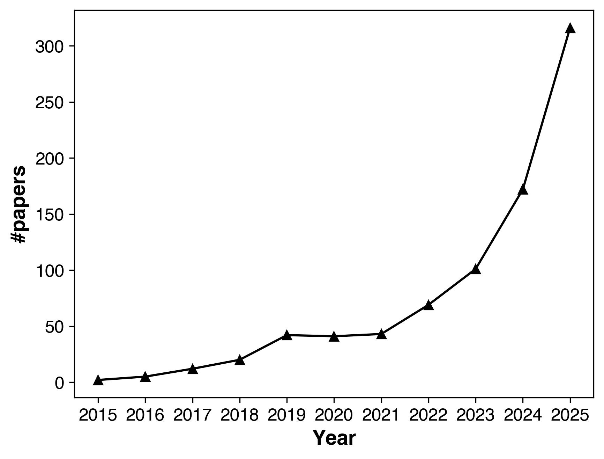

# Visual Reasoning Papers on Arxiv

This is a list of papers in the field of visual reasoning
and is automatically generated by [update_arxiv.py](./tool/update_arxiv.py).

Last update: 2025-10-01 08:03:52

___

## [Learning to See Before Seeing: Demystifying LLM Visual Priors from Language Pre-training](https://arxiv.org/pdf/2509.26625) [New]

*Junlin Han, Shengbang Tong, David Fan, Yufan Ren, Koustuv Sinha, Philip Torr, Filippos Kokkinos*

**Abstract:** Large Language Models (LLMs), despite being trained on text alone,
surprisingly develop rich visual priors. These priors allow latent visual
capabilities to be unlocked for vision tasks with a relatively small amount of
multimodal data, and in some cases, to perform visual tasks without ever having
seen an image. Through systematic analysis, we reveal that visual priors-the
implicit, emergent knowledge about the visual world acquired during language
pre-training-are composed of separable perception and reasoning priors with
unique scaling trends and origins. We show that an LLM's latent visual
reasoning ability is predominantly developed by pre-training on
reasoning-centric data (e.g., code, math, academia) and scales progressively.
This reasoning prior acquired from language pre-training is transferable and
universally applicable to visual reasoning. In contrast, a perception prior
emerges more diffusely from broad corpora, and perception ability is more
sensitive to the vision encoder and visual instruction tuning data. In
parallel, text describing the visual world proves crucial, though its
performance impact saturates rapidly. Leveraging these insights, we propose a
data-centric recipe for pre-training vision-aware LLMs and verify it in 1T
token scale pre-training. Our findings are grounded in over 100 controlled
experiments consuming 500,000 GPU-hours, spanning the full MLLM construction
pipeline-from LLM pre-training to visual alignment and supervised multimodal
fine-tuning-across five model scales, a wide range of data categories and
mixtures, and multiple adaptation setups. Along with our main findings, we
propose and investigate several hypotheses, and introduce the Multi-Level
Existence Bench (MLE-Bench). Together, this work provides a new way of
deliberately cultivating visual priors from language pre-training, paving the
way for the next generation of multimodal LLMs.

**comment:** *Project page: https://junlinhan.github.io/projects/lsbs/*

**published:** *2025-09-30 17:57:44*, **updated:** *2025-09-30 17:57:44*

 

## [VerlTool: Towards Holistic Agentic Reinforcement Learning with Tool Use](https://arxiv.org/pdf/2509.01055) [New]

*Dongfu Jiang, Yi Lu, Zhuofeng Li, Zhiheng Lyu, Ping Nie, Haozhe Wang, Alex Su, Hui Chen, Kai Zou, Chao Du, Tianyu Pang, Wenhu Chen*

**Abstract:** Reinforcement Learning with Verifiable Rewards (RLVR) has demonstrated
success in enhancing LLM reasoning capabilities, but remains limited to
single-turn interactions without tool integration. While recent Agentic
Reinforcement Learning with Tool use (ARLT) approaches have emerged to address
multi-turn tool interactions, existing works develop task-specific codebases
that suffer from fragmentation, synchronous execution bottlenecks, and limited
extensibility across domains. These inefficiencies hinder broader community
adoption and algorithmic innovation. We introduce VerlTool, a unified and
modular framework that addresses these limitations through systematic design
principles. VerlTool provides four key contributions: (1) upstream alignment
with VeRL ensuring compatibility and simplified maintenance, (2) unified tool
management via standardized APIs supporting diverse modalities including code
execution, search, SQL databases, and vision processing, (3) asynchronous
rollout execution achieving near 2$\times$ speedup by eliminating
synchronization bottlenecks, and (4) comprehensive evaluation demonstrating
competitive performance across 6 ARLT domains. Our framework formalizes ARLT as
multi-turn trajectories with multi-modal observation tokens (text/image/video),
extending beyond single-turn RLVR paradigms. We train and evaluate models on
mathematical reasoning, knowledge QA, SQL generation, visual reasoning, web
search, and software engineering tasks, achieving results comparable to
specialized systems while providing unified training infrastructure. The
modular plugin architecture enables rapid tool integration requiring only
lightweight Python definitions, significantly reducing development overhead and
providing a scalable foundation for tool-augmented RL research. Our code is
open-sourced at https://github.com/TIGER-AI-Lab/verl-tool.

**comment:** *32 pages, 5 figures, 13 tables*

**published:** *2025-09-01 01:45:18*, **updated:** *2025-09-30 17:22:37*

 

## [Fork-Merge Decoding: Enhancing Multimodal Understanding in Audio-Visual Large Language Models](https://arxiv.org/pdf/2505.20873) [New]

*Chaeyoung Jung, Youngjoon Jang, Jongmin Choi, Joon Son Chung*

**Abstract:** The goal of this work is to enhance balanced multimodal understanding in
audio-visual large language models (AV-LLMs) by addressing modality bias
without additional training. In current AV-LLMs, audio and video features are
typically processed jointly in the decoder. While this strategy facilitates
unified multimodal understanding, it may introduce modality bias, where the
model tends to over-rely on one modality due to imbalanced training signals. To
mitigate this, we propose Fork-Merge Decoding (FMD), a simple yet effective
inference-time strategy that requires no additional training or architectural
modifications. FMD first performs modality-specific reasoning by processing
audio-only and video-only inputs through the early decoder layers (fork), and
then merges the resulting hidden states for joint reasoning in the remaining
layers (merge). This separation allows each modality to be emphasized in the
early stages while encouraging balanced contributions during integration. We
validate our method on three representative AV-LLMs-VideoLLaMA2, video-SALMONN,
and Qwen2.5-Omni-using three benchmark datasets. Experimental results show
consistent gains in audio, video, and audio-visual reasoning tasks,
highlighting the effectiveness of inference-time interventions for robust and
efficient multimodal understanding.

**published:** *2025-05-27 08:22:56*, **updated:** *2025-09-30 11:50:02*

 

## [iVISPAR -- An Interactive Visual-Spatial Reasoning Benchmark for VLMs](https://arxiv.org/pdf/2502.03214) [New]

*Julius Mayer, Mohamad Ballout, Serwan Jassim, Farbod Nosrat Nezami, Elia Bruni*

**Abstract:** Vision-Language Models (VLMs) are known to struggle with spatial reasoning
and visual alignment. To help overcome these limitations, we introduce iVISPAR,
an interactive multimodal benchmark designed to evaluate the spatial reasoning
capabilities of VLMs acting as agents. \mbox{iVISPAR} is based on a variant of
the sliding tile puzzle, a classic problem that demands logical planning,
spatial awareness, and multi-step reasoning. The benchmark supports visual 3D,
2D, and text-based input modalities, enabling comprehensive assessments of
VLMs' planning and reasoning skills. We evaluate a broad suite of
state-of-the-art open-source and closed-source VLMs, comparing their
performance while also providing optimal path solutions and a human baseline to
assess the task's complexity and feasibility for humans. Results indicate that
while VLMs perform better on 2D tasks compared to 3D or text-based settings,
they struggle with complex spatial configurations and consistently fall short
of human performance, illustrating the persistent challenge of visual
alignment. This underscores critical gaps in current VLM capabilities,
highlighting their limitations in achieving human-level cognition. Project
website: https://microcosm.ai/ivispar

**published:** *2025-02-05 14:29:01*, **updated:** *2025-09-30 06:59:12*

 

## [NePTune: A Neuro-Pythonic Framework for Tunable Compositional Reasoning on Vision-Language](https://arxiv.org/pdf/2509.25757) [New]

*Danial Kamali, Parisa Kordjamshidi*

**Abstract:** Modern Vision-Language Models (VLMs) have achieved impressive performance in
various tasks, yet they often struggle with compositional reasoning, the
ability to decompose and recombine concepts to solve novel problems. While
neuro-symbolic approaches offer a promising direction, they are typically
constrained by crisp logical execution or predefined predicates, which limit
flexibility. In this work, we introduce NePTune, a neuro-symbolic framework
that overcomes these limitations through a hybrid execution model that
integrates the perception capabilities of foundation vision models with the
compositional expressiveness of symbolic reasoning. NePTune dynamically
translates natural language queries into executable Python programs that blend
imperative control flow with soft logic operators capable of reasoning over
VLM-generated uncertainty. Operating in a training-free manner, NePTune, with a
modular design, decouples perception from reasoning, yet its differentiable
operations support fine-tuning. We evaluate NePTune on multiple visual
reasoning benchmarks and various domains, utilizing adversarial tests, and
demonstrate a significant improvement over strong base models, as well as its
effective compositional generalization and adaptation capabilities in novel
environments.

**published:** *2025-09-30 04:22:42*, **updated:** *2025-09-30 04:22:42*

 

## [CoFFT: Chain of Foresight-Focus Thought for Visual Language Models](https://arxiv.org/pdf/2509.22010) [New]

*Xinyu Zhang, Yuxuan Dong, Lingling Zhang, Chengyou Jia, Zhuohang Dang, Basura Fernando, Jun Liu, Mike Zheng Shou*

**Abstract:** Despite significant advances in Vision Language Models (VLMs), they remain
constrained by the complexity and redundancy of visual input. When images
contain large amounts of irrelevant information, VLMs are susceptible to
interference, thus generating excessive task-irrelevant reasoning processes or
even hallucinations. This limitation stems from their inability to discover and
process the required regions during reasoning precisely. To address this
limitation, we present the Chain of Foresight-Focus Thought (CoFFT), a novel
training-free approach that enhances VLMs' visual reasoning by emulating human
visual cognition. Each Foresight-Focus Thought consists of three stages: (1)
Diverse Sample Generation: generates diverse reasoning samples to explore
potential reasoning paths, where each sample contains several reasoning steps;
(2) Dual Foresight Decoding: rigorously evaluates these samples based on both
visual focus and reasoning progression, adding the first step of optimal sample
to the reasoning process; (3) Visual Focus Adjustment: precisely adjust visual
focus toward regions most beneficial for future reasoning, before returning to
stage (1) to generate subsequent reasoning samples until reaching the final
answer. These stages function iteratively, creating an interdependent cycle
where reasoning guides visual focus and visual focus informs subsequent
reasoning. Empirical results across multiple benchmarks using Qwen2.5-VL,
InternVL-2.5, and Llava-Next demonstrate consistent performance improvements of
3.1-5.8\% with controllable increasing computational overhead.

**published:** *2025-09-26 07:46:30*, **updated:** *2025-09-30 03:59:16*

 

## [Radiology's Last Exam (RadLE): Benchmarking Frontier Multimodal AI Against Human Experts and a Taxonomy of Visual Reasoning Errors in Radiology](https://arxiv.org/pdf/2509.25559) [New]

*Suvrankar Datta, Divya Buchireddygari, Lakshmi Vennela Chowdary Kaza, Mrudula Bhalke, Kautik Singh, Ayush Pandey, Sonit Sai Vasipalli, Upasana Karnwal, Hakikat Bir Singh Bhatti, Bhavya Ratan Maroo, Sanjana Hebbar, Rahul Joseph, Gurkawal Kaur, Devyani Singh, Akhil V, Dheeksha Devasya Shama Prasad, Nishtha Mahajan, Ayinaparthi Arisha, Rajesh Vanagundi, Reet Nandy, Kartik Vuthoo, Snigdhaa Rajvanshi, Nikhileswar Kondaveeti, Suyash Gunjal, Rishabh Jain, Rajat Jain, Anurag Agrawal*

**Abstract:** Generalist multimodal AI systems such as large language models (LLMs) and
vision language models (VLMs) are increasingly accessed by clinicians and
patients alike for medical image interpretation through widely available
consumer-facing chatbots. Most evaluations claiming expert level performance
are on public datasets containing common pathologies. Rigorous evaluation of
frontier models on difficult diagnostic cases remains limited. We developed a
pilot benchmark of 50 expert-level "spot diagnosis" cases across multiple
imaging modalities to evaluate the performance of frontier AI models against
board-certified radiologists and radiology trainees. To mirror real-world
usage, the reasoning modes of five popular frontier AI models were tested
through their native web interfaces, viz. OpenAI o3, OpenAI GPT-5, Gemini 2.5
Pro, Grok-4, and Claude Opus 4.1. Accuracy was scored by blinded experts, and
reproducibility was assessed across three independent runs. GPT-5 was
additionally evaluated across various reasoning modes. Reasoning quality errors
were assessed and a taxonomy of visual reasoning errors was defined.
Board-certified radiologists achieved the highest diagnostic accuracy (83%),
outperforming trainees (45%) and all AI models (best performance shown by
GPT-5: 30%). Reliability was substantial for GPT-5 and o3, moderate for Gemini
2.5 Pro and Grok-4, and poor for Claude Opus 4.1. These findings demonstrate
that advanced frontier models fall far short of radiologists in challenging
diagnostic cases. Our benchmark highlights the present limitations of
generalist AI in medical imaging and cautions against unsupervised clinical
use. We also provide a qualitative analysis of reasoning traces and propose a
practical taxonomy of visual reasoning errors by AI models for better
understanding their failure modes, informing evaluation standards and guiding
more robust model development.

**comment:** *29 pages, 7 figures, 7 tables, includes Annexure (1). Part of the
  work accepted at RSNA 2025 (Cutting Edge Oral Presentation)*

**published:** *2025-09-29 22:31:20*, **updated:** *2025-09-29 22:31:20*

 

## [Video models are zero-shot learners and reasoners](https://arxiv.org/pdf/2509.20328) [New]

*Thaddäus Wiedemer, Yuxuan Li, Paul Vicol, Shixiang Shane Gu, Nick Matarese, Kevin Swersky, Been Kim, Priyank Jaini, Robert Geirhos*

**Abstract:** The remarkable zero-shot capabilities of Large Language Models (LLMs) have
propelled natural language processing from task-specific models to unified,
generalist foundation models. This transformation emerged from simple
primitives: large, generative models trained on web-scale data. Curiously, the
same primitives apply to today's generative video models. Could video models be
on a trajectory towards general-purpose vision understanding, much like LLMs
developed general-purpose language understanding? We demonstrate that Veo 3 can
solve a broad variety of tasks it wasn't explicitly trained for: segmenting
objects, detecting edges, editing images, understanding physical properties,
recognizing object affordances, simulating tool use, and more. These abilities
to perceive, model, and manipulate the visual world enable early forms of
visual reasoning like maze and symmetry solving. Veo's emergent zero-shot
capabilities indicate that video models are on a path to becoming unified,
generalist vision foundation models.

**comment:** *Project page: https://video-zero-shot.github.io/*

**published:** *2025-09-24 17:17:27*, **updated:** *2025-09-29 20:44:46*

 

## [PixelCraft: A Multi-Agent System for High-Fidelity Visual Reasoning on Structured Images](https://arxiv.org/pdf/2509.25185) [New]

*Shuoshuo Zhang, Zijian Li, Yizhen Zhang, Jingjing Fu, Lei Song, Jiang Bian, Jun Zhang, Yujiu Yang, Rui Wang*

**Abstract:** Structured images (e.g., charts and geometric diagrams) remain challenging
for multimodal large language models (MLLMs), as perceptual slips can cascade
into erroneous conclusions. Intermediate visual cues can steer reasoning;
however, existing cue-based methods are constrained with low-fidelity image
processing and linear, rigid reasoning patterns, limiting their effectiveness
on complex structured-image tasks. In this paper, we propose PixelCraft, a
novel multi-agent system for high-fidelity image processing and flexible visual
reasoning on structured images. The system comprises a dispatcher, a planner, a
reasoner, critics, and a set of visual tool agents. To achieve high-fidelity
processing, we construct a high-quality corpus and fine-tune an MLLM into a
grounding model, whose pixel-level localizations are integrated with
traditional computer vision (CV) algorithms in tool agents. Building on this
foundation, PixelCraft facilitates flexible visual reasoning through a dynamic
three-stage workflow of tool selection, agent discussion, and self-criticism.
Moreover, unlike prior linear reasoning patterns that simply append historical
images, PixelCraft maintains an image memory to allow the planner to adaptively
revisit earlier visual steps, explore alternative reasoning branches, and
dynamically adjust the reasoning trajectory during discussion. Extensive
experiments on challenging chart and geometry benchmarks demonstrate that
PixelCraft significantly improves visual reasoning performance for advanced
MLLMs, setting a new standard for structured image reasoning. Our code will be
available at https://github.com/microsoft/PixelCraft.

**published:** *2025-09-29 17:59:49*, **updated:** *2025-09-29 17:59:49*

 

## [VideoAnchor: Reinforcing Subspace-Structured Visual Cues for Coherent Visual-Spatial Reasoning](https://arxiv.org/pdf/2509.25151) [New]

*Zhaozhi Wang, Tong Zhang, Mingyue Guo, Yaowei Wang, Qixiang Ye*

**Abstract:** Multimodal Large Language Models (MLLMs) have achieved impressive progress in
vision-language alignment, yet they remain limited in visual-spatial reasoning.
We first identify that this limitation arises from the attention mechanism:
visual tokens are overshadowed by language tokens, preventing the model from
consistently recognizing the same visual cues across frames. To address this
challenge, we draw a novel connection between the self-expressiveness property
in sparse subspace clustering and the attention mechanism in Transformers.
Building on this insight, we propose VideoAnchor, a plug-and-play module that
leverages subspace affinities to reinforce visual cues across frames without
retraining, effectively anchoring attention to shared visual structures.
Extensive experiments across benchmarks and backbone models show consistent
performance gains -- $e.g.$, 3.2% and 4.6% improvements on VSI-Bench and
Video-MME (spatial-related tasks) with InternVL2-8B and Qwen2.5VL-72B -- while
qualitative analyses demonstrate more coherent subspace partitions and stronger
visual grounding. Our codes will be made public available at
https://github.com/feufhd/VideoAnchor.

**comment:** *16 pages, 6 figures*

**published:** *2025-09-29 17:54:04*, **updated:** *2025-09-29 17:54:04*

 

## [Visual serial processing deficits explain divergences in human and VLM reasoning](https://arxiv.org/pdf/2509.25142) [New]

*Nicholas Budny, Kia Ghods, Declan Campbell, Raja Marjieh, Amogh Joshi, Sreejan Kumar, Jonathan D. Cohen, Taylor W. Webb, Thomas L. Griffiths*

**Abstract:** Why do Vision Language Models (VLMs), despite success on standard benchmarks,
often fail to match human performance on surprisingly simple visual reasoning
tasks? While the underlying computational principles are still debated, we
hypothesize that a crucial factor is a deficit in visually-grounded serial
processing. To test this hypothesis, we compared human and VLM performance
across tasks designed to vary serial processing demands in three distinct
domains: geometric reasoning, perceptual enumeration, and mental rotation.
Tasks within each domain varied serial processing load by manipulating factors
such as geometric concept complexity, perceptual individuation load, and
transformation difficulty. Across all domains, our results revealed a
consistent pattern: decreased VLM accuracy was strongly correlated with
increased human reaction time (used as a proxy for serial processing load). As
tasks require more demanding serial processing -- whether composing concepts,
enumerating items, or performing mental transformations -- the VLM-human
performance gap widens reliably. These findings support our hypothesis,
indicating that limitations in serial, visually grounded reasoning represent a
fundamental bottleneck that distinguishes current VLMs from humans.

**published:** *2025-09-29 17:51:20*, **updated:** *2025-09-29 17:51:20*

 

## [Can you SPLICE it together? A Human Curated Benchmark for Probing Visual Reasoning in VLMs](https://arxiv.org/pdf/2509.24640) [New]

*Mohamad Ballout, Okajevo Wilfred, Seyedalireza Yaghoubi, Nohayr Muhammad Abdelmoneim, Julius Mayer, Elia Bruni*

**Abstract:** In this work, we introduce SPLICE, a human-curated benchmark derived from the
COIN instructional video dataset, designed to probe event-based reasoning
across multiple dimensions: temporal, causal, spatial, contextual, and general
knowledge. SPLICE includes 3,381 human-filtered videos spanning 12 categories
and 180 sub-categories, such as sports, engineering, and housework. These
videos are segmented into a total of 11,423 event clips. We evaluate both human
participants and state-of-the-art vision-language models (VLMs) on the task of
rearranging these clips into coherent event sequences to assess visual
reasoning capabilities. Results reveal a significant gap: VLMs struggle to
match human performance. While human-annotated textual descriptions improve
model accuracy, they do not affect human performance, suggesting that models
rely more on language priors than on visual understanding. Even with
annotations, VLMs fall short of human-level reasoning, underscoring persistent
challenges in visual reasoning. A deeper analysis across sub-categories shows
that VLMs perform relatively better on videos where temporal and causal
reasoning are dominant, compared to those where contextual and spatial
reasoning are dominant. They also perform better on everyday tasks than on
specialized ones.

**published:** *2025-09-29 11:50:18*, **updated:** *2025-09-29 11:50:18*

 

## [Latent Visual Reasoning](https://arxiv.org/pdf/2509.24251) [New]

*Bangzheng Li, Ximeng Sun, Jiang Liu, Ze Wang, Jialian Wu, Xiaodong Yu, Hao Chen, Emad Barsoum, Muhao Chen, Zicheng Liu*

**Abstract:** Multimodal Large Language Models (MLLMs) have achieved notable gains in
various tasks by incorporating Chain-of-Thought (CoT) reasoning in language
spaces. Recent work extends this direction by leveraging external tools for
visual editing, thereby enhancing the visual signal along the reasoning
trajectories. Nevertheless, these approaches remain fundamentally constrained:
reasoning is still confined to the language space, with visual information
treated as static preconditions. We introduce Latent Visual Reasoning (LVR), a
new paradigm that enables autoregressive reasoning directly in the visual
embedding space. A visual encoder first projects images into visual tokens
within a joint semantic space shared with the language model. The language
model is then trained to generate latent states that reconstruct key visual
tokens critical for answering the query, constituting the process of latent
visual reasoning. By interleaving LVR with standard text generation, our model
achieves substantial gains on perception-intensive visual question answering
tasks. In addition, we adapt the GRPO algorithm to conduct reinforcement
learning on latent reasoning, further balancing LVR and textual generation. We
show that LVR substantially improves fine-grained visual understanding and
perception, achieving 71.67% on MMVP compared to 66.67% with Qwen2.5-VL. Code
base and model weights will be released later.

**published:** *2025-09-29 03:52:01*, **updated:** *2025-09-29 03:52:01*

 

## [Transparent Visual Reasoning via Object-Centric Agent Collaboration](https://arxiv.org/pdf/2509.23757) [New]

*Benjamin Teoh, Ben Glocker, Francesca Toni, Avinash Kori*

**Abstract:** A central challenge in explainable AI, particularly in the visual domain, is
producing explanations grounded in human-understandable concepts. To tackle
this, we introduce OCEAN (Object-Centric Explananda via Agent Negotiation), a
novel, inherently interpretable framework built on object-centric
representations and a transparent multi-agent reasoning process. The
game-theoretic reasoning process drives agents to agree on coherent and
discriminative evidence, resulting in a faithful and interpretable
decision-making process. We train OCEAN end-to-end and benchmark it against
standard visual classifiers and popular posthoc explanation tools like GradCAM
and LIME across two diagnostic multi-object datasets. Our results demonstrate
competitive performance with respect to state-of-the-art black-box models with
a faithful reasoning process, which was reflected by our user study, where
participants consistently rated OCEAN's explanations as more intuitive and
trustworthy.

**published:** *2025-09-28 09:06:52*, **updated:** *2025-09-28 09:06:52*

 

## [Revisiting Visual Understanding in Multimodal Reasoning through a Lens of Image Perturbation](https://arxiv.org/pdf/2506.09736) [New]

*Yuting Li, Lai Wei, Kaipeng Zheng, Jingyuan Huang, Guilin Li, Bo Wang, Linghe Kong, Lichao Sun, Weiran Huang*

**Abstract:** Despite the rapid progress of multimodal large language models (MLLMs), they
have largely overlooked the importance of visual processing. In a simple yet
revealing experiment, we interestingly find that language-only models, when
provided with image captions, can achieve comparable or even better performance
than MLLMs that consume raw visual inputs. This suggests that current MLLMs may
generate accurate visual descriptions but fail to effectively integrate them
during reasoning. Motivated by this, we propose a simple visual perturbation
framework that enhances perceptual robustness without requiring algorithmic
modifications or additional training data. Our approach introduces three
targeted perturbations: distractor concatenation, dominance-preserving mixup,
and random rotation, that can be easily integrated into existing post-training
pipelines including SFT, DPO, and GRPO. Through extensive experiments across
multiple datasets, we demonstrate consistent improvements in mathematical
reasoning performance, with gains comparable to those achieved through
algorithmic changes. Additionally, we achieve competitive performance among
open-source 7B RL-tuned models by training Qwen2.5-VL-7B with visual
perturbation. Through comprehensive ablation studies, we analyze the
effectiveness of different perturbation strategies, revealing that each
perturbation type contributes uniquely to different aspects of visual
reasoning. Our findings highlight the critical role of visual perturbation in
multimodal mathematical reasoning: better reasoning begins with better seeing.
Our code is available at https://github.com/YutingLi0606/Vision-Matters.

**comment:** *Technical Report*

**published:** *2025-06-11 13:39:46*, **updated:** *2025-09-28 03:21:13*

 

## [Decoupling Reasoning and Perception: An LLM-LMM Framework for Faithful Visual Reasoning](https://arxiv.org/pdf/2509.23322) [New]

*Hongrui Jia, Chaoya Jiang, Shikun Zhang, Wei Ye*

**Abstract:** Significant advancements in the reasoning capabilities of Large Language
Models (LLMs) are now driven by test-time scaling laws, particularly those
leveraging extended Chain-of-Thought (CoT) reasoning. Inspired by these
breakthroughs, researchers have extended these paradigms to Large Multimodal
Models (LMMs). However, a critical limitation emerges: as their reasoning
chains extend, LMMs increasingly rely on textual logic, progressively losing
grounding in the underlying visual information. This leads to reasoning paths
that diverge from the image content, culminating in erroneous conclusions. To
address this, we introduce a strikingly simple yet effective training-free
visual-reasoning pipeline. The core concept is to decouple the reasoning and
perception processes. A powerful LLM orchestrates the high-level reasoning,
strategically interrogating a LMM to extract specific visual information
required for its logical chain. The LMM, in turn, functions exclusively as a
visual question-answering engine, supplying the necessary perceptual details on
demand. This lightweight, plug-and-play approach requires no additional
training or architectural changes. Comprehensive evaluations validate that our
framework effectively governs the visual reasoning process, leading to a
significant reduction in visually-unfounded reasoning steps and a substantial
improvement in reasoning fidelity.

**published:** *2025-09-27 14:13:41*, **updated:** *2025-09-27 14:13:41*

 

## [Vision-EKIPL: External Knowledge-Infused Policy Learning for Visual Reasoning](https://arxiv.org/pdf/2506.06856) [New]

*Chaoyang Wang, Zeyu Zhang, Meng Meng, Xu Zhou, Haiyun Jiang*

**Abstract:** Visual reasoning is crucial for understanding complex multimodal data and
advancing Artificial General Intelligence. Existing methods enhance the
reasoning capability of Multimodal Large Language Models (MLLMs) through
Reinforcement Learning (RL) fine-tuning (e.g., GRPO). However, current RL
approaches sample action groups solely from the policy model itself, which
limits the upper boundary of the model's reasoning capability and leads to
inefficient training. To address these limitations, this paper proposes a novel
RL framework called \textbf{Vision-EKIPL}. The core of this framework lies in
introducing high-quality actions generated by external auxiliary models during
the RL training process to guide the optimization of the policy model. The
policy learning with knowledge infusion from external models significantly
expands the model's exploration space, effectively improves the reasoning
boundary, and substantially accelerates training convergence speed and
efficiency. Experimental results demonstrate that our proposed Vision-EKIPL
achieved up to a 5\% performance improvement on the Reason-RFT-CoT Benchmark
compared to the state-of-the-art (SOTA). It reveals that Vision-EKIPL can
overcome the limitations of traditional RL methods, significantly enhance the
visual reasoning performance of MLLMs, and provide a new effective paradigm for
research in this field.

**published:** *2025-06-07 16:37:46*, **updated:** *2025-09-27 06:49:29*

 

## [ProxyThinker: Test-Time Guidance through Small Visual Reasoners](https://arxiv.org/pdf/2505.24872) [New]

*Zilin Xiao, Jaywon Koo, Siru Ouyang, Jefferson Hernandez, Yu Meng, Vicente Ordonez*

**Abstract:** Recent advancements in reinforcement learning with verifiable rewards have
pushed the boundaries of the visual reasoning capabilities in large
vision-language models (LVLMs). However, training LVLMs with reinforcement
fine-tuning (RFT) is computationally expensive, posing a significant challenge
to scaling model size. In this work, we propose ProxyThinker, an inference-time
technique that enables large models to inherit the visual reasoning
capabilities from small, slow-thinking visual reasoners without any training.
By subtracting the output distributions of base models from those of RFT
reasoners, ProxyThinker modifies the decoding dynamics and successfully elicits
the slow-thinking reasoning demonstrated by the emerged sophisticated behaviors
such as self-verification and self-correction. ProxyThinker consistently boosts
performance on challenging visual benchmarks on spatial, mathematical, and
multi-disciplinary reasoning, enabling untuned base models to compete with the
performance of their full-scale RFT counterparts. Furthermore, our
implementation efficiently coordinates multiple language models with
parallelism techniques and achieves up to 38 $\times$ faster inference compared
to previous decoding-time methods, paving the way for the practical deployment
of ProxyThinker. Code is available at
https://github.com/MrZilinXiao/ProxyThinker.

**published:** *2025-05-30 17:59:43*, **updated:** *2025-09-27 02:58:54*

 

## [Chimera: Diagnosing Shortcut Learning in Visual-Language Understanding](https://arxiv.org/pdf/2509.22437) [New]

*Ziheng Chi, Yifan Hou, Chenxi Pang, Shaobo Cui, Mubashara Akhtar, Mrinmaya Sachan*

**Abstract:** Diagrams convey symbolic information in a visual format rather than a linear
stream of words, making them especially challenging for AI models to process.
While recent evaluations suggest that vision-language models (VLMs) perform
well on diagram-related benchmarks, their reliance on knowledge, reasoning, or
modality shortcuts raises concerns about whether they genuinely understand and
reason over diagrams. To address this gap, we introduce Chimera, a
comprehensive test suite comprising 7,500 high-quality diagrams sourced from
Wikipedia; each diagram is annotated with its symbolic content represented by
semantic triples along with multi-level questions designed to assess four
fundamental aspects of diagram comprehension: entity recognition, relation
understanding, knowledge grounding, and visual reasoning. We use Chimera to
measure the presence of three types of shortcuts in visual question answering:
(1) the visual-memorization shortcut, where VLMs rely on memorized visual
patterns; (2) the knowledge-recall shortcut, where models leverage memorized
factual knowledge instead of interpreting the diagram; and (3) the Clever-Hans
shortcut, where models exploit superficial language patterns or priors without
true comprehension. We evaluate 15 open-source VLMs from 7 model families on
Chimera and find that their seemingly strong performance largely stems from
shortcut behaviors: visual-memorization shortcuts have slight impact,
knowledge-recall shortcuts play a moderate role, and Clever-Hans shortcuts
contribute significantly. These findings expose critical limitations in current
VLMs and underscore the need for more robust evaluation protocols that
benchmark genuine comprehension of complex visual inputs (e.g., diagrams)
rather than question-answering shortcuts.

**comment:** *Our code (https://github.com/CHIzhP/Chimera) and data
  (https://huggingface.co/datasets/CHIzhP/Chimera) are publicly available*

**published:** *2025-09-26 14:55:04*, **updated:** *2025-09-26 14:55:04*

 

## [RAU: Reference-based Anatomical Understanding with Vision Language Models](https://arxiv.org/pdf/2509.22404) [New]

*Yiwei Li, Yikang Liu, Jiaqi Guo, Lin Zhao, Zheyuan Zhang, Xiao Chen, Boris Mailhe, Ankush Mukherjee, Terrence Chen, Shanhui Sun*

**Abstract:** Anatomical understanding through deep learning is critical for automatic
report generation, intra-operative navigation, and organ localization in
medical imaging; however, its progress is constrained by the scarcity of
expert-labeled data. A promising remedy is to leverage an annotated reference
image to guide the interpretation of an unlabeled target. Although recent
vision-language models (VLMs) exhibit non-trivial visual reasoning, their
reference-based understanding and fine-grained localization remain limited. We
introduce RAU, a framework for reference-based anatomical understanding with
VLMs. We first show that a VLM learns to identify anatomical regions through
relative spatial reasoning between reference and target images, trained on a
moderately sized dataset. We validate this capability through visual question
answering (VQA) and bounding box prediction. Next, we demonstrate that the
VLM-derived spatial cues can be seamlessly integrated with the fine-grained
segmentation capability of SAM2, enabling localization and pixel-level
segmentation of small anatomical regions, such as vessel segments. Across two
in-distribution and two out-of-distribution datasets, RAU consistently
outperforms a SAM2 fine-tuning baseline using the same memory setup, yielding
more accurate segmentations and more reliable localization. More importantly,
its strong generalization ability makes it scalable to out-of-distribution
datasets, a property crucial for medical image applications. To the best of our
knowledge, RAU is the first to explore the capability of VLMs for
reference-based identification, localization, and segmentation of anatomical
structures in medical images. Its promising performance highlights the
potential of VLM-driven approaches for anatomical understanding in automated
clinical workflows.

**published:** *2025-09-26 14:32:03*, **updated:** *2025-09-26 14:32:03*

 

## [DriveAgent-R1: Advancing VLM-based Autonomous Driving with Active Perception and Hybrid Thinking](https://arxiv.org/pdf/2507.20879) [New]

*Weicheng Zheng, Xiaofei Mao, Nanfei Ye, Pengxiang Li, Kun Zhan, Xianpeng Lang, Hang Zhao*

**Abstract:** The advent of Vision-Language Models (VLMs) has significantly advanced
end-to-end autonomous driving, demonstrating powerful reasoning abilities for
high-level behavior planning tasks. However, existing methods are often
constrained by a passive perception paradigm, relying solely on text-based
reasoning. This passivity restricts the model's capacity to actively seek
crucial visual evidence when faced with uncertainty. To address this, we
introduce DriveAgent-R1, the first autonomous driving agent capable of active
perception for planning. In complex scenarios, DriveAgent-R1 proactively
invokes tools to perform visual reasoning, firmly grounding its decisions in
visual evidence, thereby enhancing both interpretability and reliability.
Furthermore, we propose a hybrid thinking framework, inspired by human driver
cognitive patterns, allowing the agent to adaptively switch between efficient
text-only reasoning and robust tool-augmented visual reasoning based on scene
complexity. This capability is cultivated through a three-stage progressive
training strategy, featuring a core Cascaded Reinforcement Learning (Cascaded
RL) phase. Extensive experiments on the Drive-Internal dataset, which is rich
in long-tail scenarios, and the public nuScenes dataset show that, with only 3B
parameters, DriveAgent-R1 achieves competitive performance comparable to top
closed model systems such as GPT-5 and to human driving proficiency while
remaining deployment-friendly, offering a proven path toward building more
intelligent autonomous driving systems.

**published:** *2025-07-28 14:33:15*, **updated:** *2025-09-26 10:14:08*

 

## [Reasoning to Edit: Hypothetical Instruction-Based Image Editing with Visual Reasoning](https://arxiv.org/pdf/2507.01908) [New]

*Qingdong He, Xueqin Chen, Chaoyi Wang, Yanjie Pan, Xiaobin Hu, Zhenye Gan, Yabiao Wang, Chengjie Wang, Xiangtai Li, Jiangning Zhang*

**Abstract:** Instruction-based image editing (IIE) has advanced rapidly with the success
of diffusion models. However, existing efforts primarily focus on simple and
explicit instructions to execute editing operations such as adding, deleting,
moving, or swapping objects. They struggle to handle more complex implicit
hypothetical instructions that require deeper reasoning to infer plausible
visual changes and user intent. Additionally, current datasets provide limited
support for training and evaluating reasoning-aware editing capabilities.
Architecturally, these methods also lack mechanisms for fine-grained detail
extraction that support such reasoning. To address these limitations, we
propose Reason50K, a large-scale dataset specifically curated for training and
evaluating hypothetical instruction reasoning image editing, along with
ReasonBrain, a novel framework designed to reason over and execute implicit
hypothetical instructions across diverse scenarios. Reason50K includes over 50K
samples spanning four key reasoning scenarios: Physical, Temporal, Causal, and
Story reasoning. ReasonBrain leverages Multimodal Large Language Models (MLLMs)
for editing guidance generation and a diffusion model for image synthesis,
incorporating a Fine-grained Reasoning Cue Extraction (FRCE) module to capture
detailed visual and textual semantics essential for supporting instruction
reasoning. To mitigate the semantic loss, we further introduce a Cross-Modal
Enhancer (CME) that enables rich interactions between the fine-grained cues and
MLLM-derived features. Extensive experiments demonstrate that ReasonBrain
consistently outperforms state-of-the-art baselines on reasoning scenarios
while exhibiting strong zero-shot generalization to conventional IIE tasks. Our
dataset and code will be released publicly.

**published:** *2025-07-02 17:22:21*, **updated:** *2025-09-26 09:15:21*

 

## [Mixture-of-Visual-Thoughts: Exploring Context-Adaptive Reasoning Mode Selection for General Visual Reasoning](https://arxiv.org/pdf/2509.22746) [New]

*Zejun Li, Yingxiu Zhao, Jiwen Zhang, Siyuan Wang, Yang Yao, Runzhou Zhao, Jun Song, Bo Zheng, Zhongyu Wei*

**Abstract:** Current visual reasoning methods mainly focus on exploring specific reasoning
modes. Although improvements can be achieved in particular domains, they
struggle to develop general reasoning capabilities. Inspired by this, we
propose a novel adaptive reasoning paradigm, Mixture-of-Visual-Thoughts (MoVT),
which unifies different reasoning modes within a single model and guides it to
select the appropriate mode based on context. To achieve this, we introduce
AdaVaR, a two-stage Adaptive Visual Reasoning learning framework: different
modes are unified and learned during the supervised cold-start stage, and the
mode selection capability is induced via an RL process with a carefully
designed AdaGRPO algorithm. Extensive experiments show that AdaVaR effectively
guides the model to learn and differentiate multiple modes and perform
context-adaptive mode selection, achieving consistent improvement across
various scenarios, highlighting MoVT as an effective solution for building
general visual reasoning models.

**comment:** *27 pages, 11 figures, 5 tables*

**published:** *2025-09-26 04:33:53*, **updated:** *2025-09-26 04:33:53*

 

## [$A^2R^2$: Advancing Img2LaTeX Conversion via Visual Reasoning with Attention-Guided Refinement](https://arxiv.org/pdf/2507.20890) [New]

*Zhecheng Li, Guoxian Song, Yiwei Wang, Zhen Xiong, Junsong Yuan, Yujun Cai*

**Abstract:** Img2LaTeX is a practically important task that involves translating
mathematical expressions and structured visual content from images into LaTeX
code. In recent years, vision-language models (VLMs) have achieved remarkable
progress across a range of visual understanding tasks, largely due to their
strong generalization capabilities. However, despite initial efforts to apply
VLMs to the Img2LaTeX task, their performance remains suboptimal. Empirical
evidence shows that VLMs can be challenged by fine-grained visual elements,
such as subscripts and superscripts in mathematical expressions, which results
in inaccurate LaTeX generation. To address this challenge, we propose $A^2R^2$:
Advancing Img2LaTeX Conversion via Visual Reasoning with Attention-Guided
Refinement, a framework that effectively integrates attention localization and
iterative refinement within a visual reasoning framework, enabling VLMs to
perform self-correction and progressively improve LaTeX generation quality. For
effective evaluation, we introduce a new dataset, Img2LaTex-Hard-1K, consisting
of 1,100 carefully curated and challenging examples designed to rigorously
evaluate the capabilities of VLMs within this task domain. Extensive
experimental results demonstrate that: (1) $A^2R^2$ significantly improves
model performance across various evaluation metrics spanning both textual and
visual levels; (2) Increasing the number of inference rounds yields notable
performance gains, underscoring the potential of $A^2R^2$ in test-time scaling
scenarios; (3) Ablation studies and further evaluations confirm the
effectiveness of our approach and the synergy of its core components during
inference.

**published:** *2025-07-28 14:41:57*, **updated:** *2025-09-25 22:30:03*

 

## [Uncovering Graph Reasoning in Decoder-only Transformers with Circuit Tracing](https://arxiv.org/pdf/2509.20336) [New]

*Xinnan Dai, Chung-Hsiang Lo, Kai Guo, Shenglai Zeng, Dongsheng Luo, Jiliang Tang*

**Abstract:** Transformer-based LLMs demonstrate strong performance on graph reasoning
tasks, yet their internal mechanisms remain underexplored. To uncover these
reasoning process mechanisms in a fundamental and unified view, we set the
basic decoder-only transformers and explain them using the circuit-tracer
framework. Through this lens, we visualize reasoning traces and identify two
core mechanisms in graph reasoning: token merging and structural memorization,
which underlie both path reasoning and substructure extraction tasks. We
further quantify these behaviors and analyze how they are influenced by graph
density and model size. Our study provides a unified interpretability framework
for understanding structural reasoning in decoder-only Transformers.

**comment:** *Accepted by the Workshop on Efficient Reasoning, Neurips 2025*

**published:** *2025-09-24 17:25:05*, **updated:** *2025-09-24 17:25:05*

 

## [GRAFT: GRaPH and Table Reasoning for Textual Alignment -- A Benchmark for Structured Instruction Following and Visual Reasoning](https://arxiv.org/pdf/2508.15690) [New]

*Abhigya Verma, Sriram Puttagunta, Seganrasan Subramanian, Sravan Ramachandran*

**Abstract:** GRAFT is a structured multimodal benchmark for evaluating models on
instruction-following, visual reasoning, and visual-textual alignment tasks. It
features programmatically generated charts and synthetically rendered tables,
created with Python visualization libraries to ensure control over data
semantics, structure, and clarity. Each GRAFT instance pairs a chart or table
image with a systematically generated, multi-step analytical question based
solely on visual content. Answers are provided in structured formats such as
JSON or YAML, supporting consistent evaluation of both reasoning and output
format. The benchmark introduces a taxonomy of reasoning types including
comparison, trend identification, ranking, aggregation, proportion estimation,
and anomaly detection to enable comprehensive assessment. Reference answers
follow strict factual and formatting guidelines for precise, aspect-based
evaluation. GRAFT offers a unified, scalable framework for fine-grained
benchmarking of multimodal models on visually grounded, structured reasoning
tasks, setting a new evaluation standard in this field.

**comment:** *23 pages, 9 tables, 3 figures*

**published:** *2025-08-21 16:13:49*, **updated:** *2025-09-23 18:41:49*

 

## [How Far are VLMs from Visual Spatial Intelligence? A Benchmark-Driven Perspective](https://arxiv.org/pdf/2509.18905) [New]

*Songsong Yu, Yuxin Chen, Hao Ju, Lianjie Jia, Fuxi Zhang, Shaofei Huang, Yuhan Wu, Rundi Cui, Binghao Ran, Zaibin Zhang, Zhedong Zheng, Zhipeng Zhang, Yifan Wang, Lin Song, Lijun Wang, Yanwei Li, Ying Shan, Huchuan Lu*

**Abstract:** Visual Spatial Reasoning (VSR) is a core human cognitive ability and a
critical requirement for advancing embodied intelligence and autonomous
systems. Despite recent progress in Vision-Language Models (VLMs), achieving
human-level VSR remains highly challenging due to the complexity of
representing and reasoning over three-dimensional space. In this paper, we
present a systematic investigation of VSR in VLMs, encompassing a review of
existing methodologies across input modalities, model architectures, training
strategies, and reasoning mechanisms. Furthermore, we categorize spatial
intelligence into three levels of capability, ie, basic perception, spatial
understanding, spatial planning, and curate SIBench, a spatial intelligence
benchmark encompassing nearly 20 open-source datasets across 23 task settings.
Experiments with state-of-the-art VLMs reveal a pronounced gap between
perception and reasoning, as models show competence in basic perceptual tasks
but consistently underperform in understanding and planning tasks, particularly
in numerical estimation, multi-view reasoning, temporal dynamics, and spatial
imagination. These findings underscore the substantial challenges that remain
in achieving spatial intelligence, while providing both a systematic roadmap
and a comprehensive benchmark to drive future research in the field. The
related resources of this study are accessible at
https://sibench.github.io/Awesome-Visual-Spatial-Reasoning/.

**comment:** *a comprehensive visual spatial reasoning evaluation tool, 25 pages,
  16 figures*

**published:** *2025-09-23 12:00:14*, **updated:** *2025-09-23 12:00:14*

 

## [UniPixel: Unified Object Referring and Segmentation for Pixel-Level Visual Reasoning](https://arxiv.org/pdf/2509.18094) [New]

*Ye Liu, Zongyang Ma, Junfu Pu, Zhongang Qi, Yang Wu, Ying Shan, Chang Wen Chen*

**Abstract:** Recent advances in Large Multi-modal Models (LMMs) have demonstrated their
remarkable success as general-purpose multi-modal assistants, with particular
focuses on holistic image- and video-language understanding. Conversely, less
attention has been given to scaling fine-grained pixel-level understanding
capabilities, where the models are expected to realize pixel-level alignment
between visual signals and language semantics. Some previous studies have
applied LMMs to related tasks such as region-level captioning and referring
expression segmentation. However, these models are limited to performing either
referring or segmentation tasks independently and fail to integrate these
fine-grained perception capabilities into visual reasoning. To bridge this gap,
we propose UniPixel, a large multi-modal model capable of flexibly
comprehending visual prompt inputs and generating mask-grounded responses. Our
model distinguishes itself by seamlessly integrating pixel-level perception
with general visual understanding capabilities. Specifically, UniPixel
processes visual prompts and generates relevant masks on demand, and performs
subsequent reasoning conditioning on these intermediate pointers during
inference, thereby enabling fine-grained pixel-level reasoning. The
effectiveness of our approach has been verified on 10 benchmarks across a
diverse set of tasks, including pixel-level referring/segmentation and
object-centric understanding in images/videos. A novel PixelQA task that
jointly requires referring, segmentation, and question answering is also
designed to verify the flexibility of our method.

**comment:** *NeurIPS 2025 Camera Ready. Project Page:
  https://polyu-chenlab.github.io/unipixel/*

**published:** *2025-09-22 17:59:40*, **updated:** *2025-09-22 17:59:40*

 

## [Agentic AI with Orchestrator-Agent Trust: A Modular Visual Classification Framework with Trust-Aware Orchestration and RAG-Based Reasoning](https://arxiv.org/pdf/2507.10571) [New]

*Konstantinos I. Roumeliotis, Ranjan Sapkota, Manoj Karkee, Nikolaos D. Tselikas*

**Abstract:** Modern Artificial Intelligence (AI) increasingly relies on multi-agent
architectures that blend visual and language understanding. Yet, a pressing
challenge remains: How can we trust these agents especially in zero-shot
settings with no fine-tuning? We introduce a novel modular Agentic AI visual
classification framework that integrates generalist multimodal agents with a
non-visual reasoning orchestrator and a Retrieval-Augmented Generation (RAG)
module. Applied to apple leaf disease diagnosis, we benchmark three
configurations: (I) zero-shot with confidence-based orchestration, (II)
fine-tuned agents with improved performance, and (III) trust-calibrated
orchestration enhanced by CLIP-based image retrieval and re-evaluation loops.
Using confidence calibration metrics (ECE, OCR, CCC), the orchestrator
modulates trust across agents. Our results demonstrate a 77.94\% accuracy
improvement in the zero-shot setting using trust-aware orchestration and RAG,
achieving 85.63\% overall. GPT-4o showed better calibration, while Qwen-2.5-VL
displayed overconfidence. Furthermore, image-RAG grounded predictions with
visually similar cases, enabling correction of agent overconfidence via
iterative re-evaluation. The proposed system separates perception (vision
agents) from meta-reasoning (orchestrator), enabling scalable and interpretable
multi-agent AI. This blueprint illustrates how Agentic AI can deliver
trustworthy, modular, and transparent reasoning, and is extensible to
diagnostics, biology, and other trust-critical domains. In doing so, we
highlight Agentic AI not just as an architecture but as a paradigm for building
reliable multi-agent intelligence. agentic ai, orchestrator agent trust, trust
orchestration, visual classification, retrieval augmented reasoning

**published:** *2025-07-09 16:39:29*, **updated:** *2025-09-21 06:44:14*

 

## [LEO-MINI: An Efficient Multimodal Large Language Model using Conditional Token Reduction and Mixture of Multi-Modal Experts](https://arxiv.org/pdf/2504.04653) [New]

*Yimu Wang, Mozhgan Nasr Azadani, Sean Sedwards, Krzysztof Czarnecki*

**Abstract:** Redundancy of visual tokens in multi-modal large language models (MLLMs)
significantly reduces their computational efficiency. Recent approaches, such
as resamplers and summarizers, have sought to reduce the number of visual
tokens, but at the cost of visual reasoning ability. To address this, we
propose LEO-MINI, a novel MLLM that significantly reduces the number of visual
tokens and simultaneously boosts visual reasoning capabilities. For efficiency,
LEO-MINI incorporates CoTR, a novel token reduction module to consolidate a
large number of visual tokens into a smaller set of tokens, using the
similarity between visual tokens, text tokens, and a compact learnable query.
For effectiveness, to scale up the model's ability with minimal computational
overhead, LEO-MINI employs MMoE, a novel mixture of multi-modal experts module.
MMOE employs a set of LoRA experts with a novel router to switch between them
based on the input text and visual tokens instead of only using the input
hidden state. MMoE also includes a general LoRA expert that is always activated
to learn general knowledge for LLM reasoning. For extracting richer visual
features, MMOE employs a set of vision experts trained on diverse
domain-specific data. To demonstrate LEO-MINI's improved efficiency and
performance, we evaluate it against existing efficient MLLMs on various
benchmark vision-language tasks.

**comment:** *To appear at EMNLP 2025*

**published:** *2025-04-07 00:55:54*, **updated:** *2025-09-21 05:16:39*

 

## [Benchmarking and Mitigating MCQA Selection Bias of Large Vision-Language Models](https://arxiv.org/pdf/2509.16805) [New]

*Md. Atabuzzaman, Ali Asgarov, Chris Thomas*

**Abstract:** Large Vision-Language Models (LVLMs) have achieved strong performance on
vision-language tasks, particularly Visual Question Answering (VQA). While
prior work has explored unimodal biases in VQA, the problem of selection bias
in Multiple-Choice Question Answering (MCQA), where models may favor specific
option tokens (e.g., "A") or positions, remains underexplored. In this paper,
we investigate both the presence and nature of selection bias in LVLMs through
fine-grained MCQA benchmarks spanning easy, medium, and hard difficulty levels,
defined by the semantic similarity of the options. We further propose an
inference-time logit-level debiasing method that estimates an ensemble bias
vector from general and contextual prompts and applies confidence-adaptive
corrections to the model's output. Our method mitigates bias without retraining
and is compatible with frozen LVLMs. Extensive experiments across several
state-of-the-art models reveal consistent selection biases that intensify with
task difficulty, and show that our mitigation approach significantly reduces
bias while improving accuracy in challenging settings. This work offers new
insights into the limitations of LVLMs in MCQA and presents a practical
approach to improve their robustness in fine-grained visual reasoning. Datasets
and code are available at:
https://github.com/Atabuzzaman/Selection-Bias-of-LVLMs

**comment:** *Accepted to EMNLP 2025 (Main Conference)*

**published:** *2025-09-20 20:45:47*, **updated:** *2025-09-20 20:45:47*

 

## [ProtoVQA: An Adaptable Prototypical Framework for Explainable Fine-Grained Visual Question Answering](https://arxiv.org/pdf/2509.16680) [New]

*Xingjian Diao, Weiyi Wu, Keyi Kong, Peijun Qing, Xinwen Xu, Ming Cheng, Soroush Vosoughi, Jiang Gui*

**Abstract:** Visual Question Answering (VQA) is increasingly used in diverse applications
ranging from general visual reasoning to safety-critical domains such as
medical imaging and autonomous systems, where models must provide not only
accurate answers but also explanations that humans can easily understand and
verify. Prototype-based modeling has shown promise for interpretability by
grounding predictions in semantically meaningful regions for purely visual
reasoning tasks, yet remains underexplored in the context of VQA. We present
ProtoVQA, a unified prototypical framework that (i) learns question-aware
prototypes that serve as reasoning anchors, connecting answers to
discriminative image regions, (ii) applies spatially constrained matching to
ensure that the selected evidence is coherent and semantically relevant, and
(iii) supports both answering and grounding tasks through a shared prototype
backbone. To assess explanation quality, we propose the Visual-Linguistic
Alignment Score (VLAS), which measures how well the model's attended regions
align with ground-truth evidence. Experiments on Visual7W show that ProtoVQA
yields faithful, fine-grained explanations while maintaining competitive
accuracy, advancing the development of transparent and trustworthy VQA systems.

**comment:** *Accepted to EMNLP 2025 Main Conference*

**published:** *2025-09-20 13:12:08*, **updated:** *2025-09-20 13:12:08*

 

## [Seeing Culture: A Benchmark for Visual Reasoning and Grounding](https://arxiv.org/pdf/2509.16517) [New]

*Burak Satar, Zhixin Ma, Patrick A. Irawan, Wilfried A. Mulyawan, Jing Jiang, Ee-Peng Lim, Chong-Wah Ngo*

**Abstract:** Multimodal vision-language models (VLMs) have made substantial progress in
various tasks that require a combined understanding of visual and textual
content, particularly in cultural understanding tasks, with the emergence of
new cultural datasets. However, these datasets frequently fall short of
providing cultural reasoning while underrepresenting many cultures. In this
paper, we introduce the Seeing Culture Benchmark (SCB), focusing on cultural
reasoning with a novel approach that requires VLMs to reason on culturally rich
images in two stages: i) selecting the correct visual option with
multiple-choice visual question answering (VQA), and ii) segmenting the
relevant cultural artifact as evidence of reasoning. Visual options in the
first stage are systematically organized into three types: those originating
from the same country, those from different countries, or a mixed group.
Notably, all options are derived from a singular category for each type.
Progression to the second stage occurs only after a correct visual option is
chosen. The SCB benchmark comprises 1,065 images that capture 138 cultural
artifacts across five categories from seven Southeast Asia countries, whose
diverse cultures are often overlooked, accompanied by 3,178 questions, of which
1,093 are unique and meticulously curated by human annotators. Our evaluation
of various VLMs reveals the complexities involved in cross-modal cultural
reasoning and highlights the disparity between visual reasoning and spatial
grounding in culturally nuanced scenarios. The SCB serves as a crucial
benchmark for identifying these shortcomings, thereby guiding future
developments in the field of cultural reasoning.
https://github.com/buraksatar/SeeingCulture

**comment:** *Accepted to EMNLP 2025 Main Conference,
  https://seeingculture-benchmark.github.io/*

**published:** *2025-09-20 03:47:49*, **updated:** *2025-09-20 03:47:49*

 

## [ProReason: Multi-Modal Proactive Reasoning with Decoupled Eyesight and Wisdom](https://arxiv.org/pdf/2410.14138) [New]

*Jingqi Zhou, Sheng Wang, Jingwei Dong, Kai Liu, Lei Li, Jiahui Gao, Jiyue Jiang, Lingpeng Kong, Chuan Wu*

**Abstract:** Large vision-language models (LVLMs) have witnessed significant progress on
visual understanding tasks. However, they often prioritize language knowledge
over image information on visual reasoning tasks, incurring performance
degradation. To tackle this issue, we first identify the drawbacks of existing
solutions (i.e., limited multi-modal reasoning capacities, and insufficient and
irrelevant visual descriptions). We then decompose visual reasoning process
into two stages: proactive visual perception (i.e., eyesight) and textual
reasoning (i.e., wisdom), and introduce a novel visual reasoning framework
named ProReason. This framework features decoupled vision-reasoning
capabilities and multi-run proactive perception. Briefly, given a multi-modal
question, ProReason iterates proactive information collection and reasoning
until the answer can be concluded with necessary and sufficient visual
descriptions. Notably, the disassociation of capabilities allows seamless
integration of existing large language models (LLMs) to compensate for the
reasoning deficits of LVLMs. Our extensive experiments demonstrate that
ProReason outperforms existing multi-step reasoning frameworks on various
benchmarks for both open-source and closed-source models, with the average
performance gain reaching 13.2%. Besides, the integration of LLMs allows
ProReason to produce high-quality visual reasoning data, which empowers
ProReason-distilled models (i.e., ProReason-VL and ProReason-Q3) to achieve
superior performance in downstream tasks. Our insights into existing solutions
and the decoupled perspective for feasible integration of LLMs illuminate
future research on visual reasoning techniques, especially LLM-assisted ones.

**published:** *2024-10-18 03:22:06*, **updated:** *2025-09-20 03:11:23*

 

## [Open Vision Reasoner: Transferring Linguistic Cognitive Behavior for Visual Reasoning](https://arxiv.org/pdf/2507.05255) [New]

*Yana Wei, Liang Zhao, Jianjian Sun, Kangheng Lin, Jisheng Yin, Jingcheng Hu, Yinmin Zhang, En Yu, Haoran Lv, Zejia Weng, Jia Wang, Chunrui Han, Yuang Peng, Qi Han, Zheng Ge, Xiangyu Zhang, Daxin Jiang, Vishal M. Patel*

**Abstract:** The remarkable reasoning capability of large language models (LLMs) stems
from cognitive behaviors that emerge through reinforcement with verifiable
rewards. This work investigates how to transfer this principle to Multimodal
LLMs (MLLMs) to unlock advanced visual reasoning. We introduce a two-stage
paradigm built on Qwen2.5-VL-7B: a massive linguistic cold-start fine-tuning,
followed by multimodal reinforcement learning (RL) spanning nearly 1,000 steps,
surpassing all previous open-source efforts in scale. This pioneering work
reveals three fundamental insights: 1) Behavior transfer emerges surprisingly
early in cold start due to linguistic mental imagery. 2) Cold start broadly
memorizes visual behaviors, while RL critically discerns and scales up
effective patterns. 3) Transfer strategically favors high-utility behaviors
such as visual reflection. Our resulting model, Open-Vision-Reasoner (OVR),
achieves state-of-the-art performance on a suite of reasoning benchmarks,
including 95.3% on MATH500, 51.8% on MathVision and 54.6% on MathVerse. We
release our model, data, and training dynamics to catalyze the development of
more capable, behavior-aligned multimodal reasoners.

**comment:** *NeurIPS 2025*

**published:** *2025-07-07 17:59:03*, **updated:** *2025-09-19 20:57:59*

 

## [Agentic Reasoning for Robust Vision Systems via Increased Test-Time Compute](https://arxiv.org/pdf/2509.16343) [New]

*Chung-En, Yu, Brian Jalaian, Nathaniel D. Bastian*

**Abstract:** Developing trustworthy intelligent vision systems for high-stakes domains,
\emph{e.g.}, remote sensing and medical diagnosis, demands broad robustness
without costly retraining. We propose \textbf{Visual Reasoning Agent (VRA)}, a
training-free, agentic reasoning framework that wraps off-the-shelf
vision-language models \emph{and} pure vision systems in a
\emph{Think--Critique--Act} loop. While VRA incurs significant additional
test-time computation, it achieves up to 40\% absolute accuracy gains on
challenging visual reasoning benchmarks. Future work will optimize query
routing and early stopping to reduce inference overhead while preserving
reliability in vision tasks.

**published:** *2025-09-19 18:34:08*, **updated:** *2025-09-19 18:34:08*

 

## [Imagination at Inference: Synthesizing In-Hand Views for Robust Visuomotor Policy Inference](https://arxiv.org/pdf/2509.15717) [New]

*Haoran Ding, Anqing Duan, Zezhou Sun, Dezhen Song, Yoshihiko Nakamura*

**Abstract:** Visual observations from different viewpoints can significantly influence the
performance of visuomotor policies in robotic manipulation. Among these,
egocentric (in-hand) views often provide crucial information for precise
control. However, in some applications, equipping robots with dedicated in-hand
cameras may pose challenges due to hardware constraints, system complexity, and
cost. In this work, we propose to endow robots with imaginative perception -
enabling them to 'imagine' in-hand observations from agent views at inference
time. We achieve this via novel view synthesis (NVS), leveraging a fine-tuned
diffusion model conditioned on the relative pose between the agent and in-hand
views cameras. Specifically, we apply LoRA-based fine-tuning to adapt a
pretrained NVS model (ZeroNVS) to the robotic manipulation domain. We evaluate
our approach on both simulation benchmarks (RoboMimic and MimicGen) and
real-world experiments using a Unitree Z1 robotic arm for a strawberry picking
task. Results show that synthesized in-hand views significantly enhance policy
inference, effectively recovering the performance drop caused by the absence of
real in-hand cameras. Our method offers a scalable and hardware-light solution
for deploying robust visuomotor policies, highlighting the potential of
imaginative visual reasoning in embodied agents.

**comment:** *Submitted to IEEE for possible publication, under review*

**published:** *2025-09-19 07:49:04*, **updated:** *2025-09-19 07:49:04*

 

## [GRE Suite: Geo-localization Inference via Fine-Tuned Vision-Language Models and Enhanced Reasoning Chains](https://arxiv.org/pdf/2505.18700) [New]

*Chun Wang, Xiaoran Pan, Zihao Pan, Haofan Wang, Yiren Song*

**Abstract:** Recent advances in Visual Language Models (VLMs) have demonstrated
exceptional performance in visual reasoning tasks. However, geo-localization
presents unique challenges, requiring the extraction of multigranular visual
cues from images and their integration with external world knowledge for
systematic reasoning. Current approaches to geo-localization tasks often lack
robust reasoning mechanisms and explainability, limiting their effectiveness.
To address these limitations, we propose the Geo Reason Enhancement (GRE)
Suite, a novel framework that augments VLMs with structured reasoning chains
for accurate and interpretable location inference. The GRE Suite is
systematically developed across three key dimensions: dataset, model, and
benchmark. First, we introduce GRE30K, a high-quality geo-localization
reasoning dataset designed to facilitate fine-grained visual and contextual
analysis. Next, we present the GRE model, which employs a multi-stage reasoning
strategy to progressively infer scene attributes, local details, and semantic
features, thereby narrowing down potential geographic regions with enhanced
precision. Finally, we construct the Geo Reason Evaluation Benchmark
(GREval-Bench), a comprehensive evaluation framework that assesses VLMs across
diverse urban, natural, and landmark scenes to measure both coarse-grained
(e.g., country, continent) and fine-grained (e.g., city, street) localization
performance. Experimental results demonstrate that GRE significantly
outperforms existing methods across all granularities of geo-localization
tasks, underscoring the efficacy of reasoning-augmented VLMs in complex
geographic inference. Code and data will be released at
https://github.com/Thorin215/GRE.

**published:** *2025-05-24 13:48:57*, **updated:** *2025-09-19 06:24:54*

 

## [MARIC: Multi-Agent Reasoning for Image Classification](https://arxiv.org/pdf/2509.14860) [New]

*Wonduk Seo, Minhyeong Yu, Hyunjin An, Seunghyun Lee*

**Abstract:** Image classification has traditionally relied on parameter-intensive model
training, requiring large-scale annotated datasets and extensive fine tuning to
achieve competitive performance. While recent vision language models (VLMs)
alleviate some of these constraints, they remain limited by their reliance on
single pass representations, often failing to capture complementary aspects of
visual content. In this paper, we introduce Multi Agent based Reasoning for
Image Classification (MARIC), a multi agent framework that reformulates image
classification as a collaborative reasoning process. MARIC first utilizes an
Outliner Agent to analyze the global theme of the image and generate targeted
prompts. Based on these prompts, three Aspect Agents extract fine grained
descriptions along distinct visual dimensions. Finally, a Reasoning Agent
synthesizes these complementary outputs through integrated reflection step,
producing a unified representation for classification. By explicitly
decomposing the task into multiple perspectives and encouraging reflective
synthesis, MARIC mitigates the shortcomings of both parameter-heavy training
and monolithic VLM reasoning. Experiments on 4 diverse image classification
benchmark datasets demonstrate that MARIC significantly outperforms baselines,
highlighting the effectiveness of multi-agent visual reasoning for robust and
interpretable image classification.

**comment:** *Preprint*

**published:** *2025-09-18 11:27:00*, **updated:** *2025-09-18 11:27:00*

 

## [MARS2 2025 Challenge on Multimodal Reasoning: Datasets, Methods, Results, Discussion, and Outlook](https://arxiv.org/pdf/2509.14142) [New]

*Peng Xu, Shengwu Xiong, Jiajun Zhang, Yaxiong Chen, Bowen Zhou, Chen Change Loy, David A. Clifton, Kyoung Mu Lee, Luc Van Gool, Ruiming He, Ruilin Yao, Xinwei Long, Jirui Huang, Kai Tian, Sa Yang, Yihua Shao, Jin Feng, Yue Zhong, Jiakai Zhou, Cheng Tang, Tianyu Zou, Yifang Zhang, Junming Liang, Guoyou Li, Zhaoxiang Wang, Qiang Zhou, Yichen Zhao, Shili Xiong, Hyeongjin Nam, Jaerin Lee, Jaeyoung Chung, JoonKyu Park, Junghun Oh, Kanggeon Lee, Wooseok Lee, Juneyoung Ro, Turghun Osman, Can Hu, Chaoyang Liao, Cheng Chen, Chengcheng Han, Chenhao Qiu, Chong Peng, Cong Xu, Dailin Li, Feiyu Wang, Feng Gao, Guibo Zhu, Guopeng Tang, Haibo Lu, Han Fang, Han Qi, Hanxiao Wu, Haobo Cheng, Hongbo Sun, Hongyao Chen, Huayong Hu, Hui Li, Jiaheng Ma, Jiang Yu, Jianing Wang, Jie Yang, Jing He, Jinglin Zhou, Jingxuan Li, Josef Kittler, Lihao Zheng, Linnan Zhao, Mengxi Jia, Muyang Yan, Nguyen Thanh Thien, Pu Luo, Qi Li, Shien Song, Shijie Dong, Shuai Shao, Shutao Li, Taofeng Xue, Tianyang Xu, Tianyi Gao, Tingting Li, Wei Zhang, Weiyang Su, Xiaodong Dong, Xiao-Jun Wu, Xiaopeng Zhou, Xin Chen, Xin Wei, Xinyi You, Xudong Kang, Xujie Zhou, Xusheng Liu, Yanan Wang, Yanbin Huang, Yang Liu, Yang Yang, Yanglin Deng, Yashu Kang, Ye Yuan, Yi Wen, Yicen Tian, Yilin Tao, Yin Tang, Yipeng Lin, Yiqing Wang, Yiting Xi, Yongkang Yu, Yumei Li, Yuxin Qin, Yuying Chen, Yuzhe Cen, Zhaofan Zou, Zhaohong Liu, Zhehao Shen, Zhenglin Du, Zhengyang Li, Zhenni Huang, Zhenwei Shao, Zhilong Song, Zhiyong Feng, Zhiyu Wang, Zhou Yu, Ziang Li, Zihan Zhai, Zijian Zhang, Ziyang Peng, Ziyun Xiao, Zongshu Li*

**Abstract:** This paper reviews the MARS2 2025 Challenge on Multimodal Reasoning. We aim
to bring together different approaches in multimodal machine learning and LLMs
via a large benchmark. We hope it better allows researchers to follow the
state-of-the-art in this very dynamic area. Meanwhile, a growing number of
testbeds have boosted the evolution of general-purpose large language models.
Thus, this year's MARS2 focuses on real-world and specialized scenarios to
broaden the multimodal reasoning applications of MLLMs. Our organizing team
released two tailored datasets Lens and AdsQA as test sets, which support
general reasoning in 12 daily scenarios and domain-specific reasoning in
advertisement videos, respectively. We evaluated 40+ baselines that include
both generalist MLLMs and task-specific models, and opened up three competition
tracks, i.e., Visual Grounding in Real-world Scenarios (VG-RS), Visual Question
Answering with Spatial Awareness (VQA-SA), and Visual Reasoning in Creative
Advertisement Videos (VR-Ads). Finally, 76 teams from the renowned academic and
industrial institutions have registered and 40+ valid submissions (out of
1200+) have been included in our ranking lists. Our datasets, code sets (40+
baselines and 15+ participants' methods), and rankings are publicly available
on the MARS2 workshop website and our GitHub organization page
https://github.com/mars2workshop/, where our updates and announcements of
upcoming events will be continuously provided.

**comment:** *ICCV 2025 MARS2 Workshop and Challenge "Multimodal Reasoning and Slow
  Thinking in the Large Model Era: Towards System 2 and Beyond''*

**published:** *2025-09-17 16:21:34*, **updated:** *2025-09-17 16:21:34*

 

## [Perception Before Reasoning: Two-Stage Reinforcement Learning for Visual Reasoning in Vision-Language Models](https://arxiv.org/pdf/2509.13031) [New]

*Yan Chen, Long Li, Teng Xi, Long Zeng, Jingdong Wang*

**Abstract:** Reinforcement learning (RL) has proven highly effective in eliciting the
reasoning capabilities of large language models (LLMs). Inspired by this
success, recent studies have explored applying similar techniques to
vision-language models (VLMs), aiming to enhance their reasoning performance.
However, directly transplanting RL methods from LLMs to VLMs is suboptimal, as
the tasks faced by VLMs are inherently more complex. Specifically, VLMs must
first accurately perceive and understand visual inputs before reasoning can be
effectively performed. To address this challenge, we propose a two-stage
reinforcement learning framework designed to jointly enhance both the
perceptual and reasoning capabilities of VLMs. To mitigate the vanishing
advantage issue commonly observed in RL training, we first perform
dataset-level sampling to selectively strengthen specific capabilities using
distinct data sources. During training, the first stage focuses on improving
the model's visual perception through coarse- and fine-grained visual
understanding, while the second stage targets the enhancement of reasoning
abilities. After the proposed two-stage reinforcement learning process, we
obtain PeBR-R1, a vision-language model with significantly enhanced perceptual
and reasoning capabilities. Experimental results on seven benchmark datasets
demonstrate the effectiveness of our approach and validate the superior
performance of PeBR-R1 across diverse visual reasoning tasks.

**published:** *2025-09-16 12:51:11*, **updated:** *2025-09-16 12:51:11*

 

## [SIFThinker: Spatially-Aware Image Focus for Visual Reasoning](https://arxiv.org/pdf/2508.06259) [New]

*Zhangquan Chen, Ruihui Zhao, Chuwei Luo, Mingze Sun, Xinlei Yu, Yangyang Kang, Ruqi Huang*

**Abstract:** Current multimodal large language models (MLLMs) still face significant
challenges in complex visual tasks (e.g., spatial understanding, fine-grained
perception). Prior methods have tried to incorporate visual reasoning, however,
they fail to leverage attention correction with spatial cues to iteratively
refine their focus on prompt-relevant regions. In this paper, we introduce
SIFThinker, a spatially-aware "think-with-images" framework that mimics human
visual perception. Specifically, SIFThinker enables attention correcting and
image region focusing by interleaving depth-enhanced bounding boxes and natural
language. Our contributions are twofold: First, we introduce a
reverse-expansion-forward-inference strategy that facilitates the generation of
interleaved image-text chains of thought for process-level supervision, which
in turn leads to the construction of the SIF-50K dataset. Besides, we propose
GRPO-SIF, a reinforced training paradigm that integrates depth-informed visual
grounding into a unified reasoning pipeline, teaching the model to dynamically
correct and focus on prompt-relevant regions. Extensive experiments demonstrate
that SIFThinker outperforms state-of-the-art methods in spatial understanding
and fine-grained visual perception, while maintaining strong general
capabilities, highlighting the effectiveness of our method. Code:
https://github.com/zhangquanchen/SIFThinker.

**comment:** *15 pages, 13 figures*

**published:** *2025-08-08 12:26:20*, **updated:** *2025-09-16 09:40:13*

 

## [SeePhys: Does Seeing Help Thinking? -- Benchmarking Vision-Based Physics Reasoning](https://arxiv.org/pdf/2505.19099) [New]

*Kun Xiang, Heng Li, Terry Jingchen Zhang, Yinya Huang, Zirong Liu, Peixin Qu, Jixi He, Jiaqi Chen, Yu-Jie Yuan, Jianhua Han, Hang Xu, Hanhui Li, Mrinmaya Sachan, Xiaodan Liang*

**Abstract:** We present SeePhys, a large-scale multimodal benchmark for LLM reasoning
grounded in physics questions ranging from middle school to PhD qualifying
exams. The benchmark covers 7 fundamental domains spanning the physics
discipline, incorporating 21 categories of highly heterogeneous diagrams. In
contrast to prior works where visual elements mainly serve auxiliary purposes,
our benchmark features a substantial proportion of vision-essential problems
(75%) that mandate visual information extraction for correct solutions. Through
extensive evaluation, we observe that even the most advanced visual reasoning
models (e.g., Gemini-2.5-pro and o4-mini) achieve sub-60% accuracy on our
benchmark. These results reveal fundamental challenges in current large
language models' visual understanding capabilities, particularly in: (i)
establishing rigorous coupling between diagram interpretation and physics
reasoning, and (ii) overcoming their persistent reliance on textual cues as
cognitive shortcuts.

**comment:** *46 pages*

**published:** *2025-05-25 11:28:34*, **updated:** *2025-09-16 08:49:23*

 

## [Look Again, Think Slowly: Enhancing Visual Reflection in Vision-Language Models](https://arxiv.org/pdf/2509.12132) [New]

*Pu Jian, Junhong Wu, Wei Sun, Chen Wang, Shuo Ren, Jiajun Zhang*

**Abstract:** Recent advances in text-only "slow-thinking" reasoning have prompted efforts
to transfer this capability to vision-language models (VLMs), for training
visual reasoning models (\textbf{VRMs}). owever, such transfer faces critical
challenges: Effective "slow thinking" in VRMs requires \textbf{visual
reflection}, the ability to check the reasoning process based on visual
information. Through quantitative analysis, we observe that current VRMs
exhibit limited visual reflection, as their attention to visual information
diminishes rapidly with longer generated responses. To address this challenge,
we propose a new VRM \textbf{Reflection-V}, which enhances visual reflection
based on reasoning data construction for cold-start and reward design for
reinforcement learning (RL). Firstly, we construct vision-centered reasoning
data by leveraging an agent that interacts between VLMs and reasoning LLMs,
enabling cold-start learning of visual reflection patterns. Secondly, a visual
attention based reward model is employed during RL to encourage reasoning based
on visual information. Therefore, \textbf{Reflection-V} demonstrates
significant improvements across multiple visual reasoning benchmarks.
Furthermore, \textbf{Reflection-V} maintains a stronger and more consistent
reliance on visual information during visual reasoning, indicating effective
enhancement in visual reflection capabilities.

**comment:** *EMNLP2025 Main*

**published:** *2025-09-15 16:57:25*, **updated:** *2025-09-15 16:57:25*

 

## [HueManity: Probing Fine-Grained Visual Perception in MLLMs](https://arxiv.org/pdf/2506.03194) [New]

*Rynaa Grover, Jayant Sravan Tamarapalli, Sahiti Yerramilli, Nilay Pande*

**Abstract:** Multimodal Large Language Models (MLLMs) excel at high-level visual
reasoning, but their performance on nuanced perceptual tasks remains
surprisingly limited. We present HueManity, a benchmark designed to assess
visual perception in MLLMs. The dataset comprises 83,850 images featuring
two-character alphanumeric strings embedded in Ishihara test style dot
patterns, challenging models on precise pattern recognition. Our evaluation of
nine state-of-the-art MLLMs on HueManity demonstrates a significant performance
deficit compared to human and traditional computer vision baselines. The
best-performing MLLM achieved a 33.6% accuracy on the numeric `easy' task and a
striking 3% on the alphanumeric `hard' task. In contrast, human participants
achieved near-perfect scores (100% and 95.6%), and a fine-tuned ResNet50 model
reached accuracies of 96.5% and 94.5%. These results highlight a critical gap
in the visual capabilities of current MLLMs. Our analysis further explores
potential architectural and training-paradigm factors contributing to this
perceptual gap in MLLMs. We open-source HueManity dataset and code to foster
further research in improving perceptual robustness of MLLMs.

**links:** http://dx.doi.org/10.48550/arXiv.2506.03194

**published:** *2025-05-31 22:59:48*, **updated:** *2025-09-12 19:13:06*

 

## [Focusing by Contrastive Attention: Enhancing VLMs' Visual Reasoning](https://arxiv.org/pdf/2509.06461) [New]

*Yuyao Ge, Shenghua Liu, Yiwei Wang, Lingrui Mei, Baolong Bi, Xuanshan Zhou, Jiayu Yao, Jiafeng Guo, Xueqi Cheng*

**Abstract:** Vision-Language Models (VLMs) have demonstrated remarkable success across
diverse visual tasks, yet their performance degrades in complex visual
environments. While existing enhancement approaches require additional
training, rely on external segmentation tools, or operate at coarse-grained
levels, they overlook the innate ability within VLMs. To bridge this gap, we
investigate VLMs' attention patterns and discover that: (1) visual complexity
strongly correlates with attention entropy, negatively impacting reasoning
performance; (2) attention progressively refines from global scanning in
shallow layers to focused convergence in deeper layers, with convergence degree
determined by visual complexity. (3) Theoretically, we prove that the contrast
of attention maps between general queries and task-specific queries enables the
decomposition of visual signal into semantic signals and visual noise
components. Building on these insights, we propose Contrastive Attention
Refinement for Visual Enhancement (CARVE), a training-free method that extracts
task-relevant visual signals through attention contrasting at the pixel level.
Extensive experiments demonstrate that CARVE consistently enhances performance,
achieving up to 75% improvement on open-source models. Our work provides
critical insights into the interplay between visual complexity and attention
mechanisms, offering an efficient pathway for improving visual reasoning with
contrasting attention.

**published:** *2025-09-08 09:20:04*, **updated:** *2025-09-11 15:24:22*

 

## [Visual Programmability: A Guide for Code-as-Thought in Chart Understanding](https://arxiv.org/pdf/2509.09286) [New]

*Bohao Tang, Yan Ma, Fei Zhang, Jiadi Su, Ethan Chern, Zhulin Hu, Zhixin Wang, Pengfei Liu, Ya Zhang*

**Abstract:** Chart understanding presents a critical test to the reasoning capabilities of
Vision-Language Models (VLMs). Prior approaches face critical limitations: some
rely on external tools, making them brittle and constrained by a predefined
toolkit, while others fine-tune specialist models that often adopt a single
reasoning strategy, such as text-based chain-of-thought (CoT). The intermediate
steps of text-based reasoning are difficult to verify, which complicates the
use of reinforcement-learning signals that reward factual accuracy. To address
this, we propose a Code-as-Thought (CaT) approach to represent the visual
information of a chart in a verifiable, symbolic format. Our key insight is
that this strategy must be adaptive: a fixed, code-only implementation
consistently fails on complex charts where symbolic representation is
unsuitable. This finding leads us to introduce Visual Programmability: a
learnable property that determines if a chart-question pair is better solved
with code or direct visual analysis. We implement this concept in an adaptive
framework where a VLM learns to choose between the CaT pathway and a direct
visual reasoning pathway. The selection policy of the model is trained with
reinforcement learning using a novel dual-reward system. This system combines a
data-accuracy reward to ground the model in facts and prevent numerical
hallucination, with a decision reward that teaches the model when to use each
strategy, preventing it from defaulting to a single reasoning mode. Experiments
demonstrate strong and robust performance across diverse chart-understanding
benchmarks. Our work shows that VLMs can be taught not only to reason but also
how to reason, dynamically selecting the optimal reasoning pathway for each
task.

**published:** *2025-09-11 09:22:16*, **updated:** *2025-09-11 09:22:16*

 

## [Can Vision-Language Models Solve Visual Math Equations?](https://arxiv.org/pdf/2509.09013) [New]

*Monjoy Narayan Choudhury, Junling Wang, Yifan Hou, Mrinmaya Sachan*

**Abstract:** Despite strong performance in visual understanding and language-based
reasoning, Vision-Language Models (VLMs) struggle with tasks requiring
integrated perception and symbolic computation. We study this limitation
through visual equation solving, where mathematical equations are embedded in
images, variables are represented by object icons, and coefficients must be
inferred by counting. While VLMs perform well on textual equations, they fail
on visually grounded counterparts. To understand this gap, we decompose the
task into coefficient counting and variable recognition, and find that counting
is the primary bottleneck, even when recognition is accurate. We also observe
that composing recognition and reasoning introduces additional errors,
highlighting challenges in multi-step visual reasoning. Finally, as equation
complexity increases, symbolic reasoning itself becomes a limiting factor.
These findings reveal key weaknesses in current VLMs and point toward future
improvements in visually grounded mathematical reasoning.

**comment:** *Monjoy Narayan Choudhury and Junling Wang contributed equally to this
  work. Accepted at EMNLP2025 main. Code and datasets are open-sourced with
  links in the paper*

**published:** *2025-09-10 21:16:11*, **updated:** *2025-09-10 21:16:11*

 

## [Visual-TableQA: Open-Domain Benchmark for Reasoning over Table Images](https://arxiv.org/pdf/2509.07966) [New]

*Boammani Aser Lompo, Marc Haraoui*

**Abstract:** Visual reasoning over structured data such as tables is a critical capability
for modern vision-language models (VLMs), yet current benchmarks remain limited
in scale, diversity, or reasoning depth, especially when it comes to rendered
table images. Addressing this gap, we introduce Visual-TableQA, a large-scale,
open-domain multimodal dataset specifically designed to evaluate and enhance
visual reasoning over complex tabular data. Our generation pipeline is modular,
scalable, and fully autonomous, involving multiple reasoning LLMs collaborating
across distinct roles: generation, validation, and inspiration. Visual-TableQA
comprises 2.5k richly structured LaTeX-rendered tables and 6k
reasoning-intensive QA pairs, all produced at a cost of under USD 100. To
promote diversity and creativity, our pipeline performs multi-model
collaborative data generation via cross-model prompting ('inspiration') and
LLM-jury filtering. Stronger models seed layouts and topics that weaker models
elaborate, collectively distilling diverse reasoning patterns and visual
structures into the dataset. Empirical results show that models fine-tuned on
Visual-TableQA generalize robustly to external benchmarks, outperforming
several proprietary models despite the dataset's synthetic nature. The full
pipeline and resources are publicly available at
https://github.com/AI-4-Everyone/Visual-TableQA.

**comment:** *Work in Progress*

**published:** *2025-09-09 17:52:26*, **updated:** *2025-09-09 17:52:26*

 

## [Visual Structures Helps Visual Reasoning: Addressing the Binding Problem in VLMs](https://arxiv.org/pdf/2506.22146) [New]

*Amirmohammad Izadi, Mohammad Ali Banayeeanzade, Fatemeh Askari, Ali Rahimiakbar, Mohammad Mahdi Vahedi, Hosein Hasani, Mahdieh Soleymani Baghshah*

**Abstract:** Despite progress in Vision-Language Models (VLMs), their capacity for visual
reasoning is often limited by the binding problem: the failure to reliably
associate perceptual features with their correct visual referents. This
limitation underlies persistent errors in tasks such as counting, visual
search, scene description, and spatial relationship understanding. A key factor
is that current VLMs process visual features largely in parallel, lacking
mechanisms for spatially grounded, serial attention. This paper introduces
VISER (Visual Input Structure for Enhanced Reasoning), a simple yet effective
intervention: augmenting visual inputs with low-level spatial structures and
pairing this with a textual prompt that encourages sequential, spatially-aware
parsing. We empirically demonstrate substantial performance improvements across
core visual reasoning tasks. Specifically, VISER improves GPT-4o visual search
accuracy by 25.00%, increases counting accuracy by 26.83%, reduces edit
distance error in scene description by 0.32, and enhances performance on
spatial relationship tasks by 9.50% on a 2D synthetic dataset. Furthermore, we
find that the visual modification is essential for these gains; purely textual
strategies, including Chain-of-Thought prompting, are insufficient and can even
degrade performance. VISER enhances binding only with a single-query inference,
underscoring the importance of visual input design over purely
linguistically-based approaches. These findings suggest that low-level visual
structuring is a powerful and underexplored direction for improving
compositional visual reasoning and could serve as a general strategy for
enhancing VLM performance on spatially grounded tasks.

**published:** *2025-06-27 11:44:40*, **updated:** *2025-09-08 14:34:04*

 

## [REVEAL -- Reasoning and Evaluation of Visual Evidence through Aligned Language](https://arxiv.org/pdf/2508.12543) [New]

*Ipsita Praharaj, Yukta Butala, Badrikanath Praharaj, Yash Butala*

**Abstract:** The rapid advancement of generative models has intensified the challenge of
detecting and interpreting visual forgeries, necessitating robust frameworks
for image forgery detection while providing reasoning as well as localization.
While existing works approach this problem using supervised training for
specific manipulation or anomaly detection in the embedding space,
generalization across domains remains a challenge. We frame this problem of
forgery detection as a prompt-driven visual reasoning task, leveraging the
semantic alignment capabilities of large vision-language models. We propose a
framework, `REVEAL` (Reasoning and Evaluation of Visual Evidence through
Aligned Language), that incorporates generalized guidelines. We propose two
tangential approaches - (1) Holistic Scene-level Evaluation that relies on the
physics, semantics, perspective, and realism of the image as a whole and (2)
Region-wise anomaly detection that splits the image into multiple regions and
analyzes each of them. We conduct experiments over datasets from different
domains (Photoshop, DeepFake and AIGC editing). We compare the Vision Language
Models against competitive baselines and analyze the reasoning provided by
them.

**comment:** *4 pages, 6 figures, International Conference on Computer Vision, ICCV
  2025*

**published:** *2025-08-18 00:42:02*, **updated:** *2025-09-08 07:14:44*

 

## [PictOBI-20k: Unveiling Large Multimodal Models in Visual Decipherment for Pictographic Oracle Bone Characters](https://arxiv.org/pdf/2509.05773) [New]

*Zijian Chen, Wenjie Hua, Jinhao Li, Lirong Deng, Fan Du, Tingzhu Chen, Guangtao Zhai*

**Abstract:** Deciphering oracle bone characters (OBCs), the oldest attested form of
written Chinese, has remained the ultimate, unwavering goal of scholars,
offering an irreplaceable key to understanding humanity's early modes of
production. Current decipherment methodologies of OBC are primarily constrained
by the sporadic nature of archaeological excavations and the limited corpus of
inscriptions. With the powerful visual perception capability of large
multimodal models (LMMs), the potential of using LMMs for visually deciphering
OBCs has increased. In this paper, we introduce PictOBI-20k, a dataset designed
to evaluate LMMs on the visual decipherment tasks of pictographic OBCs. It
includes 20k meticulously collected OBC and real object images, forming over
15k multi-choice questions. We also conduct subjective annotations to
investigate the consistency of the reference point between humans and LMMs in
visual reasoning. Experiments indicate that general LMMs possess preliminary
visual decipherment skills, and LMMs are not effectively using visual
information, while most of the time they are limited by language priors. We
hope that our dataset can facilitate the evaluation and optimization of visual
attention in future OBC-oriented LMMs. The code and dataset will be available
at https://github.com/OBI-Future/PictOBI-20k.

**comment:** *6 pages, 6 figures*

**published:** *2025-09-06 16:55:52*, **updated:** *2025-09-06 16:55:52*

 

## [Context-Aware Multi-Turn Visual-Textual Reasoning in LVLMs via Dynamic Memory and Adaptive Visual Guidance](https://arxiv.org/pdf/2509.05669) [New]

*Weijie Shen, Xinrui Wang, Yuanqi Nie, Apiradee Boonmee*

**Abstract:** Current Large Language Models (LLMs) and Vision-Language Large Models (LVLMs)
excel in single-turn tasks but face significant challenges in multi-turn
interactions requiring deep contextual understanding and complex visual
reasoning, often leading to fragmented reasoning, context loss, and
hallucinations. To address these limitations, we propose Context-Aware
Multi-Turn Visual Reasoning (CAMVR), a novel framework designed to empower
LVLMs with robust and coherent multi-turn visual-textual inference
capabilities. CAMVR introduces two key innovations: a Visual-Textual Context
Memory Unit (VCMU), a dynamic read-write memory network that stores and manages
critical visual features, textual semantic representations, and their
cross-modal correspondences from each interaction turn; and an Adaptive Visual
Focus Guidance (AVFG) mechanism, which leverages the VCMU's context to
dynamically adjust the visual encoder's attention to contextually relevant
image regions. Our multi-level reasoning integration strategy ensures that
response generation is deeply coherent with both current inputs and accumulated
historical context. Extensive experiments on challenging datasets, including
VisDial, an adapted A-OKVQA, and our novel Multi-Turn Instruction Following
(MTIF) dataset, demonstrate that CAMVR consistently achieves state-of-the-art
performance.

**published:** *2025-09-06 10:14:49*, **updated:** *2025-09-06 10:14:49*

 

## [DiMo-GUI: Advancing Test-time Scaling in GUI Grounding via Modality-Aware Visual Reasoning](https://arxiv.org/pdf/2507.00008) [New]

*Hang Wu, Hongkai Chen, Yujun Cai, Chang Liu, Qingwen Ye, Ming-Hsuan Yang, Yiwei Wang*

**Abstract:** Grounding natural language queries in graphical user interfaces (GUIs) poses
unique challenges due to the diversity of visual elements, spatial clutter, and
the ambiguity of language. In this paper, we introduce DiMo-GUI, a
training-free framework for GUI grounding that leverages two core strategies:
dynamic visual grounding and modality-aware optimization. Instead of treating
the GUI as a monolithic image, our method splits the input into textual
elements and iconic elements, allowing the model to reason over each modality
independently using general-purpose vision-language models. When predictions
are ambiguous or incorrect, DiMo-GUI dynamically focuses attention by
generating candidate focal regions centered on the model's initial predictions
and incrementally zooms into subregions to refine the grounding result. This
hierarchical refinement process helps disambiguate visually crowded layouts
without the need for additional training or annotations. We evaluate our
approach on standard GUI grounding benchmarks and demonstrate consistent
improvements over baseline inference pipelines, highlighting the effectiveness
of combining modality separation with region-focused reasoning.

**comment:** *EMNLP 2025 Main Conference*

**published:** *2025-06-12 03:13:21*, **updated:** *2025-09-05 17:21:02*

 

## [COGITAO: A Visual Reasoning Framework To Study Compositionality & Generalization](https://arxiv.org/pdf/2509.05249) [New]

*Yassine Taoudi-Benchekroun, Klim Troyan, Pascal Sager, Stefan Gerber, Lukas Tuggener, Benjamin Grewe*

**Abstract:** The ability to compose learned concepts and apply them in novel settings is
key to human intelligence, but remains a persistent limitation in
state-of-the-art machine learning models. To address this issue, we introduce
COGITAO, a modular and extensible data generation framework and benchmark
designed to systematically study compositionality and generalization in visual
domains. Drawing inspiration from ARC-AGI's problem-setting, COGITAO constructs
rule-based tasks which apply a set of transformations to objects in grid-like
environments. It supports composition, at adjustable depth, over a set of 28
interoperable transformations, along with extensive control over grid
parametrization and object properties. This flexibility enables the creation of
millions of unique task rules -- surpassing concurrent datasets by several
orders of magnitude -- across a wide range of difficulties, while allowing
virtually unlimited sample generation per rule. We provide baseline experiments
using state-of-the-art vision models, highlighting their consistent failures to
generalize to novel combinations of familiar elements, despite strong in-domain
performance. COGITAO is fully open-sourced, including all code and datasets, to
support continued research in this field.

**comment:** *10 main pages, 3 figure, appendix available*

**published:** *2025-09-05 17:01:05*, **updated:** *2025-09-05 17:01:05*

 

## [Efficient Odd-One-Out Anomaly Detection](https://arxiv.org/pdf/2509.04326) [New]

*Silvio Chito, Paolo Rabino, Tatiana Tommasi*

**Abstract:** The recently introduced odd-one-out anomaly detection task involves
identifying the odd-looking instances within a multi-object scene. This problem
presents several challenges for modern deep learning models, demanding spatial
reasoning across multiple views and relational reasoning to understand context
and generalize across varying object categories and layouts. We argue that
these challenges must be addressed with efficiency in mind. To this end, we
propose a DINO-based model that reduces the number of parameters by one third
and shortens training time by a factor of three compared to the current
state-of-the-art, while maintaining competitive performance. Our experimental
evaluation also introduces a Multimodal Large Language Model baseline,
providing insights into its current limitations in structured visual reasoning
tasks. The project page can be found at
https://silviochito.github.io/EfficientOddOneOut/

**comment:** *Accepted at ICIAP 2025*

**published:** *2025-09-04 15:44:37*, **updated:** *2025-09-04 15:44:37*

 

## [VIKSER: Visual Knowledge-Driven Self-Reinforcing Reasoning Framework](https://arxiv.org/pdf/2502.00711) [New]

*Chao Wang, Chunbai Zhang, Yongxiao Tian, Yang Zhou, Yan Peng*

**Abstract:** Visual reasoning refers to the task of solving questions about visual
information. Current visual reasoning methods typically employ pre-trained
vision-language model (VLM) strategies or deep neural network approaches.
However, existing efforts are constrained by limited reasoning
interpretability, while hindering by the phenomenon of underspecification in
the question text. Additionally, the absence of fine-grained visual knowledge
limits the precise understanding of subject behavior in visual reasoning tasks.
To address these issues, we propose VIKSER (Visual Knowledge-Driven
Self-Reinforcing Reasoning Framework). Specifically, VIKSER, trained using
knowledge distilled from large language models, extracts fine-grained visual
knowledge with the assistance of visual relationship detection techniques.
Subsequently, VIKSER utilizes fine-grained visual knowledge to paraphrase the
question with underspecification. Additionally, we design a novel prompting
method called Chain-of-Evidence (CoE), which leverages the power of "evidence
for reasoning" to endow VIKSER with interpretable reasoning capabilities.
Meanwhile, the integration of self-reflection technology empowers VIKSER with
the ability to learn and improve from its mistakes. Experiments conducted on
widely used datasets demonstrate that VIKSER achieves new state-of-the-art
(SOTA) results in relevant tasks. Moreover, VIKSER achieves performance on par
with leading proprietary models, such as the latest ChatGPT-5.

**comment:** *14 pages,17 figures*

**published:** *2025-02-02 07:54:55*, **updated:** *2025-09-02 05:28:29*

 

## [A Vision-Language Agent System for Compositional Reasoning with VLM-assisted Script and Executable Generation](https://arxiv.org/pdf/2506.07778) [New]

*Yichang Xu, Gaowen Liu, Ramana Rao Kompella, Sihao Hu, Tiansheng Huang, Fatih Ilhan, Selim Furkan Tekin, Zachary Yahn, Ling Liu*

**Abstract:** The advancement in large language models (LLMs) and large vision models has
fueled the rapid progress in multi-modal vision-text reasoning capabilities.
However, existing vision-language models (VLMs) to date offer poor performance
for compositional reasoning. This paper presents VLAgent, a vision-language
agent system for vision-text compositional reasoning with three novel features.
First, VLAgent leverages a pre-trained LLM with few-shot context learning to
generate the planning script for each compositional reasoning task and provides
a backend engine to generate and perform executable runtime, which maps the
planning script into executable code using the VLAgent library for VLAgent
executor. Second, VLAgent introduces the SS-parser, which identifies and
corrects logic errors embedded in the LLM-generated planning script, to further
enhance the quality of script-executable mapping. Third, VLAgent introduces the
compositional reasoning output verifier, which validates and refines the output
of complex compositional reasoning steps, by leveraging complementary reasoning
techniques, e.g., ensemble learning and caption analysis. Extensive experiments
are conducted on six visual benchmarks and compared to a dozen of the SoTA
visual reasoning models. The results show that VLAgent outperforms existing
representative approaches for compositional text-visual reasoning. Our code and
datasets with outputs will be made available upon acceptance.

**published:** *2025-06-09 13:55:55*, **updated:** *2025-09-02 03:57:28*

 

## [Reinforced Visual Perception with Tools](https://arxiv.org/pdf/2509.01656) [New]

*Zetong Zhou, Dongping Chen, Zixian Ma, Zhihan Hu, Mingyang Fu, Sinan Wang, Yao Wan, Zhou Zhao, Ranjay Krishna*

**Abstract:** Visual reasoning, a cornerstone of human intelligence, encompasses complex
perceptual and logical processes essential for solving diverse visual problems.
While advances in computer vision have produced powerful models for various
perceptual tasks, leveraging these for general visual reasoning remains
challenging. Prior work demonstrates that augmenting LLMs with vision models
via supervised finetuning improves performance, but faces key limitations such
as expensive data generation, reliance on careful data filtering, and poor
generalization. To address these issues, we propose ReVPT to enhance
multi-modal LLMs' abilities to reason about and use visual tools through
reinforcement learning. We introduce a novel RL algorithm based on GRPO,
designed to train models to reason with a suite of four visual tools. Through
extensive experiments, we show that our method achieves state-of-the-art
performance on several perception-heavy benchmarks, including SAT, CV-Bench,
BLINK and MMStar, significantly outperforming the supervised and text-based RL
finetuning baselines. Notably, Our ReVPT-3B and ReVPT-7B outperform the
instruct models by 9.03% and 9.44% on CV-Bench. Finally, we bring to the
community new insights on RL-based visual tool-usage through extensive
ablations. Our code is available at https://github.com/ls-kelvin/REVPT.

**comment:** *Technical Report*

**published:** *2025-09-01 17:57:49*, **updated:** *2025-09-01 17:57:49*

 

## [ZoomEye: Enhancing Multimodal LLMs with Human-Like Zooming Capabilities through Tree-Based Image Exploration](https://arxiv.org/pdf/2411.16044) [New]

*Haozhan Shen, Kangjia Zhao, Tiancheng Zhao, Ruochen Xu, Zilun Zhang, Mingwei Zhu, Jianwei Yin*

**Abstract:** Multimodal Large Language Models (MLLMs) have demonstrated impressive
capabilities in vision-language understanding. Recently, with the integration
of test-time scaling techniques, these models have also shown strong potential
in visual reasoning. However, most existing reasoning approaches remain
text-level in nature: MLLMs are prompted to explore various combinations of
textual tokens via their underlying language model, while the visual input
remains fixed throughout the reasoning process. This paradigm limits the
model's ability to fully exploit rich visual information, particularly when
dealing with images containing numerous fine-grained elements. In such cases,
vision-level reasoning becomes crucial - where models dynamically zoom into
specific regions of the image to gather detailed visual cues necessary for
accurate decision-making. In this paper, we propose Zoom Eye, a training-free,
model-agnostic tree search algorithm tailored for vision-level reasoning. Zoom
Eye treats an image as a hierarchical tree structure, where each child node
represents a zoomed-in sub-region of its parent, and the root corresponds to
the full image. The algorithm enables MLLMs to simulate human-like zooming
behavior by navigating from root to leaf nodes in search of task-relevant
visual evidence. We experiment on a series of high-resolution benchmarks and
the results demonstrate that Zoom Eye consistently improves the performance of
multiple MLLMs by a large margin (e.g., InternVL2.5-8B increases by 15.71% and
17.69% on HR-Bench) and also enables small 3-8B MLLMs to outperform strong
large models such as GPT-4o. Code: https://github.com/om-ai-lab/ZoomEye

**comment:** *Accepted by EMNLP-2025 Main. Project page:
  https://szhanz.github.io/zoomeye/*

**published:** *2024-11-25 02:15:30*, **updated:** *2025-09-01 02:39:51*

 

## [Distill Visual Chart Reasoning Ability from LLMs to MLLMs](https://arxiv.org/pdf/2410.18798) [New]

*Wei He, Zhiheng Xi, Wanxu Zhao, Xiaoran Fan, Yiwen Ding, Zifei Shan, Tao Gui, Qi Zhang, Xuanjing Huang*

**Abstract:** Solving complex chart Q&A tasks requires advanced visual reasoning abilities
in multimodal large language models (MLLMs), including recognizing key
information from visual inputs and conducting reasoning over it. While
fine-tuning MLLMs for reasoning is critical, collecting and annotating charts
and questions is expensive, hard to scale, and often results in low-quality
annotations. To address this, we propose Code-as-Intermediary Translation
(CIT), a cost-effective, efficient and scalable data synthesis method for
distilling visual reasoning abilities from LLMs to MLLMs. The code serves as an
intermediary that translates visual chart representations into textual
representations, enabling language models to understand cross-modal information
and generate reasoning chains accordingly. In this way, we can employ
text-based synthesizing techniques to expand chart-plotting code and generate
high-quality Q&A pairs for training models. This produces ReachQA, a dataset
containing 3k reasoning-intensive charts and 20k Q&A pairs to enhance both
recognition and reasoning abilities of MLLMs. Experiments show that models
fine-tuned with ReachQA not only perform well on chart-related tasks but also
show performance gains on general reasoning benchmarks. The code and dataset
are publicly available at https://github.com/hewei2001/ReachQA.

**comment:** *Accepted to EMNLP 2025 Findings. The code and dataset are publicly
  available at https://github.com/hewei2001/ReachQA*

**published:** *2024-10-24 14:50:42*, **updated:** *2025-08-31 09:26:44*

 

## [LLaVA-Critic-R1: Your Critic Model is Secretly a Strong Policy Model](https://arxiv.org/pdf/2509.00676) [New]

*Xiyao Wang, Chunyuan Li, Jianwei Yang, Kai Zhang, Bo Liu, Tianyi Xiong, Furong Huang*

**Abstract:** In vision-language modeling, critic models are typically trained to evaluate
outputs -- assigning scalar scores or pairwise preferences -- rather than to
generate responses. This separation from policy models, which produce the
responses, is so entrenched that critics are rarely considered for direct
policy use. In this work, we challenge this convention. We propose to
reorganize preference-labeled critic datasets into verifiable training signals
and perform reinforcement learning directly on a base generative model,
producing LLaVA-Critic-R1, a multimodal critic trained to optimize preference
judgments while retaining full generation ability. Surprisingly,
LLaVA-Critic-R1 emerges not only as a top-performing critic but also as a
competitive policy model -- matching or surpassing specialized reasoning VLMs
trained with in-domain data across 26 visual reasoning and understanding
benchmarks, with an average gain of +5.7% over its base model (Qwen-2.5-VL-7B).
Extending this approach to existing strong reasoning VLMs yields
LLaVA-Critic-R1+, which further advances policy performance without sacrificing
critic quality, achieving a SoTA performance of 71.9 on MMMU at the 7B scale.
Finally, we show that the enhanced critic ability benefits inference: applying
self-critique at test time yields an average +13.8% improvement on five
representative reasoning tasks without additional training. Our results reveal
that RL training on critic data can produce a unified model excelling at both
evaluation and generation, offering a simple path toward scalable,
self-improving multimodal systems.

**published:** *2025-08-31 03:08:02*, **updated:** *2025-08-31 03:08:02*

 

## [MMSearch-Plus: A Simple Yet Challenging Benchmark for Multimodal Browsing Agents](https://arxiv.org/pdf/2508.21475)

*Xijia Tao, Yihua Teng, Xinxing Su, Xinyu Fu, Jihao Wu, Chaofan Tao, Ziru Liu, Haoli Bai, Rui Liu, Lingpeng Kong*

**Abstract:** Large multimodal language models (MLLMs) are increasingly deployed as web
agents, yet many multimodal browsing benchmarks can be solved by shallow, fixed
workflows that lean on high-recall image search and nearby text-masking the
genuinely multimodal challenges of fine-grained visual reasoning, provenance
verification, and long-horizon tool use. We introduce MMSearch-Plus, a
benchmark of 311 tasks that highly demand multimodal understanding while
preserving the difficulty profile of strong text-only browsing suites. Each
item is constructed to contain multiple weak, localized visual signals that
must be extracted, propagated through iterative text-image search, and
cross-validated under retrieval noise before answering. Our curation procedure,
Spatial-Temporal Extrapolation, seeds questions whose answers require
extrapolating from spatial cues (micro-text, part-level appearance, layouts,
signage) and temporal traces (broadcast overlays, seasonal context) to
out-of-image facts such as events, dates, and venues. We provide a
model-agnostic agent framework with browsing tools and evaluate a range of
closed and open MLLMs. The strongest agent (o3) attains 15.1% without search
and 36.0% accuracy with rollout under our framework, while a strong open-source
model (Qwen-2.5-VL-72B-Instruct) achieves 0.0% without search and 6.9% after 20
rounds of search. Beyond answer accuracy, we assess bounding-box production and
cropped-image search, and conduct an error analysis that surfaces failures in
source verification, part-based reasoning, and long-horizon planning.

**comment:** *Project Page: https://mmsearch-plus.github.io*

**published:** *2025-08-29 09:58:27*, **updated:** *2025-08-29 09:58:27*

 

## [PathMR: Multimodal Visual Reasoning for Interpretable Pathology Diagnosis](https://arxiv.org/pdf/2508.20851)

*Ye Zhang, Yu Zhou, Jingwen Qi, Yongbing Zhang, Simon Puettmann, Finn Wichmann, Larissa Pereira Ferreira, Lara Sichward, Julius Keyl, Sylvia Hartmann, Shuo Zhao, Hongxiao Wang, Xiaowei Xu, Jianxu Chen*

**Abstract:** Deep learning based automated pathological diagnosis has markedly improved
diagnostic efficiency and reduced variability between observers, yet its
clinical adoption remains limited by opaque model decisions and a lack of
traceable rationale. To address this, recent multimodal visual reasoning
architectures provide a unified framework that generates segmentation masks at
the pixel level alongside semantically aligned textual explanations. By
localizing lesion regions and producing expert style diagnostic narratives,
these models deliver the transparent and interpretable insights necessary for
dependable AI assisted pathology. Building on these advancements, we propose
PathMR, a cell-level Multimodal visual Reasoning framework for Pathological
image analysis. Given a pathological image and a textual query, PathMR
generates expert-level diagnostic explanations while simultaneously predicting
cell distribution patterns. To benchmark its performance, we evaluated our
approach on the publicly available PathGen dataset as well as on our newly
developed GADVR dataset. Extensive experiments on these two datasets
demonstrate that PathMR consistently outperforms state-of-the-art visual
reasoning methods in text generation quality, segmentation accuracy, and
cross-modal alignment. These results highlight the potential of PathMR for
improving interpretability in AI-driven pathological diagnosis. The code will
be publicly available in https://github.com/zhangye-zoe/PathMR.

**published:** *2025-08-28 14:46:24*, **updated:** *2025-08-28 14:46:24*

 

## [VRPRM: Process Reward Modeling via Visual Reasoning](https://arxiv.org/pdf/2508.03556)

*Xinquan Chen, Bangwei Liu, Xuhong Wang, Yingchun Wang, Chaochao Lu*

**Abstract:** Process Reward Model (PRM) is widely used in the post-training of Large
Language Model (LLM) because it can perform fine-grained evaluation of the
reasoning steps of generated content. However, most PRMs lack long-term
reasoning and deep thinking capabilities. On the other hand, although a few
works have tried to introduce Chain-of-Thought capability into PRMs, the
annotation cost of CoT-PRM data is too expensive to play a stable role in
various tasks. To address the above challenges, we propose VRPRM, a process
reward model via visual reasoning, and design an efficient two-stage training
strategy. Experimental results show that using only 3.6K CoT-PRM SFT data and
50K non-CoT PRM RL training data, VRPRM can surpass the non-thinking PRM with a
total data volume of 400K and achieved a relative performance improvement of up
to 118\% over the base model in the BoN experiment. This result confirms that
the proposed combined training strategy can achieve higher quality reasoning
capabilities at a lower data annotation cost, thus providing a new paradigm for
PRM training with more efficient data utilization.

**comment:** *13 pages, 5 figures*

**published:** *2025-08-05 15:25:24*, **updated:** *2025-08-28 06:17:35*

 

## [Do MLLMs Really Understand the Charts?](https://arxiv.org/pdf/2509.04457) [New]

*Xiao Zhang, Dongyuan Li, Liuyu Xiang, Yao Zhang, Cheng Zhong, Zhaofeng He*

**Abstract:** Although Multimodal Large Language Models (MLLMs) have demonstrated
increasingly impressive performance in chart understanding, most of them
exhibit alarming hallucinations and significant performance degradation when
handling non-annotated charts. Therefore, a question arises: Do MLLMs really
understand the charts? Since a human is capable of understanding charts and
estimating the values by visual reasoning, we first carefully establish a
comprehensive Chart Reasoning Benchmark CRBench to rigorously evaluate the
visual reasoning abilities of MLLMs on non-annotated charts. We argue that
MLLMs are primarily relying on recognition rather than reasoning to interpret
the charts. To steer MLLMs to reasonable chart understanding, we propose
ChartReasoner that mimics human behavior by grounding their estimation in chart
understanding. Extensive results on the proposed CRBench show that
ChartReasnoner-3B/7B achieves superior performance in chart reasoning, even
compared to GPT-4o and Gemini-2.5-Flash. More importantly, ChartReasnoner also
demonstrates the visual reasoning abilities in general chart comprehension on
public benchmarks, leading to significant performance gains and enabling MLLMs
to rationally understand the charts. The code and dataset will be publicly
available upon publication.

**comment:** *19 pages,15 figures*

**published:** *2025-08-27 09:17:42*, **updated:** *2025-08-27 09:17:42*

 

## [Explain Before You Answer: A Survey on Compositional Visual Reasoning](https://arxiv.org/pdf/2508.17298)

*Fucai Ke, Joy Hsu, Zhixi Cai, Zixian Ma, Xin Zheng, Xindi Wu, Sukai Huang, Weiqing Wang, Pari Delir Haghighi, Gholamreza Haffari, Ranjay Krishna, Jiajun Wu, Hamid Rezatofighi*

**Abstract:** Compositional visual reasoning has emerged as a key research frontier in
multimodal AI, aiming to endow machines with the human-like ability to
decompose visual scenes, ground intermediate concepts, and perform multi-step
logical inference. While early surveys focus on monolithic vision-language
models or general multimodal reasoning, a dedicated synthesis of the rapidly
expanding compositional visual reasoning literature is still missing. We fill
this gap with a comprehensive survey spanning 2023 to 2025 that systematically
reviews 260+ papers from top venues (CVPR, ICCV, NeurIPS, ICML, ACL, etc.). We
first formalize core definitions and describe why compositional approaches
offer advantages in cognitive alignment, semantic fidelity, robustness,
interpretability, and data efficiency. Next, we trace a five-stage paradigm
shift: from prompt-enhanced language-centric pipelines, through tool-enhanced
LLMs and tool-enhanced VLMs, to recently minted chain-of-thought reasoning and
unified agentic VLMs, highlighting their architectural designs, strengths, and
limitations. We then catalog 60+ benchmarks and corresponding metrics that
probe compositional visual reasoning along dimensions such as grounding
accuracy, chain-of-thought faithfulness, and high-resolution perception.
Drawing on these analyses, we distill key insights, identify open challenges
(e.g., limitations of LLM-based reasoning, hallucination, a bias toward
deductive reasoning, scalable supervision, tool integration, and benchmark
limitations), and outline future directions, including world-model integration,
human-AI collaborative reasoning, and richer evaluation protocols. By offering
a unified taxonomy, historical roadmap, and critical outlook, this survey aims
to serve as a foundational reference and inspire the next generation of
compositional visual reasoning research.

**comment:** *Project Page:
  https://github.com/pokerme7777/Compositional-Visual-Reasoning-Survey*

**published:** *2025-08-24 11:01:51*, **updated:** *2025-08-27 08:55:54*

 

## [Self-Rewarding Vision-Language Model via Reasoning Decomposition](https://arxiv.org/pdf/2508.19652)

*Zongxia Li, Wenhao Yu, Chengsong Huang, Rui Liu, Zhenwen Liang, Fuxiao Liu, Jingxi Che, Dian Yu, Jordan Boyd-Graber, Haitao Mi, Dong Yu*

**Abstract:** Vision-Language Models (VLMs) often suffer from visual hallucinations, saying
things that are not actually in the image, and language shortcuts, where they
skip the visual part and just rely on text priors. These issues arise because
most post-training methods for VLMs rely on simple verifiable answer matching
and supervise only final outputs, leaving intermediate visual reasoning without
explicit guidance. As a result, VLMs receive sparse visual signals and often
learn to prioritize language-based reasoning over visual perception. To
mitigate this, some existing methods add visual supervision using human
annotations or distilled labels from external large models. However, human
annotations are labor-intensive and costly, and because external signals cannot
adapt to the evolving policy, they cause distributional shifts that can lead to
reward hacking. In this paper, we introduce Vision-SR1, a self-rewarding method
that improves visual reasoning without relying on external visual supervisions
via reinforcement learning. Vision-SR1 decomposes VLM reasoning into two
stages: visual perception and language reasoning. The model is first prompted
to produce self-contained visual perceptions that are sufficient to answer the
question without referring back the input image. To validate this
self-containment, the same VLM model is then re-prompted to perform language
reasoning using only the generated perception as input to compute reward. This
self-reward is combined with supervision on final outputs, providing a balanced
training signal that strengthens both visual perception and language reasoning.
Our experiments demonstrate that Vision-SR1 improves visual reasoning,
mitigates visual hallucinations, and reduces reliance on language shortcuts
across diverse vision-language tasks.

**comment:** *16 pages, two figures*

**published:** *2025-08-27 08:01:03*, **updated:** *2025-08-27 08:01:03*

 

## [PyVision: Agentic Vision with Dynamic Tooling](https://arxiv.org/pdf/2507.07998)

*Shitian Zhao, Haoquan Zhang, Shaoheng Lin, Ming Li, Qilong Wu, Kaipeng Zhang, Chen Wei*

**Abstract:** LLMs are increasingly deployed as agents, systems capable of planning,
reasoning, and dynamically calling external tools. However, in visual
reasoning, prior approaches largely remain limited by predefined workflows and
static toolsets. In this report, we present PyVision, an interactive,
multi-turn framework that enables MLLMs to autonomously generate, execute, and
refine Python-based tools tailored to the task at hand, unlocking flexible and
interpretable problem-solving. We develop a taxonomy of the tools created by
PyVision and analyze their usage across a diverse set of benchmarks.
Quantitatively, PyVision achieves consistent performance gains, boosting
GPT-4.1 by +7.8% on V* and Claude-4.0-Sonnet by +31.1% on VLMsAreBlind-mini.
These results point to a broader shift: dynamic tooling allows models not just
to use tools, but to invent them, advancing toward more agentic visual
reasoning.

**comment:** *26 Pages, 10 Figures, Technical report, Fix Typo*

**published:** *2025-07-10 17:59:55*, **updated:** *2025-08-27 07:42:56*

 

## [ZeST: an LLM-based Zero-Shot Traversability Navigation for Unknown Environments](https://arxiv.org/pdf/2508.19131)

*Shreya Gummadi, Mateus V. Gasparino, Gianluca Capezzuto, Marcelo Becker, Girish Chowdhary*

**Abstract:** The advancement of robotics and autonomous navigation systems hinges on the
ability to accurately predict terrain traversability. Traditional methods for
generating datasets to train these prediction models often involve putting
robots into potentially hazardous environments, posing risks to equipment and
safety. To solve this problem, we present ZeST, a novel approach leveraging
visual reasoning capabilities of Large Language Models (LLMs) to create a
traversability map in real-time without exposing robots to danger. Our approach
not only performs zero-shot traversability and mitigates the risks associated
with real-world data collection but also accelerates the development of
advanced navigation systems, offering a cost-effective and scalable solution.
To support our findings, we present navigation results, in both controlled
indoor and unstructured outdoor environments. As shown in the experiments, our
method provides safer navigation when compared to other state-of-the-art
methods, constantly reaching the final goal.

**published:** *2025-08-26 15:30:19*, **updated:** *2025-08-26 15:30:19*

 

## [MM-R1: Unleashing the Power of Unified Multimodal Large Language Models for Personalized Image Generation](https://arxiv.org/pdf/2508.11433)

*Qian Liang, Yujia Wu, Kuncheng Li, Jiwei Wei, Shiyuan He, Jinyu Guo, Ning Xie*

**Abstract:** Multimodal Large Language Models (MLLMs) with unified architectures excel
across a wide range of vision-language tasks, yet aligning them with
personalized image generation remains a significant challenge. Existing methods
for MLLMs are frequently subject-specific, demanding a data-intensive
fine-tuning process for every new subject, which limits their scalability. In
this paper, we introduce MM-R1, a framework that integrates a cross-modal
Chain-of-Thought (X-CoT) reasoning strategy to unlock the inherent potential of
unified MLLMs for personalized image generation. Specifically, we structure
personalization as an integrated visual reasoning and generation process: (1)
grounding subject concepts by interpreting and understanding user-provided
images and contextual cues, and (2) generating personalized images conditioned
on both the extracted subject representations and user prompts. To further
enhance the reasoning capability, we adopt Grouped Reward Proximal Policy
Optimization (GRPO) to explicitly align the generation. Experiments demonstrate
that MM-R1 unleashes the personalization capability of unified MLLMs to
generate images with high subject fidelity and strong text alignment in a
zero-shot manner.

**published:** *2025-08-15 12:20:27*, **updated:** *2025-08-26 06:28:35*

 

## [VAGUE: Visual Contexts Clarify Ambiguous Expressions](https://arxiv.org/pdf/2411.14137)

*Heejeong Nam, Jinwoo Ahn, Keummin Ka, Jiwan Chung, Youngjae Yu*

**Abstract:** Human communication often relies on visual cues to resolve ambiguity. While
humans can intuitively integrate these cues, AI systems often find it
challenging to engage in sophisticated multimodal reasoning. We introduce
VAGUE, a benchmark evaluating multimodal AI systems' ability to integrate
visual context for intent disambiguation. VAGUE consists of 1.6K ambiguous
textual expressions, each paired with an image and multiple-choice
interpretations, where the correct answer is only apparent with visual context.
The dataset spans both staged, complex (Visual Commonsense Reasoning) and
natural, personal (Ego4D) scenes, ensuring diversity. Our experiments reveal
that existing multimodal AI models struggle to infer the speaker's true intent.
While performance consistently improves from the introduction of more visual
cues, the overall accuracy remains far below human performance, highlighting a
critical gap in multimodal reasoning. Analysis of failure cases demonstrates
that current models fail to distinguish true intent from superficial
correlations in the visual scene, indicating that they perceive images but do
not effectively reason with them. We release our code and data at
https://hazel-heejeong-nam.github.io/vague/.

**comment:** *ICCV 2025, 32 pages*

**published:** *2024-11-21 14:01:42*, **updated:** *2025-08-25 18:38:17*

 

## [Language-Specific Layer Matters: Efficient Multilingual Enhancement for Large Vision-Language Models](https://arxiv.org/pdf/2508.18381)

*Yuchun Fan, Yilin Wang, Yongyu Mu, Lei Huang, Bei Li, Xiaocheng Feng, Tong Xiao, Jingbo Zhu*

**Abstract:** Large vision-language models (LVLMs) have demonstrated exceptional
capabilities in understanding visual information with human languages but also
exhibit an imbalance in multilingual capabilities. In this work, we delve into
the multilingual working pattern of LVLMs and identify a salient correlation
between the multilingual understanding ability of LVLMs and language-specific
neuron activations in shallow layers. Building on this insight, we introduce
PLAST, a training recipe that achieves efficient multilingual enhancement for
LVLMs by Precise LAnguage-Specific layers fine-Tuning. PLAST first identifies
layers involved in multilingual understanding by monitoring language-specific
neuron activations. These layers are then precisely fine-tuned with
question-translation pairs to achieve multilingual alignment. Our empirical
results on MM-Bench and MMMB demonstrate that PLAST effectively improves the
multilingual capabilities of LVLMs and achieves significant efficiency with
only 14% of the parameters tuned. Further analysis reveals that PLAST can be
generalized to low-resource and complex visual reasoning tasks, facilitating
the language-specific visual information engagement in shallow layers.

**comment:** *Accepted by EMNLP 2025 findings*

**published:** *2025-08-25 18:15:25*, **updated:** *2025-08-25 18:15:25*

 

## [SEAM: Semantically Equivalent Across Modalities Benchmark for Vision-Language Models](https://arxiv.org/pdf/2508.18179)

*Zhenwei Tang, Difan Jiao, Blair Yang, Ashton Anderson*

**Abstract:** Evaluating whether vision-language models (VLMs) reason consistently across
representations is challenging because modality comparisons are typically
confounded by task differences and asymmetric information. We introduce SEAM, a
benchmark that pairs semantically equivalent inputs across four domains that
have existing standardized textual and visual notations. By employing distinct
notation systems across modalities, in contrast to OCR-based image-text
pairing, SEAM provides a rigorous comparative assessment of the
textual-symbolic and visual-spatial reasoning capabilities of VLMs. Across 21
contemporary models, we observe systematic modality imbalance: vision
frequently lags language in overall performance, despite the problems
containing semantically equivalent information, and cross-modal agreement is
relatively low. Our error analysis reveals two main drivers: textual perception
failures from tokenization in domain notation and visual perception failures
that induce hallucinations. We also show that our results are largely robust to
visual transformations. SEAM establishes a controlled, semantically equivalent
setting for measuring and improving modality-agnostic reasoning.

**comment:** *COLM 2025*

**published:** *2025-08-25 16:33:07*, **updated:** *2025-08-25 16:33:07*

 

## [Forgotten Polygons: Multimodal Large Language Models are Shape-Blind](https://arxiv.org/pdf/2502.15969)

*William Rudman, Michal Golovanevsky, Amir Bar, Vedant Palit, Yann LeCun, Carsten Eickhoff, Ritambhara Singh*

**Abstract:** Despite strong performance on vision-language tasks, Multimodal Large
Language Models (MLLMs) struggle with mathematical problem-solving, with both
open-source and state-of-the-art models falling short of human performance on
visual-math benchmarks. To systematically examine visual-mathematical reasoning
in MLLMs, we (1) evaluate their understanding of geometric primitives, (2) test
multi-step reasoning, and (3) explore a potential solution to improve visual
reasoning capabilities. Our findings reveal fundamental shortcomings in shape
recognition, with top models achieving under 50% accuracy in identifying
regular polygons. We analyze these failures through the lens of dual-process
theory and show that MLLMs rely on System 1 (intuitive, memorized associations)
rather than System 2 (deliberate reasoning). Consequently, MLLMs fail to count
the sides of both familiar and novel shapes, suggesting they have neither
learned the concept of sides nor effectively process visual inputs. Finally, we
propose Visually Cued Chain-of-Thought (VC-CoT) prompting, which enhances
multi-step mathematical reasoning by explicitly referencing visual annotations
in diagrams, boosting GPT-4o's accuracy on an irregular polygon side-counting
task from 7% to 93%. Our findings suggest that System 2 reasoning in MLLMs
remains an open problem, and visually-guided prompting is essential for
successfully engaging visual reasoning. Code available at:
https://github.com/rsinghlab/Shape-Blind.

**published:** *2025-02-21 22:04:09*, **updated:** *2025-08-25 14:28:48*

 

## [Hierarchical Contextual Grounding LVLM: Enhancing Fine-Grained Visual-Language Understanding with Robust Grounding](https://arxiv.org/pdf/2508.16974)

*Leilei Guo, Antonio Carlos Rivera, Peiyu Tang, Haoxuan Ren, Zheyu Song*

**Abstract:** Large Language Models (LLMs) and Vision-Language Large Models (LVLMs) have
achieved remarkable progress in natural language processing and multimodal
understanding. Despite their impressive generalization capabilities, current
LVLMs often exhibit insufficient robustness, proneness to hallucination, and
reasoning errors in complex real-world scenarios, particularly when precise
image region localization and fine-grained visual reasoning are required. To
address these limitations, we propose the Hierarchical Contextual Grounding
LVLM (HCG-LVLM), a novel architecture that mimics human coarse-to-fine
cognitive processing. HCG-LVLM employs a two-layered approach: a Global
Contextual Perception layer for initial broad understanding and a Fine-grained
Local Grounding layer. The latter incorporates a Local Detail Enhancement
Module to extract high-resolution features and a Semantic Consistency Validator
to ensure accurate, hallucination-free visual-language alignment. Through an
adaptive fusion mechanism, information from both layers is integrated for
robust and precise outputs. Extensive experiments on challenging datasets,
including GQA, A-OKVQA for fine-grained VQA, and RefCOCO/+/g for Referring
Expression Comprehension, demonstrate that HCG-LVLM consistently outperforms
state-of-the-art models such as Flamingo, BLIP-2, and MiniGPT-4. Our model
achieves superior accuracy and significantly reduces hallucination, validating
the effectiveness of its hierarchical design in enhancing fine-grained
visual-language understanding and precise grounding capabilities.

**published:** *2025-08-23 09:57:52*, **updated:** *2025-08-23 09:57:52*

 

## [Do Multimodal LLMs See Sentiment?](https://arxiv.org/pdf/2508.16873)

*Neemias B. da Silva, John Harrison, Rodrigo Minetto, Myriam R. Delgado, Bogdan T. Nassu, Thiago H. Silva*

**Abstract:** Understanding how visual content communicates sentiment is critical in an era
where online interaction is increasingly dominated by this kind of media on
social platforms. However, this remains a challenging problem, as sentiment
perception is closely tied to complex, scene-level semantics. In this paper, we
propose an original framework, MLLMsent, to investigate the sentiment reasoning
capabilities of Multimodal Large Language Models (MLLMs) through three
perspectives: (1) using those MLLMs for direct sentiment classification from
images; (2) associating them with pre-trained LLMs for sentiment analysis on
automatically generated image descriptions; and (3) fine-tuning the LLMs on
sentiment-labeled image descriptions. Experiments on a recent and established
benchmark demonstrate that our proposal, particularly the fine-tuned approach,
achieves state-of-the-art results outperforming Lexicon-, CNN-, and
Transformer-based baselines by up to 30.9%, 64.8%, and 42.4%, respectively,
across different levels of evaluators' agreement and sentiment polarity
categories. Remarkably, in a cross-dataset test, without any training on these
new data, our model still outperforms, by up to 8.26%, the best runner-up,
which has been trained directly on them. These results highlight the potential
of the proposed visual reasoning scheme for advancing affective computing,
while also establishing new benchmarks for future research.

**comment:** *11 pages, 6 figures*

**published:** *2025-08-23 02:11:46*, **updated:** *2025-08-23 02:11:46*

 

## [AURA: A Fine-Grained Benchmark and Decomposed Metric for Audio-Visual Reasoning](https://arxiv.org/pdf/2508.07470)

*Siminfar Samakoush Galougah, Rishie Raj, Sanjoy Chowdhury, Sayan Nag, Ramani Duraiswami*

**Abstract:** Current audio-visual (AV) benchmarks focus on final answer accuracy,
overlooking the underlying reasoning process. This makes it difficult to
distinguish genuine comprehension from correct answers derived through flawed
reasoning or hallucinations. To address this, we introduce AURA (Audio-visual
Understanding and Reasoning Assessment), a benchmark for evaluating the
cross-modal reasoning capabilities of Audio-Visual Large Language Models
(AV-LLMs) and Omni-modal Language Models (OLMs). AURA includes questions across
six challenging cognitive domains, such as causality, timbre and pitch, tempo
and AV synchronization, unanswerability, implicit distractions, and skill
profiling, explicitly designed to be unanswerable from a single modality. This
forces models to construct a valid logical path grounded in both audio and
video, setting AURA apart from AV datasets that allow uni-modal shortcuts. To
assess reasoning traces, we propose a novel metric, AuraScore, which addresses
the lack of robust tools for evaluating reasoning fidelity. It decomposes
reasoning into two aspects: (i) Factual Consistency - whether reasoning is
grounded in perceptual evidence, and (ii) Core Inference - the logical validity
of each reasoning step. Evaluations of SOTA models on AURA reveal a critical
reasoning gap: although models achieve high accuracy (up to 92% on some tasks),
their Factual Consistency and Core Inference scores fall below 45%. This
discrepancy highlights that models often arrive at correct answers through
flawed logic, underscoring the need for our benchmark and paving the way for
more robust multimodal evaluation.

**published:** *2025-08-10 20:06:42*, **updated:** *2025-08-21 16:39:49*

 

## [RotBench: Evaluating Multimodal Large Language Models on Identifying Image Rotation](https://arxiv.org/pdf/2508.13968)

*Tianyi Niu, Jaemin Cho, Elias Stengel-Eskin, Mohit Bansal*

**Abstract:** We investigate to what extent Multimodal Large Language Models (MLLMs) can
accurately identify the orientation of input images rotated 0{\deg}, 90{\deg},
180{\deg}, and 270{\deg}. This task demands robust visual reasoning
capabilities to detect rotational cues and contextualize spatial relationships
within images, regardless of their orientation. To evaluate MLLMs on these
abilities, we introduce RotBench -- a 350-image manually-filtered benchmark
comprising lifestyle, portrait, and landscape images. Despite the relatively
simple nature of this task, we show that several state-of-the-art open and
proprietary MLLMs, including GPT-5, o3, and Gemini-2.5-Pro, do not reliably
identify rotation in input images. Providing models with auxiliary information
-- including captions, depth maps, and more -- or using chain-of-thought
prompting offers only small and inconsistent improvements. Our results indicate
that most models are able to reliably identify right-side-up (0{\deg}) images,
while certain models are able to identify upside-down (180{\deg}) images. None
can reliably distinguish between 90{\deg} and 270{\deg}. Simultaneously showing
the image rotated in different orientations leads to moderate performance gains
for reasoning models, while a modified setup using voting improves the
performance of weaker models. We further show that fine-tuning does not improve
models' ability to distinguish 90{\deg} and 270{\deg} rotations, despite
substantially improving the identification of 180{\deg} images. Together, these
results reveal a significant gap between MLLMs' spatial reasoning capabilities
and human perception in identifying rotation.

**comment:** *20 pages. Code and data: https://github.com/tianyiniu/RotBench*

**published:** *2025-08-19 15:58:25*, **updated:** *2025-08-20 17:53:09*

 

## [GM-Skip: Metric-Guided Transformer Block Skipping for Efficient Vision-Language Models](https://arxiv.org/pdf/2508.18227)

*Lianming Huang, Haibo Hu, Qiao Li, Xin He, Nan Guan, Chun Jason Xue*

**Abstract:** Transformer-based Vision-Language Models (VLMs) have achieved impressive
performance on tasks such as image captioning, object recognition, and visual
reasoning, but their high computational cost hinders deployment in
latency-sensitive applications like autonomous driving. We introduce GM-Skip, a
flexible and metric-adaptive framework for Transformer block skipping that
accelerates VLM inference while preserving output quality. GM-Skip features a
greedy, metric-guided block selection strategy that uses metric feedback (e.g.,
accuracy, CIDEr) to identify redundant layers, along with a reverse-order
deletion mechanism that preserves early foundational blocks to avoid
performance collapse. To support diverse deployment needs, it incorporates a
tunable trade-off between sparsity and performance via a score-sparsity balance
objective. Experiments across multiple tasks and datasets, including COCO and
CODA, show that GM-Skip consistently improves inference speed while maintaining
task performance. On the COCO dataset, GM-Skip improves single-object
classification accuracy on the Person category from 19.1 percent to 87.3
percent while skipping more than 40 percent of Transformer blocks. In
real-world deployment, it achieves up to 45.4 percent latency reduction on
single-object detection when integrated into an autonomous vehicle running
Autoware.Universe, validating the effectiveness of its skip configurations and
confirming its practical value in accelerating real-world inference.

**comment:** *7 pages*

**published:** *2025-08-20 14:53:28*, **updated:** *2025-08-20 14:53:28*

 

## [CoT-Segmenter: Enhancing OOD Detection in Dense Road Scenes via Chain-of-Thought Reasoning](https://arxiv.org/pdf/2507.03984)

*Jeonghyo Song, Kimin Yun, DaeUng Jo, Jinyoung Kim, Youngjoon Yoo*

**Abstract:** Effective Out-of-Distribution (OOD) detection is criti-cal for ensuring the
reliability of semantic segmentation models, particularly in complex road
environments where safety and accuracy are paramount. Despite recent
advancements in large language models (LLMs), notably GPT-4, which
significantly enhanced multimodal reasoning through Chain-of-Thought (CoT)
prompting, the application of CoT-based visual reasoning for OOD semantic
segmentation remains largely unexplored. In this paper, through extensive
analyses of the road scene anomalies, we identify three challenging scenarios
where current state-of-the-art OOD segmentation methods consistently struggle:
(1) densely packed and overlapping objects, (2) distant scenes with small
objects, and (3) large foreground-dominant objects. To address the presented
challenges, we propose a novel CoT-based framework targeting OOD detection in
road anomaly scenes. Our method leverages the extensive knowledge and reasoning
capabilities of foundation models, such as GPT-4, to enhance OOD detection
through improved image understanding and prompt-based reasoning aligned with
observed problematic scene attributes. Extensive experiments show that our
framework consistently outperforms state-of-the-art methods on both standard
benchmarks and our newly defined challenging subset of the RoadAnomaly dataset,
offering a robust and interpretable solution for OOD semantic segmentation in
complex driving environments.

**comment:** *6 pages, 3 figures. Accepted at IEEE International Conference on
  Advanced Visual and Signal-Based Systems 2025*

**published:** *2025-07-05 10:23:40*, **updated:** *2025-08-20 10:14:24*

 

## [JRDB-Reasoning: A Difficulty-Graded Benchmark for Visual Reasoning in Robotics](https://arxiv.org/pdf/2508.10287)

*Simindokht Jahangard, Mehrzad Mohammadi, Yi Shen, Zhixi Cai, Hamid Rezatofighi*

**Abstract:** Recent advances in Vision-Language Models (VLMs) and large language models
(LLMs) have greatly enhanced visual reasoning, a key capability for embodied AI
agents like robots. However, existing visual reasoning benchmarks often suffer
from several limitations: they lack a clear definition of reasoning complexity,
offer have no control to generate questions over varying difficulty and task
customization, and fail to provide structured, step-by-step reasoning
annotations (workflows). To bridge these gaps, we formalize reasoning
complexity, introduce an adaptive query engine that generates customizable
questions of varying complexity with detailed intermediate annotations, and
extend the JRDB dataset with human-object interaction and geometric
relationship annotations to create JRDB-Reasoning, a benchmark tailored for
visual reasoning in human-crowded environments. Our engine and benchmark enable
fine-grained evaluation of visual reasoning frameworks and dynamic assessment
of visual-language models across reasoning levels.

**published:** *2025-08-14 02:31:22*, **updated:** *2025-08-20 04:35:01*

 

## [Embodied-R1: Reinforced Embodied Reasoning for General Robotic Manipulation](https://arxiv.org/pdf/2508.13998)

*Yifu Yuan, Haiqin Cui, Yaoting Huang, Yibin Chen, Fei Ni, Zibin Dong, Pengyi Li, Yan Zheng, Jianye Hao*

**Abstract:** Generalization in embodied AI is hindered by the "seeing-to-doing gap," which
stems from data scarcity and embodiment heterogeneity. To address this, we
pioneer "pointing" as a unified, embodiment-agnostic intermediate
representation, defining four core embodied pointing abilities that bridge
high-level vision-language comprehension with low-level action primitives. We
introduce Embodied-R1, a 3B Vision-Language Model (VLM) specifically designed
for embodied reasoning and pointing. We use a wide range of embodied and
general visual reasoning datasets as sources to construct a large-scale
dataset, Embodied-Points-200K, which supports key embodied pointing
capabilities. We then train Embodied-R1 using a two-stage Reinforced
Fine-tuning (RFT) curriculum with a specialized multi-task reward design.
Embodied-R1 achieves state-of-the-art performance on 11 embodied spatial and
pointing benchmarks. Critically, it demonstrates robust zero-shot
generalization by achieving a 56.2% success rate in the SIMPLEREnv and 87.5%
across 8 real-world XArm tasks without any task-specific fine-tuning,
representing a 62% improvement over strong baselines. Furthermore, the model
exhibits high robustness against diverse visual disturbances. Our work shows
that a pointing-centric representation, combined with an RFT training paradigm,
offers an effective and generalizable pathway to closing the perception-action
gap in robotics.

**comment:** *Embodied-R1 technical report*

**published:** *2025-08-19 16:50:01*, **updated:** *2025-08-19 16:50:01*

 

## [Checkmate: interpretable and explainable RSVQA is the endgame](https://arxiv.org/pdf/2508.13086)

*Lucrezia Tosato, Christel Tartini Chappuis, Syrielle Montariol, Flora Weissgerber, Sylvain Lobry, Devis Tuia*

**Abstract:** Remote Sensing Visual Question Answering (RSVQA) presents unique challenges
in ensuring that model decisions are both understandable and grounded in visual
content. Current models often suffer from a lack of interpretability and
explainability, as well as from biases in dataset distributions that lead to
shortcut learning. In this work, we tackle these issues by introducing a novel
RSVQA dataset, Chessboard, designed to minimize biases through 3'123'253
questions and a balanced answer distribution. Each answer is linked to one or
more cells within the image, enabling fine-grained visual reasoning.
  Building on this dataset, we develop an explainable and interpretable model
called Checkmate that identifies the image cells most relevant to its
decisions. Through extensive experiments across multiple model architectures,
we show that our approach improves transparency and supports more trustworthy
decision-making in RSVQA systems.

**published:** *2025-08-18 16:59:43*, **updated:** *2025-08-18 16:59:43*

 

## [RoboRetriever: Single-Camera Robot Object Retrieval via Active and Interactive Perception with Dynamic Scene Graph](https://arxiv.org/pdf/2508.12916)

*Hecheng Wang, Jiankun Ren, Jia Yu, Lizhe Qi, Yunquan Sun*

**Abstract:** Humans effortlessly retrieve objects in cluttered, partially observable
environments by combining visual reasoning, active viewpoint adjustment, and
physical interaction-with only a single pair of eyes. In contrast, most
existing robotic systems rely on carefully positioned fixed or multi-camera
setups with complete scene visibility, which limits adaptability and incurs
high hardware costs. We present \textbf{RoboRetriever}, a novel framework for
real-world object retrieval that operates using only a \textbf{single}
wrist-mounted RGB-D camera and free-form natural language instructions.
RoboRetriever grounds visual observations to build and update a \textbf{dynamic
hierarchical scene graph} that encodes object semantics, geometry, and
inter-object relations over time. The supervisor module reasons over this
memory and task instruction to infer the target object and coordinate an
integrated action module combining \textbf{active perception},
\textbf{interactive perception}, and \textbf{manipulation}. To enable
task-aware scene-grounded active perception, we introduce a novel visual
prompting scheme that leverages large reasoning vision-language models to
determine 6-DoF camera poses aligned with the semantic task goal and geometry
scene context. We evaluate RoboRetriever on diverse real-world object retrieval
tasks, including scenarios with human intervention, demonstrating strong
adaptability and robustness in cluttered scenes with only one RGB-D camera.

**published:** *2025-08-18 13:31:23*, **updated:** *2025-08-18 13:31:23*

 

## [Vision-G1: Towards General Vision Language Reasoning with Multi-Domain Data Curation](https://arxiv.org/pdf/2508.12680)

*Yuheng Zha, Kun Zhou, Yujia Wu, Yushu Wang, Jie Feng, Zhi Xu, Shibo Hao, Zhengzhong Liu, Eric P. Xing, Zhiting Hu*

**Abstract:** Despite their success, current training pipelines for reasoning VLMs focus on
a limited range of tasks, such as mathematical and logical reasoning. As a
result, these models face difficulties in generalizing their reasoning
capabilities to a wide range of domains, primarily due to the scarcity of
readily available and verifiable reward data beyond these narrowly defined
areas. Moreover, integrating data from multiple domains is challenging, as the
compatibility between domain-specific datasets remains uncertain. To address
these limitations, we build a comprehensive RL-ready visual reasoning dataset
from 46 data sources across 8 dimensions, covering a wide range of tasks such
as infographic, mathematical, spatial, cross-image, graphic user interface,
medical, common sense and general science. We propose an influence function
based data selection and difficulty based filtering strategy to identify
high-quality training samples from this dataset. Subsequently, we train the
VLM, referred to as Vision-G1, using multi-round RL with a data curriculum to
iteratively improve its visual reasoning capabilities. Our model achieves
state-of-the-art performance across various visual reasoning benchmarks,
outperforming similar-sized VLMs and even proprietary models like GPT-4o and
Gemini-1.5 Flash. The model, code and dataset are publicly available at
https://github.com/yuh-zha/Vision-G1.

**published:** *2025-08-18 07:24:33*, **updated:** *2025-08-18 07:24:33*

 

## [MPCAR: Multi-Perspective Contextual Augmentation for Enhanced Visual Reasoning in Large Vision-Language Models](https://arxiv.org/pdf/2508.12400)

*Amirul Rahman, Qiang Xu, Xueying Huang*

**Abstract:** Despite significant advancements, Large Vision-Language Models (LVLMs)
continue to face challenges in complex visual reasoning tasks that demand deep
contextual understanding, multi-angle analysis, or meticulous detail
recognition. Existing approaches often rely on single-shot image encoding and
prompts, limiting their ability to fully capture nuanced visual information.
Inspired by the notion that strategically generated "additional" information
can serve as beneficial contextual augmentation, we propose Multi-Perspective
Contextual Augmentation for Reasoning (MPCAR), a novel inference-time strategy
designed to enhance LVLM performance. MPCAR operates in three stages: first, an
LVLM generates N diverse and complementary descriptions or preliminary
reasoning paths from various angles; second, these descriptions are
intelligently integrated with the original question to construct a
comprehensive context-augmented prompt; and finally, this enriched prompt
guides the ultimate LVLM for deep reasoning and final answer generation.
Crucially, MPCAR achieves these enhancements without requiring any fine-tuning
of the underlying LVLM's parameters. Extensive experiments on challenging
Visual Question Answering (VQA) datasets, including GQA, VQA-CP v2, and
ScienceQA (Image-VQA), demonstrate that MPCAR consistently outperforms
established baseline methods. Our quantitative results show significant
accuracy gains, particularly on tasks requiring robust contextual
understanding, while human evaluations confirm improved coherence and
completeness of the generated answers. Ablation studies further highlight the
importance of diverse prompt templates and the number of generated
perspectives. This work underscores the efficacy of leveraging LVLMs' inherent
generative capabilities to enrich input contexts, thereby unlocking their
latent reasoning potential for complex multimodal tasks.

**published:** *2025-08-17 15:25:01*, **updated:** *2025-08-17 15:25:01*

 

## [Foundation Models for Zero-Shot Segmentation of Scientific Images without AI-Ready Data](https://arxiv.org/pdf/2506.24039)

*Shubhabrata Mukherjee, Jack Lang, Obeen Kwon, Iryna Zenyuk, Valerie Brogden, Adam Weber, Daniela Ushizima*

**Abstract:** Zero-shot and prompt-based models have excelled at visual reasoning tasks by
leveraging large-scale natural image corpora, but they often fail on sparse and
domain-specific scientific image data. We introduce Zenesis, a no-code
interactive computer vision platform designed to reduce data readiness
bottlenecks in scientific imaging workflows. Zenesis integrates lightweight
multimodal adaptation for zero-shot inference on raw scientific data,
human-in-the-loop refinement, and heuristic-based temporal enhancement. We
validate our approach on Focused Ion Beam Scanning Electron Microscopy
(FIB-SEM) datasets of catalyst-loaded membranes. Zenesis outperforms baselines,
achieving an average accuracy of 0.947, Intersection over Union (IoU) of 0.858,
and Dice score of 0.923 on amorphous catalyst samples; and 0.987 accuracy,
0.857 IoU, and 0.923 Dice on crystalline samples. These results represent a
significant performance gain over conventional methods such as Otsu
thresholding and standalone models like the Segment Anything Model (SAM).
Zenesis enables effective image segmentation in domains where annotated
datasets are limited, offering a scalable solution for scientific discovery.

**comment:** *This paper has been accepted for presentation at the 59th
  International Conference on Parallel Processing (ICPP 2025), DRAI workshop*

**published:** *2025-06-30 16:45:23*, **updated:** *2025-08-17 03:00:43*

 

## [Exploring Multimodal AI Reasoning for Meteorological Forecasting from Skew-T Diagrams](https://arxiv.org/pdf/2508.12198)

*ChangJae Lee, Heecheol Yang, Jonghak Choi*

**Abstract:** Forecasting from atmospheric soundings is a fundamental task in operational
meteorology, often requiring structured visual reasoning over Skew-T log-P
diagrams by human forecasters. While recent advances in Vision-Language Models
(VLMs) have shown promise in other scientific domains, their application to
meteorological diagram interpretation remains largely unexplored. In this
study, we present a lightweight AI assistant that interprets Skew-T diagrams
using a small language model (LM) and a small VLM fine-tuned to emulate human
forecasters. Using a curriculum learning framework, we first train the models
to identify key atmospheric features from diagrams through visual question
answering, followed by chain-of-thought reasoning tasks that estimate
precipitation probability based on the derived visual groundings. Model inputs
include either textual summaries or generated Skew-T diagrams derived from
operational Numerical Weather Prediction (NWP) forecasts, paired with
three-hour precipitation observations from South Korea's Auto Weather Stations
network. Evaluation results demonstrate that the fine-tuned VLM achieves skill
comparable to an operational NWP model, despite relying solely on static
atmospheric profiles. Ablation studies reveal that visual grounding and
reasoning supervision are critical for performance, while attention map
analysis confirms that the model learns to focus on relevant meteorological
features. These findings highlight the potential of compact, interpretable
multimodal models to support weather forecasting tasks. The approach offers a
computationally efficient alternative to large-scale systems, and future work
could extend it to more complex applications.

**comment:** *24 pages, 3 figures, 9 tables*

**published:** *2025-08-17 01:36:31*, **updated:** *2025-08-17 01:36:31*

 

## [Simple o3: Towards Interleaved Vision-Language Reasoning](https://arxiv.org/pdf/2508.12109)

*Ye Wang, Qianglong Chen, Zejun Li, Siyuan Wang, Shijie Guo, Zhirui Zhang, Zhongyu Wei*

**Abstract:** Multimodal Large Language Models (MLLMs) have shown impressive performance on
vision-language tasks, but their long Chain-of-Thought (CoT) capabilities in
multimodal scenarios remain underexplored. Inspired by OpenAI's o3 model, which
emulates human-like ''thinking with image'' through iterative visual
transformations and linguistic reasoning, we propose Simple o3, an end-to-end
framework that integrates dynamic tool interactions (e.g., cropping, zooming,
and reusing) into interleaved vision-language reasoning via supervised
fine-tuning (SFT). Our approach features a scalable data synthesis pipeline
that generates high-quality interleaved vision-language reasoning chains via an
''observe-reason-act'' cycle, complete with executable visual operations and
rigorous verification, yielding the open-source TWI-Tools-146K dataset.
Experimental results demonstrate Simple o3's superior performance on diverse
benchmarks, outperforming existing approaches. By combining enhanced reasoning
capabilities, Simple o3 establishes a powerful yet computationally affordable
paradigm for advancing multimodal reasoning. Remarkably, we provide the first
in-depth analysis of different interleaved reasoning strategies, offering
insights into their impact on model performance. We found that by introducing
additional visual tokens for interleaved vision-language reasoning, reusing and
magnifying the original image significantly improves the model's visual
reasoning and fine-grained perception, while image cropping based on precise
visual grounding allows the model to effectively focus on key entities or
regions, further enhancing its capabilities.

**published:** *2025-08-16 17:15:39*, **updated:** *2025-08-16 17:15:39*

 

## [Bongard-RWR+: Real-World Representations of Fine-Grained Concepts in Bongard Problems](https://arxiv.org/pdf/2508.12026)

*Szymon Pawlonka, Mikołaj Małkiński, Jacek Mańdziuk*

**Abstract:** Bongard Problems (BPs) provide a challenging testbed for abstract visual
reasoning (AVR), requiring models to identify visual concepts fromjust a few
examples and describe them in natural language. Early BP benchmarks featured
synthetic black-and-white drawings, which might not fully capture the
complexity of real-world scenes. Subsequent BP datasets employed real-world
images, albeit the represented concepts are identifiable from high-level image
features, reducing the task complexity. Differently, the recently released
Bongard-RWR dataset aimed at representing abstract concepts formulated in the
original BPs using fine-grained real-world images. Its manual construction,
however, limited the dataset size to just $60$ instances, constraining
evaluation robustness. In this work, we introduce Bongard-RWR+, a BP dataset
composed of $5\,400$ instances that represent original BP abstract concepts
using real-world-like images generated via a vision language model (VLM)
pipeline. Building on Bongard-RWR, we employ Pixtral-12B to describe manually
curated images and generate new descriptions aligned with the underlying
concepts, use Flux.1-dev to synthesize images from these descriptions, and
manually verify that the generated images faithfully reflect the intended
concepts. We evaluate state-of-the-art VLMs across diverse BP formulations,
including binary and multiclass classification, as well as textual answer
generation. Our findings reveal that while VLMs can recognize coarse-grained
visual concepts, they consistently struggle with discerning fine-grained
concepts, highlighting limitations in their reasoning capabilities.

**published:** *2025-08-16 12:26:44*, **updated:** *2025-08-16 12:26:44*

 

## [UAV-VL-R1: Generalizing Vision-Language Models via Supervised Fine-Tuning and Multi-Stage GRPO for UAV Visual Reasoning](https://arxiv.org/pdf/2508.11196)

*Jiajin Guan, Haibo Mei, Bonan Zhang, Dan Liu, Yuanshuang Fu, Yue Zhang*

**Abstract:** Recent advances in vision-language models (VLMs) have demonstrated strong
generalization in natural image tasks. However, their performance often
degrades on unmanned aerial vehicle (UAV)-based aerial imagery, which features
high resolution, complex spatial semantics, and strict real-time constraints.
These challenges limit the applicability of general-purpose VLMs to structured
aerial reasoning tasks. To address these challenges, we propose UAV-VL-R1, a
lightweight VLM explicitly designed for aerial visual reasoning. It is trained
using a hybrid method that combines supervised fine-tuning (SFT) and
multi-stage reinforcement learning (RL). We leverage the group relative policy
optimization (GRPO) algorithm to promote structured and interpretable reasoning
through rule-guided rewards and intra-group policy alignment. To support model
training and evaluation, we introduce a high-resolution visual question
answering dataset named HRVQA-VL, which consists of 50,019 annotated samples
covering eight UAV-relevant reasoning tasks, including object counting,
transportation recognition, and spatial scene inference. Experimental results
show that UAV-VL-R1 achieves a 48.17% higher zero-shot accuracy than the
Qwen2-VL-2B-Instruct baseline and even outperforms its 72B-scale variant, which
is 36x larger, on multiple tasks. Ablation studies reveal that while SFT
improves semantic alignment, it may reduce reasoning diversity in mathematical
tasks. GRPO-based RL compensates for this limitation by enhancing logical
flexibility and the robustness of inference. Additionally, UAV-VL-R1 requires
only 3.9GB of memory under FP16 inference and can be quantized to 2.5GB with
INT8, supporting real-time deployment on resource-constrained UAV platforms.

**published:** *2025-08-15 04:06:40*, **updated:** *2025-08-15 04:06:40*

 

## [Reasoning in Computer Vision: Taxonomy, Models, Tasks, and Methodologies](https://arxiv.org/pdf/2508.10523)

*Ayushman Sarkar, Mohd Yamani Idna Idris, Zhenyu Yu*

**Abstract:** Visual reasoning is critical for a wide range of computer vision tasks that
go beyond surface-level object detection and classification. Despite notable
advances in relational, symbolic, temporal, causal, and commonsense reasoning,
existing surveys often address these directions in isolation, lacking a unified
analysis and comparison across reasoning types, methodologies, and evaluation
protocols. This survey aims to address this gap by categorizing visual
reasoning into five major types (relational, symbolic, temporal, causal, and
commonsense) and systematically examining their implementation through
architectures such as graph-based models, memory networks, attention
mechanisms, and neuro-symbolic systems. We review evaluation protocols designed
to assess functional correctness, structural consistency, and causal validity,
and critically analyze their limitations in terms of generalizability,
reproducibility, and explanatory power. Beyond evaluation, we identify key open
challenges in visual reasoning, including scalability to complex scenes, deeper
integration of symbolic and neural paradigms, the lack of comprehensive
benchmark datasets, and reasoning under weak supervision. Finally, we outline a
forward-looking research agenda for next-generation vision systems, emphasizing
that bridging perception and reasoning is essential for building transparent,
trustworthy, and cross-domain adaptive AI systems, particularly in critical
domains such as autonomous driving and medical diagnostics.

**published:** *2025-08-14 10:53:35*, **updated:** *2025-08-14 10:53:35*

 

## [MusiXQA: Advancing Visual Music Understanding in Multimodal Large Language Models](https://arxiv.org/pdf/2506.23009)

*Jian Chen, Wenye Ma, Penghang Liu, Wei Wang, Tengwei Song, Ming Li, Chenguang Wang, Jiayu Qin, Ruiyi Zhang, Changyou Chen*

**Abstract:** Multimodal Large Language Models (MLLMs) have achieved remarkable visual
reasoning abilities in natural images, text-rich documents, and graphic
designs. However, their ability to interpret music sheets remains
underexplored. To bridge this gap, we introduce MusiXQA, the first
comprehensive dataset for evaluating and advancing MLLMs in music sheet
understanding. MusiXQA features high-quality synthetic music sheets generated
via MusiXTeX, with structured annotations covering note pitch and duration,
chords, clefs, key/time signatures, and text, enabling diverse visual QA tasks.
Through extensive evaluations, we reveal significant limitations of current
state-of-the-art MLLMs in this domain. Beyond benchmarking, we developed
Phi-3-MusiX, an MLLM fine-tuned on our dataset, achieving significant
performance gains over GPT-based methods. The proposed dataset and model
establish a foundation for future advances in MLLMs for music sheet
understanding. Code, data, and model will be released upon acceptance.

**comment:** *Under Review*

**published:** *2025-06-28 20:46:47*, **updated:** *2025-08-14 01:29:48*

 

## [AMFT: Aligning LLM Reasoners by Meta-Learning the Optimal Imitation-Exploration Balance](https://arxiv.org/pdf/2508.06944)

*Lixuan He, Jie Feng, Yong Li*

**Abstract:** Large Language Models (LLMs) are typically fine-tuned for reasoning tasks
through a two-stage pipeline of Supervised Fine-Tuning (SFT) followed by
Reinforcement Learning (RL), a process fraught with catastrophic forgetting and
suboptimal trade-offs between imitation and exploration. Recent single-stage
methods attempt to unify SFT and RL using heuristics, but lack a principled
mechanism for dynamically balancing the two paradigms. In this paper, we
reframe this challenge through the theoretical lens of \textbf{implicit
rewards}, viewing SFT and RL not as distinct methods but as complementary
reward signals. We introduce \textbf{Adaptive Meta Fine-Tuning (AMFT)}, a novel
single-stage algorithm that learns the optimal balance between SFT's implicit,
path-level reward and RL's explicit, outcome-based reward. The core of AMFT is
a \textbf{meta-gradient adaptive weight controller} that treats the SFT-RL
balance as a learnable parameter, dynamically optimizing it to maximize
long-term task performance. This forward-looking approach, regularized by
policy entropy for stability, autonomously discovers an effective training
curriculum. We conduct a comprehensive evaluation on challenging benchmarks
spanning mathematical reasoning, abstract visual reasoning (General Points),
and vision-language navigation (V-IRL). AMFT consistently establishes a new
state-of-the-art and demonstrats superior generalization on out-of-distribution
(OOD) tasks. Ablation studies and training dynamic analysis confirm that the
meta-learning controller is crucial for AMFT's stability, sample efficiency,
and performance, offering a more principled and effective paradigm for LLM
alignment. Our codes are open-sourced via https://github.com/hlxtsyj/AMFT.

**comment:** *https://github.com/hlxtsyj/AMFT*

**published:** *2025-08-09 11:40:54*, **updated:** *2025-08-12 03:23:43*

 

## [InterChart: Benchmarking Visual Reasoning Across Decomposed and Distributed Chart Information](https://arxiv.org/pdf/2508.07630)

*Anirudh Iyengar Kaniyar Narayana Iyengar, Srija Mukhopadhyay, Adnan Qidwai, Shubhankar Singh, Dan Roth, Vivek Gupta*

**Abstract:** We introduce InterChart, a diagnostic benchmark that evaluates how well
vision-language models (VLMs) reason across multiple related charts, a task
central to real-world applications such as scientific reporting, financial
analysis, and public policy dashboards. Unlike prior benchmarks focusing on
isolated, visually uniform charts, InterChart challenges models with diverse
question types ranging from entity inference and trend correlation to numerical
estimation and abstract multi-step reasoning grounded in 2-3 thematically or
structurally related charts. We organize the benchmark into three tiers of
increasing difficulty: (1) factual reasoning over individual charts, (2)
integrative analysis across synthetically aligned chart sets, and (3) semantic
inference over visually complex, real-world chart pairs. Our evaluation of
state-of-the-art open and closed-source VLMs reveals consistent and steep
accuracy declines as chart complexity increases. We find that models perform
better when we decompose multi-entity charts into simpler visual units,
underscoring their struggles with cross-chart integration. By exposing these
systematic limitations, InterChart provides a rigorous framework for advancing
multimodal reasoning in complex, multi-visual environments.

**comment:** *18 pages, 6 figures, 12 tables. Benchmark dataset and evaluation code
  will be publicly made available*

**published:** *2025-08-11 05:19:23*, **updated:** *2025-08-11 05:19:23*

 

## [Symmetry breaking for inductive logic programming](https://arxiv.org/pdf/2508.06263)

*Andrew Cropper, David M. Cerna, Matti Järvisalo*

**Abstract:** The goal of inductive logic programming is to search for a hypothesis that
generalises training data and background knowledge. The challenge is searching
vast hypothesis spaces, which is exacerbated because many logically equivalent
hypotheses exist. To address this challenge, we introduce a method to break
symmetries in the hypothesis space. We implement our idea in answer set
programming. Our experiments on multiple domains, including visual reasoning
and game playing, show that our approach can reduce solving times from over an
hour to just 17 seconds.

**published:** *2025-08-08 12:28:42*, **updated:** *2025-08-11 05:05:14*

 

## [MultiMedEdit: A Scenario-Aware Benchmark for Evaluating Knowledge Editing in Medical VQA](https://arxiv.org/pdf/2508.07022)

*Shengtao Wen, Haodong Chen, Yadong Wang, Zhongying Pan, Xiang Chen, Yu Tian, Bo Qian, Dong Liang, Sheng-Jun Huang*

**Abstract:** Knowledge editing (KE) provides a scalable approach for updating factual
knowledge in large language models without full retraining. While previous
studies have demonstrated effectiveness in general domains and medical QA
tasks, little attention has been paid to KE in multimodal medical scenarios.
Unlike text-only settings, medical KE demands integrating updated knowledge
with visual reasoning to support safe and interpretable clinical decisions. To
address this gap, we propose MultiMedEdit, the first benchmark tailored to
evaluating KE in clinical multimodal tasks. Our framework spans both
understanding and reasoning task types, defines a three-dimensional metric
suite (reliability, generality, and locality), and supports cross-paradigm
comparisons across general and domain-specific models. We conduct extensive
experiments under single-editing and lifelong-editing settings. Results suggest
that current methods struggle with generalization and long-tail reasoning,
particularly in complex clinical workflows. We further present an efficiency
analysis (e.g., edit latency, memory footprint), revealing practical trade-offs
in real-world deployment across KE paradigms. Overall, MultiMedEdit not only
reveals the limitations of current approaches but also provides a solid
foundation for developing clinically robust knowledge editing techniques in the
future.

**comment:** *Under Review*

**published:** *2025-08-09 15:36:08*, **updated:** *2025-08-09 15:36:08*

 

## [AVA-Bench: Atomic Visual Ability Benchmark for Vision Foundation Models](https://arxiv.org/pdf/2506.09082)

*Zheda Mai, Arpita Chowdhury, Zihe Wang, Sooyoung Jeon, Lemeng Wang, Jiacheng Hou, Wei-Lun Chao*

**Abstract:** The rise of vision foundation models (VFMs) calls for systematic evaluation.
A common approach pairs VFMs with large language models (LLMs) as
general-purpose heads, followed by evaluation on broad Visual Question
Answering (VQA) benchmarks. However, this protocol has two key blind spots: (i)
the instruction tuning data may not align with VQA test distributions, meaning
a wrong prediction can stem from such data mismatch rather than a VFM' visual
shortcomings; (ii) VQA benchmarks often require multiple visual abilities,
making it hard to tell whether errors stem from lacking all required abilities
or just a single critical one. To address these gaps, we introduce AVA-Bench,
the first benchmark that explicitly disentangles 14 Atomic Visual Abilities
(AVAs) -- foundational skills like localization, depth estimation, and spatial
understanding that collectively support complex visual reasoning tasks. By
decoupling AVAs and matching training and test distributions within each,
AVA-Bench pinpoints exactly where a VFM excels or falters. Applying AVA-Bench
to leading VFMs thus reveals distinctive "ability fingerprints," turning VFM
selection from educated guesswork into principled engineering. Notably, we find
that a 0.5B LLM yields similar VFM rankings as a 7B LLM while cutting GPU hours
by 8x, enabling more efficient evaluation. By offering a comprehensive and
transparent benchmark, we hope AVA-Bench lays the foundation for the next
generation of VFMs.

**comment:** *First two authors contribute equally*

**published:** *2025-06-10 05:43:34*, **updated:** *2025-08-08 05:33:21*

 

## [Human Cognitive Benchmarks Reveal Foundational Visual Gaps in MLLMs](https://arxiv.org/pdf/2502.16435)

*Jen-Tse Huang, Dasen Dai, Jen-Yuan Huang, Youliang Yuan, Xiaoyuan Liu, Wenxuan Wang, Wenxiang Jiao, Pinjia He, Zhaopeng Tu, Haodong Duan*

**Abstract:** Despite significant progress on popular multimodal benchmarks,
state-of-the-art Multimodal Large Language Models (MLLMs) continue to struggle
with basic visual reasoning tasks that are trivially solved by humans, such as
recognizing spatial relationships. To systematically investigate this gap, we
introduce VisFactor, a benchmark that digitizes 20 vision-centric subtests from
a well-established cognitive psychology assessment. These subtests span four
core domains of human visual cognition: (1) Visualization and Spatial
Processing, (2) Perceptual and Closure, (3) Memory, and (4) Reasoning. We
evaluate 20 frontier MLLMs from GPT, Gemini, Claude, LLaMA, Qwen, and SEED
families. The best-performing model achieves a score of only 25.19 out of 100,
with consistent failures on tasks such as mental rotation, spatial relation
inference, and figure-ground discrimination, regardless of model size or
prompting strategy. These findings suggest that current MLLM performance gains
on high-level benchmarks do not reflect human-like low-level visual cognition,
challenging the assumption that large-scale pretraining naturally induces
gestalt-like perceptual capabilities. The dataset and evaluation toolkit are
publicly available at: https://github.com/CUHK-ARISE/VisFactor.

**comment:** *Update: Evaluated 20 MLLMs; Added generated test cases*

**published:** *2025-02-23 04:21:32*, **updated:** *2025-08-07 15:39:27*

 

## [DeepPHY: Benchmarking Agentic VLMs on Physical Reasoning](https://arxiv.org/pdf/2508.05405)

*Xinrun Xu, Pi Bu, Ye Wang, Börje F. Karlsson, Ziming Wang, Tengtao Song, Qi Zhu, Jun Song, Zhiming Ding, Bo Zheng*

**Abstract:** Although Vision Language Models (VLMs) exhibit strong perceptual abilities
and impressive visual reasoning, they struggle with attention to detail and
precise action planning in complex, dynamic environments, leading to subpar
performance. Real-world tasks typically require complex interactions, advanced
spatial reasoning, long-term planning, and continuous strategy refinement,
usually necessitating understanding the physics rules of the target scenario.
However, evaluating these capabilities in real-world scenarios is often
prohibitively expensive. To bridge this gap, we introduce DeepPHY, a novel
benchmark framework designed to systematically evaluate VLMs' understanding and
reasoning about fundamental physical principles through a series of challenging
simulated environments. DeepPHY integrates multiple physical reasoning
environments of varying difficulty levels and incorporates fine-grained
evaluation metrics. Our evaluation finds that even state-of-the-art VLMs
struggle to translate descriptive physical knowledge into precise, predictive
control.

**comment:** *48 pages*

**published:** *2025-08-07 13:58:19*, **updated:** *2025-08-07 13:58:19*

 

## [Learning Only with Images: Visual Reinforcement Learning with Reasoning, Rendering, and Visual Feedback](https://arxiv.org/pdf/2507.20766)

*Yang Chen, Yufan Shen, Wenxuan Huang, Sheng Zhou, Qunshu Lin, Xinyu Cai, Zhi Yu, Jiajun Bu, Botian Shi, Yu Qiao*

**Abstract:** Multimodal Large Language Models (MLLMs) exhibit impressive performance
across various visual tasks. Subsequent investigations into enhancing their
visual reasoning abilities have significantly expanded their performance
envelope. However, a critical bottleneck in the advancement of MLLMs toward
deep visual reasoning is their heavy reliance on curated image-text
supervision. To solve this problem, we introduce a novel framework,
``Reasoning-Rendering-Visual-Feedback'' (RRVF), that enables MLLMs to learn
complex visual reasoning from only raw images. This framework builds on the
``Asymmetry of Verification'' principle, i.e., verifying the rendered output
against the source image is substantially easier than performing deep visual
reasoning to generate a faithful, structured representation such as code. We
demonstrate that this relative ease provides an ideal reward signal for
optimization via Reinforcement Learning (RL), thereby reducing reliance on
image-text supervision. RRVF implements a closed-loop iterative process
encompassing reasoning, rendering, and visual feedback components, enabling the
model to perform complex reasoning, including self-correction through
multi-turn interactions. This process is optimized end-to-end using the GRPO
algorithm. Extensive evaluations are conducted on image-to-code generation
across two diverse domains: data charts and web interfaces. The RRVF-trained
model not only outperforms existing similarly sized open-source MLLMs and
supervised fine-tuning baselines but also exhibits superior generalization.
Notably, the model outperforms the more advanced MLLM used to generate visual
feedback during training. Code is available at https://github.com/L-O-I/RRVF.

**published:** *2025-07-28 12:21:19*, **updated:** *2025-08-07 09:53:15*

 

## [VLM4D: Towards Spatiotemporal Awareness in Vision Language Models](https://arxiv.org/pdf/2508.02095)

*Shijie Zhou, Alexander Vilesov, Xuehai He, Ziyu Wan, Shuwang Zhang, Aditya Nagachandra, Di Chang, Dongdong Chen, Xin Eric Wang, Achuta Kadambi*

**Abstract:** Vision language models (VLMs) have shown remarkable capabilities in
integrating linguistic and visual reasoning but remain fundamentally limited in
understanding dynamic spatiotemporal interactions. Humans effortlessly track
and reason about object movements, rotations, and perspective shifts-abilities
essential for robust dynamic real-world understanding yet notably lacking in
current VLMs. In this paper, we introduce VLM4D, the first benchmark
specifically designed to evaluate the spatiotemporal reasoning capabilities of
VLMs. Our benchmark comprises diverse real-world and synthetic videos
accompanied by carefully curated question-answer pairs emphasizing
translational and rotational motions, perspective awareness, and motion
continuity. Through comprehensive evaluations of state-of-the-art open and
closed-source VLMs, we identify significant performance gaps compared to human
baselines, highlighting fundamental deficiencies in existing models. Extensive
analysis reveals that VLMs struggle particularly with integrating multiple
visual cues and maintaining temporal coherence. We further explore promising
directions, such as leveraging 4D feature field reconstruction and targeted
spatiotemporal supervised fine-tuning, demonstrating their effectiveness in
enhancing spatiotemporal comprehension. Our work aims to encourage deeper
exploration into improving VLMs' spatial and temporal grounding, paving the way
towards more capable and reliable visual intelligence for dynamic environments.

**comment:** *ICCV 2025, Project Website: https://vlm4d.github.io/*

**published:** *2025-08-04 06:06:06*, **updated:** *2025-08-06 19:21:50*

 

## [EncQA: Benchmarking Vision-Language Models on Visual Encodings for Charts](https://arxiv.org/pdf/2508.04650)

*Kushin Mukherjee, Donghao Ren, Dominik Moritz, Yannick Assogba*

**Abstract:** Multimodal vision-language models (VLMs) continue to achieve ever-improving
scores on chart understanding benchmarks. Yet, we find that this progress does
not fully capture the breadth of visual reasoning capabilities essential for
interpreting charts. We introduce EncQA, a novel benchmark informed by the
visualization literature, designed to provide systematic coverage of visual
encodings and analytic tasks that are crucial for chart understanding. EncQA
provides 2,076 synthetic question-answer pairs, enabling balanced coverage of
six visual encoding channels (position, length, area, color quantitative, color
nominal, and shape) and eight tasks (find extrema, retrieve value, find
anomaly, filter values, compute derived value exact, compute derived value
relative, correlate values, and correlate values relative). Our evaluation of 9
state-of-the-art VLMs reveals that performance varies significantly across
encodings within the same task, as well as across tasks. Contrary to
expectations, we observe that performance does not improve with model size for
many task-encoding pairs. Our results suggest that advancing chart
understanding requires targeted strategies addressing specific visual reasoning
gaps, rather than solely scaling up model or dataset size.

**published:** *2025-08-06 17:17:46*, **updated:** *2025-08-06 17:17:46*

 

## [Efficient rule induction by ignoring pointless rules](https://arxiv.org/pdf/2502.01232)

*Andrew Cropper, David M. Cerna*

**Abstract:** The goal of inductive logic programming (ILP) is to find a set of logical
rules that generalises training examples and background knowledge. We introduce
an ILP approach that identifies pointless rules. A rule is pointless if it
contains a redundant literal or cannot discriminate against negative examples.
We show that ignoring pointless rules allows an ILP system to soundly prune the
hypothesis space. Our experiments on multiple domains, including visual
reasoning and game playing, show that our approach can reduce learning times by
99% whilst maintaining predictive accuracies.

**comment:** *Under review for a conference*

**published:** *2025-02-03 10:46:18*, **updated:** *2025-08-06 09:58:27*

 

## [ViFP: A Framework for Visual False Positive Detection to Enhance Reasoning Reliability in VLMs](https://arxiv.org/pdf/2508.04201)

*Ben Zhang, LuLu Yu, Lei Gao, Jing Liu, QuanJiang Guo, Hui Gao*

**Abstract:** In visual-language model (VLM) reasoning, false positive(FP) reasoning occurs
when a model generates a correct answer but follows an incorrect reasoning
path. Existing methods based on specific multi-step reasoning datasets and
reinforcement learning strategies, leading to high training costs and limited
generalization. In this work, we propose ViFP, a general framework for
enhancing visual reasoning reliability. It improves both answer accuracy and
reasoning soundness by detecting FPs. ViFP tackles the limitations of dataset
dependency and poor generalization by constructing sub-question templates
grounded in the core dimensions of visual reasoning, such as object
localization, characteristic description, and object discovery. ViFP then
builds effective reasoning paths via multi-turn QA to improve reasoning
accuracy. Meanwhile, ViFP dynamically analyzes the consistency of reasoning
path to identify potential FPs, and introduces a targeted chain-of-thought
(CoT) mechanism that adaptively guides both FP and non-FP samples. Thereby
reducing logical errors in the reasoning path while preserving accuracy.
Finally, we introduce a reliability evaluation metric-VoC, which integrates
answer accuracy and the FP rate, providing a quantitative tool to assess
whether a VLM not only answers correctly, but also reasons reliably. Our
experiments on closed-source VLMs show that ViFP consistently improves
performance across three datasets: A-OKVQA, OKVQA, and FVQA. On A-OKVQA, ViFP
improves accuracy by up to 5.4%, surpassing the previous state-of-the-art by
4.3%, and significantly reduces the number of FPs, validating its benefits in
enhancing reasoning reliability.

**published:** *2025-08-06 08:31:11*, **updated:** *2025-08-06 08:31:11*

 

## [Learning to Inference Adaptively for Multimodal Large Language Models](https://arxiv.org/pdf/2503.10905)

*Zhuoyan Xu, Khoi Duc Nguyen, Preeti Mukherjee, Saurabh Bagchi, Somali Chaterji, Yingyu Liang, Yin Li*

**Abstract:** Multimodal Large Language Models (MLLMs) have shown impressive capabilities
in visual reasoning, yet come with substantial computational cost, limiting
their deployment in resource-constrained settings. Despite recent effort on
improving the efficiency of MLLMs, prior solutions fall short in responding to
varying runtime conditions, in particular changing resource availability (e.g.,
contention due to the execution of other programs on the device). To bridge
this gap, we introduce AdaLLaVA, an adaptive inference framework that learns to
dynamically reconfigure operations in an MLLM during inference, accounting for
the input data and a latency budget. We conduct extensive experiments across
benchmarks involving question-answering, reasoning, and hallucination. Our
results show that AdaLLaVA effectively adheres to input latency budget,
achieving varying accuracy and latency tradeoffs at runtime. Further, we
demonstrate that AdaLLaVA adapts to both input latency and content, can be
integrated with token selection for enhanced efficiency, and generalizes across
MLLMs. Our project webpage with code release is at
https://zhuoyan-xu.github.io/ada-llava/.

**comment:** *Published at ICCV 2025*

**published:** *2025-03-13 21:39:38*, **updated:** *2025-08-06 06:52:07*

 

## [Reinforcing VLMs to Use Tools for Detailed Visual Reasoning Under Resource Constraints](https://arxiv.org/pdf/2506.14821)

*Sunil Kumar, Bowen Zhao, Leo Dirac, Paulina Varshavskaya*

**Abstract:** Despite tremendous recent advances in large model reasoning ability,
vision-language models (VLMs) still struggle with detailed visual reasoning,
especially when compute resources are limited. To address this challenge, we
draw inspiration from methods like Deepseek-r1 for VLMs and train smaller-scale
models with Group Relative Policy Optimization (GRPO) to use external tools
such as zoom. The greatest benefit is obtained with a combination of GRPO
learning, a simple reward structure, a simplified tool-calling interface,
allocating additional tokens to the result of the tool call, and a training
data mix that over-represents visually difficult examples. Compared to
similarly-sized baseline models, our method achieves better performance on some
visual question-answering (VQA) tasks, thanks to the detailed visual
information gathered from the external tool.

**published:** *2025-06-10 20:11:44*, **updated:** *2025-08-05 03:49:33*

 

## [Evaluating Variance in Visual Question Answering Benchmarks](https://arxiv.org/pdf/2508.02645)

*Nikitha SR*

**Abstract:** Multimodal large language models (MLLMs) have emerged as powerful tools for
visual question answering (VQA), enabling reasoning and contextual
understanding across visual and textual modalities. Despite their advancements,
the evaluation of MLLMs on VQA benchmarks often relies on point estimates,
overlooking the significant variance in performance caused by factors such as
stochastic model outputs, training seed sensitivity, and hyperparameter
configurations. This paper critically examines these issues by analyzing
variance across 14 widely used VQA benchmarks, covering diverse tasks such as
visual reasoning, text understanding, and commonsense reasoning. We
systematically study the impact of training seed, framework non-determinism,
model scale, and extended instruction finetuning on performance variability.
Additionally, we explore Cloze-style evaluation as an alternate assessment
strategy, studying its effectiveness in reducing stochasticity and improving
reliability across benchmarks. Our findings highlight the limitations of
current evaluation practices and advocate for variance-aware methodologies to
foster more robust and reliable development of MLLMs.

**comment:** *Accepted in ICCV 2025 Workshop on What's Next in Multimodal
  Foundational Models*

**published:** *2025-08-04 17:37:13*, **updated:** *2025-08-04 17:37:13*

 

## [Eyes Will Shut: A Vision-Based Next GPS Location Prediction Model by Reinforcement Learning from Visual Map Feed Back](https://arxiv.org/pdf/2507.18661)

*Ruixing Zhang, Yang Zhang, Tongyu Zhu, Leilei Sun, Weifeng Lv*

**Abstract:** Next Location Prediction is a fundamental task in the study of human
mobility, with wide-ranging applications in transportation planning, urban
governance, and epidemic forecasting. In practice, when humans attempt to
predict the next location in a trajectory, they often visualize the trajectory
on a map and reason based on road connectivity and movement trends. However,
the vast majority of existing next-location prediction models do not reason
over maps \textbf{in the way that humans do}. Fortunately, the recent
development of Vision-Language Models (VLMs) has demonstrated strong
capabilities in visual perception and even visual reasoning. This opens up a
new possibility: by rendering both the road network and trajectory onto an
image and leveraging the reasoning abilities of VLMs, we can enable models to
perform trajectory inference in a human-like manner. To explore this idea, we
first propose a method called Vision-Guided Location Search (VGLS), which
evaluates whether a general-purpose VLM is capable of trajectory-based
reasoning without modifying any of its internal parameters. Based on insights
from the VGLS results, we further propose our main approach: VLMLocPredictor,
which is composed of two stages: In the first stage, we design two Supervised
Fine-Tuning (SFT) tasks that help the VLM understand road network and
trajectory structures and acquire basic reasoning ability on such visual
inputs. In the second stage, we introduce Reinforcement Learning from Visual
Map Feedback, enabling the model to self-improve its next-location prediction
ability through interaction with the environment. Experiments conducted on
datasets from four different cities show that our method achieves
state-of-the-art (SOTA) performance and exhibits superior cross-city
generalization compared to other LLM-based approaches.

**published:** *2025-07-23 16:58:44*, **updated:** *2025-08-04 15:39:40*

 

## [From Pixels to Places: A Systematic Benchmark for Evaluating Image Geolocalization Ability in Large Language Models](https://arxiv.org/pdf/2508.01608)

*Lingyao Li, Runlong Yu, Qikai Hu, Bowei Li, Min Deng, Yang Zhou, Xiaowei Jia*

**Abstract:** Image geolocalization, the task of identifying the geographic location
depicted in an image, is important for applications in crisis response, digital
forensics, and location-based intelligence. While recent advances in large
language models (LLMs) offer new opportunities for visual reasoning, their
ability to perform image geolocalization remains underexplored. In this study,
we introduce a benchmark called IMAGEO-Bench that systematically evaluates
accuracy, distance error, geospatial bias, and reasoning process. Our benchmark
includes three diverse datasets covering global street scenes, points of
interest (POIs) in the United States, and a private collection of unseen
images. Through experiments on 10 state-of-the-art LLMs, including both open-
and closed-source models, we reveal clear performance disparities, with
closed-source models generally showing stronger reasoning. Importantly, we
uncover geospatial biases as LLMs tend to perform better in high-resource
regions (e.g., North America, Western Europe, and California) while exhibiting
degraded performance in underrepresented areas. Regression diagnostics
demonstrate that successful geolocalization is primarily dependent on
recognizing urban settings, outdoor environments, street-level imagery, and
identifiable landmarks. Overall, IMAGEO-Bench provides a rigorous lens into the
spatial reasoning capabilities of LLMs and offers implications for building
geolocation-aware AI systems.

**published:** *2025-08-03 06:04:33*, **updated:** *2025-08-03 06:04:33*

 

## [OpenSeg-R: Improving Open-Vocabulary Segmentation via Step-by-Step Visual Reasoning](https://arxiv.org/pdf/2505.16974)

*Zongyan Han, Jiale Cao, Shuo Chen, Tong Wang, Jorma Laaksonen, Rao Muhammad Anwer*

**Abstract:** Open-Vocabulary Segmentation (OVS) has drawn increasing attention for its
capacity to generalize segmentation beyond predefined categories. However,
existing methods typically predict segmentation masks with simple forward
inference, lacking explicit reasoning and interpretability. This makes it
challenging for OVS model to distinguish similar categories in open-world
settings due to the lack of contextual understanding and discriminative visual
cues. To address this limitation, we propose a step-by-step visual reasoning
framework for open-vocabulary segmentation, named OpenSeg-R. The proposed
OpenSeg-R leverages Large Multimodal Models (LMMs) to perform hierarchical
visual reasoning before segmentation. Specifically, we generate both generic
and image-specific reasoning for each image, forming structured triplets that
explain the visual reason for objects in a coarse-to-fine manner. Based on
these reasoning steps, we can compose detailed description prompts, and feed
them to the segmentor to produce more accurate segmentation masks. To the best
of our knowledge, OpenSeg-R is the first framework to introduce explicit
step-by-step visual reasoning into OVS. Experimental results demonstrate that
OpenSeg-R significantly outperforms state-of-the-art methods on open-vocabulary
semantic segmentation across five benchmark datasets. Moreover, it achieves
consistent gains across all metrics on open-vocabulary panoptic segmentation.
Qualitative results further highlight the effectiveness of our reasoning-guided
framework in improving both segmentation precision and interpretability. Our
code is publicly available at https://github.com/Hanzy1996/OpenSeg-R.

**published:** *2025-05-22 17:51:48*, **updated:** *2025-08-01 08:53:45*

 

## [Analyze-Prompt-Reason: A Collaborative Agent-Based Framework for Multi-Image Vision-Language Reasoning](https://arxiv.org/pdf/2508.00356)

*Angelos Vlachos, Giorgos Filandrianos, Maria Lymperaiou, Nikolaos Spanos, Ilias Mitsouras, Vasileios Karampinis, Athanasios Voulodimos*

**Abstract:** We present a Collaborative Agent-Based Framework for Multi-Image Reasoning.
Our approach tackles the challenge of interleaved multimodal reasoning across
diverse datasets and task formats by employing a dual-agent system: a
language-based PromptEngineer, which generates context-aware, task-specific
prompts, and a VisionReasoner, a large vision-language model (LVLM) responsible
for final inference. The framework is fully automated, modular, and
training-free, enabling generalization across classification, question
answering, and free-form generation tasks involving one or multiple input
images. We evaluate our method on 18 diverse datasets from the 2025 MIRAGE
Challenge (Track A), covering a broad spectrum of visual reasoning tasks
including document QA, visual comparison, dialogue-based understanding, and
scene-level inference. Our results demonstrate that LVLMs can effectively
reason over multiple images when guided by informative prompts. Notably, Claude
3.7 achieves near-ceiling performance on challenging tasks such as TQA (99.13%
accuracy), DocVQA (96.87%), and MMCoQA (75.28 ROUGE-L). We also explore how
design choices-such as model selection, shot count, and input length-influence
the reasoning performance of different LVLMs.

**published:** *2025-08-01 06:39:15*, **updated:** *2025-08-01 06:39:15*

 

## [SpatialViz-Bench: Automatically Generated Spatial Visualization Reasoning Tasks for MLLMs](https://arxiv.org/pdf/2507.07610)

*Siting Wang, Luoyang Sun, Cheng Deng, Kun Shao, Minnan Pei, Zheng Tian, Haifeng Zhang, Jun Wang*

**Abstract:** Humans can directly imagine and manipulate visual images in their minds, a
capability known as spatial visualization. While multi-modal Large Language
Models (MLLMs) support imagination-based reasoning, spatial visualization
remains insufficiently evaluated, typically embedded within broader
mathematical and logical assessments. Existing evaluations often rely on IQ
tests or math competitions that may overlap with training data, compromising
assessment reliability. To this end, we introduce SpatialViz-Bench, a
comprehensive multi-modal benchmark for spatial visualization with 12 tasks
across 4 sub-abilities, comprising 1,180 automatically generated problems. Our
evaluation of 33 state-of-the-art MLLMs not only reveals wide performance
variations and demonstrates the benchmark's strong discriminative power, but
also uncovers counter-intuitive findings: models show difficulty perception
misaligned with human intuition, exhibit dramatic 2Dto-3D performance cliffs,
default to formulaic derivation over visualization, and paradoxically suffer
performance degradation from Chain-of-Thought prompting in open-source models.
Through statistical and qualitative analysis of error types, SpatialViz-Bench
demonstrates that state-of-the-art MLLMs continue to exhibit deficiencies in
spatial visualization tasks, thereby addressing a significant lacuna in the
field. The benchmark data and evaluation code are publicly available.

**published:** *2025-07-10 10:27:20*, **updated:** *2025-07-30 16:42:00*

 

## [Efficient Physics Simulation for 3D Scenes via MLLM-Guided Gaussian Splatting](https://arxiv.org/pdf/2411.12789)

*Haoyu Zhao, Hao Wang, Xingyue Zhao, Hao Fei, Hongqiu Wang, Chengjiang Long, Hua Zou*

**Abstract:** Recent advancements in 3D generation models have opened new possibilities for
simulating dynamic 3D object movements and customizing behaviors, yet creating
this content remains challenging. Current methods often require manual
assignment of precise physical properties for simulations or rely on video
generation models to predict them, which is computationally intensive. In this
paper, we rethink the usage of multi-modal large language model (MLLM) in
physics-based simulation, and present Sim Anything, a physics-based approach
that endows static 3D objects with interactive dynamics. We begin with detailed
scene reconstruction and object-level 3D open-vocabulary segmentation,
progressing to multi-view image in-painting. Inspired by human visual
reasoning, we propose MLLM-based Physical Property Perception (MLLM-P3) to
predict mean physical properties of objects in a zero-shot manner. Based on the
mean values and the object's geometry, the Material Property Distribution
Prediction model (MPDP) model then estimates the full distribution,
reformulating the problem as probability distribution estimation to reduce
computational costs. Finally, we simulate objects in an open-world scene with
particles sampled via the Physical-Geometric Adaptive Sampling (PGAS) strategy,
efficiently capturing complex deformations and significantly reducing
computational costs. Extensive experiments and user studies demonstrate our Sim
Anything achieves more realistic motion than state-of-the-art methods within 2
minutes on a single GPU.

**comment:** *ICCV 2025*

**published:** *2024-11-19 12:52:21*, **updated:** *2025-07-26 05:03:09*

 

## [RoD-TAL: A Benchmark for Answering Questions in Romanian Driving License Exams](https://arxiv.org/pdf/2507.19666)

*Andrei Vlad Man, Răzvan-Alexandru Smădu, Cristian-George Craciun, Dumitru-Clementin Cercel, Florin Pop, Mihaela-Claudia Cercel*

**Abstract:** The intersection of AI and legal systems presents a growing need for tools
that support legal education, particularly in under-resourced languages such as
Romanian. In this work, we aim to evaluate the capabilities of Large Language
Models (LLMs) and Vision-Language Models (VLMs) in understanding and reasoning
about Romanian driving law through textual and visual question-answering tasks.
To facilitate this, we introduce RoD-TAL, a novel multimodal dataset comprising
Romanian driving test questions, text-based and image-based, alongside
annotated legal references and human explanations. We implement and assess
retrieval-augmented generation (RAG) pipelines, dense retrievers, and
reasoning-optimized models across tasks including Information Retrieval (IR),
Question Answering (QA), Visual IR, and Visual QA. Our experiments demonstrate
that domain-specific fine-tuning significantly enhances retrieval performance.
At the same time, chain-of-thought prompting and specialized reasoning models
improve QA accuracy, surpassing the minimum grades required to pass driving
exams. However, visual reasoning remains challenging, highlighting the
potential and the limitations of applying LLMs and VLMs to legal education.

**comment:** *49 pages, 52 figures*

**published:** *2025-07-25 20:40:39*, **updated:** *2025-07-25 20:40:39*

 

## [Affordance-Guided Reinforcement Learning via Visual Prompting](https://arxiv.org/pdf/2407.10341)

*Olivia Y. Lee, Annie Xie, Kuan Fang, Karl Pertsch, Chelsea Finn*

**Abstract:** Robots equipped with reinforcement learning (RL) have the potential to learn
a wide range of skills solely from a reward signal. However, obtaining a robust
and dense reward signal for general manipulation tasks remains a challenge.
Existing learning-based approaches require significant data, such as human
demonstrations of success and failure, to learn task-specific reward functions.
Recently, there is also a growing adoption of large multi-modal foundation
models for robotics that can perform visual reasoning in physical contexts and
generate coarse robot motions for manipulation tasks. Motivated by this range
of capability, in this work, we present Keypoint-based Affordance Guidance for
Improvements (KAGI), a method leveraging rewards shaped by vision-language
models (VLMs) for autonomous RL. State-of-the-art VLMs have demonstrated
impressive zero-shot reasoning about affordances through keypoints, and we use
these to define dense rewards that guide autonomous robotic learning. On
diverse real-world manipulation tasks specified by natural language
descriptions, KAGI improves the sample efficiency of autonomous RL and enables
successful task completion in 30K online fine-tuning steps. Additionally, we
demonstrate the robustness of KAGI to reductions in the number of in-domain
demonstrations used for pre-training, reaching similar performance in 45K
online fine-tuning steps. Project website:
https://sites.google.com/view/affordance-guided-rl

**comment:** *8 pages, 6 figures. IEEE/RSJ International Conference on Intelligent
  Robots and Systems (IROS) 2025*

**published:** *2024-07-14 21:41:29*, **updated:** *2025-07-25 18:09:11*

 

## [Unraveling the geometry of visual relational reasoning](https://arxiv.org/pdf/2502.17382)

*Jiaqi Shang, Gabriel Kreiman, Haim Sompolinsky*

**Abstract:** Humans readily generalize abstract relations, such as recognizing "constant"
in shape or color, whereas neural networks struggle, limiting their flexible
reasoning. To investigate mechanisms underlying such generalization, we
introduce SimplifiedRPM, a novel benchmark for systematically evaluating
abstract relational reasoning, addressing limitations in prior datasets. In
parallel, we conduct human experiments to quantify relational difficulty,
enabling direct model-human comparisons. Testing four models, ResNet-50, Vision
Transformer, Wild Relation Network, and Scattering Compositional Learner (SCL),
we find that SCL generalizes best and most closely aligns with human behavior.
Using a geometric approach, we identify key representation properties that
accurately predict generalization and uncover a fundamental trade-off between
signal and dimensionality: novel relations compress into training-induced
subspaces. Layer-wise analysis reveals where relational structure emerges,
highlights bottlenecks, and generates concrete hypotheses about abstract
reasoning in the brain. Motivated by these insights, we propose SNRloss, a
novel objective explicitly balancing representation geometry. Our results
establish a geometric foundation for relational reasoning, paving the way for
more human-like visual reasoning in AI and opening promising avenues for
extending geometric analysis to broader cognitive tasks.

**comment:** *27 pages, 7 figures, 8 SI figures, 2 SI tables*

**published:** *2025-02-24 18:07:54*, **updated:** *2025-07-25 17:38:04*

 

## [LLMShot: Reducing snapshot testing maintenance via LLMs](https://arxiv.org/pdf/2507.10062)

*Ergün Batuhan Kaynak, Mayasah Lami, Sahand Moslemi, Anil Koyuncu*

**Abstract:** Snapshot testing has emerged as a critical technique for UI validation in
modern software development, yet it suffers from substantial maintenance
overhead due to frequent UI changes causing test failures that require manual
inspection to distinguish between genuine regressions and intentional design
changes. This manual triage process becomes increasingly burdensome as
applications evolve, creating a need for automated analysis solutions. This
paper introduces LLMShot, a novel framework that leverages Vision-Language
Models (VLMs) to automatically analyze snapshot test failures through semantic
classification of UI changes. To evaluate LLMShot's effectiveness, we developed
a comprehensive dataset using a feature-rich iOS application with configurable
feature flags, creating realistic scenarios that produce authentic snapshot
differences representative of real development workflows. Our evaluation using
Gemma3 models demonstrates strong classification performance, with the 12B
variant achieving over 84% recall in identifying failure root causes while the
4B model offers practical deployment advantages with acceptable performance for
continuous integration environments. However, our exploration of selective
ignore mechanisms revealed significant limitations in current prompting-based
approaches for controllable visual reasoning. LLMShot represents the first
automated approach to semantic snapshot test analysis, offering developers
structured insights that can substantially reduce manual triage effort and
advance toward more intelligent UI testing paradigms.

**comment:** *Accepted to ICSME 2025*

**published:** *2025-07-14 08:47:19*, **updated:** *2025-07-24 11:58:01*

 

## [T2VWorldBench: A Benchmark for Evaluating World Knowledge in Text-to-Video Generation](https://arxiv.org/pdf/2507.18107)

*Yubin Chen, Xuyang Guo, Zhenmei Shi, Zhao Song, Jiahao Zhang*

**Abstract:** Text-to-video (T2V) models have shown remarkable performance in generating
visually reasonable scenes, while their capability to leverage world knowledge
for ensuring semantic consistency and factual accuracy remains largely
understudied. In response to this challenge, we propose T2VWorldBench, the
first systematic evaluation framework for evaluating the world knowledge
generation abilities of text-to-video models, covering 6 major categories, 60
subcategories, and 1,200 prompts across a wide range of domains, including
physics, nature, activity, culture, causality, and object. To address both
human preference and scalable evaluation, our benchmark incorporates both human
evaluation and automated evaluation using vision-language models (VLMs). We
evaluated the 10 most advanced text-to-video models currently available,
ranging from open source to commercial models, and found that most models are
unable to understand world knowledge and generate truly correct videos. These
findings point out a critical gap in the capability of current text-to-video
models to leverage world knowledge, providing valuable research opportunities
and entry points for constructing models with robust capabilities for
commonsense reasoning and factual generation.

**published:** *2025-07-24 05:37:08*, **updated:** *2025-07-24 05:37:08*

 

## [LaViPlan : Language-Guided Visual Path Planning with RLVR](https://arxiv.org/pdf/2507.12911)

*Hayeon Oh*

**Abstract:** Out-of-distribution (OOD) scenarios in autonomous driving refer to situations
that deviate from the training domain, often leading to unexpected and
potentially hazardous behavior from planners that lack prior exposure to such
cases. Recently, Vision-Language Models (VLMs) have been introduced into
autonomous driving research for their promising generalization capabilities in
OOD settings. Early studies demonstrated that VLMs could recognize OOD
scenarios and generate user-level decisions such as "go straight" or "turn
right." However, a new challenge has emerged due to the misalignment between
the VLM's high-level decisions or visual reasoning expressed in language, and
the low-level predicted trajectories interpreted as actions. In this paper, we
propose LaViPlan, a framework that leverages Reinforcement Learning with
Verifiable Rewards (RLVR) to optimize VLMs using planning-oriented metrics.
This approach addresses the vision-language-action misalignment observed in
existing VLMs fine-tuned via supervised learning, which can recognize driving
scenarios but often produce context-unaware decisions. Experimental results
demonstrate that our method improves situational awareness and decision-making
under OOD conditions, highlighting its potential to mitigate the misalignment
issue. This work introduces a promising post-training paradigm for VLM agents
in the context of autonomous driving.

**comment:** *This paper has been withdrawn due to an internal institutional policy
  that prohibits preprint submissions to arXiv*

**published:** *2025-07-17 08:58:24*, **updated:** *2025-07-23 01:28:44*

 

## [OpenVLThinker: Complex Vision-Language Reasoning via Iterative SFT-RL Cycles](https://arxiv.org/pdf/2503.17352)

*Yihe Deng, Hritik Bansal, Fan Yin, Nanyun Peng, Wei Wang, Kai-Wei Chang*

**Abstract:** We introduce OpenVLThinker, one of the first open-source large
vision-language models (LVLMs) to exhibit sophisticated chain-of-thought
reasoning, achieving notable performance gains on challenging visual reasoning
tasks. While text-based reasoning models (e.g., Deepseek R1) show promising
results in text-only tasks, distilling their reasoning into LVLMs via
supervised fine-tuning (SFT) often results in performance degradation due to
imprecise visual grounding. Conversely, purely reinforcement learning
(RL)-based methods face a large search space, hindering the emergence of
reflective behaviors in smaller models (e.g., 7B LVLMs). Surprisingly,
alternating between SFT and RL ultimately results in significant performance
improvements after a few iterations. Our analysis reveals that the base model
rarely exhibits reasoning behaviors initially, but SFT effectively surfaces
these latent actions and narrows the RL search space, accelerating the
development of reasoning capabilities. Each subsequent RL stage further refines
the model's reasoning skills, producing higher-quality SFT data for continued
self-improvement. OpenVLThinker-7B consistently advances performance across six
benchmarks demanding mathematical and general reasoning, notably improving
MathVista by 3.8%, EMMA by 2.4%, and HallusionBench by 1.6%. Beyond
demonstrating the synergy between SFT and RL for complex reasoning tasks, our
findings provide early evidence towards achieving R1-style reasoning in
multimodal contexts. The code, model and data are held at
https://github.com/yihedeng9/OpenVLThinker.

**comment:** *23 pages, 11 figures, 8 tables*

**published:** *2025-03-21 17:52:43*, **updated:** *2025-07-22 21:04:21*

 

## [Zebra-CoT: A Dataset for Interleaved Vision Language Reasoning](https://arxiv.org/pdf/2507.16746)

*Ang Li, Charles Wang, Kaiyu Yue, Zikui Cai, Ollie Liu, Deqing Fu, Peng Guo, Wang Bill Zhu, Vatsal Sharan, Robin Jia, Willie Neiswanger, Furong Huang, Tom Goldstein, Micah Goldblum*

**Abstract:** Humans often use visual aids, for example diagrams or sketches, when solving
complex problems. Training multimodal models to do the same, known as Visual
Chain of Thought (Visual CoT), is challenging due to: (1) poor off-the-shelf
visual CoT performance, which hinders reinforcement learning, and (2) the lack
of high-quality visual CoT training data. We introduce $\textbf{Zebra-CoT}$, a
diverse large-scale dataset with 182,384 samples, containing logically coherent
interleaved text-image reasoning traces. We focus on four categories of tasks
where sketching or visual reasoning is especially natural, spanning scientific
questions such as geometry, physics, and algorithms; 2D visual reasoning tasks
like visual search and jigsaw puzzles; 3D reasoning tasks including 3D
multi-hop inference, embodied and robot planning; visual logic problems and
strategic games like chess. Fine-tuning the Anole-7B model on the Zebra-CoT
training corpus results in an improvement of +12% in our test-set accuracy and
yields up to +13% performance gain on standard VLM benchmark evaluations.
Fine-tuning Bagel-7B yields a model that generates high-quality interleaved
visual reasoning chains, underscoring Zebra-CoT's effectiveness for developing
multimodal reasoning abilities. We open-source our dataset and models to
support development and evaluation of visual CoT.

**comment:** *dataset link:
  https://huggingface.co/datasets/multimodal-reasoning-lab/Zebra-CoT*

**published:** *2025-07-22 16:35:36*, **updated:** *2025-07-22 16:35:36*

 

## [SAGE: A Visual Language Model for Anomaly Detection via Fact Enhancement and Entropy-aware Alignment](https://arxiv.org/pdf/2507.07939)

*Guoxin Zang, Xue Li, Donglin Di, Lanshun Nie, Dechen Zhan, Yang Song, Lei Fan*

**Abstract:** While Vision-Language Models (VLMs) have shown promising progress in general
multimodal tasks, they often struggle in industrial anomaly detection and
reasoning, particularly in delivering interpretable explanations and
generalizing to unseen categories. This limitation stems from the inherently
domain-specific nature of anomaly detection, which hinders the applicability of
existing VLMs in industrial scenarios that require precise, structured, and
context-aware analysis. To address these challenges, we propose SAGE, a
VLM-based framework that enhances anomaly reasoning through Self-Guided Fact
Enhancement (SFE) and Entropy-aware Direct Preference Optimization (E-DPO). SFE
integrates domain-specific knowledge into visual reasoning via fact extraction
and fusion, while E-DPO aligns model outputs with expert preferences using
entropy-aware optimization. Additionally, we introduce AD-PL, a
preference-optimized dataset tailored for industrial anomaly reasoning,
consisting of 28,415 question-answering instances with expert-ranked responses.
To evaluate anomaly reasoning models, we develop Multiscale Logical Evaluation
(MLE), a quantitative framework analyzing model logic and consistency. SAGE
demonstrates superior performance on industrial anomaly datasets under
zero-shot and one-shot settings. The code, model and dataset are available at
https://github.com/amoreZgx1n/SAGE.

**comment:** *Accepted by ACMMM2025*

**published:** *2025-07-10 17:23:42*, **updated:** *2025-07-22 03:11:41*

 

## [Exploring How Generative MLLMs Perceive More Than CLIP with the Same Vision Encoder](https://arxiv.org/pdf/2411.05195)

*Siting Li, Pang Wei Koh, Simon Shaolei Du*

**Abstract:** Recent research has shown that CLIP models struggle with visual reasoning
tasks that require grounding compositionality, understanding spatial
relationships, or capturing fine-grained details. One natural hypothesis is
that the CLIP vision encoder does not embed essential information for these
tasks. However, we find that this is not always the case: The encoder gathers
query-relevant visual information, while CLIP fails to extract it. In
particular, we show that another branch of Vision-Language Models (VLMs),
Generative Multimodal Large Language Models (MLLMs), achieve significantly
higher accuracy than CLIP in many of these tasks using the same vision encoder
and weights, indicating that these Generative MLLMs perceive more -- as they
extract and utilize visual information more effectively. We conduct a series of
controlled experiments and reveal that their success is attributed to multiple
key design choices, including patch tokens, position embeddings, and
prompt-based weighting. On the other hand, enhancing the training data alone or
applying a stronger text encoder does not suffice to solve the task, and
additional text tokens offer little benefit. Interestingly, we find that
fine-grained visual reasoning is not exclusive to generative models trained by
an autoregressive loss: When converted into CLIP-like encoders by contrastive
finetuning, these MLLMs still outperform CLIP under the same cosine
similarity-based evaluation protocol. Our study highlights the importance of
VLM architectural choices and suggests directions for improving the performance
of CLIP-like contrastive VLMs.

**comment:** *ACL 2025; 19 pages, 3 figures*

**published:** *2024-11-07 21:39:51*, **updated:** *2025-07-21 21:23:51*

 

## [VisualToolAgent (VisTA): A Reinforcement Learning Framework for Visual Tool Selection](https://arxiv.org/pdf/2505.20289)

*Zeyi Huang, Yuyang Ji, Anirudh Sundara Rajan, Zefan Cai, Wen Xiao, Haohan Wang, Junjie Hu, Yong Jae Lee*

**Abstract:** We introduce VisTA, a new reinforcement learning framework that empowers
visual agents to dynamically explore, select, and combine tools from a diverse
library based on empirical performance. Existing methods for tool-augmented
reasoning either rely on training-free prompting or large-scale fine-tuning;
both lack active tool exploration and typically assume limited tool diversity,
and fine-tuning methods additionally demand extensive human supervision. In
contrast, VisTA leverages end-to-end reinforcement learning to iteratively
refine sophisticated, query-specific tool selection strategies, using task
outcomes as feedback signals. Through Group Relative Policy Optimization
(GRPO), our framework enables an agent to autonomously discover effective
tool-selection pathways without requiring explicit reasoning supervision.
Experiments on the ChartQA, Geometry3K, and BlindTest benchmarks demonstrate
that VisTA achieves substantial performance gains over training-free baselines,
especially on out-of-distribution examples. These results highlight VisTA's
ability to enhance generalization, adaptively utilize diverse tools, and pave
the way for flexible, experience-driven visual reasoning systems.

**published:** *2025-05-26 17:59:17*, **updated:** *2025-07-19 05:24:59*

 

## [VFaith: Do Large Multimodal Models Really Reason on Seen Images Rather than Previous Memories?](https://arxiv.org/pdf/2506.11571)

*Jiachen Yu, Yufei Zhan, Ziheng Wu, Yousong Zhu, Jinqiao Wang, Minghui Qiu*

**Abstract:** Recent extensive works have demonstrated that by introducing long CoT, the
capabilities of MLLMs to solve complex problems can be effectively enhanced.
However, the reasons for the effectiveness of such paradigms remain unclear. It
is challenging to analysis with quantitative results how much the model's
specific extraction of visual cues and its subsequent so-called reasoning
during inference process contribute to the performance improvements. Therefore,
evaluating the faithfulness of MLLMs' reasoning to visual information is
crucial. To address this issue, we first present a cue-driven automatic and
controllable editing pipeline with the help of GPT-Image-1. It enables the
automatic and precise editing of specific visual cues based on the instruction.
Furthermore, we introduce VFaith-Bench, the first benchmark to evaluate MLLMs'
visual reasoning capabilities and analyze the source of such capabilities with
an emphasis on the visual faithfulness. Using the designed pipeline, we
constructed comparative question-answer pairs by altering the visual cues in
images that are crucial for solving the original reasoning problem, thereby
changing the question's answer. By testing similar questions with images that
have different details, the average accuracy reflects the model's visual
reasoning ability, while the difference in accuracy before and after editing
the test set images effectively reveals the relationship between the model's
reasoning ability and visual perception. We further designed specific metrics
to expose this relationship. VFaith-Bench includes 755 entries divided into
five distinct subsets, along with an additional human-labeled perception task.
We conducted in-depth testing and analysis of existing mainstream flagship
models and prominent open-source model series/reasoning models on VFaith-Bench,
further investigating the underlying factors of their reasoning capabilities.

**published:** *2025-06-13 08:27:45*, **updated:** *2025-07-18 08:23:14*

 

## [From Code to Compliance: Assessing ChatGPT's Utility in Designing an Accessible Webpage -- A Case Study](https://arxiv.org/pdf/2501.03572)

*Ammar Ahmed, Margarida Fresco, Fredrik Forsberg, Hallvard Grotli*

**Abstract:** Web accessibility ensures that individuals with disabilities can access and
interact with digital content without barriers, yet a significant majority of
most used websites fail to meet accessibility standards. This study evaluates
ChatGPT's (GPT-4o) ability to generate and improve web pages in line with Web
Content Accessibility Guidelines (WCAG). While ChatGPT can effectively address
accessibility issues when prompted, its default code often lacks compliance,
reflecting limitations in its training data and prevailing inaccessible web
practices. Automated and manual testing revealed strengths in resolving simple
issues but challenges with complex tasks, requiring human oversight and
additional iterations. Unlike prior studies, we incorporate manual evaluation,
dynamic elements, and use the visual reasoning capability of ChatGPT along with
the prompts to fix accessibility issues. Providing screenshots alongside
prompts enhances the LLM's ability to address accessibility issues by allowing
it to analyze surrounding components, such as determining appropriate contrast
colors. We found that effective prompt engineering, such as providing concise,
structured feedback and incorporating visual aids, significantly enhances
ChatGPT's performance. These findings highlight the potential and limitations
of large language models for accessible web development, offering practical
guidance for developers to create more inclusive websites.

**published:** *2025-01-07 06:51:46*, **updated:** *2025-07-17 19:26:22*

 

## [DWIM: Towards Tool-aware Visual Reasoning via Discrepancy-aware Workflow Generation & Instruct-Masking Tuning](https://arxiv.org/pdf/2503.19263)

*Fucai Ke, Vijay Kumar B G, Xingjian Leng, Zhixi Cai, Zaid Khan, Weiqing Wang, Pari Delir Haghighi, Hamid Rezatofighi, Manmohan Chandraker*

**Abstract:** Visual reasoning (VR), which is crucial in many fields for enabling
human-like visual understanding, remains highly challenging. Recently,
compositional visual reasoning approaches, which leverage the reasoning
abilities of large language models (LLMs) with integrated tools to solve
problems, have shown promise as more effective strategies than end-to-end VR
methods. However, these approaches face limitations, as frozen LLMs lack tool
awareness in VR, leading to performance bottlenecks. While leveraging LLMs for
reasoning is widely used in other domains, they are not directly applicable to
VR due to limited training data, imperfect tools that introduce errors and
reduce data collection efficiency in VR, and challenging in fine-tuning on
noisy workflows. To address these challenges, we propose DWIM: i)
Discrepancy-aware training Workflow generation, which assesses tool usage and
extracts more viable workflows for training; and ii) Instruct-Masking
fine-tuning, which guides the model to only clone effective actions, enabling
the generation of more practical solutions. Our experiments demonstrate that
DWIM achieves state-of-the-art performance across various VR tasks, exhibiting
strong generalization on multiple widely-used datasets.

**comment:** *ICCV 2025*

**published:** *2025-03-25 01:57:59*, **updated:** *2025-07-17 14:10:06*

 

## [Tackling the Abstraction and Reasoning Corpus with Vision Transformers: the Importance of 2D Representation, Positions, and Objects](https://arxiv.org/pdf/2410.06405)

*Wenhao Li, Yudong Xu, Scott Sanner, Elias Boutros Khalil*

**Abstract:** The Abstraction and Reasoning Corpus (ARC) is a popular benchmark focused on
visual reasoning in the evaluation of Artificial Intelligence systems. In its
original framing, an ARC task requires solving a program synthesis problem over
small 2D images using a few input-output training pairs. In this work, we adopt
the recently popular data-driven approach to the ARC and ask whether a Vision
Transformer (ViT) can learn the implicit mapping, from input image to output
image, that underlies the task. We show that a ViT -- otherwise a
state-of-the-art model for images -- fails dramatically on most ARC tasks even
when trained on one million examples per task. This points to an inherent
representational deficiency of the ViT architecture that makes it incapable of
uncovering the simple structured mappings underlying the ARC tasks. Building on
these insights, we propose ViTARC, a ViT-style architecture that unlocks some
of the visual reasoning capabilities required by the ARC. Specifically, we use
a pixel-level input representation, design a spatially-aware tokenization
scheme, and introduce a novel object-based positional encoding that leverages
automatic segmentation, among other enhancements. Our task-specific ViTARC
models achieve a test solve rate close to 100% on more than half of the 400
public ARC tasks strictly through supervised learning from input-output grids.
This calls attention to the importance of imbuing the powerful (Vision)
Transformer with the correct inductive biases for abstract visual reasoning
that are critical even when the training data is plentiful and the mapping is
noise-free. Hence, ViTARC provides a strong foundation for future research in
visual reasoning using transformer-based architectures.

**published:** *2024-10-08 22:25:34*, **updated:** *2025-07-15 23:13:43*

 

## [Beyond Task-Specific Reasoning: A Unified Conditional Generative Framework for Abstract Visual Reasoning](https://arxiv.org/pdf/2507.11761)

*Fan Shi, Bin Li, Xiangyang Xue*

**Abstract:** Abstract visual reasoning (AVR) enables humans to quickly discover and
generalize abstract rules to new scenarios. Designing intelligent systems with
human-like AVR abilities has been a long-standing topic in the artificial
intelligence community. Deep AVR solvers have recently achieved remarkable
success in various AVR tasks. However, they usually use task-specific designs
or parameters in different tasks. In such a paradigm, solving new tasks often
means retraining the model, and sometimes retuning the model architectures,
which increases the cost of solving AVR problems. In contrast to task-specific
approaches, this paper proposes a novel Unified Conditional Generative Solver
(UCGS), aiming to address multiple AVR tasks in a unified framework. First, we
prove that some well-known AVR tasks can be reformulated as the problem of
estimating the predictability of target images in problem panels. Then, we
illustrate that, under the proposed framework, training one conditional
generative model can solve various AVR tasks. The experiments show that with a
single round of multi-task training, UCGS demonstrates abstract reasoning
ability across various AVR tasks. Especially, UCGS exhibits the ability of
zero-shot reasoning, enabling it to perform abstract reasoning on problems from
unseen AVR tasks in the testing phase.

**published:** *2025-07-15 21:54:51*, **updated:** *2025-07-15 21:54:51*

 

## [Localizing Before Answering: A Hallucination Evaluation Benchmark for Grounded Medical Multimodal LLMs](https://arxiv.org/pdf/2505.00744)

*Dung Nguyen, Minh Khoi Ho, Huy Ta, Thanh Tam Nguyen, Qi Chen, Kumar Rav, Quy Duong Dang, Satwik Ramchandre, Son Lam Phung, Zhibin Liao, Minh-Son To, Johan Verjans, Phi Le Nguyen, Vu Minh Hieu Phan*

**Abstract:** Medical Large Multi-modal Models (LMMs) have demonstrated remarkable
capabilities in medical data interpretation. However, these models frequently
generate hallucinations contradicting source evidence, particularly due to
inadequate localization reasoning. This work reveals a critical limitation in
current medical LMMs: instead of analyzing relevant pathological regions, they
often rely on linguistic patterns or attend to irrelevant image areas when
responding to disease-related queries. To address this, we introduce
HEAL-MedVQA (Hallucination Evaluation via Localization MedVQA), a comprehensive
benchmark designed to evaluate LMMs' localization abilities and hallucination
robustness. HEAL-MedVQA features (i) two innovative evaluation protocols to
assess visual and textual shortcut learning, and (ii) a dataset of 67K VQA
pairs, with doctor-annotated anatomical segmentation masks for pathological
regions. To improve visual reasoning, we propose the Localize-before-Answer
(LobA) framework, which trains LMMs to localize target regions of interest and
self-prompt to emphasize segmented pathological areas, generating grounded and
reliable answers. Experimental results demonstrate that our approach
significantly outperforms state-of-the-art biomedical LMMs on the challenging
HEAL-MedVQA benchmark, advancing robustness in medical VQA.

**comment:** *Accepted at Joint Conference on Artificial Intelligence (IJCAI) 2025*

**published:** *2025-04-30 07:57:51*, **updated:** *2025-07-15 14:41:15*

 

## [Reframing SAR Target Recognition as Visual Reasoning: A Chain-of-Thought Dataset with Multimodal LLMs](https://arxiv.org/pdf/2507.09535)

*Chaoran Li, Xingguo Xu, Siyuan Mu*

**Abstract:** In the context of Synthetic Aperture Radar (SAR) image recognition,
traditional methods often struggle with the intrinsic limitations of SAR data,
such as weak texture, high noise, and ambiguous object boundaries. This work
explores a novel perspective by reformulating SAR target recognition as a
multimodal reasoning task. We leverage multimodal large language models
(MLLMs), specifically GPT-4o, to perform target classification based on SAR
imagery, guided by candidate categories and enhanced with Chain-of-Thought
(CoT) reasoning. A new dataset is constructed based on the FAIR-CSAR benchmark,
comprising raw SAR images, structured target annotations, candidate label sets,
and GPT-generated CoT reasoning chains. Experimental results show that the
MLLMs are capable of generating logically coherent and interpretable inferences
in most scenarios. Our analysis highlights both the strengths and current
limitations of MLLMs in interpreting SAR imagery, and we provide detailed
insights into model behavior through failure case analysis. This work
demonstrates the feasibility of incorporating MLLMs into SAR analysis pipelines
and establishes a foundation for future research in SAR-oriented visual
reasoning.

**published:** *2025-07-13 08:32:32*, **updated:** *2025-07-13 08:32:32*

 

## [Bongard in Wonderland: Visual Puzzles that Still Make AI Go Mad?](https://arxiv.org/pdf/2410.19546)

*Antonia Wüst, Tim Woydt, Lukas Helff, Inga Ibs, Wolfgang Stammer, Devendra S. Dhami, Constantin A. Rothkopf, Kristian Kersting*

**Abstract:** Recently, newly developed Vision-Language Models (VLMs), such as OpenAI's o1,
have emerged, seemingly demonstrating advanced reasoning capabilities across
text and image modalities. However, the depth of these advances in
language-guided perception and abstract reasoning remains underexplored, and it
is unclear whether these models can truly live up to their ambitious promises.
To assess the progress and identify shortcomings, we enter the wonderland of
Bongard problems, a set of classic visual reasoning puzzles that require
human-like abilities of pattern recognition and abstract reasoning. With our
extensive evaluation setup, we show that while VLMs occasionally succeed in
identifying discriminative concepts and solving some of the problems, they
frequently falter. Surprisingly, even elementary concepts that may seem trivial
to humans, such as simple spirals, pose significant challenges. Moreover, when
explicitly asked to recognize ground truth concepts, they continue to falter,
suggesting not only a lack of understanding of these elementary visual concepts
but also an inability to generalize to unseen concepts. We compare the results
of VLMs to human performance and observe that a significant gap remains between
human visual reasoning capabilities and machine cognition.

**published:** *2024-10-25 13:19:26*, **updated:** *2025-07-12 15:31:04*

 

## [STAR-R1: Spatial TrAnsformation Reasoning by Reinforcing Multimodal LLMs](https://arxiv.org/pdf/2505.15804)

*Zongzhao Li, Zongyang Ma, Mingze Li, Songyou Li, Yu Rong, Tingyang Xu, Ziqi Zhang, Deli Zhao, Wenbing Huang*

**Abstract:** Multimodal Large Language Models (MLLMs) have demonstrated remarkable
capabilities across diverse tasks, yet they lag significantly behind humans in
spatial reasoning. We investigate this gap through Transformation-Driven Visual
Reasoning (TVR), a challenging task requiring identification of object
transformations across images under varying viewpoints. While traditional
Supervised Fine-Tuning (SFT) fails to generate coherent reasoning paths in
cross-view settings, sparse-reward Reinforcement Learning (RL) suffers from
inefficient exploration and slow convergence. To address these limitations, we
propose STAR-R1, a novel framework that integrates a single-stage RL paradigm
with a fine-grained reward mechanism tailored for TVR. Specifically, STAR-R1
rewards partial correctness while penalizing excessive enumeration and passive
inaction, enabling efficient exploration and precise reasoning. Comprehensive
evaluations demonstrate that STAR-R1 achieves state-of-the-art performance
across all 11 metrics, outperforming SFT by 23% in cross-view scenarios.
Further analysis reveals STAR-R1's anthropomorphic behavior and highlights its
unique ability to compare all objects for improving spatial reasoning. Our work
provides critical insights in advancing the research of MLLMs and reasoning
models. The codes, model weights, and data will be publicly available at
https://github.com/zongzhao23/STAR-R1.

**published:** *2025-05-21 17:57:38*, **updated:** *2025-07-10 17:36:35*

 

## [Skywork-R1V3 Technical Report](https://arxiv.org/pdf/2507.06167)

*Wei Shen, Jiangbo Pei, Yi Peng, Xuchen Song, Yang Liu, Jian Peng, Haofeng Sun, Yunzhuo Hao, Peiyu Wang, Jianhao Zhang, Yahui Zhou*

**Abstract:** We introduce Skywork-R1V3, an advanced, open-source vision-language model
(VLM) that pioneers a new approach to visual reasoning. Its key innovation lies
in effectively transferring reasoning skills from text-only Large Language
Models (LLMs) to visual tasks. The strong performance of Skywork-R1V3 primarily
stems from our elaborate post-training RL framework, which effectively
activates and enhances the model's reasoning ability, without the need for
additional continue pre-training. Through this framework, we further uncover
the fundamental role of the connector module in achieving robust cross-modal
alignment for multimodal reasoning models. In addition, we introduce a unique
indicator of reasoning capability, the entropy of critical reasoning tokens,
which has proven highly effective for checkpoint selection during RL training.
Skywork-R1V3 achieves state-of-the-art results on MMMU, significantly improving
from 64.3% to 76.0%. This performance matches entry-level human capabilities.
Remarkably, our RL-powered post-training approach enables even the 38B
parameter model to rival top closed-source VLMs. The implementation
successfully transfers mathematical reasoning to other subject-related
reasoning tasks. We also include an analysis of curriculum learning and
reinforcement finetuning strategies, along with a broader discussion on
multimodal reasoning. Skywork-R1V3 represents a significant leap in multimodal
reasoning, showcasing RL as a powerful engine for advancing open-source VLM
capabilities.

**published:** *2025-07-08 16:47:16*, **updated:** *2025-07-10 15:41:04*

 

## [MagiC: Evaluating Multimodal Cognition Toward Grounded Visual Reasoning](https://arxiv.org/pdf/2507.07297)

*Chengfei Wu, Ronald Seoh, Bingxuan Li, Liqiang Zhang, Fengrong Han, Dan Goldwasser*

**Abstract:** Recent advances in large vision-language models have led to impressive
performance in visual question answering and multimodal reasoning. However, it
remains unclear whether these models genuinely perform grounded visual
reasoning or rely on superficial patterns and dataset biases. In this work, we
introduce MagiC, a comprehensive benchmark designed to evaluate grounded
multimodal cognition, assessing not only answer accuracy but also the quality
of step-by-step reasoning and its alignment with relevant visual evidence. Our
benchmark includes approximately 5,500 weakly supervised QA examples generated
from strong model outputs and 900 human-curated examples with fine-grained
annotations, including answers, rationales, and bounding box groundings. We
evaluate 15 vision-language models ranging from 7B to 70B parameters across
four dimensions: final answer correctness, reasoning validity, grounding
fidelity, and self-correction ability. MagiC further includes diagnostic
settings to probe model robustness under adversarial visual cues and assess
their capacity for introspective error correction. We introduce new metrics
such as MagiScore and StepSense, and provide comprehensive analyses that reveal
key limitations and opportunities in current approaches to grounded visual
reasoning.

**published:** *2025-07-09 21:44:12*, **updated:** *2025-07-09 21:44:12*

 

## [OpenThinkIMG: Learning to Think with Images via Visual Tool Reinforcement Learning](https://arxiv.org/pdf/2505.08617)

*Zhaochen Su, Linjie Li, Mingyang Song, Yunzhuo Hao, Zhengyuan Yang, Jun Zhang, Guanjie Chen, Jiawei Gu, Juntao Li, Xiaoye Qu, Yu Cheng*

**Abstract:** While humans can flexibly leverage interactive visual cognition for complex
problem-solving, enabling Large Vision-Language Models (LVLMs) to learn
similarly adaptive behaviors with visual tools remains challenging. A
significant hurdle is the current lack of standardized infrastructure, which
hinders integrating diverse tools, generating rich interaction data, and
training robust agents effectively. To address these gaps, we introduce
OpenThinkIMG, the first open-source, comprehensive end-to-end framework for
tool-augmented LVLMs. It features standardized vision tool interfaces, scalable
trajectory generation for policy initialization, and a flexible training
environment. Furthermore, considering supervised fine-tuning (SFT) on static
demonstrations offers limited policy generalization for dynamic tool
invocation, we propose a novel reinforcement learning (RL) framework V-ToolRL
to train LVLMs to learn adaptive policies for invoking external vision tools.
V-ToolRL enables LVLMs to autonomously discover optimal tool-usage strategies
by directly optimizing for task success using feedback from tool interactions.
We empirically validate V-ToolRL on challenging chart reasoning tasks. Our
RL-trained agent, built upon a Qwen2-VL-2B, significantly outperforms its
SFT-initialized counterpart (+28.83 points) and surpasses established
supervised tool-learning baselines like Taco and CogCom by an average of +12.7
points. Notably, it also surpasses prominent closed-source models like GPT-4.1
by +8.68 accuracy points. We hope OpenThinkIMG can serve as a foundational
framework for advancing dynamic, tool-augmented visual reasoning, helping the
community develop AI agents that can genuinely "think with images".

**comment:** *Work in progress*

**published:** *2025-05-13 14:35:51*, **updated:** *2025-07-09 14:53:06*

 

## [High-Resolution Visual Reasoning via Multi-Turn Grounding-Based Reinforcement Learning](https://arxiv.org/pdf/2507.05920)

*Xinyu Huang, Yuhao Dong, Weiwei Tian, Bo Li, Rui Feng, Ziwei Liu*

**Abstract:** State-of-the-art large multi-modal models (LMMs) face challenges when
processing high-resolution images, as these inputs are converted into enormous
visual tokens, many of which are irrelevant to the downstream task. In this
paper, we propose Multi-turn Grounding-based Policy Optimization (MGPO), an
end-to-end reinforcement learning (RL) framework that enables LMMs to
iteratively focus on key visual regions by automatically cropping sub-images,
based on model-predicted grounding coordinates within a multi-turn conversation
framework. Compared to supervised fine-tuning (SFT), which requires costly
additional grounding annotations, our approach highlights that LMMs can emerge
robust grounding abilities during the RL training process, leveraging only a
binary reward function derived from the correctness of the final answer.
Additionally, we observe that LMMs struggle to autonomously trigger visual
grounding during the rollout process. To address this cold start problem, we
design a multi-turn conversational template and restrict policy loss
computation to model outputs generated across multiple dialogue rounds, thereby
promoting stable optimization. Extensive experiments demonstrate that, when
trained on standard visual-question-short answering data without grounding
annotations, MGPO effectively elicits stronger grounding capabilities compared
to GRPO, leading to 5.4\% improvement on in-distribution MME-Realworld and
5.2\% improvement on the challenging out-of-distribution (OOD) V* Bench.
Notably, MGPO post-training on Qwen2.5-VL-7B with 21K samples surpasses
OpenAI's o1 and GPT-4o models on the OOD V* Bench. Codes are available at
https://github.com/EvolvingLMMs-Lab/MGPO.

**published:** *2025-07-08 12:05:05*, **updated:** *2025-07-08 12:05:05*

 

## [A Visual Leap in CLIP Compositionality Reasoning through Generation of Counterfactual Sets](https://arxiv.org/pdf/2507.04699)

*Zexi Jia, Chuanwei Huang, Hongyan Fei, Yeshuang Zhu, Zhiqiang Yuan, Ying Deng, Jiapei Zhang, Jinchao Zhang, Jie Zhou*

**Abstract:** Vision-language models (VLMs) often struggle with compositional reasoning due
to insufficient high-quality image-text data. To tackle this challenge, we
propose a novel block-based diffusion approach that automatically generates
counterfactual datasets without manual annotation. Our method utilizes large
language models to identify entities and their spatial relationships. It then
independently generates image blocks as "puzzle pieces" coherently arranged
according to specified compositional rules. This process creates diverse,
high-fidelity counterfactual image-text pairs with precisely controlled
variations. In addition, we introduce a specialized loss function that
differentiates inter-set from intra-set samples, enhancing training efficiency
and reducing the need for negative samples. Experiments demonstrate that
fine-tuning VLMs with our counterfactual datasets significantly improves visual
reasoning performance. Our approach achieves state-of-the-art results across
multiple benchmarks while using substantially less training data than existing
methods.

**published:** *2025-07-07 06:47:10*, **updated:** *2025-07-07 06:47:10*

 

## [VLMs have Tunnel Vision: Evaluating Nonlocal Visual Reasoning in Leading VLMs](https://arxiv.org/pdf/2507.13361)

*Shmuel Berman, Jia Deng*

**Abstract:** Visual Language Models (VLMs) excel at complex visual tasks such as VQA and
chart understanding, yet recent work suggests they struggle with simple
perceptual tests. We present an evaluation that tests vision-language models'
capacity for nonlocal visual reasoning -- reasoning that requires chaining
evidence collected from multiple, possibly distant, regions of an image. We
isolate three distinct forms of non-local vision: comparative perception, which
demands holding two images in working memory and comparing them; saccadic
search, which requires making discrete, evidence-driven jumps to locate
successive targets; and smooth visual search, which involves searching smoothly
along a continuous contour. Flagship models (e.g., Gemini 2.5 Pro, Claude
Vision 3.7, GPT-o4-mini), even those that perform well on prior
primitive-vision benchmarks, fail these tests and barely exceed random accuracy
on two variants of our tasks that are trivial for humans. Our structured
evaluation suite allows us to test if VLMs can perform similar visual
algorithms to humans. Our findings show that despite gains in raw visual
acuity, current models lack core visual reasoning capabilities.

**published:** *2025-07-04 23:15:52*, **updated:** *2025-07-04 23:15:52*

 

## [Learning Differentiable Logic Programs for Abstract Visual Reasoning](https://arxiv.org/pdf/2307.00928)

*Hikaru Shindo, Viktor Pfanschilling, Devendra Singh Dhami, Kristian Kersting*

**Abstract:** Visual reasoning is essential for building intelligent agents that understand
the world and perform problem-solving beyond perception. Differentiable forward
reasoning has been developed to integrate reasoning with gradient-based machine
learning paradigms. However, due to the memory intensity, most existing
approaches do not bring the best of the expressivity of first-order logic,
excluding a crucial ability to solve abstract visual reasoning, where agents
need to perform reasoning by using analogies on abstract concepts in different
scenarios. To overcome this problem, we propose NEUro-symbolic Message-pAssiNg
reasoNer (NEUMANN), which is a graph-based differentiable forward reasoner,
passing messages in a memory-efficient manner and handling structured programs
with functors. Moreover, we propose a computationally-efficient structure
learning algorithm to perform explanatory program induction on complex visual
scenes. To evaluate, in addition to conventional visual reasoning tasks, we
propose a new task, visual reasoning behind-the-scenes, where agents need to
learn abstract programs and then answer queries by imagining scenes that are
not observed. We empirically demonstrate that NEUMANN solves visual reasoning
tasks efficiently, outperforming neural, symbolic, and neuro-symbolic
baselines.

**comment:** *Published at Machine Learning*

**published:** *2023-07-03 11:02:40*, **updated:** *2025-07-04 20:54:06*

 

## [MAPS: Advancing Multi-Modal Reasoning in Expert-Level Physical Science](https://arxiv.org/pdf/2501.10768)

*Erle Zhu, Yadi Liu, Zhe Zhang, Xujun Li, Jin Zhou, Xinjie Yu, Minlie Huang, Hongning Wang*

**Abstract:** Pre-trained on extensive text and image corpora, current Multi-Modal Large
Language Models (MLLM) have shown strong capabilities in general visual
reasoning tasks. However, their performance is still lacking in physical
domains that require understanding diagrams with complex physical structures
and quantitative analysis based on multi-modal information. To address this, we
develop a new framework, named Multi-Modal Scientific Reasoning with Physics
Perception and Simulation (MAPS) based on an MLLM. MAPS decomposes expert-level
multi-modal reasoning task into physical diagram understanding via a Physical
Perception Model (PPM) and reasoning with physical knowledge via a simulator.
The PPM module is obtained by fine-tuning a visual language model using
carefully designed synthetic data with paired physical diagrams and
corresponding simulation language descriptions. At the inference stage, MAPS
integrates the simulation language description of the input diagram provided by
PPM and results obtained through a Chain-of-Simulation process with MLLM to
derive the underlying rationale and the final answer. Validated using our
collected college-level circuit analysis problems, MAPS significantly improves
reasoning accuracy of MLLM and outperforms all existing models. The results
confirm MAPS offers a promising direction for enhancing multi-modal scientific
reasoning ability of MLLMs. We will release our code, model and dataset used
for our experiments upon publishing of this paper.

**published:** *2025-01-18 13:54:00*, **updated:** *2025-07-03 15:57:20*

 

## [World-aware Planning Narratives Enhance Large Vision-Language Model Planner](https://arxiv.org/pdf/2506.21230)

*Junhao Shi, Zhaoye Fei, Siyin Wang, Qipeng Guo, Jingjing Gong, Xipeng Qiu*

**Abstract:** Large Vision-Language Models (LVLMs) show promise for embodied planning tasks
but struggle with complex scenarios involving unfamiliar environments and
multi-step goals. Current approaches rely on environment-agnostic imitation
learning that disconnects instructions from environmental contexts, causing
models to struggle with context-sensitive instructions and rely on
supplementary cues rather than visual reasoning during long-horizon
interactions. In this work, we propose World-Aware Planning Narrative
Enhancement (WAP), a framework that infuses LVLMs with comprehensive
environmental understanding through four cognitive capabilities (visual
appearance modeling, spatial reasoning, functional abstraction, and syntactic
grounding) while developing and evaluating models using only raw visual
observations through curriculum learning. Evaluations on the EB-ALFRED
benchmark demonstrate substantial improvements, with Qwen2.5-VL achieving a
60.7 absolute improvement in task success rates, particularly in commonsense
reasoning (+60.0) and long-horizon planning (+70.0). Notably, our enhanced
open-source models outperform proprietary systems like GPT-4o and
Claude-3.5-Sonnet by a large margin.

**published:** *2025-06-26 13:20:55*, **updated:** *2025-07-02 15:03:26*

 

## [SafePTR: Token-Level Jailbreak Defense in Multimodal LLMs via Prune-then-Restore Mechanism](https://arxiv.org/pdf/2507.01513)

*Beitao Chen, Xinyu Lyu, Lianli Gao, Jingkuan Song, Heng Tao Shen*

**Abstract:** By incorporating visual inputs, Multimodal Large Language Models (MLLMs)
extend LLMs to support visual reasoning. However, this integration also
introduces new vulnerabilities, making MLLMs susceptible to multimodal
jailbreak attacks and hindering their safe deployment.Existing defense methods,
including Image-to-Text Translation, Safe Prompting, and Multimodal Safety
Tuning, attempt to address this by aligning multimodal inputs with LLMs'
built-in safeguards.Yet, they fall short in uncovering root causes of
multimodal vulnerabilities, particularly how harmful multimodal tokens trigger
jailbreak in MLLMs? Consequently, they remain vulnerable to text-driven
multimodal jailbreaks, often exhibiting overdefensive behaviors and imposing
heavy training overhead.To bridge this gap, we present an comprehensive
analysis of where, how and which harmful multimodal tokens bypass safeguards in
MLLMs. Surprisingly, we find that less than 1% tokens in early-middle layers
are responsible for inducing unsafe behaviors, highlighting the potential of
precisely removing a small subset of harmful tokens, without requiring safety
tuning, can still effectively improve safety against jailbreaks. Motivated by
this, we propose Safe Prune-then-Restore (SafePTR), an training-free defense
framework that selectively prunes harmful tokens at vulnerable layers while
restoring benign features at subsequent layers.Without incurring additional
computational overhead, SafePTR significantly enhances the safety of MLLMs
while preserving efficiency. Extensive evaluations across three MLLMs and five
benchmarks demonstrate SafePTR's state-of-the-art performance in mitigating
jailbreak risks without compromising utility.

**published:** *2025-07-02 09:22:03*, **updated:** *2025-07-02 09:22:03*

 

## [Evaluation of Geolocation Capabilities of Multimodal Large Language Models and Analysis of Associated Privacy Risks](https://arxiv.org/pdf/2506.23481)

*Xian Zhang, Xiang Cheng*

**Abstract:** Objectives: The rapid advancement of Multimodal Large Language Models (MLLMs)
has significantly enhanced their reasoning capabilities, enabling a wide range
of intelligent applications. However, these advancements also raise critical
concerns regarding privacy and ethics. MLLMs are now capable of inferring the
geographic location of images -- such as those shared on social media or
captured from street views -- based solely on visual content, thereby posing
serious risks of privacy invasion, including doxxing, surveillance, and other
security threats.
  Methods: This study provides a comprehensive analysis of existing geolocation
techniques based on MLLMs. It systematically reviews relevant litera-ture and
evaluates the performance of state-of-the-art visual reasoning models on
geolocation tasks, particularly in identifying the origins of street view
imagery.
  Results: Empirical evaluation reveals that the most advanced visual large
models can successfully localize the origin of street-level imagery with up to
$49\%$ accuracy within a 1-kilometer radius. This performance underscores the
models' powerful capacity to extract and utilize fine-grained geographic cues
from visual data.
  Conclusions: Building on these findings, the study identifies key visual
elements that contribute to suc-cessful geolocation, such as text,
architectural styles, and environmental features. Furthermore, it discusses the
potential privacy implications associated with MLLM-enabled geolocation and
discuss several technical and policy-based coun-termeasures to mitigate
associated risks. Our code and dataset are available at
https://github.com/zxyl1003/MLLM-Geolocation-Evaluation.

**published:** *2025-06-30 03:05:30*, **updated:** *2025-06-30 03:05:30*

 

## [RCA: Region Conditioned Adaptation for Visual Abductive Reasoning](https://arxiv.org/pdf/2303.10428)

*Hao Zhang, Yeo Keat Ee, Basura Fernando*

**Abstract:** Visual abductive reasoning aims to make likely explanations for visual
observations. We propose a simple yet effective Region Conditioned Adaptation,
a hybrid parameter-efficient fine-tuning method that equips the frozen CLIP
with the ability to infer explanations from local visual cues. We encode "local
hints" and "global contexts" into visual prompts of the CLIP model separately
at fine and coarse-grained levels. Adapters are used for fine-tuning CLIP
models for downstream tasks and we design a new attention adapter, that
directly steers the focus of the attention map with trainable query and key
projections of a frozen CLIP model. Finally, we train our new model with a
modified contrastive loss to regress the visual feature simultaneously toward
features of literal description and plausible explanations. The loss enables
CLIP to maintain both perception and reasoning abilities. Experiments on the
Sherlock visual abductive reasoning benchmark show that the RCA significantly
outstands previous SOTAs, ranking the 1st on the leaderboards (e.g., Human Acc:
RCA 31.74 $\textit{vs}$ CPT-CLIP 29.58, higher =better). We also validate the
RCA is generalizable to local perception benchmarks like RefCOCO. We
open-source our project at https://github.com/LUNAProject22/RPA.

**comment:** *13 pages, 11 figures, ACM Multimedia 2024*

**published:** *2023-03-18 14:46:44*, **updated:** *2025-06-30 03:03:13*

 

## [GeoProg3D: Compositional Visual Reasoning for City-Scale 3D Language Fields](https://arxiv.org/pdf/2506.23352)

*Shunsuke Yasuki, Taiki Miyanishi, Nakamasa Inoue, Shuhei Kurita, Koya Sakamoto, Daichi Azuma, Masato Taki, Yutaka Matsuo*

**Abstract:** The advancement of 3D language fields has enabled intuitive interactions with
3D scenes via natural language. However, existing approaches are typically
limited to small-scale environments, lacking the scalability and compositional
reasoning capabilities necessary for large, complex urban settings. To overcome
these limitations, we propose GeoProg3D, a visual programming framework that
enables natural language-driven interactions with city-scale high-fidelity 3D
scenes. GeoProg3D consists of two key components: (i) a Geography-aware
City-scale 3D Language Field (GCLF) that leverages a memory-efficient
hierarchical 3D model to handle large-scale data, integrated with geographic
information for efficiently filtering vast urban spaces using directional cues,
distance measurements, elevation data, and landmark references; and (ii)
Geographical Vision APIs (GV-APIs), specialized geographic vision tools such as
area segmentation and object detection. Our framework employs large language
models (LLMs) as reasoning engines to dynamically combine GV-APIs and operate
GCLF, effectively supporting diverse geographic vision tasks. To assess
performance in city-scale reasoning, we introduce GeoEval3D, a comprehensive
benchmark dataset containing 952 query-answer pairs across five challenging
tasks: grounding, spatial reasoning, comparison, counting, and measurement.
Experiments demonstrate that GeoProg3D significantly outperforms existing 3D
language fields and vision-language models across multiple tasks. To our
knowledge, GeoProg3D is the first framework enabling compositional geographic
reasoning in high-fidelity city-scale 3D environments via natural language. The
code is available at https://snskysk.github.io/GeoProg3D/.

**comment:** *Accepted by ICCV 2025*

**published:** *2025-06-29 18:03:03*, **updated:** *2025-06-29 18:03:03*

 

## [Ground-R1: Incentivizing Grounded Visual Reasoning via Reinforcement Learning](https://arxiv.org/pdf/2505.20272)

*Meng Cao, Haoze Zhao, Can Zhang, Xiaojun Chang, Ian Reid, Xiaodan Liang*

**Abstract:** Large Vision-Language Models (LVLMs) have demonstrated impressive general
capabilities across a wide range of multi-modal tasks. However, the reasoning
processes of LVLMs often suffer from unreliable outputs and limited
interpretability. To address this, grounded visual reasoning has emerged as a
promising paradigm that enforces responses anchored on salient visual evidence
regions. However, existing approaches typically rely on costly supervision such
as bounding box annotations, chain-of-thought rationale or external tool calls,
limiting their scalability. In this work, we propose Ground-R1, a reinforcement
learning framework that enables grounded visual reasoning without requiring
explicit evidence or rationale annotations. Ground-R1 consists of a grounding
phase that generates evidence region rollouts based on format constraints, and
an answering phase that produces responses guided by both answer correctness
and format adherence rewards. Extensive experiments across multiple visual
reasoning benchmarks manifest that Ground-R1 achieves superior performance and
exhibits emergent cognitive behaviors such as uncertainty awareness, spatial
perception, and iterative refinement, offering a scalable and interpretable
alternative to existing approaches.

**published:** *2025-05-26 17:51:47*, **updated:** *2025-06-29 16:04:49*

 

## [Token Activation Map to Visually Explain Multimodal LLMs](https://arxiv.org/pdf/2506.23270)

*Yi Li, Hualiang Wang, Xinpeng Ding, Haonan Wang, Xiaomeng Li*

**Abstract:** Multimodal large language models (MLLMs) are broadly empowering various
fields. Despite their advancements, the explainability of MLLMs remains less
explored, hindering deeper understanding, model credibility, and effective
visualization. Unlike conventional vision models (e.g., CNNs, ViTs, CLIP) that
produce a single output, MLLMs generate sequences of tokens progressively,
where each generated token depends on the previous context. Therefore, earlier
context tokens can introduce redundant activations that interfere with the
explanation of later tokens beyond their original information. Existing studies
often overlook this issue, but our observations reveal that these redundant
correlations can significantly hurt the reliability of explanations. To address
this, we propose an estimated causal inference method to mitigate the
interference of context to achieve high-quality MLLM explanation, with a novel
rank Gaussian filter to further reduce activation noises. We term this method
Token Activation Map (TAM) to highlight the consideration of interactions
between tokens. TAM also indicates that it excels at explaining multiple tokens
of MLLM, which is different from the Class Activation Map (CAM) for a single
prediction. Our TAM method significantly outperforms existing SoTA methods,
showcasing high-quality visualization results that can be utilized for various
scenarios, such as object localization, failure case analysis, video
visualization, MLLMs visual comparison, and model understanding (e.g., color,
shape, action, location, visual reasoning, multi-turn conversation, etc). The
code is available atgithub.com/xmed-lab/TAM.

**comment:** *ICCV2025 Accepted*

**published:** *2025-06-29 14:50:45*, **updated:** *2025-06-29 14:50:45*

 

## [HalluSegBench: Counterfactual Visual Reasoning for Segmentation Hallucination Evaluation](https://arxiv.org/pdf/2506.21546)

*Xinzhuo Li, Adheesh Juvekar, Xingyou Liu, Muntasir Wahed, Kiet A. Nguyen, Ismini Lourentzou*

**Abstract:** Recent progress in vision-language segmentation has significantly advanced
grounded visual understanding. However, these models often exhibit
hallucinations by producing segmentation masks for objects not grounded in the
image content or by incorrectly labeling irrelevant regions. Existing
evaluation protocols for segmentation hallucination primarily focus on label or
textual hallucinations without manipulating the visual context, limiting their
capacity to diagnose critical failures. In response, we introduce
HalluSegBench, the first benchmark specifically designed to evaluate
hallucinations in visual grounding through the lens of counterfactual visual
reasoning. Our benchmark consists of a novel dataset of 1340 counterfactual
instance pairs spanning 281 unique object classes, and a set of newly
introduced metrics that quantify hallucination sensitivity under visually
coherent scene edits. Experiments on HalluSegBench with state-of-the-art
vision-language segmentation models reveal that vision-driven hallucinations
are significantly more prevalent than label-driven ones, with models often
persisting in false segmentation, highlighting the need for counterfactual
reasoning to diagnose grounding fidelity.

**comment:** *Project webpage: https://plan-lab.github.io/hallusegbench/*

**published:** *2025-06-26 17:59:12*, **updated:** *2025-06-28 15:32:51*

 

## [MiCo: Multi-image Contrast for Reinforcement Visual Reasoning](https://arxiv.org/pdf/2506.22434)

*Xi Chen, Mingkang Zhu, Shaoteng Liu, Xiaoyang Wu, Xiaogang Xu, Yu Liu, Xiang Bai, Hengshuang Zhao*

**Abstract:** This work explores enabling Chain-of-Thought (CoT) reasoning to link visual
cues across multiple images. A straightforward solution is to adapt rule-based
reinforcement learning for Vision-Language Models (VLMs). However, such methods
typically rely on manually curated question-answer pairs, which can be
particularly challenging when dealing with fine grained visual details and
complex logic across images. Inspired by self-supervised visual representation
learning, we observe that images contain inherent constraints that can serve as
supervision. Based on this insight, we construct image triplets comprising two
augmented views of the same image and a third, similar but distinct image.
During training, the model is prompted to generate a reasoning process to
compare these images (i.e., determine same or different). Then we optimize the
model with rule-based reinforcement learning. Due to the high visual similarity
and the presence of augmentations, the model must attend to subtle visual
changes and perform logical reasoning to succeed. Experiments show that,
although trained solely on visual comparison tasks, the learned reasoning
ability generalizes effectively to a wide range of questions. Without relying
on any human-annotated question-answer pairs, our method achieves significant
improvements on multi-image reasoning benchmarks and shows strong performance
on general vision tasks.

**published:** *2025-06-27 17:59:27*, **updated:** *2025-06-27 17:59:27*

 

## [KnotDLO: Toward Interpretable Knot Tying](https://arxiv.org/pdf/2506.22176)

*Holly Dinkel, Raghavendra Navaratna, Jingyi Xiang, Brian Coltin, Trey Smith, Timothy Bretl*

**Abstract:** This work presents KnotDLO, a method for one-handed Deformable Linear Object
(DLO) knot tying that is robust to occlusion, repeatable for varying rope
initial configurations, interpretable for generating motion policies, and
requires no human demonstrations or training. Grasp and target waypoints for
future DLO states are planned from the current DLO shape. Grasp poses are
computed from indexing the tracked piecewise linear curve representing the DLO
state based on the current curve shape and are piecewise continuous. KnotDLO
computes intermediate waypoints from the geometry of the current DLO state and
the desired next state. The system decouples visual reasoning from control. In
16 trials of knot tying, KnotDLO achieves a 50% success rate in tying an
overhand knot from previously unseen configurations.

**comment:** *4 pages, 5 figures, presented at the Workshop on 3D Visual
  Representations for Manipulation at the 2023 IEEE International Conference on
  Robotics and Automation in Yokohama, Japan. Video presentation
  [https://youtu.be/mg30uCUtpOk]. Poster
  [https://hollydinkel.github.io/assets/pdf/ICRA20243DVRM_poster.pdf] 3DVRM
  Workshop [https://3d-manipulation-workshop.github.io/]*

**published:** *2025-06-27 12:43:05*, **updated:** *2025-06-27 12:43:05*

 

## [VLM@school -- Evaluation of AI image understanding on German middle school knowledge](https://arxiv.org/pdf/2506.11604)

*René Peinl, Vincent Tischler*

**Abstract:** This paper introduces a novel benchmark dataset designed to evaluate the
capabilities of Vision Language Models (VLMs) on tasks that combine visual
reasoning with subject-specific background knowledge in the German language. In
contrast to widely used English-language benchmarks that often rely on
artificially difficult or decontextualized problems, this dataset draws from
real middle school curricula across nine domains including mathematics,
history, biology, and religion. The benchmark includes over 2,000 open-ended
questions grounded in 486 images, ensuring that models must integrate visual
interpretation with factual reasoning rather than rely on superficial textual
cues. We evaluate thirteen state-of-the-art open-weight VLMs across multiple
dimensions, including domain-specific accuracy and performance on adversarial
crafted questions. Our findings reveal that even the strongest models achieve
less than 45% overall accuracy, with particularly poor performance in music,
mathematics, and adversarial settings. Furthermore, the results indicate
significant discrepancies between success on popular benchmarks and real-world
multimodal understanding. We conclude that middle school-level tasks offer a
meaningful and underutilized avenue for stress-testing VLMs, especially in
non-English contexts. The dataset and evaluation protocol serve as a rigorous
testbed to better understand and improve the visual and linguistic reasoning
capabilities of future AI systems.

**comment:** *Peinl, Ren\'e; Tischler, Vincent (2025): VLM@school - Evaluation of
  AI image understanding on German middle school knowledge. Future Technologies
  Conference (FTC) 2025, Munich, Germany 2025 (accepted)*

**published:** *2025-06-13 09:20:41*, **updated:** *2025-06-27 10:12:42*

 

## [Chain-of-Sketch: Enabling Global Visual Reasoning](https://arxiv.org/pdf/2410.08165)

*Aryo Lotfi, Enrico Fini, Samy Bengio, Moin Nabi, Emmanuel Abbe*

**Abstract:** Modern vision models have achieved remarkable success in benchmarks where
local features provide critical information about the target. There is now a
growing interest in tackling tasks requiring more global reasoning, where local
features do not provide significant information. Minsky and Papert put forward
such tasks in 1969 with their connectivity study, exposing the limitations of
the perceptron model. In this paper, we introduce an expanded set of global
visual datasets involving graphs, strings, mazes, and image grids. We show that
large vision models still struggle to learn these tasks efficiently. Similarly,
state-of-the-art multi-modal LLMs perform poorly on these datasets. We explain
this learning inefficiency by means of the 'globality degree' measure. To
mitigate this, we propose a method called chain-of-sketch (CoS). Similar to the
chain-of-thought and scratchpad techniques used in language models, CoS breaks
the original task into intermediate visual steps to help learn a complex task.
In addition, we show that not all CoS strategies perform equally well. Our key
insight is to impose a Markovian structure on the CoS frames. This leads to the
introduction of 'inductive CoS' which achieves better out-of-distribution
generalization and performs well even with smaller models compared to
non-inductive variants.

**comment:** *additional experiments added, title changed from "Visual Scratchpads:
  Enabling Global Reasoning in Vision" to "Chain-of-Sketch: Enabling Global
  Visual Reasoning"*

**published:** *2024-10-10 17:44:13*, **updated:** *2025-06-26 17:48:33*

 

## [Reasoning Limitations of Multimodal Large Language Models. A Case Study of Bongard Problems](https://arxiv.org/pdf/2411.01173)

*Mikołaj Małkiński, Szymon Pawlonka, Jacek Mańdziuk*

**Abstract:** Abstract visual reasoning (AVR) involves discovering shared concepts across
images through analogy, akin to solving IQ test problems. Bongard Problems
(BPs) remain a key challenge in AVR, requiring both visual reasoning and verbal
description. We investigate whether multimodal large language models (MLLMs)
can solve BPs by formulating a set of diverse MLLM-suited solution strategies
and testing $4$ proprietary and $4$ open-access models on $3$ BP datasets
featuring synthetic (classic BPs) and real-world (Bongard HOI and
Bongard-OpenWorld) images. Despite some successes on real-world datasets, MLLMs
struggle with synthetic BPs. To explore this gap, we introduce Bongard-RWR, a
dataset representing synthetic BP concepts using real-world images. Our
findings suggest that weak MLLM performance on classical BPs is not due to the
domain specificity, but rather comes from their general AVR limitations. Code
and dataset are available at: https://github.com/pavonism/bongard-rwr

**comment:** *Accepted to The Forty-Second International Conference on Machine
  Learning (ICML 2025)*

**published:** *2024-11-02 08:06:30*, **updated:** *2025-06-23 15:53:53*

 

## [CLiViS: Unleashing Cognitive Map through Linguistic-Visual Synergy for Embodied Visual Reasoning](https://arxiv.org/pdf/2506.17629)

*Kailing Li, Qi'ao Xu, Tianwen Qian, Yuqian Fu, Yang Jiao, Xiaoling Wang*

**Abstract:** Embodied Visual Reasoning (EVR) seeks to follow complex, free-form
instructions based on egocentric video, enabling semantic understanding and
spatiotemporal reasoning in dynamic environments. Despite its promising
potential, EVR encounters significant challenges stemming from the diversity of
complex instructions and the intricate spatiotemporal dynamics in long-term
egocentric videos. Prior solutions either employ Large Language Models (LLMs)
over static video captions, which often omit critical visual details, or rely
on end-to-end Vision-Language Models (VLMs) that struggle with stepwise
compositional reasoning. Consider the complementary strengths of LLMs in
reasoning and VLMs in perception, we propose CLiViS. It is a novel
training-free framework that leverages LLMs for high-level task planning and
orchestrates VLM-driven open-world visual perception to iteratively update the
scene context. Building on this synergy, the core of CLiViS is a dynamic
Cognitive Map that evolves throughout the reasoning process. This map
constructs a structured representation of the embodied scene, bridging
low-level perception and high-level reasoning. Extensive experiments across
multiple benchmarks demonstrate the effectiveness and generality of CLiViS,
especially in handling long-term visual dependencies. Code is available at
https://github.com/Teacher-Tom/CLiViS.

**published:** *2025-06-21 08:11:40*, **updated:** *2025-06-21 08:11:40*

 

## [Machine Mental Imagery: Empower Multimodal Reasoning with Latent Visual Tokens](https://arxiv.org/pdf/2506.17218)

*Zeyuan Yang, Xueyang Yu, Delin Chen, Maohao Shen, Chuang Gan*

**Abstract:** Vision-language models (VLMs) excel at multimodal understanding, yet their
text-only decoding forces them to verbalize visual reasoning, limiting
performance on tasks that demand visual imagination. Recent attempts train VLMs
to render explicit images, but the heavy image-generation pre-training often
hinders the reasoning ability. Inspired by the way humans reason with mental
imagery-the internal construction and manipulation of visual cues-we
investigate whether VLMs can reason through interleaved multimodal trajectories
without producing explicit images. To this end, we present a Machine Mental
Imagery framework, dubbed as Mirage, which augments VLM decoding with latent
visual tokens alongside ordinary text. Concretely, whenever the model chooses
to ``think visually'', it recasts its hidden states as next tokens, thereby
continuing a multimodal trajectory without generating pixel-level images. Begin
by supervising the latent tokens through distillation from ground-truth image
embeddings, we then switch to text-only supervision to make the latent
trajectory align tightly with the task objective. A subsequent reinforcement
learning stage further enhances the multimodal reasoning capability.
Experiments on diverse benchmarks demonstrate that Mirage unlocks stronger
multimodal reasoning without explicit image generation.

**comment:** *Project page: https://vlm-mirage.github.io/*

**published:** *2025-06-20 17:59:31*, **updated:** *2025-06-20 17:59:31*

 

## [Modeling and Visualization Reasoning for Stakeholders in Education and Industry Integration Systems: Research on Structured Synthetic Dialogue Data Generation Based on NIST Standards](https://arxiv.org/pdf/2506.16952)

*Wei Meng*

**Abstract:** This study addresses the structural complexity and semantic ambiguity in
stakeholder interactions within the Education-Industry Integration (EII)
system. The scarcity of real interview data, absence of structured variable
modeling, and lack of interpretability in inference mechanisms have limited the
analytical accuracy and policy responsiveness of EII research. To resolve these
challenges, we propose a structural modeling paradigm based on the National
Institute of Standards and Technology (NIST) synthetic data quality framework,
focusing on consistency, authenticity, and traceability. We design a five-layer
architecture that includes prompt-driven synthetic dialogue generation, a
structured variable system covering skills, institutional, and emotional
dimensions, dependency and causal path modeling, graph-based structure design,
and an interactive inference engine. Empirical results demonstrate the
effectiveness of the approach using a 15-segment synthetic corpus, with 41,597
tokens, 127 annotated variables, and 820 semantic relationship triples. The
model exhibits strong structural consistency (Krippendorff alpha = 0.83),
construct validity (RMSEA = 0.048, CFI = 0.93), and semantic alignment (mean
cosine similarity > 0.78 via BERT). A key causal loop is identified: system
mismatch leads to emotional frustration, reduced participation, skill gaps, and
recurrence of mismatch, revealing a structural degradation cycle. This research
introduces the first NIST-compliant AI modeling framework for stakeholder
systems and provides a foundation for policy simulation, curriculum design, and
collaborative strategy modeling.

**comment:** *This paper presents an innovative and rigorous framework for
  stakeholder modelling in education-industry integration, combining
  NIST-compliant synthetic data generation with interpretable visual reasoning*

**published:** *2025-06-20 12:37:43*, **updated:** *2025-06-20 12:37:43*

 

## [LaViDa: A Large Diffusion Language Model for Multimodal Understanding](https://arxiv.org/pdf/2505.16839)

*Shufan Li, Konstantinos Kallidromitis, Hritik Bansal, Akash Gokul, Yusuke Kato, Kazuki Kozuka, Jason Kuen, Zhe Lin, Kai-Wei Chang, Aditya Grover*

**Abstract:** Modern Vision-Language Models (VLMs) can solve a wide range of tasks
requiring visual reasoning. In real-world scenarios, desirable properties for
VLMs include fast inference and controllable generation (e.g., constraining
outputs to adhere to a desired format). However, existing autoregressive (AR)
VLMs like LLaVA struggle in these aspects. Discrete diffusion models (DMs)
offer a promising alternative, enabling parallel decoding for faster inference
and bidirectional context for controllable generation through text-infilling.
While effective in language-only settings, DMs' potential for multimodal tasks
is underexplored. We introduce LaViDa, a family of VLMs built on DMs. We build
LaViDa by equipping DMs with a vision encoder and jointly fine-tune the
combined parts for multimodal instruction following. To address challenges
encountered, LaViDa incorporates novel techniques such as complementary masking
for effective training, prefix KV cache for efficient inference, and timestep
shifting for high-quality sampling. Experiments show that LaViDa achieves
competitive or superior performance to AR VLMs on multi-modal benchmarks such
as MMMU, while offering unique advantages of DMs, including flexible
speed-quality tradeoff, controllability, and bidirectional reasoning. On COCO
captioning, LaViDa surpasses Open-LLaVa-Next-8B by +4.1 CIDEr with 1.92x
speedup. On bidirectional tasks, it achieves +59% improvement on Constrained
Poem Completion. These results demonstrate LaViDa as a strong alternative to AR
VLMs. Code and models will be released in the camera-ready version.

**comment:** *26 pages, 8 figures*

**published:** *2025-05-22 16:07:12*, **updated:** *2025-06-18 15:17:40*

 

## [PathCoT: Chain-of-Thought Prompting for Zero-shot Pathology Visual Reasoning](https://arxiv.org/pdf/2507.01029)

*Junjie Zhou, Yingli Zuo, Shichang Feng, Peng Wan, Qi Zhu, Daoqiang Zhang, Wei Shao*

**Abstract:** With the development of generative artificial intelligence and instruction
tuning techniques, multimodal large language models (MLLMs) have made
impressive progress on general reasoning tasks. Benefiting from the
chain-of-thought (CoT) methodology, MLLMs can solve the visual reasoning
problem step-by-step. However, existing MLLMs still face significant challenges
when applied to pathology visual reasoning tasks: (1) LLMs often underperforms
because they lack domain-specific information, which can lead to model
hallucinations. (2) The additional reasoning steps in CoT may introduce errors,
leading to the divergence of answers. To address these limitations, we propose
PathCoT, a novel zero-shot CoT prompting method which integrates the pathology
expert-knowledge into the reasoning process of MLLMs and incorporates
self-evaluation to mitigate divergence of answers. Specifically, PathCoT guides
the MLLM with prior knowledge to perform as pathology experts, and provides
comprehensive analysis of the image with their domain-specific knowledge. By
incorporating the experts' knowledge, PathCoT can obtain the answers with CoT
reasoning. Furthermore, PathCoT incorporates a self-evaluation step that
assesses both the results generated directly by MLLMs and those derived through
CoT, finally determining the reliable answer. The experimental results on the
PathMMU dataset demonstrate the effectiveness of our method on pathology visual
understanding and reasoning.

**published:** *2025-06-18 09:20:23*, **updated:** *2025-06-18 09:20:23*

 

## [LLMs can be Dangerous Reasoners: Analyzing-based Jailbreak Attack on Large Language Models](https://arxiv.org/pdf/2407.16205)

*Shi Lin, Hongming Yang, Rongchang Li, Xun Wang, Changting Lin, Wenpeng Xing, Meng Han*

**Abstract:** The rapid development of Large Language Models (LLMs) has brought impressive
advancements across various tasks. However, despite these achievements, LLMs
still pose inherent safety risks, especially in the context of jailbreak
attacks. Most existing jailbreak methods follow an input-level manipulation
paradigm to bypass safety mechanisms. Yet, as alignment techniques improve,
such attacks are becoming increasingly detectable. In this work, we identify an
underexplored threat vector: the model's internal reasoning process, which can
be manipulated to elicit harmful outputs in a more stealthy way. To explore
this overlooked attack surface, we propose a novel black-box jailbreak attack
method, Analyzing-based Jailbreak (ABJ). ABJ comprises two independent attack
paths: textual and visual reasoning attacks, which exploit the model's
multimodal reasoning capabilities to bypass safety mechanisms, comprehensively
exposing vulnerabilities in its reasoning chain. We conduct extensive
experiments on ABJ across various open-source and closed-source LLMs, VLMs, and
RLMs. In particular, ABJ achieves high attack success rate (ASR) (82.1% on
GPT-4o-2024-11-20) with exceptional attack efficiency (AE) among all target
models, showcasing its remarkable attack effectiveness, transferability, and
efficiency. Our work reveals a new type of safety risk and highlights the
urgent need to mitigate implicit vulnerabilities in the model's reasoning
process.

**published:** *2024-07-23 06:14:41*, **updated:** *2025-06-18 02:41:56*

 

## [VGR: Visual Grounded Reasoning](https://arxiv.org/pdf/2506.11991)

*Jiacong Wang, Zijian Kang, Haochen Wang, Haiyong Jiang, Jiawen Li, Bohong Wu, Ya Wang, Jiao Ran, Xiao Liang, Chao Feng, Jun Xiao*

**Abstract:** In the field of multimodal chain-of-thought (CoT) reasoning, existing
approaches predominantly rely on reasoning on pure language space, which
inherently suffers from language bias and is largely confined to math or
science domains. This narrow focus limits their ability to handle complex
visual reasoning tasks that demand comprehensive understanding of image
details. To address these limitations, this paper introduces VGR, a novel
reasoning multimodal large language model (MLLM) with enhanced fine-grained
visual perception capabilities. Unlike traditional MLLMs that answer the
question or reasoning solely on the language space, our VGR first detects
relevant regions that may help to solve problems, and then provides precise
answers based on replayed image regions. To achieve this, we conduct a
large-scale SFT dataset called VGR -SFT that contains reasoning data with mixed
vision grounding and language deduction. The inference pipeline of VGR allows
the model to choose bounding boxes for visual reference and a replay stage is
introduced to integrates the corresponding regions into the reasoning process,
enhancing multimodel comprehension. Experiments on the LLaVA-NeXT-7B baseline
show that VGR achieves superior performance on multi-modal benchmarks requiring
comprehensive image detail understanding. Compared to the baseline, VGR uses
only 30\% of the image token count while delivering scores of +4.1 on MMStar,
+7.1 on AI2D, and a +12.9 improvement on ChartQA.

**comment:** *9 pages, 4 figures*

**published:** *2025-06-13 17:47:43*, **updated:** *2025-06-16 07:35:52*

 

## [Visual Abstract Thinking Empowers Multimodal Reasoning](https://arxiv.org/pdf/2505.20164)

*Dairu Liu, Ziyue Wang, Minyuan Ruan, Fuwen Luo, Chi Chen, Peng Li, Yang Liu*

**Abstract:** Images usually convey richer detail than text, but often include redundant
information which potentially downgrades multimodal reasoning performance. When
faced with lengthy or complex messages, humans tend to employ abstract thinking
to convert them into simple and concise abstracts. Inspired by this cognitive
strategy, we introduce Visual Abstract Thinking (VAT), a novel thinking
paradigm that prompts Multimodal Large Language Models (MLLMs) with visual
abstract instead of explicit verbal thoughts or elaborate guidance, permitting
a more concentrated visual reasoning mechanism. Explicit thinking, such as
Chain-of-thought (CoT) or tool-augmented approaches, increases the complexity
of reasoning process via inserting verbose intermediate steps, external
knowledge or visual information. In contrast, VAT reduces redundant visual
information and encourages models to focus their reasoning on more essential
visual elements. Experimental results show that VAT consistently empowers
different models, and achieves an average gain of 17% over GPT-4o baseline by
employing diverse types of visual abstracts, demonstrating that VAT can enhance
visual reasoning abilities for MLLMs regarding conceptual, structural and
relational reasoning tasks. VAT is also compatible with CoT in
knowledge-intensive multimodal reasoning tasks. These findings highlight the
effectiveness of visual reasoning via abstract thinking and encourage further
exploration of more diverse reasoning paradigms from the perspective of human
cognition.

**published:** *2025-05-26 16:06:35*, **updated:** *2025-06-15 13:41:32*

 

## [Immune: Improving Safety Against Jailbreaks in Multi-modal LLMs via Inference-Time Alignment](https://arxiv.org/pdf/2411.18688)

*Soumya Suvra Ghosal, Souradip Chakraborty, Vaibhav Singh, Tianrui Guan, Mengdi Wang, Alvaro Velasquez, Ahmad Beirami, Furong Huang, Dinesh Manocha, Amrit Singh Bedi*

**Abstract:** With the widespread deployment of Multimodal Large Language Models (MLLMs)
for visual-reasoning tasks, improving their safety has become crucial. Recent
research indicates that despite training-time safety alignment, these models
remain vulnerable to jailbreak attacks. In this work, we first highlight an
important safety gap to describe that alignment achieved solely through safety
training may be insufficient against jailbreak attacks. To address this
vulnerability, we propose Immune, an inference-time defense framework that
leverages a safe reward model through controlled decoding to defend against
jailbreak attacks. Additionally, we provide a mathematical characterization of
Immune, offering insights on why it improves safety against jailbreaks.
Extensive evaluations on diverse jailbreak benchmarks using recent MLLMs reveal
that Immune effectively enhances model safety while preserving the model's
original capabilities. For instance, against text-based jailbreak attacks on
LLaVA-1.6, Immune reduces the attack success rate by 57.82% and 16.78% compared
to the base MLLM and state-of-the-art defense strategy, respectively.

**comment:** *Accepted to CVPR 2025*

**published:** *2024-11-27 19:00:10*, **updated:** *2025-06-14 04:20:06*

 

## [Doctor Approved: Generating Medically Accurate Skin Disease Images through AI-Expert Feedback](https://arxiv.org/pdf/2506.12323)

*Janet Wang, Yunbei Zhang, Zhengming Ding, Jihun Hamm*

**Abstract:** Paucity of medical data severely limits the generalizability of diagnostic ML
models, as the full spectrum of disease variability can not be represented by a
small clinical dataset. To address this, diffusion models (DMs) have been
considered as a promising avenue for synthetic image generation and
augmentation. However, they frequently produce medically inaccurate images,
deteriorating the model performance. Expert domain knowledge is critical for
synthesizing images that correctly encode clinical information, especially when
data is scarce and quality outweighs quantity. Existing approaches for
incorporating human feedback, such as reinforcement learning (RL) and Direct
Preference Optimization (DPO), rely on robust reward functions or demand
labor-intensive expert evaluations. Recent progress in Multimodal Large
Language Models (MLLMs) reveals their strong visual reasoning capabilities,
making them adept candidates as evaluators. In this work, we propose a novel
framework, coined MAGIC (Medically Accurate Generation of Images through
AI-Expert Collaboration), that synthesizes clinically accurate skin disease
images for data augmentation. Our method creatively translates expert-defined
criteria into actionable feedback for image synthesis of DMs, significantly
improving clinical accuracy while reducing the direct human workload.
Experiments demonstrate that our method greatly improves the clinical quality
of synthesized skin disease images, with outputs aligning with dermatologist
assessments. Additionally, augmenting training data with these synthesized
images improves diagnostic accuracy by +9.02% on a challenging 20-condition
skin disease classification task, and by +13.89% in the few-shot setting.

**published:** *2025-06-14 03:15:09*, **updated:** *2025-06-14 03:15:09*

 

## [DAVID-XR1: Detecting AI-Generated Videos with Explainable Reasoning](https://arxiv.org/pdf/2506.14827)

*Yifeng Gao, Yifan Ding, Hongyu Su, Juncheng Li, Yunhan Zhao, Lin Luo, Zixing Chen, Li Wang, Xin Wang, Yixu Wang, Xingjun Ma, Yu-Gang Jiang*

**Abstract:** As AI-generated video becomes increasingly pervasive across media platforms,
the ability to reliably distinguish synthetic content from authentic footage
has become both urgent and essential. Existing approaches have primarily
treated this challenge as a binary classification task, offering limited
insight into where or why a model identifies a video as AI-generated. However,
the core challenge extends beyond simply detecting subtle artifacts; it
requires providing fine-grained, persuasive evidence that can convince auditors
and end-users alike. To address this critical gap, we introduce DAVID-X, the
first dataset to pair AI-generated videos with detailed defect-level,
temporal-spatial annotations and written rationales. Leveraging these rich
annotations, we present DAVID-XR1, a video-language model designed to deliver
an interpretable chain of visual reasoning-including defect categorization,
temporal-spatial localization, and natural language explanations. This approach
fundamentally transforms AI-generated video detection from an opaque black-box
decision into a transparent and verifiable diagnostic process. We demonstrate
that a general-purpose backbone, fine-tuned on our compact dataset and enhanced
with chain-of-thought distillation, achieves strong generalization across a
variety of generators and generation modes. Our results highlight the promise
of explainable detection methods for trustworthy identification of AI-generated
video content.

**published:** *2025-06-13 13:39:53*, **updated:** *2025-06-13 13:39:53*

 

## [EasyARC: Evaluating Vision Language Models on True Visual Reasoning](https://arxiv.org/pdf/2506.11595)

*Mert Unsal, Aylin Akkus*

**Abstract:** Building on recent advances in language-based reasoning models, we explore
multimodal reasoning that integrates vision and text. Existing multimodal
benchmarks primarily test visual extraction combined with text-based reasoning,
lacking true visual reasoning with more complex interactions between vision and
language. Inspired by the ARC challenge, we introduce EasyARC, a
vision-language benchmark requiring multi-image, multi-step reasoning, and
self-correction. EasyARC is procedurally generated, fully verifiable, and
scalable, making it ideal for reinforcement learning (RL) pipelines. The
generators incorporate progressive difficulty levels, enabling structured
evaluation across task types and complexities. We benchmark state-of-the-art
vision-language models and analyze their failure modes. We argue that EasyARC
sets a new standard for evaluating true reasoning and test-time scaling
capabilities in vision-language models. We open-source our benchmark dataset
and evaluation code.

**comment:** *CVPR2025 Workshop on Test-time Scaling for Computer Vision*

**published:** *2025-06-13 09:03:33*, **updated:** *2025-06-13 09:03:33*

 

## [ColorBench: Can VLMs See and Understand the Colorful World? A Comprehensive Benchmark for Color Perception, Reasoning, and Robustness](https://arxiv.org/pdf/2504.10514)

*Yijun Liang, Ming Li, Chenrui Fan, Ziyue Li, Dang Nguyen, Kwesi Cobbina, Shweta Bhardwaj, Jiuhai Chen, Fuxiao Liu, Tianyi Zhou*

**Abstract:** Color plays an important role in human perception and usually provides
critical clues in visual reasoning. However, it is unclear whether and how
vision-language models (VLMs) can perceive, understand, and leverage color as
humans. This paper introduces ColorBench, an innovative benchmark meticulously
crafted to assess the capabilities of VLMs in color understanding, including
color perception, reasoning, and robustness. By curating a suite of diverse
test scenarios, with grounding in real applications, ColorBench evaluates how
these models perceive colors, infer meanings from color-based cues, and
maintain consistent performance under varying color transformations. Through an
extensive evaluation of 32 VLMs with varying language models and vision
encoders, our paper reveals some undiscovered findings: (i) The scaling law
(larger models are better) still holds on ColorBench, while the language model
plays a more important role than the vision encoder. (ii) However, the
performance gaps across models are relatively small, indicating that color
understanding has been largely neglected by existing VLMs. (iii) CoT reasoning
improves color understanding accuracies and robustness, though they are
vision-centric tasks. (iv) Color clues are indeed leveraged by VLMs on
ColorBench but they can also mislead models in some tasks. These findings
highlight the critical limitations of current VLMs and underscore the need to
enhance color comprehension. Our ColorBenchcan serve as a foundational tool for
advancing the study of human-level color understanding of multimodal AI.

**comment:** *36 pages, including references and appendix. Code is available at
  https://github.com/tianyi-lab/ColorBench*

**published:** *2025-04-10 16:36:26*, **updated:** *2025-06-12 20:35:42*

 

## [Visually Descriptive Language Model for Vector Graphics Reasoning](https://arxiv.org/pdf/2404.06479)

*Zhenhailong Wang, Joy Hsu, Xingyao Wang, Kuan-Hao Huang, Manling Li, Jiajun Wu, Heng Ji*

**Abstract:** Despite significant advancements, large multimodal models (LMMs) still
struggle to bridge the gap between low-level visual perception -- focusing on
shapes, sizes, and layouts -- and high-level language reasoning, such as
semantics and logic. This limitation is evident in tasks that require precise
visual perception, like comparing geometric properties or solving visual
reasoning problems. To study this failure mode, we focus on vector graphics --
images composed of 2D objects and shapes, prevalent in LMM-based tasks in web,
design, and OS environments. We identify two key research questions: how can we
enable precise visual perception, and how can we facilitate high-level
reasoning based on such low-level perceptions? To capture fine visual details,
we use Scalable Vector Graphics (SVG) for accurate encoding of visual scenes.
However, SVGs are not readily interpretable by LMMs in a zero-shot manner. To
tackle this, we propose the Visually Descriptive Language Model (VDLM), which
introduces a Primal Visual Description (PVD) as an intermediate textual
representation. PVD translates SVGs into a text-based abstraction consisting of
primitive attributes (e.g., shape, position, measurement) and their
corresponding values. PVD can be learned using task-agnostic synthesized data
and represents visual primitives that are universal across vector graphics.
This abstraction is more structured, allowing for direct interpretation by
foundation models for zero-shot generalization. Without human-annotated data,
empirical results show that VDLM significantly improves state-of-the-art LMMs
like GPT-4o on various multimodal perception and reasoning tasks. Extensive
analyses of VDLM show improved interpretability due to its disentangled
perception and reasoning. We also demonstrate a positive correlation between
PVD quality and task performance. Project page:
https://mikewangwzhl.github.io/VDLM/

**comment:** *Project page: https://mikewangwzhl.github.io/VDLM/*

**published:** *2024-04-09 17:30:18*, **updated:** *2025-06-12 17:46:36*

 

## [LLMs Are Not Yet Ready for Deepfake Image Detection](https://arxiv.org/pdf/2506.10474)

*Shahroz Tariq, David Nguyen, M. A. P. Chamikara, Tingmin Wu, Alsharif Abuadbba, Kristen Moore*

**Abstract:** The growing sophistication of deepfakes presents substantial challenges to
the integrity of media and the preservation of public trust. Concurrently,
vision-language models (VLMs), large language models enhanced with visual
reasoning capabilities, have emerged as promising tools across various domains,
sparking interest in their applicability to deepfake detection. This study
conducts a structured zero-shot evaluation of four prominent VLMs: ChatGPT,
Claude, Gemini, and Grok, focusing on three primary deepfake types: faceswap,
reenactment, and synthetic generation. Leveraging a meticulously assembled
benchmark comprising authentic and manipulated images from diverse sources, we
evaluate each model's classification accuracy and reasoning depth. Our analysis
indicates that while VLMs can produce coherent explanations and detect
surface-level anomalies, they are not yet dependable as standalone detection
systems. We highlight critical failure modes, such as an overemphasis on
stylistic elements and vulnerability to misleading visual patterns like vintage
aesthetics. Nevertheless, VLMs exhibit strengths in interpretability and
contextual analysis, suggesting their potential to augment human expertise in
forensic workflows. These insights imply that although general-purpose models
currently lack the reliability needed for autonomous deepfake detection, they
hold promise as integral components in hybrid or human-in-the-loop detection
frameworks.

**comment:** *6 pages, 3 figures, and 2 tables. paper is under review*

**published:** *2025-06-12 08:27:24*, **updated:** *2025-06-12 08:27:24*

 

## [GPT4RoI: Instruction Tuning Large Language Model on Region-of-Interest](https://arxiv.org/pdf/2307.03601)

*Shilong Zhang, Peize Sun, Shoufa Chen, Min Xiao, Wenqi Shao, Wenwei Zhang, Yu Liu, Kai Chen, Ping Luo*

**Abstract:** Visual instruction tuning large language model(LLM) on image-text pairs has
achieved general-purpose vision-language abilities. However, the lack of
region-text pairs limits their advancements to fine-grained multimodal
understanding. In this paper, we propose spatial instruction tuning, which
introduces the reference to the region-of-interest(RoI) in the instruction.
Before sending to LLM, the reference is replaced by RoI features and
interleaved with language embeddings as a sequence. Our model GPT4RoI, trained
on 7 region-text pair datasets, brings an unprecedented interactive and
conversational experience compared to previous image-level models. (1)
Interaction beyond language: Users can interact with our model by both language
and drawing bounding boxes to flexibly adjust the referring granularity. (2)
Versatile multimodal abilities: A variety of attribute information within each
RoI can be mined by GPT4RoI, e.g., color, shape, material, action, etc.
Furthermore, it can reason about multiple RoIs based on common sense. On the
Visual Commonsense Reasoning(VCR) dataset, GPT4RoI achieves a remarkable
accuracy of 81.6%, surpassing all existing models by a significant margin (the
second place is 75.6%) and almost reaching human-level performance of 85.0%.
The code and model can be found at https://github.com/jshilong/GPT4RoI.

**comment:** *ECCV2024-Workshop, Camera-ready*

**published:** *2023-07-07 13:43:44*, **updated:** *2025-06-12 00:15:18*

 

## [VTool-R1: VLMs Learn to Think with Images via Reinforcement Learning on Multimodal Tool Use](https://arxiv.org/pdf/2505.19255)

*Mingyuan Wu, Jingcheng Yang, Jize Jiang, Meitang Li, Kaizhuo Yan, Hanchao Yu, Minjia Zhang, Chengxiang Zhai, Klara Nahrstedt*

**Abstract:** Reinforcement Learning Finetuning (RFT) has significantly advanced the
reasoning capabilities of large language models (LLMs) by enabling long chains
of thought, self-correction, and effective tool use. While recent works attempt
to extend RFT to vision-language models (VLMs), these efforts largely produce
text-only reasoning conditioned on static image inputs, falling short of true
multimodal reasoning in the response. In contrast, test-time methods like
Visual Sketchpad incorporate visual steps but lack training mechanisms.
  We introduce VTool-R1, the first framework that trains VLMs to generate
multimodal chains of thought by interleaving text and intermediate visual
reasoning steps. VTool-R1 integrates Python-based visual editing tools into the
RFT process, enabling VLMs to learn when and how to generate visual reasoning
steps that benefit final reasoning. Trained with outcome-based rewards tied to
task accuracy, our approach elicits strategic visual tool use for reasoning
without relying on process-based supervision. Experiments on structured visual
question answering over charts and tables show that VTool-R1 enhances reasoning
performance by teaching VLMs to "think with images" and generate multimodal
chain of thoughts with tools.

**comment:** *https://github.com/VTool-R1/VTool-R1*

**published:** *2025-05-25 18:23:39*, **updated:** *2025-06-11 21:47:49*

 

## [ChartReasoner: Code-Driven Modality Bridging for Long-Chain Reasoning in Chart Question Answering](https://arxiv.org/pdf/2506.10116)

*Caijun Jia, Nan Xu, Jingxuan Wei, Qingli Wang, Lei Wang, Bihui Yu, Junnan Zhu*

**Abstract:** Recently, large language models have shown remarkable reasoning capabilities
through long-chain reasoning before responding. However, how to extend this
capability to visual reasoning tasks remains an open challenge. Existing
multimodal reasoning approaches transfer such visual reasoning task into
textual reasoning task via several image-to-text conversions, which often lose
critical structural and semantic information embedded in visualizations,
especially for tasks like chart question answering that require a large amount
of visual details. To bridge this gap, we propose ChartReasoner, a code-driven
novel two-stage framework designed to enable precise, interpretable reasoning
over charts. We first train a high-fidelity model to convert diverse chart
images into structured ECharts codes, preserving both layout and data semantics
as lossless as possible. Then, we design a general chart reasoning data
synthesis pipeline, which leverages this pretrained transport model to
automatically and scalably generate chart reasoning trajectories and utilizes a
code validator to filter out low-quality samples. Finally, we train the final
multimodal model using a combination of supervised fine-tuning and
reinforcement learning on our synthesized chart reasoning dataset and
experimental results on four public benchmarks clearly demonstrate the
effectiveness of our proposed ChartReasoner. It can preserve the original
details of the charts as much as possible and perform comparably with
state-of-the-art open-source models while using fewer parameters, approaching
the performance of proprietary systems like GPT-4o in out-of-domain settings.

**published:** *2025-06-11 18:55:36*, **updated:** *2025-06-11 18:55:36*

 

## [Autonomous Imagination: Closed-Loop Decomposition of Visual-to-Textual Conversion in Visual Reasoning for Multimodal Large Language Models](https://arxiv.org/pdf/2411.18142)

*Jingming Liu, Yumeng Li, Boyuan Xiao, Yichang Jian, Ziang Qin, Tianjia Shao, Yao-Xiang Ding, Kun Zhou*

**Abstract:** Under pure textual modality, Large Language Models (LLMs) have demonstrated
remarkable success in complex reasoning tasks by decomposing them into simpler
sub-problems. However, Multimodal Large Language Models (MLLMs) still struggle
with some seemingly straightforward visual tasks, such as counting and solving
jigsaw puzzles. We argue that these tasks challenge the ability of
visual-to-textual conversion, where MLLMs convert visual information perceived
from the input scene, to textual information for further reasoning and
generating the answer. If the complexity of the visual input is beyond the
perceptual capability of the MLLMs, without decomposing this conversion
process, simply scaling inference-time reasoning cannot solve the task because
it repeatedly encounters the same perceptual bottleneck. We propose an
approach, autonomous imagination, to enable MLLMs to iteratively modify visual
inputs (e.g. isolating objects, rearranging puzzle pieces) into intermediate
visual states, decomposing visual-to-textual conversion into closed-loop visual
modification steps. We show that, without any retraining, MLLMs can now solve
tasks initially beyond their perceptual capability, highlighting that
closed-loop visual modification can be an effective way of decomposing the
visual reasoning task into solvable substeps. Project page:
https://future-item.github.io/autoimagine-site/

**published:** *2024-11-27 08:44:25*, **updated:** *2025-06-11 02:49:11*

 

## [VIKI-R: Coordinating Embodied Multi-Agent Cooperation via Reinforcement Learning](https://arxiv.org/pdf/2506.09049)

*Li Kang, Xiufeng Song, Heng Zhou, Yiran Qin, Jie Yang, Xiaohong Liu, Philip Torr, Lei Bai, Zhenfei Yin*

**Abstract:** Coordinating multiple embodied agents in dynamic environments remains a core
challenge in artificial intelligence, requiring both perception-driven
reasoning and scalable cooperation strategies. While recent works have
leveraged large language models (LLMs) for multi-agent planning, a few have
begun to explore vision-language models (VLMs) for visual reasoning. However,
these VLM-based approaches remain limited in their support for diverse
embodiment types. In this work, we introduce VIKI-Bench, the first hierarchical
benchmark tailored for embodied multi-agent cooperation, featuring three
structured levels: agent activation, task planning, and trajectory perception.
VIKI-Bench includes diverse robot embodiments, multi-view visual observations,
and structured supervision signals to evaluate reasoning grounded in visual
inputs. To demonstrate the utility of VIKI-Bench, we propose VIKI-R, a
two-stage framework that fine-tunes a pretrained vision-language model (VLM)
using Chain-of-Thought annotated demonstrations, followed by reinforcement
learning under multi-level reward signals. Our extensive experiments show that
VIKI-R significantly outperforms baselines method across all task levels.
Furthermore, we show that reinforcement learning enables the emergence of
compositional cooperation patterns among heterogeneous agents. Together,
VIKI-Bench and VIKI-R offer a unified testbed and method for advancing
multi-agent, visual-driven cooperation in embodied AI systems.

**comment:** *Project page: https://faceong.github.io/VIKI-R/*

**published:** *2025-06-10 17:59:44*, **updated:** *2025-06-10 17:59:44*

 

## [Socratic-MCTS: Test-Time Visual Reasoning by Asking the Right Questions](https://arxiv.org/pdf/2506.08927)

*David Acuna, Ximing Lu, Jaehun Jung, Hyunwoo Kim, Amlan Kar, Sanja Fidler, Yejin Choi*

**Abstract:** Recent research in vision-language models (VLMs) has centered around the
possibility of equipping them with implicit long-form chain-of-thought
reasoning -- akin to the success observed in language models -- via
distillation and reinforcement learning. But what about the non-reasoning
models already trained and deployed across the internet? Should we simply
abandon them, or is there hope for a search mechanism that can elicit hidden
knowledge and induce long reasoning traces -- without any additional training
or supervision? In this paper, we explore this possibility using a Monte Carlo
Tree Search (MCTS)-inspired algorithm, which injects subquestion-subanswer
pairs into the model's output stream. We show that framing reasoning as a
search process -- where subquestions act as latent decisions within a broader
inference trajectory -- helps the model "connect the dots" between fragmented
knowledge and produce extended reasoning traces in non-reasoning models. We
evaluate our method across three benchmarks and observe consistent
improvements. Notably, our approach yields a 2% overall improvement on
MMMU-PRO, including a significant 9% gain in Liberal Arts.

**published:** *2025-06-10 15:51:16*, **updated:** *2025-06-10 15:51:16*

 

## [VReST: Enhancing Reasoning in Large Vision-Language Models through Tree Search and Self-Reward Mechanism](https://arxiv.org/pdf/2506.08691)

*Congzhi Zhang, Jiawei Peng, Zhenglin Wang, Yilong Lai, Haowen Sun, Heng Chang, Fei Ma, Weijiang Yu*

**Abstract:** Large Vision-Language Models (LVLMs) have shown exceptional performance in
multimodal tasks, but their effectiveness in complex visual reasoning is still
constrained, especially when employing Chain-of-Thought prompting techniques.
In this paper, we propose VReST, a novel training-free approach that enhances
Reasoning in LVLMs through Monte Carlo Tree Search and Self-Reward mechanisms.
VReST meticulously traverses the reasoning landscape by establishing a search
tree, where each node encapsulates a reasoning step, and each path delineates a
comprehensive reasoning sequence. Our innovative multimodal Self-Reward
mechanism assesses the quality of reasoning steps by integrating the utility of
sub-questions, answer correctness, and the relevance of vision-language clues,
all without the need for additional models. VReST surpasses current prompting
methods and secures state-of-the-art performance across three multimodal
mathematical reasoning benchmarks. Furthermore, it substantiates the efficacy
of test-time scaling laws in multimodal tasks, offering a promising direction
for future research.

**comment:** *Accepted by ACL 2025 main*

**published:** *2025-06-10 11:02:36*, **updated:** *2025-06-10 11:02:36*

 

## [Synthetic Visual Genome](https://arxiv.org/pdf/2506.07643)

*Jae Sung Park, Zixian Ma, Linjie Li, Chenhao Zheng, Cheng-Yu Hsieh, Ximing Lu, Khyathi Chandu, Quan Kong, Norimasa Kobori, Ali Farhadi, Yejin Choi, Ranjay Krishna*

**Abstract:** Reasoning over visual relationships-spatial, functional, interactional,
social, etc.-is considered to be a fundamental component of human cognition.
Yet, despite the major advances in visual comprehension in multimodal language
models (MLMs), precise reasoning over relationships and their generations
remains a challenge. We introduce ROBIN: an MLM instruction-tuned with densely
annotated relationships capable of constructing high-quality dense scene graphs
at scale. To train ROBIN, we curate SVG, a synthetic scene graph dataset by
completing the missing relations of selected objects in existing scene graphs
using a teacher MLM and a carefully designed filtering process to ensure
high-quality. To generate more accurate and rich scene graphs at scale for any
image, we introduce SG-EDIT: a self-distillation framework where GPT-4o further
refines ROBIN's predicted scene graphs by removing unlikely relations and/or
suggesting relevant ones. In total, our dataset contains 146K images and 5.6M
relationships for 2.6M objects. Results show that our ROBIN-3B model, despite
being trained on less than 3 million instances, outperforms similar-size models
trained on over 300 million instances on relationship understanding benchmarks,
and even surpasses larger models up to 13B parameters. Notably, it achieves
state-of-the-art performance in referring expression comprehension with a score
of 88.9, surpassing the previous best of 87.4. Our results suggest that
training on the refined scene graph data is crucial to maintaining high
performance across diverse visual reasoning task.

**comment:** *CVPR 2025*

**published:** *2025-06-09 11:09:10*, **updated:** *2025-06-09 11:09:10*

 

## [KokushiMD-10: Benchmark for Evaluating Large Language Models on Ten Japanese National Healthcare Licensing Examinations](https://arxiv.org/pdf/2506.11114)

*Junyu Liu, Kaiqi Yan, Tianyang Wang, Qian Niu, Momoko Nagai-Tanima, Tomoki Aoyama*

**Abstract:** Recent advances in large language models (LLMs) have demonstrated notable
performance in medical licensing exams. However, comprehensive evaluation of
LLMs across various healthcare roles, particularly in high-stakes clinical
scenarios, remains a challenge. Existing benchmarks are typically text-based,
English-centric, and focus primarily on medicines, which limits their ability
to assess broader healthcare knowledge and multimodal reasoning. To address
these gaps, we introduce KokushiMD-10, the first multimodal benchmark
constructed from ten Japanese national healthcare licensing exams. This
benchmark spans multiple fields, including Medicine, Dentistry, Nursing,
Pharmacy, and allied health professions. It contains over 11588 real exam
questions, incorporating clinical images and expert-annotated rationales to
evaluate both textual and visual reasoning. We benchmark over 30
state-of-the-art LLMs, including GPT-4o, Claude 3.5, and Gemini, across both
text and image-based settings. Despite promising results, no model consistently
meets passing thresholds across domains, highlighting the ongoing challenges in
medical AI. KokushiMD-10 provides a comprehensive and linguistically grounded
resource for evaluating and advancing reasoning-centric medical AI across
multilingual and multimodal clinical tasks.

**comment:** *9pages, 3 figures*

**published:** *2025-06-09 02:26:02*, **updated:** *2025-06-09 02:26:02*

 

## [Multi-Step Visual Reasoning with Visual Tokens Scaling and Verification](https://arxiv.org/pdf/2506.07235)

*Tianyi Bai, Zengjie Hu, Fupeng Sun, Jiantao Qiu, Yizhen Jiang, Guangxin He, Bohan Zeng, Conghui He, Binhang Yuan, Wentao Zhang*

**Abstract:** Multi-modal large language models (MLLMs) have achieved remarkable
capabilities by integrating visual perception with language understanding,
enabling applications such as image-grounded dialogue, visual question
answering, and scientific analysis. However, most MLLMs adopt a static
inference paradigm, encoding the entire image into fixed visual tokens upfront,
which limits their ability to iteratively refine understanding or adapt to
context during inference. This contrasts sharply with human perception, which
is dynamic, selective, and feedback-driven. In this work, we introduce a novel
framework for inference-time visual token scaling that enables MLLMs to perform
iterative, verifier-guided reasoning over visual content. We formulate the
problem as a Markov Decision Process, involving a reasoner that proposes visual
actions and a verifier, which is trained via multi-step Direct Preference
Optimization (DPO), that evaluates these actions and determines when reasoning
should terminate. To support this, we present a new dataset, VTS, comprising
supervised reasoning trajectories (VTS-SFT) and preference-labeled reasoning
comparisons (VTS-DPO). Our method significantly outperforms existing approaches
across diverse visual reasoning benchmarks, offering not only improved accuracy
but also more interpretable and grounded reasoning processes. These results
demonstrate the promise of dynamic inference mechanisms for enabling
fine-grained, context-aware visual reasoning in next-generation MLLMs.

**published:** *2025-06-08 17:38:49*, **updated:** *2025-06-08 17:38:49*

 

## [Hallucination at a Glance: Controlled Visual Edits and Fine-Grained Multimodal Learning](https://arxiv.org/pdf/2506.07227)

*Tianyi Bai, Yuxuan Fan, Jiantao Qiu, Fupeng Sun, Jiayi Song, Junlin Han, Zichen Liu, Conghui He, Wentao Zhang, Binhang Yuan*

**Abstract:** Multimodal large language models (MLLMs) have achieved strong performance on
vision-language tasks but still struggle with fine-grained visual differences,
leading to hallucinations or missed semantic shifts. We attribute this to
limitations in both training data and learning objectives. To address these
issues, we propose a controlled data generation pipeline that produces
minimally edited image pairs with semantically aligned captions. Using this
pipeline, we construct the Micro Edit Dataset (MED), containing over 50K
image-text pairs spanning 11 fine-grained edit categories, including attribute,
count, position, and object presence changes. Building on MED, we introduce a
supervised fine-tuning (SFT) framework with a feature-level consistency loss
that promotes stable visual embeddings under small edits. We evaluate our
approach on the Micro Edit Detection benchmark, which includes carefully
balanced evaluation pairs designed to test sensitivity to subtle visual
variations across the same edit categories. Our method improves difference
detection accuracy and reduces hallucinations compared to strong baselines,
including GPT-4o. Moreover, it yields consistent gains on standard
vision-language tasks such as image captioning and visual question answering.
These results demonstrate the effectiveness of combining targeted data and
alignment objectives for enhancing fine-grained visual reasoning in MLLMs.

**published:** *2025-06-08 17:23:36*, **updated:** *2025-06-08 17:23:36*

 

## [Flattery in Motion: Benchmarking and Analyzing Sycophancy in Video-LLMs](https://arxiv.org/pdf/2506.07180)

*Wenrui Zhou, Shu Yang, Qingsong Yang, Zikun Guo, Lijie Hu, Di Wang*

**Abstract:** As video large language models (Video-LLMs) become increasingly integrated
into real-world applications that demand grounded multimodal reasoning,
ensuring their factual consistency and reliability is of critical importance.
However, sycophancy, the tendency of these models to align with user input even
when it contradicts the visual evidence, undermines their trustworthiness in
such contexts. Current sycophancy research has largely overlooked its specific
manifestations in the video-language domain, resulting in a notable absence of
systematic benchmarks and targeted evaluations to understand how Video-LLMs
respond under misleading user input. To fill this gap, we propose VISE
(Video-LLM Sycophancy Benchmarking and Evaluation), the first dedicated
benchmark designed to evaluate sycophantic behavior in state-of-the-art
Video-LLMs across diverse question formats, prompt biases, and visual reasoning
tasks. Specifically, VISE pioneeringly brings linguistic perspectives on
sycophancy into the visual domain, enabling fine-grained analysis across
multiple sycophancy types and interaction patterns. In addition, we explore
key-frame selection as an interpretable, training-free mitigation strategy,
which reveals potential paths for reducing sycophantic bias by strengthening
visual grounding.

**comment:** *24 pages*

**published:** *2025-06-08 15:00:21*, **updated:** *2025-06-08 15:00:21*

 

## [Reinforcing Video Reasoning with Focused Thinking](https://arxiv.org/pdf/2505.24718)

*Jisheng Dang, Jingze Wu, Teng Wang, Xuanhui Lin, Nannan Zhu, Hongbo Chen, Wei-Shi Zheng, Meng Wang, Tat-Seng Chua*

**Abstract:** Recent advancements in reinforcement learning, particularly through Group
Relative Policy Optimization (GRPO), have significantly improved multimodal
large language models for complex reasoning tasks. However, two critical
limitations persist: 1) they often produce unfocused, verbose reasoning chains
that obscure salient spatiotemporal cues and 2) binary rewarding fails to
account for partially correct answers, resulting in high reward variance and
inefficient learning. In this paper, we propose TW-GRPO, a novel framework that
enhances visual reasoning with focused thinking and dense reward granularity.
Specifically, we employs a token weighting mechanism that prioritizes tokens
with high informational density (estimated by intra-group information entropy),
suppressing redundant tokens like generic reasoning prefixes. Furthermore, we
reformulate RL training by shifting from single-choice to multi-choice QA
tasks, where soft rewards enable finer-grained gradient estimation by
distinguishing partial correctness. Additionally, we propose question-answer
inversion, a data augmentation strategy to generate diverse multi-choice
samples from existing benchmarks. Experiments demonstrate state-of-the-art
performance on several video reasoning and general understanding benchmarks.
Notably, TW-GRPO achieves 50.4\% accuracy on CLEVRER (18.8\% improvement over
Video-R1) and 65.8\% on MMVU. Our codes are available at
\href{https://github.com/longmalongma/TW-GRPO}.

**published:** *2025-05-30 15:42:19*, **updated:** *2025-06-08 14:43:47*

 

## [Harnessing Vision-Language Models for Time Series Anomaly Detection](https://arxiv.org/pdf/2506.06836)

*Zelin He, Sarah Alnegheimish, Matthew Reimherr*

**Abstract:** Time-series anomaly detection (TSAD) has played a vital role in a variety of
fields, including healthcare, finance, and industrial monitoring. Prior
methods, which mainly focus on training domain-specific models on numerical
data, lack the visual-temporal reasoning capacity that human experts have to
identify contextual anomalies. To fill this gap, we explore a solution based on
vision language models (VLMs). Recent studies have shown the ability of VLMs
for visual reasoning tasks, yet their direct application to time series has
fallen short on both accuracy and efficiency. To harness the power of VLMs for
TSAD, we propose a two-stage solution, with (1) ViT4TS, a vision-screening
stage built on a relatively lightweight pretrained vision encoder, which
leverages 2-D time-series representations to accurately localize candidate
anomalies; (2) VLM4TS, a VLM-based stage that integrates global temporal
context and VLM reasoning capacity to refine the detection upon the candidates
provided by ViT4TS. We show that without any time-series training, VLM4TS
outperforms time-series pretrained and from-scratch baselines in most cases,
yielding a 24.6 percent improvement in F1-max score over the best baseline.
Moreover, VLM4TS also consistently outperforms existing language-model-based
TSAD methods and is on average 36 times more efficient in token usage.

**published:** *2025-06-07 15:27:30*, **updated:** *2025-06-07 15:27:30*

 

## [Honey, I shrunk the hypothesis space (through logical preprocessing)](https://arxiv.org/pdf/2506.06739)

*Andrew Cropper, Filipe Gouveia, David M. Cerna*

**Abstract:** Inductive logic programming (ILP) is a form of logical machine learning. The
goal is to search a hypothesis space for a hypothesis that generalises training
examples and background knowledge. We introduce an approach that 'shrinks' the
hypothesis space before an ILP system searches it. Our approach uses background
knowledge to find rules that cannot be in an optimal hypothesis regardless of
the training examples. For instance, our approach discovers relationships such
as "even numbers cannot be odd" and "prime numbers greater than 2 are odd". It
then removes violating rules from the hypothesis space. We implement our
approach using answer set programming and use it to shrink the hypothesis space
of a constraint-based ILP system. Our experiments on multiple domains,
including visual reasoning and game playing, show that our approach can
substantially reduce learning times whilst maintaining predictive accuracies.
For instance, given just 10 seconds of preprocessing time, our approach can
reduce learning times from over 10 hours to only 2 seconds.

**comment:** *Submitted to JAIR*

**published:** *2025-06-07 09:53:02*, **updated:** *2025-06-07 09:53:02*

 

## [Can MLLMs Guide Me Home? A Benchmark Study on Fine-Grained Visual Reasoning from Transit Maps](https://arxiv.org/pdf/2505.18675)

*Sicheng Feng, Song Wang, Shuyi Ouyang, Lingdong Kong, Zikai Song, Jianke Zhu, Huan Wang, Xinchao Wang*

**Abstract:** Multimodal large language models (MLLMs) have recently achieved significant
progress in visual tasks, including semantic scene understanding and text-image
alignment, with reasoning variants enhancing performance on complex tasks
involving mathematics and logic. However, their capacity for reasoning tasks
involving fine-grained visual understanding remains insufficiently evaluated.
To address this gap, we introduce ReasonMap, a benchmark designed to assess the
fine-grained visual understanding and spatial reasoning abilities of MLLMs.
ReasonMap encompasses high-resolution transit maps from 30 cities across 13
countries and includes 1,008 question-answer pairs spanning two question types
and three templates. Furthermore, we design a two-level evaluation pipeline
that properly assesses answer correctness and quality. Comprehensive
evaluations of 15 popular MLLMs, including both base and reasoning variants,
reveal a counterintuitive pattern: among open-source models, base models
outperform reasoning ones, while the opposite trend is observed in
closed-source models. Additionally, performance generally degrades when visual
inputs are masked, indicating that while MLLMs can leverage prior knowledge to
answer some questions, fine-grained visual reasoning tasks still require
genuine visual perception for strong performance. Our benchmark study offers
new insights into visual reasoning and contributes to investigating the gap
between open-source and closed-source models.

**published:** *2025-05-24 12:33:52*, **updated:** *2025-06-07 01:57:03*

 

## [MATP-BENCH: Can MLLM Be a Good Automated Theorem Prover for Multimodal Problems?](https://arxiv.org/pdf/2506.06034)

*Zhitao He, Zongwei Lyu, Dazhong Chen, Dadi Guo, Yi R. Fung*

**Abstract:** Numerous theorems, such as those in geometry, are often presented in
multimodal forms (e.g., diagrams). Humans benefit from visual reasoning in such
settings, using diagrams to gain intuition and guide the proof process. Modern
Multimodal Large Language Models (MLLMs) have demonstrated remarkable
capabilities in solving a wide range of mathematical problems. However, the
potential of MLLMs as Automated Theorem Provers (ATPs), specifically in the
multimodal domain, remains underexplored. In this paper, we introduce the
Multimodal Automated Theorem Proving benchmark (MATP-BENCH), a new Multimodal,
Multi-level, and Multi-language benchmark designed to evaluate MLLMs in this
role as multimodal automated theorem provers. MATP-BENCH consists of 1056
multimodal theorems drawn from high school, university, and competition-level
mathematics. All these multimodal problems are accompanied by formalizations in
Lean 4, Coq and Isabelle, thus making the benchmark compatible with a wide
range of theorem-proving frameworks. MATP-BENCH requires models to integrate
sophisticated visual understanding with mastery of a broad spectrum of
mathematical knowledge and rigorous symbolic reasoning to generate formal
proofs. We use MATP-BENCH to evaluate a variety of advanced multimodal language
models. Existing methods can only solve a limited number of the MATP-BENCH
problems, indicating that this benchmark poses an open challenge for research
on automated theorem proving.

**comment:** *29 pages*

**published:** *2025-06-06 12:33:12*, **updated:** *2025-06-06 12:33:12*

 

## [MapEval: A Map-Based Evaluation of Geo-Spatial Reasoning in Foundation Models](https://arxiv.org/pdf/2501.00316)

*Mahir Labib Dihan, Md Tanvir Hassan, Md Tanvir Parvez, Md Hasebul Hasan, Md Almash Alam, Muhammad Aamir Cheema, Mohammed Eunus Ali, Md Rizwan Parvez*

**Abstract:** Recent advancements in foundation models have improved autonomous tool usage
and reasoning, but their capabilities in map-based reasoning remain
underexplored. To address this, we introduce MapEval, a benchmark designed to
assess foundation models across three distinct tasks - textual, API-based, and
visual reasoning - through 700 multiple-choice questions spanning 180 cities
and 54 countries, covering spatial relationships, navigation, travel planning,
and real-world map interactions. Unlike prior benchmarks that focus on simple
location queries, MapEval requires models to handle long-context reasoning, API
interactions, and visual map analysis, making it the most comprehensive
evaluation framework for geospatial AI. On evaluation of 30 foundation models,
including Claude-3.5-Sonnet, GPT-4o, and Gemini-1.5-Pro, none surpass 67%
accuracy, with open-source models performing significantly worse and all models
lagging over 20% behind human performance. These results expose critical gaps
in spatial inference, as models struggle with distances, directions, route
planning, and place-specific reasoning, highlighting the need for better
geospatial AI to bridge the gap between foundation models and real-world
navigation. All the resources are available at: https://mapeval.github.io/.

**comment:** *ICML 2025 (Spotlight)*

**published:** *2024-12-31 07:20:32*, **updated:** *2025-06-06 08:14:05*

 

## [MINT-CoT: Enabling Interleaved Visual Tokens in Mathematical Chain-of-Thought Reasoning](https://arxiv.org/pdf/2506.05331)

*Xinyan Chen, Renrui Zhang, Dongzhi Jiang, Aojun Zhou, Shilin Yan, Weifeng Lin, Hongsheng Li*

**Abstract:** Chain-of-Thought (CoT) has widely enhanced mathematical reasoning in Large
Language Models (LLMs), but it still remains challenging for extending it to
multimodal domains. Existing works either adopt a similar textual reasoning for
image input, or seek to interleave visual signals into mathematical CoT.
However, they face three key limitations for math problem-solving: reliance on
coarse-grained box-shaped image regions, limited perception of vision encoders
on math content, and dependence on external capabilities for visual
modification. In this paper, we propose MINT-CoT, introducing Mathematical
INterleaved Tokens for Chain-of-Thought visual reasoning. MINT-CoT adaptively
interleaves relevant visual tokens into textual reasoning steps via an
Interleave Token, which dynamically selects visual regions of any shapes within
math figures. To empower this capability, we construct the MINT-CoT dataset,
containing 54K mathematical problems aligning each reasoning step with visual
regions at the token level, accompanied by a rigorous data generation pipeline.
We further present a three-stage MINT-CoT training strategy, progressively
combining text-only CoT SFT, interleaved CoT SFT, and interleaved CoT RL, which
derives our MINT-CoT-7B model. Extensive experiments demonstrate the
effectiveness of our method for effective visual interleaved reasoning in
mathematical domains, where MINT-CoT-7B outperforms the baseline model by
+34.08% on MathVista, +28.78% on GeoQA, and +23.2% on MMStar, respectively. Our
code and data are available at https://github.com/xinyan-cxy/MINT-CoT

**comment:** *Code is released at https://github.com/xinyan-cxy/MINT-CoT*

**published:** *2025-06-05 17:59:02*, **updated:** *2025-06-05 17:59:02*

 

## [Coordinated Robustness Evaluation Framework for Vision-Language Models](https://arxiv.org/pdf/2506.05429)

*Ashwin Ramesh Babu, Sajad Mousavi, Vineet Gundecha, Sahand Ghorbanpour, Avisek Naug, Antonio Guillen, Ricardo Luna Gutierrez, Soumyendu Sarkar*

**Abstract:** Vision-language models, which integrate computer vision and natural language
processing capabilities, have demonstrated significant advancements in tasks
such as image captioning and visual question and answering. However, similar to
traditional models, they are susceptible to small perturbations, posing a
challenge to their robustness, particularly in deployment scenarios. Evaluating
the robustness of these models requires perturbations in both the vision and
language modalities to learn their inter-modal dependencies. In this work, we
train a generic surrogate model that can take both image and text as input and
generate joint representation which is further used to generate adversarial
perturbations for both the text and image modalities. This coordinated attack
strategy is evaluated on the visual question and answering and visual reasoning
datasets using various state-of-the-art vision-language models. Our results
indicate that the proposed strategy outperforms other multi-modal attacks and
single-modality attacks from the recent literature. Our results demonstrate
their effectiveness in compromising the robustness of several state-of-the-art
pre-trained multi-modal models such as instruct-BLIP, ViLT and others.

**comment:** *Accepted: IEEE/CVF Conference on Computer Vision and Pattern
  Recognition Workshops (CVPRW) 2025*

**published:** *2025-06-05 08:09:05*, **updated:** *2025-06-05 08:09:05*

 

## [MM-IQ: Benchmarking Human-Like Abstraction and Reasoning in Multimodal Models](https://arxiv.org/pdf/2502.00698)

*Huanqia Cai, Yijun Yang, Winston Hu*

**Abstract:** IQ testing has served as a foundational methodology for evaluating human
cognitive capabilities, deliberately decoupling assessment from linguistic
background, language proficiency, or domain-specific knowledge to isolate core
competencies in abstraction and reasoning. Yet, artificial intelligence
research currently lacks systematic benchmarks to quantify these critical
cognitive capabilities in multimodal systems. To address this crucial gap, we
propose MM-IQ, a comprehensive evaluation framework, which comprises a
large-scale training set with 4,776 visual reasoning problems and 2,710
meticulously curated test items spanning 8 distinct reasoning paradigms.
Through systematic evaluation of existing open-source and proprietary
multimodal models, our benchmark reveals striking limitations: even
state-of-the-art architectures achieve only marginally superior performance to
random chance (33.17% vs. 25% baseline accuracy). This substantial performance
chasm highlights the inadequacy of current multimodal models in approximating
fundamental human reasoning capacities, underscoring the need for
paradigm-shifting advancements to bridge this cognitive divide. Moreover,
inspired by the recent surge of large reasoning models, we also release a
multimodal reasoning model as the baseline that is trained via reinforcement
learning with verifiable reward functions, reaching competitive performance to
the state-of-the-art with a notably smaller model size.

**published:** *2025-02-02 07:12:03*, **updated:** *2025-06-04 16:20:49*

 

## [EscapeCraft: A 3D Room Escape Environment for Benchmarking Complex Multimodal Reasoning Ability](https://arxiv.org/pdf/2503.10042)

*Ziyue Wang, Yurui Dong, Fuwen Luo, Minyuan Ruan, Zhili Cheng, Chi Chen, Peng Li, Yang Liu*

**Abstract:** The rapid advancing of Multimodal Large Language Models (MLLMs) has spurred
interest in complex multimodal reasoning tasks in the real-world and virtual
environment, which require coordinating multiple abilities, including visual
perception, visual reasoning, spatial awareness, and target deduction. However,
existing evaluations primarily assess the final task completion, often
degrading assessments to isolated abilities such as visual grounding and visual
question answering. Less attention is given to comprehensively and
quantitatively analyzing reasoning process in multimodal environments, which is
crucial for understanding model behaviors and underlying reasoning mechanisms
beyond merely task success. To address this, we introduce MM-Escape, an
extensible benchmark for investigating multimodal reasoning, inspired by
real-world escape games. MM-Escape emphasizes intermediate model behaviors
alongside final task completion. To achieve this, we develop EscapeCraft, a
customizable and open environment that enables models to engage in free-form
exploration for assessing multimodal reasoning. Extensive experiments show that
MLLMs, regardless of scale, can successfully complete the simplest room escape
tasks, with some exhibiting human-like exploration strategies. Yet, performance
dramatically drops as task difficulty increases. Moreover, we observe that
performance bottlenecks vary across models, revealing distinct failure modes
and limitations in their multimodal reasoning abilities, such as repetitive
trajectories without adaptive exploration, getting stuck in corners due to poor
visual spatial awareness, and ineffective use of acquired props, such as the
key. We hope our work sheds light on new challenges in multimodal reasoning,
and uncovers potential improvements in MLLMs capabilities.

**published:** *2025-03-13 04:48:43*, **updated:** *2025-06-04 09:26:59*

 

## [A VLM-based Method for Visual Anomaly Detection in Robotic Scientific Laboratories](https://arxiv.org/pdf/2506.05405)

*Shiwei Lin, Chenxu Wang, Xiaozhen Ding, Yi Wang, Boyuan Du, Lei Song, Chenggang Wang, Huaping Liu*

**Abstract:** In robot scientific laboratories, visual anomaly detection is important for
the timely identification and resolution of potential faults or deviations. It
has become a key factor in ensuring the stability and safety of experimental
processes. To address this challenge, this paper proposes a VLM-based visual
reasoning approach that supports different levels of supervision through four
progressively informative prompt configurations. To systematically evaluate its
effectiveness, we construct a visual benchmark tailored for process anomaly
detection in scientific workflows. Experiments on two representative
vision-language models show that detection accuracy improves as more contextual
information is provided, confirming the effectiveness and adaptability of the
proposed reasoning approach for process anomaly detection in scientific
workflows. Furthermore, real-world validations at selected experimental steps
confirm that first-person visual observation can effectively identify
process-level anomalies. This work provides both a data-driven foundation and
an evaluation framework for vision anomaly detection in scientific experiment
workflows.

**published:** *2025-06-04 08:57:30*, **updated:** *2025-06-04 08:57:30*

 

## [ControlThinker: Unveiling Latent Semantics for Controllable Image Generation through Visual Reasoning](https://arxiv.org/pdf/2506.03596)

*Feng Han, Yang Jiao, Shaoxiang Chen, Junhao Xu, Jingjing Chen, Yu-Gang Jiang*

**Abstract:** The field of controllable image generation has seen significant advancements,
with various architectures improving generation layout consistency with control
signals. However, contemporary methods still face challenges in bridging the
semantic gap between input text prompts with sparse semantics and the target
images, often over-relying on low-level control signals to infer regional
details. To address this challenge, we propose ControlThinker, a novel
framework that employs a "comprehend-then-generate" paradigm. Firstly, by
incentivizing the visual reasoning capability of a MLLM, latent semantics from
control images are mined to enrich text prompts. This enriched semantic
understanding then seamlessly aids in image generation without the need for
additional complex modifications. To further tackle the uncertainty arising
from the ambiguity of control images, we encourage broader exploration of
reasoning trajectories and select the optimal one using a metric-based output
reward model (ORM). Extensive experimental results demonstrate that
ControlThinker effectively mitigates the semantic gap between raw text prompts
and target images, resulting in improved visual quality and semantic
consistency across a wide range of benchmarks. The code and models are
available at https://github.com/Maplebb/ControlThinker.

**published:** *2025-06-04 05:56:19*, **updated:** *2025-06-04 05:56:19*

 

## [Evaluating MLLMs with Multimodal Multi-image Reasoning Benchmark](https://arxiv.org/pdf/2506.04280)

*Ziming Cheng, Binrui Xu, Lisheng Gong, Zuhe Song, Tianshuo Zhou, Shiqi Zhong, Siyu Ren, Mingxiang Chen, Xiangchao Meng, Yuxin Zhang, Yanlin Li, Lei Ren, Wei Chen, Zhiyuan Huang, Mingjie Zhan, Xiaojie Wang, Fangxiang Feng*

**Abstract:** With enhanced capabilities and widespread applications, Multimodal Large
Language Models (MLLMs) are increasingly required to process and reason over
multiple images simultaneously. However, existing MLLM benchmarks focus either
on single-image visual reasoning or on multi-image understanding tasks with
only final-answer evaluation, leaving the reasoning capabilities of MLLMs over
multi-image inputs largely underexplored. To address this gap, we introduce the
$\textbf{Multimodal Multi-image Reasoning Benchmark (MMRB)}$, the first
benchmark designed to evaluate structured visual reasoning across multiple
images. MMRB comprises $\textbf{92 sub-tasks}$ covering spatial, temporal, and
semantic reasoning, with multi-solution, CoT-style annotations generated by
GPT-4o and refined by human experts. A derivative subset is designed to
evaluate multimodal reward models in multi-image scenarios. To support fast and
scalable evaluation, we propose a sentence-level matching framework using
open-source LLMs. Extensive baseline experiments on $\textbf{40 MLLMs}$,
including 9 reasoning-specific models and 8 reward models, demonstrate that
open-source MLLMs still lag significantly behind commercial MLLMs in
multi-image reasoning tasks. Furthermore, current multimodal reward models are
nearly incapable of handling multi-image reward ranking tasks.

**comment:** *18 pages*

**published:** *2025-06-04 04:21:32*, **updated:** *2025-06-04 04:21:32*

 

## [VisuRiddles: Fine-grained Perception is a Primary Bottleneck for Multimodal Large Language Models in Abstract Visual Reasoning](https://arxiv.org/pdf/2506.02537)

*Hao Yan, Handong Zheng, Hao Wang, Liang Yin, Xingchen Liu, Zhenbiao Cao, Xinxing Su, Zihao Chen, Jihao Wu, Minghui Liao, Chao Weng, Wei Chen, Yuliang Liu, Xiang Bai*

**Abstract:** Recent strides in multimodal large language models (MLLMs) have significantly
advanced their performance in many reasoning tasks. However, Abstract Visual
Reasoning (AVR) remains a critical challenge, primarily due to limitations in
perceiving abstract graphics. To tackle this issue, we investigate the
bottlenecks in current MLLMs and synthesize training data to improve their
abstract visual perception. First, we propose VisuRiddles, a benchmark for AVR,
featuring tasks meticulously constructed to assess models' reasoning capacities
across five core dimensions and two high-level reasoning categories. Second, we
introduce the Perceptual Riddle Synthesizer (PRS), an automated framework for
generating riddles with fine-grained perceptual descriptions. PRS not only
generates valuable training data for abstract graphics but also provides
fine-grained perceptual description, crucially allowing for supervision over
intermediate reasoning stages and thereby improving both training efficacy and
model interpretability. Our extensive experimental results on VisuRiddles
empirically validate that fine-grained visual perception is the principal
bottleneck and our synthesis framework markedly enhances the performance of
contemporary MLLMs on these challenging tasks. Our code and dataset will be
released at https://github.com/yh-hust/VisuRiddles

**comment:** *13 pages, 4 figures*

**published:** *2025-06-03 07:24:00*, **updated:** *2025-06-03 07:24:00*

 

## [Generative Perception of Shape and Material from Differential Motion](https://arxiv.org/pdf/2506.02473)

*Xinran Nicole Han, Ko Nishino, Todd Zickler*

**Abstract:** Perceiving the shape and material of an object from a single image is
inherently ambiguous, especially when lighting is unknown and unconstrained.
Despite this, humans can often disentangle shape and material, and when they
are uncertain, they often move their head slightly or rotate the object to help
resolve the ambiguities. Inspired by this behavior, we introduce a novel
conditional denoising-diffusion model that generates samples of
shape-and-material maps from a short video of an object undergoing differential
motions. Our parameter-efficient architecture allows training directly in
pixel-space, and it generates many disentangled attributes of an object
simultaneously. Trained on a modest number of synthetic object-motion videos
with supervision on shape and material, the model exhibits compelling emergent
behavior: For static observations, it produces diverse, multimodal predictions
of plausible shape-and-material maps that capture the inherent ambiguities; and
when objects move, the distributions quickly converge to more accurate
explanations. The model also produces high-quality shape-and-material estimates
for less ambiguous, real-world objects. By moving beyond single-view to
continuous motion observations, our work suggests a generative perception
approach for improving visual reasoning in physically-embodied systems.

**published:** *2025-06-03 05:43:20*, **updated:** *2025-06-03 05:43:20*

 

## [SynthRL: Scaling Visual Reasoning with Verifiable Data Synthesis](https://arxiv.org/pdf/2506.02096)

*Zijian Wu, Jinjie Ni, Xiangyan Liu, Zichen Liu, Hang Yan, Michael Qizhe Shieh*

**Abstract:** Vision-language models (VLMs) trained via reinforcement learning with
verifiable reward (RLVR) have shown notable progress in scaling test-time
compute effectively. In this work, we investigate how synthesized RL data can
further improve RLVR. To this end, we propose \textbf{SynthRL}-a scalable and
guaranteed pipeline for automatic data scaling in reasoning-oriented RL
training. SynthRL comprises three key stages: (1) selecting seed questions with
appropriate distribution, (2) augmenting them into more challenging variants
while preserving the original answers, and (3) a guaranteed verification stage
that ensures near-perfect correctness and difficulty enhancement. Our empirical
experiments demonstrate SynthRL's scalability and effectiveness. When applied
to the MMK12 dataset, SynthRL synthesizes over 3.3K additional verifiable,
challenging questions from approximately 8K seed samples. Models trained with
our synthesized data achieve consistent gains across five out-of-domain visual
math reasoning benchmarks, with a significant improvement over baseline models
trained on seed data alone. Notably, detailed analysis reveals that the gains
are more pronounced on the most challenging evaluation samples, highlighting
SynthRL's effectiveness in eliciting deeper and more complex reasoning
patterns.

**published:** *2025-06-02 17:45:16*, **updated:** *2025-06-02 17:45:16*

 

## [Generalizing from SIMPLE to HARD Visual Reasoning: Can We Mitigate Modality Imbalance in VLMs?](https://arxiv.org/pdf/2501.02669)

*Simon Park, Abhishek Panigrahi, Yun Cheng, Dingli Yu, Anirudh Goyal, Sanjeev Arora*

**Abstract:** Vision Language Models (VLMs) are impressive at visual question answering and
image captioning. But they underperform on multi-step visual reasoning -- even
compared to LLMs on the same tasks presented in text form -- giving rise to
perceptions of modality imbalance or brittleness. Towards a systematic study of
such issues, we introduce a synthetic framework for assessing the ability of
VLMs to perform algorithmic visual reasoning, comprising three tasks: Table
Readout, Grid Navigation, and Visual Analogy. Each has two levels of
difficulty, SIMPLE and HARD, and even the SIMPLE versions are difficult for
frontier VLMs. We propose strategies for training on the SIMPLE version of
tasks that improve performance on the corresponding HARD task, i.e.,
simple-to-hard (S2H) generalization. This controlled setup, where each task
also has an equivalent text-only version, allows a quantification of the
modality imbalance and how it is impacted by training strategy. We show that 1)
explicit image-to-text conversion is important in promoting S2H generalization
on images, by transferring reasoning from text; 2) conversion can be
internalized at test time. We also report results of mechanistic study of this
phenomenon. We identify measures of gradient alignment that can identify
training strategies that promote better S2H generalization. Ablations highlight
the importance of chain-of-thought.

**published:** *2025-01-05 21:36:38*, **updated:** *2025-06-02 16:48:29*

 

## [OmniCaptioner: One Captioner to Rule Them All](https://arxiv.org/pdf/2504.07089)

*Yiting Lu, Jiakang Yuan, Zhen Li, Shitian Zhao, Qi Qin, Xinyue Li, Le Zhuo, Licheng Wen, Dongyang Liu, Yuewen Cao, Xiangchao Yan, Xin Li, Tianshuo Peng, Shufei Zhang, Botian Shi, Tao Chen, Zhibo Chen, Lei Bai, Peng Gao, Bo Zhang*

**Abstract:** We propose OmniCaptioner, a versatile visual captioning framework for
generating fine-grained textual descriptions across a wide variety of visual
domains. Unlike prior methods limited to specific image types (e.g., natural
images or geometric visuals), our framework provides a unified solution for
captioning natural images, visual text (e.g., posters, UIs, textbooks), and
structured visuals (e.g., documents, tables, charts). By converting low-level
pixel information into semantically rich textual representations, our framework
bridges the gap between visual and textual modalities. Our results highlight
three key advantages: (i) Enhanced Visual Reasoning with LLMs, where
long-context captions of visual modalities empower LLMs, particularly the
DeepSeek-R1 series, to reason effectively in multimodal scenarios; (ii)
Improved Image Generation, where detailed captions improve tasks like
text-to-image generation and image transformation; and (iii) Efficient
Supervised Fine-Tuning (SFT), which enables faster convergence with less data.
We believe the versatility and adaptability of OmniCaptioner can offer a new
perspective for bridging the gap between language and visual modalities.

**comment:** *More visualizations on Homepage:
  https://alpha-innovator.github.io/OmniCaptioner-project-page and Official
  code: https://github.com/Alpha-Innovator/OmniCaptioner*

**published:** *2025-04-09 17:58:58*, **updated:** *2025-06-02 09:38:26*

 

## [MIRAGE: Assessing Hallucination in Multimodal Reasoning Chains of MLLM](https://arxiv.org/pdf/2505.24238)

*Bowen Dong, Minheng Ni, Zitong Huang, Guanglei Yang, Wangmeng Zuo, Lei Zhang*

**Abstract:** Multimodal hallucination in multimodal large language models (MLLMs)
restricts the correctness of MLLMs. However, multimodal hallucinations are
multi-sourced and arise from diverse causes. Existing benchmarks fail to
adequately distinguish between perception-induced hallucinations and
reasoning-induced hallucinations. This failure constitutes a significant issue
and hinders the diagnosis of multimodal reasoning failures within MLLMs. To
address this, we propose the {\dataset} benchmark, which isolates reasoning
hallucinations by constructing questions where input images are correctly
perceived by MLLMs yet reasoning errors persist. {\dataset} introduces
multi-granular evaluation metrics: accuracy, factuality, and LLMs hallucination
score for hallucination quantification. Our analysis reveals that (1) the model
scale, data scale, and training stages significantly affect the degree of
logical, fabrication, and factual hallucinations; (2) current MLLMs show no
effective improvement on spatial hallucinations caused by misinterpreted
spatial relationships, indicating their limited visual reasoning capabilities;
and (3) question types correlate with distinct hallucination patterns,
highlighting targeted challenges and potential mitigation strategies. To
address these challenges, we propose {\method}, a method that combines
curriculum reinforcement fine-tuning to encourage models to generate
logic-consistent reasoning chains by stepwise reducing learning difficulty, and
collaborative hint inference to reduce reasoning complexity. {\method}
establishes a baseline on {\dataset}, and reduces the logical hallucinations in
original base models.

**published:** *2025-05-30 05:54:36*, **updated:** *2025-06-02 04:16:04*

 

## [VLM-3R: Vision-Language Models Augmented with Instruction-Aligned 3D Reconstruction](https://arxiv.org/pdf/2505.20279)

*Zhiwen Fan, Jian Zhang, Renjie Li, Junge Zhang, Runjin Chen, Hezhen Hu, Kevin Wang, Huaizhi Qu, Dilin Wang, Zhicheng Yan, Hongyu Xu, Justin Theiss, Tianlong Chen, Jiachen Li, Zhengzhong Tu, Zhangyang Wang, Rakesh Ranjan*

**Abstract:** The rapid advancement of Large Multimodal Models (LMMs) for 2D images and
videos has motivated extending these models to understand 3D scenes, aiming for
human-like visual-spatial intelligence. Nevertheless, achieving deep spatial
understanding comparable to human capabilities poses significant challenges in
model encoding and data acquisition. Existing methods frequently depend on
external depth sensors for geometry capture or utilize off-the-shelf algorithms
for pre-constructing 3D maps, thereby limiting their scalability, especially
with prevalent monocular video inputs and for time-sensitive applications. In
this work, we introduce VLM-3R, a unified framework for Vision-Language Models
(VLMs) that incorporates 3D Reconstructive instruction tuning. VLM-3R processes
monocular video frames by employing a geometry encoder to derive implicit 3D
tokens that represent spatial understanding. Leveraging our Spatial-Visual-View
Fusion and over 200K curated 3D reconstructive instruction tuning
question-answer (QA) pairs, VLM-3R effectively aligns real-world spatial
context with language instructions. This enables monocular 3D spatial
assistance and embodied reasoning. To facilitate the evaluation of temporal
reasoning, we introduce the Vision-Spatial-Temporal Intelligence benchmark,
featuring over 138.6K QA pairs across five distinct tasks focused on evolving
spatial relationships. Extensive experiments demonstrate that our model,
VLM-3R, not only facilitates robust visual-spatial reasoning but also enables
the understanding of temporal 3D context changes, excelling in both accuracy
and scalability.

**comment:** *Project Page: https://vlm-3r.github.io/*

**published:** *2025-05-26 17:56:30*, **updated:** *2025-06-01 21:20:16*

 

## [MMSciBench: Benchmarking Language Models on Chinese Multimodal Scientific Problems](https://arxiv.org/pdf/2503.01891)

*Xinwu Ye, Chengfan Li, Siming Chen, Wei Wei, Xiangru Tang*

**Abstract:** Recent advances in large language models (LLMs) and vision-language models
(LVLMs) have shown promise across many tasks, yet their scientific reasoning
capabilities remain untested, particularly in multimodal settings. We present
MMSciBench, a benchmark for evaluating mathematical and physical reasoning
through text-only and text-image formats, with human-annotated difficulty
levels, solutions with detailed explanations, and taxonomic mappings.
Evaluation of state-of-the-art models reveals significant limitations, with
even the best model achieving only \textbf{63.77\%} accuracy and particularly
struggling with visual reasoning tasks. Our analysis exposes critical gaps in
complex reasoning and visual-textual integration, establishing MMSciBench as a
rigorous standard for measuring progress in multimodal scientific
understanding. The code for MMSciBench is open-sourced at GitHub, and the
dataset is available at Hugging Face.

**comment:** *Accepted to the Findings of the Association for Computational
  Linguistics (ACL 2025)*

**published:** *2025-02-27 15:38:43*, **updated:** *2025-06-01 12:49:16*

 

## [One RL to See Them All: Visual Triple Unified Reinforcement Learning](https://arxiv.org/pdf/2505.18129)

*Yan Ma, Linge Du, Xuyang Shen, Shaoxiang Chen, Pengfei Li, Qibing Ren, Lizhuang Ma, Yuchao Dai, Pengfei Liu, Junjie Yan*

**Abstract:** Reinforcement learning (RL) has significantly advanced the reasoning
capabilities of vision-language models (VLMs). However, the use of RL beyond
reasoning tasks remains largely unexplored, especially for perceptionintensive
tasks like object detection and grounding. We propose V-Triune, a Visual Triple
Unified Reinforcement Learning system that enables VLMs to jointly learn visual
reasoning and perception tasks within a single training pipeline. V-Triune
comprises triple complementary components: Sample-Level Data Formatting (to
unify diverse task inputs), Verifier-Level Reward Computation (to deliver
custom rewards via specialized verifiers) , and Source-Level Metric Monitoring
(to diagnose problems at the data-source level). We further introduce a novel
Dynamic IoU reward, which provides adaptive, progressive, and definite feedback
for perception tasks handled by V-Triune. Our approach is instantiated within
off-the-shelf RL training framework using open-source 7B and 32B backbone
models. The resulting model, dubbed Orsta (One RL to See Them All),
demonstrates consistent improvements across both reasoning and perception
tasks. This broad capability is significantly shaped by its training on a
diverse dataset, constructed around four representative visual reasoning tasks
(Math, Puzzle, Chart, and Science) and four visual perception tasks (Grounding,
Detection, Counting, and OCR). Subsequently, Orsta achieves substantial gains
on MEGA-Bench Core, with improvements ranging from +2.1 to an impressive +14.1
across its various 7B and 32B model variants, with performance benefits
extending to a wide range of downstream tasks. These results highlight the
effectiveness and scalability of our unified RL approach for VLMs. The V-Triune
system, along with the Orsta models, is publicly available at
https://github.com/MiniMax-AI.

**comment:** *Technical Report*

**published:** *2025-05-23 17:41:14*, **updated:** *2025-05-31 12:52:01*

 

## [Visual Embodied Brain: Let Multimodal Large Language Models See, Think, and Control in Spaces](https://arxiv.org/pdf/2506.00123)

*Gen Luo, Ganlin Yang, Ziyang Gong, Guanzhou Chen, Haonan Duan, Erfei Cui, Ronglei Tong, Zhi Hou, Tianyi Zhang, Zhe Chen, Shenglong Ye, Lewei Lu, Jingbo Wang, Wenhai Wang, Jifeng Dai, Yu Qiao, Rongrong Ji, Xizhou Zhu*

**Abstract:** The remarkable progress of Multimodal Large Language Models (MLLMs) has
attracted increasing attention to extend them to physical entities like legged
robot. This typically requires MLLMs to not only grasp multimodal understanding
abilities, but also integrate visual-spatial reasoning and physical interaction
capabilities. Nevertheless,existing methods struggle to unify these
capabilities due to their fundamental differences.In this paper, we present the
Visual Embodied Brain (VeBrain), a unified framework for perception, reasoning,
and control in real world. VeBrain reformulates robotic control into common
text-based MLLM tasks in the 2D visual space, thus unifying the objectives and
mapping spaces of different tasks. Then, a novel robotic adapter is proposed to
convert textual control signals from MLLMs to motion policies of real robots.
From the data perspective, we further introduce VeBrain-600k, a high-quality
instruction dataset encompassing various capabilities of VeBrain. In
VeBrain-600k, we take hundreds of hours to collect, curate and annotate the
data, and adopt multimodal chain-of-thought(CoT) to mix the different
capabilities into a single conversation. Extensive experiments on 13 multimodal
benchmarks and 5 spatial intelligence benchmarks demonstrate the superior
performance of VeBrain to existing MLLMs like Qwen2.5-VL. When deployed to
legged robots and robotic arms, VeBrain shows strong adaptability, flexibility,
and compositional capabilities compared to existing methods. For example,
compared to Qwen2.5-VL, VeBrain not only achieves substantial gains on MMVet by
+5.6%, but also excels in legged robot tasks with +50% average gains.

**published:** *2025-05-30 18:00:34*, **updated:** *2025-05-30 18:00:34*

 

## [Open CaptchaWorld: A Comprehensive Web-based Platform for Testing and Benchmarking Multimodal LLM Agents](https://arxiv.org/pdf/2505.24878)

*Yaxin Luo, Zhaoyi Li, Jiacheng Liu, Jiacheng Cui, Xiaohan Zhao, Zhiqiang Shen*

**Abstract:** CAPTCHAs have been a critical bottleneck for deploying web agents in
real-world applications, often blocking them from completing end-to-end
automation tasks. While modern multimodal LLM agents have demonstrated
impressive performance in static perception tasks, their ability to handle
interactive, multi-step reasoning challenges like CAPTCHAs is largely untested.
To address this gap, we introduce Open CaptchaWorld, the first web-based
benchmark and platform specifically designed to evaluate the visual reasoning
and interaction capabilities of MLLM-powered agents through diverse and dynamic
CAPTCHA puzzles. Our benchmark spans 20 modern CAPTCHA types, totaling 225
CAPTCHAs, annotated with a new metric we propose: CAPTCHA Reasoning Depth,
which quantifies the number of cognitive and motor steps required to solve each
puzzle. Experimental results show that humans consistently achieve near-perfect
scores, state-of-the-art MLLM agents struggle significantly, with success rates
at most 40.0% by Browser-Use Openai-o3, far below human-level performance,
93.3%. This highlights Open CaptchaWorld as a vital benchmark for diagnosing
the limits of current multimodal agents and guiding the development of more
robust multimodal reasoning systems. Code and Data are available at this https
URL.

**comment:** *Code at: https://github.com/MetaAgentX/OpenCaptchaWorld*

**published:** *2025-05-30 17:59:55*, **updated:** *2025-05-30 17:59:55*

 

## [Agent-X: Evaluating Deep Multimodal Reasoning in Vision-Centric Agentic Tasks](https://arxiv.org/pdf/2505.24876)

*Tajamul Ashraf, Amal Saqib, Hanan Ghani, Muhra AlMahri, Yuhao Li, Noor Ahsan, Umair Nawaz, Jean Lahoud, Hisham Cholakkal, Mubarak Shah, Philip Torr, Fahad Shahbaz Khan, Rao Muhammad Anwer, Salman Khan*

**Abstract:** Deep reasoning is fundamental for solving complex tasks, especially in
vision-centric scenarios that demand sequential, multimodal understanding.
However, existing benchmarks typically evaluate agents with fully synthetic,
single-turn queries, limited visual modalities, and lack a framework to assess
reasoning quality over multiple steps as required in real-world settings. To
address this, we introduce Agent-X, a large-scale benchmark for evaluating
vision-centric agents multi-step and deep reasoning capabilities in real-world,
multimodal settings. Agent- X features 828 agentic tasks with authentic visual
contexts, including images, multi-image comparisons, videos, and instructional
text. These tasks span six major agentic environments: general visual
reasoning, web browsing, security and surveillance, autonomous driving, sports,
and math reasoning. Our benchmark requires agents to integrate tool use with
explicit, stepwise decision-making in these diverse settings. In addition, we
propose a fine-grained, step-level evaluation framework that assesses the
correctness and logical coherence of each reasoning step and the effectiveness
of tool usage throughout the task. Our results reveal that even the
best-performing models, including GPT, Gemini, and Qwen families, struggle to
solve multi-step vision tasks, achieving less than 50% full-chain success.
These findings highlight key bottlenecks in current LMM reasoning and tool-use
capabilities and identify future research directions in vision-centric agentic
reasoning models. Our data and code are publicly available at
https://github.com/mbzuai-oryx/Agent-X

**published:** *2025-05-30 17:59:53*, **updated:** *2025-05-30 17:59:53*

 

## [Boosting Multimodal Reasoning with Automated Structured Thinking](https://arxiv.org/pdf/2502.02339)

*Jinyang Wu, Mingkuan Feng, Shuai Zhang, Fangrui Lv, Ruihan Jin, Feihu Che, Zengqi Wen, Jianhua Tao*

**Abstract:** Multimodal large language models excel across diverse domains but struggle
with complex visual reasoning tasks. Current approaches aim to incorporate
structured thinking via two strategies: explicit search methods and
post-training techniques. However, both approaches face significant
limitations: Search-based methods suffer from computational inefficiency due to
extensive solution space exploration, while post-training methods require
substantial data, computational resources, and often encounter training
instability. To address these limitations, we propose AStar, an
\textbf{A}utomated \textbf{S}tructured \textbf{t}hinking paradigm for
multimod\textbf{a}l \textbf{r}easoning. Our method introduces "thought cards",
a lightweight library of high-level reasoning patterns abstracted from 500
prior samples using Monte Carlo Tree Search. For each test problem, AStar
adaptively retrieves the optimal thought cards and seamlessly integrates these
external explicit guidelines with the model's internal implicit reasoning
capabilities. Extensive experiments demonstrate AStar's effectiveness and
efficiency: using only 500 prior samples and a 7B backbone, our training-free
framework achieves 53.9$\%$ accuracy on MathVerse (surpassing GPT-4o's 50.2%)
and 32.7% on MathVision (versus GPT-4o's 30.4%). Further analysis reveals that
AStar generalizes beyond multimodal reasoning to visual perception and
understanding domains, and serves as a plug-and-play test-time inference method
compatible with mainstream post-training techniques like GRPO.

**published:** *2025-02-04 14:18:29*, **updated:** *2025-05-30 17:53:06*

 

## [SoTA with Less: MCTS-Guided Sample Selection for Data-Efficient Visual Reasoning Self-Improvement](https://arxiv.org/pdf/2504.07934)

*Xiyao Wang, Zhengyuan Yang, Chao Feng, Hongjin Lu, Linjie Li, Chung-Ching Lin, Kevin Lin, Furong Huang, Lijuan Wang*

**Abstract:** We introduce ThinkLite-VL, a family of visual reasoning models that achieve
state-of-the-art (SoTA) performance using an order of magnitude fewer training
samples, relying purely on reinforcement fine-tuning (RFT) self-improvement
without any knowledge distillation. Our central insight is that sample
difficulty critically influences RFT effectiveness: appropriately challenging
examples can drive substantial reasoning improvements, even in low-data
regimes. However, quantifying sample difficulty in a reliable and scalable
manner remains non-trivial. To address this, we repurpose Monte Carlo Tree
Search (MCTS) to measure sample difficulty via the number of reasoning
iterations a vision-language model (VLM) requires to solve each instance. This
MCTS-based selection procedure identifies samples that induce deeper reasoning
while remaining solvable, allowing us to filter a high-quality subset from 70k
open-source examples spanning math, natural image understanding, and chart
comprehension. Using this approach, we select just 11k challenging samples for
RFT on Qwen2.5-VL-7B-Instruct and 7.5k samples for Qwen2.5-VL-72B-Instruct. The
resulting models, ThinkLite-VL-7B and ThinkLite-VL-72B, significantly
outperform their respective base models across eight visual reasoning
benchmarks. In particular, ThinkLite-VL-7B improves the average performance of
Qwen2.5-VL-7B-Instruct by 7\% and surpasses all existing 7B-level models, as
well as much larger models such as GPT-4o, O1 and Qwen2.5-VL-72B, achieving a
new SoTA score of 75.1 on MathVista. ThinkLite-VL-72B further advances the SoTA
frontier, achieving an accuracy of 79.7 on MathVista and an average benchmark
improvement of 4.42 over the open-source SOTA. These results demonstrate that
MCTS-guided difficulty filtering provides a scalable and effective path toward
data-efficient self-improvement in multimodal reasoning.

**comment:** *27 pages, 5 figures*

**published:** *2025-04-10 17:49:05*, **updated:** *2025-05-30 15:53:16*

 

## [CMIE: Combining MLLM Insights with External Evidence for Explainable Out-of-Context Misinformation Detection](https://arxiv.org/pdf/2505.23449)

*Fanxiao Li, Jiaying Wu, Canyuan He, Wei Zhou*

**Abstract:** Multimodal large language models (MLLMs) have demonstrated impressive
capabilities in visual reasoning and text generation. While previous studies
have explored the application of MLLM for detecting out-of-context (OOC)
misinformation, our empirical analysis reveals two persisting challenges of
this paradigm. Evaluating the representative GPT-4o model on direct reasoning
and evidence augmented reasoning, results indicate that MLLM struggle to
capture the deeper relationships-specifically, cases in which the image and
text are not directly connected but are associated through underlying semantic
links. Moreover, noise in the evidence further impairs detection accuracy. To
address these challenges, we propose CMIE, a novel OOC misinformation detection
framework that incorporates a Coexistence Relationship Generation (CRG)
strategy and an Association Scoring (AS) mechanism. CMIE identifies the
underlying coexistence relationships between images and text, and selectively
utilizes relevant evidence to enhance misinformation detection. Experimental
results demonstrate that our approach outperforms existing methods.

**published:** *2025-05-29 13:56:21*, **updated:** *2025-05-30 11:34:43*

 

## [Beyond Perception: Evaluating Abstract Visual Reasoning through Multi-Stage Task](https://arxiv.org/pdf/2505.21850)

*Yanbei Jiang, Yihao Ding, Chao Lei, Jiayang Ao, Jey Han Lau, Krista A. Ehinger*

**Abstract:** Current Multimodal Large Language Models (MLLMs) excel in general visual
reasoning but remain underexplored in Abstract Visual Reasoning (AVR), which
demands higher-order reasoning to identify abstract rules beyond simple
perception. Existing AVR benchmarks focus on single-step reasoning, emphasizing
the end result but neglecting the multi-stage nature of reasoning process. Past
studies found MLLMs struggle with these benchmarks, but it doesn't explain how
they fail. To address this gap, we introduce MultiStAR, a Multi-Stage AVR
benchmark, based on RAVEN, designed to assess reasoning across varying levels
of complexity. Additionally, existing metrics like accuracy only focus on the
final outcomes while do not account for the correctness of intermediate steps.
Therefore, we propose a novel metric, MSEval, which considers the correctness
of intermediate steps in addition to the final outcomes. We conduct
comprehensive experiments on MultiStAR using 17 representative close-source and
open-source MLLMs. The results reveal that while existing MLLMs perform
adequately on basic perception tasks, they continue to face challenges in more
complex rule detection stages.

**comment:** *Accepted at ACL Findings*

**published:** *2025-05-28 00:34:45*, **updated:** *2025-05-30 05:35:04*

 

## [Seeing is Not Reasoning: MVPBench for Graph-based Evaluation of Multi-path Visual Physical CoT](https://arxiv.org/pdf/2505.24182)

*Zhuobai Dong, Junchao Yi, Ziyuan Zheng, Haochen Han, Xiangxi Zheng, Alex Jinpeng Wang, Fangming Liu, Linjie Li*

**Abstract:** Understanding the physical world - governed by laws of motion, spatial
relations, and causality - poses a fundamental challenge for multimodal large
language models (MLLMs). While recent advances such as OpenAI o3 and GPT-4o
demonstrate impressive perceptual and reasoning capabilities, our investigation
reveals these models struggle profoundly with visual physical reasoning,
failing to grasp basic physical laws, spatial interactions, and causal effects
in complex scenes. More importantly, they often fail to follow coherent
reasoning chains grounded in visual evidence, especially when multiple steps
are needed to arrive at the correct answer. To rigorously evaluate this
capability, we introduce MVPBench, a curated benchmark designed to rigorously
evaluate visual physical reasoning through the lens of visual chain-of-thought
(CoT). Each example features interleaved multi-image inputs and demands not
only the correct final answer but also a coherent, step-by-step reasoning path
grounded in evolving visual cues. This setup mirrors how humans reason through
real-world physical processes over time. To ensure fine-grained evaluation, we
introduce a graph-based CoT consistency metric that verifies whether the
reasoning path of model adheres to valid physical logic. Additionally, we
minimize shortcut exploitation from text priors, encouraging models to rely on
visual understanding. Experimental results reveal a concerning trend: even
cutting-edge MLLMs exhibit poor visual reasoning accuracy and weak image-text
alignment in physical domains. Surprisingly, RL-based post-training alignment -
commonly believed to improve visual reasoning performance - often harms spatial
reasoning, suggesting a need to rethink current fine-tuning practices.

**published:** *2025-05-30 03:48:59*, **updated:** *2025-05-30 03:48:59*

 

## [DrVD-Bench: Do Vision-Language Models Reason Like Human Doctors in Medical Image Diagnosis?](https://arxiv.org/pdf/2505.24173)

*Tianhong Zhou, Yin Xu, Yingtao Zhu, Chuxi Xiao, Haiyang Bian, Lei Wei, Xuegong Zhang*

**Abstract:** Vision-language models (VLMs) exhibit strong zero-shot generalization on
natural images and show early promise in interpretable medical image analysis.
However, existing benchmarks do not systematically evaluate whether these
models truly reason like human clinicians or merely imitate superficial
patterns. To address this gap, we propose DrVD-Bench, the first multimodal
benchmark for clinical visual reasoning. DrVD-Bench consists of three modules:
Visual Evidence Comprehension, Reasoning Trajectory Assessment, and Report
Generation Evaluation, comprising a total of 7,789 image-question pairs. Our
benchmark covers 20 task types, 17 diagnostic categories, and five imaging
modalities-CT, MRI, ultrasound, radiography, and pathology. DrVD-Bench is
explicitly structured to reflect the clinical reasoning workflow from modality
recognition to lesion identification and diagnosis. We benchmark 19 VLMs,
including general-purpose and medical-specific, open-source and proprietary
models, and observe that performance drops sharply as reasoning complexity
increases. While some models begin to exhibit traces of human-like reasoning,
they often still rely on shortcut correlations rather than grounded visual
understanding. DrVD-Bench offers a rigorous and structured evaluation framework
to guide the development of clinically trustworthy VLMs.

**published:** *2025-05-30 03:33:25*, **updated:** *2025-05-30 03:33:25*

 

## [Grounded Reinforcement Learning for Visual Reasoning](https://arxiv.org/pdf/2505.23678)

*Gabriel Sarch, Snigdha Saha, Naitik Khandelwal, Ayush Jain, Michael J. Tarr, Aviral Kumar, Katerina Fragkiadaki*

**Abstract:** While reinforcement learning (RL) over chains of thought has significantly
advanced language models in tasks such as mathematics and coding, visual
reasoning introduces added complexity by requiring models to direct visual
attention, interpret perceptual inputs, and ground abstract reasoning in
spatial evidence. We introduce ViGoRL (Visually Grounded Reinforcement
Learning), a vision-language model trained with RL to explicitly anchor each
reasoning step to specific visual coordinates. Inspired by human visual
decision-making, ViGoRL learns to produce spatially grounded reasoning traces,
guiding visual attention to task-relevant regions at each step. When
fine-grained exploration is required, our novel multi-turn RL framework enables
the model to dynamically zoom into predicted coordinates as reasoning unfolds.
Across a diverse set of visual reasoning benchmarks--including SAT-2 and BLINK
for spatial reasoning, V*bench for visual search, and ScreenSpot and
VisualWebArena for web-based grounding--ViGoRL consistently outperforms both
supervised fine-tuning and conventional RL baselines that lack explicit
grounding mechanisms. Incorporating multi-turn RL with zoomed-in visual
feedback significantly improves ViGoRL's performance on localizing small GUI
elements and visual search, achieving 86.4% on V*Bench. Additionally, we find
that grounding amplifies other visual behaviors such as region exploration,
grounded subgoal setting, and visual verification. Finally, human evaluations
show that the model's visual references are not only spatially accurate but
also helpful for understanding model reasoning steps. Our results show that
visually grounded RL is a strong paradigm for imbuing models with
general-purpose visual reasoning.

**comment:** *Project website: https://visually-grounded-rl.github.io/*

**published:** *2025-05-29 17:20:26*, **updated:** *2025-05-29 17:20:26*

 

## [GAM-Agent: Game-Theoretic and Uncertainty-Aware Collaboration for Complex Visual Reasoning](https://arxiv.org/pdf/2505.23399)

*Jusheng Zhang, Yijia Fan, Wenjun Lin, Ruiqi Chen, Haoyi Jiang, Wenhao Chai, Jian Wang, Keze Wang*

**Abstract:** We propose GAM-Agent, a game-theoretic multi-agent framework for enhancing
vision-language reasoning. Unlike prior single-agent or monolithic models,
GAM-Agent formulates the reasoning process as a non-zero-sum game between base
agents--each specializing in visual perception subtasks--and a critical agent
that verifies logic consistency and factual correctness. Agents communicate via
structured claims, evidence, and uncertainty estimates. The framework
introduces an uncertainty-aware controller to dynamically adjust agent
collaboration, triggering multi-round debates when disagreement or ambiguity is
detected. This process yields more robust and interpretable predictions.
Experiments on four challenging benchmarks--MMMU, MMBench, MVBench, and
V*Bench--demonstrate that GAM-Agent significantly improves performance across
various VLM backbones. Notably, GAM-Agent boosts the accuracy of small-to-mid
scale models (e.g., Qwen2.5-VL-7B, InternVL3-14B) by 5--6\%, and still enhances
strong models like GPT-4o by up to 2--3\%. Our approach is modular, scalable,
and generalizable, offering a path toward reliable and explainable multi-agent
multimodal reasoning.

**published:** *2025-05-29 12:37:34*, **updated:** *2025-05-29 12:37:34*

 

## [From Head to Tail: Towards Balanced Representation in Large Vision-Language Models through Adaptive Data Calibration](https://arxiv.org/pdf/2503.12821)

*Mingyang Song, Xiaoye Qu, Jiawei Zhou, Yu Cheng*

**Abstract:** Large Vision-Language Models (LVLMs) have achieved significant progress in
combining visual comprehension with language generation. Despite this success,
the training data of LVLMs still suffers from Long-Tail (LT) problems, where
the data distribution is highly imbalanced. Previous works have mainly focused
on traditional VLM architectures, i.e., CLIP or ViT, and specific tasks such as
recognition and classification. Nevertheless, the exploration of LVLM (e.g.
LLaVA) and more general tasks (e.g. Visual Question Answering and Visual
Reasoning) remains under-explored. In this paper, we first conduct an in-depth
analysis of the LT issues in LVLMs and identify two core causes: the
overrepresentation of head concepts and the underrepresentation of tail
concepts. Based on the above observation, we propose an $\textbf{A}$daptive
$\textbf{D}$ata $\textbf{R}$efinement Framework ($\textbf{ADR}$), which
consists of two stages: $\textbf{D}$ata $\textbf{R}$ebalancing ($\textbf{DR}$)
and $\textbf{D}$ata $\textbf{S}$ynthesis ($\textbf{DS}$). In the DR stage, we
adaptively rebalance the redundant data based on entity distributions, while in
the DS stage, we leverage Denoising Diffusion Probabilistic Models (DDPMs) and
scarce images to supplement underrepresented portions. Through comprehensive
evaluations across eleven benchmarks, our proposed ADR effectively mitigates
the long-tail problem in the training data, improving the average performance
of LLaVA 1.5 relatively by 4.36%, without increasing the training data volume.

**comment:** *Accepted by CVPR 2025. Project Page: https://vlmlt.github.io/*

**published:** *2025-03-17 05:01:09*, **updated:** *2025-05-29 04:51:16*

 

## [AutoBio: A Simulation and Benchmark for Robotic Automation in Digital Biology Laboratory](https://arxiv.org/pdf/2505.14030)

*Zhiqian Lan, Yuxuan Jiang, Ruiqi Wang, Xuanbing Xie, Rongkui Zhang, Yicheng Zhu, Peihang Li, Tianshuo Yang, Tianxing Chen, Haoyu Gao, Xiaokang Yang, Xuelong Li, Hongyuan Zhang, Yao Mu, Ping Luo*

**Abstract:** Vision-language-action (VLA) models have shown promise as generalist robotic
policies by jointly leveraging visual, linguistic, and proprioceptive
modalities to generate action trajectories. While recent benchmarks have
advanced VLA research in domestic tasks, professional science-oriented domains
remain underexplored. We introduce AutoBio, a simulation framework and
benchmark designed to evaluate robotic automation in biology laboratory
environments--an application domain that combines structured protocols with
demanding precision and multimodal interaction. AutoBio extends existing
simulation capabilities through a pipeline for digitizing real-world laboratory
instruments, specialized physics plugins for mechanisms ubiquitous in
laboratory workflows, and a rendering stack that support dynamic instrument
interfaces and transparent materials through physically based rendering. Our
benchmark comprises biologically grounded tasks spanning three difficulty
levels, enabling standardized evaluation of language-guided robotic
manipulation in experimental protocols. We provide infrastructure for
demonstration generation and seamless integration with VLA models. Baseline
evaluations with two SOTA VLA models reveal significant gaps in precision
manipulation, visual reasoning, and instruction following in scientific
workflows. By releasing AutoBio, we aim to catalyze research on generalist
robotic systems for complex, high-precision, and multimodal professional
environments. The simulator and benchmark are publicly available to facilitate
reproducible research.

**published:** *2025-05-20 07:29:26*, **updated:** *2025-05-29 01:50:49*

 

## [Thinking with Generated Images](https://arxiv.org/pdf/2505.22525)

*Ethan Chern, Zhulin Hu, Steffi Chern, Siqi Kou, Jiadi Su, Yan Ma, Zhijie Deng, Pengfei Liu*

**Abstract:** We present Thinking with Generated Images, a novel paradigm that
fundamentally transforms how large multimodal models (LMMs) engage with visual
reasoning by enabling them to natively think across text and vision modalities
through spontaneous generation of intermediate visual thinking steps. Current
visual reasoning with LMMs is constrained to either processing fixed
user-provided images or reasoning solely through text-based chain-of-thought
(CoT). Thinking with Generated Images unlocks a new dimension of cognitive
capability where models can actively construct intermediate visual thoughts,
critique their own visual hypotheses, and refine them as integral components of
their reasoning process. We demonstrate the effectiveness of our approach
through two complementary mechanisms: (1) vision generation with intermediate
visual subgoals, where models decompose complex visual tasks into manageable
components that are generated and integrated progressively, and (2) vision
generation with self-critique, where models generate an initial visual
hypothesis, analyze its shortcomings through textual reasoning, and produce
refined outputs based on their own critiques. Our experiments on vision
generation benchmarks show substantial improvements over baseline approaches,
with our models achieving up to 50% (from 38% to 57%) relative improvement in
handling complex multi-object scenarios. From biochemists exploring novel
protein structures, and architects iterating on spatial designs, to forensic
analysts reconstructing crime scenes, and basketball players envisioning
strategic plays, our approach enables AI models to engage in the kind of visual
imagination and iterative refinement that characterizes human creative,
analytical, and strategic thinking. We release our open-source suite at
https://github.com/GAIR-NLP/thinking-with-generated-images.

**published:** *2025-05-28 16:12:45*, **updated:** *2025-05-28 16:12:45*

 

## [VisCRA: A Visual Chain Reasoning Attack for Jailbreaking Multimodal Large Language Models](https://arxiv.org/pdf/2505.19684)

*Bingrui Sima, Linhua Cong, Wenxuan Wang, Kun He*

**Abstract:** The emergence of Multimodal Large Language Models (MLRMs) has enabled
sophisticated visual reasoning capabilities by integrating reinforcement
learning and Chain-of-Thought (CoT) supervision. However, while these enhanced
reasoning capabilities improve performance, they also introduce new and
underexplored safety risks. In this work, we systematically investigate the
security implications of advanced visual reasoning in MLRMs. Our analysis
reveals a fundamental trade-off: as visual reasoning improves, models become
more vulnerable to jailbreak attacks. Motivated by this critical finding, we
introduce VisCRA (Visual Chain Reasoning Attack), a novel jailbreak framework
that exploits the visual reasoning chains to bypass safety mechanisms. VisCRA
combines targeted visual attention masking with a two-stage reasoning induction
strategy to precisely control harmful outputs. Extensive experiments
demonstrate VisCRA's significant effectiveness, achieving high attack success
rates on leading closed-source MLRMs: 76.48% on Gemini 2.0 Flash Thinking,
68.56% on QvQ-Max, and 56.60% on GPT-4o. Our findings highlight a critical
insight: the very capability that empowers MLRMs -- their visual reasoning --
can also serve as an attack vector, posing significant security risks.

**published:** *2025-05-26 08:45:06*, **updated:** *2025-05-28 15:29:46*

 

## [OmniAD: Detect and Understand Industrial Anomaly via Multimodal Reasoning](https://arxiv.org/pdf/2505.22039)

*Shifang Zhao, Yiheng Lin, Lu Han, Yao Zhao, Yunchao Wei*

**Abstract:** While anomaly detection has made significant progress, generating detailed
analyses that incorporate industrial knowledge remains a challenge. To address
this gap, we introduce OmniAD, a novel framework that unifies anomaly detection
and understanding for fine-grained analysis. OmniAD is a multimodal reasoner
that combines visual and textual reasoning processes. The visual reasoning
provides detailed inspection by leveraging Text-as-Mask Encoding to perform
anomaly detection through text generation without manually selected thresholds.
Following this, Visual Guided Textual Reasoning conducts comprehensive analysis
by integrating visual perception. To enhance few-shot generalization, we employ
an integrated training strategy that combines supervised fine-tuning (SFT) with
reinforcement learning (GRPO), incorporating three sophisticated reward
functions. Experimental results demonstrate that OmniAD achieves a performance
of 79.1 on the MMAD benchmark, surpassing models such as Qwen2.5-VL-7B and
GPT-4o. It also shows strong results across multiple anomaly detection
benchmarks. These results highlight the importance of enhancing visual
perception for effective reasoning in anomaly understanding. All codes and
models will be publicly available.

**published:** *2025-05-28 07:02:15*, **updated:** *2025-05-28 07:02:15*

 

## [From EduVisBench to EduVisAgent: A Benchmark and Multi-Agent Framework for Reasoning-Driven Pedagogical Visualization](https://arxiv.org/pdf/2505.16832)

*Haonian Ji, Shi Qiu, Siyang Xin, Siwei Han, Zhaorun Chen, Dake Zhang, Hongyi Wang, Huaxiu Yao*

**Abstract:** While foundation models (FMs), such as diffusion models and large
vision-language models (LVLMs), have been widely applied in educational
contexts, their ability to generate pedagogically effective visual explanations
remains limited. Most existing approaches focus primarily on textual reasoning,
overlooking the critical role of structured and interpretable visualizations in
supporting conceptual understanding. To better assess the visual reasoning
capabilities of FMs in educational settings, we introduce EduVisBench, a
multi-domain, multi-level benchmark. EduVisBench features diverse STEM problem
sets requiring visually grounded solutions, along with a fine-grained
evaluation rubric informed by pedagogical theory. Our empirical analysis
reveals that existing models frequently struggle with the inherent challenge of
decomposing complex reasoning and translating it into visual representations
aligned with human cognitive processes. To address these limitations, we
propose EduVisAgent, a multi-agent collaborative framework that coordinates
specialized agents for instructional planning, reasoning decomposition,
metacognitive prompting, and visualization design. Experimental results show
that EduVisAgent substantially outperforms all baselines, achieving a 40.2%
improvement and delivering more educationally aligned visualizations.
EduVisBench and EduVisAgent are available at
https://github.com/aiming-lab/EduVisBench and
https://github.com/aiming-lab/EduVisAgent.

**comment:** *16 pages; 7 figures*

**published:** *2025-05-22 16:02:18*, **updated:** *2025-05-27 23:23:45*

 

## [TACO: Think-Answer Consistency for Optimized Long-Chain Reasoning and Efficient Data Learning via Reinforcement Learning in LVLMs](https://arxiv.org/pdf/2505.20777)

*Zhehan Kan, Yanlin Liu, Kun Yin, Xinghua Jiang, Xin Li, Haoyu Cao, Yinsong Liu, Deqiang Jiang, Xing Sun, Qingmin Liao, Wenming Yang*

**Abstract:** DeepSeek R1 has significantly advanced complex reasoning for large language
models (LLMs). While recent methods have attempted to replicate R1's reasoning
capabilities in multimodal settings, they face limitations, including
inconsistencies between reasoning and final answers, model instability and
crashes during long-chain exploration, and low data learning efficiency. To
address these challenges, we propose TACO, a novel reinforcement learning
algorithm for visual reasoning. Building on Generalized Reinforcement Policy
Optimization (GRPO), TACO introduces Think-Answer Consistency, which tightly
couples reasoning with answer consistency to ensure answers are grounded in
thoughtful reasoning. We also introduce the Rollback Resample Strategy, which
adaptively removes problematic samples and reintroduces them to the sampler,
enabling stable long-chain exploration and future learning opportunities.
Additionally, TACO employs an adaptive learning schedule that focuses on
moderate difficulty samples to optimize data efficiency. Furthermore, we
propose the Test-Time-Resolution-Scaling scheme to address performance
degradation due to varying resolutions during reasoning while balancing
computational overhead. Extensive experiments on in-distribution and
out-of-distribution benchmarks for REC and VQA tasks show that fine-tuning
LVLMs leads to significant performance improvements.

**published:** *2025-05-27 06:30:48*, **updated:** *2025-05-27 06:30:48*

 

## [Understand, Think, and Answer: Advancing Visual Reasoning with Large Multimodal Models](https://arxiv.org/pdf/2505.20753)

*Yufei Zhan, Hongyin Zhao, Yousong Zhu, Shurong Zheng, Fan Yang, Ming Tang, Jinqiao Wang*

**Abstract:** Large Multimodal Models (LMMs) have recently demonstrated remarkable visual
understanding performance on both vision-language and vision-centric tasks.
However, they often fall short in integrating advanced, task-specific
capabilities for compositional reasoning, which hinders their progress toward
truly competent general vision models. To address this, we present a unified
visual reasoning mechanism that enables LMMs to solve complicated compositional
problems by leveraging their intrinsic capabilities (e.g. grounding and visual
understanding capabilities). Different from the previous shortcut learning
mechanism, our approach introduces a human-like
understanding-thinking-answering process, allowing the model to complete all
steps in a single pass forwarding without the need for multiple inferences or
external tools. This design bridges the gap between foundational visual
capabilities and general question answering, encouraging LMMs to generate
faithful and traceable responses for complex visual reasoning. Meanwhile, we
curate 334K visual instruction samples covering both general scenes and
text-rich scenes and involving multiple foundational visual capabilities. Our
trained model, Griffon-R, has the ability of end-to-end automatic
understanding, self-thinking, and reasoning answers. Comprehensive experiments
show that Griffon-R not only achieves advancing performance on complex visual
reasoning benchmarks including VSR and CLEVR, but also enhances multimodal
capabilities across various benchmarks like MMBench and ScienceQA. Data,
models, and codes will be release at
https://github.com/jefferyZhan/Griffon/tree/master/Griffon-R soon.

**comment:** *Tech report*

**published:** *2025-05-27 05:50:25*, **updated:** *2025-05-27 05:50:25*

 

## [NoisyRollout: Reinforcing Visual Reasoning with Data Augmentation](https://arxiv.org/pdf/2504.13055)

*Xiangyan Liu, Jinjie Ni, Zijian Wu, Chao Du, Longxu Dou, Haonan Wang, Tianyu Pang, Michael Qizhe Shieh*

**Abstract:** Recent advances in reinforcement learning (RL) have strengthened the
reasoning capabilities of vision-language models (VLMs). However, enhancing
policy exploration to better scale test-time compute remains largely
underexplored. In addition, VLMs continue to struggle with imperfect visual
perception, which in turn affects the subsequent reasoning process. To this
end, we propose NoisyRollout, a simple yet effective data augmentation method
that mixes trajectories from both clean and moderately distorted images during
RL training. By injecting targeted diversity in visual perception and the
resulting reasoning patterns, NoisyRollout promotes better policy exploration
through vision-oriented inductive biases, ultimately leading to more robust
reasoning behaviors. We further adopt a noise annealing schedule that gradually
reduces distortion strength over training, leveraging noisy signals early on
while ensuring training stability in later stages. Crucially, our method is
easy-to-adopt--requiring no additional training cost and no modifications to
the RL objective. Extensive experiments on $2$ distinct training datasets
demonstrate that NoisyRollout achieves state-of-the-art performance among
open-source RL-tuned models across $5$ out-of-domain reasoning and perception
benchmarks. Furthermore, we validate the effectiveness of NoisyRollout across
model sizes ($7$B and $32$B) and data scales (from $1$K to $6$K), highlighting
its generalizability and scalability.

**comment:** *Technical Report*

**published:** *2025-04-17 16:10:13*, **updated:** *2025-05-27 02:15:18*

 

## [Seeing is Believing, but How Much? A Comprehensive Analysis of Verbalized Calibration in Vision-Language Models](https://arxiv.org/pdf/2505.20236)

*Weihao Xuan, Qingcheng Zeng, Heli Qi, Junjue Wang, Naoto Yokoya*

**Abstract:** Uncertainty quantification is essential for assessing the reliability and
trustworthiness of modern AI systems. Among existing approaches, verbalized
uncertainty, where models express their confidence through natural language,
has emerged as a lightweight and interpretable solution in large language
models (LLMs). However, its effectiveness in vision-language models (VLMs)
remains insufficiently studied. In this work, we conduct a comprehensive
evaluation of verbalized confidence in VLMs, spanning three model categories,
four task domains, and three evaluation scenarios. Our results show that
current VLMs often display notable miscalibration across diverse tasks and
settings. Notably, visual reasoning models (i.e., thinking with images)
consistently exhibit better calibration, suggesting that modality-specific
reasoning is critical for reliable uncertainty estimation. To further address
calibration challenges, we introduce Visual Confidence-Aware Prompting, a
two-stage prompting strategy that improves confidence alignment in multimodal
settings. Overall, our study highlights the inherent miscalibration in VLMs
across modalities. More broadly, our findings underscore the fundamental
importance of modality alignment and model faithfulness in advancing reliable
multimodal systems.

**published:** *2025-05-26 17:16:36*, **updated:** *2025-05-26 17:16:36*

 

## [DeepEyes: Incentivizing "Thinking with Images" via Reinforcement Learning](https://arxiv.org/pdf/2505.14362)

*Ziwei Zheng, Michael Yang, Jack Hong, Chenxiao Zhao, Guohai Xu, Le Yang, Chao Shen, Xing Yu*

**Abstract:** Large Vision-Language Models (VLMs) have shown strong capabilities in
multimodal understanding and reasoning, yet they are primarily constrained by
text-based reasoning processes. However, achieving seamless integration of
visual and textual reasoning which mirrors human cognitive processes remains a
significant challenge. In particular, effectively incorporating advanced visual
input processing into reasoning mechanisms is still an open question. Thus, in
this paper, we explore the interleaved multimodal reasoning paradigm and
introduce DeepEyes, a model with "thinking with images" capabilities
incentivized through end-to-end reinforcement learning without the need for
cold-start SFT. Notably, this ability emerges natively within the model itself,
leveraging its inherent grounding ability as a tool instead of depending on
separate specialized models. Specifically, we propose a tool-use-oriented data
selection mechanism and a reward strategy to encourage successful tool-assisted
reasoning trajectories. DeepEyes achieves significant performance gains on
fine-grained perception and reasoning benchmarks and also demonstrates
improvement in grounding, hallucination, and mathematical reasoning tasks.
Interestingly, we observe the distinct evolution of tool-calling behavior from
initial exploration to efficient and accurate exploitation, and diverse
thinking patterns that closely mirror human visual reasoning processes. Code is
available at https://github.com/Visual-Agent/DeepEyes.

**comment:** *Ziwei, Michael, Jack, and Chenxiao are equal-contribution. The list
  order is random*

**published:** *2025-05-20 13:48:11*, **updated:** *2025-05-26 13:19:11*

 

## [Point-RFT: Improving Multimodal Reasoning with Visually Grounded Reinforcement Finetuning](https://arxiv.org/pdf/2505.19702)

*Minheng Ni, Zhengyuan Yang, Linjie Li, Chung-Ching Lin, Kevin Lin, Wangmeng Zuo, Lijuan Wang*

**Abstract:** Recent advances in large language models have significantly improved textual
reasoning through the effective use of Chain-of-Thought (CoT) and reinforcement
learning. However, extending these successes to vision-language tasks remains
challenging due to inherent limitations in text-only CoT, such as visual
hallucinations and insufficient multimodal integration. In this paper, we
introduce Point-RFT, a multimodal reasoning framework explicitly designed to
leverage visually grounded CoT reasoning for visual document understanding. Our
approach consists of two stages: First, we conduct format finetuning using a
curated dataset of 71K diverse visual reasoning problems, each annotated with
detailed, step-by-step rationales explicitly grounded to corresponding visual
elements. Second, we employ reinforcement finetuning targeting visual document
understanding. On ChartQA, our approach improves accuracy from 70.88%
(format-finetuned baseline) to 90.04%, surpassing the 83.92% accuracy achieved
by reinforcement finetuning relying solely on text-based CoT. The result shows
that our grounded CoT is more effective for multimodal reasoning compared with
the text-only CoT. Moreover, Point-RFT exhibits superior generalization
capability across several out-of-domain visual document reasoning benchmarks,
including CharXiv, PlotQA, IconQA, TabMWP, etc., and highlights its potential
in complex real-world scenarios.

**published:** *2025-05-26 08:54:14*, **updated:** *2025-05-26 08:54:14*

 

## [Pixel Reasoner: Incentivizing Pixel-Space Reasoning with Curiosity-Driven Reinforcement Learning](https://arxiv.org/pdf/2505.15966)

*Alex Su, Haozhe Wang, Weiming Ren, Fangzhen Lin, Wenhu Chen*

**Abstract:** Chain-of-thought reasoning has significantly improved the performance of
Large Language Models (LLMs) across various domains. However, this reasoning
process has been confined exclusively to textual space, limiting its
effectiveness in visually intensive tasks. To address this limitation, we
introduce the concept of reasoning in the pixel-space. Within this novel
framework, Vision-Language Models (VLMs) are equipped with a suite of visual
reasoning operations, such as zoom-in and select-frame. These operations enable
VLMs to directly inspect, interrogate, and infer from visual evidences, thereby
enhancing reasoning fidelity for visual tasks. Cultivating such pixel-space
reasoning capabilities in VLMs presents notable challenges, including the
model's initially imbalanced competence and its reluctance to adopt the newly
introduced pixel-space operations. We address these challenges through a
two-phase training approach. The first phase employs instruction tuning on
synthesized reasoning traces to familiarize the model with the novel visual
operations. Following this, a reinforcement learning (RL) phase leverages a
curiosity-driven reward scheme to balance exploration between pixel-space
reasoning and textual reasoning. With these visual operations, VLMs can
interact with complex visual inputs, such as information-rich images or videos
to proactively gather necessary information. We demonstrate that this approach
significantly improves VLM performance across diverse visual reasoning
benchmarks. Our 7B model, \model, achieves 84\% on V* bench, 74\% on
TallyQA-Complex, and 84\% on InfographicsVQA, marking the highest accuracy
achieved by any open-source model to date. These results highlight the
importance of pixel-space reasoning and the effectiveness of our framework.

**comment:** *Project Page: https://tiger-ai-lab.github.io/Pixel-Reasoner/,
  Hands-on Demo: https://huggingface.co/spaces/TIGER-Lab/Pixel-Reasoner*

**published:** *2025-05-21 19:35:08*, **updated:** *2025-05-26 03:10:29*

 

## [The Eye of Sherlock Holmes: Uncovering User Private Attribute Profiling via Vision-Language Model Agentic Framework](https://arxiv.org/pdf/2505.19139)

*Feiran Liu, Yuzhe Zhang, Xinyi Huang, Yinan Peng, Xinfeng Li, Lixu Wang, Yutong Shen, Ranjie Duan, Simeng Qin, Xiaojun Jia, Qingsong Wen, Wei Dong*

**Abstract:** Our research reveals a new privacy risk associated with the vision-language
model (VLM) agentic framework: the ability to infer sensitive attributes (e.g.,
age and health information) and even abstract ones (e.g., personality and
social traits) from a set of personal images, which we term "image private
attribute profiling." This threat is particularly severe given that modern apps
can easily access users' photo albums, and inference from image sets enables
models to exploit inter-image relations for more sophisticated profiling.
However, two main challenges hinder our understanding of how well VLMs can
profile an individual from a few personal photos: (1) the lack of benchmark
datasets with multi-image annotations for private attributes, and (2) the
limited ability of current multimodal large language models (MLLMs) to infer
abstract attributes from large image collections. In this work, we construct
PAPI, the largest dataset for studying private attribute profiling in personal
images, comprising 2,510 images from 251 individuals with 3,012 annotated
privacy attributes. We also propose HolmesEye, a hybrid agentic framework that
combines VLMs and LLMs to enhance privacy inference. HolmesEye uses VLMs to
extract both intra-image and inter-image information and LLMs to guide the
inference process as well as consolidate the results through forensic analysis,
overcoming existing limitations in long-context visual reasoning. Experiments
reveal that HolmesEye achieves a 10.8% improvement in average accuracy over
state-of-the-art baselines and surpasses human-level performance by 15.0% in
predicting abstract attributes. This work highlights the urgency of addressing
privacy risks in image-based profiling and offers both a new dataset and an
advanced framework to guide future research in this area.

**published:** *2025-05-25 13:22:10*, **updated:** *2025-05-25 13:22:10*

 

## [ChartSketcher: Reasoning with Multimodal Feedback and Reflection for Chart Understanding](https://arxiv.org/pdf/2505.19076)

*Muye Huang, Lingling Zhang, Jie Ma, Han Lai, Fangzhi Xu, Yifei Li, Wenjun Wu, Yaqiang Wu, Jun Liu*

**Abstract:** Charts are high-density visualization carriers for complex data, serving as a
crucial medium for information extraction and analysis. Automated chart
understanding poses significant challenges to existing multimodal large
language models (MLLMs) due to the need for precise and complex visual
reasoning. Current step-by-step reasoning models primarily focus on text-based
logical reasoning for chart understanding. However, they struggle to refine or
correct their reasoning when errors stem from flawed visual understanding, as
they lack the ability to leverage multimodal interaction for deeper
comprehension. Inspired by human cognitive behavior, we propose ChartSketcher,
a multimodal feedback-driven step-by-step reasoning method designed to address
these limitations. ChartSketcher is a chart understanding model that employs
Sketch-CoT, enabling MLLMs to annotate intermediate reasoning steps directly
onto charts using a programmatic sketching library, iteratively feeding these
visual annotations back into the reasoning process. This mechanism enables the
model to visually ground its reasoning and refine its understanding over
multiple steps. We employ a two-stage training strategy: a cold start phase to
learn sketch-based reasoning patterns, followed by off-policy reinforcement
learning to enhance reflection and generalization. Experiments demonstrate that
ChartSketcher achieves promising performance on chart understanding benchmarks
and general vision tasks, providing an interactive and interpretable approach
to chart comprehension.

**comment:** *23 pages, 9 figures*

**published:** *2025-05-25 10:21:29*, **updated:** *2025-05-25 10:21:29*

 

## [Are Vision Language Models Ready for Clinical Diagnosis? A 3D Medical Benchmark for Tumor-centric Visual Question Answering](https://arxiv.org/pdf/2505.18915)

*Yixiong Chen, Wenjie Xiao, Pedro R. A. S. Bassi, Xinze Zhou, Sezgin Er, Ibrahim Ethem Hamamci, Zongwei Zhou, Alan Yuille*

**Abstract:** Vision-Language Models (VLMs) have shown promise in various 2D visual tasks,
yet their readiness for 3D clinical diagnosis remains unclear due to stringent
demands for recognition precision, reasoning ability, and domain knowledge. To
systematically evaluate these dimensions, we present DeepTumorVQA, a diagnostic
visual question answering (VQA) benchmark targeting abdominal tumors in CT
scans. It comprises 9,262 CT volumes (3.7M slices) from 17 public datasets,
with 395K expert-level questions spanning four categories: Recognition,
Measurement, Visual Reasoning, and Medical Reasoning. DeepTumorVQA introduces
unique challenges, including small tumor detection and clinical reasoning
across 3D anatomy. Benchmarking four advanced VLMs (RadFM, M3D, Merlin,
CT-CHAT), we find current models perform adequately on measurement tasks but
struggle with lesion recognition and reasoning, and are still not meeting
clinical needs. Two key insights emerge: (1) large-scale multimodal pretraining
plays a crucial role in DeepTumorVQA testing performance, making RadFM stand
out among all VLMs. (2) Our dataset exposes critical differences in VLM
components, where proper image preprocessing and design of vision modules
significantly affect 3D perception. To facilitate medical multimodal research,
we have released DeepTumorVQA as a rigorous benchmark:
https://github.com/Schuture/DeepTumorVQA.

**comment:** *NeurIPS 2025 datasets&benchmarks track submission*

**published:** *2025-05-25 00:50:15*, **updated:** *2025-05-25 00:50:15*

 

## [Caption This, Reason That: VLMs Caught in the Middle](https://arxiv.org/pdf/2505.21538)

*Zihan Weng, Lucas Gomez, Taylor Whittington Webb, Pouya Bashivan*

**Abstract:** Vision-Language Models (VLMs) have shown remarkable progress in visual
understanding in recent years. Yet, they still lag behind human capabilities in
specific visual tasks such as counting or relational reasoning. To understand
the underlying limitations, we adopt methodologies from cognitive science,
analyzing VLM performance along core cognitive axes: Perception, Attention, and
Memory. Using a suite of tasks targeting these abilities, we evaluate
state-of-the-art VLMs, including GPT-4o. Our analysis reveals distinct
cognitive profiles: while advanced models approach ceiling performance on some
tasks (e.g. category identification), a significant gap persists, particularly
in tasks requiring spatial understanding or selective attention. Investigating
the source of these failures and potential methods for improvement, we employ a
vision-text decoupling analysis, finding that models struggling with direct
visual reasoning show marked improvement when reasoning over their own
generated text captions. These experiments reveal a strong need for improved
VLM Chain-of-Thought (CoT) abilities, even in models that consistently exceed
human performance. Furthermore, we demonstrate the potential of targeted
fine-tuning on composite visual reasoning tasks and show that fine-tuning
smaller VLMs substantially improves core cognitive abilities. While this
improvement does not translate to large enhancements on challenging,
out-of-distribution benchmarks, we show broadly that VLM performance on our
datasets strongly correlates with performance on these other benchmarks. Our
work provides a detailed analysis of VLM cognitive strengths and weaknesses and
identifies key bottlenecks in simultaneous perception and reasoning while also
providing an effective and simple solution.

**published:** *2025-05-24 14:25:48*, **updated:** *2025-05-24 14:25:48*

 

## [Doc-CoB: Enhancing Multi-Modal Document Understanding with Visual Chain-of-Boxes Reasoning](https://arxiv.org/pdf/2505.18603)

*Ye Mo, Zirui Shao, Kai Ye, Xianwei Mao, Bo Zhang, Hangdi Xing, Peng Ye, Gang Huang, Kehan Chen, Zhou Huan, Zixu Yan, Sheng Zhou*

**Abstract:** Multimodal large language models (MLLMs) have made significant progress in
document understanding. However, the information-dense nature of document
images still poses challenges, as most queries depend on only a few relevant
regions, with the rest being redundant. Existing one-pass MLLMs process entire
document images without considering query relevance, often failing to focus on
critical regions and producing unfaithful responses. Inspired by the human
coarse-to-fine reading pattern, we introduce Doc-CoB (Chain-of-Box), a
simple-yet-effective mechanism that integrates human-style visual reasoning
into MLLM without modifying its architecture. Our method allows the model to
autonomously select the set of regions (boxes) most relevant to the query, and
then focus attention on them for further understanding. We first design a fully
automatic pipeline, integrating a commercial MLLM with a layout analyzer, to
generate 249k training samples with intermediate visual reasoning supervision.
Then we incorporate two enabling tasks that improve box identification and
box-query reasoning, which together enhance document understanding. Extensive
experiments on seven benchmarks with four popular models show that Doc-CoB
significantly improves performance, demonstrating its effectiveness and wide
applicability. All code, data, and models will be released publicly.

**published:** *2025-05-24 08:53:05*, **updated:** *2025-05-24 08:53:05*

 

## [Human-Aligned Bench: Fine-Grained Assessment of Reasoning Ability in MLLMs vs. Humans](https://arxiv.org/pdf/2505.11141)

*Yansheng Qiu, Li Xiao, Zhaopan Xu, Pengfei Zhou, Zheng Wang, Kaipeng Zhang*

**Abstract:** The goal of achieving Artificial General Intelligence (AGI) is to imitate
humans and surpass them. Models such as OpenAI's o1, o3, and DeepSeek's R1 have
demonstrated that large language models (LLMs) with human-like reasoning
capabilities exhibit exceptional performance and are being gradually integrated
into multimodal large language models (MLLMs). However, whether these models
possess capabilities comparable to humans in handling reasoning tasks remains
unclear at present. In this paper, we propose Human-Aligned Bench, a benchmark
for fine-grained alignment of multimodal reasoning with human performance.
Specifically, we collected 9,794 multimodal questions that solely rely on
contextual reasoning, including bilingual (Chinese and English) multimodal
questions and pure text-based questions, encompassing four question types:
visual reasoning, definition judgment, analogical reasoning, and logical
judgment. More importantly, each question is accompanied by human success rates
and options that humans are prone to choosing incorrectly. Extensive
experiments on the Human-Aligned Bench reveal notable differences between the
performance of current MLLMs in multimodal reasoning and human performance. The
findings on our benchmark provide insights into the development of the
next-generation models.

**published:** *2025-05-16 11:41:19*, **updated:** *2025-05-24 02:18:52*

 

## [DanmakuTPPBench: A Multi-modal Benchmark for Temporal Point Process Modeling and Understanding](https://arxiv.org/pdf/2505.18411)

*Yue Jiang, Jichu Li, Yang Liu, Dingkang Yang, Feng Zhou, Quyu Kong*

**Abstract:** We introduce DanmakuTPPBench, a comprehensive benchmark designed to advance
multi-modal Temporal Point Process (TPP) modeling in the era of Large Language
Models (LLMs). While TPPs have been widely studied for modeling temporal event
sequences, existing datasets are predominantly unimodal, hindering progress in
models that require joint reasoning over temporal, textual, and visual
information. To address this gap, DanmakuTPPBench comprises two complementary
components: (1) DanmakuTPP-Events, a novel dataset derived from the Bilibili
video platform, where user-generated bullet comments (Danmaku) naturally form
multi-modal events annotated with precise timestamps, rich textual content, and
corresponding video frames; (2) DanmakuTPP-QA, a challenging question-answering
dataset constructed via a novel multi-agent pipeline powered by
state-of-the-art LLMs and multi-modal LLMs (MLLMs), targeting complex
temporal-textual-visual reasoning. We conduct extensive evaluations using both
classical TPP models and recent MLLMs, revealing significant performance gaps
and limitations in current methods' ability to model multi-modal event
dynamics. Our benchmark establishes strong baselines and calls for further
integration of TPP modeling into the multi-modal language modeling landscape.
The code and dataset have been released at
https://github.com/FRENKIE-CHIANG/DanmakuTPPBench

**comment:** *https://github.com/FRENKIE-CHIANG/DanmakuTPPBench*

**published:** *2025-05-23 22:38:28*, **updated:** *2025-05-23 22:38:28*

 

## [Solving the Clustering Reasoning Problems by Modeling a Deep-Learning-Based Probabilistic Model](https://arxiv.org/pdf/2403.03173)

*Ruizhuo Song, Beiming Yuan*

**Abstract:** Visual abstract reasoning problems pose significant challenges to the
perception and cognition abilities of artificial intelligence algorithms,
demanding deeper pattern recognition and inductive reasoning beyond mere
identification of explicit image features. Research advancements in this field
often provide insights and technical support for other similar domains. In this
study, we introduce PMoC, a deep-learning-based probabilistic model, achieving
high reasoning accuracy in the Bongard-Logo, which stands as one of the most
challenging clustering reasoning tasks. PMoC is a novel approach for
constructing probabilistic models based on deep learning, which is distinctly
different from previous techniques. PMoC revitalizes the probabilistic
approach, which has been relatively weak in visual abstract reasoning.

**comment:** *9 pages, 10 figures, 4 tables*

**published:** *2024-03-05 18:08:29*, **updated:** *2025-05-23 21:55:56*

 

## [RBench-V: A Primary Assessment for Visual Reasoning Models with Multi-modal Outputs](https://arxiv.org/pdf/2505.16770)

*Meng-Hao Guo, Xuanyu Chu, Qianrui Yang, Zhe-Han Mo, Yiqing Shen, Pei-lin Li, Xinjie Lin, Jinnian Zhang, Xin-Sheng Chen, Yi Zhang, Kiyohiro Nakayama, Zhengyang Geng, Houwen Peng, Han Hu, Shi-Min Hu*

**Abstract:** The rapid advancement of native multi-modal models and omni-models,
exemplified by GPT-4o, Gemini, and o3, with their capability to process and
generate content across modalities such as text and images, marks a significant
milestone in the evolution of intelligence. Systematic evaluation of their
multi-modal output capabilities in visual thinking processes (also known as
multi-modal chain of thought, M-CoT) becomes critically important. However,
existing benchmarks for evaluating multi-modal models primarily focus on
assessing multi-modal inputs and text-only reasoning while neglecting the
importance of reasoning through multi-modal outputs. In this paper, we present
a benchmark, dubbed RBench-V, designed to assess models' vision-indispensable
reasoning abilities. To construct RBench-V, we carefully hand-pick 803
questions covering math, physics, counting, and games. Unlike previous
benchmarks that typically specify certain input modalities, RBench-V presents
problems centered on multi-modal outputs, which require image manipulation such
as generating novel images and constructing auxiliary lines to support the
reasoning process. We evaluate numerous open- and closed-source models on
RBench-V, including o3, Gemini 2.5 Pro, Qwen2.5-VL, etc. Even the
best-performing model, o3, achieves only 25.8% accuracy on RBench-V, far below
the human score of 82.3%, highlighting that current models struggle to leverage
multi-modal reasoning. Data and code are available at
https://evalmodels.github.io/rbenchv

**comment:** *12 pages*

**published:** *2025-05-22 15:11:57*, **updated:** *2025-05-23 15:40:22*

 

## [Daily-Omni: Towards Audio-Visual Reasoning with Temporal Alignment across Modalities](https://arxiv.org/pdf/2505.17862)

*Ziwei Zhou, Rui Wang, Zuxuan Wu*

**Abstract:** Recent Multimodal Large Language Models (MLLMs) achieve promising performance
on visual and audio benchmarks independently. However, the ability of these
models to process cross-modal information synchronously remains largely
unexplored. In this paper, we introduce: 1) Daily-Omni, an Audio-Visual
Questioning and Answering benchmark comprising 684 videos of daily life
scenarios from diverse sources, rich in both audio and visual information, and
featuring 1197 multiple-choice QA pairs across 6 major tasks; 2) Daily-Omni QA
Generation Pipeline, which includes automatic annotation, QA generation and QA
optimization, significantly improves efficiency for human evaluation and
scalability of the benchmark; 3) Daily-Omni-Agent, a training-free agent
utilizing open-source Visual Language Model (VLM), Audio Language Model (ALM)
and Automatic Speech Recognition (ASR) model to establish a baseline for this
benchmark. The results show that current MLLMs still struggle significantly
with tasks requiring audio-visual integration, but combining VLMs and ALMs with
simple temporal alignment techniques can achieve substantially better
performance. Codes and benchmark are available at
\href{https://github.com/Lliar-liar/Daily-Omni}{https://github.com/Lliar-liar/Daily-Omni}.

**published:** *2025-05-23 13:13:58*, **updated:** *2025-05-23 13:13:58*

 

## [FutureSightDrive: Thinking Visually with Spatio-Temporal CoT for Autonomous Driving](https://arxiv.org/pdf/2505.17685)

*Shuang Zeng, Xinyuan Chang, Mengwei Xie, Xinran Liu, Yifan Bai, Zheng Pan, Mu Xu, Xing Wei*

**Abstract:** Visual language models (VLMs) have attracted increasing interest in
autonomous driving due to their powerful reasoning capabilities. However,
existing VLMs typically utilize discrete text Chain-of-Thought (CoT) tailored
to the current scenario, which essentially represents highly abstract and
symbolic compression of visual information, potentially leading to
spatio-temporal relationship ambiguity and fine-grained information loss. Is
autonomous driving better modeled on real-world simulation and imagination than
on pure symbolic logic? In this paper, we propose a spatio-temporal CoT
reasoning method that enables models to think visually. First, VLM serves as a
world model to generate unified image frame for predicting future world states:
where perception results (e.g., lane divider and 3D detection) represent the
future spatial relationships, and ordinary future frame represent the temporal
evolution relationships. This spatio-temporal CoT then serves as intermediate
reasoning steps, enabling the VLM to function as an inverse dynamics model for
trajectory planning based on current observations and future predictions. To
implement visual generation in VLMs, we propose a unified pretraining paradigm
integrating visual generation and understanding, along with a progressive
visual CoT enhancing autoregressive image generation. Extensive experimental
results demonstrate the effectiveness of the proposed method, advancing
autonomous driving towards visual reasoning.

**published:** *2025-05-23 09:55:32*, **updated:** *2025-05-23 09:55:32*

 

## [Q-Insight: Understanding Image Quality via Visual Reinforcement Learning](https://arxiv.org/pdf/2503.22679)

*Weiqi Li, Xuanyu Zhang, Shijie Zhao, Yabin Zhang, Junlin Li, Li Zhang, Jian Zhang*

**Abstract:** Image quality assessment (IQA) focuses on the perceptual visual quality of
images, playing a crucial role in downstream tasks such as image
reconstruction, compression, and generation. The rapid advancement of
multi-modal large language models (MLLMs) has significantly broadened the scope
of IQA, moving toward comprehensive image quality understanding that
incorporates content analysis, degradation perception, and comparison reasoning
beyond mere numerical scoring. Previous MLLM-based methods typically either
generate numerical scores lacking interpretability or heavily rely on
supervised fine-tuning (SFT) using large-scale annotated datasets to provide
descriptive assessments, limiting their flexibility and applicability. In this
paper, we propose Q-Insight, a reinforcement learning-based model built upon
group relative policy optimization (GRPO), which demonstrates strong visual
reasoning capability for image quality understanding while requiring only a
limited amount of rating scores and degradation labels. By jointly optimizing
score regression and degradation perception tasks with carefully designed
reward functions, our approach effectively exploits their mutual benefits for
enhanced performance. Extensive experiments demonstrate that Q-Insight
substantially outperforms existing state-of-the-art methods in both score
regression and degradation perception tasks, while exhibiting impressive
zero-shot generalization to comparison reasoning tasks. Code will be available
at https://github.com/lwq20020127/Q-Insight.

**published:** *2025-03-28 17:59:54*, **updated:** *2025-05-23 08:41:50*

 

## [Rethinking Bottlenecks in Safety Fine-Tuning of Vision Language Models](https://arxiv.org/pdf/2501.18533)

*Yi Ding, Lijun Li, Bing Cao, Jing Shao*

**Abstract:** Large Vision-Language Models (VLMs) have achieved remarkable performance
across a wide range of tasks. However, their deployment in safety-critical
domains poses significant challenges. Existing safety fine-tuning methods,
which focus on textual or multimodal content, fall short in addressing
challenging cases or disrupt the balance between helpfulness and harmlessness.
Our evaluation highlights a safety reasoning gap: these methods lack safety
visual reasoning ability, leading to such bottlenecks. To address this
limitation and enhance both visual perception and reasoning in safety-critical
contexts, we propose a novel dataset that integrates multi-image inputs with
safety Chain-of-Thought (CoT) labels as fine-grained reasoning logic to improve
model performance. Specifically, we introduce the Multi-Image Safety (MIS)
dataset, an instruction-following dataset tailored for multi-image safety
scenarios, consisting of training and test splits. Our experiments demonstrate
that fine-tuning InternVL2.5-8B with MIS significantly outperforms both
powerful open-source models and API-based models in challenging multi-image
tasks requiring safety-related visual reasoning. This approach not only
delivers exceptional safety performance but also preserves general capabilities
without any trade-offs. Specifically, fine-tuning with MIS increases average
accuracy by 0.83% across five general benchmarks and reduces the Attack Success
Rate (ASR) on multiple safety benchmarks by a large margin.

**published:** *2025-01-30 17:59:45*, **updated:** *2025-05-23 05:32:28*

 

## [ARB: A Comprehensive Arabic Multimodal Reasoning Benchmark](https://arxiv.org/pdf/2505.17021)

*Sara Ghaboura, Ketan More, Wafa Alghallabi, Omkar Thawakar, Jorma Laaksonen, Hisham Cholakkal, Salman Khan, Rao Muhammad Anwer*

**Abstract:** As Large Multimodal Models (LMMs) become more capable, there is growing
interest in evaluating their reasoning processes alongside their final outputs.
However, most benchmarks remain focused on English, overlooking languages with
rich linguistic and cultural contexts, such as Arabic. To address this gap, we
introduce the Comprehensive Arabic Multimodal Reasoning Benchmark (ARB), the
first benchmark designed to evaluate step-by-step reasoning in Arabic across
both textual and visual modalities. ARB spans 11 diverse domains, including
visual reasoning, document understanding, OCR, scientific analysis, and
cultural interpretation. It comprises 1,356 multimodal samples paired with
5,119 human-curated reasoning steps and corresponding actions. We evaluated 12
state-of-the-art open- and closed-source LMMs and found persistent challenges
in coherence, faithfulness, and cultural grounding. ARB offers a structured
framework for diagnosing multimodal reasoning in underrepresented languages and
marks a critical step toward inclusive, transparent, and culturally aware AI
systems. We release the benchmark, rubric, and evaluation suit to support
future research and reproducibility. Code available at:
https://github.com/mbzuai-oryx/ARB

**comment:** *Github : https://github.com/mbzuai-oryx/ARB, Huggingface:
  https://huggingface.co/datasets/MBZUAI/ARB*

**published:** *2025-05-22 17:59:58*, **updated:** *2025-05-22 17:59:58*

 

## [OCR-Reasoning Benchmark: Unveiling the True Capabilities of MLLMs in Complex Text-Rich Image Reasoning](https://arxiv.org/pdf/2505.17163)

*Mingxin Huang, Yongxin Shi, Dezhi Peng, Songxuan Lai, Zecheng Xie, Lianwen Jin*

**Abstract:** Recent advancements in multimodal slow-thinking systems have demonstrated
remarkable performance across diverse visual reasoning tasks. However, their
capabilities in text-rich image reasoning tasks remain understudied due to the
lack of a systematic benchmark. To address this gap, we propose OCR-Reasoning,
a comprehensive benchmark designed to systematically assess Multimodal Large
Language Models on text-rich image reasoning tasks. The benchmark comprises
1,069 human-annotated examples spanning 6 core reasoning abilities and 18
practical reasoning tasks in text-rich visual scenarios. Furthermore, unlike
other text-rich image understanding benchmarks that only annotate the final
answers, OCR-Reasoning also annotates the reasoning process simultaneously.
With the annotated reasoning process and the final answers, OCR-Reasoning
evaluates not only the final answers generated by models but also their
reasoning processes, enabling a holistic analysis of their problem-solving
abilities. Leveraging this benchmark, we conducted a comprehensive evaluation
of state-of-the-art MLLMs. Our results demonstrate the limitations of existing
methodologies. Notably, even state-of-the-art MLLMs exhibit substantial
difficulties, with none achieving accuracy surpassing 50\% across
OCR-Reasoning, indicating that the challenges of text-rich image reasoning are
an urgent issue to be addressed. The benchmark and evaluation scripts are
available at https://github.com/SCUT-DLVCLab/OCR-Reasoning.

**published:** *2025-05-22 15:25:14*, **updated:** *2025-05-22 15:25:14*

 

## [CityEQA: A Hierarchical LLM Agent on Embodied Question Answering Benchmark in City Space](https://arxiv.org/pdf/2502.12532)

*Yong Zhao, Kai Xu, Zhengqiu Zhu, Yue Hu, Zhiheng Zheng, Yingfeng Chen, Yatai Ji, Chen Gao, Yong Li, Jincai Huang*

**Abstract:** Embodied Question Answering (EQA) has primarily focused on indoor
environments, leaving the complexities of urban settings-spanning environment,
action, and perception-largely unexplored. To bridge this gap, we introduce
CityEQA, a new task where an embodied agent answers open-vocabulary questions
through active exploration in dynamic city spaces. To support this task, we
present CityEQA-EC, the first benchmark dataset featuring 1,412 human-annotated
tasks across six categories, grounded in a realistic 3D urban simulator.
Moreover, we propose Planner-Manager-Actor (PMA), a novel agent tailored for
CityEQA. PMA enables long-horizon planning and hierarchical task execution: the
Planner breaks down the question answering into sub-tasks, the Manager
maintains an object-centric cognitive map for spatial reasoning during the
process control, and the specialized Actors handle navigation, exploration, and
collection sub-tasks. Experiments demonstrate that PMA achieves 60.7% of
human-level answering accuracy, significantly outperforming competitive
baselines. While promising, the performance gap compared to humans highlights
the need for enhanced visual reasoning in CityEQA. This work paves the way for
future advancements in urban spatial intelligence. Dataset and code are
available at https://github.com/BiluYong/CityEQA.git.

**published:** *2025-02-18 04:36:15*, **updated:** *2025-05-22 00:44:13*

 

## [GRIT: Teaching MLLMs to Think with Images](https://arxiv.org/pdf/2505.15879)

*Yue Fan, Xuehai He, Diji Yang, Kaizhi Zheng, Ching-Chen Kuo, Yuting Zheng, Sravana Jyothi Narayanaraju, Xinze Guan, Xin Eric Wang*

**Abstract:** Recent studies have demonstrated the efficacy of using Reinforcement Learning
(RL) in building reasoning models that articulate chains of thoughts prior to
producing final answers. However, despite ongoing advances that aim at enabling
reasoning for vision-language tasks, existing open-source visual reasoning
models typically generate reasoning content with pure natural language, lacking
explicit integration of visual information. This limits their ability to
produce clearly articulated and visually grounded reasoning chains. To this
end, we propose Grounded Reasoning with Images and Texts (GRIT), a novel method
for training MLLMs to think with images. GRIT introduces a grounded reasoning
paradigm, in which models generate reasoning chains that interleave natural
language and explicit bounding box coordinates. These coordinates point to
regions of the input image that the model consults during its reasoning
process. Additionally, GRIT is equipped with a reinforcement learning approach,
GRPO-GR, built upon the GRPO algorithm. GRPO-GR employs robust rewards focused
on the final answer accuracy and format of the grounded reasoning output, which
eliminates the need for data with reasoning chain annotations or explicit
bounding box labels. As a result, GRIT achieves exceptional data efficiency,
requiring as few as 20 image-question-answer triplets from existing datasets.
Comprehensive evaluations demonstrate that GRIT effectively trains MLLMs to
produce coherent and visually grounded reasoning chains, showing a successful
unification of reasoning and grounding abilities.

**published:** *2025-05-21 17:54:49*, **updated:** *2025-05-21 17:54:49*

 

## [Chain-of-Focus: Adaptive Visual Search and Zooming for Multimodal Reasoning via RL](https://arxiv.org/pdf/2505.15436)

*Xintong Zhang, Zhi Gao, Bofei Zhang, Pengxiang Li, Xiaowen Zhang, Yang Liu, Tao Yuan, Yuwei Wu, Yunde Jia, Song-Chun Zhu, Qing Li*

**Abstract:** Vision language models (VLMs) have achieved impressive performance across a
variety of computer vision tasks. However, the multimodal reasoning capability
has not been fully explored in existing models. In this paper, we propose a
Chain-of-Focus (CoF) method that allows VLMs to perform adaptive focusing and
zooming in on key image regions based on obtained visual cues and the given
questions, achieving efficient multimodal reasoning. To enable this CoF
capability, we present a two-stage training pipeline, including supervised
fine-tuning (SFT) and reinforcement learning (RL). In the SFT stage, we
construct the MM-CoF dataset, comprising 3K samples derived from a visual agent
designed to adaptively identify key regions to solve visual tasks with
different image resolutions and questions. We use MM-CoF to fine-tune the
Qwen2.5-VL model for cold start. In the RL stage, we leverage the outcome
accuracies and formats as rewards to update the Qwen2.5-VL model, enabling
further refining the search and reasoning strategy of models without human
priors. Our model achieves significant improvements on multiple benchmarks. On
the V* benchmark that requires strong visual reasoning capability, our model
outperforms existing VLMs by 5% among 8 image resolutions ranging from 224 to
4K, demonstrating the effectiveness of the proposed CoF method and facilitating
the more efficient deployment of VLMs in practical applications.

**published:** *2025-05-21 12:18:15*, **updated:** *2025-05-21 12:18:15*

 

## [Visionary-R1: Mitigating Shortcuts in Visual Reasoning with Reinforcement Learning](https://arxiv.org/pdf/2505.14677)

*Jiaer Xia, Yuhang Zang, Peng Gao, Yixuan Li, Kaiyang Zhou*

**Abstract:** Learning general-purpose reasoning capabilities has long been a challenging
problem in AI. Recent research in large language models (LLMs), such as
DeepSeek-R1, has shown that reinforcement learning techniques like GRPO can
enable pre-trained LLMs to develop reasoning capabilities using simple
question-answer pairs. In this paper, we aim to train visual language models
(VLMs) to perform reasoning on image data through reinforcement learning and
visual question-answer pairs, without any explicit chain-of-thought (CoT)
supervision. Our findings indicate that simply applying reinforcement learning
to a VLM -- by prompting the model to produce a reasoning chain before
providing an answer -- can lead the model to develop shortcuts from easy
questions, thereby reducing its ability to generalize across unseen data
distributions. We argue that the key to mitigating shortcut learning is to
encourage the model to interpret images prior to reasoning. Therefore, we train
the model to adhere to a caption-reason-answer output format: initially
generating a detailed caption for an image, followed by constructing an
extensive reasoning chain. When trained on 273K CoT-free visual question-answer
pairs and using only reinforcement learning, our model, named Visionary-R1,
outperforms strong multimodal models, such as GPT-4o, Claude3.5-Sonnet, and
Gemini-1.5-Pro, on multiple visual reasoning benchmarks.

**published:** *2025-05-20 17:58:35*, **updated:** *2025-05-20 17:58:35*

 

## [VisualQuality-R1: Reasoning-Induced Image Quality Assessment via Reinforcement Learning to Rank](https://arxiv.org/pdf/2505.14460)

*Tianhe Wu, Jian Zou, Jie Liang, Lei Zhang, Kede Ma*

**Abstract:** DeepSeek-R1 has demonstrated remarkable effectiveness in incentivizing
reasoning and generalization capabilities of large language models (LLMs)
through reinforcement learning. Nevertheless, the potential of
reasoning-induced computational modeling has not been thoroughly explored in
the context of image quality assessment (IQA), a task critically dependent on
visual reasoning. In this paper, we introduce VisualQuality-R1, a
reasoning-induced no-reference IQA (NR-IQA) model, and we train it with
reinforcement learning to rank, a learning algorithm tailored to the
intrinsically relative nature of visual quality. Specifically, for a pair of
images, we employ group relative policy optimization to generate multiple
quality scores for each image. These estimates are then used to compute
comparative probabilities of one image having higher quality than the other
under the Thurstone model. Rewards for each quality estimate are defined using
continuous fidelity measures rather than discretized binary labels. Extensive
experiments show that the proposed VisualQuality-R1 consistently outperforms
discriminative deep learning-based NR-IQA models as well as a recent
reasoning-induced quality regression method. Moreover, VisualQuality-R1 is
capable of generating contextually rich, human-aligned quality descriptions,
and supports multi-dataset training without requiring perceptual scale
realignment. These features make VisualQuality-R1 especially well-suited for
reliably measuring progress in a wide range of image processing tasks like
super-resolution and image generation.

**published:** *2025-05-20 14:56:50*, **updated:** *2025-05-20 14:56:50*

 

## [ChartMuseum: Testing Visual Reasoning Capabilities of Large Vision-Language Models](https://arxiv.org/pdf/2505.13444)

*Liyan Tang, Grace Kim, Xinyu Zhao, Thom Lake, Wenxuan Ding, Fangcong Yin, Prasann Singhal, Manya Wadhwa, Zeyu Leo Liu, Zayne Sprague, Ramya Namuduri, Bodun Hu, Juan Diego Rodriguez, Puyuan Peng, Greg Durrett*

**Abstract:** Chart understanding presents a unique challenge for large vision-language
models (LVLMs), as it requires the integration of sophisticated textual and
visual reasoning capabilities. However, current LVLMs exhibit a notable
imbalance between these skills, falling short on visual reasoning that is
difficult to perform in text. We conduct a case study using a synthetic dataset
solvable only through visual reasoning and show that model performance degrades
significantly with increasing visual complexity, while human performance
remains robust. We then introduce ChartMuseum, a new Chart Question Answering
(QA) benchmark containing 1,162 expert-annotated questions spanning multiple
reasoning types, curated from real-world charts across 184 sources,
specifically built to evaluate complex visual and textual reasoning. Unlike
prior chart understanding benchmarks -- where frontier models perform similarly
and near saturation -- our benchmark exposes a substantial gap between model
and human performance, while effectively differentiating model capabilities:
although humans achieve 93% accuracy, the best-performing model Gemini-2.5-Pro
attains only 63.0%, and the leading open-source LVLM Qwen2.5-VL-72B-Instruct
achieves only 38.5%. Moreover, on questions requiring primarily visual
reasoning, all models experience a 35%-55% performance drop from
text-reasoning-heavy question performance. Lastly, our qualitative error
analysis reveals specific categories of visual reasoning that are challenging
for current LVLMs.

**published:** *2025-05-19 17:59:27*, **updated:** *2025-05-19 17:59:27*

 

## [Advancing Generalization Across a Variety of Abstract Visual Reasoning Tasks](https://arxiv.org/pdf/2505.13391)

*Mikołaj Małkiński, Jacek Mańdziuk*

**Abstract:** The abstract visual reasoning (AVR) domain presents a diverse suite of
analogy-based tasks devoted to studying model generalization. Recent years have
brought dynamic progress in the field, particularly in i.i.d. scenarios, in
which models are trained and evaluated on the same data distributions.
Nevertheless, o.o.d. setups that assess model generalization to new test
distributions remain challenging even for the most recent models. To advance
generalization in AVR tasks, we present the Pathways of Normalized Group
Convolution model (PoNG), a novel neural architecture that features group
convolution, normalization, and a parallel design. We consider a wide set of
AVR benchmarks, including Raven's Progressive Matrices and visual analogy
problems with both synthetic and real-world images. The experiments demonstrate
strong generalization capabilities of the proposed model, which in several
settings outperforms the existing literature methods.

**comment:** *Accepted to the 34th International Joint Conference on Artificial
  Intelligence (IJCAI 2025)*

**published:** *2025-05-19 17:32:07*, **updated:** *2025-05-19 17:32:07*

 

## [ViPlan: A Benchmark for Visual Planning with Symbolic Predicates and Vision-Language Models](https://arxiv.org/pdf/2505.13180)

*Matteo Merler, Nicola Dainese, Minttu Alakuijala, Giovanni Bonetta, Pietro Ferrazzi, Yu Tian, Bernardo Magnini, Pekka Marttinen*

**Abstract:** Integrating Large Language Models with symbolic planners is a promising
direction for obtaining verifiable and grounded plans compared to planning in
natural language, with recent works extending this idea to visual domains using
Vision-Language Models (VLMs). However, rigorous comparison between
VLM-grounded symbolic approaches and methods that plan directly with a VLM has
been hindered by a lack of common environments, evaluation protocols and model
coverage. We introduce ViPlan, the first open-source benchmark for Visual
Planning with symbolic predicates and VLMs. ViPlan features a series of
increasingly challenging tasks in two domains: a visual variant of the classic
Blocksworld planning problem and a simulated household robotics environment. We
benchmark nine open-source VLM families across multiple sizes, along with
selected closed models, evaluating both VLM-grounded symbolic planning and
using the models directly to propose actions. We find symbolic planning to
outperform direct VLM planning in Blocksworld, where accurate image grounding
is crucial, whereas the opposite is true in the household robotics tasks, where
commonsense knowledge and the ability to recover from errors are beneficial.
Finally, we show that across most models and methods, there is no significant
benefit to using Chain-of-Thought prompting, suggesting that current VLMs still
struggle with visual reasoning.

**comment:** *9 pages, 5 figures and 1 table in the main text; 43 pages, 9 figures
  and 16 tables including supplementary material*

**published:** *2025-05-19 14:38:15*, **updated:** *2025-05-19 14:38:15*

 

## [Neurosymbolic Diffusion Models](https://arxiv.org/pdf/2505.13138)

*Emile van Krieken, Pasquale Minervini, Edoardo Ponti, Antonio Vergari*

**Abstract:** Neurosymbolic (NeSy) predictors combine neural perception with symbolic
reasoning to solve tasks like visual reasoning. However, standard NeSy
predictors assume conditional independence between the symbols they extract,
thus limiting their ability to model interactions and uncertainty - often
leading to overconfident predictions and poor out-of-distribution
generalisation. To overcome the limitations of the independence assumption, we
introduce neurosymbolic diffusion models (NeSyDMs), a new class of NeSy
predictors that use discrete diffusion to model dependencies between symbols.
Our approach reuses the independence assumption from NeSy predictors at each
step of the diffusion process, enabling scalable learning while capturing
symbol dependencies and uncertainty quantification. Across both synthetic and
real-world benchmarks - including high-dimensional visual path planning and
rule-based autonomous driving - NeSyDMs achieve state-of-the-art accuracy among
NeSy predictors and demonstrate strong calibration.

**published:** *2025-05-19 14:07:47*, **updated:** *2025-05-19 14:07:47*

 

## [Spatial-LLaVA: Enhancing Large Language Models with Spatial Referring Expressions for Visual Understanding](https://arxiv.org/pdf/2505.12194)

*Xuefei Sun, Doncey Albin, Cecilia Mauceri, Dusty Woods, Christoffer Heckman*

**Abstract:** Multimodal large language models (MLLMs) have demonstrated remarkable
abilities in comprehending visual input alongside text input. Typically, these
models are trained on extensive data sourced from the internet, which are
sufficient for general tasks such as scene understanding and question
answering. However, they often underperform on specialized tasks where online
data is scarce, such as determining spatial relationships between objects or
localizing unique target objects within a group of objects sharing similar
features. In response to this challenge, we introduce the SUN-Spot v2.0
dataset1, now comprising a total of 90k image-caption pairs and additional
annotations on the landmark objects. Each image-caption pair utilizes
Set-of-Marks prompting as an additional indicator, mapping each landmark object
in the image to the corresponding object mentioned in the caption. Furthermore,
we present Spatial-LLaVA, an MLLM trained on conversational data generated by a
state-of-the-art language model using the SUNSpot v2.0 dataset. Our approach
ensures a robust alignment between the objects in the images and their
corresponding object mentions in the captions, enabling our model to learn
spatial referring expressions without bias from the semantic information of the
objects. Spatial-LLaVA outperforms previous methods by 3.15% on the zero-shot
Visual Spatial Reasoning benchmark dataset. Spatial-LLaVA is specifically
designed to precisely understand spatial referring expressions, making it
highly applicable for tasks in real-world scenarios such as autonomous
navigation and interactive robotics, where precise object recognition is
critical.

**published:** *2025-05-18 02:07:55*, **updated:** *2025-05-18 02:07:55*

 

## [CHRIS: Clothed Human Reconstruction with Side View Consistency](https://arxiv.org/pdf/2505.12005)

*Dong Liu, Yifan Yang, Zixiong Huang, Yuxin Gao, Mingkui Tan*

**Abstract:** Creating a realistic clothed human from a single-view RGB image is crucial
for applications like mixed reality and filmmaking. Despite some progress in
recent years, mainstream methods often fail to fully utilize side-view
information, as the input single-view image contains front-view information
only. This leads to globally unrealistic topology and local surface
inconsistency in side views. To address these, we introduce Clothed Human
Reconstruction with Side View Consistency, namely CHRIS, which consists of 1) A
Side-View Normal Discriminator that enhances global visual reasonability by
distinguishing the generated side-view normals from the ground truth ones; 2) A
Multi-to-One Gradient Computation (M2O) that ensures local surface consistency.
M2O calculates the gradient of a sampling point by integrating the gradients of
the nearby points, effectively acting as a smooth operation. Experimental
results demonstrate that CHRIS achieves state-of-the-art performance on public
benchmarks and outperforms the prior work.

**comment:** *ICME 2025*

**published:** *2025-05-17 13:41:46*, **updated:** *2025-05-17 13:41:46*

 

## [Are Multimodal Large Language Models Ready for Omnidirectional Spatial Reasoning?](https://arxiv.org/pdf/2505.11907)

*Zihao Dongfang, Xu Zheng, Ziqiao Weng, Yuanhuiyi Lyu, Danda Pani Paudel, Luc Van Gool, Kailun Yang, Xuming Hu*

**Abstract:** The 180x360 omnidirectional field of view captured by 360-degree cameras
enables their use in a wide range of applications such as embodied AI and
virtual reality. Although recent advances in multimodal large language models
(MLLMs) have shown promise in visual-spatial reasoning, most studies focus on
standard pinhole-view images, leaving omnidirectional perception largely
unexplored. In this paper, we ask: Are MLLMs ready for omnidirectional spatial
reasoning? To investigate this, we introduce OSR-Bench, the first benchmark
specifically designed for this setting. OSR-Bench includes over 153,000 diverse
question-answer pairs grounded in high-fidelity panoramic indoor scene maps. It
covers key reasoning types including object counting, relative distance, and
direction. We also propose a negative sampling strategy that inserts
non-existent objects into prompts to evaluate hallucination and grounding
robustness. For fine-grained analysis, we design a two-stage evaluation
framework assessing both cognitive map generation and QA accuracy using
rotation-invariant matching and a combination of rule-based and LLM-based
metrics. We evaluate eight state-of-the-art MLLMs, including GPT-4o, Gemini 1.5
Pro, and leading open-source models under zero-shot settings. Results show that
current models struggle with spatial reasoning in panoramic contexts,
highlighting the need for more perceptually grounded MLLMs. OSR-Bench and code
will be released at: https://huggingface.co/datasets/UUUserna/OSR-Bench

**published:** *2025-05-17 08:48:40*, **updated:** *2025-05-17 08:48:40*

 

## [RVTBench: A Benchmark for Visual Reasoning Tasks](https://arxiv.org/pdf/2505.11838)

*Yiqing Shen, Chenjia Li, Chenxiao Fan, Mathias Unberath*

**Abstract:** Visual reasoning, the capability to interpret visual input in response to
implicit text query through multi-step reasoning, remains a challenge for deep
learning models due to the lack of relevant benchmarks. Previous work in visual
reasoning has primarily focused on reasoning segmentation, where models aim to
segment objects based on implicit text queries. This paper introduces reasoning
visual tasks (RVTs), a unified formulation that extends beyond traditional
video reasoning segmentation to a diverse family of visual language reasoning
problems, which can therefore accommodate multiple output formats including
bounding boxes, natural language descriptions, and question-answer pairs.
Correspondingly, we identify the limitations in current benchmark construction
methods that rely solely on large language models (LLMs), which inadequately
capture complex spatial-temporal relationships and multi-step reasoning chains
in video due to their reliance on token representation, resulting in benchmarks
with artificially limited reasoning complexity. To address this limitation, we
propose a novel automated RVT benchmark construction pipeline that leverages
digital twin (DT) representations as structured intermediaries between
perception and the generation of implicit text queries. Based on this method,
we construct RVTBench, a RVT benchmark containing 3,896 queries of over 1.2
million tokens across four types of RVT (segmentation, grounding, VQA and
summary), three reasoning categories (semantic, spatial, and temporal), and
four increasing difficulty levels, derived from 200 video sequences. Finally,
we propose RVTagent, an agent framework for RVT that allows for zero-shot
generalization across various types of RVT without task-specific fine-tuning.

**published:** *2025-05-17 04:58:09*, **updated:** *2025-05-17 04:58:09*

 

## [Does Reinforcement Learning Really Incentivize Reasoning Capacity in LLMs Beyond the Base Model?](https://arxiv.org/pdf/2504.13837)

*Yang Yue, Zhiqi Chen, Rui Lu, Andrew Zhao, Zhaokai Wang, Yang Yue, Shiji Song, Gao Huang*

**Abstract:** Reinforcement Learning with Verifiable Rewards (RLVR) has recently
demonstrated notable success in enhancing the reasoning performance of large
language models (LLMs), particularly on mathematics and programming tasks.
Similar to how traditional RL helps agents explore and learn new strategies,
RLVR is believed to enable LLMs to continuously self-improve, thus acquiring
novel reasoning abilities beyond those of the corresponding base models. In
this study we critically examine the current state of RLVR by systematically
probing the reasoning capability boundaries of RLVR-trained LLMs across various
model families, RL algorithms, and math, coding, and visual reasoning
benchmarks, using pass@k at large k values as the evaluation metric.
Surprisingly, we find that the current training setup does not elicit
fundamentally new reasoning patterns. While RLVR-trained models outperform
their base models at small k (e.g., k = 1), the base models achieve a higher
pass@k score when k is large. Coverage and perplexity analyses show that the
observed reasoning abilities originate from and are bounded by the base model.
Treating the base model as an upper bound, our quantitative analysis shows that
six popular RLVR algorithms perform similarly and remain far from optimal in
leveraging the potential of the base model. By contrast, we find that
distillation can introduce new reasoning patterns from the teacher and
genuinely expand the model's reasoning capabilities. Overall, our findings
suggest that current RLVR methods have not yet realized the potential of RL to
elicit truly novel reasoning abilities in LLMs. This highlights the need for
improved RL paradigms, such as continual scaling and multi-turn
agent-environment interaction, to unlock this potential.

**comment:** *30 pages, 27 figures*

**published:** *2025-04-18 17:59:56*, **updated:** *2025-05-16 15:39:33*

 

## [V-MAGE: A Game Evaluation Framework for Assessing Vision-Centric Capabilities in Multimodal Large Language Models](https://arxiv.org/pdf/2504.06148)

*Xiangxi Zheng, Linjie Li, Zhengyuan Yang, Ping Yu, Alex Jinpeng Wang, Rui Yan, Yuan Yao, Lijuan Wang*

**Abstract:** Recent advancements in Multimodal Large Language Models (MLLMs) have
demonstrated impressive capabilities in visual-text processing. However,
existing static image-text benchmarks are insufficient for evaluating their
dynamic perception and interactive reasoning abilities. We introduce
Vision-centric Multiple Abilities Game Evaluation(V-MAGE), a novel game-based
evaluation framework designed to systematically assess MLLMs' visual reasoning
in interactive, continuous-space environments. V-MAGE features five distinct
video games comprising over 30 carefully constructed evaluation scenarios.
These scenarios are set in free-form, visually complex environments that
require models to interpret dynamic game states and make decisions based solely
on visual input, thereby closely reflecting the conditions encountered by human
players. To ensure robust and interpretable comparisons across models, V-MAGE
employs a dynamic Elo-based ranking system that accounts for varying difficulty
levels and task diversity. Benchmarking state-of-the-art MLLMs against human
baselines reveals that while leading models approach human-level performance in
simple tasks, their performance drops significantly in complex scenarios
requiring advanced reasoning and task orchestration. This persistent
performance gap highlights fundamental limitations in current MLLMs' ability to
perform real-time, vision-grounded interactions. Through extensive analyses, we
demonstrate the utility of V-MAGE in uncovering these limitations and providing
actionable insights for improving the visual and reasoning capabilities of
MLLMs in dynamic, interactive settings. Code is publicly available at
https://github.com/CSU-JPG/V-MAGE.

**published:** *2025-04-08 15:43:01*, **updated:** *2025-05-16 12:29:40*

 

## [A-I-RAVEN and I-RAVEN-Mesh: Two New Benchmarks for Abstract Visual Reasoning](https://arxiv.org/pdf/2406.11061)

*Mikołaj Małkiński, Jacek Mańdziuk*

**Abstract:** We study generalization and knowledge reuse capabilities of deep neural
networks in the domain of abstract visual reasoning (AVR), employing Raven's
Progressive Matrices (RPMs), a recognized benchmark task for assessing AVR
abilities. Two knowledge transfer scenarios referring to the I-RAVEN dataset
are investigated. Firstly, inspired by generalization assessment capabilities
of the PGM dataset and popularity of I-RAVEN, we introduce
Attributeless-I-RAVEN (A-I-RAVEN), a benchmark with 10 generalization regimes
that allow to systematically test generalization of abstract rules applied to
held-out attributes at various levels of complexity (primary and extended
regimes). In contrast to PGM, A-I-RAVEN features compositionality, a variety of
figure configurations, and does not require substantial computational
resources. Secondly, we construct I-RAVEN-Mesh, a dataset that enriches RPMs
with a novel component structure comprising line-based patterns, facilitating
assessment of progressive knowledge acquisition in transfer learning setting.
We evaluate 13 strong models from the AVR literature on the introduced
datasets, revealing their specific shortcomings in generalization and knowledge
transfer.

**comment:** *Accepted to the 34th International Joint Conference on Artificial
  Intelligence (IJCAI 2025)*

**published:** *2024-06-16 20:26:38*, **updated:** *2025-05-16 12:01:46*

 

## [Embodied-Reasoner: Synergizing Visual Search, Reasoning, and Action for Embodied Interactive Tasks](https://arxiv.org/pdf/2503.21696)

*Wenqi Zhang, Mengna Wang, Gangao Liu, Xu Huixin, Yiwei Jiang, Yongliang Shen, Guiyang Hou, Zhe Zheng, Hang Zhang, Xin Li, Weiming Lu, Peng Li, Yueting Zhuang*

**Abstract:** Recent advances in deep thinking models have demonstrated remarkable
reasoning capabilities on mathematical and coding tasks. However, their
effectiveness in embodied domains which require continuous interaction with
environments through image action interleaved trajectories remains largely
-unexplored. We present Embodied Reasoner, a model that extends o1 style
reasoning to interactive embodied search tasks. Unlike mathematical reasoning
that relies primarily on logical deduction, embodied scenarios demand spatial
understanding, temporal reasoning, and ongoing self-reflection based on
interaction history. To address these challenges, we synthesize 9.3k coherent
Observation-Thought-Action trajectories containing 64k interactive images and
90k diverse thinking processes (analysis, spatial reasoning, reflection,
planning, and verification). We develop a three-stage training pipeline that
progressively enhances the model's capabilities through imitation learning,
self-exploration via rejection sampling, and self-correction through reflection
tuning. The evaluation shows that our model significantly outperforms those
advanced visual reasoning models, e.g., it exceeds OpenAI o1, o3-mini, and
Claude-3.7 by +9\%, 24\%, and +13\%. Analysis reveals our model exhibits fewer
repeated searches and logical inconsistencies, with particular advantages in
complex long-horizon tasks. Real-world environments also show our superiority
while exhibiting fewer repeated searches and logical inconsistency cases.

**comment:** *Code: https://github.com/zwq2018/embodied_reasoner Dataset:
  https://huggingface.co/datasets/zwq2018/embodied_reasoner*

**published:** *2025-03-27 17:00:51*, **updated:** *2025-05-14 17:48:02*

 

## [A Survey of Slow Thinking-based Reasoning LLMs using Reinforced Learning and Inference-time Scaling Law](https://arxiv.org/pdf/2505.02665)

*Qianjun Pan, Wenkai Ji, Yuyang Ding, Junsong Li, Shilian Chen, Junyi Wang, Jie Zhou, Qin Chen, Min Zhang, Yulan Wu, Liang He*

**Abstract:** This survey explores recent advancements in reasoning large language models
(LLMs) designed to mimic "slow thinking" - a reasoning process inspired by
human cognition, as described in Kahneman's Thinking, Fast and Slow. These
models, like OpenAI's o1, focus on scaling computational resources dynamically
during complex tasks, such as math reasoning, visual reasoning, medical
diagnosis, and multi-agent debates. We present the development of reasoning
LLMs and list their key technologies. By synthesizing over 100 studies, it
charts a path toward LLMs that combine human-like deep thinking with scalable
efficiency for reasoning. The review breaks down methods into three categories:
(1) test-time scaling dynamically adjusts computation based on task complexity
via search and sampling, dynamic verification; (2) reinforced learning refines
decision-making through iterative improvement leveraging policy networks,
reward models, and self-evolution strategies; and (3) slow-thinking frameworks
(e.g., long CoT, hierarchical processes) that structure problem-solving with
manageable steps. The survey highlights the challenges and further directions
of this domain. Understanding and advancing the reasoning abilities of LLMs is
crucial for unlocking their full potential in real-world applications, from
scientific discovery to decision support systems.

**published:** *2025-05-05 14:14:59*, **updated:** *2025-05-08 05:27:18*

 

## [EchoInk-R1: Exploring Audio-Visual Reasoning in Multimodal LLMs via Reinforcement Learning](https://arxiv.org/pdf/2505.04623)

*Zhenghao Xing, Xiaowei Hu, Chi-Wing Fu, Wenhai Wang, Jifeng Dai, Pheng-Ann Heng*

**Abstract:** Multimodal large language models (MLLMs) have advanced perception across
text, vision, and audio, yet they often struggle with structured cross-modal
reasoning, particularly when integrating audio and visual signals. We introduce
EchoInk-R1, a reinforcement learning framework that enhances such reasoning in
MLLMs. Built upon the Qwen2.5-Omni-7B foundation and optimized with Group
Relative Policy Optimization (GRPO), EchoInk-R1 tackles multiple-choice
question answering over synchronized audio-image pairs. To enable this, we
curate AVQA-R1-6K, a dataset pairing such audio-image inputs with
multiple-choice questions derived from OmniInstruct-v1. EchoInk-R1-7B achieves
85.77% accuracy on the validation set, outperforming the base model, which
scores 80.53%, using only 562 reinforcement learning steps. Beyond accuracy,
EchoInk-R1 demonstrates reflective reasoning by revisiting initial
interpretations and refining responses when facing ambiguous multimodal inputs.
These results suggest that lightweight reinforcement learning fine-tuning
enhances cross-modal reasoning in MLLMs. EchoInk-R1 is the first framework to
unify audio, visual, and textual modalities for general open-world reasoning
via reinforcement learning. Code and data are publicly released to facilitate
further research.

**published:** *2025-05-07 17:59:49*, **updated:** *2025-05-07 17:59:49*

 

## [A Cognitive Paradigm Approach to Probe the Perception-Reasoning Interface in VLMs](https://arxiv.org/pdf/2501.13620)

*Mohit Vaishnav, Tanel Tammet*

**Abstract:** A fundamental challenge in artificial intelligence involves understanding the
cognitive mechanisms underlying visual reasoning in sophisticated models like
Vision-Language Models (VLMs). How do these models integrate visual perception
with abstract thought, especially when reasoning across multiple images or
requiring fine-grained compositional understanding? Drawing inspiration from
cognitive science, this paper introduces a structured evaluation framework
using diverse visual reasoning tasks-Bongard Problems (BPs) and Winoground-to
dissect the perception-reasoning interface in VLMs. We propose three distinct
evaluation paradigms, mirroring human problem-solving strategies: Direct Visual
Rule Learning (DVRL; holistic processing), Deductive Rule Learning (DRL; rule
extraction and application), and Componential Analysis (CA; analytical
decomposition via task-agnostic textual descriptions). These paradigms
systematically vary cognitive load and probe processing stages. Notably, CA
enables multi-image reasoning evaluation even for single-image architectures
and isolates reasoning from perception by operating on textual descriptions.
Applying this framework, we demonstrate that CA, leveraging powerful language
models for reasoning over rich, independently generated descriptions, achieves
new state-of-the-art (SOTA) performance on challenging benchmarks including
Bongard-OpenWorld, Bongard-HOI, and Winoground. Ablation studies confirm
reasoning improves significantly when perceptual challenges are mitigated,
revealing a critical perception bottleneck. Our framework provides a valuable
diagnostic tool and suggests that decoupling perception (via rich,
task-agnostic description) from reasoning is a promising direction for robust
and general visual intelligence.

**published:** *2025-01-23 12:42:42*, **updated:** *2025-05-06 13:59:11*

 

## [VLM Q-Learning: Aligning Vision-Language Models for Interactive Decision-Making](https://arxiv.org/pdf/2505.03181)

*Jake Grigsby, Yuke Zhu, Michael Ryoo, Juan Carlos Niebles*

**Abstract:** Recent research looks to harness the general knowledge and reasoning of large
language models (LLMs) into agents that accomplish user-specified goals in
interactive environments. Vision-language models (VLMs) extend LLMs to
multi-modal data and provide agents with the visual reasoning necessary for new
applications in areas such as computer automation. However, agent tasks
emphasize skills where accessible open-weight VLMs lag behind their LLM
equivalents. For example, VLMs are less capable of following an environment's
strict output syntax requirements and are more focused on open-ended question
answering. Overcoming these limitations requires supervised fine-tuning (SFT)
on task-specific expert demonstrations. Our work approaches these challenges
from an offline-to-online reinforcement learning (RL) perspective. RL lets us
fine-tune VLMs to agent tasks while learning from the unsuccessful decisions of
our own model or more capable (larger) models. We explore an off-policy RL
solution that retains the stability and simplicity of the widely used SFT
workflow while allowing our agent to self-improve and learn from low-quality
datasets. We demonstrate this technique with two open-weight VLMs across three
multi-modal agent domains.

**comment:** *SSI-FM Workshop ICLR 2025*

**published:** *2025-05-06 04:51:57*, **updated:** *2025-05-06 04:51:57*

 

## [Compositional Image-Text Matching and Retrieval by Grounding Entities](https://arxiv.org/pdf/2505.02278)

*Madhukar Reddy Vongala, Saurabh Srivastava, Jana Košecká*

**Abstract:** Vision-language pretraining on large datasets of images-text pairs is one of
the main building blocks of current Vision-Language Models. While with
additional training, these models excel in various downstream tasks, including
visual question answering, image captioning, and visual commonsense reasoning.
However, a notable weakness of pretrained models like CLIP, is their inability
to perform entity grounding and compositional image and text
matching~\cite{Jiang2024ComCLIP, yang2023amc, Rajabi2023GroundedVSR,
learninglocalizeCVPR24}. In this work we propose a novel learning-free
zero-shot augmentation of CLIP embeddings that has favorable compositional
properties. We compute separate embeddings of sub-images of object entities and
relations that are localized by the state of the art open vocabulary detectors
and dynamically adjust the baseline global image embedding. % The final
embedding is obtained by computing a weighted combination of the sub-image
embeddings. The resulting embedding is then utilized for similarity computation
with text embedding, resulting in a average 1.5\% improvement in image-text
matching accuracy on the Visual Genome and SVO Probes
datasets~\cite{krishna2017visualgenome, svo}. Notably, the enhanced embeddings
demonstrate superior retrieval performance, thus achieving significant gains on
the Flickr30K and MS-COCO retrieval benchmarks~\cite{flickr30ke, mscoco},
improving the state-of-the-art Recall@1 by 12\% and 0.4\%, respectively. Our
code is available at https://github.com/madhukarreddyvongala/GroundingCLIP.

**comment:** *Accepted at CVPR-W*

**published:** *2025-05-04 22:18:14*, **updated:** *2025-05-04 22:18:14*

 

## [Insight-V: Exploring Long-Chain Visual Reasoning with Multimodal Large Language Models](https://arxiv.org/pdf/2411.14432)

*Yuhao Dong, Zuyan Liu, Hai-Long Sun, Jingkang Yang, Winston Hu, Yongming Rao, Ziwei Liu*

**Abstract:** Large Language Models (LLMs) demonstrate enhanced capabilities and
reliability by reasoning more, evolving from Chain-of-Thought prompting to
product-level solutions like OpenAI o1. Despite various efforts to improve LLM
reasoning, high-quality long-chain reasoning data and optimized training
pipelines still remain inadequately explored in vision-language tasks. In this
paper, we present Insight-V, an early effort to 1) scalably produce long and
robust reasoning data for complex multi-modal tasks, and 2) an effective
training pipeline to enhance the reasoning capabilities of multi-modal large
language models (MLLMs). Specifically, to create long and structured reasoning
data without human labor, we design a two-step pipeline with a progressive
strategy to generate sufficiently long and diverse reasoning paths and a
multi-granularity assessment method to ensure data quality. We observe that
directly supervising MLLMs with such long and complex reasoning data will not
yield ideal reasoning ability. To tackle this problem, we design a multi-agent
system consisting of a reasoning agent dedicated to performing long-chain
reasoning and a summary agent trained to judge and summarize reasoning results.
We further incorporate an iterative DPO algorithm to enhance the reasoning
agent's generation stability and quality. Based on the popular LLaVA-NeXT model
and our stronger base MLLM, we demonstrate significant performance gains across
challenging multi-modal benchmarks requiring visual reasoning. Benefiting from
our multi-agent system, Insight-V can also easily maintain or improve
performance on perception-focused multi-modal tasks.

**published:** *2024-11-21 18:59:55*, **updated:** *2025-05-02 16:03:31*

 

## [VisualPuzzles: Decoupling Multimodal Reasoning Evaluation from Domain Knowledge](https://arxiv.org/pdf/2504.10342)

*Yueqi Song, Tianyue Ou, Yibo Kong, Zecheng Li, Graham Neubig, Xiang Yue*

**Abstract:** Current multimodal benchmarks often conflate reasoning with domain-specific
knowledge, making it difficult to isolate and evaluate general reasoning
abilities in non-expert settings. To address this, we introduce VisualPuzzles,
a benchmark that targets visual reasoning while deliberately minimizing
reliance on specialized knowledge. VisualPuzzles consists of diverse questions
spanning five categories: algorithmic, analogical, deductive, inductive, and
spatial reasoning. One major source of our questions is manually translated
logical reasoning questions from the Chinese Civil Service Examination.
Experiments show that VisualPuzzles requires significantly less intensive
domain-specific knowledge and more complex reasoning compared to benchmarks
like MMMU, enabling us to better evaluate genuine multimodal reasoning.
Evaluations show that state-of-the-art multimodal large language models
consistently lag behind human performance on VisualPuzzles, and that strong
performance on knowledge-intensive benchmarks does not necessarily translate to
success on reasoning-focused, knowledge-light tasks. Additionally, reasoning
enhancements such as scaling up inference compute (with "thinking" modes) yield
inconsistent gains across models and task types, and we observe no clear
correlation between model size and performance. We also found that models
exhibit different reasoning and answering patterns on VisualPuzzles compared to
benchmarks with heavier emphasis on knowledge. VisualPuzzles offers a clearer
lens through which to evaluate reasoning capabilities beyond factual recall and
domain knowledge.

**comment:** *56 pages, 43 figures*

**published:** *2025-04-14 15:50:39*, **updated:** *2025-04-30 14:45:01*

 

## [Doxing via the Lens: Revealing Privacy Leakage in Image Geolocation for Agentic Multi-Modal Large Reasoning Model](https://arxiv.org/pdf/2504.19373)

*Weidi Luo, Qiming Zhang, Tianyu Lu, Xiaogeng Liu, Yue Zhao, Zhen Xiang, Chaowei Xiao*

**Abstract:** The increasing capabilities of agentic multi-modal large reasoning models,
such as ChatGPT o3, have raised critical concerns regarding privacy leakage
through inadvertent image geolocation. In this paper, we conduct the first
systematic and controlled study on the potential privacy risks associated with
visual reasoning abilities of ChatGPT o3. We manually collect and construct a
dataset comprising 50 real-world images that feature individuals alongside
privacy-relevant environmental elements, capturing realistic and sensitive
scenarios for analysis. Our experimental evaluation reveals that ChatGPT o3 can
predict user locations with high precision, achieving street-level accuracy
(within one mile) in 60% of cases. Through analysis, we identify key visual
cues, including street layout and front yard design, that significantly
contribute to the model inference success. Additionally, targeted occlusion
experiments demonstrate that masking critical features effectively mitigates
geolocation accuracy, providing insights into potential defense mechanisms. Our
findings highlight an urgent need for privacy-aware development for agentic
multi-modal large reasoning models, particularly in applications involving
private imagery.

**published:** *2025-04-27 22:26:45*, **updated:** *2025-04-29 12:00:08*

 

## [NORA: A Small Open-Sourced Generalist Vision Language Action Model for Embodied Tasks](https://arxiv.org/pdf/2504.19854)

*Chia-Yu Hung, Qi Sun, Pengfei Hong, Amir Zadeh, Chuan Li, U-Xuan Tan, Navonil Majumder, Soujanya Poria*

**Abstract:** Existing Visual-Language-Action (VLA) models have shown promising performance
in zero-shot scenarios, demonstrating impressive task execution and reasoning
capabilities. However, a significant challenge arises from the limitations of
visual encoding, which can result in failures during tasks such as object
grasping. Moreover, these models typically suffer from high computational
overhead due to their large sizes, often exceeding 7B parameters. While these
models excel in reasoning and task planning, the substantial computational
overhead they incur makes them impractical for real-time robotic environments,
where speed and efficiency are paramount. To address the limitations of
existing VLA models, we propose NORA, a 3B-parameter model designed to reduce
computational overhead while maintaining strong task performance. NORA adopts
the Qwen-2.5-VL-3B multimodal model as its backbone, leveraging its superior
visual-semantic understanding to enhance visual reasoning and action grounding.
Additionally, our \model{} is trained on 970k real-world robot demonstrations
and equipped with the FAST+ tokenizer for efficient action sequence generation.
Experimental results demonstrate that NORA outperforms existing large-scale VLA
models, achieving better task performance with significantly reduced
computational overhead, making it a more practical solution for real-time
robotic autonomy.

**published:** *2025-04-28 14:47:34*, **updated:** *2025-04-28 14:47:34*

 

## [A Comprehensive Survey of Knowledge-Based Vision Question Answering Systems: The Lifecycle of Knowledge in Visual Reasoning Task](https://arxiv.org/pdf/2504.17547)

*Jiaqi Deng, Zonghan Wu, Huan Huo, Guandong Xu*

**Abstract:** Knowledge-based Vision Question Answering (KB-VQA) extends general Vision
Question Answering (VQA) by not only requiring the understanding of visual and
textual inputs but also extensive range of knowledge, enabling significant
advancements across various real-world applications. KB-VQA introduces unique
challenges, including the alignment of heterogeneous information from diverse
modalities and sources, the retrieval of relevant knowledge from noisy or
large-scale repositories, and the execution of complex reasoning to infer
answers from the combined context. With the advancement of Large Language
Models (LLMs), KB-VQA systems have also undergone a notable transformation,
where LLMs serve as powerful knowledge repositories, retrieval-augmented
generators and strong reasoners. Despite substantial progress, no comprehensive
survey currently exists that systematically organizes and reviews the existing
KB-VQA methods. This survey aims to fill this gap by establishing a structured
taxonomy of KB-VQA approaches, and categorizing the systems into main stages:
knowledge representation, knowledge retrieval, and knowledge reasoning. By
exploring various knowledge integration techniques and identifying persistent
challenges, this work also outlines promising future research directions,
providing a foundation for advancing KB-VQA models and their applications.

**comment:** *20 pages, 5 figures, 4 tables*

**published:** *2025-04-24 13:37:25*, **updated:** *2025-04-24 13:37:25*

 

## [See or Recall: A Sanity Check for the Role of Vision in Solving Visualization Question Answer Tasks with Multimodal LLMs](https://arxiv.org/pdf/2504.09809)

*Zhimin Li, Haichao Miao, Xinyuan Yan, Valerio Pascucci, Matthew Berger, Shusen Liu*

**Abstract:** Recent developments in multimodal large language models (MLLM) have equipped
language models to reason about vision and language jointly. This permits MLLMs
to both perceive and answer questions about data visualization across a variety
of designs and tasks. Applying MLLMs to a broad range of visualization tasks
requires us to properly evaluate their capabilities, and the most common way to
conduct evaluation is through measuring a model's visualization reasoning
capability, analogous to how we would evaluate human understanding of
visualizations (e.g., visualization literacy). However, we found that in the
context of visualization question answering (VisQA), how an MLLM perceives and
reasons about visualizations can be fundamentally different from how humans
approach the same problem. During the evaluation, even without visualization,
the model could correctly answer a substantial portion of the visualization
test questions, regardless of whether any selection options were provided. We
hypothesize that the vast amount of knowledge encoded in the language model
permits factual recall that supersedes the need to seek information from the
visual signal. It raises concerns that the current VisQA evaluation may not
fully capture the models' visualization reasoning capabilities. To address
this, we propose a comprehensive sanity check framework that integrates a
rule-based decision tree and a sanity check table to disentangle the effects of
"seeing" (visual processing) and "recall" (reliance on prior knowledge). This
validates VisQA datasets for evaluation, highlighting where models are truly
"seeing", positively or negatively affected by the factual recall, or relying
on inductive biases for question answering. Our study underscores the need for
careful consideration in designing future visualization understanding studies
when utilizing MLLMs.

**published:** *2025-04-14 02:19:28*, **updated:** *2025-04-21 20:52:11*

 

## [LongPerceptualThoughts: Distilling System-2 Reasoning for System-1 Perception](https://arxiv.org/pdf/2504.15362)

*Yuan-Hong Liao, Sven Elflein, Liu He, Laura Leal-Taixé, Yejin Choi, Sanja Fidler, David Acuna*

**Abstract:** Recent reasoning models through test-time scaling have demonstrated that long
chain-of-thoughts can unlock substantial performance boosts in hard reasoning
tasks such as math and code. However, the benefit of such long thoughts for
system-2 reasoning is relatively less explored in other domains such as
perceptual tasks where shallower, system-1 reasoning seems sufficient. In this
paper, we introduce LongPerceptualThoughts, a new synthetic dataset with 30K
long-thought traces for perceptual tasks. The key challenges in synthesizing
elaborate reasoning thoughts for perceptual tasks are that off-the-shelf models
are not yet equipped with such thinking behavior and that it is not
straightforward to build a reliable process verifier for perceptual tasks.
Thus, we propose a novel three-stage data synthesis framework that first
synthesizes verifiable multiple-choice questions from dense image descriptions,
then extracts simple CoTs from VLMs for those verifiable problems, and finally
expands those simple thoughts to elaborate long thoughts via frontier reasoning
models. In controlled experiments with a strong instruction-tuned 7B model, we
demonstrate notable improvements over existing visual reasoning data-generation
methods. Our model, trained on the generated dataset, achieves an average +3.4
points improvement over 5 vision-centric benchmarks, including +11.8 points on
V$^*$ Bench. Notably, despite being tuned for vision tasks, it also improves
performance on the text reasoning benchmark, MMLU-Pro, by +2 points.

**comment:** *24 pages, 10 figures, in submission. Project page:
  https://andrewliao11.github.io/LongPerceptualThoughts*

**published:** *2025-04-21 18:10:38*, **updated:** *2025-04-21 18:10:38*

 

## [VisuLogic: A Benchmark for Evaluating Visual Reasoning in Multi-modal Large Language Models](https://arxiv.org/pdf/2504.15279)

*Weiye Xu, Jiahao Wang, Weiyun Wang, Zhe Chen, Wengang Zhou, Aijun Yang, Lewei Lu, Houqiang Li, Xiaohua Wang, Xizhou Zhu, Wenhai Wang, Jifeng Dai, Jinguo Zhu*

**Abstract:** Visual reasoning is a core component of human intelligence and a critical
capability for advanced multimodal models. Yet current reasoning evaluations of
multimodal large language models (MLLMs) often rely on text descriptions and
allow language-based reasoning shortcuts, failing to measure genuine
vision-centric reasoning. To address this, we introduce VisuLogic: a benchmark
of 1,000 human-verified problems across six categories (e.g., quantitative
shifts, spatial relations, attribute comparisons). These various types of
questions can be evaluated to assess the visual reasoning capabilities of MLLMs
from multiple perspectives. We evaluate leading MLLMs on this benchmark and
analyze their results to identify common failure modes. Most models score below
30% accuracy-only slightly above the 25% random baseline and far below the
51.4% achieved by humans-revealing significant gaps in visual reasoning.
Furthermore, we provide a supplementary training dataset and a
reinforcement-learning baseline to support further progress.

**comment:** *Code, data, and baselines are available at
  https://visulogic-benchmark.github.io/VisuLogic*

**published:** *2025-04-21 17:59:53*, **updated:** *2025-04-21 17:59:53*

 

## [Inference Optimal VLMs Need Fewer Visual Tokens and More Parameters](https://arxiv.org/pdf/2411.03312)

*Kevin Y. Li, Sachin Goyal, Joao D. Semedo, J. Zico Kolter*

**Abstract:** Vision Language Models (VLMs) have demonstrated strong capabilities across
various visual understanding and reasoning tasks, driven by incorporating image
representations into the token inputs of Large Language Models (LLMs). However,
their real-world deployment is often constrained by high latency during
inference due to the substantial compute required by the LLM to process the
large number of input tokens, predominantly arising from the image. To reduce
inference costs, one can either downsize the LLM or reduce the number of input
tokens needed to represent the image, the latter of which has been the focus of
many recent efforts around token compression. However, it is unclear what the
optimal trade-off is given a fixed inference budget. We first characterize this
optimal trade-off between the number of visual tokens and LLM parameters by
establishing scaling laws that capture variations in performance with these two
factors. Our results reveal a surprising trend: for visual reasoning tasks, the
inference-optimal behavior in VLMs is achieved by using the largest LLM that
fits within the inference budget while minimizing visual token count - often to
a single token. While the token reduction literature has mainly focused on
maintaining base model performance by modestly reducing the token count (e.g.,
$5-10\times$), our results indicate that the compute-optimal inference regime
requires operating under even higher token compression ratios. Based on these
insights, we take the first steps toward designing token compression algorithms
tailored for high-compression settings, utilizing prompt-based compression of
tokens. Our work underscores the performance and efficiency benefits of
operating in low visual token regimes and the importance of developing tailored
token reduction algorithms for such conditions. Code is available at
https://github.com/locuslab/llava-token-compression.

**comment:** *Published at ICLR 2025*

**published:** *2024-11-05 18:54:21*, **updated:** *2025-04-21 09:34:59*

 

## [LLM-Enabled Style and Content Regularization for Personalized Text-to-Image Generation](https://arxiv.org/pdf/2504.15309)

*Anran Yu, Wei Feng, Yaochen Zhang, Xiang Li, Lei Meng, Lei Wu, Xiangxu Meng*

**Abstract:** The personalized text-to-image generation has rapidly advanced with the
emergence of Stable Diffusion. Existing methods, which typically fine-tune
models using embedded identifiers, often struggle with insufficient stylization
and inaccurate image content due to reduced textual controllability. In this
paper, we propose style refinement and content preservation strategies. The
style refinement strategy leverages the semantic information of visual
reasoning prompts and reference images to optimize style embeddings, allowing a
more precise and consistent representation of style information. The content
preservation strategy addresses the content bias problem by preserving the
model's generalization capabilities, ensuring enhanced textual controllability
without compromising stylization. Experimental results verify that our approach
achieves superior performance in generating consistent and personalized
text-to-image outputs.

**published:** *2025-04-19 04:08:42*, **updated:** *2025-04-19 04:08:42*

 

## [CameraBench: Benchmarking Visual Reasoning in MLLMs via Photography](https://arxiv.org/pdf/2504.10090)

*I-Sheng Fang, Jun-Cheng Chen*

**Abstract:** Large language models (LLMs) and multimodal large language models (MLLMs)
have significantly advanced artificial intelligence. However, visual reasoning,
reasoning involving both visual and textual inputs, remains underexplored.
Recent advancements, including the reasoning models like OpenAI o1 and Gemini
2.0 Flash Thinking, which incorporate image inputs, have opened this
capability. In this ongoing work, we focus specifically on photography-related
tasks because a photo is a visual snapshot of the physical world where the
underlying physics (i.e., illumination, blur extent, etc.) interplay with the
camera parameters. Successfully reasoning from the visual information of a
photo to identify these numerical camera settings requires the MLLMs to have a
deeper understanding of the underlying physics for precise visual
comprehension, representing a challenging and intelligent capability essential
for practical applications like photography assistant agents. We aim to
evaluate MLLMs on their ability to distinguish visual differences related to
numerical camera settings, extending a methodology previously proposed for
vision-language models (VLMs). Our preliminary results demonstrate the
importance of visual reasoning in photography-related tasks. Moreover, these
results show that no single MLLM consistently dominates across all evaluation
tasks, demonstrating ongoing challenges and opportunities in developing MLLMs
with better visual reasoning.

**published:** *2025-04-14 10:53:44*, **updated:** *2025-04-17 12:33:59*

 

## [Visual Language Models show widespread visual deficits on neuropsychological tests](https://arxiv.org/pdf/2504.10786)

*Gene Tangtartharakul, Katherine R. Storrs*

**Abstract:** Visual Language Models (VLMs) show remarkable performance in visual reasoning
tasks, successfully tackling college-level challenges that require high-level
understanding of images. However, some recent reports of VLMs struggling to
reason about elemental visual concepts like orientation, position, continuity,
and occlusion suggest a potential gulf between human and VLM vision. Here we
use the toolkit of neuropsychology to systematically assess the capabilities of
three state-of-the-art VLMs across visual domains. Using 51 tests drawn from
six clinical and experimental batteries, we characterise the visual abilities
of leading VLMs relative to normative performance in healthy adults. While the
models excel in straightforward object recognition tasks, we find widespread
deficits in low- and mid-level visual abilities that would be considered
clinically significant in humans. These selective deficits, profiled through
validated test batteries, suggest that an artificial system can achieve complex
object recognition without developing foundational visual concepts that in
humans require no explicit training.

**comment:** *31 pages, 3 figures, 1 supplementary document with 1 figure and 51
  sample images; corrected typo in Fig 1*

**published:** *2025-04-15 01:04:56*, **updated:** *2025-04-16 01:27:42*

 

## [LVLM_CSP: Accelerating Large Vision Language Models via Clustering, Scattering, and Pruning for Reasoning Segmentation](https://arxiv.org/pdf/2504.10854)

*Hanning Chen, Yang Ni, Wenjun Huang, Hyunwoo Oh, Yezi Liu, Tamoghno Das, Mohsen Imani*

**Abstract:** Large Vision Language Models (LVLMs) have been widely adopted to guide vision
foundation models in performing reasoning segmentation tasks, achieving
impressive performance. However, the substantial computational overhead
associated with LVLMs presents a new challenge. The primary source of this
computational cost arises from processing hundreds of image tokens. Therefore,
an effective strategy to mitigate such overhead is to reduce the number of
image tokens, a process known as image token pruning. Previous studies on image
token pruning for LVLMs have primarily focused on high level visual
understanding tasks, such as visual question answering and image captioning. In
contrast, guiding vision foundation models to generate accurate visual masks
based on textual queries demands precise semantic and spatial reasoning
capabilities. Consequently, pruning methods must carefully control individual
image tokens throughout the LVLM reasoning process. Our empirical analysis
reveals that existing methods struggle to adequately balance reductions in
computational overhead with the necessity to maintain high segmentation
accuracy. In this work, we propose LVLM_CSP, a novel training free visual token
pruning method specifically designed for LVLM based reasoning segmentation
tasks. LVLM_CSP consists of three stages: clustering, scattering, and pruning.
Initially, the LVLM performs coarse-grained visual reasoning using a subset of
selected image tokens. Next, fine grained reasoning is conducted, and finally,
most visual tokens are pruned in the last stage. Extensive experiments
demonstrate that LVLM_CSP achieves a 65% reduction in image token inference
FLOPs with virtually no accuracy degradation, and a 70% reduction with only a
minor 1% drop in accuracy on the 7B LVLM.

**published:** *2025-04-15 04:27:15*, **updated:** *2025-04-15 04:27:15*

 

## [Improved Visual-Spatial Reasoning via R1-Zero-Like Training](https://arxiv.org/pdf/2504.00883)

*Zhenyi Liao, Qingsong Xie, Yanhao Zhang, Zijian Kong, Haonan Lu, Zhenyu Yang, Zhijie Deng*

**Abstract:** Increasing attention has been placed on improving the reasoning capacities of
multi-modal large language models (MLLMs). As the cornerstone for AI agents
that function in the physical realm, video-based visual-spatial intelligence
(VSI) emerges as one of the most pivotal reasoning capabilities of MLLMs. This
work conducts a first, in-depth study on improving the visual-spatial reasoning
of MLLMs via R1-Zero-like training. Technically, we first identify that the
visual-spatial reasoning capacities of small- to medium-sized Qwen2-VL models
cannot be activated via Chain of Thought (CoT) prompts. We then incorporate
GRPO training for improved visual-spatial reasoning, using the carefully
curated VSI-100k dataset, following DeepSeek-R1-Zero. During the investigation,
we identify the necessity to keep the KL penalty (even with a small value) in
GRPO. With just 120 GPU hours, our vsGRPO-2B model, fine-tuned from
Qwen2-VL-2B, can outperform the base model by 12.1% and surpass GPT-4o.
Moreover, our vsGRPO-7B model, fine-tuned from Qwen2-VL-7B, achieves
performance comparable to that of the best open-source model
LLaVA-NeXT-Video-72B. Additionally, we compare vsGRPO to supervised fine-tuning
and direct preference optimization baselines and observe strong performance
superiority. The code and dataset will be available soon.

**published:** *2025-04-01 15:11:11*, **updated:** *2025-04-14 20:12:57*

 

## [VLM-R1: A Stable and Generalizable R1-style Large Vision-Language Model](https://arxiv.org/pdf/2504.07615)

*Haozhan Shen, Peng Liu, Jingcheng Li, Chunxin Fang, Yibo Ma, Jiajia Liao, Qiaoli Shen, Zilun Zhang, Kangjia Zhao, Qianqian Zhang, Ruochen Xu, Tiancheng Zhao*

**Abstract:** Recently DeepSeek R1 has shown that reinforcement learning (RL) can
substantially improve the reasoning capabilities of Large Language Models
(LLMs) through a simple yet effective design. The core of R1 lies in its
rule-based reward formulation, which leverages tasks with deterministic
ground-truth answers to enable precise and stable reward computation. In the
visual domain, we similarly observe that a wide range of visual understanding
tasks are inherently equipped with well-defined ground-truth annotations. This
property makes them naturally compatible with rule-based reward mechanisms.
Motivated by this observation, we investigate the extension of R1-style
reinforcement learning to Vision-Language Models (VLMs), aiming to enhance
their visual reasoning capabilities. To this end, we develop VLM-R1, a
dedicated framework designed to harness RL for improving VLMs' performance on
general vision-language tasks. Using this framework, we further explore the
feasibility of applying RL to visual domain. Experimental results indicate that
the RL-based model not only delivers competitive performance on visual
understanding tasks but also surpasses Supervised Fine-Tuning (SFT) in
generalization ability. Furthermore, we conduct comprehensive ablation studies
that uncover a series of noteworthy insights, including the presence of reward
hacking in object detection, the emergence of the "OD aha moment", the impact
of training data quality, and the scaling behavior of RL across different model
sizes. Through these analyses, we aim to deepen the understanding of how
reinforcement learning enhances the capabilities of vision-language models, and
we hope our findings and open-source contributions will support continued
progress in the vision-language RL community. Our code and model are available
at https://github.com/om-ai-lab/VLM-R1

**comment:** *11 pages, fix some minor typos in the previous version*

**published:** *2025-04-10 10:05:15*, **updated:** *2025-04-14 15:15:54*

 

## [Socratic Chart: Cooperating Multiple Agents for Robust SVG Chart Understanding](https://arxiv.org/pdf/2504.09764)

*Yuyang Ji, Haohan Wang*

**Abstract:** Multimodal Large Language Models (MLLMs) have shown remarkable versatility
but face challenges in demonstrating true visual understanding, particularly in
chart reasoning tasks. Existing benchmarks like ChartQA reveal significant
reliance on text-based shortcuts and probabilistic pattern-matching rather than
genuine visual reasoning. To rigorously evaluate visual reasoning, we introduce
a more challenging test scenario by removing textual labels and introducing
chart perturbations in the ChartQA dataset. Under these conditions, models like
GPT-4o and Gemini-2.0 Pro experience up to a 30% performance drop, underscoring
their limitations. To address these challenges, we propose Socratic Chart, a
new framework that transforms chart images into Scalable Vector Graphics (SVG)
representations, enabling MLLMs to integrate textual and visual modalities for
enhanced chart understanding. Socratic Chart employs a multi-agent pipeline
with specialized agent-generators to extract primitive chart attributes (e.g.,
bar heights, line coordinates) and an agent-critic to validate results,
ensuring high-fidelity symbolic representations. Our framework surpasses
state-of-the-art models in accurately capturing chart primitives and improving
reasoning performance, establishing a robust pathway for advancing MLLM visual
understanding.

**published:** *2025-04-14 00:07:39*, **updated:** *2025-04-14 00:07:39*

 

## [BabyVLM: Data-Efficient Pretraining of VLMs Inspired by Infant Learning](https://arxiv.org/pdf/2504.09426)

*Shengao Wang, Arjun Chandra, Aoming Liu, Venkatesh Saligrama, Boqing Gong*

**Abstract:** Human infants rapidly develop visual reasoning skills from minimal input,
suggesting that developmentally inspired pretraining could significantly
enhance the efficiency of vision-language models (VLMs). Although recent
efforts have leveraged infant-inspired datasets like SAYCam, existing
evaluation benchmarks remain misaligned--they are either too simplistic,
narrowly scoped, or tailored for large-scale pretrained models. Additionally,
training exclusively on infant data overlooks the broader, diverse input from
which infants naturally learn. To address these limitations, we propose
BabyVLM, a novel framework comprising comprehensive in-domain evaluation
benchmarks and a synthetic training dataset created via child-directed
transformations of existing datasets. We demonstrate that VLMs trained with our
synthetic dataset achieve superior performance on BabyVLM tasks compared to
models trained solely on SAYCam or general-purpose data of the SAYCam size.
BabyVLM thus provides a robust, developmentally aligned evaluation tool and
illustrates how compact models trained on carefully curated data can generalize
effectively, opening pathways toward data-efficient vision-language learning
paradigms.

**published:** *2025-04-13 04:17:12*, **updated:** *2025-04-13 04:17:12*

 

## [VideoAds for Fast-Paced Video Understanding: Where Opensource Foundation Models Beat GPT-4o & Gemini-1.5 Pro](https://arxiv.org/pdf/2504.09282)

*Zheyuan Zhang, Monica Dou, Linkai Peng, Hongyi Pan, Ulas Bagci, Boqing Gong*

**Abstract:** Advertisement videos serve as a rich and valuable source of purpose-driven
information, encompassing high-quality visual, textual, and contextual cues
designed to engage viewers. They are often more complex than general videos of
similar duration due to their structured narratives and rapid scene
transitions, posing significant challenges to multi-modal large language models
(MLLMs). In this work, we introduce VideoAds, the first dataset tailored for
benchmarking the performance of MLLMs on advertisement videos. VideoAds
comprises well-curated advertisement videos with complex temporal structures,
accompanied by \textbf{manually} annotated diverse questions across three core
tasks: visual finding, video summary, and visual reasoning. We propose a
quantitative measure to compare VideoAds against existing benchmarks in terms
of video complexity. Through extensive experiments, we find that
Qwen2.5-VL-72B, an opensource MLLM, achieves 73.35\% accuracy on VideoAds,
outperforming GPT-4o (66.82\%) and Gemini-1.5 Pro (69.66\%); the two
proprietary models especially fall behind the opensource model in video
summarization and reasoning, but perform the best in visual finding. Notably,
human experts easily achieve a remarkable accuracy of 94.27\%. These results
underscore the necessity of advancing MLLMs' temporal modeling capabilities and
highlight VideoAds as a potentially pivotal benchmark for future research in
understanding video that requires high FPS sampling. The dataset and evaluation
code will be publicly available at https://videoadsbenchmark.netlify.app.

**published:** *2025-04-12 17:05:35*, **updated:** *2025-04-12 17:05:35*

 

## [Probing Visual Language Priors in VLMs](https://arxiv.org/pdf/2501.00569)

*Tiange Luo, Ang Cao, Gunhee Lee, Justin Johnson, Honglak Lee*

**Abstract:** Despite recent advances in Vision-Language Models (VLMs), they may over-rely
on visual language priors existing in their training data rather than true
visual reasoning. To investigate this, we introduce ViLP, a benchmark featuring
deliberately out-of-distribution images synthesized via image generation models
and out-of-distribution Q&A pairs. Each question in ViLP is coupled with three
potential answers and three corresponding images: one that can be resolved by
text priors alone and two that demand visual reasoning. Although, humans
achieve near-perfect accuracy, modern VLMs falter; for instance, GPT-4 achieves
only 66.17% on ViLP. To alleviate this, we propose a self-improving framework
in which models generate new VQA data, then apply pixel-level and semantic
corruptions to form "good-bad" image pairs for self-training. Our training
objectives compel VLMs to focus more on the actual visual inputs, and we
demonstrate their effectiveness in boosting the performance of open-source
VLMs, including LLaVA-v1.5 and Cambrian.

**comment:** *Project Page: https://vilp-team.github.io/*

**published:** *2024-12-31 17:54:29*, **updated:** *2025-04-12 02:05:56*

 

## [SFT or RL? An Early Investigation into Training R1-Like Reasoning Large Vision-Language Models](https://arxiv.org/pdf/2504.11468)

*Hardy Chen, Haoqin Tu, Fali Wang, Hui Liu, Xianfeng Tang, Xinya Du, Yuyin Zhou, Cihang Xie*

**Abstract:** This work revisits the dominant supervised fine-tuning (SFT) then
reinforcement learning (RL) paradigm for training Large Vision-Language Models
(LVLMs), and reveals a key finding: SFT can significantly undermine subsequent
RL by inducing ``pseudo reasoning paths'' imitated from expert models. While
these paths may resemble the native reasoning paths of RL models, they often
involve prolonged, hesitant, less informative steps, and incorrect reasoning.
To systematically study this effect, we introduce VLAA-Thinking, a new
multimodal dataset designed to support reasoning in LVLMs. Constructed via a
six-step pipeline involving captioning, reasoning distillation, answer rewrite
and verification, VLAA-Thinking comprises high-quality, step-by-step visual
reasoning traces for SFT, along with a more challenging RL split from the same
data source. Using this dataset, we conduct extensive experiments comparing
SFT, RL and their combinations. Results show that while SFT helps models learn
reasoning formats, it often locks aligned models into imitative, rigid
reasoning modes that impede further learning. In contrast, building on the
Group Relative Policy Optimization (GRPO) with a novel mixed reward module
integrating both perception and cognition signals, our RL approach fosters more
genuine, adaptive reasoning behavior. Notably, our model VLAA-Thinker, based on
Qwen2.5VL 3B, achieves top-1 performance on Open LMM Reasoning Leaderboard
(https://huggingface.co/spaces/opencompass/Open_LMM_Reasoning_Leaderboard)
among 4B scale LVLMs, surpassing the previous state-of-the-art by 1.8%. We hope
our findings provide valuable insights in developing reasoning-capable LVLMs
and can inform future research in this area.

**published:** *2025-04-10 16:54:05*, **updated:** *2025-04-10 16:54:05*

 

## [Retrieval-Based Interleaved Visual Chain-of-Thought in Real-World Driving Scenarios](https://arxiv.org/pdf/2501.04671)

*Charles Corbière, Simon Roburin, Syrielle Montariol, Antoine Bosselut, Alexandre Alahi*

**Abstract:** While chain-of-thought (CoT) prompting improves reasoning in large language
models, its effectiveness in vision-language models (VLMs) remains limited due
to over-reliance on textual cues and memorized knowledge. To investigate the
visual reasoning capabilities of VLMs in complex real-world scenarios, we
introduce DrivingVQA, a visual question answering dataset derived from driving
theory exams, which contains 3,931 multiple-choice problems with expert-written
explanations and grounded entities relevant to the reasoning process.
Leveraging this dataset, we propose RIV-CoT, a Retrieval-Based Interleaved
Visual Chain-of-Thought method that enables VLMs to reason using visual crops
corresponding to these relevant entities. Our experiments demonstrate that
RIV-CoT improves answer accuracy by 3.1% and reasoning accuracy by 4.6% over
vanilla CoT prompting. Furthermore, we demonstrate that our method effectively
scales to the larger A-OKVQA reasoning dataset by leveraging automatically
generated pseudo-labels, outperforming CoT prompting.

**comment:** *Project page: https://vita-epfl.github.io/DrivingVQA*

**published:** *2025-01-08 18:31:16*, **updated:** *2025-04-08 17:09:59*

 

## [LiveVQA: Live Visual Knowledge Seeking](https://arxiv.org/pdf/2504.05288)

*Mingyang Fu, Yuyang Peng, Benlin Liu, Yao Wan, Dongping Chen*

**Abstract:** We introduce LiveVQA, an automatically collected dataset of latest visual
knowledge from the Internet with synthesized VQA problems. LiveVQA consists of
3,602 single- and multi-hop visual questions from 6 news websites across 14
news categories, featuring high-quality image-text coherence and authentic
information. Our evaluation across 15 MLLMs (e.g., GPT-4o, Gemma-3, and
Qwen-2.5-VL family) demonstrates that stronger models perform better overall,
with advanced visual reasoning capabilities proving crucial for complex
multi-hop questions. Despite excellent performance on textual problems, models
with tools like search engines still show significant gaps when addressing
visual questions requiring latest visual knowledge, highlighting important
areas for future research.

**comment:** *Work in progress*

**published:** *2025-04-07 17:39:31*, **updated:** *2025-04-07 17:39:31*

 

## [EarthDial: Turning Multi-sensory Earth Observations to Interactive Dialogues](https://arxiv.org/pdf/2412.15190)

*Sagar Soni, Akshay Dudhane, Hiyam Debary, Mustansar Fiaz, Muhammad Akhtar Munir, Muhammad Sohail Danish, Paolo Fraccaro, Campbell D Watson, Levente J Klein, Fahad Shahbaz Khan, Salman Khan*

**Abstract:** Automated analysis of vast Earth observation data via interactive
Vision-Language Models (VLMs) can unlock new opportunities for environmental
monitoring, disaster response, and {resource management}. Existing generic VLMs
do not perform well on Remote Sensing data, while the recent Geo-spatial VLMs
remain restricted to a fixed resolution and few sensor modalities. In this
paper, we introduce EarthDial, a conversational assistant specifically designed
for Earth Observation (EO) data, transforming complex, multi-sensory Earth
observations into interactive, natural language dialogues. EarthDial supports
multi-spectral, multi-temporal, and multi-resolution imagery, enabling a wide
range of remote sensing tasks, including classification, detection, captioning,
question answering, visual reasoning, and visual grounding. To achieve this, we
introduce an extensive instruction tuning dataset comprising over 11.11M
instruction pairs covering RGB, Synthetic Aperture Radar (SAR), and
multispectral modalities such as Near-Infrared (NIR) and infrared. Furthermore,
EarthDial handles bi-temporal and multi-temporal sequence analysis for
applications like change detection. Our extensive experimental results on 44
downstream datasets demonstrate that EarthDial outperforms existing generic and
domain-specific models, achieving better generalization across various EO
tasks. Our source codes and pre-trained models are at
https://github.com/hiyamdebary/EarthDial.

**published:** *2024-12-19 18:57:13*, **updated:** *2025-04-07 06:19:02*

 

## [TGraphX: Tensor-Aware Graph Neural Network for Multi-Dimensional Feature Learning](https://arxiv.org/pdf/2504.03953)

*Arash Sajjadi, Mark Eramian*

**Abstract:** TGraphX presents a novel paradigm in deep learning by unifying convolutional
neural networks (CNNs) with graph neural networks (GNNs) to enhance visual
reasoning tasks. Traditional CNNs excel at extracting rich spatial features
from images but lack the inherent capability to model inter-object
relationships. Conversely, conventional GNNs typically rely on flattened node
features, thereby discarding vital spatial details. TGraphX overcomes these
limitations by employing CNNs to generate multi-dimensional node features
(e.g., (3*128*128) tensors) that preserve local spatial semantics. These
spatially aware nodes participate in a graph where message passing is performed
using 1*1 convolutions, which fuse adjacent features while maintaining their
structure. Furthermore, a deep CNN aggregator with residual connections is used
to robustly refine the fused messages, ensuring stable gradient flow and
end-to-end trainability. Our approach not only bridges the gap between spatial
feature extraction and relational reasoning but also demonstrates significant
improvements in object detection refinement and ensemble reasoning.

**comment:** *Submitted to arXiv. Code repository:
  https://github.com/arashsajjadi/TGraphX |||
  https://git.cs.usask.ca/arash/tgraphx*

**published:** *2025-04-04 21:38:20*, **updated:** *2025-04-04 21:38:20*

 

## [Rethinking RL Scaling for Vision Language Models: A Transparent, From-Scratch Framework and Comprehensive Evaluation Scheme](https://arxiv.org/pdf/2504.02587)

*Yan Ma, Steffi Chern, Xuyang Shen, Yiran Zhong, Pengfei Liu*

**Abstract:** Reinforcement learning (RL) has recently shown strong potential in improving
the reasoning capabilities of large language models and is now being actively
extended to vision-language models (VLMs). However, existing RL applications in
VLMs often rely on heavily engineered frameworks that hinder reproducibility
and accessibility, while lacking standardized evaluation protocols, making it
difficult to compare results or interpret training dynamics. This work
introduces a transparent, from-scratch framework for RL in VLMs, offering a
minimal yet functional four-step pipeline validated across multiple models and
datasets. In addition, a standardized evaluation scheme is proposed to assess
training dynamics and reflective behaviors. Extensive experiments on visual
reasoning tasks uncover key empirical findings: response length is sensitive to
random seeds, reflection correlates with output length, and RL consistently
outperforms supervised fine-tuning (SFT) in generalization, even with
high-quality data. These findings, together with the proposed framework, aim to
establish a reproducible baseline and support broader engagement in RL-based
VLM research.

**comment:** *Code is public and available at: https://github.com/GAIR-NLP/MAYE*

**published:** *2025-04-03 13:53:28*, **updated:** *2025-04-04 01:07:06*

 

## [LogiCity: Advancing Neuro-Symbolic AI with Abstract Urban Simulation](https://arxiv.org/pdf/2411.00773)

*Bowen Li, Zhaoyu Li, Qiwei Du, Jinqi Luo, Wenshan Wang, Yaqi Xie, Simon Stepputtis, Chen Wang, Katia P. Sycara, Pradeep Kumar Ravikumar, Alexander G. Gray, Xujie Si, Sebastian Scherer*

**Abstract:** Recent years have witnessed the rapid development of Neuro-Symbolic (NeSy) AI
systems, which integrate symbolic reasoning into deep neural networks. However,
most of the existing benchmarks for NeSy AI fail to provide long-horizon
reasoning tasks with complex multi-agent interactions. Furthermore, they are
usually constrained by fixed and simplistic logical rules over limited
entities, making them far from real-world complexities. To address these
crucial gaps, we introduce LogiCity, the first simulator based on customizable
first-order logic (FOL) for an urban-like environment with multiple dynamic
agents. LogiCity models diverse urban elements using semantic and spatial
concepts, such as IsAmbulance(X) and IsClose(X, Y). These concepts are used to
define FOL rules that govern the behavior of various agents. Since the concepts
and rules are abstractions, they can be universally applied to cities with any
agent compositions, facilitating the instantiation of diverse scenarios.
Besides, a key feature of LogiCity is its support for user-configurable
abstractions, enabling customizable simulation complexities for logical
reasoning. To explore various aspects of NeSy AI, LogiCity introduces two
tasks, one features long-horizon sequential decision-making, and the other
focuses on one-step visual reasoning, varying in difficulty and agent
behaviors. Our extensive evaluation reveals the advantage of NeSy frameworks in
abstract reasoning. Moreover, we highlight the significant challenges of
handling more complex abstractions in long-horizon multi-agent scenarios or
under high-dimensional, imbalanced data. With its flexible design, various
features, and newly raised challenges, we believe LogiCity represents a pivotal
step forward in advancing the next generation of NeSy AI. All the code and data
are open-sourced at our website: https://jaraxxus-me.github.io/LogiCity/

**comment:** *25 pages, 8 figures, In Advances in Neural Information Processing
  Systems (NeurIPS) 37 D&B Track (2024): 69840-69864*

**published:** *2024-11-01 17:59:46*, **updated:** *2025-04-03 19:00:11*

 

## [On Data Synthesis and Post-training for Visual Abstract Reasoning](https://arxiv.org/pdf/2504.01324)

*Ke Zhu, Yu Wang, Jiangjiang Liu, Qunyi Xie, Shanshan Liu, Gang Zhang*

**Abstract:** This paper is a pioneering work attempting to address abstract visual
reasoning (AVR) problems for large vision-language models (VLMs). We make a
common LLaVA-NeXT 7B model capable of perceiving and reasoning about specific
AVR problems, surpassing both open-sourced (e.g., Qwen-2-VL-72B) and
closed-sourced powerful VLMs (e.g., GPT-4o) with significant margin. This is a
great breakthrough since almost all previous VLMs fail or show nearly random
performance on representative AVR benchmarks. Our key success is our innovative
data synthesis and post-training process, aiming to fully relieve the task
difficulty and elicit the model to learn, step by step. Our 7B model is also
shown to be behave well on AVR without sacrificing common multimodal
comprehension abilities. We hope our paper could serve as an early effort in
this area and would inspire further research in abstract visual reasoning.

**published:** *2025-04-02 03:18:24*, **updated:** *2025-04-02 03:18:24*

 

## [TDBench: Benchmarking Vision-Language Models in Understanding Top-Down Images](https://arxiv.org/pdf/2504.03748)

*Kaiyuan Hou, Minghui Zhao, Lilin Xu, Yuang Fan, Xiaofan Jiang*

**Abstract:** The rapid emergence of Vision-Language Models (VLMs) has significantly
advanced multimodal understanding, enabling applications in scene comprehension
and visual reasoning. While these models have been primarily evaluated and
developed for front-view image understanding, their capabilities in
interpreting top-down images have received limited attention, partly due to the
scarcity of diverse top-down datasets and the challenges in collecting such
data. In contrast, top-down vision provides explicit spatial overviews and
improved contextual understanding of scenes, making it particularly valuable
for tasks like autonomous navigation, aerial imaging, and spatial planning. In
this work, we address this gap by introducing TDBench, a comprehensive
benchmark for VLMs in top-down image understanding. TDBench is constructed from
public top-down view datasets and high-quality simulated images, including
diverse real-world and synthetic scenarios. TDBench consists of visual
question-answer pairs across ten evaluation dimensions of image understanding.
Moreover, we conduct four case studies that commonly happen in real-world
scenarios but are less explored. By revealing the strengths and limitations of
existing VLM through evaluation results, we hope TDBench to provide insights
for motivating future research. Project homepage:
https://github.com/Columbia-ICSL/TDBench

**published:** *2025-04-01 19:01:13*, **updated:** *2025-04-01 19:01:13*

 

## [NTSEBENCH: Cognitive Reasoning Benchmark for Vision Language Models](https://arxiv.org/pdf/2407.10380)

*Pranshu Pandya, Vatsal Gupta, Agney S Talwarr, Tushar Kataria, Dan Roth, Vivek Gupta*

**Abstract:** Cognitive textual and visual reasoning tasks, including puzzles, series, and
analogies, demand the ability to quickly reason, decipher, and evaluate
patterns both textually and spatially. Due to extensive training on vast
amounts of human-curated data, LLMs and VLMs excel in common-sense reasoning
tasks, however still struggle with more complex reasoning that demands deeper
cognitive understanding. We introduce NTSEBench, a new dataset designed to
evaluate cognitive multi-modal reasoning and problem-solving skills of large
models. The dataset contains 2728 multiple-choice questions, accompanied by a
total of 4,642 images, categorized into 26 different types. These questions are
drawn from the nationwide NTSE examination in India and feature a mix of visual
and textual general aptitude challenges, designed to assess intelligence and
critical thinking skills beyond mere rote learning. We establish baselines on
the dataset using state-of-the-art LLMs and VLMs. To facilitate a comparison
between open source and propriety models, we propose four distinct modeling
strategies to handle different modalities -- text and images -- in the dataset
instances.

**comment:** *28 pages, 3 figures, 12 tables*

**published:** *2024-07-15 01:21:56*, **updated:** *2025-04-01 17:25:53*

 

## [Mind the GAP: Glimpse-based Active Perception improves generalization and sample efficiency of visual reasoning](https://arxiv.org/pdf/2409.20213)

*Oleh Kolner, Thomas Ortner, Stanisław Woźniak, Angeliki Pantazi*

**Abstract:** Human capabilities in understanding visual relations are far superior to
those of AI systems, especially for previously unseen objects. For example,
while AI systems struggle to determine whether two such objects are visually
the same or different, humans can do so with ease. Active vision theories
postulate that the learning of visual relations is grounded in actions that we
take to fixate objects and their parts by moving our eyes. In particular, the
low-dimensional spatial information about the corresponding eye movements is
hypothesized to facilitate the representation of relations between different
image parts. Inspired by these theories, we develop a system equipped with a
novel Glimpse-based Active Perception (GAP) that sequentially glimpses at the
most salient regions of the input image and processes them at high resolution.
Importantly, our system leverages the locations stemming from the glimpsing
actions, along with the visual content around them, to represent relations
between different parts of the image. The results suggest that the GAP is
essential for extracting visual relations that go beyond the immediate visual
content. Our approach reaches state-of-the-art performance on several visual
reasoning tasks being more sample-efficient, and generalizing better to
out-of-distribution visual inputs than prior models.

**comment:** *10 pages of main text and 8 pages appendices*

**published:** *2024-09-30 11:48:11*, **updated:** *2025-04-01 14:43:55*

 

## [VisRL: Intention-Driven Visual Perception via Reinforced Reasoning](https://arxiv.org/pdf/2503.07523)

*Zhangquan Chen, Xufang Luo, Dongsheng Li*

**Abstract:** Visual understanding is inherently intention-driven - humans selectively
focus on different regions of a scene based on their goals. Recent advances in
large multimodal models (LMMs) enable flexible expression of such intentions
through natural language, allowing queries to guide visual reasoning processes.
Frameworks like Visual Chain-of-Thought have demonstrated the benefit of
incorporating explicit reasoning steps, where the model predicts a focus region
before answering a query. However, existing approaches rely heavily on
supervised training with annotated intermediate bounding boxes, which severely
limits scalability due to the combinatorial explosion of intention-region
pairs. To overcome this limitation, we propose VisRL, the first framework that
applies reinforcement learning (RL) to the problem of intention-driven visual
perception. VisRL optimizes the entire visual reasoning process using only
reward signals. By treating intermediate focus selection as an internal
decision optimized through trial-and-error, our method eliminates the need for
costly region annotations while aligning more closely with how humans learn to
perceive the world. Extensive experiments across multiple benchmarks show that
VisRL consistently outperforms strong baselines, demonstrating both its
effectiveness and its strong generalization across different LMMs. Our code is
available at https://github.com/zhangquanchen/VisRL.

**comment:** *18pages,11 figures*

**published:** *2025-03-10 16:49:35*, **updated:** *2025-04-01 04:23:59*

 

## [GenVP: Generating Visual Puzzles with Contrastive Hierarchical VAEs](https://arxiv.org/pdf/2503.23598)

*Kalliopi Basioti, Pritish Sahu, Qingze Tony Liu, Zihao Xu, Hao Wang, Vladimir Pavlovic*

**Abstract:** Raven's Progressive Matrices (RPMs) is an established benchmark to examine
the ability to perform high-level abstract visual reasoning (AVR). Despite the
current success of algorithms that solve this task, humans can generalize
beyond a given puzzle and create new puzzles given a set of rules, whereas
machines remain locked in solving a fixed puzzle from a curated choice list. We
propose Generative Visual Puzzles (GenVP), a framework to model the entire RPM
generation process, a substantially more challenging task. Our model's
capability spans from generating multiple solutions for one specific problem
prompt to creating complete new puzzles out of the desired set of rules.
Experiments on five different datasets indicate that GenVP achieves
state-of-the-art (SOTA) performance both in puzzle-solving accuracy and
out-of-distribution (OOD) generalization in 22 OOD scenarios. Compared to SOTA
generative approaches, which struggle to solve RPMs when the feasible solution
space increases, GenVP efficiently generalizes to these challenging setups.
Moreover, our model demonstrates the ability to produce a wide range of
complete RPMs given a set of abstract rules by effectively capturing the
relationships between abstract rules and visual object properties.

**comment:** *Accepted to ICLR 2025*

**published:** *2025-03-30 21:35:26*, **updated:** *2025-03-30 21:35:26*

 

## [RGB-Th-Bench: A Dense benchmark for Visual-Thermal Understanding of Vision Language Models](https://arxiv.org/pdf/2503.19654)

*Mehdi Moshtaghi, Siavash H. Khajavi, Joni Pajarinen*

**Abstract:** We introduce RGB-Th-Bench, the first benchmark designed to evaluate the
ability of Vision-Language Models (VLMs) to comprehend RGB-Thermal image pairs.
While VLMs have demonstrated remarkable progress in visual reasoning and
multimodal understanding, their evaluation has been predominantly limited to
RGB-based benchmarks, leaving a critical gap in assessing their capabilities in
infrared vision tasks. Existing visible-infrared datasets are either
task-specific or lack high-quality annotations necessary for rigorous model
evaluation. To address these limitations, RGB-Th-Bench provides a comprehensive
evaluation framework covering 14 distinct skill dimensions, with a total of
1,600+ expert-annotated Yes/No questions. The benchmark employs two accuracy
metrics: a standard question-level accuracy and a stricter skill-level
accuracy, which evaluates model robustness across multiple questions within
each skill dimension. This design ensures a thorough assessment of model
performance, including resilience to adversarial and hallucinated responses. We
conduct extensive evaluations on 19 state-of-the-art VLMs, revealing
significant performance gaps in RGB-Thermal understanding. Our results show
that even the strongest models struggle with thermal image comprehension, with
performance heavily constrained by their RGB-based capabilities. Additionally,
the lack of large-scale application-specific and expert-annotated
thermal-caption-pair datasets in pre-training is an important reason of the
observed performance gap. RGB-Th-Bench highlights the urgent need for further
advancements in multimodal learning to bridge the gap between visible and
thermal image understanding. The dataset is available through this link, and
the evaluation code will also be made publicly available.

**published:** *2025-03-25 13:43:47*, **updated:** *2025-03-30 15:08:23*

 

## [Visual Agentic AI for Spatial Reasoning with a Dynamic API](https://arxiv.org/pdf/2502.06787)

*Damiano Marsili, Rohun Agrawal, Yisong Yue, Georgia Gkioxari*

**Abstract:** Visual reasoning -- the ability to interpret the visual world -- is crucial
for embodied agents that operate within three-dimensional scenes. Progress in
AI has led to vision and language models capable of answering questions from
images. However, their performance declines when tasked with 3D spatial
reasoning. To tackle the complexity of such reasoning problems, we introduce an
agentic program synthesis approach where LLM agents collaboratively generate a
Pythonic API with new functions to solve common subproblems. Our method
overcomes limitations of prior approaches that rely on a static, human-defined
API, allowing it to handle a wider range of queries. To assess AI capabilities
for 3D understanding, we introduce a new benchmark of queries involving
multiple steps of grounding and inference. We show that our method outperforms
prior zero-shot models for visual reasoning in 3D and empirically validate the
effectiveness of our agentic framework for 3D spatial reasoning tasks. Project
website: https://glab-caltech.github.io/vadar/

**comment:** *Project website: https://glab-caltech.github.io/vadar/*

**published:** *2025-02-10 18:59:35*, **updated:** *2025-03-28 02:27:02*

 

## [Reason-RFT: Reinforcement Fine-Tuning for Visual Reasoning](https://arxiv.org/pdf/2503.20752)

*Huajie Tan, Yuheng Ji, Xiaoshuai Hao, Minglan Lin, Pengwei Wang, Zhongyuan Wang, Shanghang Zhang*

**Abstract:** Visual reasoning abilities play a crucial role in understanding complex
multimodal data, advancing both domain-specific applications and artificial
general intelligence (AGI). Existing methods improve VLM reasoning via
Chain-of-Thought (CoT) supervised fine-tuning, using meticulously annotated
training data to enhance visual reasoning capabilities. However, this training
paradigm may lead to overfitting and cognitive rigidity, restricting the
model's ability to transfer visual reasoning skills across domains and limiting
its real-world applicability. To address these limitations, we propose
Reason-RFT, a novel reinforcement fine-tuning framework that significantly
enhances generalization capabilities in visual reasoning tasks. Reason-RFT
introduces a two-phase training framework for visual reasoning: (1) Supervised
Fine-Tuning (SFT) with curated Chain-of-Thought (CoT) data activates the
reasoning potential of Vision-Language Models (VLMs), followed by (2) Group
Relative Policy Optimization (GRPO)-based reinforcement learning that generates
multiple reasoning-response pairs, significantly enhancing generalization in
visual reasoning tasks. To evaluate Reason-RFT's visual reasoning capabilities,
we reconstructed a comprehensive dataset spanning visual counting, structure
perception, and spatial transformation. Experimental results demonstrate
Reasoning-RFT's three key advantages: (1) Performance Enhancement: achieving
state-of-the-art results across multiple tasks, outperforming most mainstream
open-source and proprietary models; (2) Generalization Superiority:
consistently maintaining robust performance across diverse tasks and domains,
outperforming alternative training paradigms; (3) Data Efficiency: excelling in
few-shot learning scenarios while surpassing full-dataset SFT baselines.
Project website: https://tanhuajie.github.io/ReasonRFT

**comment:** *35 pages, 22 figures*

**published:** *2025-03-26 17:38:06*, **updated:** *2025-03-27 03:13:00*

 

## [M-LLM Based Video Frame Selection for Efficient Video Understanding](https://arxiv.org/pdf/2502.19680)

*Kai Hu, Feng Gao, Xiaohan Nie, Peng Zhou, Son Tran, Tal Neiman, Lingyun Wang, Mubarak Shah, Raffay Hamid, Bing Yin, Trishul Chilimbi*

**Abstract:** Recent advances in Multi-Modal Large Language Models (M-LLMs) show promising
results in video reasoning. Popular Multi-Modal Large Language Model (M-LLM)
frameworks usually apply naive uniform sampling to reduce the number of video
frames that are fed into an M-LLM, particularly for long context videos.
However, it could lose crucial context in certain periods of a video, so that
the downstream M-LLM may not have sufficient visual information to answer a
question. To attack this pain point, we propose a light-weight M-LLM -based
frame selection method that adaptively select frames that are more relevant to
users' queries. In order to train the proposed frame selector, we introduce two
supervision signals (i) Spatial signal, where single frame importance score by
prompting a M-LLM; (ii) Temporal signal, in which multiple frames selection by
prompting Large Language Model (LLM) using the captions of all frame
candidates. The selected frames are then digested by a frozen downstream video
M-LLM for visual reasoning and question answering. Empirical results show that
the proposed M-LLM video frame selector improves the performances various
downstream video Large Language Model (video-LLM) across medium (ActivityNet,
NExT-QA) and long (EgoSchema, LongVideoBench) context video question answering
benchmarks.

**published:** *2025-02-27 01:44:13*, **updated:** *2025-03-26 21:14:41*

 

## [Towards Visual Discrimination and Reasoning of Real-World Physical Dynamics: Physics-Grounded Anomaly Detection](https://arxiv.org/pdf/2503.03562)

*Wenqiao Li, Yao Gu, Xintao Chen, Xiaohao Xu, Ming Hu, Xiaonan Huang, Yingna Wu*

**Abstract:** Humans detect real-world object anomalies by perceiving, interacting, and
reasoning based on object-conditioned physical knowledge. The long-term goal of
Industrial Anomaly Detection (IAD) is to enable machines to autonomously
replicate this skill. However, current IAD algorithms are largely developed and
tested on static, semantically simple datasets, which diverge from real-world
scenarios where physical understanding and reasoning are essential. To bridge
this gap, we introduce the Physics Anomaly Detection (Phys-AD) dataset, the
first large-scale, real-world, physics-grounded video dataset for industrial
anomaly detection. Collected using a real robot arm and motor, Phys-AD provides
a diverse set of dynamic, semantically rich scenarios. The dataset includes
more than 6400 videos across 22 real-world object categories, interacting with
robot arms and motors, and exhibits 47 types of anomalies. Anomaly detection in
Phys-AD requires visual reasoning, combining both physical knowledge and video
content to determine object abnormality. We benchmark state-of-the-art anomaly
detection methods under three settings: unsupervised AD, weakly-supervised AD,
and video-understanding AD, highlighting their limitations in handling
physics-grounded anomalies. Additionally, we introduce the Physics Anomaly
Explanation (PAEval) metric, designed to assess the ability of visual-language
foundation models to not only detect anomalies but also provide accurate
explanations for their underlying physical causes. Our project is available at
https://guyao2023.github.io/Phys-AD/.

**comment:** *Accepted by CVPR25*

**published:** *2025-03-05 14:49:08*, **updated:** *2025-03-26 03:58:26*

 

## [Triple-CFN: Separating Concepts and Features Enhances Machine Abstract Reasoning Ability](https://arxiv.org/pdf/2403.03190)

*Ruizhuo Song, Beiming Yuan*

**Abstract:** This paper introduces innovative frameworks for visual abstract reasoning,
aiming to boost deep learning model performance. It emphasizes the importance
of separating abstract concept and reasoning feature extraction processes. The
effectiveness of the Cross-Feature Network (CFN) and its enhanced version,
Triple-CFN, validates this approach. Challenges in visual abstract reasoning
arise from complex pattern induction and conflicts in low-dimensional
representations. To address these, a dual Expectation-Maximization (EM) process
is introduced during CFN training, optimizing module parameters to synthesize
non-conflicting concepts. However, the dual EM process may overfit, so mutual
and decorrelation supervisions are designed to assist feature extraction, with
decorrelation supervision proving effective. Leveraging metadata in Raven's
Progressive Matrices (RPM), the paper proposes Meta Triple-CFN, improving
reasoning accuracy and interpretability. Additionally, a Re-space layer is
designed for feature space construction, further enhancing Triple-CFN's
reasoning accuracy. These innovative designs provide effective solutions for
abstract reasoning problem solvers, benefiting multiple deep learning domains.
Codes are available at:
https://github.com/Yuanbeiming/Triple-CFN-Separating-Concepts-and-Features-Enhances-Machine-Abstract-Reasoning-Ability.

**comment:** *14 pages, 17 figures, 10 tables*

**published:** *2024-03-05 18:29:17*, **updated:** *2025-03-25 03:11:28*

 

## [Grounded Chain-of-Thought for Multimodal Large Language Models](https://arxiv.org/pdf/2503.12799)

*Qiong Wu, Xiangcong Yang, Yiyi Zhou, Chenxin Fang, Baiyang Song, Xiaoshuai Sun, Rongrong Ji*

**Abstract:** Despite great progress, existing multimodal large language models (MLLMs) are
prone to visual hallucination, greatly impeding their trustworthy applications.
In this paper, we study this problem from the perspective of visual-spatial
reasoning, and propose a new learning task for MLLMs, termed Grounded
Chain-of-Thought (GCoT). Different from recent visual CoT studies, which focus
more on visual knowledge reasoning, GCoT is keen to helping MLLMs to recognize
and ground the relevant visual cues step by step, thereby predicting the
correct answer with grounding coordinates as the intuitive basis. To facilitate
this task, we also carefully design and construct a dataset called multimodal
grounded chain-of-thought (MM-GCoT) consisting of 24,022 GCoT examples for
5,033 images. Besides, a comprehensive consistency evaluation system is also
introduced, including the metrics of answer accuracy, grounding accuracy and
answer-grounding consistency. We further design and conduct a bunch of
experiments on 12 advanced MLLMs, and reveal some notable findings: i. most
MLLMs performs poorly on the consistency evaluation, indicating obvious visual
hallucination; ii. visual hallucination is not directly related to the
parameter size and general multimodal performance, i.e., a larger and stronger
MLLM is not less affected by this issue. Lastly, we also demonstrate that the
proposed dataset can help existing MLLMs to well cultivate their GCoT
capability and reduce the inconsistent answering significantly. Moreover, their
GCoT can be also generalized to exiting multimodal tasks, such as open-world QA
and REC.

**published:** *2025-03-17 04:07:47*, **updated:** *2025-03-24 11:30:58*

 

## [Neuro-Symbolic Scene Graph Conditioning for Synthetic Image Dataset Generation](https://arxiv.org/pdf/2503.17224)

*Giacomo Savazzi, Eugenio Lomurno, Cristian Sbrolli, Agnese Chiatti, Matteo Matteucci*

**Abstract:** As machine learning models increase in scale and complexity, obtaining
sufficient training data has become a critical bottleneck due to acquisition
costs, privacy constraints, and data scarcity in specialised domains. While
synthetic data generation has emerged as a promising alternative, a notable
performance gap remains compared to models trained on real data, particularly
as task complexity grows. Concurrently, Neuro-Symbolic methods, which combine
neural networks' learning strengths with symbolic reasoning's structured
representations, have demonstrated significant potential across various
cognitive tasks. This paper explores the utility of Neuro-Symbolic conditioning
for synthetic image dataset generation, focusing specifically on improving the
performance of Scene Graph Generation models. The research investigates whether
structured symbolic representations in the form of scene graphs can enhance
synthetic data quality through explicit encoding of relational constraints. The
results demonstrate that Neuro-Symbolic conditioning yields significant
improvements of up to +2.59% in standard Recall metrics and +2.83% in No Graph
Constraint Recall metrics when used for dataset augmentation. These findings
establish that merging Neuro-Symbolic and generative approaches produces
synthetic data with complementary structural information that enhances model
performance when combined with real data, providing a novel approach to
overcome data scarcity limitations even for complex visual reasoning tasks.

**published:** *2025-03-21 15:26:16*, **updated:** *2025-03-21 15:26:16*

 

## [Chain of Functions: A Programmatic Pipeline for Fine-Grained Chart Reasoning Data](https://arxiv.org/pdf/2503.16260)

*Zijian Li, Jingjing Fu, Lei Song, Jiang Bian, Jun Zhang, Rui Wang*

**Abstract:** Visual reasoning is crucial for multimodal large language models (MLLMs) to
address complex chart queries, yet high-quality rationale data remains scarce.
Existing methods leveraged (M)LLMs for data generation, but direct prompting
often yields limited precision and diversity. In this paper, we propose
\textit{Chain of Functions (CoF)}, a novel programmatic reasoning data
generation pipeline that utilizes freely-explored reasoning paths as
supervision to ensure data precision and diversity. Specifically, it starts
with human-free exploration among the atomic functions (e.g., maximum data and
arithmetic operations) to generate diverse function chains, which are then
translated into linguistic rationales and questions with only a moderate
open-sourced LLM. \textit{CoF} provides multiple benefits: 1) Precision:
function-governed generation reduces hallucinations compared to freeform
generation; 2) Diversity: enumerating function chains enables varied question
taxonomies; 3) Explainability: function chains serve as built-in rationales,
allowing fine-grained evaluation beyond overall accuracy; 4) Practicality:
eliminating reliance on extremely large models. Employing \textit{CoF}, we
construct the \textit{ChartCoF} dataset, with 1.4k complex reasoning Q\&A for
fine-grained analysis and 50k Q\&A for reasoning enhancement. The fine-grained
evaluation on \textit{ChartCoF} reveals varying performance across question
taxonomies for each MLLM, and the experiments also show that finetuning with
\textit{ChartCoF} achieves state-of-the-art performance among same-scale MLLMs
on widely used benchmarks. Furthermore, the novel paradigm of function-governed
rationale generation in \textit{CoF} could inspire broader applications beyond
charts.

**comment:** *Under review*

**published:** *2025-03-20 15:56:04*, **updated:** *2025-03-20 15:56:04*

 

## [Agentic Keyframe Search for Video Question Answering](https://arxiv.org/pdf/2503.16032)

*Sunqi Fan, Meng-Hao Guo, Shuojin Yang*

**Abstract:** Video question answering (VideoQA) enables machines to extract and comprehend
key information from videos through natural language interaction, which is a
critical step towards achieving intelligence. However, the demand for a
thorough understanding of videos and high computational costs still limit the
widespread applications of VideoQA. To address it, we propose Agentic Keyframe
Search (AKeyS), a simple yet powerful algorithm for identifying keyframes in
the VideoQA task. It can effectively distinguish key information from
redundant, irrelevant content by leveraging modern language agents to direct
classical search algorithms. Specifically, we first segment the video and
organize it as a tree structure. Then, AKeyS uses a language agent to estimate
heuristics and movement costs while dynamically expanding nodes. Finally, the
agent determines if sufficient keyframes have been collected based on
termination conditions and provides answers. Extensive experiments on the
EgoSchema and NExT-QA datasets show that AKeyS outperforms all previous methods
with the highest keyframe searching efficiency, which means it can accurately
identify key information and conduct effective visual reasoning with minimal
computational overhead. For example, on the EgoSchema subset, it achieves 1.8%
higher accuracy while processing only 43.5% of the frames compared to
VideoTree. We believe that AKeyS represents a significant step towards building
intelligent agents for video understanding. The code is publicly available at
https://github.com/fansunqi/AKeyS.

**published:** *2025-03-20 10:58:12*, **updated:** *2025-03-20 10:58:12*

 

## [SDRT: Enhance Vision-Language Models by Self-Distillation with Diverse Reasoning Traces](https://arxiv.org/pdf/2503.01754)

*Guande Wu, Huan Song, Yawei Wang, Qiaojing Yan, Yijun Tian, Lin Lee Cheong, Panpan Xu*

**Abstract:** Reasoning is increasingly crucial for various tasks. While chain-of-thought
prompting enables large language models to leverage reasoning effectively,
harnessing the reasoning capabilities of Vision-Language Models (VLMs) remains
challenging. To solve this problem, we propose a novel self-distillation
framework that enhances the reasoning capabilities of the model. The proposed
framework introduces several key innovations. We start by employing a prompt
library tailored to visual reasoning tasks to generate diverse in-context
questions and utilize a two-step reasoning procedure to derive reasoning-guided
responses. These responses are then used for self-distillation, enabling the
model to internalize the reasoning process. Additionally, we improve the model
architecture with several innovative components, including an intervention
adapter for efficient parameter updates, a cross-modal skip connection to
facilitate information exchange between modalities, and an ensemble learning
algorithm to integrate diverse reasoning from multiple in-context questions.
Extensive experiments show that our method significantly improves the baseline
performance across five VQA datasets.

**published:** *2025-03-03 17:24:42*, **updated:** *2025-03-19 18:35:44*

 

## [Elevating Visual Question Answering through Implicitly Learned Reasoning Pathways in LVLMs](https://arxiv.org/pdf/2503.14674)

*Liu Jing, Amirul Rahman*

**Abstract:** Large Vision-Language Models (LVLMs) have shown remarkable progress in
various multimodal tasks, yet they often struggle with complex visual reasoning
that requires multi-step inference. To address this limitation, we propose
MF-SQ-LLaVA, a novel approach that enhances LVLMs by enabling implicit
self-questioning through end-to-end training. Our method involves augmenting
visual question answering datasets with reasoning chains consisting of
sub-question and answer pairs, and training the LVLM with a multi-task loss
that encourages the generation and answering of these intermediate steps, as
well as the prediction of the final answer. We conduct extensive experiments on
the ScienceQA and VQAv2 datasets, demonstrating that MF-SQ-LLaVA significantly
outperforms existing state-of-the-art models, including the base LLaVA and the
original SQ-LLaVA. Ablation studies further validate the contribution of each
component of our approach, and human evaluation confirms the improved accuracy
and coherence of the reasoning process enabled by our method.

**published:** *2025-03-18 19:29:07*, **updated:** *2025-03-18 19:29:07*

 

## [VISCO: Benchmarking Fine-Grained Critique and Correction Towards Self-Improvement in Visual Reasoning](https://arxiv.org/pdf/2412.02172)

*Xueqing Wu, Yuheng Ding, Bingxuan Li, Pan Lu, Da Yin, Kai-Wei Chang, Nanyun Peng*

**Abstract:** The ability of large vision-language models (LVLMs) to critique and correct
their reasoning is an essential building block towards their self-improvement.
However, a systematic analysis of such capabilities in LVLMs is still lacking.
We propose VISCO, the first benchmark to extensively analyze the fine-grained
critique and correction capabilities of LVLMs. Compared to existing work that
uses a single scalar value to critique the entire reasoning [4], VISCO features
dense and fine-grained critique, requiring LVLMs to evaluate the correctness of
each step in the chain-of-thought and provide natural language explanations to
support their judgments. Extensive evaluation of 24 LVLMs demonstrates that
human-written critiques significantly enhance the performance after correction,
showcasing the potential of the self-improvement strategy. However, the
model-generated critiques are less helpful and sometimes detrimental to the
performance, suggesting that critique is the crucial bottleneck. We identified
three common patterns in critique failures: failure to critique visual
perception, reluctance to "say no", and exaggerated assumption of error
propagation. To address these issues, we propose an effective LookBack strategy
that revisits the image to verify each piece of information in the initial
reasoning. LookBack significantly improves critique and correction performance
by up to 13.5%.

**comment:** *CVPR 2025. https://visco-benchmark.github.io/*

**published:** *2024-12-03 05:04:49*, **updated:** *2025-03-18 08:02:22*

 

## [Squeeze Out Tokens from Sample for Finer-Grained Data Governance](https://arxiv.org/pdf/2503.14559)

*Weixiong Lin, Chen Ju, Haicheng Wang, Shengchao Hu, Shuai Xiao, Mengting Chen, Yuheng Jiao, Mingshuai Yao, Jinsong Lan, Qingwen Liu, Ying Chen*

**Abstract:** Widely observed data scaling laws, in which error falls off as a power of the
training size, demonstrate the diminishing returns of unselective data
expansion. Hence, data governance is proposed to downsize datasets through
pruning non-informative samples. Yet, isolating the impact of a specific sample
on overall model performance is challenging, due to the vast computation
required for tryout all sample combinations. Current data governors circumvent
this complexity by estimating sample contributions through heuristic-derived
scalar scores, thereby discarding low-value ones. Despite thorough sample
sieving, retained samples contain substantial undesired tokens intrinsically,
underscoring the potential for further compression and purification. In this
work, we upgrade data governance from a 'sieving' approach to a 'juicing' one.
Instead of scanning for least-flawed samples, our dual-branch DataJuicer
applies finer-grained intra-sample governance. It squeezes out informative
tokens and boosts image-text alignments. Specifically, the vision branch
retains salient image patches and extracts relevant object classes, while the
text branch incorporates these classes to enhance captions. Consequently,
DataJuicer yields more refined datasets through finer-grained governance.
Extensive experiments across datasets demonstrate that DataJuicer significantly
outperforms existing DataSieve in image-text retrieval, classification, and
dense visual reasoning.

**published:** *2025-03-18 04:06:50*, **updated:** *2025-03-18 04:06:50*

 

## [Semantic-Clipping: Efficient Vision-Language Modeling with Semantic-Guidedd Visual Selection](https://arxiv.org/pdf/2503.11794)

*Bangzheng Li, Fei Wang, Wenxuan Zhou, Nan Xu, Ben Zhou, Sheng Zhang, Hoifung Poon, Muhao Chen*

**Abstract:** Vision-Language Models (VLMs) leverage aligned visual encoders to transform
images into visual tokens, allowing them to be processed similarly to text by
the backbone large language model (LLM). This unified input paradigm enables
VLMs to excel in vision-language tasks such as visual question answering (VQA).
To improve fine-grained visual reasoning, recent advancements in
vision-language modeling introduce image cropping techniques that feed all
encoded sub-images into the model. However, this approach significantly
increases the number of visual tokens, leading to inefficiency and potential
distractions for the LLM. To address the generalization challenges of image
representation in VLMs, we propose a lightweight, universal framework that
seamlessly integrates with existing VLMs to enhance their ability to process
finegrained details. Our method leverages textual semantics to identify key
visual areas, improving VQA performance without requiring any retraining of the
VLM. Additionally, it incorporates textual signals into the visual encoding
process, enhancing both efficiency and effectiveness. The proposed method,
SEMCLIP, strengthens the visual understanding of a 7B VLM, LLaVA-1.5 by 3.3% on
average across 7 benchmarks, and particularly by 5.3% on the challenging
detailed understanding benchmark V*.

**published:** *2025-03-14 18:33:31*, **updated:** *2025-03-14 18:33:31*

 

## [VERIFY: A Benchmark of Visual Explanation and Reasoning for Investigating Multimodal Reasoning Fidelity](https://arxiv.org/pdf/2503.11557)

*Jing Bi, Junjia Guo, Susan Liang, Guangyu Sun, Luchuan Song, Yunlong Tang, Jinxi He, Jiarui Wu, Ali Vosoughi, Chen Chen, Chenliang Xu*

**Abstract:** Visual reasoning is central to human cognition, enabling individuals to
interpret and abstractly understand their environment. Although recent
Multimodal Large Language Models (MLLMs) have demonstrated impressive
performance across language and vision-language tasks, existing benchmarks
primarily measure recognition-based skills and inadequately assess true visual
reasoning capabilities. To bridge this critical gap, we introduce VERIFY, a
benchmark explicitly designed to isolate and rigorously evaluate the visual
reasoning capabilities of state-of-the-art MLLMs. VERIFY compels models to
reason primarily from visual information, providing minimal textual context to
reduce reliance on domain-specific knowledge and linguistic biases. Each
problem is accompanied by a human-annotated reasoning path, making it the first
to provide in-depth evaluation of model decision-making processes.
Additionally, we propose novel metrics that assess visual reasoning fidelity
beyond mere accuracy, highlighting critical imbalances in current model
reasoning patterns. Our comprehensive benchmarking of leading MLLMs uncovers
significant limitations, underscoring the need for a balanced and holistic
approach to both perception and reasoning. For more teaser and testing, visit
our project page (https://verify-eqh.pages.dev/).

**published:** *2025-03-14 16:26:11*, **updated:** *2025-03-14 16:26:11*

 

## [EmbodiedVSR: Dynamic Scene Graph-Guided Chain-of-Thought Reasoning for Visual Spatial Tasks](https://arxiv.org/pdf/2503.11089)

*Yi Zhang, Qiang Zhang, Xiaozhu Ju, Zhaoyang Liu, Jilei Mao, Jingkai Sun, Jintao Wu, Shixiong Gao, Shihan Cai, Zhiyuan Qin, Linkai Liang, Jiaxu Wang, Yiqun Duan, Jiahang Cao, Renjing Xu, Jian Tang*

**Abstract:** While multimodal large language models (MLLMs) have made groundbreaking
progress in embodied intelligence, they still face significant challenges in
spatial reasoning for complex long-horizon tasks. To address this gap, we
propose EmbodiedVSR (Embodied Visual Spatial Reasoning), a novel framework that
integrates dynamic scene graph-guided Chain-of-Thought (CoT) reasoning to
enhance spatial understanding for embodied agents. By explicitly constructing
structured knowledge representations through dynamic scene graphs, our method
enables zero-shot spatial reasoning without task-specific fine-tuning. This
approach not only disentangles intricate spatial relationships but also aligns
reasoning steps with actionable environmental dynamics. To rigorously evaluate
performance, we introduce the eSpatial-Benchmark, a comprehensive dataset
including real-world embodied scenarios with fine-grained spatial annotations
and adaptive task difficulty levels. Experiments demonstrate that our framework
significantly outperforms existing MLLM-based methods in accuracy and reasoning
coherence, particularly in long-horizon tasks requiring iterative environment
interaction. The results reveal the untapped potential of MLLMs for embodied
intelligence when equipped with structured, explainable reasoning mechanisms,
paving the way for more reliable deployment in real-world spatial applications.
The codes and datasets will be released soon.

**comment:** *technical report*

**published:** *2025-03-14 05:06:07*, **updated:** *2025-03-14 05:06:07*

 

## [Poisoned-MRAG: Knowledge Poisoning Attacks to Multimodal Retrieval Augmented Generation](https://arxiv.org/pdf/2503.06254)

*Yinuo Liu, Zenghui Yuan, Guiyao Tie, Jiawen Shi, Pan Zhou, Lichao Sun, Neil Zhenqiang Gong*

**Abstract:** Multimodal retrieval-augmented generation (RAG) enhances the visual reasoning
capability of vision-language models (VLMs) by dynamically accessing
information from external knowledge bases. In this work, we introduce
\textit{Poisoned-MRAG}, the first knowledge poisoning attack on multimodal RAG
systems. Poisoned-MRAG injects a few carefully crafted image-text pairs into
the multimodal knowledge database, manipulating VLMs to generate the
attacker-desired response to a target query. Specifically, we formalize the
attack as an optimization problem and propose two cross-modal attack
strategies, dirty-label and clean-label, tailored to the attacker's knowledge
and goals. Our extensive experiments across multiple knowledge databases and
VLMs show that Poisoned-MRAG outperforms existing methods, achieving up to 98\%
attack success rate with just five malicious image-text pairs injected into the
InfoSeek database (481,782 pairs). Additionally, We evaluate 4 different
defense strategies, including paraphrasing, duplicate removal, structure-driven
mitigation, and purification, demonstrating their limited effectiveness and
trade-offs against Poisoned-MRAG. Our results highlight the effectiveness and
scalability of Poisoned-MRAG, underscoring its potential as a significant
threat to multimodal RAG systems.

**published:** *2025-03-08 15:46:38*, **updated:** *2025-03-14 04:16:23*

 

## [SciVerse: Unveiling the Knowledge Comprehension and Visual Reasoning of LMMs on Multi-modal Scientific Problems](https://arxiv.org/pdf/2503.10627)

*Ziyu Guo, Ray Zhang, Hao Chen, Jialin Gao, Dongzhi Jiang, Jiaze Wang, Pheng-Ann Heng*

**Abstract:** The rapid advancement of Large Multi-modal Models (LMMs) has enabled their
application in scientific problem-solving, yet their fine-grained capabilities
remain under-explored. In this paper, we introduce SciVerse, a multi-modal
scientific evaluation benchmark to thoroughly assess LMMs across 5,735 test
instances in five distinct versions. We aim to investigate three key dimensions
of LMMs: scientific knowledge comprehension, multi-modal content
interpretation, and Chain-of-Thought (CoT) reasoning. To unveil whether LMMs
possess sufficient scientific expertise, we first transform each problem into
three versions containing different levels of knowledge required for solving,
i.e., Knowledge-free, -lite, and -rich. Then, to explore how LMMs interpret
multi-modal scientific content, we annotate another two versions, i.e.,
Vision-rich and -only, marking more question information from texts to
diagrams. Comparing the results of different versions, SciVerse systematically
examines the professional knowledge stock and visual perception skills of LMMs
in scientific domains. In addition, to rigorously assess CoT reasoning, we
propose a new scientific CoT evaluation strategy, conducting a step-wise
assessment on knowledge and logical errors in model outputs. Our extensive
evaluation of different LMMs on SciVerse reveals critical limitations in their
scientific proficiency and provides new insights into future developments.
Project page: https://sciverse-cuhk.github.io

**comment:** *Initially released in September 2024. Project page:
  https://sciverse-cuhk.github.io*

**published:** *2025-03-13 17:59:32*, **updated:** *2025-03-13 17:59:32*

 

## [DriveLMM-o1: A Step-by-Step Reasoning Dataset and Large Multimodal Model for Driving Scenario Understanding](https://arxiv.org/pdf/2503.10621)

*Ayesha Ishaq, Jean Lahoud, Ketan More, Omkar Thawakar, Ritesh Thawkar, Dinura Dissanayake, Noor Ahsan, Yuhao Li, Fahad Shahbaz Khan, Hisham Cholakkal, Ivan Laptev, Rao Muhammad Anwer, Salman Khan*

**Abstract:** While large multimodal models (LMMs) have demonstrated strong performance
across various Visual Question Answering (VQA) tasks, certain challenges
require complex multi-step reasoning to reach accurate answers. One
particularly challenging task is autonomous driving, which demands thorough
cognitive processing before decisions can be made. In this domain, a sequential
and interpretive understanding of visual cues is essential for effective
perception, prediction, and planning. Nevertheless, common VQA benchmarks often
focus on the accuracy of the final answer while overlooking the reasoning
process that enables the generation of accurate responses. Moreover, existing
methods lack a comprehensive framework for evaluating step-by-step reasoning in
realistic driving scenarios. To address this gap, we propose DriveLMM-o1, a new
dataset and benchmark specifically designed to advance step-wise visual
reasoning for autonomous driving. Our benchmark features over 18k VQA examples
in the training set and more than 4k in the test set, covering diverse
questions on perception, prediction, and planning, each enriched with
step-by-step reasoning to ensure logical inference in autonomous driving
scenarios. We further introduce a large multimodal model that is fine-tuned on
our reasoning dataset, demonstrating robust performance in complex driving
scenarios. In addition, we benchmark various open-source and closed-source
methods on our proposed dataset, systematically comparing their reasoning
capabilities for autonomous driving tasks. Our model achieves a +7.49% gain in
final answer accuracy, along with a 3.62% improvement in reasoning score over
the previous best open-source model. Our framework, dataset, and model are
available at https://github.com/ayesha-ishaq/DriveLMM-o1.

**comment:** *8 pages, 4 figures, 3 tables, github:
  https://github.com/ayesha-ishaq/DriveLMM-o1*

**published:** *2025-03-13 17:59:01*, **updated:** *2025-03-13 17:59:01*

 

## [PhysVLM: Enabling Visual Language Models to Understand Robotic Physical Reachability](https://arxiv.org/pdf/2503.08481)

*Weijie Zhou, Manli Tao, Chaoyang Zhao, Haiyun Guo, Honghui Dong, Ming Tang, Jinqiao Wang*

**Abstract:** Understanding the environment and a robot's physical reachability is crucial
for task execution. While state-of-the-art vision-language models (VLMs) excel
in environmental perception, they often generate inaccurate or impractical
responses in embodied visual reasoning tasks due to a lack of understanding of
robotic physical reachability. To address this issue, we propose a unified
representation of physical reachability across diverse robots, i.e.,
Space-Physical Reachability Map (S-P Map), and PhysVLM, a vision-language model
that integrates this reachability information into visual reasoning.
Specifically, the S-P Map abstracts a robot's physical reachability into a
generalized spatial representation, independent of specific robot
configurations, allowing the model to focus on reachability features rather
than robot-specific parameters. Subsequently, PhysVLM extends traditional VLM
architectures by incorporating an additional feature encoder to process the S-P
Map, enabling the model to reason about physical reachability without
compromising its general vision-language capabilities. To train and evaluate
PhysVLM, we constructed a large-scale multi-robot dataset, Phys100K, and a
challenging benchmark, EQA-phys, which includes tasks for six different robots
in both simulated and real-world environments. Experimental results demonstrate
that PhysVLM outperforms existing models, achieving a 14\% improvement over
GPT-4o on EQA-phys and surpassing advanced embodied VLMs such as RoboMamba and
SpatialVLM on the RoboVQA-val and OpenEQA benchmarks. Additionally, the S-P Map
shows strong compatibility with various VLMs, and its integration into
GPT-4o-mini yields a 7.1\% performance improvement.

**published:** *2025-03-11 14:34:41*, **updated:** *2025-03-13 11:19:12*

 

## [Interpretable Image Classification via Non-parametric Part Prototype Learning](https://arxiv.org/pdf/2503.10247)

*Zhijie Zhu, Lei Fan, Maurice Pagnucco, Yang Song*

**Abstract:** Classifying images with an interpretable decision-making process is a
long-standing problem in computer vision. In recent years, Prototypical Part
Networks has gained traction as an approach for self-explainable neural
networks, due to their ability to mimic human visual reasoning by providing
explanations based on prototypical object parts. However, the quality of the
explanations generated by these methods leaves room for improvement, as the
prototypes usually focus on repetitive and redundant concepts. Leveraging
recent advances in prototype learning, we present a framework for part-based
interpretable image classification that learns a set of semantically
distinctive object parts for each class, and provides diverse and comprehensive
explanations. The core of our method is to learn the part-prototypes in a
non-parametric fashion, through clustering deep features extracted from
foundation vision models that encode robust semantic information. To
quantitatively evaluate the quality of explanations provided by ProtoPNets, we
introduce Distinctiveness Score and Comprehensiveness Score. Through evaluation
on CUB-200-2011, Stanford Cars and Stanford Dogs datasets, we show that our
framework compares favourably against existing ProtoPNets while achieving
better interpretability. Code is available at:
https://github.com/zijizhu/proto-non-param.

**published:** *2025-03-13 10:46:53*, **updated:** *2025-03-13 10:46:53*

 

## [SegAgent: Exploring Pixel Understanding Capabilities in MLLMs by Imitating Human Annotator Trajectories](https://arxiv.org/pdf/2503.08625)

*Muzhi Zhu, Yuzhuo Tian, Hao Chen, Chunluan Zhou, Qingpei Guo, Yang Liu, Ming Yang, Chunhua Shen*

**Abstract:** While MLLMs have demonstrated adequate image understanding capabilities, they
still struggle with pixel-level comprehension, limiting their practical
applications. Current evaluation tasks like VQA and visual grounding remain too
coarse to assess fine-grained pixel comprehension accurately. Though
segmentation is foundational for pixel-level understanding, existing methods
often require MLLMs to generate implicit tokens, decoded through external pixel
decoders. This approach disrupts the MLLM's text output space, potentially
compromising language capabilities and reducing flexibility and extensibility,
while failing to reflect the model's intrinsic pixel-level understanding.
  Thus, we introduce the Human-Like Mask Annotation Task (HLMAT), a new
paradigm where MLLMs mimic human annotators using interactive segmentation
tools. Modeling segmentation as a multi-step Markov Decision Process, HLMAT
enables MLLMs to iteratively generate text-based click points, achieving
high-quality masks without architectural changes or implicit tokens. Through
this setup, we develop SegAgent, a model fine-tuned on human-like annotation
trajectories, which achieves performance comparable to state-of-the-art (SOTA)
methods and supports additional tasks like mask refinement and annotation
filtering.
  HLMAT provides a protocol for assessing fine-grained pixel understanding in
MLLMs and introduces a vision-centric, multi-step decision-making task that
facilitates exploration of MLLMs' visual reasoning abilities. Our adaptations
of policy improvement method StaR and PRM-guided tree search further enhance
model robustness in complex segmentation tasks, laying a foundation for future
advancements in fine-grained visual perception and multi-step decision-making
for MLLMs.

**comment:** *CVPR2025;Code will be released at
  \url{https://github.com/aim-uofa/SegAgent}*

**published:** *2025-03-11 17:08:54*, **updated:** *2025-03-11 17:08:54*

 

## [Silent Hazards of Token Reduction in Vision-Language Models: The Hidden Impact on Consistency](https://arxiv.org/pdf/2503.06794)

*Yizheng Sun, Hao Li, Chang Xu, Chenghua Lin, Riza Batista-Navarro, Jingyuan Sun*

**Abstract:** Vision language models (VLMs) have excelled in visual reasoning but often
incur high computational costs. One key reason is the redundancy of visual
tokens. Although recent token reduction methods claim to achieve minimal
performance loss, our extensive experiments reveal that token reduction can
substantially alter a model's output distribution, leading to changes in
prediction patterns that standard metrics such as accuracy loss do not fully
capture. Such inconsistencies are especially concerning for practical
applications where system stability is critical. To investigate this
phenomenon, we analyze how token reduction influences the energy distribution
of a VLM's internal representations using a lower-rank approximation via
Singular Value Decomposition (SVD). Our results show that changes in the
Inverse Participation Ratio of the singular value spectrum are strongly
correlated with the model's consistency after token reduction. Based on these
insights, we propose LoFi--a training-free visual token reduction method that
utilizes the leverage score from SVD for token pruning. Experimental
evaluations demonstrate that LoFi not only reduces computational costs with
minimal performance degradation but also significantly outperforms
state-of-the-art methods in terms of output consistency.

**published:** *2025-03-09 22:16:48*, **updated:** *2025-03-11 14:34:14*

 

## [VURF: A General-purpose Reasoning and Self-refinement Framework for Video Understanding](https://arxiv.org/pdf/2403.14743)

*Ahmad Mahmood, Ashmal Vayani, Muzammal Naseer, Salman Khan, Fahad Shahbaz Khan*

**Abstract:** Recent studies have demonstrated the effectiveness of Large Language Models
(LLMs) as reasoning modules that can deconstruct complex tasks into more
manageable sub-tasks, particularly when applied to visual reasoning tasks for
images. In contrast, this paper introduces a Video Understanding and Reasoning
Framework (VURF) based on the reasoning power of LLMs. Ours is a novel approach
to extend the utility of LLMs in the context of video tasks, leveraging their
capacity to generalize from minimal input and output demonstrations within a
contextual framework. We harness their contextual learning capabilities by
presenting LLMs with pairs of instructions and their corresponding high-level
programs to generate executable visual programs for video understanding. To
enhance the program's accuracy and robustness, we implement two important
strategies. \emph{Firstly,} we employ a feedback-generation approach, powered
by GPT-3.5, to rectify errors in programs utilizing unsupported functions.
\emph{Secondly}, taking motivation from recent works on self-refinement of LLM
outputs, we introduce an iterative procedure for improving the quality of the
in-context examples by aligning the initial outputs to the outputs that would
have been generated had the LLM not been bound by the structure of the
in-context examples. Our results on several video-specific tasks, including
visual QA, video anticipation, pose estimation, and multi-video QA, illustrate
these enhancements' efficacy in improving the performance of visual programming
approaches for video tasks.

**published:** *2024-03-21 18:00:00*, **updated:** *2025-03-10 03:53:38*

 

## [R1-Zero's "Aha Moment" in Visual Reasoning on a 2B Non-SFT Model](https://arxiv.org/pdf/2503.05132)

*Hengguang Zhou, Xirui Li, Ruochen Wang, Minhao Cheng, Tianyi Zhou, Cho-Jui Hsieh*

**Abstract:** Recently DeepSeek R1 demonstrated how reinforcement learning with simple
rule-based incentives can enable autonomous development of complex reasoning in
large language models, characterized by the "aha moment", in which the model
manifest self-reflection and increased response length during training.
However, attempts to extend this success to multimodal reasoning often failed
to reproduce these key characteristics. In this report, we present the first
successful replication of these emergent characteristics for multimodal
reasoning on only a non-SFT 2B model. Starting with Qwen2-VL-2B and applying
reinforcement learning directly on the SAT dataset, our model achieves 59.47%
accuracy on CVBench, outperforming the base model by approximately ~30% and
exceeding both SFT setting by ~2%. In addition, we share our failed attempts
and insights in attempting to achieve R1-like reasoning using RL with instruct
models. aiming to shed light on the challenges involved. Our key observations
include: (1) applying RL on instruct model often results in trivial reasoning
trajectories, and (2) naive length reward are ineffective in eliciting
reasoning capabilities. The project code is available at
https://github.com/turningpoint-ai/VisualThinker-R1-Zero

**comment:** *10 pages, 6 figures*

**published:** *2025-03-07 04:21:47*, **updated:** *2025-03-10 01:52:08*

 

## [Attention Mechanism based Cognition-level Scene Understanding](https://arxiv.org/pdf/2204.08027)

*Xuejiao Tang, Wenbin Zhang*

**Abstract:** Given a question-image input, the Visual Commonsense Reasoning (VCR) model
can predict an answer with the corresponding rationale, which requires
inference ability from the real world. The VCR task, which calls for exploiting
the multi-source information as well as learning different levels of
understanding and extensive commonsense knowledge, is a cognition-level scene
understanding task. The VCR task has aroused researchers' interest due to its
wide range of applications, including visual question answering, automated
vehicle systems, and clinical decision support. Previous approaches to solving
the VCR task generally rely on pre-training or exploiting memory with long
dependency relationship encoded models. However, these approaches suffer from a
lack of generalizability and losing information in long sequences. In this
paper, we propose a parallel attention-based cognitive VCR network PAVCR, which
fuses visual-textual information efficiently and encodes semantic information
in parallel to enable the model to capture rich information for cognition-level
inference. Extensive experiments show that the proposed model yields
significant improvements over existing methods on the benchmark VCR dataset.
Moreover, the proposed model provides intuitive interpretation into visual
commonsense reasoning.

**comment:** *Published in Information*

**published:** *2022-04-17 15:04:44*, **updated:** *2025-03-07 02:28:52*

 

## [Discovering Object Attributes by Prompting Large Language Models with Perception-Action APIs](https://arxiv.org/pdf/2409.15505)

*Angelos Mavrogiannis, Dehao Yuan, Yiannis Aloimonos*

**Abstract:** There has been a lot of interest in grounding natural language to physical
entities through visual context. While Vision Language Models (VLMs) can ground
linguistic instructions to visual sensory information, they struggle with
grounding non-visual attributes, like the weight of an object. Our key insight
is that non-visual attribute detection can be effectively achieved by active
perception guided by visual reasoning. To this end, we present a
perception-action API that consists of VLMs and Large Language Models (LLMs) as
backbones, together with a set of robot control functions. When prompted with
this API and a natural language query, an LLM generates a program to actively
identify attributes given an input image. Offline testing on the Odd-One-Out
dataset demonstrates that our framework outperforms vanilla VLMs in detecting
attributes like relative object location, size, and weight. Online testing in
realistic household scenes on AI2-THOR and a real robot demonstration on a DJI
RoboMaster EP robot highlight the efficacy of our approach.

**comment:** *ICRA 2025*

**published:** *2024-09-23 19:50:33*, **updated:** *2025-03-07 01:34:14*

 

## [LVLM-Compress-Bench: Benchmarking the Broader Impact of Large Vision-Language Model Compression](https://arxiv.org/pdf/2503.04982)

*Souvik Kundu, Anahita Bhiwandiwalla, Sungduk Yu, Phillip Howard, Tiep Le, Sharath Nittur Sridhar, David Cobbley, Hao Kang, Vasudev Lal*

**Abstract:** Despite recent efforts in understanding the compression impact on large
language models (LLMs) in terms of their downstream task performance and
trustworthiness on relatively simpler uni-modal benchmarks (for example,
question answering, common sense reasoning), their detailed study on
multi-modal Large Vision-Language Models (LVLMs) is yet to be unveiled. Towards
mitigating this gap, we present LVLM-Compress-Bench, a framework to first
thoroughly study the broad impact of compression on the generative performance
of LVLMs with multi-modal input driven tasks. In specific, we consider two
major classes of compression for autoregressive models, namely KV cache and
weight compression, for the dynamically growing intermediate cache and static
weights, respectively.
  We use four LVLM variants of the popular LLaVA framework to present our
analysis via integrating various state-of-the-art KV and weight compression
methods including uniform, outlier-reduced, and group quantization for the KV
cache and weights. With this framework we demonstrate on ten different
multi-modal datasets with different capabilities including recognition,
knowledge, language generation, spatial awareness, visual reasoning,
hallucination and visual illusion identification, toxicity, stereotypes and
bias. In specific, our framework demonstrates the compression impact on both
general and ethically critical metrics leveraging a combination of real world
and synthetic datasets to encompass diverse societal intersectional attributes.
Extensive experimental evaluations yield diverse and intriguing observations on
the behavior of LVLMs at different quantization budget of KV and weights, in
both maintaining and losing performance as compared to the baseline model with
FP16 data format.
  Code will be open-sourced at
https://github.com/opengear-project/LVLM-compress-bench.

**comment:** *This work has been accepted to NAACL 2025*

**published:** *2025-03-06 21:21:18*, **updated:** *2025-03-06 21:21:18*

 

## [ZeroBench: An Impossible Visual Benchmark for Contemporary Large Multimodal Models](https://arxiv.org/pdf/2502.09696)

*Jonathan Roberts, Mohammad Reza Taesiri, Ansh Sharma, Akash Gupta, Samuel Roberts, Ioana Croitoru, Simion-Vlad Bogolin, Jialu Tang, Florian Langer, Vyas Raina, Vatsal Raina, Hanyi Xiong, Vishaal Udandarao, Jingyi Lu, Shiyang Chen, Sam Purkis, Tianshuo Yan, Wenye Lin, Gyungin Shin, Qiaochu Yang, Anh Totti Nguyen, David I. Atkinson, Aaditya Baranwal, Alexandru Coca, Mikah Dang, Sebastian Dziadzio, Jakob D. Kunz, Kaiqu Liang, Alexander Lo, Brian Pulfer, Steven Walton, Charig Yang, Kai Han, Samuel Albanie*

**Abstract:** Large Multimodal Models (LMMs) exhibit major shortfalls when interpreting
images and, by some measures, have poorer spatial cognition than small children
or animals. Despite this, they attain high scores on many popular visual
benchmarks, with headroom rapidly eroded by an ongoing surge of model progress.
To address this, there is a pressing need for difficult benchmarks that remain
relevant for longer. We take this idea to its limit by introducing ZeroBench-a
lightweight visual reasoning benchmark that is entirely impossible for
contemporary frontier LMMs. Our benchmark consists of 100 manually curated
questions and 334 less difficult subquestions. We evaluate 20 LMMs on
ZeroBench, all of which score 0.0%, and rigorously analyse the errors. To
encourage progress in visual understanding, we publicly release ZeroBench.

**comment:** *20 pages, 13 figures*

**published:** *2025-02-13 18:59:11*, **updated:** *2025-03-06 17:45:33*

 

## [Visual Description Grounding Reduces Hallucinations and Boosts Reasoning in LVLMs](https://arxiv.org/pdf/2405.15683)

*Sreyan Ghosh, Chandra Kiran Reddy Evuru, Sonal Kumar, Utkarsh Tyagi, Oriol Nieto, Zeyu Jin, Dinesh Manocha*

**Abstract:** Large Vision-Language Models (LVLMs) often produce responses that misalign
with factual information, a phenomenon known as hallucinations. While
hallucinations are well-studied, the exact causes behind them remain
underexplored. In this paper, we first investigate the root causes of
hallucinations in LVLMs. Our findings reveal that existing mitigation
techniques primarily reduce hallucinations for visual recognition prompts-those
that require simple descriptions of visual elements-but fail for cognitive
prompts that demand deliberate reasoning. We identify the core issue as a lack
of true visual perception in LVLMs: although they can accurately recognize
visual elements, they struggle to fully interpret these elements in the context
of the input prompt and effectively link this recognition to their internal
knowledge, which is critical for reasoning. To address this gap, we introduce
Visual Description Grounded Decoding (VDGD), a simple, robust, and
training-free method designed to enhance visual perception and improve
reasoning capabilities in LVLMs. VDGD works by first generating a detailed
description of the image and appending it as a prefix to the instruction.
During response generation, tokens are sampled based on their KL divergence to
the description, favoring candidates with lower divergence. Experimental
results on multiple visual reasoning benchmarks and LVLMs demonstrate that VDGD
consistently outperforms existing baselines 2% - 33%. Finally, we introduce
VaLLu, a benchmark designed for comprehensive evaluation of the cognitive
capabilities of LVLMs.

**comment:** *Accepted to ICLR 2025. Project: https://sreyan88.github.io/VDGD/*

**published:** *2024-05-24 16:21:59*, **updated:** *2025-03-06 03:59:59*

 

## [KiVA: Kid-inspired Visual Analogies for Testing Large Multimodal Models](https://arxiv.org/pdf/2407.17773)

*Eunice Yiu, Maan Qraitem, Anisa Noor Majhi, Charlie Wong, Yutong Bai, Shiry Ginosar, Alison Gopnik, Kate Saenko*

**Abstract:** This paper investigates visual analogical reasoning in large multimodal
models (LMMs) compared to human adults and children. A "visual analogy" is an
abstract rule inferred from one image and applied to another. While benchmarks
exist for testing visual reasoning in LMMs, they require advanced skills and
omit basic visual analogies that even young children can make. Inspired by
developmental psychology, we propose a new benchmark of 4,300 visual
transformations of everyday objects to test LMMs on visual analogical reasoning
and compare them to children (ages three to five) and to adults. We structure
the evaluation into three stages: identifying what changed (e.g., color,
number, etc.), how it changed (e.g., added one object), and applying the rule
to new scenarios. Our findings show that while GPT-o1, GPT-4V, LLaVA-1.5, and
MANTIS identify the "what" effectively, they struggle with quantifying the
"how" and extrapolating this rule to new objects. In contrast, children and
adults exhibit much stronger analogical reasoning at all three stages.
Additionally, the strongest tested model, GPT-o1, performs better in tasks
involving simple surface-level visual attributes like color and size,
correlating with quicker human adult response times. Conversely, more complex
tasks such as number, rotation, and reflection, which necessitate extensive
cognitive processing and understanding of extrinsic spatial properties in the
physical world, present more significant challenges. Altogether, these findings
highlight the limitations of training models on data that primarily consists of
2D images and text.

**comment:** *10 pages. Project website: https://ey242.github.io/kiva.github.io/.
  Benchmark and code: https://github.com/ey242/KiVA*

**published:** *2024-07-25 05:02:39*, **updated:** *2025-03-05 03:07:12*

 

## [CogCoM: A Visual Language Model with Chain-of-Manipulations Reasoning](https://arxiv.org/pdf/2402.04236)

*Ji Qi, Ming Ding, Weihan Wang, Yushi Bai, Qingsong Lv, Wenyi Hong, Bin Xu, Lei Hou, Juanzi Li, Yuxiao Dong, Jie Tang*

**Abstract:** Vision-Language Models (VLMs) have demonstrated their broad effectiveness
thanks to extensive training in aligning visual instructions to responses.
However, such training of conclusive alignment leads models to ignore essential
visual reasoning, further resulting in failures in meticulous visual problems
and unfaithful responses. Drawing inspiration from human cognition in solving
visual problems (e.g., marking, zoom in), this paper introduces Chain of
Manipulations, a mechanism that enables VLMs to solve problems step-by-step
with evidence. After training, models can solve various visual problems by
eliciting intrinsic manipulations (e.g., grounding, zoom in) with results
(e.g., boxes, image) actively without involving external tools, while also
allowing users to trace error causes. We study the roadmap to implement this
mechanism, including (1) a flexible design of manipulations upon extensive
analysis, (2) an efficient automated data generation pipeline, (3) a compatible
VLM architecture capable of multi-turn multi-image, and (4) a model training
process for versatile capabilities. With the design, we also manually annotate
6K high-quality samples for the challenging graphical mathematical problems.
Our trained model, \textbf{CogCoM}, equipped with this mechanism with 17B
parameters achieves state-of-the-art performance across 9 benchmarks from 4
categories, demonstrating the effectiveness while preserving the
interpretability. Our code, model weights, and collected data are publicly
available at https://github.com/THUDM/CogCoM.

**comment:** *21 pages, 10 figures*

**published:** *2024-02-06 18:43:48*, **updated:** *2025-03-02 09:39:57*

 

## [EXCLAIM: An Explainable Cross-Modal Agentic System for Misinformation Detection with Hierarchical Retrieval](https://arxiv.org/pdf/2504.06269)

*Yin Wu, Zhengxuan Zhang, Fuling Wang, Yuyu Luo, Hui Xiong, Nan Tang*

**Abstract:** Misinformation continues to pose a significant challenge in today's
information ecosystem, profoundly shaping public perception and behavior. Among
its various manifestations, Out-of-Context (OOC) misinformation is particularly
obscure, as it distorts meaning by pairing authentic images with misleading
textual narratives. Existing methods for detecting OOC misinformation
predominantly rely on coarse-grained similarity metrics between image-text
pairs, which often fail to capture subtle inconsistencies or provide meaningful
explainability. While multi-modal large language models (MLLMs) demonstrate
remarkable capabilities in visual reasoning and explanation generation, they
have not yet demonstrated the capacity to address complex, fine-grained, and
cross-modal distinctions necessary for robust OOC detection. To overcome these
limitations, we introduce EXCLAIM, a retrieval-based framework designed to
leverage external knowledge through multi-granularity index of multi-modal
events and entities. Our approach integrates multi-granularity contextual
analysis with a multi-agent reasoning architecture to systematically evaluate
the consistency and integrity of multi-modal news content. Comprehensive
experiments validate the effectiveness and resilience of EXCLAIM, demonstrating
its ability to detect OOC misinformation with 4.3% higher accuracy compared to
state-of-the-art approaches, while offering explainable and actionable
insights.

**comment:** *15 pages, 2 figures*

**published:** *2025-03-01 06:32:27*, **updated:** *2025-03-01 06:32:27*

 

## [Visual Reasoning at Urban Intersections: FineTuning GPT-4o for Traffic Conflict Detection](https://arxiv.org/pdf/2502.20573)

*Sari Masri, Huthaifa I. Ashqar, Mohammed Elhenawy*

**Abstract:** Traffic control in unsignalized urban intersections presents significant
challenges due to the complexity, frequent conflicts, and blind spots. This
study explores the capability of leveraging Multimodal Large Language Models
(MLLMs), such as GPT-4o, to provide logical and visual reasoning by directly
using birds-eye-view videos of four-legged intersections. In this proposed
method, GPT-4o acts as intelligent system to detect conflicts and provide
explanations and recommendations for the drivers. The fine-tuned model achieved
an accuracy of 77.14%, while the manual evaluation of the true predicted values
of the fine-tuned GPT-4o showed significant achievements of 89.9% accuracy for
model-generated explanations and 92.3% for the recommended next actions. These
results highlight the feasibility of using MLLMs for real-time traffic
management using videos as inputs, offering scalable and actionable insights
into intersections traffic management and operation. Code used in this study is
available at
https://github.com/sarimasri3/Traffic-Intersection-Conflict-Detection-using-images.git.

**published:** *2025-02-27 22:26:29*, **updated:** *2025-02-27 22:26:29*

 

## [AlphaMaze: Enhancing Large Language Models' Spatial Intelligence via GRPO](https://arxiv.org/pdf/2502.14669)

*Alan Dao, Dinh Bach Vu*

**Abstract:** Large Language Models (LLMs) have demonstrated impressive capabilities in
language processing, yet they often struggle with tasks requiring genuine
visual spatial reasoning. In this paper, we introduce a novel two-stage
training framework designed to equip standard LLMs with visual reasoning
abilities for maze navigation. First, we leverage Supervised Fine Tuning (SFT)
on a curated dataset of tokenized maze representations to teach the model to
predict step-by-step movement commands. Next, we apply Group Relative Policy
Optimization (GRPO)-a technique used in DeepSeekR1-with a carefully crafted
reward function to refine the model's sequential decision-making and encourage
emergent chain-of-thought behaviors. Experimental results on synthetically
generated mazes show that while a baseline model fails to navigate the maze,
the SFT-trained model achieves 86% accuracy, and further GRPO fine-tuning
boosts accuracy to 93%. Qualitative analyses reveal that GRPO fosters more
robust and self-corrective reasoning, highlighting the potential of our
approach to bridge the gap between language models and visual spatial tasks.
These findings offer promising implications for applications in robotics,
autonomous navigation, and other domains that require integrated visual and
sequential reasoning.

**published:** *2025-02-20 16:05:18*, **updated:** *2025-02-25 08:56:11*

 

## [Enhancing Cognition and Explainability of Multimodal Foundation Models with Self-Synthesized Data](https://arxiv.org/pdf/2502.14044)

*Yucheng Shi, Quanzheng Li, Jin Sun, Xiang Li, Ninghao Liu*

**Abstract:** Large Multimodal Models (LMMs), or Vision-Language Models (VLMs), have shown
impressive capabilities in a wide range of visual tasks. However, they often
struggle with fine-grained visual reasoning, failing to identify
domain-specific objectives and provide justifiable explanations for their
predictions. To address the above challenge, we propose a novel visual
rejection sampling framework to improve the cognition and explainability of
LMMs using self-synthesized data. Specifically, visual fine-tuning requires
images, queries, and target answers. Our approach begins by synthesizing
interpretable answers that include human-verifiable visual features. These
features are based on expert-defined concepts, and carefully selected based on
their alignment with the image content. After each round of fine-tuning, we
apply a reward model-free filtering mechanism to select the highest-quality
interpretable answers for the next round of tuning. This iterative process of
synthetic data generation and fine-tuning progressively improves the model's
ability to generate accurate and reasonable explanations. Experimental results
demonstrate the effectiveness of our method in improving both the accuracy and
explainability of specialized visual classification tasks.

**comment:** *Accepted by ICLR 2025. Code: https://github.com/sycny/SelfSynthX*

**published:** *2025-02-19 19:05:45*, **updated:** *2025-02-24 20:46:48*

 

## [End-to-End Chart Summarization via Visual Chain-of-Thought in Vision-Language Models](https://arxiv.org/pdf/2502.17589)

*Raymond Choi, Frank Burns, Chase Lawrence*

**Abstract:** Automated chart summarization is crucial for enhancing data accessibility and
enabling efficient information extraction from visual data. While recent
advances in visual-language models (VLMs) have demonstrated promise, existing
methods often suffer from limitations in matching the generated summary to the
chart data and in reasoning about complex chart patterns. This paper introduces
End-to-End Visual Chain-of-Thought (V-CoT) for chart summarization, a novel
approach optimized for Large Vision-Language Models (LVLMs). Our method
directly trains an LVLM to process chart images and generate textual summaries
in an end-to-end fashion, eliminating the need for explicit chart parsing
modules. We incorporate a visual Chain-of-Thought mechanism through instruction
fine-tuning, implicitly guiding the LVLM to perform visual reasoning steps
during summary generation. Evaluated on the large-scale Chart-Sum-QA dataset,
our V-CoT method significantly outperforms state-of-the-art baselines across a
range of automatic metrics, including BLEU, BLEURT, CIDEr, and CS, and
demonstrates superior matching degree and reasoning correctness in human
evaluations. Ablation studies and detailed analyses further validate the
effectiveness and robustness of our proposed approach, establishing a new
benchmark for end-to-end chart summarization.

**published:** *2025-02-24 19:13:45*, **updated:** *2025-02-24 19:13:45*

 

## [Shakti-VLMs: Scalable Vision-Language Models for Enterprise AI](https://arxiv.org/pdf/2502.17092)

*Syed Abdul Gaffar Shakhadri, Kruthika KR, Kartik Basavaraj Angadi*

**Abstract:** We introduce Shakti VLM, a family of vision-language models in the capacity
of 1B and 4B parameters designed to address data efficiency challenges in
multimodal learning. While recent VLMs achieve strong performance through
extensive training data, Shakti models leverage architectural innovations to
attain competitive results with fewer tokens. Key advancements include
QK-Normalization for attention stability, hybrid normalization techniques, and
enhanced positional encoding. A three-stage training strategy further optimizes
learning efficiency. Evaluations show that Shakti-Shakti-VLM-1B and
Shakti-VLM-4B excel in document understanding, Visual Reasoning, OCR
extraction, and general multimodal reasoning. Our results highlight that high
performance can be achieved through model design and training strategy rather
than sheer data volume, making Shakti an efficient solution for
enterprise-scale multimodal tasks.

**published:** *2025-02-24 12:15:07*, **updated:** *2025-02-24 12:15:07*

 

## [Visual Reasoning Evaluation of Grok, Deepseek Janus, Gemini, Qwen, Mistral, and ChatGPT](https://arxiv.org/pdf/2502.16428)

*Nidhal Jegham, Marwan Abdelatti, Abdeltawab Hendawi*

**Abstract:** Traditional evaluations of multimodal large language models (LLMs) have been
limited by their focus on single-image reasoning, failing to assess crucial
aspects like contextual understanding, reasoning stability, and uncertainty
calibration. This study addresses these limitations by introducing a novel
benchmark that integrates multi-image reasoning tasks with rejection-based
evaluation and positional bias detection. To evaluate these dimensions, we
further introduce entropy as a novel metric for quantifying reasoning
consistency across reordered answer variants. We applied this benchmark to
assess Grok 3, ChatGPT-4o, ChatGPT-o1, Gemini 2.0 Flash Experimental, DeepSeek
Janus models, Qwen2.5-VL-72B-Instruct, QVQ-72B-Preview, and Pixtral 12B across
eight visual reasoning tasks, including difference spotting and diagram
interpretation. Our findings reveal ChatGPT-o1 leading in overall accuracy
(82.5\%) and rejection accuracy (70.0\%), closely followed by Gemini 2.0 Flash
Experimental (70.8\%). QVQ-72B-Preview demonstrated superior rejection accuracy
(85.5\%). Notably, Pixtral 12B (51.7\%) showed promise in specific domains,
while Janus models exhibited challenges in bias and uncertainty calibration,
reflected in low rejection accuracies and high entropy scores. High entropy
scores in Janus models (Janus 7B: 0.8392, Janus 1B: 0.787) underscore their
susceptibility to positional bias and unstable reasoning, contrasting with the
low entropy and robust reasoning of ChatGPT models. The study further
demonstrates that model size is not the sole determinant of performance, as
evidenced by Grok 3 underperformance despite its substantial parameter count.
By employing multi-image contexts, rejection mechanisms, and entropy-based
consistency metrics, this benchmark sets a new standard for evaluating
multimodal LLMs, enabling a more robust and reliable assessment of
next-generation AI systems.

**published:** *2025-02-23 04:01:43*, **updated:** *2025-02-23 04:01:43*

 

## [A Stepwise Distillation Learning Strategy for Non-differentiable Visual Programming Frameworks on Visual Reasoning Tasks](https://arxiv.org/pdf/2309.09809)

*Wentao Wan, Nan Kang, Zeqing Wang, Zhuojie Yang, Liang Lin, Keze Wang*

**Abstract:** Recently, Visual Programming (VProg) has emerged as a significant framework
for visual reasoning (VR) tasks due to its interpretability and cross-task
generality. However, even with invoking powerful pre-trained Vision-Language
models (VLMs) as visual sub-modules, the performance of VProg on specific VR
tasks is markedly inferior compared to well-trained task-specific networks.
Although invoking task-specific models can further enhance the performance of
VProg on specific VR tasks, it greatly diminishes the cross-task generalization
ability of VProg. Besides, the non-differentiable nature of VProg prevents
direct fine-tuning on specific VR tasks for further performance improvement.
Attempt to address these issues, we propose SDVP, a Stepwise Distillation
learning strategy for non-differentiable VPorg across various VR tasks.
Specifically, our SDVP stepwise distills the capabilities of existing,
well-trained small task-specific models for decomposed visual sub-tasks in
VProg into the much larger VLMs invoked by corresponding visual sub-modules.
Besides, distilling the knowledge of little-size task-specific models into
pre-trained larger VLMs rather than replacing them helps keep the cross-task
abilities of VProgs. Extensive and comprehensive experimental results on
different VProg frameworks demonstrate that our SDVP obtains significant
performance gains on specific VR benchmarks, i.e., GQA (+2.4\%) and NLVRv2
(+6.2\%) for VisProg and GQA (+6.5\%) and NLVRv2 (+4.0\%) for ViperGPT, and
also maintains a promising performance for VProg on unseen and previous VR
tasks.

**published:** *2023-09-18 14:28:47*, **updated:** *2025-02-22 10:43:20*

 

## [Chitrarth: Bridging Vision and Language for a Billion People](https://arxiv.org/pdf/2502.15392)

*Shaharukh Khan, Ayush Tarun, Abhinav Ravi, Ali Faraz, Akshat Patidar, Praveen Kumar Pokala, Anagha Bhangare, Raja Kolla, Chandra Khatri, Shubham Agarwal*

**Abstract:** Recent multimodal foundation models are primarily trained on English or high
resource European language data, which hinders their applicability to other
medium and low-resource languages. To address this limitation, we introduce
Chitrarth (Chitra: Image; Artha: Meaning), an inclusive Vision-Language Model
(VLM), specifically targeting the rich linguistic diversity and visual
reasoning across 10 prominent Indian languages. Our model effectively
integrates a state-of-the-art (SOTA) multilingual Large Language Model (LLM)
with a vision module, primarily trained on multilingual image-text data.
Furthermore, we also introduce BharatBench, a comprehensive framework for
evaluating VLMs across various Indian languages, ultimately contributing to
more diverse and effective AI systems. Our model achieves SOTA results for
benchmarks across low resource languages while retaining its efficiency in
English. Through our research, we aim to set new benchmarks in
multilingual-multimodal capabilities, offering substantial improvements over
existing models and establishing a foundation to facilitate future advancements
in this arena.

**published:** *2025-02-21 11:38:40*, **updated:** *2025-02-21 11:38:40*

 

## [HumanEval-V: Benchmarking High-Level Visual Reasoning with Complex Diagrams in Coding Tasks](https://arxiv.org/pdf/2410.12381)

*Fengji Zhang, Linquan Wu, Huiyu Bai, Guancheng Lin, Xiao Li, Xiao Yu, Yue Wang, Bei Chen, Jacky Keung*

**Abstract:** Understanding and reasoning over diagrams is a fundamental aspect of human
intelligence. While Large Multimodal Models (LMMs) have demonstrated impressive
capabilities across various tasks, existing benchmarks lack comprehensive
evaluation of their diagram interpretation and reasoning abilities,
particularly in coding contexts. We present HumanEval-V, a rigorous benchmark
of human-annotated coding tasks that spans six task types and evaluates diverse
visual reasoning capabilities. Each task features carefully crafted diagrams
paired with function signatures and test cases, employing novel code generation
tasks to thoroughly assess models' diagram comprehension. Through extensive
experiments with 22 LMMs, we find that even top-performing models achieve
modest success rates, with Claude 3.5 Sonnet reaching only 36.8% pass@1,
highlighting substantial room for improvement. Our analysis reveals that
current LMMs struggle with spatial transformations, topological relationships,
and dynamic patterns that humans find intuitive. These findings provide
valuable insights for advancing LMMs' visual reasoning abilities. We have
open-sourced our code and benchmark at
https://github.com/HumanEval-V/HumanEval-V-Benchmark.

**comment:** *homepage https://humaneval-v.github.io/*

**published:** *2024-10-16 09:04:57*, **updated:** *2025-02-18 06:00:26*

 

## [Learning to Stop Overthinking at Test Time](https://arxiv.org/pdf/2502.10954)

*Hieu Tran Bao, Nguyen Cong Dat, Nguyen Duc Anh, Hoang Thanh-Tung*

**Abstract:** Test time scaling is currently one of the most active research areas that
shows promise after training time scaling has reached its limits. Deep-thinking
(DT) models are a class of recurrent models that can perform easy-to-hard
generalization by assigning more compute to harder test samples. However, due
to their inability to determine the complexity of a test sample, DT models have
to use a large amount of computation for both easy and hard test samples.
Excessive test time computation is wasteful and can cause the ``overthinking''
problem where more test time computation leads to worse results. In this paper,
we introduce a test time training method for determining the optimal amount of
computation needed for each sample during test time. We also propose
Conv-LiGRU, a novel recurrent architecture for efficient and robust visual
reasoning. Extensive experiments demonstrate that Conv-LiGRU is more stable
than DT, effectively mitigates the ``overthinking'' phenomenon, and achieves
superior accuracy.

**published:** *2025-02-16 02:17:05*, **updated:** *2025-02-18 03:41:03*

 

## [What Makes a Maze Look Like a Maze?](https://arxiv.org/pdf/2409.08202)

*Joy Hsu, Jiayuan Mao, Joshua B. Tenenbaum, Noah D. Goodman, Jiajun Wu*

**Abstract:** A unique aspect of human visual understanding is the ability to flexibly
interpret abstract concepts: acquiring lifted rules explaining what they
symbolize, grounding them across familiar and unfamiliar contexts, and making
predictions or reasoning about them. While off-the-shelf vision-language models
excel at making literal interpretations of images (e.g., recognizing object
categories such as tree branches), they still struggle to make sense of such
visual abstractions (e.g., how an arrangement of tree branches may form the
walls of a maze). To address this challenge, we introduce Deep Schema Grounding
(DSG), a framework that leverages explicit structured representations of visual
abstractions for grounding and reasoning. At the core of DSG are
schemas--dependency graph descriptions of abstract concepts that decompose them
into more primitive-level symbols. DSG uses large language models to extract
schemas, then hierarchically grounds concrete to abstract components of the
schema onto images with vision-language models. The grounded schema is used to
augment visual abstraction understanding. We systematically evaluate DSG and
different methods in reasoning on our new Visual Abstractions Dataset, which
consists of diverse, real-world images of abstract concepts and corresponding
question-answer pairs labeled by humans. We show that DSG significantly
improves the abstract visual reasoning performance of vision-language models,
and is a step toward human-aligned understanding of visual abstractions.

**comment:** *ICLR 2025*

**published:** *2024-09-12 16:41:47*, **updated:** *2025-02-17 23:45:08*

 

## [Do we Really Need Visual Instructions? Towards Visual Instruction-Free Fine-tuning for Large Vision-Language Models](https://arxiv.org/pdf/2502.11427)

*Zikang Liu, Kun Zhou, Wayne Xin Zhao, Dawei Gao, Yaliang Li, Ji-Rong Wen*

**Abstract:** Visual instruction tuning has become the predominant technology in eliciting
the multimodal task-solving capabilities of large vision-language models
(LVLMs). Despite the success, as visual instructions require images as the
input, it would leave the gap in inheriting the task-solving capabilities from
the backbone LLMs, and make it costly to collect a large-scale dataset. To
address it, we propose ViFT, a visual instruction-free fine-tuning framework
for LVLMs. In ViFT, we only require the text-only instructions and image
caption data during training, to separately learn the task-solving and visual
perception abilities. During inference, we extract and combine the
representations of the text and image inputs, for fusing the two abilities to
fulfill multimodal tasks. Experimental results demonstrate that ViFT can
achieve state-of-the-art performance on several visual reasoning and visual
instruction following benchmarks, with rather less training data. Our code and
data will be publicly released.

**comment:** *under review*

**published:** *2025-02-17 04:38:12*, **updated:** *2025-02-17 04:38:12*

 

## [GePBench: Evaluating Fundamental Geometric Perception for Multimodal Large Language Models](https://arxiv.org/pdf/2412.21036)

*Shangyu Xing, Changhao Xiang, Yuteng Han, Yifan Yue, Zhen Wu, Xinyu Liu, Zhangtai Wu, Fei Zhao, Xinyu Dai*

**Abstract:** Multimodal large language models (MLLMs) have made significant progress in
integrating visual and linguistic understanding. Existing benchmarks typically
focus on high-level semantic capabilities, such as scene understanding and
visual reasoning, but often overlook a crucial, foundational ability: geometric
perception. Geometric perception involves understanding geometric shapes,
structures, and spatial relationships, which are essential for supporting
higher-level semantic tasks. Despite its importance, this capability remains
underexplored in current MLLM research. To address this gap, we introduce
GePBench, a novel benchmark designed to assess the geometric perception
abilities of MLLMs. Our extensive evaluations reveal that current
state-of-the-art MLLMs exhibit significant deficiencies in geometric perception
tasks. Furthermore, we show that models trained with GePBench data demonstrate
substantial improvements on a wide range of benchmark tasks, highlighting the
critical role of geometric perception in enabling advanced multimodal
applications. Our code and datasets will be publicly available.

**published:** *2024-12-30 16:01:43*, **updated:** *2025-02-16 07:39:45*

 

## [MET-Bench: Multimodal Entity Tracking for Evaluating the Limitations of Vision-Language and Reasoning Models](https://arxiv.org/pdf/2502.10886)

*Vanya Cohen, Raymond Mooney*

**Abstract:** Entity tracking is a fundamental challenge in natural language understanding,
requiring models to maintain coherent representations of entities. Previous
work has benchmarked entity tracking performance in purely text-based tasks. We
introduce MET-Bench, a multimodal entity tracking benchmark designed to
evaluate the ability of vision-language models to track entity states across
modalities. Using two structured domains, Chess and the Shell Game, we assess
how effectively current models integrate textual and image-based state updates.
Our findings reveal a significant performance gap between text-based and
image-based tracking and that this performance gap stems from deficits in
visual reasoning rather than perception. We further show that explicit
text-based reasoning strategies improve performance, yet substantial
limitations remain, especially in long-horizon multimodal scenarios. Our
results highlight the need for improved multimodal representations and
reasoning techniques to bridge the gap between textual and visual entity
tracking.

**published:** *2025-02-15 19:39:58*, **updated:** *2025-02-15 19:39:58*

 

## [What Is Missing in Multilingual Visual Reasoning and How to Fix It](https://arxiv.org/pdf/2403.01404)

*Yueqi Song, Simran Khanuja, Graham Neubig*

**Abstract:** NLP models today strive for supporting multiple languages and modalities,
improving accessibility for diverse users. In this paper, we evaluate their
multilingual, multimodal capabilities by testing on a visual reasoning task. We
observe that proprietary systems like GPT-4V obtain the best performance on
this task now, but open models lag in comparison. Surprisingly, GPT-4V exhibits
similar performance between English and other languages, indicating the
potential for equitable system development across languages. Our analysis on
model failures reveals three key aspects that make this task challenging:
multilinguality, complex reasoning, and multimodality. To address these
challenges, we propose three targeted interventions including a translate-test
approach to tackle multilinguality, a visual programming approach to break down
complex reasoning, and a method that leverages image captioning to address
multimodality. Our interventions achieve the best open performance on this task
in a zero-shot setting, boosting open models LLaVA-v1.5-13B by 13.4%,
LLaVA-v1.6-34B by 20.3%, and Qwen-VL by 16.7%, while also minorly improving
GPT-4V's performance.

**published:** *2024-03-03 05:45:27*, **updated:** *2025-02-09 15:41:33*

 

## [Virgo: A Preliminary Exploration on Reproducing o1-like MLLM](https://arxiv.org/pdf/2501.01904)

*Yifan Du, Zikang Liu, Yifan Li, Wayne Xin Zhao, Yuqi Huo, Bingning Wang, Weipeng Chen, Zheng Liu, Zhongyuan Wang, Ji-Rong Wen*

**Abstract:** Recently, slow-thinking reasoning systems, built upon large language models
(LLMs), have garnered widespread attention by scaling the thinking time during
inference. There is also growing interest in adapting this capability to
multimodal large language models (MLLMs). Given that MLLMs handle more complex
data semantics across different modalities, it is intuitively more challenging
to implement multimodal slow-thinking systems.
  To address this issue, in this paper, we explore a straightforward approach
by fine-tuning a capable MLLM with a small amount of textual long-form thought
data, resulting in a multimodal slow-thinking system, Virgo (Visual reasoning
with long thought). We find that these long-form reasoning processes, expressed
in natural language, can be effectively transferred to MLLMs. Moreover, it
seems that such textual reasoning data can be even more effective than visual
reasoning data in eliciting the slow-thinking capacities of MLLMs. While this
work is preliminary, it demonstrates that slow-thinking capacities are
fundamentally associated with the language model component, which can be
transferred across modalities or domains. This finding can be leveraged to
guide the development of more powerful slow-thinking reasoning systems. We
release our resources at https://github.com/RUCAIBox/Virgo.

**comment:** *Technical Report on Slow Thinking with LLMs: Visual Reasoning*

**published:** *2025-01-03 17:14:16*, **updated:** *2025-02-05 09:17:01*

 

## [What Makes for Good Visual Instructions? Synthesizing Complex Visual Reasoning Instructions for Visual Instruction Tuning](https://arxiv.org/pdf/2311.01487)

*Yifan Du, Hangyu Guo, Kun Zhou, Wayne Xin Zhao, Jinpeng Wang, Chuyuan Wang, Mingchen Cai, Ruihua Song, Ji-Rong Wen*

**Abstract:** Visual instruction tuning is crucial for enhancing the zero-shot
generalization capability of Multi-modal Large Language Models (MLLMs). In this
paper, we aim to investigate a fundamental question: ''what makes for good
visual instructions''. Through a comprehensive empirical study, we find that
instructions focusing on complex visual reasoning tasks are particularly
effective in improving the performance of MLLMs, with results correlating to
instruction complexity. Based on this insight, we develop a systematic approach
to automatically create high-quality complex visual reasoning instructions. Our
approach employs a synthesize-complicate-reformulate paradigm, leveraging
multiple stages to gradually increase the complexity of the instructions while
guaranteeing quality. Based on this approach, we create the ComVint dataset
with 32K examples, and fine-tune four MLLMs on it. Experimental results
consistently demonstrate the enhanced performance of all compared MLLMs, such
as a 27.86% and 27.60% improvement for LLaVA on MME-Perception and
MME-Cognition, respectively. Our code and data are publicly available at the
link: https://github.com/RUCAIBox/ComVint.

**comment:** *Accepted by COLING2025*

**published:** *2023-11-02 15:36:12*, **updated:** *2025-02-05 09:06:42*

 

## [CityLoc: 6DoF Pose Distributional Localization for Text Descriptions in Large-Scale Scenes with Gaussian Representation](https://arxiv.org/pdf/2501.08982)

*Qi Ma, Runyi Yang, Bin Ren, Nicu Sebe, Ender Konukoglu, Luc Van Gool, Danda Pani Paudel*

**Abstract:** Localizing textual descriptions within large-scale 3D scenes presents
inherent ambiguities, such as identifying all traffic lights in a city.
Addressing this, we introduce a method to generate distributions of camera
poses conditioned on textual descriptions, facilitating robust reasoning for
broadly defined concepts.
  Our approach employs a diffusion-based architecture to refine noisy 6DoF
camera poses towards plausible locations, with conditional signals derived from
pre-trained text encoders. Integration with the pretrained Vision-Language
Model, CLIP, establishes a strong linkage between text descriptions and pose
distributions. Enhancement of localization accuracy is achieved by rendering
candidate poses using 3D Gaussian splatting, which corrects misaligned samples
through visual reasoning.
  We validate our method's superiority by comparing it against standard
distribution estimation methods across five large-scale datasets, demonstrating
consistent outperformance. Code, datasets and more information will be publicly
available at our project page.

**published:** *2025-01-15 17:59:32*, **updated:** *2025-02-03 10:49:47*

 

## [Integrating LMM Planners and 3D Skill Policies for Generalizable Manipulation](https://arxiv.org/pdf/2501.18733)

*Yuelei Li, Ge Yan, Annabella Macaluso, Mazeyu Ji, Xueyan Zou, Xiaolong Wang*

**Abstract:** The recent advancements in visual reasoning capabilities of large multimodal
models (LMMs) and the semantic enrichment of 3D feature fields have expanded
the horizons of robotic capabilities. These developments hold significant
potential for bridging the gap between high-level reasoning from LMMs and
low-level control policies utilizing 3D feature fields. In this work, we
introduce LMM-3DP, a framework that can integrate LMM planners and 3D skill
Policies. Our approach consists of three key perspectives: high-level planning,
low-level control, and effective integration. For high-level planning, LMM-3DP
supports dynamic scene understanding for environment disturbances, a critic
agent with self-feedback, history policy memorization, and reattempts after
failures. For low-level control, LMM-3DP utilizes a semantic-aware 3D feature
field for accurate manipulation. In aligning high-level and low-level control
for robot actions, language embeddings representing the high-level policy are
jointly attended with the 3D feature field in the 3D transformer for seamless
integration. We extensively evaluate our approach across multiple skills and
long-horizon tasks in a real-world kitchen environment. Our results show a
significant 1.45x success rate increase in low-level control and an approximate
1.5x improvement in high-level planning accuracy compared to LLM-based
baselines. Demo videos and an overview of LMM-3DP are available at
https://lmm-3dp-release.github.io.

**published:** *2025-01-30 20:19:01*, **updated:** *2025-01-30 20:19:01*

 

## [3D-MoE: A Mixture-of-Experts Multi-modal LLM for 3D Vision and Pose Diffusion via Rectified Flow](https://arxiv.org/pdf/2501.16698)

*Yueen Ma, Yuzheng Zhuang, Jianye Hao, Irwin King*

**Abstract:** 3D vision and spatial reasoning have long been recognized as preferable for
accurately perceiving our three-dimensional world, especially when compared
with traditional visual reasoning based on 2D images. Due to the difficulties
in collecting high-quality 3D data, research in this area has only recently
gained momentum. With the advent of powerful large language models (LLMs),
multi-modal LLMs for 3D vision have been developed over the past few years.
However, most of these models focus primarily on the vision encoder for 3D
data. In this paper, we propose converting existing densely activated LLMs into
mixture-of-experts (MoE) models, which have proven effective for multi-modal
data processing. In addition to leveraging these models' instruction-following
capabilities, we further enable embodied task planning by attaching a diffusion
head, Pose-DiT, that employs a novel rectified flow diffusion scheduler.
Experimental results on 3D question answering and task-planning tasks
demonstrate that our 3D-MoE framework achieves improved performance with fewer
activated parameters.

**comment:** *Preprint. Work in progress*

**published:** *2025-01-28 04:31:19*, **updated:** *2025-01-28 04:31:19*

 

## [Slow Perception: Let's Perceive Geometric Figures Step-by-step](https://arxiv.org/pdf/2412.20631)

*Haoran Wei, Youyang Yin, Yumeng Li, Jia Wang, Liang Zhao, Jianjian Sun, Zheng Ge, Xiangyu Zhang, Daxin Jiang*

**Abstract:** Recently, "visual o1" began to enter people's vision, with expectations that
this slow-thinking design can solve visual reasoning tasks, especially
geometric math problems. However, the reality is that current LVLMs (Large
Vision Language Models) can hardly even accurately copy a geometric figure, let
alone truly understand the complex inherent logic and spatial relationships
within geometric shapes. We believe accurate copying (strong perception) is the
first step to visual o1. Accordingly, we introduce the concept of "slow
perception" (SP), which guides the model to gradually perceive basic point-line
combinations, as our humans, reconstruct complex geometric structures
progressively. There are two-fold stages in SP: a) perception decomposition.
Perception is not instantaneous. In this stage, complex geometric figures are
broken down into basic simple units to unify geometry representation. b)
perception flow, which acknowledges that accurately tracing a line is not an
easy task. This stage aims to avoid "long visual jumps" in regressing line
segments by using a proposed "perceptual ruler" to trace each line
stroke-by-stroke. Surprisingly, such a human-like perception manner enjoys an
inference time scaling law -- the slower, the better. Researchers strive to
speed up the model's perception in the past, but we slow it down again,
allowing the model to read the image step-by-step and carefully.

**published:** *2024-12-30 00:40:35*, **updated:** *2025-01-26 23:16:36*

 

## [ClawMachine: Learning to Fetch Visual Tokens for Referential Comprehension](https://arxiv.org/pdf/2406.11327)

*Tianren Ma, Lingxi Xie, Yunjie Tian, Boyu Yang, Qixiang Ye*

**Abstract:** Aligning vision and language concepts at a finer level remains an essential
topic of multimodal large language models (MLLMs), particularly for tasks such
as referring and grounding. Existing methods, such as proxy encoding and
geometry encoding, incorporate additional syntax to encode spatial information,
imposing extra burdens when communicating between language and vision modules.
In this study, we propose ClawMachine, offering a new methodology that
explicitly notates each entity using token collectives groups of visual tokens
that collaboratively represent higher level semantics. A hybrid perception
mechanism is also explored to perceive and understand scenes from both discrete
and continuous spaces. Our method unifies the prompt and answer of visual
referential tasks without using additional syntax. By leveraging a joint
vision-language vocabulary, ClawMachine further integrates referring and
grounding in an auto-regressive manner, demonstrating great potential with
scaled-up pre-training data. Experiments show that ClawMachine achieves
superior performance on scene-level and referential understanding tasks with
higher efficiency. It also exhibits the potential to integrate multi-source
information for complex visual reasoning, which is beyond the capability of
many MLLMs. Our code is available at github.com/martian422/ClawMachine.

**comment:** *ICLR 2025. Code is available at github.com/martian422/ClawMachine*

**published:** *2024-06-17 08:39:16*, **updated:** *2025-01-23 14:50:47*

 

## [Systematic Abductive Reasoning via Diverse Relation Representations in Vector-symbolic Architecture](https://arxiv.org/pdf/2501.11896)

*Zhong-Hua Sun, Ru-Yuan Zhang, Zonglei Zhen, Da-Hui Wang, Yong-Jie Li, Xiaohong Wan, Hongzhi You*

**Abstract:** In abstract visual reasoning, monolithic deep learning models suffer from
limited interpretability and generalization, while existing neuro-symbolic
approaches fall short in capturing the diversity and systematicity of
attributes and relation representations. To address these challenges, we
propose a Systematic Abductive Reasoning model with diverse relation
representations (Rel-SAR) in Vector-symbolic Architecture (VSA) to solve
Raven's Progressive Matrices (RPM). To derive attribute representations with
symbolic reasoning potential, we introduce not only various types of atomic
vectors that represent numeric, periodic and logical semantics, but also the
structured high-dimentional representation (SHDR) for the overall Grid
component. For systematic reasoning, we propose novel numerical and logical
relation functions and perform rule abduction and execution in a unified
framework that integrates these relation representations. Experimental results
demonstrate that Rel-SAR achieves significant improvement on RPM tasks and
exhibits robust out-of-distribution generalization. Rel-SAR leverages the
synergy between HD attribute representations and symbolic reasoning to achieve
systematic abductive reasoning with both interpretable and computable
semantics.

**published:** *2025-01-21 05:17:08*, **updated:** *2025-01-22 03:23:22*

 

## [List Items One by One: A New Data Source and Learning Paradigm for Multimodal LLMs](https://arxiv.org/pdf/2404.16375)

*An Yan, Zhengyuan Yang, Junda Wu, Wanrong Zhu, Jianwei Yang, Linjie Li, Kevin Lin, Jianfeng Wang, Julian McAuley, Jianfeng Gao, Lijuan Wang*

**Abstract:** Set-of-Mark (SoM) Prompting unleashes the visual grounding capability of
GPT-4V, by enabling the model to associate visual objects with tags inserted on
the image. These tags, marked with alphanumerics, can be indexed via text
tokens for easy reference. Despite the extraordinary performance from GPT-4V,
we observe that other Multimodal Large Language Models (MLLMs) struggle to
understand these visual tags. To promote the learning of SoM prompting for
open-source models, we propose a new learning paradigm: "list items one by
one," which asks the model to enumerate and describe all visual tags placed on
the image following the alphanumeric orders of tags. By integrating our curated
dataset with other visual instruction tuning datasets, we are able to equip
existing MLLMs with the SoM prompting ability. Furthermore, we evaluate our
finetuned SoM models on five MLLM benchmarks. We find that this new dataset,
even in a relatively small size (10k-30k images with tags), significantly
enhances visual reasoning capabilities and reduces hallucinations for MLLMs.
Perhaps surprisingly, these improvements persist even when the visual tags are
omitted from input images during inference. This suggests the potential of
"list items one by one" as a new paradigm for training MLLMs, which strengthens
the object-text alignment through the use of visual tags in the training stage.
Finally, we conduct analyses by probing trained models to understand the
working mechanism of SoM. Our code and data are available at
\url{https://github.com/zzxslp/SoM-LLaVA}.

**comment:** *published at COLM-2024*

**published:** *2024-04-25 07:29:17*, **updated:** *2025-01-20 00:29:19*

 

## [Generative Visual Commonsense Answering and Explaining with Generative Scene Graph Constructing](https://arxiv.org/pdf/2501.09041)

*Fan Yuan, Xiaoyuan Fang, Rong Quan, Jing Li, Wei Bi, Xiaogang Xu, Piji Li*

**Abstract:** Visual Commonsense Reasoning, which is regarded as one challenging task to
pursue advanced visual scene comprehension, has been used to diagnose the
reasoning ability of AI systems. However, reliable reasoning requires a good
grasp of the scene's details. Existing work fails to effectively exploit the
real-world object relationship information present within the scene, and
instead overly relies on knowledge from training memory. Based on these
observations, we propose a novel scene-graph-enhanced visual commonsense
reasoning generation method named \textit{\textbf{G2}}, which first utilizes
the image patches and LLMs to construct a location-free scene graph, and then
answer and explain based on the scene graph's information. We also propose
automatic scene graph filtering and selection strategies to absorb valuable
scene graph information during training. Extensive experiments are conducted on
the tasks and datasets of scene graph constructing and visual commonsense
answering and explaining, respectively. Experimental results and ablation
analysis demonstrate the effectiveness of our proposed framework.

**published:** *2025-01-15 04:00:36*, **updated:** *2025-01-15 04:00:36*

 

## [FineCops-Ref: A new Dataset and Task for Fine-Grained Compositional Referring Expression Comprehension](https://arxiv.org/pdf/2409.14750)

*Junzhuo Liu, Xuzheng Yang, Weiwei Li, Peng Wang*

**Abstract:** Referring Expression Comprehension (REC) is a crucial cross-modal task that
objectively evaluates the capabilities of language understanding, image
comprehension, and language-to-image grounding. Consequently, it serves as an
ideal testing ground for Multi-modal Large Language Models (MLLMs). In pursuit
of this goal, we have established a new REC dataset characterized by two key
features: Firstly, it is designed with controllable varying levels of
difficulty, necessitating multi-level fine-grained reasoning across object
categories, attributes, and multi-hop relationships. Secondly, it includes
negative text and images created through fine-grained editing and generation
based on existing data, thereby testing the model's ability to correctly reject
scenarios where the target object is not visible in the image--an essential
aspect often overlooked in existing datasets and approaches. Utilizing this
high-quality dataset, we conducted comprehensive evaluations of both
state-of-the-art specialist models and MLLMs. Our findings indicate that there
remains a significant gap in achieving satisfactory grounding performance. We
anticipate that our dataset will inspire new approaches to enhance visual
reasoning and develop more advanced cross-modal interaction strategies,
ultimately unlocking the full potential of MLLMs. Our code and the datasets are
available at https://github.com/liujunzhuo/FineCops-Ref.

**comment:** *18 pages, EMNLP 2024 main*

**published:** *2024-09-23 06:56:51*, **updated:** *2025-01-11 15:12:37*

 

## [LlamaV-o1: Rethinking Step-by-step Visual Reasoning in LLMs](https://arxiv.org/pdf/2501.06186)

*Omkar Thawakar, Dinura Dissanayake, Ketan More, Ritesh Thawkar, Ahmed Heakl, Noor Ahsan, Yuhao Li, Mohammed Zumri, Jean Lahoud, Rao Muhammad Anwer, Hisham Cholakkal, Ivan Laptev, Mubarak Shah, Fahad Shahbaz Khan, Salman Khan*

**Abstract:** Reasoning is a fundamental capability for solving complex multi-step
problems, particularly in visual contexts where sequential step-wise
understanding is essential. Existing approaches lack a comprehensive framework
for evaluating visual reasoning and do not emphasize step-wise problem-solving.
To this end, we propose a comprehensive framework for advancing step-by-step
visual reasoning in large language models (LMMs) through three key
contributions. First, we introduce a visual reasoning benchmark specifically
designed to evaluate multi-step reasoning tasks. The benchmark presents a
diverse set of challenges with eight different categories ranging from complex
visual perception to scientific reasoning with over 4k reasoning steps in
total, enabling robust evaluation of LLMs' abilities to perform accurate and
interpretable visual reasoning across multiple steps. Second, we propose a
novel metric that assesses visual reasoning quality at the granularity of
individual steps, emphasizing both correctness and logical coherence. The
proposed metric offers deeper insights into reasoning performance compared to
traditional end-task accuracy metrics. Third, we present a new multimodal
visual reasoning model, named LlamaV-o1, trained using a multi-step curriculum
learning approach, where tasks are progressively organized to facilitate
incremental skill acquisition and problem-solving. The proposed LlamaV-o1 is
designed for multi-step reasoning and learns step-by-step through a structured
training paradigm. Extensive experiments show that our LlamaV-o1 outperforms
existing open-source models and performs favorably against close-source
proprietary models. Compared to the recent Llava-CoT, our LlamaV-o1 achieves an
average score of 67.3 with an absolute gain of 3.8\% across six benchmarks
while being 5 times faster during inference scaling. Our benchmark, model, and
code are publicly available.

**comment:** *15 pages, 5 Figures*

**published:** *2025-01-10 18:59:51*, **updated:** *2025-01-10 18:59:51*

 

## [JourneyBench: A Challenging One-Stop Vision-Language Understanding Benchmark of Generated Images](https://arxiv.org/pdf/2409.12953)

*Zhecan Wang, Junzhang Liu, Chia-Wei Tang, Hani Alomari, Anushka Sivakumar, Rui Sun, Wenhao Li, Md. Atabuzzaman, Hammad Ayyubi, Haoxuan You, Alvi Ishmam, Kai-Wei Chang, Shih-Fu Chang, Chris Thomas*

**Abstract:** Existing vision-language understanding benchmarks largely consist of images
of objects in their usual contexts. As a consequence, recent multimodal large
language models can perform well with only a shallow visual understanding by
relying on background language biases. Thus, strong performance on these
benchmarks does not necessarily correlate with strong visual understanding. In
this paper, we release JourneyBench, a comprehensive human-annotated benchmark
of generated images designed to assess the model's fine-grained multimodal
reasoning abilities across five tasks: complementary multimodal chain of
thought, multi-image VQA, imaginary image captioning, VQA with hallucination
triggers, and fine-grained retrieval with sample-specific distractors. Unlike
existing benchmarks, JourneyBench explicitly requires fine-grained multimodal
reasoning in unusual imaginary scenarios where language bias and holistic image
gist are insufficient. We benchmark state-of-the-art models on JourneyBench and
analyze performance along a number of fine-grained dimensions. Results across
all five tasks show that JourneyBench is exceptionally challenging for even the
best models, indicating that models' visual reasoning abilities are not as
strong as they first appear. We discuss the implications of our findings and
propose avenues for further research.

**published:** *2024-09-19 17:58:16*, **updated:** *2025-01-10 02:31:03*

 

## [ReFocus: Visual Editing as a Chain of Thought for Structured Image Understanding](https://arxiv.org/pdf/2501.05452)

*Xingyu Fu, Minqian Liu, Zhengyuan Yang, John Corring, Yijuan Lu, Jianwei Yang, Dan Roth, Dinei Florencio, Cha Zhang*

**Abstract:** Structured image understanding, such as interpreting tables and charts,
requires strategically refocusing across various structures and texts within an
image, forming a reasoning sequence to arrive at the final answer. However,
current multimodal large language models (LLMs) lack this multihop selective
attention capability. In this work, we introduce ReFocus, a simple yet
effective framework that equips multimodal LLMs with the ability to generate
"visual thoughts" by performing visual editing on the input image through code,
shifting and refining their visual focuses. Specifically, ReFocus enables
multimodal LLMs to generate Python codes to call tools and modify the input
image, sequentially drawing boxes, highlighting sections, and masking out
areas, thereby enhancing the visual reasoning process. We experiment upon a
wide range of structured image understanding tasks involving tables and charts.
ReFocus largely improves performance on all tasks over GPT-4o without visual
editing, yielding an average gain of 11.0% on table tasks and 6.8% on chart
tasks. We present an in-depth analysis of the effects of different visual
edits, and reasons why ReFocus can improve the performance without introducing
additional information. Further, we collect a 14k training set using ReFocus,
and prove that such visual chain-of-thought with intermediate information
offers a better supervision than standard VQA data, reaching a 8.0% average
gain over the same model trained with QA pairs and 2.6% over CoT.

**comment:** *Project link: https://zeyofu.github.io/ReFocus/*

**published:** *2025-01-09 18:59:58*, **updated:** *2025-01-09 18:59:58*

 

## [LogicAD: Explainable Anomaly Detection via VLM-based Text Feature Extraction](https://arxiv.org/pdf/2501.01767)

*Er Jin, Qihui Feng, Yongli Mou, Stefan Decker, Gerhard Lakemeyer, Oliver Simons, Johannes Stegmaier*

**Abstract:** Logical image understanding involves interpreting and reasoning about the
relationships and consistency within an image's visual content. This capability
is essential in applications such as industrial inspection, where logical
anomaly detection is critical for maintaining high-quality standards and
minimizing costly recalls. Previous research in anomaly detection (AD) has
relied on prior knowledge for designing algorithms, which often requires
extensive manual annotations, significant computing power, and large amounts of
data for training. Autoregressive, multimodal Vision Language Models (AVLMs)
offer a promising alternative due to their exceptional performance in visual
reasoning across various domains. Despite this, their application to logical AD
remains unexplored. In this work, we investigate using AVLMs for logical AD and
demonstrate that they are well-suited to the task. Combining AVLMs with format
embedding and a logic reasoner, we achieve SOTA performance on public
benchmarks, MVTec LOCO AD, with an AUROC of 86.0% and F1-max of 83.7%, along
with explanations of anomalies. This significantly outperforms the existing
SOTA method by a large margin.

**comment:** *Accepted for publication at aaai25, project page:
  https://jasonjin34.github.io/logicad.github.io/*

**published:** *2025-01-03 11:40:41*, **updated:** *2025-01-08 12:11:18*

 

## [Bongard-OpenWorld: Few-Shot Reasoning for Free-form Visual Concepts in the Real World](https://arxiv.org/pdf/2310.10207)

*Rujie Wu, Xiaojian Ma, Zhenliang Zhang, Wei Wang, Qing Li, Song-Chun Zhu, Yizhou Wang*

**Abstract:** We introduce Bongard-OpenWorld, a new benchmark for evaluating real-world
few-shot reasoning for machine vision. It originates from the classical Bongard
Problems (BPs): Given two sets of images (positive and negative), the model
needs to identify the set that query images belong to by inducing the visual
concepts, which is exclusively depicted by images from the positive set. Our
benchmark inherits the few-shot concept induction of the original BPs while
adding the two novel layers of challenge: 1) open-world free-form concepts, as
the visual concepts in Bongard-OpenWorld are unique compositions of terms from
an open vocabulary, ranging from object categories to abstract visual
attributes and commonsense factual knowledge; 2) real-world images, as opposed
to the synthetic diagrams used by many counterparts. In our exploration,
Bongard-OpenWorld already imposes a significant challenge to current few-shot
reasoning algorithms. We further investigate to which extent the recently
introduced Large Language Models (LLMs) and Vision-Language Models (VLMs) can
solve our task, by directly probing VLMs, and combining VLMs and LLMs in an
interactive reasoning scheme. We even conceived a neuro-symbolic reasoning
approach that reconciles LLMs & VLMs with logical reasoning to emulate the
human problem-solving process for Bongard Problems. However, none of these
approaches manage to close the human-machine gap, as the best learner achieves
64% accuracy while human participants easily reach 91%. We hope
Bongard-OpenWorld can help us better understand the limitations of current
visual intelligence and facilitate future research on visual agents with
stronger few-shot visual reasoning capabilities.

**comment:** *Accepted to ICLR 2024*

**published:** *2023-10-16 09:19:18*, **updated:** *2025-01-07 06:28:56*

 

## [Socratic Questioning: Learn to Self-guide Multimodal Reasoning in the Wild](https://arxiv.org/pdf/2501.02964)

*Wanpeng Hu, Haodi Liu, Lin Chen, Feng Zhou, Changming Xiao, Qi Yang, Changshui Zhang*

**Abstract:** Complex visual reasoning remains a key challenge today. Typically, the
challenge is tackled using methodologies such as Chain of Thought (COT) and
visual instruction tuning. However, how to organically combine these two
methodologies for greater success remains unexplored. Also, issues like
hallucinations and high training cost still need to be addressed. In this work,
we devise an innovative multi-round training and reasoning framework suitable
for lightweight Multimodal Large Language Models (MLLMs). Our self-questioning
approach heuristically guides MLLMs to focus on visual clues relevant to the
target problem, reducing hallucinations and enhancing the model's ability to
describe fine-grained image details. This ultimately enables the model to
perform well in complex visual reasoning and question-answering tasks. We have
named this framework Socratic Questioning(SQ). To facilitate future research,
we create a multimodal mini-dataset named CapQA, which includes 1k images of
fine-grained activities, for visual instruction tuning and evaluation, our
proposed SQ method leads to a 31.2% improvement in the hallucination score. Our
extensive experiments on various benchmarks demonstrate SQ's remarkable
capabilities in heuristic self-questioning, zero-shot visual reasoning and
hallucination mitigation. Our model and code will be publicly available.

**published:** *2025-01-06 12:16:56*, **updated:** *2025-01-07 02:55:15*

 

## [ForgeryGPT: Multimodal Large Language Model For Explainable Image Forgery Detection and Localization](https://arxiv.org/pdf/2410.10238)

*Jiawei Liu, Fanrui Zhang, Jiaying Zhu, Esther Sun, Qiang Zhang, Zheng-Jun Zha*

**Abstract:** Multimodal Large Language Models (MLLMs), such as GPT4o, have shown strong
capabilities in visual reasoning and explanation generation. However, despite
these strengths, they face significant challenges in the increasingly critical
task of Image Forgery Detection and Localization (IFDL). Moreover, existing
IFDL methods are typically limited to the learning of low-level
semantic-agnostic clues and merely provide a single outcome judgment. To tackle
these issues, we propose ForgeryGPT, a novel framework that advances the IFDL
task by capturing high-order forensics knowledge correlations of forged images
from diverse linguistic feature spaces, while enabling explainable generation
and interactive dialogue through a newly customized Large Language Model (LLM)
architecture. Specifically, ForgeryGPT enhances traditional LLMs by integrating
the Mask-Aware Forgery Extractor, which enables the excavating of precise
forgery mask information from input images and facilitating pixel-level
understanding of tampering artifacts. The Mask-Aware Forgery Extractor consists
of a Forgery Localization Expert (FL-Expert) and a Mask Encoder, where the
FL-Expert is augmented with an Object-agnostic Forgery Prompt and a
Vocabulary-enhanced Vision Encoder, allowing for effectively capturing of
multi-scale fine-grained forgery details. To enhance its performance, we
implement a three-stage training strategy, supported by our designed Mask-Text
Alignment and IFDL Task-Specific Instruction Tuning datasets, which align
vision-language modalities and improve forgery detection and
instruction-following capabilities. Extensive experiments demonstrate the
effectiveness of the proposed method.

**comment:** *16 pages, 14 figures*

**published:** *2024-10-14 07:56:51*, **updated:** *2025-01-06 07:39:41*

 

## [TVBench: Redesigning Video-Language Evaluation](https://arxiv.org/pdf/2410.07752)

*Daniel Cores, Michael Dorkenwald, Manuel Mucientes, Cees G. M. Snoek, Yuki M. Asano*

**Abstract:** Large language models have demonstrated impressive performance when
integrated with vision models even enabling video understanding. However,
evaluating these video models presents its own unique challenges, for which
several benchmarks have been proposed. In this paper, we show that the
currently most used video-language benchmarks can be solved without requiring
much temporal reasoning. We identified three main issues in existing datasets:
(i) static information from single frames is often sufficient to solve the
tasks (ii) the text of the questions and candidate answers is overly
informative, allowing models to answer correctly without relying on any visual
input (iii) world knowledge alone can answer many of the questions, making the
benchmarks a test of knowledge replication rather than visual reasoning. In
addition, we found that open-ended question-answering benchmarks for video
understanding suffer from similar issues while the automatic evaluation process
with LLMs is unreliable, making it an unsuitable alternative. As a solution, we
propose TVBench, a novel open-source video multiple-choice question-answering
benchmark, and demonstrate through extensive evaluations that it requires a
high level of temporal understanding. Surprisingly, we find that most recent
state-of-the-art video-language models perform similarly to random performance
on TVBench, with only a few models such as Qwen2-VL, and Tarsier clearly
surpassing this baseline.

**published:** *2024-10-10 09:28:36*, **updated:** *2025-01-03 11:21:25*

 

## [MMEvol: Empowering Multimodal Large Language Models with Evol-Instruct](https://arxiv.org/pdf/2409.05840)

*Run Luo, Haonan Zhang, Longze Chen, Ting-En Lin, Xiong Liu, Yuchuan Wu, Min Yang, Minzheng Wang, Pengpeng Zeng, Lianli Gao, Heng Tao Shen, Yunshui Li, Xiaobo Xia, Fei Huang, Jingkuan Song, Yongbin Li*

**Abstract:** The development of Multimodal Large Language Models (MLLMs) has seen
significant advancements with increasing demands in various fields (e.g.,
multimodal agents, embodied intelligence). While model-driven approaches
attempt to enhance MLLMs capabilities through diverse architectures, the gains
have become increasingly marginal. Conversely, data-driven methods, which scale
up image-text instruction data, are more effective but face limited data
diversity and complexity challenges. The absence of high-quality data
constitutes a significant development barrier for MLLMs. To address the data
quality bottleneck, we propose MMEvol, a novel multimodal instruction data
evolution framework. This framework iteratively improve data quality through a
refined combination of fine-grained perception, cognitive reasoning, and
interaction evolution, generating a more complex and diverse image-text
instruction dataset that empowers MLLMs with enhanced capabilities. Beginning
with an initial set of instructions, SEED-163K, we utilize MMEvol to
systematically broaden the diversity of instruction types, extend visual
reasoning steps to improve cognitive reasoning abilities, and thoroughly
explore fine-grained information within images to enhance visual understanding
and robustness. To comprehensively evaluate the effectiveness of our approach,
we conduct extensive qualitative analysis and quantitative experiments across
13 vision-language tasks. Compared to baseline models trained with the initial
seed data, the results demonstrate that our method achieves an average accuracy
improvement of 3.1 percentage points. Furthermore, our approach reaches
state-of-the-art (SOTA) performance in nine tasks using significantly less data
compared to state-of-the-art models.

**published:** *2024-09-09 17:44:00*, **updated:** *2024-12-31 14:46:47*

 

## [HALLUCINOGEN: A Benchmark for Evaluating Object Hallucination in Large Visual-Language Models](https://arxiv.org/pdf/2412.20622)

*Ashish Seth, Dinesh Manocha, Chirag Agarwal*

**Abstract:** Large Vision-Language Models (LVLMs) have demonstrated remarkable performance
in performing complex multimodal tasks. However, they are still plagued by
object hallucination: the misidentification or misclassification of objects
present in images. To this end, we propose HALLUCINOGEN, a novel visual
question answering (VQA) object hallucination attack benchmark that utilizes
diverse contextual reasoning prompts to evaluate object hallucination in
state-of-the-art LVLMs. We design a series of contextual reasoning
hallucination prompts to evaluate LVLMs' ability to accurately identify objects
in a target image while asking them to perform diverse visual-language tasks
such as identifying, locating or performing visual reasoning around specific
objects. Further, we extend our benchmark to high-stakes medical applications
and introduce MED-HALLUCINOGEN, hallucination attacks tailored to the
biomedical domain, and evaluate the hallucination performance of LVLMs on
medical images, a critical area where precision is crucial. Finally, we conduct
extensive evaluations of eight LVLMs and two hallucination mitigation
strategies across multiple datasets to show that current generic and medical
LVLMs remain susceptible to hallucination attacks.

**published:** *2024-12-29 23:56:01*, **updated:** *2024-12-29 23:56:01*

 

## [A Divide-Align-Conquer Strategy for Program Synthesis](https://arxiv.org/pdf/2301.03094)

*Jonas Witt, Sebastijan Dumančić, Tias Guns, Claus-Christian Carbon*

**Abstract:** A major bottleneck in search-based program synthesis is the exponentially
growing search space which makes learning large programs intractable. Humans
mitigate this problem by leveraging the compositional nature of the real world:
In structured domains, a logical specification can often be decomposed into
smaller, complementary solution programs. We show that compositional
segmentation can be applied in the programming by examples setting to divide
the search for large programs across multiple smaller program synthesis
problems. For each example, we search for a decomposition into smaller units
which maximizes the reconstruction accuracy in the output under a latent task
program. A structural alignment of the constituent parts in the input and
output leads to pairwise correspondences used to guide the program synthesis
search. In order to align the input/output structures, we make use of the
Structure-Mapping Theory (SMT), a formal model of human analogical reasoning
which originated in the cognitive sciences. We show that decomposition-driven
program synthesis with structural alignment outperforms Inductive Logic
Programming (ILP) baselines on string transformation tasks even with minimal
knowledge priors. Unlike existing methods, the predictive accuracy of our agent
monotonically increases for additional examples and achieves an average time
complexity of $\mathcal{O}(m)$ in the number $m$ of partial programs for highly
structured domains such as strings. We extend this method to the complex
setting of visual reasoning in the Abstraction and Reasoning Corpus (ARC) for
which ILP methods were previously infeasible.

**comment:** *11 pages, 9 figures*

**published:** *2023-01-08 19:10:55*, **updated:** *2024-12-24 10:00:23*

 

## [Expand VSR Benchmark for VLLM to Expertize in Spatial Rules](https://arxiv.org/pdf/2412.18224)

*Peijin Xie, Lin Sun, Bingquan Liu, Dexin Wang, Xiangzheng Zhang, Chengjie Sun, Jiajia Zhang*

**Abstract:** Distinguishing spatial relations is a basic part of human cognition which
requires fine-grained perception on cross-instance. Although benchmarks like
MME, MMBench and SEED comprehensively have evaluated various capabilities which
already include visual spatial reasoning(VSR). There is still a lack of
sufficient quantity and quality evaluation and optimization datasets for Vision
Large Language Models(VLLMs) specifically targeting visual positional
reasoning. To handle this, we first diagnosed current VLLMs with the VSR
dataset and proposed a unified test set. We found current VLLMs to exhibit a
contradiction of over-sensitivity to language instructions and
under-sensitivity to visual positional information. By expanding the original
benchmark from two aspects of tunning data and model structure, we mitigated
this phenomenon. To our knowledge, we expanded spatially positioned image data
controllably using diffusion models for the first time and integrated original
visual encoding(CLIP) with other 3 powerful visual encoders(SigLIP, SAM and
DINO). After conducting combination experiments on scaling data and models, we
obtained a VLLM VSR Expert(VSRE) that not only generalizes better to different
instructions but also accurately distinguishes differences in visual positional
information. VSRE achieved over a 27\% increase in accuracy on the VSR test
set. It becomes a performant VLLM on the position reasoning of both the VSR
dataset and relevant subsets of other evaluation benchmarks. We open-sourced
the expanded model with data and Appendix at
\url{https://github.com/peijin360/vsre} and hope it will accelerate
advancements in VLLM on VSR learning.

**published:** *2024-12-24 07:13:17*, **updated:** *2024-12-24 07:13:17*

 

## [Revisiting MLLMs: An In-Depth Analysis of Image Classification Abilities](https://arxiv.org/pdf/2412.16418)

*Huan Liu, Lingyu Xiao, Jiangjiang Liu, Xiaofan Li, Ze Feng, Sen Yang, Jingdong Wang*

**Abstract:** With the rapid advancement of Multimodal Large Language Models (MLLMs), a
variety of benchmarks have been introduced to evaluate their capabilities.
While most evaluations have focused on complex tasks such as scientific
comprehension and visual reasoning, little attention has been given to
assessing their fundamental image classification abilities. In this paper, we
address this gap by thoroughly revisiting the MLLMs with an in-depth analysis
of image classification. Specifically, building on established datasets, we
examine a broad spectrum of scenarios, from general classification tasks (e.g.,
ImageNet, ObjectNet) to more fine-grained categories such as bird and food
classification. Our findings reveal that the most recent MLLMs can match or
even outperform CLIP-style vision-language models on several datasets,
challenging the previous assumption that MLLMs are bad at image classification
\cite{VLMClassifier}. To understand the factors driving this improvement, we
conduct an in-depth analysis of the network architecture, data selection, and
training recipe used in public MLLMs. Our results attribute this success to
advancements in language models and the diversity of training data sources.
Based on these observations, we further analyze and attribute the potential
reasons to conceptual knowledge transfer and enhanced exposure of target
concepts, respectively. We hope our findings will offer valuable insights for
future research on MLLMs and their evaluation in image classification tasks.

**published:** *2024-12-21 00:46:56*, **updated:** *2024-12-21 00:46:56*

 

## [Progressive Multi-granular Alignments for Grounded Reasoning in Large Vision-Language Models](https://arxiv.org/pdf/2412.08125)

*Quang-Hung Le, Long Hoang Dang, Ngan Le, Truyen Tran, Thao Minh Le*

**Abstract:** Existing Large Vision-Language Models (LVLMs) excel at matching concepts
across multi-modal inputs but struggle with compositional concepts and
high-level relationships between entities. This paper introduces Progressive
multi-granular Vision-Language alignments (PromViL), a novel framework to
enhance LVLMs' ability in performing grounded compositional visual reasoning
tasks. Our approach constructs a hierarchical structure of multi-modal
alignments, ranging from simple to complex concepts. By progressively aligning
textual descriptions with corresponding visual regions, our model learns to
leverage contextual information from lower levels to inform higher-level
reasoning. To facilitate this learning process, we introduce a data generation
process that creates a novel dataset derived from Visual Genome, providing a
wide range of nested compositional vision-language pairs. Experimental results
demonstrate that our PromViL framework significantly outperforms baselines on
various visual grounding and compositional question answering tasks. The code
is available at: https://github.com/lqh52/PromViL.

**published:** *2024-12-11 06:21:33*, **updated:** *2024-12-19 05:46:29*

 

## [SwitchCIT: Switching for Continual Instruction Tuning](https://arxiv.org/pdf/2407.11780)

*Xinbo Wu, Max Hartman, Vidhata Arjun Jayaraman, Lav R. Varshney*

**Abstract:** Large language models (LLMs) and multimodal models (MMs) have exhibited
impressive capabilities in various domains, particularly in general language
understanding and visual reasoning. However, these models, trained on massive
data, may not be finely optimized for specific tasks triggered by instructions.
Continual instruction tuning is crucial to adapt a large model to evolving
tasks and domains, ensuring their effectiveness and relevance across a wide
range of applications. In the context of continual instruction tuning, where
models are sequentially trained on different tasks, catastrophic forgetting can
occur, leading to performance degradation on previously learned tasks. This
work addresses the catastrophic forgetting in continual instruction learning
through a switching mechanism for routing computations to parameter-efficient
tuned models. We demonstrate the effectiveness of our method through
experiments on continual instruction tuning of different natural language
generation tasks and vision-language tasks. We also showcase the advantages of
our proposed method in terms of efficiency, scalability, portability, and
privacy preservation.

**published:** *2024-07-16 14:37:33*, **updated:** *2024-12-18 18:21:53*

 

## [ViUniT: Visual Unit Tests for More Robust Visual Programming](https://arxiv.org/pdf/2412.08859)

*Artemis Panagopoulou, Honglu Zhou, Silvio Savarese, Caiming Xiong, Chris Callison-Burch, Mark Yatskar, Juan Carlos Niebles*

**Abstract:** Programming based approaches to reasoning tasks have substantially expanded
the types of questions models can answer about visual scenes. Yet on benchmark
visual reasoning data, when models answer correctly, they produce incorrect
programs 33% of the time. These models are often right for the wrong reasons
and risk unexpected failures on new data. Unit tests play a foundational role
in ensuring code correctness and could be used to repair such failures. We
propose Visual Unit Testing (ViUniT), a framework to improve the reliability of
visual programs by automatically generating unit tests. In our framework, a
unit test is represented as a novel image and answer pair meant to verify the
logical correctness of a program produced for a given query. Our method
leverages a language model to create unit tests in the form of image
descriptions and expected answers and image synthesis to produce corresponding
images. We conduct a comprehensive analysis of what constitutes an effective
visual unit test suite, exploring unit test generation, sampling strategies,
image generation methods, and varying the number of programs and unit tests.
Additionally, we introduce four applications of visual unit tests: best program
selection, answer refusal, re-prompting, and unsupervised reward formulations
for reinforcement learning. Experiments with two models across three datasets
in visual question answering and image-text matching demonstrate that ViUniT
improves model performance by 11.4%. Notably, it enables 7B open-source models
to outperform gpt-4o-mini by an average of 7.7% and reduces the occurrence of
programs that are correct for the wrong reasons by 40%.

**published:** *2024-12-12 01:36:18*, **updated:** *2024-12-12 01:36:18*

 

## [How Vision-Language Tasks Benefit from Large Pre-trained Models: A Survey](https://arxiv.org/pdf/2412.08158)

*Yayun Qi, Hongxi Li, Yiqi Song, Xinxiao Wu, Jiebo Luo*

**Abstract:** The exploration of various vision-language tasks, such as visual captioning,
visual question answering, and visual commonsense reasoning, is an important
area in artificial intelligence and continuously attracts the research
community's attention. Despite the improvements in overall performance, classic
challenges still exist in vision-language tasks and hinder the development of
this area. In recent years, the rise of pre-trained models is driving the
research on vision-language tasks. Thanks to the massive scale of training data
and model parameters, pre-trained models have exhibited excellent performance
in numerous downstream tasks. Inspired by the powerful capabilities of
pre-trained models, new paradigms have emerged to solve the classic challenges.
Such methods have become mainstream in current research with increasing
attention and rapid advances. In this paper, we present a comprehensive
overview of how vision-language tasks benefit from pre-trained models. First,
we review several main challenges in vision-language tasks and discuss the
limitations of previous solutions before the era of pre-training. Next, we
summarize the recent advances in incorporating pre-trained models to address
the challenges in vision-language tasks. Finally, we analyze the potential
risks associated with the inherent limitations of pre-trained models and
discuss possible solutions, attempting to provide future research directions.

**comment:** *Under Review*

**published:** *2024-12-11 07:29:04*, **updated:** *2024-12-11 07:29:04*

 

## [Just Shift It: Test-Time Prototype Shifting for Zero-Shot Generalization with Vision-Language Models](https://arxiv.org/pdf/2403.12952)

*Elaine Sui, Xiaohan Wang, Serena Yeung-Levy*

**Abstract:** Advancements in vision-language models (VLMs) have propelled the field of
computer vision, particularly in the zero-shot learning setting. Despite their
promise, the effectiveness of these models often diminishes due to domain
shifts in test environments. To address this, we introduce the Test-Time
Prototype Shifting (TPS) framework, a pioneering approach designed to adapt
VLMs to test datasets using unlabeled test inputs. Our method is based on the
notion of modulating per-class prototypes in the shared embedding space. By
pre-computing and caching prototypes generated with the pre-trained text
encoder, TPS not only facilitates optimization-free prototype reuse for
subsequent predictions but also enables seamless integration with current
advancements in prompt engineering. At test-time, TPS dynamically learns shift
vectors for each prototype based solely on the given test sample, effectively
bridging the domain gap and enhancing classification accuracy. A notable aspect
of our framework is its significantly reduced memory and computational demands
when compared to conventional text-prompt tuning methods. Extensive evaluations
across 15 image classification datasets involving natural distribution shifts
and cross-dataset generalization, as well as in context-dependent visual
reasoning, demonstrate TPS's superior performance, achieving state-of-the-art
results while reducing resource requirements.

**comment:** *Accepted at WACV 2025*

**published:** *2024-03-19 17:54:34*, **updated:** *2024-12-10 22:53:16*

 

## [MM-PoE: Multiple Choice Reasoning via. Process of Elimination using Multi-Modal Models](https://arxiv.org/pdf/2412.07148)

*Sayak Chakrabarty, Souradip Pal*

**Abstract:** This paper introduces Multiple Choice Reasoning via. Process of Elimination
using Multi-Modal models, herein referred to as Multi-Modal Process of
Elimination (MM-PoE). This novel methodology is engineered to augment the
efficacy of Vision-Language Models (VLMs) in multiple-choice visual reasoning
tasks. Diverging from conventional approaches that evaluate each option
independently, MM-PoE employs a dual-step scoring paradigm that initially
identifies and excludes implausible choices, subsequently concentrating on the
most probable remaining options. This method emulates human test-taking
strategies, where individuals typically eliminate clearly incorrect answers
prior to selecting the optimal response. Our empirical evaluations, conducted
across three benchmark datasets, reveal that MM-PoE significantly improves both
zero-shot and few-shot performance of contemporary state-of-the-art VLMs.
Critically, this approach not only broadens the application of the elimination
process to multi-modal contexts but also allows few-shot experiments, thereby
addressing two principal limitations concerning usage of PoE only in zero-shot
settings and only with a language-only framework. As a result, MM-PoE not only
refines the reasoning capabilities of VLMs but also broadens their
applicability to complex visual question-answering scenarios. All code and
documentation supporting our work are available at
https://pypi.org/project/mm-poe/, enabling researchers and practitioners to
easily integrate and further develop these techniques.

**published:** *2024-12-10 03:13:41*, **updated:** *2024-12-10 03:13:41*

 

## [Perception Tokens Enhance Visual Reasoning in Multimodal Language Models](https://arxiv.org/pdf/2412.03548)

*Mahtab Bigverdi, Zelun Luo, Cheng-Yu Hsieh, Ethan Shen, Dongping Chen, Linda G. Shapiro, Ranjay Krishna*

**Abstract:** Multimodal language models (MLMs) still face challenges in fundamental visual
perception tasks where specialized models excel. Tasks requiring reasoning
about 3D structures benefit from depth estimation, and reasoning about 2D
object instances benefits from object detection. Yet, MLMs can not produce
intermediate depth or boxes to reason over. Finetuning MLMs on relevant data
doesn't generalize well and outsourcing computation to specialized vision tools
is too compute-intensive and memory-inefficient. To address this, we introduce
Perception Tokens, intrinsic image representations designed to assist reasoning
tasks where language is insufficient. Perception tokens act as auxiliary
reasoning tokens, akin to chain-of-thought prompts in language models. For
example, in a depth-related task, an MLM augmented with perception tokens can
reason by generating a depth map as tokens, enabling it to solve the problem
effectively. We propose AURORA, a training method that augments MLMs with
perception tokens for improved reasoning over visual inputs. AURORA leverages a
VQVAE to transform intermediate image representations, such as depth maps into
a tokenized format and bounding box tokens, which is then used in a multi-task
training framework. AURORA achieves notable improvements across counting
benchmarks: +10.8% on BLINK, +11.3% on CVBench, and +8.3% on SEED-Bench,
outperforming finetuning approaches in generalization across datasets. It also
improves on relative depth: over +6% on BLINK. With perception tokens, AURORA
expands the scope of MLMs beyond language-based reasoning, paving the way for
more effective visual reasoning capabilities.

**published:** *2024-12-04 18:45:35*, **updated:** *2024-12-08 05:18:30*

 

## [Learning to Correction: Explainable Feedback Generation for Visual Commonsense Reasoning Distractor](https://arxiv.org/pdf/2412.07801)

*Jiali Chen, Xusen Hei, Yuqi Xue, Yuancheng Wei, Jiayuan Xie, Yi Cai, Qing Li*

**Abstract:** Large multimodal models (LMMs) have shown remarkable performance in the
visual commonsense reasoning (VCR) task, which aims to answer a multiple-choice
question based on visual commonsense within an image. However, the ability of
LMMs to correct potential visual commonsense errors in the distractor upon
their occurrence is yet under-explored. Drawing inspiration from how a human
teacher crafts challenging distractors to test students' comprehension of the
concepts or skills and assists them in identifying and correcting errors toward
the answer, we are the pioneering research for LMMs to simulate this error
correction process. To this end, we employ GPT-4 as a ``teacher'' to collect
the explainable feedback dataset VCR-DF for error correction, which serves as a
benchmark to evaluate the ability of LMMs to identify misconceptions and
clarify reasons behind the error in VCR distractors toward final answers. In
addition, we propose an LMM-based Pedagogical Expert Instructed Feedback
Generation (PEIFG) model to incorporate the learnable expert prompts and
multimodal instruction as guidance for feedback generation. Experimental
results show that our PEIFG significantly outperforms existing LMMs. We believe
that our benchmark provides a new direction for evaluating the capabilities of
LMMs.

**comment:** *Accepted by ACM MM 2024*

**links:** http://dx.doi.org/10.1145/3664647.3681590

**published:** *2024-12-08 03:59:59*, **updated:** *2024-12-08 03:59:59*

 

## [Towards Learning to Reason: Comparing LLMs with Neuro-Symbolic on Arithmetic Relations in Abstract Reasoning](https://arxiv.org/pdf/2412.05586)

*Michael Hersche, Giacomo Camposampiero, Roger Wattenhofer, Abu Sebastian, Abbas Rahimi*

**Abstract:** This work compares large language models (LLMs) and neuro-symbolic approaches
in solving Raven's progressive matrices (RPM), a visual abstract reasoning test
that involves the understanding of mathematical rules such as progression or
arithmetic addition. Providing the visual attributes directly as textual
prompts, which assumes an oracle visual perception module, allows us to measure
the model's abstract reasoning capability in isolation. Despite providing such
compositionally structured representations from the oracle visual perception
and advanced prompting techniques, both GPT-4 and Llama-3 70B cannot achieve
perfect accuracy on the center constellation of the I-RAVEN dataset. Our
analysis reveals that the root cause lies in the LLM's weakness in
understanding and executing arithmetic rules. As a potential remedy, we analyze
the Abductive Rule Learner with Context-awareness (ARLC), a neuro-symbolic
approach that learns to reason with vector-symbolic architectures (VSAs). Here,
concepts are represented with distributed vectors s.t. dot products between
encoded vectors define a similarity kernel, and simple element-wise operations
on the vectors perform addition/subtraction on the encoded values. We find that
ARLC achieves almost perfect accuracy on the center constellation of I-RAVEN,
demonstrating a high fidelity in arithmetic rules. To stress the length
generalization capabilities of the models, we extend the RPM tests to larger
matrices (3x10 instead of typical 3x3) and larger dynamic ranges of the
attribute values (from 10 up to 1000). We find that the LLM's accuracy of
solving arithmetic rules drops to sub-10%, especially as the dynamic range
expands, while ARLC can maintain a high accuracy due to emulating symbolic
computations on top of properly distributed representations. Our code is
available at https://github.com/IBM/raven-large-language-models.

**published:** *2024-12-07 08:45:39*, **updated:** *2024-12-07 08:45:39*

 

## [A Domain-Independent Agent Architecture for Adaptive Operation in Evolving Open Worlds](https://arxiv.org/pdf/2306.06272)

*Shiwali Mohan, Wiktor Piotrowski, Roni Stern, Sachin Grover, Sookyung Kim, Jacob Le, Johan De Kleer*

**Abstract:** Model-based reasoning agents are ill-equipped to act in novel situations in
which their model of the environment no longer sufficiently represents the
world. We propose HYDRA - a framework for designing model-based agents
operating in mixed discrete-continuous worlds, that can autonomously detect
when the environment has evolved from its canonical setup, understand how it
has evolved, and adapt the agents' models to perform effectively. HYDRA is
based upon PDDL+, a rich modeling language for planning in mixed,
discrete-continuous environments. It augments the planning module with visual
reasoning, task selection, and action execution modules for closed-loop
interaction with complex environments. HYDRA implements a novel meta-reasoning
process that enables the agent to monitor its own behavior from a variety of
aspects. The process employs a diverse set of computational methods to maintain
expectations about the agent's own behavior in an environment. Divergences from
those expectations are useful in detecting when the environment has evolved and
identifying opportunities to adapt the underlying models. HYDRA builds upon
ideas from diagnosis and repair and uses a heuristics-guided search over model
changes such that they become competent in novel conditions. The HYDRA
framework has been used to implement novelty-aware agents for three diverse
domains - CartPole++ (a higher dimension variant of a classic control problem),
Science Birds (an IJCAI competition problem), and PogoStick (a specific problem
domain in Minecraft). We report empirical observations from these domains to
demonstrate the efficacy of various components in the novelty meta-reasoning
process.

**links:** http://dx.doi.org/10.1016/j.artint.2024.104161

**published:** *2023-06-09 21:54:13*, **updated:** *2024-12-03 07:34:36*

 

## [From Seconds to Hours: Reviewing MultiModal Large Language Models on Comprehensive Long Video Understanding](https://arxiv.org/pdf/2409.18938)

*Heqing Zou, Tianze Luo, Guiyang Xie, Victor, Zhang, Fengmao Lv, Guangcong Wang, Junyang Chen, Zhuochen Wang, Hansheng Zhang, Huaijian Zhang*

**Abstract:** The integration of Large Language Models (LLMs) with visual encoders has
recently shown promising performance in visual understanding tasks, leveraging
their inherent capability to comprehend and generate human-like text for visual
reasoning. Given the diverse nature of visual data, MultiModal Large Language
Models (MM-LLMs) exhibit variations in model designing and training for
understanding images, short videos, and long videos. Our paper focuses on the
substantial differences and unique challenges posed by long video understanding
compared to static image and short video understanding. Unlike static images,
short videos encompass sequential frames with both spatial and within-event
temporal information, while long videos consist of multiple events with
between-event and long-term temporal information. In this survey, we aim to
trace and summarize the advancements of MM-LLMs from image understanding to
long video understanding. We review the differences among various visual
understanding tasks and highlight the challenges in long video understanding,
including more fine-grained spatiotemporal details, dynamic events, and
long-term dependencies. We then provide a detailed summary of the advancements
in MM-LLMs in terms of model design and training methodologies for
understanding long videos. Finally, we compare the performance of existing
MM-LLMs on video understanding benchmarks of various lengths and discuss
potential future directions for MM-LLMs in long video understanding.

**comment:** *11 pages*

**published:** *2024-09-27 17:38:36*, **updated:** *2024-12-03 03:56:52*

 

## [Slot State Space Models](https://arxiv.org/pdf/2406.12272)

*Jindong Jiang, Fei Deng, Gautam Singh, Minseung Lee, Sungjin Ahn*

**Abstract:** Recent State Space Models (SSMs) such as S4, S5, and Mamba have shown
remarkable computational benefits in long-range temporal dependency modeling.
However, in many sequence modeling problems, the underlying process is
inherently modular and it is of interest to have inductive biases that mimic
this modular structure. In this paper, we introduce SlotSSMs, a novel framework
for incorporating independent mechanisms into SSMs to preserve or encourage
separation of information. Unlike conventional SSMs that maintain a monolithic
state vector, SlotSSMs maintains the state as a collection of multiple vectors
called slots. Crucially, the state transitions are performed independently per
slot with sparse interactions across slots implemented via the bottleneck of
self-attention. In experiments, we evaluate our model in object-centric
learning, 3D visual reasoning, and long-context video understanding tasks,
which involve modeling multiple objects and their long-range temporal
dependencies. We find that our proposed design offers substantial performance
gains over existing sequence modeling methods. Project page is available at
https://slotssms.github.io/

**comment:** *Accepted to NeurIPS 2024; Project page is available at
  https://slotssms.github.io/ ; Code is available at
  https://github.com/JindongJiang/SlotSSMs*

**published:** *2024-06-18 04:59:14*, **updated:** *2024-11-29 21:23:51*

 

## [A Survey on Multimodal Large Language Models](https://arxiv.org/pdf/2306.13549)

*Shukang Yin, Chaoyou Fu, Sirui Zhao, Ke Li, Xing Sun, Tong Xu, Enhong Chen*

**Abstract:** Recently, Multimodal Large Language Model (MLLM) represented by GPT-4V has
been a new rising research hotspot, which uses powerful Large Language Models
(LLMs) as a brain to perform multimodal tasks. The surprising emergent
capabilities of MLLM, such as writing stories based on images and OCR-free math
reasoning, are rare in traditional multimodal methods, suggesting a potential
path to artificial general intelligence. To this end, both academia and
industry have endeavored to develop MLLMs that can compete with or even better
than GPT-4V, pushing the limit of research at a surprising speed. In this
paper, we aim to trace and summarize the recent progress of MLLMs. First of
all, we present the basic formulation of MLLM and delineate its related
concepts, including architecture, training strategy and data, as well as
evaluation. Then, we introduce research topics about how MLLMs can be extended
to support more granularity, modalities, languages, and scenarios. We continue
with multimodal hallucination and extended techniques, including Multimodal ICL
(M-ICL), Multimodal CoT (M-CoT), and LLM-Aided Visual Reasoning (LAVR). To
conclude the paper, we discuss existing challenges and point out promising
research directions. In light of the fact that the era of MLLM has only just
begun, we will keep updating this survey and hope it can inspire more research.
An associated GitHub link collecting the latest papers is available at
https://github.com/BradyFU/Awesome-Multimodal-Large-Language-Models.

**comment:** *Accepted for publication in National Science Review. Project
  page:https://github.com/BradyFU/Awesome-Multimodal-Large-Language-Models*

**links:** http://dx.doi.org/10.1093/nsr/nwae403

**published:** *2023-06-23 15:21:52*, **updated:** *2024-11-29 15:51:23*

 

## [Learning Visual Abstract Reasoning through Dual-Stream Networks](https://arxiv.org/pdf/2411.19451)

*Kai Zhao, Chang Xu, Bailu Si*

**Abstract:** Visual abstract reasoning tasks present challenges for deep neural networks,
exposing limitations in their capabilities. In this work, we present a neural
network model that addresses the challenges posed by Raven's Progressive
Matrices (RPM). Inspired by the two-stream hypothesis of visual processing, we
introduce the Dual-stream Reasoning Network (DRNet), which utilizes two
parallel branches to capture image features. On top of the two streams, a
reasoning module first learns to merge the high-level features of the same
image. Then, it employs a rule extractor to handle combinations involving the
eight context images and each candidate image, extracting discrete abstract
rules and utilizing an multilayer perceptron (MLP) to make predictions.
Empirical results demonstrate that the proposed DRNet achieves state-of-the-art
average performance across multiple RPM benchmarks. Furthermore, DRNet
demonstrates robust generalization capabilities, even extending to various
out-of-distribution scenarios. The dual streams within DRNet serve distinct
functions by addressing local or spatial information. They are then integrated
into the reasoning module, leveraging abstract rules to facilitate the
execution of visual reasoning tasks. These findings indicate that the
dual-stream architecture could play a crucial role in visual abstract
reasoning.

**comment:** *10 pages, 6 figures*

**links:** http://dx.doi.org/10.1609/aaai.v38i15.29641

**published:** *2024-11-29 03:25:32*, **updated:** *2024-11-29 03:25:32*

 

## [Abductive Symbolic Solver on Abstraction and Reasoning Corpus](https://arxiv.org/pdf/2411.18158)

*Mintaek Lim, Seokki Lee, Liyew Woletemaryam Abitew, Sundong Kim*

**Abstract:** This paper addresses the challenge of enhancing artificial intelligence
reasoning capabilities, focusing on logicality within the Abstraction and
Reasoning Corpus (ARC). Humans solve such visual reasoning tasks based on their
observations and hypotheses, and they can explain their solutions with a proper
reason. However, many previous approaches focused only on the grid transition
and it is not enough for AI to provide reasonable and human-like solutions. By
considering the human process of solving visual reasoning tasks, we have
concluded that the thinking process is likely the abductive reasoning process.
Thus, we propose a novel framework that symbolically represents the observed
data into a knowledge graph and extracts core knowledge that can be used for
solution generation. This information limits the solution search space and
helps provide a reasonable mid-process. Our approach holds promise for
improving AI performance on ARC tasks by effectively narrowing the solution
space and providing logical solutions grounded in core knowledge extraction.

**comment:** *Presented at IJCAI 2024 LNSAI Workshop*

**published:** *2024-11-27 09:09:00*, **updated:** *2024-11-27 09:09:00*

 

## [Beyond the Doors of Perception: Vision Transformers Represent Relations Between Objects](https://arxiv.org/pdf/2406.15955)

*Michael A. Lepori, Alexa R. Tartaglini, Wai Keen Vong, Thomas Serre, Brenden M. Lake, Ellie Pavlick*

**Abstract:** Though vision transformers (ViTs) have achieved state-of-the-art performance
in a variety of settings, they exhibit surprising failures when performing
tasks involving visual relations. This begs the question: how do ViTs attempt
to perform tasks that require computing visual relations between objects? Prior
efforts to interpret ViTs tend to focus on characterizing relevant low-level
visual features. In contrast, we adopt methods from mechanistic
interpretability to study the higher-level visual algorithms that ViTs use to
perform abstract visual reasoning. We present a case study of a fundamental,
yet surprisingly difficult, relational reasoning task: judging whether two
visual entities are the same or different. We find that pretrained ViTs
fine-tuned on this task often exhibit two qualitatively different stages of
processing despite having no obvious inductive biases to do so: 1) a perceptual
stage wherein local object features are extracted and stored in a disentangled
representation, and 2) a relational stage wherein object representations are
compared. In the second stage, we find evidence that ViTs can learn to
represent somewhat abstract visual relations, a capability that has long been
considered out of reach for artificial neural networks. Finally, we demonstrate
that failures at either stage can prevent a model from learning a generalizable
solution to our fairly simple tasks. By understanding ViTs in terms of discrete
processing stages, one can more precisely diagnose and rectify shortcomings of
existing and future models.

**published:** *2024-06-22 22:43:10*, **updated:** *2024-11-22 19:16:50*

 

## [Learning to Reason Iteratively and Parallelly for Complex Visual Reasoning Scenarios](https://arxiv.org/pdf/2411.13754)

*Shantanu Jaiswal, Debaditya Roy, Basura Fernando, Cheston Tan*

**Abstract:** Complex visual reasoning and question answering (VQA) is a challenging task
that requires compositional multi-step processing and higher-level reasoning
capabilities beyond the immediate recognition and localization of objects and
events. Here, we introduce a fully neural Iterative and Parallel Reasoning
Mechanism (IPRM) that combines two distinct forms of computation -- iterative
and parallel -- to better address complex VQA scenarios. Specifically, IPRM's
"iterative" computation facilitates compositional step-by-step reasoning for
scenarios wherein individual operations need to be computed, stored, and
recalled dynamically (e.g. when computing the query "determine the color of pen
to the left of the child in red t-shirt sitting at the white table").
Meanwhile, its "parallel" computation allows for the simultaneous exploration
of different reasoning paths and benefits more robust and efficient execution
of operations that are mutually independent (e.g. when counting individual
colors for the query: "determine the maximum occurring color amongst all
t-shirts"). We design IPRM as a lightweight and fully-differentiable neural
module that can be conveniently applied to both transformer and non-transformer
vision-language backbones. It notably outperforms prior task-specific methods
and transformer-based attention modules across various image and video VQA
benchmarks testing distinct complex reasoning capabilities such as
compositional spatiotemporal reasoning (AGQA), situational reasoning (STAR),
multi-hop reasoning generalization (CLEVR-Humans) and causal event linking
(CLEVRER-Humans). Further, IPRM's internal computations can be visualized
across reasoning steps, aiding interpretability and diagnosis of its errors.

**comment:** *NeurIPS 2024 camera ready; source code to be released at:
  https://github.com/shantanuj/IPRM_Iterative_and_Parallel_Reasoning_Mechanism*

**published:** *2024-11-20 23:39:54*, **updated:** *2024-11-20 23:39:54*

 

## [Beyond Visual Understanding: Introducing PARROT-360V for Vision Language Model Benchmarking](https://arxiv.org/pdf/2411.15201)

*Harsha Vardhan Khurdula, Basem Rizk, Indus Khaitan, Janit Anjaria, Aviral Srivastava, Rajvardhan Khaitan*

**Abstract:** Current benchmarks for evaluating Vision Language Models (VLMs) often fall
short in thoroughly assessing model abilities to understand and process complex
visual and textual content. They typically focus on simple tasks that do not
require deep reasoning or the integration of multiple data modalities to solve
an original problem. To address this gap, we introduce the PARROT-360V
Benchmark, a novel and comprehensive benchmark featuring 2487 challenging
visual puzzles designed to test VLMs on complex visual reasoning tasks. We
evaluated leading models: GPT-4o, Claude-3.5-Sonnet, and Gemini-1.5-Pro, using
PARROT-360V to assess their capabilities in combining visual clues with
language skills to solve tasks in a manner akin to human problem-solving. Our
findings reveal a notable performance gap: state-of-the-art models scored
between 28 to 56 percentage on our benchmark, significantly lower than their
performance on popular benchmarks. This underscores the limitations of current
VLMs in handling complex, multi-step reasoning tasks and highlights the need
for more robust evaluation frameworks to advance the field.

**comment:** *7 pages, 4 figures, Accepted at COLING 2025*

**published:** *2024-11-20 01:09:21*, **updated:** *2024-11-20 01:09:21*

 

## [ClevrSkills: Compositional Language and Visual Reasoning in Robotics](https://arxiv.org/pdf/2411.09052)

*Sanjay Haresh, Daniel Dijkman, Apratim Bhattacharyya, Roland Memisevic*

**Abstract:** Robotics tasks are highly compositional by nature. For example, to perform a
high-level task like cleaning the table a robot must employ low-level
capabilities of moving the effectors to the objects on the table, pick them up
and then move them off the table one-by-one, while re-evaluating the
consequently dynamic scenario in the process. Given that large vision language
models (VLMs) have shown progress on many tasks that require high level,
human-like reasoning, we ask the question: if the models are taught the
requisite low-level capabilities, can they compose them in novel ways to
achieve interesting high-level tasks like cleaning the table without having to
be explicitly taught so? To this end, we present ClevrSkills - a benchmark
suite for compositional reasoning in robotics. ClevrSkills is an environment
suite developed on top of the ManiSkill2 simulator and an accompanying dataset.
The dataset contains trajectories generated on a range of robotics tasks with
language and visual annotations as well as multi-modal prompts as task
specification. The suite includes a curriculum of tasks with three levels of
compositional understanding, starting with simple tasks requiring basic motor
skills. We benchmark multiple different VLM baselines on ClevrSkills and show
that even after being pre-trained on large numbers of tasks, these models fail
on compositional reasoning in robotics tasks.

**comment:** *To appear at NeurIPS 2024 (D&B track)*

**published:** *2024-11-13 22:15:31*, **updated:** *2024-11-13 22:15:31*

 

## [V-LoL: A Diagnostic Dataset for Visual Logical Learning](https://arxiv.org/pdf/2306.07743)

*Lukas Helff, Wolfgang Stammer, Hikaru Shindo, Devendra Singh Dhami, Kristian Kersting*

**Abstract:** Despite the successes of recent developments in visual AI, different
shortcomings still exist; from missing exact logical reasoning, to abstract
generalization abilities, to understanding complex and noisy scenes.
Unfortunately, existing benchmarks, were not designed to capture more than a
few of these aspects. Whereas deep learning datasets focus on visually complex
data but simple visual reasoning tasks, inductive logic datasets involve
complex logical learning tasks, however, lack the visual component. To address
this, we propose the diagnostic visual logical learning dataset, V-LoL, that
seamlessly combines visual and logical challenges. Notably, we introduce the
first instantiation of V-LoL, V-LoL-Train, - a visual rendition of a classic
benchmark in symbolic AI, the Michalski train problem. By incorporating
intricate visual scenes and flexible logical reasoning tasks within a versatile
framework, V-LoL-Train provides a platform for investigating a wide range of
visual logical learning challenges. We evaluate a variety of AI systems
including traditional symbolic AI, neural AI, as well as neuro-symbolic AI. Our
evaluations demonstrate that even SOTA AI faces difficulties in dealing with
visual logical learning challenges, highlighting unique advantages and
limitations of each methodology. Overall, V-LoL opens up new avenues for
understanding and enhancing current abilities in visual logical learning for AI
systems.

**published:** *2023-06-13 13:00:10*, **updated:** *2024-11-13 12:43:33*

 

## [Visual Sketchpad: Sketching as a Visual Chain of Thought for Multimodal Language Models](https://arxiv.org/pdf/2406.09403)

*Yushi Hu, Weijia Shi, Xingyu Fu, Dan Roth, Mari Ostendorf, Luke Zettlemoyer, Noah A Smith, Ranjay Krishna*

**Abstract:** Humans draw to facilitate reasoning: we draw auxiliary lines when solving
geometry problems; we mark and circle when reasoning on maps; we use sketches
to amplify our ideas and relieve our limited-capacity working memory. However,
such actions are missing in current multimodal language models (LMs). Current
chain-of-thought and tool-use paradigms only use text as intermediate reasoning
steps. In this work, we introduce Sketchpad, a framework that gives multimodal
LMs a visual sketchpad and tools to draw on the sketchpad. The LM conducts
planning and reasoning according to the visual artifacts it has drawn.
Different from prior work, which uses text-to-image models to enable LMs to
draw, Sketchpad enables LMs to draw with lines, boxes, marks, etc., which is
closer to human sketching and better facilitates reasoning. Sketchpad can also
use specialist vision models during the sketching process (e.g., draw bounding
boxes with object detection models, draw masks with segmentation models), to
further enhance visual perception and reasoning. We experiment with a wide
range of math tasks (including geometry, functions, graphs, and chess) and
complex visual reasoning tasks. Sketchpad substantially improves performance on
all tasks over strong base models with no sketching, yielding an average gain
of 12.7% on math tasks, and 8.6% on vision tasks. GPT-4o with Sketchpad sets a
new state of the art on all tasks, including V*Bench (80.3%), BLINK spatial
reasoning (83.9%), and visual correspondence (80.8%). All codes and data are in
https://visualsketchpad.github.io/.

**comment:** *Accepted to NeurIPS 2024. Project and codes url:
  https://visualsketchpad.github.io/*

**published:** *2024-06-13 17:59:31*, **updated:** *2024-11-11 00:54:32*

 

## [Untrained neural networks can demonstrate memorization-independent abstract reasoning](https://arxiv.org/pdf/2407.17791)

*Tomer Barak, Yonatan Loewenstein*

**Abstract:** The nature of abstract reasoning is a matter of debate. Modern artificial
neural network (ANN) models, like large language models, demonstrate impressive
success when tested on abstract reasoning problems. However, it has been argued
that their success reflects some form of memorization of similar problems (data
contamination) rather than a general-purpose abstract reasoning capability.
This concern is supported by evidence of brittleness, and the requirement of
extensive training. In our study, we explored whether abstract reasoning can be
achieved using the toolbox of ANNs, without prior training. Specifically, we
studied an ANN model in which the weights of a naive network are optimized
during the solution of the problem, using the problem data itself, rather than
any prior knowledge. We tested this modeling approach on visual reasoning
problems and found that it performs relatively well. Crucially, this success
does not rely on memorization of similar problems. We further suggest an
explanation of how it works. Finally, as problem solving is performed by
changing the ANN weights, we explored the connection between problem solving
and the accumulation of knowledge in the ANNs.

**links:** http://dx.doi.org/10.1038/s41598-024-78530-z

**published:** *2024-07-25 05:58:58*, **updated:** *2024-11-08 13:45:38*

 

## [Bootstrapping Top-down Information for Self-modulating Slot Attention](https://arxiv.org/pdf/2411.01801)

*Dongwon Kim, Seoyeon Kim, Suha Kwak*

**Abstract:** Object-centric learning (OCL) aims to learn representations of individual
objects within visual scenes without manual supervision, facilitating efficient
and effective visual reasoning. Traditional OCL methods primarily employ
bottom-up approaches that aggregate homogeneous visual features to represent
objects. However, in complex visual environments, these methods often fall
short due to the heterogeneous nature of visual features within an object. To
address this, we propose a novel OCL framework incorporating a top-down
pathway. This pathway first bootstraps the semantics of individual objects and
then modulates the model to prioritize features relevant to these semantics. By
dynamically modulating the model based on its own output, our top-down pathway
enhances the representational quality of objects. Our framework achieves
state-of-the-art performance across multiple synthetic and real-world
object-discovery benchmarks.

**comment:** *Accepted to NeurIPS 2024*

**published:** *2024-11-04 05:00:49*, **updated:** *2024-11-08 03:30:52*

 

## [HourVideo: 1-Hour Video-Language Understanding](https://arxiv.org/pdf/2411.04998)

*Keshigeyan Chandrasegaran, Agrim Gupta, Lea M. Hadzic, Taran Kota, Jimming He, Cristóbal Eyzaguirre, Zane Durante, Manling Li, Jiajun Wu, Li Fei-Fei*

**Abstract:** We present HourVideo, a benchmark dataset for hour-long video-language
understanding. Our dataset consists of a novel task suite comprising
summarization, perception (recall, tracking), visual reasoning (spatial,
temporal, predictive, causal, counterfactual), and navigation (room-to-room,
object retrieval) tasks. HourVideo includes 500 manually curated egocentric
videos from the Ego4D dataset, spanning durations of 20 to 120 minutes, and
features 12,976 high-quality, five-way multiple-choice questions. Benchmarking
results reveal that multimodal models, including GPT-4 and LLaVA-NeXT, achieve
marginal improvements over random chance. In stark contrast, human experts
significantly outperform the state-of-the-art long-context multimodal model,
Gemini Pro 1.5 (85.0% vs. 37.3%), highlighting a substantial gap in multimodal
capabilities. Our benchmark, evaluation toolkit, prompts, and documentation are
available at https://hourvideo.stanford.edu

**comment:** *NeurIPS 2024 Datasets and Benchmarks Track; 28 pages*

**published:** *2024-11-07 18:59:16*, **updated:** *2024-11-07 18:59:16*

 

## [HENASY: Learning to Assemble Scene-Entities for Egocentric Video-Language Model](https://arxiv.org/pdf/2406.00307)

*Khoa Vo, Thinh Phan, Kashu Yamazaki, Minh Tran, Ngan Le*

**Abstract:** Current video-language models (VLMs) rely extensively on instance-level
alignment between video and language modalities, which presents two major
limitations: (1) visual reasoning disobeys the natural perception that humans
do in first-person perspective, leading to a lack of reasoning interpretation;
and (2) learning is limited in capturing inherent fine-grained relationships
between two modalities.
  In this paper, we take an inspiration from human perception and explore a
compositional approach for egocentric video representation. We introduce HENASY
(Hierarchical ENtities ASsemblY), which includes a spatiotemporal token
grouping mechanism to explicitly assemble dynamically evolving scene entities
through time and model their relationship for video representation. By
leveraging compositional structure understanding, HENASY possesses strong
interpretability via visual grounding with free-form text queries. We further
explore a suite of multi-grained contrastive losses to facilitate
entity-centric understandings. This comprises three alignment types:
video-narration, noun-entity, verb-entities alignments.
  Our method demonstrates strong interpretability in both quantitative and
qualitative experiments; while maintaining competitive performances on five
downstream tasks via zero-shot transfer or as video/text representation,
including video/text retrieval, action recognition, multi-choice query, natural
language query, and moments query.

**comment:** *Accepted to NeurIPS 2024*

**published:** *2024-06-01 05:41:12*, **updated:** *2024-11-01 16:26:40*

 

## [Improving Generalization in Visual Reasoning via Self-Ensemble](https://arxiv.org/pdf/2410.20883)

*Tien-Huy Nguyen, Quang-Khai Tran, Anh-Tuan Quang-Hoang*

**Abstract:** The cognitive faculty of visual reasoning necessitates the integration of
multimodal perceptual processing and commonsense and external knowledge of the
world. In recent years, a plethora of large vision-language models (LVLMs) have
been proposed, demonstrating outstanding power and exceptional proficiency in
commonsense reasoning across diverse domains and tasks. Nevertheless, training
such LVLMs requires a lot of costly resources. Recent approaches, instead of
training LVLMs from scratch on various large datasets, focus on exploring ways
to take advantage of the capabilities of many different LVLMs, such as ensemble
methods. In this work, we propose self-ensemble, a novel method that improves
the generalization and visual reasoning of the model without updating any
parameters, a training-free method. Our key insight is that we realized that
LVLM itself can ensemble without the need for any other LVLMs, which helps to
unlock their internal capabilities. Extensive experiments on various benchmarks
demonstrate the effectiveness of our method in achieving state-of-the-art
(SOTA) performance on SketchyVQA, Outside Knowledge VQA, and
out-of-distribution VQA tasks.

**published:** *2024-10-28 10:04:40*, **updated:** *2024-11-01 12:42:49*

 

## [Replace-then-Perturb: Targeted Adversarial Attacks With Visual Reasoning for Vision-Language Models](https://arxiv.org/pdf/2411.00898)

*Jonggyu Jang, Hyeonsu Lyu, Jungyeon Koh, Hyun Jong Yang*

**Abstract:** The conventional targeted adversarial attacks add a small perturbation to an
image to make neural network models estimate the image as a predefined target
class, even if it is not the correct target class. Recently, for
visual-language models (VLMs), the focus of targeted adversarial attacks is to
generate a perturbation that makes VLMs answer intended target text outputs.
For example, they aim to make a small perturbation on an image to make VLMs'
answers change from "there is an apple" to "there is a baseball." However,
answering just intended text outputs is insufficient for tricky questions like
"if there is a baseball, tell me what is below it." This is because the target
of the adversarial attacks does not consider the overall integrity of the
original image, thereby leading to a lack of visual reasoning. In this work, we
focus on generating targeted adversarial examples with visual reasoning against
VLMs. To this end, we propose 1) a novel adversarial attack procedure --
namely, Replace-then-Perturb and 2) a contrastive learning-based adversarial
loss -- namely, Contrastive-Adv. In Replace-then-Perturb, we first leverage a
text-guided segmentation model to find the target object in the image. Then, we
get rid of the target object and inpaint the empty space with the desired
prompt. By doing this, we can generate a target image corresponding to the
desired prompt, while maintaining the overall integrity of the original image.
Furthermore, in Contrastive-Adv, we design a novel loss function to obtain
better adversarial examples. Our extensive benchmark results demonstrate that
Replace-then-Perturb and Contrastive-Adv outperform the baseline adversarial
attack algorithms. We note that the source code to reproduce the results will
be available.

**comment:** *13 pages, 5 figure*

**published:** *2024-11-01 04:50:08*, **updated:** *2024-11-01 04:50:08*

 

## [VisAidMath: Benchmarking Visual-Aided Mathematical Reasoning](https://arxiv.org/pdf/2410.22995)

*Jingkun Ma, Runzhe Zhan, Derek F. Wong, Yang Li, Di Sun, Hou Pong Chan, Lidia S. Chao*

**Abstract:** Although previous research on large language models (LLMs) and large
multi-modal models (LMMs) has systematically explored mathematical
problem-solving (MPS) within visual contexts, the analysis of how these models
process visual information during problem-solving remains insufficient. To
address this gap, we present VisAidMath, a benchmark for evaluating the MPS
process related to visual information. We follow a rigorous data curation
pipeline involving both automated processes and manual annotations to ensure
data quality and reliability. Consequently, this benchmark includes 1,200
challenging problems from various mathematical branches, vision-aid
formulations, and difficulty levels, collected from diverse sources such as
textbooks, examination papers, and Olympiad problems. Based on the proposed
benchmark, we conduct comprehensive evaluations on ten mainstream LLMs and
LMMs, highlighting deficiencies in the visual-aided reasoning process. For
example, GPT-4V only achieves 45.33% accuracy in the visual-aided reasoning
task, even with a drop of 2 points when provided with golden visual aids.
In-depth analysis reveals that the main cause of deficiencies lies in
hallucination regarding the implicit visual reasoning process, shedding light
on future research directions in the visual-aided MPS process.

**comment:** *58 pages, 28 figures*

**published:** *2024-10-30 13:19:44*, **updated:** *2024-10-30 13:19:44*

 

## [Code Repair with LLMs gives an Exploration-Exploitation Tradeoff](https://arxiv.org/pdf/2405.17503)

*Hao Tang, Keya Hu, Jin Peng Zhou, Sicheng Zhong, Wei-Long Zheng, Xujie Si, Kevin Ellis*

**Abstract:** Iteratively improving and repairing source code with large language models
(LLMs), known as refinement, has emerged as a popular way of generating
programs that would be too complex to construct in one shot. Given a bank of
test cases, together with a candidate program, an LLM can improve that program
by being prompted with failed test cases. But it remains an open question how
to best iteratively refine code, with prior work employing simple greedy or
breadth-first strategies. We show here that refinement exposes an
explore-exploit tradeoff: exploit by refining the program that passes the most
test cases, or explore by refining a lesser considered program. We frame this
as an arm-acquiring bandit problem, which we solve with Thompson Sampling. The
resulting LLM-based program synthesis algorithm is broadly applicable: Across
loop invariant synthesis, visual reasoning puzzles, and competition programming
problems, we find that our new method can solve more problems using fewer
language model calls.

**published:** *2024-05-26 04:00:30*, **updated:** *2024-10-29 20:01:16*

 

## [CAMEL-Bench: A Comprehensive Arabic LMM Benchmark](https://arxiv.org/pdf/2410.18976)

*Sara Ghaboura, Ahmed Heakl, Omkar Thawakar, Ali Alharthi, Ines Riahi, Abduljalil Saif, Jorma Laaksonen, Fahad S. Khan, Salman Khan, Rao M. Anwer*

**Abstract:** Recent years have witnessed a significant interest in developing large
multimodal models (LMMs) capable of performing various visual reasoning and
understanding tasks. This has led to the introduction of multiple LMM
benchmarks to evaluate LMMs on different tasks. However, most existing LMM
evaluation benchmarks are predominantly English-centric. In this work, we
develop a comprehensive LMM evaluation benchmark for the Arabic language to
represent a large population of over 400 million speakers. The proposed
benchmark, named CAMEL-Bench, comprises eight diverse domains and 38
sub-domains including, multi-image understanding, complex visual perception,
handwritten document understanding, video understanding, medical imaging, plant
diseases, and remote sensing-based land use understanding to evaluate broad
scenario generalizability. Our CAMEL-Bench comprises around 29,036 questions
that are filtered from a larger pool of samples, where the quality is manually
verified by native speakers to ensure reliable model assessment. We conduct
evaluations of both closed-source, including GPT-4 series, and open-source
LMMs. Our analysis reveals the need for substantial improvement, especially
among the best open-source models, with even the closed-source GPT-4o achieving
an overall score of 62%. Our benchmark and evaluation scripts are open-sourced.

**comment:** *10 pages, 5 figures, NAACL*

**published:** *2024-10-24 17:59:38*, **updated:** *2024-10-24 17:59:38*

 

## [Neural Concept Binder](https://arxiv.org/pdf/2406.09949)

*Wolfgang Stammer, Antonia Wüst, David Steinmann, Kristian Kersting*

**Abstract:** The challenge in object-based visual reasoning lies in generating concept
representations that are both descriptive and distinct. Achieving this in an
unsupervised manner requires human users to understand the model's learned
concepts and, if necessary, revise incorrect ones. To address this challenge,
we introduce the Neural Concept Binder (NCB), a novel framework for deriving
both discrete and continuous concept representations, which we refer to as
"concept-slot encodings". NCB employs two types of binding: "soft binding",
which leverages the recent SysBinder mechanism to obtain object-factor
encodings, and subsequent "hard binding", achieved through hierarchical
clustering and retrieval-based inference. This enables obtaining expressive,
discrete representations from unlabeled images. Moreover, the structured nature
of NCB's concept representations allows for intuitive inspection and the
straightforward integration of external knowledge, such as human input or
insights from other AI models like GPT-4. Additionally, we demonstrate that
incorporating the hard binding mechanism preserves model performance while
enabling seamless integration into both neural and symbolic modules for complex
reasoning tasks. We validate the effectiveness of NCB through evaluations on
our newly introduced CLEVR-Sudoku dataset.

**published:** *2024-06-14 11:52:09*, **updated:** *2024-10-24 12:13:54*

 

## [Selective Vision is the Challenge for Visual Reasoning: A Benchmark for Visual Argument Understanding](https://arxiv.org/pdf/2406.18925)

*Jiwan Chung, Sungjae Lee, Minseo Kim, Seungju Han, Ashkan Yousefpour, Jack Hessel, Youngjae Yu*

**Abstract:** Visual arguments, often used in advertising or social causes, rely on images
to persuade viewers to do or believe something. Understanding these arguments
requires selective vision: only specific visual stimuli within an image are
relevant to the argument, and relevance can only be understood within the
context of a broader argumentative structure. While visual arguments are
readily appreciated by human audiences, we ask: are today's AI capable of
similar understanding? We present VisArgs, a dataset of 1,611 images annotated
with 5,112 visual premises (with regions), 5,574 commonsense premises, and
reasoning trees connecting them into structured arguments. We propose three
tasks for evaluating visual argument understanding: premise localization,
premise identification, and conclusion deduction. Experiments show that 1)
machines struggle to capture visual cues: GPT-4-O achieved 78.5% accuracy,
while humans reached 98.0%. Models also performed 19.5% worse when
distinguishing between irrelevant objects within the image compared to external
objects. 2) Providing relevant visual premises improved model performance
significantly.

**comment:** *12 pages, 6 figures. Accepted as main paper in EMNLP 2024*

**published:** *2024-06-27 06:32:56*, **updated:** *2024-10-23 02:57:31*

 

## [Just Say the Name: Online Continual Learning with Category Names Only via Data Generation](https://arxiv.org/pdf/2403.10853)

*Minhyuk Seo, Seongwon Cho, Minjae Lee, Diganta Misra, Hyeonbeom Choi, Seon Joo Kim, Jonghyun Choi*

**Abstract:** Requiring extensive human supervision is often impractical for continual
learning due to its cost, leading to the emergence of 'name-only continual
learning' that only provides the name of new concepts (e.g., classes) without
providing supervised samples. To address the task, recent approach uses
web-scraped data but results in issues such as data imbalance, copyright, and
privacy concerns. To overcome the limitations of both human supervision and
webly supervision, we propose Generative name only Continual Learning (GenCL)
using generative models for the name only continual learning. But na\"ive
application of generative models results in limited diversity of generated
data. So, we specifically propose a diverse prompt generation method,
HIerarchical Recurrent Prompt Generation (HIRPG) as well as
COmplexity-NAvigating eNsembler (CONAN) that selects samples with minimal
overlap from multiple generative models. We empirically validate that the
proposed GenCL outperforms prior arts, even a model trained with fully
supervised data, in various tasks including image recognition and multi-modal
visual reasoning. Data generated by GenCL is available at
https://anonymous.4open.science/r/name-only-continual-E079.

**published:** *2024-03-16 08:28:42*, **updated:** *2024-10-19 14:51:45*

 

## [How to Determine the Preferred Image Distribution of a Black-Box Vision-Language Model?](https://arxiv.org/pdf/2409.02253)

*Saeid Asgari Taghanaki, Joseph Lambourne, Alana Mongkhounsavath*

**Abstract:** Large foundation models have revolutionized the field, yet challenges remain
in optimizing multi-modal models for specialized visual tasks. We propose a
novel, generalizable methodology to identify preferred image distributions for
black-box Vision-Language Models (VLMs) by measuring output consistency across
varied input prompts. Applying this to different rendering types of 3D objects,
we demonstrate its efficacy across various domains requiring precise
interpretation of complex structures, with a focus on Computer-Aided Design
(CAD) as an exemplar field. We further refine VLM outputs using in-context
learning with human feedback, significantly enhancing explanation quality. To
address the lack of benchmarks in specialized domains, we introduce CAD-VQA, a
new dataset for evaluating VLMs on CAD-related visual question answering tasks.
Our evaluation of state-of-the-art VLMs on CAD-VQA establishes baseline
performance levels, providing a framework for advancing VLM capabilities in
complex visual reasoning tasks across various fields requiring expert-level
visual interpretation. We release the dataset and evaluation codes at
\url{https://github.com/asgsaeid/cad_vqa}.

**comment:** *Accepted to NeurIPS 2024, Safe Generative AI*

**published:** *2024-09-03 19:26:13*, **updated:** *2024-10-15 18:40:09*

 

## [MCTBench: Multimodal Cognition towards Text-Rich Visual Scenes Benchmark](https://arxiv.org/pdf/2410.11538)

*Bin Shan, Xiang Fei, Wei Shi, An-Lan Wang, Guozhi Tang, Lei Liao, Jingqun Tang, Xiang Bai, Can Huang*

**Abstract:** The comprehension of text-rich visual scenes has become a focal point for
evaluating Multi-modal Large Language Models (MLLMs) due to their widespread
applications. Current benchmarks tailored to the scenario emphasize perceptual
capabilities, while overlooking the assessment of cognitive abilities. To
address this limitation, we introduce a Multimodal benchmark towards Text-rich
visual scenes, to evaluate the Cognitive capabilities of MLLMs through visual
reasoning and content-creation tasks (MCTBench). To mitigate potential
evaluation bias from the varying distributions of datasets, MCTBench
incorporates several perception tasks (e.g., scene text recognition) to ensure
a consistent comparison of both the cognitive and perceptual capabilities of
MLLMs. To improve the efficiency and fairness of content-creation evaluation,
we conduct an automatic evaluation pipeline. Evaluations of various MLLMs on
MCTBench reveal that, despite their impressive perceptual capabilities, their
cognition abilities require enhancement. We hope MCTBench will offer the
community an efficient resource to explore and enhance cognitive capabilities
towards text-rich visual scenes.

**comment:** *12 pages, 5 figures, project page:
  https://github.com/xfey/MCTBench?tab=readme-ov-file*

**published:** *2024-10-15 12:13:42*, **updated:** *2024-10-15 12:13:42*

 

## [ViGoR: Improving Visual Grounding of Large Vision Language Models with Fine-Grained Reward Modeling](https://arxiv.org/pdf/2402.06118)

*Siming Yan, Min Bai, Weifeng Chen, Xiong Zhou, Qixing Huang, Li Erran Li*

**Abstract:** By combining natural language understanding, generation capabilities, and
breadth of knowledge of large language models with image perception, recent
large vision language models (LVLMs) have shown unprecedented visual reasoning
capabilities. However, the generated text often suffers from inaccurate
grounding in the visual input, resulting in errors such as hallucination of
nonexistent scene elements, missing significant parts of the scene, and
inferring incorrect attributes of and relationships between objects. To address
these issues, we introduce a novel framework, ViGoR (Visual Grounding Through
Fine-Grained Reward Modeling) that utilizes fine-grained reward modeling to
significantly enhance the visual grounding of LVLMs over pre-trained baselines.
This improvement is efficiently achieved using much cheaper human evaluations
instead of full supervisions, as well as automated methods. We show the
effectiveness of our approach through a variety of evaluation methods and
benchmarks. Additionally, we released our human annotation
(https://github.com/amazon-science/vigor) comprising 15,440 images and
generated text pairs with fine-grained evaluations to contribute to related
research in the community.

**comment:** *10 pages, 3 figures*

**published:** *2024-02-09 01:00:14*, **updated:** *2024-10-13 14:06:12*

 

## [Towards Efficient Visual-Language Alignment of the Q-Former for Visual Reasoning Tasks](https://arxiv.org/pdf/2410.09489)

*Sungkyung Kim, Adam Lee, Junyoung Park, Andrew Chung, Jusang Oh, Jay-Yoon Lee*

**Abstract:** Recent advancements in large language models have demonstrated enhanced
capabilities in visual reasoning tasks by employing additional encoders for
aligning different modalities. While the Q-Former has been widely used as a
general encoder for aligning several modalities including image, video, audio,
and 3D with large language models, previous works on its efficient training and
the analysis of its individual components have been limited. In this work, we
investigate the effectiveness of parameter efficient fine-tuning (PEFT) the
Q-Former using InstructBLIP with visual reasoning benchmarks ScienceQA and
IconQA. We observe that applying PEFT to the Q-Former achieves comparable
performance to full fine-tuning using under 2% of the trainable parameters.
Additionally, we employ AdaLoRA for dynamic parameter budget reallocation to
examine the relative importance of the Q-Former's sublayers with 4 different
benchmarks. Our findings reveal that the self-attention layers are noticeably
more important in perceptual visual-language reasoning tasks, and relative
importance of FFN layers depends on the complexity of visual-language patterns
involved in tasks. The code is available at
https://github.com/AttentionX/InstructBLIP_PEFT.

**comment:** *EMNLP 2024 Findings*

**published:** *2024-10-12 10:51:05*, **updated:** *2024-10-12 10:51:05*

 

## [From the Least to the Most: Building a Plug-and-Play Visual Reasoner via Data Synthesis](https://arxiv.org/pdf/2406.19934)

*Chuanqi Cheng, Jian Guan, Wei Wu, Rui Yan*

**Abstract:** We explore multi-step reasoning in vision-language models (VLMs). The problem
is challenging, as reasoning data consisting of multiple steps of visual and
language processing are barely available. To overcome the challenge, we first
introduce a least-to-most visual reasoning paradigm, which interleaves steps of
decomposing a question into sub-questions and invoking external tools for
resolving sub-questions. Based on the paradigm, we further propose a novel data
synthesis approach that can automatically create questions and multi-step
reasoning paths for an image in a bottom-up manner. Our approach divides the
complex synthesis task into a few simple sub-tasks, and (almost entirely)
relies on open-sourced models to accomplish the sub-tasks. Therefore, the
entire synthesis process is reproducible and cost-efficient, and the
synthesized data is quality guaranteed. With the approach, we construct $50$k
visual reasoning examples. Then, we develop a visual reasoner through
supervised fine-tuning, which is capable of generally enhancing the reasoning
abilities of a wide range of existing VLMs in a plug-and-play fashion.
Extensive experiments indicate that the visual reasoner can consistently and
significantly improve four VLMs on four VQA benchmarks. Our code and dataset
are available at https://github.com/steven-ccq/VisualReasoner.

**comment:** *Accepted by EMNLP 2024*

**published:** *2024-06-28 14:04:10*, **updated:** *2024-10-11 15:41:23*

 

## [Solving Robotics Problems in Zero-Shot with Vision-Language Models](https://arxiv.org/pdf/2407.19094)

*Zidan Wang, Rui Shen, Bradly Stadie*

**Abstract:** We introduce Wonderful Team, a multi-agent Vision Large Language Model (VLLM)
framework designed to solve robotics problems in a zero-shot regime. In our
context, zero-shot means that for a novel environment, we provide a VLLM with
an image of the robot's surroundings and a task description, and the VLLM
outputs the sequence of actions necessary for the robot to complete the task.
Unlike prior work that requires fine-tuning parts of the pipeline -- such as
adjusting an LLM on robot-specific data or training separate vision encoders --
our approach demonstrates that with careful engineering, a single off-the-shelf
VLLM can autonomously handle all aspects of a robotics task, from high-level
planning to low-level location extraction and action execution. Crucially,
compared to using GPT-4o alone, Wonderful Team is self-corrective and capable
of iteratively fixing its own mistakes, enabling it to solve challenging
long-horizon tasks. We validate our framework through extensive experiments,
both in simulated environments using VIMABench and in real-world settings. Our
system showcases the ability to handle diverse tasks such as manipulation,
goal-reaching, and visual reasoning -- all in a zero-shot manner. These results
underscore a key point: vision-language models have progressed rapidly in the
past year and should be strongly considered as a backbone for many robotics
problems moving forward.

**comment:** *aka Wonderful Team*

**published:** *2024-07-26 21:18:57*, **updated:** *2024-10-11 04:58:00*

 

## [GSR-BENCH: A Benchmark for Grounded Spatial Reasoning Evaluation via Multimodal LLMs](https://arxiv.org/pdf/2406.13246)

*Navid Rajabi, Jana Kosecka*

**Abstract:** The ability to understand and reason about spatial relationships between
objects in images is an important component of visual reasoning. This skill
rests on the ability to recognize and localize objects of interest and
determine their spatial relation. Early vision and language models (VLMs) have
been shown to struggle to recognize spatial relations. We extend the previously
released What'sUp dataset and propose a novel comprehensive evaluation for
spatial relationship understanding that highlights the strengths and weaknesses
of 27 different models. In addition to the VLMs evaluated in What'sUp, our
extensive evaluation encompasses 3 classes of Multimodal LLMs (MLLMs) that vary
in their parameter sizes (ranging from 7B to 110B), training/instruction-tuning
methods, and visual resolution to benchmark their performances and scrutinize
the scaling laws in this task.

**comment:** *Accepted to NeurIPS 2024 Workshop on Compositional Learning*

**published:** *2024-06-19 06:15:26*, **updated:** *2024-10-10 22:22:52*

 

## [Transformers Utilization in Chart Understanding: A Review of Recent Advances & Future Trends](https://arxiv.org/pdf/2410.13883)

*Mirna Al-Shetairy, Hanan Hindy, Dina Khattab, Mostafa M. Aref*

**Abstract:** In recent years, interest in vision-language tasks has grown, especially
those involving chart interactions. These tasks are inherently multimodal,
requiring models to process chart images, accompanying text, underlying data
tables, and often user queries. Traditionally, Chart Understanding (CU) relied
on heuristics and rule-based systems. However, recent advancements that have
integrated transformer architectures significantly improved performance. This
paper reviews prominent research in CU, focusing on State-of-The-Art (SoTA)
frameworks that employ transformers within End-to-End (E2E) solutions. Relevant
benchmarking datasets and evaluation techniques are analyzed. Additionally,
this article identifies key challenges and outlines promising future directions
for advancing CU solutions. Following the PRISMA guidelines, a comprehensive
literature search is conducted across Google Scholar, focusing on publications
from Jan'20 to Jun'24. After rigorous screening and quality assessment, 32
studies are selected for in-depth analysis. The CU tasks are categorized into a
three-layered paradigm based on the cognitive task required. Recent
advancements in the frameworks addressing various CU tasks are also reviewed.
Frameworks are categorized into single-task or multi-task based on the number
of tasks solvable by the E2E solution. Within multi-task frameworks,
pre-trained and prompt-engineering-based techniques are explored. This review
overviews leading architectures, datasets, and pre-training tasks. Despite
significant progress, challenges remain in OCR dependency, handling
low-resolution images, and enhancing visual reasoning. Future directions
include addressing these challenges, developing robust benchmarks, and
optimizing model efficiency. Additionally, integrating explainable AI
techniques and exploring the balance between real and synthetic data are
crucial for advancing CU research.

**published:** *2024-10-05 16:26:44*, **updated:** *2024-10-05 16:26:44*

 

## [VDebugger: Harnessing Execution Feedback for Debugging Visual Programs](https://arxiv.org/pdf/2406.13444)

*Xueqing Wu, Zongyu Lin, Songyan Zhao, Te-Lin Wu, Pan Lu, Nanyun Peng, Kai-Wei Chang*

**Abstract:** Visual programs are executable code generated by large language models to
address visual reasoning problems. They decompose complex questions into
multiple reasoning steps and invoke specialized models for each step to solve
the problems. However, these programs are prone to logic errors, with our
preliminary evaluation showing that 58% of the total errors are caused by
program logic errors. Debugging complex visual programs remains a major
bottleneck for visual reasoning. To address this, we introduce VDebugger, a
novel critic-refiner framework trained to localize and debug visual programs by
tracking execution step by step. VDebugger identifies and corrects program
errors leveraging detailed execution feedback, improving interpretability and
accuracy. The training data is generated through an automated pipeline that
injects errors into correct visual programs using a novel mask-best decoding
technique. Evaluations on six datasets demonstrate VDebugger's effectiveness,
showing performance improvements of up to 3.2% in downstream task accuracy.
Further studies show VDebugger's ability to generalize to unseen tasks,
bringing a notable improvement of 2.3% on the unseen COVR task. Code, data and
models are made publicly available at https://github.com/shirley-wu/vdebugger/

**comment:** *EMNLP 2024 Findings*

**published:** *2024-06-19 11:09:16*, **updated:** *2024-10-04 04:56:35*

 

## [NL-Eye: Abductive NLI for Images](https://arxiv.org/pdf/2410.02613)

*Mor Ventura, Michael Toker, Nitay Calderon, Zorik Gekhman, Yonatan Bitton, Roi Reichart*

**Abstract:** Will a Visual Language Model (VLM)-based bot warn us about slipping if it
detects a wet floor? Recent VLMs have demonstrated impressive capabilities, yet
their ability to infer outcomes and causes remains underexplored. To address
this, we introduce NL-Eye, a benchmark designed to assess VLMs' visual
abductive reasoning skills. NL-Eye adapts the abductive Natural Language
Inference (NLI) task to the visual domain, requiring models to evaluate the
plausibility of hypothesis images based on a premise image and explain their
decisions. NL-Eye consists of 350 carefully curated triplet examples (1,050
images) spanning diverse reasoning categories: physical, functional, logical,
emotional, cultural, and social. The data curation process involved two steps -
writing textual descriptions and generating images using text-to-image models,
both requiring substantial human involvement to ensure high-quality and
challenging scenes. Our experiments show that VLMs struggle significantly on
NL-Eye, often performing at random baseline levels, while humans excel in both
plausibility prediction and explanation quality. This demonstrates a deficiency
in the abductive reasoning capabilities of modern VLMs. NL-Eye represents a
crucial step toward developing VLMs capable of robust multimodal reasoning for
real-world applications, including accident-prevention bots and generated video
verification.

**published:** *2024-10-03 15:51:36*, **updated:** *2024-10-03 15:51:36*

 

## [Multimodal Self-Instruct: Synthetic Abstract Image and Visual Reasoning Instruction Using Language Model](https://arxiv.org/pdf/2407.07053)

*Wenqi Zhang, Zhenglin Cheng, Yuanyu He, Mengna Wang, Yongliang Shen, Zeqi Tan, Guiyang Hou, Mingqian He, Yanna Ma, Weiming Lu, Yueting Zhuang*

**Abstract:** Although most current large multimodal models (LMMs) can already understand
photos of natural scenes and portraits, their understanding of abstract images,
e.g., charts, maps, or layouts, and visual reasoning capabilities remains quite
rudimentary. They often struggle with simple daily tasks, such as reading time
from a clock, understanding a flowchart, or planning a route using a road map.
In light of this, we design a multi-modal self-instruct, utilizing large
language models and their code capabilities to synthesize massive abstract
images and visual reasoning instructions across daily scenarios. Our strategy
effortlessly creates a multimodal benchmark with 11,193 instructions for eight
visual scenarios: charts, tables, simulated maps, dashboards, flowcharts,
relation graphs, floor plans, and visual puzzles. \textbf{This benchmark,
constructed with simple lines and geometric elements, exposes the shortcomings
of most advanced LMMs} like Claude-3.5-Sonnet and GPT-4o in abstract image
understanding, spatial relations reasoning, and visual element induction.
Besides, to verify the quality of our synthetic data, we fine-tune an LMM using
62,476 synthetic chart, table and road map instructions. The results
demonstrate improved chart understanding and map navigation performance, and
also demonstrate potential benefits for other visual reasoning tasks. Our code
is available at: \url{https://github.com/zwq2018/Multi-modal-Self-instruct}.

**comment:** *The paper is accepted by EMNLP-24. Code:
  https://github.com/zwq2018/Multi-modal-Self-instruct dataset:
  https://huggingface.co/datasets/zwq2018/Multi-modal-Self-instruct
  Leaderboard: https://multi-modal-self-instruct.github.io/*

**published:** *2024-07-09 17:18:27*, **updated:** *2024-10-03 13:12:06*

 

## [ArtVLM: Attribute Recognition Through Vision-Based Prefix Language Modeling](https://arxiv.org/pdf/2408.04102)

*William Yicheng Zhu, Keren Ye, Junjie Ke, Jiahui Yu, Leonidas Guibas, Peyman Milanfar, Feng Yang*

**Abstract:** Recognizing and disentangling visual attributes from objects is a foundation
to many computer vision applications. While large vision language
representations like CLIP had largely resolved the task of zero-shot object
recognition, zero-shot visual attribute recognition remains a challenge because
CLIP's contrastively-learned vision-language representation cannot effectively
capture object-attribute dependencies. In this paper, we target this weakness
and propose a sentence generation-based retrieval formulation for attribute
recognition that is novel in 1) explicitly modeling a to-be-measured and
retrieved object-attribute relation as a conditional probability graph, which
converts the recognition problem into a dependency-sensitive language-modeling
problem, and 2) applying a large pretrained Vision-Language Model (VLM) on this
reformulation and naturally distilling its knowledge of image-object-attribute
relations to use towards attribute recognition. Specifically, for each
attribute to be recognized on an image, we measure the visual-conditioned
probability of generating a short sentence encoding the attribute's relation to
objects on the image. Unlike contrastive retrieval, which measures likelihood
by globally aligning elements of the sentence to the image, generative
retrieval is sensitive to the order and dependency of objects and attributes in
the sentence. We demonstrate through experiments that generative retrieval
consistently outperforms contrastive retrieval on two visual reasoning
datasets, Visual Attribute in the Wild (VAW), and our newly-proposed Visual
Genome Attribute Ranking (VGARank).

**comment:** *Accepted at ECCV 2024. Contact: zhuwilliam[at]google[dot]com. GitHub:
  https://github.com/google-research/google-research/tree/master/attribute_with_prefixlm*

**published:** *2024-08-07 21:44:29*, **updated:** *2024-10-02 12:48:44*

 

## [How Far Are We from Intelligent Visual Deductive Reasoning?](https://arxiv.org/pdf/2403.04732)

*Yizhe Zhang, He Bai, Ruixiang Zhang, Jiatao Gu, Shuangfei Zhai, Josh Susskind, Navdeep Jaitly*

**Abstract:** Vision-Language Models (VLMs) have recently demonstrated incredible strides
on diverse vision language tasks. We dig into vision-based deductive reasoning,
a more sophisticated but less explored realm, and find previously unexposed
blindspots in the current SOTA VLMs. Specifically, we leverage Raven's
Progressive Matrices (RPMs), to assess VLMs' abilities to perform multi-hop
relational and deductive reasoning relying solely on visual clues. We perform
comprehensive evaluations of several popular VLMs employing standard strategies
such as in-context learning, self-consistency, and Chain-of-thoughts (CoT) on
three diverse datasets, including the Mensa IQ test, IntelligenceTest, and
RAVEN. The results reveal that despite the impressive capabilities of LLMs in
text-based reasoning, we are still far from achieving comparable proficiency in
visual deductive reasoning. We found that certain standard strategies that are
effective when applied to LLMs do not seamlessly translate to the challenges
presented by visual reasoning tasks. A detailed analysis reveals that VLMs
struggle to solve these tasks mainly because they are unable to perceive and
comprehend multiple, confounding abstract patterns in RPM examples.

**comment:** *COLM 2024. https://github.com/apple/ml-rpm-bench*

**published:** *2024-03-07 18:35:54*, **updated:** *2024-10-01 04:41:53*

 

## [Advancing Object Detection in Transportation with Multimodal Large Language Models (MLLMs): A Comprehensive Review and Empirical Testing](https://arxiv.org/pdf/2409.18286)

*Huthaifa I. Ashqar, Ahmed Jaber, Taqwa I. Alhadidi, Mohammed Elhenawy*

**Abstract:** This study aims to comprehensively review and empirically evaluate the
application of multimodal large language models (MLLMs) and Large Vision Models
(VLMs) in object detection for transportation systems. In the first fold, we
provide a background about the potential benefits of MLLMs in transportation
applications and conduct a comprehensive review of current MLLM technologies in
previous studies. We highlight their effectiveness and limitations in object
detection within various transportation scenarios. The second fold involves
providing an overview of the taxonomy of end-to-end object detection in
transportation applications and future directions. Building on this, we
proposed empirical analysis for testing MLLMs on three real-world
transportation problems that include object detection tasks namely, road safety
attributes extraction, safety-critical event detection, and visual reasoning of
thermal images. Our findings provide a detailed assessment of MLLM performance,
uncovering both strengths and areas for improvement. Finally, we discuss
practical limitations and challenges of MLLMs in enhancing object detection in
transportation, thereby offering a roadmap for future research and development
in this critical area.

**published:** *2024-09-26 20:58:11*, **updated:** *2024-09-26 20:58:11*

 

## [GSON: A Group-based Social Navigation Framework with Large Multimodal Model](https://arxiv.org/pdf/2409.18084)

*Shangyi Luo, Ji Zhu, Peng Sun, Yuhong Deng, Cunjun Yu, Anxing Xiao, Xueqian Wang*

**Abstract:** As the number of service robots and autonomous vehicles in human-centered
environments grows, their requirements go beyond simply navigating to a
destination. They must also take into account dynamic social contexts and
ensure respect and comfort for others in shared spaces, which poses significant
challenges for perception and planning. In this paper, we present a group-based
social navigation framework GSON to enable mobile robots to perceive and
exploit the social group of their surroundings by leveling the visual reasoning
capability of the Large Multimodal Model (LMM). For perception, we apply visual
prompting techniques to zero-shot extract the social relationship among
pedestrians and combine the result with a robust pedestrian detection and
tracking pipeline to alleviate the problem of low inference speed of the LMM.
Given the perception result, the planning system is designed to avoid
disrupting the current social structure. We adopt a social structure-based
mid-level planner as a bridge between global path planning and local motion
planning to preserve the global context and reactive response. The proposed
method is validated on real-world mobile robot navigation tasks involving
complex social structure understanding and reasoning. Experimental results
demonstrate the effectiveness of the system in these scenarios compared with
several baselines.

**published:** *2024-09-26 17:27:15*, **updated:** *2024-09-26 17:27:15*

 

## [MMCode: Benchmarking Multimodal Large Language Models for Code Generation with Visually Rich Programming Problems](https://arxiv.org/pdf/2404.09486)

*Kaixin Li, Yuchen Tian, Qisheng Hu, Ziyang Luo, Zhiyong Huang, Jing Ma*

**Abstract:** Programming often involves converting detailed and complex specifications
into code, a process during which developers typically utilize visual aids to
more effectively convey concepts. While recent developments in Large Multimodal
Models have demonstrated remarkable abilities in visual reasoning and
mathematical tasks, there is little work on investigating whether these models
can effectively interpret visual elements for code generation. To this end, we
present MMCode, the first multi-modal coding dataset for evaluating algorithmic
problem-solving skills in visually rich contexts. MMCode contains 3,548
questions and 6,620 images collected from real-world programming challenges
harvested from 10 code competition websites, presenting significant challenges
due to the extreme demand for reasoning abilities. Our experiment results show
that current state-of-the-art models struggle to solve these problems. The
results highlight the lack of powerful vision-code models, and we hope MMCode
can serve as an inspiration for future works in this domain. The data and code
are publicly available at https://github.com/likaixin2000/MMCode.

**comment:** *EMNLP 2024*

**published:** *2024-04-15 06:15:46*, **updated:** *2024-09-26 09:31:48*

 

## [Stop Reasoning! When Multimodal LLM with Chain-of-Thought Reasoning Meets Adversarial Image](https://arxiv.org/pdf/2402.14899)

*Zefeng Wang, Zhen Han, Shuo Chen, Fan Xue, Zifeng Ding, Xun Xiao, Volker Tresp, Philip Torr, Jindong Gu*

**Abstract:** Multimodal LLMs (MLLMs) with a great ability of text and image understanding
have received great attention. To achieve better reasoning with MLLMs,
Chain-of-Thought (CoT) reasoning has been widely explored, which further
promotes MLLMs' explainability by giving intermediate reasoning steps. Despite
the strong power demonstrated by MLLMs in multimodal reasoning, recent studies
show that MLLMs still suffer from adversarial images. This raises the following
open questions: Does CoT also enhance the adversarial robustness of MLLMs? What
do the intermediate reasoning steps of CoT entail under adversarial attacks? To
answer these questions, we first generalize existing attacks to CoT-based
inferences by attacking the two main components, i.e., rationale and answer. We
find that CoT indeed improves MLLMs' adversarial robustness against the
existing attack methods by leveraging the multi-step reasoning process, but not
substantially. Based on our findings, we further propose a novel attack method,
termed as stop-reasoning attack, that attacks the model while bypassing the CoT
reasoning process. Experiments on three MLLMs and two visual reasoning datasets
verify the effectiveness of our proposed method. We show that stop-reasoning
attack can result in misled predictions and outperform baseline attacks by a
significant margin.

**published:** *2024-02-22 17:36:34*, **updated:** *2024-09-22 14:46:30*

 

## [Enhancing Advanced Visual Reasoning Ability of Large Language Models](https://arxiv.org/pdf/2409.13980)

*Zhiyuan Li, Dongnan Liu, Chaoyi Zhang, Heng Wang, Tengfei Xue, Weidong Cai*

**Abstract:** Recent advancements in Vision-Language (VL) research have sparked new
benchmarks for complex visual reasoning, challenging models' advanced reasoning
ability. Traditional Vision-Language Models (VLMs) perform well in visual
perception tasks while struggling with complex reasoning scenarios. Conversely,
Large Language Models (LLMs) demonstrate robust text reasoning capabilities;
however, they lack visual acuity. To bridge this gap, we propose Complex Visual
Reasoning Large Language Models (CVR-LLM), capitalizing on VLMs' visual
perception proficiency and LLMs' extensive reasoning capability. Unlike recent
multimodal large language models (MLLMs) that require a projection layer, our
approach transforms images into detailed, context-aware descriptions using an
iterative self-refinement loop and leverages LLMs' text knowledge for accurate
predictions without extra training. We also introduce a novel multi-modal
in-context learning (ICL) methodology to enhance LLMs' contextual understanding
and reasoning. Additionally, we introduce Chain-of-Comparison (CoC), a
step-by-step comparison technique enabling contrasting various aspects of
predictions. Our CVR-LLM presents the first comprehensive study across a wide
array of complex visual reasoning tasks and achieves SOTA performance among
all.

**comment:** *EMNLP 2024 Main*

**published:** *2024-09-21 02:10:19*, **updated:** *2024-09-21 02:10:19*

 

## [Impact of ML Optimization Tactics on Greener Pre-Trained ML Models](https://arxiv.org/pdf/2409.12878)

*Alexandra González Álvarez, Joel Castaño, Xavier Franch, Silverio Martínez-Fernández*

**Abstract:** Background: Given the fast-paced nature of today's technology, which has
surpassed human performance in tasks like image classification, visual
reasoning, and English understanding, assessing the impact of Machine Learning
(ML) on energy consumption is crucial. Traditionally, ML projects have
prioritized accuracy over energy, creating a gap in energy consumption during
model inference.
  Aims: This study aims to (i) analyze image classification datasets and
pre-trained models, (ii) improve inference efficiency by comparing optimized
and non-optimized models, and (iii) assess the economic impact of the
optimizations.
  Method: We conduct a controlled experiment to evaluate the impact of various
PyTorch optimization techniques (dynamic quantization, torch.compile, local
pruning, and global pruning) to 42 Hugging Face models for image
classification. The metrics examined include GPU utilization, power and energy
consumption, accuracy, time, computational complexity, and economic costs. The
models are repeatedly evaluated to quantify the effects of these software
engineering tactics.
  Results: Dynamic quantization demonstrates significant reductions in
inference time and energy consumption, making it highly suitable for
large-scale systems. Additionally, torch.compile balances accuracy and energy.
In contrast, local pruning shows no positive impact on performance, and global
pruning's longer optimization times significantly impact costs.
  Conclusions: This study highlights the role of software engineering tactics
in achieving greener ML models, offering guidelines for practitioners to make
informed decisions on optimization methods that align with sustainability
goals.

**published:** *2024-09-19 16:23:03*, **updated:** *2024-09-19 16:23:03*

 

## [I Know About "Up"! Enhancing Spatial Reasoning in Visual Language Models Through 3D Reconstruction](https://arxiv.org/pdf/2407.14133)

*Zaiqiao Meng, Hao Zhou, Yifang Chen*

**Abstract:** Visual Language Models (VLMs) are essential for various tasks, particularly
visual reasoning tasks, due to their robust multi-modal information
integration, visual reasoning capabilities, and contextual awareness. However,
existing \VLMs{}' visual spatial reasoning capabilities are often inadequate,
struggling even with basic tasks such as distinguishing left from right. To
address this, we propose the \ours{} model, designed to enhance the visual
spatial reasoning abilities of VLMS. ZeroVLM employs Zero-1-to-3, a 3D
reconstruction model for obtaining different views of the input images and
incorporates a prompting mechanism to further improve visual spatial reasoning.
Experimental results on four visual spatial reasoning datasets show that our
\ours{} achieves up to 19.48% accuracy improvement, which indicates the
effectiveness of the 3D reconstruction and prompting mechanisms of our ZeroVLM.

**published:** *2024-07-19 09:03:30*, **updated:** *2024-09-12 11:17:46*

 

## [Critical Features Tracking on Triangulated Irregular Networks by a Scale-Space Method](https://arxiv.org/pdf/2409.06638)

*Haoan Feng, Yunting Song, Leila De Floriani*

**Abstract:** The scale-space method is a well-established framework that constructs a
hierarchical representation of an input signal and facilitates coarse-to-fine
visual reasoning. Considering the terrain elevation function as the input
signal, the scale-space method can identify and track significant topographic
features across different scales. The number of scales a feature persists,
called its life span, indicates the importance of that feature. In this way,
important topographic features of a landscape can be selected, which are useful
for many applications, including cartography, nautical charting, and land-use
planning. The scale-space methods developed for terrain data use gridded
Digital Elevation Models (DEMs) to represent the terrain. However, gridded DEMs
lack the flexibility to adapt to the irregular distribution of input data and
the varied topological complexity of different regions. Instead, Triangulated
Irregular Networks (TINs) can be directly generated from irregularly
distributed point clouds and accurately preserve important features. In this
work, we introduce a novel scale-space analysis pipeline for TINs, addressing
the multiple challenges in extending grid-based scale-space methods to TINs.
Our pipeline can efficiently identify and track topologically important
features on TINs. Moreover, it is capable of analyzing terrains with irregular
boundaries, which poses challenges for grid-based methods. Comprehensive
experiments show that, compared to grid-based methods, our TIN-based pipeline
is more efficient, accurate, and has better resolution robustness.

**comment:** *13pages, ACM SIGSPATIAL 2024*

**links:** http://dx.doi.org/10.1145/3678717.3691218

**published:** *2024-09-10 16:48:05*, **updated:** *2024-09-10 16:48:05*

 

## [X-InstructBLIP: A Framework for aligning X-Modal instruction-aware representations to LLMs and Emergent Cross-modal Reasoning](https://arxiv.org/pdf/2311.18799)

*Artemis Panagopoulou, Le Xue, Ning Yu, Junnan Li, Dongxu Li, Shafiq Joty, Ran Xu, Silvio Savarese, Caiming Xiong, Juan Carlos Niebles*

**Abstract:** Recent research has achieved significant advancements in visual reasoning
tasks through learning image-to-language projections and leveraging the
impressive reasoning abilities of Large Language Models (LLMs). This paper
introduces an efficient and effective framework that integrates multiple
modalities (images, 3D, audio and video) to a frozen LLM and demonstrates an
emergent ability for cross-modal reasoning (2+ modality inputs). Our approach
explores two distinct projection mechanisms: Q-Formers and Linear Projections
(LPs). Through extensive experimentation across all four modalities on 16
benchmarks, we explore both methods and assess their adaptability in integrated
and separate cross-modal reasoning. The Q-Former projection demonstrates
superior performance in single modality scenarios and adaptability in joint
versus discriminative reasoning involving two or more modalities. However, it
exhibits lower generalization capabilities than linear projection in contexts
where task-modality data are limited. To enable this framework, we devise a
scalable pipeline that automatically generates high-quality, instruction-tuning
datasets from readily available captioning data across different modalities,
and contribute 24K QA data for audio and 250K QA data for 3D. To facilitate
further research in cross-modal reasoning, we introduce the DisCRn
(Discriminative Cross-modal Reasoning) benchmark comprising 9K audio-video QA
samples and 28K image-3D QA samples that require the model to reason
discriminatively across disparate input modalities.

**published:** *2023-11-30 18:43:51*, **updated:** *2024-09-09 16:00:04*

 

## [TokenPacker: Efficient Visual Projector for Multimodal LLM](https://arxiv.org/pdf/2407.02392)

*Wentong Li, Yuqian Yuan, Jian Liu, Dongqi Tang, Song Wang, Jie Qin, Jianke Zhu, Lei Zhang*

**Abstract:** The visual projector serves as an essential bridge between the visual encoder
and the Large Language Model (LLM) in a Multimodal LLM (MLLM). Typically, MLLMs
adopt a simple MLP to preserve all visual contexts via one-to-one
transformation. However, the visual tokens are redundant and can be
considerably increased when dealing with high-resolution images, impairing the
efficiency of MLLMs significantly. Some recent works have introduced resampler
or abstractor to reduce the number of resulting visual tokens. Unfortunately,
they fail to capture finer details and undermine the visual reasoning
capabilities of MLLMs. In this work, we propose a novel visual projector, which
adopts a coarse-to-fine scheme to inject the enriched characteristics to
generate the condensed visual tokens. In specific, we first interpolate the
visual features as a low-resolution point query, providing the overall visual
representation as the foundation. Then, we introduce a region-to-point
injection module that utilizes high-resolution, multi-level region-based cues
as fine-grained reference keys and values, allowing them to be fully absorbed
within the corresponding local context region. This step effectively updates
the coarse point query, transforming it into an enriched one for the subsequent
LLM reasoning. Extensive experiments demonstrate that our approach compresses
the visual tokens by 75%~89%, while achieves comparable or even better
performance across diverse benchmarks with significantly higher efficiency. The
source codes can be found at https://github.com/CircleRadon/TokenPacker.

**comment:** *16 pages, Codes:https://github.com/CircleRadon/TokenPacker*

**published:** *2024-07-02 16:10:55*, **updated:** *2024-08-28 08:49:57*

 

## [Zero-Shot Visual Reasoning by Vision-Language Models: Benchmarking and Analysis](https://arxiv.org/pdf/2409.00106)

*Aishik Nagar, Shantanu Jaiswal, Cheston Tan*

**Abstract:** Vision-language models (VLMs) have shown impressive zero- and few-shot
performance on real-world visual question answering (VQA) benchmarks, alluding
to their capabilities as visual reasoning engines. However, the benchmarks
being used conflate "pure" visual reasoning with world knowledge, and also have
questions that involve a limited number of reasoning steps. Thus, it remains
unclear whether a VLM's apparent visual reasoning performance is due to its
world knowledge, or due to actual visual reasoning capabilities.
  To clarify this ambiguity, we systematically benchmark and dissect the
zero-shot visual reasoning capabilities of VLMs through synthetic datasets that
require minimal world knowledge, and allow for analysis over a broad range of
reasoning steps. We focus on two novel aspects of zero-shot visual reasoning:
i) evaluating the impact of conveying scene information as either visual
embeddings or purely textual scene descriptions to the underlying large
language model (LLM) of the VLM, and ii) comparing the effectiveness of
chain-of-thought prompting to standard prompting for zero-shot visual
reasoning.
  We find that the underlying LLMs, when provided textual scene descriptions,
consistently perform better compared to being provided visual embeddings. In
particular, 18% higher accuracy is achieved on the PTR dataset. We also find
that CoT prompting performs marginally better than standard prompting only for
the comparatively large GPT-3.5-Turbo (175B) model, and does worse for
smaller-scale models. This suggests the emergence of CoT abilities for visual
reasoning in LLMs at larger scales even when world knowledge is limited.
Overall, we find limitations in the abilities of VLMs and LLMs for more complex
visual reasoning, and highlight the important role that LLMs can play in visual
reasoning.

**comment:** *21 pages*

**published:** *2024-08-27 14:43:54*, **updated:** *2024-08-27 14:43:54*

 

## [Multi-Modal Dialogue State Tracking for Playing GuessWhich Game](https://arxiv.org/pdf/2408.08431)

*Wei Pang, Ruixue Duan, Jinfu Yang, Ning Li*

**Abstract:** GuessWhich is an engaging visual dialogue game that involves interaction
between a Questioner Bot (QBot) and an Answer Bot (ABot) in the context of
image-guessing. In this game, QBot's objective is to locate a concealed image
solely through a series of visually related questions posed to ABot. However,
effectively modeling visually related reasoning in QBot's decision-making
process poses a significant challenge. Current approaches either lack visual
information or rely on a single real image sampled at each round as decoding
context, both of which are inadequate for visual reasoning. To address this
limitation, we propose a novel approach that focuses on visually related
reasoning through the use of a mental model of the undisclosed image. Within
this framework, QBot learns to represent mental imagery, enabling robust visual
reasoning by tracking the dialogue state. The dialogue state comprises a
collection of representations of mental imagery, as well as representations of
the entities involved in the conversation. At each round, QBot engages in
visually related reasoning using the dialogue state to construct an internal
representation, generate relevant questions, and update both the dialogue state
and internal representation upon receiving an answer. Our experimental results
on the VisDial datasets (v0.5, 0.9, and 1.0) demonstrate the effectiveness of
our proposed model, as it achieves new state-of-the-art performance across all
metrics and datasets, surpassing previous state-of-the-art models. Codes and
datasets from our experiments are freely available at
\href{https://github.com/xubuvd/GuessWhich}.

**comment:** *Published at CICAI 2023 (CAAI-A), codes at
  https://github.com/xubuvd/GuessWhich*

**links:** http://dx.doi.org/10.1007/978-981-99-8850-1_45

**published:** *2024-08-15 21:46:19*, **updated:** *2024-08-15 21:46:19*

 

## [Commonsense-T2I Challenge: Can Text-to-Image Generation Models Understand Commonsense?](https://arxiv.org/pdf/2406.07546)

*Xingyu Fu, Muyu He, Yujie Lu, William Yang Wang, Dan Roth*

**Abstract:** We present a novel task and benchmark for evaluating the ability of
text-to-image(T2I) generation models to produce images that align with
commonsense in real life, which we call Commonsense-T2I. Given two adversarial
text prompts containing an identical set of action words with minor
differences, such as "a lightbulb without electricity" v.s. "a lightbulb with
electricity", we evaluate whether T2I models can conduct visual-commonsense
reasoning, e.g. produce images that fit "the lightbulb is unlit" vs. "the
lightbulb is lit" correspondingly. Commonsense-T2I presents an adversarial
challenge, providing pairwise text prompts along with expected outputs. The
dataset is carefully hand-curated by experts and annotated with fine-grained
labels, such as commonsense type and likelihood of the expected outputs, to
assist analyzing model behavior. We benchmark a variety of state-of-the-art
(sota) T2I models and surprisingly find that, there is still a large gap
between image synthesis and real life photos--even the DALL-E 3 model could
only achieve 48.92% on Commonsense-T2I, and the stable diffusion XL model only
achieves 24.92% accuracy. Our experiments show that GPT-enriched prompts cannot
solve this challenge, and we include a detailed analysis about possible reasons
for such deficiency. We aim for Commonsense-T2I to serve as a high-quality
evaluation benchmark for T2I commonsense checking, fostering advancements in
real life image generation.

**comment:** *COLM 2024, Project Url: https://zeyofu.github.io/CommonsenseT2I/*

**published:** *2024-06-11 17:59:48*, **updated:** *2024-08-12 19:33:52*

 

## [Adapting a Foundation Model for Space-based Tasks](https://arxiv.org/pdf/2408.05924)

*Matthew Foutter, Praneet Bhoj, Rohan Sinha, Amine Elhafsi, Somrita Banerjee, Christopher Agia, Justin Kruger, Tommaso Guffanti, Daniele Gammelli, Simone D'Amico, Marco Pavone*

**Abstract:** Foundation models, e.g., large language models, possess attributes of
intelligence which offer promise to endow a robot with the contextual
understanding necessary to navigate complex, unstructured tasks in the wild. In
the future of space robotics, we see three core challenges which motivate the
use of a foundation model adapted to space-based applications: 1) Scalability
of ground-in-the-loop operations; 2) Generalizing prior knowledge to novel
environments; and 3) Multi-modality in tasks and sensor data. Therefore, as a
first-step towards building a foundation model for space-based applications, we
automatically label the AI4Mars dataset to curate a language annotated dataset
of visual-question-answer tuples. We fine-tune a pretrained LLaVA checkpoint on
this dataset to endow a vision-language model with the ability to perform
spatial reasoning and navigation on Mars' surface. In this work, we demonstrate
that 1) existing vision-language models are deficient visual reasoners in
space-based applications, and 2) fine-tuning a vision-language model on
extraterrestrial data significantly improves the quality of responses even with
a limited training dataset of only a few thousand samples.

**published:** *2024-08-12 05:07:24*, **updated:** *2024-08-12 05:07:24*

 

## [TinyLVLM-eHub: Towards Comprehensive and Efficient Evaluation for Large Vision-Language Models](https://arxiv.org/pdf/2308.03729)

*Wenqi Shao, Meng Lei, Yutao Hu, Peng Gao, Kaipeng Zhang, Fanqing Meng, Peng Xu, Siyuan Huang, Hongsheng Li, Yu Qiao, Ping Luo*

**Abstract:** Recent advancements in Large Vision-Language Models (LVLMs) have demonstrated
significant progress in tackling complex multimodal tasks. Among these
cutting-edge developments, Google's Bard stands out for its remarkable
multimodal capabilities, promoting comprehensive comprehension and reasoning
across various domains. This work presents an early and holistic evaluation of
LVLMs' multimodal abilities, with a particular focus on Bard, by proposing a
lightweight variant of LVLM-eHub, named Tiny LVLM-eHub. In comparison to the
vanilla version, Tiny LVLM-eHub possesses several appealing properties.
Firstly, it provides a systematic assessment of six categories of multimodal
capabilities, including visual perception, visual knowledge acquisition, visual
reasoning, visual commonsense, object hallucination, and embodied intelligence,
through quantitative evaluation of $42$ standard text-related visual
benchmarks. Secondly, it conducts an in-depth analysis of LVLMs' predictions
using the ChatGPT Ensemble Evaluation (CEE), which leads to a robust and
accurate evaluation and exhibits improved alignment with human evaluation
compared to the word matching approach. Thirdly, it comprises a mere $2.1$K
image-text pairs, facilitating ease of use for practitioners to evaluate their
own offline LVLMs. Through extensive experimental analysis, this study
demonstrates that Bard outperforms previous LVLMs in most multimodal
capabilities except object hallucination, to which Bard is still susceptible.
Tiny LVLM-eHub serves as a baseline evaluation for various LVLMs and encourages
innovative strategies aimed at advancing multimodal techniques. Our project is
publicly available at \url{https://github.com/OpenGVLab/Multi-Modality-Arena}.

**comment:** *accepted to IEEE Transactions on Big Data. Project Page:
  http://lvlm-ehub.opengvlab.com/*

**published:** *2023-08-07 17:17:05*, **updated:** *2024-08-10 08:51:58*

 

## [UniBench: Visual Reasoning Requires Rethinking Vision-Language Beyond Scaling](https://arxiv.org/pdf/2408.04810)

*Haider Al-Tahan, Quentin Garrido, Randall Balestriero, Diane Bouchacourt, Caner Hazirbas, Mark Ibrahim*

**Abstract:** Significant research efforts have been made to scale and improve
vision-language model (VLM) training approaches. Yet, with an ever-growing
number of benchmarks, researchers are tasked with the heavy burden of
implementing each protocol, bearing a non-trivial computational cost, and
making sense of how all these benchmarks translate into meaningful axes of
progress. To facilitate a systematic evaluation of VLM progress, we introduce
UniBench: a unified implementation of 50+ VLM benchmarks spanning a
comprehensive range of carefully categorized capabilities from object
recognition to spatial awareness, counting, and much more. We showcase the
utility of UniBench for measuring progress by evaluating nearly 60 publicly
available vision-language models, trained on scales of up to 12.8B samples. We
find that while scaling training data or model size can boost many
vision-language model capabilities, scaling offers little benefit for reasoning
or relations. Surprisingly, we also discover today's best VLMs struggle on
simple digit recognition and counting tasks, e.g. MNIST, which much simpler
networks can solve. Where scale falls short, we find that more precise
interventions, such as data quality or tailored-learning objectives offer more
promise. For practitioners, we also offer guidance on selecting a suitable VLM
for a given application. Finally, we release an easy-to-run UniBench code-base
with the full set of 50+ benchmarks and comparisons across 59 models as well as
a distilled, representative set of benchmarks that runs in 5 minutes on a
single GPU.

**published:** *2024-08-09 01:41:05*, **updated:** *2024-08-09 01:41:05*

 

## [Compromising Embodied Agents with Contextual Backdoor Attacks](https://arxiv.org/pdf/2408.02882)

*Aishan Liu, Yuguang Zhou, Xianglong Liu, Tianyuan Zhang, Siyuan Liang, Jiakai Wang, Yanjun Pu, Tianlin Li, Junqi Zhang, Wenbo Zhou, Qing Guo, Dacheng Tao*

**Abstract:** Large language models (LLMs) have transformed the development of embodied
intelligence. By providing a few contextual demonstrations, developers can
utilize the extensive internal knowledge of LLMs to effortlessly translate
complex tasks described in abstract language into sequences of code snippets,
which will serve as the execution logic for embodied agents. However, this
paper uncovers a significant backdoor security threat within this process and
introduces a novel method called \method{}. By poisoning just a few contextual
demonstrations, attackers can covertly compromise the contextual environment of
a black-box LLM, prompting it to generate programs with context-dependent
defects. These programs appear logically sound but contain defects that can
activate and induce unintended behaviors when the operational agent encounters
specific triggers in its interactive environment. To compromise the LLM's
contextual environment, we employ adversarial in-context generation to optimize
poisoned demonstrations, where an LLM judge evaluates these poisoned prompts,
reporting to an additional LLM that iteratively optimizes the demonstration in
a two-player adversarial game using chain-of-thought reasoning. To enable
context-dependent behaviors in downstream agents, we implement a dual-modality
activation strategy that controls both the generation and execution of program
defects through textual and visual triggers. We expand the scope of our attack
by developing five program defect modes that compromise key aspects of
confidentiality, integrity, and availability in embodied agents. To validate
the effectiveness of our approach, we conducted extensive experiments across
various tasks, including robot planning, robot manipulation, and compositional
visual reasoning. Additionally, we demonstrate the potential impact of our
approach by successfully attacking real-world autonomous driving systems.

**published:** *2024-08-06 01:20:12*, **updated:** *2024-08-06 01:20:12*

 

## [ExoViP: Step-by-step Verification and Exploration with Exoskeleton Modules for Compositional Visual Reasoning](https://arxiv.org/pdf/2408.02210)

*Yuxuan Wang, Alan Yuille, Zhuowan Li, Zilong Zheng*

**Abstract:** Compositional visual reasoning methods, which translate a complex query into
a structured composition of feasible visual tasks, have exhibited a strong
potential in complicated multi-modal tasks. Empowered by recent advances in
large language models (LLMs), this multi-modal challenge has been brought to a
new stage by treating LLMs as few-shot/zero-shot planners, i.e.,
vision-language (VL) programming. Such methods, despite their numerous merits,
suffer from challenges due to LLM planning mistakes or inaccuracy of visual
execution modules, lagging behind the non-compositional models. In this work,
we devise a "plug-and-play" method, ExoViP, to correct errors in both the
planning and execution stages through introspective verification. We employ
verification modules as "exoskeletons" to enhance current VL programming
schemes. Specifically, our proposed verification module utilizes a mixture of
three sub-verifiers to validate predictions after each reasoning step,
subsequently calibrating the visual module predictions and refining the
reasoning trace planned by LLMs. Experimental results on two representative VL
programming methods showcase consistent improvements on five compositional
reasoning tasks on standard benchmarks. In light of this, we believe that
ExoViP can foster better performance and generalization on open-domain
multi-modal challenges.

**comment:** *To Appear at COLM 2024*

**published:** *2024-08-05 03:22:10*, **updated:** *2024-08-05 03:22:10*

 

## [BlenderAlchemy: Editing 3D Graphics with Vision-Language Models](https://arxiv.org/pdf/2404.17672)

*Ian Huang, Guandao Yang, Leonidas Guibas*

**Abstract:** Graphics design is important for various applications, including movie
production and game design. To create a high-quality scene, designers usually
need to spend hours in software like Blender, in which they might need to
interleave and repeat operations, such as connecting material nodes, hundreds
of times. Moreover, slightly different design goals may require completely
different sequences, making automation difficult. In this paper, we propose a
system that leverages Vision-Language Models (VLMs), like GPT-4V, to
intelligently search the design action space to arrive at an answer that can
satisfy a user's intent. Specifically, we design a vision-based edit generator
and state evaluator to work together to find the correct sequence of actions to
achieve the goal. Inspired by the role of visual imagination in the human
design process, we supplement the visual reasoning capabilities of VLMs with
"imagined" reference images from image-generation models, providing visual
grounding of abstract language descriptions. In this paper, we provide
empirical evidence suggesting our system can produce simple but tedious Blender
editing sequences for tasks such as editing procedural materials and geometry
from text and/or reference images, as well as adjusting lighting configurations
for product renderings in complex scenes.

**published:** *2024-04-26 19:37:13*, **updated:** *2024-08-02 21:33:21*

 

## [A Plug-and-Play Method for Rare Human-Object Interactions Detection by Bridging Domain Gap](https://arxiv.org/pdf/2407.21438)

*Lijun Zhang, Wei Suo, Peng Wang, Yanning Zhang*

**Abstract:** Human-object interactions (HOI) detection aims at capturing human-object
pairs in images and corresponding actions. It is an important step toward
high-level visual reasoning and scene understanding. However, due to the
natural bias from the real world, existing methods mostly struggle with rare
human-object pairs and lead to sub-optimal results. Recently, with the
development of the generative model, a straightforward approach is to construct
a more balanced dataset based on a group of supplementary samples.
Unfortunately, there is a significant domain gap between the generated data and
the original data, and simply merging the generated images into the original
dataset cannot significantly boost the performance. To alleviate the above
problem, we present a novel model-agnostic framework called
\textbf{C}ontext-\textbf{E}nhanced \textbf{F}eature \textbf{A}lignment (CEFA)
module, which can effectively align the generated data with the original data
at the feature level and bridge the domain gap. Specifically, CEFA consists of
a feature alignment module and a context enhancement module. On one hand,
considering the crucial role of human-object pairs information in HOI tasks,
the feature alignment module aligns the human-object pairs by aggregating
instance information. On the other hand, to mitigate the issue of losing
important context information caused by the traditional discriminator-style
alignment method, we employ a context-enhanced image reconstruction module to
improve the model's learning ability of contextual cues. Extensive experiments
have shown that our method can serve as a plug-and-play module to improve the
detection performance of HOI models on rare
categories\footnote{https://github.com/LijunZhang01/CEFA}.

**published:** *2024-07-31 08:42:48*, **updated:** *2024-07-31 08:42:48*

 

## [Chat2Layout: Interactive 3D Furniture Layout with a Multimodal LLM](https://arxiv.org/pdf/2407.21333)

*Can Wang, Hongliang Zhong, Menglei Chai, Mingming He, Dongdong Chen, Jing Liao*

**Abstract:** Automatic furniture layout is long desired for convenient interior design.
Leveraging the remarkable visual reasoning capabilities of multimodal large
language models (MLLMs), recent methods address layout generation in a static
manner, lacking the feedback-driven refinement essential for interactive user
engagement. We introduce Chat2Layout, a novel interactive furniture layout
generation system that extends the functionality of MLLMs into the realm of
interactive layout design. To achieve this, we establish a unified
vision-question paradigm for in-context learning, enabling seamless
communication with MLLMs to steer their behavior without altering model
weights. Within this framework, we present a novel training-free visual
prompting mechanism. This involves a visual-text prompting technique that
assist MLLMs in reasoning about plausible layout plans, followed by an
Offline-to-Online search (O2O-Search) method, which automatically identifies
the minimal set of informative references to provide exemplars for visual-text
prompting. By employing an agent system with MLLMs as the core controller, we
enable bidirectional interaction. The agent not only comprehends the 3D
environment and user requirements through linguistic and visual perception but
also plans tasks and reasons about actions to generate and arrange furniture
within the virtual space. Furthermore, the agent iteratively updates based on
visual feedback from execution results. Experimental results demonstrate that
our approach facilitates language-interactive generation and arrangement for
diverse and complex 3D furniture.

**comment:** *Main paper with supplemental materials*

**published:** *2024-07-31 04:49:46*, **updated:** *2024-07-31 04:49:46*

 

## [Pyramid Coder: Hierarchical Code Generator for Compositional Visual Question Answering](https://arxiv.org/pdf/2407.20563)

*Ruoyue Shen, Nakamasa Inoue, Koichi Shinoda*

**Abstract:** Visual question answering (VQA) is the task of providing accurate answers to
natural language questions based on visual input. Programmatic VQA (PVQA)
models have been gaining attention recently. These use large language models
(LLMs) to formulate executable programs that address questions requiring
complex visual reasoning. However, there are challenges in enabling LLMs to
comprehend the usage of image processing modules and generate relevant code. To
overcome these challenges, this paper introduces PyramidCoder, a novel
prompting framework for PVQA models. PyramidCoder consists of three
hierarchical levels, each serving a distinct purpose: query rephrasing, code
generation, and answer aggregation. Notably, PyramidCoder utilizes a single
frozen LLM and pre-defined prompts at each level, eliminating the need for
additional training and ensuring flexibility across various LLM architectures.
Compared to the state-of-the-art PVQA model, our approach improves accuracy by
at least 0.5% on the GQA dataset, 1.4% on the VQAv2 dataset, and 2.9% on the
NLVR2 dataset.

**comment:** *Accepted to the IEEE International Conference on Image Processing
  (IEEE ICIP) 2024*

**published:** *2024-07-30 05:36:43*, **updated:** *2024-07-30 05:36:43*

 

## [Take A Step Back: Rethinking the Two Stages in Visual Reasoning](https://arxiv.org/pdf/2407.19666)

*Mingyu Zhang, Jiting Cai, Mingyu Liu, Yue Xu, Cewu Lu, Yong-Lu Li*

**Abstract:** Visual reasoning, as a prominent research area, plays a crucial role in AI by
facilitating concept formation and interaction with the world. However, current
works are usually carried out separately on small datasets thus lacking
generalization ability. Through rigorous evaluation of diverse benchmarks, we
demonstrate the shortcomings of existing ad-hoc methods in achieving
cross-domain reasoning and their tendency to data bias fitting. In this paper,
we revisit visual reasoning with a two-stage perspective: (1) symbolization and
(2) logical reasoning given symbols or their representations. We find that the
reasoning stage is better at generalization than symbolization. Thus, it is
more efficient to implement symbolization via separated encoders for different
data domains while using a shared reasoner. Given our findings, we establish
design principles for visual reasoning frameworks following the separated
symbolization and shared reasoning. The proposed two-stage framework achieves
impressive generalization ability on various visual reasoning tasks, including
puzzles, physical prediction, and visual question answering (VQA), encompassing
both 2D and 3D modalities. We believe our insights will pave the way for
generalizable visual reasoning.

**comment:** *ECCV 2024, Project page:
  https://mybearyzhang.github.io/projects/TwoStageReason/*

**published:** *2024-07-29 02:56:19*, **updated:** *2024-07-29 02:56:19*

 

## [PropTest: Automatic Property Testing for Improved Visual Programming](https://arxiv.org/pdf/2403.16921)

*Jaywon Koo, Ziyan Yang, Paola Cascante-Bonilla, Baishakhi Ray, Vicente Ordonez*

**Abstract:** Visual Programming has recently emerged as an alternative to end-to-end
black-box visual reasoning models. This type of method leverages Large Language
Models (LLMs) to generate the source code for an executable computer program
that solves a given problem. This strategy has the advantage of offering an
interpretable reasoning path and does not require finetuning a model with
task-specific data. We propose PropTest, a general strategy that improves
visual programming by further using an LLM to generate code that tests for
visual properties in an initial round of proposed solutions. Our method
generates tests for data-type consistency, output syntax, and semantic
properties. PropTest achieves comparable results to state-of-the-art methods
while using publicly available LLMs. This is demonstrated across different
benchmarks on visual question answering and referring expression comprehension.
Particularly, PropTest improves ViperGPT by obtaining 46.1\% accuracy (+6.0\%)
on GQA using Llama3-8B and 59.5\% (+8.1\%) on RefCOCO+ using CodeLlama-34B.

**comment:** *Project Page: https://jaywonkoo17.github.io/PropTest/*

**published:** *2024-03-25 16:39:15*, **updated:** *2024-07-22 23:21:33*

 

## [HYDRA: A Hyper Agent for Dynamic Compositional Visual Reasoning](https://arxiv.org/pdf/2403.12884)

*Fucai Ke, Zhixi Cai, Simindokht Jahangard, Weiqing Wang, Pari Delir Haghighi, Hamid Rezatofighi*

**Abstract:** Recent advances in visual reasoning (VR), particularly with the aid of Large
Vision-Language Models (VLMs), show promise but require access to large-scale
datasets and face challenges such as high computational costs and limited
generalization capabilities. Compositional visual reasoning approaches have
emerged as effective strategies; however, they heavily rely on the commonsense
knowledge encoded in Large Language Models (LLMs) to perform planning,
reasoning, or both, without considering the effect of their decisions on the
visual reasoning process, which can lead to errors or failed procedures. To
address these challenges, we introduce HYDRA, a multi-stage dynamic
compositional visual reasoning framework designed for reliable and
incrementally progressive general reasoning. HYDRA integrates three essential
modules: a planner, a Reinforcement Learning (RL) agent serving as a cognitive
controller, and a reasoner. The planner and reasoner modules utilize an LLM to
generate instruction samples and executable code from the selected instruction,
respectively, while the RL agent dynamically interacts with these modules,
making high-level decisions on selection of the best instruction sample given
information from the historical state stored through a feedback loop. This
adaptable design enables HYDRA to adjust its actions based on previous feedback
received during the reasoning process, leading to more reliable reasoning
outputs and ultimately enhancing its overall effectiveness. Our framework
demonstrates state-of-the-art performance in various VR tasks on four different
widely-used datasets.

**comment:** *Accepted by ECCV2024. Project page: https://hydra-vl4ai.github.io/*

**published:** *2024-03-19 16:31:30*, **updated:** *2024-07-21 08:48:55*

 

## [Can VLMs be used on videos for action recognition? LLMs are Visual Reasoning Coordinators](https://arxiv.org/pdf/2407.14834)

*Harsh Lunia*

**Abstract:** Recent advancements have introduced multiple vision-language models (VLMs)
demonstrating impressive commonsense reasoning across various domains. Despite
their individual capabilities, the potential of synergizing these complementary
VLMs remains underexplored. The Cola Framework addresses this by showcasing how
a large language model (LLM) can efficiently coordinate multiple VLMs through
natural language communication, leveraging their distinct strengths. We have
verified this claim on the challenging A-OKVQA dataset, confirming the
effectiveness of such coordination. Building on this, our study investigates
whether the same methodology can be applied to surveillance videos for action
recognition. Specifically, we explore if leveraging the combined knowledge base
of VLMs and LLM can effectively deduce actions from a video when presented with
only a few selectively important frames and minimal temporal information. Our
experiments demonstrate that LLM, when coordinating different VLMs, can
successfully recognize patterns and deduce actions in various scenarios despite
the weak temporal signals. However, our findings suggest that to enhance this
approach as a viable alternative solution, integrating a stronger temporal
signal and exposing the models to slightly more frames would be beneficial.

**comment:** *LLMs, VLMs, Action Recognition*

**published:** *2024-07-20 10:26:28*, **updated:** *2024-07-20 10:26:28*

 

## [X-Former: Unifying Contrastive and Reconstruction Learning for MLLMs](https://arxiv.org/pdf/2407.13851)

*Sirnam Swetha, Jinyu Yang, Tal Neiman, Mamshad Nayeem Rizve, Son Tran, Benjamin Yao, Trishul Chilimbi, Mubarak Shah*

**Abstract:** Recent advancements in Multimodal Large Language Models (MLLMs) have
revolutionized the field of vision-language understanding by integrating visual
perception capabilities into Large Language Models (LLMs). The prevailing trend
in this field involves the utilization of a vision encoder derived from
vision-language contrastive learning (CL), showing expertise in capturing
overall representations while facing difficulties in capturing detailed local
patterns. In this work, we focus on enhancing the visual representations for
MLLMs by combining high-frequency and detailed visual representations, obtained
through masked image modeling (MIM), with semantically-enriched low-frequency
representations captured by CL. To achieve this goal, we introduce X-Former
which is a lightweight transformer module designed to exploit the complementary
strengths of CL and MIM through an innovative interaction mechanism.
Specifically, X-Former first bootstraps vision-language representation learning
and multimodal-to-multimodal generative learning from two frozen vision
encoders, i.e., CLIP-ViT (CL-based) and MAE-ViT (MIM-based). It further
bootstraps vision-to-language generative learning from a frozen LLM to ensure
visual features from X-Former can be interpreted by the LLM. To demonstrate the
effectiveness of our approach, we assess its performance on tasks demanding
detailed visual understanding. Extensive evaluations indicate that X-Former
excels in visual reasoning tasks involving both structural and semantic
categories in the GQA dataset. Assessment on fine-grained visual perception
benchmark further confirms its superior capabilities in visual understanding.

**comment:** *Accepted at ECCV2024*

**published:** *2024-07-18 18:39:54*, **updated:** *2024-07-18 18:39:54*

 

## [Open-World Visual Reasoning by a Neuro-Symbolic Program of Zero-Shot Symbols](https://arxiv.org/pdf/2407.13382)

*Gertjan Burghouts, Fieke Hillerström, Erwin Walraven, Michael van Bekkum, Frank Ruis, Joris Sijs, Jelle van Mil, Judith Dijk*

**Abstract:** We consider the problem of finding spatial configurations of multiple objects
in images, e.g., a mobile inspection robot is tasked to localize abandoned
tools on the floor. We define the spatial configuration of objects by
first-order logic in terms of relations and attributes. A neuro-symbolic
program matches the logic formulas to probabilistic object proposals for the
given image, provided by language-vision models by querying them for the
symbols. This work is the first to combine neuro-symbolic programming
(reasoning) and language-vision models (learning) to find spatial
configurations of objects in images in an open world setting. We show the
effectiveness by finding abandoned tools on floors and leaking pipes. We find
that most prediction errors are due to biases in the language-vision model.

**comment:** *12 pages*

**published:** *2024-07-18 10:40:22*, **updated:** *2024-07-18 10:40:22*

 

## [ConTextual: Evaluating Context-Sensitive Text-Rich Visual Reasoning in Large Multimodal Models](https://arxiv.org/pdf/2401.13311)

*Rohan Wadhawan, Hritik Bansal, Kai-Wei Chang, Nanyun Peng*

**Abstract:** Many real-world tasks require an agent to reason jointly over text and visual
objects, (e.g., navigating in public spaces), which we refer to as
context-sensitive text-rich visual reasoning. Specifically, these tasks require
an understanding of the context in which the text interacts with visual
elements within an image. However, there is a lack of existing datasets to
benchmark the state-of-the-art multimodal models' capability on
context-sensitive text-rich visual reasoning. In this paper, we introduce
ConTextual, a novel dataset featuring human-crafted instructions that require
context-sensitive reasoning for text-rich images. We conduct experiments to
assess the performance of 14 foundation models (GPT-4V, Gemini-Pro-Vision,
LLaVA-Next) and establish a human performance baseline. Further, we perform
human evaluations of the model responses and observe a significant performance
gap of 30.8% between GPT-4V (the current best-performing Large Multimodal
Model) and human performance. Our fine-grained analysis reveals that GPT-4V
encounters difficulties interpreting time-related data and infographics.
However, it demonstrates proficiency in comprehending abstract visual contexts
such as memes and quotes. Finally, our qualitative analysis uncovers various
factors contributing to poor performance including lack of precise visual
perception and hallucinations. Our dataset, code, and leaderboard can be found
on the project page https://con-textual.github.io/

**published:** *2024-01-24 09:07:11*, **updated:** *2024-07-16 03:36:29*

 

## [Leveraging Large Language Models for Scalable Vector Graphics-Driven Image Understanding](https://arxiv.org/pdf/2306.06094)

*Mu Cai, Zeyi Huang, Yuheng Li, Utkarsh Ojha, Haohan Wang, Yong Jae Lee*

**Abstract:** Large language models (LLMs) have made significant advancements in natural
language understanding. However, through that enormous semantic representation
that the LLM has learnt, is it somehow possible for it to understand images as
well? This work investigates this question. To enable the LLM to process
images, we convert them into a representation given by Scalable Vector Graphics
(SVG). To study what the LLM can do with this XML-based textual description of
images, we test the LLM on three broad computer vision tasks: (i) visual
reasoning and question answering, (ii) image classification under distribution
shift, few-shot learning, and (iii) generating new images using visual
prompting. Even though we do not naturally associate LLMs with any visual
understanding capabilities, our results indicate that the LLM can often do a
decent job in many of these tasks, potentially opening new avenues for research
into LLMs' ability to understand image data. Our code, data, and models can be
found here https://github.com/mu-cai/svg-llm.

**published:** *2023-06-09 17:57:01*, **updated:** *2024-07-11 17:59:53*

 

## [NODE-Adapter: Neural Ordinary Differential Equations for Better Vision-Language Reasoning](https://arxiv.org/pdf/2407.08672)

*Yi Zhang, Chun-Wun Cheng, Ke Yu, Zhihai He, Carola-Bibiane Schönlieb, Angelica I. Aviles-Rivero*

**Abstract:** In this paper, we consider the problem of prototype-based vision-language
reasoning problem. We observe that existing methods encounter three major
challenges: 1) escalating resource demands and prolonging training times, 2)
contending with excessive learnable parameters, and 3) fine-tuning based only
on a single modality. These challenges will hinder their capability to adapt
Vision-Language Models (VLMs) to downstream tasks. Motivated by this critical
observation, we propose a novel method called NODE-Adapter, which utilizes
Neural Ordinary Differential Equations for better vision-language reasoning. To
fully leverage both visual and textual modalities and estimate class prototypes
more effectively and accurately, we divide our method into two stages:
cross-modal prototype construction and cross-modal prototype optimization using
neural ordinary differential equations. Specifically, we exploit VLM to encode
hand-crafted prompts into textual features and few-shot support images into
visual features. Then, we estimate the textual prototype and visual prototype
by averaging the textual features and visual features, respectively, and
adaptively combine the textual prototype and visual prototype to construct the
cross-modal prototype. To alleviate the prototype bias, we then model the
prototype optimization process as an initial value problem with Neural ODEs to
estimate the continuous gradient flow. Our extensive experimental results,
which cover few-shot classification, domain generalization, and visual
reasoning on human-object interaction, demonstrate that the proposed method
significantly outperforms existing state-of-the-art approaches.

**published:** *2024-07-11 17:04:19*, **updated:** *2024-07-11 17:04:19*

 

## [Funny-Valen-Tine: Planning Solution Distribution Enhances Machine Abstract Reasoning Ability](https://arxiv.org/pdf/2407.02688)

*Ruizhuo Song, Beiming Yuan*

**Abstract:** Visual abstract reasoning problems hold immense importance in the field of
image processing. Both Bongard-Logo and Raven's Progressive Matrices (RPM)
belong to this domain, with Bongard-Logo categorized as image clustering
reasoning and RPM involving image progression pattern reasoning. This paper
introduces Valen, a novel baseline model under probabilistic highlighting
models. Valen exhibits remarkable performance in solving both RPM and
Bongard-Logo problems, offering a versatile solution. Our investigation delves
into the underlying mechanisms of probability-highlighting solvers, realizing
they approximate solutions to reasoning problem instances as distributions
delineated by primary and auxiliary samples. We propose that the learning
objective is not the distribution of correct solutions but one defined by both
primary and auxiliary samples. To bridge discrepancies, we introduced the Tine
method, an adversarial learning-based approach to assist Valen in estimating a
solution distribution closer to the correct one, albeit with issues like
unstable training. Reflecting on Tine, we propose modeling the sample
distribution of reasoning problems as a mixture of Gaussian distributions,
leading to the Funny method. This effectively enables Valen to capture the true
form of the correct solution distribution. Furthermore, we designed the SBR
method to model the distribution of progressive patterns representation
similarly. Overall, the Funny, Tine, and SBR methods significantly improve
Valen's performance, providing new ideas and methods for studying visual
abstract reasoning problems.

**comment:** *14 pages, 20 figures, 3 tables*

**published:** *2024-07-02 22:04:20*, **updated:** *2024-07-07 12:25:33*

 

## [We-Math: Does Your Large Multimodal Model Achieve Human-like Mathematical Reasoning?](https://arxiv.org/pdf/2407.01284)

*Runqi Qiao, Qiuna Tan, Guanting Dong, Minhui Wu, Chong Sun, Xiaoshuai Song, Zhuoma GongQue, Shanglin Lei, Zhe Wei, Miaoxuan Zhang, Runfeng Qiao, Yifan Zhang, Xiao Zong, Yida Xu, Muxi Diao, Zhimin Bao, Chen Li, Honggang Zhang*

**Abstract:** Visual mathematical reasoning, as a fundamental visual reasoning ability, has
received widespread attention from the Large Multimodal Models (LMMs)
community. Existing benchmarks, such as MathVista and MathVerse, focus more on
the result-oriented performance but neglect the underlying principles in
knowledge acquisition and generalization. Inspired by human-like mathematical
reasoning, we introduce WE-MATH, the first benchmark specifically designed to
explore the problem-solving principles beyond end-to-end performance. We
meticulously collect and categorize 6.5K visual math problems, spanning 67
hierarchical knowledge concepts and five layers of knowledge granularity. We
decompose composite problems into sub-problems according to the required
knowledge concepts and introduce a novel four-dimensional metric, namely
Insufficient Knowledge (IK), Inadequate Generalization (IG), Complete Mastery
(CM), and Rote Memorization (RM), to hierarchically assess inherent issues in
LMMs' reasoning process. With WE-MATH, we conduct a thorough evaluation of
existing LMMs in visual mathematical reasoning and reveal a negative
correlation between solving steps and problem-specific performance. We confirm
the IK issue of LMMs can be effectively improved via knowledge augmentation
strategies. More notably, the primary challenge of GPT-4o has significantly
transitioned from IK to IG, establishing it as the first LMM advancing towards
the knowledge generalization stage. In contrast, other LMMs exhibit a marked
inclination towards Rote Memorization - they correctly solve composite problems
involving multiple knowledge concepts yet fail to answer sub-problems. We
anticipate that WE-MATH will open new pathways for advancements in visual
mathematical reasoning for LMMs. The WE-MATH data and evaluation code are
available at https://github.com/We-Math/We-Math.

**comment:** *Work in progress*

**published:** *2024-07-01 13:39:08*, **updated:** *2024-07-01 13:39:08*

 

## [Exploring the Potential of Multi-Modal AI for Driving Hazard Prediction](https://arxiv.org/pdf/2310.04671)

*Korawat Charoenpitaks, Van-Quang Nguyen, Masanori Suganuma, Masahiro Takahashi, Ryoma Niihara, Takayuki Okatani*

**Abstract:** This paper addresses the problem of predicting hazards that drivers may
encounter while driving a car. We formulate it as a task of anticipating
impending accidents using a single input image captured by car dashcams. Unlike
existing approaches to driving hazard prediction that rely on computational
simulations or anomaly detection from videos, this study focuses on high-level
inference from static images. The problem needs predicting and reasoning about
future events based on uncertain observations, which falls under visual
abductive reasoning. To enable research in this understudied area, a new
dataset named the DHPR (Driving Hazard Prediction and Reasoning) dataset is
created. The dataset consists of 15K dashcam images of street scenes, and each
image is associated with a tuple containing car speed, a hypothesized hazard
description, and visual entities present in the scene. These are annotated by
human annotators, who identify risky scenes and provide descriptions of
potential accidents that could occur a few seconds later. We present several
baseline methods and evaluate their performance on our dataset, identifying
remaining issues and discussing future directions. This study contributes to
the field by introducing a novel problem formulation and dataset, enabling
researchers to explore the potential of multi-modal AI for driving hazard
prediction.

**comment:** *Main Paper: 11 pages, Supplementary Materials: 25 pages*

**published:** *2023-10-07 03:16:30*, **updated:** *2024-07-01 09:29:39*

 

## [MMRo: Are Multimodal LLMs Eligible as the Brain for In-Home Robotics?](https://arxiv.org/pdf/2406.19693)

*Jinming Li, Yichen Zhu, Zhiyuan Xu, Jindong Gu, Minjie Zhu, Xin Liu, Ning Liu, Yaxin Peng, Feifei Feng, Jian Tang*

**Abstract:** It is fundamentally challenging for robots to serve as useful assistants in
human environments because this requires addressing a spectrum of sub-problems
across robotics, including perception, language understanding, reasoning, and
planning. The recent advancements in Multimodal Large Language Models (MLLMs)
have demonstrated their exceptional abilities in solving complex mathematical
problems, mastering commonsense and abstract reasoning. This has led to the
recent utilization of MLLMs as the brain in robotic systems, enabling these
models to conduct high-level planning prior to triggering low-level control
actions for task execution. However, it remains uncertain whether existing
MLLMs are reliable in serving the brain role of robots. In this study, we
introduce the first benchmark for evaluating Multimodal LLM for Robotic (MMRo)
benchmark, which tests the capability of MLLMs for robot applications.
Specifically, we identify four essential capabilities perception, task
planning, visual reasoning, and safety measurement that MLLMs must possess to
qualify as the robot's central processing unit. We have developed several
scenarios for each capability, resulting in a total of 14 metrics for
evaluation. We present experimental results for various MLLMs, including both
commercial and open-source models, to assess the performance of existing
systems. Our findings indicate that no single model excels in all areas,
suggesting that current MLLMs are not yet trustworthy enough to serve as the
cognitive core for robots. Our data can be found in
https://mm-robobench.github.io/.

**published:** *2024-06-28 07:09:06*, **updated:** *2024-06-28 07:09:06*

 

## [Muffin or Chihuahua? Challenging Multimodal Large Language Models with Multipanel VQA](https://arxiv.org/pdf/2401.15847)

*Yue Fan, Jing Gu, Kaiwen Zhou, Qianqi Yan, Shan Jiang, Ching-Chen Kuo, Xinze Guan, Xin Eric Wang*

**Abstract:** Multipanel images, commonly seen as web screenshots, posters, etc., pervade
our daily lives. These images, characterized by their composition of multiple
subfigures in distinct layouts, effectively convey information to people.
Toward building advanced multimodal AI applications, such as agents that
understand complex scenes and navigate through webpages, the skill of
multipanel visual reasoning is essential, and a comprehensive evaluation of
models in this regard is important. Therefore, we introduce Multipanel Visual
Question Answering (MultipanelVQA), a novel benchmark comprising 6,600 triplets
of questions, answers, and multipanel images that specifically challenge models
in comprehending multipanel images. Our evaluation shows that questions in the
MultipanelVQA benchmark pose significant challenges to the state-of-the-art
Multimodal Large Language Models (MLLMs) tested, even though humans can attain
approximately 99% accuracy on these questions. Distinctively, the MultipanelVQA
benchmark features synthetically generated multipanel images specifically
crafted to isolate and assess the impact of various factors, such as the
layout, on MLLMs' multipanel image comprehension abilities. As a result, in
addition to benchmarking the capabilities of MLLMs in understanding multipanel
images, we analyze various factors of the multipanel image that affect MLLMs'
performance with synthetic data and offer insights for enhancement. Code and
data are released at https://sites.google.com/view/multipanelvqa/home.

**comment:** *ACL 2024*

**published:** *2024-01-29 02:43:40*, **updated:** *2024-06-27 15:38:17*

 

## [Think Step by Step: Chain-of-Gesture Prompting for Error Detection in Robotic Surgical Videos](https://arxiv.org/pdf/2406.19217)

*Zhimin Shao, Jialang Xu, Danail Stoyanov, Evangelos B. Mazomenos, Yueming Jin*

**Abstract:** Despite significant advancements in robotic systems and surgical data
science, ensuring safe and optimal execution in robot-assisted minimally
invasive surgery (RMIS) remains a complex challenge. Current surgical error
detection methods involve two parts: identifying surgical gestures and then
detecting errors within each gesture clip. These methods seldom consider the
rich contextual and semantic information inherent in surgical videos, limiting
their performance due to reliance on accurate gesture identification. Motivated
by the chain-of-thought prompting in natural language processing, this letter
presents a novel and real-time end-to-end error detection framework,
Chain-of-Thought (COG) prompting, leveraging contextual information from
surgical videos. This encompasses two reasoning modules designed to mimic the
decision-making processes of expert surgeons. Concretely, we first design a
Gestural-Visual Reasoning module, which utilizes transformer and attention
architectures for gesture prompting, while the second, a Multi-Scale Temporal
Reasoning module, employs a multi-stage temporal convolutional network with
both slow and fast paths for temporal information extraction. We extensively
validate our method on the public benchmark RMIS dataset JIGSAWS. Our method
encapsulates the reasoning processes inherent to surgical activities enabling
it to outperform the state-of-the-art by 4.6% in F1 score, 4.6% in Accuracy,
and 5.9% in Jaccard index while processing each frame in 6.69 milliseconds on
average, demonstrating the great potential of our approach in enhancing the
safety and efficacy of RMIS procedures and surgical education. The code will be
available.

**comment:** *8 pages, 4 figures*

**published:** *2024-06-27 14:43:50*, **updated:** *2024-06-27 14:43:50*

 

## [Disentangling Knowledge-based and Visual Reasoning by Question Decomposition in KB-VQA](https://arxiv.org/pdf/2406.18839)

*Elham J. Barezi, Parisa Kordjamshidi*

**Abstract:** We study the Knowledge-Based visual question-answering problem, for which
given a question, the models need to ground it into the visual modality to find
the answer. Although many recent works use question-dependent captioners to
verbalize the given image and use Large Language Models to solve the VQA
problem, the research results show they are not reasonably performing for
multi-hop questions. Our study shows that replacing a complex question with
several simpler questions helps to extract more relevant information from the
image and provide a stronger comprehension of it. Moreover, we analyze the
decomposed questions to find out the modality of the information that is
required to answer them and use a captioner for the visual questions and LLMs
as a general knowledge source for the non-visual KB-based questions. Our
results demonstrate the positive impact of using simple questions before
retrieving visual or non-visual information. We have provided results and
analysis on three well-known VQA datasets including OKVQA, A-OKVQA, and KRVQA,
and achieved up to 2% improvement in accuracy.

**published:** *2024-06-27 02:19:38*, **updated:** *2024-06-27 02:19:38*

 

## [Visual Reasoning and Multi-Agent Approach in Multimodal Large Language Models (MLLMs): Solving TSP and mTSP Combinatorial Challenges](https://arxiv.org/pdf/2407.00092)

*Mohammed Elhenawy, Ahmad Abutahoun, Taqwa I. Alhadidi, Ahmed Jaber, Huthaifa I. Ashqar, Shadi Jaradat, Ahmed Abdelhay, Sebastien Glaser, Andry Rakotonirainy*

**Abstract:** Multimodal Large Language Models (MLLMs) harness comprehensive knowledge
spanning text, images, and audio to adeptly tackle complex problems, including
zero-shot in-context learning scenarios. This study explores the ability of
MLLMs in visually solving the Traveling Salesman Problem (TSP) and Multiple
Traveling Salesman Problem (mTSP) using images that portray point distributions
on a two-dimensional plane. We introduce a novel approach employing multiple
specialized agents within the MLLM framework, each dedicated to optimizing
solutions for these combinatorial challenges. Our experimental investigation
includes rigorous evaluations across zero-shot settings and introduces
innovative multi-agent zero-shot in-context scenarios. The results demonstrated
that both multi-agent models. Multi-Agent 1, which includes the Initializer,
Critic, and Scorer agents, and Multi-Agent 2, which comprises only the
Initializer and Critic agents; significantly improved solution quality for TSP
and mTSP problems. Multi-Agent 1 excelled in environments requiring detailed
route refinement and evaluation, providing a robust framework for sophisticated
optimizations. In contrast, Multi-Agent 2, focusing on iterative refinements by
the Initializer and Critic, proved effective for rapid decision-making
scenarios. These experiments yield promising outcomes, showcasing the robust
visual reasoning capabilities of MLLMs in addressing diverse combinatorial
problems. The findings underscore the potential of MLLMs as powerful tools in
computational optimization, offering insights that could inspire further
advancements in this promising field. Project link:
https://github.com/ahmed-abdulhuy/Solving-TSP-and-mTSP-Combinatorial-Challenges-using-Visual-Reasoning-and-Multi-Agent-Approach-MLLMs-.git

**published:** *2024-06-26 07:12:06*, **updated:** *2024-06-26 07:12:06*

 

## [Evaluating Visual and Cultural Interpretation: The K-Viscuit Benchmark with Human-VLM Collaboration](https://arxiv.org/pdf/2406.16469)

*Yujin Baek, ChaeHun Park, Jaeseok Kim, Yu-Jung Heo, Du-Seong Chang, Jaegul Choo*

**Abstract:** To create culturally inclusive vision-language models (VLMs), the foremost
requirement is developing a test benchmark that can diagnose the models'
ability to respond to questions reflecting cultural elements. This paper
addresses the necessity for such benchmarks, noting that existing research has
relied on human annotators' manual efforts, which impedes diversity and
efficiency. We propose a semi-automated pipeline for constructing cultural VLM
benchmarks to enhance diversity and efficiency. This pipeline leverages
human-VLM collaboration, where VLMs generate questions based on guidelines,
human-annotated examples, and image-wise relevant knowledge, which are then
reviewed by native speakers for quality and cultural relevance. The
effectiveness of our adaptable pipeline is demonstrated through a specific
application: creating a dataset tailored to Korean culture, dubbed K-Viscuit.
The resulting benchmark features two types of questions: Type 1 questions
measure visual recognition abilities, while Type 2 assess fine-grained visual
reasoning skills. This ensures a thorough diagnosis of VLM models across
various aspects. Our evaluation using K-Viscuit revealed that open-source
models notably lag behind proprietary models in understanding Korean culture,
highlighting areas for improvement. We provided diverse analyses of VLM
performance across different cultural aspects. Besides, we explored the
potential of incorporating external knowledge retrieval to enhance the
generation process, suggesting future directions for improving cultural
interpretation ability of VLMs. Our dataset and code will be made publicly
available.

**published:** *2024-06-24 09:18:15*, **updated:** *2024-06-24 09:18:15*

 

## [Whiteboard-of-Thought: Thinking Step-by-Step Across Modalities](https://arxiv.org/pdf/2406.14562)

*Sachit Menon, Richard Zemel, Carl Vondrick*

**Abstract:** When presented with questions involving visual thinking, humans naturally
switch reasoning modalities, often forming mental images or drawing visual
aids. Large language models have shown promising results in arithmetic and
symbolic reasoning by expressing intermediate reasoning in text as a chain of
thought, yet struggle to extend this capability to answer text queries that are
easily solved by visual reasoning, even with extensive multimodal pretraining.
We introduce a simple method, whiteboard-of-thought prompting, to unlock the
visual reasoning capabilities of multimodal large language models across
modalities. Whiteboard-of-thought prompting provides multimodal large language
models with a metaphorical `whiteboard' to draw out reasoning steps as images,
then returns these images back to the model for further processing. We find
this can be accomplished with no demonstrations or specialized modules, instead
leveraging models' existing ability to write code with libraries such as
Matplotlib and Turtle. This simple approach shows state-of-the-art results on
four difficult natural language tasks that involve visual and spatial
reasoning. We identify multiple settings where GPT-4o using chain-of-thought
fails dramatically, including more than one where it achieves $0\%$ accuracy,
while whiteboard-of-thought enables up to $92\%$ accuracy in these same
settings. We present a detailed exploration of where the technique succeeds as
well as its sources of error.

**comment:** *Project website: whiteboard.cs.columbia.edu/*

**published:** *2024-06-20 17:59:45*, **updated:** *2024-06-20 17:59:45*

 

## [Improving Visual Commonsense in Language Models via Multiple Image Generation](https://arxiv.org/pdf/2406.13621)

*Guy Yariv, Idan Schwartz, Yossi Adi, Sagie Benaim*

**Abstract:** Commonsense reasoning is fundamentally based on multimodal knowledge.
However, existing large language models (LLMs) are primarily trained using
textual data only, limiting their ability to incorporate essential visual
information. In contrast, Visual Language Models, which excel at
visually-oriented tasks, often fail at non-visual tasks such as basic
commonsense reasoning. This divergence highlights a critical challenge - the
integration of robust visual understanding with foundational text-based
language reasoning. To this end, we introduce a method aimed at enhancing LLMs'
visual commonsense. Specifically, our method generates multiple images based on
the input text prompt and integrates these into the model's decision-making
process by mixing their prediction probabilities. To facilitate multimodal
grounded language modeling, we employ a late-fusion layer that combines the
projected visual features with the output of a pre-trained LLM conditioned on
text only. This late-fusion layer enables predictions based on comprehensive
image-text knowledge as well as text only when this is required. We evaluate
our approach using several visual commonsense reasoning tasks together with
traditional NLP tasks, including common sense reasoning and reading
comprehension. Our experimental results demonstrate significant superiority
over existing baselines. When applied to recent state-of-the-art LLMs (e.g.,
Llama3), we observe improvements not only in visual common sense but also in
traditional NLP benchmarks. Code and models are available under
https://github.com/guyyariv/vLMIG.

**published:** *2024-06-19 15:17:10*, **updated:** *2024-06-19 15:17:10*

 

## [ChartBench: A Benchmark for Complex Visual Reasoning in Charts](https://arxiv.org/pdf/2312.15915)

*Zhengzhuo Xu, Sinan Du, Yiyan Qi, Chengjin Xu, Chun Yuan, Jian Guo*

**Abstract:** Multimodal Large Language Models (MLLMs) have shown impressive capabilities
in image understanding and generation. However, current benchmarks fail to
accurately evaluate the chart comprehension of MLLMs due to limited chart types
and inappropriate metrics. To address this, we propose ChartBench, a
comprehensive benchmark designed to assess chart comprehension and data
reliability through complex visual reasoning. ChartBench includes 42
categories, 66.6k charts, and 600k question-answer pairs. Notably, many charts
lack data point annotations, which requires MLLMs to derive values similar to
human understanding by leveraging inherent chart elements such as color,
legends, and coordinate systems. We also design an enhanced evaluation metric,
Acc+, to evaluate MLLMs without extensive manual or costly LLM-based
evaluations. Furthermore, we propose two baselines based on the chain of
thought and supervised fine-tuning to improve model performance on unannotated
charts. Extensive experimental evaluations of 18 open-sourced and 3 proprietary
MLLMs reveal their limitations in chart comprehension and offer valuable
insights for further research. Code and dataset are publicly available at
https://chartbench.github.io.

**published:** *2023-12-26 07:20:55*, **updated:** *2024-06-19 03:58:32*

 

## [Beyond Visual Appearances: Privacy-sensitive Objects Identification via Hybrid Graph Reasoning](https://arxiv.org/pdf/2406.12736)

*Zhuohang Jiang, Bingkui Tong, Xia Du, Ahmed Alhammadi, Jizhe Zhou*

**Abstract:** The Privacy-sensitive Object Identification (POI) task allocates bounding
boxes for privacy-sensitive objects in a scene. The key to POI is settling an
object's privacy class (privacy-sensitive or non-privacy-sensitive). In
contrast to conventional object classes which are determined by the visual
appearance of an object, one object's privacy class is derived from the scene
contexts and is subject to various implicit factors beyond its visual
appearance. That is, visually similar objects may be totally opposite in their
privacy classes. To explicitly derive the objects' privacy class from the scene
contexts, in this paper, we interpret the POI task as a visual reasoning task
aimed at the privacy of each object in the scene. Following this
interpretation, we propose the PrivacyGuard framework for POI. PrivacyGuard
contains three stages. i) Structuring: an unstructured image is first converted
into a structured, heterogeneous scene graph that embeds rich scene contexts.
ii) Data Augmentation: a contextual perturbation oversampling strategy is
proposed to create slightly perturbed privacy-sensitive objects in a scene
graph, thereby balancing the skewed distribution of privacy classes. iii)
Hybrid Graph Generation & Reasoning: the balanced, heterogeneous scene graph is
then transformed into a hybrid graph by endowing it with extra "node-node" and
"edge-edge" homogeneous paths. These homogeneous paths allow direct message
passing between nodes or edges, thereby accelerating reasoning and facilitating
the capturing of subtle context changes. Based on this hybrid graph... **For
the full abstract, see the original paper.**

**comment:** *15 pages*

**published:** *2024-06-18 15:58:22*, **updated:** *2024-06-18 15:58:22*

 

## [RS-GPT4V: A Unified Multimodal Instruction-Following Dataset for Remote Sensing Image Understanding](https://arxiv.org/pdf/2406.12479)

*Linrui Xu, Ling Zhao, Wang Guo, Qiujun Li, Kewang Long, Kaiqi Zou, Yuhan Wang, Haifeng Li*

**Abstract:** The remote sensing image intelligence understanding model is undergoing a new
profound paradigm shift which has been promoted by multi-modal large language
model (MLLM), i.e. from the paradigm learning a domain model (LaDM) shifts to
paradigm learning a pre-trained general foundation model followed by an
adaptive domain model (LaGD). Under the new LaGD paradigm, the old datasets,
which have led to advances in RSI intelligence understanding in the last
decade, are no longer suitable for fire-new tasks. We argued that a new dataset
must be designed to lighten tasks with the following features: 1)
Generalization: training model to learn shared knowledge among tasks and to
adapt to different tasks; 2) Understanding complex scenes: training model to
understand the fine-grained attribute of the objects of interest, and to be
able to describe the scene with natural language; 3) Reasoning: training model
to be able to realize high-level visual reasoning. In this paper, we designed a
high-quality, diversified, and unified multimodal instruction-following dataset
for RSI understanding produced by GPT-4V and existing datasets, which we called
RS-GPT4V. To achieve generalization, we used a (Question, Answer) which was
deduced from GPT-4V via instruction-following to unify the tasks such as
captioning and localization; To achieve complex scene, we proposed a
hierarchical instruction description with local strategy in which the
fine-grained attributes of the objects and their spatial relationships are
described and global strategy in which all the local information are integrated
to yield detailed instruction descript; To achieve reasoning, we designed
multiple-turn QA pair to provide the reasoning ability for a model. The
empirical results show that the fine-tuned MLLMs by RS-GPT4V can describe
fine-grained information. The dataset is available at:
https://github.com/GeoX-Lab/RS-GPT4V.

**comment:** *14 pages, 6 figures, 4 tables*

**published:** *2024-06-18 10:34:28*, **updated:** *2024-06-18 10:34:28*

 

## [Plug-and-Play Grounding of Reasoning in Multimodal Large Language Models](https://arxiv.org/pdf/2403.19322)

*Jiaxing Chen, Yuxuan Liu, Dehu Li, Xiang An, Weimo Deng, Ziyong Feng, Yongle Zhao, Yin Xie*

**Abstract:** The rise of Multimodal Large Language Models (MLLMs), renowned for their
advanced instruction-following and reasoning capabilities, has significantly
propelled the field of visual reasoning. However, due to limitations in their
image tokenization processes, most MLLMs struggle to capture fine details of
text and objects in images, especially in high-resolution samples. To overcome
this limitation, we introduce P2G, a novel framework for plug-and-play
grounding in MLLMs. P2G utilizes the tool-usage potential of MLLMs to employ
expert agents for on-the-fly grounding of reasoning into critical visual and
textual elements in images, thereby enabling deliberate reasoning through
multimodal prompting. Additionally, we develop P2GB, a benchmark designed to
evaluate MLLMs' proficiency in understanding inter-object relationships and
textual content in challenging high-resolution images. Extensive experiments on
visual reasoning tasks demonstrate the superiority of P2G, achieving
performance comparable to GPT-4V on P2GB with a 7B backbone. Our work
underscores the potential of grounding reasoning with external agents in MLLMs,
presenting a promising alternative to mere model scaling.

**comment:** *15 pages, 8 figures*

**published:** *2024-03-28 11:26:30*, **updated:** *2024-06-18 05:57:14*

 

## [Leveraging VLM-Based Pipelines to Annotate 3D Objects](https://arxiv.org/pdf/2311.17851)

*Rishabh Kabra, Loic Matthey, Alexander Lerchner, Niloy J. Mitra*

**Abstract:** Pretrained vision language models (VLMs) present an opportunity to caption
unlabeled 3D objects at scale. The leading approach to summarize VLM
descriptions from different views of an object (Luo et al., 2023) relies on a
language model (GPT4) to produce the final output. This text-based aggregation
is susceptible to hallucinations as it merges potentially contradictory
descriptions. We propose an alternative algorithm to marginalize over factors
such as the viewpoint that affect the VLM's response. Instead of merging
text-only responses, we utilize the VLM's joint image-text likelihoods. We show
our probabilistic aggregation is not only more reliable and efficient, but sets
the SoTA on inferring object types with respect to human-verified labels. The
aggregated annotations are also useful for conditional inference; they improve
downstream predictions (e.g., of object material) when the object's type is
specified as an auxiliary text-based input. Such auxiliary inputs allow
ablating the contribution of visual reasoning over visionless reasoning in an
unsupervised setting. With these supervised and unsupervised evaluations, we
show how a VLM-based pipeline can be leveraged to produce reliable annotations
for 764K objects from the Objaverse dataset.

**published:** *2023-11-29 17:54:22*, **updated:** *2024-06-17 17:27:19*

 

## [Beyond Embeddings: The Promise of Visual Table in Visual Reasoning](https://arxiv.org/pdf/2403.18252)

*Yiwu Zhong, Zi-Yuan Hu, Michael R. Lyu, Liwei Wang*

**Abstract:** Visual representation learning has been a cornerstone in computer vision,
involving typical forms such as visual embeddings, structural symbols, and
text-based representations. Despite the success of CLIP-type visual embeddings,
they often lack access to world knowledge critical for visual reasoning. In
this work, we propose Visual Table, a novel form of visual representation
tailored for visual reasoning. Visual tables are constructed as hierarchical
descriptions of visual scenes, featuring a scene description and multiple
object-centric descriptions covering categories, attributes, and knowledge.
Thanks to the structural and textual formats, visual tables offer unique
advantages over mere visual embeddings, such as interpretability and
controllable editing. Furthermore, they deliver instance-level world knowledge
and detailed attributes that are essential for visual reasoning. To create
visual tables, we develop a generator trained on the dataset with collected,
small-scale annotations. Extensive results on 11 visual reasoning benchmarks
demonstrate that the generated visual tables significantly outperform previous
structural and text-based representations. Moreover, they consistently enhance
state-of-the-art multimodal large language models across diverse benchmarks,
showcasing their potential for advancing visual reasoning tasks. Our code is
available at https://github.com/LaVi-Lab/Visual-Table.

**comment:** *Project page: https://github.com/LaVi-Lab/Visual-Table*

**published:** *2024-03-27 04:49:23*, **updated:** *2024-06-17 09:57:09*

 

## [A Unified View of Abstract Visual Reasoning Problems](https://arxiv.org/pdf/2406.11068)

*Mikołaj Małkiński, Jacek Mańdziuk*

**Abstract:** The field of Abstract Visual Reasoning (AVR) encompasses a wide range of
problems, many of which are inspired by human IQ tests. The variety of AVR
tasks has resulted in state-of-the-art AVR methods being task-specific
approaches. Furthermore, contemporary methods consider each AVR problem
instance not as a whole, but in the form of a set of individual panels with
particular locations and roles (context vs. answer panels) pre-assigned
according to the task-specific arrangements. While these highly specialized
approaches have recently led to significant progress in solving particular AVR
tasks, considering each task in isolation hinders the development of universal
learning systems in this domain. In this paper, we introduce a unified view of
AVR tasks, where each problem instance is rendered as a single image, with no a
priori assumptions about the number of panels, their location, or role. The
main advantage of the proposed unified view is the ability to develop universal
learning models applicable to various AVR tasks. What is more, the proposed
approach inherently facilitates transfer learning in the AVR domain, as various
types of problems share a common representation. The experiments conducted on
four AVR datasets with Raven's Progressive Matrices and Visual Analogy
Problems, and one real-world visual analogy dataset show that the proposed
unified representation of AVR tasks poses a challenge to state-of-the-art Deep
Learning (DL) AVR models and, more broadly, contemporary DL image recognition
methods. In order to address this challenge, we introduce the Unified Model for
Abstract Visual Reasoning (UMAVR) capable of dealing with various types of AVR
problems in a unified manner. UMAVR outperforms existing AVR methods in
selected single-task learning experiments, and demonstrates effective knowledge
reuse in transfer learning and curriculum learning setups.

**published:** *2024-06-16 20:52:44*, **updated:** *2024-06-16 20:52:44*

 

## [What is the Visual Cognition Gap between Humans and Multimodal LLMs?](https://arxiv.org/pdf/2406.10424)

*Xu Cao, Bolin Lai, Wenqian Ye, Yunsheng Ma, Joerg Heintz, Jintai Chen, Jianguo Cao, James M. Rehg*

**Abstract:** Recently, Multimodal Large Language Models (MLLMs) have shown great promise
in language-guided perceptual tasks such as recognition, segmentation, and
object detection. However, their effectiveness in addressing visual cognition
problems that require high-level reasoning is not well-established. One such
challenge is abstract visual reasoning (AVR) -- the cognitive ability to
discern relationships among patterns in a set of images and extrapolate to
predict subsequent patterns. This skill is crucial during the early
neurodevelopmental stages of children. Inspired by the AVR tasks in Raven's
Progressive Matrices (RPM) and Wechsler Intelligence Scale for Children (WISC),
we propose a new dataset MaRs-VQA and a new benchmark VCog-Bench containing
three datasets to evaluate the zero-shot AVR capability of MLLMs and compare
their performance with existing human intelligent investigation. Our
comparative experiments with different open-source and closed-source MLLMs on
the VCog-Bench revealed a gap between MLLMs and human intelligence,
highlighting the visual cognitive limitations of current MLLMs. We believe that
the public release of VCog-Bench, consisting of MaRs-VQA, and the inference
pipeline will drive progress toward the next generation of MLLMs with
human-like visual cognition abilities.

**comment:** *14 pages, 4 figures, the appendix will be updated soon*

**published:** *2024-06-14 22:02:21*, **updated:** *2024-06-14 22:02:21*

 

## [CrossGET: Cross-Guided Ensemble of Tokens for Accelerating Vision-Language Transformers](https://arxiv.org/pdf/2305.17455)

*Dachuan Shi, Chaofan Tao, Anyi Rao, Zhendong Yang, Chun Yuan, Jiaqi Wang*

**Abstract:** Recent vision-language models have achieved tremendous advances. However,
their computational costs are also escalating dramatically, making model
acceleration exceedingly critical. To pursue more efficient vision-language
Transformers, this paper introduces Cross-Guided Ensemble of Tokens (CrossGET),
a general acceleration framework for vision-language Transformers. This
framework adaptively combines tokens in real-time during inference,
significantly reducing computational costs while maintaining high performance.
CrossGET features two primary innovations: 1) Cross-Guided Matching and
Ensemble. CrossGET leverages cross-modal guided token matching and ensemble to
effectively utilize cross-modal information, achieving wider applicability
across both modality-independent models, e.g., CLIP, and modality-dependent
ones, e.g., BLIP2. 2) Complete-Graph Soft Matching. CrossGET introduces an
algorithm for the token-matching mechanism, ensuring reliable matching results
while facilitating parallelizability and high efficiency. Extensive experiments
have been conducted on various vision-language tasks, such as image-text
retrieval, visual reasoning, image captioning, and visual question answering.
The performance on both classic multimodal architectures and emerging
multimodal LLMs demonstrates the framework's effectiveness and versatility. The
code is available at https://github.com/sdc17/CrossGET.

**comment:** *ICML 2024. Code: https://github.com/sdc17/CrossGET*

**published:** *2023-05-27 12:07:21*, **updated:** *2024-06-13 19:15:53*

 

## [Comparison Visual Instruction Tuning](https://arxiv.org/pdf/2406.09240)

*Wei Lin, Muhammad Jehanzeb Mirza, Sivan Doveh, Rogerio Feris, Raja Giryes, Sepp Hochreiter, Leonid Karlinsky*

**Abstract:** Comparing two images in terms of Commonalities and Differences (CaD) is a
fundamental human capability that forms the basis of advanced visual reasoning
and interpretation. It is essential for the generation of detailed and
contextually relevant descriptions, performing comparative analysis, novelty
detection, and making informed decisions based on visual data. However,
surprisingly, little attention has been given to these fundamental concepts in
the best current mimic of human visual intelligence - Large Multimodal Models
(LMMs). We develop and contribute a new two-phase approach CaD-VI for
collecting synthetic visual instructions, together with an
instruction-following dataset CaD-Inst containing 349K image pairs with CaD
instructions collected using CaD-VI. Our approach significantly improves the
CaD spotting capabilities in LMMs, advancing the SOTA on a diverse set of
related tasks by up to 17.5%. It is also complementary to existing
difference-only instruction datasets, allowing automatic targeted refinement of
those resources increasing their effectiveness for CaD tuning by up to 10%.
Additionally, we propose an evaluation benchmark with 7.5K open-ended QAs to
assess the CaD understanding abilities of LMMs.

**comment:** *Project page: https://wlin-at.github.io/cad_vi ; Huggingface dataset
  repo: https://huggingface.co/datasets/wlin21at/CaD-Inst*

**published:** *2024-06-13 15:43:59*, **updated:** *2024-06-13 15:43:59*

 

## [INS-MMBench: A Comprehensive Benchmark for Evaluating LVLMs' Performance in Insurance](https://arxiv.org/pdf/2406.09105)

*Chenwei Lin, Hanjia Lyu, Xian Xu, Jiebo Luo*

**Abstract:** Large Vision-Language Models (LVLMs) have demonstrated outstanding
performance in various general multimodal applications such as image
recognition and visual reasoning, and have also shown promising potential in
specialized domains. However, the application potential of LVLMs in the
insurance domain-characterized by rich application scenarios and abundant
multimodal data-has not been effectively explored. There is no systematic
review of multimodal tasks in the insurance domain, nor a benchmark
specifically designed to evaluate the capabilities of LVLMs in insurance. This
gap hinders the development of LVLMs within the insurance domain. In this
paper, we systematically review and distill multimodal tasks for four
representative types of insurance: auto insurance, property insurance, health
insurance, and agricultural insurance. We propose INS-MMBench, the first
comprehensive LVLMs benchmark tailored for the insurance domain. INS-MMBench
comprises a total of 2.2K thoroughly designed multiple-choice questions,
covering 12 meta-tasks and 22 fundamental tasks. Furthermore, we evaluate
multiple representative LVLMs, including closed-source models such as GPT-4o
and open-source models like BLIP-2. This evaluation not only validates the
effectiveness of our benchmark but also provides an in-depth performance
analysis of current LVLMs on various multimodal tasks in the insurance domain.
We hope that INS-MMBench will facilitate the further application of LVLMs in
the insurance domain and inspire interdisciplinary development. Our dataset and
evaluation code are available at https://github.com/FDU-INS/INS-MMBench.

**published:** *2024-06-13 13:31:49*, **updated:** *2024-06-13 13:31:49*

 

## [A3VLM: Actionable Articulation-Aware Vision Language Model](https://arxiv.org/pdf/2406.07549)

*Siyuan Huang, Haonan Chang, Yuhan Liu, Yimeng Zhu, Hao Dong, Peng Gao, Abdeslam Boularias, Hongsheng Li*

**Abstract:** Vision Language Models (VLMs) have received significant attention in recent
years in the robotics community. VLMs are shown to be able to perform complex
visual reasoning and scene understanding tasks, which makes them regarded as a
potential universal solution for general robotics problems such as manipulation
and navigation. However, previous VLMs for robotics such as RT-1, RT-2, and
ManipLLM have focused on directly learning robot-centric actions. Such
approaches require collecting a significant amount of robot interaction data,
which is extremely costly in the real world. Thus, we propose A3VLM, an
object-centric, actionable, articulation-aware vision language model. A3VLM
focuses on the articulation structure and action affordances of objects. Its
representation is robot-agnostic and can be translated into robot actions using
simple action primitives. Extensive experiments in both simulation benchmarks
and real-world settings demonstrate the effectiveness and stability of A3VLM.
We release our code and other materials at
https://github.com/changhaonan/A3VLM.

**published:** *2024-06-11 17:59:55*, **updated:** *2024-06-13 08:16:05*

 

## [Visual Transformation Telling](https://arxiv.org/pdf/2305.01928)

*Wanqing Cui, Xin Hong, Yanyan Lan, Liang Pang, Jiafeng Guo, Xueqi Cheng*

**Abstract:** Humans can naturally reason from superficial state differences (e.g. ground
wetness) to transformations descriptions (e.g. raining) according to their life
experience. In this paper, we propose a new visual reasoning task to test this
transformation reasoning ability in real-world scenarios, called
\textbf{V}isual \textbf{T}ransformation \textbf{T}elling (VTT). Given a series
of states (i.e. images), VTT requires to describe the transformation occurring
between every two adjacent states. Different from existing visual reasoning
tasks that focus on surface state reasoning, the advantage of VTT is that it
captures the underlying causes, e.g. actions or events, behind the differences
among states. We collect a novel dataset to support the study of transformation
reasoning from two existing instructional video datasets, CrossTask and COIN,
comprising 13,547 samples. Each sample involves the key state images along with
their transformation descriptions. Our dataset covers diverse real-world
activities, providing a rich resource for training and evaluation. To construct
an initial benchmark for VTT, we test several models, including traditional
visual storytelling methods (CST, GLACNet, Densecap) and advanced multimodal
large language models (LLaVA v1.5-7B, Qwen-VL-chat, Gemini Pro Vision, GPT-4o,
and GPT-4). Experimental results reveal that even state-of-the-art models still
face challenges in VTT, highlighting substantial areas for improvement.

**published:** *2023-05-03 07:02:57*, **updated:** *2024-06-11 08:49:25*

 

## [Eyeballing Combinatorial Problems: A Case Study of Using Multimodal Large Language Models to Solve Traveling Salesman Problems](https://arxiv.org/pdf/2406.06865)

*Mohammed Elhenawy, Ahmed Abdelhay, Taqwa I. Alhadidi, Huthaifa I Ashqar, Shadi Jaradat, Ahmed Jaber, Sebastien Glaser, Andry Rakotonirainy*

**Abstract:** Multimodal Large Language Models (MLLMs) have demonstrated proficiency in
processing di-verse modalities, including text, images, and audio. These models
leverage extensive pre-existing knowledge, enabling them to address complex
problems with minimal to no specific training examples, as evidenced in
few-shot and zero-shot in-context learning scenarios. This paper investigates
the use of MLLMs' visual capabilities to 'eyeball' solutions for the Traveling
Salesman Problem (TSP) by analyzing images of point distributions on a
two-dimensional plane. Our experiments aimed to validate the hypothesis that
MLLMs can effectively 'eyeball' viable TSP routes. The results from zero-shot,
few-shot, self-ensemble, and self-refine zero-shot evaluations show promising
outcomes. We anticipate that these findings will inspire further exploration
into MLLMs' visual reasoning abilities to tackle other combinatorial problems.

**published:** *2024-06-11 00:41:08*, **updated:** *2024-06-11 00:41:08*

 

## [ALGO: Object-Grounded Visual Commonsense Reasoning for Open-World Egocentric Action Recognition](https://arxiv.org/pdf/2406.05722)

*Sanjoy Kundu, Shubham Trehan, Sathyanarayanan N. Aakur*

**Abstract:** Learning to infer labels in an open world, i.e., in an environment where the
target "labels" are unknown, is an important characteristic for achieving
autonomy. Foundation models pre-trained on enormous amounts of data have shown
remarkable generalization skills through prompting, particularly in zero-shot
inference. However, their performance is restricted to the correctness of the
target label's search space. In an open world, this target search space can be
unknown or exceptionally large, which severely restricts the performance of
such models. To tackle this challenging problem, we propose a neuro-symbolic
framework called ALGO - Action Learning with Grounded Object recognition that
uses symbolic knowledge stored in large-scale knowledge bases to infer
activities in egocentric videos with limited supervision using two steps.
First, we propose a neuro-symbolic prompting approach that uses object-centric
vision-language models as a noisy oracle to ground objects in the video through
evidence-based reasoning. Second, driven by prior commonsense knowledge, we
discover plausible activities through an energy-based symbolic pattern theory
framework and learn to ground knowledge-based action (verb) concepts in the
video. Extensive experiments on four publicly available datasets
(EPIC-Kitchens, GTEA Gaze, GTEA Gaze Plus) demonstrate its performance on
open-world activity inference.

**comment:** *Extended abstract of arXiv:2305.16602 for CVPR EgoVis Workshop*

**published:** *2024-06-09 10:30:04*, **updated:** *2024-06-09 10:30:04*

 

## [Dragonfly: Multi-Resolution Zoom Supercharges Large Visual-Language Model](https://arxiv.org/pdf/2406.00977)

*Kezhen Chen, Rahul Thapa, Rahul Chalamala, Ben Athiwaratkun, Shuaiwen Leon Song, James Zou*

**Abstract:** Recent advances in large multimodal models (LMMs) suggest that higher image
resolution enhances the fine-grained understanding of image details, crucial
for tasks such as visual commonsense reasoning and analyzing biomedical images.
However, increasing input resolution poses two main challenges: 1) It extends
the context length required by the language model, leading to inefficiencies
and hitting the model's context limit; 2) It increases the complexity of visual
features, necessitating more training data or more complex architecture. We
introduce Dragonfly, a new LMM architecture that enhances fine-grained visual
understanding and reasoning about image regions to address these challenges.
Dragonfly employs two key strategies: multi-resolution visual encoding and
zoom-in patch selection. These strategies allow the model to process
high-resolution images efficiently while maintaining reasonable context length.
Our experiments on eight popular benchmarks demonstrate that Dragonfly achieves
competitive or better performance compared to other architectures, highlighting
the effectiveness of our design. Additionally, we finetuned Dragonfly on
biomedical instructions, achieving state-of-the-art results on multiple
biomedical tasks requiring fine-grained visual understanding, including 92.3%
accuracy on the Path-VQA dataset (compared to 83.3% for Med-Gemini) and the
highest reported results on biomedical image captioning. To support model
training, we curated a visual instruction-tuning dataset with 5.5 million
image-instruction samples in the general domain and 1.4 million samples in the
biomedical domain. We also conducted ablation studies to characterize the
impact of various architectural designs and image resolutions, providing
insights for future research on visual instruction alignment. The codebase and
model are available at https://github.com/togethercomputer/Dragonfly.

**published:** *2024-06-03 04:17:12*, **updated:** *2024-06-03 04:17:12*

 

## [Slot Abstractors: Toward Scalable Abstract Visual Reasoning](https://arxiv.org/pdf/2403.03458)

*Shanka Subhra Mondal, Jonathan D. Cohen, Taylor W. Webb*

**Abstract:** Abstract visual reasoning is a characteristically human ability, allowing the
identification of relational patterns that are abstracted away from object
features, and the systematic generalization of those patterns to unseen
problems. Recent work has demonstrated strong systematic generalization in
visual reasoning tasks involving multi-object inputs, through the integration
of slot-based methods used for extracting object-centric representations
coupled with strong inductive biases for relational abstraction. However, this
approach was limited to problems containing a single rule, and was not scalable
to visual reasoning problems containing a large number of objects. Other recent
work proposed Abstractors, an extension of Transformers that incorporates
strong relational inductive biases, thereby inheriting the Transformer's
scalability and multi-head architecture, but it has yet to be demonstrated how
this approach might be applied to multi-object visual inputs. Here we combine
the strengths of the above approaches and propose Slot Abstractors, an approach
to abstract visual reasoning that can be scaled to problems involving a large
number of objects and multiple relations among them. The approach displays
state-of-the-art performance across four abstract visual reasoning tasks, as
well as an abstract reasoning task involving real-world images.

**comment:** *18 pages, 9 figures*

**published:** *2024-03-06 04:49:02*, **updated:** *2024-06-02 23:04:43*

 

## [Image-of-Thought Prompting for Visual Reasoning Refinement in Multimodal Large Language Models](https://arxiv.org/pdf/2405.13872)

*Qiji Zhou, Ruochen Zhou, Zike Hu, Panzhong Lu, Siyang Gao, Yue Zhang*

**Abstract:** Recent advancements in Chain-of-Thought (CoT) and related rationale-based
works have significantly improved the performance of Large Language Models
(LLMs) in complex reasoning tasks. With the evolution of Multimodal Large
Language Models (MLLMs), enhancing their capability to tackle complex
multimodal reasoning problems is a crucial frontier. However, incorporating
multimodal rationales in CoT has yet to be thoroughly investigated. We propose
the Image-of-Thought (IoT) prompting method, which helps MLLMs to extract
visual rationales step-by-step. Specifically, IoT prompting can automatically
design critical visual information extraction operations based on the input
images and questions. Each step of visual information refinement identifies
specific visual rationales that support answers to complex visual reasoning
questions. Beyond the textual CoT, IoT simultaneously utilizes visual and
textual rationales to help MLLMs understand complex multimodal information. IoT
prompting has improved zero-shot visual reasoning performance across various
visual understanding tasks in different MLLMs. Moreover, the step-by-step
visual feature explanations generated by IoT prompting elucidate the visual
reasoning process, aiding in analyzing the cognitive processes of large
multimodal models

**comment:** *Correct the case title*

**published:** *2024-05-22 17:56:51*, **updated:** *2024-05-29 02:24:36*

 

## [MMCTAgent: Multi-modal Critical Thinking Agent Framework for Complex Visual Reasoning](https://arxiv.org/pdf/2405.18358)

*Somnath Kumar, Yash Gadhia, Tanuja Ganu, Akshay Nambi*

**Abstract:** Recent advancements in Multi-modal Large Language Models (MLLMs) have
significantly improved their performance in tasks combining vision and
language. However, challenges persist in detailed multi-modal understanding,
comprehension of complex tasks, and reasoning over multi-modal information.
This paper introduces MMCTAgent, a novel multi-modal critical thinking agent
framework designed to address the inherent limitations of current MLLMs in
complex visual reasoning tasks. Inspired by human cognitive processes and
critical thinking, MMCTAgent iteratively analyzes multi-modal information,
decomposes queries, plans strategies, and dynamically evolves its reasoning.
Additionally, MMCTAgent incorporates critical thinking elements such as
verification of final answers and self-reflection through a novel approach that
defines a vision-based critic and identifies task-specific evaluation criteria,
thereby enhancing its decision-making abilities. Through rigorous evaluations
across various image and video understanding benchmarks, we demonstrate that
MMCTAgent (with and without the critic) outperforms both foundational MLLMs and
other tool-augmented pipelines.

**published:** *2024-05-28 16:55:41*, **updated:** *2024-05-28 16:55:41*

 

## [Do Vision-Language Transformers Exhibit Visual Commonsense? An Empirical Study of VCR](https://arxiv.org/pdf/2405.16934)

*Zhenyang Li, Yangyang Guo, Kejie Wang, Xiaolin Chen, Liqiang Nie, Mohan Kankanhalli*

**Abstract:** Visual Commonsense Reasoning (VCR) calls for explanatory reasoning behind
question answering over visual scenes. To achieve this goal, a model is
required to provide an acceptable rationale as the reason for the predicted
answers. Progress on the benchmark dataset stems largely from the recent
advancement of Vision-Language Transformers (VL Transformers). These models are
first pre-trained on some generic large-scale vision-text datasets, and then
the learned representations are transferred to the downstream VCR task. Despite
their attractive performance, this paper posits that the VL Transformers do not
exhibit visual commonsense, which is the key to VCR. In particular, our
empirical results pinpoint several shortcomings of existing VL Transformers:
small gains from pre-training, unexpected language bias, limited model
architecture for the two inseparable sub-tasks, and neglect of the important
object-tag correlation. With these findings, we tentatively suggest some future
directions from the aspect of dataset, evaluation metric, and training tricks.
We believe this work could make researchers revisit the intuition and goals of
VCR, and thus help tackle the remaining challenges in visual reasoning.

**published:** *2024-05-27 08:26:58*, **updated:** *2024-05-27 08:26:58*

 

## [Peacock: A Family of Arabic Multimodal Large Language Models and Benchmarks](https://arxiv.org/pdf/2403.01031)

*Fakhraddin Alwajih, El Moatez Billah Nagoudi, Gagan Bhatia, Abdelrahman Mohamed, Muhammad Abdul-Mageed*

**Abstract:** Multimodal large language models (MLLMs) have proven effective in a wide
range of tasks requiring complex reasoning and linguistic comprehension.
However, due to a lack of high-quality multimodal resources in languages other
than English, success of MLLMs remains relatively limited to English-based
settings. This poses significant challenges in developing comparable models for
other languages, including even those with large speaker populations such as
Arabic. To alleviate this challenge, we introduce a comprehensive family of
Arabic MLLMs, dubbed \textit{Peacock}, with strong vision and language
capabilities. Through comprehensive qualitative and quantitative analysis, we
demonstrate the solid performance of our models on various visual reasoning
tasks and further show their emerging dialectal potential. Additionally, we
introduce ~\textit{Henna}, a new benchmark specifically designed for assessing
MLLMs on aspects related to Arabic culture, setting the first stone for
culturally-aware Arabic MLLMs.The GitHub repository for the \textit{Peacock}
project is available at \url{https://github.com/UBC-NLP/peacock}.

**published:** *2024-03-01 23:38:02*, **updated:** *2024-05-24 20:24:36*

 

## [LLaVA-PruMerge: Adaptive Token Reduction for Efficient Large Multimodal Models](https://arxiv.org/pdf/2403.15388)

*Yuzhang Shang, Mu Cai, Bingxin Xu, Yong Jae Lee, Yan Yan*

**Abstract:** Large Multimodal Models (LMMs) have shown significant visual reasoning
capabilities by connecting a visual encoder and a large language model. LMMs
typically take in a fixed and large amount of visual tokens, such as the
penultimate layer features in the CLIP visual encoder, as the prefix content.
Recent LMMs incorporate more complex visual inputs, such as high-resolution
images and videos, which further increases the number of visual tokens
significantly. However, due to the inherent design of the Transformer
architecture, the computational costs of these models tend to increase
quadratically with the number of input tokens. To tackle this problem, we
explore a token reduction mechanism that identifies significant spatial
redundancy among visual tokens. In response, we propose PruMerge, a novel
adaptive visual token reduction strategy that significantly reduces the number
of visual tokens without compromising the performance of LMMs. Specifically, to
metric the importance of each token, we exploit the sparsity observed in the
visual encoder, characterized by the sparse distribution of attention scores
between the class token and visual tokens. This sparsity enables us to
dynamically select the most crucial visual tokens to retain. Subsequently, we
cluster the selected (unpruned) tokens based on their key similarity and merge
them with the unpruned tokens, effectively supplementing and enhancing their
informational content. Empirically, when applied to LLaVA-1.5, our approach can
compress the visual tokens by 14 times on average, and achieve comparable
performance across diverse visual question-answering and reasoning tasks. Code
and checkpoints are at https://llava-prumerge.github.io/.

**comment:** *Project page: https://llava-prumerge.github.io/*

**published:** *2024-03-22 17:59:52*, **updated:** *2024-05-22 20:50:37*

 

## [ViCor: Bridging Visual Understanding and Commonsense Reasoning with Large Language Models](https://arxiv.org/pdf/2310.05872)

*Kaiwen Zhou, Kwonjoon Lee, Teruhisa Misu, Xin Eric Wang*

**Abstract:** In our work, we explore the synergistic capabilities of pre-trained
vision-and-language models (VLMs) and large language models (LLMs) on visual
commonsense reasoning (VCR) problems. We find that VLMs and LLMs-based decision
pipelines are good at different kinds of VCR problems. Pre-trained VLMs exhibit
strong performance for problems involving understanding the literal visual
content, which we noted as visual commonsense understanding (VCU). For problems
where the goal is to infer conclusions beyond image content, which we noted as
visual commonsense inference (VCI), VLMs face difficulties, while LLMs, given
sufficient visual evidence, can use commonsense to infer the answer well. We
empirically validate this by letting LLMs classify VCR problems into these two
categories and show the significant difference between VLM and LLM with image
caption decision pipelines on two subproblems. Moreover, we identify a
challenge with VLMs' passive perception, which may miss crucial context
information, leading to incorrect reasoning by LLMs. Based on these, we suggest
a collaborative approach, named ViCor, where pre-trained LLMs serve as problem
classifiers to analyze the problem category, then either use VLMs to answer the
question directly or actively instruct VLMs to concentrate on and gather
relevant visual elements to support potential commonsense inferences. We
evaluate our framework on two VCR benchmark datasets and outperform all other
methods that do not require in-domain fine-tuning.

**published:** *2023-10-09 17:10:35*, **updated:** *2024-05-17 17:24:35*

 

## [Analogist: Out-of-the-box Visual In-Context Learning with Image Diffusion Model](https://arxiv.org/pdf/2405.10316)

*Zheng Gu, Shiyuan Yang, Jing Liao, Jing Huo, Yang Gao*

**Abstract:** Visual In-Context Learning (ICL) has emerged as a promising research area due
to its capability to accomplish various tasks with limited example pairs
through analogical reasoning. However, training-based visual ICL has
limitations in its ability to generalize to unseen tasks and requires the
collection of a diverse task dataset. On the other hand, existing methods in
the inference-based visual ICL category solely rely on textual prompts, which
fail to capture fine-grained contextual information from given examples and can
be time-consuming when converting from images to text prompts. To address these
challenges, we propose Analogist, a novel inference-based visual ICL approach
that exploits both visual and textual prompting techniques using a
text-to-image diffusion model pretrained for image inpainting. For visual
prompting, we propose a self-attention cloning (SAC) method to guide the
fine-grained structural-level analogy between image examples. For textual
prompting, we leverage GPT-4V's visual reasoning capability to efficiently
generate text prompts and introduce a cross-attention masking (CAM) operation
to enhance the accuracy of semantic-level analogy guided by text prompts. Our
method is out-of-the-box and does not require fine-tuning or optimization. It
is also generic and flexible, enabling a wide range of visual tasks to be
performed in an in-context manner. Extensive experiments demonstrate the
superiority of our method over existing approaches, both qualitatively and
quantitatively.

**comment:** *Project page: https://analogist2d.github.io*

**published:** *2024-05-16 17:59:21*, **updated:** *2024-05-16 17:59:21*

 

## [Towards Truly Zero-shot Compositional Visual Reasoning with LLMs as Programmers](https://arxiv.org/pdf/2401.01974)

*Aleksandar Stanić, Sergi Caelles, Michael Tschannen*

**Abstract:** Visual reasoning is dominated by end-to-end neural networks scaled to
billions of model parameters and training examples. However, even the largest
models struggle with compositional reasoning, generalization, fine-grained
spatial and temporal reasoning, and counting. Visual reasoning with large
language models (LLMs) as controllers can, in principle, address these
limitations by decomposing the task and solving subtasks by orchestrating a set
of (visual) tools. Recently, these models achieved great performance on tasks
such as compositional visual question answering, visual grounding, and video
temporal reasoning. Nevertheless, in their current form, these models heavily
rely on human engineering of in-context examples in the prompt, which are often
dataset- and task-specific and require significant labor by highly skilled
programmers. In this work, we present a framework that mitigates these issues
by introducing spatially and temporally abstract routines and by leveraging a
small number of labeled examples to automatically generate in-context examples,
thereby avoiding human-created in-context examples. On a number of visual
reasoning tasks, we show that our framework leads to consistent gains in
performance, makes LLMs as controllers setup more robust, and removes the need
for human engineering of in-context examples.

**published:** *2024-01-03 20:48:47*, **updated:** *2024-05-14 22:43:40*

 

## [CLIP-Powered TASS: Target-Aware Single-Stream Network for Audio-Visual Question Answering](https://arxiv.org/pdf/2405.07451)

*Yuanyuan Jiang, Jianqin Yin*

**Abstract:** While vision-language pretrained models (VLMs) excel in various multimodal
understanding tasks, their potential in fine-grained audio-visual reasoning,
particularly for audio-visual question answering (AVQA), remains largely
unexplored. AVQA presents specific challenges for VLMs due to the requirement
of visual understanding at the region level and seamless integration with audio
modality. Previous VLM-based AVQA methods merely used CLIP as a feature encoder
but underutilized its knowledge, and mistreated audio and video as separate
entities in a dual-stream framework as most AVQA methods. This paper proposes a
new CLIP-powered target-aware single-stream (TASS) network for AVQA using the
image-text matching knowledge of the pretrained model through the audio-visual
matching characteristic of nature. It consists of two key components: the
target-aware spatial grounding module (TSG+) and the single-stream joint
temporal grounding module (JTG). Specifically, we propose a TSG+ module to
transfer the image-text matching knowledge from CLIP models to our region-text
matching process without corresponding ground-truth labels. Moreover, unlike
previous separate dual-stream networks that still required an additional
audio-visual fusion module, JTG unifies audio-visual fusion and question-aware
temporal grounding in a simplified single-stream architecture. It treats audio
and video as a cohesive entity and further extends the pretrained image-text
knowledge to audio-text matching by preserving their temporal correlation with
our proposed cross-modal synchrony (CMS) loss. Extensive experiments conducted
on the MUSIC-AVQA benchmark verified the effectiveness of our proposed method
over existing state-of-the-art methods.

**comment:** *Submitted to the Journal on February 6, 2024*

**published:** *2024-05-13 03:25:15*, **updated:** *2024-05-13 03:25:15*

 

## [Discovering Novel Actions from Open World Egocentric Videos with Object-Grounded Visual Commonsense Reasoning](https://arxiv.org/pdf/2305.16602)

*Sanjoy Kundu, Shubham Trehan, Sathyanarayanan N. Aakur*

**Abstract:** Learning to infer labels in an open world, i.e., in an environment where the
target ``labels'' are unknown, is an important characteristic for achieving
autonomy. Foundation models, pre-trained on enormous amounts of data, have
shown remarkable generalization skills through prompting, particularly in
zero-shot inference. However, their performance is restricted to the
correctness of the target label's search space, i.e., candidate labels provided
in the prompt. This target search space can be unknown or exceptionally large
in an open world, severely restricting their performance. To tackle this
challenging problem, we propose a two-step, neuro-symbolic framework called
ALGO - Action Learning with Grounded Object recognition that uses symbolic
knowledge stored in large-scale knowledge bases to infer activities in
egocentric videos with limited supervision. First, we propose a neuro-symbolic
prompting approach that uses object-centric vision-language models as a noisy
oracle to ground objects in the video through evidence-based reasoning. Second,
driven by prior commonsense knowledge, we discover plausible activities through
an energy-based symbolic pattern theory framework and learn to ground
knowledge-based action (verb) concepts in the video. Extensive experiments on
four publicly available datasets (EPIC-Kitchens, GTEA Gaze, GTEA Gaze Plus, and
Charades-Ego) demonstrate its performance on open-world activity inference. We
also show that ALGO can be extended to zero-shot inference and demonstrate its
competitive performance on the Charades-Ego dataset.

**comment:** *25 Pages, 4 figures, 3 tables*

**published:** *2023-05-26 03:21:30*, **updated:** *2024-05-03 14:01:22*

 

## [Learning to Compose: Improving Object Centric Learning by Injecting Compositionality](https://arxiv.org/pdf/2405.00646)

*Whie Jung, Jaehoon Yoo, Sungjin Ahn, Seunghoon Hong*

**Abstract:** Learning compositional representation is a key aspect of object-centric
learning as it enables flexible systematic generalization and supports complex
visual reasoning. However, most of the existing approaches rely on
auto-encoding objective, while the compositionality is implicitly imposed by
the architectural or algorithmic bias in the encoder. This misalignment between
auto-encoding objective and learning compositionality often results in failure
of capturing meaningful object representations. In this study, we propose a
novel objective that explicitly encourages compositionality of the
representations. Built upon the existing object-centric learning framework
(e.g., slot attention), our method incorporates additional constraints that an
arbitrary mixture of object representations from two images should be valid by
maximizing the likelihood of the composite data. We demonstrate that
incorporating our objective to the existing framework consistently improves the
objective-centric learning and enhances the robustness to the architectural
choices.

**published:** *2024-05-01 17:21:36*, **updated:** *2024-05-01 17:21:36*

 

## [Naturally Supervised 3D Visual Grounding with Language-Regularized Concept Learners](https://arxiv.org/pdf/2404.19696)

*Chun Feng, Joy Hsu, Weiyu Liu, Jiajun Wu*

**Abstract:** 3D visual grounding is a challenging task that often requires direct and
dense supervision, notably the semantic label for each object in the scene. In
this paper, we instead study the naturally supervised setting that learns from
only 3D scene and QA pairs, where prior works underperform. We propose the
Language-Regularized Concept Learner (LARC), which uses constraints from
language as regularization to significantly improve the accuracy of
neuro-symbolic concept learners in the naturally supervised setting. Our
approach is based on two core insights: the first is that language constraints
(e.g., a word's relation to another) can serve as effective regularization for
structured representations in neuro-symbolic models; the second is that we can
query large language models to distill such constraints from language
properties. We show that LARC improves performance of prior works in naturally
supervised 3D visual grounding, and demonstrates a wide range of 3D visual
reasoning capabilities-from zero-shot composition, to data efficiency and
transferability. Our method represents a promising step towards regularizing
structured visual reasoning frameworks with language-based priors, for learning
in settings without dense supervision.

**comment:** *CVPR 2024. The first two authors contributed equally*

**published:** *2024-04-30 16:44:18*, **updated:** *2024-04-30 16:44:18*

 

## [ViP-LLaVA: Making Large Multimodal Models Understand Arbitrary Visual Prompts](https://arxiv.org/pdf/2312.00784)

*Mu Cai, Haotian Liu, Dennis Park, Siva Karthik Mustikovela, Gregory P. Meyer, Yuning Chai, Yong Jae Lee*

**Abstract:** While existing large vision-language multimodal models focus on whole image
understanding, there is a prominent gap in achieving region-specific
comprehension. Current approaches that use textual coordinates or spatial
encodings often fail to provide a user-friendly interface for visual prompting.
To address this challenge, we introduce a novel multimodal model capable of
decoding arbitrary visual prompts. This allows users to intuitively mark images
and interact with the model using natural cues like a "red bounding box" or
"pointed arrow". Our simple design directly overlays visual markers onto the
RGB image, eliminating the need for complex region encodings, yet achieves
state-of-the-art performance on region-understanding tasks like Visual7W,
PointQA, and Visual Commonsense Reasoning benchmark. Furthermore, we present
ViP-Bench, a comprehensive benchmark to assess the capability of models in
understanding visual prompts across multiple dimensions, enabling future
research in this domain. Code, data, and model are publicly available.

**comment:** *Accepted to CVPR2024. Project page: https://vip-llava.github.io/*

**published:** *2023-12-01 18:59:56*, **updated:** *2024-04-27 01:53:39*

 

## [MARVEL: Multidimensional Abstraction and Reasoning through Visual Evaluation and Learning](https://arxiv.org/pdf/2404.13591)

*Yifan Jiang, Jiarui Zhang, Kexuan Sun, Zhivar Sourati, Kian Ahrabian, Kaixin Ma, Filip Ilievski, Jay Pujara*

**Abstract:** While multi-modal large language models (MLLMs) have shown significant
progress on many popular visual reasoning benchmarks, whether they possess
abstract visual reasoning abilities remains an open question. Similar to the
Sudoku puzzles, abstract visual reasoning (AVR) problems require finding
high-level patterns (e.g., repetition constraints) that control the input
shapes (e.g., digits) in a specific task configuration (e.g., matrix). However,
existing AVR benchmarks only considered a limited set of patterns (addition,
conjunction), input shapes (rectangle, square), and task configurations (3 by 3
matrices). To evaluate MLLMs' reasoning abilities comprehensively, we introduce
MARVEL, a multidimensional AVR benchmark with 770 puzzles composed of six core
knowledge patterns, geometric and abstract shapes, and five different task
configurations. To inspect whether the model accuracy is grounded in perception
and reasoning, MARVEL complements the general AVR question with perception
questions in a hierarchical evaluation framework. We conduct comprehensive
experiments on MARVEL with nine representative MLLMs in zero-shot and few-shot
settings. Our experiments reveal that all models show near-random performance
on the AVR question, with significant performance gaps (40%) compared to humans
across all patterns and task configurations. Further analysis of perception
questions reveals that MLLMs struggle to comprehend the visual features
(near-random performance) and even count the panels in the puzzle ( <45%),
hindering their ability for abstract reasoning. We release our entire code and
dataset.

**published:** *2024-04-21 09:15:02*, **updated:** *2024-04-24 22:32:10*

 

## [Cantor: Inspiring Multimodal Chain-of-Thought of MLLM](https://arxiv.org/pdf/2404.16033)

*Timin Gao, Peixian Chen, Mengdan Zhang, Chaoyou Fu, Yunhang Shen, Yan Zhang, Shengchuan Zhang, Xiawu Zheng, Xing Sun, Liujuan Cao, Rongrong Ji*

**Abstract:** With the advent of large language models(LLMs) enhanced by the
chain-of-thought(CoT) methodology, visual reasoning problem is usually
decomposed into manageable sub-tasks and tackled sequentially with various
external tools. However, such a paradigm faces the challenge of the potential
"determining hallucinations" in decision-making due to insufficient visual
information and the limitation of low-level perception tools that fail to
provide abstract summaries necessary for comprehensive reasoning. We argue that
converging visual context acquisition and logical reasoning is pivotal for
tackling visual reasoning tasks. This paper delves into the realm of multimodal
CoT to solve intricate visual reasoning tasks with multimodal large language
models(MLLMs) and their cognitive capability. To this end, we propose an
innovative multimodal CoT framework, termed Cantor, characterized by a
perception-decision architecture. Cantor first acts as a decision generator and
integrates visual inputs to analyze the image and problem, ensuring a closer
alignment with the actual context. Furthermore, Cantor leverages the advanced
cognitive functions of MLLMs to perform as multifaceted experts for deriving
higher-level information, enhancing the CoT generation process. Our extensive
experiments demonstrate the efficacy of the proposed framework, showing
significant improvements in multimodal CoT performance across two complex
visual reasoning datasets, without necessitating fine-tuning or ground-truth
rationales. Project Page: https://ggg0919.github.io/cantor/ .

**comment:** *The project page is available at https://ggg0919.github.io/cantor/*

**published:** *2024-04-24 17:59:48*, **updated:** *2024-04-24 17:59:48*

 

## [Think-Program-reCtify: 3D Situated Reasoning with Large Language Models](https://arxiv.org/pdf/2404.14705)

*Qingrong He, Kejun Lin, Shizhe Chen, Anwen Hu, Qin Jin*

**Abstract:** This work addresses the 3D situated reasoning task which aims to answer
questions given egocentric observations in a 3D environment. The task remains
challenging as it requires comprehensive 3D perception and complex reasoning
skills. End-to-end models trained on supervised data for 3D situated reasoning
suffer from data scarcity and generalization ability. Inspired by the recent
success of leveraging large language models (LLMs) for visual reasoning, we
propose LLM-TPC, a novel framework that leverages the planning, tool usage, and
reflection capabilities of LLMs through a ThinkProgram-reCtify loop. The Think
phase first decomposes the compositional question into a sequence of steps, and
then the Program phase grounds each step to a piece of code and calls carefully
designed 3D visual perception modules. Finally, the Rectify phase adjusts the
plan and code if the program fails to execute. Experiments and analysis on the
SQA3D benchmark demonstrate the effectiveness, interpretability and robustness
of our method. Our code is publicly available at
https://qingrongh.github.io/LLM-TPC/.

**published:** *2024-04-23 03:22:06*, **updated:** *2024-04-23 03:22:06*

 

## [EventLens: Leveraging Event-Aware Pretraining and Cross-modal Linking Enhances Visual Commonsense Reasoning](https://arxiv.org/pdf/2404.13847)

*Mingjie Ma, Zhihuan Yu, Yichao Ma, Guohui Li*

**Abstract:** Visual Commonsense Reasoning (VCR) is a cognitive task, challenging models to
answer visual questions requiring human commonsense, and to provide rationales
explaining why the answers are correct. With emergence of Large Language Models
(LLMs), it is natural and imperative to explore their applicability to VCR.
However, VCR task demands more external knowledge to tackle its challenging
questions, necessitating special designs to activate LLMs' commonsense
reasoning abilities. Also, most existing Multimodal LLMs adopted an abstraction
of entire input image, which makes it difficult to comprehend VCR's unique
co-reference tags between image regions and text, posing challenges for
fine-grained alignment. To address these issues, we propose EventLens that
leverages Event-Aware Pretraining and Cross-modal Linking and EnhanceS VCR.
First, by emulating the cognitive process of human reasoning, an Event-Aware
Pretraining auxiliary task is introduced to better activate LLM's global
comprehension of intricate scenarios. Second, during fine-tuning, we further
utilize reference tags to bridge RoI features with texts, while preserving both
modality semantics. Finally, we use instruct-style prompts to narrow the gap
between pretraining and fine-tuning, and task-specific adapters to better
integrate LLM's inherent knowledge with new commonsense. Experimental results
show the effectiveness of our proposed auxiliary task and fine-grained linking
strategy.

**published:** *2024-04-22 03:05:32*, **updated:** *2024-04-22 03:05:32*

 

## [Automated Evaluation of Large Vision-Language Models on Self-driving Corner Cases](https://arxiv.org/pdf/2404.10595)

*Yanze Li, Wenhua Zhang, Kai Chen, Yanxin Liu, Pengxiang Li, Ruiyuan Gao, Lanqing Hong, Meng Tian, Xinhai Zhao, Zhenguo Li, Dit-Yan Yeung, Huchuan Lu, Xu Jia*

**Abstract:** Large Vision-Language Models (LVLMs), due to the remarkable visual reasoning
ability to understand images and videos, have received widespread attention in
the autonomous driving domain, which significantly advances the development of
interpretable end-to-end autonomous driving. However, current evaluations of
LVLMs primarily focus on the multi-faceted capabilities in common scenarios,
lacking quantifiable and automated assessment in autonomous driving contexts,
let alone severe road corner cases that even the state-of-the-art autonomous
driving perception systems struggle to handle. In this paper, we propose
CODA-LM, a novel vision-language benchmark for self-driving, which provides the
first automatic and quantitative evaluation of LVLMs for interpretable
autonomous driving including general perception, regional perception, and
driving suggestions. CODA-LM utilizes the texts to describe the road images,
exploiting powerful text-only large language models (LLMs) without image inputs
to assess the capabilities of LVLMs in autonomous driving scenarios, which
reveals stronger alignment with human preferences than LVLM judges. Experiments
demonstrate that even the closed-sourced commercial LVLMs like GPT-4V cannot
deal with road corner cases well, suggesting that we are still far from a
strong LVLM-powered intelligent driving agent, and we hope our CODA-LM can
become the catalyst to promote future development.

**comment:** *Project Page: https://coda-dataset.github.io/coda-lm/*

**published:** *2024-04-16 14:20:55*, **updated:** *2024-04-16 14:20:55*

 

## [Towards Generative Abstract Reasoning: Completing Raven's Progressive Matrix via Rule Abstraction and Selection](https://arxiv.org/pdf/2401.09966)

*Fan Shi, Bin Li, Xiangyang Xue*

**Abstract:** Endowing machines with abstract reasoning ability has been a long-term
research topic in artificial intelligence. Raven's Progressive Matrix (RPM) is
widely used to probe abstract visual reasoning in machine intelligence, where
models will analyze the underlying rules and select one image from candidates
to complete the image matrix. Participators of RPM tests can show powerful
reasoning ability by inferring and combining attribute-changing rules and
imagining the missing images at arbitrary positions of a matrix. However,
existing solvers can hardly manifest such an ability in realistic RPM tests. In
this paper, we propose a deep latent variable model for answer generation
problems through Rule AbstractIon and SElection (RAISE). RAISE can encode image
attributes into latent concepts and abstract atomic rules that act on the
latent concepts. When generating answers, RAISE selects one atomic rule out of
the global knowledge set for each latent concept to constitute the underlying
rule of an RPM. In the experiments of bottom-right and arbitrary-position
answer generation, RAISE outperforms the compared solvers in most
configurations of realistic RPM datasets. In the odd-one-out task and two
held-out configurations, RAISE can leverage acquired latent concepts and atomic
rules to find the rule-breaking image in a matrix and handle problems with
unseen combinations of rules and attributes.

**published:** *2024-01-18 13:28:44*, **updated:** *2024-04-14 10:53:43*

 

## [Wu's Method can Boost Symbolic AI to Rival Silver Medalists and AlphaGeometry to Outperform Gold Medalists at IMO Geometry](https://arxiv.org/pdf/2404.06405)

*Shiven Sinha, Ameya Prabhu, Ponnurangam Kumaraguru, Siddharth Bhat, Matthias Bethge*

**Abstract:** Proving geometric theorems constitutes a hallmark of visual reasoning
combining both intuitive and logical skills. Therefore, automated theorem
proving of Olympiad-level geometry problems is considered a notable milestone
in human-level automated reasoning. The introduction of AlphaGeometry, a
neuro-symbolic model trained with 100 million synthetic samples, marked a major
breakthrough. It solved 25 of 30 International Mathematical Olympiad (IMO)
problems whereas the reported baseline based on Wu's method solved only ten. In
this note, we revisit the IMO-AG-30 Challenge introduced with AlphaGeometry,
and find that Wu's method is surprisingly strong. Wu's method alone can solve
15 problems, and some of them are not solved by any of the other methods. This
leads to two key findings: (i) Combining Wu's method with the classic synthetic
methods of deductive databases and angle, ratio, and distance chasing solves 21
out of 30 methods by just using a CPU-only laptop with a time limit of 5
minutes per problem. Essentially, this classic method solves just 4 problems
less than AlphaGeometry and establishes the first fully symbolic baseline
strong enough to rival the performance of an IMO silver medalist. (ii) Wu's
method even solves 2 of the 5 problems that AlphaGeometry failed to solve.
Thus, by combining AlphaGeometry with Wu's method we set a new state-of-the-art
for automated theorem proving on IMO-AG-30, solving 27 out of 30 problems, the
first AI method which outperforms an IMO gold medalist.

**comment:** *Work in Progress. Released for wider feedback*

**published:** *2024-04-09 15:54:00*, **updated:** *2024-04-11 14:37:29*

 

## [Compositional Chain-of-Thought Prompting for Large Multimodal Models](https://arxiv.org/pdf/2311.17076)

*Chancharik Mitra, Brandon Huang, Trevor Darrell, Roei Herzig*

**Abstract:** The combination of strong visual backbones and Large Language Model (LLM)
reasoning has led to Large Multimodal Models (LMMs) becoming the current
standard for a wide range of vision and language (VL) tasks. However, recent
research has shown that even the most advanced LMMs still struggle to capture
aspects of compositional visual reasoning, such as attributes and relationships
between objects. One solution is to utilize scene graphs (SGs)--a formalization
of objects and their relations and attributes that has been extensively used as
a bridge between the visual and textual domains. Yet, scene graph data requires
scene graph annotations, which are expensive to collect and thus not easily
scalable. Moreover, finetuning an LMM based on SG data can lead to catastrophic
forgetting of the pretraining objective. To overcome this, inspired by
chain-of-thought methods, we propose Compositional Chain-of-Thought (CCoT), a
novel zero-shot Chain-of-Thought prompting method that utilizes SG
representations in order to extract compositional knowledge from an LMM.
Specifically, we first generate an SG using the LMM, and then use that SG in
the prompt to produce a response. Through extensive experiments, we find that
the proposed CCoT approach not only improves LMM performance on several vision
and language VL compositional benchmarks but also improves the performance of
several popular LMMs on general multimodal benchmarks, without the need for
fine-tuning or annotated ground-truth SGs. Code:
https://github.com/chancharikmitra/CCoT

**published:** *2023-11-27 22:23:27*, **updated:** *2024-04-01 03:17:09*

 

## [Grounding Spatial Relations in Text-Only Language Models](https://arxiv.org/pdf/2403.13666)

*Gorka Azkune, Ander Salaberria, Eneko Agirre*

**Abstract:** This paper shows that text-only Language Models (LM) can learn to ground
spatial relations like "left of" or "below" if they are provided with explicit
location information of objects and they are properly trained to leverage those
locations. We perform experiments on a verbalized version of the Visual Spatial
Reasoning (VSR) dataset, where images are coupled with textual statements which
contain real or fake spatial relations between two objects of the image. We
verbalize the images using an off-the-shelf object detector, adding location
tokens to every object label to represent their bounding boxes in textual form.
Given the small size of VSR, we do not observe any improvement when using
locations, but pretraining the LM over a synthetic dataset automatically
derived by us improves results significantly when using location tokens. We
thus show that locations allow LMs to ground spatial relations, with our
text-only LMs outperforming Vision-and-Language Models and setting the new
state-of-the-art for the VSR dataset. Our analysis show that our text-only LMs
can generalize beyond the relations seen in the synthetic dataset to some
extent, learning also more useful information than that encoded in the spatial
rules we used to create the synthetic dataset itself.

**comment:** *Accepted in Neural Networks*

**links:** http://dx.doi.org/10.1016/j.neunet.2023.11.031

**published:** *2024-03-20 15:20:30*, **updated:** *2024-03-20 15:20:30*

 

## [Measuring and Improving Chain-of-Thought Reasoning in Vision-Language Models](https://arxiv.org/pdf/2309.04461)

*Yangyi Chen, Karan Sikka, Michael Cogswell, Heng Ji, Ajay Divakaran*

**Abstract:** Vision-language models (VLMs) have recently demonstrated strong efficacy as
visual assistants that can parse natural queries about the visual content and
generate human-like outputs. In this work, we explore the ability of these
models to demonstrate human-like reasoning based on the perceived information.
To address a crucial concern regarding the extent to which their reasoning
capabilities are fully consistent and grounded, we also measure the reasoning
consistency of these models. We achieve this by proposing a chain-of-thought
(CoT) based consistency measure. However, such an evaluation requires a
benchmark that encompasses both high-level inference and detailed reasoning
chains, which is costly. We tackle this challenge by proposing a
LLM-Human-in-the-Loop pipeline, which notably reduces cost while simultaneously
ensuring the generation of a high-quality dataset. Based on this pipeline and
the existing coarse-grained annotated dataset, we build the CURE benchmark to
measure both the zero-shot reasoning performance and consistency of VLMs. We
evaluate existing state-of-the-art VLMs, and find that even the best-performing
model is unable to demonstrate strong visual reasoning capabilities and
consistency, indicating that substantial efforts are required to enable VLMs to
perform visual reasoning as systematically and consistently as humans. As an
early step, we propose a two-stage training framework aimed at improving both
the reasoning performance and consistency of VLMs. The first stage involves
employing supervised fine-tuning of VLMs using step-by-step reasoning samples
automatically generated by LLMs. In the second stage, we further augment the
training process by incorporating feedback provided by LLMs to produce
reasoning chains that are highly consistent and grounded. We empirically
highlight the effectiveness of our framework in both reasoning performance and
consistency.

**comment:** *NAACL 2024 Main Conference. The data is released at
  https://github.com/Yangyi-Chen/CoTConsistency*

**published:** *2023-09-08 17:49:44*, **updated:** *2024-03-19 21:48:59*

 

## [Visual Preference Inference: An Image Sequence-Based Preference Reasoning in Tabletop Object Manipulation](https://arxiv.org/pdf/2403.11513)

*Joonhyung Lee, Sangbeom Park, Yongin Kwon, Jemin Lee, Minwook Ahn, Sungjoon Choi*

**Abstract:** In robotic object manipulation, human preferences can often be influenced by
the visual attributes of objects, such as color and shape. These properties
play a crucial role in operating a robot to interact with objects and align
with human intention. In this paper, we focus on the problem of inferring
underlying human preferences from a sequence of raw visual observations in
tabletop manipulation environments with a variety of object types, named Visual
Preference Inference (VPI). To facilitate visual reasoning in the context of
manipulation, we introduce the Chain-of-Visual-Residuals (CoVR) method. CoVR
employs a prompting mechanism that describes the difference between the
consecutive images (i.e., visual residuals) and incorporates such texts with a
sequence of images to infer the user's preference. This approach significantly
enhances the ability to understand and adapt to dynamic changes in its visual
environment during manipulation tasks. Furthermore, we incorporate such texts
along with a sequence of images to infer the user's preferences. Our method
outperforms baseline methods in terms of extracting human preferences from
visual sequences in both simulation and real-world environments. Code and
videos are available at:
\href{https://joonhyung-lee.github.io/vpi/}{https://joonhyung-lee.github.io/vpi/}

**comment:** *8 pages*

**published:** *2024-03-18 06:54:38*, **updated:** *2024-03-18 06:54:38*

 

## [Test-time Distribution Learning Adapter for Cross-modal Visual Reasoning](https://arxiv.org/pdf/2403.06059)

*Yi Zhang, Ce Zhang*

**Abstract:** Vision-Language Pre-Trained (VLP) models, such as CLIP, have demonstrated
remarkable effectiveness in learning generic visual representations. Several
approaches aim to efficiently adapt VLP models to downstream tasks with limited
supervision, aiming to leverage the acquired knowledge from VLP models.
However, these methods suffer from either introducing biased representations or
requiring high computational complexity, which hinders their effectiveness in
fine-tuning the CLIP model. Moreover, when a model is trained on data specific
to a particular domain, its ability to generalize to uncharted domains
diminishes. In this work, we propose Test-Time Distribution LearNing Adapter
(TT-DNA) which directly works during the testing period. Specifically, we
estimate Gaussian distributions to model visual features of the few-shot
support images to capture the knowledge from the support set. The cosine
similarity between query image and the feature distribution of support images
is used as the prediction of visual adapter. Subsequently, the visual adapter's
prediction merges with the original CLIP prediction via a residual connection,
resulting in the final prediction. Our extensive experimental results on visual
reasoning for human object interaction demonstrate that our proposed TT-DNA
outperforms existing state-of-the-art methods by large margins.

**comment:** *Accepted by ICASSP 2024*

**published:** *2024-03-10 01:34:45*, **updated:** *2024-03-10 01:34:45*

 

## [Learning Abstract Visual Reasoning via Task Decomposition: A Case Study in Raven Progressive Matrices](https://arxiv.org/pdf/2308.06528)

*Jakub Kwiatkowski, Krzysztof Krawiec*

**Abstract:** Learning to perform abstract reasoning often requires decomposing the task in
question into intermediate subgoals that are not specified upfront, but need to
be autonomously devised by the learner. In Raven Progressive Matrices (RPM),
the task is to choose one of the available answers given a context, where both
the context and answers are composite images featuring multiple objects in
various spatial arrangements. As this high-level goal is the only guidance
available, learning to solve RPMs is challenging. In this study, we propose a
deep learning architecture based on the transformer blueprint which, rather
than directly making the above choice, addresses the subgoal of predicting the
visual properties of individual objects and their arrangements. The
multidimensional predictions obtained in this way are then directly juxtaposed
to choose the answer. We consider a few ways in which the model parses the
visual input into tokens and several regimes of masking parts of the input in
self-supervised training. In experimental assessment, the models not only
outperform state-of-the-art methods but also provide interesting insights and
partial explanations about the inference. The design of the method also makes
it immune to biases that are known to be present in some RPM benchmarks.

**comment:** *22 pages, 10 figures*

**published:** *2023-08-12 11:02:21*, **updated:** *2024-03-07 18:17:02*

 

## [Towards Grounded Visual Spatial Reasoning in Multi-Modal Vision Language Models](https://arxiv.org/pdf/2308.09778)

*Navid Rajabi, Jana Kosecka*

**Abstract:** Large vision-and-language models (VLMs) trained to match images with text on
large-scale datasets of image-text pairs have shown impressive generalization
ability on several vision and language tasks. Several recent works, however,
showed that these models lack fine-grained understanding, such as the ability
to count and recognize verbs, attributes, or relationships. The focus of this
work is to study the understanding of spatial relations. This has been tackled
previously using image-text matching (e.g., Visual Spatial Reasoning benchmark)
or visual question answering (e.g., GQA or VQAv2), both showing poor
performance and a large gap compared to human performance. In this work, we
show qualitatively (using explainability tools) and quantitatively (using
object detectors) that the poor object localization "grounding" ability of the
models is a contributing factor to the poor image-text matching performance. We
propose an alternative fine-grained, compositional approach for recognizing and
ranking spatial clauses that combines the evidence from grounding noun phrases
corresponding to objects and their locations to compute the final rank of the
spatial clause. We demonstrate the approach on representative VLMs (such as
LXMERT, GPV, and MDETR) and compare and highlight their abilities to reason
about spatial relationships.

**comment:** *Accepted to DMLR @ ICLR 2024*

**published:** *2023-08-18 18:58:54*, **updated:** *2024-03-06 00:38:04*

 

## [SNIFFER: Multimodal Large Language Model for Explainable Out-of-Context Misinformation Detection](https://arxiv.org/pdf/2403.03170)

*Peng Qi, Zehong Yan, Wynne Hsu, Mong Li Lee*

**Abstract:** Misinformation is a prevalent societal issue due to its potential high risks.
Out-of-context (OOC) misinformation, where authentic images are repurposed with
false text, is one of the easiest and most effective ways to mislead audiences.
Current methods focus on assessing image-text consistency but lack convincing
explanations for their judgments, which is essential for debunking
misinformation. While Multimodal Large Language Models (MLLMs) have rich
knowledge and innate capability for visual reasoning and explanation
generation, they still lack sophistication in understanding and discovering the
subtle crossmodal differences. In this paper, we introduce SNIFFER, a novel
multimodal large language model specifically engineered for OOC misinformation
detection and explanation. SNIFFER employs two-stage instruction tuning on
InstructBLIP. The first stage refines the model's concept alignment of generic
objects with news-domain entities and the second stage leverages language-only
GPT-4 generated OOC-specific instruction data to fine-tune the model's
discriminatory powers. Enhanced by external tools and retrieval, SNIFFER not
only detects inconsistencies between text and image but also utilizes external
knowledge for contextual verification. Our experiments show that SNIFFER
surpasses the original MLLM by over 40% and outperforms state-of-the-art
methods in detection accuracy. SNIFFER also provides accurate and persuasive
explanations as validated by quantitative and human evaluations.

**comment:** *To appear in CVPR 2024*

**published:** *2024-03-05 18:04:59*, **updated:** *2024-03-05 18:04:59*

 

## [PALO: A Polyglot Large Multimodal Model for 5B People](https://arxiv.org/pdf/2402.14818)

*Muhammad Maaz, Hanoona Rasheed, Abdelrahman Shaker, Salman Khan, Hisham Cholakal, Rao M. Anwer, Tim Baldwin, Michael Felsberg, Fahad S. Khan*

**Abstract:** In pursuit of more inclusive Vision-Language Models (VLMs), this study
introduces a Large Multilingual Multimodal Model called PALO. PALO offers
visual reasoning capabilities in 10 major languages, including English,
Chinese, Hindi, Spanish, French, Arabic, Bengali, Russian, Urdu, and Japanese,
that span a total of ~5B people (65% of the world population). Our approach
involves a semi-automated translation approach to adapt the multimodal
instruction dataset from English to the target languages using a fine-tuned
Large Language Model, thereby ensuring high linguistic fidelity while allowing
scalability due to minimal manual effort. The incorporation of diverse
instruction sets helps us boost overall performance across multiple languages
especially those that are underrepresented like Hindi, Arabic, Bengali, and
Urdu. The resulting models are trained across three scales (1.7B, 7B and 13B
parameters) to show the generalization and scalability where we observe
substantial improvements compared to strong baselines. We also propose the
first multilingual multimodal benchmark for the forthcoming approaches to
evaluate their vision-language reasoning capabilities across languages. Code:
https://github.com/mbzuai-oryx/PALO.

**comment:** *Technical Report of PALO*

**published:** *2024-02-22 18:59:58*, **updated:** *2024-03-05 11:22:07*

 

## [Multimodality Representation Learning: A Survey on Evolution, Pretraining and Its Applications](https://arxiv.org/pdf/2302.00389)

*Muhammad Arslan Manzoor, Sarah Albarri, Ziting Xian, Zaiqiao Meng, Preslav Nakov, Shangsong Liang*

**Abstract:** Multimodality Representation Learning, as a technique of learning to embed
information from different modalities and their correlations, has achieved
remarkable success on a variety of applications, such as Visual Question
Answering (VQA), Natural Language for Visual Reasoning (NLVR), and Vision
Language Retrieval (VLR). Among these applications, cross-modal interaction and
complementary information from different modalities are crucial for advanced
models to perform any multimodal task, e.g., understand, recognize, retrieve,
or generate optimally. Researchers have proposed diverse methods to address
these tasks. The different variants of transformer-based architectures
performed extraordinarily on multiple modalities. This survey presents the
comprehensive literature on the evolution and enhancement of deep learning
multimodal architectures to deal with textual, visual and audio features for
diverse cross-modal and modern multimodal tasks. This study summarizes the (i)
recent task-specific deep learning methodologies, (ii) the pretraining types
and multimodal pretraining objectives, (iii) from state-of-the-art pretrained
multimodal approaches to unifying architectures, and (iv) multimodal task
categories and possible future improvements that can be devised for better
multimodal learning. Moreover, we prepare a dataset section for new researchers
that covers most of the benchmarks for pretraining and finetuning. Finally,
major challenges, gaps, and potential research topics are explored. A
constantly-updated paperlist related to our survey is maintained at
https://github.com/marslanm/multimodality-representation-learning.

**published:** *2023-02-01 11:48:34*, **updated:** *2024-03-01 18:44:59*

 

## [EVE: Efficient Vision-Language Pre-training with Masked Prediction and Modality-Aware MoE](https://arxiv.org/pdf/2308.11971)

*Junyi Chen, Longteng Guo, Jia Sun, Shuai Shao, Zehuan Yuan, Liang Lin, Dongyu Zhang*

**Abstract:** Building scalable vision-language models to learn from diverse, multimodal
data remains an open challenge. In this paper, we introduce an Efficient
Vision-languagE foundation model, namely EVE, which is one unified multimodal
Transformer pre-trained solely by one unified pre-training task. Specifically,
EVE encodes both vision and language within a shared Transformer network
integrated with modality-aware sparse Mixture-of-Experts (MoE) modules, which
capture modality-specific information by selectively switching to different
experts. To unify pre-training tasks of vision and language, EVE performs
masked signal modeling on image-text pairs to reconstruct masked signals, i.e.,
image pixels and text tokens, given visible signals. This simple yet effective
pre-training objective accelerates training by 3.5x compared to the model
pre-trained with Image-Text Contrastive and Image-Text Matching losses. Owing
to the combination of the unified architecture and pre-training task, EVE is
easy to scale up, enabling better downstream performance with fewer resources
and faster training speed. Despite its simplicity, EVE achieves
state-of-the-art performance on various vision-language downstream tasks,
including visual question answering, visual reasoning, and image-text
retrieval.

**comment:** *Accepted by AAAI 2024*

**published:** *2023-08-23 07:36:30*, **updated:** *2024-03-01 11:22:54*

 

## [Revisiting Disentanglement in Downstream Tasks: A Study on Its Necessity for Abstract Visual Reasoning](https://arxiv.org/pdf/2403.00352)

*Ruiqian Nai, Zixin Wen, Ji Li, Yuanzhi Li, Yang Gao*

**Abstract:** In representation learning, a disentangled representation is highly desirable
as it encodes generative factors of data in a separable and compact pattern.
Researchers have advocated leveraging disentangled representations to complete
downstream tasks with encouraging empirical evidence. This paper further
investigates the necessity of disentangled representation in downstream
applications. Specifically, we show that dimension-wise disentangled
representations are unnecessary on a fundamental downstream task, abstract
visual reasoning. We provide extensive empirical evidence against the necessity
of disentanglement, covering multiple datasets, representation learning
methods, and downstream network architectures. Furthermore, our findings
suggest that the informativeness of representations is a better indicator of
downstream performance than disentanglement. Finally, the positive correlation
between informativeness and disentanglement explains the claimed usefulness of
disentangled representations in previous works. The source code is available at
https://github.com/Richard-coder-Nai/disentanglement-lib-necessity.git.

**comment:** *Accepted to AAAI-2024*

**published:** *2024-03-01 08:31:58*, **updated:** *2024-03-01 08:31:58*

 

## [Seeing the Intangible: Survey of Image Classification into High-Level and Abstract Categories](https://arxiv.org/pdf/2308.10562)

*Delfina Sol Martinez Pandiani, Valentina Presutti*

**Abstract:** The field of Computer Vision (CV) is increasingly shifting towards
``high-level'' visual sensemaking tasks, yet the exact nature of these tasks
remains unclear and tacit. This survey paper addresses this ambiguity by
systematically reviewing research on high-level visual understanding, focusing
particularly on Abstract Concepts (ACs) in automatic image classification. Our
survey contributes in three main ways: Firstly, it clarifies the tacit
understanding of high-level semantics in CV through a multidisciplinary
analysis, and categorization into distinct clusters, including commonsense,
emotional, aesthetic, and inductive interpretative semantics. Secondly, it
identifies and categorizes computer vision tasks associated with high-level
visual sensemaking, offering insights into the diverse research areas within
this domain. Lastly, it examines how abstract concepts such as values and
ideologies are handled in CV, revealing challenges and opportunities in
AC-based image classification. Notably, our survey of AC image classification
tasks highlights persistent challenges, such as the limited efficacy of massive
datasets and the importance of integrating supplementary information and
mid-level features. We emphasize the growing relevance of hybrid AI systems in
addressing the multifaceted nature of AC image classification tasks. Overall,
this survey enhances our understanding of high-level visual reasoning in CV and
lays the groundwork for future research endeavors.

**comment:** *Preprint*

**published:** *2023-08-21 08:37:04*, **updated:** *2024-02-29 16:18:45*

 

## [VISREAS: Complex Visual Reasoning with Unanswerable Questions](https://arxiv.org/pdf/2403.10534)

*Syeda Nahida Akter, Sangwu Lee, Yingshan Chang, Yonatan Bisk, Eric Nyberg*

**Abstract:** Verifying a question's validity before answering is crucial in real-world
applications, where users may provide imperfect instructions. In this scenario,
an ideal model should address the discrepancies in the query and convey them to
the users rather than generating the best possible answer. Addressing this
requirement, we introduce a new compositional visual question-answering
dataset, VISREAS, that consists of answerable and unanswerable visual queries
formulated by traversing and perturbing commonalities and differences among
objects, attributes, and relations. VISREAS contains 2.07M semantically diverse
queries generated automatically using Visual Genome scene graphs. The unique
feature of this task, validating question answerability with respect to an
image before answering, and the poor performance of state-of-the-art models
inspired the design of a new modular baseline, LOGIC2VISION that reasons by
producing and executing pseudocode without any external modules to generate the
answer. LOGIC2VISION outperforms generative models in VISREAS (+4.82% over
LLaVA-1.5; +12.23% over InstructBLIP) and achieves a significant gain in
performance against the classification models.

**comment:** *18 pages, 14 figures, 5 tables*

**published:** *2024-02-23 00:12:10*, **updated:** *2024-02-23 00:12:10*

 

## [Visual Reasoning in Object-Centric Deep Neural Networks: A Comparative Cognition Approach](https://arxiv.org/pdf/2402.12675)

*Guillermo Puebla, Jeffrey S. Bowers*

**Abstract:** Achieving visual reasoning is a long-term goal of artificial intelligence. In
the last decade, several studies have applied deep neural networks (DNNs) to
the task of learning visual relations from images, with modest results in terms
of generalization of the relations learned. However, in recent years,
object-centric representation learning has been put forward as a way to achieve
visual reasoning within the deep learning framework. Object-centric models
attempt to model input scenes as compositions of objects and relations between
them. To this end, these models use several kinds of attention mechanisms to
segregate the individual objects in a scene from the background and from other
objects. In this work we tested relation learning and generalization in several
object-centric models, as well as a ResNet-50 baseline. In contrast to previous
research, which has focused heavily in the same-different task in order to
asses relational reasoning in DNNs, we use a set of tasks -- with varying
degrees of difficulty -- derived from the comparative cognition literature. Our
results show that object-centric models are able to segregate the different
objects in a scene, even in many out-of-distribution cases. In our simpler
tasks, this improves their capacity to learn and generalize visual relations in
comparison to the ResNet-50 baseline. However, object-centric models still
struggle in our more difficult tasks and conditions. We conclude that abstract
visual reasoning remains an open challenge for DNNs, including object-centric
models.

**comment:** *16 pages, 14 figures*

**published:** *2024-02-20 02:48:14*, **updated:** *2024-02-20 02:48:14*

 

## [Visual In-Context Learning for Large Vision-Language Models](https://arxiv.org/pdf/2402.11574)

*Yucheng Zhou, Xiang Li, Qianning Wang, Jianbing Shen*

**Abstract:** In Large Visual Language Models (LVLMs), the efficacy of In-Context Learning
(ICL) remains limited by challenges in cross-modal interactions and
representation disparities. To overcome these challenges, we introduce a novel
Visual In-Context Learning (VICL) method comprising Visual Demonstration
Retrieval, Intent-Oriented Image Summarization, and Intent-Oriented
Demonstration Composition. Our approach retrieves images via ''Retrieval &
Rerank'' paradigm, summarises images with task intent and task-specific visual
parsing, and composes language-based demonstrations that reduce token count and
alleviate cross-modal interaction problem. Experimental evaluations on five
visual reasoning datasets demonstrate the effectiveness of our method.
Moreover, our extensive experiments leverage information flow analysis to
elucidate the effectiveness of our method, and investigate the impact of length
and position of demonstrations for LVLM. The use of in-context unlearning
further shows promise in resetting specific model knowledge without retraining.

**comment:** *13 pages, 7 figures*

**published:** *2024-02-18 12:43:38*, **updated:** *2024-02-18 12:43:38*

 

## [Neural networks for abstraction and reasoning: Towards broad generalization in machines](https://arxiv.org/pdf/2402.03507)

*Mikel Bober-Irizar, Soumya Banerjee*

**Abstract:** For half a century, artificial intelligence research has attempted to
reproduce the human qualities of abstraction and reasoning - creating computer
systems that can learn new concepts from a minimal set of examples, in settings
where humans find this easy. While specific neural networks are able to solve
an impressive range of problems, broad generalisation to situations outside
their training data has proved elusive.In this work, we look at several novel
approaches for solving the Abstraction & Reasoning Corpus (ARC), a dataset of
abstract visual reasoning tasks introduced to test algorithms on broad
generalization. Despite three international competitions with $100,000 in
prizes, the best algorithms still fail to solve a majority of ARC tasks and
rely on complex hand-crafted rules, without using machine learning at all. We
revisit whether recent advances in neural networks allow progress on this task.
  First, we adapt the DreamCoder neurosymbolic reasoning solver to ARC.
DreamCoder automatically writes programs in a bespoke domain-specific language
to perform reasoning, using a neural network to mimic human intuition. We
present the Perceptual Abstraction and Reasoning Language (PeARL) language,
which allows DreamCoder to solve ARC tasks, and propose a new recognition model
that allows us to significantly improve on the previous best implementation.We
also propose a new encoding and augmentation scheme that allows large language
models (LLMs) to solve ARC tasks, and find that the largest models can solve
some ARC tasks. LLMs are able to solve a different group of problems to
state-of-the-art solvers, and provide an interesting way to complement other
approaches. We perform an ensemble analysis, combining models to achieve better
results than any system alone. Finally, we publish the arckit Python library to
make future research on ARC easier.

**comment:** *32 pages main text, 17 pages*

**published:** *2024-02-05 20:48:57*, **updated:** *2024-02-05 20:48:57*

 

## [Language-Conditioned Robotic Manipulation with Fast and Slow Thinking](https://arxiv.org/pdf/2401.04181)

*Minjie Zhu, Yichen Zhu, Jinming Li, Junjie Wen, Zhiyuan Xu, Zhengping Che, Chaomin Shen, Yaxin Peng, Dong Liu, Feifei Feng, Jian Tang*

**Abstract:** The language-conditioned robotic manipulation aims to transfer natural
language instructions into executable actions, from simple pick-and-place to
tasks requiring intent recognition and visual reasoning. Inspired by the dual
process theory in cognitive science, which suggests two parallel systems of
fast and slow thinking in human decision-making, we introduce Robotics with
Fast and Slow Thinking (RFST), a framework that mimics human cognitive
architecture to classify tasks and makes decisions on two systems based on
instruction types. Our RFST consists of two key components: 1) an instruction
discriminator to determine which system should be activated based on the
current user instruction, and 2) a slow-thinking system that is comprised of a
fine-tuned vision language model aligned with the policy networks, which allows
the robot to recognize user intention or perform reasoning tasks. To assess our
methodology, we built a dataset featuring real-world trajectories, capturing
actions ranging from spontaneous impulses to tasks requiring deliberate
contemplation. Our results, both in simulation and real-world scenarios,
confirm that our approach adeptly manages intricate tasks that demand intent
recognition and reasoning. The project is available at
https://jlm-z.github.io/RSFT/

**comment:** *accepted to ICRA2024*

**published:** *2024-01-08 19:00:32*, **updated:** *2024-02-01 08:32:33*

 

## [Learning logic programs by discovering higher-order abstractions](https://arxiv.org/pdf/2308.08334)

*Céline Hocquette, Sebastijan Dumančić, Andrew Cropper*

**Abstract:** We introduce the higher-order refactoring problem, where the goal is to
compress a logic program by discovering higher-order abstractions, such as map,
filter, and fold. We implement our approach in Stevie, which formulates the
refactoring problem as a constraint optimisation problem. Our experiments on
multiple domains, including program synthesis and visual reasoning, show that
refactoring can improve the learning performance of an inductive logic
programming system, specifically improving predictive accuracies by 27% and
reducing learning times by 47%. We also show that Stevie can discover
abstractions that transfer to multiple domains.

**published:** *2023-08-16 12:50:10*, **updated:** *2024-01-29 18:34:39*

 

## [Probabilistic Abduction for Visual Abstract Reasoning via Learning Rules in Vector-symbolic Architectures](https://arxiv.org/pdf/2401.16024)

*Michael Hersche, Francesco di Stefano, Thomas Hofmann, Abu Sebastian, Abbas Rahimi*

**Abstract:** Abstract reasoning is a cornerstone of human intelligence, and replicating it
with artificial intelligence (AI) presents an ongoing challenge. This study
focuses on efficiently solving Raven's progressive matrices (RPM), a visual
test for assessing abstract reasoning abilities, by using distributed
computation and operators provided by vector-symbolic architectures (VSA).
Instead of hard-coding the rule formulations associated with RPMs, our approach
can learn the VSA rule formulations (hence the name Learn-VRF) with just one
pass through the training data. Yet, our approach, with compact parameters,
remains transparent and interpretable. Learn-VRF yields accurate predictions on
I-RAVEN's in-distribution data, and exhibits strong out-of-distribution
capabilities concerning unseen attribute-rule pairs, significantly
outperforming pure connectionist baselines including large language models. Our
code is available at
https://github.com/IBM/learn-vector-symbolic-architectures-rule-formulations.

**comment:** *Accepted in NeurIPS 2023 Workshop on MATH-AI*

**published:** *2024-01-29 10:17:18*, **updated:** *2024-01-29 10:17:18*

 

## [Look, Remember and Reason: Grounded reasoning in videos with language models](https://arxiv.org/pdf/2306.17778)

*Apratim Bhattacharyya, Sunny Panchal, Mingu Lee, Reza Pourreza, Pulkit Madan, Roland Memisevic*

**Abstract:** Multi-modal language models (LM) have recently shown promising performance in
high-level reasoning tasks on videos. However, existing methods still fall
short in tasks like causal or compositional spatiotemporal reasoning over
actions, in which model predictions need to be grounded in fine-grained
low-level details, such as object motions and object interactions. In this
work, we propose training an LM end-to-end on low-level surrogate tasks,
including object detection, re-identification, and tracking, to endow the model
with the required low-level visual capabilities. We show that a two-stream
video encoder with spatiotemporal attention is effective at capturing the
required static and motion-based cues in the video. By leveraging the LM's
ability to perform the low-level surrogate tasks, we can cast reasoning in
videos as the three-step process of Look, Remember, Reason wherein visual
information is extracted using low-level visual skills step-by-step and then
integrated to arrive at a final answer. We demonstrate the effectiveness of our
framework on diverse visual reasoning tasks from the ACRE, CATER,
Something-Else and STAR datasets. Our approach is trainable end-to-end and
surpasses state-of-the-art task-specific methods across these tasks by a large
margin.

**comment:** *To appear at ICLR 2024*

**published:** *2023-06-30 16:31:14*, **updated:** *2024-01-22 00:54:30*

 

## [Implicit Neural Image Stitching](https://arxiv.org/pdf/2309.01409)

*Minsu Kim, Jaewon Lee, Byeonghun Lee, Sunghoon Im, Kyong Hwan Jin*

**Abstract:** Existing frameworks for image stitching often provide visually reasonable
stitchings. However, they suffer from blurry artifacts and disparities in
illumination, depth level, etc. Although the recent learning-based stitchings
relax such disparities, the required methods impose sacrifice of image
qualities failing to capture high-frequency details for stitched images. To
address the problem, we propose a novel approach, implicit Neural Image
Stitching (NIS) that extends arbitrary-scale super-resolution. Our method
estimates Fourier coefficients of images for quality-enhancing warps. Then, the
suggested model blends color mismatches and misalignment in the latent space
and decodes the features into RGB values of stitched images. Our experiments
show that our approach achieves improvement in resolving the low-definition
imaging of the previous deep image stitching with favorable accelerated
image-enhancing methods. Our source code is available at
https://github.com/minshu-kim/NIS.

**published:** *2023-09-04 07:40:30*, **updated:** *2024-01-22 00:22:14*

 

## [Image Safeguarding: Reasoning with Conditional Vision Language Model and Obfuscating Unsafe Content Counterfactually](https://arxiv.org/pdf/2401.11035)

*Mazal Bethany, Brandon Wherry, Nishant Vishwamitra, Peyman Najafirad*

**Abstract:** Social media platforms are being increasingly used by malicious actors to
share unsafe content, such as images depicting sexual activity, cyberbullying,
and self-harm. Consequently, major platforms use artificial intelligence (AI)
and human moderation to obfuscate such images to make them safer. Two critical
needs for obfuscating unsafe images is that an accurate rationale for
obfuscating image regions must be provided, and the sensitive regions should be
obfuscated (\textit{e.g.} blurring) for users' safety. This process involves
addressing two key problems: (1) the reason for obfuscating unsafe images
demands the platform to provide an accurate rationale that must be grounded in
unsafe image-specific attributes, and (2) the unsafe regions in the image must
be minimally obfuscated while still depicting the safe regions. In this work,
we address these key issues by first performing visual reasoning by designing a
visual reasoning model (VLM) conditioned on pre-trained unsafe image
classifiers to provide an accurate rationale grounded in unsafe image
attributes, and then proposing a counterfactual explanation algorithm that
minimally identifies and obfuscates unsafe regions for safe viewing, by first
utilizing an unsafe image classifier attribution matrix to guide segmentation
for a more optimal subregion segmentation followed by an informed greedy search
to determine the minimum number of subregions required to modify the
classifier's output based on attribution score. Extensive experiments on
uncurated data from social networks emphasize the efficacy of our proposed
method. We make our code available at:
https://github.com/SecureAIAutonomyLab/ConditionalVLM

**published:** *2024-01-19 21:38:18*, **updated:** *2024-01-19 21:38:18*

 

## [Benchmarking Robustness of Multimodal Image-Text Models under Distribution Shift](https://arxiv.org/pdf/2212.08044)

*Jielin Qiu, Yi Zhu, Xingjian Shi, Florian Wenzel, Zhiqiang Tang, Ding Zhao, Bo Li, Mu Li*

**Abstract:** Multimodal image-text models have shown remarkable performance in the past
few years. However, evaluating robustness against distribution shifts is
crucial before adopting them in real-world applications. In this work, we
investigate the robustness of 12 popular open-sourced image-text models under
common perturbations on five tasks (image-text retrieval, visual reasoning,
visual entailment, image captioning, and text-to-image generation). In
particular, we propose several new multimodal robustness benchmarks by applying
17 image perturbation and 16 text perturbation techniques on top of existing
datasets. We observe that multimodal models are not robust to image and text
perturbations, especially to image perturbations. Among the tested perturbation
methods, character-level perturbations constitute the most severe distribution
shift for text, and zoom blur is the most severe shift for image data. We also
introduce two new robustness metrics (\textbf{MMI} for MultiModal Impact score
and \textbf{MOR} for Missing Object Rate) for proper evaluations of multimodal
models. We hope our extensive study sheds light on new directions for the
development of robust multimodal models. More details can be found on the
project webpage: \url{https://MMRobustness.github.io}.

**comment:** *Accepted by Journal of Data-centric Machine Learning Research (DMLR)
  2024*

**published:** *2022-12-15 18:52:03*, **updated:** *2024-01-19 15:29:34*

 

## [Enabling Collaborative Clinical Diagnosis of Infectious Keratitis by Integrating Expert Knowledge and Interpretable Data-driven Intelligence](https://arxiv.org/pdf/2401.08695)

*Zhengqing Fang, Shuowen Zhou, Zhouhang Yuan, Yuxuan Si, Mengze Li, Jinxu Li, Yesheng Xu, Wenjia Xie, Kun Kuang, Yingming Li, Fei Wu, Yu-Feng Yao*

**Abstract:** Although data-driven artificial intelligence (AI) in medical image diagnosis
has shown impressive performance in silico, the lack of interpretability makes
it difficult to incorporate the "black box" into clinicians' workflows. To make
the diagnostic patterns learned from data understandable by clinicians, we
develop an interpretable model, knowledge-guided diagnosis model (KGDM), that
provides a visualized reasoning process containing AI-based biomarkers and
retrieved cases that with the same diagnostic patterns. It embraces clinicians'
prompts into the interpreted reasoning through human-AI interaction, leading to
potentially enhanced safety and more accurate predictions. This study
investigates the performance, interpretability, and clinical utility of KGDM in
the diagnosis of infectious keratitis (IK), which is the leading cause of
corneal blindness. The classification performance of KGDM is evaluated on a
prospective validation dataset, an external testing dataset, and an publicly
available testing dataset. The diagnostic odds ratios (DOR) of the interpreted
AI-based biomarkers are effective, ranging from 3.011 to 35.233 and exhibit
consistent diagnostic patterns with clinic experience. Moreover, a human-AI
collaborative diagnosis test is conducted and the participants with
collaboration achieved a performance exceeding that of both humans and AI. By
synergistically integrating interpretability and interaction, this study
facilitates the convergence of clinicians' expertise and data-driven
intelligence. The promotion of inexperienced ophthalmologists with the aid of
AI-based biomarkers, as well as increased AI prediction by intervention from
experienced ones, demonstrate a promising diagnostic paradigm for infectious
keratitis using KGDM, which holds the potential for extension to other diseases
where experienced medical practitioners are limited and the safety of AI is
concerned.

**comment:** *33 pages*

**published:** *2024-01-14 02:10:54*, **updated:** *2024-01-14 02:10:54*

 

## [Multi-modal Large Language Model Enhanced Pseudo 3D Perception Framework for Visual Commonsense Reasoning](https://arxiv.org/pdf/2301.13335)

*Jian Zhu, Hanli Wang, Miaojing Shi*

**Abstract:** The visual commonsense reasoning (VCR) task is to choose an answer and
provide a justifying rationale based on the given image and textural question.
Representative works first recognize objects in images and then associate them
with key words in texts. However, existing approaches do not consider exact
positions of objects in a human-like three-dimensional (3D) manner, making them
incompetent to accurately distinguish objects and understand visual relation.
Recently, multi-modal large language models (MLLMs) have been used as powerful
tools for several multi-modal tasks but not for VCR yet, which requires
elaborate reasoning on specific visual objects referred by texts. In light of
the above, an MLLM enhanced pseudo 3D perception framework is designed for VCR.
Specifically, we first demonstrate that the relation between objects is
relevant to object depths in images, and hence introduce object depth into VCR
frameworks to infer 3D positions of objects in images. Then, a depth-aware
Transformer is proposed to encode depth differences between objects into the
attention mechanism of Transformer to discriminatively associate objects with
visual scenes guided by depth. To further associate the answer with the depth
of visual scene, each word in the answer is tagged with a pseudo depth to
realize depth-aware association between answer words and objects. On the other
hand, BLIP-2 as an MLLM is employed to process images and texts, and the
referring expressions in texts involving specific visual objects are modified
with linguistic object labels to serve as comprehensible MLLM inputs. Finally,
a parameter optimization technique is devised to fully consider the quality of
data batches based on multi-level reasoning confidence. Experiments on the VCR
dataset demonstrate the superiority of the proposed framework over
state-of-the-art approaches.

**published:** *2023-01-30 23:43:28*, **updated:** *2023-12-25 12:59:02*

 

## [VCoder: Versatile Vision Encoders for Multimodal Large Language Models](https://arxiv.org/pdf/2312.14233)

*Jitesh Jain, Jianwei Yang, Humphrey Shi*

**Abstract:** Humans possess the remarkable skill of Visual Perception, the ability to see
and understand the seen, helping them make sense of the visual world and, in
turn, reason. Multimodal Large Language Models (MLLM) have recently achieved
impressive performance on vision-language tasks ranging from visual
question-answering and image captioning to visual reasoning and image
generation. However, when prompted to identify or count (perceive) the entities
in a given image, existing MLLM systems fail. Working towards developing an
accurate MLLM system for perception and reasoning, we propose using Versatile
vision enCoders (VCoder) as perception eyes for Multimodal LLMs. We feed the
VCoder with perception modalities such as segmentation or depth maps, improving
the MLLM's perception abilities. Secondly, we leverage the images from COCO and
outputs from off-the-shelf vision perception models to create our COCO
Segmentation Text (COST) dataset for training and evaluating MLLMs on the
object perception task. Thirdly, we introduce metrics to assess the object
perception abilities in MLLMs on our COST dataset. Lastly, we provide extensive
experimental evidence proving the VCoder's improved object-level perception
skills over existing Multimodal LLMs, including GPT-4V. We open-source our
dataset, code, and models to promote research. We open-source our code at
https://github.com/SHI-Labs/VCoder

**comment:** *Project Page: https://praeclarumjj3.github.io/vcoder/*

**published:** *2023-12-21 18:49:47*, **updated:** *2023-12-21 18:49:47*

 

## [A Challenger to GPT-4V? Early Explorations of Gemini in Visual Expertise](https://arxiv.org/pdf/2312.12436)

*Chaoyou Fu, Renrui Zhang, Zihan Wang, Yubo Huang, Zhengye Zhang, Longtian Qiu, Gaoxiang Ye, Yunhang Shen, Mengdan Zhang, Peixian Chen, Sirui Zhao, Shaohui Lin, Deqiang Jiang, Di Yin, Peng Gao, Ke Li, Hongsheng Li, Xing Sun*

**Abstract:** The surge of interest towards Multi-modal Large Language Models (MLLMs),
e.g., GPT-4V(ision) from OpenAI, has marked a significant trend in both
academia and industry. They endow Large Language Models (LLMs) with powerful
capabilities in visual understanding, enabling them to tackle diverse
multi-modal tasks. Very recently, Google released Gemini, its newest and most
capable MLLM built from the ground up for multi-modality. In light of the
superior reasoning capabilities, can Gemini challenge GPT-4V's leading position
in multi-modal learning? In this paper, we present a preliminary exploration of
Gemini Pro's visual understanding proficiency, which comprehensively covers
four domains: fundamental perception, advanced cognition, challenging vision
tasks, and various expert capacities. We compare Gemini Pro with the
state-of-the-art GPT-4V to evaluate its upper limits, along with the latest
open-sourced MLLM, Sphinx, which reveals the gap between manual efforts and
black-box systems. The qualitative samples indicate that, while GPT-4V and
Gemini showcase different answering styles and preferences, they can exhibit
comparable visual reasoning capabilities, and Sphinx still trails behind them
concerning domain generalizability. Specifically, GPT-4V tends to elaborate
detailed explanations and intermediate steps, and Gemini prefers to output a
direct and concise answer. The quantitative evaluation on the popular MME
benchmark also demonstrates the potential of Gemini to be a strong challenger
to GPT-4V. Our early investigation of Gemini also observes some common issues
of MLLMs, indicating that there still remains a considerable distance towards
artificial general intelligence. Our project for tracking the progress of MLLM
is released at
https://github.com/BradyFU/Awesome-Multimodal-Large-Language-Models.

**comment:** *Total 120 pages. See our project at
  https://github.com/BradyFU/Awesome-Multimodal-Large-Language-Models*

**published:** *2023-12-19 18:59:22*, **updated:** *2023-12-20 12:40:47*

 

## [BLIVA: A Simple Multimodal LLM for Better Handling of Text-Rich Visual Questions](https://arxiv.org/pdf/2308.09936)

*Wenbo Hu, Yifan Xu, Yi Li, Weiyue Li, Zeyuan Chen, Zhuowen Tu*

**Abstract:** Vision Language Models (VLMs), which extend Large Language Models (LLM) by
incorporating visual understanding capability, have demonstrated significant
advancements in addressing open-ended visual question-answering (VQA) tasks.
However, these models cannot accurately interpret images infused with text, a
common occurrence in real-world scenarios. Standard procedures for extracting
information from images often involve learning a fixed set of query embeddings.
These embeddings are designed to encapsulate image contexts and are later used
as soft prompt inputs in LLMs. Yet, this process is limited to the token count,
potentially curtailing the recognition of scenes with text-rich context. To
improve upon them, the present study introduces BLIVA: an augmented version of
InstructBLIP with Visual Assistant. BLIVA incorporates the query embeddings
from InstructBLIP and also directly projects encoded patch embeddings into the
LLM, a technique inspired by LLaVA. This approach assists the model to capture
intricate details potentially missed during the query decoding process.
Empirical evidence demonstrates that our model, BLIVA, significantly enhances
performance in processing text-rich VQA benchmarks (up to 17.76% in OCR-VQA
benchmark) and in undertaking general (not particularly text-rich) VQA
benchmarks (up to 7.9% in Visual Spatial Reasoning benchmark), and achieved
17.72% overall improvement in a comprehensive multimodal LLM benchmark (MME),
comparing to our baseline InstructBLIP. BLIVA demonstrates significant
capability in decoding real-world images, irrespective of text presence. To
demonstrate the broad industry applications enabled by BLIVA, we evaluate the
model using a new dataset comprising YouTube thumbnails paired with
question-answer sets across 11 diverse categories. Our code and models are
freely accessible at https://github.com/mlpc-ucsd/BLIVA.

**comment:** *Accepted at AAAI Conference on Artificial Intelligence (AAAI-24)*

**published:** *2023-08-19 07:53:43*, **updated:** *2023-12-18 04:33:17*

 

## [Does Visual Pretraining Help End-to-End Reasoning?](https://arxiv.org/pdf/2307.08506)

*Chen Sun, Calvin Luo, Xingyi Zhou, Anurag Arnab, Cordelia Schmid*

**Abstract:** We aim to investigate whether end-to-end learning of visual reasoning can be
achieved with general-purpose neural networks, with the help of visual
pretraining. A positive result would refute the common belief that explicit
visual abstraction (e.g. object detection) is essential for compositional
generalization on visual reasoning, and confirm the feasibility of a neural
network "generalist" to solve visual recognition and reasoning tasks. We
propose a simple and general self-supervised framework which "compresses" each
video frame into a small set of tokens with a transformer network, and
reconstructs the remaining frames based on the compressed temporal context. To
minimize the reconstruction loss, the network must learn a compact
representation for each image, as well as capture temporal dynamics and object
permanence from temporal context. We perform evaluation on two visual reasoning
benchmarks, CATER and ACRE. We observe that pretraining is essential to achieve
compositional generalization for end-to-end visual reasoning. Our proposed
framework outperforms traditional supervised pretraining, including image
classification and explicit object detection, by large margins.

**comment:** *NeurIPS 2023*

**published:** *2023-07-17 14:08:38*, **updated:** *2023-12-16 00:05:07*

 

## [One Self-Configurable Model to Solve Many Abstract Visual Reasoning Problems](https://arxiv.org/pdf/2312.09997)

*Mikołaj Małkiński, Jacek Mańdziuk*

**Abstract:** Abstract Visual Reasoning (AVR) comprises a wide selection of various
problems similar to those used in human IQ tests. Recent years have brought
dynamic progress in solving particular AVR tasks, however, in the contemporary
literature AVR problems are largely dealt with in isolation, leading to highly
specialized task-specific methods. With the aim of developing universal
learning systems in the AVR domain, we propose the unified model for solving
Single-Choice Abstract visual Reasoning tasks (SCAR), capable of solving
various single-choice AVR tasks, without making any a priori assumptions about
the task structure, in particular the number and location of panels. The
proposed model relies on a novel Structure-Aware dynamic Layer (SAL), which
adapts its weights to the structure of the considered AVR problem. Experiments
conducted on Raven's Progressive Matrices, Visual Analogy Problems, and Odd One
Out problems show that SCAR (SAL-based models, in general) effectively solves
diverse AVR tasks, and its performance is on par with the state-of-the-art
task-specific baselines. What is more, SCAR demonstrates effective knowledge
reuse in multi-task and transfer learning settings. To our knowledge, this work
is the first successful attempt to construct a general single-choice AVR solver
relying on self-configurable architecture and unified solving method. With this
work we aim to stimulate and foster progress on task-independent research paths
in the AVR domain, with the long-term goal of development of a general AVR
solver.

**comment:** *Accepted to The 38th Annual AAAI Conference on Artificial
  Intelligence (AAAI 2024)*

**published:** *2023-12-15 18:15:20*, **updated:** *2023-12-15 18:15:20*

 

## [Cognitive Visual Commonsense Reasoning Using Dynamic Working Memory](https://arxiv.org/pdf/2107.01671)

*Xuejiao Tang, Xin Huang, Wenbin Zhang, Travers B. Child, Qiong Hu, Zhen Liu, Ji Zhang*

**Abstract:** Visual Commonsense Reasoning (VCR) predicts an answer with corresponding
rationale, given a question-image input. VCR is a recently introduced visual
scene understanding task with a wide range of applications, including visual
question answering, automated vehicle systems, and clinical decision support.
Previous approaches to solving the VCR task generally rely on pre-training or
exploiting memory with long dependency relationship encoded models. However,
these approaches suffer from a lack of generalizability and prior knowledge. In
this paper we propose a dynamic working memory based cognitive VCR network,
which stores accumulated commonsense between sentences to provide prior
knowledge for inference. Extensive experiments show that the proposed model
yields significant improvements over existing methods on the benchmark VCR
dataset. Moreover, the proposed model provides intuitive interpretation into
visual commonsense reasoning. A Python implementation of our mechanism is
publicly available at https://github.com/tanjatang/DMVCR

**comment:** *DaWaK 2021*

**published:** *2021-07-04 15:58:31*, **updated:** *2023-12-07 23:22:52*

 

## [Interpretable Visual Understanding with Cognitive Attention Network](https://arxiv.org/pdf/2108.02924)

*Xuejiao Tang, Wenbin Zhang, Yi Yu, Kea Turner, Tyler Derr, Mengyu Wang, Eirini Ntoutsi*

**Abstract:** While image understanding on recognition-level has achieved remarkable
advancements, reliable visual scene understanding requires comprehensive image
understanding on recognition-level but also cognition-level, which calls for
exploiting the multi-source information as well as learning different levels of
understanding and extensive commonsense knowledge. In this paper, we propose a
novel Cognitive Attention Network (CAN) for visual commonsense reasoning to
achieve interpretable visual understanding. Specifically, we first introduce an
image-text fusion module to fuse information from images and text collectively.
Second, a novel inference module is designed to encode commonsense among image,
query and response. Extensive experiments on large-scale Visual Commonsense
Reasoning (VCR) benchmark dataset demonstrate the effectiveness of our
approach. The implementation is publicly available at
https://github.com/tanjatang/CAN

**comment:** *ICANN21*

**published:** *2021-08-06 02:57:43*, **updated:** *2023-12-07 23:09:57*

 

## [GPT4SGG: Synthesizing Scene Graphs from Holistic and Region-specific Narratives](https://arxiv.org/pdf/2312.04314)

*Zuyao Chen, Jinlin Wu, Zhen Lei, Zhaoxiang Zhang, Changwen Chen*

**Abstract:** Learning scene graphs from natural language descriptions has proven to be a
cheap and promising scheme for Scene Graph Generation (SGG). However, such
unstructured caption data and its processing are troubling the learning an
acurrate and complete scene graph. This dilema can be summarized as three
points. First, traditional language parsers often fail to extract meaningful
relationship triplets from caption data. Second, grounding unlocalized objects
in parsed triplets will meet ambiguity in visual-language alignment. Last,
caption data typically are sparse and exhibit bias to partial observations of
image content. These three issues make it hard for the model to generate
comprehensive and accurate scene graphs. To fill this gap, we propose a simple
yet effective framework, GPT4SGG, to synthesize scene graphs from holistic and
region-specific narratives. The framework discards traditional language parser,
and localize objects before obtaining relationship triplets. To obtain
relationship triplets, holistic and dense region-specific narratives are
generated from the image. With such textual representation of image data and a
task-specific prompt, an LLM, particularly GPT-4, directly synthesizes a scene
graph as "pseudo labels". Experimental results showcase GPT4SGG significantly
improves the performance of SGG models trained on image-caption data. We
believe this pioneering work can motivate further research into mining the
visual reasoning capabilities of LLMs.

**published:** *2023-12-07 14:11:00*, **updated:** *2023-12-07 14:11:00*

 

## [BenchLMM: Benchmarking Cross-style Visual Capability of Large Multimodal Models](https://arxiv.org/pdf/2312.02896)

*Rizhao Cai, Zirui Song, Dayan Guan, Zhenhao Chen, Xing Luo, Chenyu Yi, Alex Kot*

**Abstract:** Large Multimodal Models (LMMs) such as GPT-4V and LLaVA have shown remarkable
capabilities in visual reasoning with common image styles. However, their
robustness against diverse style shifts, crucial for practical applications,
remains largely unexplored. In this paper, we propose a new benchmark,
BenchLMM, to assess the robustness of LMMs against three different styles:
artistic image style, imaging sensor style, and application style, where each
style has five sub-styles. Utilizing BenchLMM, we comprehensively evaluate
state-of-the-art LMMs and reveal: 1) LMMs generally suffer performance
degradation when working with other styles; 2) An LMM performs better than
another model in common style does not guarantee its superior performance in
other styles; 3) LMMs' reasoning capability can be enhanced by prompting LMMs
to predict the style first, based on which we propose a versatile and
training-free method for improving LMMs; 4) An intelligent LMM is expected to
interpret the causes of its errors when facing stylistic variations. We hope
that our benchmark and analysis can shed new light on developing more
intelligent and versatile LMMs.

**comment:** *Code is available at https://github.com/AIFEG/BenchLMM*

**published:** *2023-12-05 17:06:59*, **updated:** *2023-12-06 03:46:47*

 

## [How Many Unicorns Are in This Image? A Safety Evaluation Benchmark for Vision LLMs](https://arxiv.org/pdf/2311.16101)

*Haoqin Tu, Chenhang Cui, Zijun Wang, Yiyang Zhou, Bingchen Zhao, Junlin Han, Wangchunshu Zhou, Huaxiu Yao, Cihang Xie*

**Abstract:** This work focuses on the potential of Vision LLMs (VLLMs) in visual
reasoning. Different from prior studies, we shift our focus from evaluating
standard performance to introducing a comprehensive safety evaluation suite,
covering both out-of-distribution (OOD) generalization and adversarial
robustness. For the OOD evaluation, we present two novel VQA datasets, each
with one variant, designed to test model performance under challenging
conditions. In exploring adversarial robustness, we propose a straightforward
attack strategy for misleading VLLMs to produce visual-unrelated responses.
Moreover, we assess the efficacy of two jailbreaking strategies, targeting
either the vision or language component of VLLMs. Our evaluation of 21 diverse
models, ranging from open-source VLLMs to GPT-4V, yields interesting
observations: 1) Current VLLMs struggle with OOD texts but not images, unless
the visual information is limited; and 2) These VLLMs can be easily misled by
deceiving vision encoders only, and their vision-language training often
compromise safety protocols. We release this safety evaluation suite at
https://github.com/UCSC-VLAA/vllm-safety-benchmark.

**comment:** *H.T., C.C., and Z.W. contribute equally. Work done during H.T. and
  Z.W.'s internship at UCSC, and C.C. and Y.Z.'s internship at UNC*

**published:** *2023-11-27 18:59:42*, **updated:** *2023-11-27 18:59:42*

 

## [From Wrong To Right: A Recursive Approach Towards Vision-Language Explanation](https://arxiv.org/pdf/2311.12391)

*Jiaxin Ge, Sanjay Subramanian, Trevor Darrell, Boyi Li*

**Abstract:** Addressing the challenge of adapting pre-trained vision-language models for
generating insightful explanations for visual reasoning tasks with limited
annotations, we present ReVisE: a $\textbf{Re}$cursive $\textbf{Vis}$ual
$\textbf{E}$xplanation algorithm. Our method iteratively computes visual
features (conditioned on the text input), an answer, and an explanation, to
improve the explanation quality step by step until the answer converges. We
find that this multi-step approach guides the model to correct its own answers
and outperforms single-step explanation generation. Furthermore, explanations
generated by ReVisE also serve as valuable annotations for few-shot
self-training. Our approach outperforms previous methods while utilizing merely
5% of the human-annotated explanations across 10 metrics, demonstrating up to a
4.2 and 1.3 increase in BLEU-1 score on the VCR and VQA-X datasets,
underscoring the efficacy and data-efficiency of our method.

**comment:** *EMNLP 2023 Main*

**published:** *2023-11-21 07:02:32*, **updated:** *2023-11-21 07:02:32*

 

## [Explicit3D: Graph Network with Spatial Inference for Single Image 3D Object Detection](https://arxiv.org/pdf/2302.06494)

*Yanjun Liu, Wenming Yang*

**Abstract:** Indoor 3D object detection is an essential task in single image scene
understanding, impacting spatial cognition fundamentally in visual reasoning.
Existing works on 3D object detection from a single image either pursue this
goal through independent predictions of each object or implicitly reason over
all possible objects, failing to harness relational geometric information
between objects. To address this problem, we propose a dynamic sparse graph
pipeline named Explicit3D based on object geometry and semantics features.
Taking the efficiency into consideration, we further define a relatedness score
and design a novel dynamic pruning algorithm followed by a cluster sampling
method for sparse scene graph generation and updating. Furthermore, our
Explicit3D introduces homogeneous matrices and defines new relative loss and
corner loss to model the spatial difference between target pairs explicitly.
Instead of using ground-truth labels as direct supervision, our relative and
corner loss are derived from the homogeneous transformation, which renders the
model to learn the geometric consistency between objects. The experimental
results on the SUN RGB-D dataset demonstrate that our Explicit3D achieves
better performance balance than the-state-of-the-art.

**published:** *2023-02-13 16:19:54*, **updated:** *2023-11-20 08:44:23*

 

## [Solving ARC visual analogies with neural embeddings and vector arithmetic: A generalized method](https://arxiv.org/pdf/2311.08083)

*Luca H. Thoms, Karel A. Veldkamp, Hannes Rosenbusch, Claire E. Stevenson*

**Abstract:** Analogical reasoning derives information from known relations and generalizes
this information to similar yet unfamiliar situations. One of the first
generalized ways in which deep learning models were able to solve verbal
analogies was through vector arithmetic of word embeddings, essentially
relating words that were mapped to a vector space (e.g., king - man + woman =
__?). In comparison, most attempts to solve visual analogies are still
predominantly task-specific and less generalizable. This project focuses on
visual analogical reasoning and applies the initial generalized mechanism used
to solve verbal analogies to the visual realm. Taking the Abstraction and
Reasoning Corpus (ARC) as an example to investigate visual analogy solving, we
use a variational autoencoder (VAE) to transform ARC items into low-dimensional
latent vectors, analogous to the word embeddings used in the verbal approaches.
Through simple vector arithmetic, underlying rules of ARC items are discovered
and used to solve them. Results indicate that the approach works well on simple
items with fewer dimensions (i.e., few colors used, uniform shapes), similar
input-to-output examples, and high reconstruction accuracy on the VAE.
Predictions on more complex items showed stronger deviations from expected
outputs, although, predictions still often approximated parts of the item's
rule set. Error patterns indicated that the model works as intended. On the
official ARC paradigm, the model achieved a score of 2% (cf. current world
record is 21%) and on ConceptARC it scored 8.8%. Although the methodology
proposed involves basic dimensionality reduction techniques and standard vector
arithmetic, this approach demonstrates promising outcomes on ARC and can easily
be generalized to other abstract visual reasoning tasks.

**comment:** *Data and code can be found on
  https://github.com/foger3/ARC_DeepLearning*

**links:** http://dx.doi.org/10.17605/OSF.IO/AKP86

**published:** *2023-11-14 11:10:46*, **updated:** *2023-11-14 11:10:46*

 

## [Adaptive recurrent vision performs zero-shot computation scaling to unseen difficulty levels](https://arxiv.org/pdf/2311.06964)

*Vijay Veerabadran, Srinivas Ravishankar, Yuan Tang, Ritik Raina, Virginia R. de Sa*

**Abstract:** Humans solving algorithmic (or) reasoning problems typically exhibit solution
times that grow as a function of problem difficulty. Adaptive recurrent neural
networks have been shown to exhibit this property for various
language-processing tasks. However, little work has been performed to assess
whether such adaptive computation can also enable vision models to extrapolate
solutions beyond their training distribution's difficulty level, with prior
work focusing on very simple tasks. In this study, we investigate a critical
functional role of such adaptive processing using recurrent neural networks: to
dynamically scale computational resources conditional on input requirements
that allow for zero-shot generalization to novel difficulty levels not seen
during training using two challenging visual reasoning tasks: PathFinder and
Mazes. We combine convolutional recurrent neural networks (ConvRNNs) with a
learnable halting mechanism based on Graves (2016). We explore various
implementations of such adaptive ConvRNNs (AdRNNs) ranging from tying weights
across layers to more sophisticated biologically inspired recurrent networks
that possess lateral connections and gating. We show that 1) AdRNNs learn to
dynamically halt processing early (or late) to solve easier (or harder)
problems, 2) these RNNs zero-shot generalize to more difficult problem settings
not shown during training by dynamically increasing the number of recurrent
iterations at test time. Our study provides modeling evidence supporting the
hypothesis that recurrent processing enables the functional advantage of
adaptively allocating compute resources conditional on input requirements and
hence allowing generalization to harder difficulty levels of a visual reasoning
problem without training.

**comment:** *37th Conference on Neural Information Processing Systems (NeurIPS
  2023)*

**published:** *2023-11-12 21:07:04*, **updated:** *2023-11-12 21:07:04*

 

## [Visual Commonsense based Heterogeneous Graph Contrastive Learning](https://arxiv.org/pdf/2311.06553)

*Zongzhao Li, Xiangyu Zhu, Xi Zhang, Zhaoxiang Zhang, Zhen Lei*

**Abstract:** How to select relevant key objects and reason about the complex relationships
cross vision and linguistic domain are two key issues in many multi-modality
applications such as visual question answering (VQA). In this work, we
incorporate the visual commonsense information and propose a heterogeneous
graph contrastive learning method to better finish the visual reasoning task.
Our method is designed as a plug-and-play way, so that it can be quickly and
easily combined with a wide range of representative methods. Specifically, our
model contains two key components: the Commonsense-based Contrastive Learning
and the Graph Relation Network. Using contrastive learning, we guide the model
concentrate more on discriminative objects and relevant visual commonsense
attributes. Besides, thanks to the introduction of the Graph Relation Network,
the model reasons about the correlations between homogeneous edges and the
similarities between heterogeneous edges, which makes information transmission
more effective. Extensive experiments on four benchmarks show that our method
greatly improves seven representative VQA models, demonstrating its
effectiveness and generalizability.

**published:** *2023-11-11 12:01:18*, **updated:** *2023-11-11 12:01:18*

 

## [Systematic Visual Reasoning through Object-Centric Relational Abstraction](https://arxiv.org/pdf/2306.02500)

*Taylor W. Webb, Shanka Subhra Mondal, Jonathan D. Cohen*

**Abstract:** Human visual reasoning is characterized by an ability to identify abstract
patterns from only a small number of examples, and to systematically generalize
those patterns to novel inputs. This capacity depends in large part on our
ability to represent complex visual inputs in terms of both objects and
relations. Recent work in computer vision has introduced models with the
capacity to extract object-centric representations, leading to the ability to
process multi-object visual inputs, but falling short of the systematic
generalization displayed by human reasoning. Other recent models have employed
inductive biases for relational abstraction to achieve systematic
generalization of learned abstract rules, but have generally assumed the
presence of object-focused inputs. Here, we combine these two approaches,
introducing Object-Centric Relational Abstraction (OCRA), a model that extracts
explicit representations of both objects and abstract relations, and achieves
strong systematic generalization in tasks (including a novel dataset,
CLEVR-ART, with greater visual complexity) involving complex visual displays.

**published:** *2023-06-04 22:47:17*, **updated:** *2023-11-10 22:22:44*

 

## [Towards A Unified Neural Architecture for Visual Recognition and Reasoning](https://arxiv.org/pdf/2311.06386)

*Calvin Luo, Boqing Gong, Ting Chen, Chen Sun*

**Abstract:** Recognition and reasoning are two pillars of visual understanding. However,
these tasks have an imbalance in focus; whereas recent advances in neural
networks have shown strong empirical performance in visual recognition, there
has been comparably much less success in solving visual reasoning. Intuitively,
unifying these two tasks under a singular framework is desirable, as they are
mutually dependent and beneficial. Motivated by the recent success of
multi-task transformers for visual recognition and language understanding, we
propose a unified neural architecture for visual recognition and reasoning with
a generic interface (e.g., tokens) for both. Our framework enables the
principled investigation of how different visual recognition tasks, datasets,
and inductive biases can help enable spatiotemporal reasoning capabilities.
Noticeably, we find that object detection, which requires spatial localization
of individual objects, is the most beneficial recognition task for reasoning.
We further demonstrate via probing that implicit object-centric representations
emerge automatically inside our framework. Intriguingly, we discover that
certain architectural choices such as the backbone model of the visual encoder
have a significant impact on visual reasoning, but little on object detection.
Given the results of our experiments, we believe that visual reasoning should
be considered as a first-class citizen alongside visual recognition, as they
are strongly correlated but benefit from potentially different design choices.

**published:** *2023-11-10 20:27:43*, **updated:** *2023-11-10 20:27:43*

 

## [Improving Vision-and-Language Reasoning via Spatial Relations Modeling](https://arxiv.org/pdf/2311.05298)

*Cheng Yang, Rui Xu, Ye Guo, Peixiang Huang, Yiru Chen, Wenkui Ding, Zhongyuan Wang, Hong Zhou*

**Abstract:** Visual commonsense reasoning (VCR) is a challenging multi-modal task, which
requires high-level cognition and commonsense reasoning ability about the real
world. In recent years, large-scale pre-training approaches have been developed
and promoted the state-of-the-art performance of VCR. However, the existing
approaches almost employ the BERT-like objectives to learn multi-modal
representations. These objectives motivated from the text-domain are
insufficient for the excavation on the complex scenario of visual modality.
Most importantly, the spatial distribution of the visual objects is basically
neglected. To address the above issue, we propose to construct the spatial
relation graph based on the given visual scenario. Further, we design two
pre-training tasks named object position regression (OPR) and spatial relation
classification (SRC) to learn to reconstruct the spatial relation graph
respectively. Quantitative analysis suggests that the proposed method can guide
the representations to maintain more spatial context and facilitate the
attention on the essential visual regions for reasoning. We achieve the
state-of-the-art results on VCR and two other vision-and-language reasoning
tasks VQA, and NLVR.

**published:** *2023-11-09 11:54:55*, **updated:** *2023-11-09 11:54:55*

 

## [GENOME: GenerativE Neuro-symbOlic visual reasoning by growing and reusing ModulEs](https://arxiv.org/pdf/2311.04901)

*Zhenfang Chen, Rui Sun, Wenjun Liu, Yining Hong, Chuang Gan*

**Abstract:** Recent works have shown that Large Language Models (LLMs) could empower
traditional neuro-symbolic models via programming capabilities to translate
language into module descriptions, thus achieving strong visual reasoning
results while maintaining the model's transparency and efficiency. However,
these models usually exhaustively generate the entire code snippet given each
new instance of a task, which is extremely ineffective. We propose generative
neuro-symbolic visual reasoning by growing and reusing modules. Specifically,
our model consists of three unique stages, module initialization, module
generation, and module execution. First, given a vision-language task, we adopt
LLMs to examine whether we could reuse and grow over established modules to
handle this new task. If not, we initialize a new module needed by the task and
specify the inputs and outputs of this new module. After that, the new module
is created by querying LLMs to generate corresponding code snippets that match
the requirements. In order to get a better sense of the new module's ability,
we treat few-shot training examples as test cases to see if our new module
could pass these cases. If yes, the new module is added to the module library
for future reuse. Finally, we evaluate the performance of our model on the
testing set by executing the parsed programs with the newly made visual modules
to get the results. We find the proposed model possesses several advantages.
First, it performs competitively on standard tasks like visual question
answering and referring expression comprehension; Second, the modules learned
from one task can be seamlessly transferred to new tasks; Last but not least,
it is able to adapt to new visual reasoning tasks by observing a few training
examples and reusing modules.

**published:** *2023-11-08 18:59:05*, **updated:** *2023-11-08 18:59:05*

 

## [Weakly Supervised Semantic Parsing with Execution-based Spurious Program Filtering](https://arxiv.org/pdf/2311.01161)

*Kang-il Lee, Segwang Kim, Kyomin Jung*

**Abstract:** The problem of spurious programs is a longstanding challenge when training a
semantic parser from weak supervision. To eliminate such programs that have
wrong semantics but correct denotation, existing methods focus on exploiting
similarities between examples based on domain-specific knowledge. In this
paper, we propose a domain-agnostic filtering mechanism based on program
execution results. Specifically, for each program obtained through the search
process, we first construct a representation that captures the program's
semantics as execution results under various inputs. Then, we run a majority
vote on these representations to identify and filter out programs with
significantly different semantics from the other programs. In particular, our
method is orthogonal to the program search process so that it can easily
augment any of the existing weakly supervised semantic parsing frameworks.
Empirical evaluations on the Natural Language Visual Reasoning and
WikiTableQuestions demonstrate that applying our method to the existing
semantic parsers induces significantly improved performances.

**comment:** *EMNLP 2023*

**published:** *2023-11-02 11:45:40*, **updated:** *2023-11-02 11:45:40*

 

## [Is BERT Blind? Exploring the Effect of Vision-and-Language Pretraining on Visual Language Understanding](https://arxiv.org/pdf/2303.12513)

*Morris Alper, Michael Fiman, Hadar Averbuch-Elor*

**Abstract:** Most humans use visual imagination to understand and reason about language,
but models such as BERT reason about language using knowledge acquired during
text-only pretraining. In this work, we investigate whether vision-and-language
pretraining can improve performance on text-only tasks that involve implicit
visual reasoning, focusing primarily on zero-shot probing methods. We propose a
suite of visual language understanding (VLU) tasks for probing the visual
reasoning abilities of text encoder models, as well as various non-visual
natural language understanding (NLU) tasks for comparison. We also contribute a
novel zero-shot knowledge probing method, Stroop probing, for applying models
such as CLIP to text-only tasks without needing a prediction head such as the
masked language modelling head of models like BERT. We show that SOTA
multimodally trained text encoders outperform unimodally trained text encoders
on the VLU tasks while being underperformed by them on the NLU tasks, lending
new context to previously mixed results regarding the NLU capabilities of
multimodal models. We conclude that exposure to images during pretraining
affords inherent visual reasoning knowledge that is reflected in language-only
tasks that require implicit visual reasoning. Our findings bear importance in
the broader context of multimodal learning, providing principled guidelines for
the choice of text encoders used in such contexts.

**comment:** *Accepted to CVPR 2023. Project webpage:
  https://isbertblind.github.io/*

**published:** *2023-03-21 17:30:40*, **updated:** *2023-11-02 10:38:49*

 

## [Myriad: Large Multimodal Model by Applying Vision Experts for Industrial Anomaly Detection](https://arxiv.org/pdf/2310.19070)

*Yuanze Li, Haolin Wang, Shihao Yuan, Ming Liu, Debin Zhao, Yiwen Guo, Chen Xu, Guangming Shi, Wangmeng Zuo*

**Abstract:** Existing industrial anomaly detection (IAD) methods predict anomaly scores
for both anomaly detection and localization. However, they struggle to perform
a multi-turn dialog and detailed descriptions for anomaly regions, e.g., color,
shape, and categories of industrial anomalies. Recently, large multimodal
(i.e., vision and language) models (LMMs) have shown eminent perception
abilities on multiple vision tasks such as image captioning, visual
understanding, visual reasoning, etc., making it a competitive potential choice
for more comprehensible anomaly detection. However, the knowledge about anomaly
detection is absent in existing general LMMs, while training a specific LMM for
anomaly detection requires a tremendous amount of annotated data and massive
computation resources. In this paper, we propose a novel large multi-modal
model by applying vision experts for industrial anomaly detection (dubbed
Myriad), which leads to definite anomaly detection and high-quality anomaly
description. Specifically, we adopt MiniGPT-4 as the base LMM and design an
Expert Perception module to embed the prior knowledge from vision experts as
tokens which are intelligible to Large Language Models (LLMs). To compensate
for the errors and confusions of vision experts, we introduce a domain adapter
to bridge the visual representation gaps between generic and industrial images.
Furthermore, we propose a Vision Expert Instructor, which enables the Q-Former
to generate IAD domain vision-language tokens according to vision expert prior.
Extensive experiments on MVTec-AD and VisA benchmarks demonstrate that our
proposed method not only performs favorably against state-of-the-art methods
under the 1-class and few-shot settings, but also provide definite anomaly
prediction along with detailed descriptions in IAD domain.

**comment:** *8 pages, 7 figures*

**published:** *2023-10-29 16:49:45*, **updated:** *2023-11-01 03:50:52*

 

## [How is ChatGPT's behavior changing over time?](https://arxiv.org/pdf/2307.09009)

*Lingjiao Chen, Matei Zaharia, James Zou*

**Abstract:** GPT-3.5 and GPT-4 are the two most widely used large language model (LLM)
services. However, when and how these models are updated over time is opaque.
Here, we evaluate the March 2023 and June 2023 versions of GPT-3.5 and GPT-4 on
several diverse tasks: 1) math problems, 2) sensitive/dangerous questions, 3)
opinion surveys, 4) multi-hop knowledge-intensive questions, 5) generating
code, 6) US Medical License tests, and 7) visual reasoning. We find that the
performance and behavior of both GPT-3.5 and GPT-4 can vary greatly over time.
For example, GPT-4 (March 2023) was reasonable at identifying prime vs.
composite numbers (84% accuracy) but GPT-4 (June 2023) was poor on these same
questions (51% accuracy). This is partly explained by a drop in GPT-4's amenity
to follow chain-of-thought prompting. Interestingly, GPT-3.5 was much better in
June than in March in this task. GPT-4 became less willing to answer sensitive
questions and opinion survey questions in June than in March. GPT-4 performed
better at multi-hop questions in June than in March, while GPT-3.5's
performance dropped on this task. Both GPT-4 and GPT-3.5 had more formatting
mistakes in code generation in June than in March. We provide evidence that
GPT-4's ability to follow user instructions has decreased over time, which is
one common factor behind the many behavior drifts. Overall, our findings show
that the behavior of the "same" LLM service can change substantially in a
relatively short amount of time, highlighting the need for continuous
monitoring of LLMs.

**comment:** *add more evaluations on instruction following*

**published:** *2023-07-18 06:56:08*, **updated:** *2023-10-31 16:13:44*

 

## [Interactive Visual Reasoning under Uncertainty](https://arxiv.org/pdf/2206.09203)

*Manjie Xu, Guangyuan Jiang, Wei Liang, Chi Zhang, Yixin Zhu*

**Abstract:** One of the fundamental cognitive abilities of humans is to quickly resolve
uncertainty by generating hypotheses and testing them via active trials.
Encountering a novel phenomenon accompanied by ambiguous cause-effect
relationships, humans make hypotheses against data, conduct inferences from
observation, test their theory via experimentation, and correct the proposition
if inconsistency arises. These iterative processes persist until the underlying
mechanism becomes clear. In this work, we devise the IVRE (pronounced as
"ivory") environment for evaluating artificial agents' reasoning ability under
uncertainty. IVRE is an interactive environment featuring rich scenarios
centered around Blicket detection. Agents in IVRE are placed into environments
with various ambiguous action-effect pairs and asked to determine each object's
role. They are encouraged to propose effective and efficient experiments to
validate their hypotheses based on observations and actively gather new
information. The game ends when all uncertainties are resolved or the maximum
number of trials is consumed. By evaluating modern artificial agents in IVRE,
we notice a clear failure of today's learning methods compared to humans. Such
inefficacy in interactive reasoning ability under uncertainty calls for future
research in building human-like intelligence.

**comment:** *Accepted at NeurIPS 2023 (Datasets and Benchmarks)*

**published:** *2022-06-18 13:32:41*, **updated:** *2023-10-29 05:04:32*

 

## [OC-NMN: Object-centric Compositional Neural Module Network for Generative Visual Analogical Reasoning](https://arxiv.org/pdf/2310.18807)

*Rim Assouel, Pau Rodriguez, Perouz Taslakian, David Vazquez, Yoshua Bengio*

**Abstract:** A key aspect of human intelligence is the ability to imagine -- composing
learned concepts in novel ways -- to make sense of new scenarios. Such capacity
is not yet attained for machine learning systems. In this work, in the context
of visual reasoning, we show how modularity can be leveraged to derive a
compositional data augmentation framework inspired by imagination. Our method,
denoted Object-centric Compositional Neural Module Network (OC-NMN), decomposes
visual generative reasoning tasks into a series of primitives applied to
objects without using a domain-specific language. We show that our modular
architectural choices can be used to generate new training tasks that lead to
better out-of-distribution generalization. We compare our model to existing and
new baselines in proposed visual reasoning benchmark that consists of applying
arithmetic operations to MNIST digits.

**published:** *2023-10-28 20:12:58*, **updated:** *2023-10-28 20:12:58*

 

## [Open Visual Knowledge Extraction via Relation-Oriented Multimodality Model Prompting](https://arxiv.org/pdf/2310.18804)

*Hejie Cui, Xinyu Fang, Zihan Zhang, Ran Xu, Xuan Kan, Xin Liu, Yue Yu, Manling Li, Yangqiu Song, Carl Yang*

**Abstract:** Images contain rich relational knowledge that can help machines understand
the world. Existing methods on visual knowledge extraction often rely on the
pre-defined format (e.g., sub-verb-obj tuples) or vocabulary (e.g., relation
types), restricting the expressiveness of the extracted knowledge. In this
work, we take a first exploration to a new paradigm of open visual knowledge
extraction. To achieve this, we present OpenVik which consists of an open
relational region detector to detect regions potentially containing relational
knowledge and a visual knowledge generator that generates format-free knowledge
by prompting the large multimodality model with the detected region of
interest. We also explore two data enhancement techniques for diversifying the
generated format-free visual knowledge. Extensive knowledge quality evaluations
highlight the correctness and uniqueness of the extracted open visual knowledge
by OpenVik. Moreover, integrating our extracted knowledge across various visual
reasoning applications shows consistent improvements, indicating the real-world
applicability of OpenVik.

**comment:** *Accepted to NeurIPS 2023*

**published:** *2023-10-28 20:09:29*, **updated:** *2023-10-28 20:09:29*

 

## [ViCLEVR: A Visual Reasoning Dataset and Hybrid Multimodal Fusion Model for Visual Question Answering in Vietnamese](https://arxiv.org/pdf/2310.18046)

*Khiem Vinh Tran, Hao Phu Phan, Kiet Van Nguyen, Ngan Luu Thuy Nguyen*

**Abstract:** In recent years, Visual Question Answering (VQA) has gained significant
attention for its diverse applications, including intelligent car assistance,
aiding visually impaired individuals, and document image information retrieval
using natural language queries. VQA requires effective integration of
information from questions and images to generate accurate answers. Neural
models for VQA have made remarkable progress on large-scale datasets, with a
primary focus on resource-rich languages like English. To address this, we
introduce the ViCLEVR dataset, a pioneering collection for evaluating various
visual reasoning capabilities in Vietnamese while mitigating biases. The
dataset comprises over 26,000 images and 30,000 question-answer pairs (QAs),
each question annotated to specify the type of reasoning involved. Leveraging
this dataset, we conduct a comprehensive analysis of contemporary visual
reasoning systems, offering valuable insights into their strengths and
limitations. Furthermore, we present PhoVIT, a comprehensive multimodal fusion
that identifies objects in images based on questions. The architecture
effectively employs transformers to enable simultaneous reasoning over textual
and visual data, merging both modalities at an early model stage. The
experimental findings demonstrate that our proposed model achieves
state-of-the-art performance across four evaluation metrics. The accompanying
code and dataset have been made publicly accessible at
\url{https://github.com/kvt0012/ViCLEVR}. This provision seeks to stimulate
advancements within the research community, fostering the development of more
multimodal fusion algorithms, specifically tailored to address the nuances of
low-resource languages, exemplified by Vietnamese.

**comment:** *A pre-print version and submitted to journal*

**published:** *2023-10-27 10:44:50*, **updated:** *2023-10-27 10:44:50*

 

## [Learning to reason over visual objects](https://arxiv.org/pdf/2303.02260)

*Shanka Subhra Mondal, Taylor Webb, Jonathan D. Cohen*

**Abstract:** A core component of human intelligence is the ability to identify abstract
patterns inherent in complex, high-dimensional perceptual data, as exemplified
by visual reasoning tasks such as Raven's Progressive Matrices (RPM). Motivated
by the goal of designing AI systems with this capacity, recent work has focused
on evaluating whether neural networks can learn to solve RPM-like problems.
Previous work has generally found that strong performance on these problems
requires the incorporation of inductive biases that are specific to the RPM
problem format, raising the question of whether such models might be more
broadly useful. Here, we investigated the extent to which a general-purpose
mechanism for processing visual scenes in terms of objects might help promote
abstract visual reasoning. We found that a simple model, consisting only of an
object-centric encoder and a transformer reasoning module, achieved
state-of-the-art results on both of two challenging RPM-like benchmarks (PGM
and I-RAVEN), as well as a novel benchmark with greater visual complexity
(CLEVR-Matrices). These results suggest that an inductive bias for
object-centric processing may be a key component of abstract visual reasoning,
obviating the need for problem-specific inductive biases.

**comment:** *ICLR 2023*

**published:** *2023-03-03 23:19:42*, **updated:** *2023-10-26 21:24:47*

 

## [Multiscale Superpixel Structured Difference Graph Convolutional Network for VL Representation](https://arxiv.org/pdf/2310.13447)

*Siyu Zhang, Yeming Chen, Sirui Cheng, Yaoru Sun, Jun Yang, Lizhi Bai*

**Abstract:** Within the multimodal field, the key to integrating vision and language lies
in establishing a good alignment strategy. Recently, benefiting from the
success of self-supervised learning, significant progress has been made in
multimodal semantic representation based on pre-trained models for vision and
language. However, there is still room for improvement in visual semantic
representation. The lack of spatial semantic coherence and vulnerability to
noise makes it challenging for current pixel or patch-based methods to
accurately extract complex scene boundaries. To this end, this paper develops
superpixel as a comprehensive compact representation of learnable image data,
which effectively reduces the number of visual primitives for subsequent
processing by clustering perceptually similar pixels. To mine more precise
topological relations, we propose a Multiscale Difference Graph Convolutional
Network (MDGCN). It parses the entire image as a fine-to-coarse hierarchical
structure of constituent visual patterns, and captures multiscale features by
progressively merging adjacent superpixels as graph nodes. Moreover, we predict
the differences between adjacent nodes through the graph structure,
facilitating key information aggregation of graph nodes to reason actual
semantic relations. Afterward, we design a multi-level fusion rule in a
bottom-up manner to avoid understanding deviation by learning complementary
spatial information at different regional scales. Our proposed method can be
well applied to multiple downstream task learning. Extensive experiments
demonstrate that our method is competitive with other state-of-the-art methods
in visual reasoning. Our code will be released upon publication.

**published:** *2023-10-20 12:26:04*, **updated:** *2023-10-25 13:14:40*

 

## [What's Left? Concept Grounding with Logic-Enhanced Foundation Models](https://arxiv.org/pdf/2310.16035)

*Joy Hsu, Jiayuan Mao, Joshua B. Tenenbaum, Jiajun Wu*

**Abstract:** Recent works such as VisProg and ViperGPT have smartly composed foundation
models for visual reasoning-using large language models (LLMs) to produce
programs that can be executed by pre-trained vision-language models. However,
they operate in limited domains, such as 2D images, not fully exploiting the
generalization of language: abstract concepts like "left" can also be grounded
in 3D, temporal, and action data, as in moving to your left. This limited
generalization stems from these inference-only methods' inability to learn or
adapt pre-trained models to a new domain. We propose the Logic-Enhanced
Foundation Model (LEFT), a unified framework that learns to ground and reason
with concepts across domains with a differentiable, domain-independent,
first-order logic-based program executor. LEFT has an LLM interpreter that
outputs a program represented in a general, logic-based reasoning language,
which is shared across all domains and tasks. LEFT's executor then executes the
program with trainable domain-specific grounding modules. We show that LEFT
flexibly learns concepts in four domains: 2D images, 3D scenes, human motions,
and robotic manipulation. It exhibits strong reasoning ability in a wide
variety of tasks, including those that are complex and not seen during
training, and can be easily applied to new domains.

**comment:** *NeurIPS 2023. First two authors contributed equally. Project page:
  https://web.stanford.edu/~joycj/projects/left_neurips_2023*

**published:** *2023-10-24 17:50:20*, **updated:** *2023-10-24 17:50:20*

 

## [Multimodal Representations for Teacher-Guided Compositional Visual Reasoning](https://arxiv.org/pdf/2310.15585)

*Wafa Aissa, Marin Ferecatu, Michel Crucianu*

**Abstract:** Neural Module Networks (NMN) are a compelling method for visual question
answering, enabling the translation of a question into a program consisting of
a series of reasoning sub-tasks that are sequentially executed on the image to
produce an answer. NMNs provide enhanced explainability compared to integrated
models, allowing for a better understanding of the underlying reasoning
process. To improve the effectiveness of NMNs we propose to exploit features
obtained by a large-scale cross-modal encoder. Also, the current training
approach of NMNs relies on the propagation of module outputs to subsequent
modules, leading to the accumulation of prediction errors and the generation of
false answers. To mitigate this, we introduce an NMN learning strategy
involving scheduled teacher guidance. Initially, the model is fully guided by
the ground-truth intermediate outputs, but gradually transitions to an
autonomous behavior as training progresses. This reduces error accumulation,
thus improving training efficiency and final performance.We demonstrate that by
incorporating cross-modal features and employing more effective training
techniques for NMN, we achieve a favorable balance between performance and
transparency in the reasoning process.

**published:** *2023-10-24 07:51:08*, **updated:** *2023-10-24 07:51:08*

 

## [Large Language Models are Visual Reasoning Coordinators](https://arxiv.org/pdf/2310.15166)

*Liangyu Chen, Bo Li, Sheng Shen, Jingkang Yang, Chunyuan Li, Kurt Keutzer, Trevor Darrell, Ziwei Liu*

**Abstract:** Visual reasoning requires multimodal perception and commonsense cognition of
the world. Recently, multiple vision-language models (VLMs) have been proposed
with excellent commonsense reasoning ability in various domains. However, how
to harness the collective power of these complementary VLMs is rarely explored.
Existing methods like ensemble still struggle to aggregate these models with
the desired higher-order communications. In this work, we propose Cola, a novel
paradigm that coordinates multiple VLMs for visual reasoning. Our key insight
is that a large language model (LLM) can efficiently coordinate multiple VLMs
by facilitating natural language communication that leverages their distinct
and complementary capabilities. Extensive experiments demonstrate that our
instruction tuning variant, Cola-FT, achieves state-of-the-art performance on
visual question answering (VQA), outside knowledge VQA, visual entailment, and
visual spatial reasoning tasks. Moreover, we show that our in-context learning
variant, Cola-Zero, exhibits competitive performance in zero and few-shot
settings, without finetuning. Through systematic ablation studies and
visualizations, we validate that a coordinator LLM indeed comprehends the
instruction prompts as well as the separate functionalities of VLMs; it then
coordinates them to enable impressive visual reasoning capabilities.

**comment:** *Accepted at NeurIPS 2023*

**published:** *2023-10-23 17:59:31*, **updated:** *2023-10-23 17:59:31*

 

## [A Cognitively-Inspired Neural Architecture for Visual Abstract Reasoning Using Contrastive Perceptual and Conceptual Processing](https://arxiv.org/pdf/2309.10532)

*Yuan Yang, Deepayan Sanyal, James Ainooson, Joel Michelson, Effat Farhana, Maithilee Kunda*

**Abstract:** We introduce a new neural architecture for solving visual abstract reasoning
tasks inspired by human cognition, specifically by observations that human
abstract reasoning often interleaves perceptual and conceptual processing as
part of a flexible, iterative, and dynamic cognitive process. Inspired by this
principle, our architecture models visual abstract reasoning as an iterative,
self-contrasting learning process that pursues consistency between perceptual
and conceptual processing of visual stimuli. We explain how this new
Contrastive Perceptual-Conceptual Network (CPCNet) works using matrix reasoning
problems in the style of the well-known Raven's Progressive Matrices
intelligence test. Experiments on the machine learning dataset RAVEN show that
CPCNet achieves higher accuracy than all previously published models while also
using the weakest inductive bias. We also point out a substantial and
previously unremarked class imbalance in the original RAVEN dataset, and we
propose a new variant of RAVEN -- AB-RAVEN -- that is more balanced in terms of
abstract concepts.

**published:** *2023-09-19 11:18:01*, **updated:** *2023-10-20 09:02:22*

 

## [Interpreting and Controlling Vision Foundation Models via Text Explanations](https://arxiv.org/pdf/2310.10591)

*Haozhe Chen, Junfeng Yang, Carl Vondrick, Chengzhi Mao*

**Abstract:** Large-scale pre-trained vision foundation models, such as CLIP, have become
de facto backbones for various vision tasks. However, due to their black-box
nature, understanding the underlying rules behind these models' predictions and
controlling model behaviors have remained open challenges. We present a
framework for interpreting vision transformer's latent tokens with natural
language. Given a latent token, our framework retains its semantic information
to the final layer using transformer's local operations and retrieves the
closest text for explanation. Our approach enables understanding of model
visual reasoning procedure without needing additional model training or data
collection. Based on the obtained interpretations, our framework allows for
model editing that controls model reasoning behaviors and improves model
robustness against biases and spurious correlations.

**published:** *2023-10-16 17:12:06*, **updated:** *2023-10-16 17:12:06*

 

## [Multimodal Analysis Of Google Bard And GPT-Vision: Experiments In Visual Reasoning](https://arxiv.org/pdf/2309.16705)

*David Noever, Samantha Elizabeth Miller Noever*

**Abstract:** Addressing the gap in understanding visual comprehension in Large Language
Models (LLMs), we designed a challenge-response study, subjecting Google Bard
and GPT-Vision to 64 visual tasks, spanning categories like "Visual Situational
Reasoning" and "Next Scene Prediction." Previous models, such as GPT4, leaned
heavily on optical character recognition tools like Tesseract, whereas Bard and
GPT-Vision, akin to Google Lens and Visual API, employ deep learning techniques
for visual text recognition. However, our findings spotlight both
vision-language model's limitations: while proficient in solving visual
CAPTCHAs that stump ChatGPT alone, it falters in recreating visual elements
like ASCII art or analyzing Tic Tac Toe grids, suggesting an over-reliance on
educated visual guesses. The prediction problem based on visual inputs appears
particularly challenging with no common-sense guesses for next-scene
forecasting based on current "next-token" multimodal models. This study
provides experimental insights into the current capacities and areas for
improvement in multimodal LLMs.

**published:** *2023-08-17 03:14:00*, **updated:** *2023-10-14 19:53:39*

 

## [Beyond English: Centering Multilingualism in Data Visualization](https://arxiv.org/pdf/2309.06659)

*Noëlle Rakotondravony, Priya Dhawka, Melanie Bancilhon*

**Abstract:** Information visualization and natural language are intricately linked.
However, the majority of research and relevant work in information and data
visualization (and human-computer interaction) involve English-speaking
populations as both researchers and participants, are published in English, and
are presented predominantly at English-speaking venues. Although several
solutions can be proposed such as translating English texts in visualization to
other languages, there is little research that looks at the intersection of
data visualization and different languages, and the implications that current
visualization practices have on non-English speaking communities. In this
position paper, we argue that linguistically diverse communities abound beyond
the English-speaking world and offer a richness of experiences for the
visualization research community to engage with. Through a case study of how
two non-English languages interplay with data visualization reasoning in
Madagascar, we describe how monolingualism in data visualization impacts the
experiences of underrepresented populations and emphasize potential harm to
these communities. Lastly, we raise several questions towards advocating for
more inclusive visualization practices that center the diverse experiences of
linguistically underrepresented populations.

**comment:** *5 pages, 1 figure, Visualization for Social Good @VIS23*

**published:** *2023-09-13 01:17:10*, **updated:** *2023-10-02 21:01:13*

 

## [Sparkles: Unlocking Chats Across Multiple Images for Multimodal Instruction-Following Models](https://arxiv.org/pdf/2308.16463)

*Yupan Huang, Zaiqiao Meng, Fangyu Liu, Yixuan Su, Nigel Collier, Yutong Lu*

**Abstract:** Large language models exhibit enhanced zero-shot performance on various tasks
when fine-tuned with instruction-following data. Multimodal
instruction-following models extend these capabilities by integrating both text
and images. However, existing models such as MiniGPT-4 face challenges in
maintaining dialogue coherence in scenarios involving multiple images. A
primary reason is the lack of a specialized dataset for this critical
application. To bridge these gaps, we present SparklesChat, a multimodal
instruction-following model for open-ended dialogues across multiple images. To
support the training, we introduce SparklesDialogue, the first
machine-generated dialogue dataset tailored for word-level interleaved
multi-image and text interactions. Furthermore, we construct SparklesEval, a
GPT-assisted benchmark for quantitatively assessing a model's conversational
competence across multiple images and dialogue turns. Our experiments validate
the effectiveness of SparklesChat in understanding and reasoning across
multiple images and dialogue turns. Specifically, SparklesChat outperformed
MiniGPT-4 on established vision-and-language benchmarks, including the BISON
binary image selection task and the NLVR2 visual reasoning task. Moreover,
SparklesChat scored 8.56 out of 10 on SparklesEval, substantially exceeding
MiniGPT-4's score of 3.91 and nearing GPT-4's score of 9.26. Qualitative
evaluations further demonstrate SparklesChat's generality in handling
real-world applications. All resources are available at
https://github.com/HYPJUDY/Sparkles.

**comment:** *Reduced main content to 9 pages; typos corrected*

**published:** *2023-08-31 05:15:27*, **updated:** *2023-10-02 03:31:17*

 

## [OR-NeRF: Object Removing from 3D Scenes Guided by Multiview Segmentation with Neural Radiance Fields](https://arxiv.org/pdf/2305.10503)

*Youtan Yin, Zhoujie Fu, Fan Yang, Guosheng Lin*

**Abstract:** The emergence of Neural Radiance Fields (NeRF) for novel view synthesis has
increased interest in 3D scene editing. An essential task in editing is
removing objects from a scene while ensuring visual reasonability and multiview
consistency. However, current methods face challenges such as time-consuming
object labeling, limited capability to remove specific targets, and compromised
rendering quality after removal. This paper proposes a novel object-removing
pipeline, named OR-NeRF, that can remove objects from 3D scenes with user-given
points or text prompts on a single view, achieving better performance in less
time than previous works. Our method spreads user annotations to all views
through 3D geometry and sparse correspondence, ensuring 3D consistency with
less processing burden. Then recent 2D segmentation model Segment-Anything
(SAM) is applied to predict masks, and a 2D inpainting model is used to
generate color supervision. Finally, our algorithm applies depth supervision
and perceptual loss to maintain consistency in geometry and appearance after
object removal. Experimental results demonstrate that our method achieves
better editing quality with less time than previous works, considering both
quality and quantity.

**comment:** *project site: https://ornerf.github.io/ (codes available)*

**published:** *2023-05-17 18:18:05*, **updated:** *2023-09-29 02:36:03*

 

## [Compositional Foundation Models for Hierarchical Planning](https://arxiv.org/pdf/2309.08587)

*Anurag Ajay, Seungwook Han, Yilun Du, Shuang Li, Abhi Gupta, Tommi Jaakkola, Josh Tenenbaum, Leslie Kaelbling, Akash Srivastava, Pulkit Agrawal*

**Abstract:** To make effective decisions in novel environments with long-horizon goals, it
is crucial to engage in hierarchical reasoning across spatial and temporal
scales. This entails planning abstract subgoal sequences, visually reasoning
about the underlying plans, and executing actions in accordance with the
devised plan through visual-motor control. We propose Compositional Foundation
Models for Hierarchical Planning (HiP), a foundation model which leverages
multiple expert foundation model trained on language, vision and action data
individually jointly together to solve long-horizon tasks. We use a large
language model to construct symbolic plans that are grounded in the environment
through a large video diffusion model. Generated video plans are then grounded
to visual-motor control, through an inverse dynamics model that infers actions
from generated videos. To enable effective reasoning within this hierarchy, we
enforce consistency between the models via iterative refinement. We illustrate
the efficacy and adaptability of our approach in three different long-horizon
table-top manipulation tasks.

**comment:** *Website: https://hierarchical-planning-foundation-model.github.io/*

**published:** *2023-09-15 17:44:05*, **updated:** *2023-09-21 14:49:20*

 

## [Visual Question Answering in the Medical Domain](https://arxiv.org/pdf/2309.11080)

*Louisa Canepa, Sonit Singh, Arcot Sowmya*

**Abstract:** Medical visual question answering (Med-VQA) is a machine learning task that
aims to create a system that can answer natural language questions based on
given medical images. Although there has been rapid progress on the general VQA
task, less progress has been made on Med-VQA due to the lack of large-scale
annotated datasets. In this paper, we present domain-specific pre-training
strategies, including a novel contrastive learning pretraining method, to
mitigate the problem of small datasets for the Med-VQA task. We find that the
model benefits from components that use fewer parameters. We also evaluate and
discuss the model's visual reasoning using evidence verification techniques.
Our proposed model obtained an accuracy of 60% on the VQA-Med 2019 test set,
giving comparable results to other state-of-the-art Med-VQA models.

**comment:** *8 pages, 7 figures, Accepted to DICTA 2023 Conference*

**published:** *2023-09-20 06:06:10*, **updated:** *2023-09-20 06:06:10*

 

## [Uni-NLX: Unifying Textual Explanations for Vision and Vision-Language Tasks](https://arxiv.org/pdf/2308.09033)

*Fawaz Sammani, Nikos Deligiannis*

**Abstract:** Natural Language Explanations (NLE) aim at supplementing the prediction of a
model with human-friendly natural text. Existing NLE approaches involve
training separate models for each downstream task. In this work, we propose
Uni-NLX, a unified framework that consolidates all NLE tasks into a single and
compact multi-task model using a unified training objective of text generation.
Additionally, we introduce two new NLE datasets: 1) ImageNetX, a dataset of
144K samples for explaining ImageNet categories, and 2) VQA-ParaX, a dataset of
123K samples for explaining the task of Visual Question Answering (VQA). Both
datasets are derived leveraging large language models (LLMs). By training on
the 1M combined NLE samples, our single unified framework is capable of
simultaneously performing seven NLE tasks including VQA, visual recognition and
visual reasoning tasks with 7X fewer parameters, demonstrating comparable
performance to the independent task-specific models in previous approaches, and
in certain tasks even outperforming them. Code is at
https://github.com/fawazsammani/uni-nlx

**comment:** *Accepted to ICCVW 2023*

**published:** *2023-08-17 15:15:55*, **updated:** *2023-09-19 09:38:18*

 

## [DALL-Eval: Probing the Reasoning Skills and Social Biases of Text-to-Image Generation Models](https://arxiv.org/pdf/2202.04053)

*Jaemin Cho, Abhay Zala, Mohit Bansal*

**Abstract:** Recently, DALL-E, a multimodal transformer language model, and its variants,
including diffusion models, have shown high-quality text-to-image generation
capabilities. However, despite the realistic image generation results, there
has not been a detailed analysis of how to evaluate such models. In this work,
we investigate the visual reasoning capabilities and social biases of different
text-to-image models, covering both multimodal transformer language models and
diffusion models. First, we measure three visual reasoning skills: object
recognition, object counting, and spatial relation understanding. For this, we
propose PaintSkills, a compositional diagnostic evaluation dataset that
measures these skills. Despite the high-fidelity image generation capability, a
large gap exists between the performance of recent models and the upper bound
accuracy in object counting and spatial relation understanding skills. Second,
we assess the gender and skin tone biases by measuring the gender/skin tone
distribution of generated images across various professions and attributes. We
demonstrate that recent text-to-image generation models learn specific biases
about gender and skin tone from web image-text pairs. We hope our work will
help guide future progress in improving text-to-image generation models on
visual reasoning skills and learning socially unbiased representations. Code
and data: https://github.com/j-min/DallEval

**comment:** *ICCV 2023 (34 pages; see appendix for version changelog)*

**published:** *2022-02-08 18:36:52*, **updated:** *2023-08-30 18:41:01*

 

## [On the Potential of CLIP for Compositional Logical Reasoning](https://arxiv.org/pdf/2308.15887)

*Justin Brody*

**Abstract:** In this paper we explore the possibility of using OpenAI's CLIP to perform
logically coherent grounded visual reasoning. To that end, we formalize our
terms and give a geometric analysis of how embeddings in CLIP's latent space
would need to be configured in order for the system to be logically coherent.
Our main conclusion is that, as usually configured, CLIP cannot perform such
reasoning.

**comment:** *In Proceedings ICLP 2023, arXiv:2308.14898*

**links:** http://dx.doi.org/10.4204/EPTCS.385.10

**published:** *2023-08-30 09:04:24*, **updated:** *2023-08-30 09:04:24*

 

## [Grammar-Based Grounded Lexicon Learning](https://arxiv.org/pdf/2202.08806)

*Jiayuan Mao, Haoyue Shi, Jiajun Wu, Roger P. Levy, Joshua B. Tenenbaum*

**Abstract:** We present Grammar-Based Grounded Lexicon Learning (G2L2), a lexicalist
approach toward learning a compositional and grounded meaning representation of
language from grounded data, such as paired images and texts. At the core of
G2L2 is a collection of lexicon entries, which map each word to a tuple of a
syntactic type and a neuro-symbolic semantic program. For example, the word
shiny has a syntactic type of adjective; its neuro-symbolic semantic program
has the symbolic form {\lambda}x. filter(x, SHINY), where the concept SHINY is
associated with a neural network embedding, which will be used to classify
shiny objects. Given an input sentence, G2L2 first looks up the lexicon entries
associated with each token. It then derives the meaning of the sentence as an
executable neuro-symbolic program by composing lexical meanings based on
syntax. The recovered meaning programs can be executed on grounded inputs. To
facilitate learning in an exponentially-growing compositional space, we
introduce a joint parsing and expected execution algorithm, which does local
marginalization over derivations to reduce the training time. We evaluate G2L2
on two domains: visual reasoning and language-driven navigation. Results show
that G2L2 can generalize from small amounts of data to novel compositions of
words.

**comment:** *Minor typo fixes. NeurIPS 2021. Project page:
  https://g2l2.csail.mit.edu/*

**published:** *2022-02-17 18:19:53*, **updated:** *2023-08-24 17:46:12*

 

## [Tree-of-Mixed-Thought: Combining Fast and Slow Thinking for Multi-hop Visual Reasoning](https://arxiv.org/pdf/2308.09658)

*Pengbo Hu, Ji Qi, Xingyu Li, Hong Li, Xinqi Wang, Bing Quan, Ruiyu Wang, Yi Zhou*

**Abstract:** There emerges a promising trend of using large language models (LLMs) to
generate code-like plans for complex inference tasks such as visual reasoning.
This paradigm, known as LLM-based planning, provides flexibility in problem
solving and endows better interpretability. However, current research is mostly
limited to basic scenarios of simple questions that can be straightforward
answered in a few inference steps. Planning for the more challenging multi-hop
visual reasoning tasks remains under-explored. Specifically, under multi-hop
reasoning situations, the trade-off between accuracy and the complexity of
plan-searching becomes prominent. The prevailing algorithms either address the
efficiency issue by employing the fast one-stop generation or adopt a complex
iterative generation method to improve accuracy. Both fail to balance the need
for efficiency and performance. Drawing inspiration from the dual system of
cognition in the human brain, the fast and the slow think processes, we propose
a hierarchical plan-searching algorithm that integrates the one-stop reasoning
(fast) and the Tree-of-thought (slow). Our approach succeeds in performance
while significantly saving inference steps. Moreover, we repurpose the PTR and
the CLEVER datasets, developing a systematic framework for evaluating the
performance and efficiency of LLMs-based plan-search algorithms under reasoning
tasks at different levels of difficulty. Extensive experiments demonstrate the
superiority of our proposed algorithm in terms of performance and efficiency.
The dataset and code will be release soon.

**comment:** *16 pages,1 figures, under review*

**published:** *2023-08-18 16:21:40*, **updated:** *2023-08-21 03:08:52*

 

## [Breaking Common Sense: WHOOPS! A Vision-and-Language Benchmark of Synthetic and Compositional Images](https://arxiv.org/pdf/2303.07274)

*Nitzan Bitton-Guetta, Yonatan Bitton, Jack Hessel, Ludwig Schmidt, Yuval Elovici, Gabriel Stanovsky, Roy Schwartz*

**Abstract:** Weird, unusual, and uncanny images pique the curiosity of observers because
they challenge commonsense. For example, an image released during the 2022
world cup depicts the famous soccer stars Lionel Messi and Cristiano Ronaldo
playing chess, which playfully violates our expectation that their competition
should occur on the football field. Humans can easily recognize and interpret
these unconventional images, but can AI models do the same? We introduce
WHOOPS!, a new dataset and benchmark for visual commonsense. The dataset is
comprised of purposefully commonsense-defying images created by designers using
publicly-available image generation tools like Midjourney. We consider several
tasks posed over the dataset. In addition to image captioning, cross-modal
matching, and visual question answering, we introduce a difficult explanation
generation task, where models must identify and explain why a given image is
unusual. Our results show that state-of-the-art models such as GPT3 and BLIP2
still lag behind human performance on WHOOPS!. We hope our dataset will inspire
the development of AI models with stronger visual commonsense reasoning
abilities. Data, models and code are available at the project website:
whoops-benchmark.github.io

**comment:** *Accepted to ICCV 2023. Website: whoops-benchmark.github.io*

**published:** *2023-03-13 16:49:43*, **updated:** *2023-08-12 22:37:31*

 

## [Bridging the Gap: Exploring the Capabilities of Bridge-Architectures for Complex Visual Reasoning Tasks](https://arxiv.org/pdf/2307.16395)

*Kousik Rajesh, Mrigank Raman, Mohammed Asad Karim, Pranit Chawla*

**Abstract:** In recent times there has been a surge of multi-modal architectures based on
Large Language Models, which leverage the zero shot generation capabilities of
LLMs and project image embeddings into the text space and then use the
auto-regressive capacity to solve tasks such as VQA, captioning, and image
retrieval. We name these architectures as "bridge-architectures" as they
project from the image space to the text space. These models deviate from the
traditional recipe of training transformer based multi-modal models, which
involve using large-scale pre-training and complex multi-modal interactions
through co or cross attention. However, the capabilities of bridge
architectures have not been tested on complex visual reasoning tasks which
require fine grained analysis about the image. In this project, we investigate
the performance of these bridge-architectures on the NLVR2 dataset, and compare
it to state-of-the-art transformer based architectures. We first extend the
traditional bridge architectures for the NLVR2 dataset, by adding object level
features to faciliate fine-grained object reasoning. Our analysis shows that
adding object level features to bridge architectures does not help, and that
pre-training on multi-modal data is key for good performance on complex
reasoning tasks such as NLVR2. We also demonstrate some initial results on a
recently bridge-architecture, LLaVA, in the zero shot setting and analyze its
performance.

**published:** *2023-07-31 03:57:31*, **updated:** *2023-07-31 03:57:31*

 

## [LOIS: Looking Out of Instance Semantics for Visual Question Answering](https://arxiv.org/pdf/2307.14142)

*Siyu Zhang, Yeming Chen, Yaoru Sun, Fang Wang, Haibo Shi, Haoran Wang*

**Abstract:** Visual question answering (VQA) has been intensively studied as a multimodal
task that requires effort in bridging vision and language to infer answers
correctly. Recent attempts have developed various attention-based modules for
solving VQA tasks. However, the performance of model inference is largely
bottlenecked by visual processing for semantics understanding. Most existing
detection methods rely on bounding boxes, remaining a serious challenge for VQA
models to understand the causal nexus of object semantics in images and
correctly infer contextual information. To this end, we propose a finer model
framework without bounding boxes in this work, termed Looking Out of Instance
Semantics (LOIS) to tackle this important issue. LOIS enables more fine-grained
feature descriptions to produce visual facts. Furthermore, to overcome the
label ambiguity caused by instance masks, two types of relation attention
modules: 1) intra-modality and 2) inter-modality, are devised to infer the
correct answers from the different multi-view features. Specifically, we
implement a mutual relation attention module to model sophisticated and deeper
visual semantic relations between instance objects and background information.
In addition, our proposed attention model can further analyze salient image
regions by focusing on important word-related questions. Experimental results
on four benchmark VQA datasets prove that our proposed method has favorable
performance in improving visual reasoning capability.

**published:** *2023-07-26 12:13:00*, **updated:** *2023-07-26 12:13:00*

 

## [MAP: Multimodal Uncertainty-Aware Vision-Language Pre-training Model](https://arxiv.org/pdf/2210.05335)

*Yatai Ji, Junjie Wang, Yuan Gong, Lin Zhang, Yanru Zhu, Hongfa Wang, Jiaxing Zhang, Tetsuya Sakai, Yujiu Yang*

**Abstract:** Multimodal semantic understanding often has to deal with uncertainty, which
means the obtained messages tend to refer to multiple targets. Such uncertainty
is problematic for our interpretation, including inter- and intra-modal
uncertainty. Little effort has studied the modeling of this uncertainty,
particularly in pre-training on unlabeled datasets and fine-tuning in
task-specific downstream datasets. In this paper, we project the
representations of all modalities as probabilistic distributions via a
Probability Distribution Encoder (PDE) by utilizing sequence-level
interactions. Compared to the existing deterministic methods, such uncertainty
modeling can convey richer multimodal semantic information and more complex
relationships. Furthermore, we integrate uncertainty modeling with popular
pre-training frameworks and propose suitable pre-training tasks:
Distribution-based Vision-Language Contrastive learning (D-VLC),
Distribution-based Masked Language Modeling (D-MLM), and Distribution-based
Image-Text Matching (D-ITM). The fine-tuned models are applied to challenging
downstream tasks, including image-text retrieval, visual question answering,
visual reasoning, and visual entailment, and achieve state-of-the-art results.

**comment:** *CVPR 2023 Main Track Long Paper*

**published:** *2022-10-11 10:54:54*, **updated:** *2023-07-20 16:24:14*

 

## [Unsupervised Conditional Slot Attention for Object Centric Learning](https://arxiv.org/pdf/2307.09437)

*Avinash Kori, Francesco Locatello, Francesca Toni, Ben Glocker*

**Abstract:** Extracting object-level representations for downstream reasoning tasks is an
emerging area in AI. Learning object-centric representations in an unsupervised
setting presents multiple challenges, a key one being binding an arbitrary
number of object instances to a specialized object slot. Recent object-centric
representation methods like Slot Attention utilize iterative attention to learn
composable representations with dynamic inference level binding but fail to
achieve specialized slot level binding. To address this, in this paper we
propose Unsupervised Conditional Slot Attention using a novel Probabilistic
Slot Dictionary (PSD). We define PSD with (i) abstract object-level property
vectors as key and (ii) parametric Gaussian distribution as its corresponding
value. We demonstrate the benefits of the learnt specific object-level
conditioning distributions in multiple downstream tasks, namely object
discovery, compositional scene generation, and compositional visual reasoning.
We show that our method provides scene composition capabilities and a
significant boost in a few shot adaptability tasks of compositional visual
reasoning, while performing similarly or better than slot attention in object
discovery tasks

**published:** *2023-07-18 17:11:55*, **updated:** *2023-07-18 17:11:55*

 

## [Abstracting Concept-Changing Rules for Solving Raven's Progressive Matrix Problems](https://arxiv.org/pdf/2307.07734)

*Fan Shi, Bin Li, Xiangyang Xue*

**Abstract:** The abstract visual reasoning ability in human intelligence benefits
discovering underlying rules in the novel environment. Raven's Progressive
Matrix (RPM) is a classic test to realize such ability in machine intelligence
by selecting from candidates. Recent studies suggest that solving RPM in an
answer-generation way boosts a more in-depth understanding of rules. However,
existing generative solvers cannot discover the global concept-changing rules
without auxiliary supervision (e.g., rule annotations and distractors in
candidate sets). To this end, we propose a deep latent variable model for
Concept-changing Rule ABstraction (CRAB) by learning interpretable concepts and
parsing concept-changing rules in the latent space. With the iterative learning
process, CRAB can automatically abstract global rules shared on the dataset on
each concept and form the learnable prior knowledge of global rules. CRAB
outperforms the baselines trained without auxiliary supervision in the
arbitrary-position answer generation task and achieves comparable and even
higher accuracy than the compared models trained with auxiliary supervision.
Finally, we conduct experiments to illustrate the interpretability of CRAB in
concept learning, answer selection, and global rule abstraction.

**published:** *2023-07-15 07:16:38*, **updated:** *2023-07-15 07:16:38*

 

## [Stop Pre-Training: Adapt Visual-Language Models to Unseen Languages](https://arxiv.org/pdf/2306.16774)

*Yasmine Karoui, Rémi Lebret, Negar Foroutan, Karl Aberer*

**Abstract:** Vision-Language Pre-training (VLP) has advanced the performance of many
vision-language tasks, such as image-text retrieval, visual entailment, and
visual reasoning. The pre-training mostly utilizes lexical databases and image
queries in English. Previous work has demonstrated that the pre-training in
English does not transfer well to other languages in a zero-shot setting.
However, multilingual pre-trained language models (MPLM) have excelled at a
variety of single-modal language tasks. In this paper, we propose a simple yet
efficient approach to adapt VLP to unseen languages using MPLM. We utilize a
cross-lingual contextualized token embeddings alignment approach to train text
encoders for non-English languages. Our approach does not require image input
and primarily uses machine translation, eliminating the need for target
language data. Our evaluation across three distinct tasks (image-text
retrieval, visual entailment, and natural language visual reasoning)
demonstrates that this approach outperforms the state-of-the-art multilingual
vision-language models without requiring large parallel corpora. Our code is
available at https://github.com/Yasminekaroui/CliCoTea.

**comment:** *Accepted to ACL 2023 as short paper*

**published:** *2023-06-29 08:20:57*, **updated:** *2023-06-29 08:20:57*

 

## [PhD Thesis: Exploring the role of (self-)attention in cognitive and computer vision architecture](https://arxiv.org/pdf/2306.14650)

*Mohit Vaishnav*

**Abstract:** We investigate the role of attention and memory in complex reasoning tasks.
We analyze Transformer-based self-attention as a model and extend it with
memory. By studying a synthetic visual reasoning test, we refine the taxonomy
of reasoning tasks. Incorporating self-attention with ResNet50, we enhance
feature maps using feature-based and spatial attention, achieving efficient
solving of challenging visual reasoning tasks. Our findings contribute to
understanding the attentional needs of SVRT tasks. Additionally, we propose
GAMR, a cognitive architecture combining attention and memory, inspired by
active vision theory. GAMR outperforms other architectures in sample
efficiency, robustness, and compositionality, and shows zero-shot
generalization on new reasoning tasks.

**comment:** *PhD Thesis, 152 pages, 32 figures, 6 tables*

**published:** *2023-06-26 12:40:12*, **updated:** *2023-06-28 08:22:14*

 

## [Abstract Visual Reasoning Enabled by Language](https://arxiv.org/pdf/2303.04091)

*Giacomo Camposampiero, Loic Houmard, Benjamin Estermann, Joël Mathys, Roger Wattenhofer*

**Abstract:** While artificial intelligence (AI) models have achieved human or even
superhuman performance in many well-defined applications, they still struggle
to show signs of broad and flexible intelligence. The Abstraction and Reasoning
Corpus (ARC), a visual intelligence benchmark introduced by Fran\c{c}ois
Chollet, aims to assess how close AI systems are to human-like cognitive
abilities. Most current approaches rely on carefully handcrafted
domain-specific program searches to brute-force solutions for the tasks present
in ARC. In this work, we propose a general learning-based framework for solving
ARC. It is centered on transforming tasks from the vision to the language
domain. This composition of language and vision allows for pre-trained models
to be leveraged at each stage, enabling a shift from handcrafted priors towards
the learned priors of the models. While not yet beating state-of-the-art models
on ARC, we demonstrate the potential of our approach, for instance, by solving
some ARC tasks that have not been solved previously.

**comment:** *The first two authors have contributed equally to this work. Accepted
  as regular paper at CVPR 2023 Workshop and Challenges for New Frontiers in
  Visual Language Reasoning: Compositionality, Prompts and Causality (NFVLR)*

**published:** *2023-03-07 17:52:46*, **updated:** *2023-06-22 10:41:41*

 

## [MAMO: Masked Multimodal Modeling for Fine-Grained Vision-Language Representation Learning](https://arxiv.org/pdf/2210.04183)

*Zijia Zhao, Longteng Guo, Xingjian He, Shuai Shao, Zehuan Yuan, Jing Liu*

**Abstract:** Multimodal representation learning has shown promising improvements on
various vision-language tasks. Most existing methods excel at building
global-level alignment between vision and language while lacking effective
fine-grained image-text interaction. In this paper, we propose a jointly masked
multimodal modeling method to learn fine-grained multimodal representations.
Our method performs joint masking on image-text input and integrates both
implicit and explicit targets for the masked signals to recover. The implicit
target provides a unified and debiased objective for vision and language, where
the model predicts latent multimodal representations of the unmasked input. The
explicit target further enriches the multimodal representations by recovering
high-level and semantically meaningful information: momentum visual features of
image patches and concepts of word tokens. Through such a masked modeling
process, our model not only learns fine-grained multimodal interaction, but
also avoids the semantic gap between high-level representations and low- or
mid-level prediction targets (e.g. image pixels), thus producing semantically
rich multimodal representations that perform well on both zero-shot and
fine-tuned settings. Our pre-trained model (named MAMO) achieves
state-of-the-art performance on various downstream vision-language tasks,
including image-text retrieval, visual question answering, visual reasoning,
and weakly-supervised visual grounding.

**comment:** *SIGIR 2023, 10 pages*

**links:** http://dx.doi.org/10.1145/3539618.3591721

**published:** *2022-10-09 06:31:15*, **updated:** *2023-06-14 07:26:20*

 

## [Position-guided Text Prompt for Vision-Language Pre-training](https://arxiv.org/pdf/2212.09737)

*Alex Jinpeng Wang, Pan Zhou, Mike Zheng Shou, Shuicheng Yan*

**Abstract:** Vision-Language Pre-Training (VLP) has shown promising capabilities to align
image and text pairs, facilitating a broad variety of cross-modal learning
tasks. However, we observe that VLP models often lack the visual
grounding/localization capability which is critical for many downstream tasks
such as visual reasoning. In this work, we propose a novel Position-guided Text
Prompt (PTP) paradigm to enhance the visual grounding ability of cross-modal
models trained with VLP. Specifically, in the VLP phase, PTP divides the image
into $N\times N$ blocks, and identifies the objects in each block through the
widely used object detector in VLP. It then reformulates the visual grounding
task into a fill-in-the-blank problem given a PTP by encouraging the model to
predict the objects in the given blocks or regress the blocks of a given
object, e.g. filling `P" or ``O" in aPTP ``The block P has a O". This mechanism
improves the visual grounding capability of VLP models and thus helps them
better handle various downstream tasks. By introducing PTP into several
state-of-the-art VLP frameworks, we observe consistently significant
improvements across representative cross-modal learning model architectures and
several benchmarks, e.g. zero-shot Flickr30K Retrieval (+4.8 in average
recall@1) for ViLT \cite{vilt} baseline, and COCO Captioning (+5.3 in CIDEr)
for SOTA BLIP \cite{blip} baseline. Moreover, PTP achieves comparable results
with object-detector based methods, and much faster inference speed since PTP
discards its object detector for inference while the later cannot. Our code and
pre-trained weight will be released at \url{https://github.com/sail-sg/ptp}.

**comment:** *Camera-ready version, code is in https://github.com/sail-sg/ptp*

**published:** *2022-12-19 18:55:43*, **updated:** *2023-06-07 06:28:18*

 

## [Super-CLEVR: A Virtual Benchmark to Diagnose Domain Robustness in Visual Reasoning](https://arxiv.org/pdf/2212.00259)

*Zhuowan Li, Xingrui Wang, Elias Stengel-Eskin, Adam Kortylewski, Wufei Ma, Benjamin Van Durme, Alan Yuille*

**Abstract:** Visual Question Answering (VQA) models often perform poorly on
out-of-distribution data and struggle on domain generalization. Due to the
multi-modal nature of this task, multiple factors of variation are intertwined,
making generalization difficult to analyze. This motivates us to introduce a
virtual benchmark, Super-CLEVR, where different factors in VQA domain shifts
can be isolated in order that their effects can be studied independently. Four
factors are considered: visual complexity, question redundancy, concept
distribution and concept compositionality. With controllably generated data,
Super-CLEVR enables us to test VQA methods in situations where the test data
differs from the training data along each of these axes. We study four existing
methods, including two neural symbolic methods NSCL and NSVQA, and two
non-symbolic methods FiLM and mDETR; and our proposed method, probabilistic
NSVQA (P-NSVQA), which extends NSVQA with uncertainty reasoning. P-NSVQA
outperforms other methods on three of the four domain shift factors. Our
results suggest that disentangling reasoning and perception, combined with
probabilistic uncertainty, form a strong VQA model that is more robust to
domain shifts. The dataset and code are released at
https://github.com/Lizw14/Super-CLEVR.

**comment:** *Published in CVPR 2023 as Highlight. Data and code are released at
  https://github.com/Lizw14/Super-CLEVR*

**published:** *2022-12-01 03:53:24*, **updated:** *2023-06-01 03:57:12*

 

## [lilGym: Natural Language Visual Reasoning with Reinforcement Learning](https://arxiv.org/pdf/2211.01994)

*Anne Wu, Kianté Brantley, Noriyuki Kojima, Yoav Artzi*

**Abstract:** We present lilGym, a new benchmark for language-conditioned reinforcement
learning in visual environments. lilGym is based on 2,661 highly-compositional
human-written natural language statements grounded in an interactive visual
environment. We introduce a new approach for exact reward computation in every
possible world state by annotating all statements with executable Python
programs. Each statement is paired with multiple start states and reward
functions to form thousands of distinct Markov Decision Processes of varying
difficulty. We experiment with lilGym with different models and learning
regimes. Our results and analysis show that while existing methods are able to
achieve non-trivial performance, lilGym forms a challenging open problem.
lilGym is available at https://lil.nlp.cornell.edu/lilgym/.

**comment:** *ACL 2023 Long Paper*

**published:** *2022-11-03 17:08:26*, **updated:** *2023-05-29 15:44:36*

 

## [GRILL: Grounded Vision-language Pre-training via Aligning Text and Image Regions](https://arxiv.org/pdf/2305.14676)

*Woojeong Jin, Subhabrata Mukherjee, Yu Cheng, Yelong Shen, Weizhu Chen, Ahmed Hassan Awadallah, Damien Jose, Xiang Ren*

**Abstract:** Generalization to unseen tasks is an important ability for few-shot learners
to achieve better zero-/few-shot performance on diverse tasks. However, such
generalization to vision-language tasks including grounding and generation
tasks has been under-explored; existing few-shot VL models struggle to handle
tasks that involve object grounding and multiple images such as visual
commonsense reasoning or NLVR2. In this paper, we introduce GRILL, GRounded
vIsion Language aLigning, a novel VL model that can be generalized to diverse
tasks including visual question answering, captioning, and grounding tasks with
no or very few training instances. Specifically, GRILL learns object grounding
and localization by exploiting object-text alignments, which enables it to
transfer to grounding tasks in a zero-/few-shot fashion. We evaluate our model
on various zero-/few-shot VL tasks and show that it consistently surpasses the
state-of-the-art few-shot methods.

**comment:** *Preprint*

**published:** *2023-05-24 03:33:21*, **updated:** *2023-05-24 03:33:21*

 

## [Enhancing Interpretability and Interactivity in Robot Manipulation: A Neurosymbolic Approach](https://arxiv.org/pdf/2210.00858)

*Georgios Tziafas, Hamidreza Kasaei*

**Abstract:** In this paper we present a neurosymbolic architecture for coupling
language-guided visual reasoning with robot manipulation. A non-expert human
user can prompt the robot using unconstrained natural language, providing a
referring expression (REF), a question (VQA), or a grasp action instruction.
The system tackles all cases in a task-agnostic fashion through the utilization
of a shared library of primitive skills. Each primitive handles an independent
sub-task, such as reasoning about visual attributes, spatial relation
comprehension, logic and enumeration, as well as arm control. A language parser
maps the input query to an executable program composed of such primitives,
depending on the context. While some primitives are purely symbolic operations
(e.g. counting), others are trainable neural functions (e.g. visual grounding),
therefore marrying the interpretability and systematic generalization benefits
of discrete symbolic approaches with the scalability and representational power
of deep networks. We generate a 3D vision-and-language synthetic dataset of
tabletop scenes in a simulation environment to train our approach and perform
extensive evaluations in both synthetic and real-world scenes. Results showcase
the benefits of our approach in terms of accuracy, sample-efficiency, and
robustness to the user's vocabulary, while being transferable to real-world
scenes with few-shot visual fine-tuning. Finally, we integrate our method with
a robot framework and demonstrate how it can serve as an interpretable solution
for an interactive object-picking task, both in simulation and with a real
robot. We make our datasets available in
https://gtziafas.github.io/neurosymbolic-manipulation.

**comment:** *Submitted T-RO*

**published:** *2022-10-03 12:21:45*, **updated:** *2023-05-07 17:06:49*

 

## [Visual Reasoning: from State to Transformation](https://arxiv.org/pdf/2305.01668)

*Xin Hong, Yanyan Lan, Liang Pang, Jiafeng Guo, Xueqi Cheng*

**Abstract:** Most existing visual reasoning tasks, such as CLEVR in VQA, ignore an
important factor, i.e.~transformation. They are solely defined to test how well
machines understand concepts and relations within static settings, like one
image. Such \textbf{state driven} visual reasoning has limitations in
reflecting the ability to infer the dynamics between different states, which
has shown to be equally important for human cognition in Piaget's theory. To
tackle this problem, we propose a novel \textbf{transformation driven} visual
reasoning (TVR) task. Given both the initial and final states, the target
becomes to infer the corresponding intermediate transformation. Following this
definition, a new synthetic dataset namely TRANCE is first constructed on the
basis of CLEVR, including three levels of settings, i.e.~Basic (single-step
transformation), Event (multi-step transformation), and View (multi-step
transformation with variant views). Next, we build another real dataset called
TRANCO based on COIN, to cover the loss of transformation diversity on TRANCE.
Inspired by human reasoning, we propose a three-staged reasoning framework
called TranNet, including observing, analyzing, and concluding, to test how
recent advanced techniques perform on TVR. Experimental results show that the
state-of-the-art visual reasoning models perform well on Basic, but are still
far from human-level intelligence on Event, View, and TRANCO. We believe the
proposed new paradigm will boost the development of machine visual reasoning.
More advanced methods and new problems need to be investigated in this
direction. The resource of TVR is available at
\url{https://hongxin2019.github.io/TVR/}.

**comment:** *Accepted by TPAMI. arXiv admin note: substantial text overlap with
  arXiv:2011.13160*

**links:** http://dx.doi.org/10.1109/TPAMI.2023.3268093

**published:** *2023-05-02 14:24:12*, **updated:** *2023-05-02 14:24:12*

 

## [Learning to Collocate Visual-Linguistic Neural Modules for Image Captioning](https://arxiv.org/pdf/2210.01338)

*Xu Yang, Hanwang Zhang, Chongyang Gao, Jianfei Cai*

**Abstract:** Humans tend to decompose a sentence into different parts like \textsc{sth do
sth at someplace} and then fill each part with certain content. Inspired by
this, we follow the \textit{principle of modular design} to propose a novel
image captioner: learning to Collocate Visual-Linguistic Neural Modules
(CVLNM). Unlike the \re{widely used} neural module networks in VQA, where the
language (\ie, question) is fully observable, \re{the task of collocating
visual-linguistic modules is more challenging.} This is because the language is
only partially observable, for which we need to dynamically collocate the
modules during the process of image captioning. To sum up, we make the
following technical contributions to design and train our CVLNM: 1)
\textit{distinguishable module design} -- \re{four modules in the encoder}
including one linguistic module for function words and three visual modules for
different content words (\ie, noun, adjective, and verb) and another linguistic
one in the decoder for commonsense reasoning, 2) a self-attention based
\textit{module controller} for robustifying the visual reasoning, 3) a
part-of-speech based \textit{syntax loss} imposed on the module controller for
further regularizing the training of our CVLNM. Extensive experiments on the
MS-COCO dataset show that our CVLNM is more effective, \eg, achieving a new
state-of-the-art 129.5 CIDEr-D, and more robust, \eg, being less likely to
overfit to dataset bias and suffering less when fewer training samples are
available. Codes are available at \url{https://github.com/GCYZSL/CVLMN}

**comment:** *Accepted to IJCV. Codes are available at
  https://github.com/GCYZSL/CVLMN*

**published:** *2022-10-04 03:09:50*, **updated:** *2023-04-24 02:27:07*

 

## [The role of object-centric representations, guided attention, and external memory on generalizing visual relations](https://arxiv.org/pdf/2304.07091)

*Guillermo Puebla, Jeffrey S. Bowers*

**Abstract:** Visual reasoning is a long-term goal of vision research. In the last decade,
several works have attempted to apply deep neural networks (DNNs) to the task
of learning visual relations from images, with modest results in terms of the
generalization of the relations learned. In recent years, several innovations
in DNNs have been developed in order to enable learning abstract relation from
images. In this work, we systematically evaluate a series of DNNs that
integrate mechanism such as slot attention, recurrently guided attention, and
external memory, in the simplest possible visual reasoning task: deciding
whether two objects are the same or different. We found that, although some
models performed better than others in generalizing the same-different relation
to specific types of images, no model was able to generalize this relation
across the board. We conclude that abstract visual reasoning remains largely an
unresolved challenge for DNNs.

**published:** *2023-04-14 12:22:52*, **updated:** *2023-04-14 12:22:52*

 

## [Bongard-HOI: Benchmarking Few-Shot Visual Reasoning for Human-Object Interactions](https://arxiv.org/pdf/2205.13803)

*Huaizu Jiang, Xiaojian Ma, Weili Nie, Zhiding Yu, Yuke Zhu, Song-Chun Zhu, Anima Anandkumar*

**Abstract:** A significant gap remains between today's visual pattern recognition models
and human-level visual cognition especially when it comes to few-shot learning
and compositional reasoning of novel concepts. We introduce Bongard-HOI, a new
visual reasoning benchmark that focuses on compositional learning of
human-object interactions (HOIs) from natural images. It is inspired by two
desirable characteristics from the classical Bongard problems (BPs): 1)
few-shot concept learning, and 2) context-dependent reasoning. We carefully
curate the few-shot instances with hard negatives, where positive and negative
images only disagree on action labels, making mere recognition of object
categories insufficient to complete our benchmarks. We also design multiple
test sets to systematically study the generalization of visual learning models,
where we vary the overlap of the HOI concepts between the training and test
sets of few-shot instances, from partial to no overlaps. Bongard-HOI presents a
substantial challenge to today's visual recognition models. The
state-of-the-art HOI detection model achieves only 62% accuracy on few-shot
binary prediction while even amateur human testers on MTurk have 91% accuracy.
With the Bongard-HOI benchmark, we hope to further advance research efforts in
visual reasoning, especially in holistic perception-reasoning systems and
better representation learning.

**comment:** *CVPR 2022 (oral); First two authors contributed equally; Code:
  https://github.com/NVlabs/Bongard-HOI*

**published:** *2022-05-27 07:36:29*, **updated:** *2023-04-13 07:29:12*

 

## [Boosting Cross-task Transferability of Adversarial Patches with Visual Relations](https://arxiv.org/pdf/2304.05402)

*Tony Ma, Songze Li, Yisong Xiao, Shunchang Liu*

**Abstract:** The transferability of adversarial examples is a crucial aspect of evaluating
the robustness of deep learning systems, particularly in black-box scenarios.
Although several methods have been proposed to enhance cross-model
transferability, little attention has been paid to the transferability of
adversarial examples across different tasks. This issue has become increasingly
relevant with the emergence of foundational multi-task AI systems such as
Visual ChatGPT, rendering the utility of adversarial samples generated by a
single task relatively limited. Furthermore, these systems often entail
inferential functions beyond mere recognition-like tasks. To address this gap,
we propose a novel Visual Relation-based cross-task Adversarial Patch
generation method called VRAP, which aims to evaluate the robustness of various
visual tasks, especially those involving visual reasoning, such as Visual
Question Answering and Image Captioning. VRAP employs scene graphs to combine
object recognition-based deception with predicate-based relations elimination,
thereby disrupting the visual reasoning information shared among inferential
tasks. Our extensive experiments demonstrate that VRAP significantly surpasses
previous methods in terms of black-box transferability across diverse visual
reasoning tasks.

**published:** *2023-04-11 11:43:57*, **updated:** *2023-04-11 11:43:57*

 

## [Reason from Context with Self-supervised Learning](https://arxiv.org/pdf/2211.12817)

*Xiao Liu, Ankur Sikarwar, Gabriel Kreiman, Zenglin Shi, Mengmi Zhang*

**Abstract:** Self-supervised learning (SSL) learns to capture discriminative visual
features useful for knowledge transfers. To better accommodate the
object-centric nature of current downstream tasks such as object recognition
and detection, various methods have been proposed to suppress contextual biases
or disentangle objects from contexts. Nevertheless, these methods may prove
inadequate in situations where object identity needs to be reasoned from
associated context, such as recognizing or inferring tiny or obscured objects.
As an initial effort in the SSL literature, we investigate whether and how
contextual associations can be enhanced for visual reasoning within SSL
regimes, by (a) proposing a new Self-supervised method with external memories
for Context Reasoning (SeCo), and (b) introducing two new downstream tasks,
lift-the-flap and object priming, addressing the problems of "what" and "where"
in context reasoning. In both tasks, SeCo outperformed all state-of-the-art
(SOTA) SSL methods by a significant margin. Our network analysis revealed that
the proposed external memory in SeCo learns to store prior contextual
knowledge, facilitating target identity inference in the lift-the-flap task.
Moreover, we conducted psychophysics experiments and introduced a Human
benchmark in Object Priming dataset (HOP). Our results demonstrate that SeCo
exhibits human-like behaviors.

**published:** *2022-11-23 10:02:05*, **updated:** *2023-04-11 07:17:38*

 

## [CAVL: Learning Contrastive and Adaptive Representations of Vision and Language](https://arxiv.org/pdf/2304.04399)

*Shentong Mo, Jingfei Xia, Ihor Markevych*

**Abstract:** Visual and linguistic pre-training aims to learn vision and language
representations together, which can be transferred to visual-linguistic
downstream tasks. However, there exists semantic confusion between language and
vision during the pre-training stage. Moreover, current pre-trained models tend
to take lots of computation resources for fine-tuning when transferred to
downstream tasks. In this work, we present a simple but effective approach for
learning Contrastive and Adaptive representations of Vision and Language,
namely CAVL. Specifically, we introduce a pair-wise contrastive loss to learn
alignments between the whole sentence and each image in the same batch during
the pre-training process. At the fine-tuning stage, we introduce two
lightweight adaptation networks to reduce model parameters and increase
training speed for saving computation resources. We evaluate our CAVL on six
main downstream tasks, including Visual Question Answering (VQA), Visual
Commonsense Reasoning (VCR), Natural Language for Visual Reasoning (NLVR),
Region-to-Phrase Grounding (RPG), Text-to-Image Retrieval (TIR), and Zero-shot
Text-to-Image Retrieval (ZS-TIR). Compared to baselines, we achieve superior
performance and reduce the fine-tuning time by a large margin (in particular,
76.17%). Extensive experiments and ablation studies demonstrate the efficiency
of contrastive pre-training and adaptive fine-tuning proposed in our CAVL.

**published:** *2023-04-10 05:54:03*, **updated:** *2023-04-10 05:54:03*

 

## [Explainable AI And Visual Reasoning: Insights From Radiology](https://arxiv.org/pdf/2304.03318)

*Robert Kaufman, David Kirsh*

**Abstract:** Why do explainable AI (XAI) explanations in radiology, despite their promise
of transparency, still fail to gain human trust? Current XAI approaches provide
justification for predictions, however, these do not meet practitioners' needs.
These XAI explanations lack intuitive coverage of the evidentiary basis for a
given classification, posing a significant barrier to adoption. We posit that
XAI explanations that mirror human processes of reasoning and justification
with evidence may be more useful and trustworthy than traditional visual
explanations like heat maps. Using a radiology case study, we demonstrate how
radiology practitioners get other practitioners to see a diagnostic
conclusion's validity. Machine-learned classifications lack this evidentiary
grounding and consequently fail to elicit trust and adoption by potential
users. Insights from this study may generalize to guiding principles for
human-centered explanation design based on human reasoning and justification of
evidence.

**comment:** *Accepted to 2023 Conference on Computer-Human Interaction (CHI)
  Human-Centered Explainable AI Workshop, 8 pages*

**published:** *2023-04-06 18:30:27*, **updated:** *2023-04-06 18:30:27*

 

## [Navigating to Objects Specified by Images](https://arxiv.org/pdf/2304.01192)

*Jacob Krantz, Theophile Gervet, Karmesh Yadav, Austin Wang, Chris Paxton, Roozbeh Mottaghi, Dhruv Batra, Jitendra Malik, Stefan Lee, Devendra Singh Chaplot*

**Abstract:** Images are a convenient way to specify which particular object instance an
embodied agent should navigate to. Solving this task requires semantic visual
reasoning and exploration of unknown environments. We present a system that can
perform this task in both simulation and the real world. Our modular method
solves sub-tasks of exploration, goal instance re-identification, goal
localization, and local navigation. We re-identify the goal instance in
egocentric vision using feature-matching and localize the goal instance by
projecting matched features to a map. Each sub-task is solved using
off-the-shelf components requiring zero fine-tuning. On the HM3D
InstanceImageNav benchmark, this system outperforms a baseline end-to-end RL
policy 7x and a state-of-the-art ImageNav model 2.3x (56% vs 25% success). We
deploy this system to a mobile robot platform and demonstrate effective
real-world performance, achieving an 88% success rate across a home and an
office environment.

**published:** *2023-04-03 17:58:00*, **updated:** *2023-04-03 17:58:00*

 

## [Curriculum Learning for Compositional Visual Reasoning](https://arxiv.org/pdf/2303.15006)

*Wafa Aissa, Marin Ferecatu, Michel Crucianu*

**Abstract:** Visual Question Answering (VQA) is a complex task requiring large datasets
and expensive training. Neural Module Networks (NMN) first translate the
question to a reasoning path, then follow that path to analyze the image and
provide an answer. We propose an NMN method that relies on predefined
cross-modal embeddings to ``warm start'' learning on the GQA dataset, then
focus on Curriculum Learning (CL) as a way to improve training and make a
better use of the data. Several difficulty criteria are employed for defining
CL methods. We show that by an appropriate selection of the CL method the cost
of training and the amount of training data can be greatly reduced, with a
limited impact on the final VQA accuracy. Furthermore, we introduce
intermediate losses during training and find that this allows to simplify the
CL strategy.

**links:** http://dx.doi.org/10.5220/0011895400003417

**published:** *2023-03-27 08:47:18*, **updated:** *2023-03-27 08:47:18*

 

## [NS3D: Neuro-Symbolic Grounding of 3D Objects and Relations](https://arxiv.org/pdf/2303.13483)

*Joy Hsu, Jiayuan Mao, Jiajun Wu*

**Abstract:** Grounding object properties and relations in 3D scenes is a prerequisite for
a wide range of artificial intelligence tasks, such as visually grounded
dialogues and embodied manipulation. However, the variability of the 3D domain
induces two fundamental challenges: 1) the expense of labeling and 2) the
complexity of 3D grounded language. Hence, essential desiderata for models are
to be data-efficient, generalize to different data distributions and tasks with
unseen semantic forms, as well as ground complex language semantics (e.g.,
view-point anchoring and multi-object reference). To address these challenges,
we propose NS3D, a neuro-symbolic framework for 3D grounding. NS3D translates
language into programs with hierarchical structures by leveraging large
language-to-code models. Different functional modules in the programs are
implemented as neural networks. Notably, NS3D extends prior neuro-symbolic
visual reasoning methods by introducing functional modules that effectively
reason about high-arity relations (i.e., relations among more than two
objects), key in disambiguating objects in complex 3D scenes. Modular and
compositional architecture enables NS3D to achieve state-of-the-art results on
the ReferIt3D view-dependence task, a 3D referring expression comprehension
benchmark. Importantly, NS3D shows significantly improved performance on
settings of data-efficiency and generalization, and demonstrate zero-shot
transfer to an unseen 3D question-answering task.

**comment:** *In CVPR 2023*

**published:** *2023-03-23 17:50:40*, **updated:** *2023-03-23 17:50:40*

 

## [Visual Spatial Reasoning](https://arxiv.org/pdf/2205.00363)

*Fangyu Liu, Guy Emerson, Nigel Collier*

**Abstract:** Spatial relations are a basic part of human cognition. However, they are
expressed in natural language in a variety of ways, and previous work has
suggested that current vision-and-language models (VLMs) struggle to capture
relational information. In this paper, we present Visual Spatial Reasoning
(VSR), a dataset containing more than 10k natural text-image pairs with 66
types of spatial relations in English (such as: under, in front of, and
facing). While using a seemingly simple annotation format, we show how the
dataset includes challenging linguistic phenomena, such as varying reference
frames. We demonstrate a large gap between human and model performance: the
human ceiling is above 95%, while state-of-the-art models only achieve around
70%. We observe that VLMs' by-relation performances have little correlation
with the number of training examples and the tested models are in general
incapable of recognising relations concerning the orientations of objects.

**comment:** *TACL camera-ready version; code and data available at
  https://github.com/cambridgeltl/visual-spatial-reasoning*

**published:** *2022-04-30 23:03:49*, **updated:** *2023-03-22 15:42:50*

 

## [GAMR: A Guided Attention Model for (visual) Reasoning](https://arxiv.org/pdf/2206.04928)

*Mohit Vaishnav, Thomas Serre*

**Abstract:** Humans continue to outperform modern AI systems in their ability to flexibly
parse and understand complex visual scenes. Here, we present a novel module for
visual reasoning, the Guided Attention Model for (visual) Reasoning (GAMR),
which instantiates an active vision theory -- positing that the brain solves
complex visual reasoning problems dynamically -- via sequences of attention
shifts to select and route task-relevant visual information into memory.
Experiments on an array of visual reasoning tasks and datasets demonstrate
GAMR's ability to learn visual routines in a robust and sample-efficient
manner. In addition, GAMR is shown to be capable of zero-shot generalization on
completely novel reasoning tasks. Overall, our work provides computational
support for cognitive theories that postulate the need for a critical interplay
between attention and memory to dynamically maintain and manipulate
task-relevant visual information to solve complex visual reasoning tasks.

**published:** *2022-06-10 07:52:06*, **updated:** *2023-03-21 15:35:50*

 

## [Abstract Visual Reasoning: An Algebraic Approach for Solving Raven's Progressive Matrices](https://arxiv.org/pdf/2303.11730)

*Jingyi Xu, Tushar Vaidya, Yufei Wu, Saket Chandra, Zhangsheng Lai, Kai Fong Ernest Chong*

**Abstract:** We introduce algebraic machine reasoning, a new reasoning framework that is
well-suited for abstract reasoning. Effectively, algebraic machine reasoning
reduces the difficult process of novel problem-solving to routine algebraic
computation. The fundamental algebraic objects of interest are the ideals of
some suitably initialized polynomial ring. We shall explain how solving Raven's
Progressive Matrices (RPMs) can be realized as computational problems in
algebra, which combine various well-known algebraic subroutines that include:
Computing the Gr\"obner basis of an ideal, checking for ideal containment, etc.
Crucially, the additional algebraic structure satisfied by ideals allows for
more operations on ideals beyond set-theoretic operations.
  Our algebraic machine reasoning framework is not only able to select the
correct answer from a given answer set, but also able to generate the correct
answer with only the question matrix given. Experiments on the I-RAVEN dataset
yield an overall $93.2\%$ accuracy, which significantly outperforms the current
state-of-the-art accuracy of $77.0\%$ and exceeds human performance at $84.4\%$
accuracy.

**comment:** *Accepted at IEEE/CVF Conference on Computer Vision and Pattern
  Recognition (CVPR) 2023. 30 pages, 7 figures (including supplementary
  material). First three authors contributed equally. Code is available at:
  https://github.com/Xu-Jingyi/AlgebraicMR*

**published:** *2023-03-21 10:34:39*, **updated:** *2023-03-21 10:34:39*

 

## [3D Concept Learning and Reasoning from Multi-View Images](https://arxiv.org/pdf/2303.11327)

*Yining Hong, Chunru Lin, Yilun Du, Zhenfang Chen, Joshua B. Tenenbaum, Chuang Gan*

**Abstract:** Humans are able to accurately reason in 3D by gathering multi-view
observations of the surrounding world. Inspired by this insight, we introduce a
new large-scale benchmark for 3D multi-view visual question answering
(3DMV-VQA). This dataset is collected by an embodied agent actively moving and
capturing RGB images in an environment using the Habitat simulator. In total,
it consists of approximately 5k scenes, 600k images, paired with 50k questions.
We evaluate various state-of-the-art models for visual reasoning on our
benchmark and find that they all perform poorly. We suggest that a principled
approach for 3D reasoning from multi-view images should be to infer a compact
3D representation of the world from the multi-view images, which is further
grounded on open-vocabulary semantic concepts, and then to execute reasoning on
these 3D representations. As the first step towards this approach, we propose a
novel 3D concept learning and reasoning (3D-CLR) framework that seamlessly
combines these components via neural fields, 2D pre-trained vision-language
models, and neural reasoning operators. Experimental results suggest that our
framework outperforms baseline models by a large margin, but the challenge
remains largely unsolved. We further perform an in-depth analysis of the
challenges and highlight potential future directions.

**comment:** *CVPR 2023. Project page: https://vis-www.cs.umass.edu/3d-clr/*

**published:** *2023-03-20 17:59:49*, **updated:** *2023-03-20 17:59:49*

 

## [Divide and Conquer: Answering Questions with Object Factorization and Compositional Reasoning](https://arxiv.org/pdf/2303.10482)

*Shi Chen, Qi Zhao*

**Abstract:** Humans have the innate capability to answer diverse questions, which is
rooted in the natural ability to correlate different concepts based on their
semantic relationships and decompose difficult problems into sub-tasks. On the
contrary, existing visual reasoning methods assume training samples that
capture every possible object and reasoning problem, and rely on black-boxed
models that commonly exploit statistical priors. They have yet to develop the
capability to address novel objects or spurious biases in real-world scenarios,
and also fall short of interpreting the rationales behind their decisions.
Inspired by humans' reasoning of the visual world, we tackle the aforementioned
challenges from a compositional perspective, and propose an integral framework
consisting of a principled object factorization method and a novel neural
module network. Our factorization method decomposes objects based on their key
characteristics, and automatically derives prototypes that represent a wide
range of objects. With these prototypes encoding important semantics, the
proposed network then correlates objects by measuring their similarity on a
common semantic space and makes decisions with a compositional reasoning
process. It is capable of answering questions with diverse objects regardless
of their availability during training, and overcoming the issues of biased
question-answer distributions. In addition to the enhanced generalizability,
our framework also provides an interpretable interface for understanding the
decision-making process of models. Our code is available at
https://github.com/szzexpoi/POEM.

**comment:** *To appear in CVPR 2023*

**published:** *2023-03-18 19:37:28*, **updated:** *2023-03-18 19:37:28*

 

## [Jointly Visual- and Semantic-Aware Graph Memory Networks for Temporal Sentence Localization in Videos](https://arxiv.org/pdf/2303.01046)

*Daizong Liu, Pan Zhou*

**Abstract:** Temporal sentence localization in videos (TSLV) aims to retrieve the most
interested segment in an untrimmed video according to a given sentence query.
However, almost of existing TSLV approaches suffer from the same limitations:
(1) They only focus on either frame-level or object-level visual representation
learning and corresponding correlation reasoning, but fail to integrate them
both; (2) They neglect to leverage the rich semantic contexts to further
benefit the query reasoning. To address these issues, in this paper, we propose
a novel Hierarchical Visual- and Semantic-Aware Reasoning Network (HVSARN),
which enables both visual- and semantic-aware query reasoning from object-level
to frame-level. Specifically, we present a new graph memory mechanism to
perform visual-semantic query reasoning: For visual reasoning, we design a
visual graph memory to leverage visual information of video; For semantic
reasoning, a semantic graph memory is also introduced to explicitly leverage
semantic knowledge contained in the classes and attributes of video objects,
and perform correlation reasoning in the semantic space. Experiments on three
datasets demonstrate that our HVSARN achieves a new state-of-the-art
performance.

**comment:** *Accepted by ICASSP2023*

**published:** *2023-03-02 08:00:22*, **updated:** *2023-03-15 03:10:39*

 

## [New Benchmarks for Accountable Text-based Visual Re-creation](https://arxiv.org/pdf/2303.05983)

*Zhiwei Zhang, Yuliang Liu*

**Abstract:** Given a command, humans can directly execute the action after thinking or
choose to reject it, with reasonable feedback at the same time. However, the
behavior of existing text-to-image generation methods are uncontrollable and
irresponsible. In this paper, we construct extensive experiments to verify
whether they can be accountable (say no and explain why) for those prohibited
instructions. To this end, we define a novel text-based visual re-creation task
and construct new synthetic CLEVR-NOT dataset (620K) and manually pictured
Fruit-NOT dataset (50K). In our method, one text-image pair as the query is fed
into the machine, and the model gives a yes or no answer after visual and
textual reasoning. If the answer is yes, the image auto-encoder and
auto-regressive transformer must complete the visual re-creation under the
premise of ensuring image quality, otherwise the system needs to explain why
the commands cannot be completed or prohibited. We provide a detailed analysis
of experimental results in image quality, answer accuracy, and model behavior
in the face of uncertainty and imperfect user queries. Our results demonstrate
the difficulty of a single model for both textual and visual reasoning. We also
hope our explorations and findings can bring valuable insights about the
accountability of text-based image generation models. Code and datasets can be
found at https://matrix-alpha.github.io.

**comment:** *13 pages, 9 figures*

**published:** *2023-03-10 15:35:11*, **updated:** *2023-03-10 15:35:11*

 

## [Understanding and Constructing Latent Modality Structures in Multi-modal Representation Learning](https://arxiv.org/pdf/2303.05952)

*Qian Jiang, Changyou Chen, Han Zhao, Liqun Chen, Qing Ping, Son Dinh Tran, Yi Xu, Belinda Zeng, Trishul Chilimbi*

**Abstract:** Contrastive loss has been increasingly used in learning representations from
multiple modalities. In the limit, the nature of the contrastive loss
encourages modalities to exactly match each other in the latent space. Yet it
remains an open question how the modality alignment affects the downstream task
performance. In this paper, based on an information-theoretic argument, we
first prove that exact modality alignment is sub-optimal in general for
downstream prediction tasks. Hence we advocate that the key of better
performance lies in meaningful latent modality structures instead of perfect
modality alignment. To this end, we propose three general approaches to
construct latent modality structures. Specifically, we design 1) a deep feature
separation loss for intra-modality regularization; 2) a Brownian-bridge loss
for inter-modality regularization; and 3) a geometric consistency loss for both
intra- and inter-modality regularization. Extensive experiments are conducted
on two popular multi-modal representation learning frameworks: the CLIP-based
two-tower model and the ALBEF-based fusion model. We test our model on a
variety of tasks including zero/few-shot image classification, image-text
retrieval, visual question answering, visual reasoning, and visual entailment.
Our method achieves consistent improvements over existing methods,
demonstrating the effectiveness and generalizability of our proposed approach
on latent modality structure regularization.

**comment:** *14 pages, 8 figure, CVPR 2023 accepted*

**published:** *2023-03-10 14:38:49*, **updated:** *2023-03-10 14:38:49*

 

## [Visual Analytics of Neuron Vulnerability to Adversarial Attacks on Convolutional Neural Networks](https://arxiv.org/pdf/2303.02814)

*Yiran Li, Junpeng Wang, Takanori Fujiwara, Kwan-Liu Ma*

**Abstract:** Adversarial attacks on a convolutional neural network (CNN) -- injecting
human-imperceptible perturbations into an input image -- could fool a
high-performance CNN into making incorrect predictions. The success of
adversarial attacks raises serious concerns about the robustness of CNNs, and
prevents them from being used in safety-critical applications, such as medical
diagnosis and autonomous driving. Our work introduces a visual analytics
approach to understanding adversarial attacks by answering two questions: (1)
which neurons are more vulnerable to attacks and (2) which image features do
these vulnerable neurons capture during the prediction? For the first question,
we introduce multiple perturbation-based measures to break down the attacking
magnitude into individual CNN neurons and rank the neurons by their
vulnerability levels. For the second, we identify image features (e.g., cat
ears) that highly stimulate a user-selected neuron to augment and validate the
neuron's responsibility. Furthermore, we support an interactive exploration of
a large number of neurons by aiding with hierarchical clustering based on the
neurons' roles in the prediction. To this end, a visual analytics system is
designed to incorporate visual reasoning for interpreting adversarial attacks.
We validate the effectiveness of our system through multiple case studies as
well as feedback from domain experts.

**comment:** *Accepted by the Special Issue on Human-Centered Explainable AI, ACM
  Transactions on Interactive Intelligent Systems*

**links:** http://dx.doi.org/10.1145/3587470

**published:** *2023-03-06 01:01:56*, **updated:** *2023-03-06 01:01:56*

 

## [Compositional Law Parsing with Latent Random Functions](https://arxiv.org/pdf/2209.09115)

*Fan Shi, Bin Li, Xiangyang Xue*

**Abstract:** Human cognition has compositionality. We understand a scene by decomposing
the scene into different concepts (e.g., shape and position of an object) and
learning the respective laws of these concepts, which may be either natural
(e.g., laws of motion) or man-made (e.g., laws of a game). The automatic
parsing of these laws indicates the model's ability to understand the scene,
which makes law parsing play a central role in many visual tasks. This paper
proposes a deep latent variable model for Compositional LAw Parsing (CLAP),
which achieves the human-like compositionality ability through an
encoding-decoding architecture to represent concepts in the scene as latent
variables. CLAP employs concept-specific latent random functions instantiated
with Neural Processes to capture the law of concepts. Our experimental results
demonstrate that CLAP outperforms the baseline methods in multiple visual tasks
such as intuitive physics, abstract visual reasoning, and scene representation.
The law manipulation experiments illustrate CLAP's interpretability by
modifying specific latent random functions on samples. For example, CLAP learns
the laws of position-changing and appearance constancy from the moving balls in
a scene, making it possible to exchange laws between samples or compose
existing laws into novel laws.

**published:** *2022-09-15 06:57:23*, **updated:** *2023-02-25 08:26:16*

 

## [Learning to Agree on Vision Attention for Visual Commonsense Reasoning](https://arxiv.org/pdf/2302.02117)

*Zhenyang Li, Yangyang Guo, Kejie Wang, Fan Liu, Liqiang Nie, Mohan Kankanhalli*

**Abstract:** Visual Commonsense Reasoning (VCR) remains a significant yet challenging
research problem in the realm of visual reasoning. A VCR model generally aims
at answering a textual question regarding an image, followed by the rationale
prediction for the preceding answering process. Though these two processes are
sequential and intertwined, existing methods always consider them as two
independent matching-based instances. They, therefore, ignore the pivotal
relationship between the two processes, leading to sub-optimal model
performance. This paper presents a novel visual attention alignment method to
efficaciously handle these two processes in a unified framework. To achieve
this, we first design a re-attention module for aggregating the vision
attention map produced in each process. Thereafter, the resultant two sets of
attention maps are carefully aligned to guide the two processes to make
decisions based on the same image regions. We apply this method to both
conventional attention and the recent Transformer models and carry out
extensive experiments on the VCR benchmark dataset. The results demonstrate
that with the attention alignment module, our method achieves a considerable
improvement over the baseline methods, evidently revealing the feasibility of
the coupling of the two processes as well as the effectiveness of the proposed
method.

**published:** *2023-02-04 07:02:29*, **updated:** *2023-02-19 06:44:39*

 

## [Raven's Progressive Matrices Completion with Latent Gaussian Process Priors](https://arxiv.org/pdf/2103.12045)

*Fan Shi, Bin Li, Xiangyang Xue*

**Abstract:** Abstract reasoning ability is fundamental to human intelligence. It enables
humans to uncover relations among abstract concepts and further deduce implicit
rules from the relations. As a well-known abstract visual reasoning task,
Raven's Progressive Matrices (RPM) are widely used in human IQ tests. Although
extensive research has been conducted on RPM solvers with machine intelligence,
few studies have considered further advancing the standard answer-selection
(classification) problem to a more challenging answer-painting (generating)
problem, which can verify whether the model has indeed understood the implicit
rules. In this paper we aim to solve the latter one by proposing a deep latent
variable model, in which multiple Gaussian processes are employed as priors of
latent variables to separately learn underlying abstract concepts from RPMs;
thus the proposed model is interpretable in terms of concept-specific latent
variables. The latent Gaussian process also provides an effective way of
extrapolation for answer painting based on the learned concept-changing rules.
We evaluate the proposed model on RPM-like datasets with multiple
continuously-changing visual concepts. Experimental results demonstrate that
our model requires only few training samples to paint high-quality answers,
generate novel RPM panels, and achieve interpretability through
concept-specific latent variables.

**published:** *2021-03-22 17:48:44*, **updated:** *2023-02-17 13:57:22*

 

## [Differentiable Outlier Detection Enable Robust Deep Multimodal Analysis](https://arxiv.org/pdf/2302.05608)

*Zhu Wang, Sourav Medya, Sathya N. Ravi*

**Abstract:** Often, deep network models are purely inductive during training and while
performing inference on unseen data. Thus, when such models are used for
predictions, it is well known that they often fail to capture the semantic
information and implicit dependencies that exist among objects (or concepts) on
a population level. Moreover, it is still unclear how domain or prior modal
knowledge can be specified in a backpropagation friendly manner, especially in
large-scale and noisy settings. In this work, we propose an end-to-end vision
and language model incorporating explicit knowledge graphs. We also introduce
an interactive out-of-distribution (OOD) layer using implicit network operator.
The layer is used to filter noise that is brought by external knowledge base.
In practice, we apply our model on several vision and language downstream tasks
including visual question answering, visual reasoning, and image-text retrieval
on different datasets. Our experiments show that it is possible to design
models that perform similarly to state-of-art results but with significantly
fewer samples and training time.

**published:** *2023-02-11 05:46:21*, **updated:** *2023-02-11 05:46:21*

 

## [Deep Non-Monotonic Reasoning for Visual Abstract Reasoning Tasks](https://arxiv.org/pdf/2302.07137)

*Yuan Yang, Deepayan Sanyal, Joel Michelson, James Ainooson, Maithilee Kunda*

**Abstract:** While achieving unmatched performance on many well-defined tasks, deep
learning models have also been used to solve visual abstract reasoning tasks,
which are relatively less well-defined, and have been widely used to measure
human intelligence. However, current deep models struggle to match human
abilities to solve such tasks with minimum data but maximum generalization. One
limitation is that current deep learning models work in a monotonic way, i.e.,
treating different parts of the input in essentially fixed orderings, whereas
people repeatedly observe and reason about the different parts of the visual
stimuli until the reasoning process converges to a consistent conclusion, i.e.,
non-monotonic reasoning. This paper proposes a non-monotonic computational
approach to solve visual abstract reasoning tasks. In particular, we
implemented a deep learning model using this approach and tested it on the
RAVEN dataset -- a dataset inspired by the Raven's Progressive Matrices test.
Results show that the proposed approach is more effective than existing
monotonic deep learning models, under strict experimental settings that
represent a difficult variant of the RAVEN dataset problem.

**published:** *2023-02-08 16:35:05*, **updated:** *2023-02-08 16:35:05*

 

## [UPop: Unified and Progressive Pruning for Compressing Vision-Language Transformers](https://arxiv.org/pdf/2301.13741)

*Dachuan Shi, Chaofan Tao, Ying Jin, Zhendong Yang, Chun Yuan, Jiaqi Wang*

**Abstract:** Real-world data contains a vast amount of multimodal information, among which
vision and language are the two most representative modalities. Moreover,
increasingly heavier models, e.g., Transformers, have attracted the attention
of researchers to model compression. However, how to compress multimodal
models, especially vison-language Transformers, is still under-explored. This
paper proposes the \textbf{U}nified and \textbf{P}r\textbf{o}gressive
\textbf{P}runing (UPop) as a universal vison-language Transformer compression
framework, which incorporates 1) unifiedly searching multimodal subnets in a
continuous optimization space from the original model, which enables automatic
assignment of pruning ratios among compressible modalities and structures; 2)
progressively searching and retraining the subnet, which maintains convergence
between the search and retrain to attain higher compression ratios. Experiments
on multiple generative and discriminative vision-language tasks, including
Visual Reasoning, Image Caption, Visual Question Answer, Image-Text Retrieval,
Text-Image Retrieval, and Image Classification, demonstrate the effectiveness
and versatility of the proposed UPop framework.

**comment:** *16 pages, 5 figures, 13 tables*

**published:** *2023-01-31 16:18:52*, **updated:** *2023-01-31 16:18:52*

 

## [See, Think, Confirm: Interactive Prompting Between Vision and Language Models for Knowledge-based Visual Reasoning](https://arxiv.org/pdf/2301.05226)

*Zhenfang Chen, Qinhong Zhou, Yikang Shen, Yining Hong, Hao Zhang, Chuang Gan*

**Abstract:** Large pre-trained vision and language models have demonstrated remarkable
capacities for various tasks. However, solving the knowledge-based visual
reasoning tasks remains challenging, which requires a model to comprehensively
understand image content, connect the external world knowledge, and perform
step-by-step reasoning to answer the questions correctly. To this end, we
propose a novel framework named Interactive Prompting Visual Reasoner (IPVR)
for few-shot knowledge-based visual reasoning. IPVR contains three stages, see,
think and confirm. The see stage scans the image and grounds the visual concept
candidates with a visual perception model. The think stage adopts a pre-trained
large language model (LLM) to attend to the key concepts from candidates
adaptively. It then transforms them into text context for prompting with a
visual captioning model and adopts the LLM to generate the answer. The confirm
stage further uses the LLM to generate the supporting rationale to the answer,
verify the generated rationale with a cross-modality classifier and ensure that
the rationale can infer the predicted output consistently. We conduct
experiments on a range of knowledge-based visual reasoning datasets. We found
our IPVR enjoys several benefits, 1). it achieves better performance than the
previous few-shot learning baselines; 2). it enjoys the total transparency and
trustworthiness of the whole reasoning process by providing rationales for each
reasoning step; 3). it is computation-efficient compared with other fine-tuning
baselines.

**comment:** *The first two authors contributed equally to this work*

**published:** *2023-01-12 18:59:50*, **updated:** *2023-01-12 18:59:50*

 

## [Joint Answering and Explanation for Visual Commonsense Reasoning](https://arxiv.org/pdf/2202.12626)

*Zhenyang Li, Yangyang Guo, Kejie Wang, Yinwei Wei, Liqiang Nie, Mohan Kankanhalli*

**Abstract:** Visual Commonsense Reasoning (VCR), deemed as one challenging extension of
the Visual Question Answering (VQA), endeavors to pursue a more high-level
visual comprehension. It is composed of two indispensable processes: question
answering over a given image and rationale inference for answer explanation.
Over the years, a variety of methods tackling VCR have advanced the performance
on the benchmark dataset. Despite significant as these methods are, they often
treat the two processes in a separate manner and hence decompose the VCR into
two irrelevant VQA instances. As a result, the pivotal connection between
question answering and rationale inference is interrupted, rendering existing
efforts less faithful on visual reasoning. To empirically study this issue, we
perform some in-depth explorations in terms of both language shortcuts and
generalization capability to verify the pitfalls of this treatment. Based on
our findings, in this paper, we present a plug-and-play knowledge distillation
enhanced framework to couple the question answering and rationale inference
processes. The key contribution is the introduction of a novel branch, which
serves as the bridge to conduct processes connecting. Given that our framework
is model-agnostic, we apply it to the existing popular baselines and validate
its effectiveness on the benchmark dataset. As detailed in the experimental
results, when equipped with our framework, these baselines achieve consistent
and significant performance improvements, demonstrating the viability of
processes coupling, as well as the superiority of the proposed framework.

**published:** *2022-02-25 11:26:52*, **updated:** *2023-01-12 13:47:43*

 

## [MixGen: A New Multi-Modal Data Augmentation](https://arxiv.org/pdf/2206.08358)

*Xiaoshuai Hao, Yi Zhu, Srikar Appalaraju, Aston Zhang, Wanqian Zhang, Bo Li, Mu Li*

**Abstract:** Data augmentation is a necessity to enhance data efficiency in deep learning.
For vision-language pre-training, data is only augmented either for images or
for text in previous works. In this paper, we present MixGen: a joint data
augmentation for vision-language representation learning to further improve
data efficiency. It generates new image-text pairs with semantic relationships
preserved by interpolating images and concatenating text. It's simple, and can
be plug-and-played into existing pipelines. We evaluate MixGen on four
architectures, including CLIP, ViLT, ALBEF and TCL, across five downstream
vision-language tasks to show its versatility and effectiveness. For example,
adding MixGen in ALBEF pre-training leads to absolute performance improvements
on downstream tasks: image-text retrieval (+6.2% on COCO fine-tuned and +5.3%
on Flicker30K zero-shot), visual grounding (+0.9% on RefCOCO+), visual
reasoning (+$0.9% on NLVR2), visual question answering (+0.3% on VQA2.0), and
visual entailment (+0.4% on SNLI-VE).

**comment:** *First three authors contributed equally. Code are available at
  https://github.com/amazon-research/mix-generation. Oral presentation at WACV
  2023 Pretraining Large Vision and Multimodal Models Workshop*

**published:** *2022-06-16 17:58:09*, **updated:** *2023-01-09 22:26:06*

 

## [CLIP-TD: CLIP Targeted Distillation for Vision-Language Tasks](https://arxiv.org/pdf/2201.05729)

*Zhecan Wang, Noel Codella, Yen-Chun Chen, Luowei Zhou, Jianwei Yang, Xiyang Dai, Bin Xiao, Haoxuan You, Shih-Fu Chang, Lu Yuan*

**Abstract:** Contrastive language-image pretraining (CLIP) links vision and language
modalities into a unified embedding space, yielding the tremendous potential
for vision-language (VL) tasks. While early concurrent works have begun to
study this potential on a subset of tasks, important questions remain: 1) What
is the benefit of CLIP on unstudied VL tasks? 2) Does CLIP provide benefit in
low-shot or domain-shifted scenarios? 3) Can CLIP improve existing approaches
without impacting inference or pretraining complexity? In this work, we seek to
answer these questions through two key contributions. First, we introduce an
evaluation protocol that includes Visual Commonsense Reasoning (VCR), Visual
Entailment (SNLI-VE), and Visual Question Answering (VQA), across a variety of
data availability constraints and conditions of domain shift. Second, we
propose an approach, named CLIP Targeted Distillation (CLIP-TD), to
intelligently distill knowledge from CLIP into existing architectures using a
dynamically weighted objective applied to adaptively selected tokens per
instance. Experiments demonstrate that our proposed CLIP-TD leads to
exceptional gains in the low-shot (up to 51.9%) and domain-shifted (up to
71.3%) conditions of VCR, while simultaneously improving performance under
standard fully-supervised conditions (up to 2%), achieving state-of-art
performance on VCR compared to other single models that are pretrained with
image-text data only. On SNLI-VE, CLIP-TD produces significant gains in
low-shot conditions (up to 6.6%) as well as fully supervised (up to 3%). On
VQA, CLIP-TD provides improvement in low-shot (up to 9%), and in
fully-supervised (up to 1.3%). Finally, CLIP-TD outperforms concurrent works
utilizing CLIP for finetuning, as well as baseline naive distillation
approaches. Code will be made available.

**comment:** *This paper is greatly modified and updated to be re-submitted to
  another conference. The new paper is under the name "Multimodal Adaptive
  Distillation for Leveraging Unimodal Encoders for Vision-Language Tasks",
  https://doi.org/10.48550/arXiv.2204.10496*

**published:** *2022-01-15 01:54:01*, **updated:** *2022-12-28 20:07:58*

 

## [EuclidNet: Deep Visual Reasoning for Constructible Problems in Geometry](https://arxiv.org/pdf/2301.13007)

*Man Fai Wong, Xintong Qi, Chee Wei Tan*

**Abstract:** In this paper, we present a deep learning-based framework for solving
geometric construction problems through visual reasoning, which is useful for
automated geometry theorem proving. Constructible problems in geometry often
ask for the sequence of straightedge-and-compass constructions to construct a
given goal given some initial setup. Our EuclidNet framework leverages the
neural network architecture Mask R-CNN to extract the visual features from the
initial setup and goal configuration with extra points of intersection, and
then generate possible construction steps as intermediary data models that are
used as feedback in the training process for further refinement of the
construction step sequence. This process is repeated recursively until either a
solution is found, in which case we backtrack the path for a step-by-step
construction guide, or the problem is identified as unsolvable. Our EuclidNet
framework is validated on complex Japanese Sangaku geometry problems,
demonstrating its capacity to leverage backtracking for deep visual reasoning
of challenging problems.

**comment:** *Accepted by 2nd MATH-AI Workshop at NeurIPS'22*

**published:** *2022-12-27 18:32:40*, **updated:** *2022-12-27 18:32:40*

 

## [VQA and Visual Reasoning: An Overview of Recent Datasets, Methods and Challenges](https://arxiv.org/pdf/2212.13296)

*Rufai Yusuf Zakari, Jim Wilson Owusu, Hailin Wang, Ke Qin, Zaharaddeen Karami Lawal, Yuezhou Dong*

**Abstract:** Artificial Intelligence (AI) and its applications have sparked extraordinary
interest in recent years. This achievement can be ascribed in part to advances
in AI subfields including Machine Learning (ML), Computer Vision (CV), and
Natural Language Processing (NLP). Deep learning, a sub-field of machine
learning that employs artificial neural network concepts, has enabled the most
rapid growth in these domains. The integration of vision and language has
sparked a lot of attention as a result of this. The tasks have been created in
such a way that they properly exemplify the concepts of deep learning. In this
review paper, we provide a thorough and an extensive review of the state of the
arts approaches, key models design principles and discuss existing datasets,
methods, their problem formulation and evaluation measures for VQA and Visual
reasoning tasks to understand vision and language representation learning. We
also present some potential future paths in this field of research, with the
hope that our study may generate new ideas and novel approaches to handle
existing difficulties and develop new applications.

**published:** *2022-12-26 20:56:01*, **updated:** *2022-12-26 20:56:01*

 

## [Towards Unsupervised Visual Reasoning: Do Off-The-Shelf Features Know How to Reason?](https://arxiv.org/pdf/2212.10292)

*Monika Wysoczańska, Tom Monnier, Tomasz Trzciński, David Picard*

**Abstract:** Recent advances in visual representation learning allowed to build an
abundance of powerful off-the-shelf features that are ready-to-use for numerous
downstream tasks. This work aims to assess how well these features preserve
information about the objects, such as their spatial location, their visual
properties and their relative relationships. We propose to do so by evaluating
them in the context of visual reasoning, where multiple objects with complex
relationships and different attributes are at play. More specifically, we
introduce a protocol to evaluate visual representations for the task of Visual
Question Answering. In order to decouple visual feature extraction from
reasoning, we design a specific attention-based reasoning module which is
trained on the frozen visual representations to be evaluated, in a spirit
similar to standard feature evaluations relying on shallow networks. We compare
two types of visual representations, densely extracted local features and
object-centric ones, against the performances of a perfect image representation
using ground truth. Our main findings are two-fold. First, despite excellent
performances on classical proxy tasks, such representations fall short for
solving complex reasoning problem. Second, object-centric features better
preserve the critical information necessary to perform visual reasoning. In our
proposed framework we show how to methodologically approach this evaluation.

**published:** *2022-12-20 14:36:45*, **updated:** *2022-12-20 14:36:45*

 

## [MIST: Multi-modal Iterative Spatial-Temporal Transformer for Long-form Video Question Answering](https://arxiv.org/pdf/2212.09522)

*Difei Gao, Luowei Zhou, Lei Ji, Linchao Zhu, Yi Yang, Mike Zheng Shou*

**Abstract:** To build Video Question Answering (VideoQA) systems capable of assisting
humans in daily activities, seeking answers from long-form videos with diverse
and complex events is a must. Existing multi-modal VQA models achieve promising
performance on images or short video clips, especially with the recent success
of large-scale multi-modal pre-training. However, when extending these methods
to long-form videos, new challenges arise. On the one hand, using a dense video
sampling strategy is computationally prohibitive. On the other hand, methods
relying on sparse sampling struggle in scenarios where multi-event and
multi-granularity visual reasoning are required. In this work, we introduce a
new model named Multi-modal Iterative Spatial-temporal Transformer (MIST) to
better adapt pre-trained models for long-form VideoQA. Specifically, MIST
decomposes traditional dense spatial-temporal self-attention into cascaded
segment and region selection modules that adaptively select frames and image
regions that are closely relevant to the question itself. Visual concepts at
different granularities are then processed efficiently through an attention
module. In addition, MIST iteratively conducts selection and attention over
multiple layers to support reasoning over multiple events. The experimental
results on four VideoQA datasets, including AGQA, NExT-QA, STAR, and Env-QA,
show that MIST achieves state-of-the-art performance and is superior at
computation efficiency and interpretability.

**published:** *2022-12-19 15:05:40*, **updated:** *2022-12-19 15:05:40*

 

## [Visual Question Answering From Another Perspective: CLEVR Mental Rotation Tests](https://arxiv.org/pdf/2212.01639)

*Christopher Beckham, Martin Weiss, Florian Golemo, Sina Honari, Derek Nowrouzezahrai, Christopher Pal*

**Abstract:** Different types of mental rotation tests have been used extensively in
psychology to understand human visual reasoning and perception. Understanding
what an object or visual scene would look like from another viewpoint is a
challenging problem that is made even harder if it must be performed from a
single image. We explore a controlled setting whereby questions are posed about
the properties of a scene if that scene was observed from another viewpoint. To
do this we have created a new version of the CLEVR dataset that we call CLEVR
Mental Rotation Tests (CLEVR-MRT). Using CLEVR-MRT we examine standard methods,
show how they fall short, then explore novel neural architectures that involve
inferring volumetric representations of a scene. These volumes can be
manipulated via camera-conditioned transformations to answer the question. We
examine the efficacy of different model variants through rigorous ablations and
demonstrate the efficacy of volumetric representations.

**comment:** *Accepted for publication to Pattern Recognition journal*

**published:** *2022-12-03 16:02:48*, **updated:** *2022-12-03 16:02:48*

 

## [Answer-Me: Multi-Task Open-Vocabulary Visual Question Answering](https://arxiv.org/pdf/2205.00949)

*AJ Piergiovanni, Wei Li, Weicheng Kuo, Mohammad Saffar, Fred Bertsch, Anelia Angelova*

**Abstract:** We present Answer-Me, a task-aware multi-task framework which unifies a
variety of question answering tasks, such as, visual question answering, visual
entailment, visual reasoning. In contrast to previous works using contrastive
or generative captioning training, we propose a novel and simple recipe to
pre-train a vision-language joint model, which is multi-task as well. The
pre-training uses only noisy image captioning data, and is formulated to use
the entire architecture end-to-end with both a strong language encoder and
decoder. Our results show state-of-the-art performance, zero-shot
generalization, robustness to forgetting, and competitive single-task results
across a variety of question answering tasks. Our multi-task mixture training
learns from tasks of various question intents and thus generalizes better,
including on zero-shot vision-language tasks. We conduct experiments in the
challenging multi-task and open-vocabulary settings and across a variety of
datasets and tasks, such as VQA2.0, SNLI-VE, NLVR2, GQA. We observe that the
proposed approach is able to generalize to unseen tasks and that more diverse
mixtures lead to higher accuracy in both known and novel tasks.

**published:** *2022-05-02 14:53:13*, **updated:** *2022-11-30 21:57:52*

 

## [Abstract Visual Reasoning with Tangram Shapes](https://arxiv.org/pdf/2211.16492)

*Anya Ji, Noriyuki Kojima, Noah Rush, Alane Suhr, Wai Keen Vong, Robert D. Hawkins, Yoav Artzi*

**Abstract:** We introduce KiloGram, a resource for studying abstract visual reasoning in
humans and machines. Drawing on the history of tangram puzzles as stimuli in
cognitive science, we build a richly annotated dataset that, with >1k distinct
stimuli, is orders of magnitude larger and more diverse than prior resources.
It is both visually and linguistically richer, moving beyond whole shape
descriptions to include segmentation maps and part labels. We use this resource
to evaluate the abstract visual reasoning capacities of recent multi-modal
models. We observe that pre-trained weights demonstrate limited abstract
reasoning, which dramatically improves with fine-tuning. We also observe that
explicitly describing parts aids abstract reasoning for both humans and models,
especially when jointly encoding the linguistic and visual inputs. KiloGram is
available at https://lil.nlp.cornell.edu/kilogram .

**comment:** *EMNLP 2022 long paper*

**published:** *2022-11-29 18:57:06*, **updated:** *2022-11-29 18:57:06*

 

## [Perceive, Ground, Reason, and Act: A Benchmark for General-purpose Visual Representation](https://arxiv.org/pdf/2211.15402)

*Jiangyong Huang, William Yicheng Zhu, Baoxiong Jia, Zan Wang, Xiaojian Ma, Qing Li, Siyuan Huang*

**Abstract:** Current computer vision models, unlike the human visual system, cannot yet
achieve general-purpose visual understanding. Existing efforts to create a
general vision model are limited in the scope of assessed tasks and offer no
overarching framework to perform them holistically. We present a new
comprehensive benchmark, General-purpose Visual Understanding Evaluation
(G-VUE), covering the full spectrum of visual cognitive abilities with four
functional domains $\unicode{x2014}$ Perceive, Ground, Reason, and Act. The
four domains are embodied in 11 carefully curated tasks, from 3D reconstruction
to visual reasoning and manipulation. Along with the benchmark, we provide a
general encoder-decoder framework to allow for the evaluation of arbitrary
visual representation on all 11 tasks. We evaluate various pre-trained visual
representations with our framework and observe that (1) Transformer-based
visual backbone generally outperforms CNN-based backbone on G-VUE, (2) visual
representations from vision-language pre-training are superior to those with
vision-only pre-training across visual tasks. With G-VUE, we provide a holistic
evaluation standard to motivate research toward building general-purpose visual
systems via obtaining more general-purpose visual representations.

**published:** *2022-11-28 15:06:07*, **updated:** *2022-11-28 15:06:07*

 

## [PEVL: Position-enhanced Pre-training and Prompt Tuning for Vision-language Models](https://arxiv.org/pdf/2205.11169)

*Yuan Yao, Qianyu Chen, Ao Zhang, Wei Ji, Zhiyuan Liu, Tat-Seng Chua, Maosong Sun*

**Abstract:** Vision-language pre-training (VLP) has shown impressive performance on a wide
range of cross-modal tasks, where VLP models without reliance on object
detectors are becoming the mainstream due to their superior computation
efficiency and competitive performance. However, the removal of object
detectors also deprives the capability of VLP models in explicit object
modeling, which is essential to various position-sensitive vision-language (VL)
tasks, such as referring expression comprehension and visual commonsense
reasoning. To address the challenge, we introduce PEVL that enhances the
pre-training and prompt tuning of VLP models with explicit object position
modeling. Specifically, PEVL reformulates discretized object positions and
language in a unified language modeling framework, which facilitates explicit
VL alignment during pre-training, and also enables flexible prompt tuning for
various downstream tasks. We show that PEVL enables state-of-the-art
performance of detector-free VLP models on position-sensitive tasks such as
referring expression comprehension and phrase grounding, and also improves the
performance on position-insensitive tasks with grounded inputs. We make the
data and code for this paper publicly available at
https://github.com/thunlp/PEVL.

**comment:** *Accepted by EMNLP 2022*

**published:** *2022-05-23 10:17:53*, **updated:** *2022-11-22 06:59:30*

 

## [Unifying Vision-Language Representation Space with Single-tower Transformer](https://arxiv.org/pdf/2211.11153)

*Jiho Jang, Chaerin Kong, Donghyeon Jeon, Seonhoon Kim, Nojun Kwak*

**Abstract:** Contrastive learning is a form of distance learning that aims to learn
invariant features from two related representations. In this paper, we explore
the bold hypothesis that an image and its caption can be simply regarded as two
different views of the underlying mutual information, and train a model to
learn a unified vision-language representation space that encodes both
modalities at once in a modality-agnostic manner. We first identify
difficulties in learning a generic one-tower model for vision-language
pretraining (VLP), and propose OneR as a simple yet effective framework for our
goal. We discover intriguing properties that distinguish OneR from the previous
works that learn modality-specific representation spaces such as zero-shot
object localization, text-guided visual reasoning and multi-modal retrieval,
and present analyses to provide insights into this new form of multi-modal
representation learning. Thorough evaluations demonstrate the potential of a
unified modality-agnostic VLP framework.

**comment:** *AAAI 2023, 11 pages*

**published:** *2022-11-21 02:34:21*, **updated:** *2022-11-21 02:34:21*

 

## [Visual Programming: Compositional visual reasoning without training](https://arxiv.org/pdf/2211.11559)

*Tanmay Gupta, Aniruddha Kembhavi*

**Abstract:** We present VISPROG, a neuro-symbolic approach to solving complex and
compositional visual tasks given natural language instructions. VISPROG avoids
the need for any task-specific training. Instead, it uses the in-context
learning ability of large language models to generate python-like modular
programs, which are then executed to get both the solution and a comprehensive
and interpretable rationale. Each line of the generated program may invoke one
of several off-the-shelf computer vision models, image processing routines, or
python functions to produce intermediate outputs that may be consumed by
subsequent parts of the program. We demonstrate the flexibility of VISPROG on 4
diverse tasks - compositional visual question answering, zero-shot reasoning on
image pairs, factual knowledge object tagging, and language-guided image
editing. We believe neuro-symbolic approaches like VISPROG are an exciting
avenue to easily and effectively expand the scope of AI systems to serve the
long tail of complex tasks that people may wish to perform.

**published:** *2022-11-18 18:50:09*, **updated:** *2022-11-18 18:50:09*

 

## [A Dual-Attention Learning Network with Word and Sentence Embedding for Medical Visual Question Answering](https://arxiv.org/pdf/2210.00220)

*Xiaofei Huang, Hongfang Gong*

**Abstract:** Research in medical visual question answering (MVQA) can contribute to the
development of computeraided diagnosis. MVQA is a task that aims to predict
accurate and convincing answers based on given medical images and associated
natural language questions. This task requires extracting medical
knowledge-rich feature content and making fine-grained understandings of them.
Therefore, constructing an effective feature extraction and understanding
scheme are keys to modeling. Existing MVQA question extraction schemes mainly
focus on word information, ignoring medical information in the text. Meanwhile,
some visual and textual feature understanding schemes cannot effectively
capture the correlation between regions and keywords for reasonable visual
reasoning. In this study, a dual-attention learning network with word and
sentence embedding (WSDAN) is proposed. We design a module, transformer with
sentence embedding (TSE), to extract a double embedding representation of
questions containing keywords and medical information. A dualattention learning
(DAL) module consisting of self-attention and guided attention is proposed to
model intensive intramodal and intermodal interactions. With multiple DAL
modules (DALs), learning visual and textual co-attention can increase the
granularity of understanding and improve visual reasoning. Experimental results
on the ImageCLEF 2019 VQA-MED (VQA-MED 2019) and VQA-RAD datasets demonstrate
that our proposed method outperforms previous state-of-the-art methods.
According to the ablation studies and Grad-CAM maps, WSDAN can extract rich
textual information and has strong visual reasoning ability.

**published:** *2022-10-01 08:32:40*, **updated:** *2022-11-12 01:21:33*

 

## [One for All: One-stage Referring Expression Comprehension with Dynamic Reasoning](https://arxiv.org/pdf/2208.00361)

*Zhipeng Zhang, Zhimin Wei, Zhongzhen Huang, Rui Niu, Peng Wang*

**Abstract:** Referring Expression Comprehension (REC) is one of the most important tasks
in visual reasoning that requires a model to detect the target object referred
by a natural language expression. Among the proposed pipelines, the one-stage
Referring Expression Comprehension (OSREC) has become the dominant trend since
it merges the region proposal and selection stages. Many state-of-the-art OSREC
models adopt a multi-hop reasoning strategy because a sequence of objects is
frequently mentioned in a single expression which needs multi-hop reasoning to
analyze the semantic relation. However, one unsolved issue of these models is
that the number of reasoning steps needs to be pre-defined and fixed before
inference, ignoring the varying complexity of expressions. In this paper, we
propose a Dynamic Multi-step Reasoning Network, which allows the reasoning
steps to be dynamically adjusted based on the reasoning state and expression
complexity. Specifically, we adopt a Transformer module to memorize & process
the reasoning state and a Reinforcement Learning strategy to dynamically infer
the reasoning steps. The work achieves the state-of-the-art performance or
significant improvements on several REC datasets, ranging from RefCOCO (+, g)
with short expressions, to Ref-Reasoning, a dataset with long and complex
compositional expressions.

**comment:** *27 pages, 6 figures*

**published:** *2022-07-31 04:51:27*, **updated:** *2022-10-27 11:30:23*

 

## [VisFIS: Visual Feature Importance Supervision with Right-for-the-Right-Reason Objectives](https://arxiv.org/pdf/2206.11212)

*Zhuofan Ying, Peter Hase, Mohit Bansal*

**Abstract:** Many past works aim to improve visual reasoning in models by supervising
feature importance (estimated by model explanation techniques) with human
annotations such as highlights of important image regions. However, recent work
has shown that performance gains from feature importance (FI) supervision for
Visual Question Answering (VQA) tasks persist even with random supervision,
suggesting that these methods do not meaningfully align model FI with human FI.
In this paper, we show that model FI supervision can meaningfully improve VQA
model accuracy as well as performance on several Right-for-the-Right-Reason
(RRR) metrics by optimizing for four key model objectives: (1) accurate
predictions given limited but sufficient information (Sufficiency); (2)
max-entropy predictions given no important information (Uncertainty); (3)
invariance of predictions to changes in unimportant features (Invariance); and
(4) alignment between model FI explanations and human FI explanations
(Plausibility). Our best performing method, Visual Feature Importance
Supervision (VisFIS), outperforms strong baselines on benchmark VQA datasets in
terms of both in-distribution and out-of-distribution accuracy. While past work
suggests that the mechanism for improved accuracy is through improved
explanation plausibility, we show that this relationship depends crucially on
explanation faithfulness (whether explanations truly represent the model's
internal reasoning). Predictions are more accurate when explanations are
plausible and faithful, and not when they are plausible but not faithful.
Lastly, we show that, surprisingly, RRR metrics are not predictive of
out-of-distribution model accuracy when controlling for a model's
in-distribution accuracy, which calls into question the value of these metrics
for evaluating model reasoning. All supporting code is available at
https://github.com/zfying/visfis

**comment:** *NeurIPS 2022 (first two authors contributed equally)*

**published:** *2022-06-22 17:02:01*, **updated:** *2022-10-25 19:25:54*

 

## [On Advances in Text Generation from Images Beyond Captioning: A Case Study in Self-Rationalization](https://arxiv.org/pdf/2205.11686)

*Shruti Palaskar, Akshita Bhagia, Yonatan Bisk, Florian Metze, Alan W Black, Ana Marasović*

**Abstract:** Combining the visual modality with pretrained language models has been
surprisingly effective for simple descriptive tasks such as image captioning.
More general text generation however remains elusive. We take a step back and
ask: How do these models work for more complex generative tasks, i.e.
conditioning on both text and images? Are multimodal models simply visually
adapted language models, or do they combine they reason jointly over
modalities?
  We investigate these questions in the context of self-rationalization
(jointly generating task labels/answers and free-text explanations) of three
tasks: (i) visual question answering in VQA-X, (ii) visual commonsense
reasoning in VCR, and (iii) visual-textual entailment in e-SNLI-VE. We show
that recent unimodal advances, CLIP image representations and scaling of
language models, do not consistently improve self-rationalization in multimodal
tasks. We find that no single model type works universally best across tasks,
datasets, and finetuning data sizes. Our findings motivate the need for novel
general backbones approach that move text generation from images and text
beyond image captioning.

**comment:** *v2: EMNLP Findings 2022 accepted paper camera-ready version. 9 pages
  main, 2 pages appendix*

**published:** *2022-05-24 00:52:40*, **updated:** *2022-10-22 19:54:28*

 

## [Distilled Dual-Encoder Model for Vision-Language Understanding](https://arxiv.org/pdf/2112.08723)

*Zekun Wang, Wenhui Wang, Haichao Zhu, Ming Liu, Bing Qin, Furu Wei*

**Abstract:** We propose a cross-modal attention distillation framework to train a
dual-encoder model for vision-language understanding tasks, such as visual
reasoning and visual question answering. Dual-encoder models have a faster
inference speed than fusion-encoder models and enable the pre-computation of
images and text during inference. However, the shallow interaction module used
in dual-encoder models is insufficient to handle complex vision-language
understanding tasks. In order to learn deep interactions of images and text, we
introduce cross-modal attention distillation, which uses the image-to-text and
text-to-image attention distributions of a fusion-encoder model to guide the
training of our dual-encoder model. In addition, we show that applying the
cross-modal attention distillation for both pre-training and fine-tuning stages
achieves further improvements. Experimental results demonstrate that the
distilled dual-encoder model achieves competitive performance for visual
reasoning, visual entailment and visual question answering tasks while enjoying
a much faster inference speed than fusion-encoder models. Our code and models
will be publicly available at https://github.com/kugwzk/Distilled-DualEncoder.

**comment:** *EMNLP 2022*

**published:** *2021-12-16 09:21:18*, **updated:** *2022-10-17 16:27:09*

 

## [Efficient Vision-Language Pretraining with Visual Concepts and Hierarchical Alignment](https://arxiv.org/pdf/2208.13628)

*Mustafa Shukor, Guillaume Couairon, Matthieu Cord*

**Abstract:** Vision and Language Pretraining has become the prevalent approach for
tackling multimodal downstream tasks. The current trend is to move towards ever
larger models and pretraining datasets. This computational headlong rush does
not seem reasonable in the long term to move toward sustainable solutions, and
de facto excludes academic laboratories with limited resources. In this work,
we propose a new framework, dubbed ViCHA, that efficiently exploits the input
data to boost the learning by: (a) a new hierarchical cross-modal alignment
loss, (b) new self-supervised scheme based on masked image modeling, (c)
leveraging image-level annotations, called Visual Concepts, obtained with
existing foundation models such as CLIP to boost the performance of the image
encoder. Although pretrained on four times less data, our ViCHA strategy
outperforms other approaches on several downstream tasks such as Image-Text
Retrieval, VQA, Visual Reasoning, Visual Entailment and Visual Grounding. The
code will be made publicly available here: https://github.com/mshukor/ViCHA

**comment:** *BMVC 2022*

**published:** *2022-08-29 14:24:08*, **updated:** *2022-10-05 11:35:46*

 

## [Zero-shot visual reasoning through probabilistic analogical mapping](https://arxiv.org/pdf/2209.15087)

*Taylor W. Webb, Shuhao Fu, Trevor Bihl, Keith J. Holyoak, Hongjing Lu*

**Abstract:** Human reasoning is grounded in an ability to identify highly abstract
commonalities governing superficially dissimilar visual inputs. Recent efforts
to develop algorithms with this capacity have largely focused on approaches
that require extensive direct training on visual reasoning tasks, and yield
limited generalization to problems with novel content. In contrast, a long
tradition of research in cognitive science has focused on elucidating the
computational principles underlying human analogical reasoning; however, this
work has generally relied on manually constructed representations. Here we
present visiPAM (visual Probabilistic Analogical Mapping), a model of visual
reasoning that synthesizes these two approaches. VisiPAM employs learned
representations derived directly from naturalistic visual inputs, coupled with
a similarity-based mapping operation derived from cognitive theories of human
reasoning. We show that without any direct training, visiPAM outperforms a
state-of-the-art deep learning model on an analogical mapping task. In
addition, visiPAM closely matches the pattern of human performance on a novel
task involving mapping of 3D objects across disparate categories.

**published:** *2022-09-29 20:29:26*, **updated:** *2022-09-29 20:29:26*

 

## [Deep Neural Networks for Visual Reasoning](https://arxiv.org/pdf/2209.11990)

*Thao Minh Le*

**Abstract:** Visual perception and language understanding are - fundamental components of
human intelligence, enabling them to understand and reason about objects and
their interactions. It is crucial for machines to have this capacity to reason
using these two modalities to invent new robot-human collaborative systems.
Recent advances in deep learning have built separate sophisticated
representations of both visual scenes and languages. However, understanding the
associations between the two modalities in a shared context for multimodal
reasoning remains a challenge. Focusing on language and vision modalities, this
thesis advances the understanding of how to exploit and use pivotal aspects of
vision-and-language tasks with neural networks to support reasoning. We derive
these understandings from a series of works, making a two-fold contribution:
(i) effective mechanisms for content selection and construction of temporal
relations from dynamic visual scenes in response to a linguistic query and
preparing adequate knowledge for the reasoning process (ii) new frameworks to
perform reasoning with neural networks by exploiting visual-linguistic
associations, deduced either directly from data or guided by external priors.

**comment:** *PhD thesis*

**published:** *2022-09-24 12:11:00*, **updated:** *2022-09-24 12:11:00*

 

## [VIPHY: Probing "Visible" Physical Commonsense Knowledge](https://arxiv.org/pdf/2209.07000)

*Shikhar Singh, Ehsan Qasemi, Muhao Chen*

**Abstract:** In recent years, vision-language models (VLMs) have shown remarkable
performance on visual reasoning tasks (e.g. attributes, location). While such
tasks measure the requisite knowledge to ground and reason over a given visual
instance, they do not, however, measure the ability of VLMs to retain and
generalize such knowledge. In this work, we evaluate their ability to acquire
"visible" physical knowledge -- the information that is easily accessible from
images of static scenes, particularly across the dimensions of object color,
size and space. We build an automatic pipeline to derive a comprehensive
knowledge resource for calibrating and probing these models. Our results
indicate a severe gap between model and human performance across all three
tasks. Furthermore, our caption pretrained baseline (CapBERT) significantly
outperforms VLMs on both size and spatial tasks -- highlighting that despite
sufficient access to ground language with visual modality, they struggle to
retain such knowledge. The dataset and code are available at
https://github.com/Axe--/ViPhy .

**comment:** *In Progress (under review)*

**published:** *2022-09-15 02:06:25*, **updated:** *2022-09-15 02:06:25*

 

## [VL-BEiT: Generative Vision-Language Pretraining](https://arxiv.org/pdf/2206.01127)

*Hangbo Bao, Wenhui Wang, Li Dong, Furu Wei*

**Abstract:** We introduce a vision-language foundation model called VL-BEiT, which is a
bidirectional multimodal Transformer learned by generative pretraining. Our
minimalist solution conducts masked prediction on both monomodal and multimodal
data with a shared Transformer. Specifically, we perform masked vision-language
modeling on image-text pairs, masked language modeling on texts, and masked
image modeling on images. VL-BEiT is learned from scratch with one unified
pretraining task, one shared backbone, and one-stage training. Our method is
conceptually simple and empirically effective. Experimental results show that
VL-BEiT obtains strong results on various vision-language benchmarks, such as
visual question answering, visual reasoning, and image-text retrieval.
Moreover, our method learns transferable visual features, achieving competitive
performance on image classification, and semantic segmentation.

**published:** *2022-06-02 16:14:19*, **updated:** *2022-09-03 14:18:55*

 

## [Kinova Gemini: Interactive Robot Grasping with Visual Reasoning and Conversational AI](https://arxiv.org/pdf/2209.01319)

*Hanxiao Chen, Jiankun Wang, Max Q. -H. Meng*

**Abstract:** To facilitate recent advances in robotics and AI for delicate collaboration
between humans and machines, we propose the Kinova Gemini, an original robotic
system that integrates conversational AI dialogue and visual reasoning to make
the Kinova Gen3 lite robot help people retrieve objects or complete
perception-based pick-and-place tasks. When a person walks up to Kinova Gen3
lite, our Kinova Gemini is able to fulfill the user's requests in three
different applications: (1) It can start a natural dialogue with people to
interact and assist humans to retrieve objects and hand them to the user one by
one. (2) It detects diverse objects with YOLO v3 and recognize color attributes
of the item to ask people if they want to grasp it via the dialogue or enable
the user to choose which specific one is required. (3) It applies YOLO v3 to
recognize multiple objects and let you choose two items for perception-based
pick-and-place tasks such as "Put the banana into the bowl" with visual
reasoning and conversational interaction.

**published:** *2022-09-03 03:52:07*, **updated:** *2022-09-03 03:52:07*

 

## [Image as a Foreign Language: BEiT Pretraining for All Vision and Vision-Language Tasks](https://arxiv.org/pdf/2208.10442)

*Wenhui Wang, Hangbo Bao, Li Dong, Johan Bjorck, Zhiliang Peng, Qiang Liu, Kriti Aggarwal, Owais Khan Mohammed, Saksham Singhal, Subhojit Som, Furu Wei*

**Abstract:** A big convergence of language, vision, and multimodal pretraining is
emerging. In this work, we introduce a general-purpose multimodal foundation
model BEiT-3, which achieves state-of-the-art transfer performance on both
vision and vision-language tasks. Specifically, we advance the big convergence
from three aspects: backbone architecture, pretraining task, and model scaling
up. We introduce Multiway Transformers for general-purpose modeling, where the
modular architecture enables both deep fusion and modality-specific encoding.
Based on the shared backbone, we perform masked "language" modeling on images
(Imglish), texts (English), and image-text pairs ("parallel sentences") in a
unified manner. Experimental results show that BEiT-3 obtains state-of-the-art
performance on object detection (COCO), semantic segmentation (ADE20K), image
classification (ImageNet), visual reasoning (NLVR2), visual question answering
(VQAv2), image captioning (COCO), and cross-modal retrieval (Flickr30K, COCO).

**comment:** *18 pages*

**published:** *2022-08-22 16:55:04*, **updated:** *2022-08-31 02:26:45*

 

## [VL-InterpreT: An Interactive Visualization Tool for Interpreting Vision-Language Transformers](https://arxiv.org/pdf/2203.17247)

*Estelle Aflalo, Meng Du, Shao-Yen Tseng, Yongfei Liu, Chenfei Wu, Nan Duan, Vasudev Lal*

**Abstract:** Breakthroughs in transformer-based models have revolutionized not only the
NLP field, but also vision and multimodal systems. However, although
visualization and interpretability tools have become available for NLP models,
internal mechanisms of vision and multimodal transformers remain largely
opaque. With the success of these transformers, it is increasingly critical to
understand their inner workings, as unraveling these black-boxes will lead to
more capable and trustworthy models. To contribute to this quest, we propose
VL-InterpreT, which provides novel interactive visualizations for interpreting
the attentions and hidden representations in multimodal transformers.
VL-InterpreT is a task agnostic and integrated tool that (1) tracks a variety
of statistics in attention heads throughout all layers for both vision and
language components, (2) visualizes cross-modal and intra-modal attentions
through easily readable heatmaps, and (3) plots the hidden representations of
vision and language tokens as they pass through the transformer layers. In this
paper, we demonstrate the functionalities of VL-InterpreT through the analysis
of KD-VLP, an end-to-end pretraining vision-language multimodal
transformer-based model, in the tasks of Visual Commonsense Reasoning (VCR) and
WebQA, two visual question answering benchmarks. Furthermore, we also present a
few interesting findings about multimodal transformer behaviors that were
learned through our tool.

**comment:** *Best Demo Award at CVPR 2022*

**published:** *2022-03-30 05:25:35*, **updated:** *2022-08-22 22:25:59*

 

## [The Abduction of Sherlock Holmes: A Dataset for Visual Abductive Reasoning](https://arxiv.org/pdf/2202.04800)

*Jack Hessel, Jena D. Hwang, Jae Sung Park, Rowan Zellers, Chandra Bhagavatula, Anna Rohrbach, Kate Saenko, Yejin Choi*

**Abstract:** Humans have remarkable capacity to reason abductively and hypothesize about
what lies beyond the literal content of an image. By identifying concrete
visual clues scattered throughout a scene, we almost can't help but draw
probable inferences beyond the literal scene based on our everyday experience
and knowledge about the world. For example, if we see a "20 mph" sign alongside
a road, we might assume the street sits in a residential area (rather than on a
highway), even if no houses are pictured. Can machines perform similar visual
reasoning?
  We present Sherlock, an annotated corpus of 103K images for testing machine
capacity for abductive reasoning beyond literal image contents. We adopt a
free-viewing paradigm: participants first observe and identify salient clues
within images (e.g., objects, actions) and then provide a plausible inference
about the scene, given the clue. In total, we collect 363K (clue, inference)
pairs, which form a first-of-its-kind abductive visual reasoning dataset. Using
our corpus, we test three complementary axes of abductive reasoning. We
evaluate the capacity of models to: i) retrieve relevant inferences from a
large candidate corpus; ii) localize evidence for inferences via bounding
boxes, and iii) compare plausible inferences to match human judgments on a
newly-collected diagnostic corpus of 19K Likert-scale judgments. While we find
that fine-tuning CLIP-RN50x64 with a multitask objective outperforms strong
baselines, significant headroom exists between model performance and human
agreement. Data, models, and leaderboard available at
http://visualabduction.com/

**comment:** *code, data, models at http://visualabduction.com/*

**published:** *2022-02-10 02:26:45*, **updated:** *2022-07-25 17:26:06*

 

## [3D Concept Grounding on Neural Fields](https://arxiv.org/pdf/2207.06403)

*Yining Hong, Yilun Du, Chunru Lin, Joshua B. Tenenbaum, Chuang Gan*

**Abstract:** In this paper, we address the challenging problem of 3D concept grounding
(i.e. segmenting and learning visual concepts) by looking at RGBD images and
reasoning about paired questions and answers. Existing visual reasoning
approaches typically utilize supervised methods to extract 2D segmentation
masks on which concepts are grounded. In contrast, humans are capable of
grounding concepts on the underlying 3D representation of images. However,
traditionally inferred 3D representations (e.g., point clouds, voxelgrids, and
meshes) cannot capture continuous 3D features flexibly, thus making it
challenging to ground concepts to 3D regions based on the language description
of the object being referred to. To address both issues, we propose to leverage
the continuous, differentiable nature of neural fields to segment and learn
concepts. Specifically, each 3D coordinate in a scene is represented as a
high-dimensional descriptor. Concept grounding can then be performed by
computing the similarity between the descriptor vector of a 3D coordinate and
the vector embedding of a language concept, which enables segmentations and
concept learning to be jointly learned on neural fields in a differentiable
fashion. As a result, both 3D semantic and instance segmentations can emerge
directly from question answering supervision using a set of defined neural
operators on top of neural fields (e.g., filtering and counting). Experimental
results show that our proposed framework outperforms
unsupervised/language-mediated segmentation models on semantic and instance
segmentation tasks, as well as outperforms existing models on the challenging
3D aware visual reasoning tasks. Furthermore, our framework can generalize well
to unseen shape categories and real scans.

**comment:** *Project page: http://3d-cg.csail.mit.edu*

**published:** *2022-07-13 17:59:33*, **updated:** *2022-07-13 17:59:33*

 

## [DAReN: A Collaborative Approach Towards Reasoning And Disentangling](https://arxiv.org/pdf/2109.13156)

*Pritish Sahu, Kalliopi Basioti, Vladimir Pavlovic*

**Abstract:** Computational learning approaches to solving visual reasoning tests, such as
Raven's Progressive Matrices (RPM), critically depend on the ability to
identify the visual concepts used in the test (i.e., the representation) as
well as the latent rules based on those concepts (i.e., the reasoning).
However, learning of representation and reasoning is a challenging and
ill-posed task, often approached in a stage-wise manner (first representation,
then reasoning). In this work, we propose an end-to-end joint
representation-reasoning learning framework, which leverages a weak form of
inductive bias to improve both tasks together. Specifically, we introduce a
general generative graphical model for RPMs, GM-RPM, and apply it to solve the
reasoning test. We accomplish this using a novel learning framework
Disentangling based Abstract Reasoning Network (DAReN) based on the principles
of GM-RPM. We perform an empirical evaluation of DAReN over several benchmark
datasets. DAReN shows consistent improvement over state-of-the-art (SOTA)
models on both the reasoning and the disentanglement tasks. This demonstrates
the strong correlation between disentangled latent representation and the
ability to solve abstract visual reasoning tasks.

**published:** *2021-09-27 16:10:30*, **updated:** *2022-06-30 01:14:40*

 

## [From Shallow to Deep: Compositional Reasoning over Graphs for Visual Question Answering](https://arxiv.org/pdf/2206.12533)

*Zihao Zhu*

**Abstract:** In order to achieve a general visual question answering (VQA) system, it is
essential to learn to answer deeper questions that require compositional
reasoning on the image and external knowledge. Meanwhile, the reasoning process
should be explicit and explainable to understand the working mechanism of the
model. It is effortless for human but challenging for machines. In this paper,
we propose a Hierarchical Graph Neural Module Network (HGNMN) that reasons over
multi-layer graphs with neural modules to address the above issues.
Specifically, we first encode the image by multi-layer graphs from the visual,
semantic and commonsense views since the clues that support the answer may
exist in different modalities. Our model consists of several well-designed
neural modules that perform specific functions over graphs, which can be used
to conduct multi-step reasoning within and between different graphs. Compared
to existing modular networks, we extend visual reasoning from one graph to more
graphs. We can explicitly trace the reasoning process according to module
weights and graph attentions. Experiments show that our model not only achieves
state-of-the-art performance on the CRIC dataset but also obtains explicit and
explainable reasoning procedures.

**published:** *2022-06-25 02:20:02*, **updated:** *2022-06-25 02:20:02*

 

## [SAViR-T: Spatially Attentive Visual Reasoning with Transformers](https://arxiv.org/pdf/2206.09265)

*Pritish Sahu, Kalliopi Basioti, Vladimir Pavlovic*

**Abstract:** We present a novel computational model, "SAViR-T", for the family of visual
reasoning problems embodied in the Raven's Progressive Matrices (RPM). Our
model considers explicit spatial semantics of visual elements within each image
in the puzzle, encoded as spatio-visual tokens, and learns the intra-image as
well as the inter-image token dependencies, highly relevant for the visual
reasoning task. Token-wise relationship, modeled through a transformer-based
SAViR-T architecture, extract group (row or column) driven representations by
leveraging the group-rule coherence and use this as the inductive bias to
extract the underlying rule representations in the top two row (or column) per
token in the RPM. We use this relation representations to locate the correct
choice image that completes the last row or column for the RPM. Extensive
experiments across both synthetic RPM benchmarks, including RAVEN, I-RAVEN,
RAVEN-FAIR, and PGM, and the natural image-based "V-PROM" demonstrate that
SAViR-T sets a new state-of-the-art for visual reasoning, exceeding prior
models' performance by a considerable margin.

**published:** *2022-06-18 18:26:20*, **updated:** *2022-06-22 02:00:11*

 

## [RelViT: Concept-guided Vision Transformer for Visual Relational Reasoning](https://arxiv.org/pdf/2204.11167)

*Xiaojian Ma, Weili Nie, Zhiding Yu, Huaizu Jiang, Chaowei Xiao, Yuke Zhu, Song-Chun Zhu, Anima Anandkumar*

**Abstract:** Reasoning about visual relationships is central to how humans interpret the
visual world. This task remains challenging for current deep learning
algorithms since it requires addressing three key technical problems jointly:
1) identifying object entities and their properties, 2) inferring semantic
relations between pairs of entities, and 3) generalizing to novel
object-relation combinations, i.e., systematic generalization. In this work, we
use vision transformers (ViTs) as our base model for visual reasoning and make
better use of concepts defined as object entities and their relations to
improve the reasoning ability of ViTs. Specifically, we introduce a novel
concept-feature dictionary to allow flexible image feature retrieval at
training time with concept keys. This dictionary enables two new concept-guided
auxiliary tasks: 1) a global task for promoting relational reasoning, and 2) a
local task for facilitating semantic object-centric correspondence learning. To
examine the systematic generalization of visual reasoning models, we introduce
systematic splits for the standard HICO and GQA benchmarks. We show the
resulting model, Concept-guided Vision Transformer (or RelViT for short)
significantly outperforms prior approaches on HICO and GQA by 16% and 13% in
the original split, and by 43% and 18% in the systematic split. Our ablation
analyses also reveal our model's compatibility with multiple ViT variants and
robustness to hyper-parameters.

**comment:** *ICLR 2022; Code: https://github.com/NVlabs/RelViT*

**published:** *2022-04-24 02:46:43*, **updated:** *2022-06-11 13:42:27*

 

## [A Benchmark for Compositional Visual Reasoning](https://arxiv.org/pdf/2206.05379)

*Aimen Zerroug, Mohit Vaishnav, Julien Colin, Sebastian Musslick, Thomas Serre*

**Abstract:** A fundamental component of human vision is our ability to parse complex
visual scenes and judge the relations between their constituent objects. AI
benchmarks for visual reasoning have driven rapid progress in recent years with
state-of-the-art systems now reaching human accuracy on some of these
benchmarks. Yet, a major gap remains in terms of the sample efficiency with
which humans and AI systems learn new visual reasoning tasks. Humans'
remarkable efficiency at learning has been at least partially attributed to
their ability to harness compositionality -- such that they can efficiently
take advantage of previously gained knowledge when learning new tasks. Here, we
introduce a novel visual reasoning benchmark, Compositional Visual Relations
(CVR), to drive progress towards the development of more data-efficient
learning algorithms. We take inspiration from fluidic intelligence and
non-verbal reasoning tests and describe a novel method for creating
compositions of abstract rules and associated image datasets at scale. Our
proposed benchmark includes measures of sample efficiency, generalization and
transfer across task rules, as well as the ability to leverage
compositionality. We systematically evaluate modern neural architectures and
find that, surprisingly, convolutional architectures surpass transformer-based
architectures across all performance measures in most data regimes. However,
all computational models are a lot less data efficient compared to humans even
after learning informative visual representations using self-supervision.
Overall, we hope that our challenge will spur interest in the development of
neural architectures that can learn to harness compositionality toward more
efficient learning.

**published:** *2022-06-11 00:04:49*, **updated:** *2022-06-11 00:04:49*

 

## [Stratified Rule-Aware Network for Abstract Visual Reasoning](https://arxiv.org/pdf/2002.06838)

*Sheng Hu, Yuqing Ma, Xianglong Liu, Yanlu Wei, Shihao Bai*

**Abstract:** Abstract reasoning refers to the ability to analyze information, discover
rules at an intangible level, and solve problems in innovative ways. Raven's
Progressive Matrices (RPM) test is typically used to examine the capability of
abstract reasoning. The subject is asked to identify the correct choice from
the answer set to fill the missing panel at the bottom right of RPM (e.g., a
3$\times$3 matrix), following the underlying rules inside the matrix. Recent
studies, taking advantage of Convolutional Neural Networks (CNNs), have
achieved encouraging progress to accomplish the RPM test. However, they partly
ignore necessary inductive biases of RPM solver, such as order sensitivity
within each row/column and incremental rule induction. To address this problem,
in this paper we propose a Stratified Rule-Aware Network (SRAN) to generate the
rule embeddings for two input sequences. Our SRAN learns multiple granularity
rule embeddings at different levels, and incrementally integrates the
stratified embedding flows through a gated fusion module. With the help of
embeddings, a rule similarity metric is applied to guarantee that SRAN can not
only be trained using a tuplet loss but also infer the best answer efficiently.
We further point out the severe defects existing in the popular RAVEN dataset
for RPM test, which prevent from the fair evaluation of the abstract reasoning
ability. To fix the defects, we propose an answer set generation algorithm
called Attribute Bisection Tree (ABT), forming an improved dataset named
Impartial-RAVEN (I-RAVEN for short). Extensive experiments are conducted on
both PGM and I-RAVEN datasets, showing that our SRAN outperforms the
state-of-the-art models by a considerable margin.

**comment:** *AAAI 2021 paper. Code: https://github.com/husheng12345/SRAN*

**published:** *2020-02-17 08:44:05*, **updated:** *2022-06-07 11:49:44*

 

## ['Just because you are right, doesn't mean I am wrong': Overcoming a Bottleneck in the Development and Evaluation of Open-Ended Visual Question Answering (VQA) Tasks](https://arxiv.org/pdf/2103.15022)

*Man Luo, Shailaja Keyur Sampat, Riley Tallman, Yankai Zeng, Manuha Vancha, Akarshan Sajja, Chitta Baral*

**Abstract:** GQA~\citep{hudson2019gqa} is a dataset for real-world visual reasoning and
compositional question answering. We found that many answers predicted by the
best vision-language models on the GQA dataset do not match the ground-truth
answer but still are semantically meaningful and correct in the given context.
In fact, this is the case with most existing visual question answering (VQA)
datasets where they assume only one ground-truth answer for each question. We
propose Alternative Answer Sets (AAS) of ground-truth answers to address this
limitation, which is created automatically using off-the-shelf NLP tools. We
introduce a semantic metric based on AAS and modify top VQA solvers to support
multiple plausible answers for a question. We implement this approach on the
GQA dataset and show the performance improvements. Code and data are available
in this link \url{https://github.com/luomancs/alternative_answer_set.git}.

**comment:** *accepted to EACL 2021*

**published:** *2021-03-28 00:07:08*, **updated:** *2022-05-31 18:05:49*

 

## [Few-shot Subgoal Planning with Language Models](https://arxiv.org/pdf/2205.14288)

*Lajanugen Logeswaran, Yao Fu, Moontae Lee, Honglak Lee*

**Abstract:** Pre-trained large language models have shown successful progress in many
language understanding benchmarks. This work explores the capability of these
models to predict actionable plans in real-world environments. Given a text
instruction, we show that language priors encoded in pre-trained language
models allow us to infer fine-grained subgoal sequences. In contrast to recent
methods which make strong assumptions about subgoal supervision, our
experiments show that language models can infer detailed subgoal sequences from
few training sequences without any fine-tuning. We further propose a simple
strategy to re-rank language model predictions based on interaction and
feedback from the environment. Combined with pre-trained navigation and visual
reasoning components, our approach demonstrates competitive performance on
subgoal prediction and task completion in the ALFRED benchmark compared to
prior methods that assume more subgoal supervision.

**comment:** *NAACL 2022*

**published:** *2022-05-28 01:03:30*, **updated:** *2022-05-28 01:03:30*

 

## [Guiding Visual Question Answering with Attention Priors](https://arxiv.org/pdf/2205.12616)

*Thao Minh Le, Vuong Le, Sunil Gupta, Svetha Venkatesh, Truyen Tran*

**Abstract:** The current success of modern visual reasoning systems is arguably attributed
to cross-modality attention mechanisms. However, in deliberative reasoning such
as in VQA, attention is unconstrained at each step, and thus may serve as a
statistical pooling mechanism rather than a semantic operation intended to
select information relevant to inference. This is because at training time,
attention is only guided by a very sparse signal (i.e. the answer label) at the
end of the inference chain. This causes the cross-modality attention weights to
deviate from the desired visual-language bindings. To rectify this deviation,
we propose to guide the attention mechanism using explicit linguistic-visual
grounding. This grounding is derived by connecting structured linguistic
concepts in the query to their referents among the visual objects. Here we
learn the grounding from the pairing of questions and images alone, without the
need for answer annotation or external grounding supervision. This grounding
guides the attention mechanism inside VQA models through a duality of
mechanisms: pre-training attention weight calculation and directly guiding the
weights at inference time on a case-by-case basis. The resultant algorithm is
capable of probing attention-based reasoning models, injecting relevant
associative knowledge, and regulating the core reasoning process. This scalable
enhancement improves the performance of VQA models, fortifies their robustness
to limited access to supervised data, and increases interpretability.

**comment:** *Preprint, 10 pages*

**published:** *2022-05-25 09:53:47*, **updated:** *2022-05-25 09:53:47*

 

## [Continual learning on 3D point clouds with random compressed rehearsal](https://arxiv.org/pdf/2205.08013)

*Maciej Zamorski, Michał Stypułkowski, Konrad Karanowski, Tomasz Trzciński, Maciej Zięba*

**Abstract:** Contemporary deep neural networks offer state-of-the-art results when applied
to visual reasoning, e.g., in the context of 3D point cloud data. Point clouds
are important datatype for precise modeling of three-dimensional environments,
but effective processing of this type of data proves to be challenging. In the
world of large, heavily-parameterized network architectures and
continuously-streamed data, there is an increasing need for machine learning
models that can be trained on additional data. Unfortunately, currently
available models cannot fully leverage training on additional data without
losing their past knowledge. Combating this phenomenon, called catastrophic
forgetting, is one of the main objectives of continual learning. Continual
learning for deep neural networks has been an active field of research,
primarily in 2D computer vision, natural language processing, reinforcement
learning, and robotics. However, in 3D computer vision, there are hardly any
continual learning solutions specifically designed to take advantage of point
cloud structure. This work proposes a novel neural network architecture capable
of continual learning on 3D point cloud data. We utilize point cloud structure
properties for preserving a heavily compressed set of past data. By using
rehearsal and reconstruction as regularization methods of the learning process,
our approach achieves a significant decrease of catastrophic forgetting
compared to the existing solutions on several most popular point cloud datasets
considering two continual learning settings: when a task is known beforehand,
and in the challenging scenario of when task information is unknown to the
model.

**comment:** *10 pages, 3 figures*

**published:** *2022-05-16 22:59:52*, **updated:** *2022-05-20 12:09:47*

 

## [MERLOT Reserve: Neural Script Knowledge through Vision and Language and Sound](https://arxiv.org/pdf/2201.02639)

*Rowan Zellers, Jiasen Lu, Ximing Lu, Youngjae Yu, Yanpeng Zhao, Mohammadreza Salehi, Aditya Kusupati, Jack Hessel, Ali Farhadi, Yejin Choi*

**Abstract:** As humans, we navigate a multimodal world, building a holistic understanding
from all our senses. We introduce MERLOT Reserve, a model that represents
videos jointly over time -- through a new training objective that learns from
audio, subtitles, and video frames. Given a video, we replace snippets of text
and audio with a MASK token; the model learns by choosing the correct
masked-out snippet. Our objective learns faster than alternatives, and performs
well at scale: we pretrain on 20 million YouTube videos.
  Empirical results show that MERLOT Reserve learns strong multimodal
representations. When finetuned, it sets state-of-the-art on Visual Commonsense
Reasoning (VCR), TVQA, and Kinetics-600; outperforming prior work by 5%, 7%,
and 1.5% respectively. Ablations show that these tasks benefit from audio
pretraining -- even VCR, a QA task centered around images (without sound).
Moreover, our objective enables out-of-the-box prediction, revealing strong
multimodal commonsense understanding. In a fully zero-shot setting, our model
obtains competitive results on four video tasks, even outperforming supervised
approaches on the recently proposed Situated Reasoning (STAR) benchmark.
  We analyze why audio enables better vision-language representations,
suggesting significant opportunities for future research. We conclude by
discussing ethical and societal implications of multimodal pretraining.

**comment:** *CVPR 2022. Project page at https://rowanzellers.com/merlotreserve*

**published:** *2022-01-07 19:00:21*, **updated:** *2022-05-13 14:25:04*

 

## [Multilevel Hierarchical Network with Multiscale Sampling for Video Question Answering](https://arxiv.org/pdf/2205.04061)

*Min Peng, Chongyang Wang, Yuan Gao, Yu Shi, Xiang-Dong Zhou*

**Abstract:** Video question answering (VideoQA) is challenging given its multimodal
combination of visual understanding and natural language processing. While most
existing approaches ignore the visual appearance-motion information at
different temporal scales, it is unknown how to incorporate the multilevel
processing capacity of a deep learning model with such multiscale information.
Targeting these issues, this paper proposes a novel Multilevel Hierarchical
Network (MHN) with multiscale sampling for VideoQA. MHN comprises two modules,
namely Recurrent Multimodal Interaction (RMI) and Parallel Visual Reasoning
(PVR). With a multiscale sampling, RMI iterates the interaction of
appearance-motion information at each scale and the question embeddings to
build the multilevel question-guided visual representations. Thereon, with a
shared transformer encoder, PVR infers the visual cues at each level in
parallel to fit with answering different question types that may rely on the
visual information at relevant levels. Through extensive experiments on three
VideoQA datasets, we demonstrate improved performances than previous
state-of-the-arts and justify the effectiveness of each part of our method.

**comment:** *Accepted by IJCAI 2022. arXiv admin note: text overlap with
  arXiv:2109.04735*

**published:** *2022-05-09 06:28:56*, **updated:** *2022-05-09 06:28:56*

 

## [Introduction to Soar](https://arxiv.org/pdf/2205.03854)

*John E. Laird*

**Abstract:** This paper is the recommended initial reading for a functional overview of
Soar, version 9.6. It includes an abstract overview of the architectural
structure of Soar including its processing, memories, learning modules, their
interfaces, and the representations of knowledge used by those modules. From
there it describes the processing supported by those modules, including
decision making, impasses and substates, procedure learning via chunking,
reinforcement learning, semantic memory, episodic memory, and spatial-visual
reasoning. It then reviews the levels of decision making and variety of
learning in Soar, and analysis of Soar as an architecture supporting general
human-level AI. Following the references is an appendix that contains short
descriptions of recent Soar agents and a glossary of the terminology we use in
describing Soar.

**comment:** *29 pages*

**published:** *2022-05-08 12:44:51*, **updated:** *2022-05-08 12:44:51*

 

## [QLEVR: A Diagnostic Dataset for Quantificational Language and Elementary Visual Reasoning](https://arxiv.org/pdf/2205.03075)

*Zechen Li, Anders Søgaard*

**Abstract:** Synthetic datasets have successfully been used to probe visual
question-answering datasets for their reasoning abilities. CLEVR
(johnson2017clevr), for example, tests a range of visual reasoning abilities.
The questions in CLEVR focus on comparisons of shapes, colors, and sizes,
numerical reasoning, and existence claims. This paper introduces a minimally
biased, diagnostic visual question-answering dataset, QLEVR, that goes beyond
existential and numerical quantification and focus on more complex quantifiers
and their combinations, e.g., asking whether there are more than two red balls
that are smaller than at least three blue balls in an image. We describe how
the dataset was created and present a first evaluation of state-of-the-art
visual question-answering models, showing that QLEVR presents a formidable
challenge to our current models. Code and Dataset are available at
https://github.com/zechenli03/QLEVR

**comment:** *To appear at Findings of NAACL 2022*

**published:** *2022-05-06 08:51:13*, **updated:** *2022-05-06 08:51:13*

 

## [Multimodal Adaptive Distillation for Leveraging Unimodal Encoders for Vision-Language Tasks](https://arxiv.org/pdf/2204.10496)

*Zhecan Wang, Noel Codella, Yen-Chun Chen, Luowei Zhou, Xiyang Dai, Bin Xiao, Jianwei Yang, Haoxuan You, Kai-Wei Chang, Shih-fu Chang, Lu Yuan*

**Abstract:** Cross-modal encoders for vision-language (VL) tasks are often pretrained with
carefully curated vision-language datasets. While these datasets reach an order
of 10 million samples, the labor cost is prohibitive to scale further.
Conversely, unimodal encoders are pretrained with simpler annotations that are
less cost-prohibitive, achieving scales of hundreds of millions to billions. As
a result, unimodal encoders have achieved state-of-art (SOTA) on many
downstream tasks. However, challenges remain when applying to VL tasks. The
pretraining data is not optimal for cross-modal architectures and requires
heavy computational resources. In addition, unimodal architectures lack
cross-modal interactions that have demonstrated significant benefits for VL
tasks. Therefore, how to best leverage pretrained unimodal encoders for VL
tasks is still an area of active research. In this work, we propose a method to
leverage unimodal vision and text encoders for VL tasks that augment existing
VL approaches while conserving computational complexity. Specifically, we
propose Multimodal Adaptive Distillation (MAD), which adaptively distills
useful knowledge from pretrained encoders to cross-modal VL encoders. Second,
to better capture nuanced impacts on VL task performance, we introduce an
evaluation protocol that includes Visual Commonsense Reasoning (VCR), Visual
Entailment (SNLI-VE), and Visual Question Answering (VQA), across a variety of
data constraints and conditions of domain shift. Experiments demonstrate that
MAD leads to consistent gains in the low-shot, domain-shifted, and
fully-supervised conditions on VCR, SNLI-VE, and VQA, achieving SOTA
performance on VCR compared to other single models pretrained with image-text
data. Finally, MAD outperforms concurrent works utilizing pretrained vision
encoder from CLIP. Code will be made available.

**comment:** *arXiv admin note: substantial text overlap with arXiv:2201.05729*

**published:** *2022-04-22 04:41:04*, **updated:** *2022-04-28 17:43:36*

 

## [Super-Prompting: Utilizing Model-Independent Contextual Data to Reduce Data Annotation Required in Visual Commonsense Tasks](https://arxiv.org/pdf/2204.11922)

*Navid Rezaei, Marek Z. Reformat*

**Abstract:** Pre-trained language models have shown excellent results in few-shot learning
scenarios using in-context learning. Although it is impressive, the size of
language models can be prohibitive to make them usable in on-device
applications, such as sensors or smartphones. With smaller language models,
task-specific data annotation is needed to fine-tune the language model for a
specific purpose. However, data annotation can have a substantial financial and
time burden for small research groups, startups, and even companies. In this
paper, we analyze different prompt-based fine-tuning techniques to improve
results on both language and multimodal causal transformer models. To evaluate
our results, we use a dataset focusing on visual commonsense reasoning in time.
Our results show that by simple model-agnostic prompt-based fine-tuning,
comparable results can be reached by only using 35%-40% of the fine-tuning
training dataset. The proposed approaches result in significant time and
financial savings. As the proposed methods make minimal architectural
assumptions, other researchers can use the results in their transformer models
with minimal adaptations. We plan to release the source code freely to make it
easier for the community to use and contribute to our work.

**published:** *2022-04-25 18:56:55*, **updated:** *2022-04-25 18:56:55*

 

## [Deep Learning Methods for Abstract Visual Reasoning: A Survey on Raven's Progressive Matrices](https://arxiv.org/pdf/2201.12382)

*Mikołaj Małkiński, Jacek Mańdziuk*

**Abstract:** Abstract visual reasoning (AVR) domain encompasses problems solving which
requires the ability to reason about relations among entities present in a
given scene. While humans, generally, solve AVR tasks in a "natural" way, even
without prior experience, this type of problems has proven difficult for
current machine learning systems. The paper summarises recent progress in
applying deep learning methods to solving AVR problems, as a proxy for studying
machine intelligence. We focus on the most common type of AVR tasks -- the
Raven's Progressive Matrices (RPMs) -- and provide a comprehensive review of
the learning methods and deep neural models applied to solve RPMs, as well as,
the RPM benchmark sets. Performance analysis of the state-of-the-art approaches
to solving RPMs leads to formulation of certain insights and remarks on the
current and future trends in this area. We conclude the paper by demonstrating
how real-world problems can benefit from the discoveries of RPM studies.

**published:** *2022-01-28 19:24:30*, **updated:** *2022-04-19 18:41:45*

 

## [Towards Reliable Image Outpainting: Learning Structure-Aware Multimodal Fusion with Depth Guidance](https://arxiv.org/pdf/2204.05543)

*Lei Zhang, Kang Liao, Chunyu Lin, Yao Zhao*

**Abstract:** Image outpainting technology generates visually reasonable content regardless
of authenticity, making it unreliable to serve for practical applications even
though introducing additional modalities eg. the sketch. Since sparse depth
maps are widely captured in robotics and autonomous systems, together with RGB
images, we combine the sparse depth in the image outpainting task to provide
more reliable performance. Concretely, we propose a Depth-Guided Outpainting
Network (DGONet) to model the feature representations of different modalities
differentially and learn the structure-aware cross-modal fusion. To this end,
two components are designed to implement: 1) The Multimodal Learning Module
produces unique depth and RGB feature representations from the perspectives of
different modal characteristics. 2) The Depth Guidance Fusion Module leverages
the complete depth modality to guide the establishment of RGB contents by
progressive multimodal feature fusion. Furthermore, we specially design an
additional constraint strategy consisting of Cross-modal Loss and Edge Loss to
enhance ambiguous contours and expedite reliable content generation. Extensive
experiments on KITTI demonstrate our superiority over the state-of-the-art
methods with more reliable content generation.

**published:** *2022-04-12 06:06:50*, **updated:** *2022-04-12 06:06:50*

 

## [CLEVR-X: A Visual Reasoning Dataset for Natural Language Explanations](https://arxiv.org/pdf/2204.02380)

*Leonard Salewski, A. Sophia Koepke, Hendrik P. A. Lensch, Zeynep Akata*

**Abstract:** Providing explanations in the context of Visual Question Answering (VQA)
presents a fundamental problem in machine learning. To obtain detailed insights
into the process of generating natural language explanations for VQA, we
introduce the large-scale CLEVR-X dataset that extends the CLEVR dataset with
natural language explanations. For each image-question pair in the CLEVR
dataset, CLEVR-X contains multiple structured textual explanations which are
derived from the original scene graphs. By construction, the CLEVR-X
explanations are correct and describe the reasoning and visual information that
is necessary to answer a given question. We conducted a user study to confirm
that the ground-truth explanations in our proposed dataset are indeed complete
and relevant. We present baseline results for generating natural language
explanations in the context of VQA using two state-of-the-art frameworks on the
CLEVR-X dataset. Furthermore, we provide a detailed analysis of the explanation
generation quality for different question and answer types. Additionally, we
study the influence of using different numbers of ground-truth explanations on
the convergence of natural language generation (NLG) metrics. The CLEVR-X
dataset is publicly available at
\url{https://explainableml.github.io/CLEVR-X/}.

**links:** http://dx.doi.org/10.1007/978-3-031-04083-2_5

**published:** *2022-04-05 17:38:04*, **updated:** *2022-04-05 17:38:04*

 

## [Co-VQA : Answering by Interactive Sub Question Sequence](https://arxiv.org/pdf/2204.00879)

*Ruonan Wang, Yuxi Qian, Fangxiang Feng, Xiaojie Wang, Huixing Jiang*

**Abstract:** Most existing approaches to Visual Question Answering (VQA) answer questions
directly, however, people usually decompose a complex question into a sequence
of simple sub questions and finally obtain the answer to the original question
after answering the sub question sequence(SQS). By simulating the process, this
paper proposes a conversation-based VQA (Co-VQA) framework, which consists of
three components: Questioner, Oracle, and Answerer. Questioner raises the sub
questions using an extending HRED model, and Oracle answers them one-by-one. An
Adaptive Chain Visual Reasoning Model (ACVRM) for Answerer is also proposed,
where the question-answer pair is used to update the visual representation
sequentially. To perform supervised learning for each model, we introduce a
well-designed method to build a SQS for each question on VQA 2.0 and VQA-CP v2
datasets. Experimental results show that our method achieves state-of-the-art
on VQA-CP v2. Further analyses show that SQSs help build direct semantic
connections between questions and images, provide question-adaptive
variable-length reasoning chains, and with explicit interpretability as well as
error traceability.

**comment:** *Accepted by Findings of ACL 2022*

**published:** *2022-04-02 15:09:16*, **updated:** *2022-04-02 15:09:16*

 

## [Visual Abductive Reasoning](https://arxiv.org/pdf/2203.14040)

*Chen Liang, Wenguan Wang, Tianfei Zhou, Yi Yang*

**Abstract:** Abductive reasoning seeks the likeliest possible explanation for partial
observations. Although abduction is frequently employed in human daily
reasoning, it is rarely explored in computer vision literature. In this paper,
we propose a new task and dataset, Visual Abductive Reasoning (VAR), for
examining abductive reasoning ability of machine intelligence in everyday
visual situations. Given an incomplete set of visual events, AI systems are
required to not only describe what is observed, but also infer the hypothesis
that can best explain the visual premise. Based on our large-scale VAR dataset,
we devise a strong baseline model, Reasoner (causal-and-cascaded reasoning
Transformer). First, to capture the causal structure of the observations, a
contextualized directional position embedding strategy is adopted in the
encoder, that yields discriminative representations for the premise and
hypothesis. Then, multiple decoders are cascaded to generate and progressively
refine the premise and hypothesis sentences. The prediction scores of the
sentences are used to guide cross-sentence information flow in the cascaded
reasoning procedure. Our VAR benchmarking results show that Reasoner surpasses
many famous video-language models, while still being far behind human
performance. This work is expected to foster future efforts in the
reasoning-beyond-observation paradigm.

**comment:** *CVPR2022; Code, data: https://github.com/leonnnop/VAR*

**published:** *2022-03-26 10:17:03*, **updated:** *2022-03-26 10:17:03*

 

## [Premise-based Multimodal Reasoning: Conditional Inference on Joint Textual and Visual Clues](https://arxiv.org/pdf/2105.07122)

*Qingxiu Dong, Ziwei Qin, Heming Xia, Tian Feng, Shoujie Tong, Haoran Meng, Lin Xu, Weidong Zhan, Sujian Li, Zhongyu Wei, Tianyu Liu, Zuifang Sui*

**Abstract:** It is a common practice for recent works in vision language cross-modal
reasoning to adopt a binary or multi-choice classification formulation taking
as input a set of source image(s) and textual query. In this work, we take a
sober look at such an unconditional formulation in the sense that no prior
knowledge is specified with respect to the source image(s). Inspired by the
designs of both visual commonsense reasoning and natural language inference
tasks, we propose a new task termed Premise-based Multi-modal Reasoning(PMR)
where a textual premise is the background presumption on each source image. The
PMR dataset contains 15,360 manually annotated samples which are created by a
multi-phase crowd-sourcing process. With selected high-quality movie
screenshots and human-curated premise templates from 6 pre-defined categories,
we ask crowd-source workers to write one true hypothesis and three distractors
(4 choices) given the premise and image through a cross-check procedure.
Besides, we generate adversarial samples to alleviate the annotation artifacts
and double the size of PMR. We benchmark various state-of-the-art (pretrained)
multi-modal inference models on PMR and conduct comprehensive experimental
analyses to showcase the utility of our dataset.

**comment:** *ACL 2022 Main conference (Long Paper)*

**published:** *2021-05-15 03:25:42*, **updated:** *2022-03-17 04:11:58*

 

## [All in One: Exploring Unified Video-Language Pre-training](https://arxiv.org/pdf/2203.07303)

*Alex Jinpeng Wang, Yixiao Ge, Rui Yan, Yuying Ge, Xudong Lin, Guanyu Cai, Jianping Wu, Ying Shan, Xiaohu Qie, Mike Zheng Shou*

**Abstract:** Mainstream Video-Language Pre-training models \cite{actbert,clipbert,violet}
consist of three parts, a video encoder, a text encoder, and a video-text
fusion Transformer. They pursue better performance via utilizing heavier
unimodal encoders or multimodal fusion Transformers, resulting in increased
parameters with lower efficiency in downstream tasks. In this work, we for the
first time introduce an end-to-end video-language model, namely
\textit{all-in-one Transformer}, that embeds raw video and textual signals into
joint representations using a unified backbone architecture. We argue that the
unique temporal information of video data turns out to be a key barrier
hindering the design of a modality-agnostic Transformer. To overcome the
challenge, we introduce a novel and effective token rolling operation to encode
temporal representations from video clips in a non-parametric manner. The
careful design enables the representation learning of both video-text
multimodal inputs and unimodal inputs using a unified backbone model. Our
pre-trained all-in-one Transformer is transferred to various downstream
video-text tasks after fine-tuning, including text-video retrieval,
video-question answering, multiple choice and visual commonsense reasoning.
State-of-the-art performances with the minimal model FLOPs on nine datasets
demonstrate the superiority of our method compared to the competitive
counterparts. The code and pretrained model have been released in
https://github.com/showlab/all-in-one.

**comment:** *18 pages. 11 figures. Code: https://github.com/showlab/all-in-one*

**published:** *2022-03-14 17:06:30*, **updated:** *2022-03-14 17:06:30*

 

## [REX: Reasoning-aware and Grounded Explanation](https://arxiv.org/pdf/2203.06107)

*Shi Chen, Qi Zhao*

**Abstract:** Effectiveness and interpretability are two essential properties for
trustworthy AI systems. Most recent studies in visual reasoning are dedicated
to improving the accuracy of predicted answers, and less attention is paid to
explaining the rationales behind the decisions. As a result, they commonly take
advantage of spurious biases instead of actually reasoning on the
visual-textual data, and have yet developed the capability to explain their
decision making by considering key information from both modalities. This paper
aims to close the gap from three distinct perspectives: first, we define a new
type of multi-modal explanations that explain the decisions by progressively
traversing the reasoning process and grounding keywords in the images. We
develop a functional program to sequentially execute different reasoning steps
and construct a new dataset with 1,040,830 multi-modal explanations. Second, we
identify the critical need to tightly couple important components across the
visual and textual modalities for explaining the decisions, and propose a novel
explanation generation method that explicitly models the pairwise
correspondence between words and regions of interest. It improves the visual
grounding capability by a considerable margin, resulting in enhanced
interpretability and reasoning performance. Finally, with our new data and
method, we perform extensive analyses to study the effectiveness of our
explanation under different settings, including multi-task learning and
transfer learning. Our code and data are available at
https://github.com/szzexpoi/rex.

**comment:** *To appear in CVPR2022*

**published:** *2022-03-11 17:28:42*, **updated:** *2022-03-11 17:28:42*

 

## [A Review of Emerging Research Directions in Abstract Visual Reasoning](https://arxiv.org/pdf/2202.10284)

*Mikołaj Małkiński, Jacek Mańdziuk*

**Abstract:** Abstract Visual Reasoning (AVR) problems are commonly used to approximate
human intelligence. They test the ability of applying previously gained
knowledge, experience and skills in a completely new setting, which makes them
particularly well-suited for this task. Recently, the AVR problems have become
popular as a proxy to study machine intelligence, which has led to emergence of
new distinct types of problems and multiple benchmark sets. In this work we
review this emerging AVR research and propose a taxonomy to categorise the AVR
tasks along 5 dimensions: input shapes, hidden rules, target task, cognitive
function, and main challenge. The perspective taken in this survey allows to
characterise AVR problems with respect to their shared and distinct properties,
provides a unified view on the existing approaches for solving AVR tasks, shows
how the AVR problems relate to practical applications, and outlines promising
directions for future work. One of them refers to the observation that in the
machine learning literature different tasks are considered in isolation, which
is in the stark contrast with the way the AVR tasks are used to measure human
intelligence, where multiple types of problems are combined within a single IQ
test.

**published:** *2022-02-21 14:58:02*, **updated:** *2022-03-07 09:56:09*

 

## [Measuring CLEVRness: Blackbox testing of Visual Reasoning Models](https://arxiv.org/pdf/2202.12162)

*Spyridon Mouselinos, Henryk Michalewski, Mateusz Malinowski*

**Abstract:** How can we measure the reasoning capabilities of intelligence systems? Visual
question answering provides a convenient framework for testing the model's
abilities by interrogating the model through questions about the scene.
However, despite scores of various visual QA datasets and architectures, which
sometimes yield even a super-human performance, the question of whether those
architectures can actually reason remains open to debate. To answer this, we
extend the visual question answering framework and propose the following
behavioral test in the form of a two-player game. We consider black-box neural
models of CLEVR. These models are trained on a diagnostic dataset benchmarking
reasoning. Next, we train an adversarial player that re-configures the scene to
fool the CLEVR model. We show that CLEVR models, which otherwise could perform
at a human level, can easily be fooled by our agent. Our results put in doubt
whether data-driven approaches can do reasoning without exploiting the numerous
biases that are often present in those datasets. Finally, we also propose a
controlled experiment measuring the efficiency of such models to learn and
perform reasoning.

**comment:** *ICLR 2022*

**published:** *2022-02-24 15:59:29*, **updated:** *2022-02-28 14:02:08*

 

## [Analysis of Visual Reasoning on One-Stage Object Detection](https://arxiv.org/pdf/2202.13115)

*Tolga Aksoy, Ugur Halici*

**Abstract:** Current state-of-the-art one-stage object detectors are limited by treating
each image region separately without considering possible relations of the
objects. This causes dependency solely on high-quality convolutional feature
representations for detecting objects successfully. However, this may not be
possible sometimes due to some challenging conditions. In this paper, the usage
of reasoning features on one-stage object detection is analyzed. We attempted
different architectures that reason the relations of the image regions by using
self-attention. YOLOv3-Reasoner2 model spatially and semantically enhances
features in the reasoning layer and fuses them with the original convolutional
features to improve performance. The YOLOv3-Reasoner2 model achieves around
2.5% absolute improvement with respect to baseline YOLOv3 on COCO in terms of
mAP while still running in real-time.

**comment:** *Submitted to IEEE International Conference on Image Processing (ICIP)
  2022*

**published:** *2022-02-26 11:11:59*, **updated:** *2022-02-26 11:11:59*

 

## [Adaptive Discrete Communication Bottlenecks with Dynamic Vector Quantization](https://arxiv.org/pdf/2202.01334)

*Dianbo Liu, Alex Lamb, Xu Ji, Pascal Notsawo, Mike Mozer, Yoshua Bengio, Kenji Kawaguchi*

**Abstract:** Vector Quantization (VQ) is a method for discretizing latent representations
and has become a major part of the deep learning toolkit. It has been
theoretically and empirically shown that discretization of representations
leads to improved generalization, including in reinforcement learning where
discretization can be used to bottleneck multi-agent communication to promote
agent specialization and robustness. The discretization tightness of most
VQ-based methods is defined by the number of discrete codes in the
representation vector and the codebook size, which are fixed as
hyperparameters. In this work, we propose learning to dynamically select
discretization tightness conditioned on inputs, based on the hypothesis that
data naturally contains variations in complexity that call for different levels
of representational coarseness. We show that dynamically varying tightness in
communication bottlenecks can improve model performance on visual reasoning and
reinforcement learning tasks.

**published:** *2022-02-02 23:54:26*, **updated:** *2022-02-02 23:54:26*

 

## [Transformers in Vision: A Survey](https://arxiv.org/pdf/2101.01169)

*Salman Khan, Muzammal Naseer, Munawar Hayat, Syed Waqas Zamir, Fahad Shahbaz Khan, Mubarak Shah*

**Abstract:** Astounding results from Transformer models on natural language tasks have
intrigued the vision community to study their application to computer vision
problems. Among their salient benefits, Transformers enable modeling long
dependencies between input sequence elements and support parallel processing of
sequence as compared to recurrent networks e.g., Long short-term memory (LSTM).
Different from convolutional networks, Transformers require minimal inductive
biases for their design and are naturally suited as set-functions. Furthermore,
the straightforward design of Transformers allows processing multiple
modalities (e.g., images, videos, text and speech) using similar processing
blocks and demonstrates excellent scalability to very large capacity networks
and huge datasets. These strengths have led to exciting progress on a number of
vision tasks using Transformer networks. This survey aims to provide a
comprehensive overview of the Transformer models in the computer vision
discipline. We start with an introduction to fundamental concepts behind the
success of Transformers i.e., self-attention, large-scale pre-training, and
bidirectional encoding. We then cover extensive applications of transformers in
vision including popular recognition tasks (e.g., image classification, object
detection, action recognition, and segmentation), generative modeling,
multi-modal tasks (e.g., visual-question answering, visual reasoning, and
visual grounding), video processing (e.g., activity recognition, video
forecasting), low-level vision (e.g., image super-resolution, image
enhancement, and colorization) and 3D analysis (e.g., point cloud
classification and segmentation). We compare the respective advantages and
limitations of popular techniques both in terms of architectural design and
their experimental value. Finally, we provide an analysis on open research
directions and possible future works.

**comment:** *30 pages (Accepted in ACM Computing Surveys December 2021)*

**links:** http://dx.doi.org/10.1145/3505244

**published:** *2021-01-04 18:57:24*, **updated:** *2022-01-19 05:49:50*

 

## [Two-stage Rule-induction Visual Reasoning on RPMs with an Application to Video Prediction](https://arxiv.org/pdf/2111.12301)

*Wentao He, Jianfeng Ren, Ruibin Bai, Xudong Jiang*

**Abstract:** Raven's Progressive Matrices (RPMs) are frequently used in evaluating human's
visual reasoning ability. Researchers have made considerable efforts in
developing systems to automatically solve the RPM problem, often through a
black-box end-to-end convolutional neural network for both visual recognition
and logical reasoning tasks. Based on the two intrinsic natures of RPM problem,
visual recognition and logical reasoning, we propose a Two-stage Rule-Induction
Visual Reasoner (TRIVR), which consists of a perception module and a reasoning
module, to tackle the challenges of real-world visual recognition and
subsequent logical reasoning tasks, respectively. For the reasoning module, we
further propose a "2+1" formulation that models human's thinking in solving
RPMs and significantly reduces the model complexity. It derives a reasoning
rule from each RPM sample, which is not feasible for existing methods. As a
result, the proposed reasoning module is capable of yielding a set of reasoning
rules modeling human in solving the RPM problems. To validate the proposed
method on real-world applications, an RPM-like Video Prediction (RVP) dataset
is constructed, where visual reasoning is conducted on RPMs constructed using
real-world video frames. Experimental results on various RPM-like datasets
demonstrate that the proposed TRIVR achieves a significant and consistent
performance gain compared with the state-of-the-art models.

**comment:** *Under review*

**published:** *2021-11-24 06:51:38*, **updated:** *2022-01-05 04:40:43*

 

## [CLEVR3D: Compositional Language and Elementary Visual Reasoning for Question Answering in 3D Real-World Scenes](https://arxiv.org/pdf/2112.11691)

*Xu Yan, Zhihao Yuan, Yuhao Du, Yinghong Liao, Yao Guo, Zhen Li, Shuguang Cui*

**Abstract:** 3D scene understanding is a relatively emerging research field. In this
paper, we introduce the Visual Question Answering task in 3D real-world scenes
(VQA-3D), which aims to answer all possible questions given a 3D scene. To
tackle this problem, the first VQA-3D dataset, namely CLEVR3D, is proposed,
which contains 60K questions in 1,129 real-world scenes. Specifically, we
develop a question engine leveraging 3D scene graph structures to generate
diverse reasoning questions, covering the questions of objects' attributes
(i.e., size, color, and material) and their spatial relationships. Built upon
this dataset, we further design the first VQA-3D baseline model, TransVQA3D.
The TransVQA3D model adopts well-designed Transformer architectures to achieve
superior VQA-3D performance, compared with the pure language baseline and
previous 3D reasoning methods directly applied to 3D scenarios. Experimental
results verify that taking VQA-3D as an auxiliary task can boost the
performance of 3D scene understanding, including scene graph analysis for the
node-wise classification and whole-graph recognition.

**published:** *2021-12-22 06:43:21*, **updated:** *2021-12-31 09:13:52*

 

## [Deconfounded Visual Grounding](https://arxiv.org/pdf/2112.15324)

*Jianqiang Huang, Yu Qin, Jiaxin Qi, Qianru Sun, Hanwang Zhang*

**Abstract:** We focus on the confounding bias between language and location in the visual
grounding pipeline, where we find that the bias is the major visual reasoning
bottleneck. For example, the grounding process is usually a trivial
language-location association without visual reasoning, e.g., grounding any
language query containing sheep to the nearly central regions, due to that most
queries about sheep have ground-truth locations at the image center. First, we
frame the visual grounding pipeline into a causal graph, which shows the
causalities among image, query, target location and underlying confounder.
Through the causal graph, we know how to break the grounding bottleneck:
deconfounded visual grounding. Second, to tackle the challenge that the
confounder is unobserved in general, we propose a confounder-agnostic approach
called: Referring Expression Deconfounder (RED), to remove the confounding
bias. Third, we implement RED as a simple language attention, which can be
applied in any grounding method. On popular benchmarks, RED improves various
state-of-the-art grounding methods by a significant margin. Code will soon be
available at: https://github.com/JianqiangH/Deconfounded_VG.

**comment:** *AAAI 2022 Accepted*

**published:** *2021-12-31 07:14:59*, **updated:** *2021-12-31 07:14:59*

 

## [SGEITL: Scene Graph Enhanced Image-Text Learning for Visual Commonsense Reasoning](https://arxiv.org/pdf/2112.08587)

*Zhecan Wang, Haoxuan You, Liunian Harold Li, Alireza Zareian, Suji Park, Yiqing Liang, Kai-Wei Chang, Shih-Fu Chang*

**Abstract:** Answering complex questions about images is an ambitious goal for machine
intelligence, which requires a joint understanding of images, text, and
commonsense knowledge, as well as a strong reasoning ability. Recently,
multimodal Transformers have made great progress in the task of Visual
Commonsense Reasoning (VCR), by jointly understanding visual objects and text
tokens through layers of cross-modality attention. However, these approaches do
not utilize the rich structure of the scene and the interactions between
objects which are essential in answering complex commonsense questions. We
propose a Scene Graph Enhanced Image-Text Learning (SGEITL) framework to
incorporate visual scene graphs in commonsense reasoning. To exploit the scene
graph structure, at the model structure level, we propose a multihop graph
transformer for regularizing attention interaction among hops. As for
pre-training, a scene-graph-aware pre-training method is proposed to leverage
structure knowledge extracted in the visual scene graph. Moreover, we introduce
a method to train and generate domain-relevant visual scene graphs using
textual annotations in a weakly-supervised manner. Extensive experiments on VCR
and other tasks show a significant performance boost compared with the
state-of-the-art methods and prove the efficacy of each proposed component.

**comment:** *AAAI 2022*

**published:** *2021-12-16 03:16:30*, **updated:** *2021-12-16 03:16:30*

 

## [Playing Lottery Tickets with Vision and Language](https://arxiv.org/pdf/2104.11832)

*Zhe Gan, Yen-Chun Chen, Linjie Li, Tianlong Chen, Yu Cheng, Shuohang Wang, Jingjing Liu, Lijuan Wang, Zicheng Liu*

**Abstract:** Large-scale pre-training has recently revolutionized vision-and-language (VL)
research. Models such as LXMERT and UNITER have significantly lifted the state
of the art over a wide range of VL tasks. However, the large number of
parameters in such models hinders their application in practice. In parallel,
work on the lottery ticket hypothesis (LTH) has shown that deep neural networks
contain small matching subnetworks that can achieve on par or even better
performance than the dense networks when trained in isolation. In this work, we
perform the first empirical study to assess whether such trainable subnetworks
also exist in pre-trained VL models. We use UNITER as the main testbed (also
test on LXMERT and ViLT), and consolidate 7 representative VL tasks for
experiments, including visual question answering, visual commonsense reasoning,
visual entailment, referring expression comprehension, image-text retrieval,
GQA, and NLVR$^2$. Through comprehensive analysis, we summarize our main
findings as follows. ($i$) It is difficult to find subnetworks that strictly
match the performance of the full model. However, we can find "relaxed" winning
tickets at 50%-70% sparsity that maintain 99% of the full accuracy. ($ii$)
Subnetworks found by task-specific pruning transfer reasonably well to the
other tasks, while those found on the pre-training tasks at 60%/70% sparsity
transfer universally, matching 98%/96% of the full accuracy on average over all
the tasks. ($iii$) Besides UNITER, other models such as LXMERT and ViLT can
also play lottery tickets. However, the highest sparsity we can achieve for
ViLT is far lower than LXMERT and UNITER (30% vs. 70%). ($iv$) LTH also remains
relevant when using other training methods (e.g., adversarial training).

**comment:** *Accepted to AAAI 2022*

**published:** *2021-04-23 22:24:33*, **updated:** *2021-12-14 23:04:45*

 

## [Logics in fungal mycelium networks](https://arxiv.org/pdf/2112.07236)

*Andrew Adamatzky, Phil Ayres, Alexander E. Beasley, Nic Roberts, Martin Tegelaar, Michail-Antisthenis Tsompanas, Han A. B. Wösten*

**Abstract:** The living mycelium networks are capable of efficient sensorial fusion over
very large areas and distributed decision making. The information processing in
the mycelium networks is implemented via propagation of electrical and chemical
signals en pair with morphological changes in the mycelium structure. These
information processing mechanisms are manifested in experimental laboratory
findings that show that the mycelium networks exhibit rich dynamics of
neuron-like spiking behaviour and a wide range of non-linear electrical
properties. On an example of a single real colony of \emph{Aspergillus niger},
we demonstrate that the non-linear transformation of electrical signals and
trains of extracellular voltage spikes can be used to implement logical gates
and circuits. The approaches adopted include numerical modelling of excitation
propagation on the mycelium network, representation of the mycelium network as
a resistive and capacitive (RC) network and an experimental laboratory study on
mining logical circuits in mycelium bound composites.

**comment:** *To be published in special issue of Logica Universalis --- "Logic,
  Spatial Algorithms and Visual Reasoning", edited by Andrew Schumann and Jerzy
  Kr\'{o}l, 2022*

**published:** *2021-12-14 08:58:40*, **updated:** *2021-12-14 08:58:40*

 

## [PTR: A Benchmark for Part-based Conceptual, Relational, and Physical Reasoning](https://arxiv.org/pdf/2112.05136)

*Yining Hong, Li Yi, Joshua B. Tenenbaum, Antonio Torralba, Chuang Gan*

**Abstract:** A critical aspect of human visual perception is the ability to parse visual
scenes into individual objects and further into object parts, forming
part-whole hierarchies. Such composite structures could induce a rich set of
semantic concepts and relations, thus playing an important role in the
interpretation and organization of visual signals as well as for the
generalization of visual perception and reasoning. However, existing visual
reasoning benchmarks mostly focus on objects rather than parts. Visual
reasoning based on the full part-whole hierarchy is much more challenging than
object-centric reasoning due to finer-grained concepts, richer geometry
relations, and more complex physics. Therefore, to better serve for part-based
conceptual, relational and physical reasoning, we introduce a new large-scale
diagnostic visual reasoning dataset named PTR. PTR contains around 70k RGBD
synthetic images with ground truth object and part level annotations regarding
semantic instance segmentation, color attributes, spatial and geometric
relationships, and certain physical properties such as stability. These images
are paired with 700k machine-generated questions covering various types of
reasoning types, making them a good testbed for visual reasoning models. We
examine several state-of-the-art visual reasoning models on this dataset and
observe that they still make many surprising mistakes in situations where
humans can easily infer the correct answer. We believe this dataset will open
up new opportunities for part-based reasoning.

**comment:** *NeurIPS 2021. Project page: http://ptr.csail.mit.edu/*

**published:** *2021-12-09 18:59:34*, **updated:** *2021-12-09 18:59:34*

 

## [Understanding the computational demands underlying visual reasoning](https://arxiv.org/pdf/2108.03603)

*Mohit Vaishnav, Remi Cadene, Andrea Alamia, Drew Linsley, Rufin VanRullen, Thomas Serre*

**Abstract:** Visual understanding requires comprehending complex visual relations between
objects within a scene. Here, we seek to characterize the computational demands
for abstract visual reasoning. We do this by systematically assessing the
ability of modern deep convolutional neural networks (CNNs) to learn to solve
the "Synthetic Visual Reasoning Test" (SVRT) challenge, a collection of
twenty-three visual reasoning problems. Our analysis reveals a novel taxonomy
of visual reasoning tasks, which can be primarily explained by both the type of
relations (same-different vs. spatial-relation judgments) and the number of
relations used to compose the underlying rules. Prior cognitive neuroscience
work suggests that attention plays a key role in humans' visual reasoning
ability. To test this hypothesis, we extended the CNNs with spatial and
feature-based attention mechanisms. In a second series of experiments, we
evaluated the ability of these attention networks to learn to solve the SVRT
challenge and found the resulting architectures to be much more efficient at
solving the hardest of these visual reasoning tasks. Most importantly, the
corresponding improvements on individual tasks partially explained our novel
taxonomy. Overall, this work provides an granular computational account of
visual reasoning and yields testable neuroscience predictions regarding the
differential need for feature-based vs. spatial attention depending on the type
of visual reasoning problem.

**comment:** *26 pages, 16 figures*

**links:** http://dx.doi.org/10.1162/neco_a_01485

**published:** *2021-08-08 10:46:53*, **updated:** *2021-12-09 04:57:02*

 

## [An in-depth experimental study of sensor usage and visual reasoning of robots navigating in real environments](https://arxiv.org/pdf/2111.14666)

*Assem Sadek, Guillaume Bono, Boris Chidlovskii, Christian Wolf*

**Abstract:** Visual navigation by mobile robots is classically tackled through SLAM plus
optimal planning, and more recently through end-to-end training of policies
implemented as deep networks. While the former are often limited to waypoint
planning, but have proven their efficiency even on real physical environments,
the latter solutions are most frequently employed in simulation, but have been
shown to be able learn more complex visual reasoning, involving complex
semantical regularities. Navigation by real robots in physical environments is
still an open problem. End-to-end training approaches have been thoroughly
tested in simulation only, with experiments involving real robots being
restricted to rare performance evaluations in simplified laboratory conditions.
In this work we present an in-depth study of the performance and reasoning
capacities of real physical agents, trained in simulation and deployed to two
different physical environments. Beyond benchmarking, we provide insights into
the generalization capabilities of different agents training in different
conditions. We visualize sensor usage and the importance of the different types
of signals. We show, that for the PointGoal task, an agent pre-trained on wide
variety of tasks and fine-tuned on a simulated version of the target
environment can reach competitive performance without modelling any sim2real
transfer, i.e. by deploying the trained agent directly from simulation to a
real physical robot.

**published:** *2021-11-29 16:27:29*, **updated:** *2021-11-29 16:27:29*

 

## [Recurrent Vision Transformer for Solving Visual Reasoning Problems](https://arxiv.org/pdf/2111.14576)

*Nicola Messina, Giuseppe Amato, Fabio Carrara, Claudio Gennaro, Fabrizio Falchi*

**Abstract:** Although convolutional neural networks (CNNs) showed remarkable results in
many vision tasks, they are still strained by simple yet challenging visual
reasoning problems. Inspired by the recent success of the Transformer network
in computer vision, in this paper, we introduce the Recurrent Vision
Transformer (RViT) model. Thanks to the impact of recurrent connections and
spatial attention in reasoning tasks, this network achieves competitive results
on the same-different visual reasoning problems from the SVRT dataset. The
weight-sharing both in spatial and depth dimensions regularizes the model,
allowing it to learn using far fewer free parameters, using only 28k training
samples. A comprehensive ablation study confirms the importance of a hybrid CNN
+ Transformer architecture and the role of the feedback connections, which
iteratively refine the internal representation until a stable prediction is
obtained. In the end, this study can lay the basis for a deeper understanding
of the role of attention and recurrent connections for solving visual abstract
reasoning tasks.

**published:** *2021-11-29 15:01:09*, **updated:** *2021-11-29 15:01:09*

 

## [Structured Multimodal Attentions for TextVQA](https://arxiv.org/pdf/2006.00753)

*Chenyu Gao, Qi Zhu, Peng Wang, Hui Li, Yuliang Liu, Anton van den Hengel, Qi Wu*

**Abstract:** In this paper, we propose an end-to-end structured multimodal attention (SMA)
neural network to mainly solve the first two issues above. SMA first uses a
structural graph representation to encode the object-object, object-text and
text-text relationships appearing in the image, and then designs a multimodal
graph attention network to reason over it. Finally, the outputs from the above
modules are processed by a global-local attentional answering module to produce
an answer splicing together tokens from both OCR and general vocabulary
iteratively by following M4C. Our proposed model outperforms the SoTA models on
TextVQA dataset and two tasks of ST-VQA dataset among all models except
pre-training based TAP. Demonstrating strong reasoning ability, it also won
first place in TextVQA Challenge 2020. We extensively test different OCR
methods on several reasoning models and investigate the impact of gradually
increased OCR performance on TextVQA benchmark. With better OCR results,
different models share dramatic improvement over the VQA accuracy, but our
model benefits most blessed by strong textual-visual reasoning ability. To
grant our method an upper bound and make a fair testing base available for
further works, we also provide human-annotated ground-truth OCR annotations for
the TextVQA dataset, which were not given in the original release. The code and
ground-truth OCR annotations for the TextVQA dataset are available at
https://github.com/ChenyuGAO-CS/SMA

**comment:** *winner of TextVQA Challenge 2020, Accepted by IEEE Transactions on
  Pattern Analysis and Machine Intelligence*

**published:** *2020-06-01 07:07:36*, **updated:** *2021-11-26 03:00:58*

 

## [Data augmentation by morphological mixup for solving Raven's Progressive Matrices](https://arxiv.org/pdf/2103.05222)

*Wentao He, Jianfeng Ren, Ruibin Bai*

**Abstract:** Raven's Progressive Matrices (RPMs) are frequently used in testing human's
visual reasoning ability. Recent advances of RPM-like datasets and solution
models partially address the challenges of visually understanding the RPM
questions and logically reasoning the missing answers. In view of the poor
generalization performance due to insufficient samples in RPM datasets, we
propose an effective scheme, namely Candidate Answer Morphological Mixup
(CAM-Mix). CAM-Mix serves as a data augmentation strategy by gray-scale image
morphological mixup, which regularizes various solution methods and overcomes
the model overfitting problem. By creating new negative candidate answers
semantically similar to the correct answers, a more accurate decision boundary
could be defined. By applying the proposed data augmentation method, a
significant and consistent performance improvement is achieved on various
RPM-like datasets compared with the state-of-the-art models.

**comment:** *Under review*

**published:** *2021-03-09 04:50:32*, **updated:** *2021-11-19 07:37:38*

 

## [A Distance-preserving Matrix Sketch](https://arxiv.org/pdf/2009.03979)

*Leland Wilkinson, Hengrui Luo*

**Abstract:** Visualizing very large matrices involves many formidable problems. Various
popular solutions to these problems involve sampling, clustering, projection,
or feature selection to reduce the size and complexity of the original task. An
important aspect of these methods is how to preserve relative distances between
points in the higher-dimensional space after reducing rows and columns to fit
in a lower dimensional space. This aspect is important because conclusions
based on faulty visual reasoning can be harmful. Judging dissimilar points as
similar or similar points as dissimilar on the basis of a visualization can
lead to false conclusions. To ameliorate this bias and to make visualizations
of very large datasets feasible, we introduce two new algorithms that
respectively select a subset of rows and columns of a rectangular matrix. This
selection is designed to preserve relative distances as closely as possible. We
compare our matrix sketch to more traditional alternatives on a variety of
artificial and real datasets.

**comment:** *38 pages, 13 figures*

**links:** http://dx.doi.org/10.1080/10618600.2022.2050246

**published:** *2020-09-08 20:15:14*, **updated:** *2021-11-19 06:39:11*

 

## [Probing Inter-modality: Visual Parsing with Self-Attention for Vision-Language Pre-training](https://arxiv.org/pdf/2106.13488)

*Hongwei Xue, Yupan Huang, Bei Liu, Houwen Peng, Jianlong Fu, Houqiang Li, Jiebo Luo*

**Abstract:** Vision-Language Pre-training (VLP) aims to learn multi-modal representations
from image-text pairs and serves for downstream vision-language tasks in a
fine-tuning fashion. The dominant VLP models adopt a CNN-Transformer
architecture, which embeds images with a CNN, and then aligns images and text
with a Transformer. Visual relationship between visual contents plays an
important role in image understanding and is the basic for inter-modal
alignment learning. However, CNNs have limitations in visual relation learning
due to local receptive field's weakness in modeling long-range dependencies.
Thus the two objectives of learning visual relation and inter-modal alignment
are encapsulated in the same Transformer network. Such design might restrict
the inter-modal alignment learning in the Transformer by ignoring the
specialized characteristic of each objective. To tackle this, we propose a
fully Transformer visual embedding for VLP to better learn visual relation and
further promote inter-modal alignment. Specifically, we propose a metric named
Inter-Modality Flow (IMF) to measure the interaction between vision and
language modalities (i.e., inter-modality). We also design a novel masking
optimization mechanism named Masked Feature Regression (MFR) in Transformer to
further promote the inter-modality learning. To the best of our knowledge, this
is the first study to explore the benefit of Transformer for visual feature
learning in VLP. We verify our method on a wide range of vision-language tasks,
including Image-Text Retrieval, Visual Question Answering (VQA), Visual
Entailment and Visual Reasoning. Our approach not only outperforms the
state-of-the-art VLP performance, but also shows benefits on the IMF metric.

**comment:** *Accepted by NeurIPS 2021*

**published:** *2021-06-25 08:04:25*, **updated:** *2021-11-09 06:27:44*

 

## [Answer Questions with Right Image Regions: A Visual Attention Regularization Approach](https://arxiv.org/pdf/2102.01916)

*Yibing Liu, Yangyang Guo, Jianhua Yin, Xuemeng Song, Weifeng Liu, Liqiang Nie*

**Abstract:** Visual attention in Visual Question Answering (VQA) targets at locating the
right image regions regarding the answer prediction, offering a powerful
technique to promote multi-modal understanding. However, recent studies have
pointed out that the highlighted image regions from the visual attention are
often irrelevant to the given question and answer, leading to model confusion
for correct visual reasoning. To tackle this problem, existing methods mostly
resort to aligning the visual attention weights with human attentions.
Nevertheless, gathering such human data is laborious and expensive, making it
burdensome to adapt well-developed models across datasets. To address this
issue, in this paper, we devise a novel visual attention regularization
approach, namely AttReg, for better visual grounding in VQA. Specifically,
AttReg firstly identifies the image regions which are essential for question
answering yet unexpectedly ignored (i.e., assigned with low attention weights)
by the backbone model. And then a mask-guided learning scheme is leveraged to
regularize the visual attention to focus more on these ignored key regions. The
proposed method is very flexible and model-agnostic, which can be integrated
into most visual attention-based VQA models and require no human attention
supervision. Extensive experiments over three benchmark datasets, i.e., VQA-CP
v2, VQA-CP v1, and VQA v2, have been conducted to evaluate the effectiveness of
AttReg. As a by-product, when incorporating AttReg into the strong baseline
LMH, our approach can achieve a new state-of-the-art accuracy of 60.00% with an
absolute performance gain of 7.01% on the VQA-CP v2 benchmark dataset...

**comment:** *ACM TOMM 2021*

**published:** *2021-02-03 07:33:30*, **updated:** *2021-11-08 08:28:36*

 

## [Dynamic Visual Reasoning by Learning Differentiable Physics Models from Video and Language](https://arxiv.org/pdf/2110.15358)

*Mingyu Ding, Zhenfang Chen, Tao Du, Ping Luo, Joshua B. Tenenbaum, Chuang Gan*

**Abstract:** In this work, we propose a unified framework, called Visual Reasoning with
Differ-entiable Physics (VRDP), that can jointly learn visual concepts and
infer physics models of objects and their interactions from videos and
language. This is achieved by seamlessly integrating three components: a visual
perception module, a concept learner, and a differentiable physics engine. The
visual perception module parses each video frame into object-centric
trajectories and represents them as latent scene representations. The concept
learner grounds visual concepts (e.g., color, shape, and material) from these
object-centric representations based on the language, thus providing prior
knowledge for the physics engine. The differentiable physics model, implemented
as an impulse-based differentiable rigid-body simulator, performs
differentiable physical simulation based on the grounded concepts to infer
physical properties, such as mass, restitution, and velocity, by fitting the
simulated trajectories into the video observations. Consequently, these learned
concepts and physical models can explain what we have seen and imagine what is
about to happen in future and counterfactual scenarios. Integrating
differentiable physics into the dynamic reasoning framework offers several
appealing benefits. More accurate dynamics prediction in learned physics models
enables state-of-the-art performance on both synthetic and real-world
benchmarks while still maintaining high transparency and interpretability; most
notably, VRDP improves the accuracy of predictive and counterfactual questions
by 4.5% and 11.5% compared to its best counterpart. VRDP is also highly
data-efficient: physical parameters can be optimized from very few videos, and
even a single video can be sufficient. Finally, with all physical parameters
inferred, VRDP can quickly learn new concepts from a few examples.

**comment:** *NeurIPS 2021. Project page: http://vrdp.csail.mit.edu/*

**published:** *2021-10-28 17:59:13*, **updated:** *2021-10-28 17:59:13*

 

## [Attention over learned object embeddings enables complex visual reasoning](https://arxiv.org/pdf/2012.08508)

*David Ding, Felix Hill, Adam Santoro, Malcolm Reynolds, Matt Botvinick*

**Abstract:** Neural networks have achieved success in a wide array of perceptual tasks but
often fail at tasks involving both perception and higher-level reasoning. On
these more challenging tasks, bespoke approaches (such as modular symbolic
components, independent dynamics models or semantic parsers) targeted towards
that specific type of task have typically performed better. The downside to
these targeted approaches, however, is that they can be more brittle than
general-purpose neural networks, requiring significant modification or even
redesign according to the particular task at hand. Here, we propose a more
general neural-network-based approach to dynamic visual reasoning problems that
obtains state-of-the-art performance on three different domains, in each case
outperforming bespoke modular approaches tailored specifically to the task. Our
method relies on learned object-centric representations, self-attention and
self-supervised dynamics learning, and all three elements together are required
for strong performance to emerge. The success of this combination suggests that
there may be no need to trade off flexibility for performance on problems
involving spatio-temporal or causal-style reasoning. With the right soft biases
and learning objectives in a neural network we may be able to attain the best
of both worlds.

**comment:** *22 pages, 5 figures*

**published:** *2020-12-15 18:57:40*, **updated:** *2021-10-26 15:55:56*

 

## [Neural-guided, Bidirectional Program Search for Abstraction and Reasoning](https://arxiv.org/pdf/2110.11536)

*Simon Alford, Anshula Gandhi, Akshay Rangamani, Andrzej Banburski, Tony Wang, Sylee Dandekar, John Chin, Tomaso Poggio, Peter Chin*

**Abstract:** One of the challenges facing artificial intelligence research today is
designing systems capable of utilizing systematic reasoning to generalize to
new tasks. The Abstraction and Reasoning Corpus (ARC) measures such a
capability through a set of visual reasoning tasks. In this paper we report
incremental progress on ARC and lay the foundations for two approaches to
abstraction and reasoning not based in brute-force search. We first apply an
existing program synthesis system called DreamCoder to create symbolic
abstractions out of tasks solved so far, and show how it enables solving of
progressively more challenging ARC tasks. Second, we design a reasoning
algorithm motivated by the way humans approach ARC. Our algorithm constructs a
search graph and reasons over this graph structure to discover task solutions.
More specifically, we extend existing execution-guided program synthesis
approaches with deductive reasoning based on function inverse semantics to
enable a neural-guided bidirectional search algorithm. We demonstrate the
effectiveness of the algorithm on three domains: ARC, 24-Game tasks, and a
'double-and-add' arithmetic puzzle.

**comment:** *Published as a conference paper at Complex Networks 2021*

**published:** *2021-10-22 00:41:47*, **updated:** *2021-10-26 15:26:31*

 

## [MERLOT: Multimodal Neural Script Knowledge Models](https://arxiv.org/pdf/2106.02636)

*Rowan Zellers, Ximing Lu, Jack Hessel, Youngjae Yu, Jae Sung Park, Jize Cao, Ali Farhadi, Yejin Choi*

**Abstract:** As humans, we understand events in the visual world contextually, performing
multimodal reasoning across time to make inferences about the past, present,
and future. We introduce MERLOT, a model that learns multimodal script
knowledge by watching millions of YouTube videos with transcribed speech -- in
an entirely label-free, self-supervised manner. By pretraining with a mix of
both frame-level (spatial) and video-level (temporal) objectives, our model not
only learns to match images to temporally corresponding words, but also to
contextualize what is happening globally over time. As a result, MERLOT
exhibits strong out-of-the-box representations of temporal commonsense, and
achieves state-of-the-art performance on 12 different video QA datasets when
finetuned. It also transfers well to the world of static images, allowing
models to reason about the dynamic context behind visual scenes. On Visual
Commonsense Reasoning, MERLOT answers questions correctly with 80.6% accuracy,
outperforming state-of-the-art models of similar size by over 3%, even those
that make heavy use of auxiliary supervised data (like object bounding boxes).
  Ablation analyses demonstrate the complementary importance of: 1) training on
videos versus static images; 2) scaling the magnitude and diversity of the
pretraining video corpus; and 3) using diverse objectives that encourage
full-stack multimodal reasoning, from the recognition to cognition level.

**comment:** *project page at https://rowanzellers.com/merlot; NeurIPS 2021 camera
  ready*

**published:** *2021-06-04 17:57:39*, **updated:** *2021-10-21 23:24:26*

 

## [ProTo: Program-Guided Transformer for Program-Guided Tasks](https://arxiv.org/pdf/2110.00804)

*Zelin Zhao, Karan Samel, Binghong Chen, Le Song*

**Abstract:** Programs, consisting of semantic and structural information, play an
important role in the communication between humans and agents. Towards learning
general program executors to unify perception, reasoning, and decision making,
we formulate program-guided tasks which require learning to execute a given
program on the observed task specification. Furthermore, we propose the
Program-guided Transformer (ProTo), which integrates both semantic and
structural guidance of a program by leveraging cross-attention and masked
self-attention to pass messages between the specification and routines in the
program. ProTo executes a program in a learned latent space and enjoys stronger
representation ability than previous neural-symbolic approaches. We demonstrate
that ProTo significantly outperforms the previous state-of-the-art methods on
GQA visual reasoning and 2D Minecraft policy learning datasets. Additionally,
ProTo demonstrates better generalization to unseen, complex, and human-written
programs.

**comment:** *Accepted in NeurIPS 2021*

**published:** *2021-10-02 13:46:32*, **updated:** *2021-10-16 02:14:06*

 

## [Dynamic Inference with Neural Interpreters](https://arxiv.org/pdf/2110.06399)

*Nasim Rahaman, Muhammad Waleed Gondal, Shruti Joshi, Peter Gehler, Yoshua Bengio, Francesco Locatello, Bernhard Schölkopf*

**Abstract:** Modern neural network architectures can leverage large amounts of data to
generalize well within the training distribution. However, they are less
capable of systematic generalization to data drawn from unseen but related
distributions, a feat that is hypothesized to require compositional reasoning
and reuse of knowledge. In this work, we present Neural Interpreters, an
architecture that factorizes inference in a self-attention network as a system
of modules, which we call \emph{functions}. Inputs to the model are routed
through a sequence of functions in a way that is end-to-end learned. The
proposed architecture can flexibly compose computation along width and depth,
and lends itself well to capacity extension after training. To demonstrate the
versatility of Neural Interpreters, we evaluate it in two distinct settings:
image classification and visual abstract reasoning on Raven Progressive
Matrices. In the former, we show that Neural Interpreters perform on par with
the vision transformer using fewer parameters, while being transferrable to a
new task in a sample efficient manner. In the latter, we find that Neural
Interpreters are competitive with respect to the state-of-the-art in terms of
systematic generalization

**comment:** *NeurIPS 2021*

**published:** *2021-10-12 23:22:45*, **updated:** *2021-10-12 23:22:45*

 

## [Semantically Robust Unpaired Image Translation for Data with Unmatched Semantics Statistics](https://arxiv.org/pdf/2012.04932)

*Zhiwei Jia, Bodi Yuan, Kangkang Wang, Hong Wu, David Clifford, Zhiqiang Yuan, Hao Su*

**Abstract:** Many applications of unpaired image-to-image translation require the input
contents to be preserved semantically during translations. Unaware of the
inherently unmatched semantics distributions between source and target domains,
existing distribution matching methods (i.e., GAN-based) can give undesired
solutions. In particular, although producing visually reasonable outputs, the
learned models usually flip the semantics of the inputs. To tackle this without
using extra supervision, we propose to enforce the translated outputs to be
semantically invariant w.r.t. small perceptual variations of the inputs, a
property we call "semantic robustness". By optimizing a robustness loss w.r.t.
multi-scale feature space perturbations of the inputs, our method effectively
reduces semantics flipping and produces translations that outperform existing
methods both quantitatively and qualitatively.

**comment:** *Accepted to ICCV 2021*

**published:** *2020-12-09 09:28:53*, **updated:** *2021-10-06 05:27:10*

 

## [Broaden the Vision: Geo-Diverse Visual Commonsense Reasoning](https://arxiv.org/pdf/2109.06860)

*Da Yin, Liunian Harold Li, Ziniu Hu, Nanyun Peng, Kai-Wei Chang*

**Abstract:** Commonsense is defined as the knowledge that is shared by everyone. However,
certain types of commonsense knowledge are correlated with culture and
geographic locations and they are only shared locally. For example, the
scenarios of wedding ceremonies vary across regions due to different customs
influenced by historical and religious factors. Such regional characteristics,
however, are generally omitted in prior work. In this paper, we construct a
Geo-Diverse Visual Commonsense Reasoning dataset (GD-VCR) to test
vision-and-language models' ability to understand cultural and
geo-location-specific commonsense. In particular, we study two state-of-the-art
Vision-and-Language models, VisualBERT and ViLBERT trained on VCR, a standard
multimodal commonsense benchmark with images primarily from Western regions. We
then evaluate how well the trained models can generalize to answering the
questions in GD-VCR. We find that the performance of both models for
non-Western regions including East Asia, South Asia, and Africa is
significantly lower than that for Western region. We analyze the reasons behind
the performance disparity and find that the performance gap is larger on QA
pairs that: 1) are concerned with culture-related scenarios, e.g., weddings,
religious activities, and festivals; 2) require high-level geo-diverse
commonsense reasoning rather than low-order perception and recognition. Dataset
and code are released at https://github.com/WadeYin9712/GD-VCR.

**comment:** *EMNLP 2021. Code and data are available at
  https://github.com/WadeYin9712/GD-VCR*

**published:** *2021-09-14 17:52:55*, **updated:** *2021-09-14 17:52:55*

 

## [Weakly Supervised Relative Spatial Reasoning for Visual Question Answering](https://arxiv.org/pdf/2109.01934)

*Pratyay Banerjee, Tejas Gokhale, Yezhou Yang, Chitta Baral*

**Abstract:** Vision-and-language (V\&L) reasoning necessitates perception of visual
concepts such as objects and actions, understanding semantics and language
grounding, and reasoning about the interplay between the two modalities. One
crucial aspect of visual reasoning is spatial understanding, which involves
understanding relative locations of objects, i.e.\ implicitly learning the
geometry of the scene. In this work, we evaluate the faithfulness of V\&L
models to such geometric understanding, by formulating the prediction of
pair-wise relative locations of objects as a classification as well as a
regression task. Our findings suggest that state-of-the-art transformer-based
V\&L models lack sufficient abilities to excel at this task. Motivated by this,
we design two objectives as proxies for 3D spatial reasoning (SR) -- object
centroid estimation, and relative position estimation, and train V\&L with weak
supervision from off-the-shelf depth estimators. This leads to considerable
improvements in accuracy for the "GQA" visual question answering challenge (in
fully supervised, few-shot, and O.O.D settings) as well as improvements in
relative spatial reasoning. Code and data will be released
\href{https://github.com/pratyay-banerjee/weak_sup_vqa}{here}.

**comment:** *Accepted to ICCV 2021. PaperId : ICCV2021-10857 Copyright transferred
  to IEEE ICCV. DOI will be updated later*

**published:** *2021-09-04 21:29:06*, **updated:** *2021-09-04 21:29:06*

 

## [Understanding and Evaluating Racial Biases in Image Captioning](https://arxiv.org/pdf/2106.08503)

*Dora Zhao, Angelina Wang, Olga Russakovsky*

**Abstract:** Image captioning is an important task for benchmarking visual reasoning and
for enabling accessibility for people with vision impairments. However, as in
many machine learning settings, social biases can influence image captioning in
undesirable ways. In this work, we study bias propagation pathways within image
captioning, focusing specifically on the COCO dataset. Prior work has analyzed
gender bias in captions using automatically-derived gender labels; here we
examine racial and intersectional biases using manual annotations. Our first
contribution is in annotating the perceived gender and skin color of 28,315 of
the depicted people after obtaining IRB approval. Using these annotations, we
compare racial biases present in both manual and automatically-generated image
captions. We demonstrate differences in caption performance, sentiment, and
word choice between images of lighter versus darker-skinned people. Further, we
find the magnitude of these differences to be greater in modern captioning
systems compared to older ones, thus leading to concerns that without proper
consideration and mitigation these differences will only become increasingly
prevalent. Code and data is available at
https://princetonvisualai.github.io/imagecaptioning-bias .

**comment:** *ICCV 2021*

**published:** *2021-06-16 01:07:24*, **updated:** *2021-08-30 15:07:38*

 

## [Interpretable Visual Reasoning via Induced Symbolic Space](https://arxiv.org/pdf/2011.11603)

*Zhonghao Wang, Kai Wang, Mo Yu, Jinjun Xiong, Wen-mei Hwu, Mark Hasegawa-Johnson, Humphrey Shi*

**Abstract:** We study the problem of concept induction in visual reasoning, i.e.,
identifying concepts and their hierarchical relationships from question-answer
pairs associated with images; and achieve an interpretable model via working on
the induced symbolic concept space. To this end, we first design a new
framework named object-centric compositional attention model (OCCAM) to perform
the visual reasoning task with object-level visual features. Then, we come up
with a method to induce concepts of objects and relations using clues from the
attention patterns between objects' visual features and question words.
Finally, we achieve a higher level of interpretability by imposing OCCAM on the
objects represented in the induced symbolic concept space. Our model design
makes this an easy adaption via first predicting the concepts of objects and
relations and then projecting the predicted concepts back to the visual feature
space so the compositional reasoning module can process normally. Experiments
on the CLEVR and GQA datasets demonstrate: 1) our OCCAM achieves a new state of
the art without human-annotated functional programs; 2) our induced concepts
are both accurate and sufficient as OCCAM achieves an on-par performance on
objects represented either in visual features or in the induced symbolic
concept space.

**comment:** *ICCV 2021*

**published:** *2020-11-23 18:21:49*, **updated:** *2021-08-24 13:55:14*

 

## [X-modaler: A Versatile and High-performance Codebase for Cross-modal Analytics](https://arxiv.org/pdf/2108.08217)

*Yehao Li, Yingwei Pan, Jingwen Chen, Ting Yao, Tao Mei*

**Abstract:** With the rise and development of deep learning over the past decade, there
has been a steady momentum of innovation and breakthroughs that convincingly
push the state-of-the-art of cross-modal analytics between vision and language
in multimedia field. Nevertheless, there has not been an open-source codebase
in support of training and deploying numerous neural network models for
cross-modal analytics in a unified and modular fashion. In this work, we
propose X-modaler -- a versatile and high-performance codebase that
encapsulates the state-of-the-art cross-modal analytics into several
general-purpose stages (e.g., pre-processing, encoder, cross-modal interaction,
decoder, and decode strategy). Each stage is empowered with the functionality
that covers a series of modules widely adopted in state-of-the-arts and allows
seamless switching in between. This way naturally enables a flexible
implementation of state-of-the-art algorithms for image captioning, video
captioning, and vision-language pre-training, aiming to facilitate the rapid
development of research community. Meanwhile, since the effective modular
designs in several stages (e.g., cross-modal interaction) are shared across
different vision-language tasks, X-modaler can be simply extended to power
startup prototypes for other tasks in cross-modal analytics, including visual
question answering, visual commonsense reasoning, and cross-modal retrieval.
X-modaler is an Apache-licensed codebase, and its source codes, sample projects
and pre-trained models are available on-line:
https://github.com/YehLi/xmodaler.

**comment:** *Accepted by 2021 ACMMM Open Source Software Competition. Source code:
  https://github.com/YehLi/xmodaler*

**published:** *2021-08-18 16:05:30*, **updated:** *2021-08-18 16:05:30*

 

## [Image Retrieval on Real-life Images with Pre-trained Vision-and-Language Models](https://arxiv.org/pdf/2108.04024)

*Zheyuan Liu, Cristian Rodriguez-Opazo, Damien Teney, Stephen Gould*

**Abstract:** We extend the task of composed image retrieval, where an input query consists
of an image and short textual description of how to modify the image. Existing
methods have only been applied to non-complex images within narrow domains,
such as fashion products, thereby limiting the scope of study on in-depth
visual reasoning in rich image and language contexts. To address this issue, we
collect the Compose Image Retrieval on Real-life images (CIRR) dataset, which
consists of over 36,000 pairs of crowd-sourced, open-domain images with
human-generated modifying text. To extend current methods to the open-domain,
we propose CIRPLANT, a transformer based model that leverages rich pre-trained
vision-and-language (V&L) knowledge for modifying visual features conditioned
on natural language. Retrieval is then done by nearest neighbor lookup on the
modified features. We demonstrate that with a relatively simple architecture,
CIRPLANT outperforms existing methods on open-domain images, while matching
state-of-the-art accuracy on the existing narrow datasets, such as fashion.
Together with the release of CIRR, we believe this work will inspire further
research on composed image retrieval.

**comment:** *ICCV 2021. Dataset, code, and pre-trained models are released at
  https://cuberick-orion.github.io/CIRR/*

**published:** *2021-08-09 13:25:06*, **updated:** *2021-08-09 13:25:06*

 

## [Effect of uncertainty visualizations on myopic loss aversion and equity premium puzzle in retirement investment decisions](https://arxiv.org/pdf/2107.02334)

*Ryan Wesslen, Alireza Karduni, Douglas Markant, Wenwen Dou*

**Abstract:** For many households, investing for retirement is one of the most significant
decisions and is fraught with uncertainty. In a classic study in behavioral
economics, Benartzi and Thaler (1999) found evidence using bar charts that
investors exhibit myopic loss aversion in retirement decisions: Investors
overly focus on the potential for short-term losses, leading them to invest
less in riskier assets and miss out on higher long-term returns. Recently,
advances in uncertainty visualizations have shown improvements in
decision-making under uncertainty in a variety of tasks. In this paper, we
conduct a controlled and incentivized crowdsourced experiment replicating
Benartzi and Thaler (1999) and extending it to measure the effect of different
uncertainty representations on myopic loss aversion. Consistent with the
original study, we find evidence of myopic loss aversion with bar charts and
find that participants make better investment decisions with longer evaluation
periods. We also find that common uncertainty representations such as interval
plots and bar charts achieve the highest mean expected returns while other
uncertainty visualizations lead to poorer long-term performance and strong
effects on the equity premium. Qualitative feedback further suggests that
different uncertainty representations lead to visual reasoning heuristics that
can either mitigate or encourage a focus on potential short-term losses. We
discuss implications of our results on using uncertainty visualizations for
retirement decisions in practice and possible extensions for future work.

**comment:** *To be published in TVCG Special Issue on the 2021 IEEE Visualization
  Conference (VIS)*

**published:** *2021-07-06 01:06:27*, **updated:** *2021-07-27 13:37:46*

 

## [Referring Transformer: A One-step Approach to Multi-task Visual Grounding](https://arxiv.org/pdf/2106.03089)

*Muchen Li, Leonid Sigal*

**Abstract:** As an important step towards visual reasoning, visual grounding (e.g., phrase
localization, referring expression comprehension/segmentation) has been widely
explored Previous approaches to referring expression comprehension (REC) or
segmentation (RES) either suffer from limited performance, due to a two-stage
setup, or require the designing of complex task-specific one-stage
architectures. In this paper, we propose a simple one-stage multi-task
framework for visual grounding tasks. Specifically, we leverage a transformer
architecture, where two modalities are fused in a visual-lingual encoder. In
the decoder, the model learns to generate contextualized lingual queries which
are then decoded and used to directly regress the bounding box and produce a
segmentation mask for the corresponding referred regions. With this simple but
highly contextualized model, we outperform state-of-the-arts methods by a large
margin on both REC and RES tasks. We also show that a simple pre-training
schedule (on an external dataset) further improves the performance. Extensive
experiments and ablations illustrate that our model benefits greatly from
contextualized information and multi-task training.

**published:** *2021-06-06 10:53:39*, **updated:** *2021-07-14 12:22:08*

 

## [Enforcing Consistency in Weakly Supervised Semantic Parsing](https://arxiv.org/pdf/2107.05833)

*Nitish Gupta, Sameer Singh, Matt Gardner*

**Abstract:** The predominant challenge in weakly supervised semantic parsing is that of
spurious programs that evaluate to correct answers for the wrong reasons. Prior
work uses elaborate search strategies to mitigate the prevalence of spurious
programs; however, they typically consider only one input at a time. In this
work we explore the use of consistency between the output programs for related
inputs to reduce the impact of spurious programs. We bias the program search
(and thus the model's training signal) towards programs that map the same
phrase in related inputs to the same sub-parts in their respective programs.
Additionally, we study the importance of designing logical formalisms that
facilitate this kind of consAistency-based training. We find that a more
consistent formalism leads to improved model performance even without
consistency-based training. When combined together, these two insights lead to
a 10% absolute improvement over the best prior result on the Natural Language
Visual Reasoning dataset.

**comment:** *Published in ACL 2021*

**published:** *2021-07-13 03:48:04*, **updated:** *2021-07-13 03:48:04*

 

## [Techniques for Symbol Grounding with SATNet](https://arxiv.org/pdf/2106.11072)

*Sever Topan, David Rolnick, Xujie Si*

**Abstract:** Many experts argue that the future of artificial intelligence is limited by
the field's ability to integrate symbolic logical reasoning into deep learning
architectures. The recently proposed differentiable MAXSAT solver, SATNet, was
a breakthrough in its capacity to integrate with a traditional neural network
and solve visual reasoning problems. For instance, it can learn the rules of
Sudoku purely from image examples. Despite its success, SATNet was shown to
succumb to a key challenge in neurosymbolic systems known as the Symbol
Grounding Problem: the inability to map visual inputs to symbolic variables
without explicit supervision ("label leakage"). In this work, we present a
self-supervised pre-training pipeline that enables SATNet to overcome this
limitation, thus broadening the class of problems that SATNet architectures can
solve to include datasets where no intermediary labels are available at all. We
demonstrate that our method allows SATNet to attain full accuracy even with a
harder problem setup that prevents any label leakage. We additionally introduce
a proofreading method that further improves the performance of SATNet
architectures, beating the state-of-the-art on Visual Sudoku.

**comment:** *Code available at https://github.com/SeverTopan/SATNet*

**published:** *2021-06-16 18:42:12*, **updated:** *2021-06-16 18:42:12*

 

## [Unifying Vision-and-Language Tasks via Text Generation](https://arxiv.org/pdf/2102.02779)

*Jaemin Cho, Jie Lei, Hao Tan, Mohit Bansal*

**Abstract:** Existing methods for vision-and-language learning typically require designing
task-specific architectures and objectives for each task. For example, a
multi-label answer classifier for visual question answering, a region scorer
for referring expression comprehension, and a language decoder for image
captioning, etc. To alleviate these hassles, in this work, we propose a unified
framework that learns different tasks in a single architecture with the same
language modeling objective, i.e., multimodal conditional text generation,
where our models learn to generate labels in text based on the visual and
textual inputs. On 7 popular vision-and-language benchmarks, including visual
question answering, referring expression comprehension, visual commonsense
reasoning, most of which have been previously modeled as discriminative tasks,
our generative approach (with a single unified architecture) reaches comparable
performance to recent task-specific state-of-the-art vision-and-language
models. Moreover, our generative approach shows better generalization ability
on questions that have rare answers. Also, we show that our framework allows
multi-task learning in a single architecture with a single set of parameters,
achieving similar performance to separately optimized single-task models. Our
code is publicly available at: https://github.com/j-min/VL-T5

**comment:** *ICML 2021 (15 pages, 4 figures, 14 tables)*

**published:** *2021-02-04 17:59:30*, **updated:** *2021-05-23 23:12:46*

 

## [Proposal-free One-stage Referring Expression via Grid-Word Cross-Attention](https://arxiv.org/pdf/2105.02061)

*Wei Suo, Mengyang Sun, Peng Wang, Qi Wu*

**Abstract:** Referring Expression Comprehension (REC) has become one of the most important
tasks in visual reasoning, since it is an essential step for many
vision-and-language tasks such as visual question answering. However, it has
not been widely used in many downstream tasks because it suffers 1) two-stage
methods exist heavy computation cost and inevitable error accumulation, and 2)
one-stage methods have to depend on lots of hyper-parameters (such as anchors)
to generate bounding box. In this paper, we present a proposal-free one-stage
(PFOS) model that is able to regress the region-of-interest from the image,
based on a textual query, in an end-to-end manner. Instead of using the
dominant anchor proposal fashion, we directly take the dense-grid of an image
as input for a cross-attention transformer that learns grid-word
correspondences. The final bounding box is predicted directly from the image
without the time-consuming anchor selection process that previous methods
suffer. Our model achieves the state-of-the-art performance on four referring
expression datasets with higher efficiency, comparing to previous best
one-stage and two-stage methods.

**comment:** *To be published in the 30th International Joint Conference on
  Artificial Intelligence (IJCAI-2021)*

**published:** *2021-05-05 13:53:53*, **updated:** *2021-05-05 13:53:53*

 

## [Chop Chop BERT: Visual Question Answering by Chopping VisualBERT's Heads](https://arxiv.org/pdf/2104.14741)

*Chenyu Gao, Qi Zhu, Peng Wang, Qi Wu*

**Abstract:** Vision-and-Language (VL) pre-training has shown great potential on many
related downstream tasks, such as Visual Question Answering (VQA), one of the
most popular problems in the VL field. All of these pre-trained models (such as
VisualBERT, ViLBERT, LXMERT and UNITER) are built with Transformer, which
extends the classical attention mechanism to multiple layers and heads. To
investigate why and how these models work on VQA so well, in this paper we
explore the roles of individual heads and layers in Transformer models when
handling $12$ different types of questions. Specifically, we manually remove
(chop) heads (or layers) from a pre-trained VisualBERT model at a time, and
test it on different levels of questions to record its performance. As shown in
the interesting echelon shape of the result matrices, experiments reveal
different heads and layers are responsible for different question types, with
higher-level layers activated by higher-level visual reasoning questions. Based
on this observation, we design a dynamic chopping module that can automatically
remove heads and layers of the VisualBERT at an instance level when dealing
with different questions. Our dynamic chopping module can effectively reduce
the parameters of the original model by 50%, while only damaging the accuracy
by less than 1% on the VQA task.

**comment:** *14 pages*

**published:** *2021-04-30 03:32:02*, **updated:** *2021-04-30 03:32:02*

 

## [Comparing Visual Reasoning in Humans and AI](https://arxiv.org/pdf/2104.14102)

*Shravan Murlidaran, William Yang Wang, Miguel P. Eckstein*

**Abstract:** Recent advances in natural language processing and computer vision have led
to AI models that interpret simple scenes at human levels. Yet, we do not have
a complete understanding of how humans and AI models differ in their
interpretation of more complex scenes. We created a dataset of complex scenes
that contained human behaviors and social interactions. AI and humans had to
describe the scenes with a sentence. We used a quantitative metric of
similarity between scene descriptions of the AI/human and ground truth of five
other human descriptions of each scene. Results show that the machine/human
agreement scene descriptions are much lower than human/human agreement for our
complex scenes. Using an experimental manipulation that occludes different
spatial regions of the scenes, we assessed how machines and humans vary in
utilizing regions of images to understand the scenes. Together, our results are
a first step toward understanding how machines fall short of human visual
reasoning with complex scenes depicting human behaviors.

**published:** *2021-04-29 04:44:13*, **updated:** *2021-04-29 04:44:13*

 

## [Five Points to Check when Comparing Visual Perception in Humans and Machines](https://arxiv.org/pdf/2004.09406)

*Christina M. Funke, Judy Borowski, Karolina Stosio, Wieland Brendel, Thomas S. A. Wallis, Matthias Bethge*

**Abstract:** With the rise of machines to human-level performance in complex recognition
tasks, a growing amount of work is directed towards comparing information
processing in humans and machines. These studies are an exciting chance to
learn about one system by studying the other. Here, we propose ideas on how to
design, conduct and interpret experiments such that they adequately support the
investigation of mechanisms when comparing human and machine perception. We
demonstrate and apply these ideas through three case studies. The first case
study shows how human bias can affect how we interpret results, and that
several analytic tools can help to overcome this human reference point. In the
second case study, we highlight the difference between necessary and sufficient
mechanisms in visual reasoning tasks. Thereby, we show that contrary to
previous suggestions, feedback mechanisms might not be necessary for the tasks
in question. The third case study highlights the importance of aligning
experimental conditions. We find that a previously-observed difference in
object recognition does not hold when adapting the experiment to make
conditions more equitable between humans and machines. In presenting a
checklist for comparative studies of visual reasoning in humans and machines,
we hope to highlight how to overcome potential pitfalls in design or inference.

**comment:** *V3: minor changes like in published JOV version
  (https://doi.org/10.1167/jov.21.3.16) V2: New title; added general section
  (checklist); manuscript restructured such that each case study is one
  chapter; adversarial examples in first study replaced by different analysis*

**links:** http://dx.doi.org/10.1167/jov.21.3.16

**published:** *2020-04-20 16:05:36*, **updated:** *2021-04-13 16:03:20*

 

## [Transformation Driven Visual Reasoning](https://arxiv.org/pdf/2011.13160)

*Xin Hong, Yanyan Lan, Liang Pang, Jiafeng Guo, Xueqi Cheng*

**Abstract:** This paper defines a new visual reasoning paradigm by introducing an
important factor, i.e.~transformation. The motivation comes from the fact that
most existing visual reasoning tasks, such as CLEVR in VQA, are solely defined
to test how well the machine understands the concepts and relations within
static settings, like one image. We argue that this kind of \textbf{state
driven visual reasoning} approach has limitations in reflecting whether the
machine has the ability to infer the dynamics between different states, which
has been shown as important as state-level reasoning for human cognition in
Piaget's theory. To tackle this problem, we propose a novel
\textbf{transformation driven visual reasoning} task. Given both the initial
and final states, the target is to infer the corresponding single-step or
multi-step transformation, represented as a triplet (object, attribute, value)
or a sequence of triplets, respectively. Following this definition, a new
dataset namely TRANCE is constructed on the basis of CLEVR, including three
levels of settings, i.e.~Basic (single-step transformation), Event (multi-step
transformation), and View (multi-step transformation with variant views).
Experimental results show that the state-of-the-art visual reasoning models
perform well on Basic, but are still far from human-level intelligence on Event
and View. We believe the proposed new paradigm will boost the development of
machine visual reasoning. More advanced methods and real data need to be
investigated in this direction. The resource of TVR is available at
https://hongxin2019.github.io/TVR.

**comment:** *Accepted to CVPR 2021. Resources including the TRANCE dataset and the
  code can be found at our homepage https://hongxin2019.github.io/TVR*

**published:** *2020-11-26 07:11:31*, **updated:** *2021-04-02 06:25:46*

 

## [Grounding Physical Concepts of Objects and Events Through Dynamic Visual Reasoning](https://arxiv.org/pdf/2103.16564)

*Zhenfang Chen, Jiayuan Mao, Jiajun Wu, Kwan-Yee Kenneth Wong, Joshua B. Tenenbaum, Chuang Gan*

**Abstract:** We study the problem of dynamic visual reasoning on raw videos. This is a
challenging problem; currently, state-of-the-art models often require dense
supervision on physical object properties and events from simulation, which are
impractical to obtain in real life. In this paper, we present the Dynamic
Concept Learner (DCL), a unified framework that grounds physical objects and
events from video and language. DCL first adopts a trajectory extractor to
track each object over time and to represent it as a latent, object-centric
feature vector. Building upon this object-centric representation, DCL learns to
approximate the dynamic interaction among objects using graph networks. DCL
further incorporates a semantic parser to parse questions into semantic
programs and, finally, a program executor to run the program to answer the
question, levering the learned dynamics model. After training, DCL can detect
and associate objects across the frames, ground visual properties, and physical
events, understand the causal relationship between events, make future and
counterfactual predictions, and leverage these extracted presentations for
answering queries. DCL achieves state-of-the-art performance on CLEVRER, a
challenging causal video reasoning dataset, even without using ground-truth
attributes and collision labels from simulations for training. We further test
DCL on a newly proposed video-retrieval and event localization dataset derived
from CLEVRER, showing its strong generalization capacity.

**comment:** *ICLR 2021. Project page: http://dcl.csail.mit.edu/*

**published:** *2021-03-30 17:59:48*, **updated:** *2021-03-30 17:59:48*

 

## [AGQA: A Benchmark for Compositional Spatio-Temporal Reasoning](https://arxiv.org/pdf/2103.16002)

*Madeleine Grunde-McLaughlin, Ranjay Krishna, Maneesh Agrawala*

**Abstract:** Visual events are a composition of temporal actions involving actors
spatially interacting with objects. When developing computer vision models that
can reason about compositional spatio-temporal events, we need benchmarks that
can analyze progress and uncover shortcomings. Existing video question
answering benchmarks are useful, but they often conflate multiple sources of
error into one accuracy metric and have strong biases that models can exploit,
making it difficult to pinpoint model weaknesses. We present Action Genome
Question Answering (AGQA), a new benchmark for compositional spatio-temporal
reasoning. AGQA contains $192M$ unbalanced question answer pairs for $9.6K$
videos. We also provide a balanced subset of $3.9M$ question answer pairs, $3$
orders of magnitude larger than existing benchmarks, that minimizes bias by
balancing the answer distributions and types of question structures. Although
human evaluators marked $86.02\%$ of our question-answer pairs as correct, the
best model achieves only $47.74\%$ accuracy. In addition, AGQA introduces
multiple training/test splits to test for various reasoning abilities,
including generalization to novel compositions, to indirect references, and to
more compositional steps. Using AGQA, we evaluate modern visual reasoning
systems, demonstrating that the best models barely perform better than
non-visual baselines exploiting linguistic biases and that none of the existing
models generalize to novel compositions unseen during training.

**comment:** *8 pages, 15 pages supplementary, 12 figures. To be published in CVPR
  2021*

**published:** *2021-03-30 00:24:01*, **updated:** *2021-03-30 00:24:01*

 

## [ACRE: Abstract Causal REasoning Beyond Covariation](https://arxiv.org/pdf/2103.14232)

*Chi Zhang, Baoxiong Jia, Mark Edmonds, Song-Chun Zhu, Yixin Zhu*

**Abstract:** Causal induction, i.e., identifying unobservable mechanisms that lead to the
observable relations among variables, has played a pivotal role in modern
scientific discovery, especially in scenarios with only sparse and limited
data. Humans, even young toddlers, can induce causal relationships surprisingly
well in various settings despite its notorious difficulty. However, in contrast
to the commonplace trait of human cognition is the lack of a diagnostic
benchmark to measure causal induction for modern Artificial Intelligence (AI)
systems. Therefore, in this work, we introduce the Abstract Causal REasoning
(ACRE) dataset for systematic evaluation of current vision systems in causal
induction. Motivated by the stream of research on causal discovery in Blicket
experiments, we query a visual reasoning system with the following four types
of questions in either an independent scenario or an interventional scenario:
direct, indirect, screening-off, and backward-blocking, intentionally going
beyond the simple strategy of inducing causal relationships by covariation. By
analyzing visual reasoning architectures on this testbed, we notice that pure
neural models tend towards an associative strategy under their chance-level
performance, whereas neuro-symbolic combinations struggle in backward-blocking
reasoning. These deficiencies call for future research in models with a more
comprehensive capability of causal induction.

**comment:** *CVPR 2021 paper. Supplementary:
  http://wellyzhang.github.io/attach/cvpr21zhang_acre_supp.pdf Project:
  http://wellyzhang.github.io/project/acre.html*

**published:** *2021-03-26 02:42:38*, **updated:** *2021-03-26 02:42:38*

 

## [Dynamic Language Binding in Relational Visual Reasoning](https://arxiv.org/pdf/2004.14603)

*Thao Minh Le, Vuong Le, Svetha Venkatesh, Truyen Tran*

**Abstract:** We present Language-binding Object Graph Network, the first neural reasoning
method with dynamic relational structures across both visual and textual
domains with applications in visual question answering. Relaxing the common
assumption made by current models that the object predicates pre-exist and stay
static, passive to the reasoning process, we propose that these dynamic
predicates expand across the domain borders to include pair-wise
visual-linguistic object binding. In our method, these contextualized object
links are actively found within each recurrent reasoning step without relying
on external predicative priors. These dynamic structures reflect the
conditional dual-domain object dependency given the evolving context of the
reasoning through co-attention. Such discovered dynamic graphs facilitate
multi-step knowledge combination and refinements that iteratively deduce the
compact representation of the final answer. The effectiveness of this model is
demonstrated on image question answering demonstrating favorable performance on
major VQA datasets. Our method outperforms other methods in sophisticated
question-answering tasks wherein multiple object relations are involved. The
graph structure effectively assists the progress of training, and therefore the
network learns efficiently compared to other reasoning models.

**comment:** *Early version accepted by IJCAI20, Code available at
  https://github.com/thaolmk54/LOGNet-VQA*

**published:** *2020-04-30 06:26:20*, **updated:** *2021-02-18 03:35:24*

 

## [Reasoning over Vision and Language: Exploring the Benefits of Supplemental Knowledge](https://arxiv.org/pdf/2101.06013)

*Violetta Shevchenko, Damien Teney, Anthony Dick, Anton van den Hengel*

**Abstract:** The limits of applicability of vision-and-language models are defined by the
coverage of their training data. Tasks like vision question answering (VQA)
often require commonsense and factual information beyond what can be learned
from task-specific datasets. This paper investigates the injection of knowledge
from general-purpose knowledge bases (KBs) into vision-and-language
transformers. We use an auxiliary training objective that encourages the
learned representations to align with graph embeddings of matching entities in
a KB. We empirically study the relevance of various KBs to multiple tasks and
benchmarks. The technique brings clear benefits to knowledge-demanding question
answering tasks (OK-VQA, FVQA) by capturing semantic and relational knowledge
absent from existing models. More surprisingly, the technique also benefits
visual reasoning tasks (NLVR2, SNLI-VE). We perform probing experiments and
show that the injection of additional knowledge regularizes the space of
embeddings, which improves the representation of lexical and semantic
similarities. The technique is model-agnostic and can expand the applicability
of any vision-and-language transformer with minimal computational overhead.

**published:** *2021-01-15 08:37:55*, **updated:** *2021-01-15 08:37:55*

 

## [Bongard-LOGO: A New Benchmark for Human-Level Concept Learning and Reasoning](https://arxiv.org/pdf/2010.00763)

*Weili Nie, Zhiding Yu, Lei Mao, Ankit B. Patel, Yuke Zhu, Animashree Anandkumar*

**Abstract:** Humans have an inherent ability to learn novel concepts from only a few
samples and generalize these concepts to different situations. Even though
today's machine learning models excel with a plethora of training data on
standard recognition tasks, a considerable gap exists between machine-level
pattern recognition and human-level concept learning. To narrow this gap, the
Bongard problems (BPs) were introduced as an inspirational challenge for visual
cognition in intelligent systems. Despite new advances in representation
learning and learning to learn, BPs remain a daunting challenge for modern AI.
Inspired by the original one hundred BPs, we propose a new benchmark
Bongard-LOGO for human-level concept learning and reasoning. We develop a
program-guided generation technique to produce a large set of
human-interpretable visual cognition problems in action-oriented LOGO language.
Our benchmark captures three core properties of human cognition: 1)
context-dependent perception, in which the same object may have disparate
interpretations given different contexts; 2) analogy-making perception, in
which some meaningful concepts are traded off for other meaningful concepts;
and 3) perception with a few samples but infinite vocabulary. In experiments,
we show that the state-of-the-art deep learning methods perform substantially
worse than human subjects, implying that they fail to capture core human
cognition properties. Finally, we discuss research directions towards a general
architecture for visual reasoning to tackle this benchmark.

**comment:** *22 pages, NeurIPS 2020*

**published:** *2020-10-02 03:19:46*, **updated:** *2021-01-04 21:50:06*

 

## [Learning from Lexical Perturbations for Consistent Visual Question Answering](https://arxiv.org/pdf/2011.13406)

*Spencer Whitehead, Hui Wu, Yi Ren Fung, Heng Ji, Rogerio Feris, Kate Saenko*

**Abstract:** Existing Visual Question Answering (VQA) models are often fragile and
sensitive to input variations. In this paper, we propose a novel approach to
address this issue based on modular networks, which creates two questions
related by linguistic perturbations and regularizes the visual reasoning
process between them to be consistent during training. We show that our
framework markedly improves consistency and generalization ability,
demonstrating the value of controlled linguistic perturbations as a useful and
currently underutilized training and regularization tool for VQA models. We
also present VQA Perturbed Pairings (VQA P2), a new, low-cost benchmark and
augmentation pipeline to create controllable linguistic variations of VQA
questions. Our benchmark uniquely draws from large-scale linguistic resources,
avoiding human annotation effort while maintaining data quality compared to
generative approaches. We benchmark existing VQA models using VQA P2 and
provide robustness analysis on each type of linguistic variation.

**comment:** *14 pages, 8 figures*

**published:** *2020-11-26 17:38:03*, **updated:** *2020-12-23 00:29:27*

 

## [Object-Centric Diagnosis of Visual Reasoning](https://arxiv.org/pdf/2012.11587)

*Jianwei Yang, Jiayuan Mao, Jiajun Wu, Devi Parikh, David D. Cox, Joshua B. Tenenbaum, Chuang Gan*

**Abstract:** When answering questions about an image, it not only needs knowing what --
understanding the fine-grained contents (e.g., objects, relationships) in the
image, but also telling why -- reasoning over grounding visual cues to derive
the answer for a question. Over the last few years, we have seen significant
progress on visual question answering. Though impressive as the accuracy grows,
it still lags behind to get knowing whether these models are undertaking
grounding visual reasoning or just leveraging spurious correlations in the
training data. Recently, a number of works have attempted to answer this
question from perspectives such as grounding and robustness. However, most of
them are either focusing on the language side or coarsely studying the
pixel-level attention maps. In this paper, by leveraging the step-wise object
grounding annotations provided in the GQA dataset, we first present a
systematical object-centric diagnosis of visual reasoning on grounding and
robustness, particularly on the vision side. According to the extensive
comparisons across different models, we find that even models with high
accuracy are not good at grounding objects precisely, nor robust to visual
content perturbations. In contrast, symbolic and modular models have a
relatively better grounding and robustness, though at the cost of accuracy. To
reconcile these different aspects, we further develop a diagnostic model,
namely Graph Reasoning Machine. Our model replaces purely symbolic visual
representation with probabilistic scene graph and then applies teacher-forcing
training for the visual reasoning module. The designed model improves the
performance on all three metrics over the vanilla neural-symbolic model while
inheriting the transparency. Further ablation studies suggest that this
improvement is mainly due to more accurate image understanding and proper
intermediate reasoning supervisions.

**published:** *2020-12-21 18:59:28*, **updated:** *2020-12-21 18:59:28*

 

## [Odd-One-Out Representation Learning](https://arxiv.org/pdf/2012.07966)

*Salman Mohammadi, Anders Kirk Uhrenholt, Bjørn Sand Jensen*

**Abstract:** The effective application of representation learning to real-world problems
requires both techniques for learning useful representations, and also robust
ways to evaluate properties of representations. Recent work in disentangled
representation learning has shown that unsupervised representation learning
approaches rely on fully supervised disentanglement metrics, which assume
access to labels for ground-truth factors of variation. In many real-world
cases ground-truth factors are expensive to collect, or difficult to model,
such as for perception. Here we empirically show that a weakly-supervised
downstream task based on odd-one-out observations is suitable for model
selection by observing high correlation on a difficult downstream abstract
visual reasoning task. We also show that a bespoke metric-learning VAE model
which performs highly on this task also out-performs other standard
unsupervised and a weakly-supervised disentanglement model across several
metrics.

**published:** *2020-12-14 22:01:15*, **updated:** *2020-12-14 22:01:15*

 

## [KVL-BERT: Knowledge Enhanced Visual-and-Linguistic BERT for Visual Commonsense Reasoning](https://arxiv.org/pdf/2012.07000)

*Dandan Song, Siyi Ma, Zhanchen Sun, Sicheng Yang, Lejian Liao*

**Abstract:** Reasoning is a critical ability towards complete visual understanding. To
develop machine with cognition-level visual understanding and reasoning
abilities, the visual commonsense reasoning (VCR) task has been introduced. In
VCR, given a challenging question about an image, a machine must answer
correctly and then provide a rationale justifying its answer. The methods
adopting the powerful BERT model as the backbone for learning joint
representation of image content and natural language have shown promising
improvements on VCR. However, none of the existing methods have utilized
commonsense knowledge in visual commonsense reasoning, which we believe will be
greatly helpful in this task. With the support of commonsense knowledge,
complex questions even if the required information is not depicted in the image
can be answered with cognitive reasoning. Therefore, we incorporate commonsense
knowledge into the cross-modal BERT, and propose a novel Knowledge Enhanced
Visual-and-Linguistic BERT (KVL-BERT for short) model. Besides taking visual
and linguistic contents as input, external commonsense knowledge extracted from
ConceptNet is integrated into the multi-layer Transformer. In order to reserve
the structural information and semantic representation of the original
sentence, we propose using relative position embedding and mask-self-attention
to weaken the effect between the injected commonsense knowledge and other
unrelated components in the input sequence. Compared to other task-specific
models and general task-agnostic pre-training models, our KVL-BERT outperforms
them by a large margin.

**published:** *2020-12-13 08:22:33*, **updated:** *2020-12-13 08:22:33*

 

## [Multi-Label Contrastive Learning for Abstract Visual Reasoning](https://arxiv.org/pdf/2012.01944)

*Mikołaj Małkiński, Jacek Mańdziuk*

**Abstract:** For a long time the ability to solve abstract reasoning tasks was considered
one of the hallmarks of human intelligence. Recent advances in application of
deep learning (DL) methods led, as in many other domains, to surpassing human
abstract reasoning performance, specifically in the most popular type of such
problems - the Raven's Progressive Matrices (RPMs). While the efficacy of DL
systems is indeed impressive, the way they approach the RPMs is very different
from that of humans. State-of-the-art systems solving RPMs rely on massive
pattern-based training and sometimes on exploiting biases in the dataset,
whereas humans concentrate on identification of the rules / concepts underlying
the RPM (or generally a visual reasoning task) to be solved. Motivated by this
cognitive difference, this work aims at combining DL with human way of solving
RPMs and getting the best of both worlds. Specifically, we cast the problem of
solving RPMs into multi-label classification framework where each RPM is viewed
as a multi-label data point, with labels determined by the set of abstract
rules underlying the RPM. For efficient training of the system we introduce a
generalisation of the Noise Contrastive Estimation algorithm to the case of
multi-label samples. Furthermore, we propose a new sparse rule encoding scheme
for RPMs which, besides the new training algorithm, is the key factor
contributing to the state-of-the-art performance. The proposed approach is
evaluated on two most popular benchmark datasets (Balanced-RAVEN and PGM) and
on both of them demonstrates an advantage over the current state-of-the-art
results. Contrary to applications of contrastive learning methods reported in
other domains, the state-of-the-art performance reported in the paper is
achieved with no need for large batch sizes or strong data augmentation.

**links:** http://dx.doi.org/10.1109/TNNLS.2022.3185949

**published:** *2020-12-03 14:18:15*, **updated:** *2020-12-03 14:18:15*

 

## [Long Range Arena: A Benchmark for Efficient Transformers](https://arxiv.org/pdf/2011.04006)

*Yi Tay, Mostafa Dehghani, Samira Abnar, Yikang Shen, Dara Bahri, Philip Pham, Jinfeng Rao, Liu Yang, Sebastian Ruder, Donald Metzler*

**Abstract:** Transformers do not scale very well to long sequence lengths largely because
of quadratic self-attention complexity. In the recent months, a wide spectrum
of efficient, fast Transformers have been proposed to tackle this problem, more
often than not claiming superior or comparable model quality to vanilla
Transformer models. To this date, there is no well-established consensus on how
to evaluate this class of models. Moreover, inconsistent benchmarking on a wide
spectrum of tasks and datasets makes it difficult to assess relative model
quality amongst many models. This paper proposes a systematic and unified
benchmark, LRA, specifically focused on evaluating model quality under
long-context scenarios. Our benchmark is a suite of tasks consisting of
sequences ranging from $1K$ to $16K$ tokens, encompassing a wide range of data
types and modalities such as text, natural, synthetic images, and mathematical
expressions requiring similarity, structural, and visual-spatial reasoning. We
systematically evaluate ten well-established long-range Transformer models
(Reformers, Linformers, Linear Transformers, Sinkhorn Transformers, Performers,
Synthesizers, Sparse Transformers, and Longformers) on our newly proposed
benchmark suite. LRA paves the way towards better understanding this class of
efficient Transformer models, facilitates more research in this direction, and
presents new challenging tasks to tackle. Our benchmark code will be released
at https://github.com/google-research/long-range-arena.

**published:** *2020-11-08 15:53:56*, **updated:** *2020-11-08 15:53:56*

 

## [Meta Module Network for Compositional Visual Reasoning](https://arxiv.org/pdf/1910.03230)

*Wenhu Chen, Zhe Gan, Linjie Li, Yu Cheng, William Wang, Jingjing Liu*

**Abstract:** Neural Module Network (NMN) exhibits strong interpretability and
compositionality thanks to its handcrafted neural modules with explicit
multi-hop reasoning capability. However, most NMNs suffer from two critical
drawbacks: 1) scalability: customized module for specific function renders it
impractical when scaling up to a larger set of functions in complex tasks; 2)
generalizability: rigid pre-defined module inventory makes it difficult to
generalize to unseen functions in new tasks/domains. To design a more powerful
NMN architecture for practical use, we propose Meta Module Network (MMN)
centered on a novel meta module, which can take in function recipes and morph
into diverse instance modules dynamically. The instance modules are then woven
into an execution graph for complex visual reasoning, inheriting the strong
explainability and compositionality of NMN. With such a flexible instantiation
mechanism, the parameters of instance modules are inherited from the central
meta module, retaining the same model complexity as the function set grows,
which promises better scalability. Meanwhile, as functions are encoded into the
embedding space, unseen functions can be readily represented based on its
structural similarity with previously observed ones, which ensures better
generalizability. Experiments on GQA and CLEVR datasets validate the
superiority of MMN over state-of-the-art NMN designs. Synthetic experiments on
held-out unseen functions from GQA dataset also demonstrate the strong
generalizability of MMN. Our code and model are released in Github
https://github.com/wenhuchen/Meta-Module-Network.

**comment:** *Accepted to WACV 21 (Oral)*

**published:** *2019-10-08 06:28:24*, **updated:** *2020-11-08 02:52:51*

 

## [Large-Scale Adversarial Training for Vision-and-Language Representation Learning](https://arxiv.org/pdf/2006.06195)

*Zhe Gan, Yen-Chun Chen, Linjie Li, Chen Zhu, Yu Cheng, Jingjing Liu*

**Abstract:** We present VILLA, the first known effort on large-scale adversarial training
for vision-and-language (V+L) representation learning. VILLA consists of two
training stages: (i) task-agnostic adversarial pre-training; followed by (ii)
task-specific adversarial finetuning. Instead of adding adversarial
perturbations on image pixels and textual tokens, we propose to perform
adversarial training in the embedding space of each modality. To enable
large-scale training, we adopt the "free" adversarial training strategy, and
combine it with KL-divergence-based regularization to promote higher invariance
in the embedding space. We apply VILLA to current best-performing V+L models,
and achieve new state of the art on a wide range of tasks, including Visual
Question Answering, Visual Commonsense Reasoning, Image-Text Retrieval,
Referring Expression Comprehension, Visual Entailment, and NLVR2.

**comment:** *NeurIPS 2020 Spotlight paper*

**published:** *2020-06-11 05:14:35*, **updated:** *2020-10-22 18:12:53*

 

## [Natural Language Rationales with Full-Stack Visual Reasoning: From Pixels to Semantic Frames to Commonsense Graphs](https://arxiv.org/pdf/2010.07526)

*Ana Marasović, Chandra Bhagavatula, Jae Sung Park, Ronan Le Bras, Noah A. Smith, Yejin Choi*

**Abstract:** Natural language rationales could provide intuitive, higher-level
explanations that are easily understandable by humans, complementing the more
broadly studied lower-level explanations based on gradients or attention
weights. We present the first study focused on generating natural language
rationales across several complex visual reasoning tasks: visual commonsense
reasoning, visual-textual entailment, and visual question answering. The key
challenge of accurate rationalization is comprehensive image understanding at
all levels: not just their explicit content at the pixel level, but their
contextual contents at the semantic and pragmatic levels. We present
Rationale^VT Transformer, an integrated model that learns to generate free-text
rationales by combining pretrained language models with object recognition,
grounded visual semantic frames, and visual commonsense graphs. Our experiments
show that the base pretrained language model benefits from visual adaptation
and that free-text rationalization is a promising research direction to
complement model interpretability for complex visual-textual reasoning tasks.

**comment:** *Accepted to Findings of EMNLP*

**published:** *2020-10-15 05:08:56*, **updated:** *2020-10-15 05:08:56*

 

## [Contextual Modulation for Relation-Level Metaphor Identification](https://arxiv.org/pdf/2010.05633)

*Omnia Zayed, John P. McCrae, Paul Buitelaar*

**Abstract:** Identifying metaphors in text is very challenging and requires comprehending
the underlying comparison. The automation of this cognitive process has gained
wide attention lately. However, the majority of existing approaches concentrate
on word-level identification by treating the task as either single-word
classification or sequential labelling without explicitly modelling the
interaction between the metaphor components. On the other hand, while existing
relation-level approaches implicitly model this interaction, they ignore the
context where the metaphor occurs. In this work, we address these limitations
by introducing a novel architecture for identifying relation-level metaphoric
expressions of certain grammatical relations based on contextual modulation. In
a methodology inspired by works in visual reasoning, our approach is based on
conditioning the neural network computation on the deep contextualised features
of the candidate expressions using feature-wise linear modulation. We
demonstrate that the proposed architecture achieves state-of-the-art results on
benchmark datasets. The proposed methodology is generic and could be applied to
other textual classification problems that benefit from contextual interaction.

**comment:** *accepted at Findings of EMNLP 2020*

**published:** *2020-10-12 12:07:02*, **updated:** *2020-10-12 12:07:02*

 

## [CLEVR Parser: A Graph Parser Library for Geometric Learning on Language Grounded Image Scenes](https://arxiv.org/pdf/2009.09154)

*Raeid Saqur, Ameet Deshpande*

**Abstract:** The CLEVR dataset has been used extensively in language grounded visual
reasoning in Machine Learning (ML) and Natural Language Processing (NLP)
domains. We present a graph parser library for CLEVR, that provides
functionalities for object-centric attributes and relationships extraction, and
construction of structural graph representations for dual modalities.
Structural order-invariant representations enable geometric learning and can
aid in downstream tasks like language grounding to vision, robotics,
compositionality, interpretability, and computational grammar construction. We
provide three extensible main components - parser, embedder, and visualizer
that can be tailored to suit specific learning setups. We also provide
out-of-the-box functionality for seamless integration with popular deep graph
neural network (GNN) libraries. Additionally, we discuss downstream usage and
applications of the library, and how it accelerates research for the NLP
research community.

**comment:** *Accepted at NLP-OSS, EMNLP 2020 (2nd Workshop for Natural Language
  Processing Open Source Software)*

**published:** *2020-09-19 03:32:37*, **updated:** *2020-10-01 22:56:35*

 

## [Visual Reasoning Strategies for Effect Size Judgments and Decisions](https://arxiv.org/pdf/2007.14516)

*Alex Kale, Matthew Kay, Jessica Hullman*

**Abstract:** Uncertainty visualizations often emphasize point estimates to support
magnitude estimates or decisions through visual comparison. However, when
design choices emphasize means, users may overlook uncertainty information and
misinterpret visual distance as a proxy for effect size. We present findings
from a mixed design experiment on Mechanical Turk which tests eight uncertainty
visualization designs: 95% containment intervals, hypothetical outcome plots,
densities, and quantile dotplots, each with and without means added. We find
that adding means to uncertainty visualizations has small biasing effects on
both magnitude estimation and decision-making, consistent with discounting
uncertainty. We also see that visualization designs that support the least
biased effect size estimation do not support the best decision-making,
suggesting that a chart user's sense of effect size may not necessarily be
identical when they use the same information for different tasks. In a
qualitative analysis of users' strategy descriptions, we find that many users
switch strategies and do not employ an optimal strategy when one exists.
Uncertainty visualizations which are optimally designed in theory may not be
the most effective in practice because of the ways that users satisfice with
heuristics, suggesting opportunities to better understand visualization
effectiveness by modeling sets of potential strategies.

**comment:** *Accepted for publication at IEEE VIS 2020*

**published:** *2020-07-28 22:56:32*, **updated:** *2020-09-12 20:21:47*

 

## [To Root Artificial Intelligence Deeply in Basic Science for a New Generation of AI](https://arxiv.org/pdf/2009.05678)

*Jingan Yang, Yang Peng*

**Abstract:** One of the ambitions of artificial intelligence is to root artificial
intelligence deeply in basic science while developing brain-inspired artificial
intelligence platforms that will promote new scientific discoveries. The
challenges are essential to push artificial intelligence theory and applied
technologies research forward. This paper presents the grand challenges of
artificial intelligence research for the next 20 years which include:~(i) to
explore the working mechanism of the human brain on the basis of understanding
brain science, neuroscience, cognitive science, psychology and data science;
(ii) how is the electrical signal transmitted by the human brain? What is the
coordination mechanism between brain neural electrical signals and human
activities? (iii)~to root brain-computer interface~(BCI) and brain-muscle
interface~(BMI) technologies deeply in science on human behaviour; (iv)~making
research on knowledge-driven visual commonsense reasoning~(VCR), develop a new
inference engine for cognitive network recognition~(CNR); (v)~to develop
high-precision, multi-modal intelligent perceptrons; (vi)~investigating
intelligent reasoning and fast decision-making systems based on knowledge
graph~(KG). We believe that the frontier theory innovation of AI,
knowledge-driven modeling methodologies for commonsense reasoning,
revolutionary innovation and breakthroughs of the novel algorithms and new
technologies in AI, and developing responsible AI should be the main research
strategies of AI scientists in the future.

**comment:** *13 pages; 7 figures; 23 references*

**published:** *2020-09-11 22:38:38*, **updated:** *2020-09-11 22:38:38*

 

## [Question Guided Modular Routing Networks for Visual Question Answering](https://arxiv.org/pdf/1904.08324)

*Yanze Wu, Qiang Sun, Jianqi Ma, Bin Li, Yanwei Fu, Yao Peng, Xiangyang Xue*

**Abstract:** This paper studies the task of Visual Question Answering (VQA), which is
topical in Multimedia community recently. Particularly, we explore two critical
research problems existed in VQA: (1) efficiently fusing the visual and textual
modalities; (2) enabling the visual reasoning ability of VQA models in
answering complex questions. To address these challenging problems, a novel
Question Guided Modular Routing Networks (QGMRN) has been proposed in this
paper. Particularly, The QGMRN is composed of visual, textual and routing
network. The visual and textual network serve as the backbones for the generic
feature extractors of visual and textual modalities. QGMRN can fuse the visual
and textual modalities at multiple semantic levels. Typically, the visual
reasoning is facilitated by the routing network in a discrete and stochastic
way by using Gumbel-Softmax trick for module selection. When the input reaches
a certain modular layer, routing network newly proposed in this paper,
dynamically selects a portion of modules from that layer to process the input
depending on the question features generated by the textual network. It can
also learn to reason by routing between the generic modules without additional
supervision information or expert knowledge. Benefiting from the dynamic
routing mechanism, QGMRN can outperform the previous classical VQA methods by a
large margin and achieve the competitive results against the state-of-the-art
methods. Furthermore, attention mechanism is integrated into our QGMRN model
and thus can further boost the model performance. Empirically, extensive
experiments on the CLEVR and CLEVR-Humans datasets validate the effectiveness
of our proposed model, and the state-of-the-art performance has been achieved.

**published:** *2019-04-17 15:45:13*, **updated:** *2020-09-04 17:21:28*

 

## [Video Captioning Using Weak Annotation](https://arxiv.org/pdf/2009.01067)

*Jingyi Hou, Yunde Jia, Xinxiao wu, Yayun Qi*

**Abstract:** Video captioning has shown impressive progress in recent years. One key
reason of the performance improvements made by existing methods lie in massive
paired video-sentence data, but collecting such strong annotation, i.e.,
high-quality sentences, is time-consuming and laborious. It is the fact that
there now exist an amazing number of videos with weak annotation that only
contains semantic concepts such as actions and objects. In this paper, we
investigate using weak annotation instead of strong annotation to train a video
captioning model. To this end, we propose a progressive visual reasoning method
that progressively generates fine sentences from weak annotations by inferring
more semantic concepts and their dependency relationships for video captioning.
To model concept relationships, we use dependency trees that are spanned by
exploiting external knowledge from large sentence corpora. Through traversing
the dependency trees, the sentences are generated to train the captioning
model. Accordingly, we develop an iterative refinement algorithm that refines
sentences via spanning dependency trees and fine-tunes the captioning model
using the refined sentences in an alternative training manner. Experimental
results demonstrate that our method using weak annotation is very competitive
to the state-of-the-art methods using strong annotation.

**published:** *2020-09-02 13:45:01*, **updated:** *2020-09-02 13:45:01*

 

## [Neuro-Symbolic Visual Reasoning: Disentangling "Visual" from "Reasoning"](https://arxiv.org/pdf/2006.11524)

*Saeed Amizadeh, Hamid Palangi, Oleksandr Polozov, Yichen Huang, Kazuhito Koishida*

**Abstract:** Visual reasoning tasks such as visual question answering (VQA) require an
interplay of visual perception with reasoning about the question semantics
grounded in perception. However, recent advances in this area are still
primarily driven by perception improvements (e.g. scene graph generation)
rather than reasoning. Neuro-symbolic models such as Neural Module Networks
bring the benefits of compositional reasoning to VQA, but they are still
entangled with visual representation learning, and thus neural reasoning is
hard to improve and assess on its own. To address this, we propose (1) a
framework to isolate and evaluate the reasoning aspect of VQA separately from
its perception, and (2) a novel top-down calibration technique that allows the
model to answer reasoning questions even with imperfect perception. To this
end, we introduce a differentiable first-order logic formalism for VQA that
explicitly decouples question answering from visual perception. On the
challenging GQA dataset, this framework is used to perform in-depth,
disentangled comparisons between well-known VQA models leading to informative
insights regarding the participating models as well as the task.

**comment:** *Published in Proceedings of the 37th International Conference on
  Machine Learning (ICML), Online, PMLR 119, 2020*

**published:** *2020-06-20 08:48:29*, **updated:** *2020-08-25 23:30:57*

 

## [TextCaps: a Dataset for Image Captioning with Reading Comprehension](https://arxiv.org/pdf/2003.12462)

*Oleksii Sidorov, Ronghang Hu, Marcus Rohrbach, Amanpreet Singh*

**Abstract:** Image descriptions can help visually impaired people to quickly understand
the image content. While we made significant progress in automatically
describing images and optical character recognition, current approaches are
unable to include written text in their descriptions, although text is
omnipresent in human environments and frequently critical to understand our
surroundings. To study how to comprehend text in the context of an image we
collect a novel dataset, TextCaps, with 145k captions for 28k images. Our
dataset challenges a model to recognize text, relate it to its visual context,
and decide what part of the text to copy or paraphrase, requiring spatial,
semantic, and visual reasoning between multiple text tokens and visual
entities, such as objects. We study baselines and adapt existing approaches to
this new task, which we refer to as image captioning with reading
comprehension. Our analysis with automatic and human studies shows that our new
TextCaps dataset provides many new technical challenges over previous datasets.

**comment:** *To appear in ECCV 2020 (oral) Project page:
  https://textvqa.org/textcaps*

**published:** *2020-03-24 02:38:35*, **updated:** *2020-08-04 04:08:02*

 

## [VisualCOMET: Reasoning about the Dynamic Context of a Still Image](https://arxiv.org/pdf/2004.10796)

*Jae Sung Park, Chandra Bhagavatula, Roozbeh Mottaghi, Ali Farhadi, Yejin Choi*

**Abstract:** Even from a single frame of a still image, people can reason about the
dynamic story of the image before, after, and beyond the frame. For example,
given an image of a man struggling to stay afloat in water, we can reason that
the man fell into the water sometime in the past, the intent of that man at the
moment is to stay alive, and he will need help in the near future or else he
will get washed away. We propose VisualComet, the novel framework of visual
commonsense reasoning tasks to predict events that might have happened before,
events that might happen next, and the intents of the people at present. To
support research toward visual commonsense reasoning, we introduce the first
large-scale repository of Visual Commonsense Graphs that consists of over 1.4
million textual descriptions of visual commonsense inferences carefully
annotated over a diverse set of 60,000 images, each paired with short video
summaries of before and after. In addition, we provide person-grounding (i.e.,
co-reference links) between people appearing in the image and people mentioned
in the textual commonsense descriptions, allowing for tighter integration
between images and text. We establish strong baseline performances on this task
and demonstrate that integration between visual and textual commonsense
reasoning is the key and wins over non-integrative alternatives.

**comment:** *Project Page: http://visualcomet.xyz (ECCV 2020 Spotlight)*

**published:** *2020-04-22 19:02:20*, **updated:** *2020-08-01 13:11:10*

 

## [Few-shot Visual Reasoning with Meta-analogical Contrastive Learning](https://arxiv.org/pdf/2007.12020)

*Youngsung Kim, Jinwoo Shin, Eunho Yang, Sung Ju Hwang*

**Abstract:** While humans can solve a visual puzzle that requires logical reasoning by
observing only few samples, it would require training over large amount of data
for state-of-the-art deep reasoning models to obtain similar performance on the
same task. In this work, we propose to solve such a few-shot (or low-shot)
visual reasoning problem, by resorting to analogical reasoning, which is a
unique human ability to identify structural or relational similarity between
two sets. Specifically, given training and test sets that contain the same type
of visual reasoning problems, we extract the structural relationships between
elements in both domains, and enforce them to be as similar as possible with
analogical learning. We repeatedly apply this process with slightly modified
queries of the same problem under the assumption that it does not affect the
relationship between a training and a test sample. This allows to learn the
relational similarity between the two samples in an effective manner even with
a single pair of samples. We validate our method on RAVEN dataset, on which it
outperforms state-of-the-art method, with larger gains when the training data
is scarce. We further meta-learn our analogical contrastive learning model over
the same tasks with diverse attributes, and show that it generalizes to the
same visual reasoning problem with unseen attributes.

**published:** *2020-07-23 14:00:34*, **updated:** *2020-07-23 14:00:34*

 

## [UNITER: UNiversal Image-TExt Representation Learning](https://arxiv.org/pdf/1909.11740)

*Yen-Chun Chen, Linjie Li, Licheng Yu, Ahmed El Kholy, Faisal Ahmed, Zhe Gan, Yu Cheng, Jingjing Liu*

**Abstract:** Joint image-text embedding is the bedrock for most Vision-and-Language (V+L)
tasks, where multimodality inputs are simultaneously processed for joint visual
and textual understanding. In this paper, we introduce UNITER, a UNiversal
Image-TExt Representation, learned through large-scale pre-training over four
image-text datasets (COCO, Visual Genome, Conceptual Captions, and SBU
Captions), which can power heterogeneous downstream V+L tasks with joint
multimodal embeddings. We design four pre-training tasks: Masked Language
Modeling (MLM), Masked Region Modeling (MRM, with three variants), Image-Text
Matching (ITM), and Word-Region Alignment (WRA). Different from previous work
that applies joint random masking to both modalities, we use conditional
masking on pre-training tasks (i.e., masked language/region modeling is
conditioned on full observation of image/text). In addition to ITM for global
image-text alignment, we also propose WRA via the use of Optimal Transport (OT)
to explicitly encourage fine-grained alignment between words and image regions
during pre-training. Comprehensive analysis shows that both conditional masking
and OT-based WRA contribute to better pre-training. We also conduct a thorough
ablation study to find an optimal combination of pre-training tasks. Extensive
experiments show that UNITER achieves new state of the art across six V+L tasks
(over nine datasets), including Visual Question Answering, Image-Text
Retrieval, Referring Expression Comprehension, Visual Commonsense Reasoning,
Visual Entailment, and NLVR$^2$. Code is available at
https://github.com/ChenRocks/UNITER.

**comment:** *ECCV 2020*

**published:** *2019-09-25 20:02:54*, **updated:** *2020-07-17 22:19:59*

 

## [Learning to Discretely Compose Reasoning Module Networks for Video Captioning](https://arxiv.org/pdf/2007.09049)

*Ganchao Tan, Daqing Liu, Meng Wang, Zheng-Jun Zha*

**Abstract:** Generating natural language descriptions for videos, i.e., video captioning,
essentially requires step-by-step reasoning along the generation process. For
example, to generate the sentence "a man is shooting a basketball", we need to
first locate and describe the subject "man", next reason out the man is
"shooting", then describe the object "basketball" of shooting. However,
existing visual reasoning methods designed for visual question answering are
not appropriate to video captioning, for it requires more complex visual
reasoning on videos over both space and time, and dynamic module composition
along the generation process. In this paper, we propose a novel visual
reasoning approach for video captioning, named Reasoning Module Networks (RMN),
to equip the existing encoder-decoder framework with the above reasoning
capacity. Specifically, our RMN employs 1) three sophisticated spatio-temporal
reasoning modules, and 2) a dynamic and discrete module selector trained by a
linguistic loss with a Gumbel approximation. Extensive experiments on MSVD and
MSR-VTT datasets demonstrate the proposed RMN outperforms the state-of-the-art
methods while providing an explicit and explainable generation process. Our
code is available at https://github.com/tgc1997/RMN.

**comment:** *Accepted at IJCAI 2020 Main Track. Sole copyright holder is IJCAI.
  Code is available at https://github.com/tgc1997/RMN*

**published:** *2020-07-17 15:27:37*, **updated:** *2020-07-17 15:27:37*

 

## [Multi-Granularity Modularized Network for Abstract Visual Reasoning](https://arxiv.org/pdf/2007.04670)

*Xiangru Tang, Haoyuan Wang, Xiang Pan, Jiyang Qi*

**Abstract:** Abstract visual reasoning connects mental abilities to the physical world,
which is a crucial factor in cognitive development. Most toddlers display
sensitivity to this skill, but it is not easy for machines. Aimed at it, we
focus on the Raven Progressive Matrices Test, designed to measure cognitive
reasoning. Recent work designed some black-boxes to solve it in an end-to-end
fashion, but they are incredibly complicated and difficult to explain. Inspired
by cognitive studies, we propose a Multi-Granularity Modularized Network (MMoN)
to bridge the gap between the processing of raw sensory information and
symbolic reasoning. Specifically, it learns modularized reasoning functions to
model the semantic rule from the visual grounding in a neuro-symbolic and
semi-supervision way. To comprehensively evaluate MMoN, our experiments are
conducted on the dataset of both seen and unseen reasoning rules. The result
shows that MMoN is well suited for abstract visual reasoning and also
explainable on the generalization test.

**published:** *2020-07-09 09:54:05*, **updated:** *2020-07-10 02:32:25*

 

## [Self-Segregating and Coordinated-Segregating Transformer for Focused Deep Multi-Modular Network for Visual Question Answering](https://arxiv.org/pdf/2006.14264)

*Chiranjib Sur*

**Abstract:** Attention mechanism has gained huge popularity due to its effectiveness in
achieving high accuracy in different domains. But attention is opportunistic
and is not justified by the content or usability of the content. Transformer
like structure creates all/any possible attention(s). We define segregating
strategies that can prioritize the contents for the applications for
enhancement of performance. We defined two strategies: Self-Segregating
Transformer (SST) and Coordinated-Segregating Transformer (CST) and used it to
solve visual question answering application. Self-segregation strategy for
attention contributes in better understanding and filtering the information
that can be most helpful for answering the question and create diversity of
visual-reasoning for attention. This work can easily be used in many other
applications that involve repetition and multiple frames of features and would
reduce the commonality of the attentions to a great extent. Visual Question
Answering (VQA) requires understanding and coordination of both images and
textual interpretations. Experiments demonstrate that segregation strategies
for cascaded multi-head transformer attention outperforms many previous works
and achieved considerable improvement for VQA-v2 dataset benchmark.

**published:** *2020-06-25 09:17:03*, **updated:** *2020-06-25 09:17:03*

 

## [Pixel-BERT: Aligning Image Pixels with Text by Deep Multi-Modal Transformers](https://arxiv.org/pdf/2004.00849)

*Zhicheng Huang, Zhaoyang Zeng, Bei Liu, Dongmei Fu, Jianlong Fu*

**Abstract:** We propose Pixel-BERT to align image pixels with text by deep multi-modal
transformers that jointly learn visual and language embedding in a unified
end-to-end framework. We aim to build a more accurate and thorough connection
between image pixels and language semantics directly from image and sentence
pairs instead of using region-based image features as the most recent vision
and language tasks. Our Pixel-BERT which aligns semantic connection in pixel
and text level solves the limitation of task-specific visual representation for
vision and language tasks. It also relieves the cost of bounding box
annotations and overcomes the unbalance between semantic labels in visual task
and language semantic. To provide a better representation for down-stream
tasks, we pre-train a universal end-to-end model with image and sentence pairs
from Visual Genome dataset and MS-COCO dataset. We propose to use a random
pixel sampling mechanism to enhance the robustness of visual representation and
to apply the Masked Language Model and Image-Text Matching as pre-training
tasks. Extensive experiments on downstream tasks with our pre-trained model
show that our approach makes the most state-of-the-arts in downstream tasks,
including Visual Question Answering (VQA), image-text retrieval, Natural
Language for Visual Reasoning for Real (NLVR). Particularly, we boost the
performance of a single model in VQA task by 2.17 points compared with SOTA
under fair comparison.

**published:** *2020-04-02 07:39:28*, **updated:** *2020-06-22 09:09:22*

 

## [Abstract Diagrammatic Reasoning with Multiplex Graph Networks](https://arxiv.org/pdf/2006.11197)

*Duo Wang, Mateja Jamnik, Pietro Lio*

**Abstract:** Abstract reasoning, particularly in the visual domain, is a complex human
ability, but it remains a challenging problem for artificial neural learning
systems. In this work we propose MXGNet, a multilayer graph neural network for
multi-panel diagrammatic reasoning tasks. MXGNet combines three powerful
concepts, namely, object-level representation, graph neural networks and
multiplex graphs, for solving visual reasoning tasks. MXGNet first extracts
object-level representations for each element in all panels of the diagrams,
and then forms a multi-layer multiplex graph capturing multiple relations
between objects across different diagram panels. MXGNet summarises the multiple
graphs extracted from the diagrams of the task, and uses this summarisation to
pick the most probable answer from the given candidates. We have tested MXGNet
on two types of diagrammatic reasoning tasks, namely Diagram Syllogisms and
Raven Progressive Matrices (RPM). For an Euler Diagram Syllogism task MXGNet
achieves state-of-the-art accuracy of 99.8%. For PGM and RAVEN, two
comprehensive datasets for RPM reasoning, MXGNet outperforms the
state-of-the-art models by a considerable margin.

**published:** *2020-06-19 15:50:25*, **updated:** *2020-06-19 15:50:25*

 

## [Deep Visual Reasoning: Learning to Predict Action Sequences for Task and Motion Planning from an Initial Scene Image](https://arxiv.org/pdf/2006.05398)

*Danny Driess, Jung-Su Ha, Marc Toussaint*

**Abstract:** In this paper, we propose a deep convolutional recurrent neural network that
predicts action sequences for task and motion planning (TAMP) from an initial
scene image. Typical TAMP problems are formalized by combining reasoning on a
symbolic, discrete level (e.g. first-order logic) with continuous motion
planning such as nonlinear trajectory optimization. Due to the great
combinatorial complexity of possible discrete action sequences, a large number
of optimization/motion planning problems have to be solved to find a solution,
which limits the scalability of these approaches.
  To circumvent this combinatorial complexity, we develop a neural network
which, based on an initial image of the scene, directly predicts promising
discrete action sequences such that ideally only one motion planning problem
has to be solved to find a solution to the overall TAMP problem. A key aspect
is that our method generalizes to scenes with many and varying number of
objects, although being trained on only two objects at a time. This is possible
by encoding the objects of the scene in images as input to the neural network,
instead of a fixed feature vector. Results show runtime improvements of several
magnitudes. Video: https://youtu.be/i8yyEbbvoEk

**comment:** *Robotics: Science and Systems (R:SS) 2020*

**published:** *2020-06-09 16:52:02*, **updated:** *2020-06-09 16:52:02*

 

## [Differentiable Adaptive Computation Time for Visual Reasoning](https://arxiv.org/pdf/2004.12770)

*Cristobal Eyzaguirre, Alvaro Soto*

**Abstract:** This paper presents a novel attention-based algorithm for achieving adaptive
computation called DACT, which, unlike existing ones, is end-to-end
differentiable. Our method can be used in conjunction with many networks; in
particular, we study its application to the widely known MAC architecture,
obtaining a significant reduction in the number of recurrent steps needed to
achieve similar accuracies, therefore improving its performance to computation
ratio. Furthermore, we show that by increasing the maximum number of steps
used, we surpass the accuracy of even our best non-adaptive MAC in the CLEVR
dataset, demonstrating that our approach is able to control the number of steps
without significant loss of performance. Additional advantages provided by our
approach include considerably improving interpretability by discarding useless
steps and providing more insights into the underlying reasoning process.
Finally, we present adaptive computation as an equivalent to an ensemble of
models, similar to a mixture of expert formulation. Both the code and the
configuration files for our experiments are made available to support further
research in this area.

**comment:** *CVPR 2020*

**published:** *2020-04-27 13:20:23*, **updated:** *2020-05-22 16:57:14*

 

## [Retrieving and Highlighting Action with Spatiotemporal Reference](https://arxiv.org/pdf/2005.09183)

*Seito Kasai, Yuchi Ishikawa, Masaki Hayashi, Yoshimitsu Aoki, Kensho Hara, Hirokatsu Kataoka*

**Abstract:** In this paper, we present a framework that jointly retrieves and
spatiotemporally highlights actions in videos by enhancing current deep
cross-modal retrieval methods. Our work takes on the novel task of action
highlighting, which visualizes where and when actions occur in an untrimmed
video setting. Action highlighting is a fine-grained task, compared to
conventional action recognition tasks which focus on classification or
window-based localization. Leveraging weak supervision from annotated captions,
our framework acquires spatiotemporal relevance maps and generates local
embeddings which relate to the nouns and verbs in captions. Through
experiments, we show that our model generates various maps conditioned on
different actions, in which conventional visual reasoning methods only go as
far as to show a single deterministic saliency map. Also, our model improves
retrieval recall over our baseline without alignment by 2-3% on the MSR-VTT
dataset.

**comment:** *Accepted to ICIP 2020*

**published:** *2020-05-19 03:12:31*, **updated:** *2020-05-19 03:12:31*

 

## [Cross-Modality Relevance for Reasoning on Language and Vision](https://arxiv.org/pdf/2005.06035)

*Chen Zheng, Quan Guo, Parisa Kordjamshidi*

**Abstract:** This work deals with the challenge of learning and reasoning over language
and vision data for the related downstream tasks such as visual question
answering (VQA) and natural language for visual reasoning (NLVR). We design a
novel cross-modality relevance module that is used in an end-to-end framework
to learn the relevance representation between components of various input
modalities under the supervision of a target task, which is more generalizable
to unobserved data compared to merely reshaping the original representation
space. In addition to modeling the relevance between the textual entities and
visual entities, we model the higher-order relevance between entity relations
in the text and object relations in the image. Our proposed approach shows
competitive performance on two different language and vision tasks using public
benchmarks and improves the state-of-the-art published results. The learned
alignments of input spaces and their relevance representations by NLVR task
boost the training efficiency of VQA task.

**comment:** *Accepted by ACL 2020*

**published:** *2020-05-12 20:17:25*, **updated:** *2020-05-12 20:17:25*

 

## [Machine Number Sense: A Dataset of Visual Arithmetic Problems for Abstract and Relational Reasoning](https://arxiv.org/pdf/2004.12193)

*Wenhe Zhang, Chi Zhang, Yixin Zhu, Song-Chun Zhu*

**Abstract:** As a comprehensive indicator of mathematical thinking and intelligence, the
number sense (Dehaene 2011) bridges the induction of symbolic concepts and the
competence of problem-solving. To endow such a crucial cognitive ability to
machine intelligence, we propose a dataset, Machine Number Sense (MNS),
consisting of visual arithmetic problems automatically generated using a
grammar model--And-Or Graph (AOG). These visual arithmetic problems are in the
form of geometric figures: each problem has a set of geometric shapes as its
context and embedded number symbols. Solving such problems is not trivial; the
machine not only has to recognize the number, but also to interpret the number
with its contexts, shapes, and relations (e.g., symmetry) together with proper
operations. We benchmark the MNS dataset using four predominant neural network
models as baselines in this visual reasoning task. Comprehensive experiments
show that current neural-network-based models still struggle to understand
number concepts and relational operations. We show that a simple brute-force
search algorithm could work out some of the problems without context
information. Crucially, taking geometric context into account by an additional
perception module would provide a sharp performance gain with fewer search
steps. Altogether, we call for attention in fusing the classic search-based
algorithms with modern neural networks to discover the essential number
concepts in future research.

**comment:** *AAAI 2020 Oral. Project page:
  https://sites.google.com/view/number-sense/home Code:
  https://github.com/zwh1999anne/Machine-Number-Sense-Dataset Dataset:
  https://drive.google.com/file/d/17KuL8KOIDAeRL-lD418oiDEm8bE6TEFb/view*

**published:** *2020-04-25 17:14:58*, **updated:** *2020-04-25 17:14:58*

 

## [SHOP-VRB: A Visual Reasoning Benchmark for Object Perception](https://arxiv.org/pdf/2004.02673)

*Michal Nazarczuk, Krystian Mikolajczyk*

**Abstract:** In this paper we present an approach and a benchmark for visual reasoning in
robotics applications, in particular small object grasping and manipulation.
The approach and benchmark are focused on inferring object properties from
visual and text data. It concerns small household objects with their
properties, functionality, natural language descriptions as well as
question-answer pairs for visual reasoning queries along with their
corresponding scene semantic representations. We also present a method for
generating synthetic data which allows to extend the benchmark to other objects
or scenes and propose an evaluation protocol that is more challenging than in
the existing datasets. We propose a reasoning system based on symbolic program
execution. A disentangled representation of the visual and textual inputs is
obtained and used to execute symbolic programs that represent a 'reasoning
process' of the algorithm. We perform a set of experiments on the proposed
benchmark and compare to results for the state of the art methods. These
results expose the shortcomings of the existing benchmarks that may lead to
misleading conclusions on the actual performance of the visual reasoning
systems.

**comment:** *International Conference on Robotics and Automation (ICRA) 2020*

**published:** *2020-04-06 13:46:54*, **updated:** *2020-04-06 13:46:54*

 

## [Weakly Supervised Visual Semantic Parsing](https://arxiv.org/pdf/2001.02359)

*Alireza Zareian, Svebor Karaman, Shih-Fu Chang*

**Abstract:** Scene Graph Generation (SGG) aims to extract entities, predicates and their
semantic structure from images, enabling deep understanding of visual content,
with many applications such as visual reasoning and image retrieval.
Nevertheless, existing SGG methods require millions of manually annotated
bounding boxes for training, and are computationally inefficient, as they
exhaustively process all pairs of object proposals to detect predicates. In
this paper, we address those two limitations by first proposing a generalized
formulation of SGG, namely Visual Semantic Parsing, which disentangles entity
and predicate recognition, and enables sub-quadratic performance. Then we
propose the Visual Semantic Parsing Network, VSPNet, based on a dynamic,
attention-based, bipartite message passing framework that jointly infers graph
nodes and edges through an iterative process. Additionally, we propose the
first graph-based weakly supervised learning framework, based on a novel graph
alignment algorithm, which enables training without bounding box annotations.
Through extensive experiments, we show that VSPNet outperforms weakly
supervised baselines significantly and approaches fully supervised performance,
while being several times faster. We publicly release the source code of our
method.

**comment:** *To be presented at CVPR 2020 (oral paper)*

**published:** *2020-01-08 03:46:13*, **updated:** *2020-03-31 18:54:06*

 

## [Differentiable Scene Graphs](https://arxiv.org/pdf/1902.10200)

*Moshiko Raboh, Roei Herzig, Gal Chechik, Jonathan Berant, Amir Globerson*

**Abstract:** Reasoning about complex visual scenes involves perception of entities and
their relations. Scene graphs provide a natural representation for reasoning
tasks, by assigning labels to both entities (nodes) and relations (edges).
Unfortunately, reasoning systems based on SGs are typically trained in a
two-step procedure: First, training a model to predict SGs from images; Then, a
separate model is created to reason based on predicted SGs. In many domains, it
is preferable to train systems jointly in an end-to-end manner, but SGs are not
commonly used as intermediate components in visual reasoning systems because
being discrete and sparse, scene-graph representations are non-differentiable
and difficult to optimize. Here we propose Differentiable Scene Graphs (DSGs),
an image representation that is amenable to differentiable end-to-end
optimization, and requires supervision only from the downstream tasks. DSGs
provide a dense representation for all regions and pairs of regions, and do not
spend modelling capacity on areas of the images that do not contain objects or
relations of interest. We evaluate our model on the challenging task of
identifying referring relationships (RR) in three benchmark datasets, Visual
Genome, VRD and CLEVR. We describe a multi-task objective, and train in an
end-to-end manner supervised by the downstream RR task. Using DSGs as an
intermediate representation leads to new state-of-the-art performance.

**comment:** *Winter Conference on Applications of Computer Vision (WACV), 2020*

**published:** *2019-02-26 20:22:33*, **updated:** *2020-03-14 16:25:32*

 

## [CLEVRER: CoLlision Events for Video REpresentation and Reasoning](https://arxiv.org/pdf/1910.01442)

*Kexin Yi, Chuang Gan, Yunzhu Li, Pushmeet Kohli, Jiajun Wu, Antonio Torralba, Joshua B. Tenenbaum*

**Abstract:** The ability to reason about temporal and causal events from videos lies at
the core of human intelligence. Most video reasoning benchmarks, however, focus
on pattern recognition from complex visual and language input, instead of on
causal structure. We study the complementary problem, exploring the temporal
and causal structures behind videos of objects with simple visual appearance.
To this end, we introduce the CoLlision Events for Video REpresentation and
Reasoning (CLEVRER), a diagnostic video dataset for systematic evaluation of
computational models on a wide range of reasoning tasks. Motivated by the
theory of human casual judgment, CLEVRER includes four types of questions:
descriptive (e.g., "what color"), explanatory ("what is responsible for"),
predictive ("what will happen next"), and counterfactual ("what if"). We
evaluate various state-of-the-art models for visual reasoning on our benchmark.
While these models thrive on the perception-based task (descriptive), they
perform poorly on the causal tasks (explanatory, predictive and
counterfactual), suggesting that a principled approach for causal reasoning
should incorporate the capability of both perceiving complex visual and
language inputs, and understanding the underlying dynamics and causal
relations. We also study an oracle model that explicitly combines these
components via symbolic representations.

**comment:** *The first two authors contributed equally to this work. Accepted as
  Oral Spotlight as ICLR 2020. Project page: http://clevrer.csail.mit.edu/*

**published:** *2019-10-03 13:16:36*, **updated:** *2020-03-08 00:09:07*

 

## [Learning Rope Manipulation Policies Using Dense Object Descriptors Trained on Synthetic Depth Data](https://arxiv.org/pdf/2003.01835)

*Priya Sundaresan, Jennifer Grannen, Brijen Thananjeyan, Ashwin Balakrishna, Michael Laskey, Kevin Stone, Joseph E. Gonzalez, Ken Goldberg*

**Abstract:** Robotic manipulation of deformable 1D objects such as ropes, cables, and
hoses is challenging due to the lack of high-fidelity analytic models and large
configuration spaces. Furthermore, learning end-to-end manipulation policies
directly from images and physical interaction requires significant time on a
robot and can fail to generalize across tasks. We address these challenges
using interpretable deep visual representations for rope, extending recent work
on dense object descriptors for robot manipulation. This facilitates the design
of interpretable and transferable geometric policies built on top of the
learned representations, decoupling visual reasoning and control. We present an
approach that learns point-pair correspondences between initial and goal rope
configurations, which implicitly encodes geometric structure, entirely in
simulation from synthetic depth images. We demonstrate that the learned
representation -- dense depth object descriptors (DDODs) -- can be used to
manipulate a real rope into a variety of different arrangements either by
learning from demonstrations or using interpretable geometric policies. In 50
trials of a knot-tying task with the ABB YuMi Robot, the system achieves a 66%
knot-tying success rate from previously unseen configurations. See
https://tinyurl.com/rope-learning for supplementary material and videos.

**published:** *2020-03-03 23:43:05*, **updated:** *2020-03-03 23:43:05*

 

## [Cops-Ref: A new Dataset and Task on Compositional Referring Expression Comprehension](https://arxiv.org/pdf/2003.00403)

*Zhenfang Chen, Peng Wang, Lin Ma, Kwan-Yee K. Wong, Qi Wu*

**Abstract:** Referring expression comprehension (REF) aims at identifying a particular
object in a scene by a natural language expression. It requires joint reasoning
over the textual and visual domains to solve the problem. Some popular
referring expression datasets, however, fail to provide an ideal test bed for
evaluating the reasoning ability of the models, mainly because 1) their
expressions typically describe only some simple distinctive properties of the
object and 2) their images contain limited distracting information. To bridge
the gap, we propose a new dataset for visual reasoning in context of referring
expression comprehension with two main features. First, we design a novel
expression engine rendering various reasoning logics that can be flexibly
combined with rich visual properties to generate expressions with varying
compositionality. Second, to better exploit the full reasoning chain embodied
in an expression, we propose a new test setting by adding additional
distracting images containing objects sharing similar properties with the
referent, thus minimising the success rate of reasoning-free cross-domain
alignment. We evaluate several state-of-the-art REF models, but find none of
them can achieve promising performance. A proposed modular hard mining strategy
performs the best but still leaves substantial room for improvement. We hope
this new dataset and task can serve as a benchmark for deeper visual reasoning
analysis and foster the research on referring expression comprehension.

**comment:** *To appear in CVPR2020*

**published:** *2020-03-01 04:59:38*, **updated:** *2020-03-01 04:59:38*

 

## [VL-BERT: Pre-training of Generic Visual-Linguistic Representations](https://arxiv.org/pdf/1908.08530)

*Weijie Su, Xizhou Zhu, Yue Cao, Bin Li, Lewei Lu, Furu Wei, Jifeng Dai*

**Abstract:** We introduce a new pre-trainable generic representation for visual-linguistic
tasks, called Visual-Linguistic BERT (VL-BERT for short). VL-BERT adopts the
simple yet powerful Transformer model as the backbone, and extends it to take
both visual and linguistic embedded features as input. In it, each element of
the input is either of a word from the input sentence, or a region-of-interest
(RoI) from the input image. It is designed to fit for most of the
visual-linguistic downstream tasks. To better exploit the generic
representation, we pre-train VL-BERT on the massive-scale Conceptual Captions
dataset, together with text-only corpus. Extensive empirical analysis
demonstrates that the pre-training procedure can better align the
visual-linguistic clues and benefit the downstream tasks, such as visual
commonsense reasoning, visual question answering and referring expression
comprehension. It is worth noting that VL-BERT achieved the first place of
single model on the leaderboard of the VCR benchmark. Code is released at
\url{https://github.com/jackroos/VL-BERT}.

**comment:** *Accepted by ICLR 2020*

**published:** *2019-08-22 17:59:30*, **updated:** *2020-02-18 02:59:17*

 

## [Transfer Learning in Visual and Relational Reasoning](https://arxiv.org/pdf/1911.11938)

*T. S. Jayram, Vincent Marois, Tomasz Kornuta, Vincent Albouy, Emre Sevgen, Ahmet S. Ozcan*

**Abstract:** Transfer learning has become the de facto standard in computer vision and
natural language processing, especially where labeled data is scarce. Accuracy
can be significantly improved by using pre-trained models and subsequent
fine-tuning. In visual reasoning tasks, such as image question answering,
transfer learning is more complex. In addition to transferring the capability
to recognize visual features, we also expect to transfer the system's ability
to reason. Moreover, for video data, temporal reasoning adds another dimension.
In this work, we formalize these unique aspects of transfer learning and
propose a theoretical framework for visual reasoning, exemplified by the
well-established CLEVR and COG datasets. Furthermore, we introduce a new,
end-to-end differentiable recurrent model (SAMNet), which shows
state-of-the-art accuracy and better performance in transfer learning on both
datasets. The improved performance of SAMNet stems from its capability to
decouple the abstract multi-step reasoning from the length of the sequence and
its selective attention enabling to store only the question-relevant objects in
the external memory.

**comment:** *18 pages; more baseline comparisons; additional clarifications*

**published:** *2019-11-27 03:54:15*, **updated:** *2020-02-15 04:26:42*

 

## [TAB-VCR: Tags and Attributes based Visual Commonsense Reasoning Baselines](https://arxiv.org/pdf/1910.14671)

*Jingxiang Lin, Unnat Jain, Alexander G. Schwing*

**Abstract:** Reasoning is an important ability that we learn from a very early age. Yet,
reasoning is extremely hard for algorithms. Despite impressive recent progress
that has been reported on tasks that necessitate reasoning, such as visual
question answering and visual dialog, models often exploit biases in datasets.
To develop models with better reasoning abilities, recently, the new visual
commonsense reasoning (VCR) task has been introduced. Not only do models have
to answer questions, but also do they have to provide a reason for the given
answer. The proposed baseline achieved compelling results, leveraging a
meticulously designed model composed of LSTM modules and attention nets. Here
we show that a much simpler model obtained by ablating and pruning the existing
intricate baseline can perform better with half the number of trainable
parameters. By associating visual features with attribute information and
better text to image grounding, we obtain further improvements for our simpler
& effective baseline, TAB-VCR. We show that this approach results in a 5.3%,
4.4% and 6.5% absolute improvement over the previous state-of-the-art on
question answering, answer justification and holistic VCR.

**comment:** *Accepted to NeurIPS 2019. Project page:
  https://deanplayerljx.github.io/tabvcr*

**published:** *2019-10-31 17:59:57*, **updated:** *2020-01-09 15:55:26*

 

## [Are Disentangled Representations Helpful for Abstract Visual Reasoning?](https://arxiv.org/pdf/1905.12506)

*Sjoerd van Steenkiste, Francesco Locatello, Jürgen Schmidhuber, Olivier Bachem*

**Abstract:** A disentangled representation encodes information about the salient factors
of variation in the data independently. Although it is often argued that this
representational format is useful in learning to solve many real-world
down-stream tasks, there is little empirical evidence that supports this claim.
In this paper, we conduct a large-scale study that investigates whether
disentangled representations are more suitable for abstract reasoning tasks.
Using two new tasks similar to Raven's Progressive Matrices, we evaluate the
usefulness of the representations learned by 360 state-of-the-art unsupervised
disentanglement models. Based on these representations, we train 3600 abstract
reasoning models and observe that disentangled representations do in fact lead
to better down-stream performance. In particular, they enable quicker learning
using fewer samples.

**comment:** *Accepted to NeurIPS 2019*

**published:** *2019-05-29 14:52:32*, **updated:** *2020-01-07 14:36:07*

 

## [Enforcing Reasoning in Visual Commonsense Reasoning](https://arxiv.org/pdf/1910.11124)

*Hammad A. Ayyubi, Md. Mehrab Tanjim, David J. Kriegman*

**Abstract:** The task of Visual Commonsense Reasoning is extremely challenging in the
sense that the model has to not only be able to answer a question given an
image, but also be able to learn to reason. The baselines introduced in this
task are quite limiting because two networks are trained for predicting answers
and rationales separately. Question and image is used as input to train answer
prediction network while question, image and correct answer are used as input
in the rationale prediction network. As rationale is conditioned on the correct
answer, it is based on the assumption that we can solve Visual Question
Answering task without any error - which is over ambitious. Moreover, such an
approach makes both answer and rationale prediction two completely independent
VQA tasks rendering cognition task meaningless. In this paper, we seek to
address these issues by proposing an end-to-end trainable model which considers
both answers and their reasons jointly. Specifically, we first predict the
answer for the question and then use the chosen answer to predict the
rationale. However, a trivial design of such a model becomes non-differentiable
which makes it difficult to train. We solve this issue by proposing four
approaches - softmax, gumbel-softmax, reinforcement learning based sampling and
direct cross entropy against all pairs of answers and rationales. We
demonstrate through experiments that our model performs competitively against
current state-of-the-art. We conclude with an analysis of presented approaches
and discuss avenues for further work.

**published:** *2019-10-21 02:33:18*, **updated:** *2019-12-27 10:09:58*

 

## [Learning Dynamics of Attention: Human Prior for Interpretable Machine Reasoning](https://arxiv.org/pdf/1905.11666)

*Wonjae Kim, Yoonho Lee*

**Abstract:** Without relevant human priors, neural networks may learn uninterpretable
features. We propose Dynamics of Attention for Focus Transition (DAFT) as a
human prior for machine reasoning. DAFT is a novel method that regularizes
attention-based reasoning by modelling it as a continuous dynamical system
using neural ordinary differential equations. As a proof of concept, we augment
a state-of-the-art visual reasoning model with DAFT. Our experiments reveal
that applying DAFT yields similar performance to the original model while using
fewer reasoning steps, showing that it implicitly learns to skip unnecessary
steps. We also propose a new metric, Total Length of Transition (TLT), which
represents the effective reasoning step size by quantifying how much a given
model's focus drifts while reasoning about a question. We show that adding DAFT
results in lower TLT, demonstrating that our method indeed obeys the human
prior towards shorter reasoning paths in addition to producing more
interpretable attention maps. Our code is available at
https://github.com/kakao/DAFT.

**comment:** *20 pages, 18 figures, 2 tables*

**published:** *2019-05-28 08:13:37*, **updated:** *2019-12-23 05:37:28*

 

## [Smart Home Appliances: Chat with Your Fridge](https://arxiv.org/pdf/1912.09589)

*Denis Gudovskiy, Gyuri Han, Takuya Yamaguchi, Sotaro Tsukizawa*

**Abstract:** Current home appliances are capable to execute a limited number of voice
commands such as turning devices on or off, adjusting music volume or light
conditions. Recent progress in machine reasoning gives an opportunity to
develop new types of conversational user interfaces for home appliances. In
this paper, we apply state-of-the-art visual reasoning model and demonstrate
that it is feasible to ask a smart fridge about its contents and various
properties of the food with close-to-natural conversation experience. Our
visual reasoning model answers user questions about existence, count, category
and freshness of each product by analyzing photos made by the image sensor
inside the smart fridge. Users may chat with their fridge using off-the-shelf
phone messenger while being away from home, for example, when shopping in the
supermarket. We generate a visually realistic synthetic dataset to train
machine learning reasoning model that achieves 95% answer accuracy on test
data. We present the results of initial user tests and discuss how we modify
distribution of generated questions for model training based on
human-in-the-loop guidance. We open source code for the whole system including
dataset generation, reasoning model and demonstration scripts.

**comment:** *NeurIPS 2019 demo track*

**published:** *2019-12-19 23:12:25*, **updated:** *2019-12-19 23:12:25*

 

## [LXMERT: Learning Cross-Modality Encoder Representations from Transformers](https://arxiv.org/pdf/1908.07490)

*Hao Tan, Mohit Bansal*

**Abstract:** Vision-and-language reasoning requires an understanding of visual concepts,
language semantics, and, most importantly, the alignment and relationships
between these two modalities. We thus propose the LXMERT (Learning
Cross-Modality Encoder Representations from Transformers) framework to learn
these vision-and-language connections. In LXMERT, we build a large-scale
Transformer model that consists of three encoders: an object relationship
encoder, a language encoder, and a cross-modality encoder. Next, to endow our
model with the capability of connecting vision and language semantics, we
pre-train the model with large amounts of image-and-sentence pairs, via five
diverse representative pre-training tasks: masked language modeling, masked
object prediction (feature regression and label classification), cross-modality
matching, and image question answering. These tasks help in learning both
intra-modality and cross-modality relationships. After fine-tuning from our
pre-trained parameters, our model achieves the state-of-the-art results on two
visual question answering datasets (i.e., VQA and GQA). We also show the
generalizability of our pre-trained cross-modality model by adapting it to a
challenging visual-reasoning task, NLVR2, and improve the previous best result
by 22% absolute (54% to 76%). Lastly, we demonstrate detailed ablation studies
to prove that both our novel model components and pre-training strategies
significantly contribute to our strong results; and also present several
attention visualizations for the different encoders. Code and pre-trained
models publicly available at: https://github.com/airsplay/lxmert

**comment:** *EMNLP 2019 (14 pages; with new attention visualizations)*

**published:** *2019-08-20 17:05:18*, **updated:** *2019-12-03 19:30:19*

 

## [Unicoder-VL: A Universal Encoder for Vision and Language by Cross-modal Pre-training](https://arxiv.org/pdf/1908.06066)

*Gen Li, Nan Duan, Yuejian Fang, Ming Gong, Daxin Jiang, Ming Zhou*

**Abstract:** We propose Unicoder-VL, a universal encoder that aims to learn joint
representations of vision and language in a pre-training manner. Borrow ideas
from cross-lingual pre-trained models, such as XLM and Unicoder, both visual
and linguistic contents are fed into a multi-layer Transformer for the
cross-modal pre-training, where three pre-trained tasks are employed, including
Masked Language Modeling (MLM), Masked Object Classification (MOC) and
Visual-linguistic Matching (VLM). The first two tasks learn context-aware
representations for input tokens based on linguistic and visual contents
jointly. The last task tries to predict whether an image and a text describe
each other. After pretraining on large-scale image-caption pairs, we transfer
Unicoder-VL to caption-based image-text retrieval and visual commonsense
reasoning, with just one additional output layer. We achieve state-of-the-art
or comparable results on both two tasks and show the powerful ability of the
cross-modal pre-training.

**comment:** *accepted by AAAI-2020. arXiv admin note: text overlap with
  arXiv:1909.11740 by other authors*

**published:** *2019-08-16 17:26:56*, **updated:** *2019-12-02 10:15:38*

 

## [Modeling Gestalt Visual Reasoning on the Raven's Progressive Matrices Intelligence Test Using Generative Image Inpainting Techniques](https://arxiv.org/pdf/1911.07736)

*Tianyu Hua, Maithilee Kunda*

**Abstract:** Psychologists recognize Raven's Progressive Matrices as a very effective test
of general human intelligence. While many computational models have been
developed by the AI community to investigate different forms of top-down,
deliberative reasoning on the test, there has been less research on bottom-up
perceptual processes, like Gestalt image completion, that are also critical in
human test performance. In this work, we investigate how Gestalt visual
reasoning on the Raven's test can be modeled using generative image inpainting
techniques from computer vision. We demonstrate that a self-supervised
inpainting model trained only on photorealistic images of objects achieves a
score of 27/36 on the Colored Progressive Matrices, which corresponds to
average performance for nine-year-old children. We also show that models
trained on other datasets (faces, places, and textures) do not perform as well.
Our results illustrate how learning visual regularities in real-world images
can translate into successful reasoning about artificial test stimuli. On the
flip side, our results also highlight the limitations of such transfer, which
may explain why intelligence tests like the Raven's are often sensitive to
people's individual sociocultural backgrounds.

**published:** *2019-11-18 16:16:55*, **updated:** *2019-11-26 08:32:20*

 

## [Learning by Abstraction: The Neural State Machine](https://arxiv.org/pdf/1907.03950)

*Drew A. Hudson, Christopher D. Manning*

**Abstract:** We introduce the Neural State Machine, seeking to bridge the gap between the
neural and symbolic views of AI and integrate their complementary strengths for
the task of visual reasoning. Given an image, we first predict a probabilistic
graph that represents its underlying semantics and serves as a structured world
model. Then, we perform sequential reasoning over the graph, iteratively
traversing its nodes to answer a given question or draw a new inference. In
contrast to most neural architectures that are designed to closely interact
with the raw sensory data, our model operates instead in an abstract latent
space, by transforming both the visual and linguistic modalities into semantic
concept-based representations, thereby achieving enhanced transparency and
modularity. We evaluate our model on VQA-CP and GQA, two recent VQA datasets
that involve compositionality, multi-step inference and diverse reasoning
skills, achieving state-of-the-art results in both cases. We provide further
experiments that illustrate the model's strong generalization capacity across
multiple dimensions, including novel compositions of concepts, changes in the
answer distribution, and unseen linguistic structures, demonstrating the
qualities and efficacy of our approach.

**comment:** *Published as a conference paper at NeurIPS 2019 (spotlight)*

**published:** *2019-07-09 03:08:41*, **updated:** *2019-11-25 10:02:05*

 

## [Temporal Reasoning via Audio Question Answering](https://arxiv.org/pdf/1911.09655)

*Haytham M. Fayek, Justin Johnson*

**Abstract:** Multimodal question answering tasks can be used as proxy tasks to study
systems that can perceive and reason about the world. Answering questions about
different types of input modalities stresses different aspects of reasoning
such as visual reasoning, reading comprehension, story understanding, or
navigation. In this paper, we use the task of Audio Question Answering (AQA) to
study the temporal reasoning abilities of machine learning models. To this end,
we introduce the Diagnostic Audio Question Answering (DAQA) dataset comprising
audio sequences of natural sound events and programmatically generated
questions and answers that probe various aspects of temporal reasoning. We
adapt several recent state-of-the-art methods for visual question answering to
the AQA task, and use DAQA to demonstrate that they perform poorly on questions
that require in-depth temporal reasoning. Finally, we propose a new model,
Multiple Auxiliary Controllers for Linear Modulation (MALiMo) that extends the
recent Feature-wise Linear Modulation (FiLM) model and significantly improves
its temporal reasoning capabilities. We envisage DAQA to foster research on AQA
and temporal reasoning and MALiMo a step towards models for AQA.

**published:** *2019-11-21 18:26:30*, **updated:** *2019-11-21 18:26:30*

 

## [ChartNet: Visual Reasoning over Statistical Charts using MAC-Networks](https://arxiv.org/pdf/1911.09375)

*Monika Sharma, Shikha Gupta, Arindam Chowdhury, Lovekesh Vig*

**Abstract:** Despite the improvements in perception accuracies brought about via deep
learning, developing systems combining accurate visual perception with the
ability to reason over the visual percepts remains extremely challenging. A
particular application area of interest from an accessibility perspective is
that of reasoning over statistical charts such as bar and pie charts. To this
end, we formulate the problem of reasoning over statistical charts as a
classification task using MAC-Networks to give answers from a predefined
vocabulary of generic answers. Additionally, we enhance the capabilities of
MAC-Networks to give chart-specific answers to open-ended questions by
replacing the classification layer by a regression layer to localize the
textual answers present over the images. We call our network ChartNet, and
demonstrate its efficacy on predicting both in vocabulary and out of vocabulary
answers. To test our methods, we generated our own dataset of statistical chart
images and corresponding question answer pairs. Results show that ChartNet
consistently outperform other state-of-the-art methods on reasoning over these
questions and may be a viable candidate for applications containing images of
statistical charts.

**links:** http://dx.doi.org/10.1109/IJCNN.2019.8852427

**published:** *2019-11-21 10:03:25*, **updated:** *2019-11-21 10:03:25*

 

## [Program synthesis performance constrained by non-linear spatial relations in Synthetic Visual Reasoning Test](https://arxiv.org/pdf/1911.07721)

*Lu Yihe, Scott C. Lowe, Penelope A. Lewis, Mark C. W. van Rossum*

**Abstract:** Despite remarkable advances in automated visual recognition by machines, some
visual tasks remain challenging for machines. Fleuret et al. (2011) introduced
the Synthetic Visual Reasoning Test (SVRT) to highlight this point, which
required classification of images consisting of randomly generated shapes based
on hidden abstract rules using only a few examples. Ellis et al. (2015)
demonstrated that a program synthesis approach could solve some of the SVRT
problems with unsupervised, few-shot learning, whereas they remained
challenging for several convolutional neural networks trained with thousands of
examples. Here we re-considered the human and machine experiments, because they
followed different protocols and yielded different statistics. We thus proposed
a quantitative reintepretation of the data between the protocols, so that we
could make fair comparison between human and machine performance. We improved
the program synthesis classifier by correcting the image parsings, and compared
the results to the performance of other machine agents and human subjects. We
grouped the SVRT problems into different types by the two aspects of the core
characteristics for classification: shape specification and location relation.
We found that the program synthesis classifier could not solve problems
involving shape distances, because it relied on symbolic computation which
scales poorly with input dimension and adding distances into such computation
would increase the dimension combinatorially with the number of shapes in an
image. Therefore, although the program synthesis classifier is capable of
abstract reasoning, its performance is highly constrained by the accessible
information in image parsings.

**published:** *2019-11-18 15:47:03*, **updated:** *2019-11-19 12:32:25*

 

## [Attention on Abstract Visual Reasoning](https://arxiv.org/pdf/1911.05990)

*Lukas Hahne, Timo Lüddecke, Florentin Wörgötter, David Kappel*

**Abstract:** Attention mechanisms have been boosting the performance of deep learning
models on a wide range of applications, ranging from speech understanding to
program induction. However, despite experiments from psychology which suggest
that attention plays an essential role in visual reasoning, the full potential
of attention mechanisms has so far not been explored to solve abstract
cognitive tasks on image data. In this work, we propose a hybrid network
architecture, grounded on self-attention and relational reasoning. We call this
new model Attention Relation Network (ARNe). ARNe combines features from the
recently introduced Transformer and the Wild Relation Network (WReN). We test
ARNe on the Procedurally Generated Matrices (PGMs) datasets for abstract visual
reasoning. ARNe excels the WReN model on this task by 11.28 ppt. Relational
concepts between objects are efficiently learned demanding only 35% of the
training samples to surpass reported accuracy of the base line model. Our
proposed hybrid model, represents an alternative on learning abstract relations
using self-attention and demonstrates that the Transformer network is also well
suited for abstract visual reasoning.

**published:** *2019-11-14 08:33:40*, **updated:** *2019-11-14 08:33:40*

 

## [Fusion of Detected Objects in Text for Visual Question Answering](https://arxiv.org/pdf/1908.05054)

*Chris Alberti, Jeffrey Ling, Michael Collins, David Reitter*

**Abstract:** To advance models of multimodal context, we introduce a simple yet powerful
neural architecture for data that combines vision and natural language. The
"Bounding Boxes in Text Transformer" (B2T2) also leverages referential
information binding words to portions of the image in a single unified
architecture. B2T2 is highly effective on the Visual Commonsense Reasoning
benchmark (https://visualcommonsense.com), achieving a new state-of-the-art
with a 25% relative reduction in error rate compared to published baselines and
obtaining the best performance to date on the public leaderboard (as of May 22,
2019). A detailed ablation analysis shows that the early integration of the
visual features into the text analysis is key to the effectiveness of the new
architecture. A reference implementation of our models is provided
(https://github.com/google-research/language/tree/master/language/question_answering/b2t2).

**published:** *2019-08-14 10:03:12*, **updated:** *2019-11-03 05:04:09*

 

## [Modulated Self-attention Convolutional Network for VQA](https://arxiv.org/pdf/1910.03343)

*Jean-Benoit Delbrouck, Antoine Maiorca, Nathan Hubens, Stéphane Dupont*

**Abstract:** As new data-sets for real-world visual reasoning and compositional question
answering are emerging, it might be needed to use the visual feature extraction
as a end-to-end process during training. This small contribution aims to
suggest new ideas to improve the visual processing of traditional convolutional
network for visual question answering (VQA). In this paper, we propose to
modulate by a linguistic input a CNN augmented with self-attention. We show
encouraging relative improvements for future research in this direction.

**comment:** *Accepted at NeurIPS 2019 workshop: ViGIL*

**published:** *2019-10-08 11:28:38*, **updated:** *2019-10-31 16:59:23*

 

## [Heterogeneous Graph Learning for Visual Commonsense Reasoning](https://arxiv.org/pdf/1910.11475)

*Weijiang Yu, Jingwen Zhou, Weihao Yu, Xiaodan Liang, Nong Xiao*

**Abstract:** Visual commonsense reasoning task aims at leading the research field into
solving cognition-level reasoning with the ability of predicting correct
answers and meanwhile providing convincing reasoning paths, resulting in three
sub-tasks i.e., Q->A, QA->R and Q->AR. It poses great challenges over the
proper semantic alignment between vision and linguistic domains and knowledge
reasoning to generate persuasive reasoning paths. Existing works either resort
to a powerful end-to-end network that cannot produce interpretable reasoning
paths or solely explore intra-relationship of visual objects (homogeneous
graph) while ignoring the cross-domain semantic alignment among visual concepts
and linguistic words. In this paper, we propose a new Heterogeneous Graph
Learning (HGL) framework for seamlessly integrating the intra-graph and
inter-graph reasoning in order to bridge vision and language domain. Our HGL
consists of a primal vision-to-answer heterogeneous graph (VAHG) module and a
dual question-to-answer heterogeneous graph (QAHG) module to interactively
refine reasoning paths for semantic agreement. Moreover, our HGL integrates a
contextual voting module to exploit a long-range visual context for better
global reasoning. Experiments on the large-scale Visual Commonsense Reasoning
benchmark demonstrate the superior performance of our proposed modules on three
tasks (improving 5% accuracy on Q->A, 3.5% on QA->R, 5.8% on Q->AR)

**comment:** *11 pages, 5 figures*

**published:** *2019-10-25 01:04:46*, **updated:** *2019-10-25 01:04:46*

 

## [Towards Explainable Neural-Symbolic Visual Reasoning](https://arxiv.org/pdf/1909.09065)

*Adrien Bennetot, Jean-Luc Laurent, Raja Chatila, Natalia Díaz-Rodríguez*

**Abstract:** Many high-performance models suffer from a lack of interpretability. There
has been an increasing influx of work on explainable artificial intelligence
(XAI) in order to disentangle what is meant and expected by XAI. Nevertheless,
there is no general consensus on how to produce and judge explanations. In this
paper, we discuss why techniques integrating connectionist and symbolic
paradigms are the most efficient solutions to produce explanations for
non-technical users and we propose a reasoning model, based on definitions by
Doran et al. [2017] (arXiv:1710.00794) to explain a neural network's decision.
We use this explanation in order to correct bias in the network's decision
rationale. We accompany this model with an example of its potential use, based
on the image captioning method in Burns et al. [2018] (arXiv:1803.09797).

**comment:** *Accepted at IJCAI19 Neural-Symbolic Learning and Reasoning Workshop
  (https://sites.google.com/view/nesy2019/home)*

**published:** *2019-09-19 16:04:57*, **updated:** *2019-10-22 15:23:49*

 

## [Learning to Assemble Neural Module Tree Networks for Visual Grounding](https://arxiv.org/pdf/1812.03299)

*Daqing Liu, Hanwang Zhang, Feng Wu, Zheng-Jun Zha*

**Abstract:** Visual grounding, a task to ground (i.e., localize) natural language in
images, essentially requires composite visual reasoning. However, existing
methods over-simplify the composite nature of language into a monolithic
sentence embedding or a coarse composition of subject-predicate-object triplet.
In this paper, we propose to ground natural language in an intuitive,
explainable, and composite fashion as it should be. In particular, we develop a
novel modular network called Neural Module Tree network (NMTree) that
regularizes the visual grounding along the dependency parsing tree of the
sentence, where each node is a neural module that calculates visual attention
according to its linguistic feature, and the grounding score is accumulated in
a bottom-up direction where as needed. NMTree disentangles the visual grounding
from the composite reasoning, allowing the former to only focus on primitive
and easy-to-generalize patterns. To reduce the impact of parsing errors, we
train the modules and their assembly end-to-end by using the Gumbel-Softmax
approximation and its straight-through gradient estimator, accounting for the
discrete nature of module assembly. Overall, the proposed NMTree consistently
outperforms the state-of-the-arts on several benchmarks. Qualitative results
show explainable grounding score calculation in great detail.

**comment:** *Accepted at ICCV 2019 (Oral); Code available at
  https://github.com/daqingliu/NMTree*

**published:** *2018-12-08 11:04:34*, **updated:** *2019-10-21 12:31:10*

 

## [Few-Shot Abstract Visual Reasoning With Spectral Features](https://arxiv.org/pdf/1910.01833)

*Tanner Bohn, Yining Hu, Charles X. Ling*

**Abstract:** We present an image preprocessing technique capable of improving the
performance of few-shot classifiers on abstract visual reasoning tasks. Many
visual reasoning tasks with abstract features are easy for humans to learn with
few examples but very difficult for computer vision approaches with the same
number of samples, despite the ability for deep learning models to learn
abstract features. Same-different (SD) problems represent a type of visual
reasoning task requiring knowledge of pattern repetition within individual
images, and modern computer vision approaches have largely faltered on these
classification problems, even when provided with vast amounts of training data.
We propose a simple method for solving these problems based on the insight that
removing peaks from the amplitude spectrum of an image is capable of
emphasizing the unique parts of the image. When combined with several
classifiers, our method performs well on the SD SVRT tasks with few-shot
learning, improving upon the best comparable results on all tasks, with average
absolute accuracy increases nearly 40% for some classifiers. In particular, we
find that combining Relational Networks with this image preprocessing approach
improves their performance from chance-level to over 90% accuracy on several SD
tasks.

**comment:** *11 pages, 3 figures*

**published:** *2019-10-04 08:15:15*, **updated:** *2019-10-04 08:15:15*

 

## [Procedural Reasoning Networks for Understanding Multimodal Procedures](https://arxiv.org/pdf/1909.08859)

*Mustafa Sercan Amac, Semih Yagcioglu, Aykut Erdem, Erkut Erdem*

**Abstract:** This paper addresses the problem of comprehending procedural commonsense
knowledge. This is a challenging task as it requires identifying key entities,
keeping track of their state changes, and understanding temporal and causal
relations. Contrary to most of the previous work, in this study, we do not rely
on strong inductive bias and explore the question of how multimodality can be
exploited to provide a complementary semantic signal. Towards this end, we
introduce a new entity-aware neural comprehension model augmented with external
relational memory units. Our model learns to dynamically update entity states
in relation to each other while reading the text instructions. Our experimental
analysis on the visual reasoning tasks in the recently proposed RecipeQA
dataset reveals that our approach improves the accuracy of the previously
reported models by a large margin. Moreover, we find that our model learns
effective dynamic representations of entities even though we do not use any
supervision at the level of entity states.

**comment:** *Accepted to CoNLL 2019. The project website with code and demo is
  available at https://hucvl.github.io/prn/*

**published:** *2019-09-19 08:39:00*, **updated:** *2019-09-19 08:39:00*

 

## [Dynamic Graph Attention for Referring Expression Comprehension](https://arxiv.org/pdf/1909.08164)

*Sibei Yang, Guanbin Li, Yizhou Yu*

**Abstract:** Referring expression comprehension aims to locate the object instance
described by a natural language referring expression in an image. This task is
compositional and inherently requires visual reasoning on top of the
relationships among the objects in the image. Meanwhile, the visual reasoning
process is guided by the linguistic structure of the referring expression.
However, existing approaches treat the objects in isolation or only explore the
first-order relationships between objects without being aligned with the
potential complexity of the expression. Thus it is hard for them to adapt to
the grounding of complex referring expressions. In this paper, we explore the
problem of referring expression comprehension from the perspective of
language-driven visual reasoning, and propose a dynamic graph attention network
to perform multi-step reasoning by modeling both the relationships among the
objects in the image and the linguistic structure of the expression. In
particular, we construct a graph for the image with the nodes and edges
corresponding to the objects and their relationships respectively, propose a
differential analyzer to predict a language-guided visual reasoning process,
and perform stepwise reasoning on top of the graph to update the compound
object representation at every node. Experimental results demonstrate that the
proposed method can not only significantly surpass all existing
state-of-the-art algorithms across three common benchmark datasets, but also
generate interpretable visual evidences for stepwisely locating the objects
referred to in complex language descriptions.

**comment:** *Accepted as an Oral presentation at ICCV2019*

**published:** *2019-09-18 01:47:27*, **updated:** *2019-09-18 01:47:27*

 

## [2nd Place Solution to the GQA Challenge 2019](https://arxiv.org/pdf/1907.06794)

*Shijie Geng, Ji Zhang, Hang Zhang, Ahmed Elgammal, Dimitris N. Metaxas*

**Abstract:** We present a simple method that achieves unexpectedly superior performance
for Complex Reasoning involved Visual Question Answering. Our solution collects
statistical features from high-frequency words of all the questions asked about
an image and use them as accurate knowledge for answering further questions of
the same image. We are fully aware that this setting is not ubiquitously
applicable, and in a more common setting one should assume the questions are
asked separately and they cannot be gathered to obtain a knowledge base.
Nonetheless, we use this method as an evidence to demonstrate our observation
that the bottleneck effect is more severe on the feature extraction part than
it is on the knowledge reasoning part. We show significant gaps when using the
same reasoning model with 1) ground-truth features; 2) statistical features; 3)
detected features from completely learned detectors, and analyze what these
gaps mean to researches on visual reasoning topics. Our model with the
statistical features achieves the 2nd place in the GQA Challenge 2019.

**published:** *2019-07-16 00:09:09*, **updated:** *2019-08-16 22:04:53*

 

## [ViLBERT: Pretraining Task-Agnostic Visiolinguistic Representations for Vision-and-Language Tasks](https://arxiv.org/pdf/1908.02265)

*Jiasen Lu, Dhruv Batra, Devi Parikh, Stefan Lee*

**Abstract:** We present ViLBERT (short for Vision-and-Language BERT), a model for learning
task-agnostic joint representations of image content and natural language. We
extend the popular BERT architecture to a multi-modal two-stream model,
pro-cessing both visual and textual inputs in separate streams that interact
through co-attentional transformer layers. We pretrain our model through two
proxy tasks on the large, automatically collected Conceptual Captions dataset
and then transfer it to multiple established vision-and-language tasks --
visual question answering, visual commonsense reasoning, referring expressions,
and caption-based image retrieval -- by making only minor additions to the base
architecture. We observe significant improvements across tasks compared to
existing task-specific models -- achieving state-of-the-art on all four tasks.
Our work represents a shift away from learning groundings between vision and
language only as part of task training and towards treating visual grounding as
a pretrainable and transferable capability.

**comment:** *11 pages, 5 figures*

**published:** *2019-08-06 17:33:52*, **updated:** *2019-08-06 17:33:52*

 

## [V-PROM: A Benchmark for Visual Reasoning Using Visual Progressive Matrices](https://arxiv.org/pdf/1907.12271)

*Damien Teney, Peng Wang, Jiewei Cao, Lingqiao Liu, Chunhua Shen, Anton van den Hengel*

**Abstract:** One of the primary challenges faced by deep learning is the degree to which
current methods exploit superficial statistics and dataset bias, rather than
learning to generalise over the specific representations they have experienced.
This is a critical concern because generalisation enables robust reasoning over
unseen data, whereas leveraging superficial statistics is fragile to even small
changes in data distribution. To illuminate the issue and drive progress
towards a solution, we propose a test that explicitly evaluates abstract
reasoning over visual data. We introduce a large-scale benchmark of visual
questions that involve operations fundamental to many high-level vision tasks,
such as comparisons of counts and logical operations on complex visual
properties. The benchmark directly measures a method's ability to infer
high-level relationships and to generalise them over image-based concepts. It
includes multiple training/test splits that require controlled levels of
generalization. We evaluate a range of deep learning architectures, and find
that existing models, including those popular for vision-and-language tasks,
are unable to solve seemingly-simple instances. Models using relational
networks fare better but leave substantial room for improvement.

**published:** *2019-07-29 08:28:33*, **updated:** *2019-07-29 08:28:33*

 

## [A Corpus for Reasoning About Natural Language Grounded in Photographs](https://arxiv.org/pdf/1811.00491)

*Alane Suhr, Stephanie Zhou, Ally Zhang, Iris Zhang, Huajun Bai, Yoav Artzi*

**Abstract:** We introduce a new dataset for joint reasoning about natural language and
images, with a focus on semantic diversity, compositionality, and visual
reasoning challenges. The data contains 107,292 examples of English sentences
paired with web photographs. The task is to determine whether a natural
language caption is true about a pair of photographs. We crowdsource the data
using sets of visually rich images and a compare-and-contrast task to elicit
linguistically diverse language. Qualitative analysis shows the data requires
compositional joint reasoning, including about quantities, comparisons, and
relations. Evaluation using state-of-the-art visual reasoning methods shows the
data presents a strong challenge.

**comment:** *ACL 2019 Long Paper*

**published:** *2018-11-01 16:47:44*, **updated:** *2019-07-21 05:26:36*

 

## [When Causal Intervention Meets Adversarial Examples and Image Masking for Deep Neural Networks](https://arxiv.org/pdf/1902.03380)

*Chao-Han Huck Yang, Yi-Chieh Liu, Pin-Yu Chen, Xiaoli Ma, Yi-Chang James Tsai*

**Abstract:** Discovering and exploiting the causality in deep neural networks (DNNs) are
crucial challenges for understanding and reasoning causal effects (CE) on an
explainable visual model. "Intervention" has been widely used for recognizing a
causal relation ontologically. In this paper, we propose a causal inference
framework for visual reasoning via do-calculus. To study the intervention
effects on pixel-level features for causal reasoning, we introduce pixel-wise
masking and adversarial perturbation. In our framework, CE is calculated using
features in a latent space and perturbed prediction from a DNN-based model. We
further provide the first look into the characteristics of discovered CE of
adversarially perturbed images generated by gradient-based methods
\footnote{~~https://github.com/jjaacckkyy63/Causal-Intervention-AE-wAdvImg}.
Experimental results show that CE is a competitive and robust index for
understanding DNNs when compared with conventional methods such as
class-activation mappings (CAMs) on the Chest X-Ray-14 dataset for
human-interpretable feature(s) (e.g., symptom) reasoning. Moreover, CE holds
promises for detecting adversarial examples as it possesses distinct
characteristics in the presence of adversarial perturbations.

**comment:** *Noted our camera-ready version has changed the title. "When Causal
  Intervention Meets Adversarial Examples and Image Masking for Deep Neural
  Networks" as the v3 official paper title in IEEE Proceeding. Please use it in
  your formal reference. Accepted at IEEE ICIP 2019. Pytorch code has released
  on https://github.com/jjaacckkyy63/Causal-Intervention-AE-wAdvImg*

**links:** http://dx.doi.org/10.1109/ICIP.2019.8803554

**published:** *2019-02-09 06:44:13*, **updated:** *2019-06-25 15:07:42*

 

## [Deep Reason: A Strong Baseline for Real-World Visual Reasoning](https://arxiv.org/pdf/1905.10226)

*Chenfei Wu, Yanzhao Zhou, Gen Li, Nan Duan, Duyu Tang, Xiaojie Wang*

**Abstract:** This paper presents a strong baseline for real-world visual reasoning (GQA),
which achieves 60.93% in GQA 2019 challenge and won the sixth place. GQA is a
large dataset with 22M questions involving spatial understanding and multi-step
inference. To help further research in this area, we identified three crucial
parts that improve the performance, namely: multi-source features, fine-grained
encoder, and score-weighted ensemble. We provide a series of analysis on their
impact on performance.

**comment:** *CVPR 2019 Visual Question Answering and Dialog Workshop*

**published:** *2019-05-24 13:34:21*, **updated:** *2019-06-17 15:26:58*

 

## [Learning to Compose and Reason with Language Tree Structures for Visual Grounding](https://arxiv.org/pdf/1906.01784)

*Richang Hong, Daqing Liu, Xiaoyu Mo, Xiangnan He, Hanwang Zhang*

**Abstract:** Grounding natural language in images, such as localizing "the black dog on
the left of the tree", is one of the core problems in artificial intelligence,
as it needs to comprehend the fine-grained and compositional language space.
However, existing solutions rely on the association between the holistic
language features and visual features, while neglect the nature of
compositional reasoning implied in the language. In this paper, we propose a
natural language grounding model that can automatically compose a binary tree
structure for parsing the language and then perform visual reasoning along the
tree in a bottom-up fashion. We call our model RVG-TREE: Recursive Grounding
Tree, which is inspired by the intuition that any language expression can be
recursively decomposed into two constituent parts, and the grounding confidence
score can be recursively accumulated by calculating their grounding scores
returned by sub-trees. RVG-TREE can be trained end-to-end by using the
Straight-Through Gumbel-Softmax estimator that allows the gradients from the
continuous score functions passing through the discrete tree construction.
Experiments on several benchmarks show that our model achieves the
state-of-the-art performance with more explainable reasoning.

**comment:** *Accepted to IEEE Transactions on Pattern Analysis and Machine
  Intelligence (T-PAMI)*

**links:** http://dx.doi.org/10.1109/TPAMI.2019.2911066

**published:** *2019-06-05 02:03:55*, **updated:** *2019-06-05 02:03:55*

 

## [Shortest-Path-Preserving Rounding](https://arxiv.org/pdf/1905.08621)

*Herman Haverkort, David Kübel, Elmar Langetepe*

**Abstract:** Various applications of graphs, in particular applications related to finding
shortest paths, naturally get inputs with real weights on the edges. However,
for algorithmic or visualization reasons, inputs with integer weights would
often be preferable or even required. This raises the following question: given
an undirected graph with non-negative real weights on the edges and an error
threshold $\varepsilon$, how efficiently can we decide whether we can round all
weights such that shortest paths are maintained, and the change of weight of
each shortest path is less than $\varepsilon$? So far, only for path-shaped
graphs a polynomial-time algorithm was known. In this paper we prove, by
reduction from 3-SAT, that, in general, the problem is NP-hard. However, if the
graph is a tree with $n$ vertices, the problem can be solved in $O(n^2)$ time.

**comment:** *20 pages, 5 figures, pre-print of an article presented at IWOCA 2019*

**published:** *2019-05-21 13:30:37*, **updated:** *2019-05-21 13:30:37*

 

## [GQA: A New Dataset for Real-World Visual Reasoning and Compositional Question Answering](https://arxiv.org/pdf/1902.09506)

*Drew A. Hudson, Christopher D. Manning*

**Abstract:** We introduce GQA, a new dataset for real-world visual reasoning and
compositional question answering, seeking to address key shortcomings of
previous VQA datasets. We have developed a strong and robust question engine
that leverages scene graph structures to create 22M diverse reasoning
questions, all come with functional programs that represent their semantics. We
use the programs to gain tight control over the answer distribution and present
a new tunable smoothing technique to mitigate question biases. Accompanying the
dataset is a suite of new metrics that evaluate essential qualities such as
consistency, grounding and plausibility. An extensive analysis is performed for
baselines as well as state-of-the-art models, providing fine-grained results
for different question types and topologies. Whereas a blind LSTM obtains mere
42.1%, and strong VQA models achieve 54.1%, human performance tops at 89.3%,
offering ample opportunity for new research to explore. We strongly hope GQA
will provide an enabling resource for the next generation of models with
enhanced robustness, improved consistency, and deeper semantic understanding
for images and language.

**comment:** *Published as a conference paper at CVPR 2019 (oral)*

**published:** *2019-02-25 18:37:49*, **updated:** *2019-05-10 22:24:55*

 

## [Learning to Collocate Neural Modules for Image Captioning](https://arxiv.org/pdf/1904.08608)

*Xu Yang, Hanwang Zhang, Jianfei Cai*

**Abstract:** We do not speak word by word from scratch; our brain quickly structures a
pattern like \textsc{sth do sth at someplace} and then fill in the detailed
descriptions. To render existing encoder-decoder image captioners such
human-like reasoning, we propose a novel framework: learning to Collocate
Neural Modules (CNM), to generate the `inner pattern' connecting visual encoder
and language decoder. Unlike the widely-used neural module networks in visual
Q\&A, where the language (ie, question) is fully observable, CNM for captioning
is more challenging as the language is being generated and thus is partially
observable. To this end, we make the following technical contributions for CNM
training: 1) compact module design --- one for function words and three for
visual content words (eg, noun, adjective, and verb), 2) soft module fusion and
multi-step module execution, robustifying the visual reasoning in partial
observation, 3) a linguistic loss for module controller being faithful to
part-of-speech collocations (eg, adjective is before noun). Extensive
experiments on the challenging MS-COCO image captioning benchmark validate the
effectiveness of our CNM image captioner. In particular, CNM achieves a new
state-of-the-art 127.9 CIDEr-D on Karpathy split and a single-model 126.0 c40
on the official server. CNM is also robust to few training samples, eg, by
training only one sentence per image, CNM can halve the performance loss
compared to a strong baseline.

**published:** *2019-04-18 07:03:19*, **updated:** *2019-04-18 07:03:19*

 

## [CLEVR-Ref+: Diagnosing Visual Reasoning with Referring Expressions](https://arxiv.org/pdf/1901.00850)

*Runtao Liu, Chenxi Liu, Yutong Bai, Alan Yuille*

**Abstract:** Referring object detection and referring image segmentation are important
tasks that require joint understanding of visual information and natural
language. Yet there has been evidence that current benchmark datasets suffer
from bias, and current state-of-the-art models cannot be easily evaluated on
their intermediate reasoning process. To address these issues and complement
similar efforts in visual question answering, we build CLEVR-Ref+, a synthetic
diagnostic dataset for referring expression comprehension. The precise
locations and attributes of the objects are readily available, and the
referring expressions are automatically associated with functional programs.
The synthetic nature allows control over dataset bias (through sampling
strategy), and the modular programs enable intermediate reasoning ground truth
without human annotators.
  In addition to evaluating several state-of-the-art models on CLEVR-Ref+, we
also propose IEP-Ref, a module network approach that significantly outperforms
other models on our dataset. In particular, we present two interesting and
important findings using IEP-Ref: (1) the module trained to transform feature
maps into segmentation masks can be attached to any intermediate module to
reveal the entire reasoning process step-by-step; (2) even if all training data
has at least one object referred, IEP-Ref can correctly predict no-foreground
when presented with false-premise referring expressions. To the best of our
knowledge, this is the first direct and quantitative proof that neural modules
behave in the way they are intended.

**comment:** *To appear in CVPR 2019. All data and code concerning CLEVR-Ref+ and
  IEP-Ref have been released at https://cs.jhu.edu/~cxliu/2019/clevr-ref+*

**published:** *2019-01-03 18:58:06*, **updated:** *2019-04-06 19:59:25*

 

## [From Recognition to Cognition: Visual Commonsense Reasoning](https://arxiv.org/pdf/1811.10830)

*Rowan Zellers, Yonatan Bisk, Ali Farhadi, Yejin Choi*

**Abstract:** Visual understanding goes well beyond object recognition. With one glance at
an image, we can effortlessly imagine the world beyond the pixels: for
instance, we can infer people's actions, goals, and mental states. While this
task is easy for humans, it is tremendously difficult for today's vision
systems, requiring higher-order cognition and commonsense reasoning about the
world. We formalize this task as Visual Commonsense Reasoning. Given a
challenging question about an image, a machine must answer correctly and then
provide a rationale justifying its answer.
  Next, we introduce a new dataset, VCR, consisting of 290k multiple choice QA
problems derived from 110k movie scenes. The key recipe for generating
non-trivial and high-quality problems at scale is Adversarial Matching, a new
approach to transform rich annotations into multiple choice questions with
minimal bias. Experimental results show that while humans find VCR easy (over
90% accuracy), state-of-the-art vision models struggle (~45%).
  To move towards cognition-level understanding, we present a new reasoning
engine, Recognition to Cognition Networks (R2C), that models the necessary
layered inferences for grounding, contextualization, and reasoning. R2C helps
narrow the gap between humans and machines (~65%); still, the challenge is far
from solved, and we provide analysis that suggests avenues for future work.

**comment:** *CVPR 2019 oral. Project page at https://visualcommonsense.com*

**published:** *2018-11-27 06:22:26*, **updated:** *2019-03-26 17:50:34*

 

## [Explainable and Explicit Visual Reasoning over Scene Graphs](https://arxiv.org/pdf/1812.01855)

*Jiaxin Shi, Hanwang Zhang, Juanzi Li*

**Abstract:** We aim to dismantle the prevalent black-box neural architectures used in
complex visual reasoning tasks, into the proposed eXplainable and eXplicit
Neural Modules (XNMs), which advance beyond existing neural module networks
towards using scene graphs --- objects as nodes and the pairwise relationships
as edges --- for explainable and explicit reasoning with structured knowledge.
XNMs allow us to pay more attention to teach machines how to "think",
regardless of what they "look". As we will show in the paper, by using scene
graphs as an inductive bias, 1) we can design XNMs in a concise and flexible
fashion, i.e., XNMs merely consist of 4 meta-types, which significantly reduce
the number of parameters by 10 to 100 times, and 2) we can explicitly trace the
reasoning-flow in terms of graph attentions. XNMs are so generic that they
support a wide range of scene graph implementations with various qualities. For
example, when the graphs are detected perfectly, XNMs achieve 100% accuracy on
both CLEVR and CLEVR CoGenT, establishing an empirical performance upper-bound
for visual reasoning; when the graphs are noisily detected from real-world
images, XNMs are still robust to achieve a competitive 67.5% accuracy on
VQAv2.0, surpassing the popular bag-of-objects attention models without graph
structures.

**comment:** *CVPR2019*

**published:** *2018-12-05 08:35:05*, **updated:** *2019-03-19 12:55:14*

 

## [Weakly-supervised Semantic Parsing with Abstract Examples](https://arxiv.org/pdf/1711.05240)

*Omer Goldman, Veronica Latcinnik, Udi Naveh, Amir Globerson, Jonathan Berant*

**Abstract:** Training semantic parsers from weak supervision (denotations) rather than
strong supervision (programs) complicates training in two ways. First, a large
search space of potential programs needs to be explored at training time to
find a correct program. Second, spurious programs that accidentally lead to a
correct denotation add noise to training. In this work we propose that in
closed worlds with clear semantic types, one can substantially alleviate these
problems by utilizing an abstract representation, where tokens in both the
language utterance and program are lifted to an abstract form. We show that
these abstractions can be defined with a handful of lexical rules and that they
result in sharing between different examples that alleviates the difficulties
in training. To test our approach, we develop the first semantic parser for
CNLVR, a challenging visual reasoning dataset, where the search space is large
and overcoming spuriousness is critical, because denotations are either TRUE or
FALSE, and thus random programs are likely to lead to a correct denotation. Our
method substantially improves performance, and reaches 82.5% accuracy, a 14.7%
absolute accuracy improvement compared to the best reported accuracy so far.

**comment:** *CNLVR,NLVR. Accepted to ACL 2018*

**published:** *2017-11-14 18:29:05*, **updated:** *2019-03-13 09:30:38*

 

## [RAVEN: A Dataset for Relational and Analogical Visual rEasoNing](https://arxiv.org/pdf/1903.02741)

*Chi Zhang, Feng Gao, Baoxiong Jia, Yixin Zhu, Song-Chun Zhu*

**Abstract:** Dramatic progress has been witnessed in basic vision tasks involving
low-level perception, such as object recognition, detection, and tracking.
Unfortunately, there is still an enormous performance gap between artificial
vision systems and human intelligence in terms of higher-level vision problems,
especially ones involving reasoning. Earlier attempts in equipping machines
with high-level reasoning have hovered around Visual Question Answering (VQA),
one typical task associating vision and language understanding. In this work,
we propose a new dataset, built in the context of Raven's Progressive Matrices
(RPM) and aimed at lifting machine intelligence by associating vision with
structural, relational, and analogical reasoning in a hierarchical
representation. Unlike previous works in measuring abstract reasoning using
RPM, we establish a semantic link between vision and reasoning by providing
structure representation. This addition enables a new type of abstract
reasoning by jointly operating on the structure representation. Machine
reasoning ability using modern computer vision is evaluated in this newly
proposed dataset. Additionally, we also provide human performance as a
reference. Finally, we show consistent improvement across all models by
incorporating a simple neural module that combines visual understanding and
structure reasoning.

**comment:** *CVPR 2019 paper. Supplementary:
  http://wellyzhang.github.io/attach/cvpr19zhang_supp.pdf Project:
  http://wellyzhang.github.io/project/raven.html*

**published:** *2019-03-07 06:28:44*, **updated:** *2019-03-07 06:28:44*

 

## [From Visual to Acoustic Question Answering](https://arxiv.org/pdf/1902.11280)

*Jerome Abdelnour, Giampiero Salvi, Jean Rouat*

**Abstract:** We introduce the new task of Acoustic Question Answering (AQA) to promote
research in acoustic reasoning. The AQA task consists of analyzing an acoustic
scene composed by a combination of elementary sounds and answering questions
that relate the position and properties of these sounds. The kind of relational
questions asked, require that the models perform non-trivial reasoning in order
to answer correctly. Although similar problems have been extensively studied in
the domain of visual reasoning, we are not aware of any previous studies
addressing the problem in the acoustic domain. We propose a method for
generating the acoustic scenes from elementary sounds and a number of relevant
questions for each scene using templates. We also present preliminary results
obtained with two models (FiLM and MAC) that have been shown to work for visual
reasoning.

**published:** *2019-02-28 18:35:45*, **updated:** *2019-02-28 18:35:45*

 

## [Can We Automate Diagrammatic Reasoning?](https://arxiv.org/pdf/1902.04955)

*Sk. Arif Ahmed, Debi Prosad Dogra, Samarjit Kar, Partha Pratim Roy, Dilip K. Prasad*

**Abstract:** Learning to solve diagrammatic reasoning (DR) can be a challenging but
interesting problem to the computer vision research community. It is believed
that next generation pattern recognition applications should be able to
simulate human brain to understand and analyze reasoning of images. However,
due to the lack of benchmarks of diagrammatic reasoning, the present research
primarily focuses on visual reasoning that can be applied to real-world
objects. In this paper, we present a diagrammatic reasoning dataset that
provides a large variety of DR problems. In addition, we also propose a
Knowledge-based Long Short Term Memory (KLSTM) to solve diagrammatic reasoning
problems. Our proposed analysis is arguably the first work in this research
area. Several state-of-the-art learning frameworks have been used to compare
with the proposed KLSTM framework in the present context. Preliminary results
indicate that the domain is highly related to computer vision and pattern
recognition research with several challenging avenues.

**published:** *2019-02-13 15:43:11*, **updated:** *2019-02-13 15:43:11*

 

## [Visual Entailment: A Novel Task for Fine-Grained Image Understanding](https://arxiv.org/pdf/1901.06706)

*Ning Xie, Farley Lai, Derek Doran, Asim Kadav*

**Abstract:** Existing visual reasoning datasets such as Visual Question Answering (VQA),
often suffer from biases conditioned on the question, image or answer
distributions. The recently proposed CLEVR dataset addresses these limitations
and requires fine-grained reasoning but the dataset is synthetic and consists
of similar objects and sentence structures across the dataset.
  In this paper, we introduce a new inference task, Visual Entailment (VE) -
consisting of image-sentence pairs whereby a premise is defined by an image,
rather than a natural language sentence as in traditional Textual Entailment
tasks. The goal of a trained VE model is to predict whether the image
semantically entails the text. To realize this task, we build a dataset SNLI-VE
based on the Stanford Natural Language Inference corpus and Flickr30k dataset.
We evaluate various existing VQA baselines and build a model called Explainable
Visual Entailment (EVE) system to address the VE task. EVE achieves up to 71%
accuracy and outperforms several other state-of-the-art VQA based models.
Finally, we demonstrate the explainability of EVE through cross-modal attention
visualizations. The SNLI-VE dataset is publicly available at
https://github.com/ necla-ml/SNLI-VE.

**published:** *2019-01-20 17:55:05*, **updated:** *2019-01-20 17:55:05*

 

## [Visual Reasoning of Feature Attribution with Deep Recurrent Neural Networks](https://arxiv.org/pdf/1901.05574)

*Chuan Wang, Takeshi Onishi, Keiichi Nemoto, Kwan-Liu Ma*

**Abstract:** Deep Recurrent Neural Network (RNN) has gained popularity in many sequence
classification tasks. Beyond predicting a correct class for each data instance,
data scientists also want to understand what differentiating factors in the
data have contributed to the classification during the learning process. We
present a visual analytics approach to facilitate this task by revealing the
RNN attention for all data instances, their temporal positions in the
sequences, and the attribution of variables at each value level. We demonstrate
with real-world datasets that our approach can help data scientists to
understand such dynamics in deep RNNs from the training results, hence guiding
their modeling process.

**published:** *2019-01-17 00:57:33*, **updated:** *2019-01-17 00:57:33*

 

## [Spatial Knowledge Distillation to aid Visual Reasoning](https://arxiv.org/pdf/1812.03631)

*Somak Aditya, Rudra Saha, Yezhou Yang, Chitta Baral*

**Abstract:** For tasks involving language and vision, the current state-of-the-art methods
tend not to leverage any additional information that might be present to gather
relevant (commonsense) knowledge. A representative task is Visual Question
Answering where large diagnostic datasets have been proposed to test a system's
capability of answering questions about images. The training data is often
accompanied by annotations of individual object properties and spatial
locations. In this work, we take a step towards integrating this additional
privileged information in the form of spatial knowledge to aid in visual
reasoning. We propose a framework that combines recent advances in knowledge
distillation (teacher-student framework), relational reasoning and
probabilistic logical languages to incorporate such knowledge in existing
neural networks for the task of Visual Question Answering. Specifically, for a
question posed against an image, we use a probabilistic logical language to
encode the spatial knowledge and the spatial understanding about the question
in the form of a mask that is directly provided to the teacher network. The
student network learns from the ground-truth information as well as the
teachers prediction via distillation. We also demonstrate the impact of
predicting such a mask inside the teachers network using attention.
Empirically, we show that both the methods improve the test accuracy over a
state-of-the-art approach on a publicly available dataset.

**comment:** *Equal contribution by first two authors. Accepted in WACV 2019*

**published:** *2018-12-10 05:36:23*, **updated:** *2018-12-11 16:42:29*

 

## [Learning to Compose Dynamic Tree Structures for Visual Contexts](https://arxiv.org/pdf/1812.01880)

*Kaihua Tang, Hanwang Zhang, Baoyuan Wu, Wenhan Luo, Wei Liu*

**Abstract:** We propose to compose dynamic tree structures that place the objects in an
image into a visual context, helping visual reasoning tasks such as scene graph
generation and visual Q&A. Our visual context tree model, dubbed VCTree, has
two key advantages over existing structured object representations including
chains and fully-connected graphs: 1) The efficient and expressive binary tree
encodes the inherent parallel/hierarchical relationships among objects, e.g.,
"clothes" and "pants" are usually co-occur and belong to "person"; 2) the
dynamic structure varies from image to image and task to task, allowing more
content-/task-specific message passing among objects. To construct a VCTree, we
design a score function that calculates the task-dependent validity between
each object pair, and the tree is the binary version of the maximum spanning
tree from the score matrix. Then, visual contexts are encoded by bidirectional
TreeLSTM and decoded by task-specific models. We develop a hybrid learning
procedure which integrates end-task supervised learning and the tree structure
reinforcement learning, where the former's evaluation result serves as a
self-critic for the latter's structure exploration. Experimental results on two
benchmarks, which require reasoning over contexts: Visual Genome for scene
graph generation and VQA2.0 for visual Q&A, show that VCTree outperforms
state-of-the-art results while discovering interpretable visual context
structures.

**published:** *2018-12-05 09:51:19*, **updated:** *2018-12-05 09:51:19*

 

## [Complete 3D Scene Parsing from an RGBD Image](https://arxiv.org/pdf/1710.09490)

*Chuhang Zou, Ruiqi Guo, Zhizhong Li, Derek Hoiem*

**Abstract:** One major goal of vision is to infer physical models of objects, surfaces,
and their layout from sensors. In this paper, we aim to interpret indoor scenes
from one RGBD image. Our representation encodes the layout of orthogonal walls
and the extent of objects, modeled with CAD-like 3D shapes. We parse both the
visible and occluded portions of the scene and all observable objects,
producing a complete 3D parse. Such a scene interpretation is useful for
robotics and visual reasoning, but difficult to produce due to the well-known
challenge of segmentation, the high degree of occlusion, and the diversity of
objects in indoor scenes. We take a data-driven approach, generating sets of
potential object regions, matching to regions in training images, and
transferring and aligning associated 3D models while encouraging fit to
observations and spatial consistency. We use support inference to aid
interpretation and propose a retrieval scheme that uses convolutional neural
networks (CNNs) to classify regions and retrieve objects with similar shapes.
We demonstrate the performance of our method on our newly annotated NYUd v2
dataset with detailed 3D shapes.

**comment:** *Accepted to International Journal of Computer Vision (IJCV), 2018
  arXiv admin note: text overlap with arXiv:1504.02437*

**published:** *2017-10-25 23:04:14*, **updated:** *2018-11-13 18:05:14*

 

## [Visual Reasoning with Multi-hop Feature Modulation](https://arxiv.org/pdf/1808.04446)

*Florian Strub, Mathieu Seurin, Ethan Perez, Harm de Vries, Jérémie Mary, Philippe Preux, Aaron Courville, Olivier Pietquin*

**Abstract:** Recent breakthroughs in computer vision and natural language processing have
spurred interest in challenging multi-modal tasks such as visual
question-answering and visual dialogue. For such tasks, one successful approach
is to condition image-based convolutional network computation on language via
Feature-wise Linear Modulation (FiLM) layers, i.e., per-channel scaling and
shifting. We propose to generate the parameters of FiLM layers going up the
hierarchy of a convolutional network in a multi-hop fashion rather than all at
once, as in prior work. By alternating between attending to the language input
and generating FiLM layer parameters, this approach is better able to scale to
settings with longer input sequences such as dialogue. We demonstrate that
multi-hop FiLM generation achieves state-of-the-art for the short input
sequence task ReferIt --- on-par with single-hop FiLM generation --- while also
significantly outperforming prior state-of-the-art and single-hop FiLM
generation on the GuessWhat?! visual dialogue task.

**comment:** *In Proc of ECCV 2018*

**published:** *2018-08-03 14:32:02*, **updated:** *2018-10-12 11:36:42*

 

## [Mapping Natural Language Commands to Web Elements](https://arxiv.org/pdf/1808.09132)

*Panupong Pasupat, Tian-Shun Jiang, Evan Zheran Liu, Kelvin Guu, Percy Liang*

**Abstract:** The web provides a rich, open-domain environment with textual, structural,
and spatial properties. We propose a new task for grounding language in this
environment: given a natural language command (e.g., "click on the second
article"), choose the correct element on the web page (e.g., a hyperlink or
text box). We collected a dataset of over 50,000 commands that capture various
phenomena such as functional references (e.g. "find who made this site"),
relational reasoning (e.g. "article by john"), and visual reasoning (e.g.
"top-most article"). We also implemented and analyzed three baseline models
that capture different phenomena present in the dataset.

**comment:** *EMNLP 2018*

**published:** *2018-08-28 06:09:39*, **updated:** *2018-10-01 03:22:58*

 

## [Visual Reasoning by Progressive Module Networks](https://arxiv.org/pdf/1806.02453)

*Seung Wook Kim, Makarand Tapaswi, Sanja Fidler*

**Abstract:** Humans learn to solve tasks of increasing complexity by building on top of
previously acquired knowledge. Typically, there exists a natural progression in
the tasks that we learn - most do not require completely independent solutions,
but can be broken down into simpler subtasks. We propose to represent a solver
for each task as a neural module that calls existing modules (solvers for
simpler tasks) in a functional program-like manner. Lower modules are a black
box to the calling module, and communicate only via a query and an output.
Thus, a module for a new task learns to query existing modules and composes
their outputs in order to produce its own output. Our model effectively
combines previous skill-sets, does not suffer from forgetting, and is fully
differentiable. We test our model in learning a set of visual reasoning tasks,
and demonstrate improved performances in all tasks by learning progressively.
By evaluating the reasoning process using human judges, we show that our model
is more interpretable than an attention-based baseline.

**comment:** *17 pages, 5 figures*

**published:** *2018-06-06 23:02:35*, **updated:** *2018-09-27 18:09:38*

 

## [Object Level Visual Reasoning in Videos](https://arxiv.org/pdf/1806.06157)

*Fabien Baradel, Natalia Neverova, Christian Wolf, Julien Mille, Greg Mori*

**Abstract:** Human activity recognition is typically addressed by detecting key concepts
like global and local motion, features related to object classes present in the
scene, as well as features related to the global context. The next open
challenges in activity recognition require a level of understanding that pushes
beyond this and call for models with capabilities for fine distinction and
detailed comprehension of interactions between actors and objects in a scene.
We propose a model capable of learning to reason about semantically meaningful
spatiotemporal interactions in videos. The key to our approach is a choice of
performing this reasoning at the object level through the integration of state
of the art object detection networks. This allows the model to learn detailed
spatial interactions that exist at a semantic, object-interaction relevant
level. We evaluate our method on three standard datasets (Twenty-BN
Something-Something, VLOG and EPIC Kitchens) and achieve state of the art
results on all of them. Finally, we show visualizations of the interactions
learned by the model, which illustrate object classes and their interactions
corresponding to different activity classes.

**comment:** *Accepted at ECCV 2018 - long version (16 pages + ref)*

**published:** *2018-06-16 00:33:50*, **updated:** *2018-09-20 08:59:32*

 

## [Object Ordering with Bidirectional Matchings for Visual Reasoning](https://arxiv.org/pdf/1804.06870)

*Hao Tan, Mohit Bansal*

**Abstract:** Visual reasoning with compositional natural language instructions, e.g.,
based on the newly-released Cornell Natural Language Visual Reasoning (NLVR)
dataset, is a challenging task, where the model needs to have the ability to
create an accurate mapping between the diverse phrases and the several objects
placed in complex arrangements in the image. Further, this mapping needs to be
processed to answer the question in the statement given the ordering and
relationship of the objects across three similar images. In this paper, we
propose a novel end-to-end neural model for the NLVR task, where we first use
joint bidirectional attention to build a two-way conditioning between the
visual information and the language phrases. Next, we use an RL-based pointer
network to sort and process the varying number of unordered objects (so as to
match the order of the statement phrases) in each of the three images and then
pool over the three decisions. Our model achieves strong improvements (of 4-6%
absolute) over the state-of-the-art on both the structured representation and
raw image versions of the dataset.

**comment:** *NAACL 2018 (8 pages; added pointer-ordering examples)*

**published:** *2018-04-18 18:39:17*, **updated:** *2018-09-06 16:56:32*

 

## [Cascaded Mutual Modulation for Visual Reasoning](https://arxiv.org/pdf/1809.01943)

*Yiqun Yao, Jiaming Xu, Feng Wang, Bo Xu*

**Abstract:** Visual reasoning is a special visual question answering problem that is
multi-step and compositional by nature, and also requires intensive text-vision
interactions. We propose CMM: Cascaded Mutual Modulation as a novel end-to-end
visual reasoning model. CMM includes a multi-step comprehension process for
both question and image. In each step, we use a Feature-wise Linear Modulation
(FiLM) technique to enable textual/visual pipeline to mutually control each
other. Experiments show that CMM significantly outperforms most related models,
and reach state-of-the-arts on two visual reasoning benchmarks: CLEVR and NLVR,
collected from both synthetic and natural languages. Ablation studies confirm
that both our multistep framework and our visual-guided language modulation are
critical to the task. Our code is available at
https://github.com/FlamingHorizon/CMM-VR.

**comment:** *to appear in EMNLP 2018*

**published:** *2018-09-06 12:26:24*, **updated:** *2018-09-06 12:26:24*

 

## [WeSeer: Visual Analysis for Better Information Cascade Prediction of WeChat Articles](https://arxiv.org/pdf/1808.09068)

*Quan Li, Ziming Wu, Lingling Yi, Kristanto Sean N, Huamin Qu, Xiaojuan Ma*

**Abstract:** Social media, such as Facebook and WeChat, empowers millions of users to
create, consume, and disseminate online information on an unprecedented scale.
The abundant information on social media intensifies the competition of WeChat
Public Official Articles (i.e., posts) for gaining user attention due to the
zero-sum nature of attention. Therefore, only a small portion of information
tends to become extremely popular while the rest remains unnoticed or quickly
disappears. Such a typical `long-tail' phenomenon is very common in social
media. Thus, recent years have witnessed a growing interest in predicting the
future trend in the popularity of social media posts and understanding the
factors that influence the popularity of the posts. Nevertheless, existing
predictive models either rely on cumbersome feature engineering or
sophisticated parameter tuning, which are difficult to understand and improve.
In this paper, we study and enhance a point process-based model by
incorporating visual reasoning to support communication between the users and
the predictive model for a better prediction result. The proposed system
supports users to uncover the working mechanism behind the model and improve
the prediction accuracy accordingly based on the insights gained. We use
realistic WeChat articles to demonstrate the effectiveness of the system and
verify the improved model on a large scale of WeChat articles. We also elicit
and summarize the feedback from WeChat domain experts.

**comment:** *IEEE Transactions on Visualization and Computer Graphics (TVCG), 2019
  (To appear)*

**published:** *2018-08-28 00:09:20*, **updated:** *2018-08-28 00:09:20*

 

## [A Dataset and Architecture for Visual Reasoning with a Working Memory](https://arxiv.org/pdf/1803.06092)

*Guangyu Robert Yang, Igor Ganichev, Xiao-Jing Wang, Jonathon Shlens, David Sussillo*

**Abstract:** A vexing problem in artificial intelligence is reasoning about events that
occur in complex, changing visual stimuli such as in video analysis or game
play. Inspired by a rich tradition of visual reasoning and memory in cognitive
psychology and neuroscience, we developed an artificial, configurable visual
question and answer dataset (COG) to parallel experiments in humans and
animals. COG is much simpler than the general problem of video analysis, yet it
addresses many of the problems relating to visual and logical reasoning and
memory -- problems that remain challenging for modern deep learning
architectures. We additionally propose a deep learning architecture that
performs competitively on other diagnostic VQA datasets (i.e. CLEVR) as well as
easy settings of the COG dataset. However, several settings of COG result in
datasets that are progressively more challenging to learn. After training, the
network can zero-shot generalize to many new tasks. Preliminary analyses of the
network architectures trained on COG demonstrate that the network accomplishes
the task in a manner interpretable to humans.

**published:** *2018-03-16 06:53:45*, **updated:** *2018-07-20 14:12:49*

 

## [Transparency by Design: Closing the Gap Between Performance and Interpretability in Visual Reasoning](https://arxiv.org/pdf/1803.05268)

*David Mascharka, Philip Tran, Ryan Soklaski, Arjun Majumdar*

**Abstract:** Visual question answering requires high-order reasoning about an image, which
is a fundamental capability needed by machine systems to follow complex
directives. Recently, modular networks have been shown to be an effective
framework for performing visual reasoning tasks. While modular networks were
initially designed with a degree of model transparency, their performance on
complex visual reasoning benchmarks was lacking. Current state-of-the-art
approaches do not provide an effective mechanism for understanding the
reasoning process. In this paper, we close the performance gap between
interpretable models and state-of-the-art visual reasoning methods. We propose
a set of visual-reasoning primitives which, when composed, manifest as a model
capable of performing complex reasoning tasks in an explicitly-interpretable
manner. The fidelity and interpretability of the primitives' outputs enable an
unparalleled ability to diagnose the strengths and weaknesses of the resulting
model. Critically, we show that these primitives are highly performant,
achieving state-of-the-art accuracy of 99.1% on the CLEVR dataset. We also show
that our model is able to effectively learn generalized representations when
provided a small amount of data containing novel object attributes. Using the
CoGenT generalization task, we show more than a 20 percentage point improvement
over the current state of the art.

**comment:** *CVPR 2018 pre-print*

**links:** http://dx.doi.org/10.1109/CVPR.2018.00519

**published:** *2018-03-14 13:33:06*, **updated:** *2018-07-02 18:48:31*

 

## [Modularity Matters: Learning Invariant Relational Reasoning Tasks](https://arxiv.org/pdf/1806.06765)

*Jason Jo, Vikas Verma, Yoshua Bengio*

**Abstract:** We focus on two supervised visual reasoning tasks whose labels encode a
semantic relational rule between two or more objects in an image: the MNIST
Parity task and the colorized Pentomino task. The objects in the images undergo
random translation, scaling, rotation and coloring transformations. Thus these
tasks involve invariant relational reasoning. We report uneven performance of
various deep CNN models on these two tasks. For the MNIST Parity task, we
report that the VGG19 model soundly outperforms a family of ResNet models.
Moreover, the family of ResNet models exhibits a general sensitivity to random
initialization for the MNIST Parity task. For the colorized Pentomino task, now
both the VGG19 and ResNet models exhibit sluggish optimization and very poor
test generalization, hovering around 30% test error. The CNN we tested all
learn hierarchies of fully distributed features and thus encode the distributed
representation prior. We are motivated by a hypothesis from cognitive
neuroscience which posits that the human visual cortex is modularized, and this
allows the visual cortex to learn higher order invariances. To this end, we
consider a modularized variant of the ResNet model, referred to as a Residual
Mixture Network (ResMixNet) which employs a mixture-of-experts architecture to
interleave distributed representations with more specialized, modular
representations. We show that very shallow ResMixNets are capable of learning
each of the two tasks well, attaining less than 2% and 1% test error on the
MNIST Parity and the colorized Pentomino tasks respectively. Most importantly,
the ResMixNet models are extremely parameter efficient: generalizing better
than various non-modular CNNs that have over 10x the number of parameters.
These experimental results support the hypothesis that modularity is a robust
prior for learning invariant relational reasoning.

**comment:** *Modified abstract to fit arXiv character limit*

**published:** *2018-06-18 15:19:04*, **updated:** *2018-06-18 15:19:04*

 

## [Learning to Act Properly: Predicting and Explaining Affordances from Images](https://arxiv.org/pdf/1712.07576)

*Ching-Yao Chuang, Jiaman Li, Antonio Torralba, Sanja Fidler*

**Abstract:** We address the problem of affordance reasoning in diverse scenes that appear
in the real world. Affordances relate the agent's actions to their effects when
taken on the surrounding objects. In our work, we take the egocentric view of
the scene, and aim to reason about action-object affordances that respect both
the physical world as well as the social norms imposed by the society. We also
aim to teach artificial agents why some actions should not be taken in certain
situations, and what would likely happen if these actions would be taken. We
collect a new dataset that builds upon ADE20k, referred to as ADE-Affordance,
which contains annotations enabling such rich visual reasoning. We propose a
model that exploits Graph Neural Networks to propagate contextual information
from the scene in order to perform detailed affordance reasoning about each
object. Our model is showcased through various ablation studies, pointing to
successes and challenges in this complex task.

**published:** *2017-12-20 16:54:09*, **updated:** *2018-06-15 05:26:46*

 

## [Multi-Label Zero-Shot Learning with Structured Knowledge Graphs](https://arxiv.org/pdf/1711.06526)

*Chung-Wei Lee, Wei Fang, Chih-Kuan Yeh, Yu-Chiang Frank Wang*

**Abstract:** In this paper, we propose a novel deep learning architecture for multi-label
zero-shot learning (ML-ZSL), which is able to predict multiple unseen class
labels for each input instance. Inspired by the way humans utilize semantic
knowledge between objects of interests, we propose a framework that
incorporates knowledge graphs for describing the relationships between multiple
labels. Our model learns an information propagation mechanism from the semantic
label space, which can be applied to model the interdependencies between seen
and unseen class labels. With such investigation of structured knowledge graphs
for visual reasoning, we show that our model can be applied for solving
multi-label classification and ML-ZSL tasks. Compared to state-of-the-art
approaches, comparable or improved performances can be achieved by our method.

**comment:** *CVPR 2018*

**published:** *2017-11-17 13:31:57*, **updated:** *2018-05-26 12:48:10*

 

## [Same-different problems strain convolutional neural networks](https://arxiv.org/pdf/1802.03390)

*Matthew Ricci, Junkyung Kim, Thomas Serre*

**Abstract:** The robust and efficient recognition of visual relations in images is a
hallmark of biological vision. We argue that, despite recent progress in visual
recognition, modern machine vision algorithms are severely limited in their
ability to learn visual relations. Through controlled experiments, we
demonstrate that visual-relation problems strain convolutional neural networks
(CNNs). The networks eventually break altogether when rote memorization becomes
impossible, as when intra-class variability exceeds network capacity. Motivated
by the comparable success of biological vision, we argue that feedback
mechanisms including attention and perceptual grouping may be the key
computational components underlying abstract visual reasoning.\

**comment:** *6 Pages, 4 Figures*

**published:** *2018-02-09 18:55:34*, **updated:** *2018-05-25 17:00:23*

 

## [Compositional Attention Networks for Machine Reasoning](https://arxiv.org/pdf/1803.03067)

*Drew A. Hudson, Christopher D. Manning*

**Abstract:** We present the MAC network, a novel fully differentiable neural network
architecture, designed to facilitate explicit and expressive reasoning. MAC
moves away from monolithic black-box neural architectures towards a design that
encourages both transparency and versatility. The model approaches problems by
decomposing them into a series of attention-based reasoning steps, each
performed by a novel recurrent Memory, Attention, and Composition (MAC) cell
that maintains a separation between control and memory. By stringing the cells
together and imposing structural constraints that regulate their interaction,
MAC effectively learns to perform iterative reasoning processes that are
directly inferred from the data in an end-to-end approach. We demonstrate the
model's strength, robustness and interpretability on the challenging CLEVR
dataset for visual reasoning, achieving a new state-of-the-art 98.9% accuracy,
halving the error rate of the previous best model. More importantly, we show
that the model is computationally-efficient and data-efficient, in particular
requiring 5x less data than existing models to achieve strong results.

**comment:** *Published as a conference paper at ICLR 2018*

**published:** *2018-03-08 12:37:14*, **updated:** *2018-04-24 10:25:07*

 

## [Iterative Visual Reasoning Beyond Convolutions](https://arxiv.org/pdf/1803.11189)

*Xinlei Chen, Li-Jia Li, Li Fei-Fei, Abhinav Gupta*

**Abstract:** We present a novel framework for iterative visual reasoning. Our framework
goes beyond current recognition systems that lack the capability to reason
beyond stack of convolutions. The framework consists of two core modules: a
local module that uses spatial memory to store previous beliefs with parallel
updates; and a global graph-reasoning module. Our graph module has three
components: a) a knowledge graph where we represent classes as nodes and build
edges to encode different types of semantic relationships between them; b) a
region graph of the current image where regions in the image are nodes and
spatial relationships between these regions are edges; c) an assignment graph
that assigns regions to classes. Both the local module and the global module
roll-out iteratively and cross-feed predictions to each other to refine
estimates. The final predictions are made by combining the best of both modules
with an attention mechanism. We show strong performance over plain ConvNets,
\eg achieving an $8.4\%$ absolute improvement on ADE measured by per-class
average precision. Analysis also shows that the framework is resilient to
missing regions for reasoning.

**comment:** *CVPR 2018*

**published:** *2018-03-29 17:59:03*, **updated:** *2018-03-29 17:59:03*

 

## [Monoidal computer III: A coalgebraic view of computability and complexity](https://arxiv.org/pdf/1704.04882)

*Dusko Pavlovic, Muzamil Yahia*

**Abstract:** Monoidal computer is a categorical model of intensional computation, where
many different programs correspond to the same input-output behavior. The
upshot of yet another model of computation is that a categorical formalism
should provide a much needed high level language for theory of computation,
flexible enough to allow abstracting away the low level implementation details
when they are irrelevant, or taking them into account when they are genuinely
needed. A salient feature of the approach through monoidal categories is the
formal graphical language of string diagrams, which supports visual reasoning
about programs and computations.
  In the present paper, we provide a coalgebraic characterization of monoidal
computer. It turns out that the availability of interpreters and specializers,
that make a monoidal category into a monoidal computer, is equivalent with the
existence of a *universal state space*, that carries a weakly final state
machine for any pair of input and output types. Being able to program state
machines in monoidal computers allows us to represent Turing machines, to
capture their execution, count their steps, as well as, e.g., the memory cells
that they use. The coalgebraic view of monoidal computer thus provides a
convenient diagrammatic language for studying computability and complexity.

**comment:** *34 pages, 24 figures; in this version: added the Appendix*

**published:** *2017-04-17 06:27:29*, **updated:** *2018-03-12 01:36:07*

 

## [FigureQA: An Annotated Figure Dataset for Visual Reasoning](https://arxiv.org/pdf/1710.07300)

*Samira Ebrahimi Kahou, Vincent Michalski, Adam Atkinson, Akos Kadar, Adam Trischler, Yoshua Bengio*

**Abstract:** We introduce FigureQA, a visual reasoning corpus of over one million
question-answer pairs grounded in over 100,000 images. The images are
synthetic, scientific-style figures from five classes: line plots, dot-line
plots, vertical and horizontal bar graphs, and pie charts. We formulate our
reasoning task by generating questions from 15 templates; questions concern
various relationships between plot elements and examine characteristics like
the maximum, the minimum, area-under-the-curve, smoothness, and intersection.
To resolve, such questions often require reference to multiple plot elements
and synthesis of information distributed spatially throughout a figure. To
facilitate the training of machine learning systems, the corpus also includes
side data that can be used to formulate auxiliary objectives. In particular, we
provide the numerical data used to generate each figure as well as bounding-box
annotations for all plot elements. We study the proposed visual reasoning task
by training several models, including the recently proposed Relation Network as
a strong baseline. Preliminary results indicate that the task poses a
significant machine learning challenge. We envision FigureQA as a first step
towards developing models that can intuitively recognize patterns from visual
representations of data.

**comment:** *workshop paper at ICLR 2018*

**published:** *2017-10-19 18:01:38*, **updated:** *2018-02-22 22:50:42*

 

## [Benchmark Visual Question Answer Models by using Focus Map](https://arxiv.org/pdf/1801.05302)

*Wenda Qiu, Yueyang Xianzang, Zhekai Zhang*

**Abstract:** Inferring and Executing Programs for Visual Reasoning proposes a model for
visual reasoning that consists of a program generator and an execution engine
to avoid end-to-end models. To show that the model actually learns which
objects to focus on to answer the questions, the authors give a visualization
of the norm of the gradient of the sum of the predicted answer scores with
respect to the final feature map. However, the authors do not evaluate the
efficiency of focus map. This paper purposed a method for evaluating it. We
generate several kinds of questions to test different keywords. We infer focus
maps from the model by asking these questions and evaluate them by comparing
with the segmentation graph. Furthermore, this method can be applied to any
model if focus maps can be inferred from it. By evaluating focus map of
different models on the CLEVR dataset, we will show that CLEVR-iep model has
learned where to focus more than end-to-end models.

**comment:** *A group project paper for course CS348. arXiv admin note: text
  overlap with arXiv:1705.03633 by other authors*

**published:** *2018-01-13 09:09:33*, **updated:** *2018-01-13 09:09:33*

 

## [Learning Visual Reasoning Without Strong Priors](https://arxiv.org/pdf/1707.03017)

*Ethan Perez, Harm de Vries, Florian Strub, Vincent Dumoulin, Aaron Courville*

**Abstract:** Achieving artificial visual reasoning - the ability to answer image-related
questions which require a multi-step, high-level process - is an important step
towards artificial general intelligence. This multi-modal task requires
learning a question-dependent, structured reasoning process over images from
language. Standard deep learning approaches tend to exploit biases in the data
rather than learn this underlying structure, while leading methods learn to
visually reason successfully but are hand-crafted for reasoning. We show that a
general-purpose, Conditional Batch Normalization approach achieves
state-of-the-art results on the CLEVR Visual Reasoning benchmark with a 2.4%
error rate. We outperform the next best end-to-end method (4.5%) and even
methods that use extra supervision (3.1%). We probe our model to shed light on
how it reasons, showing it has learned a question-dependent, multi-step
process. Previous work has operated under the assumption that visual reasoning
calls for a specialized architecture, but we show that a general architecture
with proper conditioning can learn to visually reason effectively.

**comment:** *Full AAAI 2018 paper is at arXiv:1709.07871. Presented at ICML 2017's
  Machine Learning in Speech and Language Processing Workshop. Code is at
  http://github.com/ethanjperez/film*

**published:** *2017-07-10 18:49:28*, **updated:** *2017-12-18 21:37:16*

 

## [FiLM: Visual Reasoning with a General Conditioning Layer](https://arxiv.org/pdf/1709.07871)

*Ethan Perez, Florian Strub, Harm de Vries, Vincent Dumoulin, Aaron Courville*

**Abstract:** We introduce a general-purpose conditioning method for neural networks called
FiLM: Feature-wise Linear Modulation. FiLM layers influence neural network
computation via a simple, feature-wise affine transformation based on
conditioning information. We show that FiLM layers are highly effective for
visual reasoning - answering image-related questions which require a
multi-step, high-level process - a task which has proven difficult for standard
deep learning methods that do not explicitly model reasoning. Specifically, we
show on visual reasoning tasks that FiLM layers 1) halve state-of-the-art error
for the CLEVR benchmark, 2) modulate features in a coherent manner, 3) are
robust to ablations and architectural modifications, and 4) generalize well to
challenging, new data from few examples or even zero-shot.

**comment:** *AAAI 2018. Code available at http://github.com/ethanjperez/film .
  Extends arXiv:1707.03017*

**published:** *2017-09-22 17:54:12*, **updated:** *2017-12-18 21:25:53*

 

## [End-to-End Learning of Semantic Grasping](https://arxiv.org/pdf/1707.01932)

*Eric Jang, Sudheendra Vijayanarasimhan, Peter Pastor, Julian Ibarz, Sergey Levine*

**Abstract:** We consider the task of semantic robotic grasping, in which a robot picks up
an object of a user-specified class using only monocular images. Inspired by
the two-stream hypothesis of visual reasoning, we present a semantic grasping
framework that learns object detection, classification, and grasp planning in
an end-to-end fashion. A "ventral stream" recognizes object class while a
"dorsal stream" simultaneously interprets the geometric relationships necessary
to execute successful grasps. We leverage the autonomous data collection
capabilities of robots to obtain a large self-supervised dataset for training
the dorsal stream, and use semi-supervised label propagation to train the
ventral stream with only a modest amount of human supervision. We
experimentally show that our approach improves upon grasping systems whose
components are not learned end-to-end, including a baseline method that uses
bounding box detection. Furthermore, we show that jointly training our model
with auxiliary data consisting of non-semantic grasping data, as well as
semantically labeled images without grasp actions, has the potential to
substantially improve semantic grasping performance.

**comment:** *14 pages*

**published:** *2017-07-06 18:41:22*, **updated:** *2017-11-09 08:57:52*

 

## [Visual Reasoning with Natural Language](https://arxiv.org/pdf/1710.00453)

*Stephanie Zhou, Alane Suhr, Yoav Artzi*

**Abstract:** Natural language provides a widely accessible and expressive interface for
robotic agents. To understand language in complex environments, agents must
reason about the full range of language inputs and their correspondence to the
world. Such reasoning over language and vision is an open problem that is
receiving increasing attention. While existing data sets focus on visual
diversity, they do not display the full range of natural language expressions,
such as counting, set reasoning, and comparisons.
  We propose a simple task for natural language visual reasoning, where images
are paired with descriptive statements. The task is to predict if a statement
is true for the given scene. This abstract describes our existing synthetic
images corpus and our current work on collecting real vision data.

**comment:** *AAAI NCHRC 2017*

**published:** *2017-10-02 01:52:05*, **updated:** *2017-10-02 01:52:05*

 

## [Predicting Complete 3D Models of Indoor Scenes](https://arxiv.org/pdf/1504.02437)

*Ruiqi Guo, Chuhang Zou, Derek Hoiem*

**Abstract:** One major goal of vision is to infer physical models of objects, surfaces,
and their layout from sensors. In this paper, we aim to interpret indoor scenes
from one RGBD image. Our representation encodes the layout of walls, which must
conform to a Manhattan structure but is otherwise flexible, and the layout and
extent of objects, modeled with CAD-like 3D shapes. We represent both the
visible and occluded portions of the scene, producing a complete 3D parse. Such
a scene interpretation is useful for robotics and visual reasoning, but
difficult to produce due to the well-known challenge of segmentation, the high
degree of occlusion, and the diversity of objects in indoor scene. We take a
data-driven approach, generating sets of potential object regions, matching to
regions in training images, and transferring and aligning associated 3D models
while encouraging fit to observations and overall consistency. We demonstrate
encouraging results on the NYU v2 dataset and highlight a variety of
interesting directions for future work.

**published:** *2015-04-09 19:25:33*, **updated:** *2017-08-18 01:55:57*

 

## [How a General-Purpose Commonsense Ontology can Improve Performance of Learning-Based Image Retrieval](https://arxiv.org/pdf/1705.08844)

*Rodrigo Toro Icarte, Jorge A. Baier, Cristian Ruz, Alvaro Soto*

**Abstract:** The knowledge representation community has built general-purpose ontologies
which contain large amounts of commonsense knowledge over relevant aspects of
the world, including useful visual information, e.g.: "a ball is used by a
football player", "a tennis player is located at a tennis court". Current
state-of-the-art approaches for visual recognition do not exploit these
rule-based knowledge sources. Instead, they learn recognition models directly
from training examples. In this paper, we study how general-purpose
ontologies---specifically, MIT's ConceptNet ontology---can improve the
performance of state-of-the-art vision systems. As a testbed, we tackle the
problem of sentence-based image retrieval. Our retrieval approach incorporates
knowledge from ConceptNet on top of a large pool of object detectors derived
from a deep learning technique. In our experiments, we show that ConceptNet can
improve performance on a common benchmark dataset. Key to our performance is
the use of the ESPGAME dataset to select visually relevant relations from
ConceptNet. Consequently, a main conclusion of this work is that
general-purpose commonsense ontologies improve performance on visual reasoning
tasks when properly filtered to select meaningful visual relations.

**comment:** *Accepted in IJCAI-17*

**published:** *2017-05-24 16:22:53*, **updated:** *2017-05-24 16:22:53*

 

## [Inferring and Executing Programs for Visual Reasoning](https://arxiv.org/pdf/1705.03633)

*Justin Johnson, Bharath Hariharan, Laurens van der Maaten, Judy Hoffman, Li Fei-Fei, C. Lawrence Zitnick, Ross Girshick*

**Abstract:** Existing methods for visual reasoning attempt to directly map inputs to
outputs using black-box architectures without explicitly modeling the
underlying reasoning processes. As a result, these black-box models often learn
to exploit biases in the data rather than learning to perform visual reasoning.
Inspired by module networks, this paper proposes a model for visual reasoning
that consists of a program generator that constructs an explicit representation
of the reasoning process to be performed, and an execution engine that executes
the resulting program to produce an answer. Both the program generator and the
execution engine are implemented by neural networks, and are trained using a
combination of backpropagation and REINFORCE. Using the CLEVR benchmark for
visual reasoning, we show that our model significantly outperforms strong
baselines and generalizes better in a variety of settings.

**published:** *2017-05-10 07:08:23*, **updated:** *2017-05-10 07:08:23*

 

## [EgoReID: Cross-view Self-Identification and Human Re-identification in Egocentric and Surveillance Videos](https://arxiv.org/pdf/1612.08153)

*Shervin Ardeshir, Sandesh Sharma, Ali Broji*

**Abstract:** Human identification remains to be one of the challenging tasks in computer
vision community due to drastic changes in visual features across different
viewpoints, lighting conditions, occlusion, etc. Most of the literature has
been focused on exploring human re-identification across viewpoints that are
not too drastically different in nature. Cameras usually capture oblique or
side views of humans, leaving room for a lot of geometric and visual reasoning.
Given the recent popularity of egocentric and top-view vision,
re-identification across these two drastically different views can now be
explored. Having an egocentric and a top view video, our goal is to identify
the cameraman in the content of the top-view video, and also re-identify the
people visible in the egocentric video, by matching them to the identities
present in the top-view video. We propose a CRF-based method to address the two
problems. Our experimental results demonstrates the efficiency of the proposed
approach over a variety of video recorded from two views.

**published:** *2016-12-24 09:00:37*, **updated:** *2016-12-24 09:00:37*

 

## [CLEVR: A Diagnostic Dataset for Compositional Language and Elementary Visual Reasoning](https://arxiv.org/pdf/1612.06890)

*Justin Johnson, Bharath Hariharan, Laurens van der Maaten, Li Fei-Fei, C. Lawrence Zitnick, Ross Girshick*

**Abstract:** When building artificial intelligence systems that can reason and answer
questions about visual data, we need diagnostic tests to analyze our progress
and discover shortcomings. Existing benchmarks for visual question answering
can help, but have strong biases that models can exploit to correctly answer
questions without reasoning. They also conflate multiple sources of error,
making it hard to pinpoint model weaknesses. We present a diagnostic dataset
that tests a range of visual reasoning abilities. It contains minimal biases
and has detailed annotations describing the kind of reasoning each question
requires. We use this dataset to analyze a variety of modern visual reasoning
systems, providing novel insights into their abilities and limitations.

**published:** *2016-12-20 21:40:40*, **updated:** *2016-12-20 21:40:40*

 

## [Dual Local-Global Contextual Pathways for Recognition in Aerial Imagery](https://arxiv.org/pdf/1605.05462)

*Alina Marcu, Marius Leordeanu*

**Abstract:** Visual context is important in object recognition and it is still an open
problem in computer vision. Along with the advent of deep convolutional neural
networks (CNN), using contextual information with such systems starts to
receive attention in the literature. At the same time, aerial imagery is
gaining momentum. While advances in deep learning make good progress in aerial
image analysis, this problem still poses many great challenges. Aerial images
are often taken under poor lighting conditions and contain low resolution
objects, many times occluded by trees or taller buildings. In this domain, in
particular, visual context could be of great help, but there are still very few
papers that consider context in aerial image understanding. Here we introduce
context as a complementary way of recognizing objects. We propose a dual-stream
deep neural network model that processes information along two independent
pathways, one for local and another for global visual reasoning. The two are
later combined in the final layers of processing. Our model learns to combine
local object appearance as well as information from the larger scene at the
same time and in a complementary way, such that together they form a powerful
classifier. We test our dual-stream network on the task of segmentation of
buildings and roads in aerial images and obtain state-of-the-art results on the
Massachusetts Buildings Dataset. We also introduce two new datasets, for
buildings and road segmentation, respectively, and study the relative
importance of local appearance vs. the larger scene, as well as their
performance in combination. While our local-global model could also be useful
in general recognition tasks, we clearly demonstrate the effectiveness of
visual context in conjunction with deep nets for aerial image understanding.

**published:** *2016-05-18 07:37:22*, **updated:** *2016-05-18 07:37:22*

 

## [Filling in the details: Perceiving from low fidelity images](https://arxiv.org/pdf/1604.04125)

*Farahnaz Ahmed Wick, Michael L. Wick, Marc Pomplun*

**Abstract:** Humans perceive their surroundings in great detail even though most of our
visual field is reduced to low-fidelity color-deprived (e.g. dichromatic) input
by the retina. In contrast, most deep learning architectures are
computationally wasteful in that they consider every part of the input when
performing an image processing task. Yet, the human visual system is able to
perform visual reasoning despite having only a small fovea of high visual
acuity. With this in mind, we wish to understand the extent to which
connectionist architectures are able to learn from and reason with low acuity,
distorted inputs. Specifically, we train autoencoders to generate full-detail
images from low-detail "foveations" of those images and then measure their
ability to reconstruct the full-detail images from the foveated versions. By
varying the type of foveation, we can study how well the architectures can cope
with various types of distortion. We find that the autoencoder compensates for
lower detail by learning increasingly global feature functions. In many cases,
the learnt features are suitable for reconstructing the original full-detail
image. For example, we find that the networks accurately perceive color in the
periphery, even when 75\% of the input is achromatic.

**published:** *2016-04-14 12:10:23*, **updated:** *2016-04-14 12:10:23*

 

## [Are Elephants Bigger than Butterflies? Reasoning about Sizes of Objects](https://arxiv.org/pdf/1602.00753)

*Hessam Bagherinezhad, Hannaneh Hajishirzi, Yejin Choi, Ali Farhadi*

**Abstract:** Human vision greatly benefits from the information about sizes of objects.
The role of size in several visual reasoning tasks has been thoroughly explored
in human perception and cognition. However, the impact of the information about
sizes of objects is yet to be determined in AI. We postulate that this is
mainly attributed to the lack of a comprehensive repository of size
information. In this paper, we introduce a method to automatically infer object
sizes, leveraging visual and textual information from web. By maximizing the
joint likelihood of textual and visual observations, our method learns reliable
relative size estimates, with no explicit human supervision. We introduce the
relative size dataset and show that our method outperforms competitive textual
and visual baselines in reasoning about size comparisons.

**comment:** *To appear in AAAI 2016*

**published:** *2016-02-02 00:16:39*, **updated:** *2016-02-02 00:16:39*

 

## [Factorization of View-Object Manifolds for Joint Object Recognition and Pose Estimation](https://arxiv.org/pdf/1503.06813)

*Haopeng Zhang, Tarek El-Gaaly, Ahmed Elgammal, Zhiguo Jiang*

**Abstract:** Due to large variations in shape, appearance, and viewing conditions, object
recognition is a key precursory challenge in the fields of object manipulation
and robotic/AI visual reasoning in general. Recognizing object categories,
particular instances of objects and viewpoints/poses of objects are three
critical subproblems robots must solve in order to accurately grasp/manipulate
objects and reason about their environments. Multi-view images of the same
object lie on intrinsic low-dimensional manifolds in descriptor spaces (e.g.
visual/depth descriptor spaces). These object manifolds share the same topology
despite being geometrically different. Each object manifold can be represented
as a deformed version of a unified manifold. The object manifolds can thus be
parameterized by its homeomorphic mapping/reconstruction from the unified
manifold. In this work, we develop a novel framework to jointly solve the three
challenging recognition sub-problems, by explicitly modeling the deformations
of object manifolds and factorizing it in a view-invariant space for
recognition. We perform extensive experiments on several challenging datasets
and achieve state-of-the-art results.

**published:** *2015-03-23 20:05:36*, **updated:** *2015-04-13 02:59:41*

 

